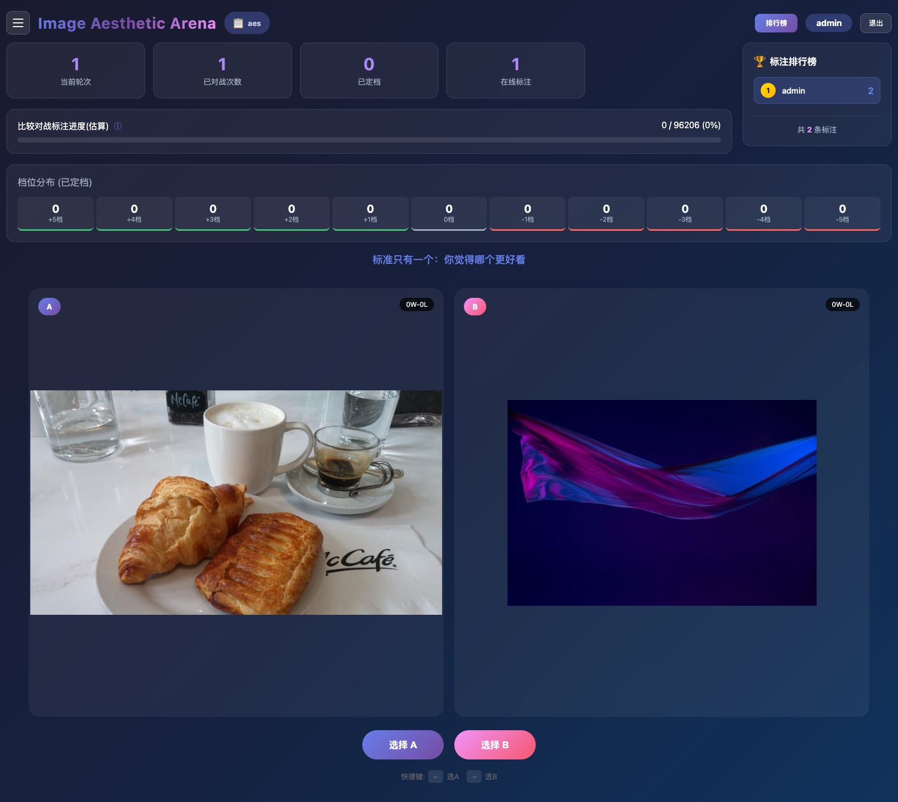

# Aesthetic Scoring（美的スコアリング）

**Aesthetic Scoring（美的スコアリング）** とは、**画像がどれだけ「美しい」かを 1 つのスカラーで予測するモデル**、およびそれを学習するためのアノテーション方法論を指す。生成モデルの研究では地味な脇役に見えるが、実際には **2 箇所で決定的な役割を果たしている**。

1. **学習データの選別**（[[data-curation]]）：数十億枚の候補から何を残すかを決める。
2. **事後学習の報酬**（[[reinforcement-learning-for-diffusion]]）：RLHF や DPO で「良い画像」の定義そのものになる。

つまり美的スコアリングモデルは、**モデルが何を見て育ち、何を目指して最適化されるかの両方を規定する**。にもかかわらず、多くのレポートでは「LAION の美的分類器を使った」の一行で済まされてきた。本 wiki のランドマークは **ERNIE-Image**（[[summaries/2026-ernie-image]]）で、この道具を主題として扱い、既存予測器を実名で批判し、代替モデル（ERNIE-Image-Aes）とベンチマーク（ERIA-1K）を公開した最初の原典である。

## なぜ「美しさ」を測るのが難しいのか

美的評価には、他の視覚タスクにない固有の困難がある。

**(1) 正解がない。** 物体検出には正解の箱があり、OCR には正解の文字列がある。美しさには存在しない。あるのは**人間の判断の集約**だけで、その判断自体が個人・文化・文脈で揺れる。

**(2) 評価者の基準が動く。** これが実務上いちばん厄介である。1〜10 の点数を独立に付けさせる **Likert 尺度**の絶対評価は直感的で効率的だが、**スコアドリフト**——アノテータの暗黙の基準点が時間とともに移動し、**単一のセッション内でさえ初期と後期のラベルが不整合になる**——を被る。50 枚目に付けた「7 点」と 500 枚目の「7 点」が同じ意味を持たない。

**(3) 学習データの分布がそのままバイアスになる。** 美的予測器は「何を美しいとするか」を学習データから学ぶので、データの偏りが直接そのモデルの偏りになる。しかもその偏りは、**そのモデルで選別された次世代の学習データへ伝播する**。

## 既存予測器のバイアス — 名指しの検討

**LAION-Aesthetic**（LAION の美的予測器）は本 wiki が繰り返し出会ってきた道具である。Wan（[[summaries/2025-wan]]）が「基本的次元」のフィルタで使い、Z-Image（[[summaries/2025-z-image]]）と HiDream-I1（[[summaries/2025-hidream-i1]]）もデータパイプラインに組み込んでいる。**数十億枚規模の選別がこの 1 つのモデルに委ねられてきた**。

ERNIE-Image はこれを正面から検討した。

| 予測器 | 指摘されたバイアス | ERIA-1K の SRCC |
| --- | --- | --- |
| **LAION-Aesthetic** | **AI 生成コンテンツとアニメに不釣り合いに高いスコア**。学習データが AI 生成コミュニティ由来であることの直接の帰結。カジュアルなスナップショットも過大評価 | **0.2944** |
| **ArtiMuse** | **白黒写真を偏愛**。公園での素人の集団ダンス写真のような日常的な写真にも一貫して高得点 | 0.4277 |
| **UniPercept** | 同じく白黒偏重に加え、日常のスナップショットを過大評価 | 0.4533 |
| **ERNIE-Image-Aes** | — | **0.7445** |

**LAION-Aesthetic の SRCC 0.29 という数字の含意は大きい**。順位相関 0.29 は「人間の判断とほとんど一致しない」水準である。各社が「高品質データで学習した」と述べるとき、その「品質」の一部がこの予測器で定義されているなら、**主張の足場が想定より弱い**ことになる。

さらに厄介な循環がある。LAION-Aesthetic が **AI 生成画像に高い点を付ける**傾向を持つ以上、それを品質フィルタに使うと**AI 生成画像が優先的に残る**。Wan が「生成画像による 10% 未満のわずかな混入でもモデルの性能を著しく劣化させうる」と報告し、各社が AIGC 検出器を別途学習していること（[[data-curation]]）と考え合わせると、**美的フィルタと AIGC フィルタが逆方向に引き合っている**構図が見える。

## アノテーションをどう設計するか

ERNIE-Image の §3.1 は、この種の作業の設計指針としてそのまま再利用できる。

### ペアワイズを選ぶ

絶対評価（Likert）のスコアドリフトを避けるため、**「2 枚のうちどちらが美しいか」という二値の判断**に還元する。各判断が局所的に接地されるので、基準点の移動に強い。アノテーション画面には「基準はただ一つです：どちらがより美的に心地よく見えると思いますか？」という一行だけを置く。

<figure>

<figcaption>図3（引用, [[summaries/2026-ernie-image]] より）: アノテーションのインターフェース。2 枚の画像の上に、そのセッションの判断基準を思い出させる一行のテキストだけが置かれる。</figcaption>
</figure>

### Elo ではなくスイス式トーナメント

ペアワイズを採ると、次は「どのペアを当てるか」が問題になる。

- **Elo レーティング**：各比較が両者のスコアを更新する。理論的には十分に裏付けられているが、**安定した順位を得るのに画像あたり法外に多くの比較を要する**。大規模なアノテーションでは非実用的。
- **スイス式トーナメント**：各ラウンドで**現在の順位が近いもの同士を当てる**。強い者どうし・弱い者どうしを戦わせるので、順位の決定に効く情報が集中し、**大幅に少ない総比較数で信頼できるランキング**が得られる。ERNIE-Image はこれを採る（ゲームのランクマッチングでの利用に着想を得たと述べる）。

直感的には、100 枚を順位付けするとき、1 位候補と 100 位候補を戦わせても情報がほとんど増えない——結果が分かりきっているからである。スイス式は「まだ順位が確定していない境界」に比較を投入する。

### 品質管理の 2 つの知見

ERNIE-Image が報告する 2 点は、方法論として特に価値がある。

**(1) アノテータには事前の較正テストが必須。** 「美的感度は個人によって相当に異なり、**訓練だけでは確実には改善できない**」——だから育てるのではなく**選抜する**。ERIA-1K のアノテータは中央美術学院・四川美術学院・中国伝媒大学などの美術／デザイン／写真の専門的背景を持つ者から募集され、全員が較正の選抜を通過している。

**(2) 複数人が同一トーナメントを共同でアノテートすると破綻する。** 異なるアノテータの暗黙の基準が互いに干渉し、結果が不整合になる。代わりに **1 人が指定された部分集合について完全なトーナメントを独立に完走**し、異なるアノテータのラベルは**後でデータセットの水準で集約**する。

後者は一般化できる原則を含んでいる——**集約は最後にやる**。個々の評価者は自分の内部で一貫していればよく、評価者間の一貫性を途中で強制しようとすると両方失う。

## ベンチマークの偏り

美的スコアリングモデルを評価するベンチマーク自体にも偏りがある。既存のものは Flickr や DPChallenge から構築されることが多く、**専門的な写真コミュニティ・西洋の写真の伝統・視覚的に洗練されたコンテンツへ偏る**。そのため、そこで高得点を取るモデルでも、日常のスナップショット・白黒画像・AI 生成コンテンツといった過小に表現された領域では系統的なバイアスを示しうる。

**ERIA-1K**（ERNIE-Image-Aes-1K）はこれに対して、比率を**実世界の分布に近似するよう較正する**：写真 49.3%、イラスト／アニメ 23.2%、グラフィックデザイン／ポスター 11.1%、混合 Web 画像 10.4%、フィルム写真 5.4%、製品／コレクタブル 0.6%。1,000 枚、1〜10 の階層ラベル。公開されている。

「専門家が良いと言う画像」ではなく「実際に流通している画像」で測る、という方針の転換であり、[[text-to-image-generation]] で見た **bakeyness** の批判（単一の選好軸が「AI っぽい美学」に報いてしまう・[[summaries/2025-flux-kontext]]）と同じ問題意識——**評価軸そのものが何に報いているかを問う**——の別の現れである。

## 学習パイプラインの中での使われ方

美的スコアはフィルタ（閾値以下を捨てる）としてだけでなく、**サンプリング確率**としても使える。ERNIE-Image の階層的サンプリングが具体例である。

- **カテゴリ間**：各カテゴリのサンプリング重みを、**コーパス規模と集約された美的品質の両方**で決める。高頻度カテゴリの支配を防ぎつつ、視覚品質の高いカテゴリに多くの確率質量を割り当てる。
- **カテゴリ内**：個々の画像を美的スコアに従ってサンプリングする。高品質な事例が学習中により頻繁に現れる。

単なる足切りより情報を捨てずに済む設計である。ただし**多様性への影響**は注意が要る——美的スコアで上位を厚くサンプリングすれば分布は狭まる。Z-Image と ERNIE-Image がどちらも OneIG の Diversity で低い値を記録していること（[[summaries/2025-z-image]]、ERNIE-Image-Turbo は 0.123）は、この設計と無関係ではないだろう。

もう一方の使い道が**報酬モデル**である。Qwen-Image-2.0（[[summaries/2026-qwen-image-2]]）の 5 報酬にも、HiDream-O1-Image（[[summaries/2026-hidream-o1-image]]）の 4 報酬にも、Z-Image の 3 次元にも「美的品質」が入っている。ERNIE-Image は DPO で美的選好を直接最適化する。**データ選別で使う美的モデルと、報酬で使う美的モデルが同じものである**場合、モデルは「自分を選んだ基準」に向かって最適化されることになり、循環が閉じる。この点を明示的に論じたレポートはまだない。

## 限界と未解決問題

- **自己循環的な評価**。ERNIE-Image-Aes は内部でアノテートされたデータで学習され、**同じチームが同じスイス式プロトコルで同種のアノテータに作らせた** ERIA-1K で評価される。競合との 0.3 ポイント差の一部は、**プロトコルと評価者集団の一致**によるものかもしれない。既存の美的データセット（AVA 等）での評価がないため切り分けられない。
- **「一般大衆の選好」を誰が代表するのか**。ERNIE-Image は既存ベンチマークの「西洋の写真の伝統」への偏りを批判し、「一般大衆の選好により忠実」と主張するが、そのアノテータは中国の美術系機関の専門家である。**偏りを別の偏りで置き換えていないか**は開かれた問いである。文化圏をまたぐ美的評価の一致度は測られていない。
- **スカラー 1 つで足りるのか**。構図・色・照明・被写体・技術的品質は独立に良し悪しがありうるが、実装はほぼすべて 1 次元に潰す。ERNIE-Image も 1〜10 の階層ラベルである。
- **AI 生成画像の扱いが未解決**。LAION-Aesthetic の AIGC バイアスは指摘されたが、「AI 生成画像を美しいと判定すべきか」自体は規範的な問いである。学習データから排除したい（[[data-curation]]）一方で、生成モデルの出力を評価する報酬としては AI 生成画像を正しく採点せねばならない——**同じモデルに矛盾する要求が課されている**。
- **公開されているものが少ない**。LAION-Aesthetic 以外の高品質な美的モデルはほぼ非公開で、各社が内製している。ERNIE-Image-Aes と ERIA-1K の公開はこの状況への貢献だが、ERIA-1K に含まれる実写画像の権利処理には触れられていない。
- **時間変化**。美的な流行は変わる。ある時点でアノテートしたデータで学習したモデルが何年通用するかは検討されていない。

## 既存知識との接続

- [[data-curation]]：美的スコアは品質フィルタの中心的な信号である。本ページはその信号自体の信頼性を問う。LAION-Aesthetic の SRCC 0.29 は、あちらで整理した「品質フィルタリング」の足場に直接関わる。
- [[reinforcement-learning-for-diffusion]]：美的品質はほぼすべての報酬モデルに含まれる。Qwen-Image-2.0 の 5 報酬、HiDream-O1 の 4 報酬、Z-Image の 3 次元、ERNIE-Image の DPO。**報酬モデルの質が事後学習の上限を決める**以上、ここは事後学習の議論の前提でもある。
- [[text-to-image-generation]]：「良い画像とは何か」を問うという点で、bakeyness の批判（[[summaries/2025-flux-kontext]]）と同じ系譜にある。あちらは評価プロトコルの偏りを、こちらは評価モデルの偏りを扱う。
- [[prompt-enhancement]]：PE は「美的な強化」を推論連鎖の一段階として明示的に持つ（Z-Image）。何を美しいとするかの定義は、ここにも埋め込まれている。
- [[diffusion-distillation]]：蒸留と SFT は多様性を削る傾向があり、美的スコアによる厚いサンプリングはそれを加速しうる。品質と多様性のトレードオフが、データ選別の段階から効いている。

## 参考文献（summaries）

- [[summaries/2026-ernie-image]] — ERNIE-Image（**本概念の主題化**。スイス式トーナメントによるアノテーション、既存予測器の名指しの批判、ERIA-1K の公開、SRCC 0.7445）
- [[summaries/2025-z-image]] — Z-Image（美的スコアを品質フィルタとして使用。専門アノテータのラベルで学習した自社モデル）
- [[summaries/2025-wan]] — Wan（LAION-5B の美的分類器を「基本的次元」のフィルタに使用）
- [[summaries/2026-qwen-image-2]] — Qwen-Image-2.0（美的品質を 5 つのタスク特化報酬の 1 つとして RLHF に組み込む）

> 未取り込みの主要原典：LAION-Aesthetic Predictor、AVA データセット（Murray ら 2012）、ArtiMuse、UniPercept、MANIQA / MUSIQ（画質評価。Wan-Bench が使用）、HPSv2 / HPSv3（人間選好スコア）。今後の ingest で本ページへ追記する。
