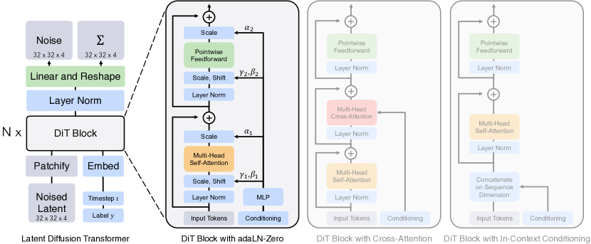
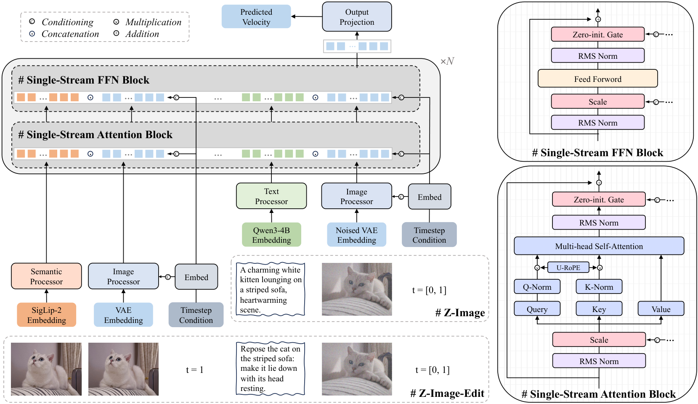

# Diffusion Model Architecture（拡散モデルのアーキテクチャ）

**Diffusion Model Architecture（拡散モデルのアーキテクチャ）** とは、拡散モデルの心臓部である**ノイズ予測ネットワーク $\epsilon_\theta(\mathbf{x}_t,t)$**——ノイズの乗った画像とその時刻（必要ならクラスやテキストなどの条件）を入力に、そこに乗っているノイズ（＝スコア）を出力するニューラルネット——の設計を指す。拡散モデルでは「学習目的」（[[denoising-diffusion]]）と「サンプラー」（[[diffusion-sampling]]）が分離して論じられるが、**生成品質を最終的に決めるのはこのネットワーク自身の表現力**でもある。実際、Dhariwal & Nichol の **ADM（"Diffusion Models Beat GANs", 2021）** は、サンプリングや目的関数を変えずに**アーキテクチャ改良だけで FID を大きく押し下げ**、拡散モデルが GAN を超える土台を作った（[[summaries/2021-adm]]）。

本ページは拡散モデルのバックボーン設計を 2 つの柱で扱う。(1) 長く標準だった **U-Net** 系の改良の系譜（DDPM → IDDPM → ADM）と、(2) それを覆した **Transformer への転回（DiT）**——U-Net の帰納バイアスは必須でなく、Transformer に置き換えるとスケーラビリティの恩恵を受けられる、という転換である。

## なぜ U-Net なのか

拡散モデルのノイズ予測は「画像と同じ解像度の出力（＝各ピクセルのノイズ）を返す」**画像→画像（dense prediction）**タスクである。これに適すのが **U-Net**：ダウンサンプリングで解像度を下げながら特徴を抽象化するエンコーダと、アップサンプリングで解像度を戻すデコーダを、同解像度の層同士を結ぶ**スキップ接続（skip connections）**でつないだ構造。スキップ接続が細部（高周波）情報を保ち、エンコーダ側で得た大域文脈と合流させられるため、ノイズ除去に向く。拡散 U-Net には共通して次の要素が入る：

- **時刻埋め込み（timestep embedding）**：時刻 $t$ を正弦波で埋め込み、各残差ブロックに注入する。「いまどれだけノイズが乗った段階か」をネットに伝える。
- **残差ブロック（residual blocks）**：各解像度に複数積む。
- **自己注意（self-attention）**：低〜中解像度の特徴マップに大域的な依存を入れる。

## 改良の系譜

### DDPM の U-Net（Ho ら 2020）

拡散モデルに U-Net を持ち込んだ起点（[[denoising-diffusion]], [[summaries/2020-ddpm]]）。残差ブロック＋ダウン/アップサンプリング畳み込みに、**16×16 解像度で単一ヘッドの大域 self-attention** を 1 つ置き、時刻埋め込みを各ブロックに加える、という比較的素朴な構成。

### IDDPM（Nichol & Dhariwal 2021）

分散 $\Sigma_\theta$ を定数固定せず**学習（learned variance）**し、cosine ノイズスケジュールと $L_\text{simple}+\lambda L_\text{vlb}$ のハイブリッド目的を導入。少ステップサンプリングを改善した（ADM はこの分散学習を継承）。専用ページは設けず本項に記す。

### ADM（Dhariwal & Nichol 2021）——本概念のランドマーク

ADM は ImageNet 128×128 で系統的なアブレーション（[[summaries/2021-adm]] 表1〜3・図2）を行い、U-Net を次のように作り替えた。これが「拡散が GAN を超えた」要因の半分（残り半分は [[classifier-guidance]]）。

- **多解像度アテンション（multi-resolution attention）**：self-attention を 16×16 のみ → **32×32 / 16×16 / 8×8** の複数解像度に拡張。
- **アテンションヘッドの最適化**：ヘッド数を増やすか、ヘッドあたりチャネルを減らすほど FID が改善。最終的に**ヘッドあたり 64 チャネル**を既定に（Transformer 流）。
- **BigGAN residual block** をアップ/ダウンサンプリングに採用。
- **深さ vs 幅**：深くすると効くが学習が遅いため不採用。残差接続の $1/\sqrt2$ リスケールは効かず不採用。
- **Adaptive Group Normalization（AdaGN, 適応的グループ正規化）**：時刻埋め込みとクラス埋め込みを線形射影して $y=[y_s,y_b]$ を作り、GroupNorm 後の活性 $h$ に

$$
\text{AdaGN}(h,y)=y_s\,\text{GroupNorm}(h)+y_b
$$

として注入する（FiLM・adaptive instance norm に類似）。単純な「加算＋GroupNorm」より FID が良い。条件（時刻・クラス）を正規化のスケール／シフトとして効かせるのがポイント。

この最終構成（可変幅・解像度あたり 2 残差ブロック・多解像度 attention・BigGAN resblock・AdaGN）が、その後の拡散モデルの事実上の標準アーキテクチャになった。

### SDXL（Podell ら 2023）——改良 U-Net をスケールする

DiT が U-Net を捨てる一方、**SDXL** は ADM 系の改良 U-Net を**そのままスケール**する道を採った（[[latent-diffusion]] の代表的後継モデル・[[summaries/2023-sdxl]]）。Stable Diffusion の U-Net を 860M → **2.6B**（約 3×）に大型化したが、単純に各レベルを厚くするのでなく、**transformer block を低レベル特徴に集中させる不均一配分** `[0, 2, 10]`（最高解像度レベルの transformer block を省略、最低レベル＝8× ダウンサンプリングを撤去）を採る（simple diffusion 流。channel mult. も `[1,2,4]`）。条件付けは CLIP ViT-L ＋ OpenCLIP ViT-bigG の 2 エンコーダ出力連結（context dim 2048）＋ pooled text embedding を timestep embedding に加算する形に拡張した。

注目すべきは、SDXL が探索段階で **UViT や DiT のような transformer ベースを試したが「即座の利点は見出せなかった」**とし、改良 U-Net に留まった点である（[[summaries/2023-sdxl]] §3）。同時期に DiT が「U-Net 不要」を示したのと対照的で、U-Net の作り込み（ADM→SDXL）と Transformer 化（DiT）が 2023 年時点で併存していたことを示す。

## Transformer への転回：DiT（Peebles & Xie 2023）——本概念の第 2 のランドマーク

ADM までの改良はすべて「U-Net をどう良くするか」だったが、**DiT（Diffusion Transformer）** はそもそも U-Net を捨てた。「拡散モデルに U-Net の帰納バイアスは本当に必要か？」という問いに対し、**バックボーンを Vision Transformer（ViT）に丸ごと置き換えても、むしろ Transformer 由来の優れたスケーリング性が得られる**ことを示した（[[summaries/2023-dit]]）。拡散の数学（ε／Σ 予測・$L_\text{simple}$）も CFG も [[latent-diffusion]] の VAE 潜在空間も既存のまま、**変えたのはネットワークだけ**である。

- **patchify**：VAE 潜在（例 32×32×4）をパッチサイズ $p$（=2/4/8）でパッチに切り、線形埋め込み＋ViT の正弦波位置埋め込みでトークン列にする。トークン数 $T=(I/p)^2$。$p$ を半分にすると $T$ が 4 倍＝計算量（Gflops）が 4 倍になるが、パラメータ数はほぼ不変。
- **DiT block の条件付け**：時刻 $t$・クラス $c$ の注入方式を 4 種比較（in-context / cross-attention / adaLN / **adaLN-Zero**）。**adaLN-Zero** が最良——adaLN（LayerNorm のスケール $\gamma$・シフト $\beta$ を条件から回帰）に加え、残差直前のスケール $\alpha$ も回帰し、**$\alpha$=0 初期化で各ブロックを恒等写像から開始**する（ADM 系 U-Net の「残差前の層をゼロ初期化」を Transformer に移植したもの）。ADM の AdaGN と同じ「条件を正規化のスケール／シフトで効かせる」発想が、ここでも最良の条件付けとして再発見されている。
- **スケーラビリティが主役**：モデル Gflops（深さ・幅 or トークン数）と FID に**強い負の相関**があり、パラメータ数ではなく **Gflops** が品質を決める。S/B/L/XL × patch 2/4/8 の系統的スイープでこれを実証。
- **成果**：DiT-XL/2 が class-conditional ImageNet 256 で **FID 2.27**（ADM・LDM を更新、当時 SOTA）、512 で 3.04。しかも 118.6 Gflops と、ADM（1120 Gflops）より遥かに compute 効率が良い。

<figure>

<figcaption>図3（引用, [[summaries/2023-dit]] より）: DiT アーキテクチャ。潜在を patchify → N 個の DiT ブロック → 線形デコードでノイズ＋共分散を出力。ブロックは adaLN-Zero（最良）・cross-attention・in-context の変種。</figcaption>
</figure>

DiT は「拡散のバックボーンは U-Net である必要はない」ことを決定づけ、その後の **Stable Diffusion 3・PixArt-α・Sora（動画）** など主要モデルが DiT 系アーキテクチャを採用する転換点になった。改良 U-Net（ADM）と Transformer（DiT）が、拡散モデルのバックボーン設計の 2 大系譜である。

### MM-DiT（Multimodal DiT, Esser ら 2024）——DiT のマルチモーダル拡張

DiT はクラス条件付き生成のために設計され、テキストのような系列条件は cross-attention で一方向に注入するのが通例だった。**MM-DiT（Multimodal Diffusion Transformer）** は、Stable Diffusion 3（[[summaries/2024-sd3]]）で導入された DiT の発展形で、**テキストと画像という 2 つのモダリティに別々の重みの組**を与える。

- **2 ストリーム＋共有 attention**：画像トークンとテキストトークンを各々別の重みで処理しつつ、**attention 演算のときだけ両系列を連結**して双方向に情報を混ぜる（実質「2 つの独立 transformer が attention で握手する」）。固定テキスト表現の一方向 cross-attention より、テキスト理解・タイポグラフィ・人間選好が向上。DiT は「全モダリティで 1 組の重みを共有する MM-DiT の特殊ケース」と位置づけられる。
- **条件付け**：DiT 同様、時刻 $t$ と pooled テキスト $c_{\text{vec}}$ を adaLN 風の変調に入れ、加えて系列テキスト $c_{\text{ctxt}}$ をトークンとして供給する（pooled だけでは粗いため）。
- **QK-normalization**：高解像度で mixed-precision 学習が発散する問題（attention logit の増大不安定性）を、attention 前に Q・K を RMSNorm することで防ぐ。識別的 ViT 文献（Dehghani ら）の知見の移植。
- **スケーリング**：深さ $d$ で hidden=$64d$・ヘッド数=$d$ とパラメータ化し 8B までスケール。検証損失が人間評価・ベンチマークと強く相関し飽和しない。

MM-DiT は DiT を text-to-image のマルチモーダル性に合わせて拡張したもので、本 wiki のアーキテクチャ系譜「改良 U-Net（ADM）→ SDXL（U-Net スケール）→ DiT（Transformer 化）→ MM-DiT（マルチモーダル化）」の主要な地点にあたる。詳細は [[summaries/2024-sd3]]。

### FLUX.2（Black Forest Labs 2025–2026）——二相構成を保ち、条件付けを作り替える

**FLUX.2**（[[summaries/2025-flux2]]）は FLUX.1 の二相構成（`DoubleStreamBlock` → `SingleStreamBlock`）をそのまま保つ。本 wiki で唯一、**技術報告書がなくリファレンス実装が一次資料**の原典である。

| | dev | klein 9B | klein 4B |
| --- | --- | --- | --- |
| hidden_size / heads | 6144 / 48 | 4096 / 32 | 3072 / 24 |
| double / single ブロック | **8 / 48** | **8 / 24** | **5 / 20** |
| guidance 埋め込み | あり | なし | なし |

変わったのは**条件付けの機構**である。

**(1) 変調が全ブロックで共有される。** FLUX.1 にあったブロックごとの `img_mod.lin` / `txt_mod.lin` は**存在しない**。変調ベクトルはモデルの最上位で 1 回だけ作られ（`double_stream_modulation_img/txt`、`single_stream_modulation`）、同じタプルが全ブロックへ渡される。DiT 全体で変調に使われる重みは `final_layer.adaLN_modulation.1` を含め**計 4 行列だけ**である。

これで本 wiki に**3 例目**が揃った——Wan は adaLN の MLP を全層共有し（[[summaries/2025-wan]]）、Z-Image は変調射影の下方射影を全層共有にした（[[summaries/2025-z-image]]）。**「条件付け機構は思ったより安く済ませてよい」という判断が、独立した 3 チームから重ねて出ている。** 単なる省パラメータの工夫ではなく、設計の定石になりつつあると見てよい。

**(2) pooled テキストベクトルの廃止。** FLUX.1 の `vec_in_dim` / `y`（pooled CLIP 埋め込み）は FLUX.2 に存在しない。変調ベクトルは時刻（＋ dev では guidance）だけから作られ、テキストは `txt_in` の 1 経路のみで入る。SD3 が pooled と系列の 2 経路を持っていた（[[summaries/2024-sd3]]）ところからの単純化である。

**(3) テキストエンコーダは LLM の中間 3 層の連結。** 最終層は使わない（Mistral-Small-3.2-24B なら層 10/20/30、Qwen3 なら 9/18/27）。「LLM の最終層は次トークン予測に特化しており、中間層の方が意味を保持している」という判断で、**decoder-only LLM をテキストエンコーダに使う**潮流（Sana → Qwen-Image → HunyuanImage 3.0 → ERNIE-Image → Z-Image）に**どの層を取るか**という新しい設計変数を加えた。

### Sana の Linear DiT（NVIDIA / MIT 2024）——注意そのものを安くする

ここまでの改良（MM-DiT・二重ストリーム・MoE）は、**注意演算そのものはフル注意のまま**、その周りの構成を組み替えるものだった。**Sana**（[[summaries/2024-sana]]）はその前提を外し、**DiT 内のすべての通常の注意を線形注意に置き換える**。

- **ReLU 線形注意**：softmax を ReLU カーネルに置換し、行列積の結合則で $\sum_j \text{ReLU}(K_j)^\top V_j$（クエリに依存しない $d \times d$ 行列）を先に計算する。計算量は $O(N^2 d) \to O(N d^2)$ になり、系列長 $N$ に**線形**。
- **Mix-FFN**：線形注意に置き換えるだけでは FID 18.7 → 21.5 と明確に劣化する。Sana は FFN の中に **3×3 depthwise convolution**を挟んだ Mix-FFN でこれを補償し、18.9 まで戻す。softmax が持っていた「少数トークンへの鋭い集中」という局所性を、畳み込みの帰納バイアスで代替した形である。
- **NoPE**：Mix-FFN の畳み込みが空間的な隣接関係を暗黙に伝えるため、**位置符号化を削除できる**（[[position-embedding]]）。ただし 2K/4K の微調整では PE を再導入している。

本ページの他の改良と決定的に異なるのは、**得られる効果が解像度に強く依存する**ことである。512px での対 FLUX-dev 高速化は 44.5× だが、4096px では **104×** に伸びる。$O(N^2)$ と $O(Nd^2)$ の差は $N \gg d$ でしか現れないので当然だが、裏返せば **1024px 以下が主戦場のモデルには動機が弱い**。実際、2025–2026 の大規模モデル（FLUX.1・Qwen-Image・HunyuanImage 3.0・Z-Image）はいずれもフル注意を保ち、効率は FlashAttention と FP8、そしてトークナイザ側の圧縮（[[image-tokenizer]]）で稼いでいる。注意の計算量に対する各種の答えは [[efficient-attention]] に集約した。

### Qwen-Image（Qwen Team 2025）——条件エンコーダの置換と MSRoPE

**Qwen-Image**（[[summaries/2025-qwen-image]]）は MM-DiT（20B・60 層）を踏襲しつつ、周辺の 2 点を作り替えた。

- **条件エンコーダ = 凍結マルチモーダル LLM**：CLIP や T5 を並べる代わりに **Qwen2.5-VL（7B）を凍結して 1 本だけ**使い、最終層の隠れ状態を条件表現にする。視覚-言語が整合済みで、かつ画像入力を受けられるため、同じ骨格のまま画像編集（[[instruction-based-image-editing]]）へ拡張できる。編集時は入力画像を **MLLM 側（意味）と VAE 側（画素）の二重符号化**で両ストリームに流す。
- **MSRoPE（Multimodal Scalable RoPE）**：MM-DiT でテキストと画像の位置符号化をどう共存させるかという問題への回答。従来は平坦化した画像位置の後ろにテキストを連結し、Seedream 3.0 の Scaling RoPE は画像位置を中心にずらしてテキストを [1, L] の 2D トークンとして扱ったが、後者では**テキストと画像 0 行目の位置符号化が同型になり区別できない**。MSRoPE はテキストを「縦横で同じ位置 ID を持つ 2D テンソル」＝**画像の対角線上に並ぶもの**として扱い、画像側の解像度スケーリングの利点を保ちつつテキスト側を 1D-RoPE と機能的に等価に保つ。編集タスクでは **frame 次元**を足して編集前後の画像を区別する。

正規化は QK-Norm に RMSNorm、その他は LayerNorm を使う（SD3 の QK-normalization を踏襲）。位置符号化がアーキテクチャ設計の主戦場になった点で、[[visual-text-rendering]]（文字と画像の対応づけ）とも直結する。

### Qwen-Image-2.0（2026）——同時学習を安定させる細部

**Qwen-Image-2.0**（[[summaries/2026-qwen-image-2]]）は MSRoPE を継承しつつ、条件エンコーダを Qwen3-VL に更新し、**テキスト・画像の同時学習を安定させるための 2 つの細部**を導入した。いずれも「大規模な joint training で何が壊れるか」への対処であり、MM-DiT 系の実装知見として重要である。

- **バイアスなし変調（bias-free modulation）**：DiT 以来の条件付けは adaLN 系のアフィン変調 $h'=\alpha h+\beta$ が定番だったが、**バイアス項 $\beta$ を落として純粋な乗法 $h'=\alpha h$** にする。
- **SwiGLU**：テキストと画像を同時に学習すると**活性値の大きさが過大になり、ニューロンが早期に飽和する**問題を観察したため、MLP 層の活性化を $h=\Phi_1(x)\otimes\sigma(\Phi_2(x))$（$\sigma$ は SiLU）のゲート付き形式に置き換える。

加えてアーキテクチャ全体では、**画像トークナイザを 16 倍圧縮（f16c64）に切り替えた**ことが効いている（[[image-tokenizer]]）。DiT の計算量は潜在トークン数に対して二次的なので、$f8\to f16$ で系列長 1/4・計算量約 1/16 となり、**ネイティブ 2K 生成が現実的になる**。バックボーン側の工夫だけでなく、トークナイザ側の圧縮率がアーキテクチャの到達点を規定する好例である。

### FLUX.1 / FLUX.1 Kontext（Black Forest Labs 2024–2025）——二重ストリームの後に単一ストリームを積む

SD3 と同じ系譜（Black Forest Labs）から出た **FLUX.1**（[[summaries/2025-flux-kontext]]）は、MM-DiT の「2 ストリーム」を**途中で 1 本に畳む**構成を採る。

- **double stream → single stream**：前半は MM-DiT と同じく画像とテキストに別重みを与え attention でのみ混ぜる。その後**両系列を連結して 38 個の single stream ブロック**で処理し、最後にテキストトークンを捨てて画像を復号する。序盤はモダリティごとの専用処理、終盤は統合処理、という役割分担である。
- **fused feed-forward ブロック**：single stream の GPU 利用率を上げるため、(i) 変調パラメータ数を半減し、(ii) **attention の入出力線形層を MLP のそれと融合**して行列積を大きくする。演算の「数」ではなく「粒度」を上げて実効効率を稼ぐ工夫。
- **因子分解 3D RoPE**：各潜在トークンを時空座標 $(t,h,w)$ で添字づける（単一画像なら $t\equiv0$）。

この 3D RoPE が、後継の **FLUX.1 Kontext** で効いてくる。コンテキスト画像のトークンに**時間軸方向の定数オフセット**（対象は $t=0$、$i$ 番目のコンテキストは $t=i$）を与えるだけで、空間構造を保ったまま文脈と対象を分離できる——著者らのいう「**仮想タイムステップ**」である。Qwen-Image が MSRoPE に **frame 次元**を足して同じ問題（複数画像を 1 本の系列でどう区別するか）を解いたのと、独立に到達した同型の答えになっている。位置符号化が**マルチモーダル化・多画像化の主戦場**であることを、2 系統がそろって示している。

### HiDream-I1（HiDream.ai 2025）——FFN 自体を疎にする

ここまでの改良は「ブロックをどう並べるか」「条件をどう注入するか」が中心だったが、**HiDream-I1**（[[summaries/2025-hidream-i1]]）は **FFN の内部構造**に手を入れた。FLUX.1 と同じ dual-stream → single-stream の骨格を保ったまま、FFN を疎な **MoE（Mixture-of-Experts, 混合エキスパート）** に置き換える——複数の並列 FFN を並べ、ルーターがトークンごとに一部だけを通すことで、**総容量は増やすが 1 トークンあたりの計算量は据え置く**。詳細と留保は [[mixture-of-experts-diffusion]] にまとめた。

テキスト符号化の設計判断も対照的で記録に値する。Qwen-Image が「条件エンコーダを凍結 MLLM 1 本に集約する」という**引き算**を選んだのに対し、HiDream-I1 は **Long-CLIP L/14・Long-CLIP G/14・T5-XXL・Llama 3.1 8B の複数中間層**の 4 系統を混ぜる**足し算**を選ぶ。LLM の最終層ではなく**中間層を複数タップする**（最終層では薄まる細粒度の意味を残す狙い）点が特徴的である。同じ年に正反対の答えが出ており、決着はついていない。

### HiDream-O1-Image（2026）——LLM をそのまま拡散バックボーンにする

**HiDream-O1-Image**（[[summaries/2026-hidream-o1-image]]）は、この系譜からさらに逸れる。バックボーンは DiT ではなく **LLM そのもの**——decoder-only Transformer（8B 版は Qwen3-VL-8B-Instruct から初期化）で、RMSNorm・SwiGLU・RoPE という言語モデルの標準構成をそのまま使う。

本ページの文脈で決定的なのは、**adaLN による変調を使わない**ことである。DiT が adaLN-Zero で確立し、MM-DiT・Qwen-Image・FLUX.1 が受け継いできた「タイムステップと大域条件から scale/shift を作って正規化に流す」という条件付けの定番を捨て、**拡散のタイムステップを「特別なトークン 1 個」として系列に混ぜる**。これにより Transformer の中核構造を一切改変せずに済み、200B+ へのスケールが素直になる、というのが著者らの論拠である。

注意機構も作り変えられている。言語モデリングの因果マスクと拡散の完全注意は本来相容れないが、**条件・テキストトークンには因果マスク、生成トークンには完全注意**という**ハイブリッド注意**で 1 つの注意行列の中に同居させる。あわせて VAE も捨てているため、この設計全体は [[pixel-space-diffusion]] で扱う。

### Wan（Alibaba 2025）——動画では MM-DiT が自明な最適解ではない

**Wan**（[[summaries/2025-wan]]）は動画拡散（[[video-diffusion]]）の基盤モデルだが、本ページにとって重要なのは**画像側で決着したように見えた設計判断が、動画という条件下で差し戻されている**点である。

- **cross-attention 型を選ぶ**。SD3 以降の主流は MM-DiT（テキストと画像を連結して完全注意で混ぜる）だが、Wan は元の DiT 流に **cross-attention でテキストを入れる**。理由は「長い文脈のモデリング下でも指示追従を確保できるから」——視覚トークンが数十万に達するところへテキスト 512 トークンを連結すると、**テキストが視覚に飲み込まれる**という判断だと読める。系列長がモダリティ融合の設計を左右する、という論点は画像だけを見ていては現れない。
- **full spatio-temporal attention**。全フレーム・全空間位置が互いを見る自己注意で、二次コストを正面から払う。初期の動画モデルが採った「1D 時間注意 ＋ 2D 空間注意」への分解による軽量化を選ばない。
- **テキストエンコーダの選択を実験で決めている**。umT5（encoder-only）が Qwen2.5-7B・GLM-4-9B を上回り、理由として「**decoder-only の LLM は因果注意だが umT5 は双方向注意なので拡散モデルに適する**」が挙げられる。拡散の条件付けは「プロンプト全体を一度に見て意味を固める」作業なので、後ろを見られない表現は不利だ、という理屈である。HiDream-I1 の「4 系統を足す」と Qwen-Image の「凍結 MLLM 1 本」という対立に、**測って答えた**数少ない事例になっている。

#### adaLN のパラメータをどこに配分するか

本ページで追ってきた adaLN-Zero（DiT・[[summaries/2023-dit]]）以来の条件付けについて、Wan は再利用価値の高いアブレーションを提供する。adaLN の MLP をブロックごとに持つとパラメータを食うので、**MLP を全ブロックで共有し、ブロックごとに異なるバイアスだけを学習する**（PixArt の AdaLN-single 系）。

| 構成 | パラメータ | 学習損失 |
| --- | --- | --- |
| Full-shared-adaLN | 1.3B | やや高い |
| Half-shared-adaLN | 1.5B | 中間 |
| **Full-shared-adaLN（35 層へ深化）** | **1.5B** | **最低** |
| Non-shared-adaLN | 1.7B | Full-shared-1.5B に劣る |

**同一パラメータ数で比べると、adaLN に割くより層を深くする方が良い**。しかも 1.7B が 1.5B に負けるのだから、単なるパラメータ効率ではなく**配分の問題**である。25% の削減になる。FLUX.1 が変調パラメータ数を半減させた（fused feed-forward）のと同じ方向の知見で、**条件付け機構は思ったより安く済ませてよい**ことを示唆する。

### Z-Image の S3-DiT（Alibaba 2025）——二重ストリームを完全に畳む

**Z-Image**（[[summaries/2025-z-image]]）で、本ページが追ってきたモダリティ融合の系譜が一周する。

| 世代 | 構成 | 代表 |
| --- | --- | --- |
| 二重ストリーム | テキストと画像に別重み、attention でのみ混ぜる | SD3 の MM-DiT |
| 二重 → 単一の二段 | 前半は別重み、後半は連結して 1 本 | FLUX.1・HiDream-I1 |
| **完全な単一ストリーム** | **入口の 2 ブロックを除き最初から全部 1 本** | **Z-Image の S3-DiT** |

**S3-DiT**（Scalable Single-Stream DiT）は、テキストトークン・VAE 画像トークン・視覚意味トークン（編集時の SigLIP-2）を系列レベルで連結し、以降は**すべて共有重み**で処理する。モダリティごとの処理は入口の軽量なプロセッサ（各 2 ブロック）だけである。動機は HiDream-O1-Image と同じ「decoder-only LLM のスケーラビリティに倣う」だが、**あちらが VAE ごと捨てた**（[[pixel-space-diffusion]]）のに対し Z-Image は Flux VAE を流用して潜在空間に留まる——**単一ストリーム化とピクセル空間化は独立した判断である**ことを示す好例になっている。6.15B・30 層・隠れ次元 3840 で、テキストエンコーダは Qwen3-4B。

<figure>

<figcaption>図10（引用, [[summaries/2025-z-image]] より）: S3-DiT。左下の各プロセッサ（Semantic / Image / Text / Timestep）を通った異なるモダリティのトークンが 1 本の系列に連結される。右は Single-Stream ブロックの内部で、RMS Norm → Scale → 演算 → RMS Norm → ゼロ初期化ゲートという Sandwich-Norm 構造、Q-Norm/K-Norm、U-RoPE が見える。</figcaption>
</figure>

**位置符号化は 3D Unified RoPE**。画像トークンが空間 2 次元に展開する一方、**テキストトークンは時間次元に沿って増分する**——両者を同じ座標系に載せる工夫である。編集タスクでは参照画像と対象画像に**空間座標を揃えたまま時間次元で単位区間ずらし**、さらに参照には $t=1$（クリーン）、対象には $t\in[0,1]$（ノイズ付き）という異なる時間条件付けを与える。FLUX.1 Kontext の仮想タイムステップ（[[summaries/2025-flux-kontext]]）と同型の解に独立に到達している。

安定化は **QK-Norm ＋ Sandwich-Norm**（ブロックの入力**と出力の両方**を正規化して信号振幅を抑える）＋ 全正規化を RMSNorm、という 3 点セット。図 10 では出力側に**ゼロ初期化ゲート**が置かれており、ControlNet の zero convolution（[[controllable-generation]]）と同じ発想が層内部に持ち込まれている。

条件注入にも省パラメータの工夫がある。条件ベクトルからスケール／ゲートを作る射影を**低ランクの対に分解し、下方射影は全層で共有、上方射影だけ層ごと**にする。Wan が adaLN の MLP を全層共有した（[[summaries/2025-wan]]）のと同じ方向で、**条件付け機構は思ったより安く済ませてよい**という知見が別々のチームから重ねて出ていることになる。

ただし本ページの観点で重要な留保がある：**Z-Image は単一ストリームと二重ストリームの直接比較（アブレーション）を提示していない**。「密なモダリティ横断の相互作用によりパラメータ効率が高い」は設計上の理屈であって測定結果ではない。6B で Elo 4 位という結果は強いが、それが S3-DiT のおかげだと分離する証拠はない。

### HunyuanImage 3.0（Tencent 2025）——LLM 側から拡散へ寄る

本ページが追ってきたのは一貫して「**拡散モデルのバックボーンをどう作るか**」だった。**HunyuanImage 3.0**（[[summaries/2025-hunyuanimage-3]]）は出発点が逆で、**事前学習済みの MoE 大規模言語モデル（Hunyuan-A13B）に拡散を接ぎ木する**。詳細は [[unified-multimodal-generation]] に分離したが、本ページに関わる 3 点を挙げる。

**(1) 目的関数がトークンの種類で切り替わる。** テキストトークンは自己回帰的な次トークン予測、**画像トークンは拡散**。同じ Transformer の同じ重みが、2 つの異なる損失を受ける。HiDream-O1-Image も Z-Image も「テキストと画像を同じ系列に置く」ところまでは同じだが、**学習目的は拡散ひとつ**だった。ここが質的な違いである。

**(2) Generalized Causal Attention。** 言語モデリングの因果マスクと画像生成の完全注意を、1 つの注意行列の中で使い分ける——**テキストトークンは先行するトークンのみ、画像トークンは先行するすべて＋同じ画像セグメント内の後続する画像トークン**にも注意する。HiDream-O1-Image のハイブリッド注意と同型の解に独立に到達している。さらに多画像の学習時には、文脈中の生成画像が後続トークンから見えないよう**マスクに「穴」を空ける**必要が生じる（学習と推論の条件を揃えるため）。

**(3) 二重エンコーダ。** 条件画像について、VAE の潜在特徴と視覚エンコーダ（ViT）の特徴を**両方連結する**。従来の統一モデルが「理解には ViT 特徴、生成には VAE 特徴」とタスクごとに分離していたのに対し、常に両方を使うことでパイプラインの切り替えが不要になる。プロジェクタも 2 種類で、VAE 側は**タイムステップ変調された残差ブロック**、ViT 側は 2 層 MLP。

なお位置符号化の **Generalized 2D RoPE**（画像がなければ 1D RoPE に厳密に退化する設計）は、本ページで断片的に触れてきた MSRoPE・仮想タイムステップ・3D Unified RoPE と合わせて [[position-embedding]] に集約した。

## 既存知識との接続

- [[denoising-diffusion]]：アーキテクチャはノイズ予測 $\epsilon_\theta$ の中身。DDPM の U-Net がこの系譜の起点。
- [[classifier-guidance]]：ADM は guidance と同時にこのアーキテクチャ改良を提案。両者あわせて拡散が GAN を超えた。分類器自身も「U-Net のダウンサンプリング部＋8×8 アテンションプール」というこのアーキテクチャの部分を流用する。
- [[latent-diffusion]]：Stable Diffusion の U-Net も ADM 系の改良 U-Net を踏襲し、cross-attention でテキスト条件を注入する。拡散をピクセル空間から潜在空間へ移すことで、同じアーキテクチャを高解像度に適用可能にした。その後継 SDXL は同じ改良 U-Net を 3× にスケールし transformer block 配分を最適化（[[summaries/2023-sdxl]]）、DiT は同じ VAE 潜在空間でバックボーンだけを Transformer 化したもの。U-Net スケール（SDXL）と Transformer 化（DiT）が 2023 年の 2 つの選択肢。
- [[efficient-attention]]：DiT が引き受けた「計算量が系列長に二次」という代償への応答をまとめたページ。線形注意・疎注意・FlashAttention・トークン数削減の 4 方向がある。
- [[style-content-disentanglement]]：**層は等価ではない**。B-LoRA（[[summaries/2024-b-lora]]）は SDXL の 11 transformer ブロックにプロンプト注入解析をかけ、第 4 ブロックがコンテンツを、第 5 ブロックが色を支配することを同定した（どちらも Up Block 0、すなわちデコーダ側の隣接ブロック）。**誰も設計していない役割分化が事前学習の副産物として存在する**という観察であり、アーキテクチャ設計へのフィードバックになりうる。ただしこれは UNet のダウン／ミドル／アップという非対称構造に固有の可能性があり、**DiT・MM-DiT のような均質な Transformer 積層で同じ分離が現れるかは未検証**である。
- [[diffusion-sampling]]：アーキテクチャ（モデルの中身）とサンプラー（生成手続き）は直交する設計軸。同じ ADM/DiT をどのサンプラー（DDPM/DDIM）で回すかは別問題。
- [[classifier-free-guidance]]：DiT は CFG で高品質化し（cfg=1.5 で SOTA）、部分チャネル CFG の知見も示した。アーキテクチャと guidance は独立した改善軸。
- [[low-rank-adaptation]]：LoRA はバックボーン本体を変えず、注意・線形層の重みに低ランク更新 $\Delta W=BA$ を後付けで施す適応手法。アーキテクチャ設計とは直交する。
- [[noise-schedule]]：EDM（[[summaries/2022-edm]]）の **preconditioning** は、バックボーンに依らないネット入出力の設計軸である。生のネット $F_\theta$ を $\sigma$ 依存スケーリングで包んで denoiser $D_\theta(\boldsymbol{x};\sigma)=c_{\rm skip}\boldsymbol{x}+c_{\rm out}F_\theta(c_{\rm in}\boldsymbol{x};c_{\rm noise})$ を作り、入力・学習目標を単位分散に保ち誤差増幅を最小化する $c_{\rm skip}/c_{\rm out}/c_{\rm in}/c_{\rm noise}$ を第一原理で導く。U-Net でも DiT でも適用でき、アーキ本体と直交して学習を安定化する。

## 参考文献（summaries）

- [[summaries/2021-adm]] — Diffusion Models Beat GANs on Image Synthesis（ADM＝改良 U-Net・AdaGN）
- [[summaries/2020-ddpm]] — Denoising Diffusion Probabilistic Models（拡散モデルへの U-Net 導入）
- [[summaries/2023-dit]] — Scalable Diffusion Models with Transformers（DiT＝Transformer バックボーン・adaLN-Zero・Gflops スケーリング）
- [[summaries/2023-sdxl]] — SDXL（改良 U-Net を 3× スケール・transformer block の不均一配分・transformer 化は当時見送り）
- [[summaries/2024-sd3]] — Stable Diffusion 3（MM-DiT＝DiT のマルチモーダル拡張・QK-normalization・rectified flow）
- [[summaries/2025-qwen-image]] — Qwen-Image（20B MMDiT。条件エンコーダを凍結 MLLM 1 本に置換、MSRoPE でテキストを画像対角線上に配置）
- [[summaries/2026-qwen-image-2]] — Qwen-Image-2.0（Qwen3-VL へ更新、バイアスなし変調＋SwiGLU で同時学習を安定化、f16 トークナイザ）
- [[summaries/2025-flux-kontext]] — FLUX.1 Kontext（double stream → single stream の二段構成、fused feed-forward、3D RoPE の仮想タイムステップで文脈画像を分離）
- [[summaries/2025-hidream-i1]] — HiDream-I1（dual/single stream の FFN を疎な MoE に置換。テキスト符号化は 4 系統のハイブリッド）
- [[summaries/2026-hidream-o1-image]] — HiDream-O1-Image（decoder-only LLM をバックボーンに転用。adaLN を捨ててタイムステップをトークン化、ハイブリッド注意）
- [[summaries/2025-wan]] — Wan（動画 DiT。cross-attention 型を選択、full spatio-temporal attention、adaLN 共有のアブレーション、umT5 の双方向注意）
- [[summaries/2025-hunyuanimage-3]] — HunyuanImage 3.0（MoE LLM に拡散を接ぎ木。AR と拡散の同居、Generalized Causal Attention、二重エンコーダ）
- [[summaries/2026-ernie-image]] — ERNIE-Image（8B の単一ストリーム DiT。FLUX.2 VAE と 3B の Ministral-3 を流用。ただし層数・次元等の構成は非公開）
- [[summaries/2025-z-image]] — Z-Image（S3-DiT＝完全な単一ストリーム。3D Unified RoPE・Sandwich-Norm・低ランク条件射影で 6B に圧縮）
- [[summaries/2022-edm]] — EDM（preconditioning $c_{\rm skip}/c_{\rm out}/c_{\rm in}/c_{\rm noise}$＝ネット入出力の前処理設計軸）
- [[summaries/2024-sana]] — Sana（Linear DiT＝ReLU 線形注意で $O(N)$ 化、Mix-FFN の 3×3 depthwise conv で補償、NoPE、Triton カーネル融合）
- [[summaries/2024-b-lora]] — B-LoRA（SDXL の transformer ブロックごとの役割をプロンプト注入で同定。ブロック 4=コンテンツ / 5=色。アーキテクチャ内の創発的な役割分化の実証）
- [[summaries/2025-flux2]] — FLUX.2（リファレンス実装。二相構成を保ちつつ**変調を全ブロック共有**、pooled ベクトル廃止、テキストエンコーダは LLM 中間 3 層の連結。dev 8+48 / klein 9B 8+24 / klein 4B 5+20）
- [[summaries/2025-flow-matching-diffusion-intro]] — Flow Matching と拡散モデル入門（MIT 6.S184 講義ノート。U-Net・DiT・MM-DiT と条件付け変数の符号化・潜在空間動作を概観）
