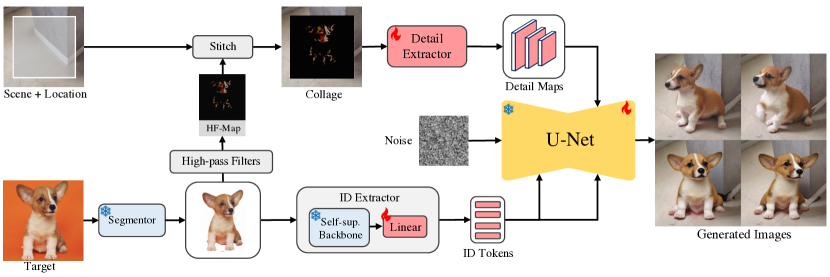

# Image Composition / Object Teleportation（画像コンポジション / 物体テレポーテーション）

**Image Composition（画像コンポジション）** とは、**参照となる特定の物体（reference object）を、与えられたシーン画像の指定位置に、その物体の同一性（identity）を保ったまま調和的に合成・再生成する**タスクである。入力は「シーン画像 ＋ 位置（ボックス）＋ 対象物体の画像」で、出力はその物体が周囲と自然に溶け込んだ（照明・影・姿勢・視点まで整合した）合成画像になる。古典的には「前景を切って背景に貼る」コピー&ペースト＋調整だったが、拡散モデルの登場で「物体を新しいシーンへ生成的に置き直す」ところまで拡張された。ランドマーク手法は **AnyDoor**（Chen ら 2023・[[summaries/2023-anydoor]]）で、著者はこれを "object teleportation（物体テレポーテーション）" と呼ぶ。

## 隣接タスクとの違い

このタスクは複数の概念の交差点にあり、区別が重要：

- **古典的な image harmonization（画像調和）** との違い：harmonization は貼り付けた前景の**色・照明など低レベルだけ**を調整し、構造・姿勢・視点は変えない（影や反射の生成もしない）。画像コンポジション（生成的）は物体の姿勢・視点まで再生成して馴染ませる。
- **[[image-inpainting]] との違い**：inpainting はマスク領域を「周囲と整合する**もっともらしい任意の内容**」で埋める。画像コンポジションはボックス領域を「**特定の参照物体**」で埋める（＝何を置くかが指定されている）。
- **[[subject-driven-generation]] との違い**：DreamBooth 等は「テキストプロンプトで被写体を**任意の新文脈**に生成」する（出力シーンは自由）。画像コンポジションは「**与えられたシーンの与えられた位置**に物体を置く」（場所が固定）。どちらも特定対象の同一性を保つ点では姉妹的。

## 二系統のアプローチ

物体の表現と適応のさせ方で、従来 2 系統があった。AnyDoor は両者の利点を統合する。

- **参照ベース（reference-based, zero-shot）**：対象画像を画像エンコーダで埋め込み、追加学習なしでシーン領域を編集する。**Paint-by-Example**・**ObjectStitch**・**Graphit** が代表。多くは CLIP 画像エンコーダを使うため、**意味的一貫性は保てても、未学習カテゴリでは ID（同一性）が崩れる**（粗い特徴しか持たない）。
- **チューニングベース（tuning-based）**：物体ごとにモデルを fine-tune する（[[subject-driven-generation]] の DreamBooth・Custom Diffusion・Cones）。ID 忠実度は高いが、物体ごとに約 1 時間の学習が要り、位置指定や複数被写体合成が苦手。

## 代表手法：AnyDoor（Chen ら 2023）

[[summaries/2023-anydoor]] は、**一度だけ学習して zero-shot で汎化する**参照ベース手法でありながら、tuning ベース級の ID 忠実度を達成した。鍵は物体を 2 種の特徴で特徴づけること：

- **ID extractor（DINO-V2）**：CLIP の代わりに自己教師あり DINO-V2 を使い、背景除去した物体から識別的な ID トークンを抽出（cross-attention で注入）。CLIP が意味レベルなのに対し DINO-V2 はインスタンスの同一性を保つ。
- **detail extractor（高周波マップ）**：Sobel フィルタで抽出した **HF-map** を collage としてシーンに貼り、ControlNet スタイルの UNet エンコーダ（[[controllable-generation]]）で detail map を生成。HF-map は「情報ボトルネック」として細部を保ちつつ姿勢・照明の局所変化を許す（物体をそのまま貼るとコピー&ペーストになり多様性が消える）。
- **base は Stable Diffusion**（[[latent-diffusion]]）。UNet エンコーダ凍結・デコーダ学習。学習は動画データ（同一物体の見た目変化）＋画像で、adaptive timestep sampling（動画→早期＝構造、画像→後期＝細部）。

応用：virtual try-on、複数被写体合成、物体の移動・入れ替え・変形（inpainting で元位置を消し、新位置に AnyDoor で再生成）。

<figure>

<figcaption>図2（引用, [[summaries/2023-anydoor]] より）: AnyDoor のパイプライン。物体を DINO-V2 の ID トークンと HF-map collage の detail map で表し、Stable Diffusion の U-Net に注入してシーンの指定位置に合成する。</figcaption>
</figure>

## 既存知識との接続

- [[subject-driven-generation]]：同じ「特定対象の同一性保持」を狙う姉妹概念。あちらはテキスト駆動で新文脈生成（DreamBooth, tuning）、こちらはシーン＋位置への合成（AnyDoor, zero-shot）。
- [[image-inpainting]]：ボックス領域を再生成する点で隣接。inpainting=もっともらしい任意内容、composition=特定参照物体。
- [[controllable-generation]]：AnyDoor の detail extractor は ControlNet スタイルの条件枝。参照画像で領域を制御するアダプタ的手法。
- [[latent-diffusion]]：Stable Diffusion を base に使い、その U-Net への特徴注入で実現する。
- [[multi-concept-customization]]：複数の被写体を 1 枚に入れる点で隣接。AnyDoor は参照画像を inpainting で挿入する系統、LoRA-Composer/Multi-LoRA Composition は LoRA を注意制御・復号で合成する系統。

## 参考文献（summaries）

- [[summaries/2023-anydoor]] — AnyDoor（DINO-V2 ID extractor＋HF-map detail extractor による zero-shot 物体合成）
