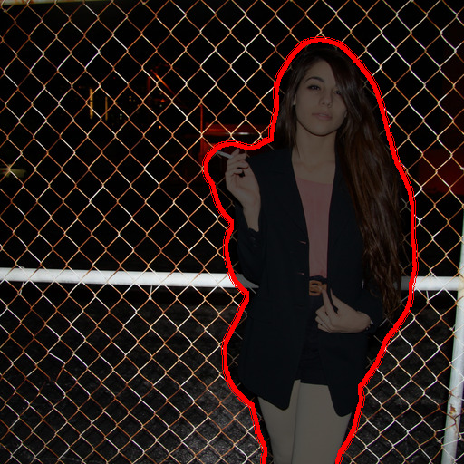
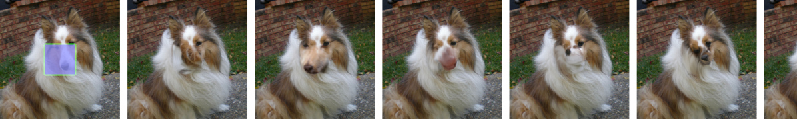

# Image Inpainting（画像 inpainting / 欠損補完）

**Image Inpainting（画像 inpainting）** とは、画像のマスクされた（欠けた・隠した）領域を、周囲と自然につながるもっともらしい内容で埋めるタスクである。用途は、破損・欠損部分の修復、写っている不要な物体の除去（object removal）、画像編集など。「与えられた周囲の文脈に条件付けて、欠損領域を生成する」という意味で、条件付き画像生成の一種である。

本ページは inpainting という概念の俯瞰と、拡散ベースの代表手法を解説する。

## 技術的な要点

inpainting では、入力として「マスクされた画像」と「マスク（どこを埋めるかを示す二値画像）」が与えられ、モデルはマスク領域の内容を生成する。鍵となる性質：

- **条件付け**：マスク画像とマスクをどう生成モデルに効かせるかで、拡散ベースの inpainting は大きく 2 系統に分かれる。
  - **(a) マスク条件付きモデルを学習**：マスク画像を潜在表現に**連結（concat）**して U-Net に入力し、inpainting タスクで学習する（[[latent-diffusion]]）。簡便で効果的だが、学習したマスク分布に過学習しやすい。
  - **(b) 凍結した無条件モデル＋推論時条件付け**：事前学習済みの無条件 DDPM を固定し、サンプリング過程だけで既知領域を差し込む（[[training-free-conditioning]]）。マスク特化学習が不要で任意マスクに汎化する。代表が **RePaint**。
- **多様性**：GAN ベースや回帰ベースの手法は単一の（平均的になりがちな）解を出すのに対し、拡散モデルのような生成的アプローチは**同じ入力に対して複数の多様な補完候補**を生成できる。これが拡散ベース inpainting の強み。
- **評価**：補完結果の品質を **FID** で、元画像との知覚的近さを **LPIPS（Learned Perceptual Image Patch Similarity）** で測る。ベンチマークは **Places** データセットが代表的。

## 代表手法

### Latent Diffusion（LDM-inpainting, Rombach ら 2022）

[[latent-diffusion]] は、マスク画像を潜在に連結する形で inpainting に適用し、Places ベンチマークで当時の**最先端（SOTA）FID** を達成した。特化アーキテクチャの LaMa（Fast Fourier Convolution ベース）を FID で上回り、ユーザー調査でも好まれた。LaMa が単一の平均的な解を返しがちなのに対し、LDM は多様な補完を生成できる点が評価された（[[summaries/2022-latent-diffusion]] 表7、図11・21）。注意なし VQ 正則化第一段階で大きなモデルを学習し $512^2$ でファインチューニングした構成（big, w/o attn, w/ ft）が最良スコア。

<figure>

<figcaption>図11（再掲, [[summaries/2022-latent-diffusion]] より）: LDM の big・ft あり inpainting モデルによる物体除去（object removal）の定性結果。</figcaption>
</figure>

### RePaint（Lugmayr ら 2022）— 凍結した無条件 DDPM による学習不要 inpainting

[[summaries/2022-repaint]] は、LDM とは正反対のアプローチをとる。**inpainting 専用の学習を一切せず**、事前学習済みの無条件 DDPM（[[denoising-diffusion]]、実体は [[summaries/2021-adm]] の guided-diffusion）を画像の prior として固定する。条件付けは推論時のみ：各逆拡散ステップで、既知領域は真の入力を時刻 $t$ 相当までノイズ化して差し込み（$\mathcal N(\sqrt{\bar\alpha_t}x_0,(1-\bar\alpha_t)\mathbf I)$）、未知領域は DDPM が生成し、マスクで合成する。

さらに、既知/生成領域の境界の不調和を解くため **resampling**（時刻を行き来して再デノイズし harmonize する操作。jump length $j$・$r$ 回）を導入したのが手法名の由来（詳細は [[training-free-conditioning]] と [[diffusion-sampling]]）。マスク特化学習がないため任意マスク（thin/thick/extreme）に汎化し、CelebA-HQ・ImageNet・Places2 のユーザー調査で GAN（LaMa 等）・自己回帰（ICT 等）を上回る。LaMa が単一の平均的解になりがちなのに対し、RePaint は確率的に多様な補完を生成できる点も強み。

<figure>

<figcaption>図2（再掲, [[summaries/2022-repaint]] より）: resampling ステップ数 n を増やした効果。n=1（DDPM ベースライン）は毛皮テクスチャの延長で意味的に誤るが、resampling を増やすほど犬の顔として調和していき、n=10 程度で飽和する。</figcaption>
</figure>

## 既存知識との接続

- [[latent-diffusion]]：マスク画像を潜在へ連結する条件付けで inpainting に適用し SOTA を達成した代表手法（学習型）。
- [[training-free-conditioning]]：RePaint のように、凍結した無条件モデルを推論時だけ条件付ける学習不要パラダイム。LDM の学習型と好対照。
- [[denoising-diffusion]]：inpainting 拡散モデルの生成エンジンとなる拡散の基礎。
- [[super-resolution]]：同じく「空間的に整列した条件を連結する」タイプの密な条件付きタスクで、LDM では共通の枠組みで扱われる。

## 参考文献（summaries）

- [[summaries/2022-latent-diffusion]] — Latent Diffusion Models（Places で inpainting SOTA を達成、学習型 concat）
- [[summaries/2022-repaint]] — RePaint（凍結無条件 DDPM＋推論時条件付け＋resampling、学習不要）
