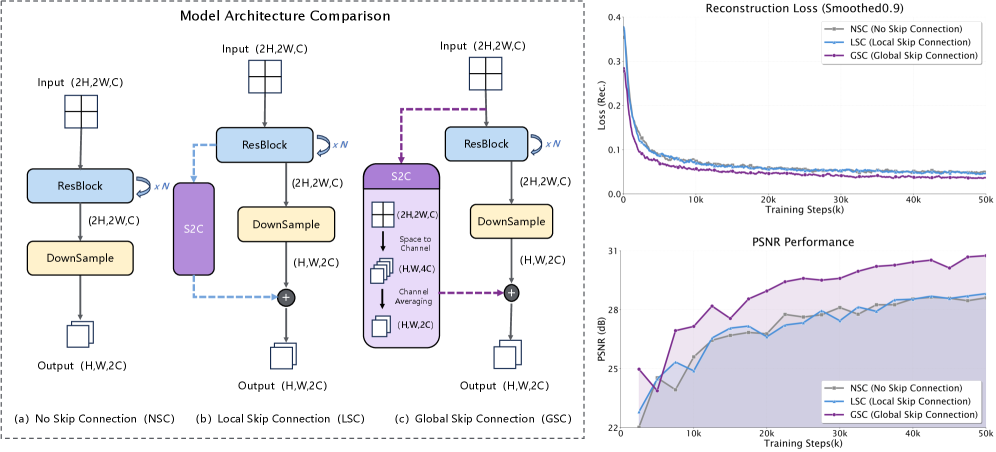

# Image Tokenizer（画像トークナイザ / 潜在空間を作るオートエンコーダ）

**Image Tokenizer（画像トークナイザ）** とは、[[latent-diffusion]]（潜在拡散）において**画像を圧縮した潜在表現へ変換し、また元へ戻す**部品——通常は VAE（Variational AutoEncoder, 変分オートエンコーダ）——と、その設計論を指す。拡散モデルの研究では長らく「脇役」として扱われてきたが、**潜在空間の形は下流の生成モデルが何を学べるかを規定する**ため、実際には生成品質の上限を決める中心的な構成要素である。本 wiki のランドマークは **Qwen-Image-VAE-2.0**（[[summaries/2026-qwen-image-vae-2]]）で、トークナイザだけを主題にした技術報告として設計上の論点を体系的に整理している。

## なぜトークナイザが重要なのか

[[latent-diffusion]] は「知覚的圧縮はオートエンコーダに任せ、拡散モデルは意味的圧縮に集中する」という分業で成功した。この分業は強力だが、裏を返せば**オートエンコーダが捨てた情報は、拡散モデルがどれだけ賢くても復元できない**ということでもある。

その最も分かりやすい実例が**小さな文字**である。拡散モデルが完璧に正しい潜在を生成しても、デコーダが読める文字に戻せなければ画像は判読不能になる——すなわち **[[visual-text-rendering]] の上限はトークナイザが決める**。初代 Qwen-Image（[[summaries/2025-qwen-image]]）が「デコーダだけをテキストが密なコーパスで微調整する」という手を打ったのは、まさにこの認識からである。

## 中心的な設計変数：圧縮率 $f$ とチャネル数 $C$

入力画像 $I\in\mathbb{R}^{H\times W\times 3}$ をトークナイザは潜在 $z\in\mathbb{R}^{\frac{H}{f}\times\frac{W}{f}\times C}$ へ写す。

- **$f$（空間圧縮率）**：縦横を何分の 1 にするか。$f8$（8 倍）が長らく業界標準だった。**$f16$**、**$f32$** と表記する。
- **$C$（潜在チャネル数）**：各位置が持つ次元。$f16c64$ は「16 倍圧縮・64 チャネル」を意味する。

$f$ を上げる動機は計算量である。拡散 Transformer（DiT, [[diffusion-model-architecture]]）の計算量は潜在トークン数 $L=HW/f^2$ に対して**二次的**に増えるため、全体では $\mathcal{O}(H^2W^2/f^4)$ となる。$f8\to f16$ で系列長は 1/4、計算量は約 1/16 になり、**ネイティブな高解像度生成が現実的になる**。

そして重要な原則が、再構成忠実度を支配するのは**総情報ボトルネック** $N(z)=CHW/f^2$ だという点である。$f$ を上げて失った容量は $C$ を増やせば補償できる。しかも **$C$ を増やしても DiT の計算量はほぼ変わらない**——DiT は最初に線形層で潜在を固定の隠れ次元へ射影するからである。したがって「$f$ を上げ、$C$ で埋める」が原理的に正しい方向になる。

## 三者間トレードオフ（tripartite trade-off）

ところが $C$ を増やすと第三の問題が現れる。Qwen-Image-VAE-2.0 が定式化した**三竦み**である。

| 求めるもの | 上げると何が起きるか |
| --- | --- |
| **① 圧縮率 $f$** | DiT は速くなるが、情報が入りきらず再構成が壊れる（とくに小さな文字） |
| **② 再構成忠実度** | 保つために $C$ を増やすと、潜在分布が複雑・非構造的になる |
| **③ 拡散可能性（diffusability）** | 潜在が複雑だと拡散モデルが学習しにくく、収束が遅れ生成品質が落ちる |

**diffusability（拡散可能性）** とは「その潜在空間がどれだけ容易に拡散モデルでモデル化できるか」という、**再構成品質とは独立した性質**である。再構成が完璧でも、潜在が拡散しにくければ下流の生成モデルは使い物にならない。トークナイザ設計とは、この 3 つを同時に立てる問題だと理解するのが本質的である。

## 代表手法：Qwen-Image-VAE-2.0（2026）

[[summaries/2026-qwen-image-vae-2]] は $f16$・$f32$ の VAE 群でこの三竦みを解く。

### アーキテクチャ

<figure>

<figcaption>図1（引用, [[summaries/2026-qwen-image-vae-2]] より）: スキップ接続の比較。NSC（なし）・LSC（局所）・GSC（大域）。GSC は Space-to-Channel でピクセル情報をチャネル方向へ折り畳み、初期ダウンサンプリングを迂回して潜在へ直送する。右のグラフ（f16c64 をゼロから学習）で GSC が明確に速く収束する。</figcaption>
</figure>

- **Global Skip Connection（GSC）**：高圧縮の敵は、エンコーダの初期ダウンサンプリングで高周波情報が落ちること。**space-to-channel**（空間情報をチャネル次元へ折り畳む）でピクセルから潜在への大域的な近道を作り、収束を大きく速める。
- **Attention-free バックボーン**：自己注意は計算もメモリも $\mathcal{O}(N^2)$ で高解像度では致命的。畳み込みは $\mathcal{O}(N\cdot k^2)$。外しても性能が落ちなかったので全廃した。
- **エンコーダ・デコーダの非対称化**：エンコーダ 76〜78M に対しデコーダ 248〜250M。理由が実務的で、**エンコーダは拡散モデルの学習中に毎回走る**ので軽い方が学習が速く、デコーダは推論で 1 回だけなので重くてよい。

### 学習：KL も GAN も外す

損失は $\mathcal{L}_{recon}$（L1）＋ $\mathcal{L}_{lpips}$（知覚損失）＋ $\mathcal{L}_{align}$（意味的整合）の 3 項のみ。VAE の教科書的な部品を 2 つとも捨てたことが主張である。

- **KL 損失の除去**：KL は潜在を正規分布へ寄せるが、(1) 容量を制約して再構成を損ない、(2) より重要なことに**意味的整合と競合する**——目標の意味特徴はガウス分布ではないので、正規事前分布と意味的多様体の両方を満たせと強いると整合が中途半端になり、下流 DiT の収束がかえって遅れる。
- **GAN 損失の除去**：学習予算が十分大きければ再構成損失＋LPIPS で十分鋭くなる。識別器を消すと最適化が単純になり安定・高速化する。初代 Qwen-Image も「品質が上がると識別器が有効な勾配を出せなくなる」と同趣旨の観察を報告している。

### 拡散可能性を作る：意味的整合

**潜在を事前学習済み視覚エンコーダの特徴へ揃える**（VA-VAE 由来）。ここでの知見が 2 つ：

- **DINOv2 が最良**（DINOv3・MAE・PE-Spatial との比較）。
- **最終層ではなく中間層**に揃えるのが良い。中間層の方が空間マップが滑らかで整合しやすく、生成に適した潜在になる。複数層を素朴に混ぜると逆効果。

損失は **Marginal Cosine Similarity**（潜在の向きを意味特徴に合わせる）と **Marginal Distance Matrix Similarity**（位置ペア間の類似度構造＝相対的な空間レイアウトを保つ）の 2 本立てで、いずれも ReLU でマージンを設ける。さらに**段階的整合**——初期は厳しく整合させて拡散可能性を確立し、後半は緩めて再構成品質とのバランスを取る。

### 成果

- **f16c128 が文書テキスト再構成で全 f8 VAE を上回る**（NED 0.9617 対 FLUX.1-dev 0.9546）。「f8 を超えるテキスト忠実度を達成した初の f16 オートエンコーダ」。
- **f32c192 が 4 倍高い圧縮率で f8 の Wan2.1 に匹敵**。
- 拡散可能性：ImageNet で SiT を学習した gFID/IS で高圧縮ベースラインを一貫して上回る。

## 比較対象としての Flux-VAE

高圧縮路線とは別に、**$f8$ のまま素直に作り込む**系統も強い。**FLUX.1**（[[summaries/2025-flux-kontext]]）の VAE は、敵対的目的でゼロから学習し**潜在 16 チャネル**を採ることで、SD3-VAE・SDXL-VAE・SD-VAE を再構成品質で上回る（PDist 0.332 / SSIM 0.896 / PSNR 31.1）。ここで使われる **PDist（Perceptual Distance）** は VGG 特徴空間での知覚的距離で、PSNR/SSIM を補う指標として併記される。

つまり 2026 年時点の選択肢は「$f8$ で作り込む（FLUX）」と「$f16/f32$ へ上げてチャネルと整合で補償する（Qwen-Image-VAE-2.0）」の 2 路線があり、**前者は再構成の素直さ、後者は DiT の計算量削減**を優先している。なお Qwen-Image-VAE-2.0 の比較表では FLUX.2-dev の f16c128 も強く、高圧縮路線に他社も入ってきていることが分かる。

## 評価：ピクセル指標では足りない

トークナイザの評価は伝統的に **PSNR / SSIM / LPIPS / FID** で行われてきたが、これらは**文字の判読性に鈍感**である。「orange」が「orango」になっても PSNR の低下は 0.5 dB 未満だが、意味は壊れている。

そこで Qwen-Image-VAE-2.0 は **OmniDoc-TokenBench** を提案する。約 3K 枚の文書画像（書籍・スライド・教科書・試験問題・論文・雑誌・財務報告・新聞・ノートの 9 カテゴリ、中英）を、**OCR ベースの NED（Normalized Edit Distance, 正規化編集距離）** で測る。設計上の白眉は、**正解アノテーションではなく「元画像を OCR した結果」を参照にする**こと——OCR 自体がクリーンな画像でも誤る（「rn」を「m」と読む等）ので、両方に同じ OCR をかければ系統誤差が相殺され、**VAE の劣化だけを切り分けられる**。

実際、ピクセル指標と NED は一致しない：Stepvideo-T2V は HunyuanImage-3.0 と SSIM 差はわずかなのに NED は大きく上回る（0.8838 対 0.7753）。**NED は独立に必要な指標である**。

## 反対側の答え：トークナイザを作らない

本ページはここまで「潜在空間の形をどう設計するか」を追ってきた。だが同じ 2026 年、**HiDream-O1-Image**（[[summaries/2026-hidream-o1-image]]）は**そもそもトークナイザを作らない**という答えを出している。生ピクセルをパッチ化してそのまま Transformer に入れれば、圧縮率 $f$・再構成忠実度・拡散可能性の三者間トレードオフは**存在しなくなる**——少なくとも、その形では現れなくなる。

面白いのは、両者が**同じ道具に行き着いている**ことである。Qwen-Image-VAE-2.0 は高圧縮で複雑化した潜在を拡散しやすく保つために **DINOv2 中間層への意味的整合**を潜在に課した。HiDream-O1-Image はピクセル空間の弱点（長距離の意味的一貫性が弱い）を補うために **知覚的 DINO 損失と LPIPS 損失**を生成モデル本体に課す。「意味的な足場を外から与える」という処方箋は共通で、**それを潜在空間に埋め込むか、損失として課すか**だけが分かれている。

ただし pixel-space 側は本ページの中心命題——**DiT の計算量は潜在トークン数に二次的**——への回答を持っていない。トークン数は最大 $f^2$ 倍（$f=16$ なら 256 倍）になりうるが、原典はパッチサイズも系列長も推論コストも報告しない。「トークナイザを作らなくてよい」ことと「作らない方が安い」ことは別で、後者は未証明である。詳細は [[pixel-space-diffusion]] を参照。

## 時間軸を持つトークナイザ（3D causal VAE）

本ページはここまで画像のトークナイザを扱ってきたが、動画（[[video-diffusion]]）に踏み出すと**同じ三つ巴が時間方向へ拡張される**。標準的な設定は $4\times8\times8$（時間 4 倍・空間 8 倍）でチャネル 16。時間圧縮率は実装で分かれており、Wan・HunyuanVideo・CogVideoX が $4\times8\times8$、Mochi が $6\times8\times8$、Step Video が $8\times16\times16$（チャネル 64）、SVD は時間圧縮なしの $1\times8\times8$ である。**空間の圧縮率を上げるか、時間の圧縮率を上げるか**という新しい配分の問題が加わる。

動画固有の制約が 2 つあり、どちらも画像の VAE 設計には対応物がない（[[summaries/2025-wan]]）。

**(1) 時間的因果性が正規化層を縛る。** 未来のフレームが過去のフレームの符号化に影響してはならない。ところが **GroupNorm はフレーム群にまたがって平均と分散を取るので、未来の情報が過去へ漏れる**。Wan-VAE がすべての GroupNorm を **RMSNorm**（各要素の二乗平均だけで正規化する軽量な変種）へ置き換えたのはこのためである。正規化層の選択が因果性を壊すかどうかを決める、という論点は画像では意識する必要がなかった。

**(2) チャンク処理と特徴キャッシュ。** 動画を $1+T/4$ 個のチャンク（最大 4 フレーム）に割り、1 チャンクずつ符号化・復号する。境界で切れ目が出ないよう、**因果畳み込みの過去 2 フレーム分の特徴をキャッシュして次のチャンクへ引き継ぐ**（カーネルサイズ 3 なので 2 枚）。これにより**任意長の動画を一定メモリで処理できる**。因果性を守った見返りがここで回収される構造になっている。

もう 1 つ実用上効く工夫として、**最初のフレームだけ空間のみ圧縮する**（MagViT-v2 由来）。単一画像を「1 フレームの動画」として同じ VAE で扱えるようになり、画像と動画の共同学習が成立する。動画データは画像より桁違いに少ないので、この互換性は本質的である。

なお本ページの中心命題——**トークナイザの設計は下流の計算可能性を直接決める**——は、動画でいっそう鋭くなる。$f8 \to f16$ にすればトークン数は 4 分の 1、注意は 16 分の 1 になる。系列長 100 万で注意が学習時間の 95% を占める世界（[[large-scale-training-infrastructure]]）では、圧縮率の 1 段の違いが学習の可否そのものを分ける。

Wan-VAE は 127M と極小ながら PSNR と速度の両方で競争力を持ち、HunyuanVideo の VAE より再構成が 2.5 倍速い。また、再構成損失を拡散損失に置き換えた変種（VAE-D）は FID が一貫して悪化しており、**トークナイザは素直に再構成を目的に学習した方がよい**という、Qwen-Image-VAE-2.0 が KL も GAN も外した判断と同じ方向の結果になっている。

## 同じ圧縮率への 2 つの到達路

本ページは圧縮率 $f$ を「VAE がどれだけ空間を縮めるか」として扱ってきたが、実際に DiT へ入るトークン数を決めるのは **VAE とパッチ化の合わせ技**である。従来の主流は **$f8$ の VAE ＋ 2×2 のパッチ化**で、実効的に 16 倍の空間圧縮を得ていた。

**HunyuanImage 3.0**（[[summaries/2025-hunyuanimage-3]]）はここに明確な主張を置く——**$f16$ の VAE 単体の方が単純かつ効果的で、優れた画像生成品質をもたらす**。潜在は 32 次元。同じ実効圧縮率でも、**VAE で払うかパッチ化で払うか**という設計判断がある、という指摘である。

直感的には、パッチ化は「学習された圧縮」ではなく**単なる並べ替えと線形射影**なので、隣接パッチ間の冗長性を VAE ほど賢く畳めない。VAE 側で 16 倍まで学習して落とす方が、情報の落とし方が良いという理屈は立つ。Qwen-Image-VAE-2.0（[[summaries/2026-qwen-image-vae-2]]）が「$f8 \to f16$ へ圧縮を強め、失った容量はチャネル $C$ で補償する」と論じたのと同じ方向で、**別の角度からの独立した支持**になっている（あちらは 128 チャネル、こちらは 32 チャネル）。

ただし **HunyuanImage 3.0 はこの主張のアブレーションを示さない**。「$f16$ 単体の方が優れた品質をもたらすことを実証する」と書きながら、$f8$＋パッチ化との比較実験は本文に存在しない。

**その欠けているアブレーションは、実は 2 年前に存在していた。** Sana（[[summaries/2024-sana]]）は 1024px で**最終的なトークン数を揃えたまま**、圧縮をどこで払うかだけを変えた 3 条件を比較している。

| 構成 | 空間圧縮（VAE） | 潜在チャネル | パッチ化 | 実効圧縮 | 結果 |
| --- | --- | --- | --- | --- | --- |
| F8C16P4 | 8 | 16 | 4×4 | 32 | 収束が最も遅い |
| F16C32P2 | 16 | 32 | 2×2 | 32 | 中間 |
| **F32C32P1** | **32** | **32** | **1×1** | 32 | **収束が最速・FID 最良** |

**トークン数が同じでも、圧縮を深いオートエンコーダに任せた方が良い**。パッチ化は学習された線形射影 1 枚にすぎず、隣接パッチ間の冗長性を VAE ほど賢く畳めない——本節の直感的な理屈に、**同一トークン数という統制条件下での直接的な裏づけ**がついたことになる。HunyuanImage 3.0 の $f16$ 単体という主張は、この方向の連続線上にある。

同時に Sana は**チャネル数の上限**も測っている。$C=32$ が最良で、$C=64$ では**再構成品質は改善するのに生成の FID は悪化する**。本ページ冒頭の三者間トレードオフ——再構成忠実度と拡散可能性（diffusability）は同じ方向を向かない——が、チャネル軸でも成立していることの実証である。Qwen-Image-VAE-2.0 が $C=128$ まで押し上げられたのは、DINOv2 中間層への意味的整合という**別の装置で拡散可能性を確保したから**であって、チャネルを増やせば良いという単純な話ではない。

もう 1 つ、統一マルチモーダルモデル（[[unified-multimodal-generation]]）ではトークナイザへの要求が変わる。**VAE 特徴が生成にも理解にも使われる**からで、HunyuanImage 3.0 は条件画像について VAE の潜在と ViT の特徴を**両方連結する**二重エンコーダを採る。「理解には意味的な特徴、生成には再構成的な特徴」という分業（Qwen-Image の二重符号化・[[instruction-based-image-editing]]）を、**分けずに両方渡す**方向へ倒した設計である。

## 既存知識との接続

- [[latent-diffusion]]：トークナイザは LDM の第一段階そのもの。本ページはその「第一段階」を独立した設計問題として扱う。LDM 原典（[[summaries/2022-latent-diffusion]]）が $f4$〜$f8$ を最適点としたのに対し、高解像度時代は $f16$・$f32$ へ移りつつある。
- [[diffusion-model-architecture]]：DiT の計算量が系列長に二次であることが、圧縮率を上げる直接の動機になる。トークナイザ側の改善がバックボーン側の制約を緩める関係。
- [[visual-text-rendering]]：小さな文字の再現はトークナイザが上限を決める。初代 Qwen-Image はデコーダ微調整で、VAE-2.0 は圧縮率を上げつつ設計で解いた。
- [[denoising-diffusion]] / [[flow-matching]]：潜在空間の「形」が拡散／フローの学習しやすさ（diffusability）を左右する。生成モデルとトークナイザの分業を問い直す視点。
- [[summaries/2026-qwen-image-2]]：VAE-2.0 の f16c64 を実際に採用し、ネイティブ 2K 生成を可能にしている。

## 参考文献（summaries）

- [[summaries/2026-hidream-o1-image]] — HiDream-O1-Image（トークナイザを作らない立場。同じ問題への正反対の答え）
- [[summaries/2025-hunyuanimage-3]] — HunyuanImage 3.0（**f16 の VAE 単体**が f8＋パッチ化より良いと主張。潜在 32 次元、条件画像には VAE と ViT の二重エンコーダ）
- [[summaries/2025-wan]] — Wan-VAE（3D causal VAE。GroupNorm→RMSNorm で時間的因果性を保ち、特徴キャッシュで無限長を一定メモリで処理。127M で HunyuanVideo VAE の 2.5 倍速）
- [[summaries/2026-qwen-image-vae-2]] — Qwen-Image-VAE-2.0（f16/f32 高圧縮 VAE。GSC・attention-free・非対称構成、KL/GAN 除去、DINOv2 中間層への意味的整合、OmniDoc-TokenBench）
- [[summaries/2026-qwen-image-2]] — Qwen-Image-2.0（f16c64 を採用しネイティブ 2K 生成を実現した基盤モデル）
- [[summaries/2025-qwen-image]] — Qwen-Image（動画対応 VAE のデコーダのみをテキスト特化微調整し、文字再現の上限を引き上げた先行例）
- [[summaries/2022-latent-diffusion]] — Latent Diffusion Models（知覚的圧縮と意味的圧縮の分業、$f$ の選択という枠組みを確立した原典）
- [[summaries/2025-flux-kontext]] — FLUX.1 Kontext（f8・16 チャネル・敵対的目的の Flux-VAE。PDist を含む再構成比較で SD 系を上回る）
