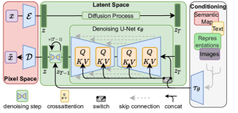

# Latent Diffusion（潜在拡散）

**Latent Diffusion（潜在拡散）** とは、ピクセル空間で直接ノイズ除去拡散を行う代わりに、**事前学習済みオートエンコーダが作る低次元の潜在空間（latent space）の中で拡散モデルを動かす**手法である。画像を「意味はほぼ保ったまま情報量だけ落とした」コンパクトな表現に圧縮してから拡散させることで、品質をほとんど損なわずに学習・推論コストを大幅に削減する。これを確立したのが **Latent Diffusion Models（LDM, Rombach ら 2022）** であり、**Stable Diffusion の直接の基盤**である。

[[denoising-diffusion]]（DDPM）が示した拡散モデルの強力さを、現実的な計算資源・高解像度・テキスト条件付きへと一気に押し上げ、画像生成 AI を一般に普及させた転換点にあたる。本ページは潜在拡散の考え方と、ランドマーク手法としての LDM を中心に解説する。

## なぜ潜在空間で拡散するのか

拡散モデルは尤度ベースモデルであり、データの**知覚できない細部**（高周波ノイズのような成分）にまで容量を費やす性質がある。LDM 論文は、画像の学習を 2 つの圧縮に分けて捉える（[[summaries/2022-latent-diffusion]] 図2）：

- **知覚的圧縮（perceptual compression）**：高周波の細部を捨てる段階。ビットの大半はここに費やされるが、意味的な情報はほとんど持たない。
- **意味的圧縮（semantic compression）**：データの意味・構成を学ぶ段階。生成モデルが本当に担うべき部分。

ピクセル空間の拡散はこの両方を 1 つのモデルで、しかも全ピクセル上で勾配計算しながらやるので無駄が多い。そこで**知覚的圧縮は安価なオートエンコーダに任せ、拡散モデルは低次元の潜在空間で意味的圧縮だけに集中させる**——これが潜在拡散の核心である。

## 代表手法：Latent Diffusion Models（LDM, Rombach ら 2022）

### 2 段階アーキテクチャ

<figure>

<figcaption>図3（再掲, [[summaries/2022-latent-diffusion]] より）: LDM のアーキテクチャ。ピクセル空間の画像をエンコーダ ε で潜在 z に圧縮し、潜在空間で時間条件付き U-Net による拡散・ノイズ除去を行い、デコーダ D でピクセル空間へ戻す。条件 y（テキスト等）は τθ を介して cross-attention または concat で U-Net に注入される。</figcaption>
</figure>

1. **第一段階：知覚的圧縮オートエンコーダ** — エンコーダ $\mathcal{E}$ が画像 $x$ を係数 $f$ でダウンサンプルした潜在 $z=\mathcal{E}(x)$ に圧縮、デコーダ $\mathcal{D}$ が復元する。知覚的損失（perceptual loss）＋パッチ単位の敵対的損失で学習し、ぼやけない再構成を得る。潜在空間の暴走を防ぐ正則化として **KL 正則化**（VAE 風の弱い KL ペナルティ）または **VQ 正則化**（ベクトル量子化、VQGAN 風）を軽くかける。一度学習すれば複数タスクに再利用できる汎用圧縮器。
2. **第二段階：潜在拡散モデル** — 潜在空間で [[denoising-diffusion]] と同じノイズ予測目的を最適化する：

$$
L_{LDM}=\mathbb{E}_{\mathcal{E}(x),\,\epsilon\sim\mathcal{N}(0,1),\,t}\Big[\lVert\epsilon-\epsilon_\theta(z_t,t)\rVert_2^2\Big]
$$

ノイズ除去の本体は時間条件付き **U-Net**。順過程は固定なので $z_t$ は学習時に $\mathcal{E}$ から効率的に得られ、生成された潜在は $\mathcal{D}$ を 1 回通すだけで画像に戻せる。

### cross-attention による条件付け

LDM の第 2 の貢献は、**cross-attention（クロスアテンション）** による汎用条件付け機構。条件 $y$（テキスト、意味マップ、バウンディングボックス等）をドメイン特化エンコーダ $\tau_\theta$ で中間表現に変換し、U-Net の中間層に注入する：

$$
\text{Attention}(Q,K,V)=\text{softmax}\!\left(\tfrac{QK^\top}{\sqrt{d}}\right)V,\quad Q=W_Q\,\varphi(z_t),\;K=W_K\,\tau_\theta(y),\;V=W_V\,\tau_\theta(y)
$$

すなわち U-Net 側の画像特徴がクエリ、条件側がキー・値になる。これにより 1 つの枠組みで [[text-to-image-generation]]（テキスト）、layout-to-image（ボックス）、クラス条件付けなどを統一的に扱える。低解像度画像や意味マップのように**空間的に整列した条件**は単純に潜在へ連結（concat）し、畳み込み的に評価することで学習解像度を超える $1024^2$ 級の生成も可能。

### 圧縮率 $f$ の選択

ダウンサンプリング係数 $f$ が効率と品質のトレードオフを決める。$f$ が小さすぎる（LDM-1＝ピクセル拡散）と遅く、大きすぎる（LDM-32）と情報損失で品質が頭打ち。**LDM-4 / LDM-8 が最適点**（[[summaries/2022-latent-diffusion]] 図6・7）。

### 成果

- 無条件生成 CelebA-HQ で FID 5.11（当時 SOTA）、クラス条件付き ImageNet で classifier-free guidance 併用の LDM-4-G が FID 3.60 と ADM を凌駕。
- text-to-image・[[image-inpainting]]（SOTA）・[[super-resolution]] を 1 つの枠組みで実現。
- 計算コストを一桁削減し、全実験が単一 A100 で可能に。→ Stable Diffusion として一般公開され普及。

## 代表的後継モデル：SDXL（Podell ら 2023）

**SDXL（Stable Diffusion XL）** は、LDM/Stable Diffusion を実務的に大幅強化したオープンモデルで、現在の LoRA・personalization エコシステム（[[low-rank-adaptation]]・[[lora-merging]]）の事実上の標準 base である（[[summaries/2023-sdxl]]）。VAE 潜在空間で拡散するという LDM の枠組みは変えず、**規模・条件付け・前処理・サンプリング**を積み上げで改良した点が特徴。

- **3× 大型 UNet（860M→2.6B）＋ 2 テキストエンコーダ**：CLIP ViT-L と OpenCLIP ViT-bigG の出力を連結（context dim 2048）し、OpenCLIP の **pooled text embedding** を追加条件に。UNet 内の transformer block を低レベルに集中させる配分（[[diffusion-model-architecture]] 参照）。
- **micro-conditioning（size / crop / aspect-ratio）**：LDM の弱点だった「最小画像サイズ要件」（小画像を捨てると学習データを大量喪失）を、元解像度・crop 座標・アスペクト比を **Fourier 埋め込みで条件化**して回避。crop 条件で生成物の「頭切れ」を解消し object-centered に（[[controllable-generation]] の学習時メタデータ条件付け）。
- **改良 VAE ＋ 2 段（base + refinement）**：VAE を大バッチ＋EMA で再学習。base が出した潜在に、別 LDM の refiner が **SDEdit 流 noising-denoising** をかけて局所品質（背景・顔）を底上げ。
- 人間評価で旧 SD を圧倒し Midjourney に匹敵する一方、**COCO zero-shot FID はむしろ悪化**——基盤 T2I の評価指標としての FID の限界を示した（[[summaries/2023-sdxl]] 付録F）。

なお SDXL は探索段階で DiT 的な全 transformer 化を試したが当時利得を得られず、**改良 U-Net に留まった**（[[diffusion-model-architecture]] の DiT と対照的）。その次世代 **Stable Diffusion 3（SD3）**（[[summaries/2024-sd3]]）では、ついにバックボーンを **MM-DiT**（Transformer, [[diffusion-model-architecture]]）に、学習定式化を **rectified flow**（[[flow-matching]]）に置き換え、VAE 潜在も 16 チャネルに拡張した。LDM→SDXL→SD3 と、潜在拡散の枠組みを保ちながらバックボーンと定式化が刷新されていく系譜である。

## 限界

- 逐次サンプリングは依然 GAN より遅い（[[diffusion-sampling]]、DDIM 等で緩和）。
- オートエンコーダの再構成限界が、画素単位の厳密精度を要するタスクのボトルネックになりうる。
- 高品質化は classifier-free guidance（[[classifier-free-guidance]]）に依存。生成時に条件付き／無条件スコアを混ぜて条件忠実度を高める標準技術。

## 既存知識との接続

- [[denoising-diffusion]]：LDM は DDPM のノイズ予測拡散を、ピクセル空間ではなく潜在空間で行うことで高計算コスト問題を解いた。拡散の数学的な中身は同じ。
- [[text-to-image-generation]] / [[image-inpainting]] / [[super-resolution]]：LDM はこれらのタスクすべてに cross-attention／concat 条件付けで適用でき、各タスクの代表手法になっている。
- [[score-based-generative-models]]：LDM の学習目的も denoising score matching を反映した再重み付け下界に基づく。
- [[controllable-generation]]：ControlNet は凍結した Stable Diffusion（LDM）に zero convolution で学習可能コピーを接続し、エッジ・深度・姿勢などの空間条件を後付けで効かせる。LDM のトポロジーを変えないためコミュニティ派生モデルへも転用できる。
- [[subject-driven-generation]]：DreamBooth は Stable Diffusion（LDM）を少数画像で fine-tune し、特定被写体を一意識別子に紐づける personalization を行う（U-Net とテキストエンコーダを学習、デコーダは固定）。
- [[image-composition]]：AnyDoor は Stable Diffusion（LDM）を base に、U-Net エンコーダを凍結しデコーダのみ学習して、参照物体をシーンに合成する（ID トークンの cross-attention 注入＋detail map の concat）。
- [[diffusion-model-architecture]]：DiT は LDM の枠組み（VAE 潜在空間での拡散）はそのままに、バックボーンを U-Net から Transformer に置き換えた。LDM は「どこで拡散するか（潜在空間）」、DiT は「何で拡散するか（Transformer）」の改善で直交する。
- [[low-rank-adaptation]]：LoRA は Stable Diffusion（LDM）の U-Net／テキストエンコーダの重みに低ランク更新を後付けする軽量 personalization。数 MB のモジュールとして共有される。
- [[lora-merging]]：ZipLoRA（[[summaries/2024-ziplora]]）は LDM の大型版 **SDXL（Stable Diffusion XL）** 上で動く。SDXL が単一画像でスタイルを学習できる性質が、被写体 LoRA × 画風 LoRA のマージを成立させる前提になっている。

## 参考文献（summaries）

- [[summaries/2022-latent-diffusion]] — High-Resolution Image Synthesis with Latent Diffusion Models（Rombach ら, CVPR 2022）
- [[summaries/2023-controlnet]] — Adding Conditional Control to Text-to-Image Diffusion Models（Stable Diffusion への空間条件制御）
- [[summaries/2023-dit]] — Scalable Diffusion Models with Transformers（LDM 潜在空間で U-Net を Transformer 化）
- [[summaries/2024-ziplora]] — ZipLoRA（SDXL 上で被写体 LoRA × 画風 LoRA をマージ）
- [[summaries/2023-sdxl]] — SDXL（LDM の大型化後継：3× UNet・micro-conditioning・base+refiner の 2 段）
- [[summaries/2024-sd3]] — Stable Diffusion 3（LDM の次世代：MM-DiT＋rectified flow・潜在 16 チャネル）
