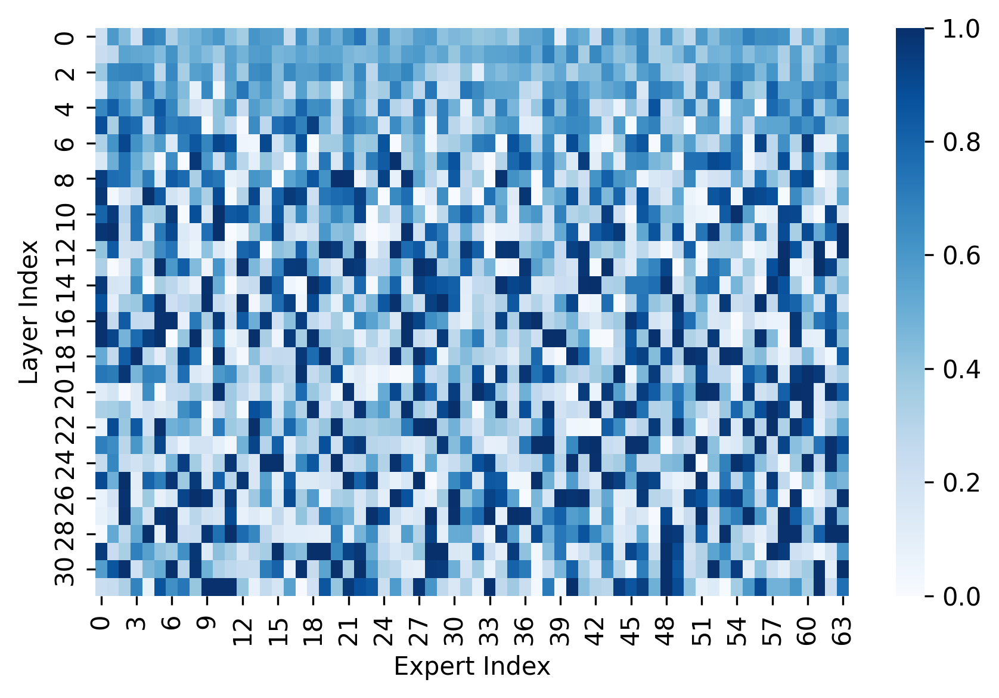

# Mixture-of-Experts for Diffusion Models（拡散モデルの混合エキスパート）

**Mixture-of-Experts（MoE, 混合エキスパート）** とは、Transformer ブロックの **FFN（feed-forward network, 各トークンを独立に変換する 2 層の全結合部）** を複数の並列な「エキスパート」に分割し、**トークンごとにそのうち一部だけを通す**仕組みである。狙いは一言で言える——**総パラメータ（＝モデルの容量）は増やすが、1 トークンあたりに実際に使う計算量は増やさない**。この「疎（sparse）」な活性化により、密（dense）なモデルなら計算コストが跳ね上がる規模の容量を、現実的なコストで手に入れる。

大規模言語モデル側で確立した技法だが、拡散モデルへの本格的な適用はやや遅れた。本 wiki のランドマークは **HiDream-I1**（[[summaries/2025-hidream-i1]]）で、[[diffusion-model-architecture]] で追ってきた MM-DiT 系の二重ストリーム→単一ストリーム構成の FFN を MoE に置き換えた 17B のオープンソース T2I 基盤モデルである。

## なぜ拡散モデルで MoE を使いたいのか

[[text-to-image-generation]] の基盤モデル競争は、2024–2025 年にかけて**素直にパラメータを増やす**方向で進んできた。SD3 は 8B（[[summaries/2024-sd3]]）、FLUX.1 は 12B、Qwen-Image は 20B（[[summaries/2025-qwen-image]]）。しかし [[diffusion-model-architecture]] の DiT が示した「Gflops を増やすほど品質が上がる」というスケーリング則は、**そのまま推論コストの増加**でもある。

拡散モデルはここで特に不利な立場にある。画像 1 枚の生成にネットワークを数十回呼ぶからで、**モデルを 2 倍にすると推論コストも素直に 2 倍**になる。[[diffusion-distillation]] は「呼ぶ回数（NFE）を減らす」方向の答えだが、MoE は**1 回あたりのコストを据え置いたまま容量を増やす**という直交した答えを与える。

もう 1 つ、拡散モデル固有の動機として**入力の異質性**がある。同じネットワークが、写真もイラストもテキスト入りのポスターも、ノイズだらけの初期ステップもほぼ完成した最終ステップも扱わねばならない。「入力の特性に応じて別の専門家に振り分ける」という MoE の発想は、この異質性と相性がよいはずだ——というのが期待される利点である（ただし後述の通り、この期待が実証されたわけではない）。

## 仕組み

密な FFN は、すべてのトークンが同じ 1 つの巨大な全結合を通る。MoE はこれを次のように置き換える。

1. **エキスパート**：同じ形の FFN を $N$ 個並べる。HiDream-I1 では各エキスパートの中身が **SwiGLU**（Swish-Gated Linear Unit, ゲート付き活性化を使う FFN の変種。標準の 2 層 FFN より表現力が高い）。
2. **ルーター（router）**：入力トークンを見て「どのエキスパートに送るか」のスコアを出す、小さなゲーティングネットワーク。上位 $k$ 個（典型的には 1〜2 個）だけが選ばれる。
3. **共有エキスパート（shared expert）**：ルーティングの対象外で、**全トークンが必ず通る**エキスパートを 1 つ置く設計。「どのトークンにも共通して必要な変換」をここに逃がすことで、専門エキスパートを本当に専門化させられる。HiDream-I1 の図3(d) はこの構成を採る。
4. **出力**：選ばれたエキスパートの出力をルーターのスコアで重み付けして合算し、共有エキスパートの出力を足す。

$N$ 個のエキスパートを置いてもトークンごとに通るのは $k+1$ 個なので、**総パラメータは約 $N$ 倍、1 トークンあたりの計算量は約 $(k+1)$ 個分**にとどまる。この差が「疎」の正体である。実際に動く分は **活性化パラメータ（activated parameters）** と呼ばれ、MoE モデルを評価する際は総パラメータと活性化パラメータの両方を見る必要がある。

### 代表的な落とし穴

MoE には固有の難所があり、LLM 側で長く研究されてきた。

- **負荷の偏り（load imbalance）**。ルーターを素朴に学習すると、少数の人気エキスパートにトークンが集中し、残りが死ぬ。これを防ぐため **load balancing loss**（各エキスパートの利用率を均そうとする補助損失）を足すのが定石だが、HiDream-I1 のレポートには記載がない。
- **学習の不安定さ**。ルーティングは離散的な選択なので、勾配が通りにくく、学習初期に振動しやすい。
- **メモリと通信コスト**。総パラメータは大きいままなので、モデル並列時のメモリと GPU 間通信は削減されない。「計算量は減るがメモリは減らない」点は実運用上の重要な制約である。

## 代表手法: HiDream-I1（HiDream.ai 2025）

[[summaries/2025-hidream-i1]] は、FLUX.1（[[summaries/2025-flux-kontext]]）と同じ **dual-stream → single-stream** の骨格を採る。前半は画像とテキストに別重みを与えて attention でのみ混ぜ、後半は連結して 1 本で処理する。その FFN を MoE に置き換えた。

配置は原典の**図3 と本文で食い違っている**（下記「限界」参照）。図3(b)(c) が実際に描いているのは：

| ブロック | テキスト側 FFN | 画像側 FFN |
| --- | --- | --- |
| Dual-stream | dense SwiGLU | **MoE** |
| Single-stream | （連結後 1 本）**MoE** | |

<figure>

<figcaption>図3（引用, [[summaries/2025-hidream-i1]] より）: HiDream-I1 の全体フレームワーク。(a) 拡散バックボーン（Llama 3.1 の複数中間層＋T5-XXL＋Long-CLIP のハイブリッド符号化）、(b) Dual-stream DiT ブロック、(c) Single-stream DiT ブロック、(d) MoE（ルーター＋4 エキスパート＋共有エキスパート）、(e) SwiGLU。</figcaption>
</figure>

条件付けは [[diffusion-model-architecture]] の DiT 系譜どおり **adaLN**（条件からスケールとシフトを作って正規化に流す）で、プールされた Long-CLIP 特徴とタイムステップ埋め込みを足したものを各ブロックへ注入する。安定化には SD3 由来の **QK-normalization** を使う。

### 何が示されたか（そして示されなかったか）

HiDream-I1 は HPSv2.1 平均 33.82（全カテゴリ 1 位）、GenEval 総合 0.83、DPG-Bench 総合 85.89 と、いずれも当時の SOTA を主張した。しかし **MoE の寄与を分離した証拠は 1 つも提示されていない**。

- MoE を dense に戻したときの比較がない。
- エキスパート数・top-k・活性化パラメータ数が書かれていない。
- 「費用対効果」を主要な貢献に挙げながら、**レイテンシや FLOPs の対比表が存在しない**。

したがって現時点で本ページが言えるのは「拡散 T2I 基盤モデルに MoE を入れて SOTA 級のスコアが出た」までであり、**「MoE のおかげで出た」とは言えない**。この留保は重要で、同チームの後継 [[summaries/2026-hidream-o1-image]] が MoE を主要な設計要素として引き継いでいない（decoder-only LLM バックボーンの標準構成に移行した）ことも、この技法の位置づけがまだ流動的であることを示唆する。

## 動機が逆から来る場合 — HunyuanImage 3.0（Tencent 2025）

HiDream-I1 は「拡散モデルを疎にしたい」という動機から DiT の FFN を MoE に置き換えた。**HunyuanImage 3.0**（[[summaries/2025-hunyuanimage-3]]）は逆で、**もともと MoE だった大規模言語モデルを画像生成に転用した結果、MoE になった**。土台は Hunyuan-A13B——**64 エキスパート・トークンあたり 8 個活性・共有 MLP 1 個**で、総 80B のうち約 13B が活性化される decoder-only LLM である（[[unified-multimodal-generation]]）。

同じ構造でも動機が違うと分かることが違う。HiDream-I1 では「MoE を入れたら SOTA が出た」までしか言えなかったが、HunyuanImage 3.0 は**マルチモーダルモデルにおけるエキスパートの振る舞いそのものを測っている**。

### エキスパートは本当に専門化するのか — 初の実測

本ページは下の「限界」で **「エキスパートが何を専門化したかの分析がない」** を挙げてきた。HunyuanImage 3.0 の §5.3.1 がこれに答える。

<figure>

<figcaption>図8（引用, [[summaries/2025-hunyuanimage-3]] より）: 左＝エキスパートのモダリティ選好のヒートマップ（濃いほど画像トークンに特化）。右＝各層における、画像で活性化されるエキスパート分布とテキストで活性化されるそれとの KL ダイバージェンス。層が深くなるほど KL が増大する。</figcaption>
</figure>

1,000 プロンプトで text-to-image 生成を実行し、各層・各エキスパートについて画像トークンとテキストトークンの活性化回数を数える。結果は明快で、**層が深くなるほど 2 つの分布の KL ダイバージェンスが増大し、エキスパートがモダリティごとに専門化していく**。著者らの解釈は「MoE は異なるモダリティに対する責任を専門化されたエキスパートに分散させることでマルチモーダルモデリングを強化しうる」。

**「専門化が起きるはずだ」という期待が測定によって支持された初の事例**である。ただし分かるのは「**モダリティで**分かれる」ところまでで、HiDream-I1 が期待していた「様式ごと・被写体ごとに専門家が育つ」という細粒度の専門化は依然として未検証のままである。浅い層ほど分布が近い（＝共通の処理をしている）という傾向も、[[diffusion-model-architecture]] の「序盤はモダリティごと、終盤は統合」という FLUX.1 系の直観とは**逆向き**で、興味深い食い違いとして記録しておく価値がある。

## 限界と注意点

- **本文と図の不一致**。HiDream-I1 §3.2 は「二重ストリームと単一ストリームの**両方**が密な FFN の代わりに MoE を用いる」と書き、貢献リストは「異なるエキスパートが**様々な種類のテキスト入力**を扱うことを学習できる」と述べる。しかし図3(b) は明確にテキスト側 dense / 画像側 MoE と描いている。MoE が論文の目玉である以上、どちらが実装かを本文から決められないのは軽くない曖昧さである。
- **「エキスパートが何を専門化したか」の分析がない**。MoE の魅力の半分は「スタイルごと・被写体ごとに専門家が育つ」という解釈可能性への期待にあるが、ルーティングの可視化も専門化の分析も行われていない。期待は述べられるだけで検証されていない。
- **推論の実効効率は自明でない**。疎な活性化は理論 FLOPs を減らすが、実際のスループットはエキスパート並列の通信・バッチ内のルーティングの散らばり・カーネルの効率に左右される。FLUX.1 が「演算の数ではなく粒度を上げる」（fused feed-forward）方向で実効効率を稼いだのと、MoE は逆向きの賭けにあたる——**演算を細かく分割する**方向であり、実装次第では理論値ほど速くならない。
- **メモリは減らない**。17B のうち一部しか動かなくても、重みは全部載せる必要がある。エッジ展開や個人 GPU での利用という [[low-rank-adaptation]] 的な文脈とは相性が悪い。
- **原典が 2 本に増えたが、依然として薄い**。HunyuanImage 3.0 が加わってエキスパートの専門化は実測されたが、**動機も構造も違う 2 例**（画像 DiT を疎にする 対 MoE LLM を転用する）なので、拡散モデルにおける MoE の一般論としてはまだ確立していない。
- **メモリは減らない**（再掲）。HunyuanImage 3.0 は 80B の重みを載せる必要があり、推論コスト・VRAM・レイテンシのいずれも報告されない。「計算量は減るがメモリは減らない」という制約が、80B 級では決定的になるはずだが定量化されていない。

## 既存知識との接続

- [[diffusion-model-architecture]]：MoE は「バックボーンの FFN をどう作るか」という軸の一手。U-Net → DiT（adaLN-Zero）→ MM-DiT（二重ストリーム）→ FLUX.1（dual→single stream＋fused FFN）と続いた系譜の中で、**FFN 自体の内部構造**に手を入れた点が新しい。
- [[diffusion-distillation]]：どちらも「拡散モデルは重い」への答えだが向きが直交する。蒸留は**呼ぶ回数（NFE）を減らし**、MoE は**1 回あたりのコストを据え置いたまま容量を増やす**。HiDream-I1 は両方を同時に使っている（MoE バックボーン ＋ DMD＋敵対的損失の蒸留）。
- [[text-to-image-generation]]：MoE の実用的な動機は、基盤モデル競争における費用対効果にある。
- [[latent-diffusion]]：HiDream-I1 は潜在空間で動作する（VAE は FLUX 由来）。**モデル側で疎にする**この路線に対し、[[pixel-space-diffusion]] は**空間側の圧縮をやめる**という別方向の賭けに出ており、同じチームが 1 年で両方を試している。
- [[low-rank-adaptation]]：どちらも「パラメータの一部だけを使う」発想だが、LoRA は**学習時に更新する箇所**を絞るのに対し、MoE は**推論時に通る経路**を絞る。目的（軽量な適応 vs 大容量の効率的活用）も正反対である。

## 参考文献（summaries）

- [[summaries/2025-hidream-i1]] — HiDream-I1（17B。dual/single stream の FFN を疎な MoE に置換。ルーター＋共有エキスパート＋SwiGLU）
- [[summaries/2023-dit]] — DiT（Transformer バックボーンと Gflops スケーリング則。MoE が乗る土台）
- [[summaries/2025-hunyuanimage-3]] — HunyuanImage 3.0（MoE LLM（64 エキスパート・8 活性）を画像生成へ転用。**エキスパートのモダリティ専門化を初めて実測**）
- [[summaries/2024-sd3]] — Stable Diffusion 3（MM-DiT の二重ストリーム構成と QK-normalization）

> 未取り込みの主要原典：Sparsely-Gated MoE（Shazeer ら 2017）、Switch Transformer（Fedus ら 2021）、GLU Variants / SwiGLU（Shazeer 2020）。いずれも LLM 側で MoE の基礎を作った原典で、今後の ingest で本ページへ追記する。
