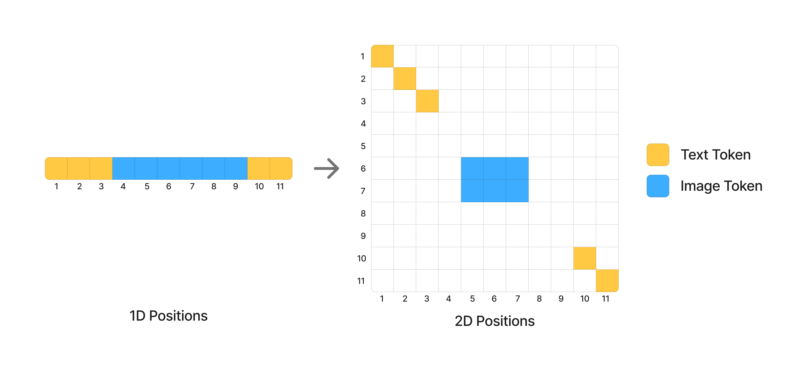

# Position Embedding（位置埋め込み / 位置符号化）

**Position Embedding（位置符号化）** とは、**Transformer に「そのトークンがどこにあるか」を教える仕組み**である。注意機構は本来トークンの集合を順序なしに扱うので、位置の情報を明示的に注入しなければ「左の犬」と「右の犬」を区別できない。

言語モデルでは 1 次元の系列位置を入れるだけで済んでいた。ところが画像生成、とりわけ**テキストと画像を同じ系列に混ぜる**設計（[[unified-multimodal-generation]]）が主流になると、これが設計上の主戦場になった。理由は単純で、**テキストは 1 次元、画像は 2 次元、動画は 3 次元**であり、**それらを 1 本の系列の中でどう座標づけるかに正解がない**からである。

本 wiki が取り込んだ範囲だけでも、この問題への答えは 5 通りある。しかも各々の**設計基準が異なる**——それが本ページの主題である。

## 前提：RoPE とは何か

現代の実装はほぼすべて **RoPE（Rotary Position Embedding, 回転位置埋め込み）** に基づく。発想は「位置を**回転**として埋め込む」ことである。

位置 $n$ のトークンについて、周波数の集合 $\{\theta_0, \theta_1, \dots\}$ を用意し、埋め込みベクトルを

$$[\cos(n\theta_{0}),\cos(n\theta_{1}),\dots,\sin(n\theta_{0}),\sin(n\theta_{1}),\dots]$$

の形で query と key に掛ける。$\theta$ が小さい成分はゆっくり回るので**長距離**の位置差を、大きい成分は速く回るので**近距離**の差を符号化する。異なる周波数を並べることで、粗い位置と細かい位置を同時に表せる。

RoPE が広く使われる理由は 2 つある。**(1) 相対位置が自然に出る**——2 つのトークンの内積が位置の差だけに依存する形になる。**(2) 外挿しやすい**——学習時より長い系列にもある程度対応できる。DiT でも LLM でも標準になった（[[diffusion-model-architecture]]）。

## 何が問題なのか

画像を扱うと、素朴な 1D RoPE では困ることが 3 つ出てくる。

**(1) 画像は 2 次元である。** 潜在を平坦化して 1 本の系列にすると、「隣の行の同じ列」が系列上では遠く離れてしまう。空間的な近さが位置符号化に反映されない。

**(2) テキストと画像を並べると、座標系が衝突する。** テキストトークンの「位置 5」と画像トークンの「位置 5」は同じ意味を持たない。単純に通し番号を振ると、テキストの末尾と画像の先頭が不自然に近接する。

**(3) 複数の画像を区別する必要がある。** 編集タスク（参照画像＋対象画像）や動画（多数のフレーム）では、**空間的には同じ場所だが別の画像に属する**トークンを区別しなければならない。

## 5 通りの答え

### (1) MSRoPE — テキストを画像の対角線上に置く（Qwen-Image）

**Qwen-Image**（[[summaries/2025-qwen-image]]）の **MSRoPE（Multimodal Scalable RoPE）** は、テキストトークンを**画像の対角線上に配置する**。

狙いは [[visual-text-rendering]] にある。画像内に文字を描くには、テキストの意味と画像の空間位置を密に結びつける必要がある。テキストを対角線に置けば、画像のどの領域からも「等しく近い」位置になり、特定の隅に偏らない。Qwen-Image-2.0 では複数画像を扱うために **frame 次元**が追加された。

### (2) 3D RoPE ＋ 仮想タイムステップ — 時間軸をずらす（FLUX.1 Kontext）

**FLUX.1**（[[summaries/2025-flux-kontext]]）は各潜在トークンを時空間座標 $(t, h, w)$ で添字づける。単一画像なら $t \equiv 0$ である。

そして FLUX.1 Kontext が編集で使うのが**仮想タイムステップ（virtual timestep）** である——コンテキスト画像のトークンに**時間軸方向の定数オフセット**を与える。対象画像は $t=0$、$i$ 番目のコンテキスト画像は $t=i$。**空間構造 $(h,w)$ をそのまま保ったまま、文脈と対象を分離できる**。

上の問題 (3) への最も簡潔な答えで、アーキテクチャに何も足さずに済む（[[instruction-based-image-editing]]）。

### (3) 3D Unified RoPE — テキストを時間軸に沿って進める（Z-Image）

**Z-Image**（[[summaries/2025-z-image]]）は逆向きの割り当てをする。**画像トークンは空間 2 次元に展開し、テキストトークンは時間次元に沿って増分する**。

編集タスクでは、参照画像と対象画像に**空間座標を揃えたまま時間次元で単位区間だけずらす**——FLUX.1 Kontext と同型の解に独立に到達している。さらに参照画像には $t=1$（クリーン）、対象画像には $t\in[0,1]$（ノイズ付き）という**異なる時間条件付けの値**も与えて二重に区別する。

### (4) Generalized 2D RoPE — 1D RoPE への後方互換性（HunyuanImage 3.0）

ここだけ**設計基準が違う**。**HunyuanImage 3.0**（[[summaries/2025-hunyuanimage-3]]）は事前学習済みの MoE LLM から出発するので、**既存の言語能力を壊してはならない**という制約が最初にある。

やり方は、1 次元の RoPE を**異方的に**2 次元へ一般化することである。位置 $(x,y)$ に対して

$$[\cos(x\theta_{0}),\cos(y\theta_{1}),\dots,\sin(x\theta_{0}),\sin(y\theta_{1}),\dots]$$

——**偶数番目の周波数は $x$ に、奇数番目は $y$ に割り当てる**。そしてテキストトークンは $x = y = n$、すなわち**対角線上**に置く。

<figure>



<figcaption>図5（引用, [[summaries/2025-hunyuanimage-3]] より）: 11 トークンの 1D 系列（テキスト 1–3、画像 4–9、テキスト 10–11）を 2D 位置へ写す。テキストは対角線上に留まり、画像は 2 行 3 列の矩形ブロックとして 2 つのテキスト区間の中間に置かれる。</figcaption>
</figure>

この構成の帰結が要点である——**画像トークンが存在しないとき、$x=y=n$ なので符号化は厳密に元の 1D RoPE に退化する**。つまり純粋なテキスト生成では、事前学習時とまったく同じ位置符号化が使われる。言語能力への破壊的な影響が原理的に生じない。

ゼロから学習する拡散モデルには存在しない制約であり、「**既存の重みを引き継ぐ**」という設計判断が位置符号化の形まで規定している例である（[[unified-multimodal-generation]]）。

### (5) 3D RoPE の時間軸を本当に時間に使う（動画）

動画（[[video-diffusion]]）では時間軸が比喩ではなく実際の時間になる。Wan（[[summaries/2025-wan]]）は潜在を $(1+T/4) \times H/16 \times W/16$ のトークン列にし、時空間の依存関係は **full spatio-temporal attention** で捉える。

面白いのは、**画像モデルが編集のために「仮想的な」時間軸を発明した**（FLUX.1 Kontext・Z-Image）のに対し、**動画モデルは実在の時間軸を持っている**ことである。多画像の区別という問題は、動画から見れば「フレームを区別する」という既に解かれた問題だった——Qwen-Image-2.0 の MSRoPE に追加された **frame 次元**は、まさにこの認識の移入にあたる。

### (6) そもそも位置符号化を置かない — NoPE（Sana）

**Sana**（[[summaries/2024-sana]]）は、上記の 5 つとは次元の違う答えを出す——**位置符号化を完全に取り除く**（NoPE, No Positional Encoding）。

これが成立する理由は、Sana の FFN が **Mix-FFN**——3×3 depthwise convolution を内蔵した FFN（[[efficient-attention]]）——だからである。畳み込みは定義上**隣接するトークンだけを混ぜる**ので、「どのトークンが空間的に隣か」という情報が層を通るたびに暗黙に伝わる。位置を明示的な符号として与えなくても、ネットワークが位置関係を再構成できてしまう。原典は PE のありなしで性能差がないことを確認したうえで、単純さのために削っている。

この設計は本ページの他の 5 つと**同じ問題を解いていない**点に注意が要る。MSRoPE も 3D Unified RoPE も「テキストと画像を同じ座標系にどう置くか」「複数画像をどう区別するか」を扱うが、Sana は単一画像の text-to-image しか扱わないので、そもそもこれらの問題が発生しない。**NoPE は「位置符号化は不要」という一般的な主張ではなく、「問題が単純なら畳み込みで代替できる」という限定的な報告**である。

そして原典自身が限界を明示している——**2K・4K への微調整では位置符号化を再導入する**（付録 B）。4K では PixArt-$\Sigma$ の PE 補間戦略まで持ち出している。畳み込みが与える局所性は、学習時と同程度の解像度では十分でも、**解像度の外挿には足りない**。これは下の「限界と未解決問題」で挙げる**解像度の外挿**という論点に対する、数少ない直接の観測データでもある。

### (7) 4 軸 RoPE の第 1 軸で参照を離す — FLUX.2（コードで確認）

**FLUX.2**（[[summaries/2025-flux2]]）はリファレンス実装なので、**本ページの他の手法と違って設計が推測でなく確認できる**。

位置 id は 4 軸 `(t, h, w, l)`、`axes_dim = [32,32,32,32]`（和が head_dim = 128）、`theta = 2000`（一般的な 10000 ではない）。

| トークン | t | h | w | l |
| --- | --- | --- | --- | --- |
| テキスト | 0 | 0 | 0 | **トークン索引** |
| 対象画像 | 0 | 0.. | 0.. | 0 |
| **参照画像 $i$** | **10·(i+1)** | 0.. | 0.. | 0 |

```python
t_off = [scale + scale * t for t in torch.arange(0, len(encoded_refs))]   # scale = 10
```

**テキストは専用の第 4 軸 `l` に置かれる**——本ページの (1) MSRoPE（対角線）や (3) 3D Unified RoPE（時間軸に沿って増分）とは別の答えで、「テキストを画像と同じ座標系に載せない」という選択である。そして**参照画像は空間座標を対象と重ねたまま、第 1 軸だけを 10 刻みでずらす**。FLUX.1 Kontext の仮想タイムステップ（(2)）と同型で、**刻み幅 10 という具体値まで含めてコードで確認できた**のは本 wiki で初めてである。

## 比較

| 手法 | テキストの置き方 | 多画像の区別 | 設計基準 |
| --- | --- | --- | --- |
| **MSRoPE**（Qwen-Image） | 画像の**対角線上** | frame 次元を追加（2.0） | 画像内テキスト描画のため、空間と意味を密結合 |
| **3D RoPE ＋ 仮想タイムステップ**（FLUX.1 Kontext） | 別枠 | **時間軸に定数オフセット** | アーキテクチャに何も足さない |
| **3D Unified RoPE**（Z-Image） | **時間次元に沿って増分** | 時間軸で単位区間ずらす＋時間条件値も変える | テキストと画像を同一座標系に |
| **Generalized 2D RoPE**（HunyuanImage 3.0） | 2D の**対角線上** | （記述なし） | **1D RoPE への後方互換＝LLM を壊さない** |
| **3D RoPE**（Wan・動画） | cross-attention で別経路 | 時間軸が実在のフレーム | 時空間の依存を素直に表現 |
| **NoPE**（Sana） | （単一画像のみ・PE なし） | 対象外 | Mix-FFN の 3×3 畳み込みが局所性を暗黙に供給。ただし 2K/4K では PE を再導入 |
| **4 軸 RoPE**（FLUX.2） | **専用の第 4 軸 `l`** | **第 1 軸を 10 刻みでずらす** | 空間座標は重ねたまま位相だけで分離。theta=2000 |

**共通する発想**が 1 つ見える——**「余分な次元を用意して、そこで区別する」**。FLUX.1 Kontext は時間軸を、Z-Image も時間軸を、Qwen-Image-2.0 は frame 次元を使う。空間座標 $(h,w)$ は画像の中身を表すのに使い切っているので、**画像どうしの区別には別の軸が要る**という構造は共通している。

**分岐するのは「テキストをどこに置くか」**である。対角線（Qwen-Image・HunyuanImage 3.0）か、時間軸（Z-Image）か、そもそも同じ空間に置かない（FLUX.1・Wan の cross-attention）か。ここに正解はまだない。

## 実装値まで降りる — Z-Image の 3D Unified RoPE（2026-08-26 追記）

上の「答え」の一覧は各原典の記述レベルで書いてある。Z-Image のリファレンス実装（[[summaries/2025-z-image]]）を読むと、**同じ設計でも実装値の選び方に幅がある**ことが見えてくる。

**第一に、周波数の底 $\theta$ が異例に小さい。**

| モデル | $\theta$ | 出典 |
| --- | --- | --- |
| 標準的な RoPE（LLM 由来） | 10000 | — |
| FLUX.2 | 2000 | [[summaries/2025-flux2]] |
| **Z-Image** | **256** | `src/config/model.py` L6 |

$\theta$ は「位置を符号化する回転の周波数がどれだけ広い帯域に散るか」を決める定数で、**小さいほど低周波成分が減り、近距離の位置差に敏感になる**（逆に遠距離の識別は苦しくなる）。LLM が長文脈のために $\theta$ を大きくしてきた（RoPE scaling）のとは**正反対の方向**である。画像トークンの座標は 1 辺せいぜい数十〜数百であり、テキストのように数万トークン先を区別する必要がない——という判断だと読める。**位置符号化のハイパーパラメータが、モダリティによって逆向きに動く**例として記録に値する。

**第二に、軸ごとの次元配分が均等でない。** head_dim 128 を $(d_t,d_h,d_w)=(32,48,48)$ に割る（`config/model.py` L7、`transformer.py` L339 が `assert head_dim == sum(axes_dims)` で強制）。**テキスト／時間軸には 32 しか与えず、空間 2 軸に 48 ずつ厚く配る。** 3D RoPE を「3 軸に均等配分」と理解していると取り違える。軸長は $[1536, 512, 512]$——テキストは最大 1536 位置、画像は 1 辺 512 トークン（$f8$＋patch 2 なので 8192px 相当）まで。

**第三に、座標の割り当てに「予約席」がある。**

```
第 1 軸（時間）  第 2,3 軸（空間）
──────────────────────────────
0                (0, 0)          ← パディングトークン専用
1 … L_cap        (0, 0)          ← テキスト（1 から増分）
L_cap+1          (h, w)          ← 画像（全トークンが同じ第 1 軸値）
```

報告書の「テキストトークンは時間次元に沿って増分する」の具体形がこれである（`transformer.py` L391–443）。押さえるべき点が 2 つ。**画像トークンは第 1 軸の値を全員が共有する**——画像は時間軸上の「1 点」に置かれ、その内部で空間 2 軸に展開される。そして**位置 0 はパディング専用に空けてある**。系列を 32 の倍数に揃えるためのパッドトークン（学習済みパラメータ）が全部そこに座る。位置符号化の座標系に**構造的な意味を持つ番地を予約する**という設計は、本ページが扱ってきたどの答えにもなかった。

**第四に、連結順が `[画像, テキスト]`** である（L552）。FLUX 系は逆順。第 1 軸の割り当てはテキストが先に消費し画像が後を取るので、**系列順と座標順が一致していない**——これも実装を読まないと分からない部分である。

## 限界と未解決問題

- **アブレーションが乏しい**。どのレポートも自分の方式を説明するが、**他の方式との直接比較はまず示されない**。MSRoPE と Generalized 2D RoPE のどちらが良いのかを判断する材料が存在しない。
- **解像度の外挿**。学習時より大きい画像を生成すると位置座標が学習範囲外に出る。RoPE は外挿に比較的強いとされるが、画像でどこまで効くかは体系的に検証されていない。**Sana が 1K では NoPE で足りるのに 2K/4K では PE を再導入せざるを得なかった**ことは、位置情報の必要量が解像度に依存することを示す一例である。FLUX.1 の**動的時間シフト**（解像度に応じてノイズ水準をスケールする・[[noise-schedule]]）は関連する対処だが、位置符号化そのものへの対処ではない。
- **系列長との相互作用**。動画では系列長が 100 万トークンに達する（[[video-diffusion]]）。この規模で位置符号化の設計がどう効くかは、[[large-scale-training-infrastructure]] の制約と絡んで未整理である。
- **多画像の上限**。仮想タイムステップも frame 次元も、原理的には任意個の画像を扱えるはずだが、学習時に見た数を超えて汎化するかは検証されていない。
- **アスペクト比の扱い**。HunyuanImage 3.0 の自動解像度（`<img_ratio_*>` を語彙に持つ）は形状を予測してから 2D RoPE を組むが、**任意のアスペクト比に対する位置座標の正規化**をどうすべきかは各実装で異なり、整理されていない。

## 既存知識との接続

- [[diffusion-model-architecture]]：位置符号化はバックボーン設計の一部だが、**マルチモーダル化・多画像化の主戦場**になったことで独立に扱う価値が出た。DiT の adaLN が「条件をどう注入するか」を扱うのに対し、こちらは「トークンをどう位置づけるか」を扱う。
- [[unified-multimodal-generation]]：1 次元の系列に 2 次元の画像を埋め込む問題そのもの。事前学習済み LLM を引き継ぐ場合、**1D RoPE への退化**という追加の制約が付く。
- [[instruction-based-image-editing]]：参照画像と対象画像の区別が、位置符号化の設計で解かれる。FLUX.1 Kontext の仮想タイムステップと Z-Image の時間軸オフセットは、**同じ問題への同型の答え**である。
- [[video-diffusion]]：時間軸が実在する唯一のケース。画像側が「仮想的な」時間軸を発明したのと対照的で、多画像の区別という問題が動画では最初から解かれていた。
- [[visual-text-rendering]]：MSRoPE の動機はここにある。画像内に文字を描くには、テキストの意味と空間位置を密に結びつける必要がある。
- [[image-tokenizer]]：位置符号化の対象となるトークンの粒度は圧縮率が決める。$f8$ か $f16$ かでトークン数が 4 倍変わり、位置座標の範囲も変わる。

## 参考文献（summaries）

- [[summaries/2025-hunyuanimage-3]] — HunyuanImage 3.0（**Generalized 2D RoPE**。周波数を x と y へ交互に割り当て、テキストを対角線に置くことで**画像がなければ 1D RoPE に厳密に退化**させる）
- [[summaries/2025-qwen-image]] — Qwen-Image（**MSRoPE**。テキストを画像の対角線上に配置。2.0 で frame 次元を追加）
- [[summaries/2025-flux-kontext]] — FLUX.1 Kontext（因子分解 3D RoPE と**仮想タイムステップ**。時間軸の定数オフセットで文脈画像を分離）
- [[summaries/2025-z-image]] — Z-Image（**3D Unified RoPE**。テキストを時間次元に沿って増分させ、編集では空間座標を揃えて時間軸をずらす）
- [[summaries/2025-wan]] — Wan（動画。時間軸が実在のフレームに対応する）

> 未取り込みの主要原典：RoFormer / RoPE 原典（Su ら 2021）、ALiBi、正弦波位置符号化（Vaswani ら 2017）。今後の ingest で本ページへ追記する。
