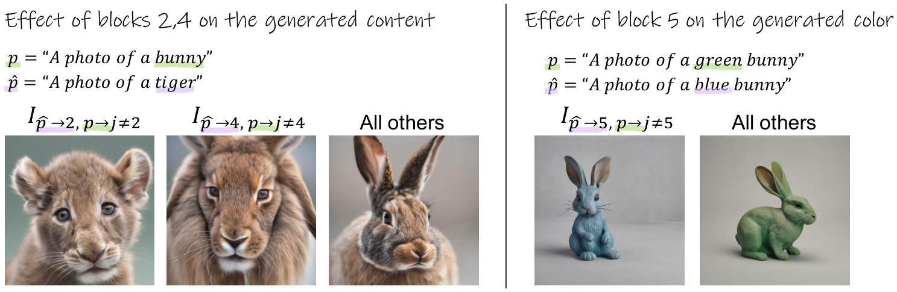

# Style-Content Disentanglement（スタイル-コンテンツ分離）

**Style-Content Disentanglement（スタイル-コンテンツ分離）** とは、**画像の「見た目」（スタイル：色・筆致・質感・様式）と「中身」（コンテンツ：物体・構造・意味）を別々に取り出し、一方を保ったまま他方だけを操作できるようにする**ことである。「この写真をゴッホ風に」「このイラストの画風で別の物体を描いて」といった要求は、すべてこの分離が前提になっている。

問題の本質は、**スタイルとコンテンツが本来分かちがたく結びついている**ことにある。輪郭の描き方はスタイルでもありコンテンツでもあり、色は様式の一部でもあれば被写体の同一性そのもの（消防車の赤）でもある。ここから**スタイルの変換とコンテンツの保存の間の本質的なトレードオフ**が生じ、この分野のほぼすべての手法がその折り合いをどこで付けるかを競っている。

本 wiki のランドマークは **B-LoRA**（[[summaries/2024-b-lora]]）と **ZipLoRA**（[[summaries/2024-ziplora]]）で、**同じ問題に正反対の答え**を出している。

## 4 つのアプローチ

| 系統 | 何をするか | 代表 | 組合せごとの追加学習 |
| --- | --- | --- | --- |
| **(a) 別々に学習してマージ** | style LoRA と content LoRA を作り、干渉を抑えて混ぜる | ZipLoRA | **必要** |
| **(b) 内在する分離を見つける** | モデル内で既に役割分化している層だけを学習する | B-LoRA, InstantStyle | 不要 |
| **(c) 注意特徴の共有・操作** | 推論時に注意の特徴を参照画像から借りる | StyleAligned, Cross Image Attention, Plug-and-Play | 不要（学習自体が不要） |
| **(a′) 混ぜずに片方を選ぶ／射影してから足す** | 既存 LoRA をそのまま使い、干渉を推論時または射影で断つ | K-LoRA, NP-LoRA | **不要** |
| **(d) エンコーダ／アダプタ** | 参照画像を埋め込みに落として注入する | IP-Adapter, InstantStyle | 不要（事前学習済み） |

系統 (c) は [[training-free-conditioning]] の発想（事前学習済みモデルを凍結し、サンプリング過程だけで条件を課す）をスタイルへ適用したもの、(d) は [[controllable-generation]] のアダプタ路線にあたる。本ページは主に (a) と (b) を扱う。

## (a) 別々に学習してマージする — ZipLoRA

**ZipLoRA**（[[summaries/2024-ziplora]]）は素直な定式化を採る。被写体（content）の LoRA と画風（style）の LoRA を DreamBooth-LoRA で別々に学習し、それらを安全にマージする。素朴な直和が壊れる理由は**列の cosine 類似度が高いと信号が干渉する**ことにあるので、層・列ごとの学習可能な混合係数 $m_c, m_s$ を導入して

$$\Delta W_m = m_c \otimes \Delta W_c + m_s \otimes \Delta W_s$$

を最適化する。損失は「個別 LoRA の挙動を保つ」項と「両者が同じ列を使わない」直交化項からなる。詳細は [[lora-merging]] の系統 (3) を参照。

**構造的な代償が 1 つある**——マージ係数はコンテンツとスタイルの**組合せごとに**学習される。$n$ 個のコンテンツと $m$ 個のスタイルがあれば $n \times m$ 回の最適化が要る。LoRA の第一の利点である「一度学習して自由に差し替える」が、ここで失われる。

## (b) 内在する分離を見つける — B-LoRA

**B-LoRA**（[[summaries/2024-b-lora]]）は問題設定ごと降りる。**そもそもモデルの中でスタイルとコンテンツは既に別の場所に住んでいるのではないか？**

<figure>

<figcaption>図（[[summaries/2024-b-lora]] 図4）: SDXL のブロックへのプロンプト注入。「A photo of a bunny」を全ブロックに入れつつブロック 2 または 4 にだけ「A photo of a tiger」を注入するとトラが生成される（左）。ブロック 5 だけに違う色のプロンプトを入れると色が変わる（右）。</figcaption>
</figure>

SDXL の UNet（70 注意層／11 transformer ブロック）の内側 6 ブロックについて、**1 つだけに違うプロンプトを注入して生成画像がどちらに似るかを CLIP で測る**——400 プロンプト対で平均を取ると、**$W_0^2$ と $W_0^4$ がコンテンツを、$W_0^5$ が色を支配する**ことが分かる。

そこで **$\{\Delta W^4, \Delta W^5\}$ の 2 ブロックだけを、単一画像から、プロンプト「A [v]」で共同学習する**。すると $\Delta W^4$ がコンテンツを、$\Delta W^5$ がスタイルを勝手に捉える。片方を別画像のものと差し替えるだけでスタイル転送・テキストスタイライゼーション・一貫スタイル生成のすべてが**追加学習ゼロ**で成立する。

### 「共同で」が効く理由

本手法の核心は、2 ブロックを**独立にではなく共同で**学習する点にある。同じ再構成損失を 2 つの $\Delta W$ が分担するとき、**$W_0^4$ がもともとコンテンツに強い層である以上、コンテンツの説明責任は自然にそちらへ寄り**、残り（色・質感）が $\Delta W^5$ へ押し出される。**分離は損失関数のどこにも書かれておらず、アーキテクチャの偏りと容量制約が生む副産物である。**

これを裏づけるのが上三角 8×8＝36 通りのブロック対アブレーションで、**$(2,5)$ は再構成品質は良いのに分離が弱まる**——$W_0^2$ が浅くて細部を捉えきれないぶん、$\Delta W^5$ がコンテンツの詳細まで肩代わりしてしまうためである。**再構成品質と分離品質は別物**という指摘は、この系統の設計指針として一般性がある。

副次的な効果も大きい。学習容量が構造的に絞られているため**過学習しない**（他手法が 400 ステップで止めるところ 1000 ステップ回せる）、そして**保存量が 70% 減る**。

### 独立した傍証

同時期の **InstantStyle** も、まったく別のアプローチ（IP-Adapter の CLIP 埋め込み注入）でありながら、**スタイルの条件付けに同じ第 5 ブロックを選んでいる**。異なる手法が独立に同じ層へ収束したことは、この役割分化が実在することの強い傍証になっている。

## (a′) 既存の LoRA をそのまま使う — K-LoRA と NP-LoRA

(a) の ZipLoRA は組合せごとの再最適化を要し、(b) の B-LoRA は専用の学習を要する。**どちらもコミュニティに既にある LoRA 資産をそのまま使えない。** 2025 年に現れた 2 本は、この空白を別々のやり方で埋める。

**K-LoRA**（[[summaries/2025-k-lora]]）は**重みを混ぜること自体をやめる**。各注意層で content と style の Top-K 要素の絶対値和を比較し、勝った方の層をそのまま使う。加えて「初期の拡散ステップは被写体、後期はスタイルを担う」という観察を時間依存のスケール係数として実装する。$\Delta W$ には一切手を触れないので、Hugging Face の LoRA をそのまま投入できる。

**NP-LoRA**（[[summaries/2025-np-lora]]）は**足す前に射影する**。スタイル LoRA を SVD して主方向 $V_k$ を保護対象と定め、コンテンツ LoRA をその零空間へ落としてから足す。Tikhonov 正則化から導かれるソフト射影 $P_\text{soft}=I-\frac{\mu}{1+\mu}V_kV_k^\top$ により、$\mu$ ひとつで直和から硬射影までを連続的に動かせる（詳細は [[lora-merging]] の系統 (6)）。

### 2 本が示した鏡像——本ページの中心的な論点の実証

この 2 本を並べると、下の「評価の落とし穴」で述べる交絡が最も鮮明な形で現れる。

| | 被写体（content） | スタイル |
| --- | --- | --- |
| K-LoRA 自身の表 | **CLIP 69.4 / DINO 46.9（1 位）** | 58.7（ZipLoRA 60.4・Joint 68.2 に劣る） |
| NP-LoRA の表 | 0.73（K-LoRA 0.76 に劣る） | **CLIP 0.59 / DINO 0.33（1 位）** |

**両者の事実認識は完全に一致している。** NP-LoRA は本文で「K-LoRA は被写体の同一性をよく保存するが、所望のスタイルの捕捉に苦戦する」と明記し、自らの表でも K-LoRA を content 最良と記録する。K-LoRA も自らの表でスタイル 3 位を隠していない。**違いはどちらの軸で勝つかを選んだ点にしかない。**

さらに K-LoRA の表にある **Joint（共同学習）が Style Sim 68.2% で最高なのに DINO は 17.4%** という組合せが決定的である。これは**スタイルを塗りつぶして被写体を失った状態**であり、それでもスタイル指標は最良になる。**2 つの指標はトレードオフ曲線上の座標であって、片方だけを見て順位を付けることに意味はない。**

NP-LoRA はこれに具体的な提案で応じる——**調和平均 $S_\text{harm}$** の導入である。4 指標の調和平均は片方が低いと大きく下がるので、「片側だけ勝つ」戦略が報われない。本ページが提起してきた指標の問題に対する、この分野で初めての正面からの手当てにあたる。

## 「スタイル」とは何かという未解決の問題

この分野の根の深い問題として、**スタイルの操作的定義が定まっていない**ことがある。

B-LoRA のブロック解析は、**色をスタイルの代理として用いている**。理由は率直で、「CLIP はスタイルの変化より色の変化をよく捉える」からである。つまり厳密に同定されたのは「ブロック 5 は**色**を支配する」であって、スタイル一般ではない。

そしてこの近似のツケは、そのまま限界として返ってくる——**物体固有の色までスタイル側に取り込まれ、コンテンツの同一性が壊れる**。消防車を「水彩画風」にすると赤も失われる。B-LoRA は $\Delta W^5$ に係数 $\alpha \in [0.4, 0.5]$ を掛ける対症療法を提案するが、これは**分離が完全でないことを認めた**うえでの手当てである。著者ら自身、今後の課題として「構造・形状・色・テクスチャといった下位成分へのより具体的な分離」を挙げている。

## 評価の落とし穴：コンテンツ類似度が高いことは良いことではない

本領域の評価には、[[aesthetic-scoring]] が美的スコアについて指摘したのと同種の構造的な罠がある。

スタイル転送の品質は通常、出力と参照スタイル／参照コンテンツの **DINO 埋め込みのコサイン類似度**で測られる。ところが**コンテンツ類似度が高いモデルは、単にコンテンツ画像に過学習してスタイルを乗せられていないだけ**かもしれない。実際 B-LoRA の評価では、スタイル整合で最良（0.881）である一方、コンテンツ整合では ZipLoRA（0.841）に負けている。

著者らはこれを検証するために**参照コンテンツを 1 枚に絞った追加実験**を行い、**全手法でスタイル整合が下がりコンテンツ整合が上がる**ことを示した（ZipLoRA は content 0.841 → 0.933、style 0.796 → 0.782）。2 つの指標が逆相関するなら、**片方だけを見て順位を付けることに意味はない**。

現状、この分野には合意されたベンチマークが存在せず、評価は DINO / CLIP 類似度とユーザースタディの組合せに依存している。しかも比較対象の実装が非公式であることも多い（B-LoRA の比較では ZipLoRA が非公式実装、StyleDrop は著者らによる SDXL 再実装）。**数値の絶対水準より、こうした交絡を著者が明示的に検証しているかどうかで論文を読む**必要がある。

## 層の役割分化という視点

B-LoRA の発見は、スタイル転送という応用を超えた含意を持つ。**事前学習済みの生成モデルの内部には、誰も設計していない役割分化が既に存在する**——そしてそれは、どの層に LoRA を当てるかという実務的な判断に直結する。

[[low-rank-adaptation]] は伝統的に「注意・線形層すべてに当てる」を既定としてきたが、B-LoRA は**当てる場所を選ぶこと自体が手法になる**ことを示した。$\mathcal{P}+$（層ごとに異なるテキスト埋め込みを最適化）や、[[summaries/2023-sdxl]] が transformer block を不均一に配分したこと、[[summaries/2023-mix-of-show]] の層ごと埋め込み（ED-LoRA）も、同じ「層は等価ではない」という認識の系譜に属する。

同じ発想は本 wiki の他の場所にも現れる。[[position-embedding]] の **NoPE**（Mix-FFN の畳み込みが暗黙に位置情報を供給するので位置符号化を削れる）は「モデルが既に持っているものを見つけて、明示的な機構を外す」という同型の動きである。[[image-tokenizer]] の DINOv2 意味的整合や [[pixel-space-diffusion]] の DINO 損失が「**外から**意味的な足場を与える」処方箋だったのに対し、こちらは「**内に**既にあるものを読み出す」。

## 限界と未解決問題

- **アーキテクチャ依存性が高い。** 「ブロック 4 がコンテンツ、5 がスタイル」は SDXL の UNet に固有の経験則であり、原理から導かれたものではない。[[diffusion-model-architecture]] の潮流は U-Net → DiT → MM-DiT → 単一ストリームと進んでおり、**均質な Transformer 積層で同じ分離が現れる保証はない**。UNet のダウン／ミドル／アップという非対称構造こそが役割分化の温床だったとすれば、この知見の賞味期限は短い可能性がある。**現時点で本 wiki に DiT 系での層役割分析の原典はない。**
- **なぜ分化するのかが未解明。** 解像度なのか、UNet 内の位置なのか、学習データの統計なのか。現象は複数の研究で独立に確認されているが、機序は説明されていない。
- **分離の粒度が粗い。** 現状は「スタイル」対「コンテンツ」の二分法で、構造・形状・色・質感といった下位成分へは分解できていない。色の扱いが最大の実害を出している。
- **評価ベンチマークが存在しない。** [[aesthetic-scoring]] が ERIA-1K を、[[multi-concept-customization]] が ComposLoRA を用意したような共通の土俵がない。
- **複数スタイルの合成が未着手。** B-LoRA の著者らが今後の課題に挙げるとおり、複数の物体や複数のスタイルを組み合わせる方向は手つかずである。ここは [[multi-concept-customization]] と合流する論点になる。

## 既存知識との接続

- [[lora-merging]]：ZipLoRA は本ページの系統 (a) であり、[[lora-merging]] の系統 (3)（学習係数マージ）でもある。「複数 LoRA を混ぜる」という一般問題の、style×content という特殊ケースにあたる。
- [[low-rank-adaptation]]：B-LoRA は LoRA を**どこに当てるか**を設計変数に昇格させた。$\Delta W$ の疎性（ZipLoRA）と並ぶ、LoRA の性質に関する重要な観察。
- [[subject-driven-generation]]：被写体の同一性を保つ personalization と本ページは表裏である。DreamBooth は「同一性を捉える」、本ページは「同一性と様式を切り分ける」。B-LoRA が単一画像で動くのは、personalization 系が数枚を要するのと対照的。
- [[multi-concept-customization]]：複数概念を 1 枚に載せる問題。style と content の 2 成分に限れば本ページ、任意個の被写体に広げればあちら。
- [[character-consistency]]：同じ被写体を複数枚にわたって保つ時間方向の一貫性。「同一性を保ちながら見た目を変える」という点で本ページと目的を共有し、FLUX.1 Kontext（[[summaries/2025-flux-kontext]]）の visual drift の議論と接続する。
- [[instruction-based-image-editing]]：「変えるべき所だけ変える」という編集の要請は、スタイル-コンテンツ分離の一般化にあたる。Qwen-Image の意味特徴／再構成特徴の二重符号化は、分離を**入力表現の側**で行う別解と読める。
- [[diffusion-model-architecture]]：層の役割分化という観察は、アーキテクチャ設計そのものへのフィードバックになりうる。
- [[model-merging]]：content×style の 2 個マージは汎用の $K$ 個マージの最小ケースにあたる。ただし本ページの設定は「両方を等しく保つ」のではなく**どちらを保護するか**という非対称な問題になる点が異なる（NP-LoRA の射影の向きの非対称性）。
- [[training-free-conditioning]]：StyleAligned・Cross Image Attention・Plug-and-Play といった系統 (c) は、凍結モデルの注意を推論時に操作するという点で同じ枠組みに属する。

## 参考文献（summaries）

- [[summaries/2024-b-lora]] — B-LoRA（SDXL のブロック 4/5 が content/style を支配することをプロンプト注入で同定し、その 2 ブロックのみを単一画像から共同学習。マージ機構も組合せごとの再最適化も不要、保存量 70% 減、過学習しない）
- [[summaries/2024-ziplora]] — ZipLoRA（content LoRA と style LoRA を列ごとの学習係数で干渉最小化してマージ。組合せごとに最適化が必要という構造的代償を持つ）
- [[summaries/2025-k-lora]] — K-LoRA（既存 LoRA をそのまま使う学習不要の融合。層ごとに Top-K 和で片方を選び、時間依存スケールで初期 content・後期 style へ傾ける。**content で最良・style で 3 位**）
- [[summaries/2025-np-lora]] — NP-LoRA（加重マージでは干渉が原理的に消せないことを証明し、主方向の零空間へ射影。**style で最良・content で 4 位**。調和平均 $S_\text{harm}$ で指標の交絡に対処）

> 未取り込みの主要原典：Neural Style Transfer（Gatys ら 2016）、AdaIN（Huang & Belongie 2017）、StyleDrop（Sohn ら 2023）、StyleAligned（Hertz ら 2023）、InstantStyle（Wang ら 2024, 独立に同じブロック 5 へ到達）、IP-Adapter（Ye ら 2023）、Cross Image Attention（Alaluf ら 2023）、Plug-and-Play（Tumanyan ら 2023）、$\mathcal{P}+$（Voynov ら 2023）。今後の ingest で本ページへ追記する。
