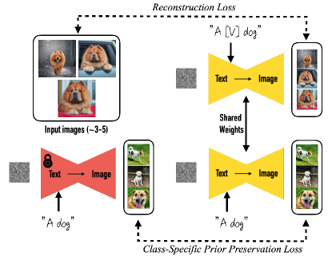

# Subject-Driven Generation / Personalization（被写体駆動生成 / 個人化）

**Subject-Driven Generation（被写体駆動生成）**、別名 **Personalization（個人化）** とは、**ユーザーが与えた特定の被写体（subject, 例: 自分の犬・特定のバッグ・キャラクター）のわずか数枚の画像から、事前学習済みの生成モデルをその被写体に適応させ、被写体の同一性（identity）を保ったまま新しい文脈・姿勢・スタイルで再生成できるようにする**タスク／技術である。汎用の [[text-to-image-generation]]（テキストからの画像生成）が「テキストで言えるもの」しか作れないのに対し、被写体駆動生成は「**この特定の対象**」をモデルに教え込む点が異なる。ランドマーク手法は **DreamBooth**（Ruiz ら 2023・[[summaries/2023-dreambooth]]）と、同時期の **Textual Inversion**（Gal ら 2022）である。

## なぜ難しいのか——同一性の保持

大規模 T2I 拡散モデル（Imagen, Stable Diffusion, DALL-E 2）は強力だが、その出力ドメインの表現力には限界がある。「白い文字盤に黄色い数字 3 のレトロな黄色い目覚まし時計」とどれだけ詳細にテキストで記述しても、毎回少しずつ違う時計が出てくる——**特定の個体の細部を一貫して再現できない**。被写体の写真を「画像条件」として渡しても（DALL-E 2 の image-guided 生成）、内容のバリエーションを作るだけで同一性は保てない。被写体駆動生成は、この「同一性の保持」と「新文脈での自由な再生成」を両立させることを目標にする。

技術的な核は、**新しい概念（被写体）を、少数画像から、汎用モデルの強力な事前分布（prior）を壊さずに埋め込む**こと。素朴な少数ショット fine-tune は過学習・多様性低下・**language drift（言語ドリフト, 汎用語の意味が崩れる現象）**を招くため、各手法はこれをどう抑えるかで特徴づけられる。

## 二大アプローチ

被写体を「モデルのどこに」埋め込むかで、2 つの代表的なやり方がある。

### 代表手法 1: DreamBooth（Ruiz ら 2023）— 全層 fine-tune ＋ prior 保存

[[summaries/2023-dreambooth]] は、**モデルの重み全体を fine-tune** して被写体をモデルの出力ドメインに植え込む。

- **rare-token 識別子**：入力画像を「a [V] [class noun]」（例: 「a [V] dog」）でラベル付け。class noun でモデルの持つクラス prior に被写体を繋ぎ、語彙中の希少トークン [V]（弱い prior）で被写体を結合する。
- **class-specific prior preservation loss（PPL）**：fine-tune 前の凍結モデルが「a [class noun]」で自己生成したクラスサンプルを教師に加え、language drift と多様性低下を防ぐ（モデルが自分の prior を「復習」する）。
- 3〜5 枚・約 1000 iter・1 GPU 5 分程度。Imagen でも Stable Diffusion（[[latent-diffusion]]）でも動く。被写体の細部まで高忠実に保ち、新規ポーズ・視点・スタイルを生成できる。

<figure>

<figcaption>図3（引用, [[summaries/2023-dreambooth]] より）: DreamBooth の fine-tune。上の経路が「[V] dog」での被写体再構成損失、下の経路が「a dog」での class-specific prior preservation loss（重みは共有）。</figcaption>
</figure>

### 代表手法 2: Textual Inversion（Gal ら 2022）— 埋め込みだけを学習

Textual Inversion（Gal ら 2022・[[summaries/2022-textual-inversion]]）は対照的に、**モデルを凍結したまま、テキスト埋め込み空間に新しい「擬似単語（pseudo-word）」 $S_*$ のトークン埋め込み $v_*$ を 1 つだけ最適化**する。3〜5 枚の概念画像と「A photo of $S_*$」等の中立テンプレについて、凍結した LDM（[[latent-diffusion]]）の再構成損失 $\|\epsilon-\epsilon_\theta(z_t,t,c_\theta(y))\|^2$ を最小化し、$v_*$ だけを勾配降下で求める（$c_\theta$・$\epsilon_\theta$ は固定、概念あたり約 2 時間）。学習対象が単一ベクトルなので極めて軽量・可搬（数 KB の埋め込みファイルを共有するだけ）。

注目点は、GAN inversion 由来の複数ベクトル化・正則化・画像ごとトークンを試しても**単一語が最良**で、テキスト埋め込み空間にも GAN inversion で知られる **distortion-editability トレードオフ**（再構成忠実度と編集しやすさが両立しない関係）が存在すること——学習率を上げ下げするだけでこの曲線上を移動でき、ユーザーが再現性と編集性のバランスを選べる。同じ枠組みで画風の擬似単語化や "Doctor" 等のバイアス低減も行える。一方、**凍結モデルの表現力に縛られる**ため被写体の細部の忠実度は DreamBooth に劣り（[[summaries/2023-dreambooth]] 表1・2 で DreamBooth が大差で上回る）、精密な形状よりも概念の「意味的本質」を捉えるにとどまる。DreamBooth と本手法は **personalized text-to-image generation を確立した二大原典**で、前者が全層 fine-tune による高忠実、後者が埋め込みのみの最軽量という対照をなす。

### トレードオフ

| | 学習対象 | 表現力（被写体忠実度） | 軽さ・可搬性 |
| --- | --- | --- | --- |
| DreamBooth | モデル全層 | 高い | 重い（モデル丸ごと複製、約 3GB） |
| Custom Diffusion | cross-attention の $W^k,W^v$（約 5%）＋ $V^*$ | 高い（DreamBooth 同等） | 軽い（75MB、SVD で更に圧縮可） |
| [[low-rank-adaptation]]（LoRA） | 低ランク更新 $\Delta W=BA$ | 中〜高 | 軽い（数 MB、プラグ&プレイ） |
| Textual Inversion | トークン埋め込みのみ | 低め | 非常に軽い |

## 後続の流れ

DreamBooth の「重い全層 fine-tune」と Textual Inversion の「表現力不足」の間を埋める手法が続いた。代表が **[[low-rank-adaptation]]（LoRA）**——低ランクの重み更新 $\Delta W=BA$ だけを学習する軽量手法で、数 MB のプラグ&プレイ・モジュールとして共有でき、現在の拡散 personalization の主流になった（[[summaries/2022-lora]]）。**Custom Diffusion**（[[summaries/2023-custom-diffusion]]）も同系で、cross-attention の key/value 射影 $W^k,W^v$（全体の約 5%・75MB）だけを数枚・約 6 分で fine-tune し、modifier token $V^*$ と実画像 200 枚の正則化で過学習・language drift を抑える——DreamBooth（全層）と Textual Inversion（埋め込みのみ）の中間の表現力／コストにあたる。さらに Custom Diffusion は **複数の新概念を 1 枚に合成**（joint training／閉形式の重みマージ）するタスクを切り開き、複数の単一概念を 1 枚に合成する [[multi-concept-customization]] へと発展する。

被写体だけでなく**画風（style）も別個に personalize し、両者を合成する**方向もある。**ZipLoRA**（[[summaries/2024-ziplora]]）は、DreamBooth で学んだ被写体（content）LoRA と、SDXL（[[summaries/2023-sdxl]]）の単一画像スタイル学習で得た style LoRA を、列ごとの学習係数で干渉なくマージし「任意の被写体を任意のスタイルで」描く。被写体 personalization と画風 personalization を分離して学習・再結合する点で、本ページの単一概念 fine-tune を [[lora-merging]] へつなぐ。

別の方向として、**物体ごとの学習を一切せず zero-shot で被写体を扱う**手法もある。**AnyDoor**（[[summaries/2023-anydoor]]）は参照物体画像をシーンの指定位置に合成する（[[image-composition]]）。DreamBooth の「テキストで新文脈に生成（tuning 型）」に対し、AnyDoor は「与えられたシーン・位置に合成（zero-shot・参照ベース）」で、対象の同一性保持という目標を共有しつつ入出力と学習方式が対照的である。

## 既存知識との接続

- [[text-to-image-generation]]：被写体駆動生成は T2I 拡散モデルの下流応用。汎用 T2I が苦手な「特定個体の同一性保持」を補う。
- [[latent-diffusion]]：Stable Diffusion を personalize する場合、U-Net（と任意でテキストエンコーダ）を学習しデコーダは固定する。
- [[denoising-diffusion]]：DreamBooth の PPL は標準の拡散損失（$\hat{x}$／ε 予測）の上に prior 保存項を足したもの。
- [[classifier-free-guidance]]：個人化モデルからのサンプリングも CFG でプロンプト忠実度を高めるのが通例。
- [[training-free-conditioning]]：RePaint 等の「学習しない」推論時条件付けとは対照的に、被写体駆動生成は（DreamBooth/LoRA では）少数画像で**学習する**ことで新概念を埋め込む。

- [[image-composition]]：AnyDoor のように、物体ごとの学習なし（zero-shot）で参照物体をシーンの指定位置に合成する姉妹タスク。tuning 型の本ページと対照的。
- [[low-rank-adaptation]]：personalization を低ランク更新で軽量に行う代表手法（LoRA）。DreamBooth と Textual Inversion の中間。
- [[multi-concept-customization]]：複数の単一概念 LoRA／被写体を 1 枚に合成する発展タスク。
- [[lora-merging]]：被写体 LoRA と画風 LoRA を重みレベルで合成する系統（ZipLoRA）。単一概念 personalization の再結合先。

## 参考文献（summaries）

- [[summaries/2023-dreambooth]] — DreamBooth（全層 fine-tune＋rare-token id＋prior preservation loss）
- [[summaries/2022-textual-inversion]] — Textual Inversion（凍結モデル＋擬似単語の埋め込みのみ学習。personalization を提唱した原典）
- [[summaries/2023-custom-diffusion]] — Custom Diffusion（cross-attention K/V 限定 fine-tune＋多概念合成。DreamBooth/TI の中間で多概念カスタマイズの源流）
- [[summaries/2023-anydoor]] — AnyDoor（zero-shot・参照ベースの物体合成、tuning 型との対比）
- [[summaries/2022-lora]] — LoRA（低ランク適応による軽量 personalization の基礎）
- [[summaries/2024-ziplora]] — ZipLoRA（被写体 content LoRA × 画風 style LoRA の学習係数マージ）
