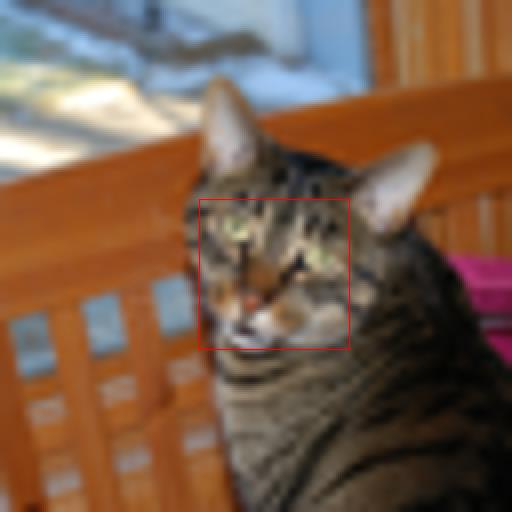

# Super-Resolution（超解像）

**Super-Resolution（超解像, SR）** とは、低解像度の画像を入力として、細部を補いながら高解像度の画像を復元するタスクである。1 枚の低解像度画像から高解像度版を作る single-image super-resolution が代表的。低解像度画像には複数の妥当な高解像度解が存在する（情報が失われている）ため、本質的に「低解像度画像に条件付けて高解像度画像を生成する」条件付き生成問題である。

本ページは超解像という概念の俯瞰と、拡散ベースの代表手法を解説する。

## 技術的な要点

- **条件付け**：低解像度画像を生成モデルに与える。拡散モデルでは低解像度画像を（アップサンプルして）生成対象に**連結（concat）**するのが標準的（[[latent-diffusion]]、SR3）。
- **評価指標のジレンマ**：**PSNR / SSIM**（ピクセル一致を測る古典的指標）は高いほど良いとされるが、これらは**ぼやけた平均的な出力を好み、人間の知覚と必ずしも一致しない**。一方 **FID** は写実的なテクスチャの再現を評価する。生成的な超解像はシャープで写実的だが PSNR は単純な回帰モデルに劣る、というトレードオフがよく現れる。
- **汎化**：bicubic ダウンサンプリングだけで学習した SR モデルは、実世界の劣化（圧縮・ノイズ・ぼかしの複雑な重畳）にうまく汎化しない。多様な劣化過程で学習すると汎用アップサンプラーになる。

## 代表手法

### Latent Diffusion（LDM-SR, Rombach ら 2022）

[[latent-diffusion]] は、低解像度画像を潜在に連結する形で超解像に適用した。ImageNet の $4\times$ 超解像で、拡散ベースの先行手法 **SR3** を **FID で上回る**（SR3 は IS でやや上）。PSNR/SSIM では単純な画像回帰モデルに劣るが、これは前述の「PSNR はぼやけを好む」ジレンマによるもので、ユーザー調査では LDM-SR が好まれた（[[summaries/2022-latent-diffusion]] 表5、図10）。

固定の bicubic 劣化で学習した LDM-SR は前処理が違う画像に汎化しないため、JPEG 圧縮・センサーノイズ・各種補間・ガウスぼかし等をランダムに適用する **BSR 劣化**で学習した汎用版 **LDM-BSR** も提案され、任意入力の汎用アップサンプラーとして $1024^2$ までアップスケールできる。

<figure>

<figcaption>図10（再掲, [[summaries/2022-latent-diffusion]] より）: ImageNet 64→256 超解像。LDM-SR は写実的なテクスチャの描画に強みがあり、SR3 はより一貫した微細構造を合成できる。</figcaption>
</figure>

## 既存知識との接続

- [[latent-diffusion]]：低解像度画像を潜在へ連結する条件付けで超解像に適用した代表手法（LDM-SR / LDM-BSR）。
- [[denoising-diffusion]]：超解像拡散モデルの生成エンジンとなる拡散の基礎。
- [[image-inpainting]]：同じく「空間的に整列した条件を連結する」密な条件付きタスクで、LDM では共通の枠組みで扱われる。

## 参考文献（summaries）

- [[summaries/2022-latent-diffusion]] — Latent Diffusion Models（LDM-SR / LDM-BSR による超解像）
