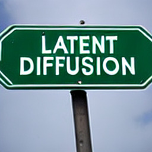

# Text-to-Image Generation（テキストからの画像生成）

**Text-to-Image Generation（テキストからの画像生成, T2I）** とは、「a painting of the last supper by Picasso」のような自然言語の記述（テキストプロンプト）を入力として、それに合致する画像を生成するタスクである。拡散モデルの時代に入って爆発的に実用化し、Stable Diffusion・DALL·E 2・Imagen といったモデルで一般に広く知られるようになった、現在の画像生成 AI の中心的応用である。

本ページは text-to-image 生成という概念の俯瞰と、代表手法（特に拡散ベース）を解説する。テキスト条件をどうモデルに与えるか（条件付け機構）と、条件への忠実度をどう高めるか（guidance）が技術的な核になる。

## 技術的な要点

text-to-image を成立させるには 2 つの要素が要る。

1. **テキスト条件付け（conditioning）**：テキストを画像生成モデルに「効かせる」仕組み。テキストをテキストエンコーダ（Transformer や CLIP テキストエンコーダ）で埋め込みに変換し、生成側へ注入する。拡散モデルでは [[latent-diffusion]] が導入した **cross-attention（クロスアテンション）** が標準的で、U-Net の中間特徴をクエリ、テキスト埋め込みをキー・値として注意を取る。
2. **ガイダンス（guidance）**：テキスト条件への忠実度を高める手法。**classifier-free guidance（CFG, 分類器なしガイダンス）** が事実上の標準で、条件付き予測と無条件予測の差を増幅して条件への従い具合を強める。CFG の強さ（スケール $s$）を上げると条件忠実度は上がるが多様性は下がるトレードオフがある（[[classifier-free-guidance]]）。

評価は **FID（Fréchet Inception Distance, 生成画像の品質）** と **IS（Inception Score）** を、テキスト・画像ペアのベンチマーク **MS-COCO** 検証セット上で測るのが慣例。学習には大規模な画像・テキストペアデータ（**LAION-400M / LAION-5B** など）が使われる。

## 代表手法

### Latent Diffusion / Stable Diffusion（Rombach ら 2022）

[[latent-diffusion]] は、潜在空間での拡散に cross-attention でテキスト条件を注入することで text-to-image を実現した。LAION-400M で学習した 14.5 億パラメータの LDM-KL-8 を、classifier-free guidance 併用（LDM-KL-8-G）で MS-COCO で評価すると、GLIDE（6B）など遥かに大きいモデルに匹敵する FID を、大幅に少ないパラメータで達成した（[[summaries/2022-latent-diffusion]] 表2、図5）。これが **Stable Diffusion** として一般公開され、text-to-image を一般ユーザーの手元に届けた。

<figure>

<figcaption>図5（再掲, [[summaries/2022-latent-diffusion]] より）: LAION で学習した LDM-8 (KL) による、ユーザー定義テキストプロンプトからの生成サンプル。200 DDIM ステップ・無条件ガイダンス s=10.0。</figcaption>
</figure>

Stable Diffusion の高解像度後継が **SDXL**（[[summaries/2023-sdxl]]）で、テキスト条件付けを **2 つのテキストエンコーダ**（CLIP ViT-L ＋ OpenCLIP ViT-bigG の出力連結、context dim 2048）＋ **pooled text embedding** に強化し、~1024² 級の高解像 T2I をオープンモデルで実現した。詳細は [[latent-diffusion]]。

### その他の代表手法（今後の ingest で拡充）

LDM と同時期に、拡散ベースの **GLIDE**・**Imagen**（いずれも大規模テキストエンコーダ＋ピクセル空間カスケード拡散）や、unCLIP ベースの **DALL·E 2** が登場した。**Imagen**（Saharia ら 2022）は T5-XXL 言語モデルでテキストを埋め込み、64×64 のベース拡散モデル＋2 段の超解像（[[super-resolution]]）でカスケード生成する。これらは専用原典としては未取り込みだが、DreamBooth（[[summaries/2023-dreambooth]]）の土台モデルとして言及されている。専用の記述は今後の原典取り込み時に本ページへ追記する。

なお、これら text-to-image 拡散モデルのバックボーンも U-Net 一択から変わりつつある。**DiT（Diffusion Transformer, [[diffusion-model-architecture]]）** の登場後、Stable Diffusion 3・Sora など後続の主要な text-to-image／動画モデルが Transformer バックボーンを採用している（DiT 自体はクラス条件付き生成だが、テキスト条件への drop-in を著者が予見していた）。**Stable Diffusion 3**（[[summaries/2024-sd3]]）はこれを **MM-DiT**（テキストと画像に別重み・attention で双方向結合）として実装し、3 テキストエンコーダ（CLIP×2＋T5）と組み合わせてテキスト理解・タイポグラフィを大きく改善、学習定式化も rectified flow（[[flow-matching]]）に切り替えた。

## 下流応用：personalization（被写体駆動生成）

汎用 text-to-image は「テキストで言えるもの」しか作れず、**特定個体（ユーザーの犬・バッグなど）の同一性を保ったまま**新文脈で再生成することは苦手である。これを補うのが **[[subject-driven-generation]]（被写体駆動生成 / personalization）** で、少数画像で T2I モデルを特定の被写体に適応させる。代表手法 **DreamBooth**（[[summaries/2023-dreambooth]]）は、Imagen / Stable Diffusion を 3〜5 枚の画像で fine-tune し、被写体を一意識別子「[V] [class noun]」に紐づけて再文脈化・視点変更・スタイル変換を可能にする。テキスト条件付け（本ページ）が「何を描くか」を制御するのに対し、personalization は「誰／どの個体を描くか」を制御する補完的な軸である。

## 既存知識との接続

- [[latent-diffusion]]：cross-attention 条件付けと潜在空間拡散により text-to-image を実用解像度・計算量で実現した代表手法。
- [[denoising-diffusion]]：text-to-image 拡散モデルの生成エンジンとなる拡散の基礎。
- [[classifier-free-guidance]]：テキスト条件への忠実度を高める標準手法。LDM の高品質化も CFG に依存する。
- [[controllable-generation]]：テキストだけでは難しい空間構図（姿勢・形・レイアウト）の精密制御を、ControlNet が空間条件画像で補完する。テキスト＋空間条件の併用が実用の主流。
- [[subject-driven-generation]]：テキストでは指定しきれない「特定個体の同一性」を、少数画像の fine-tune（DreamBooth）で埋め込む下流 personalization。

## 参考文献（summaries）

- [[summaries/2022-latent-diffusion]] — Latent Diffusion Models（cross-attention によるテキスト条件付き拡散の確立、Stable Diffusion の基盤）
- [[summaries/2023-controlnet]] — Adding Conditional Control to Text-to-Image Diffusion Models（空間条件による text-to-image の制御）
- [[summaries/2023-dreambooth]] — DreamBooth（少数画像による被写体駆動 personalization、Imagen/SD を fine-tune）
- [[summaries/2023-sdxl]] — SDXL（高解像 T2I の後継：2 テキストエンコーダ＋pooled embedding、micro-conditioning）
- [[summaries/2024-sd3]] — Stable Diffusion 3（MM-DiT＋3 テキストエンコーダ＋rectified flow、タイポグラフィ強化）
