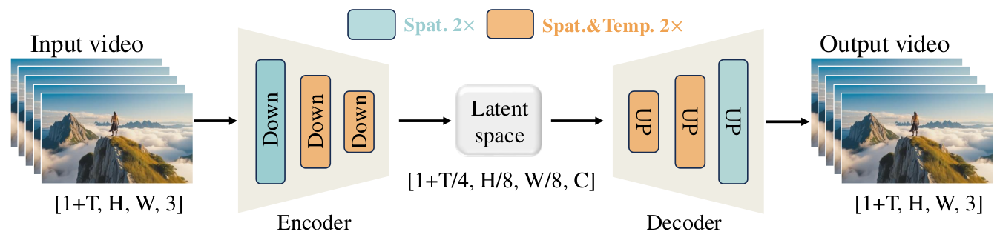
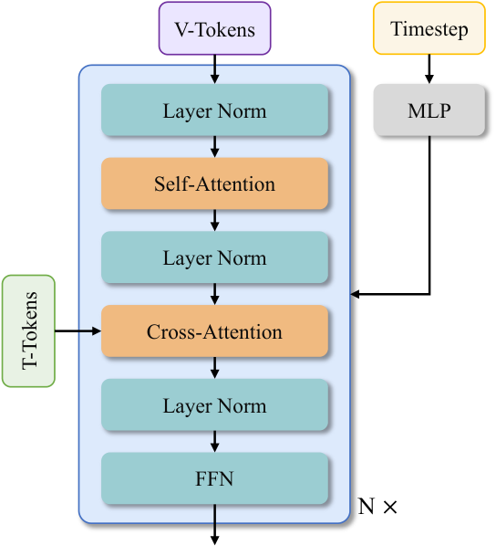

# Video Diffusion（動画拡散 / 動画生成）

**Video Diffusion（動画拡散）** とは、**拡散モデルを画像から動画へ拡張し、時間的に一貫した映像を生成する**技術の総称である。text-to-video（T2V, テキストからの動画生成）、image-to-video（I2V, 静止画を起点とする動画生成）、動画編集、動画の個人化などを含む。本 wiki のランドマークは **Wan**（Alibaba 2025・[[summaries/2025-wan]]）で、VAE・DiT・学習インフラ・推論最適化・評価ベンチマーク・下流応用までを一括して公開したテクニカルレポートである。

技術的な骨格そのものは画像と共通している——[[latent-diffusion]] で潜在空間に落とし、[[diffusion-model-architecture]] の DiT で処理し、[[flow-matching]] の rectified flow で学習する。**変わるのは、時間軸が 1 本増えることで何が壊れるか**である。本ページはそこを軸に整理する。

## 時間軸が持ち込む 4 つの困難

### (1) 系列長の爆発 — 「モデルが載らない」の前に「1 サンプルが載らない」

画像 1024² を $f8$ で潜在化すると 128×128、パッチ化して 1 万トークン弱。これが動画 1280×720・81 フレームになると、$4\times8\times8$ 圧縮を経てもなお**数十万から 100 万トークン**に達する。注意計算は系列長の**二乗**で効くので、Wan の実測では **系列長 100 万で注意が学習時間の 95% を占める**。

より切実なのはメモリで、14B モデルの活性化は **8 TB** を超える。画像生成における主な難所は「モデルを大きくすると載らない」だったが、動画では **1 サンプルの中間状態が単一 GPU に収まらない**。この違いが、動画拡散を実質的に分散システムの問題にしている（[[large-scale-training-infrastructure]]）。

Wan が記録している有用な非対称性がある：**計算は系列長の二乗、メモリは線形**にスケールする。したがって系列が長くなるほど「計算しながら活性化を PCIe で退避する」時間的余裕が生まれる——長い系列ほど活性化オフロードが有利になる、という設計指針がここから直接導かれる。

### (2) 時間的因果性 — 正規化層の選択が制約になる

動画の VAE には、画像の VAE には存在しなかった要求が入る。**未来のフレームが過去のフレームの符号化に影響してはならない**（時間的因果性）。これを破ると、チャンク分割して逐次処理することができなくなり、無限長の動画を扱えなくなる。

この制約は思わぬところに波及する。**GroupNorm はフレーム群にまたがって平均と分散を取るので、未来の情報が過去へ漏れる**。Wan-VAE がすべての GroupNorm を **RMSNorm**（各要素の二乗平均だけで正規化する軽量な変種）に置き換えたのはこのためである。「正規化層の選び方が因果性を壊すかどうかを決める」というのは、画像の設計では意識する必要のなかった論点である。

### (3) 動きの品質という新しい評価軸

画像なら「きれいか」「プロンプト通りか」で済むが、動画には**動きそのものの品質**が加わる。しかも動きは「多ければ良い」ものではない。Wan のデータキュレーションは動画を 6 段階に分類しており、その内訳が問題の質をよく表している：

| 段階 | 扱い |
| --- | --- |
| 最適な動き（大きく滑らかで清潔） | 優先 |
| 中程度（動くが被写体が複数・部分遮蔽） | 多様性のため事前学習に使う |
| **静的**（チャットやインタビュー） | 高品質だがサンプリング比率を下げる |
| **カメラ駆動**（空撮など、被写体は動かない） | 静止画に近いので優先度を大きく下げる |
| 低品質（被写体過多・遮蔽・主体不明） | 除外 |
| 手ぶれ | 除外 |

「静的な動画は品質が高くても減らす」「カメラだけ動く映像は静止画扱い」という判断は、**モデルが動きを学ばずに済ませてしまう**ことへの対策である。画像データセットの選別には対応物がない。

### (4) 時間的一貫性の維持

被写体が途中で別物になる、背景がちらつく、物理法則に反する——いずれも 1 フレームずつ見れば正しいのに、並べると破綻する種類の失敗である。これは [[character-consistency]] が扱う「複数ターンで同一性が崩れる」問題の、フレーム方向の対応物にあたる。評価も専用の設計が要る（後述の VBench・Wan-Bench）。

## アーキテクチャの選択

### 時空間トークナイザ（3D causal VAE）

<figure>

<figcaption>図5（引用, [[summaries/2025-wan]] より）: Wan-VAE の枠組み。エンコーダの 3 段のダウンサンプリングのうち最初の 1 段は空間のみ 2 倍（緑）、残り 2 段が時空間とも 2 倍（橙）。結果として空間 8 倍・時間 4 倍の圧縮となり、潜在は [1+T/4, H/8, W/8]。</figcaption>
</figure>

[[image-tokenizer]] で整理した「圧縮率 $f$・チャネル数 $C$・再構成忠実度」の三つ巴が、**時間方向へそのまま拡張される**。標準的な設定は $4\times8\times8$（時間 4 倍・空間 8 倍）でチャネル 16。時間方向をどこまで圧縮するかは各実装で分かれており、Wan・HunyuanVideo・CogVideoX が $4\times8\times8$、Mochi が $6\times8\times8$、Step Video が $8\times16\times16$（チャネル 64）、SVD は時間圧縮なしの $1\times8\times8$ である。

動画 VAE 固有の設計を 2 つ挙げる。

- **最初のフレームだけ空間のみ圧縮する**（MagViT-v2 由来）。これにより**単一画像を「1 フレームの動画」として同じ VAE で扱える**ようになり、画像と動画の共同学習が成立する。動画データは画像データより桁違いに少ないので、この互換性は実用上重要である。
- **特徴キャッシュ機構**。動画を $1+T/4$ 個のチャンク（最大 4 フレーム）に割り、1 チャンクずつ符号化・復号する。チャンク境界で切れ目が出ないよう、**因果畳み込みの過去 2 フレーム分の特徴をキャッシュして次のチャンクへ引き継ぐ**（カーネルサイズ 3 なので 2 枚）。最初のチャンクだけゼロ埋めのダミーで初期化する。これにより**任意長の動画を一定メモリで処理できる**。

Wan-VAE は 127M と極小で、HunyuanVideo の VAE より再構成が 2.5 倍速い。

### DiT — MM-DiT が自明な最適解ではない

画像側では SD3 以降、**MM-DiT**（テキストと画像を連結して完全注意で混ぜる・[[summaries/2024-sd3]]）が主流になった。しかし動画では**cross-attention でテキストを入れる古い方の分岐**も現役である。Wan がこちらを選ぶ理由は「長い文脈のモデリング下でも指示追従を確保できるから」——視覚トークンが数十万に達するところへテキスト 512 トークンを連結すると、**テキストが視覚に飲み込まれる**という判断だと読める。動画という条件が、画像で決着したように見えた設計判断を差し戻している事例である。

<figure>

<figcaption>図10（引用, [[summaries/2025-wan]] より）: Wan の Transformer ブロック。V-Tokens（動画）が Self-Attention → Cross-Attention → FFN を通り、T-Tokens（テキスト）は Cross-Attention からのみ入る。Timestep は MLP を経て 6 つの変調パラメータになる。</figcaption>
</figure>

時空間の依存関係の捉え方にも分岐がある。**full spatio-temporal attention**（全フレーム・全空間位置が互いを見る）は表現力が高いが二次コストを正面から払う。対して初期の動画モデル（VDM 以降）は **1D 時間注意 ＋ 2D 空間注意**に分解して計算を削る系統を採った。Wan は前者を選んでいる。

なお **adaLN の共有**（条件からスケールとシフトを作る MLP を全ブロックで共有し、ブロックごとにバイアスだけ変える）は動画特有ではないが、動画のように層数とトークン数が大きい設定で効きが大きい。Wan のアブレーションは同一パラメータ数で「**adaLN にパラメータを割くより層を深くする方が良い**」を示しており、25% の削減になる（[[diffusion-model-architecture]]）。

### テキストエンコーダ — 双方向注意が効く

条件エンコーダの選択について、Wan が**アブレーションで直接比較した**結果は記録に値する。umT5（5.3B, encoder-only）が Qwen2.5-7B-Instruct と GLM-4-9B を上回り、理由として **decoder-only の LLM は因果注意だが umT5 は双方向注意なので拡散モデルに適する**（HunyuanVideo の観察）が挙げられる。拡散の条件付けは「プロンプト全体を一度に見て意味を固める」作業なので、後ろを見られない表現は不利だ、という理屈である。

これは [[text-to-image-generation]] における同時期の論争——HiDream-I1 の「4 系統を足す」（[[summaries/2025-hidream-i1]]）と Qwen-Image の「凍結 MLLM 1 本に集約する」（[[summaries/2025-qwen-image]]）——に対する、**測って答えた数少ない事例**でもある。

## 代表手法: Wan（Alibaba 2025）

[[summaries/2025-wan]] は 14B と 1.3B の 2 サイズを Apache ライセンスで公開した。学習は **256px の T2I 事前学習 → 192px 動画との共同学習 → 480px → 720px** という解像度漸進のカリキュラム。画像データは動画の約 10 倍を使う。

**VBench**（動画生成を 16 次元で評価する公開ベンチマーク）で 14B が総合 86.22% と首位、**Sora の 84.28%** を上回る。1.3B でも 83.96% で Kling 1.0 や CogVideoX1.5-5B を超え、しかも **8.19 GB VRAM** で動く。ただし自作の Wan-Bench では**個別指標で負けている項目が複数ある**（様式化能力は 0.328 で最下位、大きな動きの生成は Sora に劣る）ため、総合首位は人間の選好から導いた重み付けに支えられている点は割り引いて読む必要がある。

## タスクの広がり — マスクで統一する

動画拡散の下流タスクは、**「どのフレームを保持し、どのフレームを生成するか」を二値マスクで指定するだけで統一できる**という構造を持つ。Wan-I2V がこれを明示的に活用する。

条件画像をゼロ埋めフレームと時間方向に連結して VAE で符号化し、二値マスク（1=保持、0=生成）と一緒にノイズ潜在へチャネル方向に連結する。入力チャネルが増えるので追加の射影層を**ゼロ初期化**で足す（ControlNet の zero convolution と同じ発想・[[controllable-generation]]）。

マスクの置き方を変えるだけで、以下が同じモデルで扱える：

| マスクの置き方 | タスク |
| --- | --- |
| 先頭 1 フレームを保持 | image-to-video |
| 先頭の数秒を保持 | 動画継続 |
| 先頭と末尾を保持 | first-last frame 変換（画像遷移） |
| 中間を虫食いに保持 | フレーム補間 |

さらに **VACE**（統一動画編集）はこれを一般化し、Video Condition Unit $V=[T;F;M]$ でテキスト・フレーム系列・マスク系列を統一する。**概念分離**（concept decoupling）で $F_c = F\times M$（変えるべき画素）と $F_k = F\times(1-M)$（保つべき画素）を**明示的に別系列へ分けて**トークン化する点が要で、[[instruction-based-image-editing]] の「視覚的一貫性↔意味的一貫性」の綱引きを、入力形式のレベルで分業に変えている。

**動画の personalization** では、Wan が興味深い設計判断をしている——**ArcFace も CLIP も使わない**。ID 抽出器は顔認識の特徴に偏って傷跡やステッカーを落とし、汎用の視覚抽出器は粗すぎる。どちらも情報を失うので、**顔画像を VAE 潜在空間に入れて直接条件付ける**。動画の先頭に $K$ フレーム分の顔画像を継ぎ足し、**inpainting として解く**（先頭 $K$ フレームを再構成し、以降を新規生成する）。ベースモデルには一切手を入れない。[[subject-driven-generation]] の学習型・文脈型のどちらとも違う、**「同じ潜在空間に置く」**という第 3 の答えである。

## ストリーミング生成 — トークンごとにノイズレベルをずらす

固定長クリップしか作れないという DiT の制約を外す仕組みとして、Wan は **Streamer** を提示する。動画トークンを**ノイズ除去の待ち行列**に並べ、**各トークンが異なるノイズレベルにある**状態で窓の中を同時に処理する。一定回数のノイズ除去のあと、最左（最もクリーン）を出力して抜き、最右に純ノイズの新トークンを足す——これを繰り返すことで**長さの制約が消える**。

通常の拡散が「全トークンを同じノイズレベルで一斉に進める」のに対し、これは「**トークンごとにノイズレベルをずらす**」発想であり、時間軸を持つデータだからこそ成立する（空間には「古い方から出す」という自然な順序がない）。連続性のため、キャッシュ済みトークンは**ノイズレベル 0 で待ち行列に再投入**され、次の窓のノイズ除去に参加する。学習時は $2w$ トークンを取り前半 $w$ を暖機に使い、損失は後半 $w$ だけで計算する。

これに **LCM / VideoLCM の一貫性蒸留**（[[diffusion-distillation]]）を重ねて 4 ステップ化すると 10–20 倍加速し、8 台の A100 で 15 分の動画を 8 FPS、int8＋TensorRT 量子化で単一 RTX 4090 で 20 FPS に達する。

ただし**滑動窓の外の情報は完全に失われる**設計なので、数分規模で被写体やシーンの一貫性がどう崩れるかは本質的な問いである。Wan はここを定性評価にとどめており、未解決のまま残っている。

## 評価

FVD（Fréchet Video Distance）や FID は人間の知覚と乖離する、というのが出発点の共通認識である。代わりに次の 2 つが使われる。

- **VBench**（公開）: 動画品質を 16 の人間と整合した次元へ分解する。美的品質・動きの滑らかさ・意味的一貫性など。
- **Wan-Bench**（Wan の自作）: 3 次元 14 指標。**動的品質**（大きな動きの生成＝RAFT のオプティカルフローで測る、人間のアーティファクト＝AI 生成画像 2 万枚で学習した YOLOv3 で検出、物理的妥当性＝Qwen2-VL に物理法則違反を答えさせる、ピクセルレベルの安定性、ID 一貫性＝フレーム間の DINO 特徴類似度）、**画像品質**、**指示追従**（物体数・空間関係・カメラ制御・動作）。最終スコアは 5,000 件のペアワイズ人間比較とのピアソン相関から重みを決める。

「MLLM に動画を見せて質問し、その答えを指標にする」という手法が動画評価で広く使われている点は、画像側の GPT-4o 採点（[[summaries/2025-hidream-i1]] の EmuEdit 評価など）と同じ流れにある。**自作ベンチマーク＋自作の重み付けで総合首位を主張する**構図も画像側と共通の問題を抱えており、[[text-to-image-generation]] の bakeyness 批判（[[summaries/2025-flux-kontext]]）の動画版として読める。

## 限界と未解決問題

- **大きな動きでの細部の喪失**。Wan 自身が最重要の未解決課題として挙げる。動きが大きいほど各フレームの細部が崩れる。
- **推論コスト**。14B は最適化なしで単一ハイエンド GPU に 1 本 30 分。[[inference-caching]]・[[diffusion-distillation]]・量子化を総動員してようやく実用域に入る。
- **長時間の一貫性が測れていない**。Streamer は無限長を可能にするが、その品質劣化を測る標準指標がない。
- **評価の自作依存**。VBench は公開だが、各社が自作ベンチマークで首位を主張する状況が続いている。
- **物理法則の理解**。「物理的妥当性」が評価次元に立てられていること自体が、ここが弱点であることを示している。
- **音声との統合が後付け**。Wan の V2A は生成済み動画に音を付ける別モデルであり、映像と音声を同時に生成する枠組みではない。

## 時間軸の「発明」と「実在」

本ページで見た通り、動画では時間軸が実在する。ところが画像側のモデルは、**多画像を区別するために時間軸を発明した**——FLUX.1 Kontext の仮想タイムステップ（コンテキスト画像に時間方向の定数オフセットを与える）と Z-Image の 3D Unified RoPE（参照と対象で時間次元を単位区間ずらす）である。

この対応関係が明示的に往復する事例が出ている。Qwen-Image-2.0 の MSRoPE に追加された **frame 次元**は、動画側で当たり前だった「フレームを区別する」という発想の画像側への移入にあたる。逆に **HunyuanImage 3.0**（[[summaries/2025-hunyuanimage-3]]）は、**画像を 2 次元のまま扱う** Generalized 2D RoPE を採り、時間軸を使わずに済ませる——ただしその代償として、多画像の区別は**注意マスク**の側（生成画像を後続から見せない「穴」）で処理する。

**位置符号化で区別するか、注意マスクで区別するか**という選択があり、動画・多画像編集・統一マルチモーダルの各文脈で答えが違う。詳細は [[position-embedding]] と [[unified-multimodal-generation]] に集約した。

## 既存知識との接続

- [[latent-diffusion]]：動画拡散も潜在空間で回す。ただし圧縮が時間方向へ拡張され、圧縮率の設計が計算可能性を直接左右する度合いが画像より遥かに大きい。
- [[image-tokenizer]]：Wan-VAE は時空間トークナイザ。因果性・チャンク処理・特徴キャッシュという、画像の VAE 設計には存在しなかった軸が加わる。
- [[diffusion-model-architecture]]：cross-attention 型 DiT と MM-DiT の分岐、full spatio-temporal attention、adaLN 共有。画像側で決着したように見えた選択が動画では差し戻される。
- [[flow-matching]]：rectified flow ＋ logit-normal タイムステップサンプリングという SD3 由来の定式化が、そのまま動画にも使われる。**定式化そのものは変わらない**のが重要な観察で、変わるのはデータの形と計算の規模だけである。
- [[large-scale-training-infrastructure]]：動画拡散を実質的に分散システムの問題にする要因（系列長 100 万、活性化 8 TB）。
- [[inference-caching]]：ステップ間の計算再利用。動画では 1 ステップのコストが大きいので効きが大きい。
- [[diffusion-distillation]]：LCM / VideoLCM による少ステップ化。リアルタイム生成の前提。
- [[controllable-generation]]：マスク機構とカメラ姿勢アダプタ（Plücker 座標＋ゼロ初期化畳み込み）。ControlNet の系譜が動画へ持ち込まれている。
- [[subject-driven-generation]] / [[character-consistency]]：動画 personalization は「特徴抽出器を使わず同じ潜在空間に置く」という第 3 の答え。フレーム間の同一性維持は character-consistency のフレーム方向の対応物。
- [[instruction-based-image-editing]]：VACE の概念分離は、編集タスクの「変える／保つ」を入力形式のレベルで分業させる設計。
- [[data-curation]]：動画では**動きの品質**という選別軸が加わる。「静的な高品質動画をあえて減らす」といった判断は画像データセットに対応物がない。
- [[prompt-enhancement]]：Wan の LLM 書き換えには「自然な動きの属性を組み込む」という動画固有の原則が入る。静止しがちな出力への対処である。
- [[visual-text-rendering]]：Wan は**動画内に中国語と英語のテキストを描ける最初のモデル**を謳う。白背景に漢字をレンダリングした合成データ数億枚と、OCR＋Qwen2-VL で作った実データを併用する——画像側で Qwen-Image が採ったのと同型の処方箋。
- [[super-resolution]]：初期の動画生成はカスケードで解像度を上げる設計が主流だったが、Wan は単一モデルで 720p まで到達する。

## 参考文献（summaries）

- [[summaries/2025-wan]] — Wan（3D causal VAE・cross-attention DiT・2D Context Parallel・Diffusion Cache・Streamer・7 種の下流応用。VBench 86.22% で Sora 超え、1.3B が 8.19 GB VRAM）

> 系列長 100 万トークンという規模で注意が学習時間の 95% を占める以上、注意の計算量そのものへの対処は動画生成の中心的な論点である。線形注意・疎注意・FlashAttention の比較は [[efficient-attention]] を参照。

> 未取り込みの主要原典：VDM（Ho ら 2022, 3D U-Net）、Sora（OpenAI 2024）、HunyuanVideo・Mochi・CogVideoX（オープンソース同世代）、VBench（Huang ら 2024）、VACE（Jiang ら 2025, Wan の統一編集の原典）、LCM / VideoLCM。今後の ingest で本ページへ追記する。
