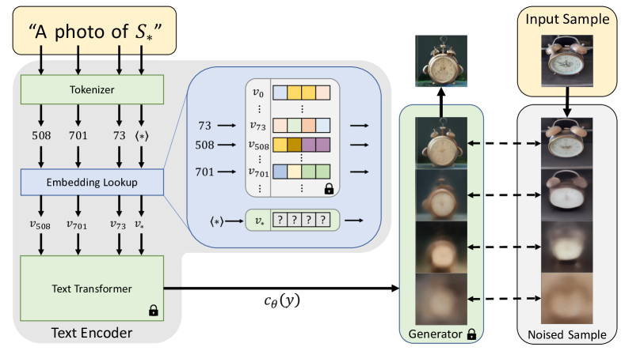
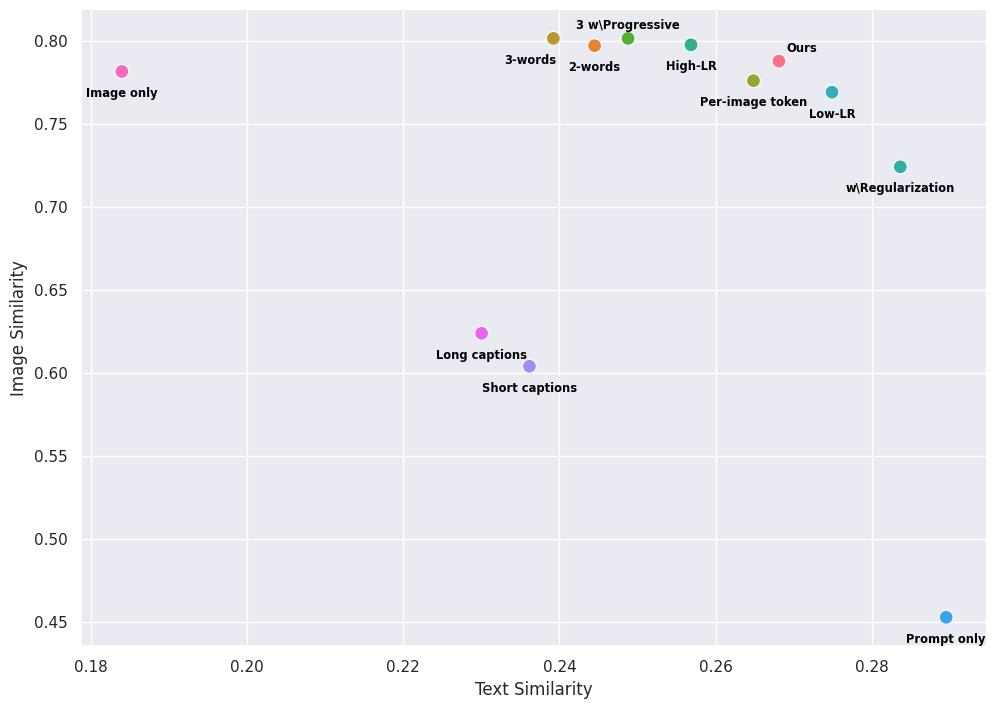

# Textual Inversion — 画像は単語 1 つの価値がある

> 原典: [[translations/2022-textual-inversion]] ・ `raw/papers/An Image is Worth One Word_ ...md`
> 著者・年・会議: Rinon Gal ら（Tel-Aviv University & NVIDIA）, arXiv:2208.01618, ICLR 2023
> プロジェクト: https://textual-inversion.github.io

## 一言まとめ

事前学習済みのテキスト画像（text-to-image）モデルを**一切変更せず凍結したまま**、テキストエンコーダの**単語埋め込み空間に新しい「擬似単語（pseudo-word）」 $S_*$ を 1 つだけ最適化**して、ユーザー提供の特定概念（自分の猫・お気に入りの玩具・ある画風など）をモデルの語彙に注入する手法。わずか 3〜5 枚の画像から学んだ $S_*$ は通常の単語のように文へ組み込め、その概念を新しい場面・スタイル・構図で生成できる。**personalized text-to-image generation（個人化テキスト画像生成）というタスクそのものを提唱した原典**で、[[subject-driven-generation]] の二大原点の一方（もう一方が [[summaries/2023-dreambooth]] の DreamBooth）。

## 背景と問題意識

大規模 text-to-image モデル（[[text-to-image-generation]]）は自然言語で多様な画像を生成できるが、その自由は「ユーザーが対象を**言葉で記述できる範囲**」に縛られる。自分のペットや特定の玩具のような固有の概念は、言葉だけでは正確に指定できない。

新概念をモデルに教える素朴な方法には弱点があった。

- **再学習**：新概念ごとにデータを足してモデルを学習し直すのは法外に高価。
- **少数例 fine-tuning**：破滅的忘却（catastrophic forgetting, 新しいことを学ぶと既存知識を失う現象）を招きやすい。
- **アダプタ追加**：先行知識を忘れたり、新旧概念へ同時アクセスしにくい。

著者らは発想を転換し、「モデルを変える」のではなく「**モデルが既に理解している語彙の側に新しい単語を 1 つ足す**」ことを提案した。これは GAN（Generative Adversarial Network, 敵対的生成ネットワーク）の研究で確立した **inversion（反転, 与えた画像を再生成する潜在表現を探す操作）** の発想を、画像でなく**概念**に対して、しかも潜在ノイズでなく**テキスト埋め込み**に対して行うものである。

## 提案手法 / 主張

### 反転の対象：単語埋め込み

BERT（Bidirectional Encoder Representations from Transformers, 双方向 Transformer 言語エンコーダ）のようなテキストエンコーダは、入力文をまずトークン（辞書のインデックス）に変換し、各トークンを固有の**埋め込みベクトル**に引き当ててから後段に流す。Textual Inversion はこの埋め込み段階に介入し、プレースホルダ文字列 $S_*$ のトークンに紐づくベクトルを、新しく学習する埋め込み $v_*$ に置き換える。

<figure>

<figcaption>図2: テキスト埋め込みと inversion の流れ。「A photo of S_*」がトークン化され、各トークンが埋め込みベクトル v に変換される（S_* の位置に学習対象 v_* を注入）。それらが Text Transformer を経て条件付けコード c_θ(y) になり、凍結された Generator を導く。再構成損失で v_* だけを最適化する。</figcaption>
</figure>

### 学習：再構成だけで埋め込みを探す

実装は **Latent Diffusion Model（LDM, 潜在空間で拡散を行うモデル。[[latent-diffusion]]）** 上で行う（公開 1.4B モデル・LAION-400M 学習・BERT 条件付け）。$c_\theta$（テキストエンコーダ）と $\epsilon_\theta$（ノイズ除去ネット）を**完全に凍結**し、LDM の再構成損失

$$
v_{*}=\arg\min_{v}\ \mathbb{E}_{z\sim\mathcal{E}(x),y,\epsilon\sim\mathcal{N}(0,1),t}\big[\|\epsilon-\epsilon_{\theta}(z_{t},t,c_{\theta}(y))\|_{2}^{2}\big]
$$

を、3〜5 枚の概念画像と「A photo of $S_*$」等の中立的テンプレ（CLIP ImageNet テンプレ由来、付録 D に 27 個）について最小化し、$v_*$ **だけ**を勾配降下で求める。$v_*$ は概念の粗い記述語（"sculpture"・"cat"）の埋め込みで初期化。2×V100・5000 step・**概念あたり約 2 時間**。学習対象が単一ベクトルなので、成果物は数 KB の埋め込みファイルで共有できる。

### 単一の単語で十分、という発見

GAN inversion の常套手段（複数ベクトルへの拡張＝2-word/3-word、段階的追加、既存単語への正則化、画像ごとトークン）を一通り試したが、**いずれも単一語版を上回らない**。著者らは、テキスト埋め込み空間にも GAN inversion で知られる **distortion-editability トレードオフ（再構成忠実度と編集しやすさが両立しない関係）** が存在することを示し、単一埋め込みがその曲線上の魅力的な点にあると主張する。

<figure>

<figcaption>図10(a): CLIP ベース評価。横軸 Text Similarity（プロンプトへの忠実度＝編集性）、縦軸 Image Similarity（学習画像への類似＝再構成）。「Ours」（単一語）は両者の好バランス点にあり、学習率を上げ下げ（High-LR / Low-LR）すると曲線上を移動する。多語化（2/3-word）・正則化は再構成寄り、人手キャプション（short/long captions）は両軸とも低い。Image only / Prompt only は両極の参照。</figcaption>
</figure>

### 応用

- **オブジェクト変種・新しい場面への合成**：凍結モデルの汎化力で、$S_*$ を「on the moon」等と自由に組み合わせる。
- **画風（style）の擬似単語化**：共通スタイルの画像集合から、画風を表す $S_*$ を学ぶ。
- **概念合成**：2 つの $S_*$ を 1 文に入れて組み合わせる（ただし「並置」など関係的プロンプトは苦手）。
- **バイアス低減**："Doctor" のような偏った語を、多様な小データセットで学んだ「より公平な」擬似単語に置き換える。
- **下流応用**：同じ LDM に乗る Blended Latent Diffusion での局所編集にそのまま使える。

## 実験結果と知見

- **再構成品質**は学習集合からランダムに実画像を引くのと同等水準を、単一の擬似単語だけで達成。
- **編集性**は単一語が全多語ベースラインを大きく上回る。学習率でトレードオフを制御可能。
- **人手キャプション**は外見の再現にも編集にも劣る（長文ほどモデルが設定語を無視しがち）。
- **ユーザー study**（計 1,200 応答）も CLIP ベース指標と一致し、同じトレードオフと人手キャプションの限界を裏付け。
- 付録：Bipartite DDIM-inversion（[[diffusion-sampling]] の DDIM を閉形式で反転）と Pivotal Tuning（生成器を後段で微調整）はいずれも素朴適用では高ガイダンスで構造・編集が破綻。学習集合は**約 5 枚が最良**で、増やすと実単語分布から離れて編集性が落ちる。

## 限界・批判的視点

- **精密な形状の再現は苦手**で、概念の「意味的本質」を捉えるにとどまる（CLIP 類似度が形状に鈍感なため指標も割引いて見るべき）。
- **最適化が遅い**（概念あたり約 2 時間）。著者は将来エンコーダ化で高速化したいと述べる。
- 凍結モデルの表現力に縛られるため、被写体の細部の忠実度は全層を学習する DreamBooth に劣る（[[summaries/2023-dreambooth]] の比較で DreamBooth が優位）。この「軽量だが表現力不足」と DreamBooth の「高忠実だが重い」の間を埋めるべく、後に [[low-rank-adaptation]]（LoRA）が主流化した。

## 既存 wiki との接続

Textual Inversion は、テキスト画像生成（[[text-to-image-generation]]）を**個人化（personalization）**する道を開いた原典で、[[subject-driven-generation]] では DreamBooth と並ぶ代表手法として位置づく。実装基盤は [[latent-diffusion]]（凍結 LDM）であり、モデルを一切触らず**テキスト埋め込みだけ**を動かす点が、全層を fine-tune する DreamBooth、低ランク重み更新を学ぶ [[low-rank-adaptation]] と対をなす（学習対象の大きさ＝忠実度と可搬性のトレードオフ）。複数概念を扱う [[multi-concept-customization]] の議論の出発点でもある。

## 用語と略称

- **Textual Inversion**：凍結した text-to-image モデルのテキスト埋め込み空間に、概念を表す新しい擬似単語の埋め込みを最適化して見つける手法。
- **pseudo-word（擬似単語） $S_*$ / $v_*$**：新概念を表すために語彙へ追加するプレースホルダ文字列 $S_*$ と、それに紐づく学習対象の埋め込みベクトル $v_*$。
- **personalization（個人化）**：汎用生成モデルを特定の個人・物体・画風に適応させること。
- **inversion（反転）**：与えた対象を再生成する潜在表現（ここでは単語埋め込み）を最適化で探す操作。GAN inversion がその源流。
- **distortion-editability トレードオフ**：埋め込みが実単語分布に近いほど編集しやすいが対象の再現が甘くなり、遠いほど再現は良いが編集しにくくなる関係。
- **DDPM** = Denoising Diffusion Probabilistic Models（ノイズ除去を繰り返してデータを生成する拡散モデルの基礎）。
- **LDM** = Latent Diffusion Model（オートエンコーダの潜在空間で拡散を行うモデル）。
- **DDIM** = Denoising Diffusion Implicit Models（決定論的に少ステップでサンプリングする手法。本論では閉形式の inversion に利用）。
- **BERT** = Bidirectional Encoder Representations from Transformers（双方向 Transformer テキストエンコーダ）。
- **CLIP** = Contrastive Language-Image Pre-training（画像とテキストを共通空間に埋め込む対照学習モデル。評価指標と一部ベースラインに使用）。
- **GAN** = Generative Adversarial Network（敵対的生成ネットワーク）。
- **pivotal tuning**：先に編集しやすい "pivot" コードへ反転し、後で生成器を微調整して再現性を上げる 2 段階最適化。

## 関連ページ

- [[concepts/subject-driven-generation]]
- [[concepts/text-to-image-generation]]
- [[concepts/latent-diffusion]]
- [[concepts/low-rank-adaptation]]
- [[concepts/multi-concept-customization]]
- [[summaries/2023-dreambooth]]
- [[translations/2022-textual-inversion]]
