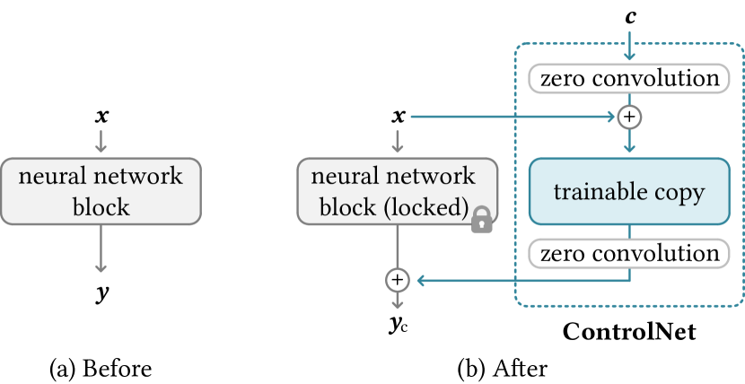

# Adding Conditional Control to Text-to-Image Diffusion Models（ControlNet）

> 原典: [[translations/2023-controlnet]] ・ `raw/papers/Adding Conditional Control to Text-to-Image Diffusion Models.md`（arXiv:2302.05543）
> 著者・年・会議: Lvmin Zhang, Anyi Rao, Maneesh Agrawala（Stanford University）・2023・ICCV 2023（Marr Prize / Best Paper）

## 一言まとめ

学習済みの Stable Diffusion（[[latent-diffusion]]）を**凍結したまま**、エッジ・深度・姿勢・セグメンテーションなどの**空間的な条件画像**で出力を精密制御できるようにする手法（[[controllable-generation]]）。元モデルのエンコーダを複製した「学習可能コピー」を、**zero convolution（重み・バイアスをゼロ初期化した 1×1 畳み込み）** で接続するのが核心で、学習開始時に有害なノイズを一切加えず、強力な事前学習バックボーンを壊さずに少データでファインチューニングできる。実装が容易で堅牢なため、画像生成 AI の制御性を一変させ、コミュニティで爆発的に普及した。

## 背景と問題意識

text-to-image 拡散（[[text-to-image-generation]]、Stable Diffusion）はテキストプロンプトで驚くほど多様な画像を生成できるが、**姿勢・形・レイアウトといった空間構図をテキストだけで精密指定するのは難しい**。「こういう構図で」を実現するには条件画像（線画・深度マップ・姿勢スケルトン等）で条件付けたい。

だがこれを end-to-end 学習するのは難しい。条件ごとのデータ（姿勢・法線など）はせいぜい約 10 万規模で、Stable Diffusion の学習に使われた LAION-5B の **5 万分の 1**。巨大な事前学習モデルをそのまま少データでファインチューニングすると、**過学習・破滅的忘却（catastrophic forgetting）** で元の生成能力を壊してしまう。LoRA など「学習パラメータを制限して忘却を防ぐ」流れの中で、ControlNet は別の解を出す。

## 提案手法 / 主張

### zero convolution によるアーキテクチャ（核心）

事前学習済みのニューラルブロック $\mathcal{F}(\cdot;\Theta)$ を **凍結**し、その**学習可能コピー** $\Theta_c$ を作る。両者を **zero convolution** $\mathcal{Z}$（重み・バイアスをゼロ初期化した 1×1 畳み込み）で接続する：

$$
\bm{y}_c=\mathcal{F}(\bm{x};\Theta)+\mathcal{Z}\big(\mathcal{F}(\bm{x}+\mathcal{Z}(\bm{c};\Theta_{z1});\Theta_c);\Theta_{z2}\big)
$$

学習開始時は $\mathcal{Z}=0$ なので $\bm{y}_c=\bm{y}$（元の出力と完全一致）。つまり**最初のステップでは何も壊さない**。勾配が流れるにつれゼロ畳み込みの重みがゼロから徐々に成長し、条件への追従を学ぶ。これにより「強力な事前学習バックボーンを保護しつつ、ランダムノイズの害なしに条件制御を獲得する」ことが両立する。

<figure>

<figcaption>図2（再掲, [[translations/2023-controlnet]] より）: 元ブロックをロックし、学習可能コピーを zero convolution（1×1 畳み込み、重み・バイアスをゼロ初期化）で接続する。c が追加したい条件付けベクトル。</figcaption>
</figure>

### Stable Diffusion への適用

Stable Diffusion の U-Net の **エンコーダ 12 ブロック＋中間ブロックのコピー**を作り、その出力をスキップ接続と中間ブロックに加える（図3）。条件画像は小さな畳み込みネットで 64×64 の潜在特徴に変換して注入。凍結部は勾配計算が要らないので**省メモリ・高速**（+23% メモリ、+34% 時間程度）。

### 学習・推論の工夫

- **学習**：通常のノイズ予測損失（[[denoising-diffusion]] と同じ）をそのまま使う。学習中 50% のプロンプトを空文字に置換し、条件画像から意味を読む能力を強化。
- **sudden convergence（突然収束）**：ゼロ畳み込みゆえ常に高品質画像を出し続け、ある時点（多くは 1 万ステップ未満）で**急に条件に従い始める**という特徴的挙動。
- **CFG resolution weighting（CFG-RW）**：[[classifier-free-guidance]] と組み合わせる際、プロンプトなしだと条件を $\epsilon_c/\epsilon_{uc}$ 両方に加えるとガイダンスが消え、$\epsilon_c$ のみだと強すぎる。各ブロックの解像度に応じた重み $w_i=64/h_i$ で調整する。
- **複数条件の合成**：複数 ControlNet の出力を**単純加算**するだけで、深度＋姿勢などを同時適用できる（追加の重み付け不要）。

## 実験結果と知見

- **多様な条件**：Canny・HED・depth・normal・M-LSD 線・ADE20K セグメント・Openpose・スケッチで Stable Diffusion を制御。プロンプトの有無を問わず機能。
- **アブレーション**：zero convolution を通常のガウス初期化畳み込みに置き換えると性能が ControlNet-lite 並みに**崩壊**＝事前学習バックボーンが破壊される。zero convolution が要であることを実証。
- **SOTA 比較**：セグメント条件で FID 15.27（PITI 19.74・LDM 25.35 を上回る）、ADE20K の再構成 IoU 0.35 で先行手法を上回る。ユーザー調査でも PITI・Sketch-Guided を大きく上回る（表1）。
- **小データ・小計算でも強い**：単一 RTX 3090Ti・20 万サンプル・5 日で、A100 クラスタ・1200 万枚で学習した産業用 SDv2-Depth とほぼ区別不能（識別精度 0.52）。1k 画像でも崩壊しない。
- **転用性**：SD のトポロジーを変えないので、コミュニティの SD 派生モデル（Comic Diffusion 等）へ**再学習なしで転用**できる。

## 限界・批判的視点

- **拡散の枠組み自体は変えない**：ControlNet は条件制御の「付加機構」で、サンプリング速度や基盤の生成品質は元の SD に依存する。
- **条件ごとに 1 つ学習が必要**：エッジ用・深度用…と条件タイプごとに ControlNet を学習する（ただしコピー＝元モデルの約半分のパラメータ追加で済む）。
- **空間的に整列した条件向け**：姿勢・エッジなど画像と整列した条件に強い一方、非空間的・抽象的な制御は範囲外。
- 同時期に **T2I-Adapter** など類似の軽量アダプタ手法が登場（より少パラメータ）。LoRA・IP-Adapter 等と並ぶ「アダプタ型条件制御」の一つ。
- 本文が参照する補足資料（zero convolution の勾配計算・各条件の詳細設定）は原典 markdown に含まれない。

## 用語と略称

- **ControlNet** = 本論文の条件制御アーキテクチャ（凍結バックボーン＋学習可能コピー＋zero convolution）
- **zero convolution** = 重み・バイアスをゼロ初期化した 1×1 畳み込み。学習開始時に出力を変えず、徐々に成長する
- **catastrophic forgetting（破滅的忘却）** = 追加学習で元の能力を失う現象
- **CFG / CFG-RW** = Classifier-Free Guidance（[[classifier-free-guidance]]）／その解像度重み付け版
- **sudden convergence** = 学習途中で急に条件追従を獲得する現象
- **Canny / HED / M-LSD / ADE20K / Openpose** = エッジ検出・ソフトエッジ・線分検出・セマンティックセグメント・姿勢推定（条件画像の生成元）
- **LoRA** = Low-Rank Adaptation（低ランク行列で忘却を防ぐファインチューニング、関連手法）
- **FID / CLIP-score / IoU** = 生成品質・テキスト整合・セグメント再構成の評価指標

## 関連ページ

- [[concepts/controllable-generation]] — ControlNet の位置づけ（アダプタ型の空間条件制御）
- [[concepts/latent-diffusion]] — ControlNet が制御対象とする Stable Diffusion（LDM）
- [[concepts/text-to-image-generation]] — テキスト＋空間条件による生成制御
- [[concepts/classifier-free-guidance]] — CFG-RW の基礎となるガイダンス
- [[concepts/denoising-diffusion]] — ControlNet の学習に使うノイズ予測目的
