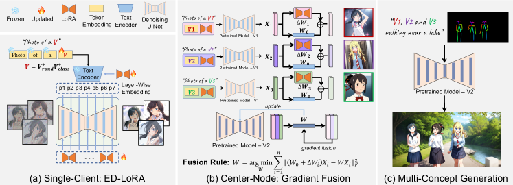

# Mix-of-Show: 拡散モデルの多概念カスタマイズのための分散型低ランク適応

> 原典: [[translations/2023-mix-of-show]] ・ `raw/papers/Mix-of-Show_ ...md`
> 著者・年・会議: Gu, Wang ら（NUS Show Lab・Tencent ARC Lab ほか）・2023・NeurIPS 2023（arXiv 2305.18292）

## 一言まとめ

各ユーザーが個別に学習した**単一概念 LoRA を後から 1 つのモデルに融合**して複数概念を同時生成する「**decentralized multi-concept customization（分散型多概念カスタマイズ）**」を定式化し、その 2 大課題——concept conflict（概念衝突）と identity loss（同一性損失）——を、**ED-LoRA**（埋め込みを分解して衝突を防ぐ LoRA）と **gradient fusion**（各 LoRA の推論挙動を整合させる融合）で解決した論文。多概念サンプリングの属性結合問題には **regionally controllable sampling（領域制御可能サンプリング）** を導入する。

## 背景と問題意識

[[low-rank-adaptation]]（LoRA, 低ランク適応。重み変化を $\Delta W=BA$ の低ランク積だけ学習する軽量 fine-tune）でカスタマイズした概念モデルは数 MB で共有でき、Stable Diffusion コミュニティに大量に流通している。だが「**別々に学習された複数の LoRA を 1 つのモデルにまとめて、同じ 1 枚にすべての概念を登場させる**」ことは難しい。本論文はこの状況を、各クライアントが私的データで単一概念 LoRA を学習・共有し（single-client concept tuning）、中央ノードがそれらを集めて事前学習済みモデルを更新する（center-node concept fusion）**分散型**問題として定式化する（連合学習に着想）。

著者は既存の LoRA チューニング＋重み融合がここで破綻する原因を 2 つに分解する。

- **concept conflict（概念衝突）**：通常の LoRA チューニングは embedding（概念トークンの埋め込み）と LoRA 重みの役割を区別せず、概念の identity の大半を LoRA 重み側に符号化してしまう。その結果、意味的に似た embedding が視覚的に全く異なる概念に射影され、複数概念を 1 モデルに入れると「どの概念を出すか」が embedding から決まらず衝突する。
- **identity loss（同一性損失）**：既存の重み融合（weight fusion）は全 LoRA の重み付き平均 $W=W_0+\sum_i w_i\Delta W_i$（$\sum w_i=1$）。$n$ 概念を融合すると各概念の寄与が $\frac1n$ に薄まり、個々の identity が失われる。

## 提案手法 / 主張

### ED-LoRA（embedding-decomposed LoRA）— concept conflict への解

著者の鍵となる観察は「**embedding は事前学習済みモデルの『ドメイン内（in-domain）』の概念をうまく捉える一方、LoRA 重みは『ドメイン外（out-domain）』の細部（アニメ調や事前学習が表現できない詳細）を担う**」。通常の LoRA は identity を過度に LoRA 重みへ押し込むので、ED-LoRA は逆に **embedding 側に in-domain essence をできるだけ残す**よう embedding の表現力を高める。具体的には概念トークンを **layer-wise embedding**（[[summaries/2022-classifier-free-guidance]] とは無関係、P+ 由来の層ごと埋め込み）と **multi-word 表現** $V=V_{rand}^{+}V_{class}^{+}$ に分解する（$V_{rand}^{+}$ はランダム初期化で概念差を捉え、$V_{class}^{+}$ はクラストークンで意味を保つ）。これで意味的に近い embedding への衝突を防ぐ。

### Gradient Fusion（勾配融合）— identity loss への解

重み平均が identity を薄めるのに対し、gradient fusion は「**融合モデルが各概念を単独 LoRA と同じように推論する**」ことを目標にする。拡散モデルはテキストから概念を復号できるので、データなしでも各概念をサンプリングして各 LoRA 層の入出力特徴 $X_i$ を取得できる。これらを使い、各層の重みを次の最小二乗で求める：

$$
W=\operatorname*{arg\,min}_{W}\sum_{i=1}^{n}\|(W_{0}+\Delta W_{i})X_{i}-WX_{i}\|^{2}_{F}
$$

すなわち「各概念の単独 LoRA 出力 $(W_0+\Delta W_i)X_i$ を、融合後の 1 枚の重み $W$ ができるだけ再現する」ように $W$ を最適化する（LBFGS で層ごとに解く）。これにより**理論上無制限の数の概念**を identity をほぼ保ったまま融合できる。

### Regionally Controllable Sampling（領域制御可能サンプリング）

複数概念を 1 枚に出すと物体欠落（missing object）や属性結合（attribute binding, ある領域の属性が別概念に混ざる）が起きる。著者は ControlNet/T2I-Adapter の空間条件に加え、**global prompt＋領域ごとの regional prompt** を **region-aware cross-attention** で注入する。global の cross-attention 出力 $h$ を計算したのち、各領域の二値マスク $M_i$ の内側を領域プロンプトの出力 $h_i$ で置き換える（$h[M_i]=h_i$）。これにより被写体・属性を正しい領域に結びつけつつ、全体の文脈は調和させる。これは後続の [[summaries/2024-lora-composer]] の Region-Aware LoRA Injection の源流にあたる。

<figure>

<figcaption>図4（再掲, [[translations/2023-mix-of-show]] より）: Mix-of-Show のパイプライン。(a) 各クライアントが ED-LoRA で単一概念を学習、(b) 中央ノードが gradient fusion で複数 LoRA を 1 モデルに融合、(c) regionally controllable sampling で多概念を合成する。</figcaption>
</figure>

## 実験結果と知見

- **アブレーション（表2a, image-alignment の融合前→後の平均変化）**：LoRA+重み融合 −0.115 → ED-LoRA+重み融合 −0.094 → **ED-LoRA+gradient fusion −0.025**。embedding 分解と勾配融合がそれぞれ identity loss を段階的に削減する。人間評価でも gradient fusion が weight fusion を image alignment 66.5% 対 33.5% で上回る（表2c）。
- **多概念融合（表1）**：LoRA は中央ノード融合後に image alignment が大きく落ち（実キャラで 0.761→0.555、−0.206）下界へ向かうのに対し、Mix-of-Show は劣化が小さい（0.802→0.770、−0.032）。text alignment は融合後むしろ向上する傾向。
- **定性（図2・6・9）**：Harry Potter＋Thanos など作品をまたぐキャラ、物体、シーンの複雑な合成を高忠実に生成。P+ や Custom Diffusion はテキスト関連モジュールしか調整しないため過飽和・semantic collapse を起こすが、Mix-of-Show は単一概念品質と融合後の identity 保持の両方で最良。
- 付録の評価対象キャラには Hinton・LeCun・Bengio など実在の研究者画像も含まれる（19 概念：実写キャラ 6・アニメキャラ 5・物体 6・シーン 2）。

## 限界・批判的視点

- **属性漏れ（図10a）**：一部の属性が global embedding に符号化されるため、領域制御をしても隣接領域へ漏れる。領域ごとの negative prompt で部分的に緩和。
- **融合に時間がかかる**：center-node concept fusion は層ごと最適化で、Unet の大きな空間特徴がボトルネック（14 概念で A100 1 枚 30 分）。
- **小さい顔の生成（図10b）**：Stable Diffusion の VAE の情報損失で、全身キャラの小さい顔の細部が失われる。
- ベースモデルとして実写は Chilloutmix、アニメは Anything-v4 を使っており、Stable Diffusion v1-5 そのままではない（顔品質の都合）。比較はベースを揃えて実施。

## 用語と略称

- **LoRA** = Low-Rank Adaptation（低ランク適応, $\Delta W=BA$）。**ED-LoRA** = Embedding-Decomposed LoRA（埋め込み分解 LoRA）。
- **decentralized multi-concept customization** = 単一概念 LoRA を分散して学習し中央ノードで融合する多概念カスタマイズ。
- **concept conflict / identity loss** = 概念衝突 / 同一性損失（本論文が解く 2 課題）。
- **weight fusion / gradient fusion** = 重み融合（重みの加重平均）/ 勾配融合（推論挙動を整合させる最小二乗融合）。
- **regionally controllable sampling** = 領域制御可能サンプリング。**region-aware cross-attention** = 領域ごとにマスクで cross-attention 出力を差し替える機構。
- **in-domain / out-domain** = 事前学習済みモデルが表現できる範囲の内 / 外。
- **CFG** = Classifier-Free Guidance（[[classifier-free-guidance]]）。**FID** = Fréchet Inception Distance（画像品質指標）。**VAE** = Variational Autoencoder。

## 既存知識との接続

- [[lora-merging]]：本論文は「複数 LoRA を 1 モデルに統合する」系統の中で、**gradient fusion（推論挙動を整合させる融合）** を確立したランドマーク。素朴な線形和（weight fusion）の identity loss を最小二乗で克服した点が核心。
- [[multi-concept-customization]]：Mix-of-Show は重みマージ系統の代表で、後続の [[summaries/2024-lora-composer]]（注意制御系）・[[summaries/2024-multi-lora-composition]]（復号中心系）がベースラインとして参照する。
- [[low-rank-adaptation]]：ED-LoRA は LoRA の派生で、embedding と LoRA 重みの役割分担を明確化した。
- [[controllable-generation]]：regionally controllable sampling は ControlNet/T2I-Adapter の空間条件を多概念向けに拡張し、属性結合を解く。LoRA-Composer の領域注入の源流。
- [[subject-driven-generation]]：単一概念 ED-LoRA は DreamBooth/Textual Inversion 系の personalization の一種だが、「後から融合できる」点で分散合成に最適化されている。

## 関連ページ

- [[concepts/lora-merging]] — 複数 LoRA のマージ／融合（本論文が gradient fusion の代表）
- [[concepts/multi-concept-customization]] — 多概念合成（重みマージ系統の代表）
- [[concepts/low-rank-adaptation]] — LoRA / ED-LoRA
- [[concepts/controllable-generation]] — 空間条件制御（regionally controllable sampling の位置づけ）
- [[summaries/2024-lora-composer]] — LoRA-Composer（領域注入の後継・注意制御系）
- [[summaries/2024-multi-lora-composition]] — Multi-LoRA Composition（復号中心系・Mix-of-Show をベースラインに）
- [[summaries/2024-ziplora]] — ZipLoRA（content+style の学習係数マージ）
