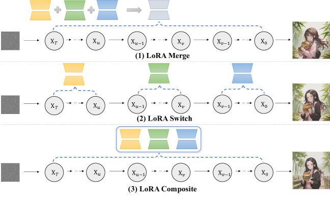

# Multi-LoRA Composition for Image Generation

> 原典: [[translations/2024-multi-lora-composition]] ・ `raw/papers/Multi-LoRA Composition for Image Generation.md`
> 著者・年・会議: Zhong, Shen ら（Microsoft ほか）・2024・ICML 2024（arXiv 2402.16843）

## 一言まとめ

複数の LoRA（キャラ・服・画風・背景・物体など）を 1 枚に合成する際、**重みを併合せず（LoRA Merge せず）、ノイズ除去の各ステップで操作する「復号中心（decoding-centric）」の 2 手法**を提案：**LoRA Switch**（各ステップで 1 つの LoRA を順に切替）と **LoRA Composite**（CFG 流に全 LoRA のスコアを平均）。任意個の LoRA を安定に統合でき、評価用に **ComposLoRA** テストベッドと **GPT-4V 評価**を整備した。

## 背景と問題意識

[[low-rank-adaptation]] LoRA は 1 要素（特定キャラ・服・画風など）を正確に描くのに優れ、コミュニティで大量に共有される。複数を 1 枚に合成（[[multi-concept-customization]]）したいが、従来の **LoRA Merge**——複数 LoRA の重みを線形結合 $W'=W+\sum_i w_i B_iA_i$ して 1 つにまとめる（あるいは LoRAHub/ZipLoRA のように係数行列を学習）——には弱点がある。

- **LoRA 数が増えると併合が不安定化**し、細部が崩れる（ハンバーガーや指の変形）。
- **拡散モデルとの相互作用を無視**：重みだけを混ぜ、逐次的なノイズ除去過程での LoRA とベースモデルの相互作用を考えない。

著者の発想：「**重みを一切いじらず、復号（ノイズ除去）過程で合成する**」。これが LoRA Switch / Composite。

## 提案手法 / 主張

ベースは Stable Diffusion v1.5（[[latent-diffusion]]）。LoRA 重みはそのまま保つ（学習不要）。図2 が 3 手法（LoRA Merge / Switch / Composite）の対比。

### LoRA Switch（LoRA-s）

各ノイズ除去ステップで**1 つの LoRA だけを有効化**し、$\tau$ ステップごとに順番に切り替える（character→clothing→style→background→object…）。時刻 $t$ の有効 LoRA は $i=\lfloor((t-1)\bmod k\tau)/\tau\rfloor+1$、$W'_t=W+w_iB_iA_i$。1 度に 1 要素に集中するので各要素が明瞭に描かれる。

### LoRA Composite（LoRA-c）

**[[classifier-free-guidance]] の多 LoRA 拡張**。各ステップで全 LoRA の条件付き・無条件スコアを個別に計算し、平均してガイダンスにする：

$$
\tilde{e}(\mathbf z_t,c)=\frac1k\sum_{i=1}^k w_i\big[e_{\theta'_i}(\mathbf z_t)+s\cdot(e_{\theta'_i}(\mathbf z_t,c)-e_{\theta'_i}(\mathbf z_t))\big]
$$

全 LoRA が各ステップで寄与し、重み併合の不安定さを避ける。どちらの手法も**任意個の LoRA を統合可能**（従来は 2 つの併合が主）。

<figure>

<figcaption>図2（再掲, [[translations/2024-multi-lora-composition]] より）: 3 手法の対比。LoRA Merge は重みを線形併合、LoRA Switch は復号中に LoRA を巡回、LoRA Composite は全 LoRA を協働させてガイダンスにする。</figcaption>
</figure>

### ComposLoRA テストベッド & GPT-4V 評価

- **ComposLoRA**：写実・アニメ 2 スタイル、6 カテゴリ（3 キャラ・2 服・2 画風・2 背景・2 物体）計 22 LoRA、各セットに 1 キャラを含めカテゴリ重複なしで 480 合成セット（2〜5 LoRA）。
- **GPT-4V 評価**：標準指標がないため、GPT-4V に合成品質・画像品質を 0〜10 で採点させる比較評価を提案。

## 実験結果と知見

- **vs LoRA Merge**：両手法とも全構成で Merge を上回り、**LoRA 数が増えるほど優位が拡大**（LoRA Switch のスコア優位は 2 LoRA で 0.04 → 5 LoRA で 1.32、勝率約 70%）。
- **手法の住み分け**：**LoRA-s は合成（composition）品質**、**LoRA-c は画像品質**で勝る。スタイル別では LoRA-s が写実、LoRA-c がアニメに強い（図6）。
- **人手評価**（表2）：GPT-4V と整合（LoRA Switch 合成 3.91/Merge 3.14、LoRA Composite 画像 4.35/Merge 2.94）。GPT-4V は人手と高相関（0.45）、CLIPScore はほぼ無相関（要素の機微を見分けられない）。
- **LoRA Switch のハイパラ**：毎ステップ切替は歪む。$\tau=5$ が最適。最初に **character LoRA** を有効化すると最良、style から始めると劣化。
- **GPT-4V の位置バイアス**：先に入力された画像を合成品質で優遇する傾向。両入力順で平均して緩和。

## 限界・批判的視点

- 主に**前景 1＋背景 1＋付属要素**の合成を扱い、LoRA-Composer（[[summaries/2024-lora-composer]]）のような**複数前景キャラ**の厳密な空間配置（concept confusion/vanishing 対策）は範囲外。レイアウト（ボックス）指定もしない。
- **GPT-4V 評価のバイアス・コスト**：位置バイアスがあり、評価が GPT-4V の能力に依存。
- 合成的画像生成自体が難しく、5 LoRA では GPT-4V スコアが約 6 に落ちる（なお改善余地大）。
- LoRA-Composite は LoRA ごとに毎ステップ複数回の forward を要し計算が重い。

## 用語と略称

- **LoRA Merge** = 複数 LoRA の重みを線形結合して 1 つにまとめる従来法（ベースライン）。**LoRAHub / ZipLoRA** = 係数行列を学習して融合する重みベース手法。
- **LoRA Switch (LoRA-s)** = 各ステップで 1 つの LoRA を順に有効化する復号中心手法。$\tau$ = 切替間隔。
- **LoRA Composite (LoRA-c)** = 各ステップで全 LoRA のスコアを平均する CFG 拡張。
- **decoding-centric** = 重みでなく復号（ノイズ除去）過程で合成する視点。
- **ComposLoRA** = 本論文の合成評価テストベッド（22 LoRA・480 セット）。
- **CFG** = Classifier-Free Guidance（[[classifier-free-guidance]]）。**GPT-4V** = マルチモーダル LLM（評価者）。**CLIPScore** = CLIP 由来の画像・テキスト整合指標。

## 既存知識との接続

- [[multi-concept-customization]]：本論文は「decoding-centric」系統の代表。同時期の [[summaries/2024-lora-composer]]（注意制御系統）と対照。
- [[low-rank-adaptation]]：合成対象は単一概念 LoRA。重みを保ったまま使う点が肝。
- [[classifier-free-guidance]]：LoRA Composite は CFG のスコア平均を多 LoRA に拡張したもの。
- [[diffusion-sampling]]：LoRA Switch/Composite はノイズ除去（サンプリング）の各ステップで LoRA を切り替え・合成する、サンプリング時の操作。
- [[latent-diffusion]]：Stable Diffusion を base にする。

## 関連ページ

- [[concepts/multi-concept-customization]] — 多概念／複数 LoRA 合成（本論文が decoding-centric の代表）
- [[concepts/low-rank-adaptation]] — LoRA（合成対象）
- [[summaries/2024-lora-composer]] — LoRA-Composer（同時期・注意制御系統）
- [[summaries/2022-classifier-free-guidance]] — CFG（LoRA Composite の基礎）
