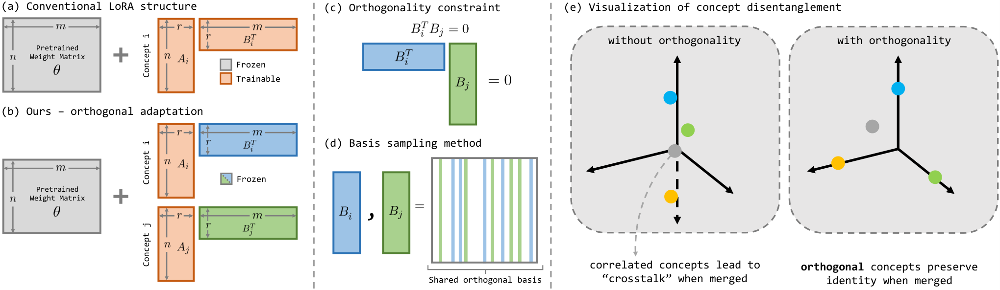

# Orthogonal Adaptation: 干渉を事後に直すのではなく、事前に防ぐ

> 原典: [[translations/2024-orthogonal-adaptation]] ・ `raw/papers/Orthogonal Adaptation for Modular Customization of Diffusion Models.md`
> 著者・年・会議: Ryan Po, Guandao Yang, Kfir Aberman, Gordon Wetzstein（スタンフォード大学 / Snap Research）, 2024, CVPR 2024（arXiv:2312.02432）

## 一言まとめ

複数の LoRA をマージすると壊れるという問題に対し、**マージの仕方を工夫するのではなく、そもそも干渉しない LoRA を学習させる**——各概念の LoRA の下方射影行列 $B_i$ を共有直交基底からランダムに選んだ列に固定することで、$B_i^\top B_j \approx 0$ を保証し、**単純な足し算でマージしても同一性が保たれる**ようにした手法。Mix-of-Show の gradient fusion が 3 概念で 15 分かかるところを **1 秒未満**で、同等以上の同一性保存を達成する。

## 背景と問題意識

[[lora-merging]] のこれまでの系譜——Custom Diffusion の閉形式マージ、Mix-of-Show の gradient fusion、ZipLoRA の学習係数マージ——には共通点がある。**すべて「独立に学習された LoRA を、後からどう混ぜるか」を解いている**。学習は自由にやらせておいて、干渉は事後に捌く。

本論文はこの前提を疑う。著者らはまず問題を**モジュラー・カスタマイゼーション（Modular Customization）** として定式化する。3 段階からなる。

1. **独立したカスタマイゼーション** — 各ユーザーが自分の概念だけで微調整する。他人のデータには一切アクセスしない
2. **モジュラーな組合せ** — 推論時に任意の部分集合を選んで結合する
3. **共同合成** — 結合されたモデルで複数概念を 1 枚に生成する

この設定が要求するものは厳しい。**$n$ 個の概念から作れる組合せは指数的に増える**ので、組合せごとに融合を最適化する方式（Mix-of-Show）はスケールしない。しかも著者らが想定するのは、数百万のユーザーが自分のスマートフォン上で友人の概念と混ぜるシナリオである。ユーザー側の計算は些細でなければならず、他人の学習画像にアクセスできてはならない（プライバシー）。

### crosstalk の定式化

素朴な線形和（**FedAvg**, $\theta_{\text{merged}}=\theta+\sum_i \lambda_i \Delta\theta_i$）がなぜ壊れるのかを、著者らは 3 行で示す。概念 $i$ の入力 $X_i$ に対する層出力は $O_i(X_i)=(\theta+\Delta\theta_i)X_i$ だが、マージ後は

$$\hat{O}_{i}(X_{i})=(\theta+\Delta\theta_{i}+\Delta\theta_{j})X_{i}$$

となる。$\hat O_i = O_i$ が成り立つ条件は $\Delta\theta_{j}X_{i}=0$、すなわち**他人の重み残差が自分のデータをゼロに写す**ことである。この $\|\Delta\theta_j X_i\|$ を著者らは **crosstalk（クロストーク）** と名付けた。通信工学の用語を借りた命名だが、[[lora-merging]] が「identity loss」「signal interference」と別々に呼んできた 2 つの破綻を、**1 つの量として測れる形にした**点が有用である。

## 提案手法 / 主張

<figure>

<figcaption>図4（再掲）: (a) 通常の LoRA は A と B の両方を学習する。(b) 直交適応は A のみを学習し B は凍結する。(c) 概念 i と j の間に直交性の制約 B_i^T B_j = 0 を課す。(d) 概念が独立に学習される状況では、共有された直交行列からランダムに列を選ぶことで近似的な直交性を得る。(e) 相関した概念はマージ時にクロストークを起こし、直交する概念は同一性を保つ。</figcaption>
</figure>

### 中核：$B$ を凍結し、$A$ だけ学習する

LoRA は $\Delta\theta_i = A_i B_i^\top$ と分解して**両方**を学習する。直交適応は **$B_i$ を定数に固定し、$A_i$ のみを最適化する**。

なぜこれで干渉が消えるのか。$B_j$ の列空間の直交補空間を張る行列を $\bar B_j$ とすると、$X_i$ をそこへ射影した成分について

$$\hat{O}_{i}(\bar B_j\bar B_j^\top X_{i})=O_{i}(\bar B_j\bar B_j^\top X_{i})+A_{j}\underbrace{B^{\top}_{j}\bar B_j}_{=0}\bar B_j^{\top}X_{i}=O_{i}(\bar B_j\bar B_j^\top X_{i})$$

となり、**他人の残差の寄与が厳密に消える**。$r \ll m$ なので $\bar B_j$ は空間のほとんどを覆い、$\bar B_j\bar B_j^\top X_i \approx X_i$ が成り立つ——つまり射影しても $X_i$ はほとんど変わらない。ここから追加の要請 $B_i^\top B_j = 0$ が導かれる。

**$X_i$ がフル列階数を持つ以上、厳密な直交性は達成できない**——だから部分空間への射影という緩和を挟む。この論法の運び方は丁寧で、なぜ「近似的な直交性で十分か」の根拠になっている。

### $B_i$ をどう作るか：共有直交基底からのランダム抽出

最大の難所は、**他のユーザーがどの基底を選んだか知らないまま直交性を確保する**ことである。著者らの答えは拍子抜けするほど単純で、**全ユーザーが共有する大きな直交行列 $O \in \mathbb{R}^{n\times n}$ を用意し、各概念は $O$ からランダムに $k$ 列を取って $B_i$ とする**。$k \ll n$ なら 2 つの $B_i$ が同じ列を共有する確率は低い。

実装上の妙もある。Stable Diffusion v1.5 の全層で**一意な入力次元は 4 つしかない（320・640・768・1280）**。だから正方行列を 4 つ保存するだけでよく、固定シードでその場生成もできる。「共有基底が要る」という一見重い前提が、実質ゼロコストに落ちている。

代替案としてガウス乱数の $B_i$（期待値で直交）も検討されているが、**経験的にクロストークが大きくなる**ため採用されていない。

### 表現力は落ちないのか

$B_i$ を凍結すると学習パラメータが半減する。著者らの答えは**過剰パラメータ化**である——大規模 text-to-image モデルは十分に冗長なので、部分空間の微調整だけで新規概念を捉えられる。図 5 と表 2 の「マージ前」の列がこれを裏づけており、単一概念の忠実度は制約なしの設定と同等である（画像整合 .748 は全手法中で最高）。

## 実験結果と知見

Stable Diffusion（**ChilloutMix** チェックポイント）上、12 の概念（主に人物の同一性、各 16 枚）で評価。各概念を単独で微調整した後、ランダムに他の 2 概念とマージして測る。指標は CLIP ベースのテキスト整合・画像整合に加え、**ArcFace による同一性整合**（顔認識の検出率）。

| 手法 | マージ時間 | 画像整合 Δ | 同一性整合（単一 → マージ後） | Δ |
| --- | --- | --- | --- | --- |
| Custom Diffusion | 〜2 秒 | -.025 | .504 → .408 | -.096 |
| DB-LoRA (FedAvg) | < 1 秒 | -.213 | .683 → **.098** | **-.585** |
| MoS (FedAvg) | < 1 秒 | -.010 | .728 → .706 | -.022 |
| MoS (Gradient Fusion) | **〜15 分** | -.016 | .728 → .717 | -.011 |
| **Ours** | **< 1 秒** | **-.007** | **.740 → .745** | **+.005** |

読み取るべき点：

- **DB-LoRA + FedAvg の崩壊が凄まじい**。同一性整合 .683 → .098 で、実質「別人になる」。素朴な線形和が使い物にならないという [[lora-merging]] の主張に、これ以上ないほど明快な数値がついた。
- **Mix-of-Show の層ごとテキスト埋め込み（ED-LoRA）だけでも FedAvg の崩壊はかなり防げる**（-.022）。gradient fusion の 15 分は、そこから -.011 へ改善するために払われている。費用対効果の観点で厳しい見方ができる。
- **本手法だけが劣化しない**（+.005）。マージ後の方がわずかに良いのは誤差範囲だが、「劣化しない」こと自体が他手法との質的な差である。
- テキスト整合では Custom Diffusion と DB-LoRA が上回るが、それは概念整合を大きく犠牲にした結果である（概念を捉えられていないモデルほどプロンプトには従う）。

### アブレーションが本質を突いている

- **直交性の度合いを連続的に動かす**（$B_i = B_j$ → 列の半分が重複 → 完全直交）と、**2 概念のマージという最も易しい場合ですら**同一性保存に有意差が出る。
- **概念数を増やす**と、直交性なしでは少数でも急速に劣化する。著者らは「直交性なしで本手法を走らせることは FedAvg でマージした Mix-of-Show と等価である」と明言しており、比較の統制が取れている。
- 補足の図 9 では、層ごとに正規化した $\|B_i^\top B_j\|$ を直接プロットして、クロストークが実際に下がっていることを示している。**主張した量をそのまま測っている**点は評価できる。

## 限界・批判的視点

- **既存の LoRA には適用できない**。著者らが自ら明記する最大の限界。直交適応は**学習プロセスそのものを変える**ので、コミュニティに共有された膨大な既存 LoRA 資産を事後に直交化することはできない。ZipLoRA・K-LoRA・Multi-LoRA Composition といった事後型の手法が依然として必要である理由がここにある。**「事前に防ぐ」対「事後に直す」は優劣ではなく、適用可能な状況が異なる。**
- **直交する概念の数に上限がある（原典が論じていない）**。$B_i$ は $n$ 次元空間から $r$ 列を取るので、**厳密に直交できる概念数は高々 $\lfloor n/r \rfloor$** である。SD v1.5 の最小の入力次元 320・論文の設定 $r=20$ なら **16 概念**。しかも実際はランダム抽出なので、誕生日問題により遥か手前から列の重複が生じる（2 概念間の期待重複は $20\times20/320=1.25$ 列）。原典は「無数の概念（countless concepts）」へのスケーラビリティを謳い、図 8(a) では**列の半分が重複するだけで同一性が劣化する**ことを自ら示しているのに、**概念数が増えたときに重複がどう蓄積するかを定量化していない**。図 8(b) の「概念数を変える」実験も具体的な上限を示さない。本手法のスケーラビリティ主張の中で最も検証が薄い部分である。
- **表 2 に内部矛盾がある**。本手法のテキスト整合が「.624 → .644」と書かれながら Δ が「-.010」になっている（+.020 のはず）。査読を経た論文としては見過ごしにくい誤植で、他の数値の信頼度もわずかに割り引いて読む必要がある。
- **評価が人物の顔にほぼ限定される**。著者らは ArcFace の頑健さを理由に挙げ「CLIP 特徴はカスタム概念の細かい詳細を識別するのに劣る」と正当化しており、これ自体は妥当な指摘である。ただし結果として、**物体・動物・画風といった他の概念型での定量評価が存在しない**（補足の図 9 に定性的な例が 1 つあるのみ）。12 概念という規模も小さく、データセットは非公開である。
- **ベースが ChilloutMix**。コミュニティ製のマージ済みチェックポイントを基盤に選んでいる（人物の顔生成の品質のため）。再現性と、素の SD への一般化の双方に疑問が残る。
- **マルチ概念生成そのものは解けていない**。本手法が解いたのは「マージしても各概念が壊れない」ことであって、「複数概念を 1 枚に破綻なく構図する」ことではない。著者らは正直で、Mix-of-Show の領域制御可能サンプリングを借用してなお**概念の無視と属性の漏出が起きる**失敗事例（図 10）を示している。[[multi-concept-customization]] の concept vanishing / confusion は依然として未解決である。
- **「プライバシーに配慮」の実態**。学習画像を共有しないのは事実だが、**全ユーザーが同じ直交基底の生成規約を共有する**必要はある。分散的とはいえ、事前の協調プロトコルがゼロではない。

## 位置づけ

本論文は [[lora-merging]] の系統整理に**新しい行を追加する**。既存の (0)〜(4) がすべて事後型だったのに対し、これは**学習時に干渉を構造的に排除する**唯一の系統である。

面白いのは、ZipLoRA（[[summaries/2024-ziplora]]）との関係である。ZipLoRA は「LoRA の列の cosine 類似度が高いと直和が破綻する」と診断したうえで、処方箋として**学習係数で列を直交化する**——つまり事後に直交性を作る。本論文は**同じ診断から出発して、最初から直交な列を配る**。診断が共有され、処方箋だけが分岐した典型例で、両者を並べると「干渉＝非直交性」という理解が 2023 年末に固まったことが見て取れる。

その後の系譜では、この「直交性」という語彙が部分空間の幾何へ一般化されていく——NP-LoRA の零空間射影、SSR-Merge の部分空間信号ルーティングなど（いずれも本 wiki 未取り込み）。本論文はその出発点にあたる。

同時に、**LLM 側の重みマージ理論（Task Arithmetic・TIES-Merging・DARE）とほぼ同じ問題を、独立に、画像側で解いている**ことも指摘しておく価値がある。TIES が「符号の衝突」として捉えたものと、本論文の crosstalk は同じ現象の別の切り口である。両者が交差していないのは、この時期の画像側とテキスト側の分断を示している。

## 用語と略称

- **LoRA** = Low-Rank Adaptation, 低ランク適応。重み変化を $\Delta W = BA$ で表す軽量な微調整（[[low-rank-adaptation]]）。
- **FedAvg** = Federated Averaging, 連合平均。もとは分散学習の手法で、ここでは重み残差の単純な加重平均を指す。
- **crosstalk（クロストーク）** = $\|\Delta\theta_j X_i\|$。他概念の重み残差が自分のデータに与える干渉の量。
- **Modular Customization（モジュラー・カスタマイゼーション）** = 概念を独立に学習し、推論時に任意の部分集合を追加学習なしに結合する設定。
- **MoS** = Mix-of-Show（[[summaries/2023-mix-of-show]]）。
- **ED-LoRA** = Embedding-Decomposed LoRA, Mix-of-Show の LoRA 変種。
- **DB-LoRA** = DreamBooth-LoRA, DreamBooth を LoRA で行うコミュニティ実装。
- **ArcFace** = 加法的角度マージン損失による顔認識モデル。ここでは同一性整合の測定に使う。
- **$\mathcal{P}+$** = 層ごとに異なるテキスト埋め込みを最適化する Textual Inversion の拡張。
- **行空間の直交性** = 制約を下方射影行列 $B$ に課すこと。重み残差は行を通じて層の入力と相互作用するため、こちらが選ばれた。

## 関連ページ

- [[concepts/lora-merging]]
- [[concepts/multi-concept-customization]]
- [[concepts/low-rank-adaptation]]
- [[concepts/subject-driven-generation]]
- [[summaries/2023-mix-of-show]]
- [[summaries/2024-ziplora]]
- [[summaries/2023-custom-diffusion]]
- [[summaries/2024-b-lora]]
