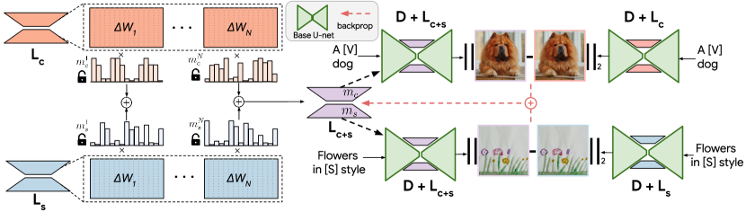

# ZipLoRA: LoRA を効果的に併合して任意の被写体を任意のスタイルで

> 原典: [[translations/2024-ziplora]] ・ `raw/papers/ZipLoRA_ ...md`
> 著者・年・会議: Shah, Ruiz ら（Google Research・UIUC）・2023・ECCV 2024（arXiv 2311.13600）

## 一言まとめ

別々に学習した **content LoRA（被写体）と style LoRA（画風）を安全にマージ**し、「任意の被写体を任意のスタイルで」描くことを実現する手法。鍵は、層・列ごとに学習可能な **merger 係数 $m_c,m_s$** を導入し、各 LoRA の挙動を保ちつつ両者の列が干渉しない（直交する）ように最適化すること。ファスナー（zipper）のように 2 つの LoRA を噛み合わせる比喩から ZipLoRA。SDXL 上で動き、hyperparameter-free・約 100 step・joint 学習比 10× 高速。

## 背景と問題意識

[[low-rank-adaptation]]（LoRA）でカスタマイズした「被写体」LoRA と「画風」LoRA はそれぞれ単独では高品質だが、両者を 1 枚に合成（[[multi-concept-customization]]）しようとすると、被写体忠実度（subject fidelity）かスタイル忠実度（style fidelity）のどちらかが犠牲になる。従来の **直接併合（Direct Merge）**——Ryu（kohya 系）の加重算術和 $\Delta W_m=w_c\Delta W_c+w_s\Delta W_s$——は係数 $w_c,w_s$ のグリッドサーチが要り、頑健でなく時間がかかる。Mix-of-Show（[[summaries/2023-mix-of-show]]）の gradient fusion は再学習を要し高価。ZipLoRA はこの「**被写体×画風の 2 LoRA を安価かつ確実にマージする**」問題に特化する。

ZipLoRA は SDXL（Stable Diffusion XL, [[latent-diffusion]] の大型版）の偶然の発見を足場にする：**SDXL は単一のスタイル参照画像だけで DreamBooth fine-tune するとスタイルを学べる**（人間フィードバックを要する StyleDrop より手軽）。これにより任意スタイルの LoRA が安価に作れ、マージ研究の土台になる。

## 提案手法 / 主張

ZipLoRA は 2 つの観察に基づく。

- **観察1: LoRA の $\Delta W$ は疎（sparse）**。$\Delta W$ の要素の大半は大きさがほぼゼロで、**90% を 0 にしても生成品質が保たれる**（図2）。LoRA は設計上 rank が小さく、列の情報が冗長だから。
- **観察2: 列の整列が高いと併合が破綻**。独立に学習した 2 LoRA の重み行列の**列の cosine 類似度が非ゼロ**だと、直接足したとき情報が重ね合わさり（signal interference, 信号干渉）、各概念を正確に再現できなくなる。列が直交（cosine 0）なら損失は避けられる（図3）。

そこで層・列ごとに学習可能な **merger 係数ベクトル $m_c,m_s$** を導入する（次元 = $\Delta W$ の列数。各要素がその列の最終マージへの寄与）：

$$
\Delta W_m=m_c\otimes\Delta W_c+m_s\otimes\Delta W_s
$$

（$\otimes$ は列ごとの要素積）。これを次の損失で最適化する：

$$
\mathcal{L}_{merge}=\|(D{\oplus}L_m)(x_c,p_c)-(D{\oplus}L_c)(x_c,p_c)\|_2+\|(D{\oplus}L_m)(x_s,p_s)-(D{\oplus}L_s)(x_s,p_s)\|_2+\lambda\sum_i|m_c^{(i)}\cdot m_s^{(i)}|
$$

- **第1・2項**（再構成項）：マージ LoRA $L_m$ が、content 参照では元の content LoRA $L_c$ と、style 参照では元の style LoRA $L_s$ と同じ出力を出すよう保つ（個別 LoRA の挙動を保存）。
- **第3項**（直交化項）：$m_c$ と $m_s$ が同じ列を同時に使わない（積が小さい）ようにし、列の干渉を抑える。$\lambda=0.01$。
- **ベースモデルと個別 LoRA は凍結し、係数 $m_c,m_s$ だけを最適化**する。LoRA の疎性ゆえに各 LoRA から不要な列を無視でき、干渉最小化が容易になる。約 100 step で cosine 類似度がゼロに落ちる。

<figure>

<figcaption>図4（再掲, [[translations/2024-ziplora]] より）: ZipLoRA の概観。content LoRA $L_c$ と style LoRA $L_s$ の各列に学習可能係数 $m_c,m_s$ を掛けてマージ LoRA $L_{c+s}$ を作り、(1) 各参照で個別 LoRA の出力との差を、(2) 列間の cosine 類似度を最小化する。係数のみを学習し、ベースと個別 LoRA は凍結。</figcaption>
</figure>

## 実験結果と知見

- **ユーザー選好（表1）**：ZipLoRA が Direct Merge に 82.7%、Joint Training に 71.1%、StyleDrop に 68.0% で好まれる。
- **整列スコア（表2）**：subject-alignment（DINO）で 0.420 と Direct Merge（0.357）・Joint（0.378）を大きく上回り、text-alignment でも最高（0.303）。style-alignment（CLIP-I）は 0.699 とほぼ同等（Direct Merge 0.702）。**被写体忠実度を犠牲にせずスタイルを保つ**のが核心。
- **個別生成能力の保持（図8）**：マージ後も content LoRA・style LoRA を単独で呼び出した挙動を保つ（Mixture-of-Expert 的に使える）。直接併合はこれに失敗。
- **再文脈化（図7）**：被写体を新しい文脈に置きつつスタイルを維持できる。
- **スタイル強度の制御（図9）**：スタイル層の係数に追加スカラ $w_s$ を掛け $0\to1$ で滑らかにスタイル化の度合いを調整可能。

## 限界・批判的視点

- **2 LoRA（content 1＋style 1）の合成に特化**。3 つ以上や複数前景被写体の空間配置（LoRA-Composer, [[summaries/2024-lora-composer]] が扱う concept confusion/vanishing）は範囲外。
- **SDXL に依存**。SDXL の単一画像スタイル学習という性質が前提で、なぜ SDXL がそれを示すか（旧 SD/Imagen は不得手）は未解明。
- **評価指標の限界**：style-alignment は CLIP-I・DINO ベースで、微妙なスタイル的細部を捉えきれず、画像内容と絡む。著者自身が指標の不完全さを認める。
- 各 content/style LoRA は事前に DreamBooth で 1000 step 学習する必要があり、マージ自体は軽いが前段は依然コストがある。

## 用語と略称

- **LoRA** = Low-Rank Adaptation（低ランク適応, $\Delta W=BA$）。**content / style LoRA** = 被写体 / 画風を学習した LoRA。
- **Direct Merge** = 加重算術和 $\Delta W_m=w_c\Delta W_c+w_s\Delta W_s$（Ryu, ベースライン）。
- **merger coefficient** $m_c,m_s$ = 列ごとの学習可能混合係数。**signal interference** = 列の重ね合わせによる信号干渉。
- **subject / style / text fidelity (alignment)** = 被写体 / スタイル / テキストの忠実度（整列）。
- **SDXL** = Stable Diffusion XL（[[latent-diffusion]] の大型モデル）。**DreamBooth** = 少数画像で T2I を fine-tune する personalization（[[subject-driven-generation]]）。**StyleDrop** = スタイル個人化手法（人間フィードバック反復）。
- **CLIP-I / CLIP-T** = CLIP 画像 / テキスト埋め込み。**DINO** = 自己教師あり ViT 特徴（被写体類似度に使用）。**PEFT** = Parameter Efficient Fine-Tuning。**MoE** = Mixture of Experts。

## 既存知識との接続

- [[lora-merging]]：本論文は重みマージ系統の中で「**学習係数マージ（列の干渉を最小化）**」を確立したランドマーク。Mix-of-Show の gradient fusion（[[summaries/2023-mix-of-show]]）が「推論挙動の整合」で identity loss を解いたのに対し、ZipLoRA は「列の cosine 類似度」という別の角度で content×style の干渉を解く。
- [[low-rank-adaptation]]：LoRA の**疎性**（$\Delta W$ の 90% を捨てても品質維持）という観察自体が、複数 LoRA を干渉なくマージできる根拠を与える。
- [[subject-driven-generation]]：content LoRA は DreamBooth 系の被写体 personalization、style LoRA は SDXL の単一画像スタイル学習で作る。両者を分離して学習・合成する点が新しい。
- [[multi-concept-customization]]：被写体×画風という 2 概念合成の特化版。複数前景や空間配置を扱う LoRA-Composer・Multi-LoRA Composition とは守備範囲が異なる。
- [[latent-diffusion]]：SDXL（LDM の大型版）の単一画像スタイル学習能力に強く依存する。

## 関連ページ

- [[concepts/lora-merging]] — 複数 LoRA のマージ／融合（本論文が学習係数マージの代表）
- [[concepts/low-rank-adaptation]] — LoRA（疎性の観察）
- [[concepts/subject-driven-generation]] — DreamBooth 系 personalization（content/style LoRA の作成元）
- [[concepts/multi-concept-customization]] — 多概念合成（本論文は 2 概念特化）
- [[summaries/2023-mix-of-show]] — Mix-of-Show（gradient fusion、重みマージ系の対照）
- [[summaries/2023-dreambooth]] — DreamBooth（content/style LoRA の学習目的）
