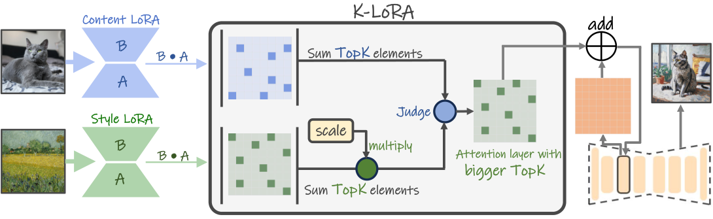

# K-LoRA: マージせず、層ごと・ステップごとに片方を選ぶ

> 原典: [[translations/2025-k-lora]] ・ `raw/papers/K-LoRA_ Unlocking Training-Free Fusion of Any Subject and Style LoRAs.md`
> 著者・年・会議: Ziheng Ouyang, Zhen Li, Qibin Hou（南開大学 VCIP）, 2025, CVPR 2025（arXiv:2502.18461）

## 一言まとめ

被写体 LoRA とスタイル LoRA を**重みレベルで混ぜること自体をやめ**、各注意層で両者の **Top-K 要素の絶対値和を比較して片方を丸ごと使う**。「初期の拡散ステップは被写体、後期はスタイルを担う」という観察に基づく時間依存のスケール係数で選択を傾ければ、**学習も係数調整も一切なし**で content と style が両立する。

## 背景と問題意識

[[lora-merging]] の系譜——閉形式マージ・gradient fusion・学習係数マージ——には、[[summaries/2024-b-lora]] が指摘した共通の代償がある：**ZipLoRA は content と style の組合せごとに再最適化が要る**。B-LoRA はこれを「分離を最初から作る」ことで回避したが、代わりに**専用の学習が必要**で、コミュニティにある既存の LoRA 資産をそのまま使えない。

K-LoRA の問いは第三の道である——**既存の LoRA をそのまま、追加学習ゼロで、うまく組み合わせられないか。**

### 出発点となった 2 つの観察

本論文の実質的な貢献は手法より**観察**の方にある。

**(i) LoRA は全層に当てる必要がない。** Multi-LoRA Composition に倣い、注意層の $x\%$ にだけランダムに LoRA を適用して生成すると、**$x>50$ では元のモデルと事実上見分けがつかない**。$x<25$ になって初めて概念の維持が崩れる。つまり**層の半分は捨ててよい**——ここに「片方だけを選ぶ」余地が生まれる。

**(ii) 拡散のタイムステップは役割分担している。** 初期ステップに style LoRA を当てると**物体の再構成そのものを壊す**が、後期に当てるとスタイル情報だけが乗る。content LoRA は逆で、初期に当てた方が明確に良い。

観察 (ii) は [[diffusion-sampling]] で知られる「初期ステップが構図を決め、後期が細部を詰める」という性質の、LoRA 適用における現れである。[[noise-schedule]] で HiDream-O1 が「SFT では後期ステップに学習を厚くする」と論じたのと同じ構造を、**推論側で使っている**と読める。

### 要素レベルのマージが失敗する理由

著者らはまず素朴な道を試している——ZipLoRA の「$\Delta W$ は疎」という観察に倣い、小さい要素をゼロにする（Magmax 流）。結果は既存手法と大差なかった。**「モデルが以前に学習した概念を正しく解釈できなくなる」**——要素レベルで行列をいじると、LoRA が符号化した概念そのものが壊れる。ここから「**元の重みを一切修正せず、どちらを使うかだけを決める**」という設計方針が出てくる。

## 提案手法 / 主張

<figure>

<figcaption>図3（再掲）: K-LoRA の概観。各順伝播層で両 LoRA の Top-K 要素の和を計算し、スタイル側にスケール係数を掛けてから比較して、勝った方の注意層をそのまま使う。元の重みには一切手を触れない。</figcaption>
</figure>

手順は 3 段階しかない。

**1. 各層の「重要度」を Top-K 和で測る。** 絶対値を取り、上位 $K$ 個の和を計算する。

$$S_{c}=\sum_{i\in\text{Top-K}(|\Delta W_{c}|)}|\Delta W_{c,i}|,\qquad S_{s}=\sum_{j\in\text{Top-K}(|\Delta W_{s}|)}|\Delta W_{s,j}|$$

$K$ の選び方は **$K=r_c \cdot r_s$**（両 LoRA の rank の積）。根拠は「rank は行列に含まれる情報量をある程度反映する」という直感である。

**2. 時間依存のスケールで傾ける。** 観察 (ii) を実装する。

$$S=\alpha\cdot\frac{t_{now}}{t_{all}}+\beta \qquad (\alpha=1.5,\ \beta=0.5)$$

これをスタイル側に掛けるので、**初期は content が勝ちやすく、後期は style が勝ちやすくなる**。

**3. コミュニティ LoRA の規模差を吸収する。** 出所の違う LoRA は要素の絶対値の桁が違い、そのままでは Top-K 比較が機能しない。全層の絶対値和の比 $\gamma$ で正規化する。これは実務的に重要な工夫で、**Hugging Face の LoRA とローカル学習の LoRA を混ぜられる**ようにしている。

最後に $S_c \ge S_s'$ なら content の重みを、そうでなければ style の重みを、その層でそのまま使う。

**注目すべきは、これが「マージ」ではないこと**である。どの層でも活性化しているのは片方だけで、$\Delta W$ は一切改変されない。図 5 の可視化では、青（物体）と緑（スタイル）が前半・後半で偏りつつも互いに浸透するパターンが現れる。[[multi-concept-customization]] の分類でいえば **(c) 復号過程での合成**に近く、Multi-LoRA Composition の LoRA Switch を**重みの統計量で駆動する**形に発展させたものと位置づけられる。

## 実験結果と知見

SDXL v1.0 と FLUX で評価。DreamBooth の被写体（4〜5 枚）と StyleDrop のスタイル（**各 1 枚**）から LoRA を学習し、18 組で比較。

| 手法 | Style Sim ↑ | CLIP（被写体）↑ | DINO（被写体）↑ |
| --- | --- | --- | --- |
| Direct（直和） | 48.9% | 66.6% | 43.0% |
| Joint（共同学習） | **68.2%** | 57.5% | **17.4%** |
| B-LoRA | 58.0% | 63.8% | 30.6% |
| ZipLoRA | 60.4% | 64.4% | 35.7% |
| **K-LoRA** | 58.7% | **69.4%** | **46.9%** |

- **被写体側では明確に最良**（CLIP +5.0、DINO +11.2 対 ZipLoRA）。
- **スタイル側では 3 位**。Joint（68.2%）と ZipLoRA（60.4%）に劣る。
- Joint の DINO 17.4% が示唆的で、**スタイルを塗りつぶして被写体を失った状態**でも Style Sim は最高になる。つまりこの 2 指標は本質的にトレードオフ曲線上の座標であり、**どの手法もその曲線上の一点を選んでいるにすぎない**。

ユーザースタディでは K-LoRA 52.7% / ZipLoRA 29.2% / B-LoRA 18.1%。GPT-4o の評価では **83.3% / 5.6% / 11.1%**。

アブレーションは丁寧である。

- **固定選択**（スケール係数だけで決め、Top-K を使わない）＝ Multi-LoRA Composition の精緻化にあたるベースライン → 特定のスタイル LoRA で物体がぼける。
- **ランダム選択**（1/3 で content、2/3 で style）→ 片方の特徴しか残らないか、両方失う。観察 (ii) の裏づけになっている。
- **$K$ の感度**：小さすぎるとどちらも際立たず、大きすぎるとスタイルが消えて物体が歪む。中間に最適点がある。
- **$\alpha,\beta$ のグリッド**（3×3）で $(1.5, 0.5)$ が最良。

## 限界・批判的視点

- **「定量的にも最先端を上回る」という要旨の主張は、スタイル側では成立していない。** 表 1 で Style Sim は 3 位である。実際に **NP-LoRA（[[summaries/2025-np-lora]]）は独立に「K-LoRA は被写体の同一性をよく保存するが所望のスタイルの捕捉に苦戦する」と述べ、自らの表でも K-LoRA を content 最良・style 最下位付近に置いている**。両論文の事実認識は一致しており、**違いはどちらの軸で勝つかを選んだ点にしかない**。[[style-content-disentanglement]] で論じた指標の交絡が、ここで最も鮮明に現れている。
- **推論が遅くなることを本論文は報告していない。** 選択が生成の各ステップ・各層で走るので、マージ済みの単一モデルを回すのとはコストが違う。NP-LoRA の実測では **K-LoRA の画像あたり生成時間は 60.4 秒**で、直接マージ（22.9 秒）の **2.6 倍**である。「学習不要」の代償が推論に移っているが、本論文にこの数値はない。[[lora-merging]] が整理した「1 度融合すれば追加推論コストがない」という重みマージの利点を、K-LoRA は手放している。
- **ユーザー評価と GPT-4o 評価の乖離が説明されない。** 人間 52.7% に対し GPT-4o は 83.3%。VLM 評価が特定の見た目を過剰に選好している可能性があるが、検討はない。[[aesthetic-scoring]] が提起した「評価器そのものを疑う」姿勢が求められる箇所である。
- **$K=r_c \cdot r_s$ の根拠が弱い。** 「rank は情報量をある程度反映する」という直感のみで、図 7 は $K$ に対する感度が実際に高いことを示している。rank の異なるコミュニティ LoRA を混ぜたときにこの式が妥当かは検証されていない。
- **観察 (i) の「$x>50$ で見分けがつかない」が定性的**。図 2(a) の目視のみで、定量指標がない。手法全体の前提になっている主張としては裏づけが薄い。
- **$\alpha,\beta$ の探索範囲が狭い。** 3×3 グリッドで、指標は CLIP 類似度 2 種の**単純和**（最良 128.1% 対最悪 124.5%）。トレードオフを 1 つの和に潰しているので、この最適点が何を最適化しているのかが曖昧である。
- **「ハイパーパラメータ調整が不要」という主張との齟齬。** 導入部で既存手法の問題として「手動のハイパーパラメータ調整が必要」を挙げながら、本手法も $\alpha,\beta,\gamma,K$ を持つ。固定値で済むと主張してはいるが、**性質としてはパラメータフリーではない**。

## 位置づけ

本論文は [[lora-merging]] に**「重みを混ぜない学習不要の融合」という新しいセル**を埋める。整理するとこうなる。

| | 学習が要る | 学習不要 |
| --- | --- | --- |
| **重みを混ぜる** | ZipLoRA、Mix-of-Show、Orthogonal Adaptation | Direct、**NP-LoRA** |
| **重みを混ぜない** | B-LoRA（専用学習） | **K-LoRA**、LoRA-Composer、Multi-LoRA Composition |

同時に、[[diffusion-sampling]] の知見を LoRA 合成へ持ち込んだ点でも新しい。「拡散のどのタイムステップで何が決まるか」は本 wiki が [[noise-schedule]] や [[inference-caching]] で繰り返し扱ってきた性質だが、**それを合成のスケジューリングに使う**という発想はここが初出である。

その後、K-LoRA は後続研究の標準ベースラインになった。NP-LoRA・SSR-Merge の双方が比較対象に含めており、とくに NP-LoRA は K-LoRA の rank 8 という設定をそのまま踏襲している。

## 用語と略称

- **LoRA** = Low-Rank Adaptation, 低ランク適応。$\Delta W = BA$（[[low-rank-adaptation]]）。
- **Top-K** = 値の大きい上位 $K$ 個の要素。ここでは絶対値の上位。
- **$r_c$ / $r_s$** = content / style LoRA の rank。
- **固定選択（Fixed Selection）** = Top-K を使わずスケール係数だけで選ぶ簡易版。本論文のアブレーション用ベースライン。
- **SDXL** = Stable Diffusion XL（[[summaries/2023-sdxl]]）。
- **FLUX** = Black Forest Labs の rectified flow モデル（[[summaries/2025-flux-kontext]]）。
- **StyleDrop / DreamBooth データセット** = それぞれスタイル参照・被写体参照の標準的な評価集合。
- **Magmax** = 大きさに基づいて重みを選択するモデルマージ手法。
- **StyleID** = 付録 B の比較対象。元画像の固定レイアウトに基づくスタイル転送。

## 関連ページ

- [[concepts/lora-merging]]
- [[concepts/style-content-disentanglement]]
- [[concepts/low-rank-adaptation]]
- [[concepts/multi-concept-customization]]
- [[concepts/diffusion-sampling]]
- [[summaries/2024-ziplora]]
- [[summaries/2024-b-lora]]
- [[summaries/2024-orthogonal-adaptation]]
- [[summaries/2025-np-lora]]
- [[summaries/2026-ssr-merge]]
