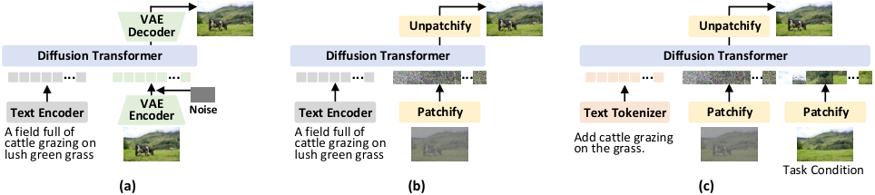
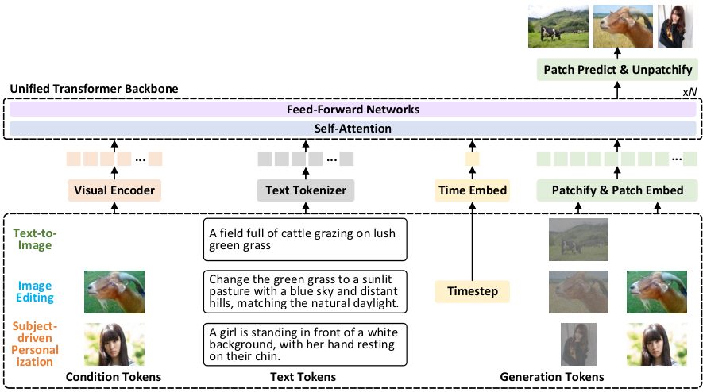

# HiDream-O1-Image: VAE も外部テキストエンコーダも捨てる「ネイティブに統一された」生成モデル

> 原典: [[translations/2026-hidream-o1-image]] ・ `raw/papers/HiDream-O1-Image_ A Natively Unified Image Generative Foundation Model with Pixel-level Unified Transformer.md`
> 著者・年: HiDream.ai（責任著者 Ting Yao, Tao Mei）・2026 年・arXiv:2605.11061

## 一言まとめ

**VAE も既製のテキストエンコーダも一切使わず、生ピクセル・テキストトークン・条件画像トークンを 1 つの共有トークン空間に流し込む decoder-only Transformer** で、T2I 生成・指示ベース編集・被写体駆動の個人化をすべて「文脈内推論」として扱う基盤モデル。8B 版が 27B の Qwen-Image に並び、200B+ 版がクローズドソースを含む SOTA を主張する。

## 背景と問題意識

本 wiki の背骨には、**Latent Diffusion（[[latent-diffusion]]）が敷いた前提**が通っている——「画像は重すぎるので、まず VAE で潜在空間に圧縮し、そこで拡散を回す」。この前提は Stable Diffusion 以降ほぼ疑われず、直前に取り込んだ Qwen-Image-VAE-2.0（[[summaries/2026-qwen-image-vae-2]]）に至っては**その VAE をどう設計するかを主題化**するところまで来ていた。

本論文はその前提そのものを撃つ。著者らの診断は、現行の主流が **2 重に断片化（fragmented）** している、というものである。

1. **VAE による情報ボトルネック**。潜在空間への圧縮は非可逆であり、**高周波の視覚的詳細が失われる**。ゆえに VAE の再構成品質が生成忠実度の**上限を決めてしまう**。これは [[image-tokenizer]] で整理した「圧縮率 $f$・再構成忠実度・拡散可能性の三者間トレードオフ」を、「そもそもトレードオフの土俵に乗らなければよい」という角度から見直す主張である。
2. **テキストエンコーダの分断**。CLIP や T5 は生成モデルと**別々に学習された**ものを持ってくるため、視覚側と言語側の表現空間が根本から共同最適化されていない。この**意味的なずれ（semantic misalignment）** が残る。

図5 がこの整理を 1 枚にまとめている。(a) latent DiT は VAE エンコーダ／デコーダに挟まれ、(b) pixel-space DiT は VAE を捨てたが依然としてテキストエンコーダは外付け、(c) 本論文は**両方とも捨てる**。

<figure>

<figcaption>図5（引用）: (a) latent DiT（VAE エンコーダ＋デコーダ、外付け Text Encoder）、(b) pixel-space DiT（Patchify/Unpatchify で VAE を排したが Text Encoder は外付け）、(c) HiDream-O1-Image の Unified Transformer（Text Tokenizer と Patchify のみ。タスク条件も同じ Patchify を通る）。</figcaption>
</figure>

なお **pixel-space diffusion（ピクセル空間拡散）** 自体は本論文の発明ではなく、先行研究（Hoogeboom らの "simpler diffusion"、JiT 等）がある。本論文の主張は「ピクセル空間**かつ**言語モデルと同じトークン空間、**かつ**単一タスクでなく汎用」という 3 点の同時達成にある。

## 提案手法 / 主張

### 1. 統一マルチモーダル・トークン化 — 3 種類のトークンを 1 本の系列に

<figure>

<figcaption>図7（引用）: 条件トークン（Visual Encoder 経由）、テキストトークン（Text Tokenizer）、タイムステップ埋め込み、生成トークン（Patchify & Patch Embed）が 1 本の系列として Unified Transformer に入り、出力から Patch Predict & Unpatchify で画像が復元される。同じ経路で text-to-image・画像編集・被写体駆動個人化のすべてを扱う。</figcaption>
</figure>

- **テキストトークン $y$**：バックボーン（LLM）の**ネイティブな語彙**でトークン化。別のテキストエンコーダは介在しない。
- **条件トークン $c$**：編集元や参照被写体の画像。ここだけは視覚エンコーダ **SigLIP-2**（画像-テキスト対照学習の後継モデル）を通して意味的に豊かなトークンにし、学習可能な射影で共有空間へ整合させる。
- **生成トークン $x_t$**：目標画像とガウスノイズの線形補間 $x_t = t\,x + (1-t)\,\varepsilon$ を**そのままパッチ分割**し、学習可能なパッチ埋め込みで共有空間へ。VAE は登場しない。

出力側は線形ヘッドが各トークンをクリーンな画像パッチへ写像し、パッチを組み直して画像にする。**「Patchify → Transformer → Unpatchify」だけで画素まで到達する**のがこの設計の要点である。

> 補足: 条件画像は SigLIP-2 という「外部の視覚エンコーダ」を通っている。VAE を捨てたことと、外部エンコーダを 1 つも使わないことは厳密には同じではなく、本論文が排したのは**生成経路上の VAE と、テキスト側の外付けエンコーダ**である。

### 2. Unified Transformer (UiT) — LLM をそのまま拡散バックボーンにする

バックボーンは **decoder-only Transformer**。8B 版は **Qwen3-VL-8B-Instruct から初期化**する——つまり**マルチモーダル理解モデルを、そのまま画像生成器に転生させる**。RMSNorm・SwiGLU・RoPE という LLM の標準構成をそのまま使い、**拡散のタイムステップは「特別なトークン 1 個」として系列に混ぜる**。adaLN による変調（[[diffusion-model-architecture]] で見てきた DiT の定番）を使わないので、**Transformer の中核構造を一切改変せずに済む**。これがスケーリングのしやすさに直結する、というのが 200B+ への拡張の根拠になっている。

**ハイブリッド Unified Attention** が、この「LLM と拡散モデルの結婚」を成立させる仕掛けである。

| トークン種 | 注意の型 | 理由 |
| --- | --- | --- |
| 条件トークン・テキストトークン | **因果マスク**（先行トークンのみ） | 自己回帰的な言語モデリングの構造を保存し、事前学習された能力を壊さない |
| 生成トークン | **完全注意**（全トークン） | 画像は 2 次元の大域的な空間依存を持つので、片方向では組み立てられない |

言語側は因果的、画像側は全結合——**1 つの注意行列の中でマスクを使い分ける**だけで両立させている。

### 3. 目的関数 — flow matching だけでは足りない

ピクセル空間の拡散は細部を捉える一方、**長距離の意味的一貫性のモデル化に弱い**（潜在空間なら VAE が意味的な圧縮を済ませてくれていた仕事を、自前でやらねばならない）。そこで [[flow-matching]] 損失に加え、**LPIPS 損失**（学習済み CNN の特徴距離で知覚的類似度を測る）と**知覚的 DINO 損失**（自己教師あり視覚特徴での整合）を足す。Qwen-Image-VAE-2.0 が VAE の潜在を DINOv2 中間層へ意味的に整合させたのと同じ道具が、ここでは**生成モデル本体の損失**として現れている。

### 4. Reasoning-Driven Prompt Agent — 「考えてから」プロンプトを書く

Gemma ベースのエージェントが、ユーザーの生の指示に対して**空間配置・被写体の属性・物理的な論理・文脈的関係を明示的に推論する思考の連鎖（chain of thought）を生成してから**、最終的なプロンプトを出力する。Qwen-Image-2.0 の Prompt Enhancer（[[summaries/2026-qwen-image-2]]）が「書き換え」だったのに対し、こちらは**推論過程を挟む**点が拡張であり、後述の RLHF ではこのエージェント自体も「推論品質」報酬で最適化される。

### 5. 学習 — 3 段階の事前学習 ＋ SFT ＋ GRPO

| 段階 | 解像度 | タスク |
| --- | --- | --- |
| Stage I 基礎的整合 | 512² | T2I ＋ **言語モデリング（LM）** ＋ **マルチモーダル理解（MMU）** の同時学習 |
| Stage II 汎用文脈内学習 | 1,024² | 上記に画像編集・被写体駆動個人化を追加 |
| Stage III 高忠実洗練 | 2,048² 超 | 超高解像度の細部・知覚品質のみ |

Stage I で **LM と MMU を混ぜ続ける**のが特徴的で、「画像生成器に転生させても言語能力を失わせない」意図がある。事後学習は SFT → **GRPO**（[[reinforcement-learning-for-diffusion]]）で、報酬は **OCR 正確性・美的評価・指示追従忠実度・推論品質**の 4 系統を集約する。

**[[noise-schedule]] にとって重要な細部**：SFT 段階で、事前学習で使っていた **logit-normal タイムステップサンプリングを一様サンプリングに切り替える**。logit-normal は中間タイムステップに学習を集中させる（SD3 が導入し、FLUX.1 が解像度シフトと結びつけた）が、**微調整では後期のノイズ除去ステップ——細部が決まる領域——に実効的な重みを回したい**、という判断である。「事前学習と微調整でタイムステップ分布を変える」という発想自体が本 wiki には新しい。

### 6. 蒸留

フル版 50 ステップ → **HiDream-O1-Image-Dev の 28 ステップ**へ。DMD ＋ **標準の拡散損失（安定化のための補助項）** ＋ 敵対的損失の 3 項：

$$\mathcal{L}_{\text{total}}=\mathcal{L}_{\text{DMD}}+\lambda_{\text{diff}}\mathcal{L}_{\text{diff}}+\lambda_{\text{adv}}\mathcal{L}_{\text{adv}}$$

識別器は凍結教師バックボーンの多段階特徴で判定する。姉妹論文 [[summaries/2025-hidream-i1]] の 2 項構成に $\mathcal{L}_\text{diff}$ を足した形で、**ピクセル空間では蒸留がより不安定になる**ことの傍証と読める。

## 実験結果と知見

- **GenEval**（表1）: 8B が総合 **0.90**、200B+ が **0.92**。Qwen-Image と FLUX.2 [Dev] の 0.87、GPT Image 2 の 0.89 を上回る。従来モデルが軒並み苦手だった **Position が 8B で 0.93**（Qwen-Image 0.76、FLUX.2 0.73）と突出しており、共有トークン空間が空間的接地に効いているという主張の最も強い数値的裏付けになっている。
- **DPG**（表2）: 8B が 89.83、200B+ が 90.30。姉妹モデル HiDream-I1-Full が 85.89 だったのに対し、**Global が 76.44 → 95.15 へ劇的に改善**。前作の弱点だった大域的な記述への追従が解消されている。
- **HPSv3**（表3）: 8B が 10.37 で、GPT Image 2（10.21）・Nano Banana 2.0（10.01）・Qwen-Image（9.94）を上回る。
- **テキストレンダリング**：CVTG-2K の平均単語正解率が 8B で 0.9128（Qwen-Image 0.8288、FLUX.2 0.8926）。**LongText-Bench は 8B で英語 0.979 / 中国語 0.978** ——前作 HiDream-I1-Full の 0.543 / 0.024 からの跳躍が凄まじい。著者らはこれを **VAE 圧縮を経由しないことに直接帰している**。[[visual-text-rendering]] が Qwen-Image の分析から引き出した「**VAE がテキスト描画の上限を決める**」という命題に対し、「ならば VAE を外せばよい」という最も直接的な答えになっている。
- **編集**（GEdit / ImgEdit, 表6・7）: 8B が GEdit で Q-O 7.60 と、16.8B の FLUX.1 Kontext（6.34）や 27B の Qwen-Image-Edit（7.41）を上回る。ただし ImgEdit 総合は 4.14 で **Qwen-Image-Edit の 4.27 に負けている**。
- **多被写体個人化**（UniSubject, 表8）: 300 ケース・1,800 被写体、1 人の人物＋1〜10 個の参照物体という**極端な多参照**の新テストセット。Qwen-Image-Edit が 9〜11 被写体で Q-O 2.71 まで崩壊するのに対し、8B は 7.65 を保つ。参照数が増えても劣化しにくいことが、共有トークン空間の主張の 2 本目の柱になっている。
- **Artificial Analysis Text to Image Arena で第 8 位**（2026/5/5 時点）、オープンウェイトとしては最上位。

## 限界・批判的視点

- **効率の議論が一方通行**。ピクセル空間で拡散するとトークン数は潜在空間の $f^2$ 倍（$f=16$ なら 256 倍）になりうる。パッチサイズを大きく取って抑えているはずだが、**パッチサイズも系列長も学習コストも推論コストも一切報告されていない**。「8B だから軽い」というパラメータ数の話と、「2,048² をピクセル空間で回す」計算量の話は別で、後者が空白のまま「効率的」と主張されている。[[image-tokenizer]] の中心命題（DiT の計算量は潜在トークン数に二次的）に真っ向から関わる論点なのに、その代償が示されない。
- **アブレーションがゼロ**。VAE を外したこと・共有トークン空間・ハイブリッド注意・LPIPS/DINO 損失・LM+MMU 同時学習——どの寄与も分離されていない。「VAE 圧縮を回避したからテキストが描ける」という中心的な因果主張も、**Qwen3-VL からの初期化**という別の大きな変数と交絡している（前作 HiDream-I1 との比較は、VAE の有無以外もすべて違う）。
- **200B+ の中身が不明**。「2,000 億超」としか書かれず、正確なパラメータ数・初期化元・学習コスト・そもそも公開されるのかが不明。オープンソース性を掲げているが、公開対象は 8B のみと読める。
- **UniSubject は自作ベンチマーク**。多被写体で競合が崩壊し自モデルが保つ、という最も印象的な結果が、著者ら自身が設計・評価（Qwen-VL2.5-72B による採点）したテストセットに依存する。公開の有無も明記されていない。
- **ImgEdit で Qwen-Image-Edit に負けている**点と、Extract サブタスクが 8B で 2.05（200B+ では 4.35）と極端に低い点は、本文で説明されない。
- **bakeyness の観点**（[[text-to-image-generation]]）: HPSv3 と Arena ELO を主軸に据える評価は、FLUX.1 Kontext（[[summaries/2025-flux-kontext]]）が批判した「単一の選好軸が AI っぽい美学に報いる」構図に乗っている。もっとも DPG・GenEval・OCR 系を併記している分、多軸化はされている。
- **安全性・記憶の議論が薄い**。ピクセル空間で直接学習するモデルは、潜在圧縮を挟むモデルより**学習画像をそのまま記憶（memorization）しやすい**可能性がある。重複除去は行われているが、この論点自体が扱われていない。

## 用語と略称

- **UiT** = Unified Transformer。生ピクセル・テキスト・条件を単一の共有トークン空間で処理する本論文のバックボーン。
- **pixel-space diffusion（ピクセル空間拡散）**：VAE 潜在ではなく生の画素の上で直接ノイズ除去を行う拡散モデル。
- **LDM** = Latent Diffusion Model。VAE 潜在空間で拡散を行う主流パラダイム。本論文の批判対象。
- **VAE** = Variational Autoencoder。画像を潜在表現へ圧縮／復元するオートエンコーダ。
- **DiT** = Diffusion Transformer。
- **T2I** = Text-to-Image。**LM** = Language Modeling。**MMU** = Multimodal Understanding。
- **SigLIP-2**：sigmoid 損失で学習される画像-テキスト対照学習モデル。条件画像の符号化に使用。
- **RMSNorm**：平均を引かず二乗平均平方根だけで正規化する軽量な LayerNorm 変種。LLM の標準。
- **RoPE** = Rotary Position Embedding。回転行列で相対位置を注意に埋め込む位置符号化。
- **SwiGLU** = Swish-Gated Linear Unit。ゲート付き FFN。
- **LPIPS** = Learned Perceptual Image Patch Similarity。学習済み CNN 特徴での知覚的距離。
- **DINO / DINOv2**：自己教師あり学習による視覚特徴抽出器。
- **GRPO** = Group Relative Policy Optimization。グループ内の相対評価で優位性を測る RL 手法。
- **RLHF** = Reinforcement Learning from Human Feedback。**SFT** = Supervised Fine-Tuning。
- **DMD** = Distribution Matching Distillation。
- **logit-normal サンプリング**：タイムステップ $t$ を logit-normal 分布から引き、中間ステップに学習を集中させる手法（SD3 由来）。
- **GenEval / DPG**：プロンプト追従性のベンチマーク。**HPSv3**：人間選好の予測スコア。
- **CVTG-2K / LongText-Bench**：画像内テキスト描画のベンチマーク（前者は複数領域の単語正解率と NED、後者は英中の長文）。
- **NED** = Normalized Edit Distance。OCR 結果と正解文字列の正規化編集距離。
- **GEdit / ImgEdit**：指示ベース画像編集のベンチマーク。**UniSubject**：本論文が作成した多被写体個人化のテストセット。
- **VIEScore**：VLM に生成結果を採点させる評価プロトコル。Q-PF（プロンプト追従）・Q-SC（被写体一貫性）・Q-O（総合）。

## 関連ページ

- [[concepts/pixel-space-diffusion]] — 本論文が推す、VAE を経由しない拡散の系統
- [[concepts/image-tokenizer]] — 反対側の立場（潜在空間を精緻に設計する）との論争
- [[concepts/latent-diffusion]] — 本論文が前提そのものを撃つ相手
- [[concepts/diffusion-model-architecture]] — LLM バックボーンをそのまま使う UiT の位置づけ
- [[concepts/visual-text-rendering]] — 「VAE がテキスト描画の上限を決める」への最も直接的な回答
- [[concepts/instruction-based-image-editing]] / [[concepts/subject-driven-generation]] — 文脈内推論として統一される下流タスク
- [[concepts/reinforcement-learning-for-diffusion]] — 4 報酬の GRPO と、推論エージェント自体の RL
- [[concepts/noise-schedule]] — 事前学習 logit-normal → SFT 一様サンプリングへの切り替え
- [[summaries/2025-hidream-i1]] — 同チームの前作。潜在空間＋外部エンコーダ 4 系統という正反対の設計
- [[summaries/2026-qwen-image-vae-2]] — 「VAE を精緻に設計する」路線の到達点。本論文と正面から対立する
- [[summaries/2025-flux-kontext]] / [[summaries/2026-qwen-image-2]] — 比較対象となる同世代の統一モデル
