# ノイズ除去拡散確率モデル（Denoising Diffusion Probabilistic Models）

> 原題: Denoising Diffusion Probabilistic Models
> 著者: Jonathan Ho, Ajay Jain, Pieter Abbeel（UC Berkeley）
> 出典: NeurIPS 2020 / arXiv:2006.11239 ・ https://ar5iv.labs.arxiv.org/html/2006.11239

<figure>

<figcaption>図1: CelebA-HQ 256×256（左）および無条件 CIFAR10（右）で生成されたサンプル。</figcaption>
</figure>

## Abstract（要旨）

我々は、非平衡熱力学からの考察に着想を得た潜在変数モデルの一群である拡散確率モデル（diffusion probabilistic models）を用いて、高品質な画像合成の結果を提示する。我々の最良の結果は、拡散確率モデルとランジュバン動力学（Langevin dynamics）を伴うノイズ除去スコアマッチング（denoising score matching）との間の新しい関係に基づいて設計された、重み付き変分下界（weighted variational bound）で学習することによって得られる。そして我々のモデルは、自己回帰的デコーディング（autoregressive decoding）の一般化として解釈できる、漸進的な不可逆解凍（progressive lossy decompression）の枠組みを自然に備えている。無条件 CIFAR10 データセットにおいて、我々は Inception スコア 9.46 と、最先端の FID スコア 3.17 を得た。256×256 の LSUN では、ProgressiveGAN と同程度のサンプル品質を得た。我々の実装は [https://github.com/hojonathanho/diffusion](https://github.com/hojonathanho/diffusion) で公開している。

## 1 Introduction（はじめに）

あらゆる種類の深層生成モデルが、最近、多種多様なデータモダリティにおいて高品質なサンプルを示してきた。敵対的生成ネットワーク（GANs）、自己回帰モデル、フロー（flows）、そして変分オートエンコーダ（VAEs）は、目を見張るような画像・音声サンプルを合成しており、また、GAN に匹敵する画像を生み出すエネルギーベースモデリングやスコアマッチングにおいても顕著な進歩があった。

本論文は、拡散確率モデルにおける進展を提示する。拡散確率モデル（簡潔さのため「拡散モデル（diffusion model）」と呼ぶ）は、変分推論（variational inference）を用いて学習され、有限時間の後にデータと一致するサンプルを生成するようにパラメータ化されたマルコフ連鎖である。この連鎖の遷移は、拡散過程（diffusion process）を逆向きにたどるように学習される。拡散過程とは、サンプリングとは反対の方向にデータへ徐々にノイズを加え、信号が破壊されるまで続けるマルコフ連鎖である。拡散が少量のガウスノイズから成る場合、サンプリング連鎖の遷移も条件付きガウス分布に設定すれば十分であり、これによって特に単純なニューラルネットワークのパラメータ化が可能になる。

拡散モデルは定義が単純で学習も効率的だが、我々の知る限り、それらが高品質なサンプルを生成できることはこれまで示されていなかった。我々は、拡散モデルが実際に高品質なサンプルを生成でき、時には他の種類の生成モデルで公表されている結果よりも優れていることを示す（第 4 節）。さらに、拡散モデルのある特定のパラメータ化が、学習時には複数のノイズレベルにわたるノイズ除去スコアマッチングと、サンプリング時にはアニーリング・ランジュバン動力学（annealed Langevin dynamics）と等価であることを明らかにすることを示す（第 3.2 節）。我々はこのパラメータ化を用いて最良のサンプル品質結果を得たため（第 4.2 節）、この等価性を我々の主要な貢献の一つとみなしている。

そのサンプル品質にもかかわらず、我々のモデルは他の尤度ベースのモデルと比べて競争力のある対数尤度（log likelihood）を持たない（ただし我々のモデルの対数尤度は、エネルギーベースモデルやスコアマッチングについてアニーリング重点サンプリングが報告してきた大きな推定値よりは良い）。我々は、モデルの可逆符号長（lossless codelength）の大部分が、知覚できない画像の細部を記述するために費やされていることを見出した（第 4.3 節）。我々はこの現象を不可逆圧縮（lossy compression）の言葉でより精緻に分析し、拡散モデルのサンプリング手続きが、自己回帰モデルで通常可能な範囲を大きく一般化するビット順序に沿った自己回帰的デコーディングに似た、一種の漸進的デコーディングであることを示す。

## 2 Background（背景）

拡散モデルは $p_{\theta}(\mathbf{x}_{0})\coloneqq\int p_{\theta}(\mathbf{x}_{0:T})\,d\mathbf{x}_{1:T}$ という形式の潜在変数モデルであり、ここで $\mathbf{x}_{1},\dotsc,\mathbf{x}_{T}$ はデータ $\mathbf{x}_{0}\sim q(\mathbf{x}_{0})$ と同じ次元を持つ潜在変数である。同時分布 $p_{\theta}(\mathbf{x}_{0:T})$ は*逆過程（reverse process）*と呼ばれ、$p(\mathbf{x}_{T})=\mathcal{N}(\mathbf{x}_{T};\mathbf{0},\mathbf{I})$ から始まる、学習されたガウス遷移を持つマルコフ連鎖として定義される。

$$
p_{\theta}(\mathbf{x}_{0:T})\coloneqq p(\mathbf{x}_{T})\prod_{t=1}^{T}p_{\theta}(\mathbf{x}_{t-1}|\mathbf{x}_{t}),\qquad p_{\theta}(\mathbf{x}_{t-1}|\mathbf{x}_{t})\coloneqq\mathcal{N}(\mathbf{x}_{t-1};{\boldsymbol{\mu}}_{\theta}(\mathbf{x}_{t},t),{\boldsymbol{\Sigma}}_{\theta}(\mathbf{x}_{t},t)) \tag{1}
$$

拡散モデルを他の種類の潜在変数モデルと区別するのは、近似事後分布 $q(\mathbf{x}_{1:T}|\mathbf{x}_{0})$（*順過程（forward process）*または*拡散過程*と呼ばれる）が、分散スケジュール $\beta_{1},\dotsc,\beta_{T}$ に従ってデータへ徐々にガウスノイズを加えるマルコフ連鎖に固定されている点である。

$$
q(\mathbf{x}_{1:T}|\mathbf{x}_{0})\coloneqq\prod_{t=1}^{T}q(\mathbf{x}_{t}|\mathbf{x}_{t-1}),\qquad q(\mathbf{x}_{t}|\mathbf{x}_{t-1})\coloneqq\mathcal{N}(\mathbf{x}_{t};\sqrt{1-\beta_{t}}\mathbf{x}_{t-1},\beta_{t}\mathbf{I}) \tag{2}
$$

<figure>

<figcaption>図2: 本研究で考える有向グラフィカルモデル。</figcaption>
</figure>

学習は、負の対数尤度に対する通常の変分下界を最適化することによって行われる。

$$
\mathbb{E}\left[-\log p_{\theta}(\mathbf{x}_{0})\right]\leq\mathbb{E}_{q}\!\left[-\log\frac{p_{\theta}(\mathbf{x}_{0:T})}{q(\mathbf{x}_{1:T}|\mathbf{x}_{0})}\right]=\mathbb{E}_{q}\bigg{[}-\log p(\mathbf{x}_{T})-\sum_{t\geq 1}\log\frac{p_{\theta}(\mathbf{x}_{t-1}|\mathbf{x}_{t})}{q(\mathbf{x}_{t}|\mathbf{x}_{t-1})}\bigg{]}\eqqcolon L \tag{3}
$$

順過程の分散 $\beta_{t}$ は再パラメータ化（reparameterization）によって学習することも、ハイパーパラメータとして定数に固定することもできる。逆過程の表現力は、$p_{\theta}(\mathbf{x}_{t-1}|\mathbf{x}_{t})$ におけるガウス条件付き分布の選択によって部分的に保証される。なぜなら $\beta_{t}$ が小さいとき、両過程は同じ関数形を持つからである。順過程の注目すべき性質は、任意の時刻 $t$ における $\mathbf{x}_{t}$ を閉形式でサンプリングできることである。$\alpha_{t}\coloneqq 1-\beta_{t}$ および $\bar{\alpha}_{t}\coloneqq\prod_{s=1}^{t}\alpha_{s}$ という記法を用いると、次が成り立つ。

$$
q(\mathbf{x}_{t}|\mathbf{x}_{0})=\mathcal{N}(\mathbf{x}_{t};\sqrt{\bar{\alpha}_{t}}\mathbf{x}_{0},(1-\bar{\alpha}_{t})\mathbf{I}) \tag{4}
$$

したがって、$L$ のランダムな項を確率的勾配降下法（SGD）で最適化することにより、効率的な学習が可能である。さらなる改善は、$L$ を次のように書き換えることによる分散低減から得られる。

$$
\mathbb{E}_{q}\bigg{[}\underbrace{D_{\mathrm{KL}}\!\left(q(\mathbf{x}_{T}|\mathbf{x}_{0})~{}\|~{}p(\mathbf{x}_{T})\right)}_{L_{T}}+\sum_{t>1}\underbrace{D_{\mathrm{KL}}\!\left(q(\mathbf{x}_{t-1}|\mathbf{x}_{t},\mathbf{x}_{0})~{}\|~{}p_{\theta}(\mathbf{x}_{t-1}|\mathbf{x}_{t})\right)}_{L_{t-1}}\underbrace{-\log p_{\theta}(\mathbf{x}_{0}|\mathbf{x}_{1})}_{L_{0}}\bigg{]} \tag{5}
$$

（詳細は付録 A を参照。各項のラベルは第 3 節で用いる。）式 (5) は KL ダイバージェンス（KL divergence）を用いて $p_{\theta}(\mathbf{x}_{t-1}|\mathbf{x}_{t})$ を順過程の事後分布と直接比較しているが、これらは $\mathbf{x}_{0}$ で条件付けると扱いやすい形になる。

$$
q(\mathbf{x}_{t-1}|\mathbf{x}_{t},\mathbf{x}_{0})=\mathcal{N}(\mathbf{x}_{t-1};\tilde{\boldsymbol{\mu}}_{t}(\mathbf{x}_{t},\mathbf{x}_{0}),\tilde{\beta}_{t}\mathbf{I}), \tag{6}
$$

$$
\text{ここで}\quad\tilde{\boldsymbol{\mu}}_{t}(\mathbf{x}_{t},\mathbf{x}_{0})\coloneqq\frac{\sqrt{\bar{\alpha}_{t-1}}\beta_{t}}{1-\bar{\alpha}_{t}}\mathbf{x}_{0}+\frac{\sqrt{\alpha_{t}}(1-\bar{\alpha}_{t-1})}{1-\bar{\alpha}_{t}}\mathbf{x}_{t}\quad\text{および}\quad\tilde{\beta}_{t}\coloneqq\frac{1-\bar{\alpha}_{t-1}}{1-\bar{\alpha}_{t}}\beta_{t} \tag{7}
$$

その結果、式 (5) のすべての KL ダイバージェンスはガウス分布同士の比較となるため、高分散なモンテカルロ推定の代わりに、ラオ・ブラックウェル化（Rao-Blackwellized）された閉形式の式で計算できる。

## 3 Diffusion models and denoising autoencoders（拡散モデルとノイズ除去オートエンコーダ）

拡散モデルは制限された潜在変数モデルのクラスに見えるかもしれないが、実装上は多くの自由度を許容する。順過程の分散 $\beta_{t}$、ならびに逆過程のモデルアーキテクチャとガウス分布のパラメータ化を選ばなければならない。これらの選択を導くために、我々は拡散モデルとノイズ除去スコアマッチングとの間に新しい明示的な関係を確立し（第 3.2 節）、それが拡散モデルのための簡略化された重み付き変分下界の目的関数につながる（第 3.4 節）。最終的に、我々のモデル設計は単純さと実験結果によって正当化される（第 4 節）。我々の議論は式 (5) の各項によって分類される。

### 3.1 順過程と $L_T$

我々は、順過程の分散 $\beta_{t}$ が再パラメータ化によって学習可能であるという事実を無視し、代わりにそれらを定数に固定する（詳細は第 4 節を参照）。したがって、我々の実装では近似事後分布 $q$ に学習可能なパラメータがなく、$L_{T}$ は学習中の定数となるため無視できる。

### 3.2 逆過程と $L_{1:T-1}$

ここで、$1<t\leq T$ に対する $p_{\theta}(\mathbf{x}_{t-1}|\mathbf{x}_{t})=\mathcal{N}(\mathbf{x}_{t-1};{\boldsymbol{\mu}}_{\theta}(\mathbf{x}_{t},t),{\boldsymbol{\Sigma}}_{\theta}(\mathbf{x}_{t},t))$ における我々の選択について議論する。まず、${\boldsymbol{\Sigma}}_{\theta}(\mathbf{x}_{t},t)=\sigma_{t}^{2}\mathbf{I}$ を、学習されない時間依存の定数に設定する。実験的には、$\sigma_{t}^{2}=\beta_{t}$ と $\sigma_{t}^{2}=\tilde{\beta}_{t}=\frac{1-\bar{\alpha}_{t-1}}{1-\bar{\alpha}_{t}}\beta_{t}$ のどちらも同程度の結果であった。第 1 の選択は $\mathbf{x}_{0}\sim\mathcal{N}(\mathbf{0},\mathbf{I})$ に対して最適であり、第 2 の選択は $\mathbf{x}_{0}$ が決定論的に 1 点に設定される場合に最適である。これらは、各座標が単位分散を持つデータについて、逆過程のエントロピーの上界と下界に対応する 2 つの極端な選択である。

次に、平均 ${\boldsymbol{\mu}}_{\theta}(\mathbf{x}_{t},t)$ を表すために、以下の $L_{t}$ の解析に動機づけられた特定のパラメータ化を提案する。$p_{\theta}(\mathbf{x}_{t-1}|\mathbf{x}_{t})=\mathcal{N}(\mathbf{x}_{t-1};{\boldsymbol{\mu}}_{\theta}(\mathbf{x}_{t},t),\sigma_{t}^{2}\mathbf{I})$ として、次のように書ける。

$$
L_{t-1}=\mathbb{E}_{q}\!\left[\frac{1}{2\sigma_{t}^{2}}\|\tilde{\boldsymbol{\mu}}_{t}(\mathbf{x}_{t},\mathbf{x}_{0})-{\boldsymbol{\mu}}_{\theta}(\mathbf{x}_{t},t)\|^{2}\right]+C \tag{8}
$$

ここで $C$ は $\theta$ に依存しない定数である。したがって、${\boldsymbol{\mu}}_{\theta}$ の最も直接的なパラメータ化は、順過程の事後平均 $\tilde{\boldsymbol{\mu}}_{t}$ を予測するモデルであることがわかる。しかし、$\mathbf{x}_{t}(\mathbf{x}_{0},{\boldsymbol{\epsilon}})=\sqrt{\bar{\alpha}_{t}}\mathbf{x}_{0}+\sqrt{1-\bar{\alpha}_{t}}{\boldsymbol{\epsilon}}$（ただし ${\boldsymbol{\epsilon}}\sim\mathcal{N}(\mathbf{0},\mathbf{I})$）として式 (4) を再パラメータ化し、順過程の事後分布の式 (7) を適用することで、式 (8) をさらに展開できる。

$$
L_{t-1}-C=\mathbb{E}_{\mathbf{x}_{0},{\boldsymbol{\epsilon}}}\!\left[\frac{1}{2\sigma_{t}^{2}}\left\|\tilde{\boldsymbol{\mu}}_{t}\!\left(\mathbf{x}_{t}(\mathbf{x}_{0},{\boldsymbol{\epsilon}}),\frac{1}{\sqrt{\bar{\alpha}_{t}}}(\mathbf{x}_{t}(\mathbf{x}_{0},{\boldsymbol{\epsilon}})-\sqrt{1-\bar{\alpha}_{t}}{\boldsymbol{\epsilon}})\right)-{\boldsymbol{\mu}}_{\theta}(\mathbf{x}_{t}(\mathbf{x}_{0},{\boldsymbol{\epsilon}}),t)\right\|^{2}\right] \tag{9}
$$

$$
=\mathbb{E}_{\mathbf{x}_{0},{\boldsymbol{\epsilon}}}\!\left[\frac{1}{2\sigma_{t}^{2}}\left\|\frac{1}{\sqrt{\alpha_{t}}}\left(\mathbf{x}_{t}(\mathbf{x}_{0},{\boldsymbol{\epsilon}})-\frac{\beta_{t}}{\sqrt{1-\bar{\alpha}_{t}}}{\boldsymbol{\epsilon}}\right)-{\boldsymbol{\mu}}_{\theta}(\mathbf{x}_{t}(\mathbf{x}_{0},{\boldsymbol{\epsilon}}),t)\right\|^{2}\right] \tag{10}
$$

式 (10) は、${\boldsymbol{\mu}}_{\theta}$ が $\mathbf{x}_{t}$ が与えられたとき $\frac{1}{\sqrt{\alpha_{t}}}\left(\mathbf{x}_{t}-\frac{\beta_{t}}{\sqrt{1-\bar{\alpha}_{t}}}{\boldsymbol{\epsilon}}\right)$ を予測しなければならないことを明らかにする。$\mathbf{x}_{t}$ はモデルへの入力として利用可能なので、次のパラメータ化を選ぶことができる。

$$
{\boldsymbol{\mu}}_{\theta}(\mathbf{x}_{t},t)=\tilde{\boldsymbol{\mu}}_{t}\!\left(\mathbf{x}_{t},\frac{1}{\sqrt{\bar{\alpha}_{t}}}(\mathbf{x}_{t}-\sqrt{1-\bar{\alpha}_{t}}{\boldsymbol{\epsilon}}_{\theta}(\mathbf{x}_{t}))\right)=\frac{1}{\sqrt{\alpha_{t}}}\left(\mathbf{x}_{t}-\frac{\beta_{t}}{\sqrt{1-\bar{\alpha}_{t}}}{\boldsymbol{\epsilon}}_{\theta}(\mathbf{x}_{t},t)\right) \tag{11}
$$

ここで ${\boldsymbol{\epsilon}}_{\theta}$ は、$\mathbf{x}_{t}$ から ${\boldsymbol{\epsilon}}$ を予測することを意図した関数近似器である。$\mathbf{x}_{t-1}\sim p_{\theta}(\mathbf{x}_{t-1}|\mathbf{x}_{t})$ をサンプリングするとは、$\mathbf{x}_{t-1}=\frac{1}{\sqrt{\alpha_{t}}}\left(\mathbf{x}_{t}-\frac{\beta_{t}}{\sqrt{1-\bar{\alpha}_{t}}}{\boldsymbol{\epsilon}}_{\theta}(\mathbf{x}_{t},t)\right)+\sigma_{t}\mathbf{z}$（ただし $\mathbf{z}\sim\mathcal{N}(\mathbf{0},\mathbf{I})$）を計算することである。完全なサンプリング手続きであるアルゴリズム 2 は、${\boldsymbol{\epsilon}}_{\theta}$ をデータ密度の学習された勾配とするランジュバン動力学に似ている。さらに、パラメータ化 (11) を用いると、式 (10) は次のように簡略化される。

$$
\mathbb{E}_{\mathbf{x}_{0},{\boldsymbol{\epsilon}}}\!\left[\frac{\beta_{t}^{2}}{2\sigma_{t}^{2}\alpha_{t}(1-\bar{\alpha}_{t})}\left\|{\boldsymbol{\epsilon}}-{\boldsymbol{\epsilon}}_{\theta}(\sqrt{\bar{\alpha}_{t}}\mathbf{x}_{0}+\sqrt{1-\bar{\alpha}_{t}}{\boldsymbol{\epsilon}},t)\right\|^{2}\right] \tag{12}
$$

これは $t$ で添字付けされた複数のノイズスケールにわたるノイズ除去スコアマッチングに似ている。式 (12) はランジュバン的な逆過程 (11) に対する変分下界の（一つの項に）等しいので、ノイズ除去スコアマッチングに似た目的関数を最適化することは、ランジュバン動力学に似たサンプリング連鎖の有限時間周辺分布を変分推論で適合させることと等価であることがわかる。

要約すると、逆過程の平均関数近似器 ${\boldsymbol{\mu}}_{\theta}$ を、$\tilde{\boldsymbol{\mu}}_{t}$ を予測するように学習することもできるし、そのパラメータ化を変更することで ${\boldsymbol{\epsilon}}$ を予測するように学習することもできる。（$\mathbf{x}_{0}$ を予測する可能性もあるが、我々は実験の初期段階でこれがサンプル品質を悪化させることを見出した。）我々は、${\boldsymbol{\epsilon}}$ 予測のパラメータ化がランジュバン動力学に似ており、かつ拡散モデルの変分下界をノイズ除去スコアマッチングに似た目的関数へと簡略化することを示した。とはいえ、これは $p_{\theta}(\mathbf{x}_{t-1}|\mathbf{x}_{t})$ の単なる別のパラメータ化にすぎないので、第 4 節で ${\boldsymbol{\epsilon}}$ を予測する場合と $\tilde{\boldsymbol{\mu}}_{t}$ を予測する場合を比較するアブレーションによってその有効性を検証する。

**アルゴリズム 1 学習**

1. **repeat**
2. $\quad\mathbf{x}_{0}\sim q(\mathbf{x}_{0})$
3. $\quad t\sim\mathrm{Uniform}(\{1,\dotsc,T\})$
4. $\quad{\boldsymbol{\epsilon}}\sim\mathcal{N}(\mathbf{0},\mathbf{I})$
5. $\quad$ 次に対して勾配降下ステップを実行する：$\nabla_{\theta}\left\|{\boldsymbol{\epsilon}}-{\boldsymbol{\epsilon}}_{\theta}(\sqrt{\bar{\alpha}_{t}}\mathbf{x}_{0}+\sqrt{1-\bar{\alpha}_{t}}{\boldsymbol{\epsilon}},t)\right\|^{2}$
6. **until** 収束

**アルゴリズム 2 サンプリング**

1. $\mathbf{x}_{T}\sim\mathcal{N}(\mathbf{0},\mathbf{I})$
2. **for** $t=T,\dotsc,1$ **do**
3. $\quad\mathbf{z}\sim\mathcal{N}(\mathbf{0},\mathbf{I})$ （ただし $t>1$ の場合。$t=1$ なら $\mathbf{z}=\mathbf{0}$）
4. $\quad\mathbf{x}_{t-1}=\frac{1}{\sqrt{\alpha_{t}}}\left(\mathbf{x}_{t}-\frac{1-\alpha_{t}}{\sqrt{1-\bar{\alpha}_{t}}}{\boldsymbol{\epsilon}}_{\theta}(\mathbf{x}_{t},t)\right)+\sigma_{t}\mathbf{z}$
5. **end for**
6. **return** $\mathbf{x}_{0}$

### 3.3 データのスケーリング、逆過程のデコーダ、$L_0$

我々は、画像データが $\{0,1,\dotsc,255\}$ の整数から成り、線形に $[-1,1]$ へスケールされていると仮定する。これにより、ニューラルネットワークの逆過程は、標準正規事前分布 $p(\mathbf{x}_{T})$ から始めて一貫してスケールされた入力上で動作する。離散的な対数尤度を得るために、逆過程の最後の項を、ガウス分布 $\mathcal{N}(\mathbf{x}_{0};{\boldsymbol{\mu}}_{\theta}(\mathbf{x}_{1},1),\sigma_{1}^{2}\mathbf{I})$ から導かれる独立な離散デコーダに設定する。

$$
\begin{split}p_{\theta}(\mathbf{x}_{0}|\mathbf{x}_{1})&=\prod_{i=1}^{D}\int_{\delta_{-}(x_{0}^{i})}^{\delta_{+}(x_{0}^{i})}\mathcal{N}(x;\mu_{\theta}^{i}(\mathbf{x}_{1},1),\sigma_{1}^{2})\,dx\\
\delta_{+}(x)&=\begin{cases}\infty&\text{if}\ x=1\\
x+\frac{1}{255}&\text{if}\ x<1\end{cases}\qquad\delta_{-}(x)=\begin{cases}-\infty&\text{if}\ x=-1\\
x-\frac{1}{255}&\text{if}\ x>-1\end{cases}\end{split} \tag{13}
$$

ここで $D$ はデータの次元数であり、上付き添字 $i$ は 1 座標の抽出を示す。（条件付き自己回帰モデルのようなより強力なデコーダを組み込むことも容易であろうが、それは将来の課題とする。）VAE のデコーダや自己回帰モデルで用いられる離散化された連続分布と同様に、ここでの我々の選択は、データにノイズを加えたり、スケーリング操作のヤコビアンを対数尤度に組み込んだりすることなく、変分下界が離散データの可逆符号長になることを保証する。サンプリングの最後には、${\boldsymbol{\mu}}_{\theta}(\mathbf{x}_{1},1)$ をノイズなしで表示する。

### 3.4 簡略化された学習目的関数

上で定義した逆過程とデコーダにより、式 (12) と (13) から導かれる項から成る変分下界は、$\theta$ に関して明らかに微分可能であり、学習に用いる準備が整う。しかし、我々は次の変分下界の変種で学習することが、サンプル品質にとって有益（かつ実装が単純）であることを見出した。

$$
L_{\mathrm{simple}}(\theta)\coloneqq\mathbb{E}_{t,\mathbf{x}_{0},{\boldsymbol{\epsilon}}}\!\left[\left\|{\boldsymbol{\epsilon}}-{\boldsymbol{\epsilon}}_{\theta}(\sqrt{\bar{\alpha}_{t}}\mathbf{x}_{0}+\sqrt{1-\bar{\alpha}_{t}}{\boldsymbol{\epsilon}},t)\right\|^{2}\right] \tag{14}
$$

ここで $t$ は $1$ から $T$ まで一様である。$t=1$ の場合は、離散デコーダの定義 (13) における積分を、ガウス確率密度関数にビン幅を掛けたもので近似し（$\sigma_{1}^{2}$ と端の効果を無視して）、$L_{0}$ に対応する。$t>1$ の場合は、NCSN のノイズ除去スコアマッチングモデルで用いられる損失の重み付けに類似した、式 (12) の重みなし版に対応する。（$L_{T}$ は順過程の分散 $\beta_{t}$ が固定されているため現れない。）アルゴリズム 1 は、この簡略化された目的関数を用いた完全な学習手続きを示す。

我々の簡略化された目的関数 (14) は式 (12) の重み付けを捨てているため、標準的な変分下界と比べて再構成の異なる側面を強調する重み付き変分下界となっている。特に、第 4 節における我々の拡散過程の設定では、簡略化された目的関数は小さい $t$ に対応する損失項を低く重み付けする。これらの項はネットワークを、ごく少量のノイズが乗ったデータをノイズ除去するように学習させるものであるため、それらを低く重み付けして、ネットワークがより大きい $t$ の項におけるより難しいノイズ除去タスクに集中できるようにすることが有益である。この重み付けの変更がより良いサンプル品質につながることを、実験で見ることになる。

## 4 Experiments（実験）

我々はすべての実験で $T=1000$ と設定し、サンプリング時に必要なニューラルネットワークの評価回数が先行研究と一致するようにした。順過程の分散は、$\beta_{1}=10^{-4}$ から $\beta_{T}=0.02$ まで線形に増加する定数に設定した。これらの定数は、$[-1,1]$ にスケールされたデータに対して小さくなるように選ばれ、逆過程と順過程がほぼ同じ関数形を持つことを保証しつつ、$\mathbf{x}_{T}$ における信号対雑音比をできる限り小さく保つ（我々の実験では $L_{T}=D_{\mathrm{KL}}\!\left(q(\mathbf{x}_{T}|\mathbf{x}_{0})~{}\|~{}\mathcal{N}(\mathbf{0},\mathbf{I})\right)\approx 10^{-5}$ ビット/次元）。

逆過程を表現するために、我々は全体を通してグループ正規化（group normalization）を用いた、マスクなしの PixelCNN++ に似た U-Net バックボーンを使用する。パラメータは時間方向で共有され、これは Transformer の正弦波位置埋め込み（sinusoidal position embedding）を用いてネットワークに指定される。我々は $16\times 16$ の特徴マップ解像度で自己注意（self-attention）を用いる。詳細は付録 B にある。

### 4.1 サンプル品質

**表1**: CIFAR10 の結果。NLL はビット/次元で測定。

| モデル | IS | FID | NLL Test (Train) |
| --- | --- | --- | --- |
| Conditional（条件付き） |  |  |  |
| EBM | $8.30$ | $37.9$ |  |
| JEM | $8.76$ | $38.4$ |  |
| BigGAN | $9.22$ | $14.73$ |  |
| StyleGAN2 + ADA (v1) | $\mathbf{10.06}$ | $\mathbf{2.67}$ |  |
| Unconditional（無条件） |  |  |  |
| Diffusion (original) |  |  | $\leq 5.40$ |
| Gated PixelCNN | $4.60$ | $65.93$ | $3.03$ $(2.90)$ |
| Sparse Transformer |  |  | $\mathbf{2.80}$ |
| PixelIQN | $5.29$ | $49.46$ |  |
| EBM | $6.78$ | $38.2$ |  |
| NCSNv2 |  | $31.75$ |  |
| NCSN | $8.87\!\pm\!0.12$ | $25.32$ |  |
| SNGAN | $8.22\!\pm\!0.05$ | $21.7$ |  |
| SNGAN-DDLS | $9.09\!\pm\!0.10$ | $15.42$ |  |
| StyleGAN2 + ADA (v1) | $\mathbf{9.74}\pm 0.05$ | $3.26$ |  |
| Ours（我々、$L$, fixed isotropic ${\boldsymbol{\Sigma}}$） | $7.67\!\pm\!0.13$ | $13.51$ | $\leq 3.70$ $(3.69)$ |
| Ours（我々、$L_{\mathrm{simple}}$） | $9.46\!\pm\!0.11$ | $\mathbf{3.17}$ | $\leq 3.75$ $(3.72)$ |

**表2**: 無条件 CIFAR10 における逆過程のパラメータ化と学習目的関数のアブレーション。空欄の項目は学習が不安定で、範囲外のスコアを伴う質の低いサンプルを生成した。

| 目的関数 | IS | FID |
| --- | --- | --- |
| $\tilde{\boldsymbol{\mu}}$ 予測（ベースライン） |  |  |
| $L$, learned diagonal ${\boldsymbol{\Sigma}}$ | $7.28\!\pm\!0.10$ | $23.69$ |
| $L$, fixed isotropic ${\boldsymbol{\Sigma}}$ | $8.06\!\pm\!0.09$ | $13.22$ |
| $\|\tilde{\boldsymbol{\mu}}-\tilde{\boldsymbol{\mu}}_{\theta}\|^{2}$ | – | – |
| ${\boldsymbol{\epsilon}}$ 予測（我々） |  |  |
| $L$, learned diagonal ${\boldsymbol{\Sigma}}$ | – | – |
| $L$, fixed isotropic ${\boldsymbol{\Sigma}}$ | $7.67\!\pm\!0.13$ | $13.51$ |
| $\|{\boldsymbol{\epsilon}}-{\boldsymbol{\epsilon}}_{\theta}\|^{2}$ （$L_{\mathrm{simple}}$） | $\mathbf{9.46\!\pm\!0.11}$ | $\mathbf{3.17}$ |

表 1 は CIFAR10 における Inception スコア、FID スコア、負の対数尤度（可逆符号長）を示す。FID スコア 3.17 により、我々の無条件モデルは、クラス条件付きモデルを含む文献中のほとんどのモデルよりも良いサンプル品質を達成している。我々の FID スコアは、標準的な慣行どおり学習セットに対して計算されている。テストセットに対して計算すると、スコアは 5.24 となるが、これは文献中の多くの学習セット FID スコアよりも依然として良い。

我々は、真の変分下界で学習したモデルが、予想どおり簡略化された目的関数で学習したものよりも良い符号長を与える一方、後者が最良のサンプル品質を与えることを見出した。CIFAR10 と CelebA-HQ 256×256 のサンプルは図 1 を、LSUN 256×256 のサンプルは図 3 と図 4 を、さらに多くは付録 D を参照のこと。

<figure>

<figcaption>図3: LSUN Church のサンプル。FID = 7.89。</figcaption>
</figure>

### 4.2 逆過程のパラメータ化と学習目的関数のアブレーション

表 2 では、逆過程のパラメータ化と学習目的関数がサンプル品質に与える影響を示す（第 3.2 節）。$\tilde{\boldsymbol{\mu}}$ を予測するベースラインの選択肢は、重みなし平均二乗誤差（式 (14) に類似した簡略化目的関数）ではなく、真の変分下界で学習した場合にのみうまく機能することがわかった。また、逆過程の分散を学習すること（パラメータ化された対角 ${\boldsymbol{\Sigma}}_{\theta}(\mathbf{x}_{t})$ を変分下界に組み込むこと）は、固定分散と比べて学習が不安定になり、サンプル品質が悪化することもわかった。我々が提案した ${\boldsymbol{\epsilon}}$ の予測は、固定分散の変分下界で学習した場合は $\tilde{\boldsymbol{\mu}}$ の予測とほぼ同程度の性能だが、我々の簡略化された目的関数で学習した場合ははるかに良い性能を示す。

### 4.3 漸進的符号化（Progressive coding）

表 1 はまた、我々の CIFAR10 モデルの符号長を示す。学習とテストの差は最大でも 0.03 ビット/次元であり、これは他の尤度ベースモデルで報告されている差と同程度で、我々の拡散モデルが過学習していないことを示している（最近傍可視化については付録 D を参照）。とはいえ、我々の可逆符号長はアニーリング重点サンプリングを用いたエネルギーベースモデルやスコアマッチングについて報告された大きな推定値よりは良いものの、他の種類の尤度ベース生成モデルとは競争力がない。

それでもなお我々のサンプルは高品質なので、拡散モデルには優れた不可逆圧縮器となる帰納バイアス（inductive bias）があると結論づける。変分下界の項 $L_{1}+\cdots+L_{T}$ をレート（rate）、$L_{0}$ を歪み（distortion）として扱うと、最高品質のサンプルを持つ我々の CIFAR10 モデルはレート 1.78 ビット/次元、歪み 1.97 ビット/次元を持ち、これは 0 から 255 のスケールで二乗平均平方根誤差（RMSE）0.95 に相当する。可逆符号長の半分以上が、知覚できない歪みを記述している。

#### 漸進的不可逆圧縮（Progressive lossy compression）

我々は、式 (5) の形を反映した漸進的不可逆符号を導入することで、モデルのレート歪み挙動をさらに調べることができる。アルゴリズム 3 と 4 を参照のこと。これらは、最小ランダム符号化（minimal random coding）のような手続き、すなわち任意の分布 $p$ と $q$（受信者が事前に利用できるのは $p$ のみ）について、サンプル $\mathbf{x}\sim q(\mathbf{x})$ を平均でおよそ $D_{\mathrm{KL}}\!\left(q(\mathbf{x})~{}\|~{}p(\mathbf{x})\right)$ ビットで送信できる手続きへのアクセスを仮定する。

**アルゴリズム 3 $\mathbf{x}_{0}$ の送信**

1. $p(\mathbf{x}_{T})$ を用いて $\mathbf{x}_{T}\sim q(\mathbf{x}_{T}|\mathbf{x}_{0})$ を送信する
2. **for** $t=T-1,\dotsc,2,1$ **do**
3. $\quad p_{\theta}(\mathbf{x}_{t}|\mathbf{x}_{t+1})$ を用いて $\mathbf{x}_{t}\sim q(\mathbf{x}_{t}|\mathbf{x}_{t+1},\mathbf{x}_{0})$ を送信する
4. **end for**
5. $p_{\theta}(\mathbf{x}_{0}|\mathbf{x}_{1})$ を用いて $\mathbf{x}_{0}$ を送信する

**アルゴリズム 4 受信**

1. $p(\mathbf{x}_{T})$ を用いて $\mathbf{x}_{T}$ を受信する
2. **for** $t=T-1,\dotsc,1,0$ **do**
3. $\quad p_{\theta}(\mathbf{x}_{t}|\mathbf{x}_{t+1})$ を用いて $\mathbf{x}_{t}$ を受信する
4. **end for**
5. **return** $\mathbf{x}_{0}$

$\mathbf{x}_{0}\sim q(\mathbf{x}_{0})$ に適用すると、アルゴリズム 3 と 4 は $\mathbf{x}_{T},\dotsc,\mathbf{x}_{0}$ を順に、式 (5) に等しい総期待符号長で送信する。受信者は任意の時刻 $t$ において、部分情報 $\mathbf{x}_{t}$ を完全に利用でき、漸進的に次のように推定できる。

$$
\mathbf{x}_{0}\approx\hat{\mathbf{x}}_{0}=\left(\mathbf{x}_{t}-\sqrt{1-\bar{\alpha}_{t}}{\boldsymbol{\epsilon}}_{\theta}(\mathbf{x}_{t})\right)/\sqrt{\bar{\alpha}_{t}} \tag{15}
$$

これは式 (4) による。（確率的な再構成 $\mathbf{x}_{0}\sim p_{\theta}(\mathbf{x}_{0}|\mathbf{x}_{t})$ も有効だが、歪みの評価が難しくなるためここでは考えない。）図 5 は、CIFAR10 テストセットにおける結果のレート歪みプロットを示す。各時刻 $t$ で、歪みは二乗平均平方根誤差 $\sqrt{\|\mathbf{x}_{0}-\hat{\mathbf{x}}_{0}\|^{2}/D}$ として、レートは時刻 $t$ までに受信した累積ビット数として計算される。歪みはレート歪みプロットの低レート領域で急峻に減少し、ビットの大部分が確かに知覚できない歪みに割り当てられていることを示している。

<figure>

<figcaption>図5: 無条件 CIFAR10 テストセットのレート歪み対時間。歪みは [0,255] スケールでの二乗平均平方根誤差で測定される。詳細は表 4 を参照。</figcaption>
</figure>

#### 漸進的生成（Progressive generation）

我々はまた、ランダムなビットからの漸進的解凍によって与えられる、漸進的な無条件生成過程を実行する。すなわち、アルゴリズム 2 を用いて逆過程からサンプリングしながら、逆過程の結果 $\hat{\mathbf{x}}_{0}$ を予測する。図 6 と図 10 は、逆過程の途中における $\hat{\mathbf{x}}_{0}$ のサンプル品質を示す。大規模な画像特徴が最初に現れ、細部が最後に現れる。図 7 は、$\mathbf{x}_{t}$ をさまざまな $t$ で固定したときの確率的予測 $\mathbf{x}_{0}\sim p_{\theta}(\mathbf{x}_{0}|\mathbf{x}_{t})$ を示す。$t$ が小さいときは細部以外がすべて保存され、$t$ が大きいときは大規模な特徴のみが保存される。おそらくこれらは概念的圧縮（conceptual compression）の兆しである。

<figure>

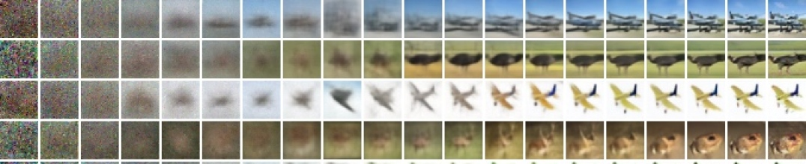

<figcaption>図6: 無条件 CIFAR10 の漸進的生成（左から右へ時間経過に沿った x̂₀）。拡張サンプルと時間に沿ったサンプル品質指標は付録（図 14 と図 10）にある。</figcaption>
</figure>

<figure>

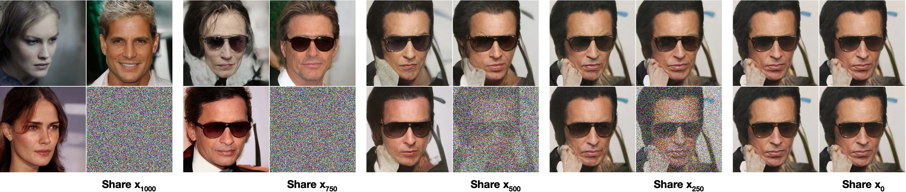

<figcaption>図7: 同じ潜在変数で条件付けると、CelebA-HQ 256×256 のサンプルは高レベルな属性を共有する。右下の象限は xₜ であり、他の象限は pθ(x₀|xₜ) からのサンプルである。</figcaption>
</figure>

#### 自己回帰的デコーディングとの関係

変分下界 (5) は次のように書き換えられることに注意する。

$$
L=D_{\mathrm{KL}}\!\left(q(\mathbf{x}_{T})~{}\|~{}p(\mathbf{x}_{T})\right)+\mathbb{E}_{q}\Bigg{[}\sum_{t\geq 1}D_{\mathrm{KL}}\!\left(q(\mathbf{x}_{t-1}|\mathbf{x}_{t})~{}\|~{}p_{\theta}(\mathbf{x}_{t-1}|\mathbf{x}_{t})\right)\Bigg{]}+H(\mathbf{x}_{0}) \tag{16}
$$

（導出は付録 A を参照。）さて、拡散過程の長さ $T$ をデータの次元数に設定し、$q(\mathbf{x}_{t}|\mathbf{x}_{0})$ が最初の $t$ 座標をマスクした $\mathbf{x}_{0}$ にすべての確率質量を置くように順過程を定義し（すなわち $q(\mathbf{x}_{t}|\mathbf{x}_{t-1})$ が $t$ 番目の座標をマスクアウトする）、$p(\mathbf{x}_{T})$ が空白画像にすべての質量を置くように設定し、議論のために $p_{\theta}(\mathbf{x}_{t-1}|\mathbf{x}_{t})$ を完全に表現力のある条件付き分布とすることを考える。これらの選択により、$D_{\mathrm{KL}}\!\left(q(\mathbf{x}_{T})~{}\|~{}p(\mathbf{x}_{T})\right)=0$ となり、$D_{\mathrm{KL}}\!\left(q(\mathbf{x}_{t-1}|\mathbf{x}_{t})~{}\|~{}p_{\theta}(\mathbf{x}_{t-1}|\mathbf{x}_{t})\right)$ を最小化することは、$p_{\theta}$ を、座標 $t+1,\dotsc,T$ を変更せずにコピーし、$t+1,\dotsc,T$ が与えられたときに $t$ 番目の座標を予測するように学習させる。したがって、この特定の拡散で $p_{\theta}$ を学習することは、自己回帰モデルを学習することである。

それゆえ、ガウス拡散モデル (2) を、データ座標の並べ替えでは表現できない一般化されたビット順序を持つ一種の自己回帰モデルとして解釈できる。先行研究は、そのような並べ替えがサンプル品質に影響を与える帰納バイアスを導入することを示している。それゆえ我々は、ガウス拡散が同様の目的を果たすと推測する。おそらく、ガウスノイズがマスクノイズと比べて画像に加えるのにより自然であるため、より大きな効果を持つだろう。さらに、ガウス拡散の長さはデータ次元と等しい必要はない。例えば我々は $T=1000$ を用いるが、これは実験における $32\times 32\times 3$ や $256\times 256\times 3$ の画像の次元より小さい。ガウス拡散は、高速サンプリングのために短くすることも、モデルの表現力のために長くすることもできる。

### 4.4 補間（Interpolation）

我々は、$q$ を確率的エンコーダとして用いて、潜在空間でソース画像 $\mathbf{x}_{0},\mathbf{x}^{\prime}_{0}\sim q(\mathbf{x}_{0})$ を補間できる。すなわち、$\mathbf{x}_{t},\mathbf{x}^{\prime}_{t}\sim q(\mathbf{x}_{t}|\mathbf{x}_{0})$ とし、線形補間された潜在変数 $\bar{\mathbf{x}}_{t}=(1-\lambda)\mathbf{x}_{0}+\lambda\mathbf{x}^{\prime}_{0}$ を逆過程によって画像空間へデコードする（$\bar{\mathbf{x}}_{0}\sim p(\mathbf{x}_{0}|\bar{\mathbf{x}}_{t})$）。実際には、図 8（左）に描かれているように、ソース画像の破損版を線形補間することで生じるアーティファクトを、逆過程を用いて除去する。我々は異なる $\lambda$ の値に対してノイズを固定し、$\mathbf{x}_{t}$ と $\mathbf{x}^{\prime}_{t}$ が同じままになるようにした。図 8（右）は、元の CelebA-HQ 256×256 画像（$t=500$）の補間と再構成を示す。逆過程は高品質な再構成と、姿勢・肌の色・髪型・表情・背景などの属性を滑らかに変化させる（ただし眼鏡は除く）もっともらしい補間を生成する。$t$ が大きいほど、より粗く、より多様な補間となり、$t=1000$ では新規なサンプルとなる（付録の図 9）。

<figure>

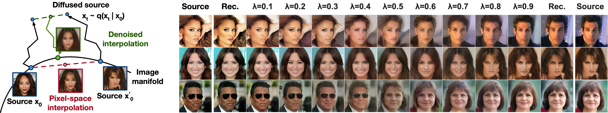

<figcaption>図8: 500 ステップの拡散による CelebA-HQ 256×256 画像の補間。</figcaption>
</figure>

## 5 Related Work（関連研究）

拡散モデルはフローや VAE に似ているように見えるかもしれないが、拡散モデルは $q$ がパラメータを持たず、最上位の潜在変数 $\mathbf{x}_{T}$ がデータ $\mathbf{x}_{0}$ とほぼゼロの相互情報量を持つように設計されている。我々の ${\boldsymbol{\epsilon}}$ 予測の逆過程パラメータ化は、拡散モデルと、サンプリング用のアニーリング・ランジュバン動力学を伴う複数のノイズレベルにわたるノイズ除去スコアマッチングとの間の関係を確立する。しかし拡散モデルは、直接的な対数尤度評価を許容し、学習手続きは変分推論を用いてランジュバン動力学のサンプラーを明示的に学習する（詳細は付録 C を参照）。この関係はまた、ノイズ除去スコアマッチングのある重み付き形式が、ランジュバン的サンプラーを学習するための変分推論と同じであるという逆の含意も持つ。マルコフ連鎖の遷移演算子を学習する他の方法には、infusion training、variational walkback、生成確率的ネットワーク（generative stochastic networks）などがある。

スコアマッチングとエネルギーベースモデリングの間の既知の関係により、我々の研究はエネルギーベースモデルに関する他の最近の研究に対して含意を持つ可能性がある。我々のレート歪み曲線は変分下界の 1 回の評価で時間にわたって計算されるが、これはアニーリング重点サンプリングの 1 回の実行で歪みペナルティにわたってレート歪み曲線を計算できることを思い起こさせる。我々の漸進的デコーディングの議論は、convolutional DRAW や関連モデルに見られ、また自己回帰モデルのためのサブスケール順序やサンプリング戦略のより一般的な設計につながるかもしれない。

## 6 Conclusion（結論）

我々は拡散モデルを用いた高品質な画像サンプルを提示し、拡散モデルと、マルコフ連鎖を学習するための変分推論、ノイズ除去スコアマッチングとアニーリング・ランジュバン動力学（および拡張としてエネルギーベースモデル）、自己回帰モデル、漸進的不可逆圧縮との間の関係を見出した。拡散モデルは画像データに対して優れた帰納バイアスを持つように見えるので、他のデータモダリティにおける有用性や、他の種類の生成モデルや機械学習システムの構成要素としての有用性を調査することを楽しみにしている。

## Broader Impact（広範な影響）

拡散モデルに関する我々の研究は、GAN、フロー、自己回帰モデルなど、他の種類の深層生成モデルのサンプル品質を改善する取り組みと同様の範囲を扱う。我々の論文は、この技術ファミリーにおいて拡散モデルを一般的に有用なツールにするための進展を表すものであり、それゆえ生成モデルが広い世界に与えてきた（そして与えるであろう）影響を増幅する役割を果たすかもしれない。

残念ながら、生成モデルにはよく知られた悪意のある用途が数多くある。サンプル生成技術は、政治的な目的で著名人の偽の画像や動画を作るために用いられうる。ソフトウェアツールが利用可能になるはるか以前から偽画像は手作業で作られていたが、我々のような生成モデルはその過程を容易にする。幸い、CNN が生成した画像には現在、検出を可能にする微妙な欠陥があるが、生成モデルの改善はこれをより困難にするかもしれない。生成モデルはまた、学習に用いたデータセットのバイアスを反映する。多くの大規模データセットは自動システムによってインターネットから収集されるため、これらのバイアスを除去するのは難しい場合があり、特に画像にラベルがないときはそうである。これらのデータセットで学習された生成モデルからのサンプルがインターネット中に拡散すれば、これらのバイアスはさらに強化されるだけだろう。

一方で、拡散モデルはデータ圧縮に有用かもしれない。データが高解像度化し、世界のインターネットトラフィックが増加するにつれて、これは幅広い人々がインターネットにアクセスできるようにするために極めて重要になるかもしれない。我々の研究は、画像分類から強化学習まで、幅広い下流タスクのためのラベルなし生データ上の表現学習に貢献するかもしれず、また拡散モデルは芸術・写真・音楽における創造的な用途にも実用的になるかもしれない。

## Extra information（補足情報）

#### LSUN

LSUN データセットの FID スコアは表 3 に含まれる。∗ が付いたスコアは StyleGAN2 によってベースラインとして報告されたものであり、他のスコアはそれぞれの著者によって報告されたものである。

**表3**: LSUN 256×256 データセットの FID スコア

| モデル | LSUN Bedroom | LSUN Church | LSUN Cat |
| --- | --- | --- | --- |
| ProgressiveGAN | 8.34 | 6.42 | 37.52 |
| StyleGAN | 2.65 | 4.21 ∗ | 8.53 ∗ |
| StyleGAN2 | - | 3.86 | 6.93 |
| Ours（$L_{\mathrm{simple}}$） | 6.36 | 7.89 | 19.75 |
| Ours（$L_{\mathrm{simple}}$, large） | 4.90 | - | - |

#### 漸進的圧縮

第 4.3 節における我々の不可逆圧縮の議論は概念実証（proof of concept）にすぎない。なぜなら、アルゴリズム 3 と 4 は最小ランダム符号化のような手続きに依存しており、それは高次元データに対しては扱いやすくないからである。これらのアルゴリズムは、変分下界 (5) の圧縮としての解釈として機能するものであり、まだ実用的な圧縮システムとしてではない。

**表4**: 無条件 CIFAR10 テストセットのレート歪み値（図 5 に付随）

| 逆過程の時間（$T-t+1$） | レート（ビット/次元） | 歪み（RMSE $[0,255]$） |
| --- | --- | --- |
| 1000 | 1.77581 | 0.95136 |
| 900 | 0.11994 | 12.02277 |
| 800 | 0.05415 | 18.47482 |
| 700 | 0.02866 | 24.43656 |
| 600 | 0.01507 | 30.80948 |
| 500 | 0.00716 | 38.03236 |
| 400 | 0.00282 | 46.12765 |
| 300 | 0.00081 | 54.18826 |
| 200 | 0.00013 | 60.97170 |
| 100 | 0.00000 | 67.60125 |

## Appendix A 拡張された導出（Extended derivations）

以下は、拡散モデルのための分散低減された変分下界である式 (5) の導出である。この内容は先行研究によるものであり、完全性のためにここに含める。

$$
L=\mathbb{E}_{q}\!\left[-\log\frac{p_{\theta}(\mathbf{x}_{0:T})}{q(\mathbf{x}_{1:T}|\mathbf{x}_{0})}\right]
$$

$$
=\mathbb{E}_{q}\!\left[-\log p(\mathbf{x}_{T})-\sum_{t\geq 1}\log\frac{p_{\theta}(\mathbf{x}_{t-1}|\mathbf{x}_{t})}{q(\mathbf{x}_{t}|\mathbf{x}_{t-1})}\right]
$$

$$
=\mathbb{E}_{q}\!\left[-\log p(\mathbf{x}_{T})-\sum_{t>1}\log\frac{p_{\theta}(\mathbf{x}_{t-1}|\mathbf{x}_{t})}{q(\mathbf{x}_{t}|\mathbf{x}_{t-1})}-\log\frac{p_{\theta}(\mathbf{x}_{0}|\mathbf{x}_{1})}{q(\mathbf{x}_{1}|\mathbf{x}_{0})}\right]
$$

$$
=\mathbb{E}_{q}\!\left[-\log p(\mathbf{x}_{T})-\sum_{t>1}\log\frac{p_{\theta}(\mathbf{x}_{t-1}|\mathbf{x}_{t})}{q(\mathbf{x}_{t-1}|\mathbf{x}_{t},\mathbf{x}_{0})}\cdot\frac{q(\mathbf{x}_{t-1}|\mathbf{x}_{0})}{q(\mathbf{x}_{t}|\mathbf{x}_{0})}-\log\frac{p_{\theta}(\mathbf{x}_{0}|\mathbf{x}_{1})}{q(\mathbf{x}_{1}|\mathbf{x}_{0})}\right]
$$

$$
=\mathbb{E}_{q}\!\left[-\log\frac{p(\mathbf{x}_{T})}{q(\mathbf{x}_{T}|\mathbf{x}_{0})}-\sum_{t>1}\log\frac{p_{\theta}(\mathbf{x}_{t-1}|\mathbf{x}_{t})}{q(\mathbf{x}_{t-1}|\mathbf{x}_{t},\mathbf{x}_{0})}-\log p_{\theta}(\mathbf{x}_{0}|\mathbf{x}_{1})\right]
$$

$$
=\mathbb{E}_{q}\!\left[D_{\mathrm{KL}}\!\left(q(\mathbf{x}_{T}|\mathbf{x}_{0})~{}\|~{}p(\mathbf{x}_{T})\right)+\sum_{t>1}D_{\mathrm{KL}}\!\left(q(\mathbf{x}_{t-1}|\mathbf{x}_{t},\mathbf{x}_{0})~{}\|~{}p_{\theta}(\mathbf{x}_{t-1}|\mathbf{x}_{t})\right)-\log p_{\theta}(\mathbf{x}_{0}|\mathbf{x}_{1})\right]
$$

以下は $L$ の別バージョンである。推定は扱いやすくないが、第 4.3 節の議論に有用である。

$$
L=\mathbb{E}_{q}\!\left[-\log p(\mathbf{x}_{T})-\sum_{t\geq 1}\log\frac{p_{\theta}(\mathbf{x}_{t-1}|\mathbf{x}_{t})}{q(\mathbf{x}_{t}|\mathbf{x}_{t-1})}\right]
$$

$$
=\mathbb{E}_{q}\!\left[-\log p(\mathbf{x}_{T})-\sum_{t\geq 1}\log\frac{p_{\theta}(\mathbf{x}_{t-1}|\mathbf{x}_{t})}{q(\mathbf{x}_{t-1}|\mathbf{x}_{t})}\cdot\frac{q(\mathbf{x}_{t-1})}{q(\mathbf{x}_{t})}\right]
$$

$$
=\mathbb{E}_{q}\!\left[-\log\frac{p(\mathbf{x}_{T})}{q(\mathbf{x}_{T})}-\sum_{t\geq 1}\log\frac{p_{\theta}(\mathbf{x}_{t-1}|\mathbf{x}_{t})}{q(\mathbf{x}_{t-1}|\mathbf{x}_{t})}-\log q(\mathbf{x}_{0})\right]
$$

$$
=D_{\mathrm{KL}}\!\left(q(\mathbf{x}_{T})~{}\|~{}p(\mathbf{x}_{T})\right)+\mathbb{E}_{q}\!\left[\sum_{t\geq 1}D_{\mathrm{KL}}\!\left(q(\mathbf{x}_{t-1}|\mathbf{x}_{t})~{}\|~{}p_{\theta}(\mathbf{x}_{t-1}|\mathbf{x}_{t})\right)\right]+H(\mathbf{x}_{0})
$$

## Appendix B 実験の詳細（Experimental details）

我々のニューラルネットワークアーキテクチャは PixelCNN++ のバックボーンに従う。これは Wide ResNet に基づく U-Net である。我々は実装を単純にするため、重み正規化（weight normalization）をグループ正規化に置き換えた。$32\times 32$ のモデルは 4 つの特徴マップ解像度（$32\times 32$ から $4\times 4$ まで）を用い、$256\times 256$ のモデルは 6 つを用いる。すべてのモデルは解像度レベルごとに 2 つの畳み込み残差ブロックを持ち、畳み込みブロックの間に $16\times 16$ 解像度で自己注意ブロックを持つ。拡散時間 $t$ は、各残差ブロックに Transformer の正弦波位置埋め込みを加えることで指定される。我々の CIFAR10 モデルは 3570 万パラメータを持ち、LSUN と CelebA-HQ のモデルは 1 億 1400 万パラメータを持つ。我々はまた、フィルタ数を増やすことで約 2 億 5600 万パラメータを持つ LSUN Bedroom モデルのより大きな変種も学習した。

我々はすべての実験で TPU v3-8（8 個の V100 GPU に類似）を用いた。我々の CIFAR モデルはバッチサイズ 128 で毎秒 21 ステップで学習し（80 万ステップの完了まで 10.6 時間）、256 枚の画像バッチのサンプリングに 17 秒かかる。我々の CelebA-HQ/LSUN（256²）モデルはバッチサイズ 64 で毎秒 2.2 ステップで学習し、128 枚の画像バッチのサンプリングに 300 秒かかる。我々は CelebA-HQ で 50 万ステップ、LSUN Bedroom で 240 万ステップ、LSUN Cat で 180 万ステップ、LSUN Church で 120 万ステップ学習した。より大きな LSUN Bedroom モデルは 115 万ステップ学習した。

ネットワークサイズをメモリ制約に収めるための初期のハイパーパラメータの選択を除けば、我々はハイパーパラメータ探索の大部分を CIFAR10 のサンプル品質を最適化するために行い、その結果得られた設定を他のデータセットへ転用した。

- $\beta_{t}$ スケジュールは、定数・線形・二次のスケジュールの集合（すべて $L_{T}\approx 0$ となるよう制約）から選んだ。$T=1000$ をスイープなしで設定し、$\beta_{1}=10^{-4}$ から $\beta_{T}=0.02$ までの線形スケジュールを選んだ。
- CIFAR10 のドロップアウト率は、$\{0.1,0.2,0.3,0.4\}$ の値をスイープして $0.1$ に設定した。CIFAR10 でドロップアウトを行わないと、正則化されていない PixelCNN++ の過学習アーティファクトを思わせる、より質の低いサンプルが得られた。他のデータセットのドロップアウト率はスイープせずにゼロに設定した。
- CIFAR10 の学習中はランダムな水平反転を用いた。反転ありとなしの両方で学習を試し、反転がサンプル品質をわずかに改善することを見出した。LSUN Bedroom を除く他のすべてのデータセットでもランダムな水平反転を用いた。
- 実験過程の初期に Adam と RMSProp を試し、前者を選んだ。ハイパーパラメータは標準値のままにした。学習率はスイープなしで $2\times 10^{-4}$ に設定し、$256\times 256$ の画像では、より大きな学習率では学習が不安定に見えたため $2\times 10^{-5}$ に下げた。
- バッチサイズは CIFAR10 で 128、より大きな画像で 64 に設定した。これらの値はスイープしなかった。
- モデルパラメータに減衰係数 0.9999 の EMA（指数移動平均）を用いた。この値はスイープしなかった。

最終実験は一度学習し、学習を通してサンプル品質について評価した。サンプル品質スコアと対数尤度は、学習過程における FID の最小値で報告される。CIFAR10 では、Inception スコアと FID スコアを、それぞれ OpenAI と TTUR のリポジトリの元のコードを用いて 5 万サンプルで計算した。LSUN では、StyleGAN2 のリポジトリのコードを用いて 5 万サンプルで FID スコアを計算した。CIFAR10 と CelebA-HQ は TensorFlow Datasets で提供されるとおりに読み込み、LSUN は StyleGAN のコードを用いて準備した。データセットの分割（または分割がないこと）は、生成モデリングの文脈でその使用法を導入した論文からの標準である。すべての詳細はソースコードのリリースに見られる。

## Appendix C 関連研究についての議論（Discussion on related work）

我々のモデルアーキテクチャ、順過程の定義、事前分布は、NCSN とは微妙だが重要な点で異なり、それがサンプル品質を改善する。そして注目すべきことに、我々はサンプラーを学習後に事後的に追加するのではなく、潜在変数モデルとして直接学習する。より詳しくは以下のとおりである。

1. 我々は自己注意を伴う U-Net を用いるが、NCSN は拡張畳み込みを伴う RefineNet を用いる。我々は、正規化層のみ（NCSNv1）や出力のみ（v2）ではなく、Transformer の正弦波位置埋め込みを加えることですべての層を $t$ で条件付ける。
2. 拡散モデルは順過程の各ステップでデータを（$\sqrt{1-\beta_{t}}$ 倍だけ）縮小するので、ノイズを加えるときに分散が増大せず、ニューラルネットワークの逆過程に一貫してスケールされた入力を提供する。NCSN はこのスケーリング係数を省略する。
3. NCSN とは異なり、我々の順過程は信号を破壊し（$D_{\mathrm{KL}}\!\left(q(\mathbf{x}_{T}|\mathbf{x}_{0})~{}\|~{}\mathcal{N}(\mathbf{0},\mathbf{I})\right)\approx 0$）、事前分布と $\mathbf{x}_{T}$ の集約事後分布との緊密な一致を保証する。また NCSN とは異なり、我々の $\beta_{t}$ は非常に小さく、これは順過程が条件付きガウス分布を持つマルコフ連鎖によって可逆であることを保証する。これら 2 つの要因はともに、サンプリング時の分布シフトを防ぐ。
4. 我々のランジュバン的サンプラーは、順過程の $\beta_{t}$ から厳密に導かれる係数（学習率、ノイズスケールなど）を持つ。したがって我々の学習手続きは、サンプラーが $T$ ステップ後にデータ分布と一致するように直接学習する。すなわち、変分推論を用いてサンプラーを潜在変数モデルとして学習する。対照的に、NCSN のサンプラー係数は事後的に手動で設定され、その学習手続きはサンプラーの品質指標を直接最適化することを保証しない。

## Appendix D サンプル（Samples）

#### 追加のサンプル

図 11、13、16、17、18、19 は、CelebA-HQ、CIFAR10、LSUN のデータセットで学習された拡散モデルからの、キュレーションされていない（uncurated）サンプルを示す。

#### 潜在構造と逆過程の確率性

サンプリング中、事前分布 $\mathbf{x}_{T}\sim\mathcal{N}(\mathbf{0},\mathbf{I})$ とランジュバン動力学はともに確率的である。この第 2 のノイズ源の意義を理解するために、我々は CelebA 256×256 データセットについて、同じ中間潜在変数で条件付けて複数の画像をサンプリングした。図 7 は、$t\in\{1000,750,500,250\}$ について潜在変数 $\mathbf{x}_{t}$ を共有する逆過程 $\mathbf{x}_{0}\sim p_{\theta}(\mathbf{x}_{0}|\mathbf{x}_{t})$ からの複数のサンプルを示す。これを実現するために、事前分布からの初期サンプルから単一の逆連鎖を実行する。中間の時刻で連鎖を分割して複数の画像をサンプリングする。$\mathbf{x}_{T=1000}$ における事前分布のサンプリング後に連鎖を分割すると、サンプルは大きく異なる。しかし、より多くのステップの後に連鎖を分割すると、サンプルは性別・髪の色・眼鏡・彩度・姿勢・表情といった高レベルの属性を共有する。これは、$\mathbf{x}_{750}$ のような中間潜在変数が、その知覚しがたさにもかかわらずこれらの属性を符号化していることを示している。

#### 粗から細への補間（Coarse-to-fine interpolation）

図 9 は、潜在空間補間の前の拡散ステップ数を変化させたときの、一対のソース CelebA 256×256 画像間の補間を示す。拡散ステップ数を増やすと、ソース画像のより多くの構造が破壊され、それをモデルが逆過程で補完する。これにより、細かい粒度と粗い粒度の両方で補間できる。$0$ 拡散ステップという極限の場合、補間はピクセル空間でソース画像を混合する。一方、$1000$ 拡散ステップの後では、ソース情報は失われ、補間は新規なサンプルとなる。

<figure>

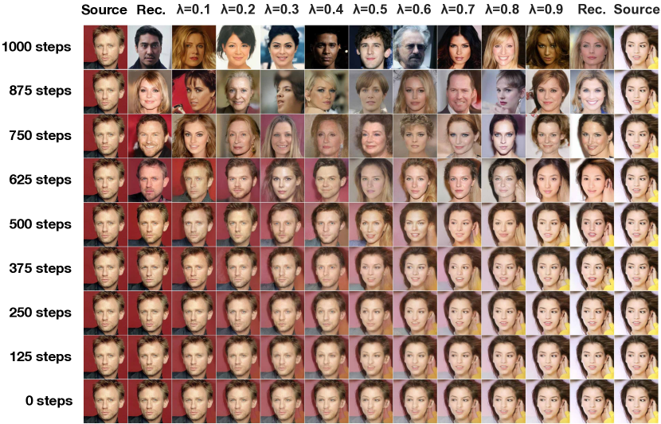

<figcaption>図9: 潜在変数の混合の前の拡散ステップ数を変化させた、粗から細への補間。</figcaption>
</figure>

<figure>

<figcaption>図10: 無条件 CIFAR10 の時間にわたる漸進的サンプリング品質。</figcaption>
</figure>

<figure>

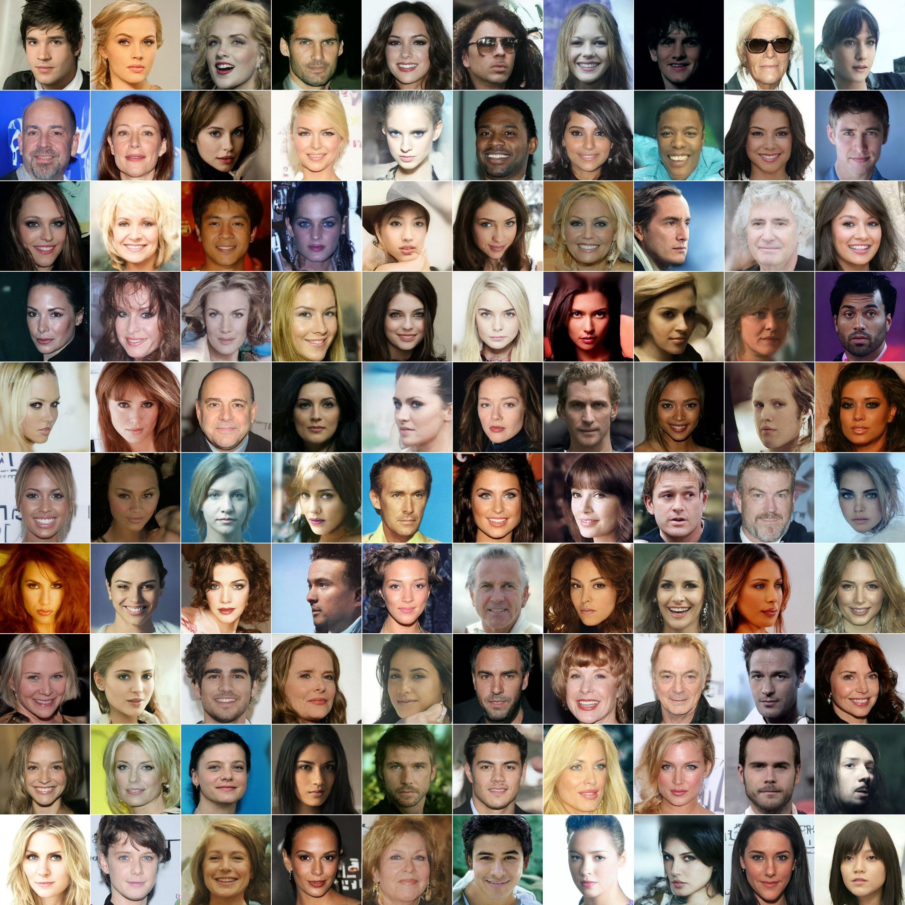

<figcaption>図11: CelebA-HQ 256×256 の生成サンプル。</figcaption>
</figure>

<figure>

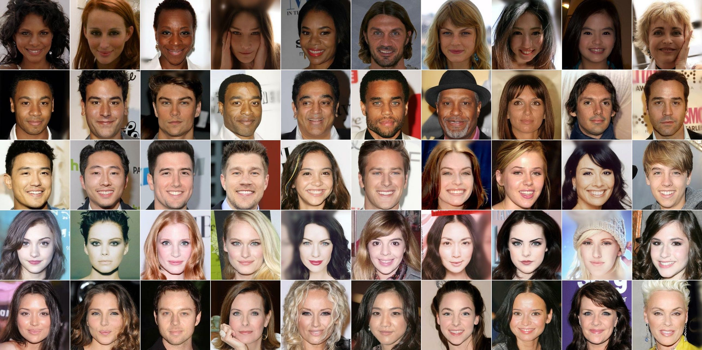

<figcaption>図12 (a): ピクセル空間での最近傍。</figcaption>
</figure>

<figure>

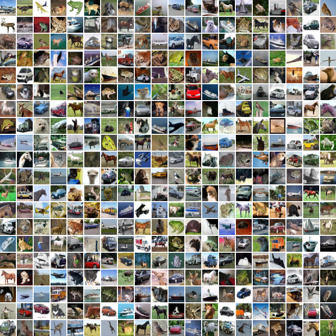

<figcaption>図13: 無条件 CIFAR10 の生成サンプル。</figcaption>
</figure>

<figure>

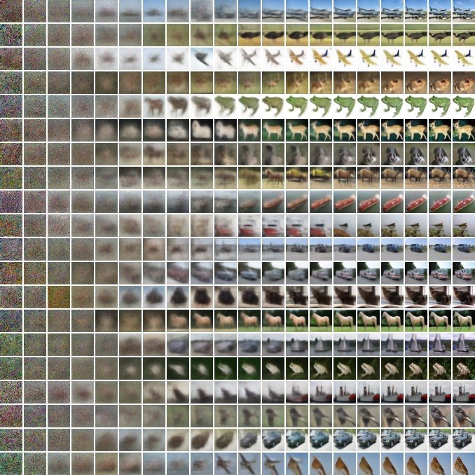

<figcaption>図14: 無条件 CIFAR10 の漸進的生成。</figcaption>
</figure>

<figure>

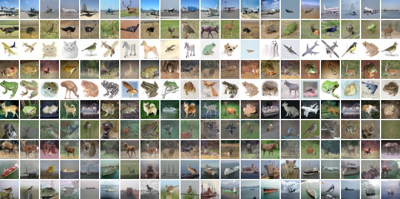

<figcaption>図15 (a): ピクセル空間での最近傍。</figcaption>
</figure>

<figure>

<figcaption>図16: LSUN Church の生成サンプル。FID = 7.89。</figcaption>
</figure>

<figure>

<figcaption>図17: LSUN Bedroom の生成サンプル（大モデル）。FID = 4.90。</figcaption>
</figure>

<figure>

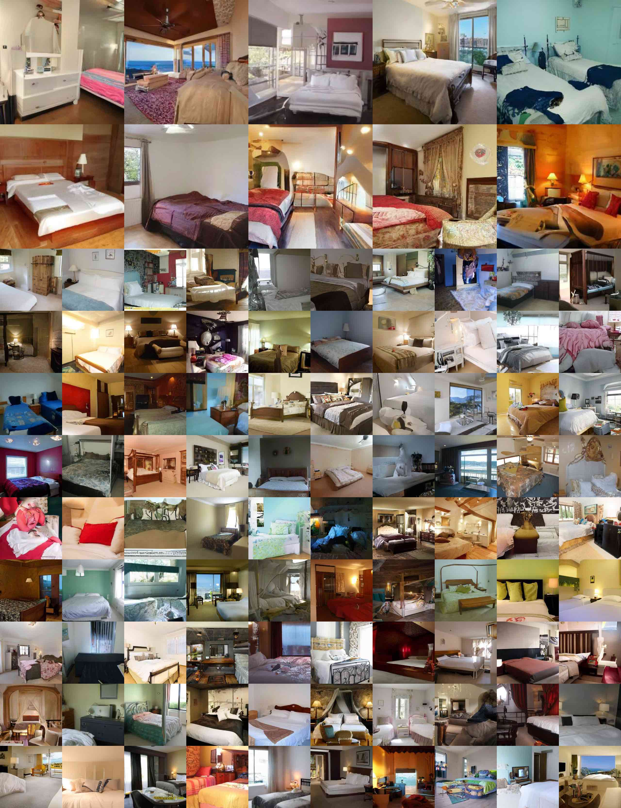

<figcaption>図18: LSUN Bedroom の生成サンプル（小モデル）。FID = 6.36。</figcaption>
</figure>

<figure>

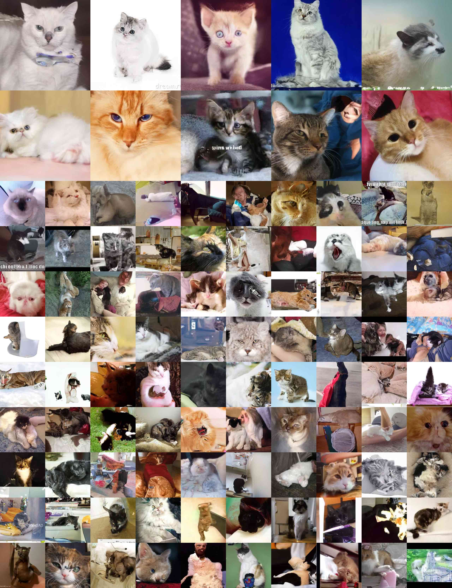

<figcaption>図19: LSUN Cat の生成サンプル。FID = 19.75。</figcaption>
</figure>
