# ノイズ除去拡散暗黙モデル（Denoising Diffusion Implicit Models）

> 原題: Denoising Diffusion Implicit Models
> 著者: Jiaming Song, Chenlin Meng, Stefano Ermon（Stanford University）
> 出典: ICLR 2021 / arXiv:2010.02502 ・ https://ar5iv.labs.arxiv.org/html/2010.02502

## Abstract（要旨）

ノイズ除去拡散確率モデル（denoising diffusion probabilistic models, DDPMs）は、敵対的学習なしに高品質な画像生成を達成してきたが、サンプルを生成するには多数のステップにわたってマルコフ連鎖をシミュレートする必要がある。サンプリングを加速するために、我々はノイズ除去拡散暗黙モデル（denoising diffusion implicit models, DDIMs）を提示する。これは DDPM と同じ学習手続きを持つ、より効率的な反復的暗黙確率モデルのクラスである。DDPM では、生成過程は特定のマルコフ的拡散過程の逆過程として定義される。我々は DDPM を、同じ学習目的関数につながる非マルコフ的拡散過程のクラスを通じて一般化する。これらの非マルコフ過程は、決定論的な生成過程に対応しうるため、高品質なサンプルをはるかに速く生成する暗黙モデルを生じさせる。我々は経験的に、DDIM が DDPM と比べてウォールクロック時間で $10\times$ から $50\times$ 速く高品質なサンプルを生成でき、計算量とサンプル品質をトレードオフでき、潜在空間で直接意味的に有意な画像補間を行え、観測を非常に低い誤差で再構成できることを実証する。

## 1 Introduction（はじめに）

深層生成モデルは多くのドメインで高品質なサンプルを生成する能力を示してきた。画像生成に関して、敵対的生成ネットワーク（GANs）は現在、変分オートエンコーダ・自己回帰モデル・正規化フローといった尤度ベースの手法より高いサンプル品質を示している。しかし GAN は学習を安定化させるために最適化とアーキテクチャの非常に特定の選択を要し、データ分布のモードを取りこぼすことがある。

反復的生成モデル、例えばノイズ除去拡散確率モデル（DDPM）やノイズ条件付きスコアネットワーク（NCSN）に関する最近の研究は、敵対的学習を行わずに GAN に匹敵するサンプルを生成する能力を示してきた。これを達成するため、多数のノイズ除去オートエンコーディングモデルが、さまざまなレベルのガウスノイズで破損したサンプルをノイズ除去するように学習される。サンプルは、白色ノイズから始めてそれを徐々に画像へとノイズ除去するマルコフ連鎖によって生成される。この生成的マルコフ連鎖過程は、ランジュバン動力学に基づくか、画像を徐々にノイズに変える順方向拡散過程を逆転することで得られる。

これらのモデルの致命的な欠点は、高品質なサンプルを生成するのに多数の反復を要することである。DDPM では、生成過程（ノイズからデータへ）が順方向拡散過程（データからノイズへ）の逆を近似し、これが数千ステップを持ちうるためである。単一のサンプルを生成するにも全ステップを反復する必要があり、ネットワークを 1 回通すだけでよい GAN と比べてはるかに遅い。例えば、Nvidia 2080 Ti GPU で DDPM から $32\times 32$ の 5 万枚をサンプリングするには約 20 時間かかるが、GAN なら 1 分未満である。これはより大きな画像でより深刻になり、$256\times 256$ の 5 万枚のサンプリングには同じ GPU で 1000 時間近くかかりうる。

DDPM と GAN の間のこの効率の差を埋めるために、我々はノイズ除去拡散暗黙モデル（DDIMs）を提示する。DDIM は暗黙確率モデルであり、同じ目的関数で学習されるという意味で DDPM と密接に関連する。第 3 節で、DDPM が用いるマルコフ的な順方向拡散過程を非マルコフ的なものへ一般化し、それに対しても適切な逆方向生成マルコフ連鎖を設計できることを示す。結果として得られる変分学習目的関数が、まさに DDPM の学習に用いられる目的関数である共通の代理目的関数を持つことを示す。したがって、異なる非マルコフ的拡散過程（第 4.1 節）と対応する逆方向生成マルコフ連鎖を選ぶだけで、同じニューラルネットワークを使って生成モデルの大きな族から自由に選べる。特に、少数のステップでシミュレートできる「短い」生成マルコフ連鎖（第 4.2 節）につながる非マルコフ的拡散過程を使える。これはサンプル品質のわずかなコストだけで、サンプル効率を大幅に向上させうる。

第 5 節で、DDPM に対する DDIM のいくつかの経験的利点を実証する。第一に、提案手法で $10\times$ から $100\times$ サンプリングを加速したとき、DDIM は DDPM より優れたサンプル生成品質を持つ。第二に、DDIM のサンプルは DDPM では成り立たない次の「一貫性（consistency）」の性質を持つ：同じ初期潜在変数から始めて、さまざまな長さのマルコフ連鎖で複数のサンプルを生成すると、それらは似た高レベル特徴を持つ。第三に、DDIM の「一貫性」のおかげで、DDIM では初期潜在変数を操作することで意味的に有意な画像補間を行える。これは確率的生成過程のため画像空間の近傍で補間する DDPM とは異なる。

## 2 Background（背景）

<figure>

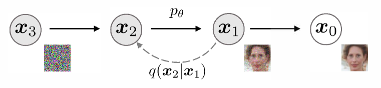

<figcaption>図1: 拡散（左）と非マルコフ的（右）推論モデルのグラフィカルモデル。</figcaption>
</figure>

データ分布 $q({\bm{x}}_{0})$ からのサンプルが与えられたとき、我々は $q({\bm{x}}_{0})$ を近似しサンプリングが容易なモデル分布 $p_{\theta}({\bm{x}}_{0})$ を学習することに関心がある。ノイズ除去拡散確率モデル（DDPMs）は次の形式の潜在変数モデルである。

$$
p_{\theta}({\bm{x}}_{0})=\int p_{\theta}({\bm{x}}_{0:T})\mathrm{d}{\bm{x}}_{1:T},\quad\text{where}\quad p_{\theta}({\bm{x}}_{0:T}):=p_{\theta}({\bm{x}}_{T})\prod_{t=1}^{T}p^{(t)}_{\theta}({\bm{x}}_{t-1}|{\bm{x}}_{t}) \tag{1}
$$

ここで ${\bm{x}}_{1},\ldots,{\bm{x}}_{T}$ は ${\bm{x}}_{0}$ と同じサンプル空間（${\mathcal{X}}$ と表記）の潜在変数である。パラメータ $\theta$ は、変分下界を最大化することでデータ分布 $q({\bm{x}}_{0})$ に適合するように学習される。

$$
\max_{\theta}{\mathbb{E}}_{q({\bm{x}}_{0})}[\log p_{\theta}({\bm{x}}_{0})]\leq\max_{\theta}{\mathbb{E}}_{q({\bm{x}}_{0},{\bm{x}}_{1},\ldots,{\bm{x}}_{T})}\left[\log p_{\theta}({\bm{x}}_{0:T})-\log q({\bm{x}}_{1:T}|{\bm{x}}_{0})\right] \tag{2}
$$

ここで $q({\bm{x}}_{1:T}|{\bm{x}}_{0})$ は潜在変数上の何らかの推論分布である。典型的な潜在変数モデル（変分オートエンコーダなど）とは異なり、DDPM は固定された（学習可能ではない）推論手続き $q({\bm{x}}_{1:T}|{\bm{x}}_{0})$ で学習され、潜在変数は比較的高次元である。例えば、[^15] は減少列 $\alpha_{1:T}\in(0,1]^{T}$ でパラメータ化されたガウス遷移を持つ次のマルコフ連鎖を考えた。

$$
q({\bm{x}}_{1:T}|{\bm{x}}_{0}):=\prod_{t=1}^{T}q({\bm{x}}_{t}|{\bm{x}}_{t-1}),\text{where}\ q({\bm{x}}_{t}|{\bm{x}}_{t-1}):={\mathcal{N}}\left(\sqrt{\frac{\alpha_{t}}{\alpha_{t-1}}}{\bm{x}}_{t-1},\left(1-\frac{\alpha_{t}}{\alpha_{t-1}}\right){\bm{I}}\right) \tag{3}
$$

ここで共分散行列は対角に正の項を持つことが保証される。これはサンプリング手続き（${\bm{x}}_{0}$ から ${\bm{x}}_{T}$ へ）の自己回帰的性質のため順過程（forward process）と呼ばれる。${\bm{x}}_{T}$ から ${\bm{x}}_{0}$ へサンプリングするマルコフ連鎖である潜在変数モデル $p_{\theta}({\bm{x}}_{0:T})$ を、扱いにくい逆過程 $q({\bm{x}}_{t-1}|{\bm{x}}_{t})$ を近似するため、生成過程（generative process）と呼ぶ。直感的には、順過程は観測 ${\bm{x}}_{0}$ に徐々にノイズを加え、生成過程はノイズの乗った観測を徐々にノイズ除去する（図 1 左）。

順過程の特別な性質は次である。

$$
q({\bm{x}}_{t}|{\bm{x}}_{0}):=\int q({\bm{x}}_{1:t}|{\bm{x}}_{0})\mathrm{d}{\bm{x}}_{1:(t-1)}={\mathcal{N}}({\bm{x}}_{t};\sqrt{\alpha_{t}}{\bm{x}}_{0},(1-\alpha_{t}){\bm{I}}); \tag{4}
$$

したがって ${\bm{x}}_{t}$ を ${\bm{x}}_{0}$ とノイズ変数 $\epsilon$ の線形結合として表せる。

$$
{\bm{x}}_{t}=\sqrt{\alpha_{t}}{\bm{x}}_{0}+\sqrt{1-\alpha_{t}}\epsilon,\quad\text{where}\quad\epsilon\sim{\mathcal{N}}({\bm{0}},{\bm{I}}).
$$

$\alpha_{T}$ を $0$ に十分近く設定すると、$q({\bm{x}}_{T}|{\bm{x}}_{0})$ はすべての ${\bm{x}}_{0}$ に対して標準ガウスに収束するので、$p_{\theta}({\bm{x}}_{T}):={\mathcal{N}}({\bm{0}},{\bm{I}})$ と置くのが自然である。すべての条件付き分布が学習可能な平均関数と固定分散を持つガウスとしてモデリングされると、式 (2) の目的関数は次に簡略化できる。

$$
L_{\gamma}(\epsilon_{\theta}):=\sum_{t=1}^{T}\gamma_{t}{\mathbb{E}}_{{\bm{x}}_{0}\sim q({\bm{x}}_{0}),\epsilon_{t}\sim{\mathcal{N}}({\bm{0}},{\bm{I}})}\left[{\lVert{\epsilon_{\theta}^{(t)}(\sqrt{\alpha_{t}}{\bm{x}}_{0}+\sqrt{1-\alpha_{t}}\epsilon_{t})-\epsilon_{t}}\rVert}_{2}^{2}\right] \tag{5}
$$

ここで $\epsilon_{\theta}:=\{\epsilon_{\theta}^{(t)}\}_{t=1}^{T}$ は $T$ 個の関数の集合で、各 $\epsilon_{\theta}^{(t)}:{\mathcal{X}}\to{\mathcal{X}}$（$t$ で添字付け）は学習可能パラメータ $\theta^{(t)}$ を持つ関数であり、$\gamma:=[\gamma_{1},\ldots,\gamma_{T}]$ は $\alpha_{1:T}$ に依存する目的関数中の正係数のベクトルである。[^15] では、学習済みモデルの生成性能を最大化するために $\gamma={\bm{1}}$ の目的関数が代わりに最適化される。これはスコアマッチングに基づくノイズ条件付きスコアネットワークで用いられる目的関数と同じでもある。学習済みモデルからは、まず事前分布 $p_{\theta}({\bm{x}}_{T})$ から ${\bm{x}}_{T}$ をサンプリングし、次に生成過程から ${\bm{x}}_{t-1}$ を反復的にサンプリングすることで ${\bm{x}}_{0}$ をサンプリングする。

順過程の長さ $T$ は DDPM の重要なハイパーパラメータである。変分的観点からは、大きい $T$ は逆過程をガウスに近づけるので、ガウス条件付き分布でモデリングされた生成過程が良い近似になる。これは $T=1000$ のような大きな $T$ 値の選択を動機づける。しかし、サンプル ${\bm{x}}_{0}$ を得るには全 $T$ 反復を並列ではなく逐次に実行しなければならないため、DDPM からのサンプリングは他の深層生成モデルよりはるかに遅く、計算が限られ低遅延が重要なタスクには非実用的である。

## 3 Variational Inference for non-Markovian Forward Processes（非マルコフ的順過程のための変分推論）

生成モデルは推論過程の逆を近似するので、生成モデルが要する反復回数を減らすには推論過程を再考する必要がある。我々の鍵となる観察は、$L_{\gamma}$ の形の DDPM 目的関数は周辺分布 $q({\bm{x}}_{t}|{\bm{x}}_{0})$ にのみ依存し、同時分布 $q({\bm{x}}_{1:T}|{\bm{x}}_{0})$ に直接は依存しないことである。同じ周辺分布を持つ推論分布（同時分布）は多数あるので、我々は非マルコフ的な代替推論過程を探求し、それが新しい生成過程につながる（図 1 右）。これらの非マルコフ的推論過程は、以下で示すように DDPM と同じ代理目的関数につながる。付録 A では、非マルコフ的観点がガウスの場合を超えても適用できることを示す。

### 3.1 Non-Markovian forward processes（非マルコフ的順過程）

実ベクトル $\sigma\in\mathbb{R}_{\geq 0}^{T}$ で添字付けされた推論分布の族 ${\mathcal{Q}}$ を考えよう。

$$
q_{\sigma}({\bm{x}}_{1:T}|{\bm{x}}_{0}):=q_{\sigma}({\bm{x}}_{T}|{\bm{x}}_{0})\prod_{t=2}^{T}q_{\sigma}({\bm{x}}_{t-1}|{\bm{x}}_{t},{\bm{x}}_{0}) \tag{6}
$$

ここで $q_{\sigma}({\bm{x}}_{T}|{\bm{x}}_{0})={\mathcal{N}}(\sqrt{\alpha_{T}}{\bm{x}}_{0},(1-\alpha_{T}){\bm{I}})$ であり、すべての $t>1$ に対して

$$
q_{\sigma}({\bm{x}}_{t-1}|{\bm{x}}_{t},{\bm{x}}_{0})={\mathcal{N}}\left(\sqrt{\alpha_{t-1}}{\bm{x}}_{0}+\sqrt{1-\alpha_{t-1}-\sigma^{2}_{t}}\cdot{\frac{{\bm{x}}_{t}-\sqrt{\alpha_{t}}{\bm{x}}_{0}}{\sqrt{1-\alpha_{t}}}},\sigma_{t}^{2}{\bm{I}}\right). \tag{7}
$$

平均関数は、すべての $t$ で $q_{\sigma}({\bm{x}}_{t}|{\bm{x}}_{0})={\mathcal{N}}(\sqrt{\alpha_{t}}{\bm{x}}_{0},(1-\alpha_{t}){\bm{I}})$ となるよう選ばれており（付録 B の補題 1 を参照）、望みどおり「周辺分布」に一致する同時推論分布を定義する。順過程はベイズの定理から導ける。

$$
q_{\sigma}({\bm{x}}_{t}|{\bm{x}}_{t-1},{\bm{x}}_{0})=\frac{q_{\sigma}({\bm{x}}_{t-1}|{\bm{x}}_{t},{\bm{x}}_{0})q_{\sigma}({\bm{x}}_{t}|{\bm{x}}_{0})}{q_{\sigma}({\bm{x}}_{t-1}|{\bm{x}}_{0})}, \tag{8}
$$

これもガウスである（ただし本論文の残りではこの事実を使わない）。式 (3) の拡散過程とは異なり、ここでの順過程はもはやマルコフ的でない。なぜなら各 ${\bm{x}}_{t}$ が ${\bm{x}}_{t-1}$ と ${\bm{x}}_{0}$ の両方に依存しうるからである。$\sigma$ の大きさが順過程がどれだけ確率的かを制御する。$\sigma\to{\bm{0}}$ のとき、ある $t$ について ${\bm{x}}_{0}$ と ${\bm{x}}_{t}$ を観測すれば ${\bm{x}}_{t-1}$ が既知かつ固定になる極端な場合に至る。

### 3.2 Generative process and unified variational inference objective（生成過程と統一された変分推論目的関数）

次に、各 $p_{\theta}^{(t)}({\bm{x}}_{t-1}|{\bm{x}}_{t})$ が $q_{\sigma}({\bm{x}}_{t-1}|{\bm{x}}_{t},{\bm{x}}_{0})$ の知識を活用する、学習可能な生成過程 $p_{\theta}({\bm{x}}_{0:T})$ を定義する。直感的には、ノイズの乗った観測 ${\bm{x}}_{t}$ が与えられたとき、まず対応する ${\bm{x}}_{0}$ の予測を行い、それを使って、我々が定義した逆方向条件付き分布 $q_{\sigma}({\bm{x}}_{t-1}|{\bm{x}}_{t},{\bm{x}}_{0})$ を通じてサンプル ${\bm{x}}_{t-1}$ を得る。

ある ${\bm{x}}_{0}\sim q({\bm{x}}_{0})$ と $\epsilon_{t}\sim{\mathcal{N}}({\bm{0}},{\bm{I}})$ に対し、${\bm{x}}_{t}$ は式 (4) を使って得られる。モデル $\epsilon_{\theta}^{(t)}({\bm{x}}_{t})$ は ${\bm{x}}_{0}$ の知識なしに ${\bm{x}}_{t}$ から $\epsilon_{t}$ を予測しようとする。式 (4) を書き換えることで、${\bm{x}}_{t}$ が与えられたときの ${\bm{x}}_{0}$ の予測である、ノイズ除去された観測を予測できる。

$$
f_{\theta}^{(t)}({\bm{x}}_{t}):=({\bm{x}}_{t}-\sqrt{1-\alpha_{t}}\cdot\epsilon_{\theta}^{(t)}({\bm{x}}_{t}))/\sqrt{\alpha_{t}}. \tag{9}
$$

そして、固定された事前分布 $p_{\theta}({\bm{x}}_{T})={\mathcal{N}}({\bm{0}},{\bm{I}})$ を持つ生成過程を次のように定義できる。

$$
p_{\theta}^{(t)}({\bm{x}}_{t-1}|{\bm{x}}_{t})=\begin{cases}{\mathcal{N}}(f_{\theta}^{(1)}({\bm{x}}_{1}),\sigma_{1}^{2}{\bm{I}})&\text{if}\ t=1\\
q_{\sigma}({\bm{x}}_{t-1}|{\bm{x}}_{t},f_{\theta}^{(t)}({\bm{x}}_{t}))&\text{otherwise,}\end{cases} \tag{10}
$$

ここで $q_{\sigma}({\bm{x}}_{t-1}|{\bm{x}}_{t},f_{\theta}^{(t)}({\bm{x}}_{t}))$ は式 (7) で ${\bm{x}}_{0}$ を $f_{\theta}^{(t)}({\bm{x}}_{t})$ で置き換えたものとして定義される。$t=1$ の場合は生成過程が至るところで台を持つことを保証するため、いくらかのガウスノイズ（共分散 $\sigma_{1}^{2}{\bm{I}}$）を加える。

我々は次の変分推論目的関数（$\epsilon_{\theta}$ 上の汎関数）を通じて $\theta$ を最適化する。

$$
J_{\sigma}(\epsilon_{\theta}):={\mathbb{E}}_{{\bm{x}}_{0:T}\sim q_{\sigma}({\bm{x}}_{0:T})}\left[\log q_{\sigma}({\bm{x}}_{T}|{\bm{x}}_{0})+\sum_{t=2}^{T}\log q_{\sigma}({\bm{x}}_{t-1}|{\bm{x}}_{t},{\bm{x}}_{0})-\sum_{t=1}^{T}\log p_{\theta}^{(t)}({\bm{x}}_{t-1}|{\bm{x}}_{t})-\log p_{\theta}({\bm{x}}_{T})\right] \tag{11}
$$

ここで $q_{\sigma}({\bm{x}}_{1:T}|{\bm{x}}_{0})$ を式 (6) に従って、$p_{\theta}({\bm{x}}_{0:T})$ を式 (1) に従って因数分解する。

$J_{\sigma}$ の定義からは、$\sigma$ の各選択ごとに異なるモデルを学習しなければならないように見える。なぜならそれは異なる変分目的関数（と異なる生成過程）に対応するからである。しかし、以下で示すように $J_{\sigma}$ はある重み $\gamma$ について $L_{\gamma}$ と等価である。

###### 定理 1.

すべての $\sigma>{\bm{0}}$ に対して、$J_{\sigma}=L_{\gamma}+C$ となる $\gamma\in\mathbb{R}_{>0}^{T}$ と $C\in\mathbb{R}$ が存在する。

変分目的関数 $L_{\gamma}$ は、モデル $\epsilon_{\theta}^{(t)}$ のパラメータ $\theta$ が異なる $t$ で共有されていないなら、$\epsilon_{\theta}$ の最適解が重み $\gamma$ に依存しない（和の各項を個別に最大化することで大域最適が達成される）という意味で特別である。$L_{\gamma}$ のこの性質は 2 つの含意を持つ。一方で、これは DDPM の変分下界の代理目的関数として $L_{\bm{1}}$ を用いることを正当化する。他方で、$J_{\sigma}$ は定理 1 よりある $L_{\gamma}$ と等価なので、$J_{\sigma}$ の最適解も $L_{\bm{1}}$ のそれと同じである。したがって、モデル $\epsilon_{\theta}$ でパラメータが $t$ にわたって共有されていないなら、[^15] が用いた $L_{\bm{1}}$ 目的関数は変分目的関数 $J_{\sigma}$ の代理目的関数としても使える。

## 4 Sampling from Generalized Generative Processes（一般化された生成過程からのサンプリング）

$L_{\bm{1}}$ を目的関数とすると、我々は [^32] と [^15] で考えられたマルコフ的推論過程に対する生成過程だけでなく、$\sigma$ でパラメータ化した我々が記述した多くの非マルコフ的順過程に対する生成過程も学習している。したがって、本質的に事前学習済みの DDPM モデルを新しい目的関数の解として使え、$\sigma$ を変えることで我々のニーズに応じてサンプルをより良く生成する生成過程を見つけることに集中できる。

### 4.1 Denoising Diffusion Implicit Models（ノイズ除去拡散暗黙モデル）

式 (10) の $p_{\theta}({\bm{x}}_{1:T})$ から、サンプル ${\bm{x}}_{t}$ からサンプル ${\bm{x}}_{t-1}$ を次を介して生成できる。

$$
{\bm{x}}_{t-1}=\sqrt{\alpha_{t-1}}\underbrace{\left(\frac{{\bm{x}}_{t}-\sqrt{1-\alpha_{t}}\epsilon_{\theta}^{(t)}({\bm{x}}_{t})}{\sqrt{\alpha_{t}}}\right)}_{\text{「予測された }{\bm{x}}_{0}\text{」}}+\underbrace{\sqrt{1-\alpha_{t-1}-\sigma_{t}^{2}}\cdot\epsilon_{\theta}^{(t)}({\bm{x}}_{t})}_{\text{「}{\bm{x}}_{t}\text{ を指す方向」}}+\underbrace{\sigma_{t}\epsilon_{t}}_{\text{ランダムノイズ}} \tag{12}
$$

ここで $\epsilon_{t}\sim{\mathcal{N}}({\bm{0}},{\bm{I}})$ は ${\bm{x}}_{t}$ と独立な標準ガウスノイズであり、$\alpha_{0}:=1$ と定義する。$\sigma$ 値の異なる選択は異なる生成過程をもたらすが、すべて同じモデル $\epsilon_{\theta}$ を使うので、モデルの再学習は不要である。すべての $t$ について $\sigma_{t}=\sqrt{(1-\alpha_{t-1})/(1-\alpha_{t})}\sqrt{1-\alpha_{t}/\alpha_{t-1}}$ のとき、順過程はマルコフ的になり、生成過程は DDPM になる。

すべての $t$ について $\sigma_{t}=0$ のときの別の特別な場合に注意する。$t=1$ を除き、順過程は ${\bm{x}}_{t-1}$ と ${\bm{x}}_{0}$ が与えられたとき決定論的になる。生成過程では、ランダムノイズ $\epsilon_{t}$ の前の係数がゼロになる。結果として得られるモデルは暗黙確率モデルとなり、サンプルは固定された手続き（${\bm{x}}_{T}$ から ${\bm{x}}_{0}$ へ）で潜在変数から生成される。我々はこれをノイズ除去拡散暗黙モデル（DDIM, /d:Im/ と発音）と名付ける。なぜなら、それは（順過程がもはや拡散でないにもかかわらず）DDPM の目的関数で学習された暗黙確率モデルだからである。

### 4.2 Accelerated generation processes（加速された生成過程）

前節までは、生成過程は逆過程の近似と考えられていた。順過程が $T$ ステップを持つので、生成過程も $T$ ステップをサンプリングせざるを得なかった。しかし、ノイズ除去目的関数 $L_{\bm{1}}$ は $q_{\sigma}({\bm{x}}_{t}|{\bm{x}}_{0})$ が固定されている限り特定の順方向手続きに依存しないので、$T$ より小さい長さの順過程も考えられ、これは異なるモデルを学習することなく対応する生成過程を加速する。

<figure>

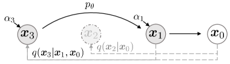

<figcaption>図2: 加速生成のグラフィカルモデル。τ = [1, 3]。</figcaption>
</figure>

順過程を、すべての潜在変数 ${\bm{x}}_{1:T}$ ではなく、部分集合 $\{{\bm{x}}_{\tau_{1}},\ldots,{\bm{x}}_{\tau_{S}}\}$ 上で定義されるものと考えよう。ここで $\tau$ は $[1,\ldots,T]$ の長さ $S$ の増加部分列である。特に、${\bm{x}}_{\tau_{1}},\ldots,{\bm{x}}_{\tau_{S}}$ 上の逐次的順過程を、$q({\bm{x}}_{\tau_{i}}|{\bm{x}}_{0})={\mathcal{N}}(\sqrt{\alpha_{\tau_{i}}}{\bm{x}}_{0},(1-\alpha_{\tau_{i}}){\bm{I}})$ が「周辺分布」に一致するように定義する（図示は図 2 を参照）。生成過程は今や $\text{reversed}(\tau)$ に従って潜在変数をサンプリングし、これを（サンプリング）軌道（trajectory）と呼ぶ。サンプリング軌道の長さが $T$ よりはるかに小さいとき、サンプリング過程の反復的性質のため計算効率を大幅に向上させうる。

第 3 節と同様の議論で、$L_{\bm{1}}$ 目的関数で学習したモデルを使うことを正当化できるので、学習に変更は不要である。式 (12) の更新にわずかな変更を加えるだけで、新しいより速い生成過程が得られることを示す。これは DDPM・DDIM、ならびに式 (10) で考えたすべての生成過程に適用される。これらの詳細は付録 C.1 に含める。

原理的には、これは任意の数の順方向ステップでモデルを学習し、生成過程ではそのうちの一部だけからサンプリングできることを意味する。したがって、学習済みモデルは [^15] で考えられたよりはるかに多くのステップ、あるいは連続時間変数 $t$ さえ考慮できる。この側面の経験的調査は将来の課題とする。

### 4.3 Relevance to Neural ODEs（ニューラル ODE との関連）

さらに、DDIM の反復を式 (12) に従って書き換えると、常微分方程式（ODE）を解くためのオイラー積分（Euler integration）との類似がより明らかになる。

$$
\frac{{\bm{x}}_{t-\Delta t}}{\sqrt{\alpha_{t-\Delta t}}}=\frac{{\bm{x}}_{t}}{\sqrt{\alpha_{t}}}+\left(\sqrt{\frac{1-\alpha_{t-\Delta t}}{\alpha_{t-\Delta t}}}-\sqrt{\frac{1-\alpha_{t}}{\alpha_{t}}}\right)\epsilon_{\theta}^{(t)}({\bm{x}}_{t}) \tag{13}
$$

対応する ODE を導くために、$(\sqrt{1-\alpha}/\sqrt{\alpha})$ を $\sigma$ で、$({\bm{x}}/\sqrt{\alpha})$ を $\bar{{\bm{x}}}$ で再パラメータ化できる。連続の場合、$\sigma$ と ${\bm{x}}$ は $t$ の関数であり、$\sigma:{\mathbb{R}}_{\geq 0}\to{\mathbb{R}}_{\geq 0}$ は連続で増加し $\sigma(0)=0$ である。式 (13) は次の ODE 上のオイラー法として扱える。

$$
\mathrm{d}\bar{{\bm{x}}}(t)=\epsilon_{\theta}^{(t)}\left(\frac{\bar{{\bm{x}}}(t)}{\sqrt{\sigma^{2}+1}}\right)\mathrm{d}\sigma(t), \tag{14}
$$

ここで初期条件は非常に大きな $\sigma(T)$ に対して ${\bm{x}}(T)\sim{\mathcal{N}}(0,\sigma(T))$ である（これは $\alpha\approx 0$ の場合に対応する）。これは、十分な離散化ステップがあれば、生成過程を逆転（$t=0$ から $T$ へ）することもでき、${\bm{x}}_{0}$ を ${\bm{x}}_{T}$ へエンコードして式 (14) の ODE の逆をシミュレートできることを示唆する。これは、DDPM とは異なり、DDIM を使って観測のエンコーディング（${\bm{x}}_{T}$ の形）を得られることを示唆し、モデルの潜在表現を要する他の下流応用に有用かもしれない。

並行する研究 [^36] は、スコアに基づいて確率微分方程式（SDE）の周辺密度を回復することを目指す「確率フロー ODE（probability flow ODE）」を提案し、そこからも同様のサンプリングスケジュールが得られる。ここで我々は、我々の ODE が彼らのもの（DDPM の連続時間版に対応する）の特別な場合と等価であると述べる。

###### 命題 1.

最適モデル $\epsilon_{\theta}^{(t)}$ を持つ式 (14) の ODE は、[^36] の「分散爆発（Variance-Exploding）」SDE に対応する等価な確率フロー ODE を持つ。

証明は付録 B に含める。ODE は等価だが、サンプリング手続きは等価でない。なぜなら確率フロー ODE のオイラー法は次の更新を行うからである。

$$
\frac{{\bm{x}}_{t-\Delta t}}{\sqrt{\alpha_{t-\Delta t}}}=\frac{{\bm{x}}_{t}}{\sqrt{\alpha_{t}}}+\frac{1}{2}\left(\frac{1-\alpha_{t-\Delta t}}{\alpha_{t-\Delta t}}-\frac{1-\alpha_{t}}{\alpha_{t}}\right)\cdot\sqrt{\frac{\alpha_{t}}{1-\alpha_{t}}}\cdot\epsilon_{\theta}^{(t)}({\bm{x}}_{t})
$$

これは $\alpha_{t}$ と $\alpha_{t-\Delta t}$ が十分近ければ我々のものと等価である。しかし、より少ないサンプリングステップでは、これらの選択は差を生む。我々は $\mathrm{d}\sigma(t)$ に関してオイラーステップを取る（これは「時間」$t$ のスケーリングにあまり直接依存しない）のに対し、[^36] は $\mathrm{d}t$ に関してオイラーステップを取る。

## 5 Experiments（実験）

この節では、より少ない反復を考えたとき DDIM が画像生成で DDPM を上回り、元の DDPM 生成過程に対して $10\times$ から $100\times$ の高速化を与えることを示す。さらに、DDPM とは異なり、初期潜在変数 ${\bm{x}}_{T}$ が固定されると、DDIM は生成軌道によらず高レベルの画像特徴を保持するので、潜在空間から直接補間を行える。DDIM はまた、潜在コードから再構成するためにサンプルをエンコードするのにも使え、これは確率的サンプリング過程のため DDPM にはできない。

各データセットで、$T=1000$ で式 (5) の目的関数を $\gamma={\bm{1}}$ として学習した同じモデルを用いる。第 3 節で論じたように、学習手続きに変更は不要である。唯一の変更はモデルからサンプルを生成する方法である。これを $\tau$（サンプルがどれだけ速く得られるかを制御）と $\sigma$（決定論的 DDIM と確率的 DDPM の間を補間）を制御することで達成する。

$[1,\ldots,T]$ の異なる部分列 $\tau$ と、$\tau$ の要素で添字付けされた異なる分散ハイパーパラメータ $\sigma$ を考える。比較を簡単にするため、次の形の $\sigma$ を考える。

$$
\sigma_{\tau_{i}}(\eta)=\eta\sqrt{(1-\alpha_{\tau_{i-1}})/(1-\alpha_{\tau_{i}})}\sqrt{1-{\alpha_{\tau_{i}}}/{\alpha_{\tau_{i-1}}}},
$$

ここで $\eta\in\mathbb{R}_{\geq 0}$ は直接制御できるハイパーパラメータである。これは $\eta=1$ のとき元の DDPM 生成過程、$\eta=0$ のとき DDIM を含む。我々はまた、ランダムノイズが $\sigma(1)$ より大きい標準偏差を持つ DDPM も考え、これを $\hat{\sigma}$ と表記する：$\hat{\sigma}_{\tau_{i}}=\sqrt{1-{\alpha_{\tau_{i}}}/{\alpha_{\tau_{i-1}}}}$。これは [^15] の実装が CIFAR10 サンプルを得るためだけに用いたもので、他のデータセットのサンプルには用いられていない。詳細は付録 D に含める。

### 5.1 Sample quality and efficiency（サンプル品質と効率）

表 1 では、CIFAR10 と CelebA で学習したモデルで生成したサンプルの品質を、サンプル生成に用いるタイムステップ数（$\dim(\tau)$）と過程の確率性（$\eta$）を変えながら、Fréchet Inception Distance（FID）で測って報告する。予想どおり、$\dim(\tau)$ を増やすほどサンプル品質は高くなり、サンプル品質と計算コストのトレードオフを示す。DDIM（$\eta=0$）は $\dim(\tau)$ が小さいとき最良のサンプル品質を達成し、DDPM（$\eta=1$ と $\hat{\sigma}$）は同じ $\dim(\tau)$ のより確率性の低い対応物と比べて通常サンプル品質が悪い。例外は $\dim(\tau)=1000$ かつ $\hat{\sigma}$ の場合（[^15] が報告）で、そこでは DDIM がわずかに劣る。しかし $\hat{\sigma}$ のサンプル品質はより小さい $\dim(\tau)$ ではずっと悪くなり、これは短い軌道に不向きであることを示唆する。一方 DDIM は、はるかに一貫して高いサンプル品質を達成する。

図 3 では、同じサンプリングステップ数で $\sigma$ を変えた CIFAR10 と CelebA のサンプルを示す。DDPM では、サンプリング軌道が 10 ステップのときサンプル品質が急速に劣化する。$\hat{\sigma}$ の場合、短い軌道下では生成画像がよりノイズの多い摂動を持つように見える。これが、FID がそのような摂動に非常に敏感なため、FID スコアが他の手法よりずっと悪い理由を説明する。

図 4 では、サンプルを生成するのに必要な時間がサンプル軌道の長さに線形にスケールすることを示す。これは、サンプルがはるかに少ないステップで生成できるため、DDIM がより効率的にサンプルを生成するのに有用であることを示唆する。特筆すべきは、DDIM が $20$ から $100$ ステップ以内で 1000 ステップモデルに匹敵する品質のサンプルを生成でき、元の DDPM に対して $10\times$ から $50\times$ の高速化である点である。DDPM も $100\times$ ステップで妥当なサンプル品質を達成できるが、DDIM ははるかに少ないステップでこれを達成する。CelebA では、100 ステップ DDPM の FID スコアが 20 ステップ DDIM のそれと同程度である。

**表1**: FID で測った CIFAR10 と CelebA の画像生成。$\eta=1.0$ と $\hat{\sigma}$ は DDPM の場合（[^15] は $T=1000$ ステップのみ考えたが、$S<T$ は $S$ ステップで学習した DDPM をシミュレートすると見なせる）、$\eta=0.0$ は DDIM を示す。

| | $S$ = | 10 | 20 | 50 | 100 | 1000 | | 10 | 20 | 50 | 100 | 1000 |
| --- | --- | --- | --- | --- | --- | --- | --- | --- | --- | --- | --- | --- |
| | | **CIFAR10 (32×32)** | | | | | | **CelebA (64×64)** | | | | |
| $\eta$ | 0.0 | 13.36 | 6.84 | 4.67 | 4.16 | 4.04 | | 17.33 | 13.73 | 9.17 | 6.53 | 3.51 |
| | 0.2 | 14.04 | 7.11 | 4.77 | 4.25 | 4.09 | | 17.66 | 14.11 | 9.51 | 6.79 | 3.64 |
| | 0.5 | 16.66 | 8.35 | 5.25 | 4.46 | 4.29 | | 19.86 | 16.06 | 11.01 | 8.09 | 4.28 |
| | 1.0 | 41.07 | 18.36 | 8.01 | 5.78 | 4.73 | | 33.12 | 26.03 | 18.48 | 13.93 | 5.98 |
| $\hat{\sigma}$ | | 367.43 | 133.37 | 32.72 | 9.99 | 3.17 | | 299.71 | 183.83 | 71.71 | 45.20 | 3.26 |

<figure>

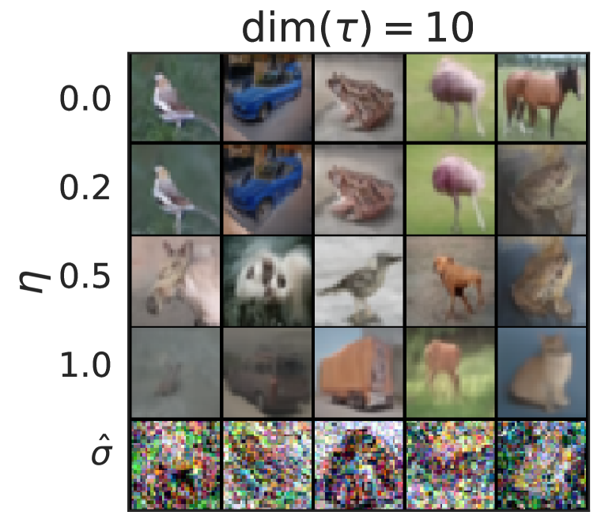

<figcaption>図3: dim(τ)=10 と dim(τ)=100 の CIFAR10 と CelebA のサンプル。</figcaption>
</figure>

<figure>

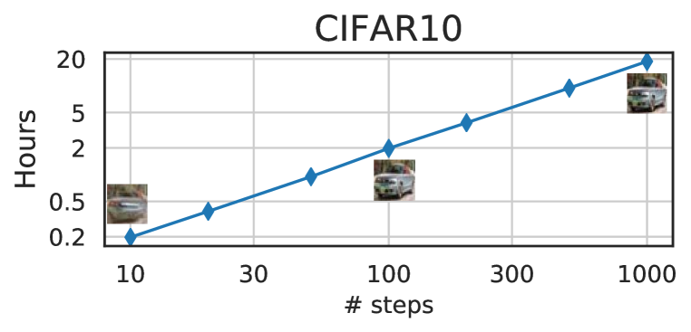

<figcaption>図4: 1 台の Nvidia 2080 Ti GPU で 5 万枚をサンプリングする時間と、異なるステップでのサンプル。</figcaption>
</figure>

### 5.2 Sample consistency in DDIMs（DDIM におけるサンプルの一貫性）

DDIM では生成過程は決定論的であり、${\bm{x}}_{0}$ は初期状態 ${\bm{x}}_{T}$ のみに依存する。図 5 では、同じ初期 ${\bm{x}}_{T}$ から始めつつ異なる生成軌道（すなわち異なる $\tau$）下で生成された画像を観察する。興味深いことに、同じ初期 ${\bm{x}}_{T}$ で生成された画像については、生成軌道によらず、ほとんどの高レベル特徴が似ている。多くの場合、わずか 20 ステップで生成されたサンプルが、高レベル特徴の点で 1000 ステップで生成されたものとすでに非常に似ており、細部にわずかな違いがあるだけである。したがって、${\bm{x}}_{T}$ のみが画像の情報的な潜在エンコーディングであるように見える。そして、より長いサンプル軌道がより良い品質のサンプルを与えるが高レベル特徴には大きく影響しないので、サンプル品質に影響する細部はパラメータにエンコードされている。より多くのサンプルを付録 D.4 に示す。

<figure>

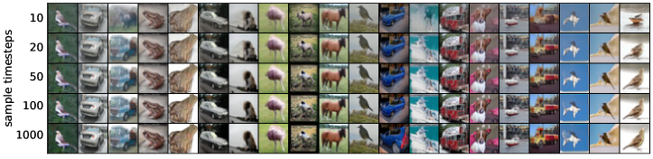

<figcaption>図5: 同じランダムな xₜ と異なるステップ数の DDIM からのサンプル。</figcaption>
</figure>

### 5.3 Interpolation in deterministic generative processes（決定論的生成過程における補間）

<figure>

<figcaption>図6: dim(τ)=50 の DDIM からのサンプルの補間。</figcaption>
</figure>

DDIM サンプルの高レベル特徴は ${\bm{x}}_{T}$ によってエンコードされるので、GAN のような他の暗黙確率モデルで観察されるのと同様の意味的補間効果を示すかどうかに関心がある。これは [^15] の補間手続きとは異なる。なぜなら DDPM では確率的生成過程のため同じ ${\bm{x}}_{T}$ が非常に多様な ${\bm{x}}_{0}$ につながるからである。図 6 では、${\bm{x}}_{T}$ の単純な補間が 2 つのサンプル間の意味的に有意な補間につながることを示す。より多くの詳細とサンプルを付録 D.5 に含める。これにより、DDIM は DDPM にはできない、潜在変数を通じた生成画像の高レベルな直接制御を可能にする。

### 5.4 Reconstruction from Latent Space（潜在空間からの再構成）

DDIM は特定の ODE のオイラー積分なので、${\bm{x}}_{0}$ から ${\bm{x}}_{T}$ へエンコード（式 (14) の逆）し、結果の ${\bm{x}}_{T}$ から ${\bm{x}}_{0}$ を再構成（式 (14) の順）できるかを見るのは興味深い。CIFAR-10 モデルで、エンコードとデコードの両方に $S$ ステップを用いて CIFAR-10 テストセットでエンコード・デコードを考える。次元ごとの平均二乗誤差（$[0,1]$ にスケール）を表 2 に報告する。我々の結果は、DDIM が大きい $S$ 値で低い再構成誤差を持ち、ニューラル ODE や正規化フローと似た性質を持つことを示す。DDPM については確率的性質のため同じことは言えない。

**表2**: CIFAR-10 テストセットでの DDIM の再構成誤差、$10^{-4}$ に丸めた値。

| $S$ | 10 | 20 | 50 | 100 | 200 | 500 | 1000 |
| --- | --- | --- | --- | --- | --- | --- | --- |
| 誤差 | 0.014 | 0.0065 | 0.0023 | 0.0009 | 0.0004 | 0.0001 | 0.0001 |

## 6 Related Work（関連研究）

我々の研究は、マルコフ連鎖の遷移演算子として生成モデルを学習する既存手法の大きな族に基づく。その中で、ノイズ除去拡散確率モデル（DDPMs）とノイズ条件付きスコアネットワーク（NCSN）は、最近 GAN に匹敵する高いサンプル品質を達成した。DDPM は対数尤度の変分下界を最適化するのに対し、NCSN はデータのノンパラメトリックな Parzen 密度推定子上のスコアマッチング目的関数を最適化する。

異なる動機にもかかわらず、DDPM と NCSN は密接に関連する。両者とも多くのノイズレベルでノイズ除去オートエンコーダ目的関数を用い、両者ともサンプル生成にランジュバン動力学に似た手続きを用いる。ランジュバン動力学は勾配フローの離散化なので、DDPM と NCSN はともに良いサンプル品質を達成するのに多数のステップを要する。これは、DDPM と既存の NCSN 手法が少数の反復で高品質サンプルを生成するのに苦労するという観察と整合する。

一方 DDIM は、サンプルが潜在変数から一意に決まる暗黙生成モデルである。したがって DDIM は、意味的に有意な補間を生成する能力など、GAN や可逆フローに似たある性質を持つ。我々は DDIM を純粋に変分的な観点から導く。そこではランジュバン動力学の制約は関係ない。これが、より少ない反復で DDPM より優れたサンプル品質を観察できる理由を部分的に説明しうる。DDIM のサンプリング手続きはまた、連続的な深さを持つニューラルネットワークを思い起こさせる。なぜなら、同じ潜在変数から生成するサンプルが、特定のサンプル軌道によらず似た高レベルの視覚的特徴を持つからである。

## 7 Discussion（議論）

我々は DDIM——ノイズ除去オートエンコーディング／スコアマッチング目的関数で学習された暗黙生成モデル——を純粋に変分的な観点から提示した。DDIM は既存の DDPM や NCSN よりはるかに効率的に高品質なサンプルを生成でき、潜在空間から有意な補間を行う能力を持つ。ここで提示した非マルコフ的順過程は、ガウス以外の連続的な順過程を示唆するように思われる（これは元の拡散の枠組みではできない。なぜなら、有限分散を持つ唯一の安定分布がガウスだからである）。我々は付録 A で多項分布の順過程を持つ離散の場合も実証したので、他の組合せ構造に対する同様の代替を調査するのは興味深い。

さらに、DDIM のサンプリング手続きはニューラル ODE のそれに似ているので、Adams-Bashforth のような多段法を含む、ODE の離散化誤差を減らす手法が、より少ないステップでのサンプル品質のさらなる向上に役立つかを見るのは興味深い。また、DDIM が既存の暗黙モデルの他の性質を示すかを調査することも関連する。

## Appendix A Non-Markovian Forward Processes for a Discrete Case（離散の場合の非マルコフ的順過程）

この節では、離散データのための非マルコフ的順過程と対応する変分目的関数を記述する。本論文の焦点はガウス拡散に対応する逆モデルの加速なので、経験的評価は将来の課題とする。

$K$ 個の可能な値を持つワンホットベクトルである圏論的観測 ${\bm{x}}_{0}$ に対して、順過程を次のように定義する。まず、$q({\bm{x}}_{t}|{\bm{x}}_{0})$ を次のカテゴリカル分布とする。

$$
q({\bm{x}}_{t}|{\bm{x}}_{0})=\mathrm{Cat}(\alpha_{t}{\bm{x}}_{0}+(1-\alpha_{t}){\bm{1}}_{K})
$$

ここで ${\bm{1}}_{K}\in\mathbb{R}^{K}$ は全要素が $1/K$ のベクトルであり、$\alpha_{t}$ は $t=0$ での $\alpha_{0}=1$ から $t=T$ での $\alpha_{T}=0$ へ減少する。次に $q({\bm{x}}_{t-1}|{\bm{x}}_{t},{\bm{x}}_{0})$ を次の混合分布として定義する。

$$
q({\bm{x}}_{t-1}|{\bm{x}}_{t},{\bm{x}}_{0})=\begin{cases}\mathrm{Cat}({\bm{x}}_{t})&\text{確率 }\sigma_{t}\text{ で}\\
\mathrm{Cat}({\bm{x}}_{0})&\text{確率 }(\alpha_{t-1}-\sigma_{t}\alpha_{t})\text{ で}\\
\mathrm{Cat}({\bm{1}}_{K})&\text{確率 }(1-\alpha_{t-1})-(1-\alpha_{t})\sigma_{t}\text{ で}\end{cases},
$$

あるいは等価に、

$$
q({\bm{x}}_{t-1}|{\bm{x}}_{t},{\bm{x}}_{0})=\mathrm{Cat}\left(\sigma_{t}{\bm{x}}_{t}+(\alpha_{t-1}-\sigma_{t}\alpha_{t}){\bm{x}}_{0}+((1-\alpha_{t-1})-(1-\alpha_{t})\sigma_{t}){\bm{1}}_{K}\right),
$$

これは我々が $q({\bm{x}}_{t}|{\bm{x}}_{0})$ を定義した方法と整合する。

同様に、逆過程 $p_{\theta}({\bm{x}}_{t-1}|{\bm{x}}_{t})$ を次のように定義できる。

$$
p_{\theta}({\bm{x}}_{t-1}|{\bm{x}}_{t})=\mathrm{Cat}\left(\sigma_{t}{\bm{x}}_{t}+(\alpha_{t-1}-\sigma_{t}\alpha_{t})f_{\theta}^{(t)}({\bm{x}}_{t})+((1-\alpha_{t-1})-(1-\alpha_{t})\sigma_{t}){\bm{1}}_{K}\right),
$$

ここで $f_{\theta}^{(t)}({\bm{x}}_{t})$ は ${\bm{x}}_{t}$ を $K$ 次元ベクトルに写像する。$(1-\alpha_{t-1})-(1-\alpha_{t})\sigma_{t}\to 0$ につれ、サンプリング過程はより確率性が低くなる。すなわち、${\bm{x}}_{t}$ か予測された ${\bm{x}}_{0}$ のいずれかを高確率で選ぶようになる。KL ダイバージェンス

$$
D_{\mathrm{KL}}(q({\bm{x}}_{t-1}|{\bm{x}}_{t},{\bm{x}}_{0})\|p_{\theta}({\bm{x}}_{t-1}|{\bm{x}}_{t}))
$$

は well-defined であり、単に 2 つのカテゴリカル分布間の KL ダイバージェンスである。したがって、結果として得られる変分目的関数も最適化が容易なはずである。さらに、KL ダイバージェンスは凸なので、次の上界を持つ（右辺がゼロに向かうとき tight）。

$$
D_{\mathrm{KL}}(q({\bm{x}}_{t-1}|{\bm{x}}_{t},{\bm{x}}_{0})\|p_{\theta}({\bm{x}}_{t-1}|{\bm{x}}_{t}))\leq(\alpha_{t-1}-\sigma_{t}\alpha_{t})D_{\mathrm{KL}}(\mathrm{Cat}({\bm{x}}_{0})\|\mathrm{Cat}(f_{\theta}^{(t)}({\bm{x}}_{t}))).
$$

右辺は単なる（定数を除いた）多クラス分類損失なので、$\sigma_{t}$ の変化が（再重み付けを除いて）目的関数に影響しないことについて、同様の議論に到達できる。

## Appendix B Proofs（証明）

###### 補題 1.

式 (6) で定義された $q_{\sigma}({\bm{x}}_{1:T}|{\bm{x}}_{0})$ と式 (7) で定義された $q_{\sigma}({\bm{x}}_{t-1}|{\bm{x}}_{t},{\bm{x}}_{0})$ について、次が成り立つ。

$$
q_{\sigma}({\bm{x}}_{t}|{\bm{x}}_{0})={\mathcal{N}}(\sqrt{\alpha_{t}}{\bm{x}}_{0},(1-\alpha_{t}){\bm{I}})
$$

###### 証明.

任意の $t\leq T$ について $q_{\sigma}({\bm{x}}_{t}|{\bm{x}}_{0})={\mathcal{N}}(\sqrt{\alpha_{t}}{\bm{x}}_{0},(1-\alpha_{t}){\bm{I}})$ が成り立つと仮定する。もし

$$
q_{\sigma}({\bm{x}}_{t-1}|{\bm{x}}_{0})={\mathcal{N}}(\sqrt{\alpha_{t-1}}{\bm{x}}_{0},(1-\alpha_{t-1}){\bm{I}})
$$

ならば、基底の場合（$t=T$）はすでに成り立つので、$t$ について $T$ から $1$ への帰納法の議論で命題を証明できる。

まず、次が成り立つ。

$$
q_{\sigma}({\bm{x}}_{t-1}|{\bm{x}}_{0}):=\int_{{\bm{x}}_{t}}q_{\sigma}({\bm{x}}_{t}|{\bm{x}}_{0})q_{\sigma}({\bm{x}}_{t-1}|{\bm{x}}_{t},{\bm{x}}_{0})\mathrm{d}{\bm{x}}_{t}
$$

そして

$$
q_{\sigma}({\bm{x}}_{t}|{\bm{x}}_{0})={\mathcal{N}}(\sqrt{\alpha_{t}}{\bm{x}}_{0},(1-\alpha_{t}){\bm{I}})
$$

$$
q_{\sigma}({\bm{x}}_{t-1}|{\bm{x}}_{t},{\bm{x}}_{0})={\mathcal{N}}\left(\sqrt{\alpha_{t-1}}{\bm{x}}_{0}+\sqrt{1-\alpha_{t-1}-\sigma^{2}_{t}}\cdot{\frac{{\bm{x}}_{t}-\sqrt{\alpha_{t}}{\bm{x}}_{0}}{\sqrt{1-\alpha_{t}}}},\sigma_{t}^{2}{\bm{I}}\right).
$$

Bishop (2006) の (2.115) より、$q_{\sigma}({\bm{x}}_{t-1}|{\bm{x}}_{0})$ はガウスであり、${\mathcal{N}}(\mu_{t-1},\Sigma_{t-1})$ と表記すると

$$
\mu_{t-1}=\sqrt{\alpha_{t-1}}{\bm{x}}_{0}+\sqrt{1-\alpha_{t-1}-\sigma^{2}_{t}}\cdot{\frac{\sqrt{\alpha_{t}}{\bm{x}}_{0}-\sqrt{\alpha_{t}}{\bm{x}}_{0}}{\sqrt{1-\alpha_{t}}}}=\sqrt{\alpha_{t-1}}{\bm{x}}_{0}
$$

そして

$$
\Sigma_{t-1}=\sigma_{t}^{2}{\bm{I}}+\frac{1-\alpha_{t-1}-\sigma^{2}_{t}}{1-\alpha_{t}}(1-\alpha_{t}){\bm{I}}=(1-\alpha_{t-1}){\bm{I}}
$$

したがって $q_{\sigma}({\bm{x}}_{t-1}|{\bm{x}}_{0})={\mathcal{N}}(\sqrt{\alpha_{t-1}}{\bm{x}}_{0},(1-\alpha_{t-1}){\bm{I}})$ となり、帰納法の議論を適用できる。∎

###### 定理 1 の証明.

$J_{\sigma}$ の定義より、

$$
J_{\sigma}(\epsilon_{\theta}):={\mathbb{E}}_{{\bm{x}}_{0:T}\sim q({\bm{x}}_{0:T})}\left[\log q_{\sigma}({\bm{x}}_{T}|{\bm{x}}_{0})+\sum_{t=2}^{T}\log q_{\sigma}({\bm{x}}_{t-1}|{\bm{x}}_{t},{\bm{x}}_{0})-\sum_{t=1}^{T}\log p_{\theta}^{(t)}({\bm{x}}_{t-1}|{\bm{x}}_{t})\right]
$$

$$
\equiv{\mathbb{E}}_{{\bm{x}}_{0:T}\sim q({\bm{x}}_{0:T})}\left[\sum_{t=2}^{T}D_{\mathrm{KL}}(q_{\sigma}({\bm{x}}_{t-1}|{\bm{x}}_{t},{\bm{x}}_{0})\|p_{\theta}^{(t)}({\bm{x}}_{t-1}|{\bm{x}}_{t}))-\log p_{\theta}^{(1)}({\bm{x}}_{0}|{\bm{x}}_{1})\right]
$$

ここで $\equiv$ は「$\epsilon_{\theta}$ に依存しない値を除いて等しい（が $q_{\sigma}$ には依存しうる）」を表すために用いる。$t>1$ に対して、

$$
{\mathbb{E}}_{{\bm{x}}_{0},{\bm{x}}_{t}\sim q({\bm{x}}_{0},{\bm{x}}_{t})}[D_{\mathrm{KL}}(q_{\sigma}({\bm{x}}_{t-1}|{\bm{x}}_{t},{\bm{x}}_{0})\|p_{\theta}^{(t)}({\bm{x}}_{t-1}|{\bm{x}}_{t}))]
$$

$$
=\ {\mathbb{E}}_{{\bm{x}}_{0},{\bm{x}}_{t}\sim q({\bm{x}}_{0},{\bm{x}}_{t})}[D_{\mathrm{KL}}(q_{\sigma}({\bm{x}}_{t-1}|{\bm{x}}_{t},{\bm{x}}_{0})\|q_{\sigma}({\bm{x}}_{t-1}|{\bm{x}}_{t},f_{\theta}^{(t)}({\bm{x}}_{t})))]
$$

$$
\equiv\ {\mathbb{E}}_{{\bm{x}}_{0},{\bm{x}}_{t}\sim q({\bm{x}}_{0},{\bm{x}}_{t})}\left[\frac{{\lVert{{\bm{x}}_{0}-f_{\theta}^{(t)}({\bm{x}}_{t})}\rVert}_{2}^{2}}{2\sigma_{t}^{2}}\right]
$$

$$
=\ {\mathbb{E}}_{{\bm{x}}_{0}\sim q({\bm{x}}_{0}),\epsilon\sim{\mathcal{N}}({\bm{0}},{\bm{I}}),{\bm{x}}_{t}=\sqrt{\alpha_{t}}{\bm{x}}_{0}+\sqrt{1-\alpha_{t}}\epsilon}\left[\frac{{\lVert{\epsilon-\epsilon_{\theta}^{(t)}({\bm{x}}_{t})}\rVert}_{2}^{2}}{2d\sigma_{t}^{2}\alpha_{t}}\right]
$$

ここで $d$ は ${\bm{x}}_{0}$ の次元である。$t=1$ に対して、

$$
{\mathbb{E}}_{{\bm{x}}_{0},{\bm{x}}_{1}\sim q({\bm{x}}_{0},{\bm{x}}_{1})}\left[-\log p_{\theta}^{(1)}({\bm{x}}_{0}|{\bm{x}}_{1})\right]\equiv{\mathbb{E}}\left[\frac{{\lVert{\epsilon-\epsilon_{\theta}^{(1)}({\bm{x}}_{1})}\rVert}_{2}^{2}}{2d\sigma_{1}^{2}\alpha_{1}}\right]
$$

したがって、すべての $t\in\{1,\ldots,T\}$ について $\gamma_{t}=1/(2d\sigma_{t}^{2}\alpha_{t})$ のとき、すべての $\epsilon_{\theta}$ について

$$
J_{\sigma}(\epsilon_{\theta})\equiv\sum_{t=1}^{T}\frac{1}{2d\sigma_{t}^{2}\alpha_{t}}{\mathbb{E}}\left[{\lVert{\epsilon_{\theta}^{(t)}({\bm{x}}_{t})-\epsilon_{t}}\rVert}_{2}^{2}\right]=L_{\gamma}(\epsilon_{\theta})
$$

「$\equiv$」の定義より、$J_{\sigma}=L_{\gamma}+C$ となる。∎

###### 命題 1 の証明.

この証明の文脈では、$t$ を連続で独立な「時間」変数とし、${\bm{x}}$ と $\alpha$ を $t$ の関数とする。まず、変数 $\bar{{\bm{x}}}$ と $\sigma$ を導入して DDIM と VE-SDE の間の再パラメータ化を考える。

$$
\bar{{\bm{x}}}(t)=\bar{{\bm{x}}}(0)+\sigma(t)\epsilon,\quad\epsilon\sim{\mathcal{N}}(0,{\bm{I}}),
$$

$t\in[0,\infty)$ と、$\sigma(0)=0$ を満たす増加連続関数 $\sigma:{\mathbb{R}}_{\geq 0}\to{\mathbb{R}}_{\geq 0}$ に対して。DDIM の場合に対応する $\alpha(t)$ と ${\bm{x}}(t)$ を次のように定義できる。

$$
\bar{{\bm{x}}}(t)=\frac{{\bm{x}}(t)}{\sqrt{\alpha(t)}},\qquad\sigma(t)=\sqrt{\frac{1-\alpha(t)}{\alpha(t)}}.
$$

これはまた次を意味する。

$$
{\bm{x}}(t)=\frac{\bar{{\bm{x}}}(t)}{\sqrt{\sigma^{2}(t)+1}},\qquad\alpha(t)=\frac{1}{1+\sigma^{2}(t)},
$$

これは $({\bm{x}},\alpha)$ と $(\bar{{\bm{x}}},\sigma)$ の間の全単射を確立する。式 (4) より（$\alpha(0)=1$ に注意）、

$$
\frac{{\bm{x}}(t)}{\sqrt{\alpha(t)}}=\frac{{\bm{x}}(0)}{\sqrt{\alpha(0)}}+\sqrt{\frac{1-\alpha(t)}{\alpha(t)}}\epsilon,\quad\epsilon\sim{\mathcal{N}}(0,{\bm{I}})
$$

これは VE-SDE と整合する形 $\bar{{\bm{x}}}(t)=\bar{{\bm{x}}}(0)+\sigma(t)\epsilon$ に再パラメータ化できる。次に、DDIM と VE-SDE の両方の ODE 形を導き、それらが等価であることを示す。

#### ODE form for DDIM（DDIM の ODE 形）

式 (13) をここで繰り返す。

$$
\frac{{\bm{x}}_{t-\Delta t}}{\sqrt{\alpha_{t-\Delta t}}}=\frac{{\bm{x}}_{t}}{\sqrt{\alpha_{t}}}+\left(\sqrt{\frac{1-\alpha_{t-\Delta t}}{\alpha_{t-\Delta t}}}-\sqrt{\frac{1-\alpha_{t}}{\alpha_{t}}}\right)\epsilon_{\theta}^{(t)}({\bm{x}}_{t}),
$$

これは次と等価である。

$$
\bar{{\bm{x}}}(t-\Delta t)=\bar{{\bm{x}}}(t)+(\sigma(t-\Delta t)-\sigma(t))\cdot\epsilon_{\theta}^{(t)}({\bm{x}}(t))
$$

両辺を $(-\Delta t)$ で割り、$\Delta t\to 0$ とすると、

$$
\frac{\mathrm{d}\bar{{\bm{x}}}(t)}{\mathrm{d}t}=\frac{\mathrm{d}\sigma(t)}{\mathrm{d}t}\epsilon_{\theta}^{(t)}\left(\frac{\bar{{\bm{x}}}(t)}{\sqrt{\sigma^{2}(t)+1}}\right),
$$

これはまさに式 (14) で得たものである。

最適モデルについて、$\epsilon_{\theta}^{(t)}$ は最小化子であることに注意する。

$$
\epsilon_{\theta}^{(t)}=\operatorname*{arg\,min}_{f_{t}}{\mathbb{E}}_{{\bm{x}}(0)\sim q({\bm{x}}),\epsilon\sim{\mathcal{N}}(0,{\bm{I}})}[{\lVert{f_{t}({\bm{x}}(t))-\epsilon}\rVert}_{2}^{2}]
$$

ここで ${\bm{x}}(t)=\sqrt{\alpha(t)}{\bm{x}}(t)+\sqrt{1-\alpha(t)}\epsilon$。

#### ODE form for VE-SDE（VE-SDE の ODE 形）

$p_{t}(\bar{{\bm{x}}})$ を、$\sigma^{2}(t)$ 分散のガウスノイズで摂動されたデータ分布とする。VE-SDE の確率フローは次のように定義される。

$$
\mathrm{d}\bar{{\bm{x}}}=-\frac{1}{2}g(t)^{2}\nabla_{\bar{{\bm{x}}}}\log p_{t}(\bar{{\bm{x}}})\mathrm{d}t
$$

ここで $g(t)=\sqrt{\frac{\mathrm{d}\sigma^{2}(t)}{\mathrm{d}t}}$ は拡散係数であり、$\nabla_{\bar{{\bm{x}}}}\log p_{t}(\bar{{\bm{x}}})$ は $p_{t}$ のスコアである。

$\sigma(t)$ で摂動されたスコア関数 $\nabla_{\bar{{\bm{x}}}}\log p_{t}(\bar{{\bm{x}}})$ も（ノイズ除去スコアマッチングより）最小化子である。

$$
\nabla_{\bar{{\bm{x}}}}\log p_{t}=\operatorname*{arg\,min}_{g_{t}}{\mathbb{E}}_{{\bm{x}}(0)\sim q({\bm{x}}),\epsilon\sim{\mathcal{N}}(0,{\bm{I}})}[{\lVert{g_{t}(\bar{{\bm{x}}})+\epsilon/\sigma(t)}\rVert}_{2}^{2}]
$$

ここで $\bar{{\bm{x}}}(t)=\bar{{\bm{x}}}(t)+\sigma(t)\epsilon$。${\bm{x}}(t)$ と $\bar{{\bm{x}}}(t)$ の間に等価性があるので、次の関係を持つ。

$$
\nabla_{\bar{{\bm{x}}}}\log p_{t}(\bar{{\bm{x}}})=-\frac{\epsilon_{\theta}^{(t)}\left(\frac{\bar{{\bm{x}}}(t)}{\sqrt{\sigma^{2}(t)+1}}\right)}{\sigma(t)}
$$

これと $g(t)$ の定義を確率フローの式に代入すると、

$$
\mathrm{d}\bar{{\bm{x}}}(t)=\frac{1}{2}\frac{\mathrm{d}\sigma^{2}(t)}{\mathrm{d}t}\frac{\epsilon_{\theta}^{(t)}\left(\frac{\bar{{\bm{x}}}(t)}{\sqrt{\sigma^{2}(t)+1}}\right)}{\sigma(t)}\mathrm{d}t,
$$

項を整理すると次を得る。

$$
\frac{\mathrm{d}\bar{{\bm{x}}}(t)}{\mathrm{d}t}=\frac{\mathrm{d}\sigma(t)}{\mathrm{d}t}\epsilon_{\theta}^{(t)}\left(\frac{\bar{{\bm{x}}}(t)}{\sqrt{\sigma^{2}(t)+1}}\right)
$$

これは DDIM の ODE 形と等価である。どちらの場合も初期条件は $\bar{{\bm{x}}}(T)\sim{\mathcal{N}}({\bm{0}},\sigma^{2}(T){\bm{I}})$ なので、結果として得られる ODE は同一である。∎

## Appendix C Additional Derivations（追加の導出）

### C.1 Accelerated sampling processes（加速されたサンプリング過程）

加速の場合、推論過程を次のように因数分解されたものと考えられる。

$$
q_{\sigma,\tau}({\bm{x}}_{1:T}|{\bm{x}}_{0})=q_{\sigma,\tau}({\bm{x}}_{\tau_{S}}|{\bm{x}}_{0})\prod_{i=1}^{S}q_{\sigma,\tau}({\bm{x}}_{\tau_{i-1}}|{\bm{x}}_{\tau_{i}},{\bm{x}}_{0})\prod_{t\in\bar{\tau}}q_{\sigma,\tau}({\bm{x}}_{t}|{\bm{x}}_{0})
$$

ここで $\tau$ は $\tau_{S}=T$ を満たす $[1,\ldots,T]$ の長さ $S$ の部分列であり、$\bar{\tau}:=\{1,\ldots,T\}\setminus\tau$ をその補集合とする。直感的には、$\{{\bm{x}}_{\tau_{i}}\}_{i=1}^{S}$ と ${\bm{x}}_{0}$ のグラフィカルモデルは連鎖を形成し、$\{{\bm{x}}_{t}\}_{t\in\bar{\tau}}$ と ${\bm{x}}_{0}$ のグラフィカルモデルは星グラフを形成する。次を定義する。

$$
q_{\sigma,\tau}({\bm{x}}_{t}|{\bm{x}}_{0})={\mathcal{N}}(\sqrt{\alpha_{t}}{\bm{x}}_{0},(1-\alpha_{t}){\bm{I}})\quad\forall t\in\bar{\tau}\cup\{T\}
$$

$$
q_{\sigma,\tau}({\bm{x}}_{\tau_{i-1}}|{\bm{x}}_{\tau_{i}},{\bm{x}}_{0})={\mathcal{N}}\left(\sqrt{\alpha_{\tau_{i-1}}}{\bm{x}}_{0}+\sqrt{1-\alpha_{\tau_{i-1}}-\sigma^{2}_{\tau_{i}}}\cdot{\frac{{\bm{x}}_{\tau_{i}}-\sqrt{\alpha_{\tau_{i}}}{\bm{x}}_{0}}{\sqrt{1-\alpha_{\tau_{i}}}}},\sigma_{{\tau_{i}}}^{2}{\bm{I}}\right)\ \forall i\in[S]
$$

ここで係数は $q_{\sigma,\tau}({\bm{x}}_{\tau_{i}}|{\bm{x}}_{0})={\mathcal{N}}(\sqrt{\alpha_{\tau_{i}}}{\bm{x}}_{0},(1-\alpha_{\tau_{i}}){\bm{I}})$ となるよう、すなわち「周辺分布」が一致するように選ばれる。

対応する「生成過程」は次のように定義される。

$$
p_{\theta}({\bm{x}}_{0:T}):=\underbrace{p_{\theta}({\bm{x}}_{T})\prod_{i=1}^{S}p^{(\tau_{i})}_{\theta}({\bm{x}}_{\tau_{i-1}}|{\bm{x}}_{\tau_{i}})}_{\text{サンプル生成に使用}}\times\underbrace{\prod_{t\in\bar{\tau}}p_{\theta}^{(t)}({\bm{x}}_{0}|{\bm{x}}_{t})}_{\text{変分目的関数中}}
$$

ここでモデルの一部のみが実際にサンプル生成に使われる。条件付き分布は次である。

$$
p_{\theta}^{(\tau_{i})}({\bm{x}}_{\tau_{i-1}}|{\bm{x}}_{\tau_{i}})=q_{\sigma,\tau}({\bm{x}}_{\tau_{i-1}}|{\bm{x}}_{\tau_{i}},f_{\theta}^{(\tau_{i})}({\bm{x}}_{\tau_{i-1}}))\quad\text{if}\ i\in[S],i>1
$$

$$
p_{\theta}^{(t)}({\bm{x}}_{0}|{\bm{x}}_{t})={\mathcal{N}}(f_{\theta}^{(t)}({\bm{x}}_{t}),\sigma_{t}^{2}{\bm{I}})\quad\text{otherwise,}
$$

ここで $q_{\sigma,\tau}({\bm{x}}_{\tau_{i-1}}|{\bm{x}}_{\tau_{i}},{\bm{x}}_{0})$ を推論過程の一部として活用する（第 3 節で行ったのと同様）。結果として得られる変分目的関数は次になる（簡潔さのため ${\bm{x}}_{\tau_{L+1}}=\varnothing$ と定義）。

$$
J(\epsilon_{\theta})={\mathbb{E}}_{q_{\sigma,\tau}}\Bigg{[}\sum_{t\in\bar{\tau}}D_{\mathrm{KL}}(q_{\sigma,\tau}({\bm{x}}_{t}|{\bm{x}}_{0})\|p_{\theta}^{(t)}({\bm{x}}_{0}|{\bm{x}}_{t}))+\sum_{i=1}^{L}D_{\mathrm{KL}}(q_{\sigma,\tau}({\bm{x}}_{\tau_{i-1}}|{\bm{x}}_{\tau_{i}},{\bm{x}}_{0})\|p_{\theta}^{(\tau_{i})}({\bm{x}}_{\tau_{i-1}}|{\bm{x}}_{\tau_{i}}))\Bigg{]}
$$

ここで各 KL ダイバージェンスは、分散が $\theta$ に依存しない 2 つのガウス間のものである。定理 1 の証明に用いたのと同様の議論で、変分目的関数 $J$ も $L_{\gamma}$ の形の目的関数に変換できることを示せる。

### C.2 Derivation of denoising objectives for DDPMs（DDPM のノイズ除去目的関数の導出）

[^15] では、まず拡散ハイパーパラメータ $\beta_{t}$ が導入され、次に関連変数 $\alpha_{t}:=1-\beta_{t}$ と $\bar{\alpha}_{t}=\prod_{t=1}^{T}\alpha_{t}$ が定義されることに注意する。本論文では、3 つの理由から、[^15] の変数 $\bar{\alpha}_{t}$ を表すために記法 $\alpha_{t}$ を用いてきた。第一に、ハイパーパラメータの集合を 1 つだけ選べばよいことがより明確になり、導出変数の相互参照の可能性を減らす。第二に、推論過程がもはや拡散に動機づけられないため、一般化と加速の場合の導入が容易になる。第三に、$\alpha_{1:T}$ と $1,\ldots,T$ の間には同型が存在するが、$\beta_{t}$ ではそうでない。

この節では、[^15] の導出とより整合させるため $\beta_{t}$ と $\alpha_{t}$ を用いる。ここで（緑色で示す）$\alpha_{t}=\frac{\alpha_{t}}{\alpha_{t-1}}$、$\beta_{t}=1-\frac{\alpha_{t}}{\alpha_{t-1}}$ は $\alpha_{t}$（すなわち $\bar{\alpha}_{t}$）から一意に決まる。

まず、拡散順過程から、

$$
q({\bm{x}}_{t-1}|{\bm{x}}_{t},{\bm{x}}_{0})={\mathcal{N}}\Bigg{(}\frac{\sqrt{\alpha_{t-1}}\beta_{t}}{1-\alpha_{t}}{\bm{x}}_{0}+\frac{\sqrt{\alpha_{t}}(1-\alpha_{t-1})}{1-\alpha_{t}}{\bm{x}}_{t},\frac{1-\alpha_{t-1}}{1-\alpha_{t}}\beta_{t}{\bm{I}}\Bigg{)}
$$

（平均部分を $\tilde{\mu}({\bm{x}}_{t},{\bm{x}}_{0})$ と表記。）[^15] は特定の型の $p_{\theta}^{(t)}({\bm{x}}_{t-1}|{\bm{x}}_{t})={\mathcal{N}}(\mu_{\theta}({\bm{x}}_{t},t),\sigma_{t}{\bm{I}})$ を考え、これは次の変分目的関数につながる。

$$
L:={\mathbb{E}}_{q}\left[q({\bm{x}}_{T}|{\bm{x}}_{0})+\sum_{t=2}^{T}\log q({\bm{x}}_{t-1}|{\bm{x}}_{t},{\bm{x}}_{0})-\sum_{t=1}^{T}\log p_{\theta}^{(t)}({\bm{x}}_{t-1}|{\bm{x}}_{t})\right]
$$

$$
\equiv{\mathbb{E}}_{q}\left[\sum_{t=2}^{T}\underbrace{D_{\mathrm{KL}}(q({\bm{x}}_{t-1}|{\bm{x}}_{t},{\bm{x}}_{0})\|p_{\theta}^{(t)}({\bm{x}}_{t-1}|{\bm{x}}_{t}))}_{L_{t-1}}-\log p_{\theta}^{(1)}({\bm{x}}_{0}|{\bm{x}}_{1})\right]
$$

次のように書ける。

$$
L_{t-1}={\mathbb{E}}_{q}\left[\frac{1}{2\sigma_{t}^{2}}{\lVert{\mu_{\theta}({\bm{x}}_{t},t)-\tilde{\mu}({\bm{x}}_{t},{\bm{x}}_{0})}\rVert}_{2}^{2}\right]
$$

[^15] はパラメータ化 $\mu_{\theta}({\bm{x}}_{t},t)=\frac{1}{\sqrt{\alpha_{t}}}\left({\bm{x}}_{t}-\frac{\beta_{t}}{\sqrt{1-\alpha_{t}}}\epsilon_{\theta}({\bm{x}}_{t},t)\right)$ を選び、これは次に簡略化できる。

$$
L_{t-1}={\mathbb{E}}_{{\bm{x}}_{0},\epsilon}\left[\frac{\beta_{t}^{2}}{2\sigma_{t}^{2}(1-\alpha_{t})\alpha_{t}}{\lVert{\epsilon-\epsilon_{\theta}(\sqrt{\alpha_{t}}{\bm{x}}_{0}+\sqrt{1-\alpha_{t}}\epsilon,t)}\rVert}_{2}^{2}\right]
$$

## Appendix D Experimental Details（実験の詳細）

### D.1 Datasets and architectures（データセットとアーキテクチャ）

我々はさまざまな解像度の 4 つの画像データセットを考える：CIFAR10（$32\times 32$, 無条件）、CelebA（$64\times 64$）、LSUN Bedroom（$256\times 256$）、LSUN Church（$256\times 256$）。すべてのデータセットで、結果を直接比較可能にするため、ハイパーパラメータ $\alpha$ を [^15] のヒューリスティックに従って設定する。各データセットで同じモデルを用い、異なる生成過程の性能のみを比較する。CIFAR10・Bedroom・Church については元の DDPM 実装から事前学習済みチェックポイントを得る。CelebA については、ノイズ除去目的関数 $L_{\bm{1}}$ を使って我々自身のモデルを学習した。

$\epsilon_{\theta}^{(t)}({\bm{x}}_{t})$ のアーキテクチャは [^15] のものに従い、Wide ResNet に基づく U-Net である。CIFAR10・Bedroom・Church には [^15] の事前学習済みモデルを使い、CelebA $64\times 64$ モデルについては（事前学習済みモデルが提供されていないため）自分で学習する。我々の CelebA モデルは $64\times 64$ から $4\times 4$ までの 5 つの特徴マップ解像度を持ち、StyleGAN リポジトリの前処理技術を用いて（CelebA-HQ ではなく）元の CelebA データセットを使う。

**表3**: FID で測った LSUN Bedroom と Church の画像生成結果。1000 ステップ DDPM では FID は Bedroom 6.36、Church 7.89。

| $\dim(\tau)$ | 10 | 20 | 50 | 100 | | 10 | 20 | 50 | 100 |
| --- | --- | --- | --- | --- | --- | --- | --- | --- | --- |
| | **Bedroom (256×256)** | | | | | **Church (256×256)** | | | |
| DDIM ($\eta=0.0$) | 16.95 | 8.89 | 6.75 | 6.62 | | 19.45 | 12.47 | 10.84 | 10.58 |
| DDPM ($\eta=1.0$) | 42.78 | 22.77 | 10.81 | 6.81 | | 51.56 | 23.37 | 11.16 | 8.27 |

### D.2 Reverse process sub-sequence selection（逆過程の部分列選択）

望ましい $\dim(\tau)<T$ が与えられたときの $\tau$ の選択手続きとして 2 種類を考える。

- 線形（Linear）：ある $c$ について $\tau_{i}=\lfloor ci\rfloor$ となるようタイムステップを選ぶ。
- 二次（Quadratic）：ある $c$ について $\tau_{i}=\lfloor ci^{2}\rfloor$ となるようタイムステップを選ぶ。

定数 $c$ は $\tau_{-1}$ が $T$ に近くなるよう選ばれる。CIFAR10 には二次を、残りのデータセットには線形を用いた。これらの選択は、それぞれのデータセットで代替よりわずかに良い FID を達成する。

### D.3 Closed form equations for each sampling step（各サンプリングステップの閉形式の式）

式 (12) の一般的サンプリング式から、次の更新式を持つ。

$$
{\bm{x}}_{\tau_{i-1}}(\eta)=\sqrt{\alpha_{\tau_{i-1}}}\left(\frac{{\bm{x}}_{\tau_{i}}-\sqrt{1-\alpha_{\tau_{i}}}\epsilon_{\theta}^{(\tau_{i})}({\bm{x}}_{\tau_{i}})}{\sqrt{\alpha_{\tau_{i}}}}\right)+\sqrt{1-\alpha_{\tau_{i-1}}-\sigma_{\tau_{i}}(\eta)^{2}}\cdot\epsilon_{\theta}^{(\tau_{i})}({\bm{x}}_{\tau_{i}})+\sigma_{\tau_{i}}(\eta)\epsilon
$$

ここで $\sigma_{\tau_{i}}(\eta)=\eta\sqrt{\frac{1-\alpha_{\tau_{i-1}}}{1-\alpha_{\tau_{i}}}}\sqrt{1-\frac{\alpha_{\tau_{i}}}{\alpha_{\tau_{i-1}}}}$。

$\hat{\sigma}$（より大きい分散の DDPM）の場合、更新式は次になる。

$$
{\bm{x}}_{\tau_{i-1}}=\sqrt{\alpha_{\tau_{i-1}}}\left(\frac{{\bm{x}}_{\tau_{i}}-\sqrt{1-\alpha_{\tau_{i}}}\epsilon_{\theta}^{(\tau_{i})}({\bm{x}}_{\tau_{i}})}{\sqrt{\alpha_{\tau_{i}}}}\right)+\sqrt{1-\alpha_{\tau_{i-1}}-\sigma_{\tau_{i}}(1)^{2}}\cdot\epsilon_{\theta}^{(\tau_{i})}({\bm{x}}_{\tau_{i}})+\hat{\sigma}_{\tau_{i}}\epsilon
$$

これは $\eta=1$ の更新と比べて $\epsilon$ に異なる係数を用いるが、非確率的部分には同じ係数を用いる。この更新は $\eta=1$ の更新より確率的であり、$\dim(\tau)$ が小さいときに性能が悪くなる理由を説明する。

### D.4 Samples and Consistency（サンプルと一貫性）

図 7（CIFAR10）、図 8（CelebA）、図 10（Church）でより多くのサンプルを、図 9（CelebA）で DDIM の一貫性の結果を示す。

<figure>

<figcaption>図7: 1000 ステップ DDPM・1000 ステップ DDIM・100 ステップ DDIM からの CIFAR10 サンプル。</figcaption>
</figure>

<figure>

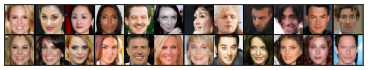

<figcaption>図8: 1000 ステップ DDPM・1000 ステップ DDIM・100 ステップ DDIM からの CelebA サンプル。</figcaption>
</figure>

<figure>

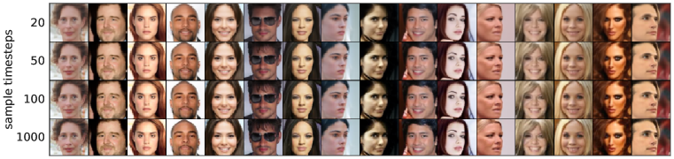

<figcaption>図9: 同じランダムな xₜ と異なるステップ数の DDIM からの CelebA サンプル。</figcaption>
</figure>

<figure>

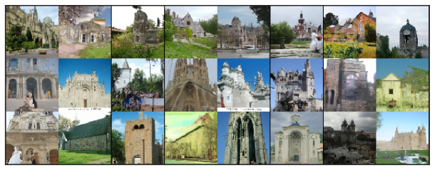

<figcaption>図10: 100 ステップ DDPM と 100 ステップ DDIM からの Church サンプル。</figcaption>
</figure>

### D.5 Interpolation（補間）

直線上の補間を生成するため、標準ガウスから 2 つの初期 ${\bm{x}}_{T}$ 値をランダムにサンプリングし、球面線形補間（spherical linear interpolation, slerp）でそれらを補間し、次に DDIM を使って ${\bm{x}}_{0}$ サンプルを得る。

$$
{\bm{x}}_{T}^{(\alpha)}=\frac{\sin((1-\alpha)\theta)}{\sin(\theta)}{\bm{x}}_{T}^{(0)}+\frac{\sin(\alpha\theta)}{\sin(\theta)}{\bm{x}}_{T}^{(1)}
$$

ここで $\theta=\arccos\left(\frac{({\bm{x}}_{T}^{(0)})^{\top}{\bm{x}}_{T}^{(1)}}{{\lVert{{\bm{x}}_{T}^{(0)}}\rVert}{\lVert{{\bm{x}}_{T}^{(1)}}\rVert}}\right)$。これらの値が DDIM サンプルの生成に用いられる。

グリッド上の補間を生成するため、4 つの潜在変数をサンプリングして 2 組に分け、同じ $\alpha$ の下で組ごとに slerp を用い、（独立に選ばれた補間係数の下で）組をまたいで補間サンプル上で slerp を用いる。より多くのグリッド補間の結果を図 11（CelebA）、図 12（Bedroom）、図 13（Church）に示す。

<figure>

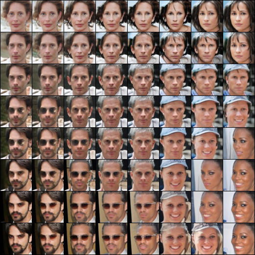

<figcaption>図11: dim(τ)=50 の CelebA DDIM からのより多くの補間。</figcaption>
</figure>

<figure>

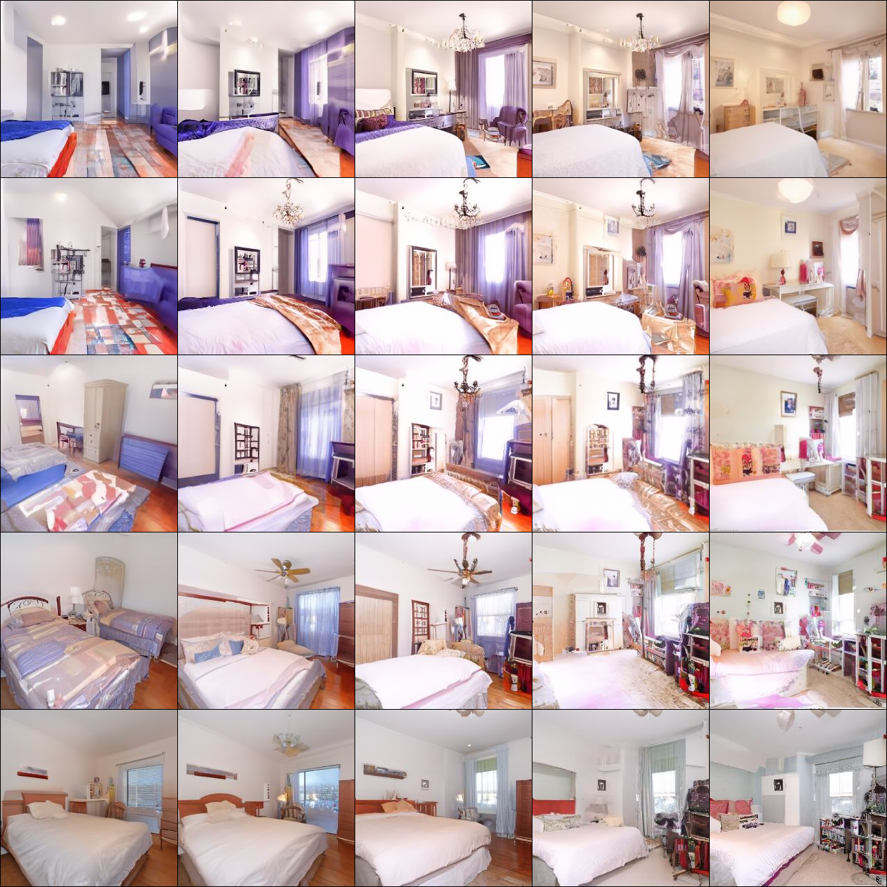

<figcaption>図12: dim(τ)=50 の Bedroom DDIM からのより多くの補間。</figcaption>
</figure>

<figure>

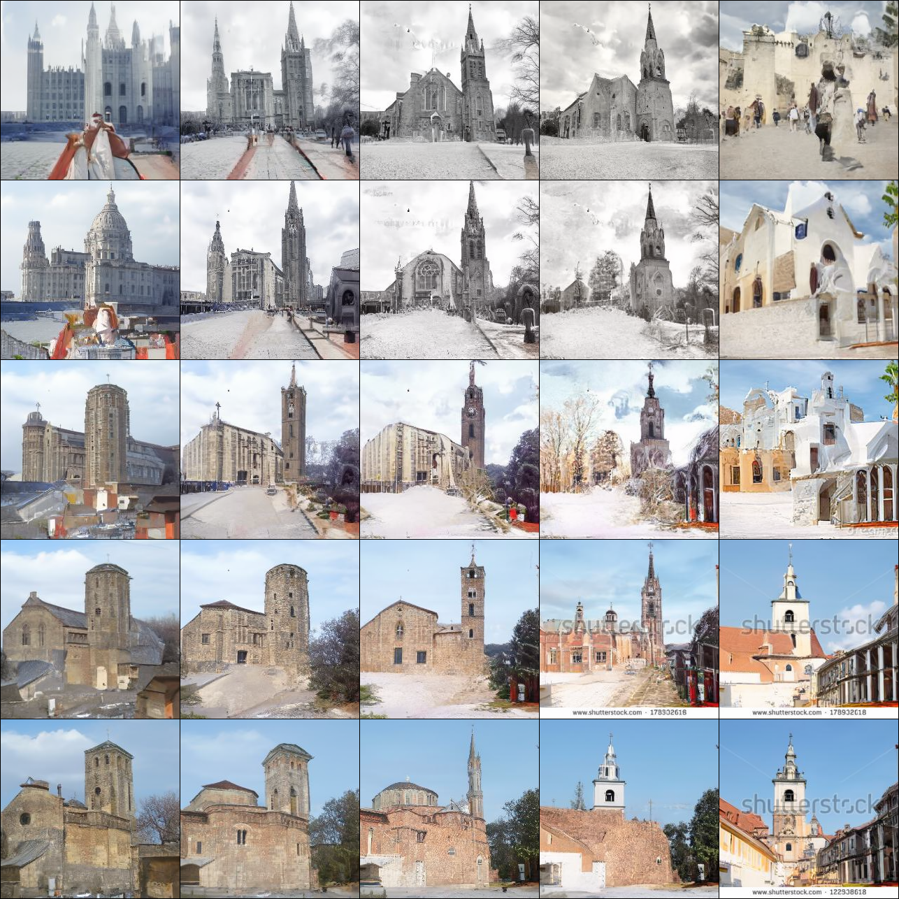

<figcaption>図13: dim(τ)=50 の Church DDIM からのより多くの補間。</figcaption>
</figure>
