# 確率微分方程式によるスコアベース生成モデリング（Score-Based Generative Modeling through Stochastic Differential Equations）

> 原題: Score-Based Generative Modeling through Stochastic Differential Equations
> 著者: Yang Song, Jascha Sohl-Dickstein, Diederik P. Kingma, Abhishek Kumar, Stefano Ermon, Ben Poole（Stanford University / Google Brain）
> 出典: ICLR 2021（Outstanding Paper Award）/ arXiv:2011.13456 ・ https://ar5iv.labs.arxiv.org/html/2011.13456

## Abstract（要旨）

データからノイズを作るのは簡単であり、ノイズからデータを作るのが生成モデリングである。我々は、複雑なデータ分布を、ノイズをゆっくり注入することで既知の事前分布へ滑らかに変換する確率微分方程式（stochastic differential equation, SDE）と、ノイズをゆっくり除去することで事前分布をデータ分布へ戻す対応する逆時間 SDE を提示する。決定的に重要なのは、逆時間 SDE が摂動されたデータ分布の時間依存の勾配場（すなわちスコア, score）にのみ依存することである。スコアベース生成モデリングの進展を活用することで、これらのスコアをニューラルネットワークで正確に推定し、数値 SDE ソルバーを用いてサンプルを生成できる。この枠組みがスコアベース生成モデリングと拡散確率モデリングの従来手法を内包し、新しいサンプリング手続きと新しいモデリング能力を可能にすることを示す。特に、離散化された逆時間 SDE の発展における誤差を補正する predictor-corrector 枠組みを導入する。また、SDE と同じ分布からサンプリングしつつ厳密な尤度計算とサンプリング効率の向上を可能にする等価なニューラル ODE を導出する。加えて、クラス条件付き生成・画像 inpainting・着色（colorization）の実験で示すように、スコアベースモデルで逆問題を解く新しい方法を提供する。複数のアーキテクチャ改良と組み合わせることで、CIFAR-10 の無条件画像生成で Inception score 9.89・FID 2.20 という記録的性能、競争力ある尤度 2.99 bits/dim を達成し、スコアベース生成モデルから初めて $1024\times 1024$ 画像の高精細生成を実証する。

## 1 Introduction（はじめに）

確率的生成モデルの 2 つの成功したクラスは、学習データを徐々に増加するノイズで破損させ、次にこの破損を逆転することを学習してデータの生成モデルを形成することを含む。*ランジュバン動力学を伴うスコアマッチング（score matching with Langevin dynamics, SMLD）* は各ノイズスケールでスコア（すなわちデータに関する対数確率密度の勾配）を推定し、生成時には減少するノイズスケールの列からランジュバン動力学を用いてサンプリングする。*ノイズ除去拡散確率モデリング（denoising diffusion probabilistic modeling, DDPM）* は、逆分布の関数形の知識を用いて学習を扱いやすくしながら、ノイズ破損の各ステップを逆転する確率モデルの列を学習する。連続状態空間では、DDPM の学習目的は各ノイズスケールでのスコアを暗黙的に計算している。したがって我々はこの 2 つのモデルクラスを総称して*スコアベース生成モデル（score-based generative models）* と呼ぶ。

スコアベース生成モデルと関連技術は、画像・音声・グラフ・形状の生成で効果的であることが証明されている。新しいサンプリング手法を可能にし、スコアベース生成モデルの能力をさらに拡張するために、我々は確率微分方程式（SDE）のレンズを通じて従来手法を一般化する統一枠組みを提案する。

<figure>

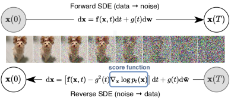

<figcaption>図1: 逆時間 SDE を解くとスコアベース生成モデルが得られる。データを単純なノイズ分布へ変換するのは連続時間 SDE で達成できる。各中間時刻での分布のスコア ∇ₓ log pₜ(x) を知っていれば、この SDE を逆転できる。</figcaption>
</figure>

具体的には、有限個のノイズ分布でデータを摂動する代わりに、拡散過程に従って時間とともに発展する分布の連続体を考える。この過程はデータ点を徐々にランダムノイズへ拡散し、データに依存せず学習可能パラメータを持たない所定の SDE で与えられる。この過程を逆転することで、ランダムノイズを滑らかにデータへ成形してサンプルを生成できる。決定的に重要なのは、この逆過程が逆時間 SDE を満たし、これは順方向 SDE から、時間の関数としての周辺確率密度のスコアを与えれば導出できることである。したがって、時間依存のニューラルネットワークを学習してスコアを推定し、数値 SDE ソルバーを用いてサンプルを生成することで、逆時間 SDE を近似できる。我々の鍵となるアイデアは図 1 にまとめられる。

我々が提案する枠組みはいくつかの理論的・実用的貢献を持つ。

**柔軟なサンプリングと尤度計算**：サンプリングのために逆時間 SDE を積分するのに任意の汎用 SDE ソルバーを用いることができる。加えて、一般の SDE には適用できない 2 つの特別な方法を提案する。(i) 数値 SDE ソルバーとスコアベース MCMC アプローチ（ランジュバン MCMC や HMC など）を組み合わせた **Predictor-Corrector（PC）サンプラー**、(ii) **確率フロー常微分方程式（probability flow ODE）** に基づく決定論的サンプラー。前者はスコアベースモデルの既存サンプリング手法を*統一し改善する*。後者は black-box ODE ソルバーによる*高速な適応的サンプリング*、潜在コードによる*柔軟なデータ操作*、*一意に識別可能なエンコーディング*、そして特筆すべき*厳密な尤度計算*を可能にする。

**可制御生成（Controllable generation）**：条件付き逆時間 SDE は*無条件*スコアから効率的に推定できるので、学習時に利用できない情報で条件付けて生成過程を変調できる。これにより、再学習なしに単一の無条件スコアベースモデルを用いて、クラス条件付き生成・画像 inpainting・着色・その他の逆問題といった応用が可能になる。

**統一枠組み**：我々の枠組みは、スコアベース生成モデルを改善するためにさまざまな SDE を探索・調整する統一的な方法を提供する。SMLD と DDPM の手法は、2 つの別個の SDE の離散化として我々の枠組みに統合できる。DDPM は最近 SMLD より高いサンプル品質を達成すると報告されたが、我々は、より良いアーキテクチャと我々の枠組みが許す新しいサンプリングアルゴリズムにより、後者が追いつけることを示す。すなわち CIFAR-10 で新たな最先端の Inception score（9.89）と FID（2.20）を達成し、スコアベースモデルから初めて $1024\times 1024$ 画像の高精細生成を達成する。加えて、我々の枠組みの下で新しい SDE を提案し、一様逆量子化された CIFAR-10 画像で 2.99 bits/dim の尤度を達成し、このタスクで新記録を打ち立てる。

## 2 Background（背景）

### 2.1 Denoising score matching with Langevin dynamics (SMLD)（ランジュバン動力学を伴うノイズ除去スコアマッチング）

$p_{\sigma}(\tilde{\mathbf{x}}\mid\mathbf{x})\coloneqq\mathcal{N}(\tilde{\mathbf{x}};\mathbf{x},\sigma^{2}\mathbf{I})$ を摂動カーネルとし、$p_{\sigma}(\tilde{\mathbf{x}})\coloneqq\int p_{\mathrm{data}}(\mathbf{x})p_{\sigma}(\tilde{\mathbf{x}}\mid\mathbf{x})\mathrm{d}\mathbf{x}$ とする（$p_{\mathrm{data}}(\mathbf{x})$ はデータ分布）。正のノイズスケールの列 $\sigma_{\text{min}}=\sigma_{1}<\sigma_{2}<\cdots<\sigma_{N}=\sigma_{\text{max}}$ を考える。典型的には、$\sigma_{\text{min}}$ は $p_{\sigma_{\text{min}}}(\mathbf{x})\approx p_{\mathrm{data}}(\mathbf{x})$ となるよう十分小さく、$\sigma_{\text{max}}$ は $p_{\sigma_{\text{max}}}(\mathbf{x})\approx\mathcal{N}(\mathbf{x};\mathbf{0},\sigma_{\text{max}}^{2}\mathbf{I})$ となるよう十分大きい。Song & Ermon は、ノイズ条件付きスコアネットワーク（Noise Conditional Score Network, NCSN）$\mathbf{s}_{\boldsymbol{\theta}}(\mathbf{x},\sigma)$ を、ノイズ除去スコアマッチング目的関数の重み付き和で学習することを提案する。

$$
{\boldsymbol{\theta}}^{*}=\operatorname*{arg\,min}_{\boldsymbol{\theta}}\sum_{i=1}^{N}\sigma_{i}^{2}\mathbb{E}_{p_{\mathrm{data}}(\mathbf{x})}\mathbb{E}_{p_{\sigma_{i}}(\tilde{\mathbf{x}}\mid\mathbf{x})}\big{[}\left\lVert\mathbf{s}_{\boldsymbol{\theta}}(\tilde{\mathbf{x}},\sigma_{i})-\nabla_{\tilde{\mathbf{x}}}\log p_{\sigma_{i}}(\tilde{\mathbf{x}}\mid\mathbf{x})\right\rVert_{2}^{2}\big{]}. \tag{1}
$$

十分なデータとモデル容量があれば、最適なスコアベースモデル $\mathbf{s}_{{\boldsymbol{\theta}}^{*}}(\mathbf{x},\sigma)$ は $\sigma\in\{\sigma_{i}\}_{i=1}^{N}$ についてほとんど至るところで $\nabla_{\mathbf{x}}\log p_{\sigma}(\mathbf{x})$ に一致する。サンプリングでは、各 $p_{\sigma_{i}}(\mathbf{x})$ について逐次的に $M$ ステップのランジュバン MCMC を実行する。

$$
\mathbf{x}_{i}^{m}=\mathbf{x}_{i}^{m-1}+\epsilon_{i}\mathbf{s}_{{\boldsymbol{\theta}}^{*}}(\mathbf{x}_{i}^{m-1},\sigma_{i})+\sqrt{2\epsilon_{i}}\mathbf{z}_{i}^{m},\quad m=1,2,\cdots,M, \tag{2}
$$

ここで $\epsilon_{i}>0$ はステップサイズ、$\mathbf{z}_{i}^{m}$ は標準正規である。上記を $i=N,N-1,\cdots,1$ について順に繰り返す（$\mathbf{x}_{N}^{0}\sim\mathcal{N}(\mathbf{x}\mid\mathbf{0},\sigma_{\text{max}}^{2}\mathbf{I})$、$i<N$ のとき $\mathbf{x}_{i}^{0}=\mathbf{x}_{i+1}^{M}$）。すべての $i$ について $M\to\infty$ かつ $\epsilon_{i}\to 0$ のとき、$\mathbf{x}_{1}^{M}$ は一定の正則性条件の下で $p_{\sigma_{\text{min}}}(\mathbf{x})\approx p_{\mathrm{data}}(\mathbf{x})$ からの厳密なサンプルになる。

### 2.2 Denoising diffusion probabilistic models (DDPM)（ノイズ除去拡散確率モデル）

正のノイズスケールの列 $0<\beta_{1},\beta_{2},\cdots,\beta_{N}<1$ を考える。各学習データ点 $\mathbf{x}_{0}\sim p_{\mathrm{data}}(\mathbf{x})$ に対し、$p(\mathbf{x}_{i}\mid\mathbf{x}_{i-1})=\mathcal{N}(\mathbf{x}_{i};\sqrt{1-\beta_{i}}\mathbf{x}_{i-1},\beta_{i}\mathbf{I})$ となる離散マルコフ連鎖 $\{\mathbf{x}_{0},\mathbf{x}_{1},\cdots,\mathbf{x}_{N}\}$ を構築する。したがって $p_{\alpha_{i}}(\mathbf{x}_{i}\mid\mathbf{x}_{0})=\mathcal{N}(\mathbf{x}_{i};\sqrt{\alpha_{i}}\mathbf{x}_{0},(1-\alpha_{i})\mathbf{I})$（$\alpha_{i}\coloneqq\prod_{j=1}^{i}(1-\beta_{j})$）。SMLD と同様に、摂動データ分布を $p_{\alpha_{i}}(\tilde{\mathbf{x}})\coloneqq\int p_{\text{data}}(\mathbf{x})p_{\alpha_{i}}(\tilde{\mathbf{x}}\mid\mathbf{x})\mathrm{d}\mathbf{x}$ と表せる。ノイズスケールは $\mathbf{x}_{N}$ が近似的に $\mathcal{N}(\mathbf{0},\mathbf{I})$ に従うよう定められる。逆方向の変分マルコフ連鎖は $p_{\boldsymbol{\theta}}(\mathbf{x}_{i-1}|\mathbf{x}_{i})=\mathcal{N}(\mathbf{x}_{i-1};\frac{1}{\sqrt{1-\beta_{i}}}(\mathbf{x}_{i}+\beta_{i}\mathbf{s}_{\boldsymbol{\theta}}(\mathbf{x}_{i},i)),\beta_{i}\mathbf{I})$ でパラメータ化され、証拠下界（ELBO）の再重み付け版で学習される。

$$
{\boldsymbol{\theta}}^{*}=\operatorname*{arg\,min}_{\boldsymbol{\theta}}\sum_{i=1}^{N}(1-\alpha_{i})\mathbb{E}_{p_{\mathrm{data}}(\mathbf{x})}\mathbb{E}_{p_{\alpha_{i}}(\tilde{\mathbf{x}}\mid\mathbf{x})}[\left\lVert\mathbf{s}_{\boldsymbol{\theta}}(\tilde{\mathbf{x}},i)-\nabla_{\tilde{\mathbf{x}}}\log p_{\alpha_{i}}(\tilde{\mathbf{x}}\mid\mathbf{x})\right\rVert_{2}^{2}]. \tag{3}
$$

式 3 を解いて最適モデル $\mathbf{s}_{{\boldsymbol{\theta}}^{*}}(\mathbf{x},i)$ を得た後、$\mathbf{x}_{N}\sim\mathcal{N}(\mathbf{0},\mathbf{I})$ から始めて推定された逆マルコフ連鎖に従ってサンプルを生成できる。

$$
\mathbf{x}_{i-1}=\frac{1}{\sqrt{1-\beta_{i}}}(\mathbf{x}_{i}+\beta_{i}\mathbf{s}_{{\boldsymbol{\theta}}^{*}}(\mathbf{x}_{i},i))+\sqrt{\beta_{i}}\mathbf{z}_{i},\quad i=N,N-1,\cdots,1. \tag{4}
$$

これをグラフィカルモデル $\prod_{i=1}^{N}p_{\boldsymbol{\theta}}(\mathbf{x}_{i-1}\mid\mathbf{x}_{i})$ からの祖先的サンプリング（ancestral sampling）に相当することから、*祖先的サンプリング*と呼ぶ。ここで述べた目的関数 式 3 は DDPM 論文の $L_{\text{simple}}$ を、式 1 との類似をより明示する形で書いたものである。式 1 と同様、式 3 もノイズ除去スコアマッチング目的関数の重み付き和であり、最適モデル $\mathbf{s}_{{\boldsymbol{\theta}}^{*}}(\tilde{\mathbf{x}},i)$ が摂動データ分布のスコア $\nabla_{\mathbf{x}}\log p_{\alpha_{i}}(\mathbf{x})$ に一致することを含意する。特筆すべきは、式 1 と式 3 の $i$ 番目の項の重み $\sigma_{i}^{2}$ と $(1-\alpha_{i})$ が、対応する摂動カーネルと同じ関数形で関係していることである：$\sigma_{i}^{2}\propto 1/\mathbb{E}[\left\lVert\nabla_{\mathbf{x}}\log p_{\sigma_{i}}(\tilde{\mathbf{x}}\mid\mathbf{x})\right\rVert_{2}^{2}]$ かつ $(1-\alpha_{i})\propto 1/\mathbb{E}[\left\lVert\nabla_{\mathbf{x}}\log p_{\alpha_{i}}(\tilde{\mathbf{x}}\mid\mathbf{x})\right\rVert_{2}^{2}]$。

## 3 Score-based generative modeling with SDEs（SDE によるスコアベース生成モデリング）

複数のノイズスケールでデータを摂動することが従来手法の成功の鍵である。我々はこのアイデアを無限個のノイズスケールへさらに一般化し、ノイズが強まるにつれて摂動データ分布が SDE に従って発展するようにすることを提案する。我々の枠組みの概観を図 2 に示す。

<figure>

<figcaption>図2: SDE によるスコアベース生成モデリングの概観。SDE でデータをノイズ分布（事前分布）へ写像し（第 3.1 節）、生成のためにこの SDE を逆転する（3.2）。これに付随する確率フロー ODE を逆転することもでき（4.3）、SDE と同じ分布からサンプリングする決定論的過程が得られる。逆時間 SDE と確率フロー ODE はともにスコア ∇ₓ log pₜ(x) を推定することで得られる（3.3）。</figcaption>
</figure>

### 3.1 Perturbing data with SDEs（SDE によるデータの摂動）

我々の目標は、連続時間変数 $t\in[0,T]$ で添字付けされた拡散過程 $\{\mathbf{x}(t)\}_{t=0}^{T}$ を、$\mathbf{x}(0)\sim p_{0}$（i.i.d. サンプルのデータセットを持つ）かつ $\mathbf{x}(T)\sim p_{T}$（効率的にサンプル生成できる扱いやすい形を持つ）となるよう構築することである。言い換えれば、$p_{0}$ はデータ分布、$p_{T}$ は事前分布である。この拡散過程は伊藤型 SDE の解としてモデリングできる。

$$
\mathrm{d}\mathbf{x}=\mathbf{f}(\mathbf{x},t)\mathrm{d}t+{g}(t)\mathrm{d}\mathbf{w}, \tag{5}
$$

ここで $\mathbf{w}$ は標準ウィーナー過程（ブラウン運動）、$\mathbf{f}(\cdot,t):\mathbb{R}^{d}\to\mathbb{R}^{d}$ は $\mathbf{x}(t)$ の*ドリフト（drift）* 係数と呼ばれるベクトル値関数、${g}(\cdot):\mathbb{R}\to\mathbb{R}$ は $\mathbf{x}(t)$ の*拡散（diffusion）* 係数と呼ばれるスカラー関数である。提示を容易にするため拡散係数はスカラー（$d\times d$ 行列ではなく）で $\mathbf{x}$ に依存しないと仮定するが、我々の理論はそれらの場合にも一般化できる（付録 A 参照）。係数が状態と時間の両方で大域的にリプシッツであれば、この SDE は一意な強解を持つ。以後、$\mathbf{x}(t)$ の確率密度を $p_{t}(\mathbf{x})$ と表記し、$\mathbf{x}(s)$ から $\mathbf{x}(t)$ への遷移カーネルを $p_{st}(\mathbf{x}(t)\mid\mathbf{x}(s))$ と表記する（$0\leq s<t\leq T$）。

典型的には、$p_{T}$ は固定された平均と分散を持つガウス分布のように $p_{0}$ の情報を含まない無構造な事前分布である。式 5 の SDE を、データ分布を固定された事前分布へ拡散するよう設計する方法はさまざまある。第 3.4 節で、SMLD と DDPM の連続的一般化から導かれるいくつかの例を後で提供する。

### 3.2 Generating samples by reversing the SDE（SDE を逆転してサンプルを生成する）

$\mathbf{x}(T)\sim p_{T}$ のサンプルから始めて過程を逆転することで、サンプル $\mathbf{x}(0)\sim p_{0}$ を得られる。Anderson の注目すべき結果は、拡散過程の逆もまた拡散過程であり、時間を逆向きに走り、次の逆時間 SDE で与えられると述べる。

$$
\mathrm{d}\mathbf{x}=[\mathbf{f}(\mathbf{x},t)-g(t)^{2}\nabla_{\mathbf{x}}\log p_{t}(\mathbf{x})]\mathrm{d}t+g(t)\mathrm{d}\bar{\mathbf{w}}, \tag{6}
$$

ここで $\bar{\mathbf{w}}$ は時間が $T$ から $0$ へ逆向きに流れるときの標準ウィーナー過程であり、$\mathrm{d}t$ は無限小の負の時間ステップである。各周辺分布のスコア $\nabla_{\mathbf{x}}\log p_{t}(\mathbf{x})$ がすべての $t$ について分かれば、式 6 から逆拡散過程を導き、それをシミュレートして $p_{0}$ からサンプリングできる。

### 3.3 Estimating scores for the SDE（SDE のスコアの推定）

分布のスコアは、スコアマッチングでサンプル上にスコアベースモデルを学習することで推定できる。$\nabla_{\mathbf{x}}\log p_{t}(\mathbf{x})$ を推定するには、式 1 と 3 の連続的一般化を通じて、時間依存スコアベースモデル $\mathbf{s}_{\boldsymbol{\theta}}(\mathbf{x},t)$ を学習できる。

$$
{\boldsymbol{\theta}}^{*}=\operatorname*{arg\,min}_{\boldsymbol{\theta}}\mathbb{E}_{t}\Big{\{}\lambda(t)\mathbb{E}_{\mathbf{x}(0)}\mathbb{E}_{\mathbf{x}(t)\mid\mathbf{x}(0)}\big{[}\left\lVert\mathbf{s}_{\boldsymbol{\theta}}(\mathbf{x}(t),t)-\nabla_{\mathbf{x}(t)}\log p_{0t}(\mathbf{x}(t)\mid\mathbf{x}(0))\right\rVert_{2}^{2}\big{]}\Big{\}}. \tag{7}
$$

ここで $\lambda:[0,T]\to\mathbb{R}_{>0}$ は正の重み関数、$t$ は $[0,T]$ 上で一様にサンプリングされ、$\mathbf{x}(0)\sim p_{0}(\mathbf{x})$、$\mathbf{x}(t)\sim p_{0t}(\mathbf{x}(t)\mid\mathbf{x}(0))$。十分なデータとモデル容量があれば、スコアマッチングは式 7 の最適解 $\mathbf{s}_{{\boldsymbol{\theta}}^{\ast}}(\mathbf{x},t)$ がほとんどすべての $\mathbf{x}$ と $t$ について $\nabla_{\mathbf{x}}\log p_{t}(\mathbf{x})$ に等しいことを保証する。SMLD・DDPM と同様、通常 $\lambda\propto 1/{\mathbb{E}[\left\lVert\nabla_{\mathbf{x}(t)}\log p_{0t}(\mathbf{x}(t)\mid\mathbf{x}(0))\right\rVert_{2}^{2}]}$ と選べる。式 7 はノイズ除去スコアマッチングを用いるが、sliced score matching や finite-difference score matching といった他のスコアマッチング目的関数も適用できる。

式 7 を効率的に解くには通常、遷移カーネル $p_{0t}(\mathbf{x}(t)\mid\mathbf{x}(0))$ を知る必要がある。$\mathbf{f}(\cdot,t)$ がアフィンのとき、遷移カーネルは常にガウス分布であり、平均と分散はしばしば閉形式で既知で標準的手法で得られる。より一般の SDE については、Kolmogorov の前進方程式を解いて $p_{0t}(\mathbf{x}(t)\mid\mathbf{x}(0))$ を得られる。あるいは SDE をシミュレートして $p_{0t}(\mathbf{x}(t)\mid\mathbf{x}(0))$ からサンプリングし、式 7 のノイズ除去スコアマッチングを sliced score matching で置き換えてモデル学習でき、これは $\nabla_{\mathbf{x}(t)}\log p_{0t}(\mathbf{x}(t)\mid\mathbf{x}(0))$ の計算を回避する（付録 A 参照）。

### 3.4 Examples: VE, VP SDEs and beyond（例: VE, VP SDE とその先）

SMLD と DDPM で用いられるノイズ摂動は、2 つの異なる SDE の離散化とみなせる。以下で簡潔に議論し、詳細は付録 B に委ねる。

合計 $N$ 個のノイズスケールを用いるとき、SMLD の各摂動カーネル $p_{\sigma_{i}}(\mathbf{x}\mid\mathbf{x}_{0})$ は次のマルコフ連鎖における $\mathbf{x}_{i}$ の分布に対応する。

$$
\mathbf{x}_{i}=\mathbf{x}_{i-1}+\sqrt{\sigma_{i}^{2}-\sigma_{i-1}^{2}}\mathbf{z}_{i-1},\quad i=1,\cdots,N, \tag{8}
$$

ここで $\mathbf{z}_{i-1}\sim\mathcal{N}(\mathbf{0},\mathbf{I})$、表記簡略化のため $\sigma_{0}=0$ を導入した。$N\to\infty$ の極限で、$\{\sigma_{i}\}_{i=1}^{N}$ は関数 $\sigma(t)$ に、$\mathbf{z}_{i}$ は $\mathbf{z}(t)$ に、マルコフ連鎖 $\{\mathbf{x}_{i}\}_{i=1}^{N}$ は連続確率過程 $\{\mathbf{x}(t)\}_{t=0}^{1}$ になる（整数 $i$ ではなく連続時間変数 $t\in[0,1]$ で添字付け）。過程 $\{\mathbf{x}(t)\}_{t=0}^{1}$ は次の SDE で与えられる。

$$
\mathrm{d}\mathbf{x}=\sqrt{\frac{\mathrm{d}\left[\sigma^{2}(t)\right]}{\mathrm{d}t}}\mathrm{d}\mathbf{w}. \tag{9}
$$

同様に DDPM の摂動カーネル $\{p_{\alpha_{i}}(\mathbf{x}\mid\mathbf{x}_{0})\}_{i=1}^{N}$ については、離散マルコフ連鎖は

$$
\mathbf{x}_{i}=\sqrt{1-\beta_{i}}\mathbf{x}_{i-1}+\sqrt{\beta_{i}}\mathbf{z}_{i-1},\quad i=1,\cdots,N. \tag{10}
$$

$N\to\infty$ のとき、式 10 は次の SDE に収束する。

$$
\mathrm{d}\mathbf{x}=-\frac{1}{2}\beta(t)\mathbf{x}~{}\mathrm{d}t+\sqrt{\beta(t)}~{}\mathrm{d}\mathbf{w}. \tag{11}
$$

したがって、SMLD と DDPM で用いられるノイズ摂動は、SDE 式 9 と 11 の離散化に対応する。興味深いことに、式 9 の SDE は $t\to\infty$ で常に分散が爆発する過程を与え、式 11 の SDE は初期分布が単位分散のとき分散が 1 に固定される過程を与える（証明は付録 B）。この違いから、以後 式 9 を分散爆発（Variance Exploding, VE）SDE、式 11 を分散保存（Variance Preserving, VP）SDE と呼ぶ。

VP SDE に着想を得て、尤度で特に良い性能を示す新しいタイプの SDE を提案する（第 4.3 節参照）。

$$
\mathrm{d}\mathbf{x}=-\frac{1}{2}\beta(t)\mathbf{x}~{}\mathrm{d}t+\sqrt{\beta(t)(1-e^{-2\int_{0}^{t}\beta(s)\mathrm{d}s})}\mathrm{d}\mathbf{w}. \tag{12}
$$

同じ $\beta(t)$ を用い同じ初期分布から始めると、式 12 が誘導する確率過程の分散はすべての中間時刻で常に VP SDE のそれによって上から押さえられる（証明は付録 B）。この理由から、式 12 を sub-VP SDE と名付ける。

VE・VP・sub-VP SDE はすべてアフィンなドリフト係数を持つので、それらの摂動カーネル $p_{0t}(\mathbf{x}(t)\mid\mathbf{x}(0))$ はすべてガウスで閉形式で計算でき、式 7 での学習を特に効率的にする。

## 4 Solving the reverse SDE（逆 SDE を解く）

時間依存スコアベースモデル $\mathbf{s}_{\boldsymbol{\theta}}$ を学習した後、それを用いて逆時間 SDE を構築し、数値的手法でシミュレートして $p_{0}$ からサンプルを生成できる。

### 4.1 General-purpose numerical SDE solvers（汎用数値 SDE ソルバー）

数値ソルバーは SDE の近似軌道を提供する。Euler-Maruyama 法や確率的 Runge-Kutta 法など多くの汎用数値手法が存在し、それらは確率的力学の異なる離散化に対応する。我々はそのいずれをも逆時間 SDE に適用してサンプル生成できる。

DDPM のサンプリング手法である祖先的サンプリング（式 4）は、実は逆時間 VP SDE（式 11）の 1 つの特別な離散化に対応する（付録 E 参照）。しかし新しい SDE の祖先的サンプリング規則の導出は自明でない場合がある。これを補うため、我々は順方向と同じ方法で逆時間 SDE を離散化する*逆拡散サンプラー（reverse diffusion samplers）* を提案する（詳細は付録 E）。これは順方向の離散化が与えられれば容易に導出でき、表 1 に示すように、CIFAR-10 上の SMLD・DDPM モデルの両方で祖先的サンプリングよりわずかに良い性能を示す（DDPM 型の祖先的サンプリングは SMLD モデルにも適用できる。付録 F 参照）。

### 4.2 Predictor-corrector samplers（Predictor-Corrector サンプラー）

一般の SDE とは異なり、我々には解を改善するのに使える追加情報がある。スコアベースモデル $\mathbf{s}_{{\boldsymbol{\theta}}^{*}}(\mathbf{x},t)\approx\nabla_{\mathbf{x}}\log p_{t}(\mathbf{x})$ を持つので、ランジュバン MCMC や HMC といったスコアベース MCMC アプローチを用いて $p_{t}$ から直接サンプリングし、数値 SDE ソルバーの解を補正できる。

具体的には、各時間ステップで、数値 SDE ソルバーがまず次の時間ステップでのサンプルの推定を与え、「predictor（予測子）」の役割を果たす。次に、スコアベース MCMC アプローチが推定されたサンプルの周辺分布を補正し、「corrector（補正子）」の役割を果たす。このアイデアは、方程式系を解くための数値継続法の一族である Predictor-Corrector 法に類似しており、我々のハイブリッドサンプリングアルゴリズムを同様に *Predictor-Corrector（PC）サンプラー* と名付ける。擬似コードと完全な記述は付録 G にある。PC サンプラーは SMLD と DDPM の元のサンプリング手法を一般化する。前者は恒等関数を predictor、アニーリング・ランジュバン動力学を corrector として用い、後者は祖先的サンプリングを predictor、恒等関数を corrector として用いる。

**表1**: CIFAR-10 上の異なる逆時間 SDE ソルバーの比較。陰影領域は同じ計算量（スコア関数評価回数）で得られる。5 回のサンプリング実行で平均と標準偏差を報告。「P1000」「P2000」: 1000 または 2000 ステップの predictor のみのサンプラー。「C2000」: 2000 ステップの corrector のみのサンプラー。「PC1000」: 1000 predictor ＋ 1000 corrector ステップの PC サンプラー。（数値は FID↓）

| サンプラー | VE (SMLD) P1000 | P2000 | C2000 | PC1000 | VP (DDPM) P1000 | P2000 | C2000 | PC1000 |
| --- | --- | --- | --- | --- | --- | --- | --- | --- |
| ancestral sampling | 4.98±.06 | 4.88±.06 | – | 3.62±.03 | 3.24±.02 | 3.24±.02 | – | 3.21±.02 |
| reverse diffusion | 4.79±.07 | 4.74±.08 | – | 3.60±.02 | 3.21±.02 | 3.19±.02 | – | 3.18±.01 |
| probability flow | 15.41±.15 | 10.54±.08 | 20.43±.07 | 3.51±.04 | 3.59±.04 | 3.23±.03 | 19.06±.06 | 3.06±.03 |

我々は元の離散目的関数（式 1・3）で学習した SMLD・DDPM モデル上で PC サンプラーをテストする（付録 G のアルゴリズム 2・3）。これは固定数のノイズスケールで学習したスコアベースモデルへの PC サンプラーの互換性を示す。表 1 に異なるサンプラーの性能をまとめる（probability flow は第 4.3 節で議論する predictor）。我々の逆拡散サンプラーは常に祖先的サンプリングを上回り、corrector のみの方法（C2000）は同じ計算量で他の競合（P2000, PC1000）より悪い性能を示す。すべての predictor について、各 predictor ステップに 1 つの corrector ステップを加えると（PC1000）計算が倍になるが常にサンプル品質が改善する（P1000 比）。さらに、corrector を加えずに predictor ステップ数を倍にする（P2000）よりも通常良い。図 9（付録 G）では、連続目的関数 式 7 で学習したモデルについて $256\times 256$ LSUN・VE SDE で定性比較を追加で提供し、適切な corrector ステップ数を用いると PC サンプラーが predictor のみのサンプラーを明確に上回る。

### 4.3 Probability flow and connection to neural ODEs（確率フローとニューラル ODE との関係）

スコアベースモデルは逆時間 SDE を解くもう 1 つの数値手法を可能にする。すべての拡散過程について、その軌道が SDE と同じ周辺確率密度 $\{p_{t}(\mathbf{x})\}_{t=0}^{T}$ を共有する対応する*決定論的過程*が存在する。この決定論的過程は次の ODE を満たす（詳細は第 D.1 節）。

$$
\mathrm{d}\mathbf{x}=\Big{[}\mathbf{f}(\mathbf{x},t)-\frac{1}{2}g(t)^{2}\nabla_{\mathbf{x}}\log p_{t}(\mathbf{x})\Big{]}\mathrm{d}t, \tag{13}
$$

これはスコアが分かれば SDE から決定できる。式 13 の ODE を*確率フロー ODE（probability flow ODE）* と名付ける。スコア関数が時間依存スコアベースモデル（通常ニューラルネット）で近似されるとき、これはニューラル ODE の一例である。

**厳密な尤度計算** ニューラル ODE との関係を活用し、瞬間変数変換公式（instantaneous change of variables formula）を介して式 13 が定義する密度を計算できる。これにより*任意の入力データの厳密な尤度*を計算できる（詳細は第 D.2 節）。例として、表 2 に CIFAR-10 での負の対数尤度（NLL, bits/dim）を報告する。主要な結果：(i) 同じ DDPM モデルで、我々の尤度は厳密なので ELBO より良い bits/dim を得る。(ii) 同じアーキテクチャで連続目的関数（式 7）で別の DDPM モデル（DDPM cont.）を学習すると尤度がさらに改善する。(iii) sub-VP SDE では VP SDE より常に高い尤度を得る。(iv) 改良アーキテクチャ（DDPM++ cont.、第 4.4 節）と sub-VP SDE で、*最尤学習なしでも*一様逆量子化 CIFAR-10 で新記録 2.99 bits/dim を達成する。

**表2**: CIFAR-10 の NLL と FID（ODE）。

| Model | NLL Test↓ | FID↓ |
| --- | --- | --- |
| RealNVP | 3.49 | - |
| iResNet | 3.45 | - |
| Glow | 3.35 | - |
| MintNet | 3.32 | - |
| Residual Flow | 3.28 | 46.37 |
| FFJORD | 3.40 | - |
| Flow++ | 3.29 | - |
| DDPM ($L$) | ≤3.70\* | 13.51 |
| DDPM ($L_{\text{simple}}$) | ≤3.75\* | 3.17 |
| DDPM | 3.28 | 3.37 |
| DDPM cont. (VP) | 3.21 | 3.69 |
| DDPM cont. (sub-VP) | 3.05 | 3.56 |
| DDPM++ cont. (VP) | 3.16 | 3.93 |
| DDPM++ cont. (sub-VP) | 3.02 | 3.16 |
| DDPM++ cont. (deep, VP) | 3.13 | 3.08 |
| DDPM++ cont. (deep, sub-VP) | **2.99** | 2.92 |

（\*: 離散データ上の ELBO 値）

**表3**: CIFAR-10 のサンプル品質。

| Model | FID↓ | IS↑ |
| --- | --- | --- |
| Conditional BigGAN | 14.73 | 9.22 |
| StyleGAN2-ADA | 2.42 | 10.14 |
| Unconditional StyleGAN2-ADA | 2.92 | 9.83 |
| NCSN | 25.32 | 8.87±.12 |
| NCSNv2 | 10.87 | 8.40±.07 |
| DDPM | 3.17 | 9.46±.11 |
| DDPM++ | 2.78 | 9.64 |
| DDPM++ cont. (VP) | 2.55 | 9.58 |
| DDPM++ cont. (sub-VP) | 2.61 | 9.56 |
| DDPM++ cont. (deep, VP) | 2.41 | 9.68 |
| DDPM++ cont. (deep, sub-VP) | 2.41 | 9.57 |
| NCSN++ | 2.45 | 9.73 |
| NCSN++ cont. (VE) | 2.38 | 9.83 |
| NCSN++ cont. (deep, VE) | **2.20** | **9.89** |

**潜在表現の操作** 式 13 を積分することで、任意のデータ点 $\mathbf{x}(0)$ を潜在空間 $\mathbf{x}(T)$ へエンコードできる。デコードは逆時間 SDE に対応する ODE を積分すれば達成できる。ニューラル ODE や正規化フローのような他の可逆モデルと同様、この潜在表現を補間や温度スケーリングといった画像編集のために操作できる（図 3、第 D.4 節）。

**一意に識別可能なエンコーディング** 現在のほとんどの可逆モデルとは異なり、我々のエンコーディングは一意に識別可能である。すなわち、十分な学習データ・モデル容量・最適化精度があれば、入力のエンコーディングはデータ分布によって一意に決まる。これは我々の順方向 SDE（式 5）が学習可能パラメータを持たず、付随する確率フロー ODE（式 13）が完全に推定されたスコアの下で同じ軌道を与えるからである。第 D.5 節でこの性質の追加の経験的検証を提供する。

**効率的なサンプリング** ニューラル ODE と同様、異なる最終条件 $\mathbf{x}(T)\sim p_{T}$ から式 13 を解いて $\mathbf{x}(0)\sim p_{0}$ をサンプリングできる。固定離散化戦略で競争力あるサンプルを生成でき、特に corrector と併用すると良い（表 1「probability flow sampler」、第 D.3 節）。black-box ODE ソルバーを用いると高品質サンプルが得られる（表 2、第 D.4 節）だけでなく、精度と効率を明示的にトレードオフできる。より大きな誤差許容度で、サンプルの視覚品質に影響せず関数評価回数を 90% 以上削減できる（図 3）。

<figure>

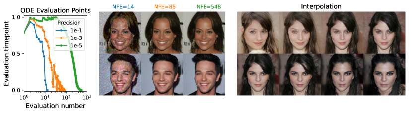

<figcaption>図3: 確率フロー ODE は、数値精度を変えることで適応的ステップサイズの高速サンプリングを可能にし（左）、品質を損なわずスコア関数評価回数（NFE）を減らす（中央）。潜在から画像への可逆写像は補間を可能にする（右）。</figcaption>
</figure>

### 4.4 Architecture improvements（アーキテクチャの改良）

我々は VE・VP SDE の両方を用いてスコアベースモデルのいくつかの新しいアーキテクチャ設計を探索した（詳細は付録 H）。そこでは SMLD/DDPM と同じ離散目的関数でモデルを学習する。VP SDE のアーキテクチャは類似性から sub-VP SDE へ直接転用する。VE SDE の最適アーキテクチャ（NCSN++ と命名）は PC サンプラーで CIFAR-10 上 FID 2.45 を達成し、VP SDE の最適アーキテクチャ（DDPM++）は 2.78 を達成する。

連続学習目的関数（式 7）に切り替えネットワーク深さを増やすことで、すべてのモデルのサンプル品質をさらに改善できる。結果のアーキテクチャを VE・VP/sub-VP SDE についてそれぞれ NCSN++ cont.・DDPM++ cont. と表 3 に表記する。表 3 の結果は学習中で最小 FID のチェックポイントで、サンプルは PC サンプラーで生成。対照的に表 2 の FID・NLL は最終チェックポイントで、サンプルは black-box ODE ソルバーで得る。表 3 が示すように、VE SDE は通常 VP/sub-VP SDE より良いサンプル品質を提供するが、尤度は VP/sub-VP SDE より悪いことも経験的に観察される。これは実務家が領域やアーキテクチャに応じて異なる SDE を試す必要があることを示す。

我々のサンプル品質の最良モデル NCSN++ cont. (deep, VE) はネットワーク深さを倍にし、CIFAR-10 の無条件生成で Inception score と FID の両方に新記録を打ち立てる。驚くべきことに、ラベルデータを必要とせず従来の最良の条件付き生成モデルより良い FID を達成できる。すべての改良を合わせ、スコアベースモデルから初めて CelebA-HQ $1024\times 1024$ の高精細サンプルも得る（第 H.3 節）。尤度の最良モデル DDPM++ cont. (deep, sub-VP) は同様に深さを倍にし、連続目的関数 式 7 で 2.99 bits/dim の対数尤度を達成する。我々の知る限り、これは一様逆量子化 CIFAR-10 での最高尤度である。

## 5 Controllable generation（可制御生成）

我々の枠組みの連続的構造により、$p_{0}$ からデータサンプルを生成するだけでなく、$p_{t}(\mathbf{y}\mid\mathbf{x}(t))$ が分かれば $p_{0}(\mathbf{x}(0)\mid\mathbf{y})$ からも生成できる。式 5 のような順方向 SDE が与えられたとき、$p_{T}(\mathbf{x}(T)\mid\mathbf{y})$ から始めて条件付き逆時間 SDE を解くことで $p_{t}(\mathbf{x}(t)\mid\mathbf{y})$ からサンプリングできる。

$$
\mathrm{d}\mathbf{x}=\{\mathbf{f}(\mathbf{x},t)-g(t)^{2}[\nabla_{\mathbf{x}}\log p_{t}(\mathbf{x})+\nabla_{\mathbf{x}}\log p_{t}(\mathbf{y}\mid\mathbf{x})]\}\mathrm{d}t+g(t)\mathrm{d}\bar{\mathbf{w}}. \tag{14}
$$

一般に、順過程の勾配 $\nabla_{\mathbf{x}}\log p_{t}(\mathbf{y}\mid\mathbf{x}(t))$ の推定が与えられれば、式 14 を用いてスコアベース生成モデルで広範な*逆問題（inverse problems）* を解ける。場合によっては別のモデルを学習して順過程 $\log p_{t}(\mathbf{y}\mid\mathbf{x}(t))$ を学び、その勾配を計算できる。そうでなければ、ヒューリスティックと領域知識で勾配を推定できる。第 I.4 節で、補助モデルの学習を必要とせずにそのような推定を得る広く適用可能な方法を提供する。

我々はこのアプローチの可制御生成の 3 つの応用を考える：クラス条件付き生成・画像補完（imputation）・着色（colorization）。$\mathbf{y}$ がクラスラベルを表すとき、クラス条件付きサンプリングのために時間依存分類器 $p_{t}(\mathbf{y}\mid\mathbf{x}(t))$ を学習できる。順方向 SDE は扱いやすいので、まずデータセットから $(\mathbf{x}(0),\mathbf{y})$ をサンプリングし次に $\mathbf{x}(t)\sim p_{0t}(\mathbf{x}(t)\mid\mathbf{x}(0))$ をサンプリングすることで、時間依存分類器の学習データ $(\mathbf{x}(t),\mathbf{y})$ を容易に作れる。その後、式 7 のように異なる時間ステップにわたる交差エントロピー損失の混合を用いて時間依存分類器 $p_{t}(\mathbf{y}\mid\mathbf{x}(t))$ を学習できる。クラス条件付き CIFAR-10 サンプルを図 4（左）に示し、詳細と結果は付録 I に委ねる。

補完（imputation）は条件付きサンプリングの特別な場合である。一部の部分集合 $\Omega(\mathbf{y})$ のみが既知の不完全データ点 $\mathbf{y}$ があるとする。補完は $p(\mathbf{x}(0)\mid\Omega(\mathbf{y}))$ からのサンプリングに相当し、無条件モデルを用いて達成できる（第 I.2 節）。着色は補完の特別な場合だが、既知のデータ次元が結合している点が異なる。これらのデータ次元を直交線形変換で分離し、変換空間で補完を実行できる（詳細は第 I.3 節）。図 4（右）は無条件の時間依存スコアベースモデルで達成した inpainting と着色の結果を示す。

<figure>

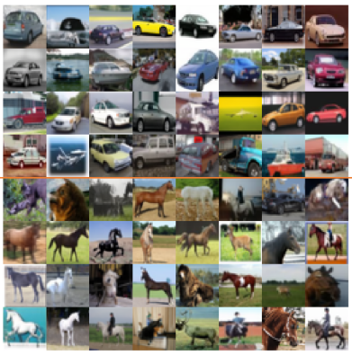

<figcaption>図4: 左: 32×32 CIFAR-10 のクラス条件付きサンプル。上 4 行は自動車、下 4 行は馬。右: 256×256 LSUN の inpainting（上 2 行）と着色（下 2 行）の結果。第 1 列は元画像、第 2 列はマスク／グレースケール画像、残りの列はサンプリングされた補完／着色。</figcaption>
</figure>

## 6 Conclusion（結論）

我々は SDE に基づくスコアベース生成モデリングの枠組みを提示した。本研究は既存アプローチのより良い理解、新しいサンプリングアルゴリズム、厳密な尤度計算、一意に識別可能なエンコーディング、潜在コード操作を可能にし、スコアベース生成モデルの族に新しい条件付き生成能力をもたらす。

我々の提案するサンプリングアプローチは結果を改善しより効率的なサンプリングを可能にするが、同じデータセット上で GAN よりサンプリングが遅いままである。スコアベース生成モデルの安定した学習と GAN のような暗黙モデルの高速サンプリングを組み合わせる方法を見つけることは、重要な研究方向のままである。加えて、スコア関数へのアクセスがあるときに使えるサンプラーの幅広さは多数のハイパーパラメータを導入する。今後の研究は、これらのハイパーパラメータを自動的に選択・調整する改良手法や、さまざまなサンプラーの利点と限界のより広範な調査から恩恵を受けるだろう。

## Appendix A The framework for more general SDEs（より一般的な SDE のための枠組み）

本文では拡散係数が $\mathbf{x}(t)$ に依存しない簡略化された SDE 式 5 に基づいて枠組みを導入した。我々の枠組みはより一般的な拡散係数にも成り立つよう拡張できる。次の形の SDE を考える。

$$
\mathrm{d}\mathbf{x}=\mathbf{f}(\mathbf{x},t)\mathrm{d}t+\mathbf{G}(\mathbf{x},t)\mathrm{d}\mathbf{w}, \tag{15}
$$

ここで $\mathbf{f}(\cdot,t):\mathbb{R}^{d}\to\mathbb{R}^{d}$、$\mathbf{G}(\cdot,t):\mathbb{R}^{d}\to\mathbb{R}^{d\times d}$。本論文を通じて SDE の伊藤解釈に従う。

Anderson によれば、逆時間 SDE は（式 6 に対応して）次で与えられる。

$$
\mathrm{d}\mathbf{x}=\{\mathbf{f}(\mathbf{x},t)-\nabla\cdot[\mathbf{G}(\mathbf{x},t)\mathbf{G}(\mathbf{x},t)^{\mathsf{T}}]-\mathbf{G}(\mathbf{x},t)\mathbf{G}(\mathbf{x},t)^{\mathsf{T}}\nabla_{\mathbf{x}}\log p_{t}(\mathbf{x})\}\mathrm{d}t+\mathbf{G}(\mathbf{x},t)\mathrm{d}\bar{\mathbf{w}}, \tag{16}
$$

ここで行列値関数 $\mathbf{F}(\mathbf{x}):=(\mathbf{f}^{1}(\mathbf{x}),\cdots,\mathbf{f}^{d}(\mathbf{x}))^{\mathsf{T}}$ に対し $\nabla\cdot\mathbf{F}(\mathbf{x}):=(\nabla\cdot\mathbf{f}^{1}(\mathbf{x}),\cdots,\nabla\cdot\mathbf{f}^{d}(\mathbf{x}))^{\mathsf{T}}$ と定義する。

式 15 に対応する確率フロー ODE は次の形を持つ（式 13 に対応、詳細な導出は第 D.1 節）。

$$
\mathrm{d}\mathbf{x}=\bigg{\{}\mathbf{f}(\mathbf{x},t)-\frac{1}{2}\nabla\cdot[\mathbf{G}(\mathbf{x},t)\mathbf{G}(\mathbf{x},t)^{\mathsf{T}}]-\frac{1}{2}\mathbf{G}(\mathbf{x},t)\mathbf{G}(\mathbf{x},t)^{\mathsf{T}}\nabla_{\mathbf{x}}\log p_{t}(\mathbf{x})\bigg{\}}\mathrm{d}t. \tag{17}
$$

最後に、一般 SDE 式 15 での条件付き生成については、次の条件付き逆時間 SDE を解ける（式 14 に対応、詳細は付録 I）。

$$
\begin{aligned}
\mathrm{d}\mathbf{x}=\{\mathbf{f}(\mathbf{x},t)-\nabla\cdot[\mathbf{G}\mathbf{G}^{\mathsf{T}}]-\mathbf{G}\mathbf{G}^{\mathsf{T}}\nabla_{\mathbf{x}}\log p_{t}(\mathbf{x})-\mathbf{G}\mathbf{G}^{\mathsf{T}}\nabla_{\mathbf{x}}\log p_{t}(\mathbf{y}\mid\mathbf{x})\}\mathrm{d}t+\mathbf{G}\mathrm{d}\bar{\mathbf{w}}.
\end{aligned}
$$

SDE のドリフト・拡散係数がアフィンでないとき、遷移カーネル $p_{0t}(\mathbf{x}(t)\mid\mathbf{x}(0))$ を閉形式で計算するのは難しい。これはスコアベースモデルの学習を妨げる（式 7 が $\nabla_{\mathbf{x}(t)}\log p_{0t}(\mathbf{x}(t)\mid\mathbf{x}(0))$ を知る必要があるため）。この困難を克服するため、式 7 のノイズ除去スコアマッチングを、$\nabla_{\mathbf{x}(t)}\log p_{0t}$ の計算を必要としない効率的なスコアマッチングの変種で置き換えられる。例えば sliced score matching を用いると、学習目的関数 式 7 は次になる。

$$
{\boldsymbol{\theta}}^{*}=\operatorname*{arg\,min}_{\boldsymbol{\theta}}\mathbb{E}_{t}\bigg{\{}\lambda(t)\mathbb{E}_{\mathbf{x}(0)}\mathbb{E}_{\mathbf{x}(t)}\mathbb{E}_{\mathbf{v}\sim p_{\mathbf{v}}}\bigg{[}\frac{1}{2}\left\lVert\mathbf{s}_{\boldsymbol{\theta}}(\mathbf{x}(t),t)\right\rVert_{2}^{2}+\mathbf{v}^{\mathsf{T}}\nabla\mathbf{s}_{\boldsymbol{\theta}}(\mathbf{x}(t),t)\mathbf{v}\bigg{]}\bigg{\}}, \tag{19}
$$

ここで $\lambda:[0,T]\to\mathbb{R}^{+}$ は正の重み関数、$t\sim\mathcal{U}(0,T)$、$\mathbb{E}[\mathbf{v}]=\mathbf{0}$、$\operatorname{Cov}[\mathbf{v}]=\mathbf{I}$。常に SDE をシミュレートして $p_{0t}(\mathbf{x}(t)\mid\mathbf{x}(0))$ からサンプリングし、式 19 を解いて時間依存スコアベースモデルを学習できる。

## Appendix B VE, VP and sub-VP SDEs（VE・VP・sub-VP SDE）

以下、SMLD と DDPM のノイズ摂動がそれぞれ VE・VP SDE の離散化であることを示す詳細な導出を提供する。加えて、VP SDE の修正で多くの場合サンプル品質と尤度の両方で良い性能を達成する sub-VP SDE を導入する。

まず、合計 $N$ 個のノイズスケールを用いるとき、SMLD の各摂動カーネル $p_{\sigma_{i}}(\mathbf{x}\mid\mathbf{x}_{0})$ は次のマルコフ連鎖（式 20、本文 式 8 と同じ）から導ける。$N\to\infty$ の極限でこれは連続確率過程になり、$\Delta t=\frac{1}{N}$、$t\in\{0,\frac{1}{N},\cdots,\frac{N-1}{N}\}$ として

$$
\mathbf{x}(t+\Delta t)=\mathbf{x}(t)+\sqrt{\sigma^{2}(t+\Delta t)-\sigma^{2}(t)}~{}\mathbf{z}(t)\approx\mathbf{x}(t)+\sqrt{\frac{\mathrm{d}[\sigma^{2}(t)]}{\mathrm{d}t}\Delta t}~{}\mathbf{z}(t)
$$

と書け、$\Delta t\to 0$ の極限で VE SDE（式 9）$\mathrm{d}\mathbf{x}=\sqrt{\mathrm{d}[\sigma^{2}(t)]/\mathrm{d}t}\,\mathrm{d}\mathbf{w}$ に収束する。

DDPM の摂動カーネルについては、離散マルコフ連鎖（式 22、本文 式 10 と同じ）に対し補助ノイズスケール $\{\bar{\beta}_{i}=N\beta_{i}\}_{i=1}^{N}$ を定義して書き換え、$N\to\infty$ で $\{\bar{\beta}_{i}\}$ が関数 $\beta(t)$ になる。テイラー展開（$\sqrt{1-\beta(t+\Delta t)\Delta t}\approx 1-\frac{1}{2}\beta(t)\Delta t$）により、$\Delta t\to 0$ で VP SDE（式 11）$\mathrm{d}\mathbf{x}=-\frac{1}{2}\beta(t)\mathbf{x}\,\mathrm{d}t+\sqrt{\beta(t)}\,\mathrm{d}\mathbf{w}$ に収束する。

VE SDE は $t\to\infty$ で常に分散爆発する過程を与える。対照的に VP SDE は有界な分散を持つ過程を与え、$p(\mathbf{x}(0))$ が単位分散なら全 $t\in[0,\infty)$ で一定の単位分散を持つ。VP SDE はアフィンなドリフト・拡散係数を持つので、分散の発展を支配する ODE を得られる。

$$
\frac{\mathrm{d}\mathbf{\Sigma}_{\text{VP}}(t)}{\mathrm{d}t}=\beta(t)(\mathbf{I}-\mathbf{\Sigma}_{\text{VP}}(t)),\qquad \mathbf{\Sigma}_{\text{VP}}(t)=\mathbf{I}+e^{\int_{0}^{t}-\beta(s)\mathrm{d}s}(\mathbf{\Sigma}_{\text{VP}}(0)-\mathbf{I}),
$$

から分散 $\mathbf{\Sigma}_{\text{VP}}(t)$ が常に有界であり、$\mathbf{\Sigma}_{\text{VP}}(0)=\mathbf{I}$ なら $\mathbf{\Sigma}_{\text{VP}}(t)\equiv\mathbf{I}$ であることが明らかになる。この違いから 式 9 を VE SDE、式 11 を VP SDE と名付ける。

VP SDE に着想を得て、sub-VP SDE（式 12）$\mathrm{d}\mathbf{x}=-\frac{1}{2}\beta(t)\mathbf{x}\,\mathrm{d}t+\sqrt{\beta(t)(1-e^{-2\int_{0}^{t}\beta(s)\mathrm{d}s})}\,\mathrm{d}\mathbf{w}$ を提案する。標準的な導出から $\mathbb{E}[\mathbf{x}(t)]$ は VP と sub-VP SDE で同じであり、sub-VP の分散関数は

$$
\mathbf{\Sigma}_{\text{sub-VP}}(t)=\mathbf{I}+e^{-2\int_{0}^{t}\beta(s)\mathrm{d}s}\mathbf{I}+e^{-\int_{0}^{t}\beta(s)\mathrm{d}s}(\mathbf{\Sigma}_{\text{sub-VP}}(0)-2\mathbf{I})
$$

で与えられる。(i) 共有 $\beta(s)$ と $\mathbf{\Sigma}_{\text{sub-VP}}(0)=\mathbf{\Sigma}_{\text{VP}}(0)$ の下、全 $t\geq 0$ で $\mathbf{\Sigma}_{\text{sub-VP}}(t)\preccurlyeq\mathbf{\Sigma}_{\text{VP}}(t)$、(ii) $\lim_{t\to\infty}\int_{0}^{t}\beta(s)\mathrm{d}s=\infty$ なら $\lim_{t\to\infty}\mathbf{\Sigma}_{\text{sub-VP}}(t)=\lim_{t\to\infty}\mathbf{\Sigma}_{\text{VP}}(t)=\mathbf{I}$。前者が sub-VP（分散が常に対応 VP に上から押さえられる）という命名の理由で、後者は sub-VP SDE がスコアベース生成モデリングに使える正当化になる。

VE・VP・sub-VP SDE はすべてアフィンなドリフト係数を持つので、摂動カーネル $p_{0t}(\mathbf{x}(t)\mid\mathbf{x}(0))$ はすべてガウスである。

$$
p_{0t}(\mathbf{x}(t)\mid\mathbf{x}(0))=\begin{cases}\mathcal{N}\big{(}\mathbf{x}(t);\mathbf{x}(0),[\sigma^{2}(t)-\sigma^{2}(0)]\mathbf{I}\big{)},&\text{(VE)}\\
\mathcal{N}\big{(}\mathbf{x}(t);\mathbf{x}(0)e^{-\frac{1}{2}\int_{0}^{t}\beta(s)\mathrm{d}s},\mathbf{I}-\mathbf{I}e^{-\int_{0}^{t}\beta(s)\mathrm{d}s}\big{)}&\text{(VP)}\\
\mathcal{N}\big{(}\mathbf{x}(t);\mathbf{x}(0)e^{-\frac{1}{2}\int_{0}^{t}\beta(s)\mathrm{d}s},[1-e^{-\int_{0}^{t}\beta(s)\mathrm{d}s}]^{2}\mathbf{I}\big{)}&\text{(sub-VP)}\end{cases}. \tag{29}
$$

結果として、ここで導入した全 SDE は 式 7 で効率的に学習できる。

## Appendix C SDEs in the wild（実際の SDE）

以下、その離散化が SMLD・DDPM モデルを生む VE・VP SDE の具体的なインスタンス、ならびに実験で用いた特定の sub-VP SDE を議論する。SMLD では、ノイズスケール $\{\sigma_{i}\}$ は通常等比数列で、$\sigma_{\text{min}}=0.01$ に固定し $\sigma_{\text{max}}$ は技法に従って選ぶ。$N\to\infty$ で $\sigma(t)=\sigma_{\text{min}}(\sigma_{\text{max}}/\sigma_{\text{min}})^{t}$（$t\in(0,1]$）。対応する VE SDE は

$$
\mathrm{d}\mathbf{x}=\sigma_{\text{min}}\bigg{(}\frac{\sigma_{\text{max}}}{\sigma_{\text{min}}}\bigg{)}^{t}\sqrt{2\log\frac{\sigma_{\text{max}}}{\sigma_{\text{min}}}}\mathrm{d}\mathbf{w},\quad t\in(0,1],
$$

で、摂動カーネルは $p_{0t}(\mathbf{x}(t)\mid\mathbf{x}(0))=\mathcal{N}(\mathbf{x}(t);\mathbf{x}(0),\sigma_{\text{min}}^{2}(\sigma_{\text{max}}/\sigma_{\text{min}})^{2t}\mathbf{I})$。$t=0$ には微妙な点がある：$\sigma(0)=0$ だが $\sigma(0^{+})=\sigma_{\text{min}}\neq 0$ なので $\sigma(t)$ は微分不可能。実際には常に $t\in[\epsilon,1]$（$\epsilon=10^{-5}$）の範囲で SDE と確率フロー ODE を解いてこの問題を回避する。

DDPM では $\{\beta_{i}\}$ は通常等差数列で、$N\to\infty$ で $\beta(t)=\bar{\beta}_{\text{min}}+t(\bar{\beta}_{\text{max}}-\bar{\beta}_{\text{min}})$（$t\in[0,1]$）。これは VP SDE のインスタンスに対応し、実験では $\bar{\beta}_{\text{min}}=0.1$、$\bar{\beta}_{\text{max}}=20$。摂動カーネルは

$$
p_{0t}(\mathbf{x}(t)\mid\mathbf{x}(0))=\mathcal{N}\left(\mathbf{x}(t);e^{-\frac{1}{4}t^{2}(\bar{\beta}_{\text{max}}-\bar{\beta}_{\text{min}})-\frac{1}{2}t\bar{\beta}_{\text{min}}}\mathbf{x}(0),\mathbf{I}-\mathbf{I}e^{-\frac{1}{2}t^{2}(\bar{\beta}_{\text{max}}-\bar{\beta}_{\text{min}})-t\bar{\beta}_{\text{min}}}\right).
$$

DDPM では VP SDE に不連続性の問題はないが、$t\to 0$ で $\mathbf{x}(t)$ の分散が消えるため学習・サンプリングに数値不安定性があり、同様に $t\in[\epsilon,1]$ に計算を制限する（サンプリングは $\epsilon=10^{-3}$、学習・尤度計算は $\epsilon=10^{-5}$）。

<figure>

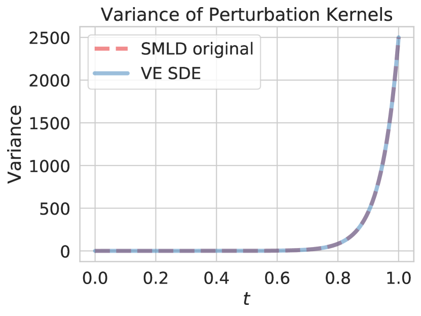

<figcaption>図5 (a) SMLD: 我々の SDE 一般化の健全性チェックとして、SDE と元の離散マルコフ連鎖の摂動カーネルを比較。N=1000 ノイズスケールで、元の SMLD・DDPM の離散摂動カーネルは VE・VP SDE から導いた摂動カーネルとよく一致する。</figcaption>
</figure>

sub-VP SDE には VP SDE とまったく同じ $\beta(t)$ を用い、摂動カーネルは平均が VP と同じで分散が $[1-e^{-\frac{1}{2}t^{2}(\bar{\beta}_{\text{max}}-\bar{\beta}_{\text{min}})-t\bar{\beta}_{\text{min}}}]^{2}\mathbf{I}$ となる。経験的に、すべての SDE で小さい $\epsilon$ ほど良い尤度を与える。サンプリングでは適切な $\epsilon$ を使うことが Inception score・FID に重要だが、異なる $\epsilon$ のサンプルは人間の目には同じに見える。

## Appendix D Probability flow ODE（確率フロー ODE）

### D.1 Derivation（導出）

確率フロー ODE のアイデアは Maoutsa らに着想を得ている。式 17 の完全に一般的な ODE の導出を以下に提供する。一般 SDE 式 15 を考える。周辺確率密度 $p_{t}(\mathbf{x}(t))$ は Kolmogorov の前進方程式（Fokker-Planck 方程式）に従って発展する。

$$
\frac{\partial p_{t}(\mathbf{x})}{\partial t}=-\sum_{i}\frac{\partial}{\partial x_{i}}[f_{i}(\mathbf{x},t)p_{t}(\mathbf{x})]+\frac{1}{2}\sum_{i,j}\frac{\partial^{2}}{\partial x_{i}\partial x_{j}}\Big{[}\sum_{k}G_{ik}G_{jk}p_{t}(\mathbf{x})\Big{]}.
$$

これを書き換え（中間の偏微分の積を整理し）、

$$
\sum_{j}\frac{\partial}{\partial x_{j}}\Big{[}\sum_{k}G_{ik}G_{jk}p_{t}(\mathbf{x})\Big{]}=p_{t}(\mathbf{x})\nabla\cdot[\mathbf{G}\mathbf{G}^{\mathsf{T}}]+p_{t}(\mathbf{x})\mathbf{G}\mathbf{G}^{\mathsf{T}}\nabla_{\mathbf{x}}\log p_{t}(\mathbf{x})
$$

を用いると、前進方程式は次の形に整理できる。

$$
\frac{\partial p_{t}(\mathbf{x})}{\partial t}=-\sum_{i}\frac{\partial}{\partial x_{i}}[\tilde{f}_{i}(\mathbf{x},t)p_{t}(\mathbf{x})],\quad
\tilde{\mathbf{f}}(\mathbf{x},t)\coloneqq\mathbf{f}(\mathbf{x},t)-\frac{1}{2}\nabla\cdot[\mathbf{G}\mathbf{G}^{\mathsf{T}}]-\frac{1}{2}\mathbf{G}\mathbf{G}^{\mathsf{T}}\nabla_{\mathbf{x}}\log p_{t}(\mathbf{x}).
$$

これは拡散項 $\tilde{\mathbf{G}}\coloneqq\mathbf{0}$ を持つ SDE の Kolmogorov 前進方程式（この場合 Liouville 方程式）に等しい。すなわち本質的に ODE $\mathrm{d}\mathbf{x}=\tilde{\mathbf{f}}(\mathbf{x},t)\mathrm{d}t$（式 17 の確率フロー ODE）である。したがって、確率フロー ODE 式 17 は SDE 式 15 と同じ周辺確率密度 $p_{t}(\mathbf{x})$ を誘導することを示した。

### D.2 Likelihood computation（尤度計算）

スコア $\nabla_{\mathbf{x}}\log p_{t}(\mathbf{x})$ を時間依存スコアベースモデル $\mathbf{s}_{\boldsymbol{\theta}}(\mathbf{x},t)$ で置き換えた確率フロー ODE $\mathrm{d}\mathbf{x}=\tilde{\mathbf{f}}_{\boldsymbol{\theta}}(\mathbf{x},t)\mathrm{d}t$ に対し、瞬間変数変換公式により $p_{0}(\mathbf{x})$ の対数尤度を計算できる。

$$
\log p_{0}(\mathbf{x}(0))=\log p_{T}(\mathbf{x}(T))+\int_{0}^{T}\nabla\cdot\tilde{\mathbf{f}}_{\boldsymbol{\theta}}(\mathbf{x}(t),t)\mathrm{d}t.
$$

$\nabla\cdot\tilde{\mathbf{f}}_{\boldsymbol{\theta}}$ の計算は高価なので、Skilling-Hutchinson トレース推定量で推定する：$\nabla\cdot\tilde{\mathbf{f}}_{\boldsymbol{\theta}}(\mathbf{x},t)=\mathbb{E}_{p({\boldsymbol{\epsilon}})}[{\boldsymbol{\epsilon}}^{\mathsf{T}}\nabla\tilde{\mathbf{f}}_{\boldsymbol{\theta}}(\mathbf{x},t){\boldsymbol{\epsilon}}]$（$\mathbb{E}[{\boldsymbol{\epsilon}}]=\mathbf{0}$, $\operatorname{Cov}[{\boldsymbol{\epsilon}}]=\mathbf{I}$）。ベクトル・ヤコビアン積は逆モード自動微分で効率的に計算できる。不偏推定量なので十分な回数の平均で任意に小さい誤差を達成でき、対数尤度を任意精度で計算できる。実験では `scipy.integrate.solve_ivp` の RK45 ODE ソルバー（`atol=rtol=1e-5`）を用い、表 2 の bits/dim はテストデータで $\epsilon=10^{-5}$ の 5 回平均で報告する。

### D.3 Probability flow sampling（確率フローサンプリング）

順方向 SDE の離散化 $\mathbf{x}_{i+1}=\mathbf{x}_{i}+\mathbf{f}_{i}(\mathbf{x}_{i})+\mathbf{G}_{i}\mathbf{z}_{i}$ が与えられたとき、確率フロー ODE 式 17 から、同様の関数形の離散化を提案する。

$$
\mathbf{x}_{i}=\mathbf{x}_{i+1}-\mathbf{f}_{i+1}(\mathbf{x}_{i+1})+\frac{1}{2}\mathbf{G}_{i+1}\mathbf{G}_{i+1}^{\mathsf{T}}\mathbf{s}_{{\boldsymbol{\theta}}^{*}}(\mathbf{x}_{i+1},i+1),\quad i=0,\cdots,N-1,
$$

これは決定論的な反復規則で、逆拡散サンプラーや祖先的サンプリングと異なり、初期サンプル $\mathbf{x}_{N}$ が得られた後は追加のランダム性がない。SMLD モデルでは $\mathbf{x}_{i}=\mathbf{x}_{i+1}+\frac{1}{2}(\sigma_{i+1}^{2}-\sigma_{i}^{2})\mathbf{s}_{{\boldsymbol{\theta}}^{*}}(\mathbf{x}_{i+1},\sigma_{i+1})$、DDPM モデルでは $\mathbf{x}_{i}=(2-\sqrt{1-\beta_{i+1}})\mathbf{x}_{i+1}+\frac{1}{2}\beta_{i+1}\mathbf{s}_{{\boldsymbol{\theta}}^{*}}(\mathbf{x}_{i+1},i+1)$ という反復規則が得られる。

### D.4 Sampling with black-box ODE solvers（black-box ODE ソルバーによるサンプリング）

図 3 の生成には $256\times 256$ CelebA-HQ で学習した DDPM モデルを用いる。表 2 の全 FID は `scipy.integrate.solve_ivp` の RK45 ODE ソルバー（`atol=rtol=1e-5`）のサンプルで計算（VE は $\epsilon=10^{-5}$、VP は $\epsilon=10^{-3}$）。

<figure>

<figcaption>図6: 256×256 CelebA-HQ での VP SDE の確率フロー ODE からのサンプル。上: ランダムサンプル間の球面補間。下: 温度再スケーリング（埋め込みのノルムの縮小）。</figcaption>
</figure>

確率フロー ODE のソルバーは高速サンプリングを可能にするが、corrector を使わないと通常 SDE ソルバーより FID が悪い（高い）。これは第 D.3 節の離散化戦略と black-box ODE ソルバーの両方で観察される。さらに確率フロー ODE サンプラーの性能は SDE の選択に依存し、特に高次元データで VE SDE のサンプル品質は VP SDE よりずっと悪い。

### D.5 Uniquely identifiable encoding（一意に識別可能なエンコーディング）

<figure>

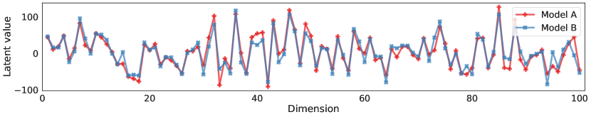

<figcaption>図7: ランダムな CIFAR-10 画像について得られた潜在コードの最初の 100 次元の比較。「Model A」「Model B」は異なるアーキテクチャで別々に学習。</figcaption>
</figure>

<figure>

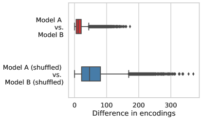

<figcaption>図8: 左: Model A と B のエンコーディングの次元ごとの差。ベースラインとしてシャッフルした表現の差も報告。右: Model A と B のエンコーディングの次元ごとの相関係数。</figcaption>
</figure>

健全性チェックとして、VE SDE で CIFAR-10 上に異なるアーキテクチャの 2 モデル（A: 4 層/解像度、B: 8 層/解像度）を学習。図 7・8 に示すように、同じ入力に対して Model A と B は、異なるアーキテクチャと学習実行にもかかわらず、すべての次元で近いエンコーディングを与える。

## Appendix E Reverse diffusion sampling（逆拡散サンプリング）

順方向 SDE の離散化 $\mathbf{x}_{i+1}=\mathbf{x}_{i}+\mathbf{f}_{i}(\mathbf{x}_{i})+\mathbf{G}_{i}\mathbf{z}_{i}$ が与えられたとき、逆時間 SDE 式 16 を同様の関数形で離散化することを提案する。

$$
\mathbf{x}_{i}=\mathbf{x}_{i+1}-\mathbf{f}_{i+1}(\mathbf{x}_{i+1})+\mathbf{G}_{i+1}\mathbf{G}_{i+1}^{\mathsf{T}}\mathbf{s}_{{\boldsymbol{\theta}}^{*}}(\mathbf{x}_{i+1},i+1)+\mathbf{G}_{i+1}\mathbf{z}_{i+1}.
$$

これを VE・VP SDE に適用すると、逆時間 SDE の新しい数値ソルバー群（アルゴリズム 2・3 の predictor 部分）が得られる。これを*逆拡散サンプラー*と名付ける。テイラー展開による導出から、DDPM の祖先的サンプリング（式 4）は $\beta_{i}\to 0$ のとき逆拡散版に一致することが示せる（$(2-\sqrt{1-\beta_{i+1}})\mathbf{x}_{i+1}+\beta_{i+1}\mathbf{s}_{{\boldsymbol{\theta}}^{*}}+\sqrt{\beta_{i+1}}\mathbf{z}_{i+1}$ に帰着）。したがって元の祖先的サンプラーは同じ逆時間 SDE への異なる離散化にすぎず、DDPM のサンプリング手法を連続枠組みの逆時間 VP SDE の数値ソルバーとして統一する。

## Appendix F Ancestral sampling for SMLD models（SMLD モデルの祖先的サンプリング）

DDPM の祖先的サンプリングは SMLD モデルにも適応できる。ノイズスケール列 $\sigma_{1}<\cdots<\sigma_{N}$ で $p(\mathbf{x}_{i}\mid\mathbf{x}_{i-1})=\mathcal{N}(\mathbf{x}_{i};\mathbf{x}_{i-1},(\sigma_{i}^{2}-\sigma_{i-1}^{2})\mathbf{I})$ のマルコフ連鎖を考え、DDPM に従って $q(\mathbf{x}_{i-1}\mid\mathbf{x}_{i},\mathbf{x}_{0})$ を計算し、逆遷移カーネルをパラメータ化して ELBO を整理すると、${\boldsymbol{\mu}}_{\boldsymbol{\theta}}(\mathbf{x}_{i},i)=\mathbf{x}_{i}+(\sigma_{i}^{2}-\sigma_{i-1}^{2})\mathbf{s}_{\boldsymbol{\theta}}(\mathbf{x}_{i},i)$ とパラメータ化でき、次の祖先的サンプリング反復規則が得られる。

$$
\mathbf{x}_{i-1}=\mathbf{x}_{i}+(\sigma_{i}^{2}-\sigma_{i-1}^{2})\mathbf{s}_{{\boldsymbol{\theta}}^{*}}(\mathbf{x}_{i},i)+\sqrt{\frac{\sigma_{i-1}^{2}(\sigma_{i}^{2}-\sigma_{i-1}^{2})}{\sigma_{i}^{2}}}\mathbf{z}_{i},\quad i=1,\cdots,N,
$$

ここで $\mathbf{x}_{N}\sim\mathcal{N}(\mathbf{0},\sigma_{N}^{2}\mathbf{I})$。これを SMLD モデルの祖先的サンプリング法と呼ぶ。

## Appendix G Predictor-Corrector samplers（Predictor-Corrector サンプラー）

**アルゴリズム 1 Predictor-Corrector（PC）サンプリング**（$N$: 逆時間 SDE の離散化ステップ数、$M$: corrector ステップ数）

1. $\mathbf{x}_{N}\sim p_{T}(\mathbf{x})$ で初期化
2. **for** $i=N-1$ to $0$ **do**
3. $\quad\mathbf{x}_{i}\leftarrow\operatorname{Predictor}(\mathbf{x}_{i+1})$
4. $\quad$**for** $j=1$ to $M$ **do**：$\mathbf{x}_{i}\leftarrow\operatorname{Corrector}(\mathbf{x}_{i})$
5. **return** $\mathbf{x}_{0}$

predictor は固定離散化戦略の逆時間 SDE の任意の数値ソルバー、corrector は任意のスコアベース MCMC アプローチでよい。PC サンプリングでは predictor と corrector を交互に適用する。例えば逆拡散 SDE ソルバー（付録 E）を predictor、アニーリング・ランジュバン動力学を corrector とすると、VE・VP SDE についてアルゴリズム 2・3 が得られる。

<figure>

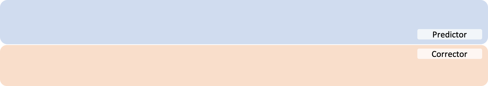

<figcaption>アルゴリズム 2・3: PC サンプリング（VE SDE / VP SDE）の擬似コード。各ノイズスケールで predictor（逆拡散）ステップの後、M 回の corrector（ランジュバン）ステップを実行する。</figcaption>
</figure>

**corrector アルゴリズム**：Song & Ermon のアニーリング・ランジュバン動力学のスケジュールを、解釈性と性能のため僅かに修正して用いる。$r$ を「信号対雑音比（signal-to-noise ratio）」と呼ぶ。ステップサイズ $\epsilon$ はガウスノイズのノルム $\lVert\mathbf{z}\rVert_{2}$、スコアモデルのノルム $\lVert\mathbf{s}_{{\boldsymbol{\theta}}^{*}}\rVert_{2}$、$r$ から決める。

**アルゴリズム 4 corrector（VE SDE）**：$i\leftarrow N$ to $1$、$j\leftarrow 1$ to $M$ について、$\mathbf{z}\sim\mathcal{N}(\mathbf{0},\mathbf{I})$、$\mathbf{g}\leftarrow\mathbf{s}_{{\boldsymbol{\theta}}^{*}}(\mathbf{x}_{i}^{j-1},\sigma_{i})$、$\epsilon\leftarrow 2(r\lVert\mathbf{z}\rVert_{2}/\lVert\mathbf{g}\rVert_{2})^{2}$、$\mathbf{x}_{i}^{j}\leftarrow\mathbf{x}_{i}^{j-1}+\epsilon\mathbf{g}+\sqrt{2\epsilon}\mathbf{z}$。

**アルゴリズム 5 corrector（VP SDE）**：VE と同様だが $\epsilon\leftarrow 2\alpha_{i}(r\lVert\mathbf{z}\rVert_{2}/\lVert\mathbf{g}\rVert_{2})^{2}$。

**ノイズ除去（Denoising）**：SMLD・DDPM とも生成サンプルには人間が検出しにくい微小ノイズが含まれ、これを除去しないと FID が大幅に悪化しうる。本論文の全実験で、サンプリングの最後に Tweedie の公式を用いた単一のノイズ除去ステップを必ず行う。

<figure>

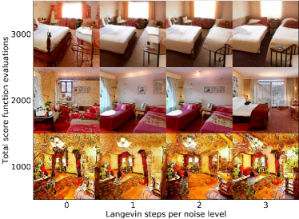

<figcaption>図9: LSUN bedroom・church の PC サンプリング。縦軸は総計算量、横軸は corrector に割り当てた計算量。計算を predictor と corrector に分けるとサンプルが最良になる。</figcaption>
</figure>

**ノイズスケール間の補間（ad-hoc 法）**：全モデルは 1000 ノイズスケールで学習。P2000（2000 ステップ）には 2000 ノイズスケールが要り、テスト時に補間する。正弦波位置埋め込みを用いる DDPM のアーキテクチャは補間が可能。SMLD では $\sigma_{\text{min}}$・$\sigma_{\text{max}}$ を固定しステップ数を倍に、DDPM では $\beta_{\text{min}}$・$\beta_{\text{max}}$ を半分にしてからステップ数を倍にする。線形補間と丸め補間の 2 方式をテストし、表 1（線形）・表 4（丸め）に結果を示す。補間方式で性能差はあるが、PC 法が predictor のみ・corrector のみと同等以上という傾向は保たれる。

**サンプラーのハイパーパラメータ**：CIFAR-10 では最良の $r$ を 0.01 刻みで探索し表 5 に報告。LSUN では $r=0.075$ に固定。特記なき限り PC サンプラーはノイズスケールあたり 1 corrector ステップを用いる。

**表4**: CIFAR-10 の異なるサンプラーの比較（「P2000」はノイズスケール間の丸め補間を用いる）。数値は FID↓。

| サンプラー | VE P1000 | P2000 | C2000 | PC1000 | VP P1000 | P2000 | C2000 | PC1000 |
| --- | --- | --- | --- | --- | --- | --- | --- | --- |
| ancestral sampling | 4.98±.06 | 4.92±.02 | – | 3.62±.03 | 3.24±.02 | 3.11±.03 | – | 3.21±.02 |
| reverse diffusion | 4.79±.07 | 4.72±.07 | – | 3.60±.02 | 3.21±.02 | 3.10±.03 | – | 3.18±.01 |
| probability flow | 15.41±.15 | 12.87±.09 | 20.43±.07 | 3.51±.04 | 3.59±.04 | 3.25±.04 | 19.06±.06 | 3.06±.03 |

**表5**: 異なるサンプラーの最適信号対雑音比 $r$（corrector を用いる C2000・PC1000 列に適用）。

| サンプラー | VE C2000 | VE PC1000 | VP C2000 | VP PC1000 |
| --- | --- | --- | --- | --- |
| ancestral sampling | – | 0.17 | – | 0.01 |
| reverse diffusion | – | 0.16 | – | 0.01 |
| probability flow | 0.22 | 0.17 | 0.27 | 0.04 |

**学習**：スコアベースモデルには DDPM と同じアーキテクチャを用いる。VE SDE は元の SMLD 目的（式 1）、VP SDE は元の DDPM 目的（式 3）で、両モデルとも 1000 ノイズスケールで学習。図 9 には VE SDE と連続目的 式 7 で $256\times 256$ LSUN bedroom・church 上に NCSN++ を学習。バッチサイズは CIFAR-10 で 128、LSUN で 64。

## Appendix H Architecture improvements（アーキテクチャの改良）

VE・VP SDE の両方でスコアベースモデルを改善するいくつかのアーキテクチャ設計を探索した。これにより CIFAR-10 で新たな最先端サンプル品質、一様逆量子化 CIFAR-10 で新たな最先端尤度を達成し、スコアベース生成モデルから初の $1024\times 1024$ 高精細画像サンプルを可能にした。コードとチェックポイントは公開されている。

### H.1 Settings for architecture exploration（アーキテクチャ探索の設定）

特記なき限り全モデルを 1.3M イテレーション学習し、50k ごとにチェックポイントを保存。VE SDE では $32\times 32$ CIFAR-10 と $64\times 64$ CelebA を、VP SDE では計算節約のため CIFAR-10 のみを使う。全 FID は 50k サンプルで計算。サンプリングは 1000 ステップに離散化した PC サンプラー、predictor は逆拡散を選ぶ。VE SDE では predictor 更新あたり 1 corrector ステップ（$r=0.16$）、VP SDE は corrector を省く。

<figure>

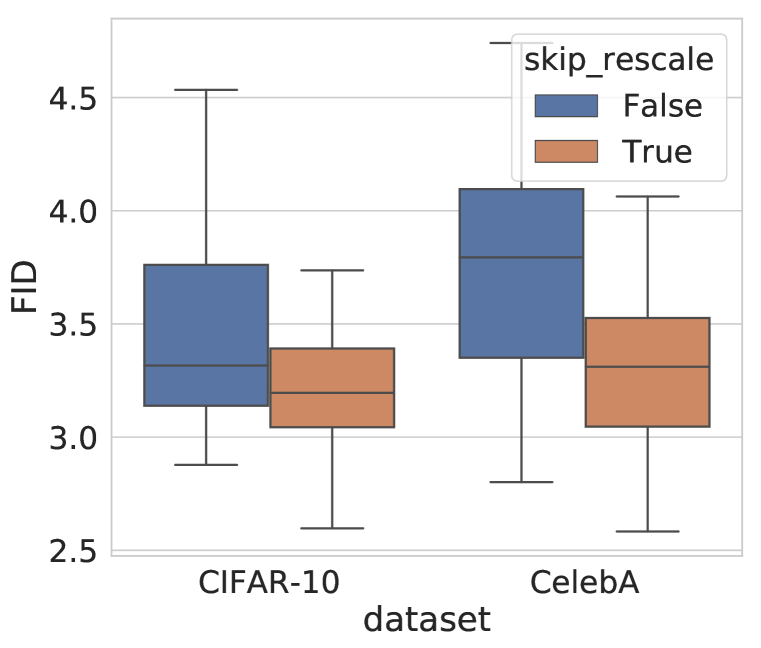

<figcaption>図10: VE 摂動で学習したスコアベースモデルの異なるアーキテクチャ要素の効果。</figcaption>
</figure>

アーキテクチャは主に DDPM に基づき、改善の潜在力を最大化するため次の要素を導入する：(1) FIR（Finite Impulse Response）に基づくアンチエイリアス付きのアップ／ダウンサンプリング（StyleGAN-2 に従う）、(2) 全スキップ接続を $1/\sqrt{2}$ で再スケール、(3) DDPM の残差ブロックを BigGAN の残差ブロックで置換、(4) 解像度あたりの残差ブロック数を 2 から 4 へ増加、(5) progressive growing アーキテクチャ（input/output に「skip」「residual」）の組み込み。equalized learning rate も試したが初期段階で有害と分かり、これ以上探索しなかった。EMA（指数移動平均）率は性能に大きく影響し、VE では 0.999、VP では 0.9999 を用いる。

<figure>

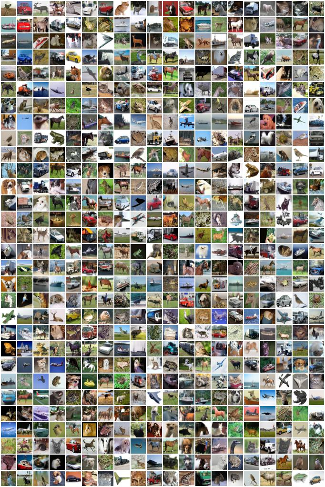

<figcaption>図11: NCSN++ cont. (deep, VE) からの無条件 CIFAR-10 サンプル。</figcaption>
</figure>

<figure>

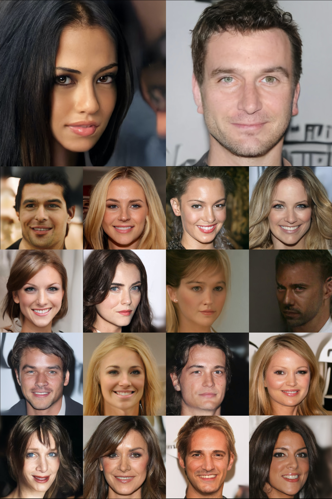

<figcaption>図12: VE SDE で学習した修正 NCSN++ モデルからの 1024×1024 CelebA-HQ のサンプル。</figcaption>
</figure>

### H.2 Results on CIFAR-10（CIFAR-10 の結果）

導入した全アーキテクチャ要素は VE SDE のスコアベースモデルの性能を改善する（図 10）。VE SDE の最良モデルは 1) FIR アップ／ダウンサンプリング、2) スキップ接続の再スケール、3) BigGAN 型残差ブロック、4) 解像度あたり 4 残差ブロック、5) input に「residual」・output に progressive growing なし、を用いる。これを「NCSN++」と名付ける。VP SDE では NCSN++ が 144 構成中 4 位で、最良構成は FIR・progressive growing なしの「DDPM++」。基本 NCSN++ は CIFAR-10 で FID 2.45、基本 DDPM++ は 2.78。

連続目的（式 7）への切り替えで全 SDE の FID がさらに改善する。NCSN++ を連続時間で条件付けるため、位置埋め込みをランダム Fourier 特徴埋め込み（スケール 16）に変更し、過学習抑制のため学習を 0.95M イテレーションに減らす。これで NCSN++ (VE) の FID が 2.45→2.38（NCSN++ cont.）、解像度あたりの残差ブロックを倍にすると 2.38→2.20（NCSN++ cont. (deep)）。DDPM++ cont. は VP で 2.78→2.55、sub-VP で 2.61。連続学習モデルには Euler-Maruyama ソルバーを predictor に用いる（DDPM の離散化は $t\to 0$ で連続過程の分散と合わず FID を著しく損なうため）。深さを倍にした DDPM++ cont. (deep) は VP・sub-VP とも FID 2.41、sub-VP で 2.99 bits/dim を達成。

### H.3 High resolution images（高解像度画像）

NCSN++ の CIFAR-10 での成功に勇気づけられ、$1024\times 1024$ CelebA-HQ でテストした。バッチサイズ 8、EMA 率 0.9999、連続目的（式 7）で約 2.4M イテレーション学習。2000 ステップに離散化した PC サンプラー（逆拡散 predictor、1 ランジュバンステップ、$r=0.15$）を用いる。図 12 にサンプルを示す。完璧ではない（顔の対称性に見える欠陥がある）が、アプローチのスケーラビリティを示す励みになる結果と考える。

## Appendix I Controllable generation（可制御生成）

一般形の順方向 SDE 式 15 を考え、初期状態分布が $p_{0}(\mathbf{x}(0)\mid\mathbf{y})$ とする。Anderson により、逆時間 SDE は次で与えられる。

$$
\mathrm{d}\mathbf{x}=\{\mathbf{f}(\mathbf{x},t)-\nabla\cdot[\mathbf{G}\mathbf{G}^{\mathsf{T}}]-\mathbf{G}\mathbf{G}^{\mathsf{T}}\nabla_{\mathbf{x}}\log p_{t}(\mathbf{x}\mid\mathbf{y})\}\mathrm{d}t+\mathbf{G}\mathrm{d}\bar{\mathbf{w}}. \tag{48}
$$

$p_{t}(\mathbf{x}(t)\mid\mathbf{y})\propto p_{t}(\mathbf{x}(t))p(\mathbf{y}\mid\mathbf{x}(t))$ なので、スコアは容易に計算できる。

$$
\nabla_{\mathbf{x}}\log p_{t}(\mathbf{x}(t)\mid\mathbf{y})=\nabla_{\mathbf{x}}\log p_{t}(\mathbf{x}(t))+\nabla_{\mathbf{x}}\log p(\mathbf{y}\mid\mathbf{x}(t)).
$$

これは式 14 の条件付き逆時間 SDE を特別な場合として内包する。これまで議論した全サンプリング法を条件付き逆時間 SDE に適用してサンプル生成できる。

### I.1 Class-conditional sampling（クラス条件付きサンプリング）

$\mathbf{y}$ がクラスラベルを表すとき、時間依存分類器 $p_{t}(\mathbf{y}\mid\mathbf{x}(t))$ を学習してクラス条件付きサンプリングできる。順方向 SDE は扱いやすいので、$(\mathbf{x}(0),\mathbf{y})$ をデータセットから、$\mathbf{x}(t)\sim p_{0t}(\mathbf{x}(t)\mid\mathbf{x}(0))$ をサンプリングして学習データ対 $(\mathbf{x}(t),\mathbf{y})$ を容易に作れる。異なる時間ステップにわたる交差エントロピー損失の混合で時間依存分類器を学習する。CIFAR-10 で VE 摂動の下、$\log\sigma_{i}$ で条件付けた Wide-ResNet-28-10 を学習。無条件 NCSN++ を用い 2000 ステップの PC で生成。

<figure>

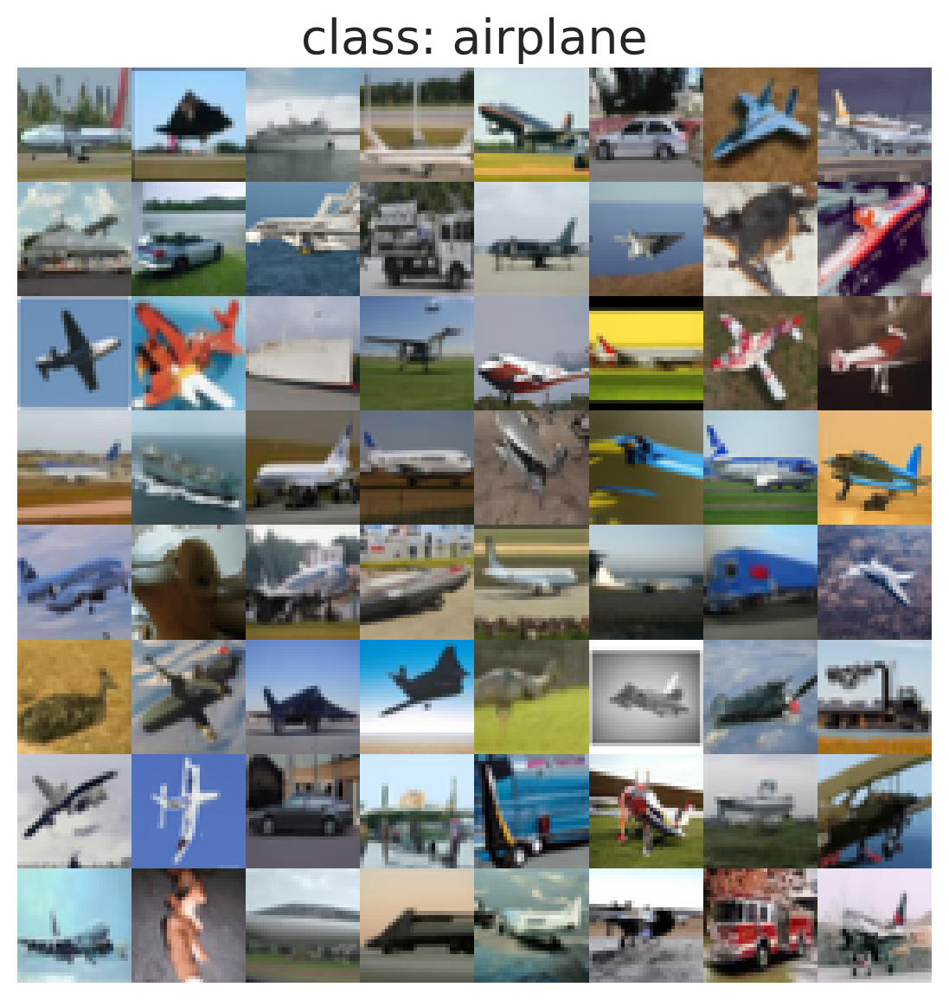

<figcaption>図13: 条件付き逆時間 SDE を PC で解くクラス条件付き画像生成。曲線は異なるノイズスケールでのノイズ条件付き分類器の精度を示す。</figcaption>
</figure>

### I.2 Imputation（補完）

補完は条件付きサンプリングの特別な場合。$\mathbf{x}$ の既知・未知次元を $\Omega(\mathbf{x})$・$\bar{\Omega}(\mathbf{x})$ とし、未知次元に制限したドリフト・拡散を $\mathbf{f}_{\bar{\Omega}}$・$\mathbf{G}_{\bar{\Omega}}$ とする。目標は $p(\bar{\Omega}(\mathbf{x}(0))\mid\Omega(\mathbf{x}(0))=\mathbf{y})$ からのサンプリング。新しい拡散過程 $\mathbf{z}(t)=\bar{\Omega}(\mathbf{x}(t))$ を定義し、$\Omega(\mathbf{x}(0))=\mathbf{y}$ で条件付けた逆時間 SDE を解く。$p_{t}(\mathbf{z}(t)\mid\Omega(\mathbf{x}(0))=\mathbf{y})$ は一般に扱いにくいが、$\hat{\Omega}(\mathbf{x}(t))\sim p_{t}(\Omega(\mathbf{x}(t))\mid A)$（通常扱いやすい）を用いて近似でき、

$$
\nabla_{\mathbf{z}}\log p_{t}(\mathbf{z}(t)\mid\Omega(\mathbf{x}(0))=\mathbf{y})\approx\nabla_{\mathbf{z}}\log p_{t}([\mathbf{z}(t);\hat{\Omega}(\mathbf{x}(t))])
$$

となる（$[\mathbf{z}(t);\hat{\Omega}(\mathbf{x}(t))]$ は既知次元を $\hat{\Omega}$、未知次元を $\mathbf{z}$ とするベクトル）。inpainting の拡張結果は図 14・15 にある。

### I.3 Colorization（着色）

着色は既知次元が結合している補完の特別な場合。直交線形変換でグレースケール画像を別チャネルへ写し、変換空間で補完してから元空間へ戻す。色チャネルを分離する直交行列は

$$
\begin{pmatrix}0.577&-0.816&0\\
0.577&0.408&0.707\\
0.577&0.408&-0.707\end{pmatrix}.
$$

変換がすべて直交行列なので標準ウィーナー過程は変換空間でも標準ウィーナー過程のままで、第 I.2 節と同じ補完法を使える。着色の拡張結果は図 16・17 にある。

### I.4 Solving general inverse problems（一般逆問題を解く）

$\mathbf{x}$ から $\mathbf{y}$ を生成する順過程 $p(\mathbf{y}\mid\mathbf{x})$ が分かっているとき、逆問題は $\mathbf{y}$ から $\mathbf{x}$ を得る（$p(\mathbf{x}\mid\mathbf{y})$ からサンプリングする）こと。式 48 を活用し、$\nabla_{\mathbf{x}}\log p_{t}(\mathbf{x}(t)\mid\mathbf{y})$ の推定が得られれば逆時間 SDE を解いてサンプリングできる。$\mathbf{y}(t)$ を $\mathbf{x}(t)$ と順過程 $p(\mathbf{y}(t)\mid\mathbf{x}(t))$ で定義し、2 つの仮定（$p(\mathbf{y}(t)\mid\mathbf{y})$ が扱いやすい、$p_{t}(\mathbf{x}(t)\mid\mathbf{y}(t),\mathbf{y})\approx p_{t}(\mathbf{x}(t)\mid\mathbf{y}(t))$）の下で、

$$
\nabla_{\mathbf{x}}\log p_{t}(\mathbf{x}(t)\mid\mathbf{y})\approx\mathbf{s}_{{\boldsymbol{\theta}}^{*}}(\mathbf{x}(t),t)+\nabla_{\mathbf{x}}\log p_{t}(\hat{\mathbf{y}}(t)\mid\mathbf{x}(t)),
$$

ここで $\hat{\mathbf{y}}(t)$ は $p(\mathbf{y}(t)\mid\mathbf{y})$ からのサンプル。これを式 48 に代入して逆時間 SDE を解けば $p(\mathbf{x}\mid\mathbf{y})$ から生成できる。

<figure>

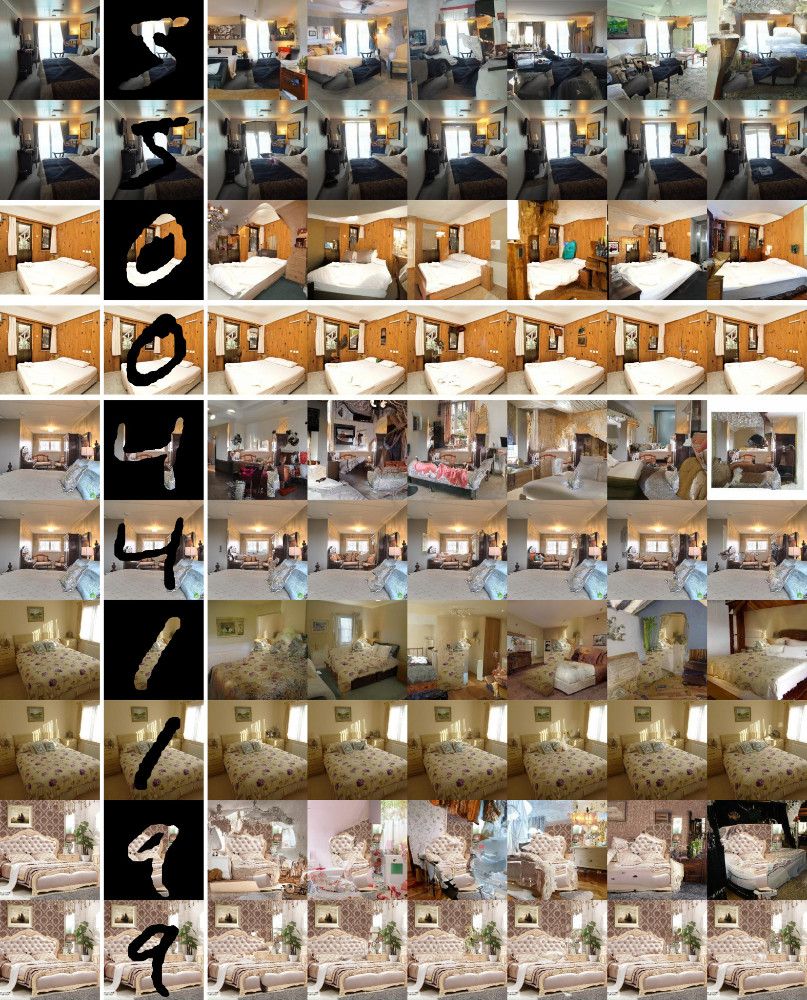

<figcaption>図14: 256×256 bedroom 画像の inpainting 拡張結果。</figcaption>
</figure>

<figure>

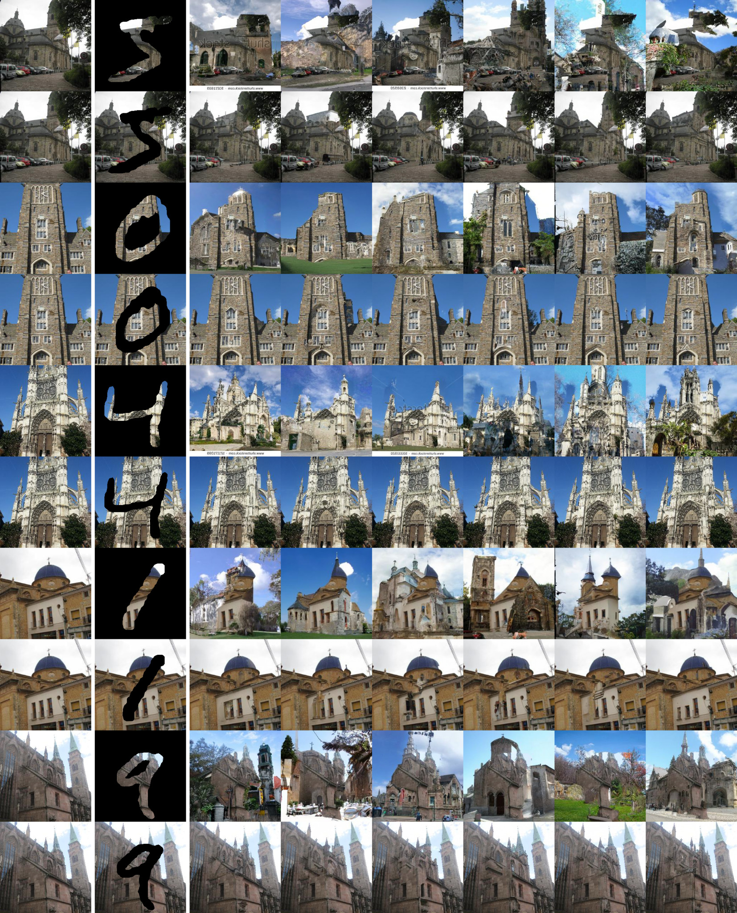

<figcaption>図15: 256×256 church 画像の inpainting 拡張結果。</figcaption>
</figure>

<figure>

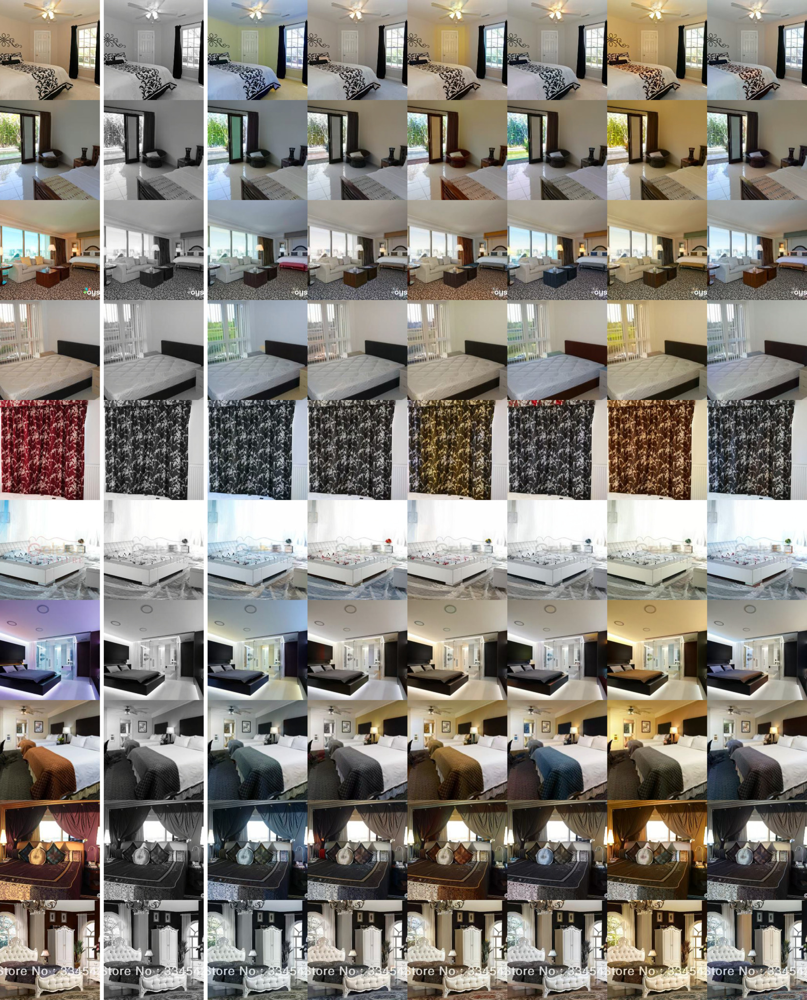

<figcaption>図16: 256×256 bedroom 画像の着色拡張結果。</figcaption>
</figure>

<figure>

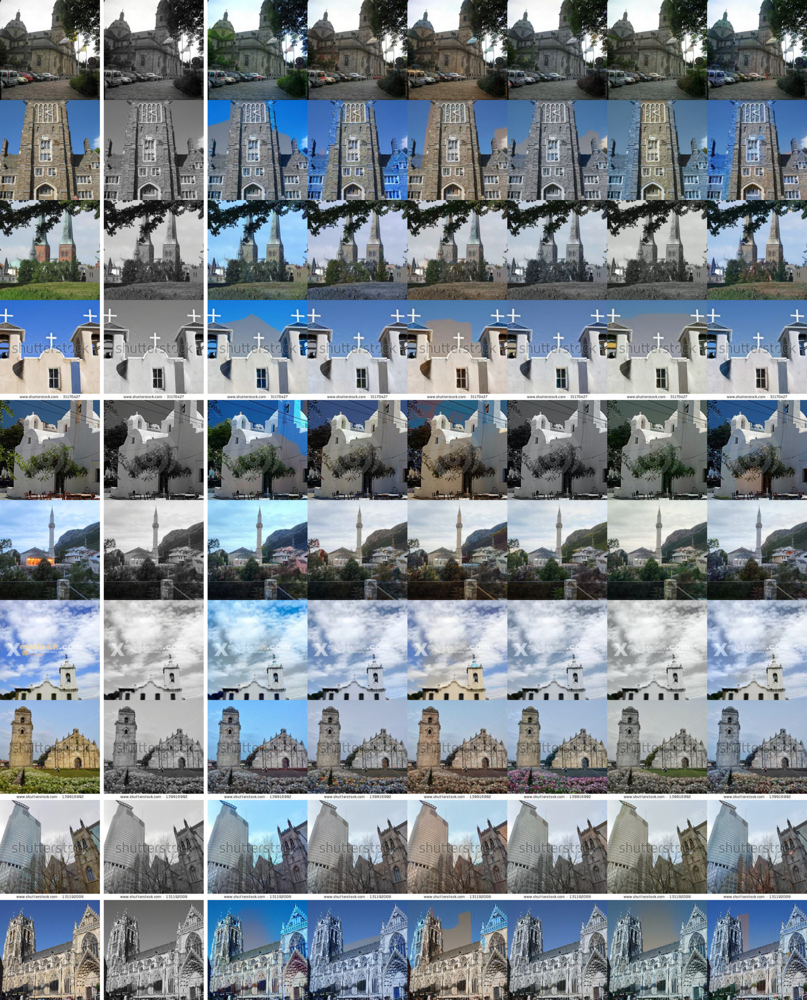

<figcaption>図17: 256×256 church 画像の着色拡張結果。</figcaption>
</figure>
