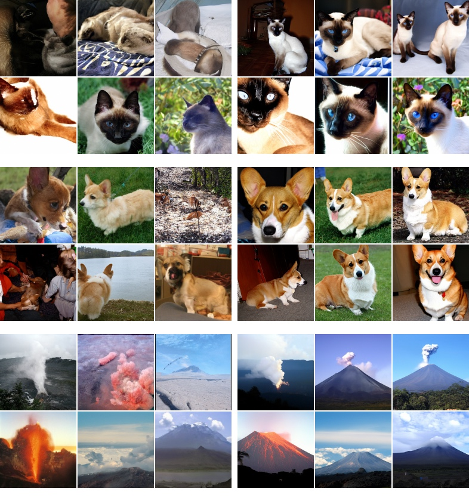
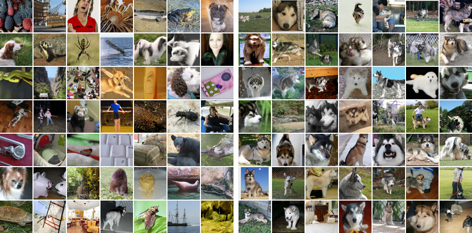
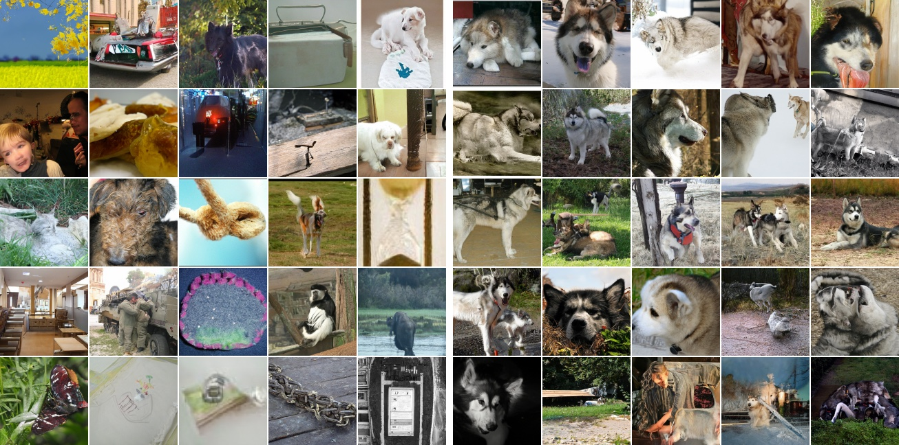
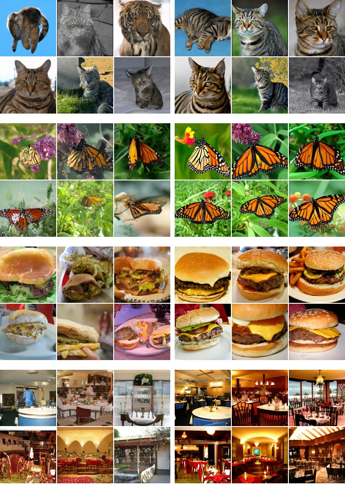

# 分類器なし拡散ガイダンス（Classifier-Free Diffusion Guidance）

> 原題: Classifier-Free Diffusion Guidance
> 著者: Jonathan Ho, Tim Salimans（Google Research, Brain team）
> 出典: NeurIPS 2021 Workshop on Deep Generative Models / arXiv:2207.12598 ・ https://ar5iv.labs.arxiv.org/html/2207.12598

## Abstract（要旨）

分類器ガイダンス（classifier guidance）は、他の種類の生成モデルにおける低温サンプリング（low temperature sampling）や切り詰め（truncation）と同じ精神で、条件付き拡散モデルにおいてモード被覆（mode coverage）とサンプル忠実度（sample fidelity）を学習後にトレードオフするために最近導入された手法である。分類器ガイダンスは拡散モデルのスコア推定値を画像分類器の勾配と組み合わせるため、拡散モデルとは別に画像分類器を学習する必要がある。これはまた、分類器なしでガイダンスを実行できるかという問いを提起する。我々は、そのような分類器なしで、純粋な生成モデルによって実際にガイダンスを実行できることを示す。我々が分類器なしガイダンス（classifier-free guidance）と呼ぶ手法では、条件付き拡散モデルと無条件拡散モデルを同時に学習し、結果として得られる条件付きスコア推定値と無条件スコア推定値を組み合わせて、分類器ガイダンスで得られるのと同様のサンプル品質と多様性のトレードオフを達成する。

## 1 Introduction（はじめに）

図1: 64x64 ImageNet 拡散モデルにおける、マラミュート（malamute）クラスへの分類器なしガイダンス。左から右へ、分類器なしガイダンスの量を増やしていく。左端はガイダンスなしのサンプル。

<figure>

<figcaption>図2: 3 つのガウス分布の混合へのガイダンスの効果。各混合成分はあるクラスで条件付けされたデータを表す。左端のプロットはガイダンスなしの周辺密度。左から右へ、正規化された条件付き分布の混合の密度を、ガイダンス強度を増やしながら示す。</figcaption>
</figure>

拡散モデルは最近、表現力豊かで柔軟な生成モデルの族として登場し、画像・音声合成タスクで競争力のあるサンプル品質と尤度スコアを実現している。これらのモデルは、自己回帰モデルに匹敵する品質の音声合成性能を大幅に少ない推論ステップで実現し、また FID スコアと分類精度スコアの点で BigGAN-deep や VQ-VAE-2 を上回る ImageNet 生成結果を実現している。

[^3]（Dhariwal & Nichol）は*分類器ガイダンス*を提案した。これは追加で学習した分類器を用いて拡散モデルのサンプル品質を高める手法である。分類器ガイダンス以前は、切り詰めた BigGAN や低温 Glow が生成するような「低温」サンプルを拡散モデルから生成する方法は知られていなかった。素朴な試み、例えばモデルのスコアベクトルをスケールしたり拡散サンプリング中に加えるガウスノイズの量を減らしたりすることは効果がない。分類器ガイダンスは代わりに、拡散モデルのスコア推定値を、分類器の対数確率の入力勾配と混ぜる。分類器勾配の強度を変えることで、[^3] は BigGAN の切り詰めパラメータを変えるのと同様の方法で、Inception スコアと FID スコア（あるいは precision と recall）をトレードオフできる。

我々は、分類器ガイダンスを分類器なしで実行できるかに関心がある。分類器ガイダンスは追加の分類器を学習する必要があるため拡散モデルの学習パイプラインを複雑にし、しかもこの分類器はノイズの乗ったデータで学習しなければならないので、一般に事前学習済みの分類器を差し込むことはできない。さらに、分類器ガイダンスはサンプリング中にスコア推定値を分類器勾配と混ぜるので、分類器ガイドされた拡散サンプリングは、勾配ベースの敵対的攻撃（adversarial attack）で画像分類器を混乱させようとしていると解釈できる。これは、分類器ガイダンスが FID や Inception スコア（IS）のような分類器ベースの指標を高めるのに成功するのは、単にそれがそうした分類器に対して敵対的だからではないか、という問いを提起する。分類器勾配の方向へ進むことはまた、特にノンパラメトリックな生成器を伴う GAN の学習にもいくらか似ている。これもまた、分類器ガイドされた拡散モデルが分類器ベースの指標で良い性能を示すのは、すでにそうした指標で良い性能を示すことが知られている GAN に似始めているからではないか、という問いを提起する。

これらの問いを解決するために、我々は*分類器なしガイダンス*を提示する。これは分類器を完全に回避する我々のガイダンス手法である。画像分類器の勾配の方向にサンプリングする代わりに、分類器なしガイダンスは条件付き拡散モデルと同時学習された無条件拡散モデルのスコア推定値を混ぜる。混合の重みを掃引することで、分類器ガイダンスが達成するのと同様の FID/IS トレードオフを達成する。我々の分類器なしガイダンスの結果は、純粋な生成拡散モデルが、他の種類の生成モデルで可能な極めて高い忠実度のサンプルを合成できることを実証する。

## 2 Background（背景）

我々は拡散モデルを連続時間で学習する。$\mathbf{x}\sim p(\mathbf{x})$ とし、ハイパーパラメータ $\lambda_{\mathrm{min}}<\lambda_{\mathrm{max}}\in\mathbb{R}$ に対して $\mathbf{z}=\{\mathbf{z}_{\lambda}\,|\,\lambda\in[\lambda_{\mathrm{min}},\lambda_{\mathrm{max}}]\}$ とすると、順過程 $q(\mathbf{z}|\mathbf{x})$ は分散保存（variance-preserving）マルコフ過程である。

$$
q(\mathbf{z}_{\lambda}|\mathbf{x})=\mathcal{N}(\alpha_{\lambda}\mathbf{x},\sigma_{\lambda}^{2}\mathbf{I}),\ \text{where}\ \alpha_{\lambda}^{2}=1/(1+e^{-\lambda}),\ \sigma_{\lambda}^{2}=1-\alpha_{\lambda}^{2}
$$

$$
q(\mathbf{z}_{\lambda}|\mathbf{z}_{\lambda^{\prime}})=\mathcal{N}((\alpha_{\lambda}/\alpha_{\lambda^{\prime}})\mathbf{z}_{\lambda^{\prime}},\sigma_{\lambda|\lambda^{\prime}}^{2}\mathbf{I}),\ \text{where}\ \lambda<\lambda^{\prime},\ \sigma^{2}_{\lambda|\lambda^{\prime}}=(1-e^{\lambda-\lambda^{\prime}})\sigma_{\lambda}^{2}
$$

$\mathbf{x}\sim p(\mathbf{x})$ かつ $\mathbf{z}\sim q(\mathbf{z}|\mathbf{x})$ のときの $\mathbf{z}$（または $\mathbf{z}_{\lambda}$）の周辺分布を表すのに $p(\mathbf{z})$（または $p(\mathbf{z}_{\lambda})$）という記法を用いる。$\lambda=\log\alpha_{\lambda}^{2}/\sigma_{\lambda}^{2}$ なので、$\lambda$ は $\mathbf{z}_{\lambda}$ の対数信号対雑音比（log signal-to-noise ratio, log SNR）と解釈でき、順過程は $\lambda$ が減少する方向に進む。

$\mathbf{x}$ で条件付けると、順過程は遷移 $q(\mathbf{z}_{\lambda^{\prime}}|\mathbf{z}_{\lambda},\mathbf{x})=\mathcal{N}(\tilde{\boldsymbol{\mu}}_{\lambda^{\prime}|\lambda}(\mathbf{z}_{\lambda},\mathbf{x}),\tilde{\sigma}^{2}_{\lambda^{\prime}|\lambda}\mathbf{I})$ によって逆向きに記述できる。ここで

$$
\tilde{\boldsymbol{\mu}}_{\lambda^{\prime}|\lambda}(\mathbf{z}_{\lambda},\mathbf{x})=e^{\lambda-\lambda^{\prime}}(\alpha_{\lambda^{\prime}}/\alpha_{\lambda})\mathbf{z}_{\lambda}+(1-e^{\lambda-\lambda^{\prime}})\alpha_{\lambda^{\prime}}\mathbf{x},\quad\tilde{\sigma}^{2}_{\lambda^{\prime}|\lambda}=(1-e^{\lambda-\lambda^{\prime}})\sigma_{\lambda^{\prime}}^{2}
$$

逆過程の生成モデルは $p_{\theta}(\mathbf{z}_{\lambda_{\mathrm{min}}})=\mathcal{N}(\mathbf{0},\mathbf{I})$ から始まる。遷移を次のように指定する。

$$
p_{\theta}(\mathbf{z}_{\lambda^{\prime}}|\mathbf{z}_{\lambda})=\mathcal{N}(\tilde{\boldsymbol{\mu}}_{\lambda^{\prime}|\lambda}(\mathbf{z}_{\lambda},\mathbf{x}_{\theta}(\mathbf{z}_{\lambda})),(\tilde{\sigma}^{2}_{\lambda^{\prime}|\lambda})^{1-v}(\sigma^{2}_{\lambda|\lambda^{\prime}})^{v})
$$

サンプリング中、この遷移を $T$ ステップにわたって増加列 $\lambda_{\mathrm{min}}=\lambda_{1}<\cdots<\lambda_{T}=\lambda_{\mathrm{max}}$ に沿って適用する。言い換えれば、我々は [^18][^7] の離散時間の祖先的サンプラー（ancestral sampler）に従う。モデル $\mathbf{x}_{\theta}$ が正しければ、$T\rightarrow\infty$ のとき、サンプルパスが $p(\mathbf{z})$ として分布する SDE からのサンプルが得られ、連続時間のモデル分布を $p_{\theta}(\mathbf{z})$ と表記する。分散は [^13] が示唆するように $\tilde{\sigma}^{2}_{\lambda^{\prime}|\lambda}$ と $\sigma^{2}_{\lambda|\lambda^{\prime}}$ の対数空間での補間である。我々は学習された $\mathbf{z}_{\lambda}$ 依存の $v$ ではなく定数ハイパーパラメータ $v$ を用いるのが効果的であることを見出した。分散は $\lambda^{\prime}\rightarrow\lambda$ で $\tilde{\sigma}^{2}_{\lambda^{\prime}|\lambda}$ に簡略化されるので、$v$ は実際に行うように非無限小のタイムステップでサンプリングするときのみ効果を持つ。

逆過程の平均は、推定値 $\mathbf{x}_{\theta}(\mathbf{z}_{\lambda})\approx\mathbf{x}$ を $q(\mathbf{z}_{\lambda^{\prime}}|\mathbf{z}_{\lambda},\mathbf{x})$ に差し込んだものから得られる（$\mathbf{x}_{\theta}$ は $\lambda$ も入力として受け取るが、記法を簡潔に保つため省略する）。$\mathbf{x}_{\theta}$ を ${\boldsymbol{\epsilon}}$ 予測の形でパラメータ化する：$\mathbf{x}_{\theta}(\mathbf{z}_{\lambda})=(\mathbf{z}_{\lambda}-\sigma_{\lambda}{\boldsymbol{\epsilon}}_{\theta}(\mathbf{z}_{\lambda}))/\alpha_{\lambda}$。そして次の目的関数で学習する。

$$
\mathbb{E}_{{\boldsymbol{\epsilon}},\lambda}\!\left[\|{\boldsymbol{\epsilon}}_{\theta}(\mathbf{z}_{\lambda})-{\boldsymbol{\epsilon}}\|^{2}_{2}\right]
$$

ここで ${\boldsymbol{\epsilon}}\sim\mathcal{N}(\mathbf{0},\mathbf{I})$、$\mathbf{z}_{\lambda}=\alpha_{\lambda}\mathbf{x}+\sigma_{\lambda}{\boldsymbol{\epsilon}}$、$\lambda$ は $[\lambda_{\mathrm{min}},\lambda_{\mathrm{max}}]$ 上の分布 $p(\lambda)$ から引かれる。この目的関数は複数のノイズスケールにわたるノイズ除去スコアマッチング（denoising score matching）であり、$p(\lambda)$ が一様のとき、目的関数は潜在変数モデル $\int p_{\theta}(\mathbf{x}|\mathbf{z})p_{\theta}(\mathbf{z})d\mathbf{z}$ の周辺対数尤度の変分下界に比例する（指定されていないデコーダ $p_{\theta}(\mathbf{x}|\mathbf{z})$ と $\mathbf{z}_{\lambda_{\mathrm{min}}}$ での事前分布の項は無視する）。

$p(\lambda)$ が一様でない場合、目的関数はサンプル品質のために重みを調整できる重み付き変分下界と解釈できる。我々は [^13] の離散時間コサインノイズスケジュールに着想を得た $p(\lambda)$ を用いる：一様分布する $u\in[0,1]$ に対して $\lambda=-2\log\tan(au+b)$ で $\lambda$ をサンプリングする。ここで $b=\arctan(e^{-\lambda_{\mathrm{max}}/2})$、$a=\arctan(e^{-\lambda_{\mathrm{min}}/2})-b$。これは有界区間上で台を持つように修正された双曲線正割（hyperbolic secant）分布を表す。有限タイムステップ生成では、一様に間隔をあけた $u\in[0,1]$ に対応する $\lambda$ 値を用い、最終的に生成されるサンプルは $\mathbf{x}_{\theta}(\mathbf{z}_{\lambda_{\mathrm{max}}})$ である。

${\boldsymbol{\epsilon}}_{\theta}(\mathbf{z}_{\lambda})$ の損失はすべての $\lambda$ についてノイズ除去スコアマッチングなので、我々のモデルが学習するスコア ${\boldsymbol{\epsilon}}_{\theta}(\mathbf{z}_{\lambda})$ は、ノイズの乗ったデータ $\mathbf{z}_{\lambda}$ の分布の対数密度の勾配を推定する。すなわち ${\boldsymbol{\epsilon}}_{\theta}(\mathbf{z}_{\lambda})\approx-\sigma_{\lambda}\nabla_{\mathbf{z}_{\lambda}}\log p(\mathbf{z}_{\lambda})$。ただし、${\boldsymbol{\epsilon}}_{\theta}$ を定義するのに制約のないニューラルネットワークを使うため、勾配が ${\boldsymbol{\epsilon}}_{\theta}$ となるようなスカラーポテンシャルが存在する必要はないことに注意する。学習された拡散モデルからのサンプリングは、元データ $\mathbf{x}$ の条件付き分布 $p(\mathbf{x})$ に収束する一連の分布 $p(\mathbf{z}_{\lambda})$ からサンプリングするためにランジュバン拡散（Langevin diffusion）を用いることに似ている。

条件付き生成モデリングの場合、データ $\mathbf{x}$ は条件付け情報 $\mathbf{c}$（例えばクラス条件付き画像生成のためのクラスラベル）と同時に引かれる。モデルへの唯一の修正は、逆過程の関数近似器が ${\boldsymbol{\epsilon}}_{\theta}(\mathbf{z}_{\lambda},\mathbf{c})$ のように $\mathbf{c}$ を入力として受け取ることである。

## 3 Guidance（ガイダンス）

GAN やフローベースモデルのような特定の生成モデルの興味深い性質は、サンプリング時に生成モデルへのノイズ入力の分散や範囲を減らすことで、切り詰めサンプリングや低温サンプリングを実行できることである。意図する効果は、各個別サンプルの品質を高めつつサンプルの多様性を減らすことである。例えば BigGAN の切り詰めは、低い切り詰め量と高い切り詰め量に対してそれぞれ FID スコアと Inception スコアの間のトレードオフ曲線を生む。Glow の低温サンプリングも同様の効果を持つ。

残念ながら、拡散モデルで切り詰めや低温サンプリングを実装する素朴な試みは効果がない。例えば、モデルのスコアをスケールしたり逆過程のガウスノイズの分散を減らしたりすると、拡散モデルはぼやけた低品質なサンプルを生成する。

### 3.1 Classifier guidance（分類器ガイダンス）

拡散モデルで切り詰めのような効果を得るために、[^3] は*分類器ガイダンス*を導入した。そこでは拡散スコア ${\boldsymbol{\epsilon}}_{\theta}(\mathbf{z}_{\lambda},\mathbf{c})\approx-\sigma_{\lambda}\nabla_{\mathbf{z}_{\lambda}}\log p(\mathbf{z}_{\lambda}|\mathbf{c})$ が、補助分類器モデル $p_{\theta}(\mathbf{c}|\mathbf{z}_{\lambda})$ の対数尤度の勾配を含むように次のように修正される。

$$
\tilde{{\boldsymbol{\epsilon}}}_{\theta}(\mathbf{z}_{\lambda},\mathbf{c})={\boldsymbol{\epsilon}}_{\theta}(\mathbf{z}_{\lambda},\mathbf{c})-w\sigma_{\lambda}\nabla_{\mathbf{z}_{\lambda}}\log p_{\theta}(\mathbf{c}|\mathbf{z}_{\lambda})\approx-\sigma_{\lambda}\nabla_{\mathbf{z}_{\lambda}}[\log p(\mathbf{z}_{\lambda}|\mathbf{c})+w\log p_{\theta}(\mathbf{c}|\mathbf{z}_{\lambda})], \tag{1}
$$

ここで $w$ は分類器ガイダンスの強度を制御するパラメータである。この修正されたスコア $\tilde{{\boldsymbol{\epsilon}}}_{\theta}(\mathbf{z}_{\lambda},\mathbf{c})$ が拡散モデルからのサンプリング時に ${\boldsymbol{\epsilon}}_{\theta}(\mathbf{z}_{\lambda},\mathbf{c})$ の代わりに用いられ、次の分布からの近似サンプルが得られる。

$$
\tilde{p}_{\theta}(\mathbf{z}_{\lambda}|\mathbf{c})\propto p_{\theta}(\mathbf{z}_{\lambda}|\mathbf{c})p_{\theta}(\mathbf{c}|\mathbf{z}_{\lambda})^{w}. \tag{2}
$$

効果は、分類器 $p_{\theta}(\mathbf{c}|\mathbf{z}_{\lambda})$ が正しいラベルに高い尤度を割り当てるデータの確率を重く見積もることである。よく分類できるデータは知覚品質の Inception スコアで高得点を取り、Inception スコアは設計上そうした生成モデルを報いる。それゆえ [^3] は $w>0$ と設定することで拡散モデルの Inception スコアを改善できるが、サンプルの多様性が減少する代償を払う。

図2は、各クラスの条件付き分布が等方ガウスである 3 クラスのトイ 2 次元例に対して、数値的に解いたガイダンス $\tilde{p}_{\theta}(\mathbf{z}_{\lambda}|\mathbf{c})\propto p_{\theta}(\mathbf{z}_{\lambda}|\mathbf{c})p_{\theta}(\mathbf{c}|\mathbf{z}_{\lambda})^{w}$ の効果を図示する。ガイダンスを適用した各条件付き分布の形は著しく非ガウス的である。ガイダンス強度が増すにつれ、各条件付き分布は他のクラスから遠ざかり、ロジスティック回帰が与える高信頼度の方向へ確率質量を置き、質量の大半がより小さな領域に集中する。この振る舞いは、ImageNet モデルで分類器ガイダンス強度を増したときに起こる Inception スコアの向上とサンプル多様性の減少の単純な現れと見ることができる。

無条件モデルに重み $w+1$ で分類器ガイダンスを適用すると、理論的には条件付きモデルに重み $w$ で分類器ガイダンスを適用するのと同じ結果になる。なぜなら $p_{\theta}(\mathbf{z}_{\lambda}|\mathbf{c})p_{\theta}(\mathbf{c}|\mathbf{z}_{\lambda})^{w}\propto p_{\theta}(\mathbf{z}_{\lambda})p_{\theta}(\mathbf{c}|\mathbf{z}_{\lambda})^{w+1}$ だからである。スコアの言葉では、

$$
{\boldsymbol{\epsilon}}_{\theta}(\mathbf{z}_{\lambda})-(w+1)\sigma_{\lambda}\nabla_{\mathbf{z}_{\lambda}}\log p_{\theta}(\mathbf{c}|\mathbf{z}_{\lambda})\approx-\sigma_{\lambda}\nabla_{\mathbf{z}_{\lambda}}[\log p(\mathbf{z}_{\lambda})+(w+1)\log p_{\theta}(\mathbf{c}|\mathbf{z}_{\lambda})]
$$

$$
=-\sigma_{\lambda}\nabla_{\mathbf{z}_{\lambda}}[\log p(\mathbf{z}_{\lambda}|\mathbf{c})+w\log p_{\theta}(\mathbf{c}|\mathbf{z}_{\lambda})],
$$

だが興味深いことに、[^3] は無条件モデルにガイダンスを適用するのとは対照的に、すでにクラス条件付きのモデルに分類器ガイダンスを適用するときに最良の結果を得る。この理由から、我々はすでに条件付きのモデルをガイドする設定にとどまる。

### 3.2 Classifier-free guidance（分類器なしガイダンス）

分類器ガイダンスは切り詰めや低温サンプリングから期待されるとおり IS と FID をうまくトレードオフするが、それでも画像分類器からの勾配に依存しており、我々は第 1 節で述べた理由から分類器を排除したい。ここでは、そうした勾配なしに同じ効果を達成する*分類器なしガイダンス*を記述する。分類器なしガイダンスは、分類器ガイダンスと同じ効果を持つように ${\boldsymbol{\epsilon}}_{\theta}(\mathbf{z}_{\lambda},\mathbf{c})$ を修正する別の方法だが、分類器を使わない。アルゴリズム 1 と 2 が分類器なしガイダンスでの学習とサンプリングを詳しく記述する。

**アルゴリズム 1 分類器なしガイダンスでの拡散モデルの同時学習**

- $p_{\mathrm{uncond}}$: 無条件学習の確率
1. **repeat**
2. $\quad(\mathbf{x},\mathbf{c})\sim p(\mathbf{x},\mathbf{c})$ ▷ データセットから条件付きでデータをサンプリング
3. $\quad\mathbf{c}\leftarrow\varnothing$ 確率 $p_{\mathrm{uncond}}$ で ▷ 無条件に学習するため条件をランダムに破棄
4. $\quad\lambda\sim p(\lambda)$ ▷ log SNR 値をサンプリング
5. $\quad{\boldsymbol{\epsilon}}\sim\mathcal{N}(\mathbf{0},\mathbf{I})$
6. $\quad\mathbf{z}_{\lambda}=\alpha_{\lambda}\mathbf{x}+\sigma_{\lambda}{\boldsymbol{\epsilon}}$ ▷ サンプリングした log SNR 値までデータを破損
7. $\quad\nabla_{\theta}\left\|{\boldsymbol{\epsilon}}_{\theta}(\mathbf{z}_{\lambda},\mathbf{c})-{\boldsymbol{\epsilon}}\right\|^{2}$ で勾配ステップを取る ▷ ノイズ除去モデルの最適化
8. **until** 収束

**アルゴリズム 2 分類器なしガイダンスでの条件付きサンプリング**

- $w$: ガイダンス強度
- $\mathbf{c}$: 条件付きサンプリングのための条件付け情報
- $\lambda_{1},\dotsc,\lambda_{T}$: $\lambda_{1}=\lambda_{\mathrm{min}}$, $\lambda_{T}=\lambda_{\mathrm{max}}$ の増加 log SNR 列
1. $\mathbf{z}_{1}\sim\mathcal{N}(\mathbf{0},\mathbf{I})$
2. **for** $t=1,\dotsc,T$ **do** ▷ log SNR $\lambda_{t}$ で分類器なしガイドされたスコアを形成
3. $\quad\tilde{{\boldsymbol{\epsilon}}}_{t}=(1+w){\boldsymbol{\epsilon}}_{\theta}(\mathbf{z}_{t},\mathbf{c})-w{\boldsymbol{\epsilon}}_{\theta}(\mathbf{z}_{t})$ ▷ サンプリングステップ（DDIM など別のサンプラーで置き換え可）
4. $\quad\tilde{\mathbf{x}}_{t}=(\mathbf{z}_{t}-\sigma_{\lambda_{t}}\tilde{\boldsymbol{\epsilon}}_{t})/\alpha_{\lambda_{t}}$
5. $\quad\mathbf{z}_{t+1}\sim\mathcal{N}(\tilde{\boldsymbol{\mu}}_{\lambda_{t+1}|\lambda_{t}}(\mathbf{z}_{t},\tilde{\mathbf{x}}_{t}),(\tilde{\sigma}^{2}_{\lambda_{t+1}|\lambda_{t}})^{1-v}(\sigma^{2}_{\lambda_{t}|\lambda_{t+1}})^{v})$ （$t<T$ なら。それ以外は $\mathbf{z}_{t+1}=\tilde{\mathbf{x}}_{t}$）
6. **end for**
7. **return** $\mathbf{z}_{T+1}$

別の分類器モデルを学習する代わりに、我々はスコア推定器 ${\boldsymbol{\epsilon}}_{\theta}(\mathbf{z}_{\lambda})$ を通じてパラメータ化される無条件ノイズ除去拡散モデル $p_{\theta}(\mathbf{z})$ を、${\boldsymbol{\epsilon}}_{\theta}(\mathbf{z}_{\lambda},\mathbf{c})$ を通じてパラメータ化される条件付きモデル $p_{\theta}(\mathbf{z}|\mathbf{c})$ とともに学習することを選ぶ。両モデルをパラメータ化するのに単一のニューラルネットワークを用い、無条件モデルではスコアを予測する際にクラス識別子 $\mathbf{c}$ に null トークン $\varnothing$ を入力するだけでよい、すなわち ${\boldsymbol{\epsilon}}_{\theta}(\mathbf{z}_{\lambda})={\boldsymbol{\epsilon}}_{\theta}(\mathbf{z}_{\lambda},\mathbf{c}=\varnothing)$。無条件モデルと条件付きモデルを、$\mathbf{c}$ をある確率 $p_{\mathrm{uncond}}$（ハイパーパラメータとして設定）で無条件クラス識別子 $\varnothing$ にランダムに設定するだけで同時学習する。（別々のモデルを学習することも確かに可能だが、同時学習を選ぶのは実装が極めて単純で、学習パイプラインを複雑にせず、総パラメータ数を増やさないからである。）次に、条件付きスコア推定値と無条件スコア推定値の次の線形結合を用いてサンプリングを行う。

$$
\tilde{{\boldsymbol{\epsilon}}}_{\theta}(\mathbf{z}_{\lambda},\mathbf{c})=(1+w){\boldsymbol{\epsilon}}_{\theta}(\mathbf{z}_{\lambda},\mathbf{c})-w{\boldsymbol{\epsilon}}_{\theta}(\mathbf{z}_{\lambda}) \tag{6}
$$

式 6 には分類器勾配が存在しないので、$\tilde{\boldsymbol{\epsilon}}_{\theta}$ の方向にステップを取ることは画像分類器への勾配ベースの敵対的攻撃とは解釈できない。さらに、$\tilde{\boldsymbol{\epsilon}}_{\theta}$ は制約のないニューラルネットワークの使用により非保存的ベクトル場（non-conservative vector field）であるスコア推定値から構成されるので、一般に $\tilde{\boldsymbol{\epsilon}}_{\theta}$ が分類器ガイドされたスコアとなるような分類器対数尤度のようなスカラーポテンシャルは存在し得ない。

式 6 が分類器ガイドされたスコアとなる分類器が一般には存在し得ないにもかかわらず、これは実際には暗黙の分類器（implicit classifier）$p^{i}(\mathbf{c}|\mathbf{z}_{\lambda})\propto p(\mathbf{z}_{\lambda}|\mathbf{c})/p(\mathbf{z}_{\lambda})$ の勾配に着想を得ている。もし厳密なスコア ${\boldsymbol{\epsilon}}^{*}(\mathbf{z}_{\lambda},\mathbf{c})$ と ${\boldsymbol{\epsilon}}^{*}(\mathbf{z}_{\lambda})$（それぞれ $p(\mathbf{z}_{\lambda}|\mathbf{c})$ と $p(\mathbf{z}_{\lambda})$ の）にアクセスできれば、この暗黙の分類器の勾配は $\nabla_{\mathbf{z}_{\lambda}}\log p^{i}(\mathbf{c}|\mathbf{z}_{\lambda})=-\frac{1}{\sigma_{\lambda}}[{\boldsymbol{\epsilon}}^{*}(\mathbf{z}_{\lambda},\mathbf{c})-{\boldsymbol{\epsilon}}^{*}(\mathbf{z}_{\lambda})]$ となり、この暗黙の分類器による分類器ガイダンスはスコア推定値を $\tilde{{\boldsymbol{\epsilon}}}^{*}(\mathbf{z}_{\lambda},\mathbf{c})=(1+w){\boldsymbol{\epsilon}}^{*}(\mathbf{z}_{\lambda},\mathbf{c})-w{\boldsymbol{\epsilon}}^{*}(\mathbf{z}_{\lambda})$ に修正する。式 6 との類似に注意せよ。ただし、$\tilde{{\boldsymbol{\epsilon}}}^{*}(\mathbf{z}_{\lambda},\mathbf{c})$ は $\tilde{{\boldsymbol{\epsilon}}}_{\theta}(\mathbf{z}_{\lambda},\mathbf{c})$ とは根本的に異なることにも注意せよ。前者はスケールされた分類器勾配 ${\boldsymbol{\epsilon}}^{*}(\mathbf{z}_{\lambda},\mathbf{c})-{\boldsymbol{\epsilon}}^{*}(\mathbf{z}_{\lambda})$ から構成される。後者は推定値 ${\boldsymbol{\epsilon}}_{\theta}(\mathbf{z}_{\lambda},\mathbf{c})-{\boldsymbol{\epsilon}}_{\theta}(\mathbf{z}_{\lambda})$ から構成され、この表現は一般にはいかなる分類器の（スケールされた）勾配でもない。これも、スコア推定値が制約のないニューラルネットワークの出力だからである。

生成モデルをベイズの定理で逆転すると有用なガイダンス信号を提供する良い分類器が得られる、というのは先験的には自明でない。例えば [^4] は、生成モデルの仕様がデータ分布と厳密に一致する人工的な場合でさえ、判別モデルが一般に生成モデルから導かれた暗黙の分類器を上回ることを見出している。我々の場合のようにモデルが誤指定されていると予想される場合、ベイズの定理で導かれた分類器は不整合になりうるし、その性能に関するすべての保証を失う。それでもなお、第 4 節で、分類器なしガイダンスが分類器ガイダンスと同じように FID と IS をトレードオフできることを経験的に示す。第 5 節では分類器なしガイダンスの分類器ガイダンスとの関係における含意を議論する。

## 4 Experiments（実験）

<figure>

<figcaption>図3: 128x128 ImageNet における分類器なしガイダンス。左: ガイダンスなしのサンプル、右: w=3.0 の分類器なしガイドされたサンプル。興味深いことに、これらのような強くガイドされたサンプルは彩度の高い色を示す。さらに図 8 を参照。</figcaption>
</figure>

我々は、BigGAN 論文以来 FID と Inception スコアのトレードオフを研究する標準的な設定である、面積ダウンサンプリングされたクラス条件付き ImageNet で分類器なしガイダンス付きの拡散モデルを学習する。

我々の実験の目的は、分類器なしガイダンスが分類器ガイダンスと同様の FID/IS トレードオフを達成できることを実証し、分類器なしガイダンスの振る舞いを理解する概念実証として機能することであり、必ずしもこれらのベンチマークでサンプル品質指標を最先端まで押し上げることではない。この目的のため、我々は [^3] のガイド付き拡散モデルと同じモデルアーキテクチャとハイパーパラメータを用いる（第 2 節で指定した連続時間学習を除く）。それらのハイパーパラメータ設定は分類器ガイダンス用に調整されたものなので、分類器なしガイダンスには最適でないかもしれない。さらに、条件付きモデルと無条件モデルを追加の分類器なしで同じアーキテクチャに償却するので、実際には先行研究より少ないモデル容量を使っている。それでもなお、我々の分類器なしガイド付きモデルは依然として競争力のあるサンプル品質指標を生み、時に先行研究を上回る。これは以下の節で見られる。

### 4.1 Varying the classifier-free guidance strength（分類器なしガイダンス強度を変える）

ここでは本論文の主要な主張を実験的に検証する：分類器なしガイダンスが分類器ガイダンスや GAN の切り詰めのように IS と FID をトレードオフできること。我々は提案する分類器なしガイダンスを $64\times 64$ と $128\times 128$ のクラス条件付き ImageNet 生成に適用する。表 1 と図 4 で、$64\times 64$ ImageNet モデルのガイダンス強度 $w$ を掃引したときのサンプル品質効果を示す。表 2 と図 5 は $128\times 128$ モデルについて同じものを示す。我々は $w\in\{0,0.1,0.2,\ldots,4\}$ を考え、各値について [^6] と [^17] の手続きに従い 50000 サンプルで FID と Inception スコアを計算する。すべてのモデルは log SNR 端点 $\lambda_{\mathrm{min}}=-20$ と $\lambda_{\mathrm{max}}=20$ を用いた。$64\times 64$ モデルはサンプラーのノイズ補間係数 $v=0.3$ を用い 40 万ステップ学習した。$128\times 128$ モデルは $v=0.2$ を用い 270 万ステップ学習した。

最良の FID 結果は少量のガイダンス（データセットに応じて $w=0.1$ または $w=0.3$）で、最良の IS 結果は強いガイダンス（$w\geq 4$）で得られる。この 2 つの極端の間で、FID が $w$ とともに単調減少し IS が単調増加する、これら 2 つの知覚品質指標間の明確なトレードオフが見られる。我々の結果は [^3] と [^8] と比べて遜色なく、実際我々の $128\times 128$ の結果は文献中で最先端である。$w=0.3$ で、$128\times 128$ ImageNet での我々のモデルの FID スコアは分類器ガイドされた ADM-G を上回り、$w=4.0$ で、BigGAN-deep をその最良 IS の切り詰めレベルで評価したときに、我々のモデルは FID と IS の両方で BigGAN-deep を上回る。

図 1, 6, 3, 7, 8 は異なるレベルのガイダンスについて我々のモデルからランダムに生成されたサンプルを示す。ここで分類器なしガイダンス強度を増やすと、サンプルの多様性が減り個別サンプルの忠実度が増すという期待される効果がはっきりと見られる。

**表1**: ImageNet 64x64 の結果（$w=0.0$ はガイダンスなしモデルを指す）。Ours の 3 値は $p_{\mathrm{uncond}}=0.1/0.2/0.5$ に対応。

| Model | FID (↓) | IS (↑) |
| --- | --- | --- |
| ADM | 2.07 | - |
| CDM | 1.48 | 67.95 |
| Ours（$p_\text{uncond}=0.1/0.2/0.5$） | | |
| $w=0.0$ | 1.8 / 1.8 / 2.21 | 53.71 / 52.9 / 47.61 |
| $w=0.1$ | 1.55 / 1.62 / 1.91 | 66.11 / 64.58 / 56.1 |
| $w=0.2$ | 2.04 / 2.1 / 2.08 | 78.91 / 76.99 / 65.6 |
| $w=0.3$ | 3.03 / 2.93 / 2.65 | 92.8 / 88.64 / 74.92 |
| $w=0.4$ | 4.3 / 4 / 3.44 | 106.2 / 101.11 / 84.27 |
| $w=0.5$ | 5.74 / 5.19 / 4.34 | 119.3 / 112.15 / 92.95 |
| $w=0.6$ | 7.19 / 6.48 / 5.27 | 131.1 / 122.13 / 102 |
| $w=0.7$ | 8.62 / 7.73 / 6.23 | 141.8 / 131.6 / 109.8 |
| $w=0.8$ | 10.08 / 8.9 / 7.25 | 151.6 / 140.82 / 116.9 |
| $w=0.9$ | 11.41 / 10.09 / 8.21 | 161 / 150.26 / 124.6 |
| $w=1.0$ | 12.6 / 11.21 / 9.13 | 170.1 / 158.29 / 131.1 |
| $w=2.0$ | 21.03 / 18.79 / 16.16 | 225.5 / 212.98 / 183 |
| $w=3.0$ | 24.83 / 22.36 / 19.75 | 250.4 / 237.65 / 208.9 |
| $w=4.0$ | 26.22 / 23.84 / 21.48 | 260.2 / 248.97 / 225.1 |

<figure>

<figcaption>図4: ImageNet 64x64 モデルのガイダンス強度にわたる IS/FID 曲線。各曲線は無条件学習確率 pₐₙcond の異なるモデルを表す。表 1 に付随。</figcaption>
</figure>

### 4.2 Varying the unconditional training probability（無条件学習確率を変える）

学習時の分類器なしガイダンスの主要なハイパーパラメータは $p_{\mathrm{uncond}}$、すなわち条件付きモデルと無条件モデルの同時学習中に無条件生成で学習する確率である。ここでは、$64\times 64$ ImageNet で $p_{\mathrm{uncond}}$ を変えてモデルを学習する効果を研究する。

表 1 と図 4 が $p_{\mathrm{uncond}}$ のサンプル品質への効果を示す。$p_{\mathrm{uncond}}\in\{0.1,0.2,0.5\}$ のモデルをすべて 40 万学習ステップ学習し、さまざまなガイダンス強度でサンプル品質を評価した。$p_{\mathrm{uncond}}=0.5$ は IS/FID フロンティア全体で $p_{\mathrm{uncond}}\in\{0.1,0.2\}$ より一貫して悪い性能を示す。$p_{\mathrm{uncond}}\in\{0.1,0.2\}$ は互いにほぼ同程度の性能である。

これらの知見に基づき、分類器なしガイドされたスコアをサンプル品質に効果的に生成するには、拡散モデルのモデル容量のうち比較的小さな部分だけを無条件生成タスクに割り当てればよいと結論づける。興味深いことに、分類器ガイダンスについて [^3] は、容量の小さい比較的小さな分類器で効果的な分類器ガイドサンプリングに十分だと報告しており、我々が分類器なしガイドモデルで見出したこの現象を反映している。

### 4.3 Varying the number of sampling steps（サンプリングステップ数を変える）

サンプリングステップ数 $T$ は拡散モデルのサンプル品質に大きな影響を持つことが知られているので、ここでは $128\times 128$ ImageNet モデルで $T$ を変える効果を研究する。表 2 と図 5 が、ガイダンス強度の範囲にわたって $T\in\{128,256,1024\}$ を変える効果を示す。期待どおり、$T$ を増やすとサンプル品質が改善し、このモデルでは $T=256$ がサンプル品質とサンプリング速度の良いバランスを達成する。

$T=256$ は ADM-G が用いたのとほぼ同じサンプリングステップ数であり、我々のモデルがそれを上回ることに注意する。しかし、我々の手法の各サンプリングステップはノイズ除去モデルを 2 回評価する必要があることに注意するのが重要である。条件付き ${\boldsymbol{\epsilon}}_{\theta}(\mathbf{z}_{\lambda},\mathbf{c})$ に 1 回、無条件 ${\boldsymbol{\epsilon}}_{\theta}(\mathbf{z}_{\lambda})$ に 1 回。我々は ADM-G と同じモデルアーキテクチャを用いたので、サンプリング速度の点での公平な比較は我々の $T=128$ 設定であり、これは FID スコアの点で ADM-G より劣る。

**表2**: ImageNet 128x128 の結果（$w=0.0$ はガイダンスなしモデルを指す）。Ours の 3 値は $T=128/256/1024$ に対応。

| Model | FID (↓) | IS (↑) |
| --- | --- | --- |
| BigGAN-deep, max IS | 25 | 253 |
| BigGAN-deep | 5.7 | 124.5 |
| CDM | 3.52 | 128.8 |
| LOGAN | 3.36 | 148.2 |
| ADM-G | 2.97 | - |
| Ours（$T=128/256/1024$） | | |
| $w=0.0$ | 8.11 / 7.27 / 7.22 | 81.46 / 82.45 / 81.54 |
| $w=0.1$ | 5.31 / 4.53 / 4.5 | 105.01 / 106.12 / 104.67 |
| $w=0.2$ | 3.7 / 3.03 / 3 | 130.79 / 132.54 / 130.09 |
| $w=0.3$ | 3.04 / 2.43 / 2.43 | 156.09 / 158.47 / 156 |
| $w=0.4$ | 3.02 / 2.49 / 2.48 | 183.01 / 183.41 / 180.88 |
| $w=0.5$ | 3.43 / 2.98 / 2.96 | 206.94 / 207.98 / 204.31 |
| $w=0.6$ | 4.09 / 3.76 / 3.73 | 227.72 / 228.83 / 226.76 |
| $w=0.7$ | 4.96 / 4.67 / 4.69 | 247.92 / 249.25 / 247.89 |
| $w=0.8$ | 5.93 / 5.74 / 5.71 | 265.54 / 267.99 / 265.52 |
| $w=0.9$ | 6.89 / 6.8 / 6.81 | 280.19 / 283.41 / 281.14 |
| $w=1.0$ | 7.88 / 7.86 / 7.8 | 295.29 / 297.98 / 294.56 |
| $w=2.0$ | 15.9 / 15.93 / 15.75 | 378.56 / 377.37 / 373.18 |
| $w=3.0$ | 19.77 / 19.77 / 19.56 | 409.16 / 407.44 / 405.68 |
| $w=4.0$ | 21.55 / 21.53 / 21.45 | 422.29 / 421.03 / 419.06 |

<figure>

<figcaption>図5: ImageNet 128x128 モデルのガイダンス強度にわたる IS/FID 曲線。各曲線は異なるタイムステップ数 T でのサンプリングを表す。表 2 に付随。</figcaption>
</figure>

## 5 Discussion（議論）

我々の分類器なしガイダンス手法の最も実用的な利点は、その極端な単純さである。学習時には条件をランダムにドロップアウトするコード 1 行の変更、サンプリング時には条件付きと無条件のスコア推定値を混ぜるコード 1 行の変更だけである。対照的に、分類器ガイダンスは追加の分類器を学習する必要があるため学習パイプラインを複雑にする。この分類器はノイズの乗った $\mathbf{z}_{\lambda}$ で学習しなければならないので、標準的な事前学習済み分類器を差し込むことはできない。

分類器なしガイダンスは追加の学習済み分類器を必要とせずに分類器ガイダンスのように IS と FID をトレードオフできるので、我々は純粋な生成モデルでガイダンスを実行できることを実証した。さらに、我々の拡散モデルは制約のないニューラルネットワークでパラメータ化されているので、分類器勾配とは異なり、そのスコア推定値は必ずしも保存的ベクトル場を形成しない。したがって、我々の分類器なしガイドサンプラーは分類器勾配にまったく似ていないステップ方向に従い、それゆえ分類器勾配を用いる画像分類器への勾配ベースの敵対的攻撃とは解釈できない。よって我々の結果は、分類器ベースの IS・FID 指標の向上が、分類器勾配を用いる画像分類器に対して敵対的でないサンプリング手続きを持つ純粋な生成モデルで達成できることを示す。

我々はまた、ガイダンスがどう機能するかの直感的な説明にも到達した：それはサンプルの無条件尤度を減らしつつ条件付き尤度を増やす。分類器なしガイダンスは、これを*負の*スコア項で無条件尤度を減らすことで達成する。これは我々の知る限りまだ探求されておらず、他の応用で用途が見つかるかもしれない。

ここで提示した分類器なしガイダンスは無条件モデルの学習に依存するが、場合によってはこれを避けられる。クラス分布が既知でクラスが少数しかない場合、$\sum_{\mathbf{c}}p(\mathbf{x}|\mathbf{c})p(\mathbf{c})=p(\mathbf{x})$ という事実を使い、無条件スコアを明示的に学習せずに条件付きスコアから無条件スコアを得られる。もちろん、これは $\mathbf{c}$ の可能な値の数だけ順伝播が必要になり、高次元の条件付けには非効率である。

分類器なしガイダンスの潜在的な不利点はサンプリング速度である。一般に分類器は生成モデルより小さく速くできるので、後者は拡散モデルの順伝播を 2 回（条件付きスコアに 1 回、無条件スコアに 1 回）走らせる必要があるため、分類器ガイドサンプリングは分類器なしガイダンスより速いかもしれない。拡散モデルの複数回の順伝播の必要性は、ネットワークの後半で条件付けを注入するようアーキテクチャを変えることで緩和できるかもしれないが、この探求は将来の課題とする。

最後に、多様性を犠牲にしてサンプル忠実度を高めるいかなるガイダンス手法も、多様性の減少が許容できるかという問いに直面しなければならない。デプロイされたモデルには負の影響がありうる。なぜなら、データのある部分が残りに対して過小評価されている文脈では、サンプルの多様性を保つことが重要だからである。サンプルの多様性を保ちつつサンプル品質を高めようとするのは、興味深い将来の研究方向だろう。

## 6 Conclusion（結論）

我々は分類器なしガイダンスを提示した。これは拡散モデルでサンプル多様性を減らしつつサンプル品質を高める手法である。分類器なしガイダンスは分類器なしの分類器ガイダンスと考えることができ、分類器なしガイダンスの有効性を示す我々の結果は、純粋な生成拡散モデルが分類器勾配を完全に回避しつつ分類器ベースのサンプル品質指標を最大化できることを確認する。我々は、より多様な設定とデータモダリティにおける分類器なしガイダンスのさらなる探求を楽しみにしている。

## 7 Acknowledgements（謝辞）

（訳出を省略）

## Appendix A Samples（サンプル）

<figure>

<figcaption>(a) ガイダンスなしの条件付きサンプリング: FID=1.80, IS=53.71。（64x64 ImageNet）</figcaption>
</figure>

<figure>

<figcaption>(a) ガイダンスなしの条件付きサンプリング: FID=7.27, IS=82.45。（128x128 ImageNet）</figcaption>
</figure>

<figure>

<figcaption>図8: 128x128 ImageNet における分類器なしガイダンスのさらなる例。左: ガイダンスなしのサンプル、右: w=3.0 の分類器なしガイドされたサンプル。</figcaption>
</figure>

> 訳注: 本文冒頭の図1（マラミュートのクラスへの分類器なしガイダンス）は、原典 ar5iv にこの位置の画像リンクが存在しなかったため、本翻訳ではキャプションのみを掲載している。
