# 潜在拡散モデルによる高解像度画像合成（High-Resolution Image Synthesis with Latent Diffusion Models）

> 原題: High-Resolution Image Synthesis with Latent Diffusion Models
> 著者: Robin Rombach¹, Andreas Blattmann¹, Dominik Lorenz¹, Patrick Esser, Björn Ommer¹（¹ ルートヴィヒ・マクシミリアン大学ミュンヘン & ハイデルベルク大学 IWR, ドイツ / Runway ML。最初の 2 名は本研究に等しく貢献）
> 出典: CVPR 2022 / arXiv:2112.10752 ・ https://ar5iv.labs.arxiv.org/html/2112.10752
> コード: https://github.com/CompVis/latent-diffusion

## Abstract（要旨）

画像形成過程をノイズ除去オートエンコーダ（denoising autoencoder）の逐次적な適用へと分解することで、拡散モデル（diffusion models, DMs）は画像データおよびそれ以外でも最先端の合成結果を達成している。加えて、その定式化は再学習なしに画像生成過程を制御するガイディング機構（guiding mechanism）を許容する。しかし、これらのモデルは通常ピクセル空間で直接動作するため、強力な DM の最適化はしばしば数百 GPU 日を消費し、逐次的な評価のために推論も高価になる。限られた計算資源で DM の学習を可能にしつつ、その品質と柔軟性を保持するために、我々は強力な事前学習済みオートエンコーダの潜在空間（latent space）で DM を適用する。先行研究とは対照的に、そのような表現上で拡散モデルを学習することは、複雑性の低減と詳細の保存との間のほぼ最適な点に初めて到達することを可能にし、視覚的忠実度を大きく向上させる。モデルアーキテクチャに cross-attention（クロスアテンション）層を導入することで、我々は拡散モデルを、テキストやバウンディングボックスといった一般的な条件付け入力に対する強力で柔軟な生成器へと変え、高解像度合成を畳み込み的な方法で可能にする。我々の潜在拡散モデル（latent diffusion models, LDMs）は、画像 inpainting（欠損領域の補完）とクラス条件付き画像合成で新たな最先端スコアを達成し、text-to-image 合成・無条件画像生成・超解像（super-resolution）を含む多様なタスクで高い競争力を持つ性能を示しつつ、ピクセルベースの DM と比べて計算要件を大幅に削減する。

## 1 Introduction（はじめに）

<figure>

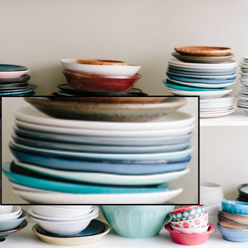

<figcaption>図1: 入力／我々（f=4, PSNR 27.4, R-FID 0.58）／DALL-E（f=8, 22.8, 32.01）／VQGAN（f=16, 19.9, 4.98）。第一段階の再構成品質の比較。我々のモデルは小さい downsampling 係数で忠実な再構成を達成する。</figcaption>
</figure>

画像合成は、最近最も目覚ましい発展を遂げたコンピュータビジョン分野の一つであるが、同時に最も計算需要が大きい分野の一つでもある。とりわけ複雑で自然なシーンの高解像度合成は、現在、自己回帰（autoregressive, AR）トランスフォーマーに数十億のパラメータを含みうる尤度ベースモデルのスケールアップによって支配されている。対照的に、GAN の有望な結果は、その敵対的学習手続きが複雑で多峰的な分布のモデリングに容易にスケールしないため、比較的変動が限られたデータにほぼ限定されることが明らかになっている。最近、ノイズ除去オートエンコーダの階層から構築される拡散モデルが、画像合成およびそれ以外で印象的な結果を達成し、クラス条件付き画像合成と超解像で最先端を定義することが示された。さらに、無条件 DM でさえ、他の種類の生成モデルとは対照的に、inpainting や着色（colorization）、ストロークベース合成といったタスクに容易に適用できる。尤度ベースモデルであるため、GAN のようなモード崩壊（mode collapse）や学習の不安定性を示さず、パラメータ共有を強く活用することで、AR モデルのように数十億のパラメータを伴うことなく自然画像の極めて複雑な分布をモデリングできる。

##### 高解像度画像合成の民主化

DM は尤度ベースモデルのクラスに属し、その mode-covering（モード被覆的）な振る舞いのために、データの知覚できない細部のモデリングに過剰な容量（したがって計算資源）を費やしがちである。再重み付けされた変分目的関数は、初期のノイズ除去ステップをアンダーサンプリングすることでこれに対処しようとするが、そのようなモデルの学習・評価は RGB 画像の高次元空間で繰り返し関数評価（と勾配計算）を要するため、DM は依然として計算的に要求が高い。例として、最も強力な DM の学習はしばしば数百 GPU 日（例えば文献では 150〜1000 V100 日）を要し、入力空間のノイズ版に対する繰り返し評価は推論も高価にするため、5 万サンプルの生成には単一の A100 GPU でおよそ 5 日かかる。これは研究コミュニティと一般のユーザーに 2 つの帰結をもたらす。第一に、そのようなモデルの学習は分野のごく一部しか利用できない膨大な計算資源を要し、巨大なカーボンフットプリントを残す。第二に、学習済みモデルの評価も、同じモデルアーキテクチャを多数のステップにわたって逐次実行しなければならないため、時間とメモリの面で高価である。

この強力なモデルクラスのアクセシビリティを高め、同時にその大きな資源消費を減らすには、学習とサンプリングの双方の計算複雑性を減らす手法が必要である。したがって、DM の性能を損なうことなくその計算需要を減らすことが、アクセシビリティ向上の鍵である。

##### 潜在空間への departure（移行）

我々のアプローチは、ピクセル空間における既学習の拡散モデルの分析から始まる。図 2 は学習済みモデルのレート歪み（rate-distortion）トレードオフを示す。任意の尤度ベースモデルと同様に、学習は大まかに 2 段階に分けられる。第一は*知覚的圧縮（perceptual compression）*の段階で、高周波の細部を除去するが意味的な変動はほとんど学習しない。第二段階では、実際の生成モデルがデータの意味的・概念的構成を学習する（*意味的圧縮 / semantic compression*）。したがって我々は、まず知覚的に等価でありながら計算的により適した空間を見つけ、その中で高解像度画像合成のための拡散モデルを学習することを目指す。

一般的な慣行に従い、我々は学習を 2 つの異なる段階に分ける。第一に、データ空間と知覚的に等価な、より低次元（したがって効率的）な表現空間を提供するオートエンコーダを学習する。重要なことに、先行研究とは対照的に、我々は過度な空間的圧縮に頼る必要がない。なぜなら学習された潜在空間で DM を学習するが、この空間は空間次元に関してより良いスケーリング特性を示すからである。複雑性の低減は、潜在空間からの効率的な画像生成を 1 回のネットワーク順伝播で提供する。結果として得られるモデルクラスを*潜在拡散モデル（Latent Diffusion Models, LDMs）*と呼ぶ。

このアプローチの注目すべき利点は、普遍的なオートエンコーディング段階を一度だけ学習すればよく、したがって複数の DM 学習に再利用したり、まったく異なるタスクの探索に使えることである。これにより、さまざまな image-to-image・text-to-image タスクのための多数の拡散モデルの効率的な探索が可能になる。後者については、トランスフォーマーを DM の UNet バックボーンに接続し、任意のトークンベース条件付け機構を可能にするアーキテクチャを設計する（第 3.3 節を参照）。

<figure>

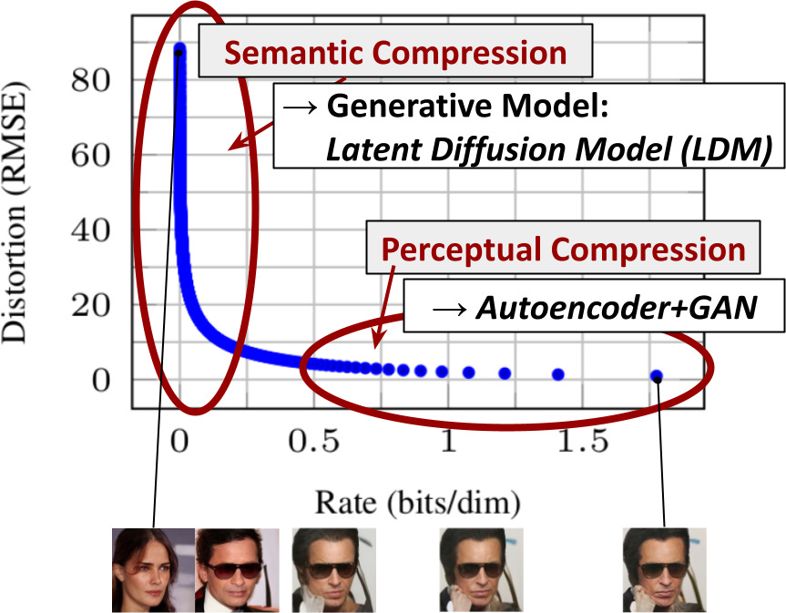

<figcaption>図2: 知覚的圧縮と意味的圧縮の図示。デジタル画像のビットの大半は知覚できない細部に対応する。DM は責任を負う損失項を最小化することでこの意味的に無意味な情報を抑制できるが、勾配（学習時）とニューラルネットのバックボーン（学習・推論時）は依然として全ピクセル上で評価される必要があり、余計な計算と不必要に高価な最適化・推論を招く。我々は、効果的な生成モデルとしての潜在拡散モデル（LDM）と、知覚できない細部のみを除去する別個の穏やかな圧縮段階を提案する。データと画像は文献 30 より。</figcaption>
</figure>

要するに、我々の研究は以下の貢献をなす。

(i) 純粋にトランスフォーマーベースのアプローチとは対照的に、我々の手法はより高次元のデータへ穏やかにスケールし、したがって (a) 先行研究より忠実で詳細な再構成を提供する圧縮レベルで動作でき（図 1 参照）、(b) メガピクセル画像の高解像度合成に効率的に適用できる。

(ii) 計算コストを大幅に下げつつ、複数のタスク（無条件画像合成、inpainting、確率的超解像）とデータセットで競争力のある性能を達成する。ピクセルベースの拡散アプローチと比べて、推論コストも大幅に削減する。

(iii) エンコーダ／デコーダのアーキテクチャとスコアベース事前分布を同時に学習する先行研究とは対照的に、我々のアプローチは再構成能力と生成能力の繊細な重み付けを必要としない。これは極めて忠実な再構成を保証し、潜在空間の正則化をほとんど必要としない。

(iv) 超解像・inpainting・意味的合成のような密に条件付けされたタスクについて、我々のモデルは畳み込み的な方法で適用でき、約 $1024^{2}$ px の大きく一貫した画像をレンダリングできる。

(v) さらに、cross-attention に基づく汎用的な条件付け機構を設計し、マルチモーダル学習を可能にする。これを用いてクラス条件付き・text-to-image・layout-to-image モデルを学習する。

(vi) 最後に、事前学習済みの潜在拡散モデルとオートエンコーディングモデルを https://github.com/CompVis/latent-diffusion で公開する。これらは DM の学習以外のさまざまなタスクにも再利用できるかもしれない。

## 2 Related Work（関連研究）

**画像合成のための生成モデル** 画像の高次元的性質は生成モデリングに特有の課題を提示する。敵対的生成ネットワーク（GAN）は良好な知覚品質の高解像度画像の効率的なサンプリングを可能にするが、最適化が難しく、データ分布全体を捉えるのに苦労する。対照的に、尤度ベースの手法は良好な密度推定を重視し、最適化をより素直にする。変分オートエンコーダ（VAE）とフローベースモデルは高解像度画像の効率的な合成を可能にするが、サンプル品質は GAN と同等ではない。自己回帰モデル（ARM）は密度推定で強い性能を達成するが、計算的に要求の高いアーキテクチャと逐次的なサンプリング過程のために低解像度画像に限られる。画像のピクセルベース表現はほとんど知覚できない高周波の細部を含むため、最尤学習はそのモデリングに不釣り合いな容量を費やし、長い学習時間を招く。より高い解像度へスケールするために、いくつかの 2 段階アプローチは生のピクセルの代わりに圧縮された潜在画像空間を ARM でモデリングする。

最近、拡散確率モデル（DM）は密度推定とサンプル品質の双方で最先端の結果を達成した。これらのモデルの生成力は、その基盤となるニューラルバックボーンが UNet として実装されたときの、画像的データの帰納バイアスへの自然な適合に由来する。最良の合成品質は通常、再重み付けされた目的関数を学習に用いたときに達成される。この場合、DM は不可逆圧縮器に対応し、画像品質と圧縮能力をトレードオフできる。しかし、これらのモデルをピクセル空間で評価・最適化することは、推論速度が低く学習コストが非常に高いという欠点がある。前者は高度なサンプリング戦略や階層的アプローチで部分的に対処できるが、高解像度画像データでの学習は常に高価な勾配計算を要する。我々は、より低次元の圧縮された潜在空間で動作する提案手法 *LDM* によって、この両方の欠点に対処する。これは学習を計算的により安価にし、合成品質をほとんど落とすことなく推論を高速化する（図 1 参照）。

**2 段階画像合成** 個々の生成アプローチの欠点を緩和するために、2 段階アプローチを通じて異なる手法の強みをより効率的で高性能なモデルに組み合わせる研究が数多く行われてきた。VQ-VAE は自己回帰モデルを用いて離散化された潜在空間上の表現力ある事前分布を学習する。[^66] はこのアプローチを、離散化された画像・テキスト表現上の同時分布を学習することで text-to-image 生成へ拡張する。より一般的には、[^70] は条件付き可逆ネットワークを用いて多様なドメインの潜在空間間の汎用的な転送を提供する。VQ-VAE とは異なり、VQGAN は敵対的・知覚的目的関数を持つ第一段階を用いて、自己回帰トランスフォーマーをより大きな画像へスケールさせる。しかし、実現可能な ARM 学習に必要な高い圧縮率は数十億の学習可能パラメータを導入し、そのようなアプローチの全体的な性能を制限し、圧縮を減らすと高い計算コストの代償を払う。我々の研究はそのようなトレードオフを防ぐ。なぜなら提案手法 *LDM* は畳み込みバックボーンのおかげでより高次元の潜在空間へ穏やかにスケールするからである。したがって我々は、強力な第一段階の学習と、高忠実度の再構成を保証しつつ知覚的圧縮を生成拡散モデルに任せすぎないこととを、最適に仲介する圧縮レベルを自由に選べる（図 1 参照）。

エンコーディング／デコーディングモデルをスコアベース事前分布とともに同時に、あるいは別々に学習するアプローチも存在するが、前者は依然として再構成能力と生成能力の間の難しい重み付けを要し、我々のアプローチに性能で劣る（第 4 節）。後者は人間の顔のような高度に構造化された画像に焦点を当てている。

## 3 Method（手法）

高解像度画像合成に向けた拡散モデルの計算需要を下げるために、我々は、拡散モデルが対応する損失項をアンダーサンプリングすることで知覚的に無関係な細部を無視できるとはいえ、依然としてピクセル空間での高価な関数評価を要し、それが計算時間とエネルギー資源の膨大な需要を引き起こすことを観察する。

我々は、圧縮的学習段階と生成的学習段階の明示的な分離を導入することでこの欠点を回避することを提案する（図 2 参照）。これを達成するために、画像空間と知覚的に等価でありながら、計算複雑性を大幅に削減した空間を学習するオートエンコーディングモデルを用いる。

このようなアプローチはいくつかの利点を提供する。(i) 高次元の画像空間を離れることで、サンプリングが低次元空間で行われるため、計算的にはるかに効率的な DM を得る。(ii) UNet アーキテクチャから受け継がれた DM の帰納バイアスを活用する。これは空間的構造を持つデータに特に効果的であり、したがって先行アプローチが要求した攻撃的で品質を落とす圧縮レベルの必要性を緩和する。(iii) 最後に、潜在空間を複数の生成モデルの学習に使え、単一画像の CLIP ガイド合成のような他の下流応用にも活用できる汎用圧縮モデルを得る。

### 3.1 Perceptual Image Compression（知覚的画像圧縮）

我々の知覚的圧縮モデルは先行研究に基づき、知覚的損失（perceptual loss）とパッチベースの敵対的目的関数の組み合わせで学習されるオートエンコーダから成る。これは局所的なリアリズムを強制することで再構成が画像多様体（image manifold）に制限されることを保証し、$L_{2}$ や $L_{1}$ といったピクセル空間の損失のみに頼ることで生じるぼやけを回避する。

より正確には、RGB 空間の画像 $x\in\mathbb{R}^{H\times W\times 3}$ が与えられたとき、エンコーダ $\mathcal{E}$ は $x$ を潜在表現 $z=\mathcal{E}(x)$ にエンコードし、デコーダ $\mathcal{D}$ は潜在から画像を再構成して $\tilde{x}=\mathcal{D}(z)=\mathcal{D}(\mathcal{E}(x))$ を与える（$z\in\mathbb{R}^{h\times w\times c}$）。重要なことに、エンコーダは画像を係数 $f=H/h=W/w$ で*ダウンサンプリング*し、我々は異なるダウンサンプリング係数 $f=2^{m}$（$m\in\mathbb{N}$）を調べる。

任意に高分散な潜在空間を避けるために、我々は 2 種類の異なる正則化を試す。第一の変種 *KL-reg.* は、VAE と同様に、学習された潜在に対して標準正規分布へのわずかな KL ペナルティを課す。一方 *VQ-reg.* はデコーダ内でベクトル量子化（vector quantization）層を用いる。このモデルは、量子化層がデコーダに吸収された VQGAN として解釈できる。後続の DM は学習された潜在空間 $z=\mathcal{E}(x)$ の 2 次元構造を扱うように設計されているため、比較的穏やかな圧縮率を用いて非常に良い再構成を達成できる。これは、学習された空間 $z$ の任意の 1 次元順序に頼ってその分布を自己回帰的にモデリングし、$z$ の固有構造の多くを無視した先行研究とは対照的である。したがって、我々の圧縮モデルは $x$ の細部をよりよく保存する（表 8 参照）。完全な目的関数と学習の詳細は補足にある。

### 3.2 Latent Diffusion Models（潜在拡散モデル）

拡散モデルは、正規分布する変数を徐々にノイズ除去することでデータ分布 $p(x)$ を学習するように設計された確率モデルであり、これは長さ $T$ の固定マルコフ連鎖の逆過程を学習することに対応する。画像合成では、最も成功したモデルは $p(x)$ の変分下界の再重み付け版に頼り、これはノイズ除去スコアマッチングを反映する。これらのモデルは、入力 $x_{t}$ のノイズ除去版を予測するように学習される、等しく重み付けされたノイズ除去オートエンコーダの列 $\epsilon_{\theta}(x_{t},t),\,t=1\dots T$ として解釈できる（$x_{t}$ は入力 $x$ のノイズ版）。対応する目的関数は次のように簡略化できる（第 B 節）。

$$
L_{DM}=\mathbb{E}_{x,\epsilon\sim\mathcal{N}(0,1),t}\Big{[}\|\epsilon-\epsilon_{\theta}(x_{t},t)\|_{2}^{2}\Big{]}\,, \tag{1}
$$

ここで $t$ は $\{1,\dots,T\}$ から一様にサンプリングされる。

**潜在表現の生成的モデリング** $\mathcal{E}$ と $\mathcal{D}$ から成る学習済みの知覚的圧縮モデルにより、我々は今や、高周波で知覚できない細部が抽象化された、効率的で低次元の潜在空間にアクセスできる。高次元のピクセル空間と比べて、この空間は尤度ベース生成モデルにより適している。なぜなら今や (i) データの重要で意味的なビットに集中でき、(ii) より低次元で計算的にはるかに効率的な空間で学習できるからである。

高度に圧縮された離散潜在空間で自己回帰的・注意ベースのトランスフォーマーモデルに頼った先行研究とは異なり、我々はモデルが提供する画像特有の帰納バイアスを活用できる。これには、基盤となる UNet を主に 2 次元畳み込み層から構築する能力や、再重み付け下界を用いて目的関数を知覚的に最も関連するビットへさらに集中させる能力が含まれる。これは今や次のように書ける。

<figure>

<figcaption>図3: 我々は LDM を、連結（concatenation）によって、またはより一般的な cross-attention 機構によって条件付ける。第 3.3 節を参照。（LDM のアーキテクチャ図：ピクセル空間 → エンコーダ ε で潜在 z へ、潜在空間で拡散・ノイズ除去 U-Net、条件 y は τθ を介して cross-attention/concat で U-Net に注入、デコーダ D でピクセル空間へ戻す。）</figcaption>
</figure>

$$
L_{LDM}:=\mathbb{E}_{\mathcal{E}(x),\epsilon\sim\mathcal{N}(0,1),t}\Big{[}\|\epsilon-\epsilon_{\theta}(z_{t},t)\|_{2}^{2}\Big{]}\,. \tag{2}
$$

我々のモデルのニューラルバックボーン $\epsilon_{\theta}(\circ,t)$ は時間条件付き UNet として実現される。順過程は固定されているため、$z_{t}$ は学習中に $\mathcal{E}$ から効率的に得られ、$p(z)$ からのサンプルは $\mathcal{D}$ を 1 回通すことで画像空間へデコードできる。

<figure>

<figcaption>図4: CelebA-HQ・FFHQ・LSUN-Churches・LSUN-Bedrooms・クラス条件付き ImageNet で学習された LDM からのサンプル（各 256×256 解像度）。拡大して見るのが最良。さらなるサンプルは補足を参照。</figcaption>
</figure>

### 3.3 Conditioning Mechanisms（条件付け機構）

他の種類の生成モデルと同様に、拡散モデルは原理的に $p(z|y)$ という形式の条件付き分布をモデリングできる。これは条件付きノイズ除去オートエンコーダ $\epsilon_{\theta}(z_{t},t,y)$ で実装でき、テキスト・意味マップ・他の image-to-image 変換タスクといった入力 $y$ を通じて合成過程を制御する道を開く。

しかし画像合成の文脈では、DM の生成力をクラスラベルや入力画像のぼかし版を超える他の種類の条件付けと組み合わせることは、これまであまり探求されていない研究領域であった。

我々は、基盤となる UNet バックボーンを cross-attention 機構で拡張することで、DM をより柔軟な条件付き画像生成器へと変える。これはさまざまな入力モダリティの注意ベースモデルの学習に効果的である。さまざまなモダリティ（言語プロンプトなど）からの $y$ を前処理するために、$y$ を中間表現 $\tau_{\theta}(y)\in\mathbb{R}^{M\times d_{\tau}}$ へ射影するドメイン特化エンコーダ $\tau_{\theta}$ を導入し、これは cross-attention 層 $\text{Attention}(Q,K,V)=\text{softmax}\left(\frac{QK^{T}}{\sqrt{d}}\right)\cdot V$ を介して UNet の中間層へ写像される。ここで

$$
Q=W^{(i)}_{Q}\cdot\varphi_{i}(z_{t}),\;K=W^{(i)}_{K}\cdot\tau_{\theta}(y),\;V=W^{(i)}_{V}\cdot\tau_{\theta}(y).
$$

ここで $\varphi_{i}(z_{t})\in\mathbb{R}^{N\times d^{i}_{\epsilon}}$ は $\epsilon_{\theta}$ を実装する UNet の（平坦化された）中間表現を表し、$W^{(i)}_{V}\in\mathbb{R}^{d\times d^{i}_{\epsilon}}$、$W^{(i)}_{Q}\in\mathbb{R}^{d\times d_{\tau}}$、$W^{(i)}_{K}\in\mathbb{R}^{d\times d_{\tau}}$ は学習可能な射影行列である。視覚的描写は図 3 を参照。

画像・条件のペアに基づき、我々は次のように条件付き LDM を学習する。

$$
L_{LDM}:=\mathbb{E}_{\mathcal{E}(x),y,\epsilon\sim\mathcal{N}(0,1),t}\Big{[}\|\epsilon-\epsilon_{\theta}(z_{t},t,\tau_{\theta}(y))\|_{2}^{2}\Big{]}\,, \tag{3}
$$

ここで $\tau_{\theta}$ と $\epsilon_{\theta}$ は式 (3) を介して同時に最適化される。この条件付け機構は、$\tau_{\theta}$ をドメイン特化の専門家（例えば $y$ がテキストプロンプトのときは（マスクなし）トランスフォーマー、第 4.3.1 節参照）でパラメータ化できるため柔軟である。

## 4 Experiments（実験）

<figure>

<figcaption>図5: text-to-image 合成のための我々のモデル LDM-8 (KL)（LAION データベースで学習）による、ユーザー定義のテキストプロンプトに対するサンプル。200 DDIM ステップ・η=1.0 で生成。無条件ガイダンス s=10.0 を使用。</figcaption>
</figure>

<figure>

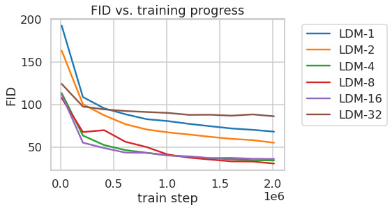

<figcaption>図6: ImageNet データセット上で 2M 学習ステップにわたり、異なる downsampling 係数 f のクラス条件付き LDM の学習を分析。ピクセルベースの LDM-1 は大きな downsampling 係数を持つモデル（LDM-{4-16}）と比べて大幅に長い学習時間を要する。LDM-32 のような過度な知覚的圧縮は全体的なサンプル品質を制限する。全モデルを同じ計算予算で単一 NVIDIA A100 上で学習。100 DDIM ステップ・κ=0 で得た結果。</figcaption>
</figure>

<figure>

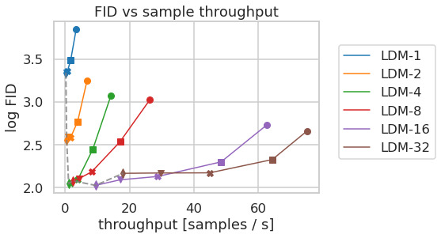

<figcaption>図7: CelebA-HQ（左）と ImageNet（右）データセットで、異なる圧縮の LDM を比較。異なるマーカーは DDIM での {10,20,50,100,200} サンプリングステップを示す（各線に沿って右から左へ）。破線は 200 ステップの FID スコアを示し、LDM-{4-8} の強い性能を示す。FID は 5000 サンプルで評価。全モデルを A100 上で 500k（CelebA）/ 2M（ImageNet）ステップ学習。</figcaption>
</figure>

*LDM* は、さまざまな画像モダリティの柔軟で計算的に扱いやすい拡散ベース画像合成の手段を提供する。これを以下で実証的に示す。まず、学習と推論の双方でピクセルベース拡散モデルと比べた我々のモデルの利得を分析する。興味深いことに、*VQ* 正則化された潜在空間で学習された *LDM* は、*VQ* 正則化された第一段階モデルの再構成能力が連続版にわずかに劣るにもかかわらず、時により良いサンプル品質を達成することがわかった（表 8 参照）。第一段階の正則化方式が *LDM* 学習と $>256^{2}$ への汎化能力に与える効果の視覚的比較は付録 D.1 にある。E.2 ではこの節で示した全結果のアーキテクチャ・実装・学習・評価の詳細を列挙する。

### 4.1 On Perceptual Compression Tradeoffs（知覚的圧縮のトレードオフについて）

この節では、異なる downsampling 係数 $f\in\{1,2,4,8,16,32\}$（*LDM-f* と略記、*LDM-1* はピクセルベース DM に対応）の LDM の振る舞いを分析する。比較可能なテスト環境を得るため、この節の全実験で計算資源を単一 NVIDIA A100 に固定し、全モデルを同じステップ数・同じパラメータ数で学習する。

表 8 はこの節で比較した *LDM* に用いた第一段階モデルのハイパーパラメータと再構成性能を示す。図 6 は ImageNet データセット上でクラス条件付きモデルを 2M ステップ学習したときの、学習進捗の関数としてのサンプル品質を示す。我々は次を見る。i) *LDM-{1,2}* のような小さい downsampling 係数は学習進捗を遅くする。一方 ii) 過度に大きい $f$ の値は、比較的少ない学習ステップの後に忠実度が停滞する原因となる。上記の分析（図 1・2）を再訪すると、これを i) 知覚的圧縮の大半を拡散モデルに任せること、ii) 第一段階の圧縮が強すぎて情報損失を生じ達成可能な品質を制限すること、に帰する。*LDM-{4-16}* は効率と知覚的に忠実な結果の間の良いバランスを取り、これは 2M 学習ステップ後のピクセルベース拡散（*LDM-1*）と *LDM-8* の間の 38 という大きな FID の差に現れる。

図 7 では、CelebA-HQ と ImageNet で学習されたモデルを、DDIM サンプラーでの異なるノイズ除去ステップ数に対するサンプリング速度の観点で比較し、FID スコアに対してプロットする。*LDM-{4-8}* は知覚的圧縮と概念的圧縮の不適切な比を持つモデルを上回る。特にピクセルベースの *LDM-1* と比べて、はるかに低い FID スコアを達成しつつ同時にサンプルスループットを大幅に増やす。ImageNet のような複雑なデータセットは品質低下を避けるために圧縮率の削減を要する。要約すると、*LDM-4* と *-8* は高品質な合成結果を達成するための最良の条件を提供する。

**表1**: 無条件画像合成の評価指標。CelebA-HQ の結果は [^63][^100][^43] から、FFHQ は [^42][^43] から再掲。†: *N*-s は DDIM サンプラーでの *N* サンプリングステップを指す。\*: *KL* 正則化潜在空間で学習。追加結果は補足にある。

| CelebA-HQ 256² | FID↓ | Prec.↑ | Recall↑ |  | FFHQ 256² | FID↓ | Prec.↑ | Recall↑ |
| --- | --- | --- | --- | --- | --- | --- | --- | --- |
| DC-VAE | 15.8 | - | - |  | ImageBART | 9.57 | - | - |
| VQGAN+T (k=400) | 10.2 | - | - |  | U-Net GAN (+aug) | 10.9 (7.6) | - | - |
| PGGAN | 8.0 | - | - |  | UDM | 5.54 | - | - |
| LSGM | 7.22 | - | - |  | StyleGAN | 4.16 | 0.71 | 0.46 |
| UDM | 7.16 | - | - |  | ProjectedGAN | 3.08 | 0.65 | 0.46 |
| *LDM-4* (ours, 500-s†) | 5.11 | 0.72 | 0.49 |  | *LDM-4* (ours, 200-s) | 4.98 | 0.73 | 0.50 |

| LSUN-Churches 256² | FID↓ | Prec.↑ | Recall↑ |  | LSUN-Bedrooms 256² | FID↓ | Prec.↑ | Recall↑ |
| --- | --- | --- | --- | --- | --- | --- | --- | --- |
| DDPM | 7.89 | - | - |  | ImageBART | 5.51 | - | - |
| ImageBART | 7.32 | - | - |  | DDPM | 4.9 | - | - |
| PGGAN | 6.42 | - | - |  | UDM | 4.57 | - | - |
| StyleGAN | 4.21 | - | - |  | StyleGAN | 2.35 | 0.59 | 0.48 |
| StyleGAN2 | 3.86 | - | - |  | ADM | 1.90 | 0.66 | 0.51 |
| ProjectedGAN | 1.59 | 0.61 | 0.44 |  | ProjectedGAN | 1.52 | 0.61 | 0.34 |
| *LDM-8*\* (ours, 200-s) | 4.02 | 0.64 | 0.52 |  | *LDM-4* (ours, 200-s) | 2.95 | 0.66 | 0.48 |

**表2**: $256\times 256$ サイズの MS-COCO データセットでの text 条件付き画像合成の評価。250 DDIM ステップで、我々のモデルは大幅に少ないパラメータ数にもかかわらず最新の拡散・自己回帰手法と同等。†/\*: 数値は [^109]/[^26] より。c.f.g. = classifier-free guidance。

| Text-Conditional Image Synthesis | FID↓ | IS↑ | N_params |
| --- | --- | --- | --- |
| CogView† | 27.10 | 18.20 | 4B（self-ranking, rejection rate 0.017） |
| LAFITE† | 26.94 | 26.02 | 75M |
| GLIDE\* | 12.24 | - | 6B（277 DDIM steps, c.f.g. s=3） |
| Make-A-Scene\* | 11.84 | - | 4B（AR 用 c.f.g. s=5） |
| *LDM-KL-8* | 23.31 | 20.03 ± 0.33 | 1.45B（250 DDIM steps） |
| *LDM-KL-8-G*\* | 12.63 | 30.29 ± 0.42 | 1.45B（250 DDIM steps, c.f.g. s=1.5） |

### 4.2 Image Generation with Latent Diffusion（潜在拡散による画像生成）

我々は CelebA-HQ・FFHQ・LSUN-Churches・-Bedrooms 上で $256^{2}$ 画像の無条件モデルを学習し、i) サンプル品質と ii) データ多様体の被覆を FID と Precision-and-Recall を用いて評価する。表 1 に結果をまとめる。CelebA-HQ では、我々は新たな最先端 FID $5.11$ を報告し、先行する尤度ベースモデルと GAN の双方を上回る。第一段階とともに潜在拡散モデルを同時に学習する LSGM も上回る。対照的に、我々は固定空間で拡散モデルを学習し、再構成品質と潜在空間上の事前分布の学習を秤にかける困難を避ける（図 1-2 参照）。

LSUN-Bedrooms を除く全データセットで先行する拡散ベースアプローチを上回り、Bedrooms でも ADM のパラメータの半分・学習資源の 4 分の 1 で ADM に近いスコアを達成する（付録 E.3.5 参照）。さらに、*LDM* は Precision と Recall で GAN ベース手法を一貫して改善し、敵対的アプローチに対する mode-covering な尤度ベース学習目的関数の利点を確認する。図 4 に各データセットでの定性結果も示す。

### 4.3 Conditional Latent Diffusion（条件付き潜在拡散）

<figure>

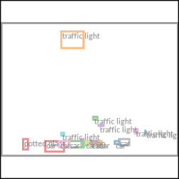

<figcaption>図8: COCO 上での LDM による layout-to-image 合成（第 4.3.1 節参照）。定量評価は補足 D.3。</figcaption>
</figure>

#### 4.3.1 Transformer Encoders for LDMs（LDM のためのトランスフォーマーエンコーダ）

cross-attention ベースの条件付けを LDM に導入することで、これまで拡散モデルで探求されていなかったさまざまな条件付けモダリティを開く。text-to-image モデリングのために、我々は LAION-400M 上で言語プロンプトに条件付けされた 14.5 億パラメータの *KL* 正則化 *LDM* を学習する。BERT トークナイザを用い、$\tau_{\theta}$ をトランスフォーマーとして実装して潜在コードを推論し、それを（マルチヘッド）cross-attention を介して UNet へ写像する（第 3.3 節）。言語表現の学習と視覚的合成のためのドメイン特化専門家のこの組み合わせは、複雑でユーザー定義のテキストプロンプトによく汎化する強力なモデルをもたらす（図 8・5 参照）。定量分析のために、先行研究に従い MS-COCO 検証セットで text-to-image 生成を評価する。そこで我々のモデルは強力な AR・GAN ベース手法を上回る（表 2 参照）。classifier-free diffusion guidance を適用するとサンプル品質が大きく向上し、ガイド付き *LDM-KL-8-G* は最新の AR・拡散モデルと同等になりつつ、パラメータ数を大幅に削減することに注意する。cross-attention ベース条件付け機構の柔軟性をさらに分析するために、OpenImages 上で意味的レイアウトに基づく画像合成モデルも学習し、COCO でファインチューニングする（図 8）。定量評価と実装詳細は第 D.3 節を参照。

最後に、先行研究に従い、第 4.1 節からの $f\in\{4,8\}$ の最良のクラス条件付き ImageNet モデルを表 3・図 4・第 D.4 節で評価する。ここで我々は、計算要件とパラメータ数を大幅に削減しつつ最先端の拡散モデル ADM を上回る（表 18 参照）。

**表3**: クラス条件付き ImageNet *LDM* と、ImageNet でのクラス条件付き画像生成の最新手法との比較。追加のベースラインとのより詳細な比較は D.4・表 10・F にある。*c.f.g.* は [^32] で提案されたスケール $s$ の classifier-free guidance を表す。

| Method | FID↓ | IS↑ | Precision↑ | Recall↑ | N_params |
| --- | --- | --- | --- | --- | --- |
| BigGan-deep | 6.95 | 203.6 ± 2.6 | 0.87 | 0.28 | 340M |
| ADM | 10.94 | 100.98 | 0.69 | 0.63 | 554M（250 DDIM steps） |
| ADM-G | 4.59 | 186.7 | 0.82 | 0.52 | 608M（250 DDIM steps） |
| *LDM-4* (ours) | 10.56 | 103.49 ± 1.24 | 0.71 | 0.62 | 400M（250 DDIM steps） |
| *LDM-4*-G (ours) | 3.60 | 247.67 ± 5.59 | 0.87 | 0.48 | 400M（250 steps, c.f.g. s=1.5） |

#### 4.3.2 Convolutional Sampling Beyond $256^{2}$（$256^{2}$ を超える畳み込みサンプリング）

空間的に整列した条件付け情報を $\epsilon_{\theta}$ の入力に連結することで、*LDM* は効率的な汎用 image-to-image 変換モデルとして機能できる。我々はこれを用いて意味的合成・超解像（第 4.4 節）・inpainting（第 4.5 節）のためのモデルを学習する。意味的合成では、風景画像とその意味マップのペアを用い、意味マップのダウンサンプリング版を $f=4$ モデルの潜在画像表現と連結する。入力解像度 $256^{2}$（$384^{2}$ からのクロップ）で学習するが、我々のモデルはより大きな解像度に汎化し、畳み込み的に評価するとメガピクセル領域までの画像を生成できることがわかる（図 9 参照）。我々はこの振る舞いを活用して、第 4.4 節の超解像モデルと第 4.5 節の inpainting モデルも $512^{2}$ から $1024^{2}$ の大きな画像生成に適用する。この応用では、（潜在空間のスケールによって誘導される）信号対雑音比が結果に大きく影響する。第 D.1 節で、(i) $f=4$ モデルが提供する潜在空間と (ii) 成分ごとの標準偏差でスケールした再スケール版で LDM を学習するときに、これを図示する。

後者は classifier-free guidance と組み合わせると、図 13 のように text 条件付き *LDM-KL-8-G* の $>256^{2}$ 画像の直接合成も可能にする。

<figure>

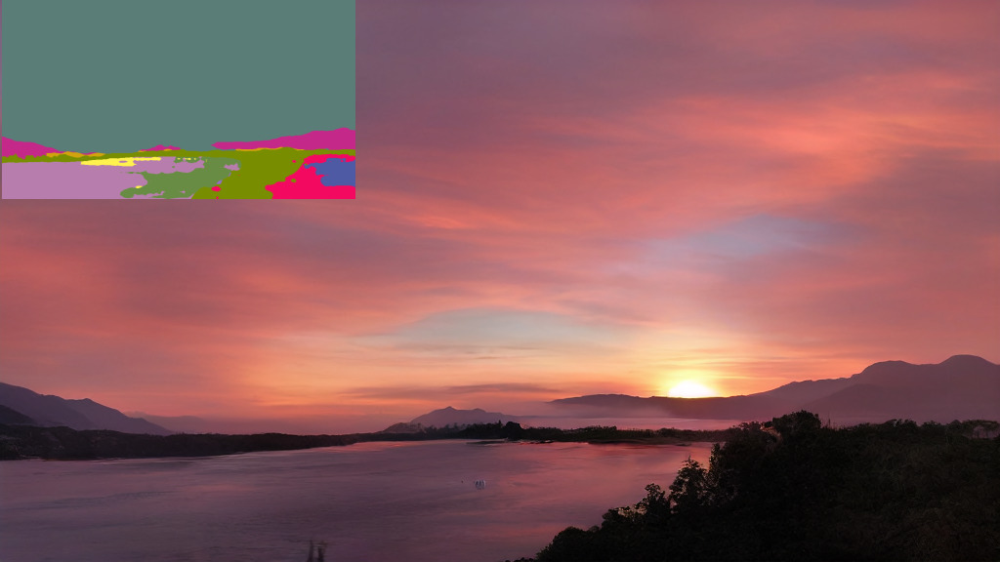

<figcaption>図9: $256^{2}$ 解像度で学習された LDM は、風景画像の意味的合成のような空間的に条件付けされたタスクについて、より大きな解像度（ここでは 512×1024）に汎化できる。第 4.3.2 節を参照。</figcaption>
</figure>

### 4.4 Super-Resolution with Latent Diffusion（潜在拡散による超解像）

LDM は、低解像度画像に連結を介して直接条件付けることで超解像のために効率的に学習できる（第 3.3 節参照）。最初の実験では、SR3 に従い画像劣化を $4\times$ ダウンサンプリングの bicubic 補間に固定し、SR3 のデータ処理パイプラインに従って ImageNet で学習する。OpenImages で事前学習された $f=4$ オートエンコーディングモデル（VQ-reg.）を用い、低解像度条件 $y$ と UNet への入力を連結する（すなわち $\tau_{\theta}$ は恒等写像）。我々の定性的・定量的結果（図 10・表 5 参照）は競争力のある性能を示し、LDM-SR は FID で SR3 を上回るが、SR3 は IS でより良い。単純な画像回帰モデルは最も高い PSNR・SSIM スコアを達成するが、これらの指標は人間の知覚とよく整合せず、不完全に整列した高周波の細部よりぼやけを好む。さらに、ピクセルベースラインと LDM-SR を比較するユーザー調査を行う。SR3 に従い、被験者に 2 つの高解像度画像の間に低解像度画像を見せ、好みを尋ねた。表 4 の結果は LDM-SR の良好な性能を裏付ける。PSNR と SSIM は事後ガイディング機構を用いて押し上げることができ、我々はこの*画像ベースガイダー*を知覚的損失を介して実装する（第 D.6 節参照）。

<figure>

<figcaption>図10: ImageNet-Val 上での ImageNet 64→256 超解像。LDM-SR は写実的なテクスチャのレンダリングに利点があるが、SR3 はより一貫した微細構造を合成できる。追加サンプルとクロップは付録を参照。SR3 の結果は文献 72 より。</figcaption>
</figure>

**表4**: タスク1: 被験者に正解画像と生成画像を見せ好みを尋ねた。タスク2: 被験者は 2 つの生成画像のどちらかを選ばなければならなかった。詳細は E.3.6。

| ユーザー調査 | SR on ImageNet: Pixel-DM (f1) | *LDM-4* | Inpainting on Places: LAMA | *LDM-4* |
| --- | --- | --- | --- | --- |
| タスク1: 正解との好み↑ | 16.0% | 30.4% | 13.6% | 21.0% |
| タスク2: 好みスコア↑ | 29.4% | 70.6% | 31.9% | 68.1% |

bicubic 劣化過程はこの前処理に従わない画像にはよく汎化しないため、より多様な劣化を用いて汎用モデル *LDM-BSR* も学習する。結果は第 D.6.1 節に示す。

**表5**: ImageNet-Val（$256^{2}$）での $\times 4$ アップスケーリング結果。†: FID 特徴量は検証分割で計算、‡: 学習分割で計算、\*: NVIDIA A100 で評価。

| Method | FID↓ | IS↑ | PSNR↑ | SSIM↑ | N_params | samples/s\* |
| --- | --- | --- | --- | --- | --- | --- |
| Image Regression | 15.2 | 121.1 | 27.9 | 0.801 | 625M | N/A |
| SR3 | 5.2 | 180.1 | 26.4 | 0.762 | 625M | N/A |
| *LDM-4* (ours, 100 steps) | 2.8†/4.8‡ | 166.3 | 24.4 ± 3.8 | 0.69 ± 0.14 | 169M | 4.62 |
| *LDM-4* (ours, big, 100 steps) | 2.4†/4.3‡ | 174.9 | 24.7 ± 4.1 | 0.71 ± 0.15 | 552M | 4.5 |
| *LDM-4* (ours, 50 steps, guiding) | 4.4†/6.4‡ | 153.7 | 25.8 ± 3.7 | 0.74 ± 0.12 | 184M | 0.38 |

### 4.5 Inpainting with Latent Diffusion（潜在拡散による inpainting）

inpainting は、画像の一部が破損しているため、または画像内の既存の望ましくない内容を置き換えるために、画像のマスクされた領域を新しい内容で埋めるタスクである。我々は、条件付き画像生成のための一般的アプローチが、このタスクに特化した最先端アプローチとどう比較されるかを評価する。我々の評価は、Fast Fourier Convolutions に頼る特化アーキテクチャを導入した最近の inpainting モデル LaMa のプロトコルに従う。Places での正確な学習・評価プロトコルは第 E.2.2 節に記述する。

まず第一段階の異なる設計選択の効果を分析する。

**表6**: inpainting 効率の評価。†: GPU 設定/バッチサイズの違いによる図 7 との差異については補足を参照。

| Model (reg.-type) | train samples/sec @256 | sampling @256 | sampling @512 | train hours/epoch | train+val FID@2k (epoch 6) |
| --- | --- | --- | --- | --- | --- |
| *LDM-1* (no first stage) | 0.11 | 0.26 | 0.07 | 20.66 | 24.74 |
| *LDM-4* (*KL*, w/ attn) | 0.32 | 0.97 | 0.34 | 7.66 | 15.21 |
| *LDM-4* (*VQ*, w/ attn) | 0.33 | 0.97 | 0.34 | 7.04 | 14.99 |
| *LDM-4* (*VQ*, w/o attn) | 0.35 | 0.99 | 0.36 | 6.66 | 15.95 |

<figure>

<figcaption>図11: 我々の big・ft あり inpainting モデルによる物体除去（object removal）の定性結果。さらなる結果は図 22 を参照。</figcaption>
</figure>

特に、*LDM-1*（すなわちピクセルベースの条件付き DM）と *LDM-4* の inpainting 効率を、*KL* と *VQ* の両正則化、ならびに第一段階に注意を持たない *VQ-LDM-4* について比較する。後者は高解像度でのデコードの GPU メモリを削減する。比較可能性のため全モデルのパラメータ数を固定する。表 6 は解像度 $256^{2}$ と $512^{2}$ での学習・サンプリングスループット、エポックあたりの総学習時間（時間）、6 エポック後の検証分割の FID スコアを報告する。全体として、ピクセルベースと潜在ベースの拡散モデルの間に少なくとも $2.7\times$ の高速化を、FID スコアを少なくとも $1.6\times$ 改善しつつ観察する。

他の inpainting アプローチとの比較（表 7）は、注意ありの我々のモデルが [^88] よりも FID で測られる全体的な画像品質を改善することを示す。マスクされていない画像と我々のサンプルの間の LPIPS は [^88] よりわずかに高い。これは、[^88] が単一の結果のみを生成し平均的な画像をより回復しがちなのに対し、我々の LDM は多様な結果を生成するためと考える（図 21 参照）。さらにユーザー調査（表 4）でも、人間の被験者は [^88] よりも我々の結果を好む。

これらの初期結果に基づき、注意なしの *VQ* 正則化第一段階の潜在空間でより大きな拡散モデル（表 7 の *big*）も学習した。この拡散モデルの UNet は、特徴階層の 3 レベルで注意層を用い、アップ・ダウンサンプリングに BigGAN 残差ブロックを用い、215M ではなく 387M パラメータを持つ。学習後、解像度 $256^{2}$ と $512^{2}$ で生成されるサンプルの品質に不一致があることに気づき、これは追加の注意モジュールが原因と仮説を立てた。しかし、解像度 $512^{2}$ で半エポックモデルをファインチューニングすると、モデルが新しい特徴統計に適応でき、画像 inpainting で新たな最先端 FID を達成する（表 7・図 11 の *big, w/o attn, w/ ft*）。

**表7**: Places のテスト画像から $512\times 512$ の 30k クロップでの inpainting 性能の比較。*40-50%* 列は、画像領域の 40-50% を inpaint しなければならない難例で計算した指標を報告する。† は [^88] で用いた元のテストセットが利用できなかったため我々のテストセットで再計算。

| Method | 40-50% FID↓ | 40-50% LPIPS↓ | All FID↓ | All LPIPS↓ |
| --- | --- | --- | --- | --- |
| *LDM-4* (ours, big, w/ ft) | 9.39 | 0.246 ± 0.042 | 1.50 | 0.137 ± 0.080 |
| *LDM-4* (ours, big, w/o ft) | 12.89 | 0.257 ± 0.047 | 2.40 | 0.142 ± 0.085 |
| *LDM-4* (ours, w/ attn) | 11.87 | 0.257 ± 0.042 | 2.15 | 0.144 ± 0.084 |
| *LDM-4* (ours, w/o attn) | 12.60 | 0.259 ± 0.041 | 2.37 | 0.145 ± 0.084 |
| LaMa† | 12.31 | 0.243 ± 0.038 | 2.23 | 0.134 ± 0.080 |
| LaMa | 12.0 | 0.24 | 2.21 | 0.14 |
| CoModGAN | 10.4 | 0.26 | 1.82 | 0.15 |
| RegionWise | 21.3 | 0.27 | 4.75 | 0.15 |
| DeepFill v2 | 22.1 | 0.28 | 5.20 | 0.16 |
| EdgeConnect | 30.5 | 0.28 | 8.37 | 0.16 |

## 5 Limitations & Societal Impact（限界と社会的影響）

##### 限界

LDM はピクセルベースアプローチと比べて計算要件を大幅に削減するが、その逐次的なサンプリング過程は依然として GAN より遅い。さらに、高い精度が要求される場合、LDM の使用は疑問符がつきうる。我々の $f=4$ オートエンコーディングモデルでは画像品質の損失は非常に小さい（図 1 参照）とはいえ、その再構成能力はピクセル空間での細かい精度を要するタスクではボトルネックになりうる。我々は超解像モデル（第 4.4 節）がこの点ですでにいくらか制限されていると想定する。

##### 社会的影響

画像のようなメディアの生成モデルは諸刃の剣である。一方で、それらはさまざまな創造的応用を可能にし、特に我々のような学習・推論のコストを下げるアプローチは、この技術へのアクセスを促進しその探求を民主化する潜在力を持つ。他方で、操作されたデータの作成・拡散や、誤情報・スパムの拡散も容易になることを意味する。特に画像の意図的な操作（「ディープフェイク」）はこの文脈で一般的な問題であり、とりわけ女性が不釣り合いに影響を受ける。

生成モデルは学習データを明らかにすることもあり、データが機微または個人的な情報を含み明示的な同意なしに収集された場合、これは大きな懸念となる。しかし、これが画像の DM にどの程度当てはまるかはまだ完全には理解されていない。

最後に、深層学習モジュールはデータにすでに存在するバイアスを再現または悪化させがちである。拡散モデルは例えば GAN ベースアプローチよりデータ分布の被覆が良いとはいえ、敵対的学習と尤度ベース目的関数を組み合わせる我々の 2 段階アプローチがデータをどの程度誤って表現するかは、重要な研究課題のままである。

深層生成モデルの倫理的考察についてのより一般的で詳細な議論は、例えば [^13] を参照。

## 6 Conclusion（結論）

我々は、ノイズ除去拡散モデルの品質を落とすことなく学習・サンプリング効率の双方を大幅に改善する、単純で効率的な方法である潜在拡散モデルを提示した。これと我々の cross-attention 条件付け機構に基づき、我々の実験は、タスク特化アーキテクチャなしに広範な条件付き画像合成タスクにわたって最先端手法と比べて好ましい結果を実証できた。

<figure>

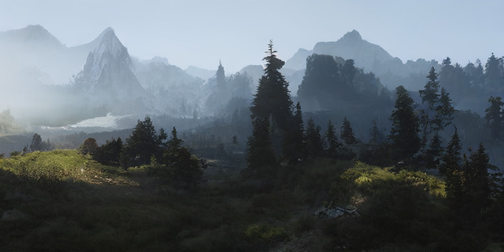

<figcaption>図12: 第 4.3.2 節のような意味的風景モデルからの畳み込みサンプル。$512^{2}$ 画像でファインチューニング済み。</figcaption>
</figure>

<figure>

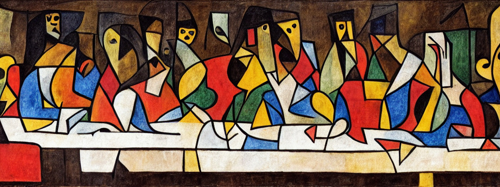

<figcaption>図13: classifier-free diffusion guidance を第 4.3.2 節の畳み込みサンプリング戦略と組み合わせることで、我々の 14.5 億パラメータの text-to-image モデルは、モデルが学習されたネイティブ解像度 $256^{2}$ より大きな画像のレンダリングに使える。</figcaption>
</figure>

## Appendix A Changelog（変更履歴）

ここでは本バージョン（arxiv.org/abs/2112.10752v2）と前バージョン（v1）の間の変更を列挙する。

- 第 4.3 節の text-to-image 合成の結果を更新した。これは新しいより大きなモデル（14.5 億パラメータ）の学習で得られたものである。これには、我々の研究の公開と同時期（[^59][^109]）またはその後（[^26]）に arXiv で公開された非常に最近の競合手法との新しい比較も含まれる。
- 第 4.1 節・表 3（および第 D.4 節）の ImageNet でのクラス条件付き合成の結果を、より大きなバッチサイズでモデルを再学習して更新した。図 26・図 27 の対応する定性結果も更新した。更新された text-to-image とクラス条件付きモデルはともに、視覚的忠実度を高める手段として classifier-free guidance を用いる。
- inpainting（第 4.5 節）と超解像モデル（第 4.4 節）の追加評価を提供するユーザー調査（Saharia ら [^72] が提案した方式に従う）を行った。
- 図 5 を本文に追加し、図 18 を付録へ移動し、図 13 を付録に追加した。

## Appendix B Detailed Information on Denoising Diffusion Models（ノイズ除去拡散モデルの詳細情報）

拡散モデルは、信号対雑音比 $\text{SNR}(t)=\frac{\alpha_{t}^{2}}{\sigma_{t}^{2}}$（系列 $(\alpha_{t})_{t=1}^{T}$ と $(\sigma_{t})_{t=1}^{T}$ から成る）の観点で指定できる。これはデータサンプル $x_{0}$ から始めて、順方向拡散過程 $q$ を次のように定義する。

$$
q(x_{t}|x_{0})=\mathcal{N}(x_{t}|\alpha_{t}x_{0},\sigma_{t}^{2}\mathbb{I})
$$

$s<t$ に対するマルコフ構造は次の通り。

$$
q(x_{t}|x_{s})=\mathcal{N}(x_{t}|\alpha_{t|s}x_{s},\sigma_{t|s}^{2}\mathbb{I}),\qquad \alpha_{t|s}=\frac{\alpha_{t}}{\alpha_{s}},\qquad \sigma_{t|s}^{2}=\sigma_{t}^{2}-\alpha_{t|s}^{2}\sigma_{s}^{2}
$$

ノイズ除去拡散モデルは、この過程を時間方向に逆走する同様のマルコフ構造で反転する生成モデル $p(x_{0})$ であり、すなわち次のように指定される。

$$
p(x_{0})=\int_{z}p(x_{T})\prod_{t=1}^{T}p(x_{t-1}|x_{t})
$$

このモデルに付随する証拠下界（evidence lower bound, ELBO）は、離散時間ステップにわたって次のように分解される。

$$
-\log p(x_{0})\leq\mathbb{KL}(q(x_{T}|x_{0})|p(x_{T}))+\sum_{t=1}^{T}\mathbb{E}_{q(x_{t}|x_{0})}\mathbb{KL}(q(x_{t-1}|x_{t},x_{0})|p(x_{t-1}|x_{t}))
$$

事前分布 $p(x_{T})$ は通常標準正規分布として選ばれ、ELBO の第一項は最終的な信号対雑音比 $\text{SNR}(T)$ のみに依存する。残りの項を最小化するために、$p(x_{t-1}|x_{t})$ をパラメータ化する一般的な選択は、真の事後分布 $q(x_{t-1}|x_{t},x_{0})$ の観点で指定するが、未知の $x_{0}$ を現在のステップ $x_{t}$ に基づく推定値 $x_{\theta}(x_{t},t)$ で置き換えることである。これは次を与える。

$$
p(x_{t-1}|x_{t})\coloneqq q(x_{t-1}|x_{t},x_{\theta}(x_{t},t))=\mathcal{N}(x_{t-1}|\mu_{\theta}(x_{t},t),\sigma_{t|t-1}^{2}\tfrac{\sigma_{t-1}^{2}}{\sigma_{t}^{2}}\mathbb{I}),
$$

ここで平均は次のように表せる。

$$
\mu_{\theta}(x_{t},t)=\frac{\alpha_{t|t-1}\sigma_{t-1}^{2}}{\sigma_{t}^{2}}x_{t}+\frac{\alpha_{t-1}\sigma_{t|t-1}^{2}}{\sigma_{t}^{2}}x_{\theta}(x_{t},t).
$$

この場合、ELBO の和は次のように簡略化される。

$$
\sum_{t=1}^{T}\mathbb{E}_{q(x_{t}|x_{0})}\mathbb{KL}(q(x_{t-1}|x_{t},x_{0})|p(x_{t-1}))=\sum_{t=1}^{T}\mathbb{E}_{\mathcal{N}(\epsilon|0,\mathbb{I})}\frac{1}{2}(\text{SNR}(t-1)-\text{SNR}(t))\|x_{0}-x_{\theta}(\alpha_{t}x_{0}+\sigma_{t}\epsilon,t)\|^{2}
$$

文献 [^30] に従い、我々は再パラメータ化

$$
\epsilon_{\theta}(x_{t},t)=(x_{t}-\alpha_{t}x_{\theta}(x_{t},t))/\sigma_{t}
$$

を用いて再構成項をノイズ除去目的関数として表す。

$$
\|x_{0}-x_{\theta}(\alpha_{t}x_{0}+\sigma_{t}\epsilon,t)\|^{2}=\frac{\sigma_{t}^{2}}{\alpha_{t}^{2}}\|\epsilon-\epsilon_{\theta}(\alpha_{t}x_{0}+\sigma_{t}\epsilon,t)\|^{2}
$$

そして各項に同じ重みを割り当てる再重み付けが、式 (1) を生じる。

## Appendix C Image Guiding Mechanisms（画像ガイディング機構）

<figure>

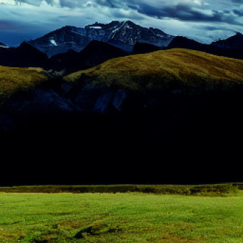

<figcaption>図14: 風景画像では、無条件モデルでの畳み込みサンプリングは均質で一貫性のない大域構造を招きうる（列 2 参照）。低解像度画像での L₂ ガイディングは一貫した大域構造の再確立を助けられる。</figcaption>
</figure>

拡散モデルの興味深い特徴は、無条件モデルをテスト時に条件付けできることである。特に [^15] は、拡散過程の各 $x_{t}$ で学習された分類器 $\log p_{\Phi}(y|x_{t})$ を用いて、ImageNet で学習された無条件・条件付きモデルの双方をガイドするアルゴリズムを提示した。我々はこの定式化に直接基づき、事後的な*画像ガイディング（image-guiding）*を導入する。

固定分散を持つ epsilon パラメータ化モデルについて、[^15] で導入されたガイディングアルゴリズムは次のようになる。

$$
\hat{\epsilon}\leftarrow\epsilon_{\theta}(z_{t},t)+\sqrt{1-\alpha_{t}^{2}}\;\nabla_{z_{t}}\log p_{\Phi}(y|z_{t})\;.
$$

これは「スコア」$\epsilon_{\theta}$ を条件付き分布 $\log p_{\Phi}(y|z_{t})$ で補正する更新として解釈できる。

これまで、このシナリオは単一クラス分類モデルにのみ適用されてきた。我々はガイディング分布 $p_{\Phi}(y|T(\mathcal{D}(z_{0}(z_{t}))))$ を、目標画像 $y$ が与えられた汎用 image-to-image 変換タスクとして再解釈する。ここで $T$ は、恒等写像・ダウンサンプリング操作などの、当該 image-to-image 変換タスクに採用された任意の微分可能変換でありうる。例として、固定分散 $\sigma^{2}=1$ のガウスガイダーを仮定すると、

$$
\log p_{\Phi}(y|z_{t})=-\frac{1}{2}\|y-T(\mathcal{D}(z_{0}(z_{t})))\|^{2}_{2}
$$

は $L_{2}$ 回帰目的関数になる。

図 14 は、この定式化が $256^{2}$ 画像で学習された無条件モデルのアップサンプリング機構としてどう機能するかを示す。ここで $256^{2}$ サイズの無条件サンプルが $512^{2}$ 画像の畳み込み合成をガイドし、$T$ は $2\times$ bicubic ダウンサンプリングである。この動機に従い、知覚的類似性ガイディングも試し、$L_{2}$ 目的関数を LPIPS 指標で置き換える（第 4.4 節参照）。

## Appendix D Additional Results（追加結果）

### D.1 High-Resolution 合成のための信号対雑音比の選択

<figure>

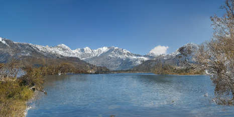

<figcaption>図15: 畳み込みサンプリングに対する潜在空間の再スケールの効果の図示（ここでは風景の意味的画像合成）。第 4.3.2 節・第 D.1 節を参照。</figcaption>
</figure>

第 4.3.2 節で議論したように、潜在空間の分散によって誘導される信号対雑音比（すなわち $\text{Var}(z)/\sigma^{2}_{t}$）は畳み込みサンプリングの結果に大きく影響する。例えば、KL 正則化モデルの潜在空間で LDM を直接学習する場合、この比は非常に高く、モデルは逆ノイズ除去過程の早い段階で多くの意味的細部を割り当てる。対照的に、第 G 節で記述するように潜在を成分ごとの標準偏差で再スケールすると、SNR は減少する。意味的画像合成についての畳み込みサンプリングへの効果を図 15 に図示する。VQ 正則化空間は分散が $1$ に近く、再スケールする必要がないことに注意する。

### D.2 全第一段階モデルの完全なリスト

OpenImages データセットで学習したさまざまなオートエンコーディングモデルの完全なリストを表 8 に提供する。

**表8**: OpenImages で学習し ImageNet-Val で評価したオートエンコーダ一覧。† は注意なしオートエンコーダを示す。（列: $f$ / コードブックサイズ $|\mathcal{Z}|$ / チャネル $c$ / R-FID↓ / R-IS↑ / PSNR↑ / PSIM↓ / SSIM↑。代表的な行のみ抜粋的に整形、数値は原典のまま。）

| $f$ | $|\mathcal{Z}|$ | $c$ | R-FID↓ | PSNR↑ | SSIM↑ |
| --- | --- | --- | --- | --- | --- |
| 16 VQGAN | 16384 | 256 | 4.98 | 19.9 ± 3.4 | 0.51 ± 0.18 |
| 8 DALL-E | 8192 | - | 32.01 | 22.8 ± 2.1 | 0.73 ± 0.13 |
| 8 (VQ) | 16384 | 4 | 1.14 | 23.07 ± 3.99 | 0.65 ± 0.16 |
| 4 (VQ) | 8192 | 3 | 0.58 | 27.43 ± 4.26 | 0.82 ± 0.10 |
| 4† (VQ, attn-free) | 8192 | 3 | 1.06 | 25.21 ± 4.17 | 0.76 ± 0.12 |
| 2 (VQ) | 2048 | 2 | 0.16 | 30.85 ± 4.12 | 0.91 ± 0.05 |
| 16 KL | - | 16 | 0.87 | 24.08 ± 4.22 | 0.68 ± 0.15 |
| 8 KL | - | 4 | 0.90 | 24.19 ± 4.19 | 0.69 ± 0.15 |
| 4 KL | - | 3 | 0.27 | 27.53 ± 4.54 | 0.82 ± 0.11 |
| 2 KL | - | 2 | 0.086 | 32.47 ± 4.19 | 0.93 ± 0.04 |

### D.3 Layout-to-Image Synthesis（レイアウトから画像への合成）

<figure>

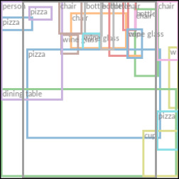

<figcaption>図16: layout-to-image 合成の最良モデル LDM-4（OpenImages で学習し COCO でファインチューニング）からのさらなるサンプル。100 DDIM ステップ・η=0 で生成。レイアウトは COCO 検証セットから。</figcaption>
</figure>

ここでは第 4.3.1 節の layout-to-image モデルの定量評価と追加サンプルを提供する。COCO で 1 つ、OpenImages で 1 つモデルを学習し、後者をさらに COCO でファインチューニングする。表 9 が結果を示す。我々の COCO モデルは、その学習・評価プロトコルに従うと、layout-to-image 合成の最新手法の性能に達する。OpenImages モデルからファインチューニングすると、これらの研究を上回る。我々の OpenImages モデルは Jahn ら [^37] の結果を FID で約 11 上回る。図 16 に COCO でファインチューニングしたモデルの追加サンプルを示す。

**表9**: COCO・OpenImages データセットでの layout-to-image モデルの定量比較。†: COCO でゼロから学習、\*: OpenImages からファインチューニング。

| Method | COCO 256² FID↓ | OpenImages 256² FID↓ | OpenImages 512² FID↓ |
| --- | --- | --- | --- |
| LostGAN-V2 | 42.55 | - | - |
| OC-GAN | 41.65 | - | - |
| SPADE | 41.11 | - | - |
| VQGAN+T | 56.58 | 45.33 | 48.11 |
| *LDM-8* (100 steps, ours) | 42.06† | - | - |
| *LDM-4* (200 steps, ours) | 40.91\* | 32.02 | 35.80 |

### D.4 Class-Conditional Image Synthesis on ImageNet（ImageNet でのクラス条件付き画像合成）

表 10 は FID と Inception score（IS）で測った我々のクラス条件付き LDM の結果を含む。LDM-8 は非常に競争力のある性能を達成するのに大幅に少ないパラメータと計算要件で済む。先行研究と同様に、各ノイズスケールで分類器を学習しそれでガイドすることで性能をさらに押し上げられる（第 C 節参照）。ピクセルベース手法とは異なり、この分類器は潜在空間で非常に安価に学習される。追加の定性結果は図 26・図 27 を参照。

**表10**: クラス条件付き ImageNet *LDM* と最新手法の比較。\*: [^67] で提案された所与の棄却率での分類器棄却サンプリング。（代表行を抜粋整形、数値は原典のまま。）

| Method | FID↓ | IS↑ | Precision↑ | Recall↑ | N_params |
| --- | --- | --- | --- | --- | --- |
| VQGAN+T | 5.88 | 304.8 ± 3.6 | - | - | 1.3B（0.05 acc. rate） |
| BigGan-deep | 6.95 | 203.6 ± 2.6 | 0.87 | 0.28 | 340M |
| ADM | 10.94 | 100.98 | 0.69 | 0.63 | 554M |
| ADM-G | 4.59 | 186.7 | 0.82 | 0.52 | 608M |
| ADM-G,ADM-U | 3.85 | 221.72 | 0.84 | 0.53 | n/a |
| *LDM-4*-G (ours) | 3.60 | 247.67 ± 5.59 | 0.87 | 0.48 | 400M（c.f.g. scale 1.5） |

### D.5 Sample Quality vs. V100 Days（サンプル品質 対 V100 日）

<figure>

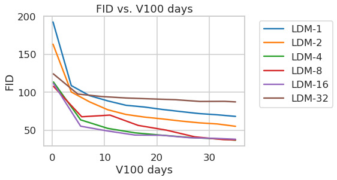

<figcaption>図17: 完全性のため、固定された 35 V100 日に対する ImageNet データセットでのクラス条件付き LDM の学習進捗も報告する。100 DDIM ステップ・κ=0 で得た結果。効率上の理由で FID は 5000 サンプルで計算。</figcaption>
</figure>

第 4.1 節のサンプル品質の学習進捗にわたる評価では、FID と IS を学習ステップ数の関数として報告した。別の可能性は、これらの指標を使用した資源（V100 日）にわたって報告することである。そのような分析を図 17 に追加で提供し、定性的に同様の結果を示す。

### D.6 Super-Resolution（超解像）

**表11**: ImageNet-Val（$256^{2}$）での $\times 4$ アップスケーリング結果。†: FID 特徴量は検証分割で計算、‡: 学習分割で計算。LDM-4 と同じ計算量を受け取るピクセル空間ベースラインも含む。最後の 2 行は前の結果と比べて 15 エポックの追加学習を受けた。

| Method | FID↓ | IS↑ | PSNR↑ | SSIM↑ |
| --- | --- | --- | --- | --- |
| Image Regression | 15.2 | 121.1 | 27.9 | 0.801 |
| SR3 | 5.2 | 180.1 | 26.4 | 0.762 |
| *LDM-4* (ours, 100 steps) | 2.8†/4.8‡ | 166.3 | 24.4 ± 3.8 | 0.69 ± 0.14 |
| *LDM-4* (ours, 100 steps, +15 ep.) | 2.6†/4.6‡ | 169.76 ± 5.03 | 24.4 ± 3.8 | 0.69 ± 0.14 |
| Pixel-DM (100 steps, +15 ep.) | 5.1†/7.1‡ | 163.06 ± 4.67 | 24.1 ± 3.3 | 0.59 ± 0.12 |

LDM とピクセル空間の拡散モデルのより良い比較可能性のため、同じステップ数・同程度のパラメータ数で学習した拡散モデルを我々の LDM と比較して表 5 の分析を拡張する。この比較の結果は表 11 の最後の 2 行に示され、LDM がより速いサンプリングを可能にしつつより良い性能を達成することを実証する。定性的比較は図 20 に与えられ、LDM とピクセル空間の拡散モデルの双方からのランダムサンプルを示す。

#### D.6.1 LDM-BSR: 多様な画像劣化による汎用 SR モデル

**表（図18）**: bicubic / *LDM-SR* / *LDM-BSR* の比較（原典はこの位置に画像比較表を置くが、ar5iv では画像リンクが取得されておらず本翻訳には画像なし）。

> 図18: *LDM-BSR* は任意の入力に汎化し、汎用アップサンプラーとして使え、クラス条件付き *LDM* のサンプル（図 4 参照）を $1024^{2}$ 解像度にアップスケールする。対照的に、固定された劣化過程（第 4.4 節参照）を用いると汎化が妨げられる。

LDM-SR の汎化を評価するために、クラス条件付き ImageNet モデル（第 4.1 節）からの合成 LDM サンプルとインターネットからクロールした画像の双方に適用する。興味深いことに、[^72] のように bicubic にダウンサンプリングされた条件付けのみで学習された LDM-SR は、この前処理に従わない画像にはよく汎化しないことを観察する。したがって、カメラノイズ・圧縮アーティファクト・ぼかし・補間の複雑な重畳を含みうる広範な実世界画像のための超解像モデルを得るために、LDM-SR の bicubic ダウンサンプリング操作を [^105] の劣化パイプラインで置き換える。BSR 劣化過程は、JPEG 圧縮ノイズ・カメラセンサーノイズ・ダウンサンプリングのための異なる画像補間・ガウスぼかしカーネル・ガウスノイズをランダムな順序で画像に適用する劣化パイプラインである。元のパラメータでの bsr 劣化過程は非常に強い劣化過程を招くことがわかった。我々の応用にはより穏やかな劣化過程が適切と思われたため、bsr 劣化のパラメータを調整した（調整版はコードベースにある）。図 18 は *LDM-SR* と *LDM-BSR* を直接比較してこのアプローチの有効性を図示する。後者は固定前処理に制限されたモデルよりはるかにシャープな画像を生成し、実世界応用に適する。*LDM-BSR* のさらなる結果は図 19 の LSUN-cows に示す。

<figure>

<figcaption>図19: LDM-BSR は任意の入力に汎化し、汎用アップサンプラーとして使え、LSUN-Cows データセットのサンプルを $1024^{2}$ 解像度にアップスケールする。</figcaption>
</figure>

<figure>

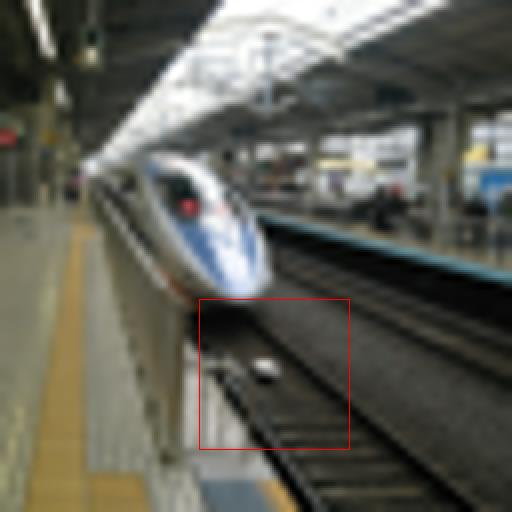

<figcaption>図20: LDM-SR とピクセル空間のベースライン拡散モデルの 2 つのランダムサンプルの定性的超解像比較。同じ学習ステップ数後に ImageNet 検証セットで評価。</figcaption>
</figure>

## Appendix E Implementation Details and Hyperparameters（実装詳細とハイパーパラメータ）

### E.1 Hyperparameters

全学習済み *LDM* モデルのハイパーパラメータの概要を表 12・13・14・15 に提供する。

**表12**: 表 1 の数値を生み出す無条件 *LDM* のハイパーパラメータ。全モデルを単一 NVIDIA A100 で学習。（CelebA-HQ / FFHQ / LSUN-Churches / LSUN-Bedrooms。$f$=4/4/8/4、拡散ステップ 1000、ノイズスケジュール linear、$N_{\text{params}}$≈274-294M、Channels 192-224、Attention resolutions 32/16/8 など。詳細数値は原典参照。）

**表13**: 第 4.1 節の分析のため ImageNet で学習した条件付き *LDM*（LDM-1〜LDM-32）のハイパーパラメータ。全モデルを単一 A100 で学習。条件付けは全て CA（cross-attention）、拡散ステップ 1000、Model Size 391-396M、2M iterations。

**表14**: 図 7 の分析のため CelebA で学習した無条件 *LDM* のハイパーパラメータ。全モデルを単一 A100 で 500k iterations 学習。

**表15**: 第 4 節の条件付き *LDM*（Text-to-Image / Layout / Class-Label / Super Resolution / Inpainting / Semantic-Map）のハイパーパラメータ。inpainting モデル（8×V100）を除き全モデルを単一 A100 で学習。text-to-image モデルは $f$=8・Model Size 1.45B・Channels 320・8 heads・条件付け CA・Embedding 1280。SR/Inpainting/Semantic は concat 条件付け。

### E.2 Implementation Details

#### E.2.1 条件付き LDM のための $\tau_{\theta}$ の実装

text-to-image・layout-to-image 合成（第 4.3.1 節）の実験では、条件付け器 $\tau_{\theta}$ を、入力 $y$ のトークン化版を処理し出力 $\zeta:=\tau_{\theta}(y)$（$\zeta\in\mathbb{R}^{M\times d_{\tau}}$）を生成するマスクなしトランスフォーマーとして実装する。より具体的には、トランスフォーマーは大域的自己注意層・layer-normalization・位置ごとの MLP から成る $N$ 個のトランスフォーマーブロックから次のように実装される。

$$
\begin{aligned}
&\zeta\leftarrow\text{TokEmb}(y)+\text{PosEmb}(y)\\
&\text{for }i=1,\dots,N:\\
&\quad\zeta_{1}\leftarrow\text{LayerNorm}(\zeta)\\
&\quad\zeta_{2}\leftarrow\text{MultiHeadSelfAttention}(\zeta_{1})+\zeta\\
&\quad\zeta_{3}\leftarrow\text{LayerNorm}(\zeta_{2})\\
&\quad\zeta\leftarrow\text{MLP}(\zeta_{3})+\zeta_{2}\\
&\zeta\leftarrow\text{LayerNorm}(\zeta)
\end{aligned}
$$

$\zeta$ が利用可能になると、条件付けは図 3 に描かれた cross-attention 機構を介して UNet へ写像される。我々は「ablated UNet」アーキテクチャを修正し、自己注意層を、(i) 自己注意・(ii) 位置ごとの MLP・(iii) cross-attention 層の層を交互に持つ $T$ ブロックから成る浅い（マスクなし）トランスフォーマーで置き換える（表 16 参照）。(ii) と (iii) なしでは、このアーキテクチャは「ablated UNet」と等価であることに注意する。

$t$ にも条件付けることで $\tau_{\theta}$ の表現力を高めることは可能だが、推論速度を下げるためこの選択は追求しない。この修正のより詳細な分析は将来の課題とする。

text-to-image モデルには公開のトークナイザに頼る。layout-to-image モデルはバウンディングボックスの空間位置を離散化し、各ボックスを $(l,b,c)$ タプルとしてエンコードする（$l$ は離散の左上、$b$ は右下位置、クラス情報は $c$ に含まれる）。上記両タスクの $\tau_{\theta}$ のハイパーパラメータは表 17 を、UNet のものは表 13 を参照。

第 4.1 節で記述したクラス条件付きモデルも cross-attention を介して実装され、そこでは $\tau_{\theta}$ が次元 512 の単一の学習可能埋め込み層で、クラス $y$ を $\zeta\in\mathbb{R}^{1\times 512}$ に写像することに注意する。

**表16**: 第 E.2.1 節で記述したトランスフォーマーブロックのアーキテクチャ（標準「ablated UNet」の自己注意層を置き換える）。$n_{h}$ は注意ヘッド数、$d$ はヘッドあたりの次元。（入力 → LayerNorm → Conv1x1 → Reshape → ×T{SelfAttention / MLP / CrossAttention} → Reshape → Conv1x1。）

**表17**: 第 4.3 節のトランスフォーマーエンコーダの実験のハイパーパラメータ。Text-to-Image: seq-length 77・depth N 32・dim 1280。Layout-to-Image: seq-length 92・depth 16・dim 512。

#### E.2.2 Inpainting

<figure>

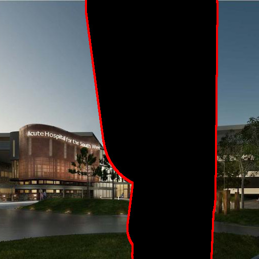

<figcaption>図21: 画像 inpainting の定性結果。文献 88 とは対照的に、我々の生成的アプローチは所与の入力に対して複数の多様なサンプルの生成を可能にする。</figcaption>
</figure>

<figure>

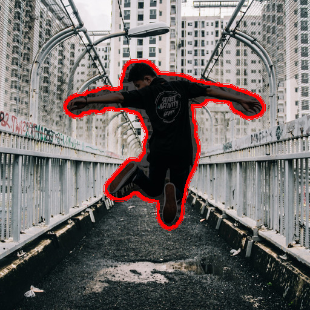

<figcaption>図22: 図 11 のような物体除去のさらなる定性結果。</figcaption>
</figure>

第 4.5 節の画像 inpainting の実験では、合成マスクを生成するために [^88] のコードを用いた。Places から 2k の検証サンプルと 30k のテストサンプルの固定集合を用いる。学習中はサイズ $256\times 256$ のランダムクロップを用い、$512\times 512$ のクロップで評価する。これは [^88] の学習・テストプロトコルに従い、報告された指標を再現する（表 7 の † 参照）。*LDM-4, w/ attn* の追加定性結果を図 21 に、*LDM-4, w/o attn, big, w/ ft* のものを図 22 に含める。

### E.3 Evaluation Details（評価詳細）

この節は第 4 節の実験の評価に関する追加詳細を提供する。

#### E.3.1 無条件・クラス条件付き画像合成の定量結果

一般的な慣行に従い、表 1・10 に示す FID・Precision・Recall スコアの統計量を、我々のモデルからの 50k サンプルと各データセットの全学習セットに基づいて推定する。FID スコアの計算には torch-fidelity パッケージを用いる。しかし、異なるデータ処理パイプラインは異なる結果を招きうるため、Dhariwal と Nichol が提供するスクリプトでもモデルを評価する。結果は主に一致するが、ImageNet と LSUN-Bedrooms では 7.76（torch-fidelity）対 7.77（Nichol and Dhariwal）、2.95 対 3.0 とわずかに異なるスコアに気づく。将来のために、サンプル品質評価の統一手続きの重要性を強調する。Precision と Recall も Nichol と Dhariwal のスクリプトを用いて計算する。

#### E.3.2 Text-to-Image Synthesis

[^66] の評価プロトコルに従い、表 2 の text-to-image モデルの FID と Inception Score を、生成サンプルと MS-COCO データセットの検証セットからの 30000 サンプルを比較して計算する。FID と Inception Score は torch-fidelity で計算する。

#### E.3.3 Layout-to-Image Synthesis

COCO での表 9 の layout-to-image モデルのサンプル品質を評価するため、一般的な慣行に従い COCO Segmentation Challenge 分割の 2048 の拡張なし例で FID スコアを計算する。より良い比較可能性のため、[^37] とまったく同じサンプルを用いる。OpenImages データセットについても同様にプロトコルに従い、検証セットから 2048 の中央クロップテスト画像を用いる。

#### E.3.4 Super Resolution

[^72] が提案したパイプラインに従い ImageNet で超解像モデルを評価する。すなわち短辺が $256$ px 未満の画像は（学習・評価ともに）除去される。ImageNet では低解像度画像はアンチエイリアス付き bicubic 補間で生成される。FID は torch-fidelity で評価し、検証分割でサンプルを生成する。FID スコアについては、学習分割で計算した参照特徴量とも追加で比較する（表 5・表 11 参照）。

#### E.3.5 Efficiency Analysis

効率上の理由で、図 6・17・7 にプロットしたサンプル品質指標は 5k サンプルに基づいて計算する。したがって結果は表 1・10 のものと異なりうる。全モデルは表 13・14 に提供される同程度のパラメータ数を持つ。各モデルの学習率を、安定して学習する範囲で最大化する。したがって学習率は異なる実行間でわずかに異なる（表 13・14 参照）。

#### E.3.6 User Study

表 4 のユーザー調査の結果については、[^72] のプロトコルに従い、2 つの異なるタスクの人間の好みスコアを評価するために 2 択強制選択パラダイムを用いる。タスク1 では、被験者に対応する正解高解像度/マスクなし版と、中央の画像を条件付けとして生成された合成画像との間に、低解像度/マスク画像を見せた。超解像については「中央の低解像度画像のより高品質な版はどちらの画像か？」と尋ねた。inpainting については「中央の画像のより写実的に inpaint された領域を含むのはどちらの画像か？」と尋ねた。タスク2 では、被験者に同様に低解像度/マスク版を見せ、競合する 2 手法で生成された 2 つの対応画像の間の好みを尋ねた。[^72] と同様に、被験者は応答前に 3 秒間画像を見た。

## Appendix F Computational Requirements（計算要件）

**表18**: 学習時の計算要件と推論スループットを最先端の生成モデルと比較。学習時の計算は V100 日、競合手法の数値は特記なき限り [^15] より。\*: スループットは単一 NVIDIA A100 上の samples/sec。c.f.g. = classifier-free guidance。（代表行を抜粋整形。Compute は学習計算 V100 日。）

| Method | 学習 Compute (V100日) | Inference Throughput\* | N_params | FID↓ |
| --- | --- | --- | --- | --- |
| LSUN Churches: StyleGAN2† | 64 | - | 59M | 3.86 |
| LSUN Churches: *LDM-8* (ours, 100 steps) | 18 | 6.80 | 256M | 4.02 |
| LSUN Bedrooms: ADM† (1000 steps) | 232 | 0.03 | 552M | 1.9 |
| LSUN Bedrooms: *LDM-4* (ours, 200 steps) | 55 | 1.07 | 274M | 2.95 |
| ImageNet: ADM (250 steps)† | 916 | 0.12 | 554M | 10.94 |
| ImageNet: ADM-G (250 steps)† | 962 | 0.07 | 608M | 4.59 |
| ImageNet: *LDM-4-G* (ours, 250 ddim, c.f.g. 1.5) | 271 | 0.4 | 400M | 3.60 |

表 18 では、使用した計算資源についてのより詳細な分析を提供し、CelebA-HQ・FFHQ・LSUN・ImageNet データセットでの我々の最良モデルを、提供された数値を用いて最新の最先端モデルと比較する。それらは使用計算を V100 日で報告し、我々は全モデルを単一 NVIDIA A100 GPU で学習するため、A100 対 V100 の $\times 2.2$ 高速化を仮定して A100 日を V100 日に変換する。サンプル品質を評価するため、報告データセットの FID スコアも追加で報告する。我々は StyleGAN2 や ADM のような最先端手法の性能に近づきつつ、必要な計算資源を大幅に削減する。

## Appendix G Details on Autoencoder Models（オートエンコーダモデルの詳細）

我々は全オートエンコーダモデルを敵対的に学習する。すなわちパッチベースの識別器 $D_{\psi}$ が、元画像と再構成 $\mathcal{D}(\mathcal{E}(x))$ を区別するように最適化される。任意にスケールされた潜在空間を避けるため、潜在 $z$ をゼロ中心に正則化し、正則化損失項 $L_{reg}$ を導入して小さい分散を得る。我々は 2 つの異なる正則化手法を調べる。(i) 標準 VAE のような、$q_{\mathcal{E}}(z|x)=\mathcal{N}(z;\mathcal{E}_{\mu},\mathcal{E}_{\sigma^{2}})$ と標準正規分布 $\mathcal{N}(z;0,1)$ の間の低重み Kullback-Leibler 項、および (ii) $|\mathcal{Z}|$ 個の異なる代表例のコードブックを学習することによるベクトル量子化層での潜在空間の正則化。高忠実度の再構成を得るため、両シナリオで非常に小さい正則化のみを用いる。すなわち $\mathbb{KL}$ 項を係数 $\sim 10^{-6}$ で重み付けするか、高いコードブック次元 $|\mathcal{Z}|$ を選ぶ。

オートエンコーディングモデル $(\mathcal{E},\mathcal{D})$ を学習する完全な目的関数は次の通り。

$$
L_{\text{Autoencoder}}=\min_{\mathcal{E},\mathcal{D}}\max_{\psi}\Big{(}L_{rec}(x,\mathcal{D}(\mathcal{E}(x)))-L_{adv}(\mathcal{D}(\mathcal{E}(x)))+\log D_{\psi}(x)+L_{reg}(x;\mathcal{E},\mathcal{D})\Big{)}
$$

##### 潜在空間での DM 学習

学習された潜在空間で拡散モデルを学習する際、$p(z)$ または $p(z|y)$ を学習するとき（第 4.3 節）に再び 2 つの場合を区別することに注意する。(i) KL 正則化潜在空間については、$z=\mathcal{E}_{\mu}(x)+\mathcal{E}_{\sigma}(x)\cdot\varepsilon=:\mathcal{E}(x)$（$\varepsilon\sim\mathcal{N}(0,1)$）をサンプリングする。潜在を再スケールするときは、データの最初のバッチから成分ごとの分散

$$
\hat{\sigma}^{2}=\frac{1}{bchw}\sum_{b,c,h,w}(z^{b,c,h,w}-\hat{\mu})^{2}
$$

を推定する（$\hat{\mu}=\frac{1}{bchw}\sum_{b,c,h,w}z^{b,c,h,w}$）。$\mathcal{E}$ の出力は、再スケールされた潜在が単位標準偏差を持つようにスケールされる、すなわち $z\leftarrow\frac{z}{\hat{\sigma}}=\frac{\mathcal{E}(x)}{\hat{\sigma}}$。(ii) VQ 正則化潜在空間については、量子化層の*前*で $z$ を抽出し、量子化操作をデコーダに吸収する、すなわちそれは $\mathcal{D}$ の最初の層として解釈できる。

## Appendix H Additional Qualitative Results（追加の定性結果）

最後に、我々の風景モデル（図 12・23・24・25）、クラス条件付き ImageNet モデル（図 26-27）、CelebA-HQ・FFHQ・LSUN データセットの無条件モデル（図 28-31）の追加定性結果を提供する。第 4.5 節の inpainting モデルと同様に、第 4.3.2 節の意味的風景モデルも $512^{2}$ 画像で直接ファインチューニングし、図 12・図 23 に定性結果を示す。比較的小さいデータセットで学習されたモデルについては、図 32-34 で VGG 特徴空間における我々のモデルのサンプルの最近傍も追加で示す。

<figure>

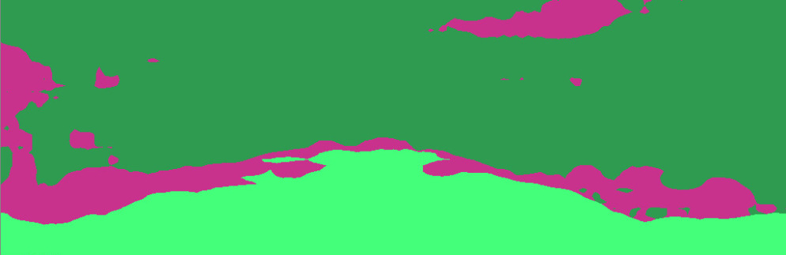

<figcaption>図23: 第 4.3.2 節のような意味的風景モデルからの畳み込みサンプル。$512^{2}$ 画像でファインチューニング済み。</figcaption>
</figure>

<figure>

<figcaption>図24: $256^{2}$ 解像度で学習された LDM は、風景画像の意味的合成のような空間的に条件付けされたタスクについてより大きな解像度に汎化できる。第 4.3.2 節を参照。</figcaption>
</figure>

<figure>

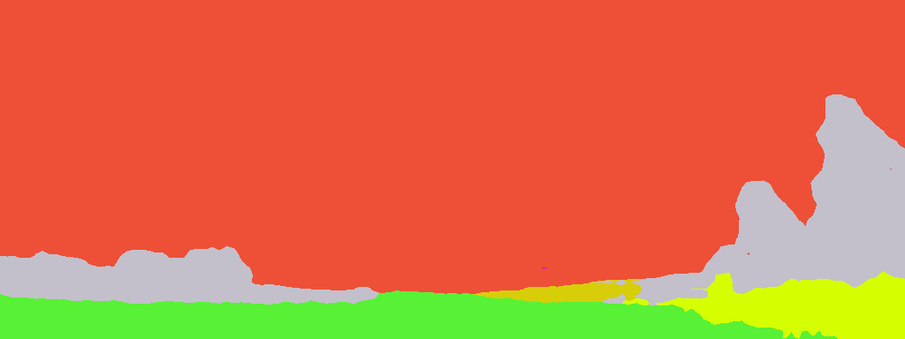

<figcaption>図25: 意味マップを条件付けとして与えられると、我々の LDM は学習時に見たものより大幅に大きな解像度に汎化する。このモデルはサイズ $256^{2}$ の入力で学習されたが、ここに示すような解像度 1024×384 の高解像度サンプルの作成に使える。</figcaption>
</figure>

<figure>

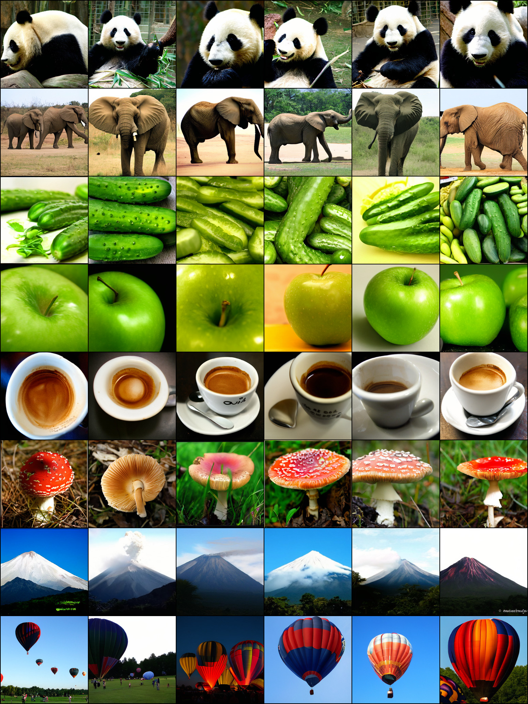

<figcaption>図26: ImageNet データセットで学習された LDM-4 からのランダムサンプル。classifier-free guidance スケール s=5.0・200 DDIM ステップ・η=1.0 でサンプリング。</figcaption>
</figure>

<figure>

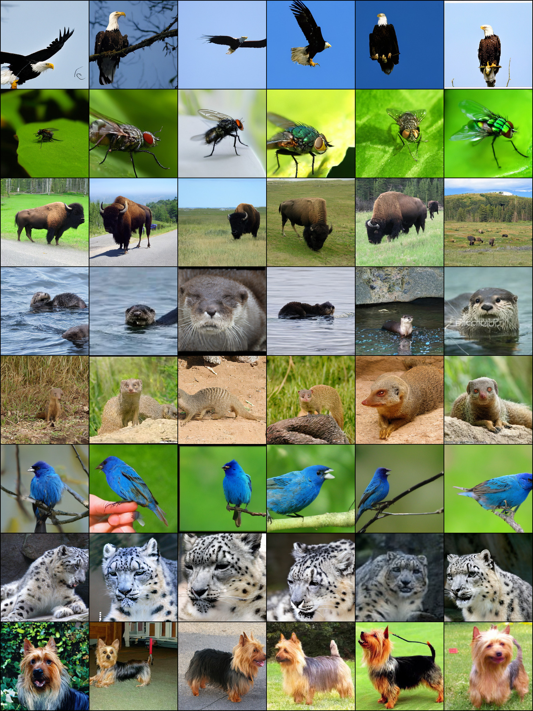

<figcaption>図27: ImageNet データセットで学習された LDM-4 からのランダムサンプル。classifier-free guidance スケール s=3.0・200 DDIM ステップ・η=1.0 でサンプリング。</figcaption>
</figure>

<figure>

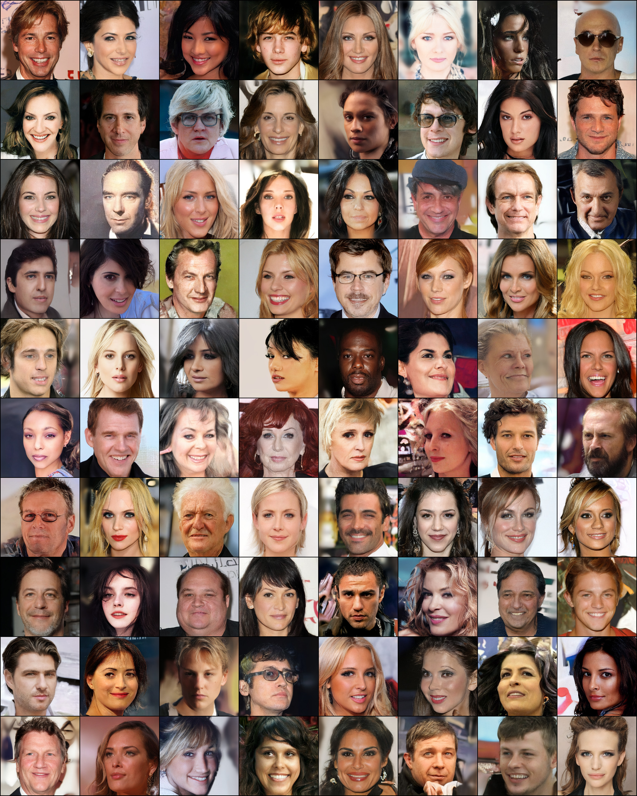

<figcaption>図28: CelebA-HQ データセットでの最良モデル LDM-4 のランダムサンプル。500 DDIM ステップ・η=0 でサンプリング（FID = 5.15）。</figcaption>
</figure>

<figure>

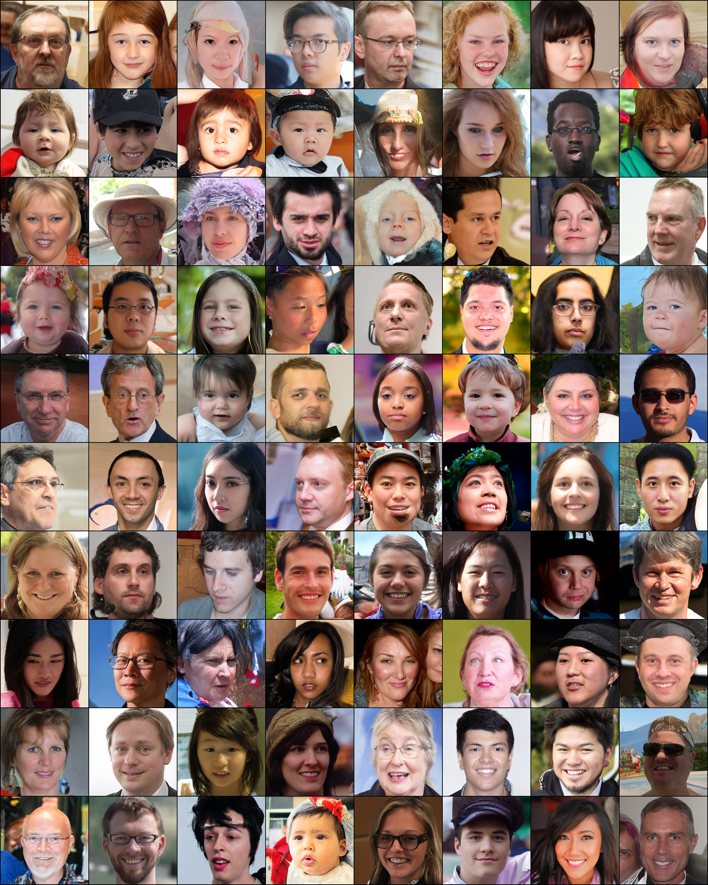

<figcaption>図29: FFHQ データセットでの最良モデル LDM-4 のランダムサンプル。200 DDIM ステップ・η=1 でサンプリング（FID = 4.98）。</figcaption>
</figure>

<figure>

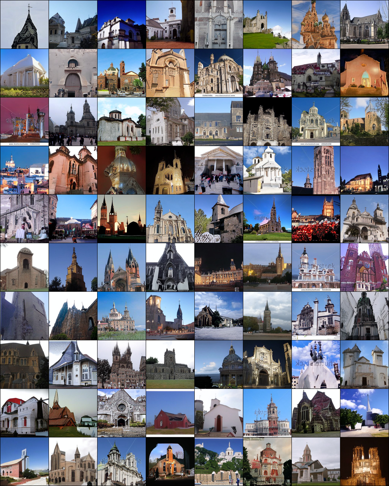

<figcaption>図30: LSUN-Churches データセットでの最良モデル LDM-8 のランダムサンプル。200 DDIM ステップ・η=0 でサンプリング（FID = 4.48）。</figcaption>
</figure>

<figure>

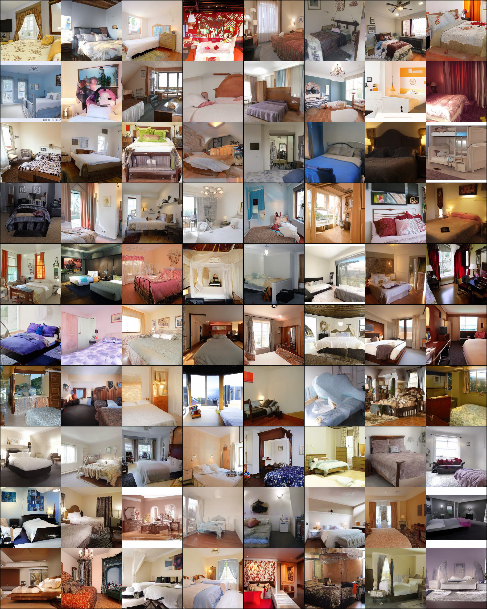

<figcaption>図31: LSUN-Bedrooms データセットでの最良モデル LDM-4 のランダムサンプル。200 DDIM ステップ・η=1 でサンプリング（FID = 2.95）。</figcaption>
</figure>

<figure>

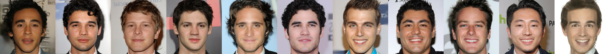

<figcaption>図32: 我々の最良 CelebA-HQ モデルの最近傍（VGG-16 の特徴空間で計算）。最左のサンプルは我々のモデルから。各行の残りのサンプルはその 10 近傍。</figcaption>
</figure>

<figure>

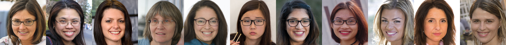

<figcaption>図33: 我々の最良 FFHQ モデルの最近傍（VGG-16 の特徴空間で計算）。最左のサンプルは我々のモデルから。各行の残りのサンプルはその 10 近傍。</figcaption>
</figure>

<figure>

<figcaption>図34: 我々の最良 LSUN-Churches モデルの最近傍（VGG-16 の特徴空間で計算）。最左のサンプルは我々のモデルから。各行の残りのサンプルはその 10 近傍。</figcaption>
</figure>
