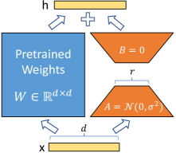
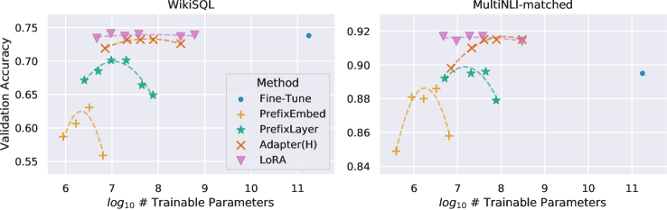
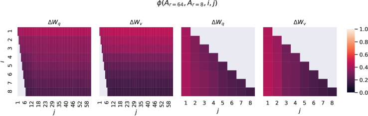
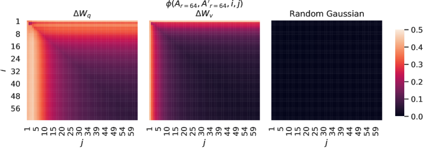
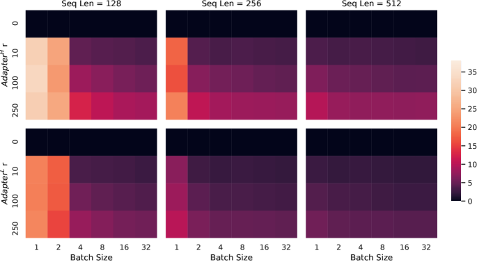
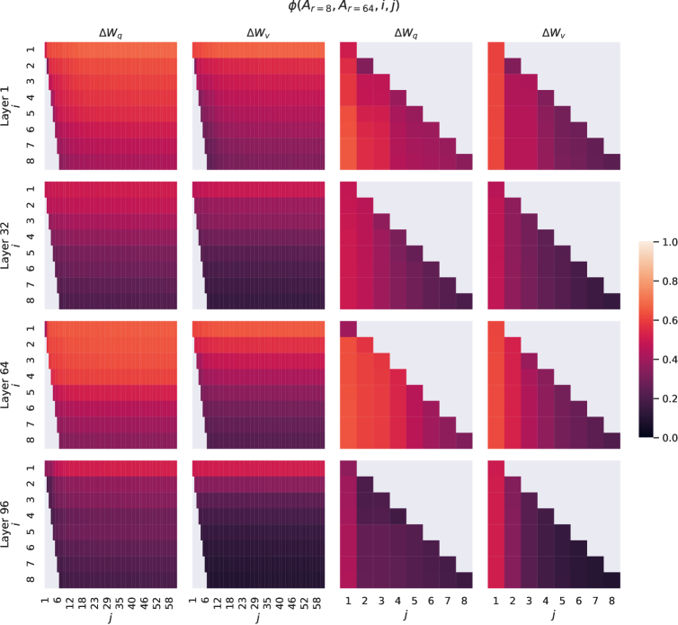
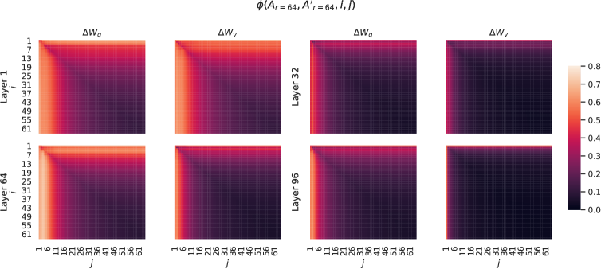
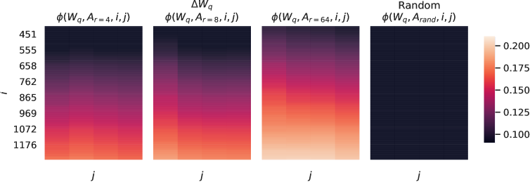

# LoRA: 大規模言語モデルの低ランク適応

> 原題: LoRA: Low-Rank Adaptation of Large Language Models
> 著者: Edward J. Hu, Yelong Shen, Phillip Wallis, Zeyuan Allen-Zhu, Yuanzhi Li, Shean Wang, Lu Wang, Weizhu Chen（Microsoft）
> 出典: ICLR 2022 ・ arXiv:2106.09685
> コード: https://github.com/microsoft/LoRA

## Abstract（要旨）

自然言語処理の重要なパラダイムの 1 つは、一般ドメインデータでの大規模事前学習と、特定タスク・ドメインへの適応からなる。より大きなモデルを事前学習するにつれ、全パラメータを再学習する full fine-tuning（全ファインチューニング）は実行可能性が下がる。GPT-3 175B を例にとると、それぞれ 175B パラメータを持つファインチューニング済みモデルの独立インスタンスを配備するのは、法外に高価である。我々は Low-Rank Adaptation（LoRA, 低ランク適応）を提案する。これは事前学習済みモデルの重みを凍結し、学習可能な階数分解行列（rank decomposition matrices）を Transformer アーキテクチャの各層に注入することで、下流タスクの学習可能パラメータ数を大幅に削減する。Adam でファインチューニングした GPT-3 175B と比べ、LoRA は学習可能パラメータ数を 10,000 倍、GPU メモリ要件を 3 倍削減できる。LoRA は、より少ない学習可能パラメータ・より高い学習スループット・（adapter と違い）追加の推論レイテンシなし、でありながら、RoBERTa・DeBERTa・GPT-2・GPT-3 でモデル品質においてファインチューニングと同等以上の性能を示す。我々はまた、言語モデル適応における rank-deficiency（階数欠損）の経験的調査も提供し、LoRA の有効性に光を当てる。LoRA を PyTorch モデルに統合しやすくするパッケージを公開し、RoBERTa・DeBERTa・GPT-2 の実装とモデルチェックポイントを https://github.com/microsoft/LoRA で提供する。

<figure>

<figcaption>図1: 我々の再パラメータ化。$A$ と $B$ のみを学習する。事前学習重み W∈ℝ^(d×d) は凍結し、入力 x に対して、A（ガウス初期化）と B（ゼロ初期化）からなる低ランク経路（中間階数 r）の出力を足して h を得る。</figcaption>
</figure>

## 1 はじめに

自然言語処理の多くの応用は、*1 つ*の大規模な事前学習済み言語モデルを*複数*の下流応用に適応させることに依拠する。そうした適応は通常 *fine-tuning* によって行われ、事前学習済みモデルの全パラメータを更新する。fine-tuning の主な欠点は、新しいモデルが元のモデルと同数のパラメータを含むことである。数か月ごとに大きなモデルが学習される今、これは GPT-2 や RoBERTa large では単なる「不便」だが、175 億の学習可能パラメータを持つ GPT-3 では配備上の致命的な課題に変わる。

多くの研究が、新しいタスクに対して一部のパラメータだけを適応させるか、外部モジュールを学習することでこれを緩和しようとした。この方法なら、各タスクについて事前学習済みモデルに加えて少数のタスク固有パラメータだけを保存・読み込めばよく、配備時の運用効率が大きく上がる。しかし既存技術は、モデルの深さを増すことでしばしば推論レイテンシを導入したり、モデルの使用可能な系列長を減らしたりする（第3節）。さらに重要なことに、これらの手法はしばしば fine-tuning のベースラインに匹敵せず、効率とモデル品質のトレードオフを生む。

我々は、学習された過剰パラメータ化モデルが実は低い内在次元（intrinsic dimension）に存在することを示した研究に着想を得る。我々は、モデル適応中の重みの変化もまた低い「内在階数（intrinsic rank）」を持つと仮説を立て、提案する Low-Rank Adaptation（LoRA）に至る。LoRA は、事前学習済み重みを凍結したまま、適応中の dense 層の変化を表す階数分解行列を代わりに最適化することで、ニューラルネットワークの一部の dense 層を間接的に学習できる（図1）。GPT-3 175B を例に、フル階数（図1 の $d$）が 12,288 と高くても、非常に低い階数（図1 の $r$ は 1 や 2 でよい）で十分であることを示す。これにより LoRA はストレージ・計算の両面で効率的になる。

LoRA はいくつかの重要な利点を持つ。

- 事前学習済みモデルを共有し、異なるタスク用の多数の小さな LoRA モジュールを構築できる。共有モデルを凍結し、図1 の行列 $A$ と $B$ を差し替えることで効率的にタスクを切り替えられ、ストレージ要件とタスク切替のオーバーヘッドを大きく削減する。
- LoRA は学習を効率化し、適応的オプティマイザ使用時にハードウェアの参入障壁を最大 3 倍下げる。大部分のパラメータについて勾配の計算もオプティマイザ状態の保持も不要で、注入された遥かに小さい低ランク行列だけを最適化するからである。
- 我々の単純な線形設計により、配備時に学習可能行列を凍結重みとマージでき、構成上、完全にファインチューニングしたモデルと比べて追加の推論レイテンシを導入しない。
- LoRA は多くの先行手法と直交し、prefix-tuning など多くと組み合わせられる。例を Appendix E に示す。

#### 用語と慣例

我々は Transformer アーキテクチャを頻繁に参照し、その次元について慣例的な用語を使う。Transformer 層の入出力次元サイズを $d_{model}$ と呼ぶ。自己注意モジュールの query/key/value/output 射影行列を $W_{q}$, $W_{k}$, $W_{v}$, $W_{o}$ で表す。$W$ または $W_{0}$ は事前学習済み重み行列、$\Delta W$ は適応中に累積した勾配更新を指す。LoRA モジュールの階数を $r$ で表す。最適化には Adam を用い、Transformer の MLP フィードフォワード次元を $d_{ffn}=4\times d_{model}$ とする慣例に従う。

## 2 問題設定

我々の提案は学習目的に依存しないが、動機づけの使用例として言語モデリングに焦点を当てる。以下は言語モデリング問題、特にタスク固有プロンプトが与えられたときの条件付き確率の最大化の簡単な記述である。

パラメータ $\Phi$ を持つ事前学習済み自己回帰言語モデル $P_{\Phi}(y|x)$ が与えられたとする。例えば $P_{\Phi}(y|x)$ は Transformer に基づく GPT のような汎用マルチタスク学習器でありうる。この事前学習済みモデルを、要約・機械読解（MRC）・自然言語から SQL（NL2SQL）といった下流の条件付きテキスト生成タスクに適応させることを考える。各下流タスクは文脈・目標ペアの学習データセット $\mathcal{Z}=\{(x_{i},y_{i})\}_{i=1,..,N}$ で表される（$x_{i}$ も $y_{i}$ もトークン列）。例えば NL2SQL では $x_{i}$ が自然言語クエリ、$y_{i}$ が対応する SQL コマンドである。

full fine-tuning では、モデルは事前学習重み $\Phi_{0}$ に初期化され、条件付き言語モデリング目的を最大化する勾配を繰り返したどって $\Phi_{0}+\Delta\Phi$ に更新される：

$$
\max_{\Phi}\sum_{(x,y)\in\mathcal{Z}}\sum_{t=1}^{|y|}\log\left(P_{\Phi}(y_{t}|x,y_{<t})\right)
$$

full fine-tuning の主な欠点の 1 つは、*各*下流タスクについて、次元 $|\Delta\Phi|$ が $|\Phi_{0}|$ に等しい*異なる*パラメータ集合 $\Delta\Phi$ を学習することである。したがって事前学習済みモデルが大きい（GPT-3 で $|\Phi_{0}|\approx175$ Billion など）と、多数の独立したファインチューニング済みモデルインスタンスを保存・配備するのは困難、あるいは実行不可能になりうる。

本論文では、よりパラメータ効率の良いアプローチを採る。タスク固有のパラメータ増分 $\Delta\Phi=\Delta\Phi(\Theta)$ を、$|\Theta|\ll|\Phi_{0}|$ となる遥かに小さいパラメータ集合 $\Theta$ でさらに符号化する。こうして $\Delta\Phi$ を見つける問題は $\Theta$ 上の最適化になる：

$$
\max_{\Theta}\sum_{(x,y)\in\mathcal{Z}}\sum_{t=1}^{|y|}\log\left(p_{\Phi_{0}+\Delta\Phi(\Theta)}(y_{t}|x,y_{<t})\right)
$$

以降の節で、$\Delta\Phi$ を計算・メモリの両面で効率的に符号化する低ランク表現の使用を提案する。事前学習済みモデルが GPT-3 175B のとき、学習可能パラメータ数 $|\Theta|$ は $|\Phi_{0}|$ の $0.01\%$ まで小さくできる。

## 3 既存の解決策では不十分か？

我々が取り組む問題は決して新しくない。転移学習の登場以来、モデル適応をよりパラメータ・計算効率的にしようと数十の研究が試みてきた（第6節に既知の研究の概観）。言語モデリングを例にとると、効率的な適応には 2 つの顕著な戦略がある：adapter 層を追加するか、入力層の活性のなんらかの形を最適化するか。しかし、どちらの戦略にも、特に大規模かつレイテンシ重視の本番シナリオで、限界がある。

#### Adapter 層は推論レイテンシを導入する

adapter には多くの変種がある。我々は Transformer ブロックごとに 2 つの adapter 層を持つ元の設計と、ブロックごとに 1 つだが追加の LayerNorm を持つ最近のものに焦点を当てる。層の枝刈りやマルチタスク設定で全体レイテンシは減らせるが、adapter 層の追加計算を直接迂回する方法はない。adapter 層は小さなボトルネック次元で少数のパラメータ（元モデルの 1% 未満のことも）を持つよう設計されるので、これは非問題に見える。しかし大規模ニューラルネットはレイテンシを低く保つためハードウェア並列性に依拠し、adapter 層は逐次処理せねばならない。バッチサイズが通常 1 程度に小さいオンライン推論設定では、これが差を生む。モデル並列なしの一般的シナリオ（単一 GPU での GPT-2 medium 推論など）では、非常に小さいボトルネック次元でも adapter 使用時にレイテンシの顕著な増加が見られる（表1）。

**表1**: 100 試行で平均した、GPT-2 medium の単一順伝播の推論レイテンシ（ミリ秒）。NVIDIA Quadro RTX8000 を使用。「$|\Theta|$」は adapter 層の学習可能パラメータ数。$\text{Adapter}^{\text{L}}$ と $\text{Adapter}^{\text{H}}$ は第5.1節で述べる 2 変種。adapter 層が導入するレイテンシは、オンライン・短系列長シナリオで顕著になりうる。

| | | | |
| --- | --- | --- | --- |
| Batch Size | 32 | 16 | 1 |
| Sequence Length | 512 | 256 | 128 |
| $\|\Theta\|$ | 0.5M | 11M | 11M |
| Fine-Tune/LoRA | 1449.4 ±0.8 | 338.0 ±0.6 | 19.8 ±2.7 |
| $\text{Adapter}^{\text{L}}$ | 1482.0 ±1.0 (+2.2%) | 354.8 ±0.5 (+5.0%) | 23.9 ±2.1 (+20.7%) |
| $\text{Adapter}^{\text{H}}$ | 1492.2 ±1.0 (+3.0%) | 366.3 ±0.5 (+8.4%) | 25.8 ±2.2 (+30.3%) |

この問題は、モデルをシャーディングする必要があるときさらに悪化する。追加の深さが AllReduce や Broadcast などより多くの同期 GPU 演算を要するからである（adapter パラメータを冗長に何度も保存しない限り）。

#### プロンプトを直接最適化するのは難しい

もう 1 つの方向、prefix tuning に代表されるものは、別の課題に直面する。我々は prefix tuning が最適化しにくく、学習可能パラメータに対して性能が非単調に変化することを観察し、元論文の同様の観察を裏付ける。より根本的には、適応のために系列長の一部を予約すると、下流タスクの処理に使える系列長が必然的に減り、これがプロンプト調整を他手法より性能の低いものにすると疑う。タスク性能の研究は第5節に委ねる。

## 4 我々の手法

LoRA の単純な設計とその実用上の利点を述べる。ここで概説する原理はディープラーニングモデルの任意の dense 層に適用できるが、動機づけの使用例として実験では Transformer 言語モデルの特定の重みにのみ焦点を当てる。

### 4.1 低ランクにパラメータ化された更新行列

ニューラルネットは行列乗算を行う多くの dense 層を含む。これらの層の重み行列は典型的にフル階数を持つ。特定タスクに適応する際、事前学習済み言語モデルは低い「内在次元」を持ち、より小さい部分空間へのランダム射影にもかかわらず効率的に学習できることが示されている。これに着想を得て、我々は適応中の重みへの更新も低い「内在階数」を持つと仮説を立てる。事前学習済み重み行列 $W_{0}\in\mathbb{R}^{d\times k}$ について、その更新を低ランク分解 $W_{0}+\Delta W=W_{0}+BA$ で表すことで制約する（$B\in\mathbb{R}^{d\times r},A\in\mathbb{R}^{r\times k}$、階数 $r\ll\min(d,k)$）。学習中、$W_{0}$ は凍結され勾配更新を受けず、$A$ と $B$ が学習可能パラメータを含む。$W_{0}$ と $\Delta W=BA$ は同じ入力と掛けられ、それぞれの出力ベクトルが座標ごとに足される点に注意。$h=W_{0}x$ について、修正された順伝播は次を生む：

$$
h=W_{0}x+\Delta Wx=W_{0}x+BAx
$$

図1 に再パラメータ化を示す。$A$ にはランダムガウス初期化を、$B$ にはゼロを使うので、学習開始時 $\Delta W=BA$ はゼロである。次に $\Delta Wx$ を $\frac{\alpha}{r}$ でスケールする（$\alpha$ は $r$ に対する定数）。Adam で最適化するとき、初期化を適切にスケールすれば $\alpha$ の調整は学習率の調整とほぼ同じである。そのため $\alpha$ を最初に試す $r$ に設定し、調整しない。このスケーリングは $r$ を変えるときにハイパーパラメータを再調整する必要を減らす。

**full fine-tuning の一般化。** より一般的な形の fine-tuning は事前学習済みパラメータの部分集合の学習を許す。LoRA はさらに一歩進み、適応中の重み行列への累積勾配更新がフル階数を持つことを要求しない。これは、LoRA を全重み行列に適用し全バイアスを学習するとき、LoRA の階数 $r$ を事前学習済み重み行列の階数に設定することで full fine-tuning の表現力をおおよそ回復することを意味する。言い換えれば、学習可能パラメータ数を増やすにつれ、LoRA の学習は元モデルの学習にほぼ収束する一方、adapter ベース手法は MLP に、prefix ベース手法は長い入力系列を扱えないモデルに収束する。

**追加の推論レイテンシなし。** 本番配備時には、$W=W_{0}+BA$ を明示的に計算・保存し、通常どおり推論できる。$W_{0}$ と $BA$ はともに $\mathbb{R}^{d\times k}$ にある点に注意。別の下流タスクに切り替える必要があるとき、$BA$ を引いて $W_{0}$ を回復し、別の $B^{\prime}A^{\prime}$ を足せばよい——わずかなメモリオーバーヘッドの高速な操作である。重要なのは、これが構成上、ファインチューニング済みモデルと比べて推論時に追加レイテンシを一切導入しないことを保証する点である。

### 4.2 LoRA を Transformer に適用する

原理的には、LoRA をニューラルネットの任意の重み行列の部分集合に適用して学習可能パラメータ数を減らせる。Transformer アーキテクチャでは、自己注意モジュールに 4 つの重み行列（$W_{q},W_{k},W_{v},W_{o}$）、MLP モジュールに 2 つがある。$W_{q}$（や $W_{k}$, $W_{v}$）を、出力次元が通常アテンションヘッドに分割されるにもかかわらず、次元 $d_{model}\times d_{model}$ の単一行列として扱う。単純さとパラメータ効率のため、下流タスクではアテンション重みの適応のみに研究を限定し、MLP モジュールは凍結する（下流タスクで学習しない）。Transformer の異なる種類のアテンション重み行列を適応する効果は第7.1節でさらに研究する。MLP 層・LayerNorm 層・バイアスの適応の経験的調査は今後の課題とする。

**実用上の利点と限界。** 最も顕著な利点はメモリ・ストレージ使用量の削減から来る。Adam で学習した大きな Transformer について、$r\ll d_{model}$ なら凍結パラメータのオプティマイザ状態を保存する必要がないので VRAM 使用量を最大 2/3 削減する。GPT-3 175B では学習時の VRAM 消費を 1.2TB から 350GB に削減する。$r=4$ で query と value の射影行列のみを適応すると、チェックポイントサイズはおよそ 10,000 倍削減される（350GB から 35MB）。これにより遥かに少ない GPU で学習でき、I/O ボトルネックを避けられる。もう 1 つの利点は、配備中に LoRA 重みだけを交換することで、全パラメータを交換するのではなく、遥かに低いコストでタスクを切り替えられること。事前学習済み重みを VRAM に保持するマシン上で、多数のカスタマイズモデルをその場で出し入れできる。GPT-3 175B では、大多数のパラメータの勾配を計算する必要がないため、full fine-tuning と比べて学習で 25% の高速化も観察する。

LoRA にも限界がある。例えば、追加の推論レイテンシをなくすために $A$ と $B$ を $W$ に吸収する場合、異なるタスク（異なる $A,B$）への入力を単一の順伝播でバッチ処理するのは簡単でない。ただしレイテンシが重要でないシナリオでは、重みをマージせず、バッチ内のサンプルごとに使う LoRA モジュールを動的に選ぶことは可能である。

## 5 経験的実験

我々は RoBERTa・DeBERTa・GPT-2 で LoRA の下流タスク性能を評価し、その後 GPT-3 175B にスケールアップする。実験は自然言語理解（NLU）から生成（NLG）まで幅広いタスクをカバーする。具体的には RoBERTa と DeBERTa を GLUE ベンチマークで評価する。GPT-2 では [^29] の設定に従い直接比較し、GPT-3 の大規模実験のため WikiSQL（NL から SQL）と SAMSum（会話要約）を加える。データセットの詳細は Appendix C。全実験で NVIDIA Tesla V100 を使う。

### 5.1 ベースライン

他のベースラインと広く比較するため、先行研究の設定を再現し、可能な限り報告値を再利用する。ただしこれは、一部のベースラインが特定の実験にしか現れないことを意味する。

**Fine-Tuning（FT）** は適応の一般的アプローチ。fine-tuning 中、モデルは事前学習済み重み・バイアスに初期化され、全パラメータが勾配更新を受ける。単純な変種は一部の層だけを更新し他を凍結すること。先行研究が GPT-2 で報告した、最後の 2 層だけを適応するベースライン（$\textbf{FT}^{\textbf{Top2}}$）を含める。

**Bias-only または BitFit** はバイアスベクトルだけを学習し他を凍結するベースライン。同時期に BitFit でも研究された。

**Prefix-embedding tuning（PreEmbed）** は入力トークンの間に特殊トークンを挿入する。これらの特殊トークンは学習可能な単語埋め込みを持ち、一般にモデルの語彙にない。トークンをどこに置くかは性能に影響しうる。プロンプトの先頭に付ける「prefixing」と末尾に付ける「infixing」に焦点を当てる。prefix（resp. infix）トークン数を $l_{p}$（resp. $l_{i}$）とする。学習可能パラメータ数は $|\Theta|=d_{model}\times(l_{p}+l_{i})$。

**Prefix-layer tuning（PreLayer）** は prefix-embedding tuning の拡張。特殊トークンの単語埋め込み（埋め込み層後の活性に相当）だけを学習する代わりに、各 Transformer 層後の活性を学習する。前の層から計算された活性は単に学習可能なものに置き換えられる。学習可能パラメータ数は $|\Theta|=L\times d_{model}\times(l_{p}+l_{i})$（$L$ は Transformer 層数）。

**Adapter tuning** は自己注意モジュール（と MLP モジュール）とその後の残差接続の間に adapter 層を挿入する。adapter 層には非線形を挟む 2 つのバイアス付き全結合層がある。この元の設計を $\textbf{Adapter}^{\textbf{H}}$ と呼ぶ。最近、MLP モジュール後と LayerNorm 後にのみ adapter 層を適用するより効率的な設計が提案され、これを $\textbf{Adapter}^{\textbf{L}}$ と呼ぶ。これは別の設計（$\textbf{Adapter}^{\textbf{P}}$ と呼ぶ）とも非常に似る。効率のため一部の adapter 層を落とす AdapterDrop（$\textbf{Adapter}^{\textbf{D}}$）も含める。比較対象を最大化するため可能な限り先行研究の数値を引用する（第 1 列にアスタリスク \* の行）。すべての場合で $|\Theta|=\hat{L}_{Adpt}\times(2\times d_{model}\times r+r+d_{model})+2\times\hat{L}_{LN}\times d_{model}$（$\hat{L}_{Adpt}$ は adapter 層数、$\hat{L}_{LN}$ は学習可能 LayerNorm の数）。

**LoRA** は既存の重み行列と並列に、学習可能な階数分解行列の対を加える。第4.2節で述べたように、簡単のためほとんどの実験で $W_{q}$ と $W_{v}$ にのみ LoRA を適用する。学習可能パラメータ数は階数 $r$ と元の重みの形で決まる：$|\Theta|=2\times\hat{L}_{LoRA}\times d_{model}\times r$（$\hat{L}_{LoRA}$ は LoRA を適用する重み行列数）。

### 5.2 RoBERTa base/large

**表2**: GLUE ベンチマークでの $\text{RoBERTa}_{\text{base}}$・$\text{RoBERTa}_{\text{large}}$・$\text{DeBERTa}_{\text{XXL}}$ の異なる適応手法。MNLI は全体（matched と mismatched）精度、CoLA は Matthew 相関、STS-B は Pearson 相関、他はタスクの精度を報告。全指標で高いほど良い。\* は先行研究で公開された数値。† は公平な比較のため [^22] に似た設定の実行を示す。

| Model & Method | # Trainable Params | MNLI | SST-2 | MRPC | CoLA | QNLI | QQP | RTE | STS-B | Avg. |
| --- | --- | --- | --- | --- | --- | --- | --- | --- | --- | --- |
| RoB_base (FT)* | 125.0M | 87.6 | 94.8 | 90.2 | 63.6 | 92.8 | 91.9 | 78.7 | 91.2 | 86.4 |
| RoB_base (BitFit)* | 0.1M | 84.7 | 93.7 | 92.7 | 62.0 | 91.8 | 84.0 | 81.5 | 90.8 | 85.2 |
| RoB_base (Adpt^D)* | 0.3M | 87.1 ±.0 | 94.2 ±.1 | 88.5 ±1.1 | 60.8 ±.4 | 93.1 ±.1 | 90.2 ±.0 | 71.5 ±2.7 | 89.7 ±.3 | 84.4 |
| RoB_base (Adpt^D)* | 0.9M | 87.3 ±.1 | 94.7 ±.3 | 88.4 ±.1 | 62.6 ±.9 | 93.0 ±.2 | 90.6 ±.0 | 75.9 ±2.2 | 90.3 ±.1 | 85.4 |
| RoB_base (LoRA) | 0.3M | 87.5 ±.3 | 95.1 ±.2 | 89.7 ±.7 | 63.4 ±1.2 | 93.3 ±.3 | 90.8 ±.1 | 86.6 ±.7 | 91.5 ±.2 | 87.2 |
| RoB_large (FT)* | 355.0M | 90.2 | 96.4 | 90.9 | 68.0 | 94.7 | 92.2 | 86.6 | 92.4 | 88.9 |
| RoB_large (LoRA) | 0.8M | 90.6 ±.2 | 96.2 ±.5 | 90.9 ±1.2 | 68.2 ±1.9 | 94.9 ±.3 | 91.6 ±.1 | 87.4 ±2.5 | 92.6 ±.2 | 89.0 |
| RoB_large (Adpt^P)† | 3.0M | 90.2 ±.3 | 96.1 ±.3 | 90.2 ±.7 | 68.3 ±1.0 | 94.8 ±.2 | 91.9 ±.1 | 83.8 ±2.9 | 92.1 ±.7 | 88.4 |
| RoB_large (Adpt^P)† | 0.8M | 90.5 ±.3 | 96.6 ±.2 | 89.7 ±1.2 | 67.8 ±2.5 | 94.8 ±.3 | 91.7 ±.2 | 80.1 ±2.9 | 91.9 ±.4 | 87.9 |
| RoB_large (Adpt^H)† | 6.0M | 89.9 ±.5 | 96.2 ±.3 | 88.7 ±2.9 | 66.5 ±4.4 | 94.7 ±.2 | 92.1 ±.1 | 83.4 ±1.1 | 91.0 ±1.7 | 87.8 |
| RoB_large (Adpt^H)† | 0.8M | 90.3 ±.3 | 96.3 ±.5 | 87.7 ±1.7 | 66.3 ±2.0 | 94.7 ±.2 | 91.5 ±.1 | 72.9 ±2.9 | 91.5 ±.5 | 86.4 |
| RoB_large (LoRA)† | 0.8M | 90.6 ±.2 | 96.2 ±.5 | 90.2 ±1.0 | 68.2 ±1.9 | 94.8 ±.3 | 91.6 ±.2 | 85.2 ±1.1 | 92.3 ±.5 | 88.6 |
| DeB_XXL (FT)* | 1500.0M | 91.8 | 97.2 | 92.0 | 72.0 | 96.0 | 92.7 | 93.9 | 92.9 | 91.1 |
| DeB_XXL (LoRA) | 4.7M | 91.9 ±.2 | 96.9 ±.2 | 92.6 ±.6 | 72.4 ±1.1 | 96.0 ±.1 | 92.9 ±.1 | 94.9 ±.4 | 93.0 ±.2 | 91.3 |

RoBERTa は BERT で提案された事前学習レシピを最適化し、多くの学習可能パラメータを導入せずにタスク性能を高めた。GLUE のようなリーダーボードでは遥かに大きいモデルに追い越されたが、そのサイズに対して依然競争力があり実務家に人気である。HuggingFace Transformers から事前学習済み RoBERTa base（125M）と large（355M）を取り、GLUE のタスクで異なる効率的適応手法の性能を評価する。[^22] と [^42] も設定に従い再現する。adapter と比較する際、公平のため LoRA の評価方法に 2 つの重要な変更を加える。第一に、全タスクで同じバッチサイズと系列長 128 を使い adapter ベースラインに合わせる。第二に、MRPC・RTE・STS-B で、fine-tuning ベースラインのように MNLI に既に適応したモデルではなく、事前学習済みモデルに初期化する。この [^22] のより制限された設定に従う実行を † で示す。結果は表2（上 3 セクション）。ハイパーパラメータの詳細は D.1。

### 5.3 DeBERTa XXL

DeBERTa は BERT のより新しい変種で、遥かに大規模に学習され GLUE や SuperGLUE で非常に競争力がある。LoRA が GLUE で full fine-tuning した DeBERTa XXL（1.5B）の性能に匹敵できるか評価する。結果は表2（下セクション）。ハイパーパラメータは D.2。

### 5.4 GPT-2 medium/large

LoRA が NLU で full fine-tuning の競争力ある代替になることを示したので、GPT-2 medium・large のような NLG モデルでも LoRA が勝るか答えたい。直接比較のため設定を [^29] にできるだけ近づける。紙面の都合上、本節では E2E NLG Challenge の結果（表3）のみ示す。WebNLG と DART の結果は F.1。ハイパーパラメータは D.3。

**表3**: E2E NLG Challenge での GPT-2 medium（M）・large（L）の異なる適応手法。全指標で高いほど良い。LoRA は同等以下の学習可能パラメータでいくつかのベースラインを上回る。\* は先行研究の公開数値。

| Model & Method | # Trainable Params | BLEU | NIST | MET | ROUGE-L | CIDEr |
| --- | --- | --- | --- | --- | --- | --- |
| GPT-2 M (FT)* | 354.92M | 68.2 | 8.62 | 46.2 | 71.0 | 2.47 |
| GPT-2 M (Adapter^L)* | 0.37M | 66.3 | 8.41 | 45.0 | 69.8 | 2.40 |
| GPT-2 M (Adapter^L)* | 11.09M | 68.9 | 8.71 | 46.1 | 71.3 | 2.47 |
| GPT-2 M (Adapter^H) | 11.09M | 67.3 ±.6 | 8.50 ±.07 | 46.0 ±.2 | 70.7 ±.2 | 2.44 ±.01 |
| GPT-2 M (FT^Top2)* | 25.19M | 68.1 | 8.59 | 46.0 | 70.8 | 2.41 |
| GPT-2 M (PreLayer)* | 0.35M | 69.7 | 8.81 | 46.1 | 71.4 | 2.49 |
| GPT-2 M (LoRA) | 0.35M | 70.4 ±.1 | 8.85 ±.02 | 46.8 ±.2 | 71.8 ±.1 | 2.53 ±.02 |
| GPT-2 L (FT)* | 774.03M | 68.5 | 8.78 | 46.0 | 69.9 | 2.45 |
| GPT-2 L (Adapter^L) | 0.88M | 69.1 ±.1 | 8.68 ±.03 | 46.3 ±.0 | 71.4 ±.2 | 2.49 ±.0 |
| GPT-2 L (Adapter^L) | 23.00M | 68.9 ±.3 | 8.70 ±.04 | 46.1 ±.1 | 71.3 ±.2 | 2.45 ±.02 |
| GPT-2 L (PreLayer)* | 0.77M | 70.3 | 8.85 | 46.2 | 71.7 | 2.47 |
| GPT-2 L (LoRA) | 0.77M | 70.4 ±.1 | 8.89 ±.02 | 46.8 ±.2 | 72.0 ±.2 | 2.47 ±.02 |

### 5.5 GPT-3 175B へのスケールアップ

LoRA の最終ストレステストとして、175B パラメータの GPT-3 にスケールアップする。学習コストが高いため、各エントリではなく、タスクごとの典型的な標準偏差をランダムシードにわたって報告する。ハイパーパラメータは D.4。

**表4**: GPT-3 175B での異なる適応手法の性能。WikiSQL は論理形式検証精度、MultiNLI-matched は検証精度、SAMSum は Rouge-1/2/L を報告。LoRA は full fine-tuning を含む先行手法より良い。WikiSQL は約 ±0.5%、MNLI-m は約 ±0.1%、SAMSum は 3 指標で約 ±0.2/±0.2/±0.1 の変動がある。

| Model & Method | # Trainable Params | WikiSQL Acc.(%) | MNLI-m Acc.(%) | SAMSum R1/R2/RL |
| --- | --- | --- | --- | --- |
| GPT-3 (FT) | 175,255.8M | 73.8 | 89.5 | 52.0/28.0/44.5 |
| GPT-3 (BitFit) | 14.2M | 71.3 | 91.0 | 51.3/27.4/43.5 |
| GPT-3 (PreEmbed) | 3.2M | 63.1 | 88.6 | 48.3/24.2/40.5 |
| GPT-3 (PreLayer) | 20.2M | 70.1 | 89.5 | 50.8/27.3/43.5 |
| GPT-3 (Adapter^H) | 7.1M | 71.9 | 89.8 | 53.0/28.9/44.8 |
| GPT-3 (Adapter^H) | 40.1M | 73.2 | 91.5 | 53.2/29.0/45.1 |
| GPT-3 (LoRA) | 4.7M | 73.4 | 91.7 | 53.8/29.8/45.9 |
| GPT-3 (LoRA) | 37.7M | 74.0 | 91.6 | 53.4/29.2/45.1 |

表4 に示すように、LoRA は 3 つのデータセットすべてで fine-tuning ベースラインに匹敵または上回る。すべての手法が学習可能パラメータの増加から単調に恩恵を受けるわけではない（図2）。prefix-embedding tuning で 256 個超、prefix-layer tuning で 32 個超の特殊トークンを使うと性能が大きく落ちる。これは [^29] の同様の観察を裏付ける。この現象の徹底調査は本研究の範囲外だが、特殊トークンが多いと入力分布が事前学習データ分布からさらに離れるためと疑う。低データ領域での性能は F.3 で調査する。

<figure>

<figcaption>図2: WikiSQL と MNLI-matched での、いくつかの適応手法の学習可能パラメータ数に対する GPT-3 175B 検証精度。LoRA はより良いスケーラビリティとタスク性能を示す。</figcaption>
</figure>

## 6 関連研究

**Transformer 言語モデル。** Transformer は自己注意を多用する系列対系列アーキテクチャ。Transformer デコーダのスタックで自己回帰言語モデリングに適用されて以来、Transformer ベース言語モデルは NLP を席巻し、多くのタスクで最先端を達成した。BERT と GPT-2 で新パラダイムが登場——どちらも大量のテキストで学習された大規模 Transformer 言語モデルで、一般ドメインでの事前学習後にタスク固有データでファインチューニングすると、タスク固有データで直接学習するより大幅な性能向上が得られる。より大きな Transformer の学習は一般により良い性能を生み、活発な研究方向である。GPT-3 は今日まで学習された最大の単一 Transformer 言語モデル（175B）。

**プロンプトエンジニアリングと fine-tuning。** GPT-3 175B はわずかな追加学習例で振る舞いを適応できるが、結果は入力プロンプトに強く依存する。これは所望タスクで性能を最大化するプロンプトの構成・整形という経験的技芸（prompt engineering または prompt hacking）を必要とする。fine-tuning は一般ドメインで事前学習したモデルを特定タスクに再学習する。一部のパラメータだけを学習する変種もあるが、実務家はしばしば下流性能を最大化するため全部を再学習する。しかし GPT-3 175B の巨大さは、生成される大きなチェックポイントと、事前学習と同じメモリ要件ゆえの高いハードウェア障壁のため、通常の fine-tuning を困難にする。

**パラメータ効率的適応。** 多くがニューラルネットの既存層の間に adapter 層を挿入することを提案した。我々の手法は似たボトルネック構造を使い、重み更新に低ランク制約を課す。鍵となる機能的違いは、学習された重みを推論時に主重みとマージでき、したがってレイテンシを一切導入しない点（adapter 層と異なる）。adapter の同時期の拡張に compacter があり、所定の重み共有スキームの Kronecker 積で adapter 層をパラメータ化する。同様に LoRA を他のテンソル積ベース手法と組み合わせるとパラメータ効率を改善できる可能性があり、今後の課題とする。より最近、fine-tuning の代わりに入力単語埋め込みを最適化する研究も多い（prompt engineering の連続・微分可能な一般化に類する）。第5節で [^29] との比較を含める。ただしこの系統は、位置埋め込みが学習される場合、プロンプトに特殊トークンを増やすことでしかスケールできず、タスクトークンに使える系列長を消費する。

**ディープラーニングにおける低ランク構造。** 低ランク構造は機械学習で非常に一般的である。多くの機械学習問題は内在的な低ランク構造を持つ。さらに、特に過剰パラメータ化されたニューラルネットを使う多くのディープラーニングタスクで、学習後のニューラルネットが低ランク性を享受することが知られている。元のニューラルネットの学習時に明示的に低ランク制約を課す先行研究もある。しかし我々の知る限り、*下流タスクへの適応*のために凍結モデルへの低ランク更新を考えた研究はない。理論的にも、低ランク構造を持つ概念クラスで、ニューラルネットが対応する（有限幅）neural tangent kernel を含む古典的学習手法を上回ることが知られている。低ランク適応が敵対的学習に有用でありうるという理論的結果もある。総じて、我々の提案する低ランク適応更新は文献によく動機づけられていると考える。

## 7 低ランク更新の理解

LoRA の経験的優位を踏まえ、下流タスクから学習される低ランク適応の性質をさらに説明したい。低ランク構造はハードウェア障壁を下げて多くの実験を並列実行できるだけでなく、更新重みが事前学習重みとどう相関するかの解釈性も高める。最大の学習可能パラメータ削減（最大 10,000 倍）をタスク性能を損なわず達成した GPT-3 175B に研究を集中する。

次の問いに答える一連の経験的研究を行う：1) パラメータ予算制約下で、事前学習済み Transformer の*どの重み行列の部分集合*を適応すれば下流性能が最大化するか？ 2)「最適」適応行列 $\Delta W$ は*本当に階数欠損*か？ そうなら実用上良い階数は？ 3) $\Delta W$ と $W$ の関係は？ $\Delta W$ は $W$ と強く相関するか？ $W$ に比べ $\Delta W$ はどれだけ大きいか？

問い (2)(3) への答えは、NLP の重要なトピックである、下流タスクへの事前学習済み言語モデルの使用の基本原理に光を当てると考える。

### 7.1 Transformer のどの重み行列に LoRA を適用すべきか？

限られたパラメータ予算で、最良の下流性能を得るにはどの種類の重みを LoRA で適応すべきか？ 第4.2節で述べたように自己注意モジュールの重み行列のみ考える。GPT-3 175B に 18M（FP16 で約 35MB）のパラメータ予算を設定する。これは全 96 層で 1 種類のアテンション重みを適応すると $r=8$、2 種類なら $r=4$ に相当する。結果は表5。

**表5**: 同じ学習可能パラメータ数で GPT-3 の異なる種類のアテンション重みに LoRA を適用した後の、WikiSQL と MultiNLI の検証精度。$W_{q}$ と $W_{v}$ の両方を適応すると全体的に最良。

| Weight Type | $W_q$ | $W_k$ | $W_v$ | $W_o$ | $W_q,W_k$ | $W_q,W_v$ | $W_q,W_k,W_v,W_o$ |
| --- | --- | --- | --- | --- | --- | --- | --- |
| Rank $r$ | 8 | 8 | 8 | 8 | 4 | 4 | 2 |
| WikiSQL (±0.5%) | 70.4 | 70.0 | 73.0 | 73.2 | 71.4 | 73.7 | 73.7 |
| MultiNLI (±0.1%) | 91.0 | 90.8 | 91.0 | 91.3 | 91.3 | 91.3 | 91.7 |

全パラメータを $\Delta W_{q}$ や $\Delta W_{k}$ に置くと性能が著しく下がる一方、$W_{q}$ と $W_{v}$ の両方を適応すると最良の結果になる。これは、階数 4 でも $\Delta W$ に十分な情報が捉えられ、1 種類の重みを大きな階数で適応するより多くの重み行列を適応するほうが好ましいことを示す。

### 7.2 LoRA の最適な階数 $r$ は？

階数 $r$ がモデル性能に与える効果に注目する。比較のため $\{W_{q},W_{v}\}$、$\{W_{q},W_{k},W_{v},W_{c}\}$、$W_{q}$ のみを適応する。

**表6**: 異なる階数 $r$ での WikiSQL と MultiNLI の検証精度。驚くべきことに、これらのデータセットでは $W_{q}$ と $W_{v}$ の両方を適応するなら階数 1 でも十分だが、$W_{q}$ 単独はより大きな $r$ を要する。

| | Weight Type | r=1 | r=2 | r=4 | r=8 | r=64 |
| --- | --- | --- | --- | --- | --- | --- |
| WikiSQL (±0.5%) | $W_q$ | 68.8 | 69.6 | 70.5 | 70.4 | 70.0 |
| | $W_q,W_v$ | 73.4 | 73.3 | 73.7 | 73.8 | 73.5 |
| | $W_q,W_k,W_v,W_o$ | 74.1 | 73.7 | 74.0 | 74.0 | 73.9 |
| MultiNLI (±0.1%) | $W_q$ | 90.7 | 90.9 | 91.1 | 90.7 | 90.7 |
| | $W_q,W_v$ | 91.3 | 91.4 | 91.3 | 91.6 | 91.4 |
| | $W_q,W_k,W_v,W_o$ | 91.2 | 91.7 | 91.7 | 91.5 | 91.4 |

表6 は、驚くべきことに LoRA が非常に小さい $r$ で既に競争力を持つ（$W_{q}$ のみより $\{W_{q},W_{v}\}$ でより顕著）ことを示す。これは更新行列 $\Delta W$ が非常に小さい「内在階数」を持ちうることを示唆する。これをさらに支持するため、異なる $r$ や異なるランダムシードで学習された部分空間の重なりを調べる。$r$ を増やしてもより意味のある部分空間をカバーしないことを論じ、低ランク適応行列で十分であることを示す。

**異なる $r$ 間の部分空間類似度。** 同じ事前学習済みモデルで学習した階数 $r=8$ と $64$ の適応行列 $A_{r=8}$・$A_{r=64}$ について特異値分解を行い、右特異ユニタリ行列 $U_{A_{r=8}}$・$U_{A_{r=64}}$ を得る。$U_{A_{r=8}}$ の上位 $i$ 特異ベクトルが張る部分空間が、$U_{A_{r=64}}$ の上位 $j$ 特異ベクトルが張る部分空間にどれだけ含まれるかを問う。これを Grassmann 距離に基づく正規化部分空間類似度で測る（形式的議論は Appendix G）：

$$
\phi(A_{r=8},A_{r=64},i,j)=\frac{||U_{A_{r=8}}^{i\top}U_{A_{r=64}}^{j}||_{F}^{2}}{\min(i,j)}\in[0,1]
$$

$\phi(\cdot)$ は $[0,1]$ の範囲を持ち、$1$ は部分空間の完全な重なり、$0$ は完全分離を表す。$i,j$ を変えたときの $\phi$ の変化は図3。紙面の都合で 48 層目（96 層中）のみ見るが、結論は他層でも成り立つ（H.1）。

<figure>

<figcaption>図3: ΔW_q・ΔW_v の両方について、A_(r=8) と A_(r=64) の列ベクトル間の部分空間類似度。第 3・4 図は最初の 2 図の左下三角を拡大。r=8 の上位方向は r=64 に含まれ、逆も成り立つ。</figcaption>
</figure>

図3 から*重要な観察*をする。

上位特異ベクトルに対応する方向は $A_{r=8}$ と $A_{r=64}$ で著しく重なる一方、他は重ならない。具体的には、$A_{r=8}$ の $\Delta W_{v}$（resp. $\Delta W_{q}$）と $A_{r=64}$ の $\Delta W_{v}$（resp. $\Delta W_{q}$）は正規化類似度 $>0.5$ で次元 1 の部分空間を共有し、GPT-3 で $r=1$ が下流タスクでよく機能する説明を与える。

$A_{r=8}$ と $A_{r=64}$ は同じ事前学習済みモデルで学習されるので、図3 は $A_{r=8}$ と $A_{r=64}$ の上位特異ベクトル方向が最も有用で、他の方向は学習中に蓄積したほぼランダムノイズを含む可能性を示す。したがって適応行列は実際に非常に低い階数を持ちうる。

<figure>

<figcaption>図4: 左・中: 48 層目の ΔW_q・ΔW_v の両方について、2 つのランダムシードからの A_(r=64) の列ベクトル間の正規化部分空間類似度。右: 2 つのランダムガウス行列の列ベクトル間の同じヒートマップ。</figcaption>
</figure>

**異なるランダムシード間の部分空間類似度。** $r=64$ の 2 つのランダムシードの実行間の正規化部分空間類似度をプロットしてさらに確認する（図4）。$\Delta W_{q}$ は $\Delta W_{v}$ より高い「内在階数」を持つようで、両実行でより多くの共通特異値方向が学習される（表6 の観察と一致）。比較として 2 つのランダムガウス行列もプロットするが、互いに共通の特異値方向を持たない。

### 7.3 適応行列 $\Delta W$ は $W$ とどう比べられるか？

$\Delta W$ と $W$ の関係をさらに調べる。$\Delta W$ は $W$ と強く相関するか？（数学的には、$\Delta W$ は $W$ の上位特異方向にほぼ含まれるか？）また $W$ の対応方向に比べ $\Delta W$ はどれだけ「大きい」か？ これは事前学習済み言語モデル適応の基礎メカニズムに光を当てる。

これに答えるため、$W$ を $\Delta W$ の $r$ 次元部分空間に射影する（$U^{\top}WV^{\top}$ を計算、$U$/$V$ は $\Delta W$ の左/右特異ベクトル行列）。次に $\|U^{\top}WV^{\top}\|_{F}$ と $\|W\|_{F}$ の Frobenius ノルムを比べる。比較として、$U,V$ を $W$ の上位 $r$ 特異ベクトルやランダム行列に置き換えた $\|U^{\top}WV^{\top}\|_{F}$ も計算する。

**表7**: $U^{\top}W_{q}V^{\top}$ の Frobenius ノルム（$U,V$ は (1) $\Delta W_{q}$、(2) $W_{q}$、(3) ランダム行列の左/右上位 $r$ 特異方向）。重み行列は GPT-3 の 48 層目。

| | r=4 ΔW_q | r=4 W_q | r=4 Random | r=64 ΔW_q | r=64 W_q | r=64 Random |
| --- | --- | --- | --- | --- | --- | --- |
| $\|U^\top W_q V^\top\|_F$ | 0.32 | 21.67 | 0.02 | 1.90 | 37.71 | 0.33 |

（参考：$\|W_q\|_F=61.95$、$\|\Delta W_q\|_F=6.91$（r=4）、$\|\Delta W_q\|_F=3.57$（r=64）。）

表7 から*いくつかの結論*を引く。第一に、$\Delta W$ はランダム行列より $W$ と強く相関し、$\Delta W$ が $W$ に既にある特徴を増幅することを示す。第二に、$W$ の上位特異方向を繰り返すのではなく、$\Delta W$ は*$W$ で強調されていない方向のみを増幅*する。第三に、増幅係数はかなり大きい：$r=4$ で $21.5\approx6.91/0.32$。これは、低ランク適応行列が、一般の事前学習モデルで学習されたが強調されていない、特定下流タスクに重要な特徴を*増幅*する可能性を示す。

## 8 結論と今後の課題

巨大言語モデルの fine-tuning は、必要なハードウェアと、タスクごとに独立インスタンスをホストするストレージ/切替コストの面で法外に高価である。我々は LoRA を提案する。これは推論レイテンシを導入せず入力系列長も減らさずに高いモデル品質を保つ効率的な適応戦略である。重要なことに、大多数のモデルパラメータを共有することで、サービスとして配備したときに高速なタスク切替を可能にする。Transformer 言語モデルに焦点を当てたが、提案原理は dense 層を持つ任意のニューラルネットに一般に適用できる。

今後の課題は多い。1) LoRA を他の効率的適応手法と組み合わせ、直交した改善を提供できる可能性。2) fine-tuning や LoRA の背後のメカニズムは未解明——事前学習で学習された特徴はどう下流でうまく機能するよう変換されるか？ LoRA は full fine-tuning よりこれを扱いやすくすると考える。3) LoRA を適用する重み行列の選択は主にヒューリスティックに依存する。より原理的な方法はあるか？ 4) $\Delta W$ の階数欠損は $W$ も階数欠損でありうることを示唆し、今後の研究の着想源になりうる。

## Appendix A 大規模言語モデルには依然パラメータ更新が必要

few-shot 学習（プロンプトエンジニアリング）は学習サンプルがわずかなときに非常に有利である。しかし実際には、性能重視の応用では数千以上の学習例を用意できることが多い。表8 に示すように、大小のデータセットで、fine-tuning は few-shot 学習より劇的にモデル性能を改善する。RTE の GPT-3 few-shot 結果は GPT-3 論文から取る。MNLI-matched ではクラスごとに 2 つ、計 6 つの in-context 例を使う。

**表8**: GPT-3 で fine-tuning が few-shot 学習を大きく上回る。

| Method | MNLI-m (Val. Acc./%) | RTE (Val. Acc./%) |
| --- | --- | --- |
| GPT-3 Few-Shot | 40.6 | 69.0 |
| GPT-3 Fine-Tuned | 89.5 | 85.4 |

## Appendix B Adapter 層が導入する推論レイテンシ

adapter 層は事前学習済みモデルに逐次的に追加される外部モジュールであるのに対し、LoRA は並列に追加される外部モジュールとみなせる。したがって adapter 層はベースモデルに加えて計算せねばならず、必然的に追加レイテンシを導入する。[^48] が指摘するように、モデルのバッチサイズや系列長がハードウェア並列性を十分活用するほど大きければ adapter 層のレイテンシは緩和できる。我々は GPT-2 medium で同様のレイテンシ研究によりこれを確認しつつ、特にバッチサイズが小さいオンライン推論で追加レイテンシが顕著になりうるシナリオがあることを指摘する。

NVIDIA Quadro RTX8000 で 100 試行平均した単一順伝播のレイテンシを測る。入力バッチサイズ・系列長・adapter ボトルネック次元 $r$ を変える。2 つの adapter 設計（$\text{Adapter}^{\text{H}}$ と $\text{Adapter}^{\text{L}}$）をテストする。no-adapter ベースラインに対する slow-down（%）を図5 にプロットする。

<figure>

<figcaption>図5: no-adapter（r=0）ベースラインに対する推論レイテンシの slow-down（%）。上段は Adapter^H、下段は Adapter^L。バッチサイズと系列長が大きいとレイテンシは緩和されるが、オンライン・短系列長シナリオでは slow-down が 30% 超になりうる。</figcaption>
</figure>

## Appendix C データセットの詳細

**GLUE Benchmark** は幅広い自然言語理解タスクの集合。MNLI（推論）、SST-2（感情分析）、MRPC（言い換え検出）、CoLA（言語的容認性）、QNLI（推論）、QQP（質問応答）、RTE（推論）、STS-B（テキスト類似度）を含む。広いカバレッジから、RoBERTa や DeBERTa のような NLU モデルを評価する標準指標である。各データセットは異なる寛容なライセンスで公開される。

**WikiSQL** は $56,355$/$8,421$ の学習/検証例を含む。自然言語の質問とテーブルスキーマから SQL クエリを生成するタスク。文脈を $x=\{\text{table schema},\text{query}\}$、目標を $y=\{\text{SQL}\}$ と符号化する。BSD 3-Clause ライセンス。

**SAMSum** は $14,732$/$819$ の学習/テスト例を含む。2 人の演出されたチャット会話と、言語学者が書いた抽象要約からなる。文脈を「\n」で連結した発話＋「\n\n」、目標を $y=\{\text{summary}\}$ と符号化する。非商用ライセンス（CC BY-NC-ND 4.0）。

**E2E NLG Challenge** はエンドツーエンドのデータ駆動自然言語生成システムを学習するデータセットとして導入され、data-to-text 評価でよく使われる。レストランドメインから約 $42,000$ 学習・$4,600$ 検証・$4,600$ テスト例。各入力テーブルは複数の参照を持ちうる。各サンプル入力 $(x,y)$ はスロット値対の列と対応する自然言語参照テキストからなる。CC BY-NC-SA 4.0。

**DART** はオープンドメインの data-to-text データセット。入力は ENTITY — RELATION — ENTITY の三つ組の列として構造化される。計 $82K$ 例で、E2E より大幅に大きく複雑な data-to-text タスク。MIT ライセンス。

**WebNLG** も data-to-text 評価でよく使われる。計 $22K$ 例で 14 カテゴリからなり、9 つは学習で見られる。14 中 5 カテゴリは学習で見られないがテスト集合にあるので、評価は通常「seen」(S)・「unseen」(U)・「all」(A) で分けて行う。各入力例は SUBJECT — PROPERTY — OBJECT 三つ組の列。CC BY-NC-SA 4.0。

## Appendix D 実験で使ったハイパーパラメータ

### D.1 RoBERTa

線形学習率減衰の AdamW で学習する。LoRA について学習率・エポック数・バッチサイズを掃引する。[^35] に従い、MRPC・RTE・STS-B に適応する際 LoRA モジュールを最良 MNLI チェックポイントに初期化する（事前学習済みモデルは全タスクで凍結）。5 ランダムシードの中央値を報告（各実行は最良エポックの結果）。[^22] と [^42] の設定との公平な比較のため系列長を 128 に制限し全タスクで固定バッチサイズを使う。MRPC・RTE・STS-B では MNLI に既に適応したモデルではなく事前学習済み RoBERTa large から始める。この制限設定の実行は † で示す。ハイパーパラメータは表9。

**表9**: GLUE での RoBERTa に使ったハイパーパラメータ。共通: Optimizer=AdamW, Warmup Ratio=0.06, LR Schedule=Linear。

| | MNLI | SST-2 | MRPC | CoLA | QNLI | QQP | RTE | STS-B |
| --- | --- | --- | --- | --- | --- | --- | --- | --- |
| **RoBERTa base LoRA** (LoRA Config. $r_q=r_v=8$, α=8, Max Seq.Len.=512) | | | | | | | | |
| Batch Size | 16 | 16 | 16 | 32 | 32 | 16 | 32 | 16 |
| # Epochs | 30 | 60 | 30 | 80 | 25 | 25 | 80 | 40 |
| Learning Rate | 5E-04 | 5E-04 | 4E-04 | 4E-04 | 4E-04 | 5E-04 | 5E-04 | 4E-04 |
| **RoBERTa large LoRA** (LoRA Config. $r_q=r_v=8$, α=16) | | | | | | | | |
| Batch Size | 4 | 4 | 4 | 4 | 4 | 4 | 8 | 8 |
| # Epochs | 10 | 10 | 20 | 20 | 10 | 20 | 20 | 30 |
| Learning Rate | 3E-04 | 4E-04 | 3E-04 | 2E-04 | 2E-04 | 3E-04 | 4E-04 | 2E-04 |
| Max Seq. Len. | 128 | 128 | 512 | 128 | 512 | 512 | 512 | 512 |
| **RoBERTa large LoRA †** (LoRA Config. $r_q=r_v=8$, α=16, Batch Size=4, Max Seq.Len.=128) | | | | | | | | |
| # Epochs | 10 | 10 | 20 | 20 | 10 | 20 | 20 | 10 |
| Learning Rate | 3E-04 | 4E-04 | 3E-04 | 2E-04 | 2E-04 | 3E-04 | 4E-04 | 2E-04 |

（adapter ベースライン Adpt^P(3M/0.8M)・Adpt^H(6M/0.8M) † は Batch Size=32・Max Seq.Len.=128、Bottleneck r=64/16/64/8、学習率はおおむね 3E-04 を使用——詳細は原典表9。）

### D.2 DeBERTa

再び線形減衰の AdamW で学習。[^21] に従い学習率・ドロップアウト確率・warm-up steps・バッチサイズを調整。比較の公平のため [^21] と同じ系列長を使う。MRPC・RTE・STS-B では LoRA を最良 MNLI チェックポイントに初期化。5 シードの中央値。

**表10**: GLUE での DeBERTa XXL のハイパーパラメータ。共通: AdamW, Warmup Ratio=0.1, Linear, LoRA $r_q=r_v=8$・α=8。

| | MNLI | SST-2 | MRPC | CoLA | QNLI | QQP | RTE | STS-B |
| --- | --- | --- | --- | --- | --- | --- | --- | --- |
| Batch Size | 8 | 8 | 32 | 4 | 6 | 8 | 4 | 4 |
| # Epochs | 5 | 16 | 30 | 10 | 8 | 11 | 11 | 10 |
| Learning Rate | 1E-04 | 6E-05 | 2E-04 | 1E-04 | 1E-04 | 1E-04 | 2E-04 | 2E-04 |
| Weight Decay | 0 | 0.01 | 0.01 | 0 | 0.01 | 0.01 | 0.01 | 0.1 |
| CLS Dropout | 0.15 | 0 | 0 | 0.1 | 0.1 | 0.2 | 0.2 | 0.2 |
| Max Seq. Len. | 256 | 128 | 128 | 64 | 512 | 320 | 320 | 128 |

### D.3 GPT-2

全 GPT-2 モデルを線形学習率スケジュールの AdamW で 5 エポック学習。[^29] のバッチサイズ・学習率・ビーム探索サイズを使う。LoRA のためそれらも調整。3 シードの平均（各実行は最良エポック）。

**表11**: E2E・WebNLG・DART での GPT-2 LoRA のハイパーパラメータ。共通: AdamW, Batch Size=8, # Epoch=5, Warmup Steps=500, Linear, Learning Rate=0.0002, LoRA $r_q=r_v=4$・α=32。Inference: Beam Size=10, no repeat ngram size=4。

| | E2E | WebNLG | DART |
| --- | --- | --- | --- |
| Weight Decay | 0.01 | 0.01 | 0.0 |
| Dropout Prob | 0.1 | 0.1 | 0.0 |
| Label Smooth | 0.1 | 0.1 | 0.0 |
| Length Penalty | 0.9 | 0.8 | 0.8 |

### D.4 GPT-3

全 GPT-3 実験で AdamW を 2 エポック・バッチサイズ 128・weight decay 0.1 で使う。系列長は WikiSQL 384、MNLI 768、SAMSum 2048。全 method-dataset 組合せで学習率を調整。prefix-embedding tuning では最適 $l_{p}=256,l_{i}=8$（計 3.2M）。prefix-layer tuning では $l_{p}=8,l_{i}=8$（20.2M）。LoRA は 2 つの予算：4.7M（$r_{q}=r_{v}=1$ または $r_{v}=2$）と 37.7M（$r_{q}=r_{v}=8$ または $r_{q}=r_{k}=r_{v}=r_{o}=2$）。

**表12**: 異なる GPT-3 適応手法の学習ハイパーパラメータ。共通: AdamW, Batch Size=128, # Epoch=2, Warmup Tokens=250,000, Linear。

| Hyperparameters | Fine-Tune | PreEmbed | PreLayer | BitFit | Adapter^H | LoRA |
| --- | --- | --- | --- | --- | --- | --- |
| Learning Rate | 5.00E-06 | 5.00E-04 | 1.00E-04 | 1.6E-03 | 1.00E-04 | 2.00E-04 |

## Appendix E LoRA と Prefix Tuning の組合せ

LoRA は既存の prefix ベース手法と自然に組み合わせられる。本節では WikiSQL と MNLI で LoRA と prefix-tuning 変種の 2 つの組合せを評価する。

**LoRA+PrefixEmbed（LoRA+PE）** は LoRA と prefix-embedding tuning を組み合わせ、埋め込みを学習可能とする $l_{p}+l_{i}$ 特殊トークンを挿入する。

**LoRA+PrefixLayer（LoRA+PL）** は LoRA と prefix-layer tuning を組み合わせる。$l_{p}+l_{i}$ 特殊トークンを挿入するが、その隠れ表現を自然に進化させる代わりに、各 Transformer ブロック後に入力非依存ベクトルで置き換える。

表15 に WikiSQL と MultiNLI での LoRA+PE・LoRA+PL の評価結果を示す。まず LoRA+PE は WikiSQL で LoRA と prefix-embedding tuning の両方を大きく上回り、LoRA が prefix-embedding tuning とある程度直交することを示す。MultiNLI では LoRA+PE は LoRA より良くならない（LoRA 単独で既に human baseline に匹敵するためかもしれない）。次に LoRA+PL はパラメータが多くても LoRA よりわずかに劣る。prefix-layer tuning が学習率の選択に非常に敏感で、LoRA+PL での LoRA 重みの最適化を難しくするためと考える。

## Appendix F 追加の経験的実験

### F.1 GPT-2 の追加実験

[^29] の設定に従い DART と WebNLG でも実験を繰り返す。結果は表13・14。E2E と同様、LoRA は同じ学習可能パラメータ数で prefix ベース手法と同等以上の性能を示す。

**表13**: DART での GPT-2 の異なる適応手法。MET と TER の分散は全手法で 0.01 未満。

| Method | # Trainable Params | BLEU↑ | MET↑ | TER↓ |
| --- | --- | --- | --- | --- |
| **GPT-2 Medium** | | | | |
| Fine-Tune | 354M | 46.2 | 0.39 | 0.46 |
| Adapter^L | 0.37M | 42.4 | 0.36 | 0.48 |
| Adapter^L | 11M | 45.2 | 0.38 | 0.46 |
| FT^Top2 | 24M | 41.0 | 0.34 | 0.56 |
| PrefLayer | 0.35M | 46.4 | 0.38 | 0.46 |
| LoRA | 0.35M | 47.1 ±.2 | 0.39 | 0.46 |
| **GPT-2 Large** | | | | |
| Fine-Tune | 774M | 47.0 | 0.39 | 0.46 |
| Adapter^L | 0.88M | 45.7 ±.1 | 0.38 | 0.46 |
| Adapter^L | 23M | 47.1 ±.1 | 0.39 | 0.45 |
| PrefLayer | 0.77M | 46.7 | 0.38 | 0.45 |
| LoRA | 0.77M | 47.5 ±.1 | 0.39 | 0.45 |

**表14**: WebNLG での GPT-2 の異なる適応手法。「U」=unseen、「S」=seen、「A」=all カテゴリ。

| Method | BLEU U | BLEU S | BLEU A | MET U | MET S | MET A | TER U | TER S | TER A |
| --- | --- | --- | --- | --- | --- | --- | --- | --- | --- |
| **GPT-2 Medium** | | | | | | | | | |
| Fine-Tune (354M) | 27.7 | 64.2 | 46.5 | .30 | .45 | .38 | .76 | .33 | .53 |
| Adapter^L (0.37M) | 45.1 | 54.5 | 50.2 | .36 | .39 | .38 | .46 | .40 | .43 |
| Adapter^L (11M) | 48.3 | 60.4 | 54.9 | .38 | .43 | .41 | .45 | .35 | .39 |
| FT^Top2 (24M) | 18.9 | 53.6 | 36.0 | .23 | .38 | .31 | .99 | .49 | .72 |
| Prefix (0.35M) | 45.6 | 62.9 | 55.1 | .38 | .44 | .41 | .49 | .35 | .40 |
| LoRA (0.35M) | 46.7 ±.4 | 62.1 ±.2 | 55.3 ±.2 | .38 | .44 | .41 | .46 | .33 | .39 |
| **GPT-2 Large** | | | | | | | | | |
| Fine-Tune (774M) | 43.1 | 65.3 | 55.5 | .38 | .46 | .42 | .53 | .33 | .42 |
| Adapter^L (0.88M) | 49.8 ±.0 | 61.1 ±.0 | 56.0 ±.0 | .38 | .43 | .41 | .44 | .35 | .39 |
| Adapter^L (23M) | 49.2 ±.1 | 64.7 ±.2 | 57.7 ±.1 | .39 | .46 | .43 | .46 | .33 | .39 |
| Prefix (0.77M) | 47.7 | 63.4 | 56.3 | .39 | .45 | .42 | .48 | .34 | .40 |
| LoRA (0.77M) | 48.4 ±.3 | 64.0 ±.3 | 57.0 ±.1 | .39 | .45 | .42 | .45 | .32 | .38 |

### F.2 GPT-3 の追加実験

異なる適応手法の GPT-3 の追加実行を表15 に示す。性能と学習可能パラメータ数のトレードオフの特定に焦点を当てる。

**表15**: WikiSQL と MNLI での異なる適応手法のハイパーパラメータ分析。prefix-embedding tuning と prefix-layer tuning は学習可能パラメータを増やすと性能が下がる一方、LoRA は安定する。性能は検証精度。

| Method | Hyperparameters | # Trainable Params | WikiSQL | MNLI-m |
| --- | --- | --- | --- | --- |
| Fine-Tune | - | 175B | 73.8 | 89.5 |
| PrefixEmbed | $l_p=32,l_i=8$ | 0.4M | 55.9 | 84.9 |
| PrefixEmbed | $l_p=64,l_i=8$ | 0.9M | 58.7 | 88.1 |
| PrefixEmbed | $l_p=128,l_i=8$ | 1.7M | 60.6 | 88.0 |
| PrefixEmbed | $l_p=256,l_i=8$ | 3.2M | 63.1 | 88.6 |
| PrefixEmbed | $l_p=512,l_i=8$ | 6.4M | 55.9 | 85.8 |
| PrefixLayer | $l_p=2,l_i=2$ | 5.1M | 68.5 | 89.2 |
| PrefixLayer | $l_p=8,l_i=0$ | 10.1M | 69.8 | 88.2 |
| PrefixLayer | $l_p=8,l_i=8$ | 20.2M | 70.1 | 89.5 |
| PrefixLayer | $l_p=32,l_i=4$ | 44.1M | 66.4 | 89.6 |
| PrefixLayer | $l_p=64,l_i=0$ | 76.1M | 64.9 | 87.9 |
| Adapter^H | r=1 | 7.1M | 71.9 | 89.8 |
| Adapter^H | r=4 | 21.2M | 73.2 | 91.0 |
| Adapter^H | r=8 | 40.1M | 73.2 | 91.5 |
| Adapter^H | r=16 | 77.9M | 73.2 | 91.5 |
| Adapter^H | r=64 | 304.4M | 72.6 | 91.5 |
| LoRA | $r_v=2$ | 4.7M | 73.4 | 91.7 |
| LoRA | $r_q=r_v=1$ | 4.7M | 73.4 | 91.3 |
| LoRA | $r_q=r_v=2$ | 9.4M | 73.3 | 91.4 |
| LoRA | $r_q=r_k=r_v=r_o=1$ | 9.4M | 74.1 | 91.2 |
| LoRA | $r_q=r_v=4$ | 18.8M | 73.7 | 91.3 |
| LoRA | $r_q=r_k=r_v=r_o=2$ | 18.8M | 73.7 | 91.7 |
| LoRA | $r_q=r_v=8$ | 37.7M | 73.8 | 91.6 |
| LoRA | $r_q=r_k=r_v=r_o=4$ | 37.7M | 74.0 | 91.7 |
| LoRA | $r_q=r_v=64$ | 301.9M | 73.6 | 91.4 |
| LoRA | $r_q=r_k=r_v=r_o=64$ | 603.8M | 73.9 | 91.4 |
| LoRA+PE | $r_q=r_v=8,l_p=8,l_i=4$ | 37.8M | 75.0 | 91.4 |
| LoRA+PE | $r_q=r_v=32,l_p=8,l_i=4$ | 151.1M | 75.9 | 91.1 |
| LoRA+PE | $r_q=r_v=64,l_p=8,l_i=4$ | 302.1M | 76.2 | 91.3 |
| LoRA+PL | $r_q=r_v=8,l_p=8,l_i=4$ | 52.8M | 72.9 | 90.2 |

### F.3 低データ領域

異なる適応手法を低データ領域で評価するため、MNLI の全学習集合から 100・1k・10k の学習例をランダムサンプルし低データ MNLI-$n$ タスクを作る。表16 に結果を示す。驚くべきことに、PrefixEmbed と PrefixLayer は MNLI-100 で非常に低性能で、PrefixEmbed はランダム（33.3%）よりわずかに良い 37.6% に留まる。PrefixLayer は PrefixEmbed より良いが Fine-Tune や LoRA より著しく劣る。学習例を増やすと prefix ベースと LoRA/fine-tuning の差は縮まり、prefix ベースが GPT-3 の低データタスクに不向きであることを示唆する。LoRA は MNLI-100 と MNLI-Full の両方で fine-tuning より良く、MNLI-1k・10K でも（±0.3 の変動を考えると）同等。

**表16**: GPT-3 175B での MNLI の部分集合での異なる手法の検証精度。MNLI-$n$ は $n$ 学習例の部分集合。LoRA は fine-tuning を含む他手法より良いサンプル効率を示す。

| Method | MNLI(m)-100 | MNLI(m)-1k | MNLI(m)-10k | MNLI(m)-392K |
| --- | --- | --- | --- | --- |
| GPT-3 (Fine-Tune) | 60.2 | 85.8 | 88.9 | 89.5 |
| GPT-3 (PrefixEmbed) | 37.6 | 75.2 | 79.5 | 88.6 |
| GPT-3 (PrefixLayer) | 48.3 | 82.5 | 85.9 | 89.6 |
| GPT-3 (LoRA) | 63.8 | 85.6 | 89.2 | 91.7 |

MNLI-$n$ での異なる適応手法の学習ハイパーパラメータは表17。MNLI-100 では PrefixLayer に小さい学習率を使う（大きい学習率では学習損失が減らないため）。

**表17**: MNLI(m)-$n$ での異なる GPT-3 適応手法のハイパーパラメータ。共通: AdamW, Warmup Tokens=250,000, Linear。Batch Size=20/20/100/128（MNLI-100/1k/10K/392K）、# Epoch=40/40/4/2。LoRA は $r_q=r_v=8$、Fine-Tune の学習率は 5E-6、LoRA は 2E-4。

| Learning Rate | MNLI-100 | MNLI-1k | MNLI-10K | MNLI-392K |
| --- | --- | --- | --- | --- |
| PrefixEmbed | 2.00E-04 | 2.00E-04 | 4.00E-04 | 5.00E-04 |
| PrefixLayer | 5.00E-05 | 5.00E-05 | 5.00E-05 | 1.00E-04 |
| PrefixEmbed $l_p$ | 16 | 32 | 64 | 256 |

## Appendix G 部分空間間の類似度の測定

本論文では、$A$ と $B$ の左特異行列の列から得られる 2 つの列正規直交行列 $U_{A}^{i}\in\mathbb{R}^{d\times i}$・$U_{B}^{j}\in\mathbb{R}^{d\times j}$ 間の部分空間類似度を測るのに $\phi(A,B,i,j)=\psi(U_{A}^{i},U_{B}^{j})=\frac{\|U_{A}^{i\top}U_{B}\|_{F}^{2}}{\min\{i,j\}}$ を使う。この類似度は単に、部分空間間の距離を測る標準的な Projection Metric の逆である。

具体的には、$U_{A}^{i\top}U_{B}^{j}$ の特異値を $\sigma_{1},\cdots,\sigma_{p}$（$p=\min\{i,j\}$）とすると、Projection Metric は次で定義される：

$$
d(U_{A}^{i},U_{B}^{j})=\sqrt{p-\sum_{i=1}^{p}\sigma_{i}^{2}}\in[0,\sqrt{p}]
$$

我々の類似度は次で定義される：

$$
\phi(A,B,i,j)=\psi(U_{A}^{i},U_{B}^{j})=\frac{\sum_{i=1}^{p}\sigma_{i}^{2}}{p}=\frac{1}{p}\left(1-d(U_{A}^{i},U_{B}^{j})^{2}\right)
$$

この類似度は、$U_{A}^{i}$ と $U_{B}^{j}$ が同じ列スパンを共有すれば $\phi=1$、完全直交なら $\phi=0$、その他は $(0,1)$ を満たす。

## Appendix H 低ランク行列の追加実験

低ランク更新行列の調査からの追加結果を示す。

### H.1 LoRA モジュール間の相関

図3・図4 の結果が他層にどう一般化するかは図6・図7 を参照。

<figure>

<figcaption>図6: 96 層 Transformer の 1・32・64・96 層目について、ΔW_q・ΔW_v の両方の A_(r=8) と A_(r=64) の列ベクトル間の正規化部分空間類似度。</figcaption>
</figure>

<figure>

<figcaption>図7: 96 層 Transformer の 1・32・64・96 層目について、ΔW_q・ΔW_v の両方の 2 つのランダムシード実行からの A_(r=64) の列ベクトル間の正規化部分空間類似度。</figcaption>
</figure>

### H.2 GPT-2 での $r$ の効果

$r$ の効果（第7.2節）の実験を GPT-2 で繰り返す。E2E NLG Challenge を例に、26,000 ステップ学習後の異なる $r$ の検証損失とテスト指標を報告する（表18）。GPT-2 Medium の最適階数は指標により 4〜16 で、GPT-3 175B と似る。モデルサイズと適応の最適階数の関係は未解決問題である。

**表18**: GPT-2 Medium で異なる階数 $r$ の LoRA が E2E NLG Challenge で達成した検証損失とテスト指標。GPT-3 で多くのタスクに $r=1$ で十分なのと違い、ここでは検証損失で $r=16$、BLEU で $r=4$ がピーク。

| Rank $r$ | val_loss | BLEU | NIST | METEOR | ROUGE_L | CIDEr |
| --- | --- | --- | --- | --- | --- | --- |
| 1 | 1.23 | 68.72 | 8.7215 | 0.4565 | 0.7052 | 2.4329 |
| 2 | 1.21 | 69.17 | 8.7413 | 0.4590 | 0.7052 | 2.4639 |
| 4 | 1.18 | 70.38 | 8.8439 | 0.4689 | 0.7186 | 2.5349 |
| 8 | 1.17 | 69.57 | 8.7457 | 0.4636 | 0.7196 | 2.5196 |
| 16 | 1.16 | 69.61 | 8.7483 | 0.4629 | 0.7177 | 2.4985 |
| 32 | 1.16 | 69.33 | 8.7736 | 0.4642 | 0.7105 | 2.5255 |
| 64 | 1.16 | 69.24 | 8.7174 | 0.4651 | 0.7180 | 2.5070 |
| 128 | 1.16 | 68.73 | 8.6718 | 0.4628 | 0.7127 | 2.5030 |
| 256 | 1.16 | 68.92 | 8.6982 | 0.4629 | 0.7128 | 2.5012 |
| 512 | 1.16 | 68.78 | 8.6857 | 0.4637 | 0.7128 | 2.5025 |
| 1024 | 1.17 | 69.37 | 8.7495 | 0.4659 | 0.7149 | 2.5090 |

### H.3 $W$ と $\Delta W$ の相関

$r$ を変えたときの $W$ と $\Delta W$ の正規化部分空間類似度は図8 を参照。$\Delta W$ は $W$ の上位特異方向を含まない（$\Delta W$ の上位 4 方向と $W$ の上位 10% の類似度は 0.2 をわずかに超える程度）。これは $\Delta W$ が $W$ で強調されない「タスク固有」方向を含む証拠である。

<figure>

<figcaption>図8: $r$ を変えたときの W_q の特異方向と ΔW_q の特異方向の正規化部分空間類似度（ランダムベースライン付き）。ΔW は W で重要だが強調されない方向を増幅する。</figcaption>
</figure>

### H.4 増幅係数

*特徴増幅係数（feature amplification factor）* を比 $\frac{\|\Delta W\|_{F}}{\|U^{\top}WV^{\top}\|_{F}}$ として自然に考えられる（$U,V$ は $\Delta W$ の SVD の左・右特異行列）。直感的には、$\Delta W$ が主にタスク固有方向を含むとき、この量はそれらがどれだけ $\Delta W$ で増幅されるかを測る。第7.3節に示すように $r=4$ でこの増幅係数は 20 にもなる。言い換えれば、各層に（一般に）4 つの特徴方向があり、報告した下流タスク精度を達成するには非常に大きな係数 20 で増幅する必要がある。下流タスクごとに非常に異なる特徴方向が増幅されると期待される。一方 $r=64$ ではこの増幅係数は約 2 で、$r=64$ の $\Delta W$ で学習された*ほとんどの*方向はあまり増幅されない。これは、適応に必要な「タスク固有方向」を表す内在階数が低いことの（再びの）証拠である。
