# RePaint: Denoising Diffusion Probabilistic Models を用いた Inpainting

> 原題: RePaint: Inpainting using Denoising Diffusion Probabilistic Models
> 著者: Andreas Lugmayr, Martin Danelljan, Andres Romero, Fisher Yu, Radu Timofte, Luc Van Gool（Computer Vision Lab, ETH Zürich, Switzerland）
> 出典: CVPR 2022 ・ arXiv:2201.09865
> Github: git.io/RePaint

## Abstract（要旨）

Free-form inpainting（自由形状の補完）は、任意の二値マスクで指定された領域に新しい内容を加えるタスクである。既存のほとんどの手法はあるマスク分布に対して学習するため、未知のマスク種別への汎化能力が制限される。さらに、pixel-wise（画素ごと）および perceptual（知覚的）損失で学習すると、欠損領域に対して意味的に有意な生成ではなく、単純なテクスチャの延長を生むことが多い。本研究では RePaint を提案する。これは Denoising Diffusion Probabilistic Model（DDPM, ノイズ除去拡散確率モデル）に基づく inpainting 手法で、極端なマスクにも適用できる。我々は生成的事前分布（generative prior）として、事前学習済みの *無条件* DDPM を用いる。生成過程を条件付けるため、与えられた画像情報を使って未マスク領域をサンプリングすることで逆拡散の反復だけを変更する。この技法は元の DDPM ネットワーク自体を変更も条件付けもしないので、モデルはあらゆる inpainting 形状に対して高品質かつ多様な出力画像を生成する。我々は標準的なマスクと極端なマスクの両方を用いて、顔および汎用画像 inpainting で本手法を検証する。RePaint は、6 つのマスク分布のうち少なくとも 5 つで、最先端の自己回帰（Autoregressive）手法と GAN 手法を上回る。Github リポジトリ: git.io/RePaint

## 1 はじめに

画像 inpainting（画像補完, Image Completion とも呼ばれる）は、画像内の欠損領域を埋めることを目指す。そうして補完された領域は、画像の残りと調和し、意味的に妥当である必要がある。したがって inpainting 手法には強力な生成能力が要る。この目的のため、現在の最先端手法は GAN（Generative Adversarial Networks, 敵対的生成ネットワーク）または自己回帰モデリング（Autoregressive Modeling）に依拠する。さらに inpainting 手法は、細い／太いブラシ、四角、あるいは画像の大半が欠けた極端なマスクといった、さまざまな形状のマスクを扱う必要がある。既存手法はあるマスク分布で学習するため、新規のマスク種別への汎化が乏しくなりうる点で、これは極めて難しい。本研究では、マスク特化の学習を必要としない手法を設計することを目指し、inpainting のための代替的な生成アプローチを探る。

Denoising Diffusion Probabilistic Models（DDPM）は、生成モデリングの新興の代替パラダイムである。最近、Dhariwal と Nichol は、DDPM が画像合成において最先端の GAN ベース手法すら上回りうることを示した。本質的に、DDPM は拡散過程を逆転することで画像を反復的にノイズ除去するよう学習される。ランダムにサンプリングされたノイズから始め、DDPM を一定回数のステップだけ反復適用することで最終的な画像サンプルが得られる。原理的な確率的モデリングに基づきつつ、DDPM は多様で高品質な画像を生成することが示されてきた。

我々は RePaint を提案する。これは既製の無条件学習された DDPM のみを活用する inpainting 手法である。具体的には、マスク条件付きの生成モデルを学習する代わりに、逆拡散の反復中に与えられた画素からサンプリングすることで生成過程を条件付ける。注目すべきことに、我々のモデルは inpainting タスクそのものに対して学習されていない。これには 2 つの重要な利点がある。第一に、推論時に任意のマスクへ汎化できる。第二に、強力な DDPM 画像合成事前分布を持つため、より意味的な生成能力を学習できる（図 LABEL:fig:intro）。

標準的な DDPM サンプリング戦略は整合したテクスチャを生成するものの、その inpainting はしばしば意味的に誤っている。そこで我々は、反復を resample（リサンプリング、すなわち RePaint）して画像をよりよく条件付ける、改良されたノイズ除去戦略を導入する。特筆すべきは、拡散過程を遅くする（slowing down）のではなく、我々のアプローチは拡散時間（diffusion time）を前後に進み、著しく意味的に有意な画像を生成する点である。我々のアプローチは、推論過程全体を通じてネットワークが生成された画像情報を効果的に調和（harmonize）させることを可能にし、与えられた画像情報へのより効果的な条件付けにつながる。

我々は CelebA-HQ と ImageNet で実験を行い、他の最先端 inpainting 手法と比較する。我々のアプローチはより良く汎化し、全体として意味的により有意な inpainting 領域を持つ。

## 2 関連研究

画像 inpainting や画像補完の初期の試みは、欠損領域を埋めるため、入力画像内の低レベルの手がかりや、大規模画像データセットの近傍を利用していた。

**決定論的画像 inpainting（Deterministic Image Inpainting）**：GAN の登場以降、既存手法のほとんどは Pathak らが最初に提案した標準構成、すなわち主たる inpainting 生成器としてのエンコーダ・デコーダ・アーキテクチャ、敵対的学習、フォトリアリズムを狙った専用の損失、に従う。後続研究は近年めざましい結果を生んでいる。

画像 inpainting は高レベルの意味的文脈を要し、それを生成パイプラインに明示的に組み込むため、受容野を増やす Dilated Convolution、補完マスクに応じて畳み込みカーネルを誘導する Partial Convolution や Gated Convolution、大域情報を活用する Contextual Attention、生成をさらに誘導する Edge マップや Semantic Segmentation マップ、大域と局所の情報を効率的に取り込む Fourier Convolution といった、手作りのアーキテクチャ設計が存在する。最近の研究はフォトリアリスティックな結果を生むものの、GAN はテクスチャ合成で広く知られるため、これらの手法は反復的な構造合成を要する背景補完や物体除去で輝く一方、意味的合成では苦戦する（図4）。

**多様な画像 inpainting（Diverse Image Inpainting）**：GAN ベースの画像 inpainting 手法の多くは、画像合成中の制御の欠如により決定論的な変換に陥りやすい。この問題を克服するため、Zheng らと Zhao らは、多様性と再構成のトレードオフを取る VAE ベースのネットワークを提案した。Zhao らは StyleGAN2 の変調畳み込みに着想を得て、多様性と再構成の両方を改善するため inpainting タスク向けに co-modulation 層を導入した。不規則なマスクを扱える新しい自己回帰手法の一群が、最近、自由形状画像 inpainting の強力な代替として登場した。

**画像事前分布の利用（Usage of Image Prior）**：我々に近い別方向として、Richardson らは StyleGAN の事前分布を活用して欠損領域をうまく inpaint した。しかし、StyleGAN の潜在空間を活用する超解像手法と同様、それは顔のような特定シナリオに限られる。注目すべきは、Ulyanov らが、学習されていない生成器ネットワークの構造が、inpainting や他の応用に使える本来的な事前分布を含むことを示したことである。これらの手法と対照的に、我々は事前学習済み DDPM の高い表現力を活用し、それを汎用画像 inpainting の事前分布として用いる。我々の手法は、意味的に有意な生成とテクスチャ合成の両方について、非常に詳細で高品質な画像を生成する。さらに、我々の手法は画像 inpainting タスクに対して学習されておらず、代わりに事前 DDPM を最大限に活用し、各画像を独立に最適化する。

**画像条件付き拡散モデル（Image Conditional Diffusion Models）**：Sohl-Dickstein らの研究は、初期の拡散モデルを inpainting に適用した。より最近、Song らは確率微分方程式（stochastic differential equations）を用いたスコアベースの定式化を、無条件画像生成のために開発し、inpainting への応用も加えた。しかし、これら両方の研究は定性的な結果しか示さず、他の inpainting 手法と比較していない。対照的に、我々は画像 inpainting の最先端を前進させることを目指し、文献中の上位の競合手法と包括的に比較する。

別の研究の流れは、DDPM ベースのアプローチによるガイド付き画像合成である。ILVR の場合、学習済み拡散モデルが条件画像の低周波情報を用いて誘導される。しかしこの条件付け戦略は inpainting には採用できない。マスクされた領域では高周波も低周波も両方の情報が欠けているためである。画像条件付き合成のもう 1 つのアプローチは [25]（SDEdit）で開発された。ガイド付き生成は、ある中間の拡散時刻で誘導画像から逆拡散過程を初期化することで行われる。さらに、調和を改善するため逆過程を数回繰り返す反復戦略が採られる。逆過程を中間ステップから始めるには誘導画像が必要なので、このアプローチは inpainting には適用できない。inpainting では、非マスク画素のみに条件付けて新しい画像内容を生成する必要があるからである。さらに、本研究で提案する resampling 戦略は同時期の [25] とは異なる。我々は完全な逆拡散過程を、終端時刻から始めて進め、各ステップで一定数の時刻ステップを前後にジャンプして生成品質を漸進的に改善する。

我々は無条件学習されたモデルを条件付ける手法を提案するが、同時期の研究 [29]（GLIDE）は、画像条件付き拡散モデルを学習するため classifier-free guidance（分類器なしガイダンス）に基づく。画像操作のもう 1 つの方向は、同時期の研究 [37]（Palette）で探られた、拡散モデルを用いた image-to-image 変換である。それは画像条件付き DDPM を学習し、inpainting への応用を示す。これら両方の同時期研究と異なり、我々は無条件 DDPM を活用し、逆拡散過程それ自体を通じてのみ条件付ける。それにより我々のアプローチは、自由形状 inpainting のためにあらゆるマスク形状へ難なく汎化できる。さらに我々は逆過程のためのサンプリングスケジュールを提案し、画像品質を大きく改善する。

## 3 準備: Denoising Diffusion Probabilistic Models

本論文では、生成手法として拡散モデルを用いる。他の生成モデルと同様、DDPM は学習集合が与えられたときの画像の分布を学習する。推論過程は、ランダムなノイズベクトル $x_{T}$ をサンプリングし、それを高品質な出力画像 $x_{0}$ に達するまで徐々にノイズ除去することで機能する。学習中、DDPM 手法は画像 $x_{0}$ を $T$ 時刻ステップで白色ガウスノイズ $x_{T}\sim\mathcal{N}(0,1)$ に変換する拡散過程を定義する。順方向の各ステップは次で与えられる：

$$
q(x_{t}|x_{t-1})=\mathcal{N}(x_{t};\sqrt{1-\beta_{t}}x_{t-1},\beta_{t}\mathbf{I})
$$

サンプル $x_{t}$ は、時刻 $t$ で分散 $\beta_{t}$ の i.i.d. ガウスノイズを加え、直前のサンプル $x_{t-1}$ を分散スケジュールに従って $\sqrt{1-\beta_{t}}$ でスケールすることで得られる。

DDPM は式 (1) の過程を逆転するよう学習される。逆過程は、ガウス分布のパラメータ $\mu_{\theta}(x_{t},t)$ と $\Sigma_{\theta}(x_{t},t)$ を予測するニューラルネットワークによってモデル化される：

$$
p_{\theta}(x_{t-1}|x_{t})=\mathcal{N}(x_{t-1};\mu_{\theta}(x_{t},t),\Sigma_{\theta}(x_{t},t))
$$

モデル (2) の学習目的は、変分下界（variational lower bound）を考えることで導かれる：

$$
\mathbb{E}\left[-\log p_{\theta}(\mathbf{x}_{0})\right]\leq\mathbb{E}_{q}\!\left[-\log\frac{p_{\theta}(\mathbf{x}_{0:T})}{q(\mathbf{x}_{1:T}|\mathbf{x}_{0})}\right]=\mathbb{E}_{q}\!\left[-\log p(\mathbf{x}_{T})-\sum_{t\geq 1}\log\frac{p_{\theta}(\mathbf{x}_{t-1}|\mathbf{x}_{t})}{q(\mathbf{x}_{t}|\mathbf{x}_{t-1})}\right]=L
$$

Ho らによって拡張されたように、この損失はさらに次のように分解できる：

$$
\mathbb{E}_{q}\!\left[\underbrace{D_{\mathrm{KL}}\!\left(q(\mathbf{x}_{T}|\mathbf{x}_{0})\,\|\,p(\mathbf{x}_{T})\right)}_{L_{T}}+\sum_{t>1}\underbrace{D_{\mathrm{KL}}\!\left(q(\mathbf{x}_{t-1}|\mathbf{x}_{t},\mathbf{x}_{0})\,\|\,p_{\theta}(\mathbf{x}_{t-1}|\mathbf{x}_{t})\right)}_{L_{t-1}}\underbrace{-\log p_{\theta}(\mathbf{x}_{0}|\mathbf{x}_{1})}_{L_{0}}\right]
$$

重要なことに、項 $L_{t-1}$ はネットワーク (2) に 1 回の逆拡散ステップを実行するよう学習させる。さらに、$q(\mathbf{x}_{t-1}|\mathbf{x}_{t},\mathbf{x}_{0})$ もガウスなので、目的関数の閉形式の表現が可能になる。

Ho らが報告したように、モデルをパラメータ化する最良の方法は、現在の中間画像 $x_{t}$ に加えられた累積ノイズ $\epsilon_{0}$ を予測することである。こうして、予測平均 $\mu_{\theta}(x_{t},t)$ の次のパラメータ化が得られる：

$$
\mu_{\theta}(x_{t},t)=\frac{1}{\sqrt{\alpha_{t}}}\left(x_{t}-\frac{\beta_{t}}{\sqrt{1-\bar{\alpha}_{t}}}\epsilon_{\theta}(x_{t},t)\right)
$$

式 (4) の $L_{t-1}$ から、Ho らによって次の簡略化された学習目的が導かれる：

$$
L_{\text{simple}}=E_{t,x_{0},\epsilon}\left[||\epsilon-\epsilon_{\theta}(x_{t},t)||^{2}\right]
$$

Nichol と Dhariwal が導入したように、逆過程の式 (2) の分散 $\Sigma_{\theta}(x_{t},t)$ を学習すると、サンプリングステップ数を 1 桁削減するのに役立つ。そこで彼らは変分下界損失を加える。具体的には、我々は学習と推論のアプローチを、推論時間をさらに 4 分の 1 に削減した最近の研究 [7]（guided diffusion）に基づく。

DDPM を学習するには、サンプル $x_{t}$ と、$x_{0}$ を $x_{t}$ に変換するのに使われる対応するノイズが必要である。各ステップ (1) で加えられるノイズの独立性を用いて、総ノイズ分散を $\bar{\alpha_{t}}=\prod_{s=1}^{t}(1-\beta_{s})$ として計算できる。こうして式 (1) を 1 ステップとして書き直せる：

$$
q(x_{t}|x_{0})=\mathcal{N}(x_{t};\sqrt{\bar{\alpha}_{t}}x_{0},(1-\bar{\alpha}_{t})\mathbf{I})
$$

これにより、逆遷移ステップを学習するための学習データのペアを効率的にサンプリングできる。

<figure>

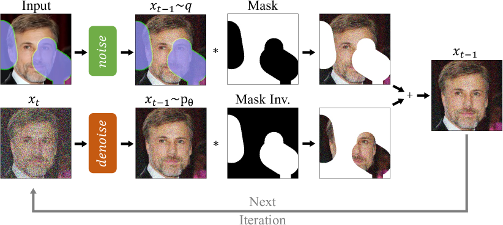

<figcaption>図1: 我々のアプローチの概観。RePaint は、与えられた画像内容に条件付けるため標準的なノイズ除去過程を変更する。各ステップで、既知領域（上）を入力からサンプリングし、inpaint される部分（下）を DDPM 出力からサンプリングする。</figcaption>
</figure>

## 4 手法

本節では、まず Section 4.1 で、画像 inpainting のために無条件 DDPM の逆拡散過程を条件付ける我々のアプローチを提示する。次に Section 4.2 で、inpainting のために逆過程そのものを改善するアプローチを導入する。

<figure>


<figcaption>図2: n 回のサンプリングステップを適用した効果。最初の例 n=1 は DDPM ベースライン、2 番目の n=2 は 1 回の resample ステップ付き。resampling ステップを増やすほど、より調和した画像になる。利点は n=10 程度の resampling で飽和する。</figcaption>
</figure>

### 4.1 既知領域への条件付け

inpainting の目標は、マスク領域を条件として、画像の欠損画素を予測することである。論文の以降では、学習済みの無条件ノイズ除去拡散確率モデル (2) を考える。我々は真の画像（ground truth）を $x$、未知画素を $m\odot x$、既知画素を $(1-m)\odot x$ と表記する。

> **Algorithm 1** 我々の RePaint アプローチによる inpainting。
>
> $x_{T}\sim\mathcal{N}(\mathbf{0},\mathbf{I})$
> **for** $t=T,\dotsc,1$ **do**
>     **for** $u=1,\dotsc,U$ **do**
>         $\epsilon\sim\mathcal{N}(\mathbf{0},\mathbf{I})$（$t>1$ のとき、そうでなければ $\epsilon=\mathbf{0}$）
>         $x_{t-1}^{\text{known}}=\sqrt{\bar{\alpha}_{t}}x_{0}+(1-\bar{\alpha}_{t})\epsilon$
>         $z\sim\mathcal{N}(\mathbf{0},\mathbf{I})$（$t>1$ のとき、そうでなければ $\mathbf{z}=\mathbf{0}$）
>         $x_{t-1}^{\text{unknown}}=\frac{1}{\sqrt{\alpha_{t}}}\left(x_{t}-\frac{\beta_{t}}{\sqrt{1-\bar{\alpha}_{t}}}\boldsymbol{\epsilon}_{\theta}(x_{t},t)\right)+\sigma_{t}z$
>         $x_{t-1}=m\odot x_{t-1}^{\text{known}}+(1-m)\odot x_{t-1}^{\text{unknown}}$
>         **if** $u<U$ かつ $t>1$ **then**
>             $x_{t}\sim\mathcal{N}(\sqrt{1-\beta_{t-1}}x_{t-1},\beta_{t-1}\mathbf{I})$
>         **end if**
>     **end for**
> **end for**
> **return** $x_{0}$

$x_{t}$ から $x_{t-1}$ への各逆ステップ (2) は $x_{t}$ のみに依存するので、対応する分布の正しい性質を保つ限り、既知領域 $(1-m)\odot x_{t}$ を改変できる。順過程は加えられたガウスノイズのマルコフ連鎖 (1) で定義されるので、式 (7) を用いて任意の時点で中間画像 $x_{t}$ をサンプリングできる。これにより、任意の時刻ステップ $t$ で既知領域 $m\odot x_{t}$ をサンプリングできる。したがって、未知領域に (2) を、既知領域に (7) を用いて、我々のアプローチでは 1 回の逆ステップについて次の表現が得られる：

$$
x_{t-1}^{\text{known}}\sim\mathcal{N}(\sqrt{\bar{\alpha}_{t}}x_{0},(1-\bar{\alpha}_{t})\mathbf{I})
$$

$$
x_{t-1}^{\text{unknown}}\sim\mathcal{N}(\mu_{\theta}(x_{t},t),\Sigma_{\theta}(x_{t},t))
$$

$$
x_{t-1}=m\odot x_{t-1}^{\text{known}}+(1-m)\odot x_{t-1}^{\text{unknown}}
$$

こうして、$x_{t-1}^{\text{known}}$ は与えられた画像の既知画素 $m\odot x_{0}$ を用いてサンプリングされ、一方 $x_{t-1}^{\text{unknown}}$ は直前の反復 $x_{t}$ が与えられたときモデルからサンプリングされる。これらはマスクを用いて新しいサンプル $x_{t-1}$ に結合される。我々のアプローチは図1 に示される。

<figure>

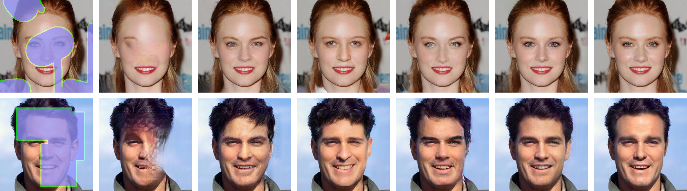

<figcaption>図3: CelebA-HQ の定性結果。いくつかのマスク設定における顔 inpainting についての最先端手法との比較。詳細はズームインを推奨。</figcaption>
</figure>

### 4.2 Resampling（リサンプリング）

Section 4.1 で述べた手法を直接適用すると、内容の種類（content type）だけが既知領域と一致することが観察される。例えば図2 の $n=1$ では、inpaint された領域は犬の毛に一致する毛皮のテクスチャである。inpaint された領域は近傍領域のテクスチャと一致するものの、意味的には誤っている。したがって DDPM は既知領域の文脈を活用しているが、画像の残りとうまく調和させてはいない。次に、この挙動の考えうる理由を議論する。

図1 から、本手法が既知領域をどう条件付けているかを分析する。(8) に示すように、モデルは $x_{t}$ を用いて $x_{t-1}$ を予測する。$x_{t}$ は DDPM (2) の出力と既知領域からのサンプルからなる。しかし式 (7) による既知画素のサンプリングは、画像の生成された部分を考慮せずに行われ、これが不調和（disharmony）を導入する。モデルは毎ステップ画像を再び調和させようとするが、次のステップで同じ問題が起こるため、完全には収束できない。さらに各逆ステップで、$\beta_{t}$ の分散スケジュールにより画像への最大変化量が減少する。したがって本手法は、柔軟性が制限されるため、後続ステップで不調和な境界につながる誤りを訂正できない。結果として、モデルは次のノイズ除去ステップに進む前に、条件情報 $x_{t-1}^{\text{known}}$ と生成情報 $x_{t-1}^{\text{unknown}}$ を 1 ステップで調和させるためにより多くの時間を要する。

DDPM はデータ分布内に収まる画像を生成するよう学習されているので、自然に整合した構造を生み出すことを目指す。我々の resampling アプローチでは、この DDPM の性質を使ってモデルの入力を調和させる。すなわち、出力 $x_{t-1}$ を (1) からサンプリングして $x_{t}$ へ拡散して戻す：$x_{t}\sim\mathcal{N}(\sqrt{1-\beta_{t}}x_{t-1},\beta_{t}\mathbf{I})$。この操作は出力をスケールバックしてノイズを加えるが、生成領域 $x_{t-1}^{\text{unknown}}$ に取り込まれた情報の一部は依然 $x_{t}^{\text{unknown}}$ に保たれる。これにより、$x_{t}^{\text{known}}$ とより調和し、かつそこからの条件情報を含む新しい $x_{t}^{\text{unknown}}$ が得られる。

この操作は 1 ステップしか調和できないので、ノイズ除去過程全体にわたって意味情報を取り込めないかもしれない。この問題を克服するため、我々はこの操作の時間幅を jump length（ジャンプ長）と呼ぶ。前述の場合は $j=1$ である。拡散速度を変える標準的な手法（slowing down, いわゆる拡散を遅くすること）と同様、resampling も逆拡散の実行時間を増やす。slowing down は、各ノイズ除去ステップで加える分散を減らすことで、より小さく、より多くのステップを適用する。しかしそれは根本的に異なるアプローチである。slowing down は、我々の resampling 戦略で述べたように、画像を調和させない問題を依然抱えるからである。我々はこのアプローチの利点を Sec. 5.6 で経験的に示す。

## 5 実験

我々は顔および汎用 inpainting について広範な実験を行い、最先端の解と比較し、アブレーション解析を行う。Section 5.3 と 5.4 で、それぞれマスク頑健性と多様性の詳細な議論を報告する。追加の結果・解析・視覚資料も付録で報告する。

### 5.1 実装の詳細

我々は CelebA-HQ と ImageNet データセットで解を検証する。本手法は事前学習済みの guided diffusion モデル [7] に依拠するので、提供された ImageNet モデルを用いる。CelebA-HQ については、ImageNet と同じ学習ハイパーパラメータに従う。$256\times 256$ のクロップを 3 バッチ、各 4×V100 GPU で用いる。事前学習済み ImageNet モデルと対照的に、CelebA-HQ のものは約 5 日間にわたり 250,000 反復だけ学習される。本論文の定性・定量結果はすべて 256 画像サイズに対するものである点に注意。

**表1**: CelebA-HQ（上）と ImageNet（下）の定量結果。最先端手法との比較。6 つの異なるマスク設定について LPIPS（低いほど良い）と Votes を計算する。Votes は我々の手法に対する投票の比率を指す。

CelebA-HQ:

| Methods | Wide LPIPS↓ | Wide Votes[%] | Narrow LPIPS↓ | Narrow Votes[%] | Super-Resolve 2× LPIPS↓ | SR Votes[%] | Altern. Lines LPIPS↓ | AL Votes[%] | Half LPIPS↓ | Half Votes[%] | Expand LPIPS↓ | Expand Votes[%] |
| --- | --- | --- | --- | --- | --- | --- | --- | --- | --- | --- | --- | --- |
| AOT | 0.104 | 11.6±2.0 | 0.047 | 12.8±2.1 | 0.714 | 1.1±0.6 | 0.667 | 2.4±1.0 | 0.287 | 9.0±1.8 | 0.604 | 8.3±1.7 |
| DSI | 0.067 | 16.0±2.3 | 0.038 | 22.3±2.6 | 0.128 | 5.5±1.4 | 0.049 | 5.1±1.4 | 0.211 | 4.5±1.3 | 0.487 | 4.7±1.3 |
| ICT | 0.063 | 27.6±2.8 | 0.036 | 30.9±2.9 | 0.483 | 4.2±1.2 | 0.353 | 0.7±0.5 | 0.166 | 12.7±2.1 | 0.432 | 8.8±1.8 |
| DeepFillv2 | 0.066 | 23.9±2.6 | 0.049 | 21.0±2.5 | 0.119 | 9.8±1.8 | 0.049 | 10.6±1.9 | 0.209 | 4.1±1.2 | 0.467 | 13.1±2.1 |
| LaMa | 0.045 | 41.8±3.1 | 0.028 | 33.8±3.0 | 0.177 | 5.5±1.4 | 0.083 | 20.6±2.5 | 0.138 | 35.6±3.0 | 0.342 | 24.7±2.7 |
| RePaint | 0.059 | Reference | 0.028 | Reference | 0.029 | Reference | 0.009 | Reference | 0.165 | Reference | 0.435 | Reference |

ImageNet:

| Methods | Wide LPIPS↓ | Wide Votes[%] | Narrow LPIPS↓ | Narrow Votes[%] | Super-Resolve 2× LPIPS↓ | SR Votes[%] | Altern. Lines LPIPS↓ | AL Votes[%] | Half LPIPS↓ | Half Votes[%] | Expand LPIPS↓ | Expand Votes[%] |
| --- | --- | --- | --- | --- | --- | --- | --- | --- | --- | --- | --- | --- |
| DSI | 0.117 | 31.7±2.9 | 0.072 | 28.6±2.8 | 0.153 | 26.9±2.8 | 0.069 | 23.6±2.6 | 0.283 | 31.4±2.9 | 0.583 | 9.2±1.8 |
| ICT | 0.107 | 42.9±3.1 | 0.073 | 33.0±2.9 | 0.708 | 1.1±0.6 | 0.620 | 6.6±1.5 | 0.255 | 51.5±3.1 | 0.544 | 25.6±2.7 |
| LaMa | 0.105 | 42.4±3.1 | 0.061 | 33.6±2.9 | 0.272 | 13.0±2.1 | 0.121 | 9.6±1.8 | 0.254 | 41.1±3.1 | 0.534 | 20.3±2.5 |
| RePaint | 0.134 | Reference | 0.064 | Reference | 0.183 | Reference | 0.089 | Reference | 0.304 | Reference | 0.629 | Reference |

我々の最終的なアプローチでは、$T=250$ 時刻ステップを用い、jump サイズ $j=10$ で $r=10$ 回の resampling を適用する。

### 5.2 評価指標

我々は RePaint をベースライン手法と、次のように記述するユーザー調査で比較する。ユーザーには、欠損領域を空白にした入力画像が示される。この画像の隣に、2 つの異なる inpainting 解を表示する。ユーザーは「どちらの画像がより現実的に見えるか？」を選ぶよう求められる。こうしてユーザーは、我々の RePaint とベースラインの結果の現実性を評価する。ユーザーが特定のアプローチに偏らないよう、手法は匿名化し、各画像ごとに異なるランダム順で表示した。さらに、各ユーザーは各設問に 2 回回答するよう求められ、自分の回答が少なくとも 75% 一致した場合にのみ回答を提出できる。例えば LaMa が提供するマスク設定では RePaint と非常に近い品質になりうるため、100% の自己一致はしばしば不可能である。我々のユーザー調査は、テストデータセット CelebA-HQ と ImageNet の全 100 テスト画像について、Wide・Narrow・Every Second Line・Half Image・Expand・Super-Resolve のマスクで評価する。各画像クエリについて 5 人の異なる人間の回答を用い、各データセット・マスク設定で手法対手法の比較あたり 1000 票が得られ、平均票の隣に 95% 信頼区間を示す。ユーザー調査に加えて、一般的に報告される知覚指標 LPIPS（AlexNet の深い特徴空間に基づく学習された距離指標）を報告する。ユーザー調査で用いたのと同じ 100 テスト画像で LPIPS を計算する。結果は表1 に示す。さらなる定量結果は付録を参照されたい。

<figure>

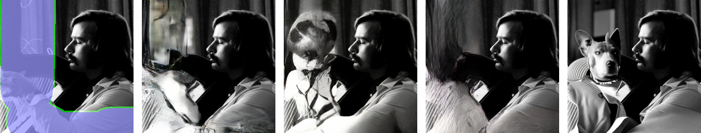

<figcaption>図4: ImageNet の定性結果。異なるマスク設定における pluralistic（多元的）inpainting 手法についての最先端手法との比較。詳細はズームインを推奨。</figcaption>
</figure>

### 5.3 最先端との比較

本節では、まずベンチマークに一般的に用いられる標準的なマスク分布で、我々のアプローチを最先端と比較する。次に、本手法の汎化能力を他手法と比較して分析する。この目的のため、4 つの難しいマスク設定での頑健性を評価する。第一に、細い構造から情報を取り込めるかを調べる 2 種の異なるマスク。第二に、画像の大きく連結した領域の inpaint を要する 2 種のマスク。全定量結果は表1、視覚結果は図3 と 4 に報告する。

**手法**：我々のアプローチを、いくつかの最先端の自己回帰ベースまたは GAN ベース手法と比較する。自己回帰手法は DSI と ICT、GAN 手法は DeepFillv2、AOT、LaMa である。これらの公開された事前学習済みモデルを用いる。CelebA-HQ テストには ICT の既存の FFHQ 事前学習モデルを用いた。LaMa は ImageNet モデルを提供しないので、元の実装でバッチサイズ 5・300,000 反復で学習した。

**設定**：CelebA-HQ と ImageNet テスト集合から、サイズ $256\times 256$ の 100 画像を用いる。結果として得られる LPIPS とユーザー調査の平均票を表1 に示す。さらに Places2 データセットでの定性・定量結果は付録を参照されたい。

**Wide と Narrow マスク**：標準的な画像 inpainting シナリオで本手法を検証するため、Wide と Narrow マスクには LaMa の設定を用いる。RePaint は、CelebA-HQ と ImageNet の両方で、Wide と Narrow の両設定について 95% の有意マージンで他の全手法を上回る。図3・4 の定性結果と表1 の定量結果を参照。最良の自己回帰手法 ICT は、図3 の 2 行目（目がうまく一致しない）で観察されるように、大域的整合性が低いようである。一般に、最良の GAN アプローチ LaMa はより良い大域整合性を持つが、目立つチェッカーボード状のアーティファクトを生む。これらの観察が、ユーザーが大多数の画像で RePaint に投票するよう影響したかもしれない。我々の手法はより現実的な画像を生成する。

**細いマスク（Thin Masks）**：最近傍超解像問題に似て、「Super-Resolution $2\times$」マスクは高さ・幅方向にストライド 2 で画素のみを残し、「Alternating Lines」マスクは画像の 1 行おきに画素を除去する。図3・4 に見るように、AOT は完全に失敗し、他はぼやけた画像を生成するか、目立つアーティファクトを生成するか、その両方である。これらの観察はユーザー調査でも確認され、RePaint は 73.1% から 99.3% のユーザー票を獲得する。

**太いマスク（Thick Masks）**：「Expand」マスクは $256\times 256$ 画像から中央の $64\times 64$ クロップのみを残し、「Half」マスクは画像の左半分を入力として与える。文脈情報がより少ないので、ほとんどの手法は苦戦する（図3・4）。定性的には、LaMa が我々に最も近づくが、我々の生成画像はよりシャープで、全体的により意味的な hallucination（幻覚的生成）を持つ。注目すべきは、CelebA と ImageNet の両方で「Expand」と「Half」について LaMa が LPIPS で RePaint を上回ることである（表1）。我々は、この挙動が本手法の生成がより柔軟で多様であるためだと論じる。真の画像と意味的に異なる画像を生成することで、この特定の解にとって LPIPS が不適切な指標になる。

ベースラインが生成するアーティファクトは、学習マスクへの強い過学習で説明できる。対照的に、本手法はマスク学習を含まないので、RePaint はあらゆる種類のマスクを扱える。大面積 inpainting の場合、RePaint は意味的に有意な埋め込みを生成し、他はアーティファクトを生成するかテクスチャをコピーする。最後に、表1 に示すように「Half」マスクでの ICT の決着がつかない結果を除き、RePaint は 95% の信頼度でユーザーに好まれる。

### 5.4 多様性の解析

(2) に示すように、各逆拡散ステップはガウス分布から新しいノイズを取り込むため、本質的に確率的である。さらに、inpaint された領域をどんな損失でも直接誘導しないので、モデルは学習集合と意味的に整合する任意の内容を自由に inpaint できる。図 LABEL:fig:intro は、我々のモデルの多様性と柔軟性を示す。

### 5.5 クラス条件付き実験

事前学習済み ImageNet DDPM はクラス条件付き生成サンプリングが可能である。図5 では、「Granny Smith（リンゴの品種）」クラスや他のクラスについて「Expand」マスクの例を示す。

<figure>

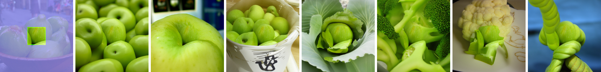

<figcaption>図5: ImageNet 上でのクラスガイド付き生成の視覚結果。</figcaption>
</figure>

### 5.6 アブレーション研究

**slowing down との比較**：計算予算の増加が resampling の性能改善を引き起こしているのかを分析するため、Section 4.2 で述べた拡散過程を遅くする一般的手法と比較する。そこで図6 と表2 では、各設定で同じ計算予算を用いて resampling と slowing down を比較する。resampling は余分な計算予算を画像の調和に使う一方、拡散過程を遅くすることには目に見える改善がないことを観察する。

**表2**: 計算予算の使い方の解析。拡散過程の slowing down と resampling を比較する。LaMa の Wide マスク設定で ImageNet 検証集合の 32 画像を用いる。拡散ステップ数を $T$、resampling 回数を $r$ で表す。

|  | T | r | LPIPS | T | r | LPIPS | T | r | LPIPS | T | r | LPIPS |
| --- | --- | --- | --- | --- | --- | --- | --- | --- | --- | --- | --- | --- |
| Slowing down | 250 | 1 | 0.168 | 500 | 1 | 0.167 | 750 | 1 | 0.179 | 1000 | 1 | 0.161 |
| Resampling | 250 | 1 | 0.168 | 250 | 2 | 0.148 | 250 | 3 | 0.142 | 250 | 4 | 0.134 |

**表3**: アブレーション研究。ジャンプ長 $j$ と resampling 回数 $r$ の解析。LaMa に対する LPIPS と平均ユーザー票を報告する。CelebA 検証集合の 32 画像を、LaMa の Wide マスク設定で用いる。

|  | j=1 LPIPS | j=1 Votes[%] | j=5 LPIPS | j=5 Votes[%] | j=10 LPIPS | j=10 Votes[%] |
| --- | --- | --- | --- | --- | --- | --- |
| r=5 | 0.075 | 42.50±7.7 | 0.072 | 46.88±7.8 | 0.073 | 53.12±7.8 |
| r=10 | 0.088 | 42.50±7.7 | 0.073 | 45.62±7.8 | 0.068 | 56.25±7.8 |
| r=15 | 0.065 | 46.25±7.8 | 0.063 | 53.12±5.5 | 0.065 | 53.75±7.8 |

**ジャンプ長（Jumps Length）**：さらに、ジャンプ長 $j$ と resampling 回数 $r$ をアブレーションするため、表3 で 9 つの異なる設定を調べる。より小さなステップ長より大きなジャンプ $j=10$ を適用するほうが良い性能が得られる。ジャンプ長 $j=1$ では DDPM がぼやけた画像を出力しやすいことを観察する。さらに、この観察は異なる resampling 回数にわたって安定している。加えて、resampling 回数を増やすと性能が向上する。

<figure>

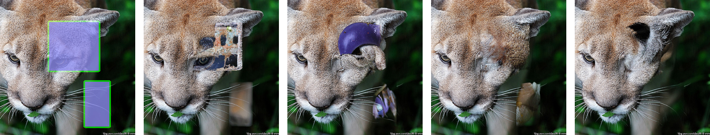

<figcaption>図6: 計算予算の使い方の定性解析。RePaint は、拡散過程を遅くする（上）のに比べ、resampling（下）によって同じ計算予算でより高い視覚品質を生む。拡散ステップ数を T、resampling を r で表す。</figcaption>
</figure>

**代替サンプリング戦略との比較**：我々の resampling アプローチを SDEdit と比較するため、まず $t=T$ から $t=T/2$ まで逆拡散を行い、$t=T/2$ で必要な初期 inpainting を得る。次に、$t=T/2$ から $t=0$ まで逆過程を数回繰り返す SDEdit の resampling 手法を適用する。結果は表4 に示す。我々のアプローチは、LPIPS $>0.6$ が比較に意味のある範囲外となる「Expand」の 1 ケースを除き、全マスク種別で著しく良い性能を達成する。「super-resolution マスク」の場合、我々のアプローチは全データセットで LPIPS を 53% 以上削減し、resampling 戦略の利点を明確に示す。

**表4**: [25]（SDEdit）で提案された resampling スケジュールとの LPIPS での比較。我々の RePaint（Sec. 4.2）で提案した resampling 手法は、特に Super-Resolution マスクで実質的に良い結果を達成する。

| Dataset | Method | Wide | Narrow | Super-Res. | Alt. Lin. | Half | Expand |
| --- | --- | --- | --- | --- | --- | --- | --- |
| ImageNet | SDEdit | 0.153 | 0.095 | 0.390 | 0.185 | 0.327 | 0.628 |
|  | RePaint (Ours) | 0.134 | 0.064 | 0.183 | 0.089 | 0.304 | 0.629 |
| Places2 | SDEdit | 0.130 | 0.062 | 0.271 | 0.130 | 0.304 | 0.620 |
|  | RePaint (Ours) | 0.105 | 0.044 | 0.099 | 0.051 | 0.286 | 0.615 |
| CelebA-HQ | SDEdit | 0.076 | 0.046 | 0.113 | 0.030 | 0.189 | 0.449 |
|  | RePaint (Ours) | 0.059 | 0.028 | 0.029 | 0.009 | 0.165 | 0.435 |

## 6 限界

本手法は、シャープで非常に詳細かつ意味的に有意な画像を生成する。我々は、本研究が手法の現在の限界に対処する興味深い研究方向を開くと信じる。特に 2 つの方向が興味深い。第一に、当然ながら、画像ごとの DDPM 最適化過程は、GAN ベースや自己回帰ベースの対応手法より著しく遅い。そのため現在リアルタイム応用への適用は難しい。とはいえ DDPM は人気を増しており、最近の出版物は効率改善に取り組んでいる。第二に、極端なマスクの場合、RePaint は真の画像と大きく異なる現実的な画像補完を生成しうる。そのため、それらの条件では定量評価が難しくなる。代替の解はテスト集合で FID スコアを用いることである。しかし、信頼できる inpainting の FID は通常 1,000 枚以上の画像で計算される。現在の DDPM では、これはほとんどの研究機関にとって実行不可能な実行時間になる。

## 7 潜在的な負の社会的影響

一方で、RePaint は無条件の事前学習済み DDPM に依拠する inpainting 手法である。したがって、アルゴリズムは学習されたデータセットに偏りうる。モデルは学習集合と同じ分布の画像を生成することを目指すので、性別・年齢・人種などの同じ偏りを反映しうる。他方で、RePaint は顔の匿名化に使える。例えば、公的イベントに写る人々の身元情報を除去し、データ保護のために人工的な顔を hallucinate（生成）できる。

## 8 結論

我々は画像 inpainting タスクのための新規のノイズ除去拡散確率モデル解を提示した。詳細には、自由形状 inpainting のためにマスクの自由度を大きく増す、マスク非依存（mask-agnostic）のアプローチを開発した。RePaint の新規の条件付けアプローチは DDPM のモデル仮定に準拠するので、マスクの種類によらずフォトリアリスティックな画像を生成する。

## 付録

この付録では、本手法の追加の詳細と解析を提供する。Section A でユーザー調査についてより説明する。さらに Section B でジャンプの拡散時間スケジュールをどう実装したかの追加詳細を提示する。ジャンプサイズと resampling 回数のアブレーションの視覚結果を Section C で提供する。LaMa ベンチマークの第 2 部である Places2 での評価を Section D で提示する。さらに、最先端と比較した RePaint の inpainting の多様性を比較するため、Section E で定量解析を提供する。ImageNet データセットでの失敗ケースとデータ偏りの詳細を Section F で提供する。潜在空間の進化をより直感的に理解するため、Section G で推論のビデオを提供する。最後に Section I で追加の視覚例を示す。

<figure>

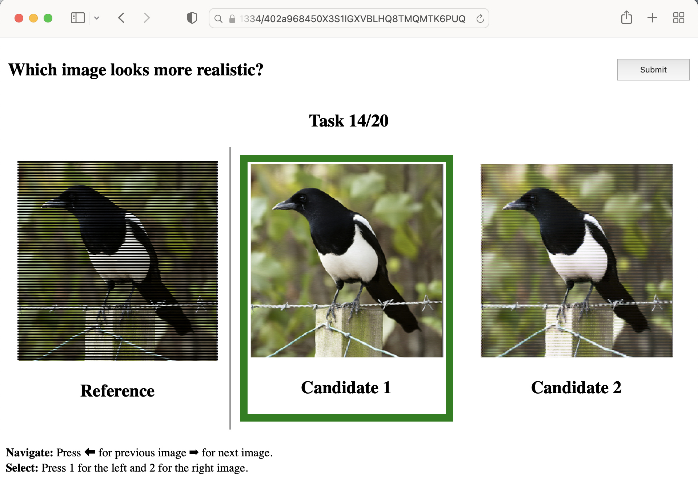

<figcaption>図7: ユーザー調査インターフェース。ユーザー調査インターフェースの例。左の参照画像に基づき、ユーザーはより現実的に見える画像を選ぶ。</figcaption>
</figure>

> **図8 のコード（拡散時間スケジュール）**: ジャンプ長 $j=10$、resample $r=10$ の拡散時刻ステップを生成する擬似コード（ar5iv での文字化けを正しい Python に再構成）。
> ```python
> t_T = 250
> jump_len = 10
> jump_n_sample = 10
>
> jumps = {}
> for j in range(0, t_T - jump_len, jump_len):
>     jumps[j] = jump_n_sample - 1
>
> t = t_T
> ts = []
> while t >= 1:
>     t = t - 1
>     ts.append(t)
>     if jumps.get(t, 0) > 0:
>         jumps[t] = jumps[t] - 1
>         for _ in range(jump_len):
>             t = t + 1
>             ts.append(t)
> ts.append(-1)
> ```

<figure>

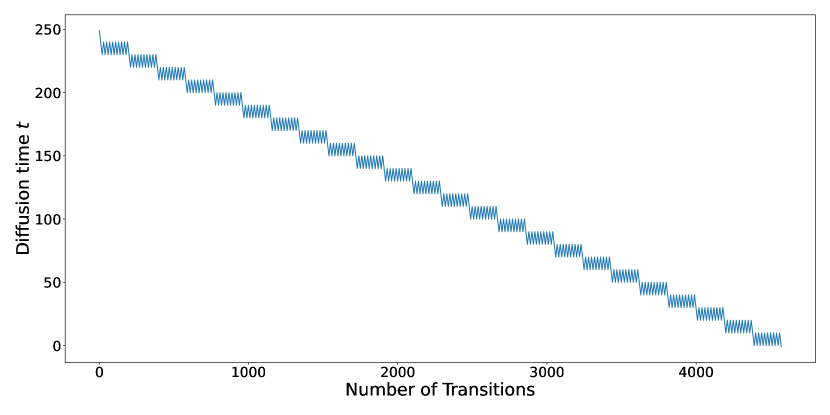

<figcaption>図9: 推論中の拡散時間。ジャンプ長 j=10、resampling r=10 での推論過程で、サンプル xₜ が遷移していく拡散時間 t。全体としては減少しつつ、局所的に何度も上方へジャンプする鋸歯状のスケジュールになる。</figcaption>
</figure>

## A ユーザー調査

本論文の Section 5.2 で述べたように、どの手法が人間の目に最も良く知覚されるかを決めるためユーザー調査を行う。図7 にユーザーインターフェースを示す。ユーザーは入力参照から最も現実的な解を選ぶ。偏りを減らすため、2 つの候補画像をランダム順で示す。さらに、ユーザー判断の一貫性を改善し低努力の回答を防ぐため、各例を 2 回示す。自分の票の 75% 未満でしか一致しないユーザーは除外される。

> **図10 のコード（推論過程）**: あらかじめ計算した時間スケジュールを用いた RePaint 推論過程の擬似コード（ar5iv 文字化けを正しい Python に再構成）。
> ```python
> times = get_schedule()
> x = random_noise()
> for t_last, t_cur in zip(times[:-1], times[1:]):
>     if t_cur < t_last:
>         # 主論文の式 (8) を適用（逆拡散）
>         x = reverse_diffusion(x, t, x_known)
>     else:
>         # 主論文の式 (1) を適用（順拡散）
>         x = forward_diffusion(x, t)
> ```

## B ジャンプサイズが 1 より大きい場合のアルゴリズム

主論文の Algorithm 1 で導入した resampling に加えて、主論文の Section 4.2 で述べたように拡散時間のジャンプを用いる。図8 は、状態遷移の生成をさらに明確にする擬似コードを示す。各遷移は拡散時間 $t$ を 1 だけ増減させる点に注意。例えば図10 に示すジャンプ長 $j=10$ では、10 回の逆遷移を適用する前に 10 回の順遷移を適用する。潜在ベクトル $x_{t}$ の拡散時間 $t$ は図9 にプロットされる。

**表5**: Places2 の定量結果。5 つの異なるマスク設定について LPIPS（低いほど良い）と votes を計算する。Votes は我々の RePaint を支持する票の比率を指す。

| Methods | Wide LPIPS | Wide Votes[%] | Narrow LPIPS | Narrow Votes[%] | Super-Resolve 2× LPIPS | SR Votes[%] | Altern. Lines LPIPS | AL Votes[%] | Half LPIPS | Half Votes[%] | Expand LPIPS | Expand Votes[%] |
| --- | --- | --- | --- | --- | --- | --- | --- | --- | --- | --- | --- | --- |
| AOT | 0.112 | 35.4±3.0 | 0.062 | 36.0±3.0 | 0.560 | 2.2±0.9 | 0.399 | 0.8±0.6 | 0.263 | 34.0±2.9 | 0.686 | 0.7±0.5 |
| DSI | 0.101 | 27.4±2.8 | 0.054 | 33.1±2.9 | 0.157 | 8.4±1.7 | 0.083 | 6.9±1.6 | 0.265 | 33.7±2.9 | 0.565 | 13.8±2.1 |
| ICT | 0.101 | 35.7±3.0 | 0.057 | 33.7±2.9 | 0.776 | 0.9±0.6 | 0.672 | 1.3±0.7 | 0.256 | 26.0±2.7 | 0.554 | 26.6±2.7 |
| Deep Fill v2 | 0.097 | 29.7±2.8 | 0.051 | 33.0±2.9 | 0.120 | 15.8±2.3 | 0.070 | 15.4±2.2 | 0.254 | 32.8±2.9 | 0.550 | 12.9±2.1 |
| LaMa | 0.078 | 47.7±3.1 | 0.039 | 43.3±3.1 | 0.369 | 7.5±1.6 | 0.138 | 21.5±2.6 | 0.233 | 34.0±2.9 | 0.512 | 39.4±3.0 |
| RePaint | 0.105 | Reference | 0.044 | Reference | 0.099 | Reference | 0.051 | Reference | 0.286 | Reference | 0.615 | Reference |

## C アブレーション

主論文の表3 の定量解析に加えて、本節では異なるジャンプ長 $j$ と resampling 回数 $r$ の視覚例を示す。主論文の Section 5.5 で議論したように、より小さなジャンプ長 $j$ はより不鮮明な画像を生む傾向があり（図11）、resampling 回数 $r$ の増加は全体的な画像整合性を改善する。

## D Places2 での評価

より包括的な実験フレームワークのため、本節では LaMa で提案されたベンチマークの第 2 部、すなわち Places2 データセットでの結果を提供する。Places2 の実験は、我々が 4×V100 でバッチサイズ 4・300k 反復（計約 6 日）学習した無条件モデルを用いて行った。他の全学習設定は元々 [7] が ImageNet に用いたものを維持した。モデルチェックポイントは公開される。同じマスク生成手続きと、主論文で述べた設定を用いる。表5 に示す結果は、主論文の表1 の CelebA・ImageNet と整合する。RePaint は、1 つの決着がつかないケースを除き、全マスクで 95% の有意性で全手法を上回る。このケースは Wide マスクで RePaint を LaMa と比較したときで、ユーザーは 52.4% で RePaint に投票するが、有意区間が 50% 境界と重なる。Wide と Narrow マスクの視覚比較は図21 に示す。さらに、視覚結果は図22 に示すように疎なマスクへの頑健性をさらに裏付ける。マスクパターンは全競合手法で明確に見えるが、RePaint はより良い調和を示す。大きなマスクについて、RePaint は図23 の 2 行目に示すように、Bar の連れを同年代で、全体の照明条件も同じく、といった意味的に有意な内容を inpaint できる。

<figure>

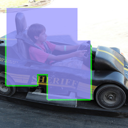

<figcaption>図11: アブレーション研究。ImageNet 検証集合・LaMa ベンチマークの Wide マスク設定での、ジャンプ長 j と resampling 回数 r の解析。</figcaption>
</figure>

**表6**: 多様性スコア（Diversity Score）。32 画像について CelebA-HQ で各種マスクに対して計算した Diversity Score（DS）と LPIPS。

| Methods | Wide LPIPS | Wide DS | Narrow LPIPS | Narrow DS | SR 2x LPIPS | SR 2x DS | Alter. Lines LPIPS | AL DS | Half LPIPS | Half DS | Expand LPIPS | Expand DS |
| --- | --- | --- | --- | --- | --- | --- | --- | --- | --- | --- | --- | --- |
| DSI | 0.0639 | 16.68 | 0.0454 | 18.74 | 0.1404 | 12.38 | 0.0591 | 4.78 | 0.2348 | 15.30 | 0.5458 | 14.33 |
| ICT | 0.0596 | 15.77 | 0.0402 | 18.65 | 0.5427 | 8.70 | 0.3916 | 8.16 | 0.1817 | 16.40 | 0.4779 | 17.25 |
| RePaint | 0.0552 | 16.40 | 0.0337 | 23.79 | 0.0327 | 19.84 | 0.0106 | 23.00 | 0.1839 | 17.31 | 0.4832 | 17.11 |

<figure>

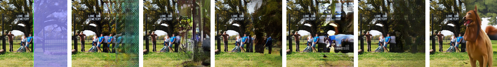

<figcaption>図12: ImageNet での失敗ケース。ImageNet で学習した RePaint を inpainting に適用すると、データ偏りのため犬を inpaint しやすい。詳細はズームインを推奨。</figcaption>
</figure>

## E 多様性

主論文の定量評価では、入力ごとに 1 枚の画像をサンプリングする。しかし本手法は確率的なので、複数サンプリングできる。確率的手法間の多様性を比較するため、[22] で述べられた Diversity Score（高いほど良い）を用いる。出力ペア間の平均 LPIPS のみを計算する標準的な多様性指標と対照的に、このスコアは有意な多様性を記述しつつ、LPIPS での全体性能も重み付けるよう設計されている。妥当な予測の多様体の内側での生成の多様性を測ることを目指す。詳細には、極端すぎる予測や失敗はペナルティを受ける。表6 に示すように、「Wide」と「Half」では LPIPS と Diversity Score の両方が最良の手法はなく、「Expand」では ICT が Diversity Score で 0.81%、LPIPS で 1.1% RePaint を上回る。細い構造のマスク「Narrow」「Super-Resolution $2\times$」「Alternating Lines」では、RePaint は LPIPS と Diversity Score の両方で ICT と DSI を大差で上回る。

<figure>

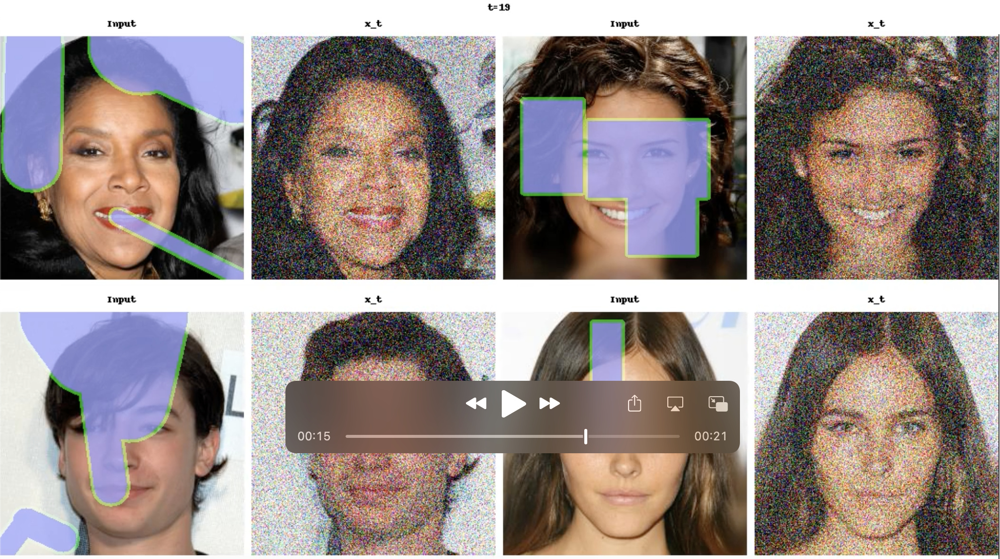

<figcaption>図13: 拡散過程のビデオ。添付では、CelebA-HQ 検証集合でのノイズ除去拡散過程のビデオを示す。</figcaption>
</figure>

## F 失敗ケース

図12 に示すように、RePaint は時に意味的文脈を取り違え、整合しない物体を混ぜる。ImageNet 上の我々のモデルは、予想より頻繁に犬を inpaint するよう偏っているようである。ImageNet は分類タスク用に多くの異なる犬種を持つので、犬は学習集合で過剰表現され、ゆえにモデルが偏る。

## G 添付ビデオ

拡散空間の潜在空間を調べるため、図13 のスクリーンショットに示すビデオを添付で提供する。そこでは真の画像と、拡散過程の各遷移後の潜在空間 $x_{t}$ を示す。上部に示す拡散時間 $t$ は次のスケジュールに従って上下にジャンプする点に注意：ジャンプ長は $j=5$、resampling 回数は $r=9$。拡散過程の視覚的に興味深い部分により注目するため、拡散ステップ数を $T=100$ に設定し、$t=50$ より下で resampling を始める。

<figure>

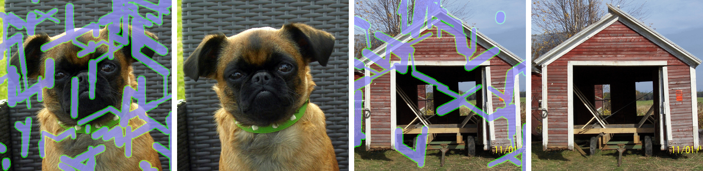

<figcaption>図14: 細いマスクについての ImageNet 512×512 での視覚結果。</figcaption>
</figure>

## H より大きな解像度での実験

図14 に示すように、本 inpainting 手法は [7] の $512\times 512$ 事前学習モデルでも機能する。しかし、計算資源の制限により、その解像度では完全な解析を行えなかった。

## I 追加の視覚結果

我々はまた、CelebA-HQ と ImageNet について、主論文と同じ最先端手法と比較する追加の視覚例を提供する。Wide と Narrow マスクの結果をそれぞれ図15 と 18 に、疎なマスク「Super-Resolve $2\times$」と「Alternating Lines」を図16 と 19 に、「Half」と「Expand」を図17 と 20 に示す。

<figure>

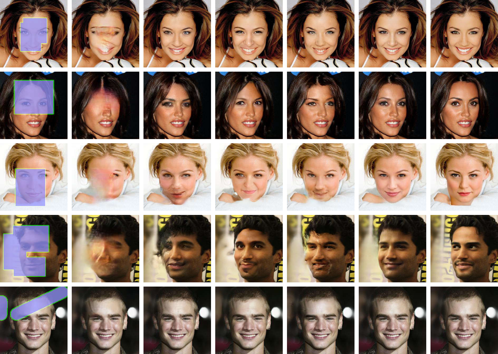

<figcaption>図15: CelebA-HQ の定性結果。顔 inpainting についての最先端手法との比較。詳細はズームを推奨。</figcaption>
</figure>

<figure>

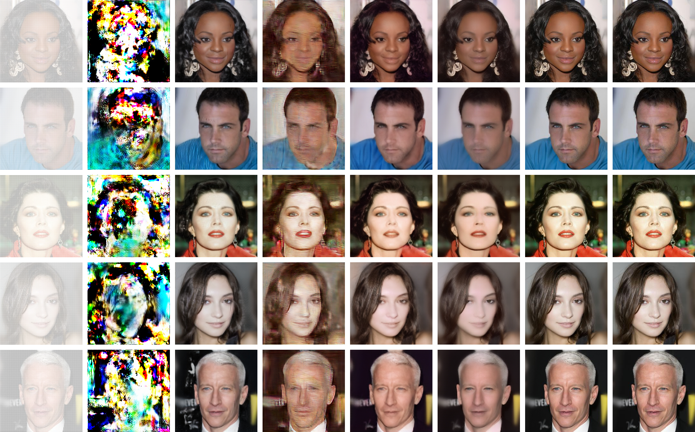

<figcaption>図16: CelebA-HQ の定性結果。顔 inpainting についての最先端手法との比較。詳細はズームを推奨。</figcaption>
</figure>

<figure>

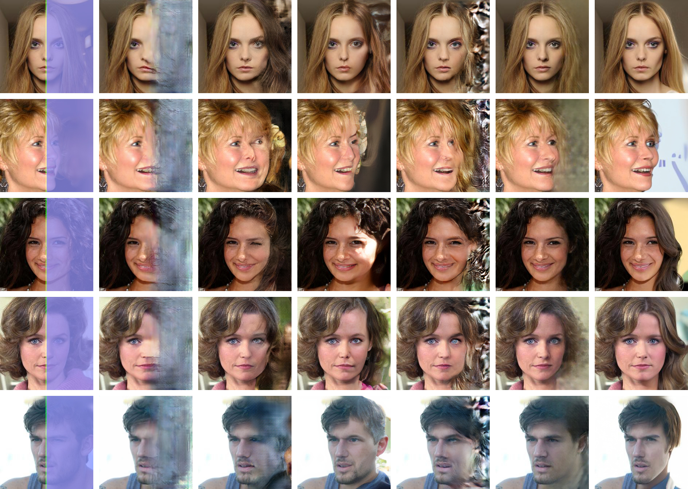

<figcaption>図17: CelebA-HQ の定性結果。顔 inpainting についての最先端手法との比較。詳細はズームを推奨。</figcaption>
</figure>

<figure>

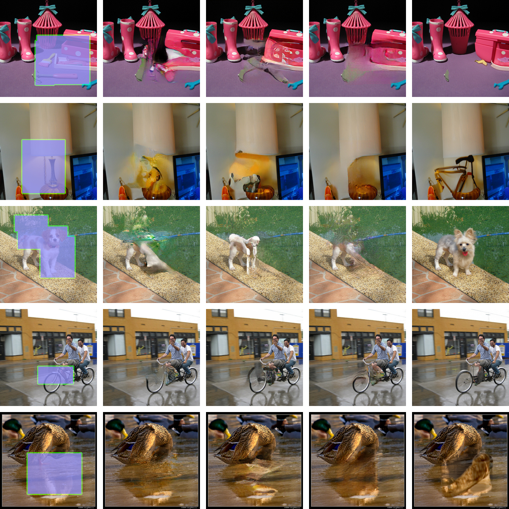

<figcaption>図18: ImageNet の定性結果。多様な inpainting についての最先端手法との比較。詳細はズームを推奨。</figcaption>
</figure>

<figure>

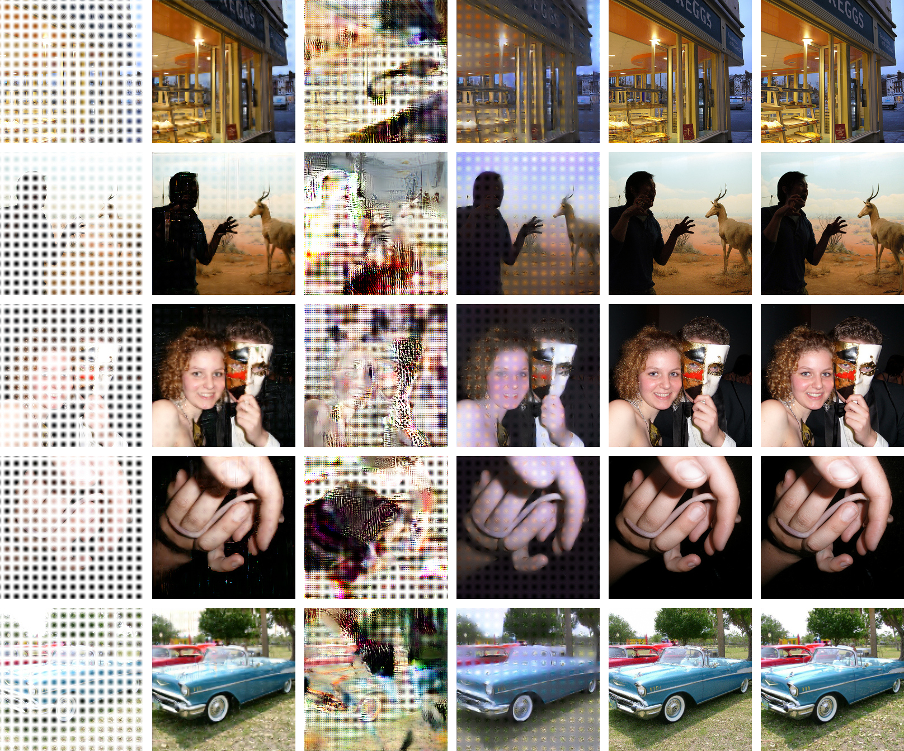

<figcaption>図19: ImageNet の定性結果。多様な inpainting についての最先端手法との比較。詳細はズームを推奨。</figcaption>
</figure>

<figure>

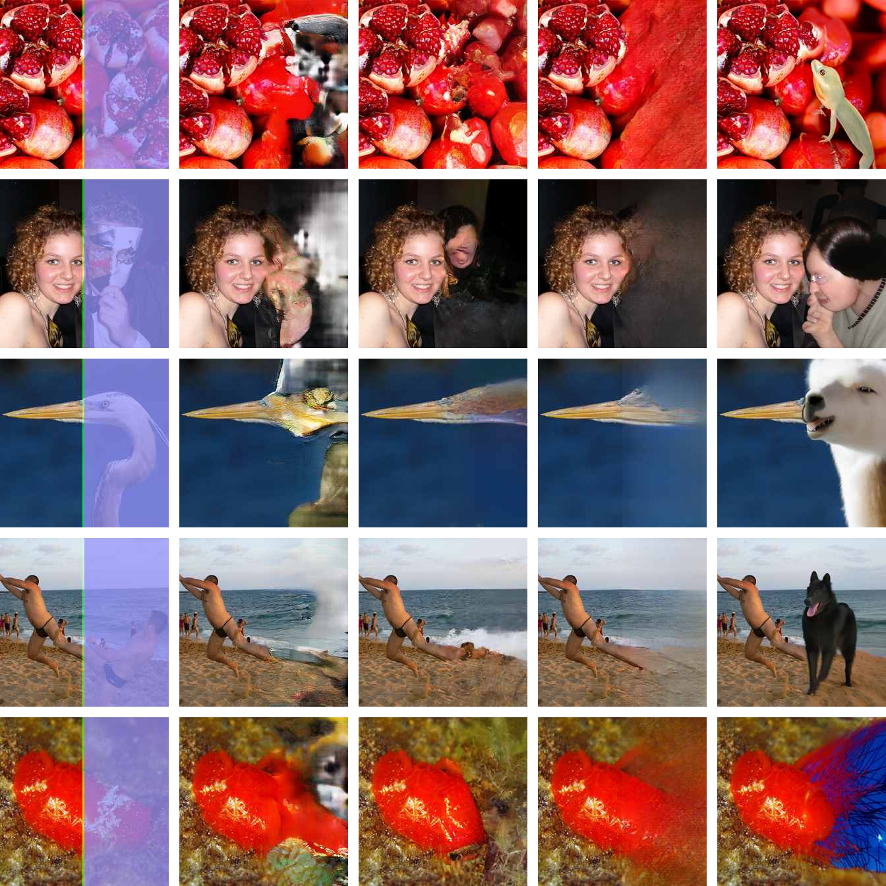

<figcaption>図20: ImageNet の定性結果。多様な inpainting についての最先端手法との比較。詳細はズームを推奨。</figcaption>
</figure>

<figure>

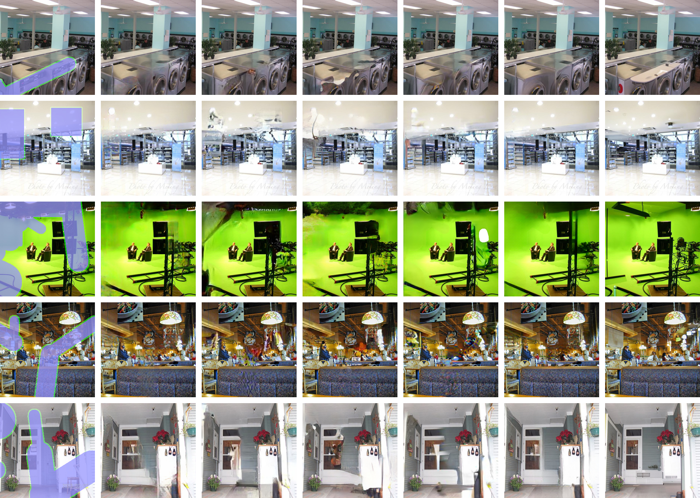

<figcaption>図21: Places2 の定性結果。多様な inpainting についての最先端手法との比較。詳細はズームを推奨。</figcaption>
</figure>

<figure>

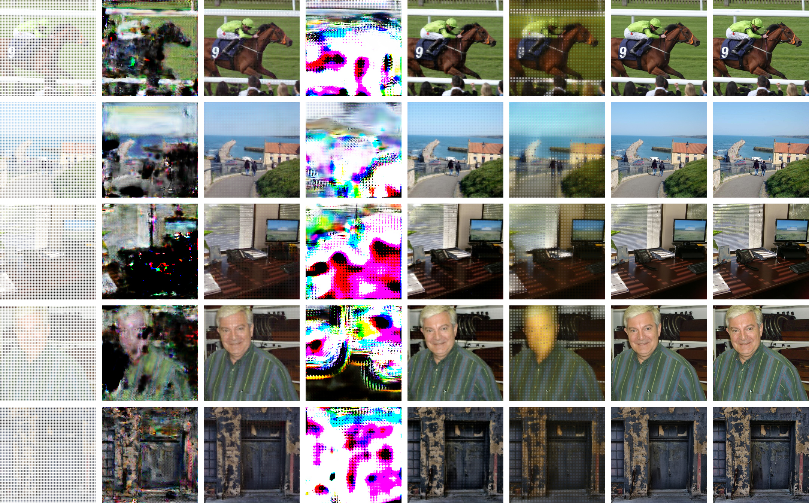

<figcaption>図22: Places2 の定性結果。多様な inpainting についての最先端手法との比較。詳細はズームを推奨。</figcaption>
</figure>

<figure>

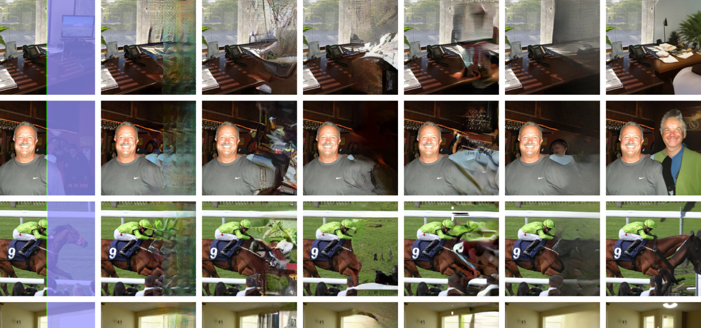

<figcaption>図23: Places2 の定性結果。多様な inpainting についての最先端手法との比較。詳細はズームを推奨。</figcaption>
</figure>
