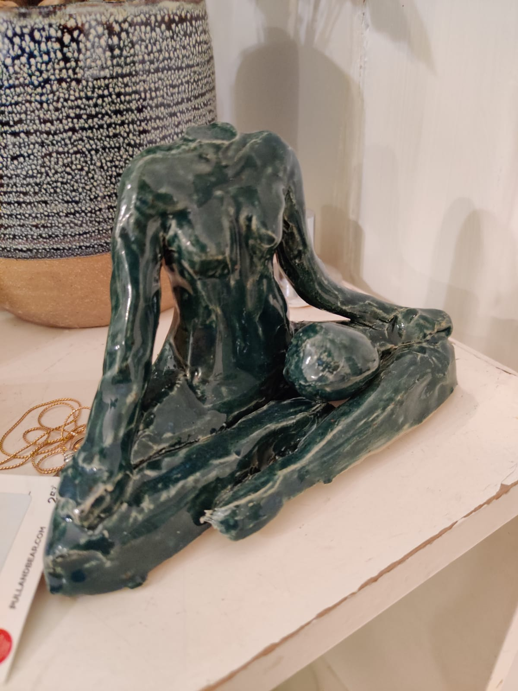
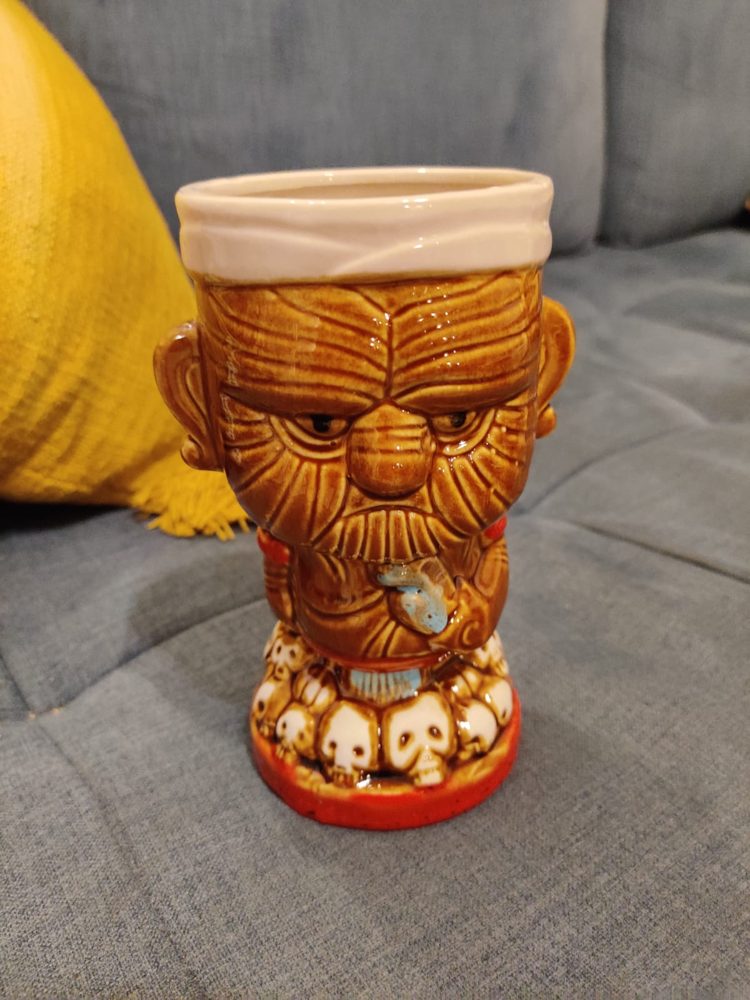
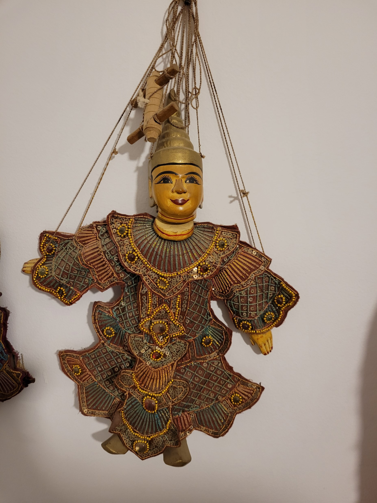
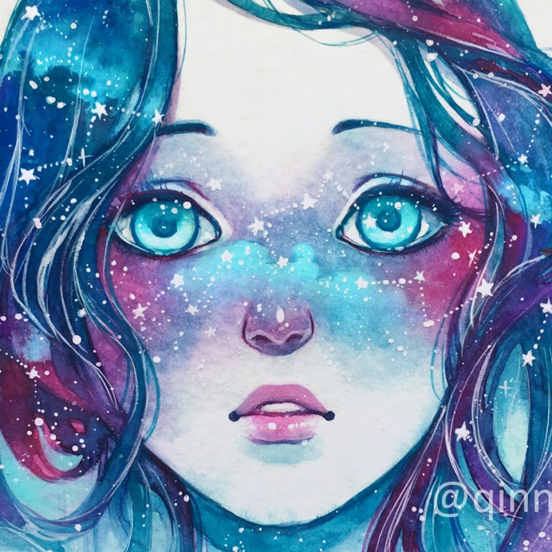
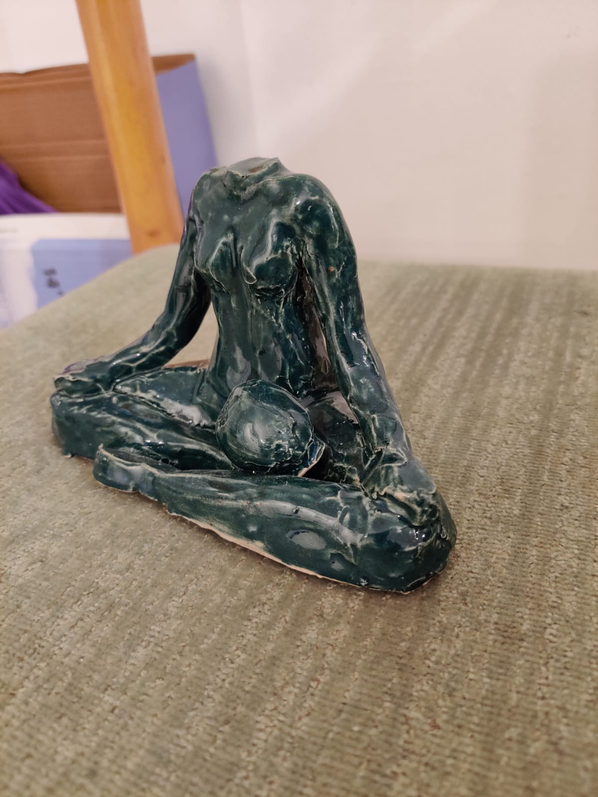
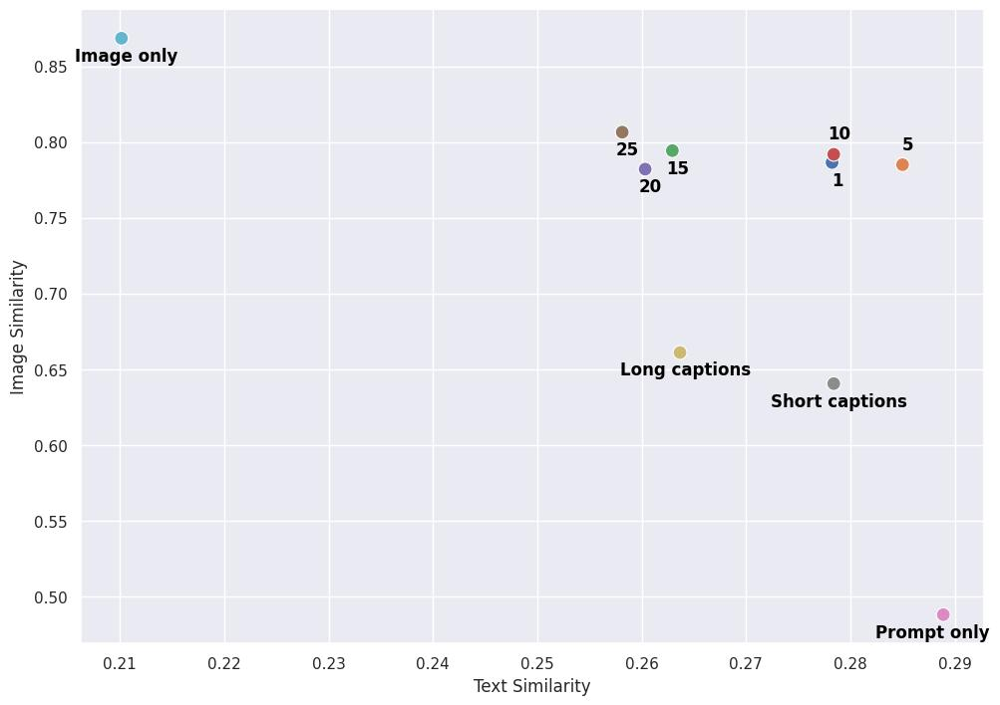
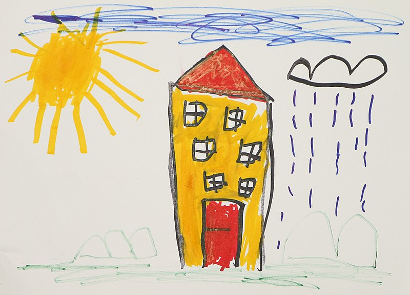
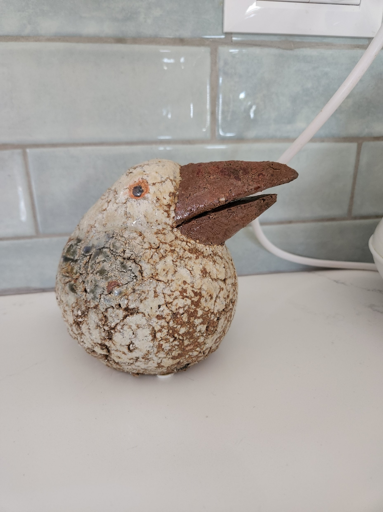
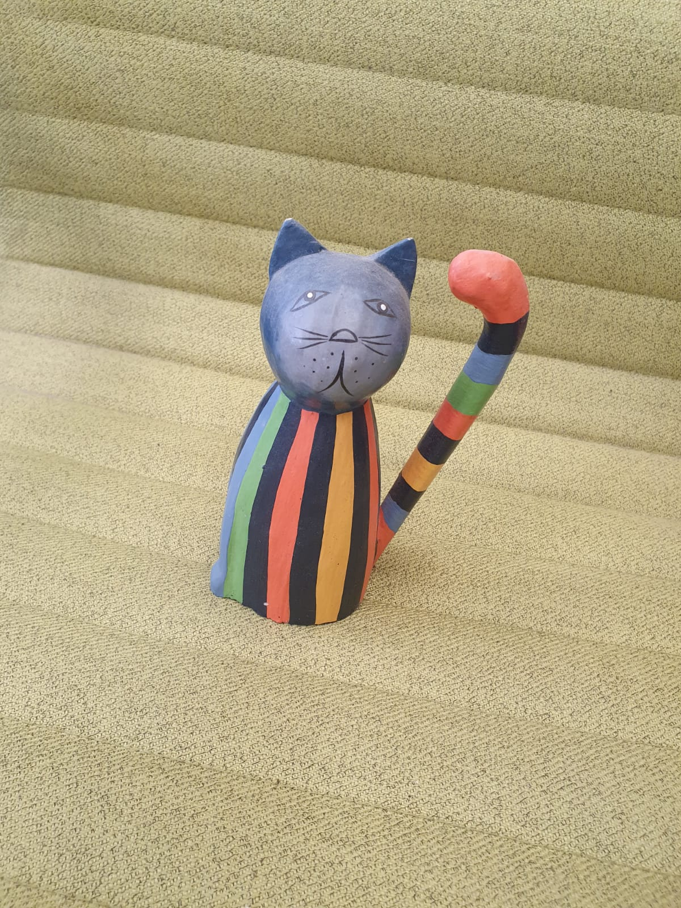

# 画像は単語 1 つの価値がある：Textual Inversion によるテキスト画像生成の個人化

> 原題: An Image is Worth One Word: Personalizing Text-to-Image Generation using Textual Inversion
> 著者: Rinon Gal, Yuval Alaluf, Yuval Atzmon, Or Patashnik, Amit H. Bermano, Gal Chechik, Daniel Cohen-Or（Tel-Aviv University & NVIDIA）
> 出典: ICLR 2023 ・ arXiv:2208.01618 ・ プロジェクト: https://textual-inversion.github.io
> 訳注: 原典は ar5iv 由来 markdown。図は ar5iv が各図につき 1 パネルしか抽出しておらず、多くは概念の学習画像 1 枚のサムネイル。

## Abstract（要旨）

テキスト画像（text-to-image）モデルは、自然言語を通じて創作を導く前例のない自由を提供する。しかし、特定の固有の概念の画像を生成したり、その外見を変更したり、新しい役割や斬新な場面の中で構成したりするために、この自由をどう行使できるかは不明である。言い換えれば我々はこう問う：言語誘導モデルを使って、自分の猫を絵画にしたり、お気に入りの玩具を基に新製品を想像したりするにはどうすればよいか？ ここで我々は、そうした創作の自由を可能にする単純なアプローチを提示する。物体やスタイルなどユーザーが提供する概念の画像をわずか 3〜5 枚使うだけで、凍結されたテキスト画像モデルの埋め込み空間における新しい「単語」を通じてそれを表現することを学ぶ。これらの「単語」は自然言語の文に組み込め、直感的な方法で個人化された創作を導く。注目すべきことに、単一の単語埋め込みが固有で多様な概念を捉えるのに十分であるという証拠を見出す。我々のアプローチを幅広いベースラインと比較し、様々な応用とタスクにわたって概念をより忠実に描写できることを実証する。

コード・データ・新しい単語は https://textual-inversion.github.io で公開する。

<figure>

<figcaption>図1: （左）事前学習済みテキスト画像モデルの埋め込み空間で、特定の概念を記述する新しい擬似単語（pseudo-word）を見つける。（右）これらの擬似単語を新しい文に組み込み、対象を新しい場面に置いたり、スタイルや構成を変えたり、新製品に取り込んだりできる。（訳注: ar5iv は学習集合の 1 枚＝ headless statue のみを抽出）</figcaption>
</figure>

## 1 はじめに

映画「タイタニック」の有名な場面で、Rose は Jack にこう頼む：「…あなたのフランス人の女の子の一人のように私を描いて」。単純だが、この要求は豊富な情報を含む。Jack が絵を描くべきこと；そのスタイルと構成が Jack の過去の作品の一部に合致すべきこと；そして「私（me）」という単一の単語を通じて、Rose はこの絵が特定の固有の被写体——Rose 自身——を描くべきだと示している。この要求をするにあたり、Rose は Jack がこれらの概念——広範なものも特定のものも——を推論し、新しい創作の中に命を吹き込む能力に依拠している。

最近、大規模テキスト画像モデルは、自然言語記述を推論する前例のない能力を実証した。ユーザーは見たことのない構成で新しい場面を合成したり、無数のスタイルで鮮やかな絵を生み出したりできる。これらのツールは芸術的創作・インスピレーション源・さらには新しい物理製品の設計にも使われている。しかしその利用は、ユーザーが望む対象をテキストで記述する能力に制約される。Rose に立ち返ると、こう問える：もし彼女がこれらのモデルに接近するなら、どう要求を組み立てるか？ ユーザーである我々は、大切な幼少期の玩具を含む新しい場面をテキスト画像モデルにどう作らせるか？ あるいは冷蔵庫に貼った我が子の絵を取り出して芸術的な名品に変えるには？

新しい概念を大規模モデルに導入することはしばしば難しい。各新概念のために拡張データセットでモデルを再学習するのは法外に高価で、少数例での fine-tuning は典型的に**破滅的忘却（catastrophic forgetting）**を招く。より慎重なアプローチはモデルを凍結し、新概念に直面したとき出力を適応させる変換モジュールを学習する。しかしこれらも先行知識を忘れがちで、新たに学んだ概念と同時に先行知識へアクセスするのに困難を抱える。

我々はこれらの課題を、事前学習済みテキスト画像モデルの**テキスト埋め込み空間に新しい単語を見つける**ことで克服することを提案する。テキスト符号化過程の第一段階を考える（図2）。ここで入力文字列はまずトークン集合に変換される。各トークンは自身の埋め込みベクトルに置き換えられ、これらのベクトルが下流モデルに供給される。我々の目標は、新しい特定の概念を表す新しい埋め込みベクトルを見つけることである。

新しい埋め込みベクトルを新しい擬似単語（pseudo-word）で表し、これを $S_{*}$ と表記する。この擬似単語は他のあらゆる単語と同様に扱われ、生成モデルへの斬新なテキストクエリの構成に使える。よって「$S_{*}$ がビーチにいる写真」「壁に掛かった $S_{*}$ の油絵」、あるいは「$S^{2}_{*}$ のスタイルで描かれた $S^{1}_{*}$ のドローイング」のように 2 つの概念を組み合わせることもできる。重要なことに、この過程は生成モデルを一切手つかずのまま残す。これにより、視覚・言語モデルを新タスクで fine-tune するとき通常失われる豊かなテキスト理解と汎化能力を保持する。

これらの擬似単語を見つけるため、タスクを**inversion（反転）**の問題として枠付けする。固定された事前学習済みテキスト画像モデルと、概念を描く小さな（3〜5 枚の）画像集合が与えられる。我々は「A photo of $S_{*}$」の形の文が小さな集合の画像の再構成を導くような単一の単語埋め込みを見つけることを目指す。この埋め込みは最適化過程で見つけられ、これを「Textual Inversion（テキスト反転）」と呼ぶ。

さらに、Generative Adversarial Network（GAN）inversion で典型的に使われるツールに基づく一連の拡張を調査する。我々の分析は、いくつかの核心原理は残る一方、先行技術を素朴に適用すると無益か、むしろ有害であることを明らかにする。

我々は幅広い概念とプロンプトでアプローチの有効性を実証し、固有の物体を新しい場面に注入し、異なるスタイルに変換し、ポーズを転送し、バイアスを減らし、新製品を想像することさえできることを示す。

要約すると、貢献は以下：

- ユーザーが提供する概念の斬新な場面を自然言語の指示で合成する、**個人化テキスト画像生成（personalized text-to-image generation）**のタスクを導入する。
- 生成モデルの文脈で「Textual Inversion」の発想を提示する。ここでの目標は、高レベルの意味と細かい視覚的詳細の両方を捉えられる新しい擬似単語をテキストエンコーダの埋め込み空間に見つけることである。
- GAN に着想を得た inversion 技術の観点から埋め込み空間を分析し、そこにも **distortion-editability（歪み—編集性）トレードオフ**が存在することを実証する。我々のアプローチがそのトレードオフ曲線上の魅力的な点に位置することを示す。
- 概念のユーザー提供キャプションを使って生成した画像と本手法を評価し、我々の埋め込みがより高い視覚的忠実度を提供し、より頑健な編集も可能にすることを実証する。

## 2 関連研究

#### テキスト誘導合成

テキスト誘導画像合成は GAN の文脈で広く研究されてきた。典型的には、与えられた画像・キャプションのペアデータセットからサンプルを再現するよう条件付きモデルを学習し、attention 機構やクロスモーダル対照アプローチを活用する。より最近では、大規模な自己回帰モデルや拡散モデルを活用して印象的な視覚的結果が達成された。

条件付きモデルを学習する代わりに、いくつかのアプローチはテスト時最適化を用いて事前学習済み生成器の潜在空間を探索する。これらは典型的に、CLIP のような補助モデルから導かれるテキスト画像類似度スコアを最小化するよう最適化を導く。

純粋な画像生成を超えて、多くの研究がテキストベースのインターフェースを画像編集・生成器ドメイン適応・動画操作・モーション合成・スタイル転送・さらには 3D 物体のテクスチャ合成に使う。

我々のアプローチはオープンエンドの条件付き合成モデルに基づく。新しいモデルをゼロから学習する代わりに、凍結モデルの語彙を拡張し、特定概念を記述する新しい擬似単語を導入できることを示す。

#### GAN inversion

生成ネットワークで画像を操作するには、与えられた画像の対応する潜在表現を見つけることがしばしば必要で、これを inversion と呼ぶ。GAN の文献では、この inversion は最適化ベース技術かエンコーダのいずれかで行われる。最適化法は潜在ベクトルを直接最適化し、GAN に通すと目標画像を再生成するようにする。エンコーダは大きな画像集合を使って画像を潜在表現に写すネットを学習する。

本研究では最適化アプローチに従う。それは未見の概念によりよく適応できるからである。エンコーダはより厳しい汎化要件に直面し、同じ自由を提供するにはおそらく web 規模のデータで学習が必要だろう。さらに GAN inversion 文献の観点から埋め込み空間を分析し、残る核心原理とそうでないものを概説する。

#### 拡散ベース inversion

拡散モデルの領域では、inversion は画像にノイズを加えてネットでノイズ除去することで素朴に行える。しかしこの過程は画像内容を大きく変えがちである。ILVR [15] は、目標画像のノイズ化低域フィルタデータでノイズ除去過程を条件付けることで inversion を改善する。Dhariwal & Nichol [20] は DDIM サンプリング過程が閉形式で反転でき、与えられた実画像を生む潜在ノイズマップを抽出できることを実証した。DALL-E 2 [50] ではこの方法に基づき、クロス画像補間や意味的編集など画像の変化を誘導できることを示す。後者は CLIP ベースのコードでモデルを条件付けることに依拠し、他手法には適用できないかもしれない。

上記の研究が与えられた画像をモデルの潜在空間に反転するのに対し、我々は**ユーザー提供の概念**を反転する。さらに、この概念をモデルの語彙の新しい擬似単語として表現し、より一般的で直感的な編集を可能にする。

#### 個人化（Personalization）

モデルを特定の個人や物体に適応させることは機械学習研究の長年の目標である。個人化モデルは典型的に推薦システムや連合学習の領域に見られる。

より最近では、個人化の取り組みは視覚・グラフィックスにも見られる。そこでは特定の顔や場面をよりよく再構成するために生成モデルの繊細なチューニングを適用するのが典型的である。

本研究に最も関連するのは PALAVRA [16] で、これは事前学習済み CLIP モデルを個人化物体の検索とセグメンテーションに活用する。PALAVRA は特定物体を指す擬似単語を CLIP のテキスト埋め込み空間に特定する。これらは検索のため画像を記述したり、場面中の特定物体をセグメントするのに使われる。しかし彼らのタスクと損失はともに識別的で、物体を他の候補から分離することを目指す。後で示すように（図5）、彼らのアプローチはもっともらしい再構成や新しい場面での合成に必要な詳細を捉えそこなう。

## 3 手法

<figure>

<figcaption>図2: テキスト埋め込みと inversion 過程の概要。プレースホルダ単語を含む文字列は、まずトークン（辞書中の単語/サブ単語のインデックス）に変換される。これらのトークンは連続ベクトル表現（「埋め込み」v）に変換される。最後に、埋め込みベクトルが生成モデルを導く単一の条件付けコード c_θ(y) に変換される。擬似単語 S_* に紐づく埋め込みベクトル v_* を再構成目的で最適化する。</figcaption>
</figure>

我々の目標は、新しいユーザー指定概念の言語誘導生成を可能にすることである。そのために、これらの概念を事前学習済みテキスト画像モデルの中間表現に符号化することを目指す。理想的には、そのモデルが表す豊かな意味的・視覚的事前分布を活用し、それを使って概念の直感的な視覚的変換を導けるようにすべきである。

そうした表現の候補を、テキスト画像モデルが典型的に用いるテキストエンコーダの**単語埋め込み段階**に探すのは自然である。そこでは離散的な入力テキストがまず、直接の最適化に適した連続ベクトル表現に変換される。

先行研究はこの埋め込み空間が基本的な画像意味を捉えるのに十分表現力があることを示した。しかしこれらのアプローチは対照的または言語補完的な目的を活用しており、いずれも画像の深い視覚的理解を必要としない。§4 で実証するように、それらの方法は概念の外見を正確に捉えそこない、合成に使おうとすると相当な視覚的崩壊を招く。我々の目標は生成を導ける擬似単語を見つけることで、これは視覚的タスクである。よって**視覚的再構成目的**でそれらを見つけることを提案する。

以下では、特定のクラスの生成モデル——Latent Diffusion Models（LDM）——に本アプローチを適用する核心の詳細を概説する。§5 で GAN inversion 文献に動機づけられた拡張集合を分析する。しかし後で示すように、これらの追加の複雑さはここで提示する初期表現を改善しない。

#### Latent Diffusion Models

我々は本手法を、オートエンコーダの潜在空間で動作する Denoising Diffusion Probabilistic Models（DDPM）の最近のクラスである **Latent Diffusion Models（LDM）** 上で実装する。

LDM は 2 つの核心要素からなる。第 1 に、オートエンコーダが大きな画像コレクションで事前学習される。エンコーダ $\mathcal{E}$ は画像 $x\in\mathcal{D}_{x}$ を空間的潜在コード $z=\mathcal{E}(x)$ に写すことを学び、KL ダイバージェンス損失またはベクトル量子化で正則化される。デコーダ $D$ はそうした潜在を画像に戻すことを学び、$D(\mathcal{E}(x))\approx x$ となる。

第 2 の要素は拡散モデルで、学習した潜在空間内のコードを生成するよう学習される。この拡散モデルはクラスラベル・セグメンテーションマスク・さらには同時学習したテキスト埋め込みモデルの出力で条件付けできる。$c_{\theta}(y)$ を条件付け入力 $y$ を条件付けベクトルに写すモデルとする。LDM 損失は次で与えられる：

$$
L_{LDM}:=\mathbb{E}_{z\sim\mathcal{E}(x),y,\epsilon\sim\mathcal{N}(0,1),t}\Big{[}\|\epsilon-\epsilon_{\theta}(z_{t},t,c_{\theta}(y))\|_{2}^{2}\Big{]}\,,
$$

ここで $t$ は時刻、$z_{t}$ は時刻 $t$ にノイズ化された潜在、$\epsilon$ は非スケールのノイズサンプル、$\epsilon_{\theta}$ はノイズ除去ネット。直感的に、ここでの目的は画像の潜在表現に加えられたノイズを正しく除去することである。学習中、$c_{\theta}$ と $\epsilon_{\theta}$ は LDM 損失を最小化するよう同時に最適化される。推論時、ランダムノイズテンソルがサンプルされ、反復的にノイズ除去されて新しい画像潜在 $z_{0}$ を生む。最後にこの潜在コードが事前学習済みデコーダで画像 $x^{\prime}=D(z_{0})$ に変換される。

我々は LAION-400M データセットで事前学習された Rombach ら [54] の公開 14 億パラメータテキスト画像モデルを使う。ここで $c_{\theta}$ は BERT テキストエンコーダで実現され、$y$ はテキストプロンプトである。

次に、そうしたテキストエンコーダの初期段階と我々の inversion 空間の選択を見る。

#### テキスト埋め込み

BERT のような典型的なテキストエンコーダモデルはテキスト処理ステップで始まる（図2 左）。まず入力文字列中の各単語またはサブ単語がトークン（事前定義の辞書中のインデックス）に変換される。各トークンはインデックスベースのルックアップで取得できる一意の埋め込みベクトルにリンクされる。これらの埋め込みベクトルは典型的にテキストエンコーダ $c_{\theta}$ の一部として学習される。

本研究では、この埋め込み空間を inversion の対象に選ぶ。具体的には、学習したい新概念を表すプレースホルダ文字列 $S_{*}$ を指定する。埋め込み過程に介入し、トークン化された文字列に紐づくベクトルを新しい学習済み埋め込み $v_{*}$ で置き換え、本質的に概念を語彙に「注入」する。これにより、他のあらゆる単語と同様に、概念を含む新しい文を構成できる。

#### Textual inversion

これらの新しい埋め込みを見つけるため、対象概念を様々な背景やポーズなど複数の設定で描く小さな画像集合（典型的に 3〜5 枚）を使う。小さな集合からサンプルした画像について式1 の LDM 損失を最小化することで、直接最適化により $v_{*}$ を見つける。生成を条件付けるため、CLIP ImageNet テンプレートから導いた中立的な文脈テキストをランダムにサンプルする。これらは「A photo of $S_{*}$」「A rendition of $S_{*}$」等の形のプロンプトを含む。テンプレートの全リストは補足資料にある。

最適化目標は次のように定義できる：

$$
v_{*}=\operatorname*{arg\,min}_{v}\mathbb{E}_{z\sim\mathcal{E}(x),y,\epsilon\sim\mathcal{N}(0,1),t}\Big{[}\|\epsilon-\epsilon_{\theta}(z_{t},t,c_{\theta}(y))\|_{2}^{2}\Big{]}\,,
$$

これは、$c_{\theta}$ と $\epsilon_{\theta}$ の両方を固定したまま、元の LDM モデルと同じ学習スキームを再利用して実現される。注目すべきことにこれは再構成タスクである。よって学習される埋め込みが概念に固有の細かい視覚的詳細を捉えるよう動機づけると期待する。

#### 実装の詳細

特記なき限り、LDM の元のハイパーパラメータ選択を保持する。単語埋め込みは物体の単一単語の粗い記述子の埋め込みで初期化した（例：図1 の 2 概念で「sculpture」と「cat」）。実験は 2×V100 GPU・バッチサイズ 4 で行った。基本学習率は 0.005。LDM に従い、基本学習率を GPU 数とバッチサイズでさらにスケールし、実効率 0.04 とした。全結果は 5,000 最適化ステップで生成。これらのパラメータは大半のケースで良く機能する。ただし一部の概念では、より少ないステップまたは増やした学習率でより良い結果が得られることに注意する。

## 4 定性的比較と応用

以下の節で、Textual Inversion で可能になる一連の応用を実証し、最先端と人手キャプションのベースラインへの視覚的比較を提供する。

### 4.1 画像変種

<figure>

<figcaption>図3: 本手法・DALLE-2 [50] の CLIP ベース再構成・様々な長さの人手キャプションで生成した物体変種。本手法は元の被写体に典型的により忠実な変種を生成する。（訳注: ar5iv は入力画像 mug の 1 枚のみ抽出）</figcaption>
</figure>

まず、単一の擬似単語を使って物体の変種を捉え再現する能力を実証する。図3 で本手法を 2 つのベースラインと比較する：人手キャプションで導いた LDM と、人手キャプションまたは画像プロンプトで導いた DALLE-2。キャプションは Mechanical Turk で収集した。注釈者には概念の 4 枚の画像が提供され、芸術家が再現できるような方法で記述するよう求めた。短い（≤12 語）と長い（≤30 語）の両方のキャプションを求めた。合計で概念あたり 10 キャプション——短い 5 つと長い 5 つ——を収集した。図3 は各設定でランダムに選んだキャプションで生成した複数の結果を示す。

結果が示すように、本手法は概念の固有の詳細をよりよく捉える。人手キャプションは典型的に物体の最も目立つ特徴を捉えるが、色のパターン（例：ティーポット）のような細かい特徴を再構成するには不十分な詳細しか提供しない。場合によっては（例：スカルマグ）物体自体が自然言語で記述するのが極めて難しいこともある。画像が提供されると DALLE-2 はより魅力的なサンプルを再現でき、特に詳細が限られたよく知られた物体（アラジンのランプ）で顕著である。しかし画像エンコーダ（CLIP）が見たことのなさそうな個人化物体の固有の詳細（マグ・ティーポット）には依然苦戦する。対照的に本手法はこれらの細かい詳細を成功裏に捉え、しかも単一の単語埋め込みだけでそれを行う。ただし、我々の創作が元の物体により似ているとはいえ、依然として元と異なりうる変種である点に注意する。

### 4.2 テキスト誘導合成

<figure>

<figcaption>図4: 追加のテキスト誘導個人化生成結果。各行で、概念を表す画像集合からの例（左）と、それらのサンプルから導いた擬似単語を使った斬新な構成（右）を示す。</figcaption>
</figure>

図4 と図1 で、学習した擬似単語を新しい条件付けテキストに組み込むことで斬新な場面を構成する能力を示す。各概念について、学習集合からの例と、生成画像の配列・その条件付けテキストを示す。結果が示すように、凍結テキスト画像モデルは新概念とその大量の先行知識の両方を同時に推論し、新しい創作の中でそれらを結びつけられる。重要なことに、我々の学習目標が本質的に生成的だったにもかかわらず、擬似単語は依然としてモデルが活用できる意味的概念を内包する。例えばボウルが（4 行目）食べ物のような他の物体を入れる能力や、Furby の鳥のような頭と冠を保ちつつパレットをプロンプトによりよく合わせる能力（アルバムカバー、3 行目）を観察する。

<figure>

<figcaption>図5: 代替の個人化創作アプローチとの比較。本モデルは被写体をより正確に保ち、斬新な埋め込みとキャプションの残りの両方を推論できる。</figcaption>
</figure>

物体を新しい場面に構成する能力をよりよく評価するため、本手法をいくつかの個人化ベースラインと比較する（図5）。特に、本研究に最も似た最近の PALAVRA [16] を考える。PALAVRA は対照学習と巡回一貫性の目標の混合を使って物体集合を CLIP のテキスト埋め込み空間に符号化する。彼らのアプローチで新しい擬似単語を見つけ、VQGAN-CLIP と CLIP-Guided Diffusion を活用して新しい画像を合成する。第 2 のベースラインとして、Crowson ら の CLIP 誘導モデルを、学習集合画像と目標テキストの両方への CLIP ベース距離を同時に最小化しようと（VQGAN-CLIP）、または我々の集合からの入力画像で最適化を初期化して（Guided Diffusion）適用する。

PALAVRA が生成する画像（2・3 行目）は典型的に目標プロンプトの要素（例：ビーチ・月）を含むが、概念を正確に捉えそこない相当な視覚的崩壊を示す。これは PALAVRA が識別的目標で学習されたので驚くべきことではない。彼らの場合、モデルは 2 つの典型的概念を区別するのに十分な情報だけを符号化すればよい。さらに、彼らの単語発見過程は自然画像多様体上の出力に写せる埋め込みベクトルを含む埋め込み空間の領域に留まる必要がなかった。テキスト・画像誘導合成法の場合（4・5 行目）、結果はより自然で元画像に近く見えるが、新しいテキストへの汎化に失敗する。さらに、本手法は事前学習済みの大規模テキスト画像合成モデルに基づくので、単一の擬似単語を最適化して多数の新生成に再利用できる。一方ベースラインモデルはテスト時最適化に CLIP を使うので、新しい創作ごとに高価な最適化が要る。

### 4.3 スタイル転送

テキスト誘導合成の典型的なユースケースは芸術的な場面で、ユーザーは特定の芸術家の固有のスタイルを引き出して新しい創作に適用しようとする。ここで、本モデルが特定の未知のスタイルを表す擬似単語も見つけられることを示す。そうした擬似単語を見つけるため、共通のスタイルを持つ小さな画像集合をモデルに提供し、学習テキストを「A painting in the style of $S_{*}$」の形のプロンプトに置き換えるだけである。結果は図6 に示す。これは概念を捉える能力が単純な物体再構成を超えてより抽象的な発想に及ぶことのさらなる実証となる。

これは伝統的なスタイル転送と異なる点に注意する。我々は必ずしもある入力画像の内容を維持したいわけではない。代わりにネットワークに被写体をどう描くかを決める自由を与え、適切なスタイルだけを求める。

<figure>

<figcaption>図6: テキスト埋め込み空間はスタイルを含むより抽象的な概念を表せる。これによりスタイル誘導生成に使える単語を発見できる。画像クレジット: @QinniArt（上）, @David Revoy（下）。非商用利用のみ許可。</figcaption>
</figure>

### 4.4 概念の合成

<figure>

<figcaption>図7: 2 つの学習済み擬似単語を使った合成生成。モデルは両方を組み合わせるプロンプトを使うとき 2 概念の意味を組み合わせられる。2 概念を並置するなどより複雑な関係的プロンプトを推論する能力には限界がある。（訳注: ar5iv は図6 と同じ qinni アセットを参照）</figcaption>
</figure>

図7 で、誘導テキストが複数の学習済み概念を含む合成的合成を実証する。モデルが複数の斬新な擬似単語を同時に推論できることを観察する。しかし、それらの間の関係（例：2 概念の並置）には苦戦する。この限界は、我々の学習が単一概念の場面（概念が画像の中核にある）のみを考慮するために生じると仮説立てる。多物体の場面で学習すればこの欠点を緩和できるかもしれないが、その調査は今後の課題とする。

### 4.5 バイアス低減

テキスト画像モデルの一般的な限界は、学習に使うインターネット規模のデータに見られるバイアスを継承することである。これらのバイアスは生成サンプルに現れる。例えば DALLE-2 のシステムカードは、ベースモデルが「A CEO」のプロンプトで白人的・男性的に見える人々の画像を生成しがちだと報告する。同様に「wedding」の結果は西洋の結婚式の伝統を仮定し、異性愛カップルにデフォルトしがちである。

ここで、小さな精選データセットを使ってバイアスのある概念に新しい「より公平な」単語を学習し、元の単語の代わりに使ってより包摂的な生成を駆動できることを実証する。

具体的には図8 で、「Doctor」という単語に符号化されたバイアスを強調し、より多様な小さな集合から新しい埋め込みを学習することでこのバイアスを低減（知覚される性別・民族の多様性を増加）できることを示す。

<figure>

<figcaption>図8: バイアス低減。事前学習済みのバイアスのある埋め込み（左）と我々の脱バイアス埋め込み（右）で合成した無精選サンプル。既知概念に新しい擬似単語を学習することでバイアスを低減できる。これらは多様性のため注意深く精選できる小さなデータセットで最適化できる。</figcaption>
</figure>

### 4.6 下流応用

最後に、我々の擬似単語が同じ初期 LDM モデルに基づく下流モデルで使えることを実証する。具体的には、LDM の潜在空間でマスクベースのブレンディング過程により局所的なテキストベース画像編集を可能にする最近の Blended Latent Diffusion [7] を考える。図9 で、この局所合成過程も学習した擬似単語で条件付けでき、元モデルの追加修正を一切要さないことを実証する。

<figure>

<figcaption>図9: 我々の単語は LDM に基づく下流モデルで使える。ここでは Blended Latent Diffusion [7] で局所的画像編集を行う。（訳注: ar5iv は headless statue の学習画像を参照）</figcaption>
</figure>

### 4.7 画像の精選

特記なき限り、本節の結果は部分的に精選されている。各プロンプトについて 16 候補（DALLE-2 では 6）を生成し、最良の結果を手動で選んだ。テキスト条件付き生成研究では同様の精選過程がより大きなバッチで典型的に行われ、CLIP で画像をランク付けすることでこの選択過程を自動化できることに注意する。補足資料に、失敗ケースを含む大規模で無精選のギャラリーを提供する。

## 5 定量分析

未踏の潜在空間への inversion は幅広い設計選択を提供する。ここで、これらの選択を GAN inversion 文献の観点から検討し、多くの核心前提（distortion-editability トレードオフ等）がテキスト埋め込み空間にも存在することを発見する。しかし分析は、GAN inversion で典型的に使われる解の多くがこの空間に汎化せず、しばしば無益かむしろ有害であることを明らかにする。

### 5.1 評価指標

潜在空間埋め込みの品質を分析するため、2 つの面を考える：再構成と編集性。第 1 に、対象概念を複製する能力を測りたい。本手法は特定画像でなく概念の変種を生むので、意味的 CLIP 空間距離で類似度を測る。具体的には各概念について「A photo of $S_{*}$」のプロンプトで 64 枚の画像を生成する。再構成スコアは生成画像と概念固有の学習集合の画像との平均ペアワイズ CLIP 空間コサイン類似度である。

第 2 に、テキストプロンプトで概念を変更する能力を評価したい。このため、様々な難易度と設定のプロンプトで画像集合を生成する。これらは背景変更（「A photo of $S_{*}$ on the moon」）からスタイル変更（「An oil painting of $S_{*}$」）、合成的プロンプト（「Elmo holding a $S_{*}$」）に及ぶ。

各プロンプトについて 50 DDIM ステップで 64 サンプルを合成し、サンプルの平均 CLIP 空間埋め込みを計算し、プレースホルダ $S_{*}$ を省いたテキストプロンプトの CLIP 空間埋め込みとのコサイン類似度を計算する。ここで高いスコアはより良い編集能力とプロンプト自体への忠実度を示す。本手法は CLIP ベース目的スコアの直接最適化を含まないので、Saharia ら [42] が概説した敵対的スコアリングの欠陥に敏感でない点に注意する。

### 5.2 評価設定

GAN inversion に着想を得た一連の実験設定で埋め込み空間を評価する：

#### 拡張潜在空間

Abdal ら [1] に従い、拡張された多ベクトル潜在空間を考える。この空間では $S_{*}$ が複数の学習済み埋め込みに埋め込まれ、概念を複数の学習済み擬似単語で記述するのと等価である。2 語・3 語への拡張（それぞれ $2\text{-}word$・$3\text{-}word$ と表記）を考える。この設定は単一埋め込みベクトルの潜在的ボトルネックを緩和し、より正確な再構成を可能にすることを目指す。

#### 段階的拡張

Tov ら [62] に従い段階的な多ベクトル設定を考える。ここでは単一埋め込みベクトルで学習を始め、2,000 学習ステップ後に第 2 のベクトルを、4,000 ステップ後に第 3 のベクトルを導入する。このシナリオでは、ネットワークがまず核心の詳細に焦点を当て、次に追加の擬似単語を活用して細かい詳細を捉えると期待する。

#### 正則化

Tov ら [62] は、GAN の空間の潜在コードが学習中に観測されたコード分布に近いとき編集性が増すと観察した。ここで、学習した埋め込みを既存の単語に近く保つことを目指す正則化項を導入して同様のシナリオを調査する。実際には、学習した埋め込みと物体の粗い記述子（例：図1 の画像で「sculpture」「cat」）の埋め込みとの L2 距離を最小化する。

#### 画像ごとトークン

GAN ベースのアプローチを超えて、inversion アプローチに一意の画像ごとトークンを導入する斬新なスキームを調査する。$\{x_{i}\}_{i=1}^{n}$ を入力画像集合とする。全画像で共有される単一の単語ベクトルを最適化する代わりに、普遍的なプレースホルダ $S_{*}$ と、各画像に固有の追加プレースホルダ $\{S_{i}\}_{i=1}^{n}$（一意の埋め込み $v_{i}$ に紐づく）の両方を導入する。次に「A photo of $S_{*}$ with $S_{i}$」の形の文を構成し、各画像を自身の一意の文字列を含む文に対応させる。式2 を使って $S_{*}$ と $\{S_{i}\}_{i=1}^{n}$ の両方を同時に最適化する。直感は、モデルが共有情報（概念）を共有コード $S_{*}$ に符号化し、背景など画像ごとの詳細を $S_{i}$ に委ねることを好むはずということである。

#### 人手キャプション

学習済み埋め込み設定に加え、§4.1 で概説したキャプションを使って人間レベルの性能と比較する。ここでは単にプレースホルダ文字列 $S_{*}$ を人手キャプションに置き換え、短い・長いキャプション設定の両方を使う。

#### 参照設定

結果のスケールの直感を提供するため、2 つの参照ベースラインを加える。第 1 に、プロンプトに関係なく常に学習集合のコピーを生成するモデルの期待挙動を考える。これには単に学習集合自体を「生成サンプル」として使う。第 2 に、常にテキストプロンプトに合致するが個人化概念を無視するモデルを考える。これは擬似単語なしで評価プロンプトを使って画像を合成して行う。これらの設定をそれぞれ「Image Only」「Prompt Only」と表記する。

#### Textual-Inversion

最後に、§3 で概説した我々自身の設定を考える。さらに増やした学習率（$2e\text{-}2$、「High-LR」）と減らした学習率（$1e\text{-}4$、「Low-LR」）でもモデルを評価する。

#### 追加設定

補足では inversion の 2 つの追加設定を考える：モデル自体を最適化して再構成を改善する pivotal tuning アプローチと、DALLE-2 の二部 inversion 過程。さらに画像集合サイズの再構成・編集性への効果を分析する。

### 5.3 結果

<figure>

<figcaption>図10: 定性的評価結果。(a) CLIP ベース評価。単一語モデル（我々）は distortion-editability 曲線上の魅力的な点を表し、学習率を変えることで曲線上を移動できる。(b) ユーザー study 結果。同様の distortion-editability 曲線を描き、CLIP ベース結果が人間の選好と一致することを示す。ユーザー study のエラーバーは 95% 信頼区間。</figcaption>
</figure>

評価結果を図10(a) にまとめる。特に興味深い 4 つの観察を強調する。第 1 に、本手法と多くのベースラインの意味的再構成品質は、学習集合からランダムに画像をサンプルするのと同等である。第 2 に、単一語法は同等の再構成品質と、全多語ベースラインに対して大幅に改善された編集性を達成する。これらの点はテキスト埋め込み空間の印象的な柔軟性を概説し、単一の擬似単語だけで高い精度で新概念を捉えられることを示す。

第 3 に、ベースラインが distortion-editability トレードオフ曲線を描くことを観察する。真の単語分布に近い埋め込み（正則化・少ない擬似単語・低い学習率による）はより容易に変更できるが対象の詳細を捉えそこなう。対照的に、単語分布から遠く逸脱すると改善された再構成が得られるが編集能力が著しく低下する。注目すべきことに、我々の単一埋め込みモデルは学習率を変えるだけでこの曲線上を移動でき、ユーザーにこのトレードオフの制御を提供する。

第 4 の観察として、概念の人手記述の使用は外見を捉えそこなうだけでなく、編集性の低下も招くことに注意する。これは Paiss ら [44] が概説した選択的類似性の性質に結びつくと仮説立てる。そこでは視覚・言語モデルが意味的に意味のあるトークンの部分集合に焦点を当てがちである。長いキャプションを使うと、モデルが我々の望む設定を無視して物体記述自体だけに焦点を当てる可能性が増す。一方、我々のモデルは単一トークンのみを使うのでこのリスクを最小化する。

最後に、再構成スコアがランダムにサンプルした実画像と同等とはいえ、これらの結果は割り引いて受け取るべきである。我々の指標は形状保存にあまり敏感でない CLIP で意味的類似度を比較する。この面では、まだやるべきことが残っている。

### 5.4 人間評価

さらにユーザー study でモデルを評価する。ここでは 2 つのアンケートを作成した。第 1 では、ユーザーに概念の学習集合から 4 枚の画像を提供し、5 モデルが生成した結果をこれらの画像への類似度でランク付けするよう求めた。第 2 のアンケートでは、画像の文脈を記述するテキスト（「A photo on the beach」）を提供し、同じモデルが生成した結果をテキストへの類似度でランク付けするよう求めた。

CLIP ベース評価と同じ対象概念とプロンプトを使い、各アンケートに合計 600 応答、計 1,200 応答を収集した。結果は図10(b) に示す。

ユーザー study 結果は CLIP ベース指標と一致し、同様の再構成—編集性トレードオフを示す。さらに、概念を再現しようとするときと編集するときの人手キャプションの同じ限界を概説する。

## 6 限界

本手法は増した自由を提供するが、精密な形状の学習には依然苦戦し、代わりに概念の「意味的」本質を取り込みがちである。芸術的創作にはこれでしばしば十分である。今後、再構成された概念の精度をよりよく制御し、より大きな精度を要するタスクにユーザーが本手法を活用できるようにすることを望む。

もう 1 つの限界は長い最適化時間である。我々の設定では、単一概念の学習に約 2 時間を要する。これらの時間は、画像集合をテキスト埋め込みに直接写すエンコーダを学習することでおそらく短縮できる。この研究の方向を今後探求することを目指す。

## 7 社会的影響

テキスト画像モデルは誤解を招く内容の生成や偽情報の促進に使われうる。個人化された創作は、非公開個人のより説得力ある偽画像をユーザーが偽造することを可能にしうる。しかし本モデルは現在、これが懸念になる程度には同一性を保持しない。

これらのモデルはさらに学習データに見られるバイアスの影響を受けやすい。例として「doctors」「nurses」を描くときの性別バイアス、科学者の画像を求めるときの人種バイアス、「wedding」を求めるときの異性愛カップルや西洋の伝統の過剰表現といったより微妙なバイアスがある。こうしたモデルに基づくので、我々自身の研究も同様にバイアスを示しうる。しかし図8 で実証したように、特定概念をより精密に記述する能力はこれらのバイアスを減らす手段にもなりうる。

最後に、芸術的スタイルを学習する能力は著作権侵害に悪用されうる。芸術家にその作品の対価を払う代わりに、ユーザーが同意なしにその画像で学習し、似たスタイルの画像を生成しうる。生成された芸術作品はまだ識別しやすいが、将来そうした侵害の検出や法的追及は難しくなりうる。しかし、こうした欠点が、芸術家に固有のスタイルをライセンス供与する能力や新作の早期プロトタイプを素早く作る能力など、これらのツールが提供しうる新しい機会で相殺されることを望む。

## 8 結論

我々は個人化された言語誘導生成のタスクを導入した。そこではテキスト画像モデルを活用して、斬新な設定・場面で特定概念の画像を作る。我々のアプローチ「Textual Inversion」は、事前学習済みテキスト画像モデルのテキスト埋め込み空間内の新しい擬似単語に概念を反転することで動作する。これらの擬似単語は単純な自然言語記述で新しい場面に注入でき、単純で直感的な変更を可能にする。ある意味で本手法は、ユーザーがマルチモーダル情報を活用すること——編集の容易さのためテキスト駆動のインターフェースを使いつつ、自然言語の限界に近づくとき視覚的手がかりを提供すること——を可能にする。

本アプローチは公開されている最大のテキスト画像モデル LDM 上で実装した。しかしそのアプローチに固有のアーキテクチャの詳細には依拠しない。よって Textual Inversion はより大規模なテキスト画像モデルにも容易に適用できると信じる。そこではテキスト画像整合・形状保存・画像生成忠実度がさらに改善されうる。

本アプローチが将来の個人化生成研究の道を開くことを望む。これらは芸術的インスピレーションの提供から製品設計まで、多数の下流応用の核になりうる。

## 付録A 追加の inversion アプローチ

本文で概説した設定に加え、inversion への 2 つの最近のアプローチを調査した：二部 DDIM-inversion と pivotal tuning。以下に両手法と実験結果を概説する。

#### 二部 inversion

Dhariwal & Nichol [20] は DDIM サンプリング過程が閉形式の反復アプローチで反転できることを実証した。具体的には、彼らのアプローチは、与えられたコード $c_{\theta}(y)$ でノイズ除去過程を条件付けたとき特定の目標画像にノイズ除去される潜在ノイズベクトル $x_{T}$ を見つけられる。DALL-E 2 [50] では、条件付けコードが CLIP の出力のとき、初期ノイズ $x_{T}$ を固定したまま CLIP のマルチモーダル埋め込み空間でテキスト由来の方向を使ってこのコードを後で変更できることをさらに実証する。これは元物体の一般構造を保ちつつ画像に意味的変化を誘導する。

ここで同様のアプローチを調査する。ただし条件付けコード $c_{\theta}(y)$ を直接変更する代わりに、条件付けテキスト $y$ を変える。具体的には、まず対象概念に適切な擬似単語を見つける。次に「A photo of $S_{*}$」というテキストと [20] の閉形式解を使って概念の与えられた画像の $x_{T}$ を見つける。最後に条件付けテキストを変更するが $x_{T}$ は凍結する。結果は図11（左）に示す。ここで、LDM の典型的なガイダンススケール（5〜10）を使うとき、ノイズ除去ネットワークはプロンプト変更を通じて元物体の構造を維持できないことを観察する。ガイダンススケールを下げると元画像の輪郭が見えるようになる。しかしプロンプトとの整合は悪い。

<figure>

<figcaption>図11: 二部 Inversion [50]（左）と Pivotal Tuning [53]（右）を使った高度な inversion 結果。s はガイダンススケール。再構成は「A photo of S_*」のプロンプトで得た。二部 inversion はモデルを修正せずより正確な再構成を可能にするが、高いガイダンススケールの複雑なプロンプトで構造が失われる。Pivotal tuning は視覚的アーティファクトの代償に形状を改善するが、高ガイダンススケールで単純なプロンプトに従えない。</figcaption>
</figure>

そうしたガイダンス依存の構造ドリフトは GLIDE [42] でも実証されている。しかしこの効果は DALL-E2 [50] では低減される。注目すべきことに、最先端モデル [55][50] は典型的に LDM よりはるかに低いガイダンススケール（〜2）を採用する——構造保存が観察されるがプロンプト整合がない範囲内である。これは二部 inversion がより強力な生成モデルでより良い形状保存を可能にする希望を与える。

#### Pivotal Tuning

GAN inversion の分野では、2 段階最適化過程を使って再構成—編集性トレードオフを大きく回避できることが示されている [53][10]。第 1 に、標準的最適化を使って画像を潜在空間の well-behaved な領域の「pivot」コードに反転する。これは典型的に高い編集性のコードを生むが同一性保持は悪い。第 2 ステップとして、第 1 ステップの pivot コードが反転画像をより正確に再現するよう生成器を fine-tune する。そうした局所的チューニングが潜在空間の魅力的な性質を維持し、似た潜在編集能力を保てることも実証された。

ここで再構成を改善するため同様のアプローチを調査する。まずベースライン法で擬似単語を最適化する。次に「A photo of $S_{*}$」の形の文が概念固有の学習集合画像をよりよく再構成するよう生成器を fine-tune する。

初期調査は、このアプローチの素朴な適用が形状保存を改善するが、高ガイダンススケールでの編集の深刻な崩壊も招くことを明らかにする。例は図11（右）。

しかしこの同じ原理のより複雑な適用（例：下記の二部 inversion に似た過程と組み合わせる、またはより高いガイダンススケールで生成した結果の周りでチューニングする）はこれらの問題を克服しうる。その調査は今後の課題とする。

<figure>

<figcaption>図12: 学習集合サイズの効果の定量評価。データセットサイズの大幅な増加は実単語分布からのより大きな逸脱を招く。これは編集性に影響し、再構成にはわずかな改善しか提供しない。本アプローチは約 5 枚の画像で最良の結果を示す。</figcaption>
</figure>

## 付録B 学習集合サイズの効果

概念の学習集合サイズの結果への効果を調査した。具体的には図1（上段）の headless sculpture 物体を考える。標準モデルで物体を反転したが、単一画像から 25 サンプルに及ぶデータセットサイズをスイープした。比較容易化のため、同じ単一物体の image-only・prompt-only・人手キャプションベースのスコアも報告する。結果は図12 に示す。

追加画像を使うと、実単語埋め込みからより遠くに位置する最適化済み埋め込みになり、編集性を損なう。本手法は約 5 枚の画像で最良に動作する。

## 付録C 追加結果

<figure>

<figcaption>図13: ユーザー固有の概念を新しい場面に注入。本手法は概念のスタイル・構成を変えたり、それを使って新しい創作を発想したりできる。上段画像クレジット: @Øyvind Holmstad。</figcaption>
</figure>

本手法を使った個人化生成の追加結果を提供する。図13 で追加のテキスト誘導合成結果を示す。

図14 で「A photo of $S_{*}$」のプロンプトで生成した無精選結果の大規模ギャラリーを示す。図15・16 で多様なプロンプトで生成した無精選結果の大規模ギャラリーを提供する。これらは生成画像の品質と本文サンプル生成時の cherry-picking の度合いの感覚を提供する意図である。これらの結果は難しい関係的プロンプト（図15、2・5 行目）など典型的な失敗ケースの実証も含む点に注意する。

<figure>

<figcaption>図14: 「A photo of S_*」のプロンプトで作成した物体変種の無精選サンプル。</figcaption>
</figure>

<figure>

<figcaption>図15・16（系列）: 多様なプロンプトで生成した無精選結果の大規模ギャラリー（rainbow cat ほか）。（訳注: ar5iv は各ギャラリーの代表 1 枚のみ抽出）</figcaption>
</figure>

## 付録D 学習プロンプトテンプレート

擬似単語の最適化時に使うテキストテンプレートのリストを以下に示す：

- 「a photo of a $S_{*}$.」
- 「a rendering of a $S_{*}$.」
- 「a cropped photo of the $S_{*}$.」
- 「the photo of a $S_{*}$.」
- 「a photo of a clean $S_{*}$.」
- 「a photo of a dirty $S_{*}$.」
- 「a dark photo of the $S_{*}$.」
- 「a photo of my $S_{*}$.」
- 「a photo of the cool $S_{*}$.」
- 「a close-up photo of a $S_{*}$.」
- 「a bright photo of the $S_{*}$.」
- 「a cropped photo of a $S_{*}$.」
- 「a photo of the $S_{*}$.」
- 「a good photo of the $S_{*}$.」
- 「a photo of one $S_{*}$.」
- 「a close-up photo of the $S_{*}$.」
- 「a rendition of the $S_{*}$.」
- 「a photo of the clean $S_{*}$.」
- 「a rendition of a $S_{*}$.」
- 「a photo of a nice $S_{*}$.」
- 「a good photo of a $S_{*}$.」
- 「a photo of the nice $S_{*}$.」
- 「a photo of the small $S_{*}$.」
- 「a photo of the weird $S_{*}$.」
- 「a photo of the large $S_{*}$.」
- 「a photo of a cool $S_{*}$.」
- 「a photo of a small $S_{*}$.」
