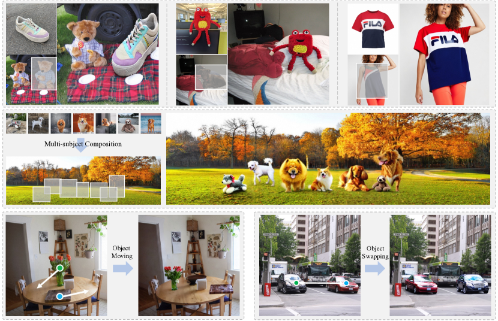
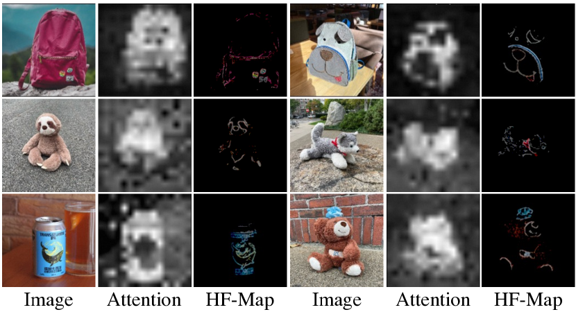
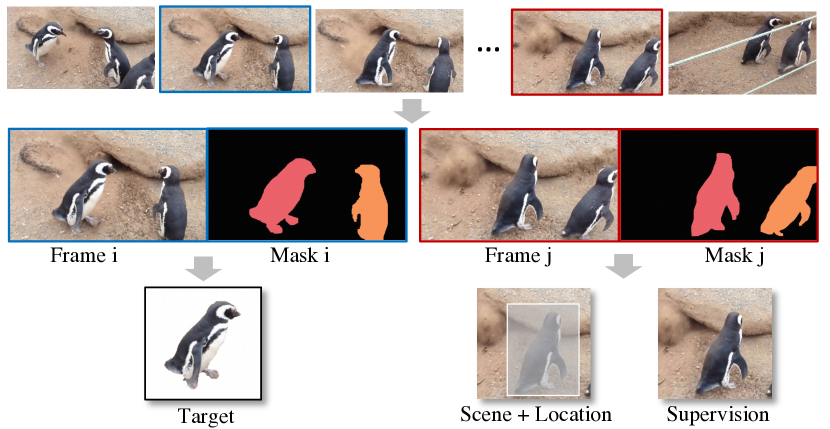
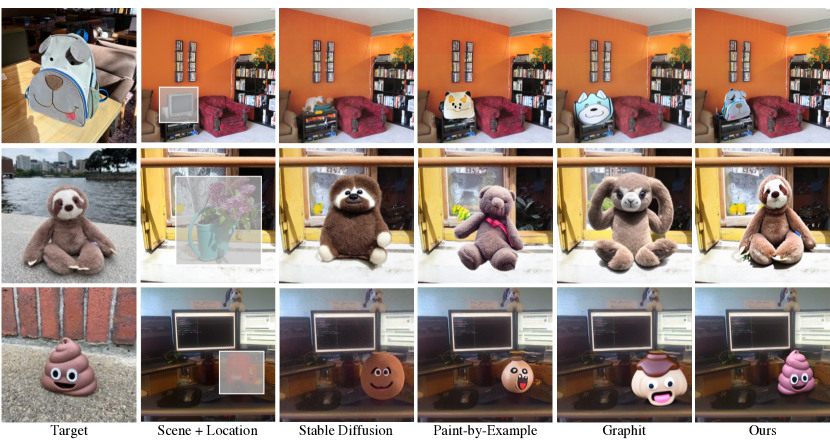
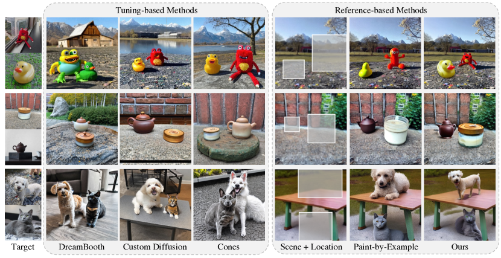
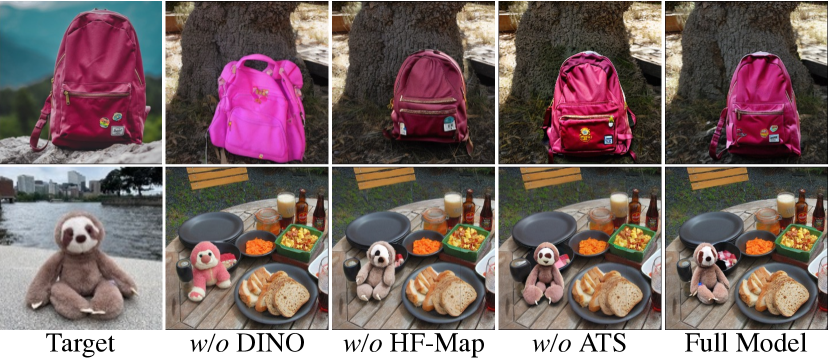
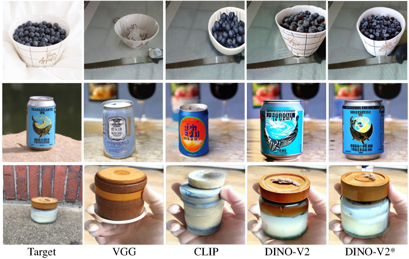
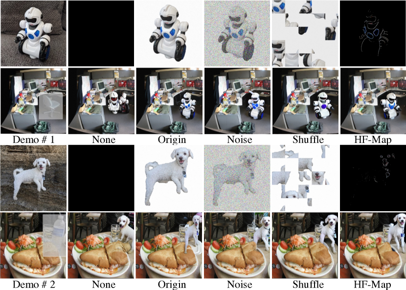
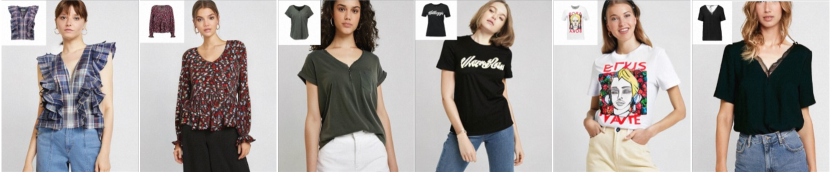
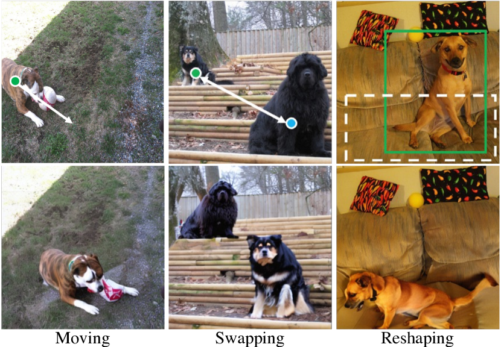

# AnyDoor: ゼロショットの物体レベル画像カスタマイズ

> 原題: AnyDoor: Zero-shot Object-level Image Customization
> 著者: Xi Chen, Lianghua Huang, Yu Liu, Yujun Shen, Deli Zhao, Hengshuang Zhao（香港大学 / Alibaba Group / Ant Group）
> 出典: ICCV 2023 ・ arXiv:2307.09481
> プロジェクトページ: https://damo-vilab.github.io/AnyDoor-Page/

## Abstract（要旨）

本研究は AnyDoor を提示する。これは、対象の物体をユーザー指定の位置に調和的なやり方で新しいシーンへ「テレポート（teleport）」する力を持つ、拡散ベースの画像生成器である。物体ごとにパラメータを調整する代わりに、我々のモデルは一度だけ学習され、推論段階で多様な物体・シーンの組み合わせに難なく汎化する。このような挑戦的なゼロショット設定は、ある物体の十分な特徴づけ（characterization）を要する。この目的のため、我々は一般的に使われる identity feature（同一性特徴）を detail feature（詳細特徴）で補完する。詳細特徴は、テクスチャの細部を保ちつつ多様な局所的変化（例: 照明、向き、姿勢など）を許すよう注意深く設計され、物体が異なる周囲と好適に溶け込むのを支える。さらに、我々は動画データセットから知識を借りることを提案する。そこでは単一の物体の様々な形態（すなわち時間軸に沿った）を観察でき、より強いモデルの汎化性と頑健性につながる。広範な実験は、我々のアプローチが既存の代替手法より優れていること、ならびに virtual try-on（仮想試着）や object moving（物体移動）のような実世界応用における大きな可能性を示す。プロジェクトページはこちら（https://damo-vilab.github.io/AnyDoor-Page/）。

<figure>

<figcaption>図1: パラメータ調整なしでの、提案する AnyDoor の素晴らしい応用。ユーザー指定の位置に単一（上段）または複数（中段）の物体を配置して画像をカスタマイズするほか、実シーン内で物体を調和的に移動・入れ替え（下段）することもできる。</figcaption>
</figure>

## 1 はじめに

画像生成は、拡散モデルの急速な進歩とともに花開いている。人間はテキストプロンプト、走り書き（scribble）、骨格マップ、その他の条件を与えることで好みの画像を生成できる。これらのモデルの力は画像編集の可能性ももたらす。例えば、ある研究は指示を介して画像の姿勢・スタイル・内容を編集することを学ぶ。他の研究はテキストプロンプトの誘導で局所的な画像領域を再生成することを探る。

本論文では「object teleportation（物体テレポーテーション）」を調査する。これは、対象の物体をシーン画像の望ましい位置に正確かつシームレスに配置することを意味する。具体的には、対象物体をテンプレートとして、シーン画像のボックスで印づけられた局所領域を再生成する。この能力は、画像コンポジション、エフェクト画像のレンダリング、ポスター制作、仮想試着などの実用応用で大きく必要とされる。

強く必要とされているにもかかわらず、このトピックは従来の研究者にあまり探られていない。Paint-by-Example と ObjectStitch は対象画像をテンプレートとしてシーン画像の特定領域を編集するが、特に未学習のカテゴリでは ID（identity, 同一性）一貫性のある内容を生成できない。カスタマイズ合成（Customized synthesis）の手法は新しい概念の生成を行えるが、与えられたシーンの位置を指定できない。さらに、ほとんどのカスタマイズ手法は複数の対象画像でほぼ 1 時間のファインチューニングを要し、実応用での実用性を大きく制限する。

我々はこの課題を AnyDoor の提案で解決する。従来手法と異なり、AnyDoor はゼロショットで高品質な ID 一貫性のあるコンポジションを生成できる。これを達成するため、対象物体を identity 関連特徴と detail 関連特徴で表現し、背景シーンとの相互作用とともにそれらを合成する。具体的には、ID extractor（ID 抽出器）を使って識別的な ID トークンを生成し、周波数を意識した（frequency-aware）detail extractor（詳細抽出器）を巧妙に設計して補完として detail map（詳細マップ）を得る。ID トークンと detail map を事前学習済みのテキスト画像拡散モデルに誘導（guidance）として注入し、望ましいコンポジションを生成する。高い多様性を持つカスタマイズ物体生成を学ぶため、動画から同じ物体の画像ペアを集めて見た目の変化を学び、また大規模な静止画像を活用してシナリオの多様性を保証する。動画と画像の両方をさらに活用するため、異なるソースの学習データが異なるノイズ除去ステップに利益をもたらすよう、adaptive timestep sampler（適応的時刻ステップサンプラー）を設計する。

これらの技術を備え、AnyDoor はゼロショットカスタマイズで並外れた能力を示す。図1 のように、AnyDoor は新しい概念の合成で有望な性能を示し、仮想試着の強力な解となりうる（上段）。さらに、AnyDoor はシーン画像の特定の局所領域を編集する高い制御性を持つため、多くのカスタマイズ生成手法が探る注目度の高い挑戦的トピックである複数被写体コンポジション（multi-subject composition）に容易に拡張できる（中段）。加えて、AnyDoor の高い生成忠実度・品質は、物体の移動や入れ替えのようなより素晴らしい応用の可能性を解き放つ（下段）。我々は AnyDoor が、画像入力を伴う様々な画像生成・編集タスクの基盤的解として、またより洒落た応用を活性化する基礎能力として役立つことを願う。

## 2 関連研究

**局所画像編集（Local image editing）**。従来研究のほとんどは、テキスト誘導で局所画像領域を編集することに焦点を当てる。Blended Diffusion は、より調和した出力を生成するためマスク領域で多段階のブレンディングを行う。InpaintAnything は SAM と Stable Diffusion を組み合わせ、ソース画像の任意の物体をテキスト記述された対象で置き換える。Paint-by-Example は CLIP 画像エンコーダを使って対象画像を誘導用の埋め込みに変換し、シーン画像に意味的一貫性のある物体を描く。ObjectStitch は Paint-by-Example と似た解を提案し、CLIP 画像エンコーダの出力をテキストエンコーダに合わせる content adaptor を学習して拡散過程を誘導する。しかし、これらの手法は生成に粗い誘導しか与えられず、未学習の新しい概念について ID 一貫性のある結果の合成にしばしば失敗する。

**カスタマイズ画像生成（Customized image generation）**。カスタマイズ、または被写体駆動（subject-driven）生成は、いくつかの対象画像と関連するテキストプロンプトが与えられたとき、特定の物体の画像を生成することを目指す。ある研究は対象概念を記述する「語彙」をファインチューニングする。Cones は参照物体に対応するニューロンを見つける。これらは高忠実度の画像を生成できるが、ユーザーはシナリオや対象物体の位置を指定できない。さらに、時間のかかるファインチューニングが大規模応用での使用を妨げる。最近、BLIP-Diffusion は BLIP-2 を活用して画像とテキストを揃え、ゼロショットの被写体駆動生成を支える。いくつかの手法はファインチューニング不要の被写体駆動生成のための大規模な上流学習を探る。Fastcomposer は画像表現を特定のテキスト埋め込みと結びつけて複数人物生成を行う。しかし、これらのゼロショットの探求はまだ初期段階で、不満足な性能か限られた応用シナリオにとどまる。

**画像調和（Image harmonization）**。古典的な画像コンポジションのパイプラインは、前景物体を切り出して与えられた背景に貼り付けるものである。画像調和は、貼り付けた領域をより合理的な照明・色に調整しうる。DCCF はピラミッドフィルタを設計して前景をよりよく調和させる。CDTNet は dual transformer を活用する。HDNet は大域・局所の一貫性を考慮する階層構造を提案し、最先端に達する。しかし、これらの手法は低レベルの変化しか探らず、前景物体の構造・視点・姿勢の編集や、影・反射の生成は考慮されない。

## 3 手法

AnyDoor のパイプラインは図2 に示される。対象物体、シーン、位置が与えられると、AnyDoor は高い忠実度と多様性で物体・シーンのコンポジションを生成する。中心的な発想は、物体を identity 関連・detail 関連の特徴で表現し、それらを事前学習済み拡散モデルに注入することで与えられたシーンに再合成することである。見た目の変化を学ぶため、動画と画像の両方を含む大規模データを学習に活用する。

<figure>

<figcaption>図2: AnyDoor の全体パイプライン。物体をユーザー指定の位置でシーンへテレポートするよう設計される。まずセグメンテーションモジュールで物体から背景を除去し、続いて ID extractor でその同一性情報を得る（Sec. 3.1）。次に「クリーンな」物体に high-pass フィルタを適用し、得られた高周波マップ（HF-Map）を望ましい位置でシーンと貼り合わせ（stitch）、detail extractor で ID extractor をテクスチャの細部で補完する（3.2）。最後に、ID トークンと detail map を事前学習済み拡散モデルに注入して最終合成を生成し、対象物体は周囲と好適に溶け込みつつ適度な局所変化を持つ（3.3）。炎と雪の結晶はそれぞれ学習可能・凍結のパラメータを指す。</figcaption>
</figure>

### 3.1 Identity 特徴抽出

我々は事前学習済みの視覚エンコーダを活用して対象物体の同一性情報を抽出する。従来研究は対象物体を埋め込むのに CLIP 画像エンコーダを選ぶ。しかし、CLIP は粗い記述を持つテキスト・画像ペアで学習されるため、意味レベルの情報しか埋め込めず、物体の同一性を保つ識別的な表現を与えるのに苦労する。この課題を克服するため、我々は次の更新を行った。

**背景除去（Background removal）**。対象画像を ID extractor に入れる前に、segmentor（セグメンタ）で背景を除去し、物体を画像中央に揃える。segmentor モデルは自動でも対話的でもよい。この操作はより整然とした識別的な特徴の抽出に役立つことが示されている。

**自己教師あり表現（Self-supervised representation）**。本研究では、自己教師ありモデルがより識別的な特徴を保つ強い能力を示すことを見出す。大規模データセットで事前学習された自己教師ありモデルは、本来的にインスタンス検索（instance-retrieval）能力を備え、物体をデータ増強不変な特徴空間に射影できる。我々は現時点で最強の自己教師ありモデル DINO-V2 を ID extractor のバックボーンに選ぶ。これは画像をグローバルトークン $\mathbf{T}_{\text{g}}^{1\times 1536}$ とパッチトークン $\mathbf{T}_{\text{p}}^{256\times 1536}$ としてエンコードする。より多くの情報を保つため、この 2 種のトークンを連結する。単一の線形層を projector として使うと、これらのトークンを事前学習済みテキスト画像 UNet の埋め込み空間に揃えられることを見出す。射影されたトークン $\mathbf{T}_{\text{ID}}^{257\times 1024}$ を我々の ID トークンと呼ぶ。

### 3.2 Detail 特徴抽出

ID トークンは空間解像度を失うため、対象物体の細かい詳細を十分に保つのは難しいと我々は考える。したがって、補完として detail 生成のための追加の誘導が必要である。

**Collage 表現（コラージュ表現）**。collage を制御として使うと強い事前情報を与えられるという先行研究に着想を得て、我々は「背景除去された物体」をシーン画像の与えられた位置に貼り合わせることを試みる。この collage で生成忠実度の著しい改善を観察したが、生成結果は与えられた対象に似すぎて多様性を欠く。この問題に直面し、我々は collage が見た目の制約を与えすぎないよう情報ボトルネック（information bottleneck）を設けることを探る。具体的には、細かい詳細を保ちつつ身ぶり・照明・向きなどの多様な局所変化を許す高周波マップ（high-frequency map）で物体を表現するよう設計する。

**高周波マップ（High-frequency map）**。対象物体の高周波マップを次で抽出する：

$$
\mathbf{I}_{h}=(\mathbf{I}\otimes\mathbf{K}_{h}+\mathbf{I}\otimes\mathbf{K}_{v})\odot\mathbf{I}\odot\mathbf{M}_{\text{erode}},
$$

ここで $\mathbf{K}_{h},\mathbf{K}_{v}$ は水平・垂直の Sobel カーネルで high-pass フィルタとして働く。$\otimes,\odot$ は畳み込みと Hadamard 積を指す。画像 $\mathbf{I}$ が与えられると、まずこれらの high-pass フィルタで高周波領域を抽出し、次に Hadamard 積で RGB 色を抽出する。また、対象物体の外輪郭付近の情報を除外するため eroded mask（収縮マスク）$\mathbf{M}_{\text{erode}}$ を加える。高周波マップを得た後、与えられた位置に従ってそれをシーン画像に貼り合わせ、collage を detail extractor に渡す。detail extractor は ControlNet スタイルの UNet エンコーダで、階層的な解像度を持つ一連の detail map を生成する。

<figure>

<figcaption>図3: ID extractor と detail extractor の注目領域の可視化。「Attention」は ID extractor バックボーン（DINO-V2）の注意マップを、「HF-Map」は detail extractor で使う高周波マップを指す。この 2 つのモジュールは大域情報と局所情報に相補的に注目する。</figcaption>
</figure>

**注目領域の可視化（Focus region visualization）**。図3 に可視化されるように、DINO-V2 が生成するトークンは全体構造により注目し、1 行目のバックパックのロゴのような細かい詳細をエンコードするのが難しい。対照的に、高周波マップはこれらの詳細を補完として面倒を見る。

<figure>

<figcaption>図4: 動画を活用するデータ準備パイプライン。クリップが与えられると、まず 2 フレームをサンプリングし各フレーム内のインスタンスをセグメントする。次に一方のフレームから 1 インスタンスを対象物体として選び、もう一方のフレームの同じインスタンスを学習の教師（すなわち望ましいモデル出力）として扱う。</figcaption>
</figure>

**表1**: 学習に使うデータセットの統計。「Variation」はデータエントリ内で物体が局所変化（例: 照明、視点、姿勢など）を享受するかどうかを、「Quality」は特に画像解像度を指す。

| Dataset | Type | # Samples | Variation | Quality |
| --- | --- | --- | --- | --- |
| YouTubeVOS | Video | 4,453 | ✓ | Low |
| YouTubeVIS | Video | 2,883 | ✓ | Low |
| UVO | Video | 10,337 | ✓ | Low |
| MOSE | Video | 1,507 | ✓ | High |
| VIPSeg | Video | 3,110 | ✓ | High |
| BURST | Video | 1,493 | ✓ | Low |
| MVImgNet | Multi-view Image | 104,261 | ✓ | High |
| VitonHD | Multi-view Image | 11,647 | ✓ | High |
| FashionTryon | Multi-view Image | 21,197 | ✓ | High |
| MSRA-10K | Single Image | 10,000 | ✗ | High |
| DUT | Single Image | 15,572 | ✗ | High |
| HFlickr | Single Image | 4,833 | ✗ | High |
| LVIS | Single Image | 118,287 | ✗ | High |
| SAM (subset) | Single Image | 100,864 | ✗ | High |

### 3.3 特徴注入（Feature Injection）

ID トークンと detail map を得た後、それらを事前学習済みテキスト画像拡散モデルに注入して生成を誘導する。我々は Stable Diffusion を選ぶ。これは画像を潜在空間に射影し、UNet を使って確率的サンプリングを行う。事前学習済み UNet を $\hat{\mathbf{x}}_{\theta}$ と表記する。これは初期潜在ノイズ $\mathbf{\epsilon}\sim\mathcal{U}([0,1])$ からノイズ除去を始め、テキスト埋め込み $\mathbf{c}$ を条件として、新しい画像潜在 $\mathbf{z}_{t}=\alpha_{t}\hat{\mathbf{x}}_{\theta}(\mathbf{\epsilon},\mathbf{c})+\sigma_{t}\mathbf{\epsilon}$ を生成する。学習の教師は次の平均二乗誤差損失である：

$$
\mathbb{E}_{\mathbf{x},\mathbf{c},\mathbf{\epsilon},t}(\|\hat{\mathbf{x}}_{\theta}(\alpha_{t}\mathbf{x}+\sigma_{t}\mathbf{\epsilon},\mathbf{c})-\mathbf{x}\|^{2}_{2}).
$$

$\mathbf{x}$ は真の画像潜在、$t$ は拡散の時刻ステップ、$\alpha_{t},\sigma_{t}$ はノイズ除去のハイパーパラメータである。

本研究では、テキスト埋め込み $\mathbf{c}$ を我々の ID トークンに置き換え、それを cross-attention（クロスアテンション）を介して各 UNet 層に注入する。detail map については、各解像度で UNet デコーダ特徴と連結（concatenate）する。学習中、事前情報（prior）を保つため UNet エンコーダの事前学習パラメータを凍結し、新しいタスクに適応させるため UNet デコーダを調整する。

<figure>

<figcaption>図5: 参照ベースの画像生成手法（Stable Diffusion、Paint-by-Example、Graphit）との定性比較。我々の AnyDoor は対象物体の同一性をよりよく保つ。すべての手法はテストサンプルでモデルをファインチューニングしていない点に注意。</figcaption>
</figure>

### 3.4 学習戦略

**画像ペアの収集（Image pair collection）**。理想的な学習サンプルは「異なるシーンの同じ物体」の画像ペアだが、これは既存データセットでは直接提供されない。代替として、従来研究は単一画像を活用し回転・反転・弾性変形などの増強を適用する。しかし、これらの素朴な増強は姿勢・視点の現実的な変化をうまく表現できない。

この問題に対処するため、本研究では動画データセットを活用して同じ物体を含む異なるフレームを捉える。データ準備パイプラインは図4 に示され、動画セグメンテーション/トラッキングデータを例に活用する。動画について、2 フレームを選び前景物体のマスクを抽出する。次に一方の画像の背景をマスクしマスク周辺で切り抜いて対象物体とする。もう一方のフレームについて、ボックスを生成しボックス領域をマスクしてシーン画像を得る。マスクされていない画像が学習の真値（ground truth）として役立つ。使用する全データは表1 に列挙され、自然シーン・仮想試着・顕著性（saliency）・多視点物体など多種多様なドメインをカバーする。

**適応的時刻ステップサンプリング（Adaptive timestep sampling）**。動画データは見た目の変化の学習に有益だが、フレーム品質は低解像度やモーションブラーのため通常は不満足である。対照的に、画像は高品質な詳細と多様なシナリオを提供できるが見た目の変化を欠く。

動画データと画像データの両方を活用するため、異なるモダリティのデータが異なるノイズ除去学習の段階に利益をもたらすよう、適応的時刻ステップサンプリングを開発する。元の拡散モデルは各学習データに対して時刻ステップ (T) を一様にサンプリングする。しかし、初期のノイズ除去ステップは主に全体構造・姿勢・視点の生成に注目し、後期のステップはテクスチャや色のような細かい詳細をカバーすることが観察される。したがって、動画データについては、見た目の変化をよりよく学ぶため、学習中に早期のノイズ除去ステップ（大きい T）をサンプリングする確率を増やす。画像については、細かい詳細をカバーする方法を学ぶため、後期のステップ（小さい T）の確率を増やす。

## 4 実験

<figure>

<figcaption>図6: 複数被写体コンポジションについての既存代替手法（DreamBooth、Custom Diffusion、Cones、Paint-by-Example）との定性比較。我々の AnyDoor はパラメータ調整なしで物体の同一性をよりよく保ち、周囲に調和的に溶け込む。</figcaption>
</figure>

### 4.1 実装の詳細

**ハイパーパラメータ**。base 生成器として Stable Diffusion V2.1 を選ぶ。学習中、画像解像度を $512\times 512$ に処理する。初期学習率 $1e^{-5}$ の Adam オプティマイザを選ぶ。

**ズームイン戦略（Zoom-in strategy）**。推論時、シーン画像と位置ボックスが与えられると、増幅率 2.0 でボックスを正方形に拡張する。次に正方形を切り抜いて $512\times 512$ にリサイズし、拡散モデルの入力とする。これにより、任意のアスペクト比のシーン画像や、極端に小さい・大きい領域のボックスを扱える。

**ベンチマーク**。定量結果のため、対象画像に DreamBooth が提供する 30 の新しい概念を用いた新しいベンチマークを構築する。シーン画像については、COCO-Val からボックス付きの 80 画像を手で選ぶ。こうして物体・シーンの組み合わせで 2,400 枚の画像を生成する。仮想試着の性能を検証するため VitonHD-test でも定性分析を行う。

**評価指標**。構築した DreamBooth データセットでは、DreamBooth に従って CLIP-Score と DINO-Score を計算する。これらの指標は生成領域と対象物体の類似度を反映できるからである。加えて、15 人のアノテータのグループでユーザー調査を組織し、忠実度（fidelity）・品質（quality）・多様性（diversity）の観点から生成結果を評価する。

### 4.2 既存代替手法との比較

**参照ベース手法（Reference-based methods）**。図5 に、従来の参照ベース手法と比較した可視化結果を示す。Paint-by-Example と Graphit は我々と同じ入力形式を支え、対象画像を入力としてパラメータ調整なしでシーン画像の局所領域を編集する。テキスト画像モデルである Stable Diffusion も比較する。その inpainting 版を使い、テキスト記述された対象の生成のため詳細なテキスト記述を条件として与える。

結果は、従来の参照ベース手法が、バックパックの犬の顔のような際立った特徴や、ナマケモノのおもちゃの色のような模様の粗い粒度では意味的一貫性を保てるだけだと示す。しかし、これらの新しい概念は学習カテゴリに含まれないため、その生成結果は ID 一貫性から程遠い。対照的に、我々の AnyDoor は高忠実な詳細でゼロショット画像カスタマイズの有望な性能を示す。

**チューニングベース手法（Tuning-based methods）**。カスタマイズ生成は広く探られている。従来研究は通常、対象物体を表すため被写体固有のテキスト反転（text inversion）をファインチューニングし、任意のテキストプロンプトで生成を行う。これらは従来の参照ベース手法より忠実度をよく保てるが、次の欠点がある。第一に、ファインチューニングは通常 4〜5 枚の対象画像を要しほぼ 1 時間かかる。第二に、背景シーンや対象位置を指定できない。第三に、複数被写体コンポジションになると、異なる被写体の属性がしばしば混ざり合う。

図6 に、比較のためチューニングベース手法を含め、従来の参照ベース手法の代表として Paint-by-Example も使う。結果は、Paint-by-Example が犬や猫のような学習済みカテゴリ（3 行目）ではうまく機能するが、新しい概念（1〜2 行目）では性能が低いことを示す。DreamBooth、Custom Diffusion、Cones は新しい概念により良い忠実度を与えるが、依然「複数被写体の混乱（multi-subject confusion）」の問題に苦しむ。対照的に、AnyDoor は参照ベース・チューニングベース両方の利点を持ち、パラメータ調整なしで複数被写体コンポジションの高忠実な結果を生成できる。

**表2**: 我々の AnyDoor と既存の参照ベース代替手法の比較に関するユーザー調査。「Quality」「Fidelity」「Diversity」はそれぞれ合成品質、物体の同一性保存、物体の局所変化（すなわち 4 提案にわたる）を測る。各指標は 1（最悪）から 4（最良）で評価。

|  | Quality (↑) | Fidelity (↑) | Diversity (↑) |
| --- | --- | --- | --- |
| Paint-by-Example | 2.71 | 2.10 | 3.04 |
| Graphit | 2.65 | 2.11 | 2.84 |
| AnyDoor (ours) | 3.04 | 3.06 | 2.88 |

**ユーザー調査（User study）**。Paint-by-Example、Graphit、我々のモデルを比較するユーザー調査を組織する。15 人のアノテータに 30 グループの画像を評価させる。各グループで 1 枚の対象画像と 1 枚のシーン画像を与え、3 つのモデルそれぞれに 4 つの予測を生成させる。「Fidelity」「Quality」「Diversity」の 3 観点から 1〜4 のスコアで画像を評価する詳細な規定とテンプレートを準備する。「Fidelity」は ID 保存能力を測る。「Quality」は忠実度を考慮せず生成画像が調和しているかを数える。「コピー&ペースト」スタイルの生成を推奨しないので、「Diversity」で 4 つの生成提案間の差異を測る。ユーザー調査の結果は表2 に列挙される。我々のモデルは忠実度と品質で明らかな優位性を持ち、特に忠実度で顕著である。ただし、Paint-by-Example と Graphit は意味的一貫性しか保たないが我々の手法はインスタンスの同一性を保つので、彼らは自然と多様性の余地が大きい。この場合でも AnyDoor は Graphit より高い評価を、Paint-by-Example と競合的な結果を得ており、手法の有効性を裏づける。

<figure>

<figcaption>図7: AnyDoor のコア構成要素についての定性アブレーション研究。「HF-Map」は detail extractor の高周波マップ、「ATS」は適応的時刻ステップサンプリングを指す。</figcaption>
</figure>

**表3**: AnyDoor のコア構成要素についての定量アブレーション研究。「CLIP Score」と「DINO score」は対象物体と生成画像から抽出した CLIP 特徴（または DINO 特徴）の類似度を計算する。物体の同一性をどれだけ保つかの評価に使う。

|  | CLIP Score (↑) | DINO Score (↑) |
| --- | --- | --- |
| Baseline | 73.8 | 31.5 |
| + DINO-V2 (with Seg) | 80.4 | 63.2 |
| ++ High-frequency Map | 81.5 | 64.8 |
| +++ Adaptive Timestep Sampling | 82.1 | 67.8 |

### 4.3 アブレーション研究

我々は設計の有効性を検証するため広範なアブレーション研究を行う。まずコア構成要素を検証し、次に ID extractor と detail extractor の詳細に踏み込んで深い分析を与える。

**コア構成要素（Core components）**。図7 に示すように、同じ対象物体・シーン・位置が与えられたとき、異なるモデル設計の生成結果を分析する。最終列に AnyDoor の生成結果を示し、各コア構成要素を個別に取り除いて影響を観察する。まず ID extractor のバックボーンを DINO-V2 から、従来の対応手法で広く使われる CLIP 画像エンコーダに変える。生成結果は同一性特徴を失い、意味的一貫性しか保てないことを見出す。次に、collage 領域を高周波マップから inpainting ベースラインのような全ゼロマップに設定する。バッグのロゴ（1 行目）やナマケモノのおもちゃの目の形（2 行目）のように、完全版モデル（最終列）と比べ細かい詳細が劣化することを見出す。我々の周波数マップが細かい構造的詳細の生成を効果的に誘導することを示す。適応的時刻ステップサンプリング（ATS）のアブレーションも行う。ATS を一様分布サンプラーに置き換えると、結果はより良い多様性を示すが画像品質・忠実度の両方で劣ることを見出す。

定量結果は表3 に示され、Paint-by-Example のような CLIP 画像エンコーダを使うベースライン解を構築する。このベースラインに各構成要素を段階的に加える。各構成要素が CLIP スコアと DINO スコアに貢献する。

<figure>

<figcaption>図8: ID extractor に異なるバックボーンを使った定性分析。「DINO-V2*」は、DINO-V2 モデルに入れる前に凍結したセグメンテーションモデルで対象物体の背景を除去することを指す。</figcaption>
</figure>

**表4**: ID extractor に異なるバックボーンを使った定量分析。「G」はグローバルトークン、「P」はパッチトークン、「Seg」は凍結したセグメンテーションモデルで対象物体の背景を除去することを指す。

|  | CLIP Score (↑) | DINO Score (↑) |
| --- | --- | --- |
| VGG | 71.7 | 27.7 |
| CLIP | 73.8 | 31.5 |
| DINO-V2 (G) | 73.1 | 35.4 |
| DINO-V2 (G+P) | 81.0 | 64.1 |
| DINO-V2 (G+P) + Seg | 82.1 | 67.8 |

**ID extractor**。ID extractor を設計する鍵となる要素を探る。図8 で、ID トークン抽出のため CLIP、DINO-V2、VGG を比較する。DINO-V2 が対象の同一性保存で圧倒的な優位を示すと結論する。また、対象物体の背景情報を除外することが重要で、それにより DINO-V2 がよりクリーンで識別的な特徴を抽出できることを検証する。定量結果は表4 に列挙され、視覚的分析と一致する。

**Detail extractor**。collage 画像について複数の探求を行う。CLIP・DINO スコアを表5 に報告する。non-collage と比べ、これらの collage 手法はすべて顕著な改善をもたらす。より良い比較のため、図9 に可視化結果を与える。これは collage なし、対象物体の元画像の貼り付け、対象物体のノイズ反転、シャッフルしたパッチ、我々の高周波マップの比較を示す。忠実度と多様性のトレードオフを観察する。「Original image」はロボットと犬の両方で最高の忠実度を示すが、生成画像は対象のコピー&ペーストのように見える。「None」は犬の姿勢で最良の多様性を示すが、犬のバッジやロボットの全体形のような詳細を欠く。これらの手法の中で、高周波マップは満足なトレードオフを示し、詳細の大部分を保ちつつ犬とロボットを適切な姿勢・視点に調整する。

<figure>

<figcaption>図9: detail 抽出に異なる collage を使った定性分析。「None」は周囲を全ゼロマップで貼り合わせることを意味する。「Origin」「Noise」「Shuffle」「HF-Map」はそれぞれ背景なしの元画像、ノイズ化画像、パッチをシャッフルした画像、高周波マップを指す。</figcaption>
</figure>

**表5**: detail 抽出に異なる collage を使った定量分析。「Original Image」戦略が物体の同一性を最もよく保つが、合成では物体の変化が極めて限られる（すなわちほぼ対象と同じ形態）点が注目に値する。

| Strategy | CLIP Score (↑) | DINO Score (↑) |
| --- | --- | --- |
| None (i.e., all-zero map) | 80.4 | 63.2 |
| Original Image | 82.2 | 68.8 |
| Noise Image | 81.6 | 68.1 |
| Patch-shuffled Image | 82.0 | 66.9 |
| High-frequency Map | 82.1 | 67.8 |

### 4.4 さらなる応用

**仮想試着（Virtual try-on）**。図10 に示すように、わずかな量のタスク固有データで学習するだけで、AnyDoor は仮想試着で満足な性能を与えられる。AnyDoor は対象服の色・テクスチャ・模様を保ち、大きな人の身ぶりでもうまく機能する。従来の GAN ベースの試着手法が human parsing map のようなより制約された入力を要するのに対し、AnyDoor は上半身の位置を示すボックスだけを必要とし、これははるかに緩い条件である。

<figure>

<figcaption>図10: VitonHD-test における AnyDoor の仮想試着への応用。</figcaption>
</figure>

**柔軟な操作（Flexible interactions）**。inpainting モデルと対話的セグメンテーションモデルを組み込むと、クリックとドラッグでより素晴らしい機能を実現できる。図11 に示すように、1 列目ではユーザーが画像境界付近に現れる犬をクリックして画像中央へドラッグできる。2 列目ではユーザーがクリックで 2 物体の位置を入れ替えられる。3 列目ではボックスの角点をドラッグして犬の形を調整できる。このパイプラインは inpainting モデルを使ってシーン背景に従い物体の元の位置を埋め、AnyDoor を適用して新しい位置で再生成する。

<figure>

<figcaption>図11: 物体移動・物体入れ替え・物体変形といったユーザー操作を伴う AnyDoor の応用。</figcaption>
</figure>

## 5 結論

本研究では、object teleportation を行える拡散ベースの生成器 AnyDoor を提示した。我々の研究の中心的貢献は、識別的な ID extractor と周波数を意識した detail extractor を使って対象物体を特徴づけることである。動画と画像データの大規模な組み合わせで学習し、シーン画像の特定位置に物体を合成する。AnyDoor は一般的な region-to-region 写像タスクの汎用解を提供し、様々な応用に有益でありうる。
