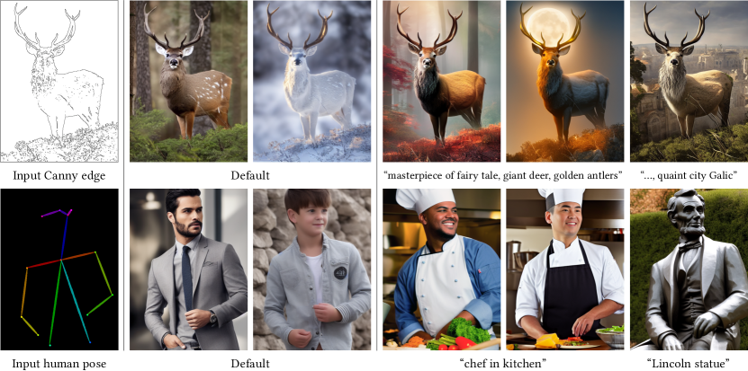
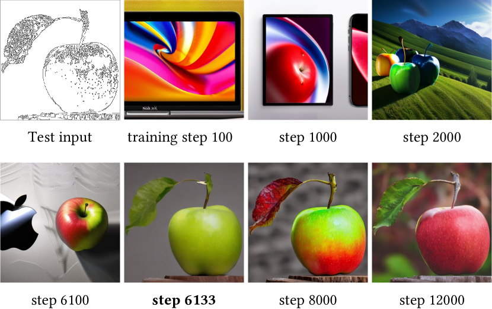
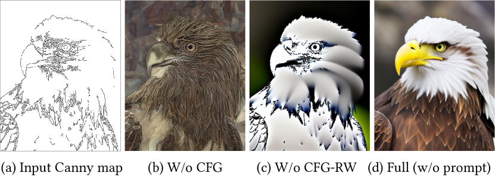
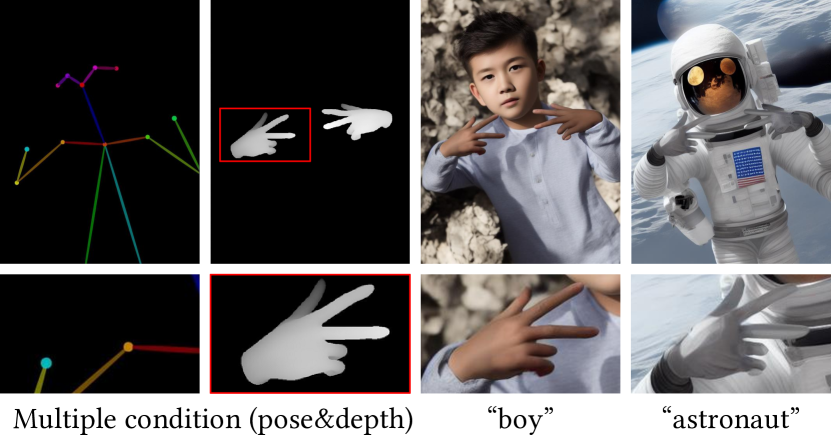
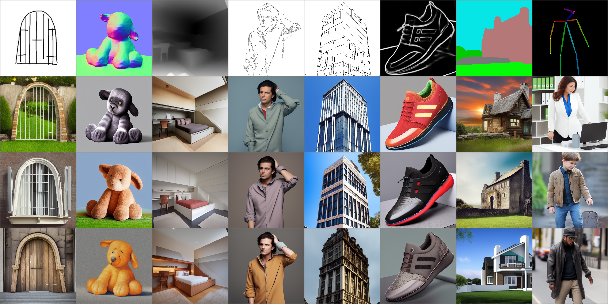
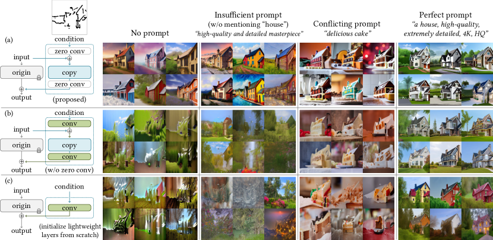
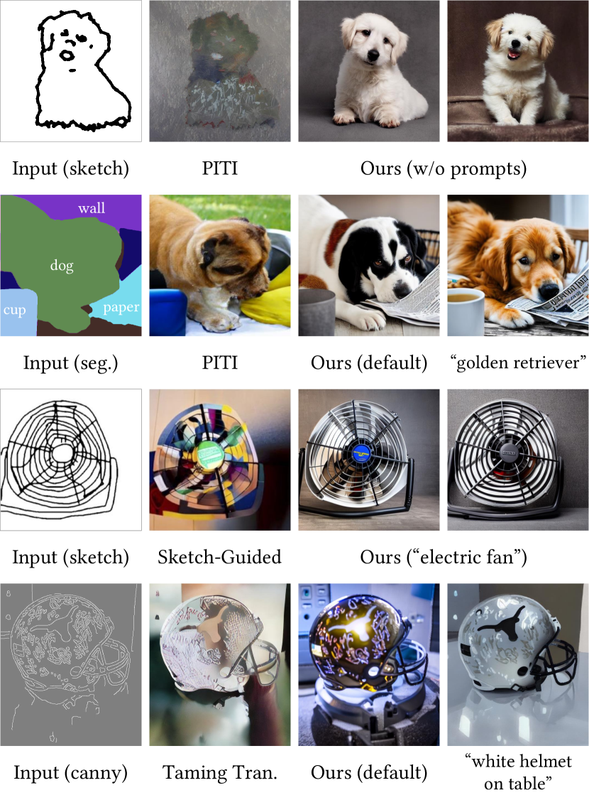
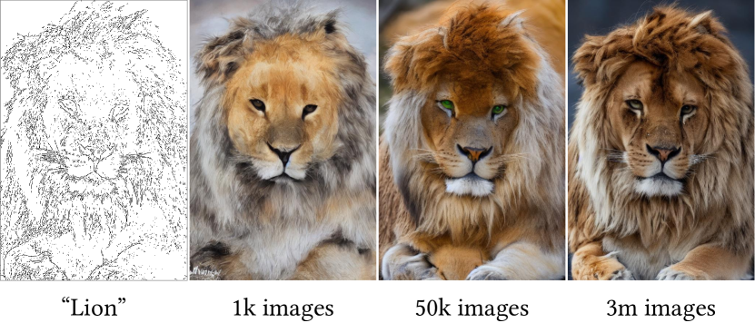
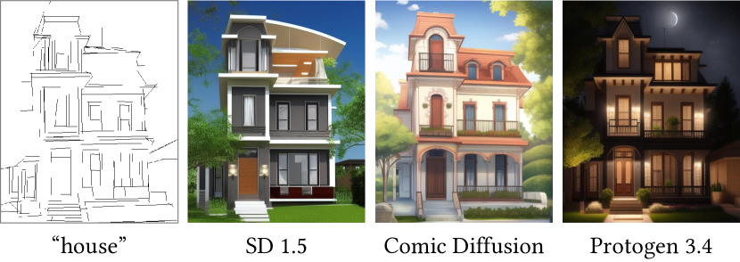

# Text-to-Image 拡散モデルへの条件付き制御の追加（Adding Conditional Control to Text-to-Image Diffusion Models）

> 原題: Adding Conditional Control to Text-to-Image Diffusion Models
> 著者: Lvmin Zhang, Anyi Rao, Maneesh Agrawala（Stanford University）
> 出典: ICCV 2023（Marr Prize / Best Paper）/ arXiv:2302.05543 ・ https://ar5iv.labs.arxiv.org/html/2302.05543

## Abstract（要旨）

我々は ControlNet を提示する。これは、大規模で事前学習済みの text-to-image 拡散モデルに空間的な条件付け制御（spatial conditioning controls）を加えるためのニューラルネットワークアーキテクチャである。ControlNet は、本番運用可能な大規模拡散モデルをロック（凍結）し、数十億の画像で事前学習されたその深く頑健なエンコーディング層を、多様な条件付き制御を学習するための強力なバックボーンとして再利用する。このニューラルアーキテクチャは「ゼロ畳み込み（zero convolutions, ゼロ初期化された畳み込み層）」で接続されており、これがパラメータをゼロから徐々に成長させ、有害なノイズがファインチューニングに影響しないことを保証する。我々は、エッジ・深度・セグメンテーション・人物姿勢など、さまざまな条件付け制御を Stable Diffusion で、単一または複数の条件を用い、プロンプトの有無を問わずにテストする。ControlNet の学習が小規模（5 万未満）・大規模（100 万超）のデータセットの両方で頑健であることを示す。広範な結果は、ControlNet が画像拡散モデルを制御するより広い応用を促進しうることを示す。

<figure>

<figcaption>図1: 学習された条件で Stable Diffusion を制御する。ControlNet は、Canny エッジ（上）や人物姿勢（下）などの条件をユーザーが追加して、大規模な事前学習済み拡散モデルの画像生成を制御することを可能にする。デフォルトの結果はプロンプト「a high-quality, detailed, and professional image」を用いる。ユーザーは任意で「chef in kitchen」のようなプロンプトを与えられる。</figcaption>
</figure>

## 1 Introduction（はじめに）

我々の多くは、唯一無二の画像に捉えたいと願う視覚的なひらめきを経験したことがある。text-to-image 拡散モデルの登場により、テキストプロンプトを打ち込むだけで視覚的に見事な画像を作れるようになった。しかし、text-to-image モデルは画像の空間的構成に対して提供する制御が限られており、複雑なレイアウト・姿勢・形状・形態をテキストプロンプトだけで精密に表現するのは難しい。頭の中のイメージに正確に合う画像を生成するには、しばしばプロンプトの編集・生成画像の検査・プロンプトの再編集という試行錯誤のサイクルを何度も要する。

ユーザーが望む画像の構成を直接指定する追加画像を提供できるようにすることで、より細かい空間的制御を可能にできないだろうか？ コンピュータビジョンと機械学習では、これらの追加画像（例: エッジマップ・人物姿勢スケルトン・セグメンテーションマップ・深度・法線など）はしばしば画像生成過程への条件付けとして扱われる。image-to-image 変換モデルは、条件画像から目標画像への写像を学習する。研究コミュニティは、空間マスクや画像編集指示、ファインチューニングによる個人化などで text-to-image モデルを制御する手段も講じてきた。いくつかの問題（例: 画像バリエーションの生成、inpainting）はノイズ除去拡散過程を制約したりアテンション層の活性化を編集したりする学習不要の技法で解決できるが、depth-to-image や pose-to-image などより多様な問題は、end-to-end の学習とデータ駆動の解を要する。

大規模 text-to-image 拡散モデルの条件付き制御を end-to-end で学習するのは難しい。特定の条件の学習データ量は、一般的な text-to-image 学習に使えるデータより大幅に少ないことがある。例えば、さまざまな特定問題（物体の形状/法線、人物姿勢抽出など）の最大級のデータセットは通常約 10 万規模で、これは Stable Diffusion の学習に使われた LAION-5B データセットの 5 万分の 1 である。限られたデータで大規模事前学習モデルを直接ファインチューニングしたり学習を継続したりすると、過学習や破滅的忘却（catastrophic forgetting）を引き起こしうる。研究者らは、学習可能パラメータの数やランクを制限することでそのような忘却を緩和できることを示してきた。我々の問題では、複雑な形状や多様な高レベル意味を持つ実世界の条件画像を扱うために、より深いまたはよりカスタマイズされたニューラルアーキテクチャの設計が必要かもしれない。

本論文は ControlNet を提示する。これは大規模な事前学習済み text-to-image 拡散モデル（我々の実装では Stable Diffusion）の条件付き制御を学習する end-to-end のニューラルネットワークアーキテクチャである。ControlNet は、大規模モデルのパラメータをロックすることでその品質と能力を保ちつつ、そのエンコーディング層の学習可能コピーも作る。このアーキテクチャは、大規模事前学習モデルを多様な条件付き制御を学習するための強力なバックボーンとして扱う。学習可能コピーと元のロックされたモデルは、重みをゼロに初期化したゼロ畳み込み層で接続され、学習中に徐々に成長する。このアーキテクチャは、学習開始時に大規模拡散モデルの深い特徴に有害なノイズが加わらないことを保証し、学習可能コピー内の大規模事前学習バックボーンがそのようなノイズで損なわれるのを防ぐ。

我々の実験は、ControlNet が Canny エッジ・Hough 線・ユーザースクリブル・人物キーポイント・セグメンテーションマップ・形状法線・深度などさまざまな条件付け入力で Stable Diffusion を制御できることを示す。単一の条件画像で、テキストプロンプトの有無を問わずにアプローチをテストし、複数条件の合成をどう支持するかを示す。加えて、ControlNet の学習が異なるサイズのデータセットで頑健かつスケーラブルであること、depth-to-image 条件付けのような一部のタスクでは単一の NVIDIA RTX 3090Ti GPU で ControlNet を学習しても、大規模計算クラスタで学習された産業用モデルに匹敵する結果が得られることを報告する。最後に、モデルの各要素の貢献を調べるアブレーション研究を行い、いくつかの強力な条件付き画像生成ベースラインとユーザー調査で比較する。

要約すると、(1) 効率的なファインチューニングを介して事前学習済み text-to-image 拡散モデルに空間的に局在化された入力条件を加えられるニューラルネットワークアーキテクチャ ControlNet を提案し、(2) Canny エッジ・Hough 線・ユーザースクリブル・人物キーポイント・セグメンテーションマップ・形状法線・深度・漫画線画で条件付けて Stable Diffusion を制御する事前学習済み ControlNet を提示し、(3) いくつかの代替アーキテクチャと比較するアブレーション実験で手法を検証し、異なるタスクにわたる複数の先行ベースラインに焦点を当てたユーザー調査を行う。

## 2 Related Work（関連研究）

### 2.1 Finetuning Neural Networks（ニューラルネットワークのファインチューニング）

ニューラルネットワークをファインチューニングする 1 つの方法は、追加の学習データで学習を直接継続することである。しかしこのアプローチは過学習・モード崩壊・破滅的忘却を招きうる。広範な研究がそのような問題を避けるファインチューニング戦略の開発に焦点を当ててきた。

**HyperNetwork** は自然言語処理（NLP）コミュニティで生まれたアプローチで、小さな再帰ニューラルネットを学習してより大きなネットの重みに影響を与えることを目指す。これは GAN を用いた画像生成に適用されてきた。Heathen ら・Kurumuz は Stable Diffusion 向けに HyperNetwork を実装し、出力画像の芸術的スタイルを変える。

**Adapter** 法は NLP で、新しいモジュール層を埋め込むことで事前学習済みトランスフォーマーを他のタスクへカスタマイズするのに広く使われる。コンピュータビジョンではアダプタは増分学習やドメイン適応に使われ、CLIP と組み合わせて事前学習バックボーンを異なるタスクへ転移するのにしばしば使われる。最近では vision transformer や ViT-Adapter で成功した結果を生んでいる。我々と同時期の研究では、T2I-Adapter が Stable Diffusion を外部条件へ適応させる。

**Additive Learning** は、元のモデル重みを凍結し、学習された重みマスク・剪定・hard attention で少数の新パラメータを加えることで忘却を回避する。Side-Tuning は side branch モデルを使い、凍結モデルと追加ネットの出力を所定のブレンド重みスケジュールで線形にブレンドして追加機能を学ぶ。

**Low-Rank Adaptation（LoRA）** は、多くの過剰パラメータ化モデルが低い固有次元の部分空間に存在するという観察に基づき、パラメータのオフセットを低ランク行列で学習することで破滅的忘却を防ぐ。

**Zero-Initialized Layers（ゼロ初期化層）** は、ネットワークブロックを接続するために ControlNet が用いる。ニューラルネットの研究は重みの初期化と操作を広く議論してきた。例えば重みのガウス初期化はゼロ初期化より危険が少ないことがある。最近では Nichol らが拡散モデルの畳み込み層の初期重みをスケールして学習を改善する方法を議論し、その「zero\_module」実装は重みをゼロにスケールする極端な場合である。Stability のモデルカードもニューラル層でのゼロ重みの使用に言及している。初期畳み込み重みの操作は ProGAN・StyleGAN・Noise2Noise でも議論されている。

### 2.2 Image Diffusion（画像拡散）

**Image Diffusion Models** は Sohl-Dickstein らによって初めて導入され、最近画像生成に適用された。Latent Diffusion Models（LDM）は潜在画像空間で拡散ステップを行い、計算コストを削減する。text-to-image 拡散モデルは、CLIP のような事前学習済み言語モデルでテキスト入力を潜在ベクトルにエンコードすることで最先端の画像生成結果を達成する。Glide はテキストガイド拡散モデルで画像生成と編集を支持する。Disco Diffusion はテキストプロンプトを CLIP ガイダンスで処理する。Stable Diffusion は潜在拡散の大規模実装である。Imagen は潜在画像を使わずピラミッド構造で直接ピクセルを拡散する。商用製品には DALL-E2 や Midjourney がある。

**Controlling Image Diffusion Models** は個人化・カスタマイズ・タスク特化の画像生成を促進する。画像拡散過程は色の変動や inpainting への制御を直接提供する。テキストガイド制御法はプロンプトの調整・CLIP 特徴の操作・cross-attention の変更に焦点を当てる。MakeAScene はセグメンテーションマスクをトークンにエンコードして画像生成を制御する。SpaText はセグメンテーションマスクを局在化トークン埋め込みに写す。GLIGEN はグラウンド生成のために拡散モデルのアテンション層で新パラメータを学ぶ。Textual Inversion と DreamBooth は、ユーザー提供の少数の例画像で画像拡散モデルをファインチューニングすることで生成画像の内容を個人化できる。プロンプトベースの画像編集はプロンプトで画像を操作する実用的ツールを提供する。Voynov らはスケッチで拡散過程を適合させる最適化法を提案する。同時期の研究は拡散モデルを制御する多様な方法を調べている。

### 2.3 Image-to-Image Translation（image-to-image 変換）

条件付き GAN とトランスフォーマーは異なる画像ドメイン間の写像を学習できる。例えば Taming Transformer は vision transformer アプローチ、Palette はスクラッチから学習した条件付き拡散モデル、PITI は image-to-image 変換のための事前学習ベースの条件付き拡散モデルである。事前学習済み GAN の操作は特定の image-to-image タスクを扱える。例えば StyleGAN は追加エンコーダで制御でき、より多くの応用が研究されている。

## 3 Method（手法）

<figure>

<figcaption>図2: (a) のように、ニューラルブロックは特徴マップ x を入力として別の特徴マップ y を出力する。そのようなブロックに ControlNet を加えるには、(b) のように、元のブロックをロックし、学習可能コピーを作り、ゼロ畳み込み層（重みとバイアスをゼロ初期化した 1×1 畳み込み）で両者を接続する。ここで c はネットワークに加えたい条件付けベクトルである。</figcaption>
</figure>

ControlNet は、大規模な事前学習済み text-to-image 拡散モデルを、空間的に局在化されたタスク特化の画像条件で強化できるニューラルネットワークアーキテクチャである。まず第 3.1 節で ControlNet の基本構造を導入し、第 3.2 節で画像拡散モデル Stable Diffusion に ControlNet をどう適用するかを記述する。第 3.3 節で学習を詳述し、第 3.4 節で複数 ControlNet の合成など推論時の追加考慮事項を述べる。

### 3.1 ControlNet

ControlNet は追加条件をニューラルネットワークのブロックに注入する（図 2）。ここで「ネットワークブロック（network block）」という用語は、resnet ブロック・conv-bn-relu ブロック・multi-head attention ブロック・transformer ブロックなど、ニューラルネットワークの単一のユニットを形成するために一般にまとめて置かれるニューラル層の集合を指す。$\mathcal{F}(\cdot;\Theta)$ をそのような学習済みニューラルブロック（パラメータ $\Theta$）とし、入力特徴マップ $\bm{x}$ を別の特徴マップ $\bm{y}$ へ変換するとする。

$$
\bm{y}=\mathcal{F}(\bm{x};\Theta). \tag{1}
$$

我々の設定では、$\bm{x}$ と $\bm{y}$ は通常 2D 特徴マップ、すなわち $\bm{x}\in\mathbb{R}^{h\times w\times c}$（$\{h,w,c\}$ はそれぞれ高さ・幅・チャネル数）である（図 2a）。

そのような事前学習済みニューラルブロックに ControlNet を加えるには、元のブロックのパラメータ $\Theta$ をロック（凍結）し、同時にブロックをパラメータ $\Theta_{\text{c}}$ の学習可能コピーへ複製する（図 2b）。学習可能コピーは外部の条件付けベクトル $\bm{c}$ を入力として取る。この構造を Stable Diffusion のような大規模モデルに適用すると、ロックされたパラメータが数十億の画像で学習された本番運用可能なモデルを保ち、学習可能コピーがそのような大規模事前学習モデルを再利用して、多様な入力条件を扱う深く頑健で強力なバックボーンを確立する。

学習可能コピーは、$\mathcal{Z}(\cdot;\cdot)$ と表記するゼロ畳み込み層でロックモデルに接続される。具体的には、$\mathcal{Z}(\cdot;\cdot)$ は重みとバイアスをともにゼロに初期化した $1\times 1$ 畳み込み層である。ControlNet を構築するため、パラメータ $\Theta_{\text{z1}}$ と $\Theta_{\text{z2}}$ を持つ 2 つのゼロ畳み込みのインスタンスを使う。完全な ControlNet は次を計算する。

$$
\bm{y}_{\text{c}}=\mathcal{F}(\bm{x};\Theta)+\mathcal{Z}(\mathcal{F}(\bm{x}+\mathcal{Z}(\bm{c};\Theta_{\text{z1}});\Theta_{\text{c}});\Theta_{\text{z2}}), \tag{2}
$$

ここで $\bm{y}_{\text{c}}$ は ControlNet ブロックの出力である。最初の学習ステップでは、ゼロ畳み込み層の重みとバイアスがともにゼロに初期化されているので、式 (2) の両方の $\mathcal{Z}(\cdot;\cdot)$ 項がゼロになり、

$$
\bm{y}_{\text{c}}=\bm{y}. \tag{3}
$$

このように、学習開始時に学習可能コピー内のニューラルネットワーク層の隠れ状態に有害なノイズが影響を与えられない。さらに、$\mathcal{Z}(\bm{c};\Theta_{\text{z1}})=\bm{0}$ かつ学習可能コピーも入力画像 $\bm{x}$ を受け取るので、学習可能コピーは完全に機能し、大規模事前学習モデルの能力を保持して、さらなる学習のための強力なバックボーンとして機能できる。ゼロ畳み込みは、初期学習ステップで勾配としてのランダムノイズを除去することでこのバックボーンを保護する。ゼロ畳み込みの勾配計算の詳細は補足資料に示す。

<figure>

<figcaption>図3: ControlNet をエンコーダブロックと中間ブロックに接続した Stable Diffusion の U-net アーキテクチャ。ロックされた灰色のブロックは Stable Diffusion V1.5（または同じ U-net を使う V2.1）の構造を示す。学習可能な青いブロックと白いゼロ畳み込み層が ControlNet を構築するために加えられる。</figcaption>
</figure>

### 3.2 ControlNet for Text-to-Image Diffusion（text-to-image 拡散のための ControlNet）

Stable Diffusion を例に、ControlNet が大規模事前学習拡散モデルにどう条件付き制御を加えられるかを示す。Stable Diffusion は本質的にエンコーダ・中間ブロック・スキップ接続デコーダを持つ U-Net である。エンコーダとデコーダはともに 12 ブロックを含み、中間ブロックを含めて全モデルは 25 ブロックを含む。25 ブロックのうち 8 ブロックはダウンサンプリングまたはアップサンプリング畳み込み層で、他の 17 ブロックは各々 4 つの resnet 層と 2 つの Vision Transformer（ViT）を含む主ブロックである。各 ViT は複数の cross-attention と self-attention 機構を含む。例えば図 3a の「SD Encoder Block A」は 4 つの resnet 層と 2 つの ViT を含み、「$\times 3$」はこのブロックが 3 回繰り返されることを示す。テキストプロンプトは CLIP テキストエンコーダでエンコードされ、拡散タイムステップは位置エンコーディングを用いる時間エンコーダでエンコードされる。

ControlNet 構造は U-net の各エンコーダレベルに適用される（図 3b）。特に、Stable Diffusion の 12 エンコーディングブロックと 1 中間ブロックの学習可能コピーを ControlNet で作る。12 エンコーディングブロックは 4 解像度（$64\times 64,32\times 32,16\times 16,8\times 8$）にあり、各々 3 回複製される。出力は U-net の 12 のスキップ接続と 1 中間ブロックに加えられる。Stable Diffusion は典型的な U-net 構造なので、この ControlNet アーキテクチャは他のモデルにも適用できる可能性が高い。

ControlNet を接続するこの方法は計算効率が良い——ロックされたコピーのパラメータは凍結されているので、ファインチューニングで元のロックエンコーダの勾配計算が不要になる。このアプローチは学習を高速化し GPU メモリを節約する。単一の NVIDIA A100 PCIE 40GB でテストすると、ControlNet なしの Stable Diffusion 最適化と比べて、ControlNet 付きの最適化は各学習イテレーションで約 23% 多い GPU メモリと 34% 多い時間しか要しない。

画像拡散モデルは画像を徐々にノイズ除去し学習ドメインからサンプルを生成することを学ぶ。ノイズ除去過程はピクセル空間か、学習データからエンコードされた潜在空間で起こりうる。Stable Diffusion は潜在画像を学習ドメインとして使い、この空間で作業することが学習過程を安定化することが示されている。具体的には、Stable Diffusion は VQ-GAN に似た前処理法を使って $512\times 512$ のピクセル空間画像をより小さい $64\times 64$ の潜在画像に変換する。Stable Diffusion に ControlNet を加えるため、まず各入力条件画像（例: エッジ・姿勢・深度など）を入力サイズ $512\times 512$ から Stable Diffusion のサイズに合う $64\times 64$ の特徴空間ベクトルに変換する。特に、$4\times 4$ カーネルと $2\times 2$ ストライドの 4 畳み込み層（ReLU で活性化、それぞれ 16, 32, 64, 128 チャネル、ガウス重みで初期化、全モデルと同時に学習）の小さなネットワーク $\mathcal{E}(\cdot)$ を使って、画像空間条件 $\bm{c}_{\text{i}}$ を特徴空間条件付けベクトル $\bm{c}_{\text{f}}$ にエンコードする。

$$
\bm{c}_{\text{f}}=\mathcal{E}(\bm{c}_{\text{i}}). \tag{4}
$$

条件付けベクトル $\bm{c}_{\text{f}}$ は ControlNet に渡される。

### 3.3 Training（学習）

入力画像 $\bm{z}_{0}$ が与えられると、画像拡散アルゴリズムは画像に徐々にノイズを加え、ノイズの乗った画像 $\bm{z}_{t}$ を生成する（$t$ はノイズが加えられた回数）。タイムステップ $\bm{t}$・テキストプロンプト $\bm{c}_{t}$・タスク特化条件 $\bm{c}_{\text{f}}$ を含む条件集合が与えられると、画像拡散アルゴリズムはノイズ画像 $\bm{z}_{t}$ に加えられたノイズを予測するネットワーク $\epsilon_{\theta}$ を学習する。

$$
\mathcal{L}=\mathbb{E}_{\bm{z}_{0},\bm{t},\bm{c}_{t},\bm{c}_{\text{f}},\epsilon\sim\mathcal{N}(0,1)}\Big{[}\|\epsilon-\epsilon_{\theta}(\bm{z}_{t},\bm{t},\bm{c}_{t},\bm{c}_{\text{f}})\|_{2}^{2}\Big{]}, \tag{5}
$$

ここで $\mathcal{L}$ は拡散モデル全体の学習目的である。この学習目的は ControlNet で拡散モデルをファインチューニングするのにそのまま使われる。

学習過程では、テキストプロンプト $\bm{c}_{t}$ の 50% をランダムに空文字列で置き換える。このアプローチは、プロンプトの代わりに入力条件画像（例: エッジ・姿勢・深度など）の意味を直接認識する ControlNet の能力を高める。

<figure>

<figcaption>図4: 突然収束（sudden convergence）現象。ゼロ畳み込みのおかげで、ControlNet は学習全体を通じて常に高品質な画像を予測する。学習過程のある時点（例: 太字で示した 6133 ステップ）で、モデルは突然入力条件に従うことを学ぶ。</figcaption>
</figure>

<figure>

<figcaption>図5: Classifier-Free Guidance（CFG）と提案する CFG 解像度重み付け（CFG Resolution Weighting, CFG-RW）の効果。</figcaption>
</figure>

<figure>

<figcaption>図6: 複数条件の合成。深度と姿勢を同時に使う応用を示す。</figcaption>
</figure>

学習過程では、ゼロ畳み込みがネットワークにノイズを加えないので、モデルは常に高品質な画像を予測できるはずである。我々はモデルが制御条件を徐々に学ぶのではなく、入力条件画像に従うことに突然成功することを観察する。通常 1 万最適化ステップ未満である。図 4 に示すように、これを「突然収束現象（sudden convergence phenomenon）」と呼ぶ。

<figure>

<figcaption>図7: プロンプトなしでさまざまな条件で Stable Diffusion を制御する。上段は入力条件、他のすべての段は出力。入力プロンプトとして空文字列を使う。全モデルは一般ドメインデータで学習。モデルは画像を生成するために入力条件画像の意味内容を認識せねばならない。</figcaption>
</figure>

### 3.4 Inference（推論）

ControlNet の追加条件がノイズ除去拡散過程にどう影響するかを、いくつかの方法でさらに制御できる。

**Classifier-free guidance 解像度重み付け（CFG resolution weighting）。** Stable Diffusion は高品質画像を生成するために Classifier-Free Guidance（CFG）と呼ばれる技法に依存する。CFG は $\epsilon_{\text{prd}}=\epsilon_{\text{uc}}+\beta_{\text{cfg}}(\epsilon_{\text{c}}-\epsilon_{\text{uc}})$ と定式化される。ここで $\epsilon_{\text{prd}}$・$\epsilon_{\text{uc}}$・$\epsilon_{\text{c}}$・$\beta_{\text{cfg}}$ はそれぞれモデルの最終出力・無条件出力・条件付き出力・ユーザー指定の重みである。条件画像が ControlNet を介して加えられると、$\epsilon_{\text{uc}}$ と $\epsilon_{\text{c}}$ の両方に加えるか、$\epsilon_{\text{c}}$ のみに加えるかができる。難しい場合（例: プロンプトが与えられないとき）、両方に加えると CFG ガイダンスが完全に除去され（図 5b）、$\epsilon_{\text{c}}$ のみを使うとガイダンスが非常に強くなる（図 5c）。我々の解は、まず条件画像を $\epsilon_{\text{c}}$ に加え、次に Stable Diffusion と ControlNet の各接続に各ブロックの解像度に応じた重み $w_{i}=64/h_{i}$ を掛けることである（$h_{i}$ は $i$ 番目のブロックのサイズ、例: $h_{1}=8,h_{2}=16,...,h_{13}=64$）。CFG ガイダンス強度を下げることで図 5d の結果を達成でき、これを CFG 解像度重み付けと呼ぶ。

**表1**: 結果品質と条件忠実度の平均ユーザーランキング（Average User Ranking, AUR）。異なる手法のユーザー嗜好ランキング（1〜5、最悪〜最良）を報告。

| Method | Result Quality ↑ | Condition Fidelity ↑ |
| --- | --- | --- |
| PITI (sketch) | 1.10 ± 0.05 | 1.02 ± 0.01 |
| Sketch-Guided ($\beta=1.6$) | 3.21 ± 0.62 | 2.31 ± 0.57 |
| Sketch-Guided ($\beta=3.2$) | 2.52 ± 0.44 | 3.28 ± 0.72 |
| ControlNet-lite | 3.93 ± 0.59 | 4.09 ± 0.46 |
| ControlNet | 4.22 ± 0.43 | 4.28 ± 0.45 |

**複数 ControlNet の合成。** 単一の Stable Diffusion インスタンスに複数の条件画像（例: Canny エッジと姿勢）を適用するには、対応する ControlNet の出力を Stable Diffusion モデルに直接加えればよい（図 6）。そのような合成に追加の重み付けや線形補間は不要である。

<figure>

<figcaption>図8: スケッチ条件と異なるプロンプト設定での異なるアーキテクチャのアブレーション研究。各設定で、チェリーピッキングせず 6 サンプルのランダムなバッチを示す。画像は 512×512 で拡大して見るのが最良。左の緑の「conv」ブロックはガウス重みで初期化された標準畳み込み層。</figcaption>
</figure>

## 4 Experiments（実験）

Canny Edge・Depth Map・Normal Map・M-LSD lines・HED soft edge・ADE20K segmentation・Openpose・ユーザースケッチを含むさまざまな条件をテストするため、Stable Diffusion で ControlNet を実装する。各条件付けの例と詳細な学習・推論パラメータは補足資料も参照のこと。

### 4.1 Qualitative Results（定性結果）

図 1 はいくつかのプロンプト設定での生成画像を示す。図 7 はプロンプトなしのさまざまな条件での結果を示し、ControlNet が多様な入力条件画像の内容意味を頑健に解釈する。

### 4.2 Ablative Study（アブレーション研究）

<figure>

<figcaption>図9: 先行手法との比較。PITI・Sketch-Guided Diffusion・Taming Transformers との定性的比較を示す。</figcaption>
</figure>

ControlNet の代替構造を、(1) ゼロ畳み込みをガウス重みで初期化した標準畳み込み層に置き換える、(2) 各ブロックの学習可能コピーを単一の畳み込み層に置き換える（これを ControlNet-lite と呼ぶ）ことで調べる。これらのアブレーション構造の完全な詳細は補足資料も参照のこと。

実世界ユーザーの起こりうる挙動をテストするため 4 つのプロンプト設定を提示する：(1) プロンプトなし、(2) 条件画像の物体を完全にカバーしない不十分なプロンプト（例: 本論文のデフォルトプロンプト「a high-quality, detailed, and professional image」）、(3) 条件画像の意味を変える矛盾プロンプト、(4) 必要な内容意味を記述する完璧なプロンプト（例: 「a nice house」）。図 8a は ControlNet が 4 設定すべてで成功することを示す。軽量な ControlNet-lite（図 8c）は条件画像を解釈するほど強くなく、不十分・なしのプロンプト条件で失敗する。ゼロ畳み込みを置き換えると、ControlNet の性能は ControlNet-lite とほぼ同じに落ち、学習可能コピーの事前学習バックボーンがファインチューニング中に破壊されたことを示す（図 8b）。

**表2**: セマンティックセグメンテーションラベル再構成（ADE20K）の Intersection over Union（IoU↑）による評価。

| ADE20K (GT) | VQGAN | LDM | PITI | ControlNet-lite | ControlNet |
| --- | --- | --- | --- | --- | --- |
| 0.58 ± 0.10 | 0.21 ± 0.15 | 0.31 ± 0.09 | 0.26 ± 0.16 | 0.32 ± 0.12 | 0.35 ± 0.14 |

### 4.3 Quantitative Evaluation（定量評価）

**ユーザー調査。** 20 枚の未見の手描きスケッチをサンプリングし、各スケッチを 5 手法（PITI のスケッチモデル、Sketch-Guided Diffusion (SGD) デフォルトエッジガイダンススケール $\beta=1.6$、SGD 比較的高いエッジガイダンススケール $\beta=3.2$、前述の ControlNet-lite、ControlNet）に割り当てる。12 人のユーザーを招き、これら 20 グループ・5 結果を「表示画像の品質」と「スケッチへの忠実度」の観点で個別にランク付けしてもらう。こうして結果品質 100・条件忠実度 100 のランキングを得る。Average Human Ranking（AHR）を嗜好指標として用い、ユーザーは各結果を 1〜5（低いほど悪い）でランク付けする。平均ランキングを表 1 に示す。

**産業用モデルとの比較。** Stable Diffusion V2 Depth-to-Image（SDv2-D2I）は大規模 NVIDIA A100 クラスタ・数千 GPU 時間・1200 万超の学習画像で学習される。我々は同じ深度条件付けで SD V2 用の ControlNet を、ただし 20 万学習サンプル・単一 NVIDIA RTX 3090Ti・5 日間の学習だけで学習する。各 SDv2-D2I と ControlNet が生成した 100 画像を使って 12 人のユーザーに 2 手法の区別を教える。その後 200 画像を生成し、各画像をどちらのモデルが生成したかをユーザーに尋ねる。ユーザーの平均精度は $0.52\pm 0.17$ で、2 手法がほぼ区別できない結果を生むことを示す。

**表3**: セマンティックセグメンテーションで条件付けた画像生成の評価。我々の手法と他のベースラインについて FID・CLIP text-image スコア・CLIP aesthetic スコアを報告。セグメンテーション条件なしの Stable Diffusion の性能も報告。「\*」付きの手法はスクラッチから学習。

| Method | FID ↓ | CLIP-score ↑ | CLIP-aes. ↑ |
| --- | --- | --- | --- |
| Stable Diffusion | 6.09 | 0.26 | 6.32 |
| VQGAN (seg.)\* | 26.28 | 0.17 | 5.14 |
| LDM (seg.)\* | 25.35 | 0.18 | 5.15 |
| PITI (seg.) | 19.74 | 0.20 | 5.77 |
| ControlNet-lite | 17.92 | 0.26 | 6.30 |
| ControlNet | 15.27 | 0.26 | 6.31 |

**条件再構成と FID スコア。** ADE20K のテストセットを使って条件付け忠実度を評価する。最先端のセグメンテーション法 OneFormer は正解集合で IoU 0.58 を達成する。異なる手法で ADE20K セグメンテーションから画像を生成し、OneFormer を適用してセグメンテーションを再検出し、再構成 IoU を計算する（表 2）。さらに Frechet Inception Distance（FID）を使い、異なるセグメンテーション条件付き手法でランダム生成した $512\times 512$ 画像集合の分布距離を測り、text-image CLIP スコアと CLIP aesthetic スコアを表 3 に示す。詳細な設定は補足資料も参照のこと。

### 4.4 Comparison to Previous Methods（先行手法との比較）

図 9 はベースラインと我々の手法（Stable Diffusion + ControlNet）の視覚的比較を示す。具体的には PITI・Sketch-Guided Diffusion・Taming Transformers の結果を示す（PITI のバックボーンは異なる視覚品質・性能を持つ OpenAI GLIDE であることに注意）。ControlNet は多様な条件画像を頑健に扱い、鋭く清潔な結果を達成することを観察する。

<figure>

<figcaption>図10: 異なる学習データセットサイズの影響。拡張例は補足資料も参照のこと。</figcaption>
</figure>

<figure>

<figcaption>図11: 内容の解釈。入力が曖昧でユーザーがプロンプトで物体内容を述べないと、結果はモデルが入力形状を解釈しようとしているように見える。</figcaption>
</figure>

<figure>

<figcaption>図12: 事前学習済み ControlNet を、ニューラルネットを再学習せずにコミュニティモデルへ転移する。</figcaption>
</figure>

### 4.5 Discussion（議論）

**学習データセットサイズの影響。** 図 10 で ControlNet 学習の頑健性を示す。学習は限られた 1k 画像でも崩壊せず、認識可能なライオンを生成できる。より多くのデータが提供されると学習はスケールする。

**内容を解釈する能力。** 図 11 で入力条件画像から意味を捉える ControlNet の能力を示す。

**コミュニティモデルへの転移。** ControlNet は事前学習済み SD モデルのネットワークトポロジーを変えないので、Comic Diffusion や Protogen 3.4 など Stable Diffusion コミュニティのさまざまなモデルに直接適用できる（図 12）。

## 5 Conclusion（結論）

ControlNet は、大規模な事前学習済み text-to-image 拡散モデルの条件付き制御を学習するニューラルネットワーク構造である。ソースモデルの大規模事前学習層を再利用して、特定条件を学習する深く強力なエンコーダを構築する。元のモデルと学習可能コピーは「ゼロ畳み込み」層で接続され、学習中の有害ノイズを除去する。広範な実験は、ControlNet が単一または複数の条件で、プロンプトの有無を問わず Stable Diffusion を効果的に制御できることを検証する。多様な条件付けデータセットでの結果は、ControlNet 構造がより広範な条件に適用可能で、関連応用を促進する可能性が高いことを示す。
