# テキスト画像拡散モデルの多概念カスタマイズ

> 原題: Multi-Concept Customization of Text-to-Image Diffusion
> 著者: Nupur Kumari¹, Bingliang Zhang², Richard Zhang³, Eli Shechtman³, Jun-Yan Zhu¹（¹Carnegie Mellon University, ²Tsinghua University, ³Adobe Research）
> 出典: CVPR 2023 ・ arXiv:2212.04488 ・ プロジェクト: https://www.cs.cmu.edu/~custom-diffusion/
> 訳注: 原典は ar5iv 由来 markdown。Appendix G（変更履歴）・References・Acknowledgement は本翻訳では除外。

## Abstract（要旨）

生成モデルは大規模データベースから学習した概念の高品質な画像を生成するが、ユーザーはしばしば自分自身の概念（例えば家族・ペット・所有物）のインスタンスを合成したいと望む。少数の例が与えられたとき、モデルに新しい概念を素早く習得させられるだろうか？ さらに、複数の新しい概念を一緒に合成できるだろうか？ 我々は、既存のテキスト画像モデルを拡張する効率的な手法 Custom Diffusion を提案する。テキスト画像の条件付け機構内のわずかなパラメータだけを最適化することが、新しい概念を表現するのに十分強力でありながら高速なチューニング（約 6 分）を可能にすることを見出す。加えて、複数の概念を同時に学習したり、複数の fine-tune 済みモデルを閉形式の制約付き最適化で 1 つに結合したりできる。我々の fine-tune 済みモデルは複数の新しい概念の変種を生成し、それらを既存の概念と斬新な設定でシームレスに合成する。本手法は、メモリと計算の効率を保ちながら、定性・定量の両評価で複数のベースラインや同時期の研究を上回るか同等の性能を示す。

<figure>

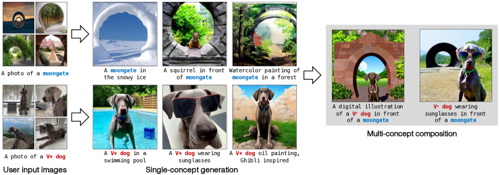

<figcaption>図1: 新しい概念の数枚の画像が与えられると、本手法は事前学習済みテキスト画像拡散モデルを拡張し、未見の文脈でその概念の新しい生成を可能にする。例となる概念には、個人の所有物・動物（例: ペットの犬）・モデルがうまく生成できないクラス（例: moongate、円形の門）が含まれる。さらに、複数の新しい概念を一緒に合成する手法も提案する（例: moongate の前でサングラスをかけた V* dog）。個人カテゴリは新しい modifier token V* で表す。</figcaption>
</figure>

## 1 はじめに

最近公開されたテキスト画像モデルは、画像生成における分水嶺の年を象徴している。テキストプロンプトを問い合わせるだけで、ユーザーは前例のない品質の画像を生成できる。こうしたシステムは多種多様な物体・スタイル・場面を生成でき、一見「ありとあらゆるもの」を生み出せるように見える。

しかし、そうしたモデルの多様で汎用的な能力にもかかわらず、ユーザーはしばしば自分自身の個人的な生活から特定の概念を合成したいと望む。例えば、家族・友人・ペットといった愛する対象や、新しいソファや最近訪れた庭園のような個人の所有物や場所は、興味深い概念となる。これらの概念は本質的に個人的なものであるため、大規模なモデル学習中には見られていない。これらの概念を事後にテキストで記述するのは扱いにくく、十分な忠実度で個人的な概念を生成できない。

これがモデルのカスタマイズの必要性を動機づける。ユーザーが提供する数枚の画像が与えられたとき、既存のテキスト画像拡散モデルを新しい概念（例えば図1 に示すペットの犬や "moongate"）で拡張できるだろうか？ fine-tune したモデルは、それらを汎化し既存の概念と合成して新しい変種を生成できるべきである。これにはいくつかの課題がある。第 1 に、モデルは既存の概念の意味を忘れたり変えたりしがちである（例: "moongate" 概念を追加すると "moon" の意味が失われる）。第 2 に、モデルは少数の学習サンプルに過学習し、サンプリングの多様性を減らしやすい。

さらに我々は、より難しい問題——*compositional fine-tuning*——を研究する。これは単一の個別概念のチューニングを超えて、複数の概念を一緒に合成する能力である（例: moongate の前のペットの犬、図1）。合成的生成の改善は最近の研究で扱われてきた。しかし複数の新しい概念を合成することは、未見の概念を混ぜるといった追加の課題を提起する。

本研究で我々は、テキスト画像拡散モデルのための fine-tuning 技法 Custom Diffusion を提案する。本手法は計算とメモリの効率が良い。上記の課題を克服するため、モデルの重みの小さな部分集合——すなわち cross-attention 層内のテキストから潜在特徴への key と value の写像——を特定する。これらを fine-tune することが、新しい概念でモデルを更新するのに十分である。モデルの忘却を防ぐため、対象画像と類似したキャプションを持つ少数の実画像集合を使う。また fine-tuning 中に augmentation を導入し、これがより速い収束と改善された結果をもたらす。複数の概念を注入するため、本手法は両方を同時に学習することも、別々に学習してから結合することも支持する。

我々は Stable Diffusion 上で手法を構築し、わずか 4 枚の学習画像を用いて様々なデータセットで実験する。単一概念の追加では、本手法は同時期の研究やベースラインよりも良いテキスト整合と対象画像への視覚的類似を示す。さらに重要なことに、本手法は複数の新しい概念を効率的に合成できるが、一方で同時期の手法は苦戦し、しばしば 1 つを欠落させる。最後に、本手法はモデル重みの小さな部分集合（モデル重みの 3%）を保存するだけでよく、fine-tuning 時間を削減する（2×A100 GPU で 6 分、同時期の研究より 2–4× 速い）。

## 2 関連研究

**深層生成モデル**　生成モデルは、学習例の集合が与えられたとき、データ分布からサンプルを合成することを目指す。これには GAN・VAE・自己回帰モデル・フローベース・拡散モデルが含まれる。制御性を改善するため、これらのモデルはクラス・画像・テキストプロンプトで条件付けできる。我々の研究は主にテキスト条件付き合成に関連する。初期の研究は少数のクラスに限られていたが、極めて大規模なデータで学習した最近のテキスト画像モデルは目覚ましい汎化能力を示した。しかしそうしたモデルは本質的にジェネラリストであり、個人の玩具や稀なカテゴリ（例: "moongate"）のような特定のインスタンスを生成するのに苦戦する。我々はこれらのモデルを新しい概念のスペシャリストになるよう適応させることを目指す。

**画像とモデルの編集**　生成モデルはランダムな画像をサンプルできるが、ユーザーはしばしば単一の特定の画像を編集したいと望む。いくつかの研究は GAN や拡散モデルといった生成モデルの能力を編集に活用することを目指す。課題は特定の画像を事前学習済みモデルで表現することであり、そうした手法は画像ごと／編集ごとの最適化を採る。密接に関連する研究の系統は、生成モデルを直接編集する。これらの手法が GAN のカスタマイズを目指すのに対し、我々の焦点はテキスト画像モデルにある。

**転移学習**　画像の分布全体を効率的に生成する手法の 1 つは、事前学習済みモデルを活用してから転移学習を使うことである。例えば、写実的な顔を漫画に適応できる。わずか数枚の学習画像で適応するには、効率的な学習技法がしばしば有用である。これらの研究がモデル全体を単一のドメインにチューニングすることに焦点を当てるのと異なり、我々は破滅的忘却なしに複数の新しい概念を獲得したい。大規模な事前学習で捉えた数百万の概念を保存することで、新しい概念をこれらの既存概念と合成して合成できる。関連して、いくつかの手法は識別的な設定で大規模モデルにアダプタモジュールや低ランク更新を学習することを提案する。対照的に我々は、既存パラメータの少数を適応させ、追加パラメータを必要としない。

**テキスト画像モデルの適応**　我々の目標と同様に、2 つの同時期の研究——DreamBooth と Textual Inversion——は、全パラメータの fine-tuning か、新しい概念のための単語ベクトルの導入・最適化のいずれかを通じて、テキスト画像拡散モデルへの転移学習を採る。我々の研究はいくつかの点で異なる。第 1 に、本研究は同時期の研究が苦戦する難しい設定——複数概念の compositional fine-tuning——に取り組む。第 2 に、我々は cross-attention 層パラメータの部分集合のみを fine-tune し、これが fine-tuning 時間を大幅に削減する。これらの設計選択がより良い結果につながることを、自動指標と人間の選好調査で検証する。

<figure>

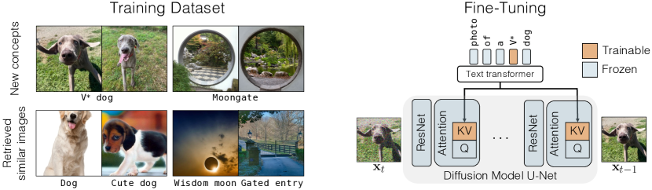

<figcaption>図2: Custom Diffusion。新しい概念の画像が与えられると、与えられた概念と類似したキャプションを持つ実画像を取得し、左に示すように fine-tuning 用の学習データセットを作る。一般カテゴリの個人的な概念を表すため、カテゴリ名の前に置く新しい modifier token V* を導入する。学習中、拡散モデルの cross-attention 層の key と value の射影行列を modifier token とともに最適化する。取得した実画像は fine-tuning 中の正則化データセットとして使う。</figcaption>
</figure>

## 3 手法

提案するモデル fine-tuning 手法は、図2 に示すように、モデルの cross-attention 層の重みの小さな部分集合のみを更新する。加えて、対象概念の少数の学習サンプルへの過学習を防ぐため、実画像の正則化集合を使う。本節では設計選択と最終的なアルゴリズムを詳しく説明する。

### 3.1 単一概念の Fine-tuning

事前学習済みテキスト画像拡散モデルが与えられたとき、わずか 4 枚の画像と対応するテキスト記述から、新しい概念をモデルに埋め込むことを目指す。fine-tune したモデルは事前知識を保持し、テキストプロンプトに基づく新しい概念の斬新な生成を可能にすべきである。更新されたテキスト画像写像が利用可能な数枚の画像に容易に過学習しうるため、これは困難でありうる。

実験では Stable Diffusion をバックボーンモデルとして使う。これは Latent Diffusion Model（LDM, 潜在拡散モデル）の上に構築されている。LDM はまず、VAE・PatchGAN・LPIPS のハイブリッド目的を使って画像を潜在表現に符号化し、エンコーダ・デコーダを通すと入力画像を復元できるようにする。次にテキスト条件を cross-attention でモデルに注入しつつ、潜在表現上で拡散モデルを学習する。

**拡散モデルの学習目的**　拡散モデルは、元のデータ分布 $q({\mathbf{x}}_{0})$ を $p_{\theta}({\mathbf{x}}_{0})$ で近似することを目指す生成モデルのクラスである：

$$
\displaystyle p_{\theta}({\mathbf{x}}_{0})=\int\Bigr{[}p_{\theta}({\mathbf{x}}_{T})\prod p_{\theta}^{t}({\mathbf{x}}_{t-1}|{\mathbf{x}}_{t})\Bigr{]}d{\mathbf{x}}_{1:T},
$$

ここで ${\mathbf{x}}_{1}$ から ${\mathbf{x}}_{T}$ は順方向マルコフ連鎖の潜在変数で、${\mathbf{x}}_{t}=\sqrt{\alpha_{t}}{\mathbf{x}}_{0}+\sqrt{1-\alpha_{t}}\epsilon$ を満たす。モデルは固定長（通常 1000）のマルコフ連鎖の逆過程を学習するよう訓練される。時刻 $t$ のノイズ画像 ${\mathbf{x}}_{t}$ が与えられると、モデルは入力画像をノイズ除去して ${\mathbf{x}}_{t-1}$ を得るよう学習する。拡散モデルの学習目的は次のように単純化できる：

$$
\displaystyle\mathbb{E}_{\epsilon,{\mathbf{x}},{\mathbf{c}},t}[w_{t}||\epsilon-\epsilon_{\theta}({\mathbf{x}}_{t},{\mathbf{c}},t)||],
$$

ここで $\epsilon_{\theta}$ はモデルの予測、$w_{t}$ は損失に対する時刻依存の重みである。モデルは時刻 $t$ で条件付けられ、さらに他の任意のモダリティ ${\mathbf{c}}$（例: テキスト）で条件付けできる。推論時には、ランダムなガウス画像（または潜在）${\mathbf{x}}_{T}$ をモデルを使って固定された時刻数だけノイズ除去する。

<figure>

<figcaption>図3: fine-tuning 中に全ネットワーク重みを更新したときの重み変化の解析。cross-attention 層の平均変化は、それらが全パラメータ数のわずか 5% を占めるにもかかわらず、他の層より著しく高い。</figcaption>
</figure>

fine-tuning の目標に対する素朴なベースラインは、与えられたテキスト・画像のペアについて式2 の損失を最小化するよう全層を更新することである。これは大規模モデルでは計算非効率になりうるし、数枚の画像で学習すると容易に過学習しうる。したがって我々は、fine-tuning のタスクに十分な最小の重み集合を特定することを目指す。

**重みの変化率**　Li ら に従い、式2 の損失で対象データセット上に fine-tune したモデルの各層のパラメータ変化を解析する。すなわち $\Delta_{l}=||\theta_{l}^{\prime}-\theta_{l}||/||\theta_{l}||$ で、$\theta_{l}^{\prime}$ と $\theta_{l}$ は層 $l$ の更新後・事前学習のモデルパラメータである。これらのパラメータは 3 種類の層から来る——(1) cross-attention（テキストと画像の間）、(2) self-attention（画像自身の中）、(3) 拡散モデル U-Net の畳み込みブロックや正規化層を含む残りのパラメータ。図3 は "moongate" 画像でモデルを fine-tune したときの 3 カテゴリの平均 $\Delta_{l}$ を示す。他のデータセットでも同様のプロットが見られる。見ての通り、cross-attention 層のパラメータは残りのパラメータと比べて相対的に高い $\Delta$ を持つ。さらに cross-attention 層はモデルの全パラメータ数のわずか 5% である。これは fine-tuning 中に重要な役割を果たすことを示唆し、本手法ではそれを活用する。

**モデルの fine-tuning**　Cross-attention ブロックは、条件特徴（テキスト画像拡散モデルの場合はテキスト特徴）に従ってネットワークの潜在特徴を変更する。テキスト特徴 ${\mathbf{c}}\in\mathbb{R}^{s\times d}$ と潜在画像特徴 ${\mathbf{f}}\in\mathbb{R}^{(h\times w)\times l}$ が与えられると、単一ヘッドの cross-attention 操作は $Q=W^{q}{\mathbf{f}},\;\;K=W^{k}{\mathbf{c}},\;\;V=W^{v}{\mathbf{c}}$ と、value 特徴上の重み付き和からなる：

$$
\displaystyle\text{Attention}(Q,K,V)=\text{Softmax}\Big{(}\frac{QK^{T}}{\sqrt{d^{\prime}}}\Big{)}V,
$$

ここで $W^{q}$・$W^{k}$・$W^{v}$ はそれぞれ入力を query・key・value 特徴に写し、$d^{\prime}$ は key と query 特徴の出力次元である。潜在特徴はその後 attention ブロックの出力で更新される。fine-tuning のタスクは与えられたテキストから画像分布への写像の更新を目指し、テキスト特徴は cross-attention ブロックの $W^{k}$ と $W^{v}$ 射影行列にのみ入力される。したがって我々は、fine-tuning 過程で拡散モデルの $W^{k}$ と $W^{v}$ パラメータのみを更新することを提案する。実験で示すように、これは新しいテキスト・画像ペアの概念でモデルを更新するのに十分である。図4 は cross-attention 層と学習可能パラメータの一例を示す。

<figure>

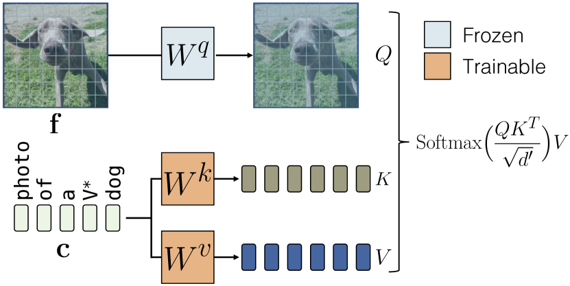

<figcaption>図4: 単一ヘッド Cross-Attention。潜在画像特徴 f とテキスト特徴 c が query Q・key K・value V に射影される。出力は value の重み付き和で、query と key 特徴の類似度で重み付けされる。本手法で更新するパラメータ Wᵏ と Wᵛ を強調している。</figcaption>
</figure>

**テキスト符号化**　対象概念の画像が与えられたとき、テキストキャプションも必要である。テキスト記述が存在する場合（例: moongate）、それをキャプションとして使う。対象概念が一般カテゴリの固有インスタンスである personalization 関連のユースケース（例: ペットの犬）では、新しい modifier token 埋め込み（V* dog）を導入する。学習中、V* は稀に出現するトークン埋め込みで初期化され、cross-attention パラメータとともに最適化される。学習中に使うテキストキャプションの例は「photo of a V* dog」である。

**正則化データセット**　対象概念とテキストキャプションのペアで fine-tuning すると、language drift（言語ドリフト）の問題が生じうる。例えば "moongate" の学習は、図5 に示すように "moon" と "gate" がそれ以前に学習された視覚概念との関連を忘れることにつながる。同様に、V* tortoise plushy という personalize された概念の学習は漏れて、plushy を含む全ての例が特定の対象画像を生成する原因になりうる。これを防ぐため、対象テキストプロンプトと高い類似度（CLIP テキストエンコーダ特徴空間で閾値 0.85 以上）を持つキャプションの正則化画像 200 枚を LAION-400M データセットから選ぶ。

<figure>

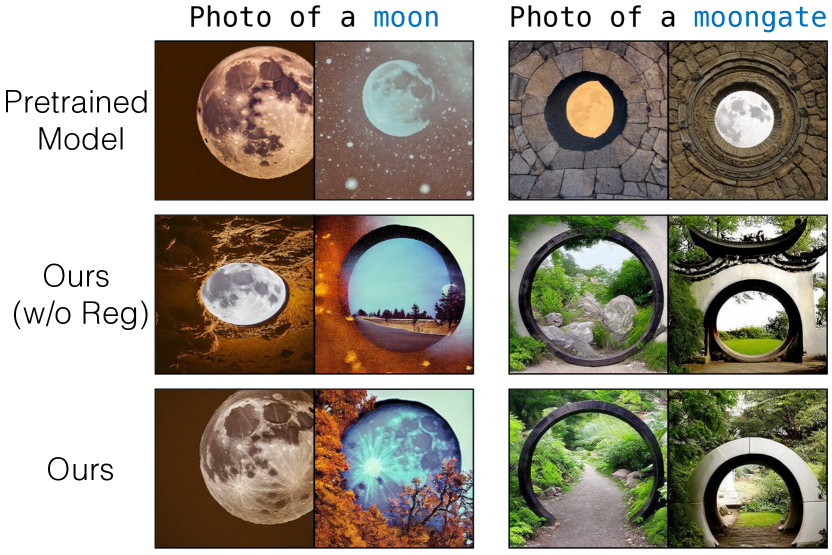

<figcaption>図5: fine-tuning 中の過学習挙動を緩和する正則化データの役割。1 行目: 事前学習済みモデルからのサンプル。2 行目: 正則化データセットなしで cross-attention の key・value 射影行列を fine-tune すると、テキストプロンプト「photo of a moon」で moongate のような画像になる。3 行目に示すように、正則化データセットの使用でこの問題を大きく緩和する。さらなる結果は図24（Appendix）にある。</figcaption>
</figure>

### 3.2 複数概念の Compositional Fine-tuning

**複数概念の Joint training**　複数概念での fine-tuning では、各個別概念の学習データセットを結合し、本手法で一緒に学習する。対象概念を表すため、異なる稀少トークンで初期化した異なる modifier token V*ᵢ を使い、各層の cross-attention の key・value 行列とともに最適化する。図7 に示すように、重み更新を cross-attention の key・value パラメータに制限することは、全重みを fine-tune する DreamBooth のような手法と比べて、2 概念の合成で著しく良い結果につながる。

**概念を結合する制約付き最適化**　本手法はテキスト特徴に対応する key・value 射影行列のみを更新するため、それらを後から結合して複数の fine-tune 済み概念での生成を可能にできる。集合 $\{W^{k}_{0,l},W^{v}_{0,l}\}_{l=1}^{L}$ を事前学習済みモデルの全 $L$ 個の cross-attention 層の key・value 行列、$\{W^{k}_{n,l},W^{v}_{n,l}\}_{l=1}^{L}$ を追加概念 $n\in\{1\cdots N\}$ の対応する更新後行列とする。後続の最適化は全層・全 key-value 行列に適用されるため、表記の明確さのため上付き $\{k,v\}$ と層 $l$ を省略する。合成目的を次の制約付き最小二乗問題として定式化する：

$$
\begin{split}\hat{W}=\operatorname*{arg\,min}_{W}||WC_{\textnormal{reg}}^{\top}-&W_{0}C_{\textnormal{reg}}^{\top}||_{F}\\
\textnormal{s.t. }\hskip 2.84526ptWC^{\top}=V,\textnormal{ whe}&\textnormal{re }C=[{\mathbf{c}}_{1}\cdots{\mathbf{c}}_{N}]^{\top}\\
\textnormal{and }&V=[W_{1}{\mathbf{c}}_{1}^{\top}\cdots W_{N}{\mathbf{c}}_{N}^{\top}]^{\top}.\end{split}
$$

ここで $C\in\mathbb{R}^{s\times d}$ は次元 $d$ のテキスト特徴である。これは全 $N$ 概念にわたる $s$ 個の対象単語で構成され、各概念の全キャプションが平坦化・連結されている。同様に $C_{\textnormal{reg}}\in\mathbb{R}^{s_{\textnormal{reg}}\times d}$ は正則化用にランダムサンプルした約 1000 個のキャプションのテキスト特徴からなる。直感的に、上記の定式化は、$C$ 内の対象キャプションの単語が fine-tune した概念行列から得た value に一貫して写されるように、元モデルの行列を更新することを目指す。上記の目的は、$C_{\textnormal{reg}}$ が非退化で解が存在すると仮定すれば、Lagrange 乗数法を使って閉形式で解ける：

$$
\begin{split}\hat{W}=W_{0}+{\mathbf{v}}^{\top}{\mathbf{d}},\hskip 2.84526pt&\textnormal{where }{\mathbf{d}}=C(C_{\textnormal{reg}}^{\top}C_{\textnormal{reg}})^{-1}\\
\textnormal{and }{\mathbf{v}}^{\top}&=(V-W_{0}C^{\top})({\mathbf{d}}C^{\top})^{-1}.\end{split}
$$

完全な導出は Appendix B に示す。joint training と比べ、各個別の fine-tune 済みモデルが存在すれば、最適化ベースの本手法はより速い（約 2 秒）。提案手法は §4.2 に示すように、1 つのシーンでの 2 つの新しい概念の一貫した生成につながる。

**学習の詳細**　本手法では単一概念で 250 ステップ、2 概念の joint training で 500 ステップ、バッチサイズ 8・学習率 $8\times 10^{-5}$ で学習する。学習中、対象画像を $0.4$–$1.4\times$ でランダムにリサイズし、リサイズ比に応じてテキストプロンプトに「very small」「far away」または「zoomed in」「close up」を付加する。有効領域でのみ損失を逆伝播する。これがより速い収束と改善された結果につながる。さらなる学習の詳細は Appendix E に示す。

## 4 実験

本節では、Stable Diffusion モデル上での単一概念 fine-tuning と 2 概念の合成の両方について、複数のデータセットでの結果を示す。

**データセット**　様々なカテゴリと学習サンプル数にまたがる 10 個の対象データセットで実験する。図8 に示すように、2 つの場面カテゴリ・2 つのペット・6 つの物体からなる。また最近、101 個の概念からなる新しいデータセット CustomConcept101 を導入し、Appendix A とウェブサイトに結果を示す。

**評価指標**　本手法を (1) *Image-alignment*（生成画像と対象概念の視覚的類似、CLIP 画像特徴空間の類似度）、(2) *Text-alignment*（生成画像と与えられたプロンプトの整合、CLIP 特徴空間のテキスト画像類似度）、(3) *KID*（LAION-400M から取得した類似概念の実画像 500 枚の検証集合上で、対象概念への過学習と既存関連概念の忘却を測る）で評価する。(4) ベースラインとの人間選好調査も行う。特記なき限り、200 ステップの DDPM サンプラーをスケール 6 で使う。

**ベースライン**　本手法を 2 つの同時期の研究——DreamBooth（サードパーティ実装）と Textual Inversion——と比較する。DreamBooth は、テキスト transformer を凍結したまま拡散モデルの全パラメータを fine-tune し、生成画像を正則化データセットとして使う。各対象概念は固有識別子に続けてカテゴリ名「[V] category」で表され、[V] はテキストトークン空間で稀に出現するトークンで fine-tuning 中は最適化されない。Textual Inversion は各新概念に新しい V* トークンを最適化する。我々はまた、U-Net 拡散モデルの全パラメータを本手法の V* トークン埋め込みとともに fine-tune する競争的なベースライン Custom Diffusion（w/ fine-tune all）とも比較する。

### 4.1 単一概念 Fine-tuning の結果

**定性評価**　各 fine-tune 済みモデルを難しいプロンプト集合でテストする。これには、新しい場面での対象概念の生成・既知の芸術スタイルでの生成・別の既知物体との合成・対象概念の特定属性（色・形・表情）の変更が含まれる。図6 は本手法・DreamBooth・Textual Inversion のサンプル生成を示す。本手法 Custom Diffusion は、対象物体の視覚的詳細を捉えつつより高いテキスト画像整合を持つ。Textual Inversion より良く、DreamBooth と同等でありながら、より低い学習時間とモデル保存量（約 5× 速く、75MB 対 3GB の保存量）を持つ。

**定量評価**　各データセットで 20 個のテキストプロンプトとプロンプトあたり 50 サンプルを評価し、計 1000 枚の生成画像になる。全手法で 50 ステップの DDPM サンプリングと classifier-free guidance スケール 6 を使う。図8 に示すように、本手法は同時期の手法を上回る。また Custom Diffusion は、拡散モデルの全重みを fine-tune する提案ベースラインと同等に機能しつつ、より計算・時間効率が良い。表1 は各 fine-tune 済みモデルが生成した画像の、fine-tune 概念と類似したキャプションを持つ参照データセット上での KID も示す。見ての通り、本手法は大半のベースラインより低い KID を持ち、対象概念への過学習が少ないことを示唆する。Appendix C では、更新行列を圧縮してモデル保存量をさらに削減できることを示す。

**計算要件**　本手法の学習時間は約 6 分（2×A100 GPU）で、Ours（w/ fine-tune all）の 20 分（4×A100）、Textual Inversion の 20 分（2×A100）、DreamBooth の約 1 時間（4×A100）と比べられる。また 75MB の重みのみを更新するため、各概念モデルの保存に低メモリで済む。バッチサイズは全手法で 8 に固定する。

<figure>

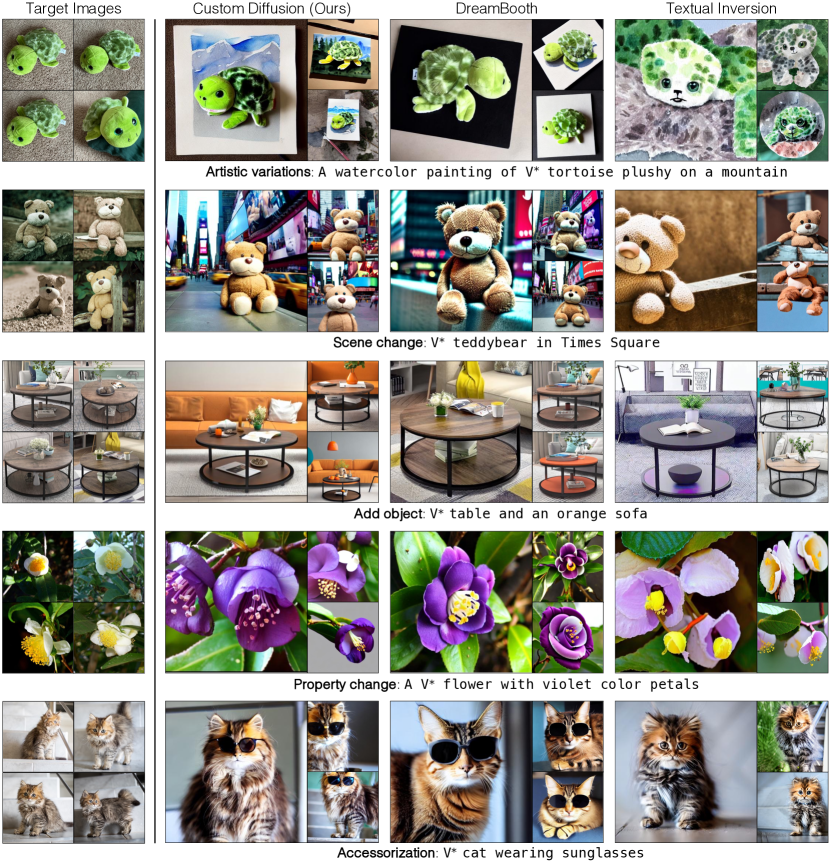

<figcaption>図6: 単一概念 fine-tuning の結果。新しい概念の画像（左に対象画像）が与えられると、本手法は未見の文脈や芸術スタイルで概念を含む画像を生成できる。1 行目: 水彩画の芸術スタイルでの概念表現。本手法は背景の山も生成できるが、DreamBooth と Textual Inversion は省く。2 行目: 背景場面の変更。3 行目: 別の物体の追加（対象テーブルにオレンジのソファ）。4 行目: 物体の属性変更（花弁の色）。5 行目: ペットの猫にサングラスを付ける。本手法はベースラインより視覚的類似をよく保つ。Textual Inversion では入力プロンプトが最適化した V* のみからなる。</figcaption>
</figure>

<figure>

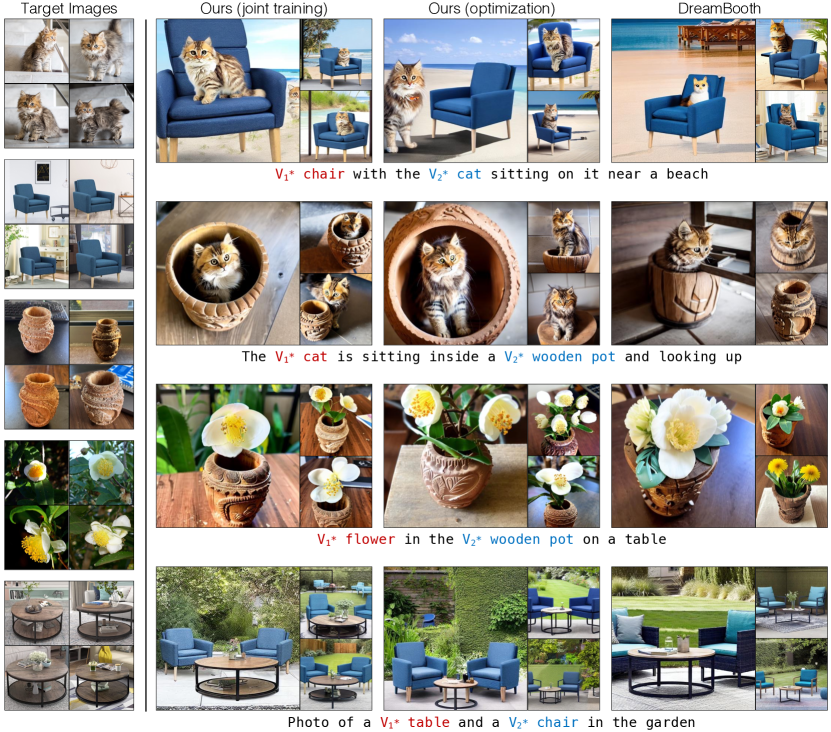

<figcaption>図7: 複数概念 fine-tuning の結果。1 行目: 本手法は 1 列目の個人の猫と椅子の画像とより高い視覚的類似を持ちつつテキスト条件に従う。2 行目: DreamBooth は 4 枚中 3 枚で猫を省くが、本手法は猫と木製の鉢の両方を生成する。3 行目: 本手法は木製の鉢の中に対象の花を生成しつつ対象画像への視覚的類似を保つ。4 行目: 庭で対象のテーブルと椅子を一緒に生成。全設定で、最適化ベース手法と joint training は DreamBooth より良く、joint training は最適化ベース手法より良い。</figcaption>
</figure>

### 4.2 複数概念 Fine-tuning の結果

同じシーンに 2 つの新しい概念を生成する結果を、次の 5 ペアで示す: (1) Moongate + Dog、(2) Cat + Chair、(3) Wooden Pot + Cat、(4) Wooden Pot + Flower、(5) Table + Chair。本手法を、2 つのデータセットを各概念に異なる [V₁]・[V₂] トークンを使って一緒に学習する DreamBooth と比較する。Textual Inversion では、同じ文中で各概念に個別に fine-tune したトークンを使って推論する。図8・表1 で、各合成設定について 8 プロンプトで生成した 400 枚の画像でベースラインと比較する。2 概念を順次学習するベースラインや本手法の全重み fine-tune とも比較する。本手法は「Table+Chair」の合成（全手法が同等、Textual Inversion を除く）以外の全てで良い。これは合成のために cross-attention パラメータのみを fine-tune することの重要性を示す。順次学習の場合、最初の概念の忘却が見られる。図7 は提案 2 手法と DreamBooth のサンプル画像を示す。見ての通り、本手法は入力テキストプロンプトと高い整合を持ちつつ、2 つの物体を同じシーンに一貫した形で生成できる。

<figure>

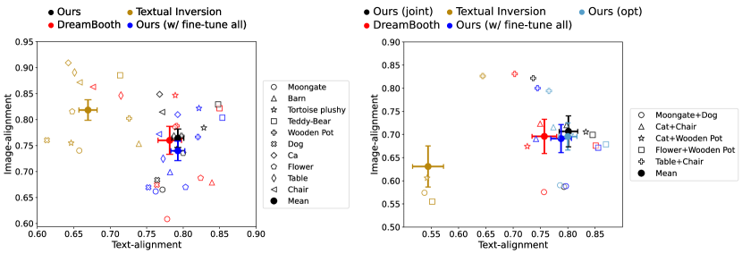

<figcaption>図8: 単一概念（左）と複数概念（右）fine-tuning のテキスト・画像整合。DreamBooth・Textual Inversion・本手法の w/ fine-tune all ベースラインと比べ、本手法は（より小さい分散で）右上の隅に位置する。対象画像への高い類似と新プロンプトへのテキスト整合の間にはトレードオフがある。このトレードオフを考慮すると、本手法はベースラインと同等以上である。複数概念では joint training と最適化ベース手法の両方が他のベースラインより良い。</figcaption>
</figure>

**表1**: 定量比較。上段: データセット平均の単一概念 fine-tuning 評価。最終列は実検証集合画像と同じキャプションの生成画像の KID（×10³）。本手法は実画像の正則化集合を使うため低い KID を達成し、事前学習済みモデルをわずかに上回りさえする。Textual Inversion はモデルを更新しないため事前学習済みモデルと同じ KID。下段: 5 つの合成ペア平均の複数概念評価。

|  | Method | Text-alignment | Image-alignment | KID (validation) |
| --- | --- | --- | --- | --- |
| 単一概念 | Textual Inversion | 0.670 | 0.827 | 22.27 |
| | DreamBooth | 0.781 | 0.776 | 32.53 |
| | Ours (w/ fine-tune all) | 0.795 | 0.748 | 19.27 |
| | Ours | 0.795 | 0.775 | 20.96 |
| 複数概念 | Textual Inversion | 0.544 | 0.630 | — |
| | DreamBooth | 0.783 | 0.695 | — |
| | Ours (w/ fine-tune all) | 0.787 | 0.691 | — |
| | Ours (Sequential) | 0.797 | 0.700 | — |
| | Ours (Optimization) | 0.800 | 0.695 | — |
| | Ours (Joint) | 0.801 | 0.706 | — |

**表2**: 人間選好調査。各対比較で、本手法は image-・text-alignment の両方でベースラインより選好される（≥50%）。Textual Inversion は対象画像に過学習するようで、単一概念設定では本手法と類似した image-alignment を持つが text-alignment で劣る。数値は「本手法が選好された割合（%）± 信頼区間」。

| 設定 | vs Textual Inversion (Text / Image) | vs DreamBooth (Text / Image) | vs Ours w/ fine-tune all (Text / Image) |
| --- | --- | --- | --- |
| 単一概念 | 72.62±2.38% / 51.62±2.62% | 53.50±2.64% / 56.62±2.44% | 55.17±2.55% / 53.99±2.44% |
| 複数概念 (Joint) | 86.65±2.25% / 81.89±2.09% | 56.39±2.46% / 61.80±2.59% | 59.00±2.61% / 59.12±2.72% |
| 複数概念 (Optimization) | 81.22±2.72% / 83.11±2.18% | 57.00±2.62% / 61.75±2.68% | 57.60±2.43% / 53.49±2.71% |

### 4.3 人間選好調査

Amazon Mechanical Turk を使って人間選好調査を行う。本手法と DreamBooth・Textual Inversion・Ours（w/ fine-tune all）の対テストを行う。text-alignment では、同じプロンプトでの各手法（本手法 vs ベースライン）の 2 つの生成を「どちらの画像がテキストとより一貫しているか？」という質問とともに示す。image-alignment では、関連概念の 2–4 枚の学習サンプルを生成画像とともに「どちらの画像が対象画像に示された物体をよりよく表すか？」という質問とともに示す。各アンケートで 800 応答を集める。表2 に示すように、本手法は単一概念・複数概念の両方でベースラインより選好され、Ours（w/ fine-tune all）と比べても選好される。これは cross-attention パラメータのみを更新することの重要性を示す。

**表3**: Ablation 研究。学習中の augmentation なしは image-alignment を下げる。正則化データセットなし、または生成画像を正則化に使うと、KID がはるかに悪化する。

| Method | Text-alignment | Image-alignment | KID (validation) |
| --- | --- | --- | --- |
| Ours | 0.795 | 0.775 | 20.96 |
| Ours w/o Aug | 0.800 | 0.736 | 20.67 |
| Ours w/o Reg | 0.799 | 0.756 | 32.64 |
| Ours w/ Gen | 0.791 | 0.768 | 34.70 |

<figure>

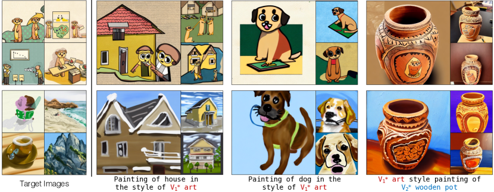

<figcaption>図9: 芸術スタイルでの Custom Diffusion。本手法は新しいスタイルの学習にも使える。上段・下段はそれぞれ 13 枚・15 枚の画像で fine-tune した。最終列は最適化ベース手法を使ったスタイルと新しい「wooden pot」概念の合成を示す。スタイル画像クレジット: Mia Tang（上段）、Aaron Hertzmann（下段）。</figcaption>
</figure>

### 4.4 Ablation と応用

本節では、手法の各構成要素を ablation してその寄与を示す。各実験を §4.1 と同じ設定で評価する。

**正則化として生成画像を使う（Ours w/ Gen）**　§3.1 で詳述したように、fine-tuning 中の正則化として類似カテゴリの実画像とキャプションを取得して使う。正則化データセットを作るもう 1 つの方法は、事前学習済みモデルから画像を生成することである。対象概念の「カテゴリ」について「photo of a {category}」プロンプトで画像を生成するこの設定と比較し、表3 に結果を示す。生成画像を使うと対象概念で類似した性能になる。しかし、類似カテゴリの実画像の検証集合での KID で測ると、過学習の兆候を示す。

<figure>

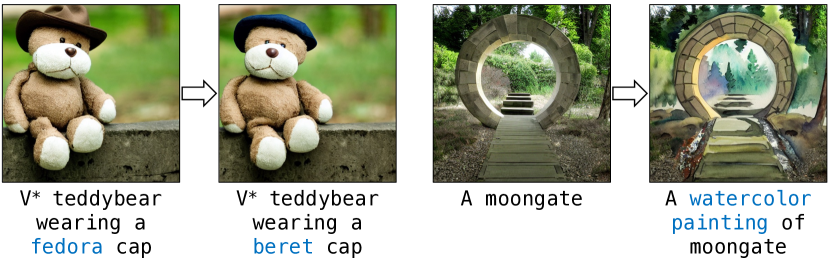

<figcaption>図10: Prompt-to-Prompt を使った本手法のモデルでの画像編集。左: キャップだけを変える置換編集。右: 画像内容を保ちつつのスタイル化。</figcaption>
</figure>

<figure>

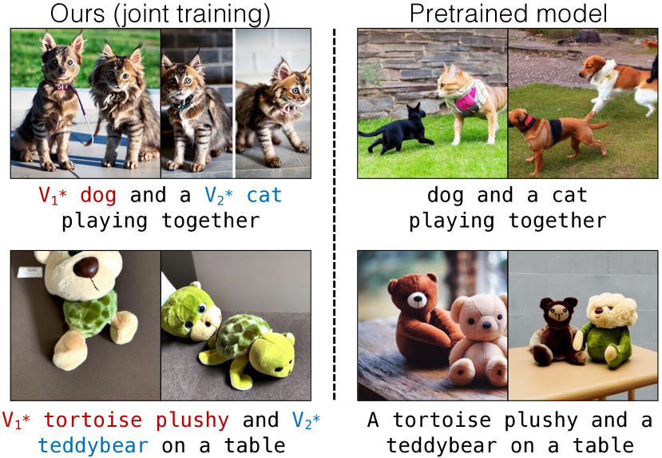

<figcaption>図11: 複数概念 fine-tuning の失敗例。本手法は、猫と犬を 1 シーンに、または teddybear と tortoise plushy のような似カテゴリ物体（右）のような難しい合成で失敗する。ただし左に示すように、事前学習済みモデルも同様の合成で苦戦する。</figcaption>
</figure>

**正則化データセットなし（Ours w/o Reg）**　正則化データセットを使わない結果を示す。半分の反復数（学習中に見る対象画像と同数）でモデルを学習する。表3 は、モデルが image-alignment がわずかに低く、検証集合での高い KID から明らかなように既存概念を忘れがちであることを示す。

**データ augmentation なし（Ours w/o Aug）**　§3.2 で述べたように、学習中に対象画像をランダムにリサイズしサイズ関連のプロンプト（例: 「very small」）をテキストに付加して augment する。ここではこれらの augmentation を使わない効果を示す。表3 は、augmentation なしが対象画像との視覚的類似を下げることを示す。

**スタイルでの fine-tuning**　図9 に示すように、本手法は特定のスタイルでの fine-tuning にも使える。対象画像のテキストプロンプトを「A painting in the style of V* art」に変える。正則化画像は「art」と高い類似のキャプションで取得する。

**fine-tune 済みモデルでの画像編集**　事前学習済みモデルと同様に、本手法の fine-tune 済みモデルは既存の画像編集手法で使える。図10 に Prompt-to-prompt 手法を使った例を示す。

## 5 議論と限界

結論として、わずか数枚の画像例を使い、新しい概念・カテゴリ・個人の物体・芸術スタイルで大規模テキスト画像拡散モデルを fine-tune する手法を提案した。計算効率の良い本手法は、対象画像との視覚的類似を保ちつつ、fine-tune した概念の斬新な変種を新しい文脈で生成できる。さらに、モデル重みの小さな部分集合のみを保存すればよい。加えて、本手法は複数の新しい概念を同じシーンに一貫して合成できる。

図11 に示すように、難しい合成（例: ペットの犬とペットの猫）は依然として困難である。この場合、事前学習済みモデルも同様の困難に直面し、本モデルはこれらの限界を継承する。加えて、3 つ以上の概念を一緒に合成することも困難である。Appendix C でさらなる解析と可視化を示す。

## 付録A CustomConcept101

新しく公開した 101 概念のデータセット CustomConcept101 の結果を示す。これは玩具・ぬいぐるみ・着用物・ペット・場面・人間の顔を含む多様なカテゴリからなる。図12 はデータセットの各概念の 1 枚の画像を示す。画像は再配布を許可するウェブサイト（例: Unsplash）から収集したか、自分たちで撮影した。複数概念について、概念間の 101 個の固有の合成（例: V₁* dog と V₂* sunglasses）を提案する。またカスタマイズ評価用のテキストプロンプトも作成し、単一概念で各 20 プロンプト、複数概念合成で 12 プロンプトとする。まず ChatGPT を使って特定の概念または概念ペアからなる 40 プロンプトを提案させた。背景場面の変更・別の物体の挿入・主被写体のスタイル変種の作成を指示した。その後、手動でフィルタ・修正して最終プロンプト集合を作った。

表4 は本手法と DreamBooth・Textual Inversion の比較を示す。本手法と DreamBooth はこのデータセットで生成画像を正則化として学習した。単一概念では、本手法は DreamBooth と同等で、image-alignment がわずかに低く text-alignment が高い。Textual Inversion は対象画像に過学習し text-alignment が低い。複数概念カスタマイズでは、本手法の最適化・joint training の両方が平均で DreamBooth より良い。各手法のサンプル画像は図13 に示す。

**表4**: CustomConcept101 での定量比較。単一概念では、本手法は DreamBooth と比べ text-alignment で良く image-alignment でわずかに劣る。複数概念では、本手法は平均で DreamBooth を上回る。指標は単一概念で 20 プロンプト・100 枚、複数概念で 12 プロンプト・120 枚で計算し全モデルで平均。各場合 200 ステップの DDPM サンプラーを使用。

|  | Method | Text-alignment | Image-alignment |
| --- | --- | --- | --- |
| 単一概念 | Textual Inversion | 0.612 | 0.752 |
| | DreamBooth | 0.752 | 0.752 |
| | Ours | 0.760 | 0.744 |
| 複数概念 | DreamBooth | 0.738 | 0.662 |
| | Ours (Optimization) | 0.763 | 0.658 |
| | Ours (Joint) | 0.757 | 0.668 |

<figure>

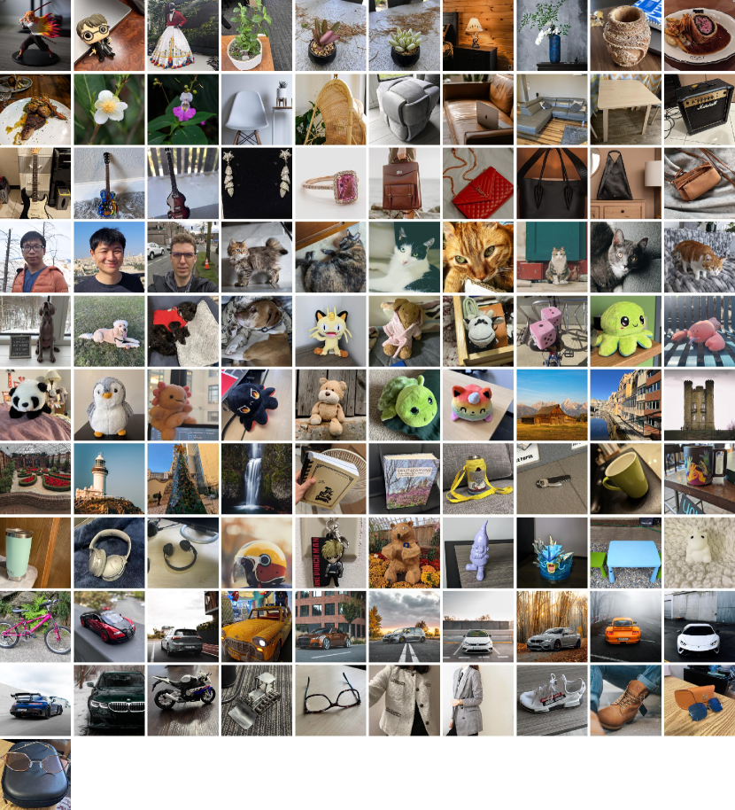

<figcaption>図12: CustomConcept101 データセット。データセットの各概念の例画像。101 カテゴリのうち 31 は Unsplash から、花カテゴリの 2 概念は再配布を許可する他のウェブサイトから収集し、残りは自分たちで撮影した。</figcaption>
</figure>

<figure>

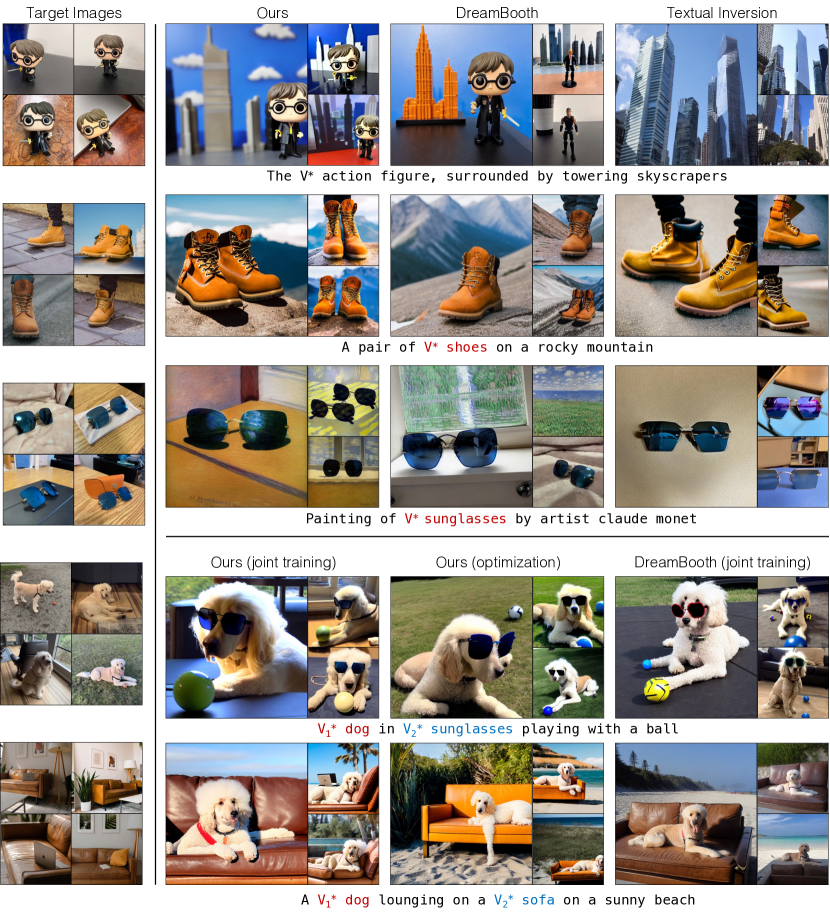

<figcaption>図13: CustomConcept101 での定性比較。単一概念の上ブロック（最初の 3 行）は、データセットの 3 概念での本手法と DreamBooth・Textual Inversion のサンプル比較を示す。本手法は高いテキスト整合を示し、DreamBooth は対象画像との image-alignment をより保つ。複数概念: 下ブロック（最後の 2 行）は本手法と DreamBooth の複数概念合成を示す。本手法の joint training は両対象画像との image-alignment で上回りつつテキスト整合を保つ。</figcaption>
</figure>

## 付録B 複数概念の最適化ベース手法

複数の概念を一緒に合成するため、制約付き最小二乗問題（§3.2、式4 で導入）を解いた。本論の式5 に示すように閉形式で解いた。ここで完全な導出を示す。まず目的を再掲する。

$$
\begin{split}\hat{W}=\operatorname*{arg\,min}_{W}||WC_{\textnormal{reg}}^{\top}-&W_{0}C_{\textnormal{reg}}^{\top}||\\
\textnormal{s.t. }\hskip 2.84526ptWC^{\top}=V,\textnormal{ whe}&\textnormal{re }C=[{\mathbf{c}}_{1}\cdots{\mathbf{c}}_{N}]^{\top}\\
\textnormal{and }&V=[W_{1}{\mathbf{c}}_{1}^{\top}\cdots W_{N}{\mathbf{c}}_{N}^{\top}]^{\top}.\end{split}
$$

ここで行列ノルムは Frobenius ノルム、$W_{0}\in\mathbb{R}^{o\times d}$ は事前学習済みモデルの行列、$C\in\mathbb{R}^{s\times d}$ は次元 $d$ のテキスト特徴である。これは全 $N$ 概念にわたる $s$ 個の対象単語で構成され、各概念の全キャプションが平坦化・連結されている。同様に $C_{\textnormal{reg}}\in\mathbb{R}^{s_{\textnormal{reg}}\times d}$ は正則化用にランダムサンプルした約 1000 個のキャプションのテキスト特徴からなる。

Lagrange 乗数法を使って、次の目的を最小化する必要がある：

$$
\begin{split}L=\frac{1}{2}||WC_{\textnormal{reg}}^{\top}-W_{0}C_{\textnormal{reg}}^{\top}||-\textnormal{trace}({\mathbf{v}}(WC^{\top}-V)),\end{split}
$$

ここで ${\mathbf{v}}\in\mathbb{R}^{s\times o}$ は制約に対応する Lagrange 乗数である。上記の目的を微分して 0 と等置すると：

$$
\begin{split}WC_{\textnormal{reg}}^{\top}C_{\textnormal{reg}}-W_{0}C_{\textnormal{reg}}^{\top}C_{\textnormal{reg}}-{\mathbf{v}}^{\top}C=0\\
\implies W=W_{0}+{\mathbf{v}}^{\top}C(C_{\textnormal{reg}}^{\top}C_{\textnormal{reg}})^{-1}.\end{split}
$$

$C_{\textnormal{reg}}$ が非退化と仮定する。上記の解を式6 の $WC^{\top}=V$ に使うと：

$$
\begin{split}&(W_{0}+{\mathbf{v}}^{\top}C(C_{\textnormal{reg}}^{\top}C_{\textnormal{reg}})^{-1})C^{\top}=V\\
&\textnormal{Let }{\mathbf{d}}=C(C_{\textnormal{reg}}^{\top}C_{\textnormal{reg}})^{-1}\\
&{\mathbf{v}}^{\top}=(V-W_{0}C^{\top})({\mathbf{d}}C^{\top})^{-1}.\end{split}
$$

<figure>

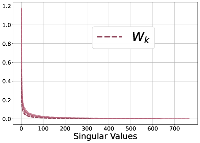

<figcaption>図14: 事前学習済みモデルと fine-tune 済みモデルの間の cross-attention 層の key・value 射影行列の差分の特異値の解析。プロットに示すように特異値は 0 に下がり、差分行列を低ランク行列で近似できることを示唆する。</figcaption>
</figure>

<figure>

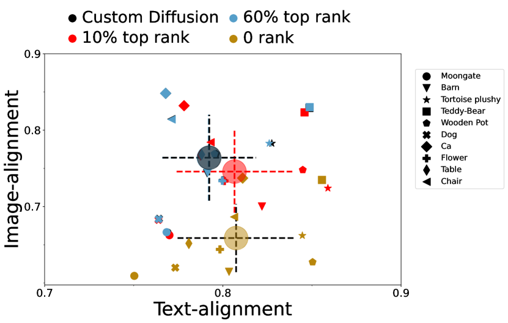

<figcaption>図15: 圧縮モデルでの定量結果。事前学習済みと fine-tune 済みモデルの更新重みの差分の低ランク近似を保存する。上位 60% のランク（5× 圧縮）でも性能はほぼ維持される（青と黒の点が重なる）。圧縮を増やすと image-alignment スコアが下がり、モデルは高い text-alignment を持つ事前学習済みモデル重みに近づく。</figcaption>
</figure>

<figure>

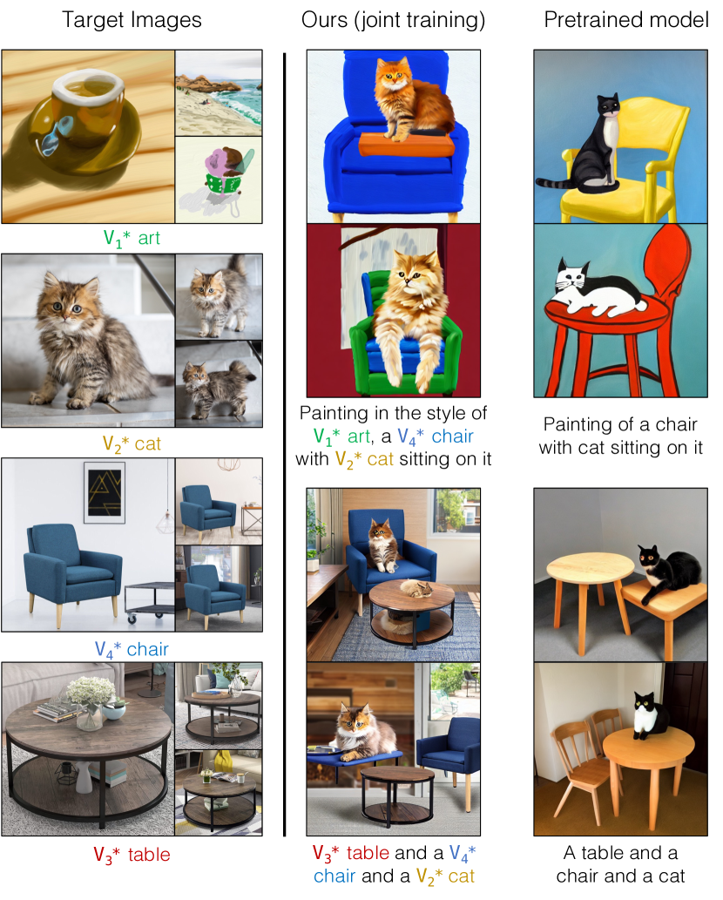

<figcaption>図16: 三概念 fine-tuning の結果。2 つの物体をスタイルと、または 3 つの新しい物体を同じシーンに、一部の概念の組み合わせで合成できる。</figcaption>
</figure>

## 付録C 実験

<figure>

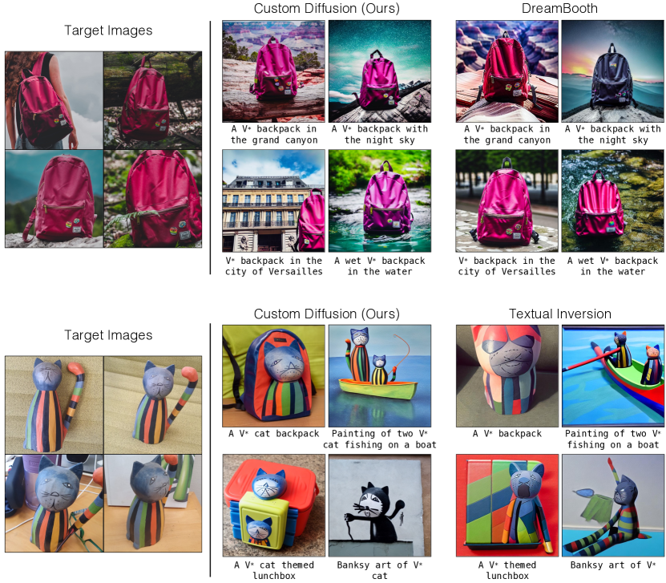

<figcaption>図17: DreamBooth・Textual Inversion のデータセットでの本手法の結果。本手法は同等か一部で良く機能する（例: 夜空の V* backpack、V cat backpack）。サンプルは 200 ステップの DDPM サンプラー・スケール 6 で生成。</figcaption>
</figure>

本節では、ablation や手法の限界の解析を含むさらなる実験を示す。

**DreamBooth・Textual Inversion との比較**　それぞれの研究の対象概念画像で本手法と比較する。図17 は同じ入力プロンプトのサンプル生成を示す。本手法は対象画像との視覚的類似を保ちつつ text-alignment でベースラインより良い。

**モデル圧縮**　モデルの全 cross-attention 層で、更新後の key・value 射影行列と対応する事前学習済み行列の差分の特異値を解析する。図14 に示すように、特異値は急激に下がる。これは差分行列が低ランク分解でよく近似できることを示唆する。そこで SVD を行い、差分行列の低ランク分解のみを保存する。これで各概念のメモリ保存をさらに削減できる。図15・21 は圧縮率を下げたときの定量・定性結果を示す。上位 60% の特異値のみを使った近似（モデル保存量 5× 圧縮）でも性能は類似する。しかし圧縮を上位 1% の特異値のみに増やすと image-alignment が下がる。fine-tuning 中に key・value 行列に低ランク更新を強制することも試みたが、結果は最適でないと観察した。

<figure>

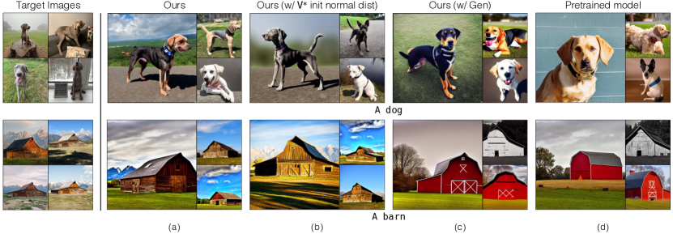

<figcaption>図18: V* の選択（Ours w/ random init V）と正則化としての生成画像（Ours w/ Gen）の定性解析。元のカテゴリ単語（例: V dog で fine-tune したモデルの「a dog」）の生成サンプルを示す。列(d) は比較用の事前学習済みモデルのサンプル。列(b) は、V を既存トークン埋め込みの正規分布からランダムに初期化して最適化すると、本手法の列(a) と比べて元のカテゴリ単語が対象画像に写るシフトが多くなることを示す。列(c) は生成画像を正則化に使うと元カテゴリのサンプル品質が悪化することを示す。</figcaption>
</figure>

**V* の選択**　全実験で、固有 modifier token を token-id 42170 で初期化した。2 概念の joint training では、もう一方を Stable Diffusion で使う事前学習済み CLIP tokenizer の token-id 47629 で初期化した。V* の選択を (1) 既存トークン埋め込みの平均・標準偏差でランダム初期化して最適化、(2) 稀少トークンで初期化後に最適化しない、で ablation する。定量結果は表5 に示す。V* を最適化しないと image-alignment が著しく下がると観察する。V* のランダム初期化と比べ、本手法は高い image-alignment と低い text-alignment を持つ。しかし図18 に示すように、「a {category}」プロンプトの生成サンプルが本手法と比べ V* category の対象画像分布によりシフトする。

**三概念 fine-tuning**　複数概念手法の限界をテストし、図16 に三概念の結果を示す。本手法は 2 つの新しい物体を新しいスタイルと合成したり、3 つの新しい物体を合成したりできる。

**複数概念 fine-tuning の限界**　図11 に示すように、本手法は個人の猫と犬を同じシーンに生成するような難しい合成で失敗する。事前学習済みモデルもそうした合成で苦戦すると観察し、本モデルがこれらの限界を継承すると仮説立てる。図19 で各トークンの潜在画像特徴上の attention map を解析する。「dog」と「cat」トークンの attention map は本手法・事前学習済みモデルの両方で大きく重なり、これが悪い合成につながりうる。

**正則化として生成画像を使う（Ours w/ Gen）**　§4.4（表3）で、生成画像を正則化に使うと対象概念で類似した性能だが検証集合で高い KID になることを示した。ここでは、正則化集合に使う画像を生成するカテゴリ単語での生成にもアーティファクトが生じることを示す。例えば V* dog で fine-tune したモデルは「a dog」プロンプトで彩度アーティファクトのある画像を生成する（図18）。DreamBooth（これも生成画像を正則化に使う）と比べ高い学習率を使うためである。低い学習率はこの問題を緩和しうるが、学習時間の増加を代償とする。

<figure>

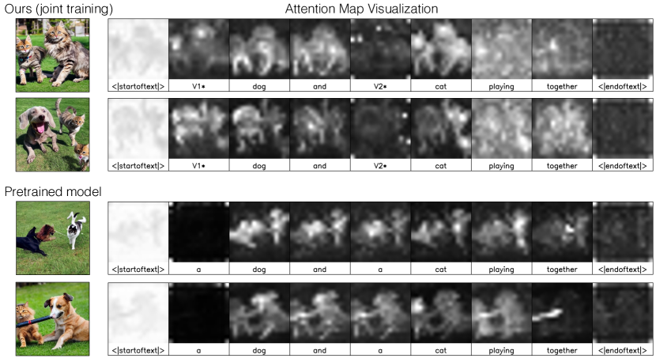

<figcaption>図19: 失敗した合成の attention map の可視化。各単語（トークン）の時刻・層にわたる平均 attention を示す。本手法・事前学習済みモデルの両方で「cat」と「dog」の attention map がより頻繁に重なる。これが失敗した合成の理由の 1 つでありうる。</figcaption>
</figure>

**表5**: modifier token V* の異なる選択の定量結果。(1) Ours（w/ V* init normal dist.）は既存トークン埋め込みの平均・標準偏差でランダム初期化して学習中に最適化、(2) Ours（w/o V* opt）は稀少トークンで初期化後に最適化しない。V* を最適化しないと image-alignment で悪い結果になる（対象概念を学習できない）。括弧内は学習画像数。

| 指標 | Method | Barn (7) | Tortoise plushy (12) | Teddy-Bear (7) | Wooden Pot (4) | Dog (10) | Cat (5) | Flower (10) | Table (4) | Chair (4) | Mean |
| --- | --- | --- | --- | --- | --- | --- | --- | --- | --- | --- | --- |
| Text-align | Ours | 0.791 | 0.827 | 0.849 | 0.796 | 0.764 | 0.768 | 0.800 | 0.788 | 0.771 | 0.795 |
| | w/ V* init normal | 0.817 | 0.809 | 0.853 | 0.807 | 0.781 | 0.805 | 0.820 | 0.793 | 0.766 | 0.805 |
| | w/o V* opt | 0.847 | 0.824 | 0.864 | 0.830 | 0.769 | 0.801 | 0.823 | 0.787 | 0.807 | 0.816 |
| Image-align | Ours | 0.744 | 0.783 | 0.829 | 0.769 | 0.684 | 0.848 | 0.734 | 0.768 | 0.814 | 0.774 |
| | w/ V* init normal | 0.747 | 0.780 | 0.829 | 0.787 | 0.670 | 0.785 | 0.709 | 0.772 | 0.811 | 0.765 |
| | w/o V* opt | 0.730 | 0.755 | 0.784 | 0.786 | 0.663 | 0.757 | 0.683 | 0.688 | 0.757 | 0.733 |
| KID (×10³) | Ours | 9.00 | 26.82 | 40.33 | 8.77 | 19.46 | 27.39 | 36.47 | 15.77 | 17.94 | 22.43 |
| | w/ V* init normal | 9.99 | 21.76 | 44.68 | 12.27 | 15.09 | 25.26 | 32.97 | 15.26 | 21.28 | 22.06 |
| | w/o V* opt | 10.22 | 23.75 | 41.64 | 11.97 | 18.19 | 26.41 | 28.83 | 16.56 | 19.20 | 21.86 |

**表6**: fine-tune 済みモデルでの MS-COCO FID 評価はテキスト画像モデルの標準指標。事前学習済み Stable Diffusion モデルは同設定（50 DDPM ステップ・スケール 6）で 16.35 FID。本手法は大半のデータセットで類似した FID を持ち、fine-tune したモデルが無関係な概念で事前学習済みモデルと類似することを示す。Textual Inversion はモデルを更新しないため事前学習済みと同じ FID。

| MS-COCO FID | Moongate | Barn | Tortoise plushy | Teddy-Bear | Wooden Pot | Dog | Cat | Flower | Table | Chair |
| --- | --- | --- | --- | --- | --- | --- | --- | --- | --- | --- |
| Ours | 16.05 | 17.21 | 16.27 | 16.71 | 16.70 | 16.26 | 16.95 | 16.71 | 16.25 | 16.99 |
| DreamBooth | 17.35 | 20.36 | 19.61 | 19.45 | 20.01 | 19.10 | 20.57 | 18.57 | 19.39 | 19.35 |

<figure>

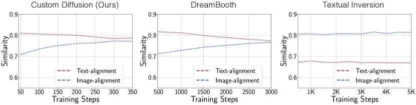

<figcaption>図20: 学習ステップに対する text-・image-alignment スコア（データセット平均）。fine-tune するにつれ text-alignment スコアは徐々に下がる。Textual Inversion では新トークン埋め込みが高い image-alignment をもたらすが text-alignment は学習を通じて著しく低いまま。DreamBooth と比べ、本手法は収束時に高い text-・image-alignment を持つ。</figcaption>
</figure>

**表7**: 単一概念 fine-tuning の定量評価。1・2 行目: CLIP 特徴空間の text-・image-alignment（両方とも高いほど良い）。全指標は各データセット 20 プロンプトの 1K 生成サンプルで計算。本手法はデータセット平均でベースラインより良い。下段: 実検証集合画像（500）と同じキャプションの生成画像（1K）の KID。本手法は実画像の正則化集合を使うため「Table」「Chair」を除きベースラインより低い KID を達成し事前学習済みモデルをわずかに上回りさえする。括弧内は学習画像数。

| 指標 | Method | Moongate(135) | Barn(7) | Tortoise plushy(12) | Teddy-Bear(7) | Wooden Pot(4) | Dog(10) | Cat(5) | Flower(10) | Table(4) | Chair(4) | Mean |
| --- | --- | --- | --- | --- | --- | --- | --- | --- | --- | --- | --- | --- |
| Text-align | Textual Inversion | 0.658 | 0.739 | 0.646 | 0.713 | 0.726 | 0.613 | 0.643 | 0.648 | 0.651 | 0.658 | 0.670 |
| | DreamBooth | 0.778 | 0.839 | 0.789 | 0.850 | 0.791 | 0.764 | 0.789 | 0.824 | 0.715 | 0.676 | 0.781 |
| | Ours (fine-tune all) | 0.762 | 0.782 | 0.822 | 0.854 | 0.820 | 0.752 | 0.792 | 0.803 | 0.763 | 0.767 | 0.795 |
| | Ours | 0.772 | 0.791 | 0.828 | 0.848 | 0.798 | 0.764 | 0.768 | 0.800 | 0.787 | 0.771 | 0.795 |
| Image-align | Textual Inversion | 0.740 | 0.753 | 0.755 | 0.885 | 0.802 | 0.760 | 0.909 | 0.815 | 0.891 | 0.872 | 0.827 |
| | DreamBooth | 0.608 | 0.679 | 0.847 | 0.822 | 0.788 | 0.674 | 0.786 | 0.688 | 0.846 | 0.863 | 0.776 |
| | Ours (fine-tune all) | 0.662 | 0.699 | 0.822 | 0.804 | 0.767 | 0.669 | 0.810 | 0.670 | 0.725 | 0.772 | 0.748 |
| | Ours | 0.665 | 0.744 | 0.784 | 0.829 | 0.769 | 0.684 | 0.849 | 0.735 | 0.767 | 0.814 | 0.775 |
| KID(×10³) | Pretrained / Textual Inversion | 11.33 | 11.18 | 33.51 | 39.82 | 12.88 | 25.40 | 35.01 | 30.96 | 13.35 | 9.26 | 22.27 |
| | DreamBooth | 20.80 | 12.98 | 36.45 | 42.93 | 15.80 | 44.14 | 67.41 | 37.55 | 21.07 | 26.16 | 32.53 |
| | Ours (fine-tune all) | 9.04 | 9.35 | 28.55 | 42.78 | 10.60 | 19.58 | 14.79 | 22.95 | 18.69 | 16.34 | 19.27 |
| | Ours | 7.65 | 9.00 | 26.82 | 40.33 | 8.77 | 19.46 | 27.39 | 36.47 | 15.77 | 17.94 | 20.96 |

## 付録D 評価

**学習反復に対する text-・image-alignment スコア**　通常、text-alignment と image-alignment の間にはトレードオフがある。高い image-alignment は text-alignment の低下につながり、サンプル生成は分散が少なく入力対象画像に近くなる。図20 に text-・image-alignment の傾向を示す。初期はモデルが高い text-alignment（事前学習済みモデルと同様）だが低い image-alignment を持ち、学習につれて text-/image-alignment の曲線が徐々に悪化／改善する。表7・8 は単一概念・複数概念 fine-tuning の個別 text-・image-alignment スコアを示す。text-alignment を測るため、CLIP テキスト特徴抽出時にテキストプロンプトから modifier token V* を除く。

**全モデルの MS-COCO FID 評価**　本手法と DreamBooth で MS-COCO FID を評価する。表6 に示すように、本手法は低い FID を持ち、事前学習済みモデルの 16.35 FID と比べ時折わずかに悪い程度。これは本手法が無関係な概念での生成画像分布を変えないことを示唆する。clean-fid ライブラリで FID を測る。

## 付録E 実装と実験の詳細

本手法とベースラインの追加の学習詳細を述べる。

**データセット**　論文の全データセットは手動で撮影するか、Moongate を除き Unsplash からダウンロードした。

**表8**: CLIP 特徴空間での複数概念 fine-tuning の 2 対象概念との text-alignment・image-alignment。各合成ペアを 8 プロンプトで生成した 400 枚（200 ステップ DDPM・スケール 6）で評価。本手法は Table+Chair（大半が同等）を除く全設定で平均指標が同時期手法より良い。

| 指標 | Method | Moongate+Dog | Cat+Chair | Wooden Pot+Cat | Wooden Pot+Flower | Table+Chair | Mean |
| --- | --- | --- | --- | --- | --- | --- | --- |
| Text-align | DreamBooth | 0.767 | 0.783 | 0.774 | 0.860 | 0.732 | 0.783 |
| | Textual Inversion | 0.538 | 0.445 | 0.542 | 0.552 | 0.644 | 0.544 |
| | Ours (fine-tune all) | 0.797 | 0.742 | 0.800 | 0.856 | 0.745 | 0.787 |
| | Ours (Sequential) | 0.785 | 0.736 | 0.863 | 0.862 | 0.740 | 0.797 |
| | Ours (Optimization) | 0.786 | 0.774 | 0.806 | 0.870 | 0.766 | 0.800 |
| | Ours (Joint) | 0.793 | 0.798 | 0.833 | 0.845 | 0.737 | 0.801 |
| Image-align (target1) | DreamBooth | 0.492 | 0.715 | 0.719 | 0.697 | 0.817 | 0.688 |
| | Textual Inversion | 0.675 | 0.571 | 0.539 | 0.531 | 0.822 | 0.627 |
| | Ours (fine-tune all) | 0.584 | 0.736 | 0.594 | 0.699 | 0.817 | 0.686 |
| | Ours (Sequential) | 0.534 | 0.696 | 0.636 | 0.671 | 0.833 | 0.674 |
| | Ours (Optimization) | 0.583 | 0.792 | 0.580 | 0.683 | 0.786 | 0.684 |
| | Ours (Joint) | 0.592 | 0.674 | 0.654 | 0.758 | 0.837 | 0.702 |
| Image-align (target2) | DreamBooth | 0.656 | 0.737 | 0.633 | 0.633 | 0.839 | 0.699 |
| | Textual Inversion | 0.473 | 0.614 | 0.673 | 0.580 | 0.831 | 0.634 |
| | Ours (fine-tune all) | 0.592 | 0.646 | 0.815 | 0.644 | 0.783 | 0.695 |
| | Ours (Sequential) | 0.641 | 0.762 | 0.748 | 0.660 | 0.819 | 0.725 |
| | Ours (Optimization) | 0.598 | 0.639 | 0.819 | 0.675 | 0.803 | 0.706 |
| | Ours (Joint) | 0.582 | 0.767 | 0.757 | 0.640 | 0.807 | 0.710 |

**Custom Diffusion（本手法）**　§3.2 で述べたように、バッチサイズ 8・学習率 $10^{-5}$（バッチサイズでスケールして実効学習率 $8\times 10^{-5}$）で学習する。単一概念で 250 ステップ、複数概念で 500 ステップ学習する。学習中、3 回に 1 回は対象画像を $1.2$–$1.4\times$ にランダムリサイズして「zoomed in」「close up」を付加。残りは $0.4$–$1.0\times$ にランダムリサイズし、比が 0.6 未満なら「far away」「very small」を付加して有効領域のみ損失を伝播する。fine-tuning は数反復のみのため、fine-tune 済みモデルに augmentation 漏れは見られない。fine-tuning 中に開始トークン埋め込みも detach する。modifier token V* の稀少トークン選択は、LAION-400M からサンプルした 200K キャプションで全 49408 トークンの出現を数え、約 5–10 回出現・アルファベット表記・他トークンの部分文字列でないトークンを選ぶ。学習中、正則化サンプル（200）と対象サンプルの比を保つよう対象画像をオーバーサンプルする。

**Ours（w/ fine-tune all）**　全パラメータを fine-tune するときは学習率を $8\times 10^{-6}$ に下げ（$8\times 10^{-5}$ より良い）、バッチサイズ 8 で 500 ステップ学習する。複数概念では 1000 反復。残りの設定は最終手法と同じ。

**Textual Inversion**　推奨バッチサイズ 8・学習率 0.005（バッチサイズでスケールして実効 0.04）で 5000 ステップ学習。新トークンはカテゴリ単語（例: 「dog」）で初期化。カテゴリ単語が複数トークンの場合（例: 「tortoise plushy」）、単一単語近似（「plush」、moongate なら「gate」、wooden pot なら「pot」、teddybear なら「bear」）を使う。

**DreamBooth**　サードパーティ実装を使う。テキスト transformer を凍結し U-Net 拡散モデルをバッチサイズ 8・学習率 $10^{-6}$ で fine-tune。対象画像のテキストプロンプトは「photo of [V] category」で、[V] は本手法と同じ稀少 token-id 42170 で初期化。正則化画像は「photo of a {category}」プロンプトで 50 ステップ DDPM サンプラーで生成。単一概念で 2500 ステップ学習。複数概念で 5000 ステップ学習するが 3000 反復のベストチェックポイントを選ぶ。

<figure>

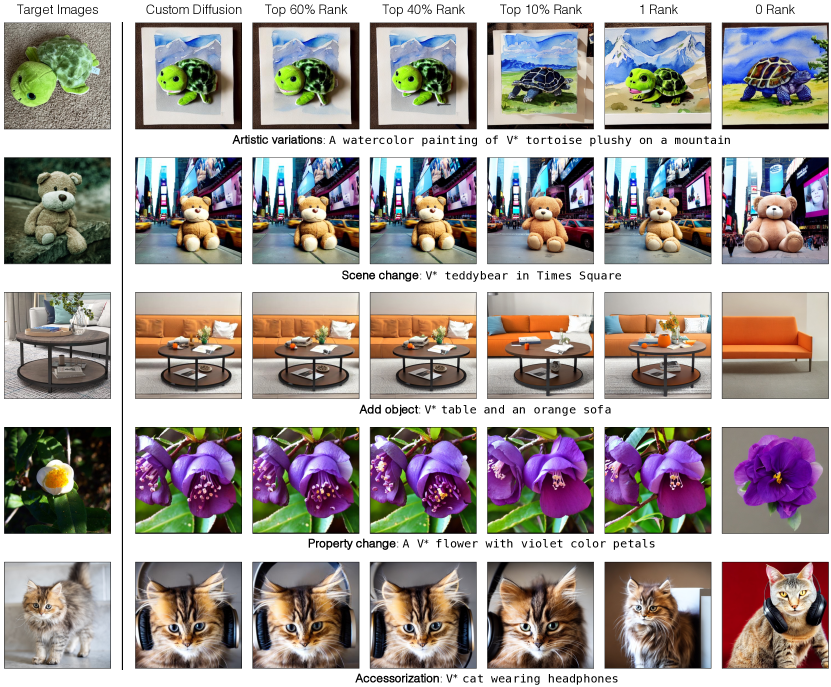

<figcaption>図21: 保存量削減のための fine-tune 済みモデル圧縮の定性結果。事前学習済みと fine-tune 済みモデルの更新重みの差分の低ランク近似を保存する。左から右へ保存量は 75MB・15MB・5MB・1MB・0.1MB・0.08MB（最適化した V* の保存）。上位 60% 特異値の 5× 圧縮でも性能は類似。圧縮を増やすと image-alignment スコアが下がり、特に tortoise plushy・teddybear・cat でサンプル生成が対象画像と似なくなる。</figcaption>
</figure>

<figure>

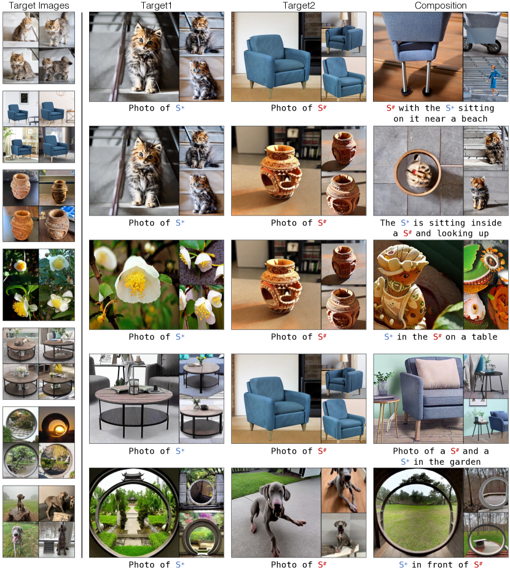

<figcaption>図22: Textual Inversion を使った複数概念合成。Textual Inversion は上記のサンプル生成に示すように 2 つの fine-tune 済み物体の合成で苦戦すると観察する。</figcaption>
</figure>

<figure>

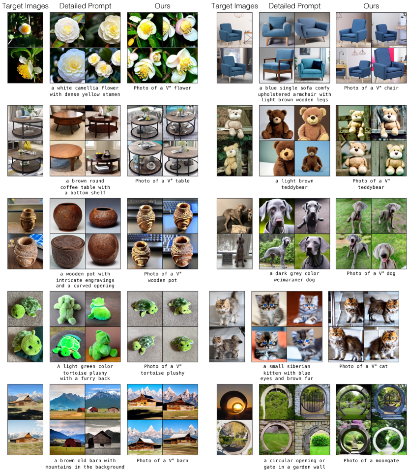

<figcaption>図23: 事前学習済みモデルでの長文テキストプロンプトによる対象画像の生成。長いテキスト記述でも事前学習済みモデルは正確な対象画像を生成するのに苦戦する。よって対象画像の生成にはモデルの fine-tuning が必要である。</figcaption>
</figure>

<figure>

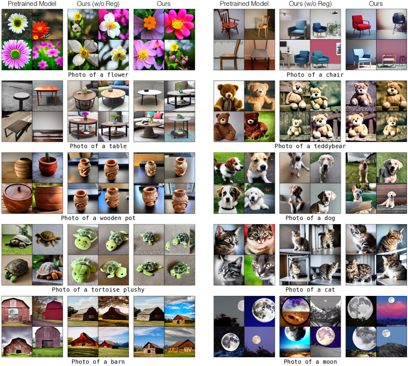

<figcaption>図24: 学習プロンプトテンプレートへの過学習。fine-tuning 中、対象画像はテキストプロンプト「photo of a V* {category}」で学習されるため、ここでは「photo of a {category}」プロンプトの本手法と ours（w/o reg）のランダムサンプル生成を示す。生成は対象画像にシフトし事前学習済みモデルより多様性が減る。本手法と ours（w/o reg）の間では、本手法の方がシフトが少なく平均してより多様。</figcaption>
</figure>

## 付録F 社会的影響

大規模拡散モデルの学習は大半の人にとってアクセス困難だが、事前学習済みモデルを fine-tune する本手法は、そうしたモデルを日常のユーザーに民主化する助けになりうる。ユーザーは自分の個人画像・芸術作品・興味のある物体に従ってこれらのモデルをカスタマイズできる。計算・メモリ効率が良いため、個人ユーザーによる大規模モデルのアクセス性と利用を高め、数百万の fine-tune 済み概念とその合成を共有する容易な協働を可能にするだろう。同時に、生成技術の危険も本手法に伴う。緩和の可能な方法は、GAN や最近では拡散モデルの文脈で研究されてきた、生成された偽データの信頼できる検出である。
