# Transformer によるスケーラブルな拡散モデル

> 原題: Scalable Diffusion Models with Transformers
> 著者: William Peebles（UC Berkeley）, Saining Xie
> 出典: ICCV 2023 ・ arXiv:2212.09748

## Abstract（要旨）

我々は transformer アーキテクチャに基づく新しいクラスの拡散モデルを探究する。我々は画像の潜在拡散モデル（latent diffusion model）を学習し、一般的に使われる U-Net バックボーンを、潜在パッチ（latent patches）上で動作する transformer に置き換える。我々は Diffusion Transformer（DiT）のスケーラビリティを、Gflops で測った forward pass の複雑さの観点から分析する。我々は、（transformer の深さ・幅を増やすか、入力トークン数を増やすことで）より高い Gflops を持つ DiT が一貫してより低い FID を持つことを見出す。良好なスケーラビリティ特性を持つことに加え、我々の最大の DiT-XL/2 モデルは、class-conditional な ImageNet 512×512 および 256×256 ベンチマークで全ての従来拡散モデルを上回り、後者で最先端の FID 2.27 を達成する。

<figure>

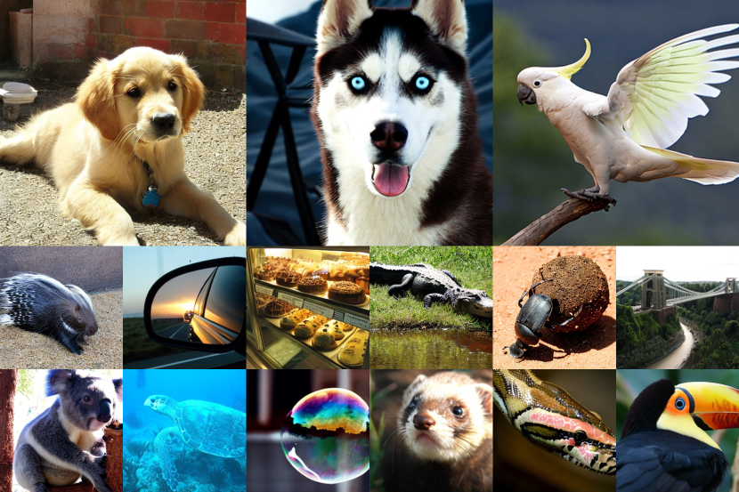

<figcaption>図1: transformer バックボーンを持つ拡散モデルが最先端の画像品質を達成する。ImageNet で 512×512 と 256×256 解像度でそれぞれ学習した 2 つの class-conditional DiT-XL/2 モデルから選んだサンプルを示す。</figcaption>
</figure>

## 1 はじめに

機械学習は transformer に駆動されたルネサンスを経験している。過去 5 年間で、自然言語処理・視覚・その他いくつかの領域のニューラルアーキテクチャは、おおむね transformer に取って代わられた。しかし、画像レベルの生成モデルの多くのクラスはこの潮流から取り残されたままである——transformer は自己回帰モデルで広く使われる一方、他の生成モデリングの枠組みではあまり採用されていない。例えば、拡散モデルは最近の画像レベル生成モデルの進歩の最前線にあるが、それらは皆バックボーンの事実上の選択として畳み込み U-Net アーキテクチャを採用している。

Ho らの画期的研究が、拡散モデルに U-Net バックボーンを初めて導入した。当初はピクセルレベルの自己回帰モデルや条件付き GAN で成功を収めた U-Net は、いくつかの変更を加えて PixelCNN++ から受け継がれた。このモデルは畳み込み的で、主に ResNet ブロックからなる。標準的な U-Net と対照的に、transformer の本質的構成要素である空間的自己注意（spatial self-attention）ブロックが低解像度で散りばめられている。Dhariwal と Nichol は、条件情報を注入する adaptive normalization 層の使用や畳み込み層のチャネル数といった、U-Net のいくつかのアーキテクチャ選択をアブレーションした。しかし、Ho らの U-Net の高レベルな設計は概ね保たれたままである。

本研究で我々は、拡散モデルにおけるアーキテクチャ選択の意義を解明し、将来の生成モデリング研究のための経験的ベースラインを提供することを目指す。我々は、U-Net の帰納バイアス（inductive bias）が拡散モデルの性能に*必須ではなく*、transformer のような標準的な設計で容易に置き換えられることを示す。その結果、拡散モデルは、他の領域からのベストプラクティスや学習レシピの継承、ならびにスケーラビリティ・頑健性・効率性といった好ましい特性の保持といった、最近のアーキテクチャ統一の潮流から恩恵を受ける好位置にある。標準化されたアーキテクチャは、領域横断的な研究の新しい可能性も開く。

本論文では、transformer に基づく新しいクラスの拡散モデルに焦点を当てる。我々はそれを Diffusion Transformer、略して DiT と呼ぶ。DiT は、伝統的な畳み込みネットワーク（例: ResNet）より視覚認識でより効果的にスケールすることが示されている Vision Transformer（ViT）のベストプラクティスに従う。

より具体的には、我々は *ネットワーク複雑さ* 対 *サンプル品質* に関する transformer のスケーリング挙動を研究する。我々は、拡散モデルが VAE の潜在空間内で学習される *Latent Diffusion Model（LDM）* の枠組みの下で DiT 設計空間を構築・ベンチマークすることで、U-Net バックボーンを transformer にうまく置き換えられることを示す。さらに、DiT が拡散モデルのスケーラブルなアーキテクチャであることを示す：ネットワーク複雑さ（Gflops で測定）対サンプル品質（FID で測定）の間に強い相関がある。DiT を単にスケールアップし、高容量バックボーン（118.6 Gflops）で LDM を学習することで、class-conditional な 256×256 ImageNet 生成ベンチマークで最先端の 2.27 FID を達成できる。

<figure>

<figcaption>図2: Diffusion Transformer（DiT）による ImageNet 生成。バブルの面積は拡散モデルの flops を示す。左: 400K 学習イテレーションでの DiT モデルの FID-50K（低いほど良い）。モデル flops が増えると FID が着実に改善する。右: 我々の最良モデル DiT-XL/2 は compute 効率が良く、ADM や LDM のような従来の U-Net ベース拡散モデルすべてを上回る。</figcaption>
</figure>

## 2 関連研究

#### Transformers.

Transformer は、言語・視覚・強化学習・メタ学習にわたって領域固有のアーキテクチャを置き換えてきた。それらは言語領域で、汎用の自己回帰モデルとして、また ViT として、モデルサイズ・学習計算量・データの増加の下で目覚ましいスケーリング特性を示してきた。言語を超えて、transformer はピクセルを自己回帰的に予測するよう学習されてきた。離散コードブック上でも、自己回帰モデルとしてもマスク生成モデルとしても学習されており、前者は 20B パラメータまで優れたスケーリング挙動を示している。最後に、transformer は DDPM 内で非空間的データの合成にも探究されてきた（例: DALL·E 2 で CLIP 画像埋め込みを生成）。本論文では、transformer を画像の拡散モデルのバックボーンとして使うときのスケーリング特性を研究する。

#### Denoising diffusion probabilistic models (DDPMs).

拡散とスコアベース生成モデルは、画像の生成モデルとして特に成功してきており、多くの場合、それまで最先端だった敵対的生成ネットワーク（GAN）を上回っている。過去 2 年間の DDPM の改善は、主に改良されたサンプリング技術——最も顕著には classifier-free guidance——、拡散モデルをピクセルではなくノイズを予測するよう再定式化すること、低解像度のベース拡散モデルをアップサンプラと並行して学習する cascaded DDPM パイプラインの使用、によって駆動されてきた。上記の全ての拡散モデルで、畳み込み U-Net がバックボーンアーキテクチャの事実上の選択である。同時期の研究は DDPM のための注意に基づく新しい効率的なアーキテクチャを導入したが、我々は純粋な transformer を探究する。

#### Architecture complexity.

画像生成の文献でアーキテクチャの複雑さを評価する際、パラメータ数を使うのがかなり一般的な慣行である。一般に、パラメータ数は画像モデルの複雑さの貧弱な代理になりうる。例えば性能に大きく影響する画像解像度を考慮しないからである。代わりに、本論文でのモデル複雑さ分析の多くは理論的 Gflops の観点による。これは Gflops が複雑さの測定に広く使われるアーキテクチャ設計の文献と歩調を合わせる。実際には、黄金の複雑さ指標はまだ議論の余地があり、特定の応用シナリオに依存することが多い。Nichol と Dhariwal の画期的研究が我々に最も関連する——そこで彼らは U-Net アーキテクチャクラスのスケーラビリティと Gflop 特性を分析した。本論文では transformer クラスに焦点を当てる。

## 3 Diffusion Transformers

### 3.1 準備

#### Diffusion formulation.

アーキテクチャを導入する前に、拡散モデル（DDPM）を理解するのに必要な基本概念を簡単に復習する。ガウス拡散モデルは、実データ $x_{0}$ に徐々にノイズを加える順方向のノイズ付加過程を仮定する：$q(x_{t}|x_{0})=\mathcal{N}(x_{t};\sqrt{\bar{\alpha}_{t}}x_{0},(1-\bar{\alpha}_{t})\mathbf{I})$。ここで定数 $\bar{\alpha}_{t}$ はハイパーパラメータである。再パラメータ化トリックを適用することで、$x_{t}=\sqrt{\bar{\alpha}_{t}}x_{0}+\sqrt{1-\bar{\alpha}_{t}}\epsilon_{t}$ をサンプリングできる（$\epsilon_{t}\sim\mathcal{N}(0,\mathbf{I})$）。

拡散モデルは、順過程の破損を反転する逆過程を学習するよう訓練される：$p_{\theta}(x_{t-1}|x_{t})=\mathcal{N}(\mu_{\theta}(x_{t}),\Sigma_{\theta}(x_{t}))$。ここでニューラルネットワークが $p_{\theta}$ の統計量を予測するのに使われる。逆過程モデルは $x_{0}$ の対数尤度の変分下界で訓練され、それは $\mathcal{L}(\theta)=-p(x_{0}|x_{1})+\sum_{t}\mathcal{D}_{KL}(q^{*}(x_{t-1}|x_{t},x_{0})||p_{\theta}(x_{t-1}|x_{t}))$ に帰着する（訓練に無関係な追加項は除く）。$q^{*}$ と $p_{\theta}$ はともにガウスなので、$\mathcal{D}_{KL}$ は 2 分布の平均と共分散で評価できる。$\mu_{\theta}$ をノイズ予測ネットワーク $\epsilon_{\theta}$ として再パラメータ化することで、モデルは予測ノイズ $\epsilon_{\theta}(x_{t})$ と真のサンプリングされたガウスノイズ $\epsilon_{t}$ の間の単純な平均二乗誤差で訓練できる：$\mathcal{L}_{simple}(\theta)=||\epsilon_{\theta}(x_{t})-\epsilon_{t}||_{2}^{2}$。しかし、学習された逆過程共分散 $\Sigma_{\theta}$ で拡散モデルを訓練するには、完全な $\mathcal{D}_{KL}$ 項を最適化する必要がある。我々は Nichol と Dhariwal のアプローチに従う：$\epsilon_{\theta}$ を $\mathcal{L}_{simple}$ で訓練し、$\Sigma_{\theta}$ を完全な $\mathcal{L}$ で訓練する。$p_{\theta}$ が訓練されたら、$x_{t_{\text{max}}}\sim\mathcal{N}(0,\mathbf{I})$ を初期化し、再パラメータ化トリックで $x_{t-1}\sim p_{\theta}(x_{t-1}|x_{t})$ をサンプリングすることで新しい画像を生成できる。

#### Classifier-free guidance.

条件付き拡散モデルは、クラスラベル $c$ のような追加情報を入力に取る。この場合、逆過程は $p_{\theta}(x_{t-1}|x_{t},c)$ となり、$\epsilon_{\theta}$ と $\Sigma_{\theta}$ が $c$ で条件づけられる。この設定で、classifier-free guidance を使って、$\log p(c|x)$ が高くなる $x$ を見つけるようサンプリング手続きを促せる。ベイズ則により $\log p(c|x)\propto\log p(x|c)-\log p(x)$ なので、$\nabla_{x}\log p(c|x)\propto\nabla_{x}\log p(x|c)-\nabla_{x}\log p(x)$ である。拡散モデルの出力をスコア関数と解釈することで、DDPM サンプリング手続きを高い $p(x|c)$ の $x$ をサンプリングするよう次のように誘導できる：$\hat{\epsilon}_{\theta}(x_{t},c)=\epsilon_{\theta}(x_{t},\emptyset)+s\cdot\nabla_{x}\log p(x|c)\propto\epsilon_{\theta}(x_{t},\emptyset)+s\cdot(\epsilon_{\theta}(x_{t},c)-\epsilon_{\theta}(x_{t},\emptyset))$。ここで $s>1$ はガイダンスのスケールを示す（$s=1$ は標準サンプリングを回復することに注意）。$c=\emptyset$ で拡散モデルを評価することは、訓練中に $c$ をランダムにドロップアウトして学習された「null」埋め込み $\emptyset$ に置き換えることで行う。Classifier-free guidance は汎用サンプリング技術より著しく改善されたサンプルを生むことが広く知られており、この傾向は我々の DiT モデルでも成り立つ。

#### Latent diffusion models.

高解像度ピクセル空間で拡散モデルを直接訓練するのは計算的に法外でありうる。Latent diffusion model（LDM）はこの問題を 2 段階アプローチで扱う：(1) 学習されたエンコーダ $E$ で画像をより小さい空間表現に圧縮するオートエンコーダを学習し、(2) 画像 $x$ の拡散モデルの代わりに表現 $z=E(x)$ の拡散モデルを訓練する（$E$ は凍結）。新しい画像は、拡散モデルから表現 $z$ をサンプリングし、続いて学習されたデコーダで画像に復号 $x=D(z)$ することで生成できる。

図2 に示すように、LDM は ADM のようなピクセル空間拡散モデルの Gflops のごく一部を使いながら良好な性能を達成する。我々は compute 効率に関心があるので、これはアーキテクチャ探索の魅力的な出発点になる。本論文では DiT を潜在空間に適用するが、修正なしにピクセル空間にも適用できる。これは我々の画像生成パイプラインをハイブリッドベースのアプローチにする；既製の畳み込み VAE と transformer ベースの DDPM を使う。

### 3.2 Diffusion Transformer の設計空間

我々は拡散モデルの新しいアーキテクチャ Diffusion Transformer（DiT）を導入する。我々はそのスケーリング特性を保つため、標準的な transformer アーキテクチャにできるだけ忠実であることを目指す。我々の焦点は画像（具体的には画像の空間表現）の DDPM を訓練することなので、DiT はパッチの列上で動作する Vision Transformer（ViT）アーキテクチャに基づく。DiT は ViT のベストプラクティスの多くを保つ。図3 が完全な DiT アーキテクチャの概観を示す。本節では、DiT の forward pass と DiT クラスの設計空間の構成要素を述べる。

<figure>

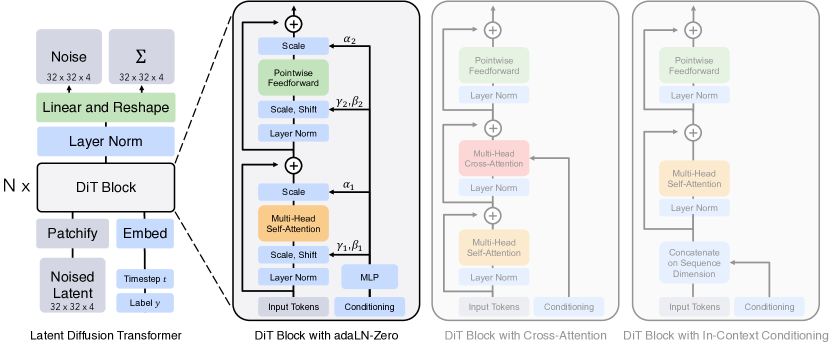

<figcaption>図3: Diffusion Transformer（DiT）アーキテクチャ。左: 我々は条件付き潜在 DiT モデルを学習する。入力潜在はパッチに分解され、いくつかの DiT ブロックで処理される。右: DiT ブロックの詳細。adaptive layer norm・cross-attention・追加入力トークンを介して条件を取り込む標準 transformer ブロックの変種を実験する。adaptive layer norm が最良に機能する。</figcaption>
</figure>

<figure>

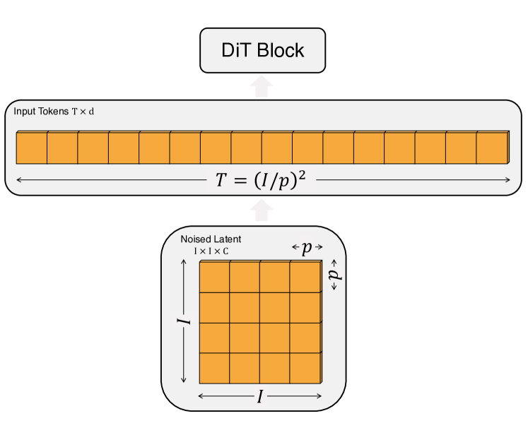

<figcaption>図4: DiT の入力仕様。パッチサイズ p×p が与えられると、I×I×C の形の空間表現（VAE からのノイズ化潜在）が、長さ T=(I/p)² で隠れ次元 d のトークン列に「patchify」される。パッチサイズが小さいほど列が長くなり、Gflops が増える。</figcaption>
</figure>

#### Patchify.

DiT への入力は空間表現 $z$ である（256×256×3 画像では $z$ は 32×32×4 の形）。DiT の最初の層は「patchify」で、入力の各パッチを線形に埋め込むことで、空間入力を各次元 $d$ の $T$ 個のトークン列に変換する。patchify に続いて、全入力トークンに標準的な ViT の周波数ベースの位置埋め込み（sine-cosine 版）を適用する。patchify が作るトークン数 $T$ は、パッチサイズのハイパーパラメータ $p$ で決まる。図4 に示すように、$p$ を半分にすると $T$ が 4 倍になり、したがって transformer の総 Gflops が少なくとも 4 倍になる。Gflops に大きな影響があるものの、$p$ を変えても下流のパラメータ数には意味のある影響がない点に注意。

*我々は $p=2,4,8$ を DiT 設計空間に加える。*

#### DiT block 設計.

patchify に続き、入力トークンは transformer ブロックの列で処理される。ノイズ化画像入力に加え、拡散モデルはノイズの時刻 $t$・クラスラベル $c$・自然言語などの追加条件情報を処理することがある。我々は条件入力を異なる方法で処理する 4 つの transformer ブロックの変種を探究する。これらの設計は標準 ViT ブロック設計に小さいが重要な修正を導入する。全ブロックの設計は図3 に示される。

<figure>

<figcaption>図5: 異なる条件付け戦略の比較。adaLN-Zero は学習の全段階で cross-attention と in-context 条件付けを上回る。</figcaption>
</figure>

- **In-context conditioning.** 我々は単に $t$ と $c$ のベクトル埋め込みを入力列の 2 つの追加トークンとして付加し、それらを画像トークンと区別なく扱う。これは ViT の cls トークンに似ており、標準 ViT ブロックを修正なしに使える。最終ブロックの後、条件トークンを列から取り除く。このアプローチはモデルに無視できる新しい Gflops しか導入しない。
- **Cross-attention block.** 我々は $t$ と $c$ の埋め込みを長さ 2 の列に連結し、画像トークン列とは別にする。transformer ブロックは、Vaswani らの元の設計、また LDM がクラスラベルの条件付けに使ったものと同様に、multi-head self-attention ブロックに続く追加の multi-head cross-attention 層を含むよう修正される。Cross-attention はモデルに最も多くの Gflops を加え、おおよそ 15% のオーバーヘッドになる。
- **Adaptive layer norm (adaLN) block.** GAN や U-Net バックボーンの拡散モデルでの adaptive normalization 層の広範な使用に従い、我々は transformer ブロックの標準 layer norm 層を adaptive layer norm（adaLN）で置き換えることを探究する。次元ごとのスケール・シフトパラメータ $\gamma$ と $\beta$ を直接学習する代わりに、$t$ と $c$ の埋め込みベクトルの和からそれらを回帰する。探究した 3 つのブロック設計のうち、adaLN は最も少ない Gflops を加え、したがって最も compute 効率が良い。また、全トークンに*同じ関数*を適用するよう制限される唯一の条件付け機構でもある。
- **adaLN-Zero block.** ResNet の先行研究は、各残差ブロックを恒等関数として初期化することが有益であると見出した。例えば Goyal らは、各ブロックの最終 batch norm スケール係数 $\gamma$ をゼロ初期化することが教師あり学習設定で大規模学習を加速すると見出した。拡散 U-Net モデルも同様の初期化戦略を使い、残差接続の前に各ブロックの最終畳み込み層をゼロ初期化する。我々は同じことをする adaLN DiT ブロックの修正を探究する。$\gamma$ と $\beta$ の回帰に加え、DiT ブロック内の残差接続の直前に適用される次元ごとのスケーリングパラメータ $\alpha$ も回帰する。全ての $\alpha$ についてゼロベクトルを出力するよう MLP を初期化する；これは完全な DiT ブロックを恒等関数として初期化する。通常の adaLN ブロックと同様、adaLN-Zero はモデルに無視できる Gflops しか加えない。

*我々は in-context、cross-attention、adaptive layer norm、adaLN-Zero ブロックを DiT 設計空間に含める。*

**表1**: DiT モデルの詳細。Small（S）・Base（B）・Large（L）の変種は ViT のモデル構成に従う；最大モデルとして XLarge（XL）構成も導入する。

| Model | Layers $N$ | Hidden size $d$ | Heads | Gflops ($I$=32, $p$=4) |
| --- | --- | --- | --- | --- |
| DiT-S | 12 | 384 | 6 | 1.4 |
| DiT-B | 12 | 768 | 12 | 5.6 |
| DiT-L | 24 | 1024 | 16 | 19.7 |
| DiT-XL | 28 | 1152 | 16 | 29.1 |

#### Model size.

我々は隠れ次元サイズ $d$ で動作する $N$ 個の DiT ブロックの列を適用する。ViT に従い、$N$・$d$・注意ヘッド数を共同でスケールする標準的な transformer 構成を使う。具体的には、4 つの構成 DiT-S・DiT-B・DiT-L・DiT-XL を使う。これらは 0.3 から 118.6 Gflops まで幅広いモデルサイズと flop 配分をカバーし、スケーリング性能を測ることを可能にする。表1 が構成の詳細を与える。

我々は B・S・L・XL 構成を DiT 設計空間に加える。

<figure>

<figcaption>図6: DiT モデルのスケーリングは学習の全段階で FID を改善する。12 個の DiT モデルの学習イテレーションにわたる FID-50K を示す。上段: パッチサイズを一定に保って FID を比較。下段: モデルサイズを一定に保って FID を比較。transformer バックボーンのスケーリングは、全モデルサイズ・全パッチサイズでより良い生成モデルを生む。</figcaption>
</figure>

#### Transformer decoder.

最終 DiT ブロックの後、画像トークンの列を出力ノイズ予測と出力対角共分散予測に復号する必要がある。これらの出力はどちらも元の空間入力に等しい形を持つ。我々はこれを標準的な線形デコーダで行う；最終 layer norm（adaLN を使う場合は adaptive）を適用し、各トークンを $p\times p\times 2C$ のテンソルに線形復号する（$C$ は DiT への空間入力のチャネル数）。最後に、復号されたトークンを元の空間レイアウトに再配置して、予測ノイズと共分散を得る。

我々が探究する完全な DiT 設計空間は、パッチサイズ・transformer ブロックアーキテクチャ・モデルサイズである。

## 4 実験設定

我々は DiT 設計空間を探究し、モデルクラスのスケーリング特性を研究する。我々のモデルは構成と潜在パッチサイズ $p$ に従って命名される；例えば DiT-XL/2 は XLarge 構成と $p=2$ を指す。

#### Training.

我々は ImageNet データセット上で 256×256 と 512×512 画像解像度の class-conditional 潜在 DiT モデルを学習する。最終線形層をゼロ初期化し、それ以外は ViT の標準的な重み初期化技術を使う。全モデルを AdamW で学習する。一定の学習率 $1\times 10^{-4}$、weight decay なし、バッチサイズ 256 を使う。使うデータ増強は水平反転のみ。ViT を用いた多くの先行研究と異なり、DiT を高性能に訓練するのに学習率の warmup も正則化も必要ないと分かった。これらの技術なしでも学習は全モデル構成で非常に安定で、transformer の学習でよく見られる損失のスパイクは観察されなかった。生成モデリングの文献の慣行に従い、学習を通じて減衰率 0.9999 で DiT の重みの指数移動平均（EMA）を維持する。報告する全結果は EMA モデルを使う。全 DiT モデルサイズ・パッチサイズで同一の学習ハイパーパラメータを使う。学習ハイパーパラメータはほぼ完全に ADM から保持する。*我々は学習率・減衰/warm-up スケジュール・Adam $\beta_{1}$/$\beta_{2}$・weight decay を調整しなかった。*

#### Diffusion.

我々は Stable Diffusion の既製の事前学習済み variational autoencoder（VAE）モデルを使う。VAE エンコーダはダウンサンプル係数 8 を持つ——形 256×256×3 の RGB 画像 $x$ が与えられると、$z=E(x)$ は形 32×32×4 を持つ。本節の全実験で、拡散モデルはこの $\mathcal{Z}$ 空間で動作する。拡散モデルから新しい潜在をサンプリングした後、VAE デコーダで $x=D(z)$ とピクセルに復号する。拡散ハイパーパラメータは ADM から保持する；具体的には、$1\times 10^{-4}$ から $2\times 10^{-2}$ に及ぶ $t_{\text{max}}=1000$ の線形分散スケジュール、ADM の共分散 $\Sigma_{\theta}$ のパラメータ化、入力時刻とラベルの埋め込み手法を使う。

#### Evaluation metrics.

我々はスケーリング性能を、画像生成モデル評価の標準指標である Fréchet Inception Distance（FID）で測る。

先行研究と比較する際は慣例に従い、250 DDPM サンプリングステップを使う FID-50K を報告する。FID は小さな実装の詳細に敏感であることが知られている；正確な比較を保証するため、本論文で報告する全値はサンプルをエクスポートし ADM の TensorFlow 評価スイートを使って得る。本節で報告する FID 数値は、特記する場合を除き classifier-free guidance を使わない。我々は二次指標として Inception Score・sFID・Precision/Recall も報告する。

#### Compute.

我々は全モデルを JAX で実装し TPU-v3 ポッドで学習する。最も計算集約的なモデル DiT-XL/2 は、グローバルバッチサイズ 256 で TPU v3-256 ポッド上でおよそ 5.7 イテレーション/秒で学習する。

## 5 実験

#### DiT block 設計.

我々は最も高 Gflop の DiT-XL/2 モデルを 4 つ学習し、それぞれ異なるブロック設計——in-context（119.4 Gflops）・cross-attention（137.6 Gflops）・adaptive layer norm（adaLN、118.6 Gflops）・adaLN-zero（118.6 Gflops）——を使う。学習の過程で FID を測る。図5 が結果を示す。adaLN-Zero ブロックは cross-attention と in-context 条件付けの両方より低い FID を、最も compute 効率が良い形で生む。400K 学習イテレーションで、adaLN-Zero モデルが達成する FID は in-context モデルのほぼ半分であり、条件付け機構がモデル品質に決定的に影響することを示す。初期化も重要である——各 DiT ブロックを恒等関数として初期化する adaLN-Zero は通常の adaLN を著しく上回る。本論文の残りでは、全モデルが adaLN-Zero DiT ブロックを使う。

<figure>

<figcaption>図7: transformer の forward pass Gflops を増やすとサンプル品質が上がる。ズームインを推奨。同じ入力潜在ノイズとクラスラベルを使い、400K 学習ステップ後の 12 個の DiT モデルすべてからサンプリング。モデルの Gflops を増やす（transformer の深さ・幅を増やすか、入力トークン数を増やす）と、視覚的忠実度が大きく改善する。</figcaption>
</figure>

#### Scaling model size and patch size.

我々はモデル構成（S・B・L・XL）とパッチサイズ（8・4・2）を掃引して 12 個の DiT モデルを学習する。DiT-L と DiT-XL は相対 Gflops の点で他の構成より互いにかなり近い点に注意。図2（左）が各モデルの Gflops と 400K 学習イテレーションでの FID の概観を与える。全ての場合で、モデルサイズを増やしパッチサイズを減らすと拡散モデルが大幅に改善することを見出す。

<figure>

<figcaption>図8: transformer の Gflops は FID と強く相関する。各 DiT モデルの Gflops と、400K 学習ステップ後の各モデルの FID-50K をプロット。</figcaption>
</figure>

図6（上）は、パッチサイズを一定に保ってモデルサイズを増やすと FID がどう変化するかを示す。4 つの構成すべてで、transformer を深く広くすることで学習の全段階で FID が大きく改善する。同様に、図6（下）はモデルサイズを一定に保ってパッチサイズを減らすときの FID を示す。パラメータをおおよそ固定したまま、DiT が処理するトークン数を単にスケールすることで、学習を通じて再びかなりの FID 改善を観察する。

#### DiT Gflops are critical to improving performance.

図6 の結果は、パラメータ数が DiT モデルの品質を一意に決定しないことを示唆する。モデルサイズを一定に保ちパッチサイズを減らすと、transformer の総パラメータは実質的に不変（実際にはわずかに減少）で、Gflops だけが増える。これらの結果は、モデル Gflops のスケーリングが実は性能改善の鍵であることを示す。これをさらに調べるため、図8 で 400K 学習ステップでの FID-50K をモデル Gflops に対してプロットする。結果は、総 Gflops が似ているとき異なる DiT 構成が似た FID 値を得る（例: DiT-S/2 と DiT-B/4）ことを示す。モデル Gflops と FID-50K の間に強い負の相関を見出し、追加のモデル計算が DiT モデル改善の決定的な要素であることを示唆する。図12（付録）で、この傾向が Inception Score のような他の指標でも成り立つことを見出す。

より大きな DiT モデルはより compute 効率が良い。図9 で、全 DiT モデルの FID を総学習計算の関数としてプロットする。学習計算をモデル Gflops $\cdot$ バッチサイズ $\cdot$ 学習ステップ $\cdot$ 3 と推定する（係数 3 は逆伝播を順伝播の約 2 倍計算量が重いと近似する）。小さい DiT モデルは、より長く学習しても、より少ないステップで学習したより大きい DiT モデルに対して最終的に compute 非効率になることを見出す。同様に、パッチサイズ以外は同一のモデルが、学習 Gflops を制御しても異なる性能プロファイルを持つことを見出す。例えば XL/4 はおよそ $10^{10}$ Gflops 後に XL/2 に上回られる。

#### Visualizing scaling.

我々は図7 でスケーリングがサンプル品質に与える効果を可視化する。400K 学習ステップで、同一の開始ノイズ $x_{t_{\text{max}}}$・サンプリングノイズ・クラスラベルを使って 12 個の DiT モデルそれぞれから画像をサンプリングする。これによりスケーリングが DiT のサンプル品質にどう影響するかを視覚的に解釈できる。実際、モデルサイズとトークン数の両方をスケールすると、視覚品質の顕著な改善が得られる。

<figure>

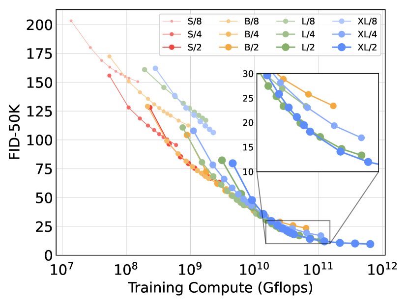

<figcaption>図9: より大きな DiT モデルは大きな計算をより効率的に使う。FID を総学習計算の関数としてプロット。</figcaption>
</figure>

### 5.1 最先端の拡散モデル

#### 256×256 ImageNet.

スケーリング分析に従い、最も高 Gflop のモデル DiT-XL/2 を 7M ステップ学習し続ける。図1 にモデルからのサンプルを示し、最先端の class-conditional 生成モデルと比較する。表3 に結果を報告する。classifier-free guidance を使うと、DiT-XL/2 は全ての従来拡散モデルを上回り、LDM が達成した従来最良の FID-50K 3.60 を 2.27 に下げる。図2（右）は、DiT-XL/2（118.6 Gflops）が LDM-4（103.6 Gflops）のような潜在空間 U-Net モデルに対して compute 効率が良く、ADM（1120 Gflops）や ADM-U（742 Gflops）のようなピクセル空間 U-Net モデルより大幅に効率的であることを示す。我々の手法は、従来最先端の StyleGAN-XL を含む全ての従来生成モデルの中で最低の FID を達成する。最後に、DiT-XL/2 が LDM-4・LDM-8 と比べ、テストした全 classifier-free guidance スケールでより高い recall 値を達成することも観察する。（ADM と同程度の）わずか 2.35M ステップだけ学習しても、XL/2 は FID 2.55 で全ての従来拡散モデルを上回る。

**表2**: ImageNet 256×256 での class-conditional 画像生成のベンチマーク。DiT-XL/2 が最先端の FID を達成する。

| Model | FID↓ | sFID↓ | IS↑ | Precision↑ | Recall↑ |
| --- | --- | --- | --- | --- | --- |
| BigGAN-deep | 6.95 | 7.36 | 171.4 | 0.87 | 0.28 |
| StyleGAN-XL | 2.30 | 4.02 | 265.12 | 0.78 | 0.53 |
| ADM | 10.94 | 6.02 | 100.98 | 0.69 | 0.63 |
| ADM-U | 7.49 | 5.13 | 127.49 | 0.72 | 0.63 |
| ADM-G | 4.59 | 5.25 | 186.70 | 0.82 | 0.52 |
| ADM-G, ADM-U | 3.94 | 6.14 | 215.84 | 0.83 | 0.53 |
| CDM | 4.88 | - | 158.71 | - | - |
| LDM-8 | 15.51 | - | 79.03 | 0.65 | 0.63 |
| LDM-8-G | 7.76 | - | 209.52 | 0.84 | 0.35 |
| LDM-4 | 10.56 | - | 103.49 | 0.71 | 0.62 |
| LDM-4-G (cfg=1.25) | 3.95 | - | 178.22 | 0.81 | 0.55 |
| LDM-4-G (cfg=1.50) | 3.60 | - | 247.67 | 0.87 | 0.48 |
| DiT-XL/2 | 9.62 | 6.85 | 121.50 | 0.67 | 0.67 |
| DiT-XL/2-G (cfg=1.25) | 3.22 | 5.28 | 201.77 | 0.76 | 0.62 |
| DiT-XL/2-G (cfg=1.50) | 2.27 | 4.60 | 278.24 | 0.83 | 0.57 |

**表3**: ImageNet 512×512 での class-conditional 画像生成のベンチマーク。先行研究は 512×512 解像度で Precision と Recall を 1000 個の実サンプルで測ることに注意；一貫性のため我々も同じにする。

| Model | FID↓ | sFID↓ | IS↑ | Precision↑ | Recall↑ |
| --- | --- | --- | --- | --- | --- |
| BigGAN-deep | 8.43 | 8.13 | 177.90 | 0.88 | 0.29 |
| StyleGAN-XL | 2.41 | 4.06 | 267.75 | 0.77 | 0.52 |
| ADM | 23.24 | 10.19 | 58.06 | 0.73 | 0.60 |
| ADM-U | 9.96 | 5.62 | 121.78 | 0.75 | 0.64 |
| ADM-G | 7.72 | 6.57 | 172.71 | 0.87 | 0.42 |
| ADM-G, ADM-U | 3.85 | 5.86 | 221.72 | 0.84 | 0.53 |
| DiT-XL/2 | 12.03 | 7.12 | 105.25 | 0.75 | 0.64 |
| DiT-XL/2-G (cfg=1.25) | 4.64 | 5.77 | 174.77 | 0.81 | 0.57 |
| DiT-XL/2-G (cfg=1.50) | 3.04 | 5.02 | 240.82 | 0.84 | 0.54 |

<figure>

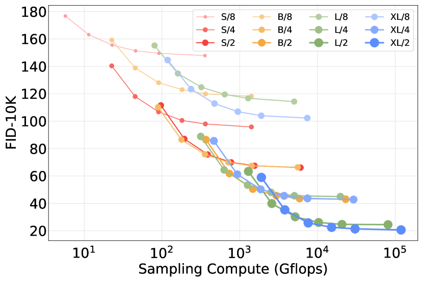

<figcaption>図10: サンプリング計算のスケールアップはモデル計算の不足を補わない。400K イテレーション学習した各 DiT モデルについて、[16, 32, 64, 128, 256, 1000] サンプリングステップで FID-10K を計算。各ステップ数について、FID と各画像のサンプリングに使う Gflops をプロット。小さいモデルは、大きいモデルより多くのテスト時 Gflops でサンプリングしても、大きいモデルとの性能差を縮められない。</figcaption>
</figure>

#### 512×512 ImageNet.

我々は ImageNet 上で 512×512 解像度の新しい DiT-XL/2 モデルを、256×256 モデルと同一のハイパーパラメータで 3M イテレーション学習する。パッチサイズ 2 で、この XL/2 モデルは 64×64×4 入力潜在を patchify した後、計 1024 トークンを処理する（524.6 Gflops）。表3 が最先端手法との比較を示す。XL/2 はこの解像度でも全ての従来拡散モデルを上回り、ADM が達成した従来最良の FID 3.85 を 3.04 に改善する。トークン数が増えても XL/2 は compute 効率が良いままである。例えば ADM は 1983 Gflops、ADM-U は 2813 Gflops を使うが、XL/2 は 524.6 Gflops を使う。高解像度 XL/2 モデルからのサンプルを図1 と付録に示す。

### 5.2 モデル計算 対 サンプリング計算のスケーリング

拡散モデルは、画像生成時にサンプリングステップ数を増やすことで学習後に追加の計算を使える点で独特である。モデル Gflops がサンプル品質に与える影響を踏まえ、本節では小さいモデル計算の DiT が、より多くのサンプリング計算を使うことで大きいものを上回れるかを研究する。400K 学習ステップ後の 12 個の DiT モデルすべてについて、画像ごとに [16, 32, 64, 128, 256, 1000] サンプリングステップを使って FID を計算する。主な結果は図10 にある。1000 サンプリングステップを使う DiT-L/2 対 128 ステップを使う DiT-XL/2 を考える。この場合、L/2 は各画像のサンプリングに $80.7$ Tflops を使う；XL/2 は $5\times$ 少ない計算——$15.2$ Tflops——を各画像のサンプリングに使う。それにもかかわらず XL/2 がより良い FID-10K（23.7 対 25.9）を持つ。一般に、サンプリング計算のスケールアップはモデル計算の不足を補えない。

## 6 結論

我々は、従来の U-Net モデルを上回り transformer モデルクラスの優れたスケーリング特性を継承する、拡散モデルのための単純な transformer ベースのバックボーン Diffusion Transformer（DiT）を導入する。本論文の有望なスケーリング結果を踏まえ、将来の研究は DiT をより大きいモデルとトークン数にスケールし続けるべきである。DiT は DALL·E 2 や Stable Diffusion のような text-to-image モデルの drop-in バックボーンとしても探究されうる。

## Appendix A 追加の実装詳細

我々は表4 で、256×256 と 512×512 の両モデルを含む全 DiT モデルの詳細情報を含める。図13 で DiT の学習損失曲線を報告する。最後に、表6 で ADM と LDM の DDPM U-Net モデルの Gflop 数も含める。

#### DiT model details.

入力時刻を埋め込むため、256 次元の周波数埋め込みに続いて、transformer の隠れサイズに等しい次元と SiLU 活性化を持つ 2 層 MLP を使う。各 adaLN 層は、時刻とクラスの埋め込みの和を SiLU 非線形と、transformer の隠れサイズの $4\times$（adaLN）または $6\times$（adaLN-Zero）に等しい出力ニューロンを持つ線形層に送る。コア transformer では GELU 非線形（tanh で近似）を使う。

#### Classifier-free guidance on a subset of channels.

classifier-free guidance を使う実験で、我々は全 4 チャネルではなく潜在の最初の 3 チャネルだけにガイダンスを適用した。調べたところ、スケール係数を単に調整すれば、3 チャネルガイダンスと 4 チャネルガイダンスは（FID の点で）似た結果を与えると分かった。具体的には、スケール $(1+x)$ の 3 チャネルガイダンスは、スケール $(1+\frac{3}{4}x)$ の 4 チャネルガイダンスで合理的によく近似されるように見える（例: スケール 1.5 の 3 チャネルガイダンスは FID-50K 2.27 を、スケール 1.375 の 4 チャネルガイダンスは FID-50K 2.20 を与える）。要素の部分集合にガイダンスを適用しても良い性能が得られるのはやや興味深く、この現象のさらなる探究は将来の課題とする。

<figure>

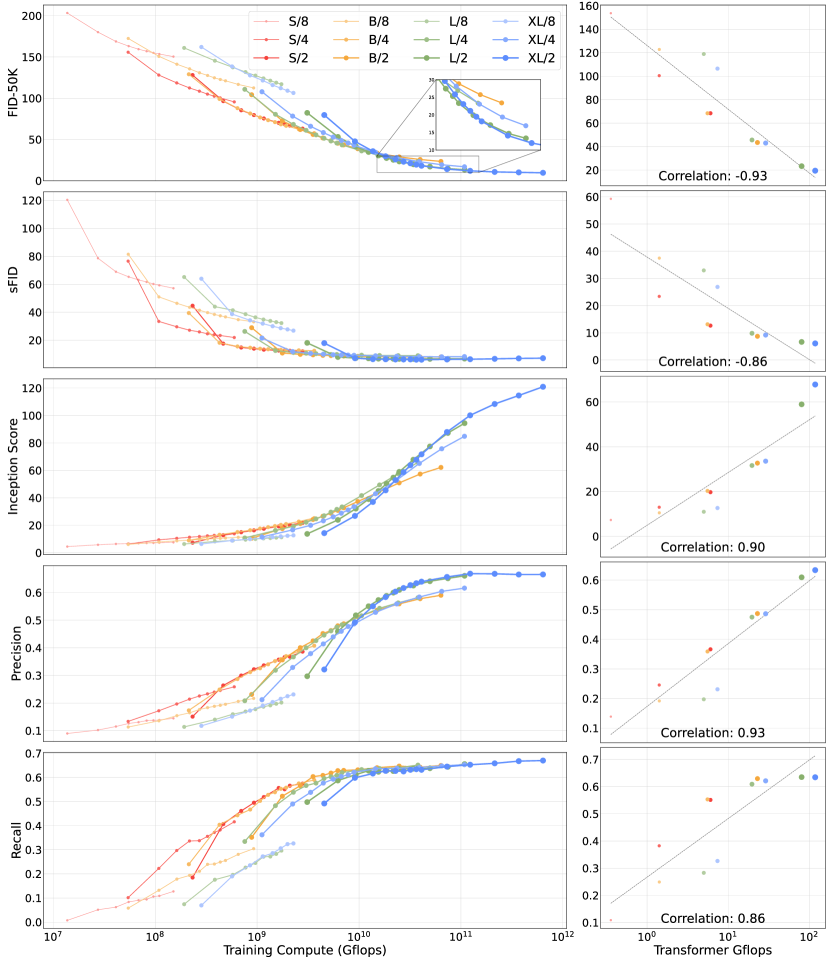

<figcaption>図12: いくつかの生成モデリング指標での DiT のスケーリング挙動。左: FID・sFID・Inception Score・Precision・Recall について、モデル性能を総学習計算の関数としてプロット。右: 12 個の DiT 変種すべての 400K 学習ステップでの性能を transformer Gflops に対してプロットし、指標横断で強い相関を見出す。全値は ft-MSE VAE デコーダで計算。</figcaption>
</figure>

<figure>

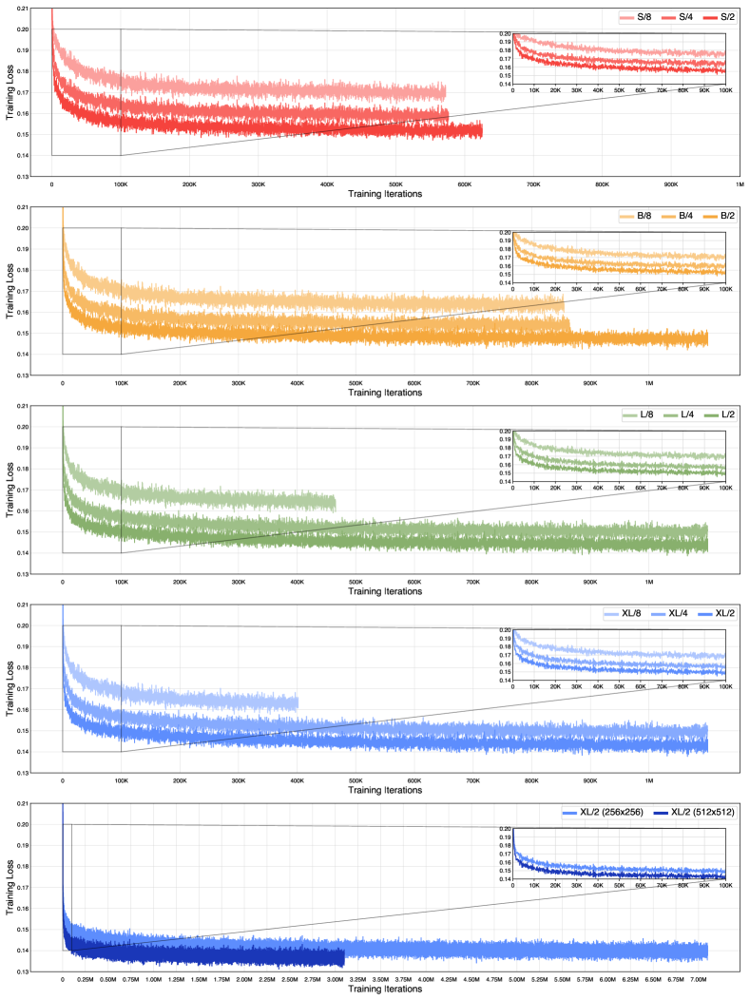

<figcaption>図13: 全 DiT モデルの学習損失曲線。全 DiT モデルの学習にわたる損失（ノイズ予測平均二乗誤差と D_KL の和）をプロット。初期学習挙動も強調。スケールアップした DiT モデルはより低い学習損失を示す点に注意。</figcaption>
</figure>

## Appendix B モデルサンプル

我々は 512×512 と 256×256 解像度でそれぞれ 3M・7M ステップ学習した 2 つの DiT-XL/2 モデルからのサンプルを示す。図1 と図11 が両モデルから選んだサンプルを示す。図14 から図33 が、様々な classifier-free guidance スケールと入力クラスラベルにわたる両モデルの無選別サンプルを示す（250 DDPM サンプリングステップと ft-EMA VAE デコーダで生成）。ガイダンスを使う先行研究と同様、より大きいスケールが視覚的忠実度を上げサンプルの多様性を下げることを観察する。

<figure>

<figcaption>図11: 512×512 および 256×256 解像度の DiT-XL/2 モデルから選んだ追加サンプル。512×512 モデルには classifier-free guidance スケール 6.0 を、256×256 モデルには 4.0 を使う。両モデルとも ft-EMA VAE デコーダを使う。</figcaption>
</figure>

## Appendix C 追加のスケーリング結果

#### Impact of scaling on metrics beyond FID.

図12 で、DiT のスケールが評価指標群——FID・sFID・Inception Score・Precision・Recall——に与える効果を示す。本論文の FID 駆動の分析が他の指標にも一般化することを見出す——あらゆる指標で、スケールアップした DiT モデルはより compute 効率が良く、モデル Gflops は性能と高く相関する。特に Inception Score と Precision はモデルスケールの増加から大きく恩恵を受ける。

#### Impact of scaling on training loss.

図13 でスケールが学習損失に与える影響も調べる。DiT のモデル Gflops を（transformer サイズや入力トークン数を介して）増やすと、学習損失がより速く減少しより低い値で飽和する。この現象は、スケールアップした transformer が改善された損失曲線と下流評価スイートでの改善された性能の両方を示す言語モデルで観察される傾向と一致する。

## Appendix D VAE デコーダのアブレーション

我々は実験全体で既製の事前学習済み VAE を使った。VAE モデル（ft-MSE と ft-EMA）は元の LDM「f8」モデルの fine-tune 版である（デコーダの重みのみ fine-tune）。第5節のスケーリング分析の指標監視には ft-MSE デコーダを使い、表3 で報告する最終指標には ft-EMA デコーダを使った。本節では VAE デコーダの 3 つの異なる選択——LDM が使った元のものと、Stable Diffusion が使った 2 つの fine-tune 版デコーダ——をアブレーションする。エンコーダがモデル間で同一なので、拡散モデルを再学習せずにデコーダを差し替えられる。表5 が結果を示す；XL/2 は LDM デコーダを使っても全ての従来拡散モデルを上回り続ける。

**表5**: デコーダのアブレーション。異なる事前学習済み VAE デコーダの重みをテストした。異なる事前学習済みデコーダの重みは ImageNet 256×256 で同程度の結果を生む。（DiT-XL/2-G, cfg=1.5）

| Decoder | FID↓ | sFID↓ | IS↑ | Precision↑ | Recall↑ |
| --- | --- | --- | --- | --- | --- |
| original | 2.46 | 5.18 | 271.56 | 0.82 | 0.57 |
| ft-MSE | 2.30 | 4.73 | 276.09 | 0.83 | 0.57 |
| ft-EMA | 2.27 | 4.60 | 278.24 | 0.83 | 0.57 |

**表6**: U-Net バックボーンを使うベースライン拡散モデルの Gflop 数。DDPM コンポーネントの Flops のみを数える点に注意。

| Model | Image Resolution | Base Flops (G) | Upsampler Flops (G) | Total Flops (G) |
| --- | --- | --- | --- | --- |
| ADM | 128×128 | 307 | - | 307 |
| ADM | 256×256 | 1120 | - | 1120 |
| ADM | 512×512 | 1983 | - | 1983 |
| ADM-U | 256×256 | 110 | 632 | 742 |
| ADM-U | 512×512 | 307 | 2506 | 2813 |
| LDM-4 | 256×256 | 104 | - | 104 |
| LDM-8 | 256×256 | 57 | - | 57 |

<figure>

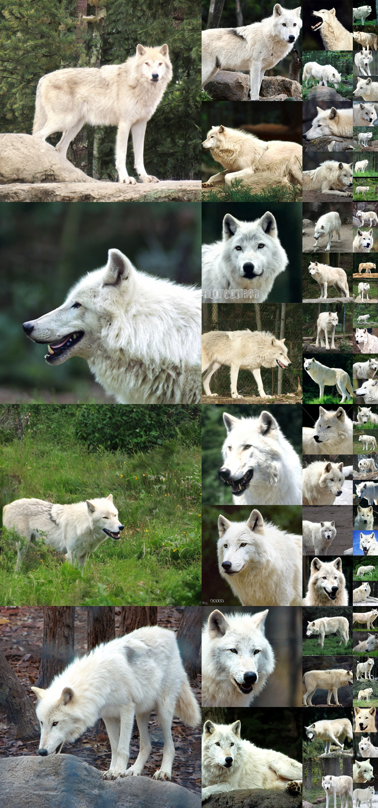

<figcaption>図14: 無選別の 512×512 DiT-XL/2 サンプル。classifier-free guidance スケール = 4.0、クラスラベル = 「arctic wolf（ホッキョクオオカミ）」(270)。</figcaption>
</figure>

<figure>

<figcaption>図15: 無選別の 512×512 DiT-XL/2 サンプル。classifier-free guidance スケール = 4.0、クラスラベル = 「volcano（火山）」(980)。</figcaption>
</figure>

<figure>

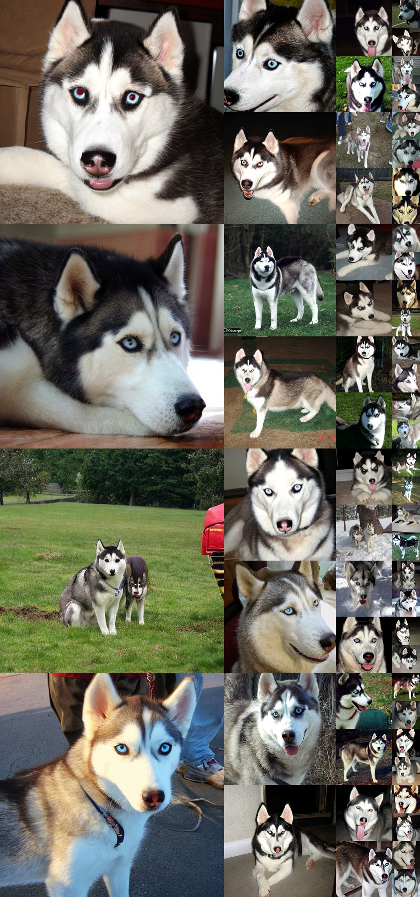

<figcaption>図16: 無選別の 512×512 DiT-XL/2 サンプル。classifier-free guidance スケール = 4.0、クラスラベル = 「husky（ハスキー）」(250)。</figcaption>
</figure>

<figure>

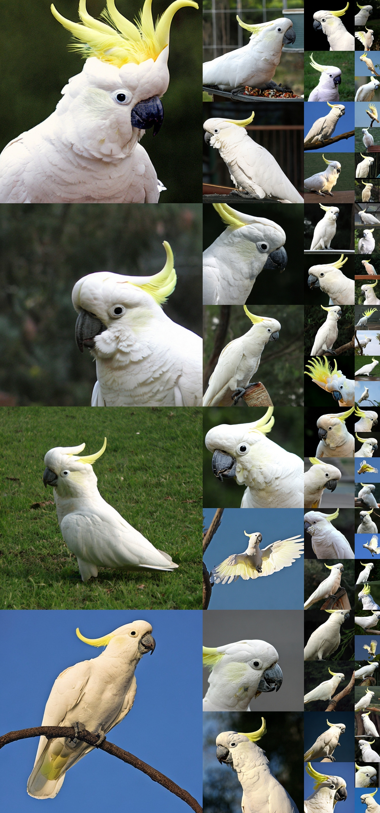

<figcaption>図17: 無選別の 512×512 DiT-XL/2 サンプル。classifier-free guidance スケール = 4.0、クラスラベル = 「sulphur-crested cockatoo（キバタン）」(89)。</figcaption>
</figure>

<figure>

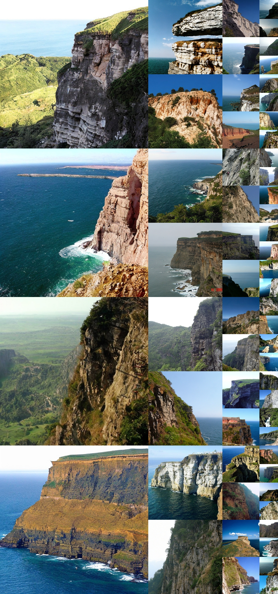

<figcaption>図18: 無選別の 512×512 DiT-XL/2 サンプル。classifier-free guidance スケール = 4.0、クラスラベル = 「cliff drop-off（崖）」(972)。</figcaption>
</figure>

<figure>

<figcaption>図19: 無選別の 512×512 DiT-XL/2 サンプル。classifier-free guidance スケール = 4.0、クラスラベル = 「balloon（気球）」(417)。</figcaption>
</figure>

<figure>

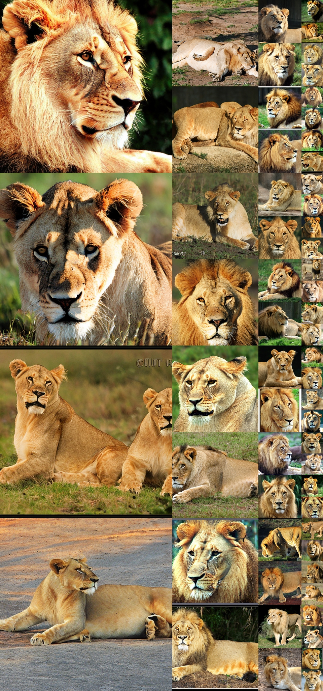

<figcaption>図20: 無選別の 512×512 DiT-XL/2 サンプル。classifier-free guidance スケール = 4.0、クラスラベル = 「lion（ライオン）」(291)。</figcaption>
</figure>

<figure>

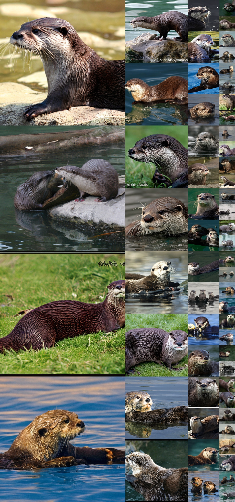

<figcaption>図21: 無選別の 512×512 DiT-XL/2 サンプル。classifier-free guidance スケール = 4.0、クラスラベル = 「otter（カワウソ）」(360)。</figcaption>
</figure>

<figure>

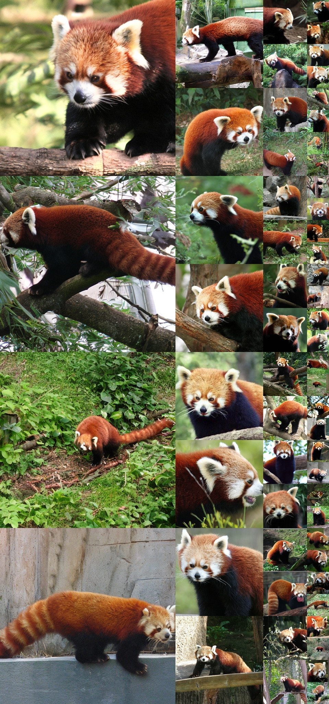

<figcaption>図22: 無選別の 512×512 DiT-XL/2 サンプル。classifier-free guidance スケール = 2.0、クラスラベル = 「red panda（レッサーパンダ）」(387)。</figcaption>
</figure>

<figure>

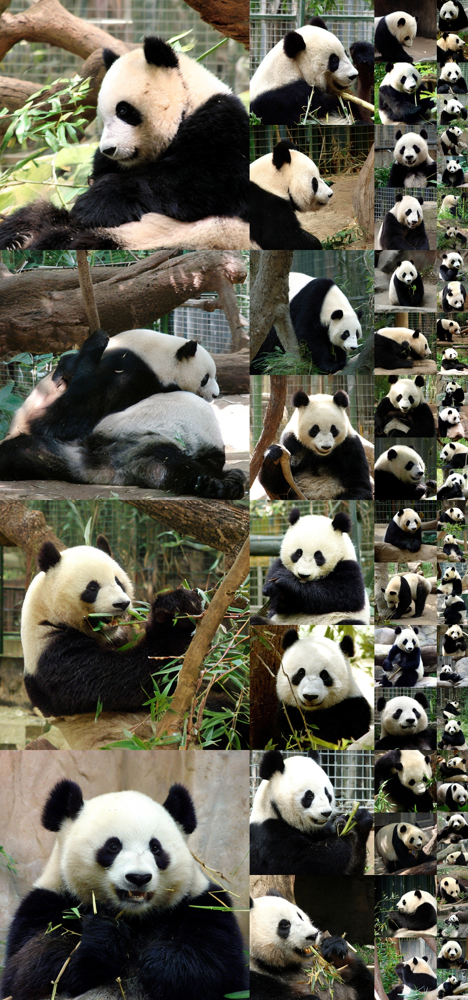

<figcaption>図23: 無選別の 512×512 DiT-XL/2 サンプル。classifier-free guidance スケール = 2.0、クラスラベル = 「panda（ジャイアントパンダ）」(388)。</figcaption>
</figure>

<figure>

<figcaption>図24: 無選別の 512×512 DiT-XL/2 サンプル。classifier-free guidance スケール = 1.5、クラスラベル = 「coral reef（サンゴ礁）」(973)。</figcaption>
</figure>

<figure>

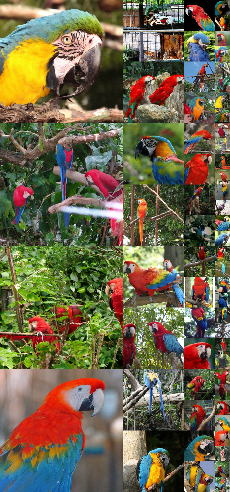

<figcaption>図25: 無選別の 512×512 DiT-XL/2 サンプル。classifier-free guidance スケール = 1.5、クラスラベル = 「macaw（コンゴウインコ）」(88)。</figcaption>
</figure>

<figure>

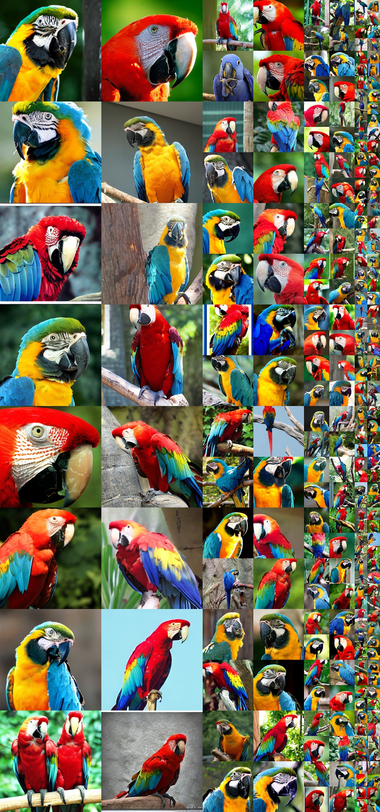

<figcaption>図26: 無選別の 256×256 DiT-XL/2 サンプル。classifier-free guidance スケール = 4.0、クラスラベル = 「macaw（コンゴウインコ）」(88)。</figcaption>
</figure>

<figure>

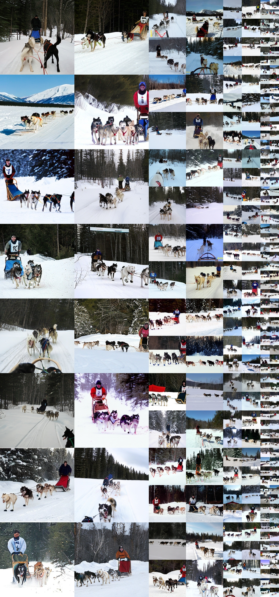

<figcaption>図27: 無選別の 256×256 DiT-XL/2 サンプル。classifier-free guidance スケール = 4.0、クラスラベル = 「dog sled（犬ぞり）」(537)。</figcaption>
</figure>

<figure>

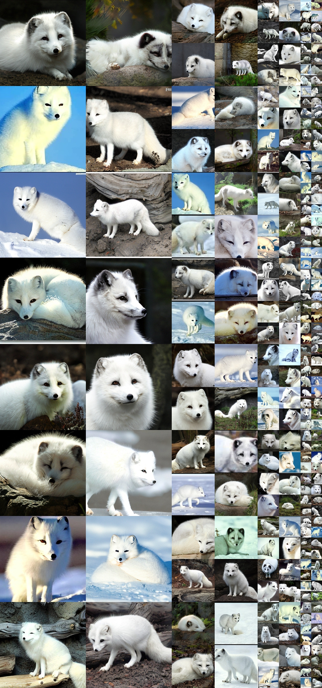

<figcaption>図28: 無選別の 256×256 DiT-XL/2 サンプル。classifier-free guidance スケール = 4.0、クラスラベル = 「arctic fox（ホッキョクギツネ）」(279)。</figcaption>
</figure>

<figure>

<figcaption>図29: 無選別の 256×256 DiT-XL/2 サンプル。classifier-free guidance スケール = 4.0、クラスラベル = 「loggerhead sea turtle（アカウミガメ）」(33)。</figcaption>
</figure>

<figure>

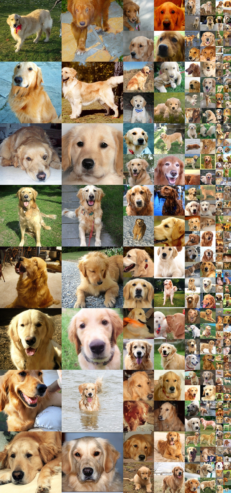

<figcaption>図30: 無選別の 256×256 DiT-XL/2 サンプル。classifier-free guidance スケール = 2.0、クラスラベル = 「golden retriever（ゴールデンレトリバー）」(207)。</figcaption>
</figure>

<figure>

<figcaption>図31: 無選別の 256×256 DiT-XL/2 サンプル。classifier-free guidance スケール = 2.0、クラスラベル = 「lake shore（湖岸）」(975)。</figcaption>
</figure>

<figure>

<figcaption>図32: 無選別の 256×256 DiT-XL/2 サンプル。classifier-free guidance スケール = 1.5、クラスラベル = 「space shuttle（スペースシャトル）」(812)。</figcaption>
</figure>

<figure>

<figcaption>図33: 無選別の 256×256 DiT-XL/2 サンプル。classifier-free guidance スケール = 1.5、クラスラベル = 「ice cream（アイスクリーム）」(928)。</figcaption>
</figure>
