# DreamBooth: 被写体駆動生成のためのテキスト画像拡散モデルのファインチューニング

> 原題: DreamBooth: Fine Tuning Text-to-Image Diffusion Models for Subject-Driven Generation
> 著者: Nataniel Ruiz, Yuanzhen Li, Varun Jampani, Yael Pritch, Michael Rubinstein, Kfir Aberman（Google）
> 出典: CVPR 2023 ・ arXiv:2208.12242
> プロジェクトページ: https://dreambooth.github.io/

## Abstract（要旨）

大規模なテキスト画像（text-to-image）モデルは AI の進化において目覚ましい飛躍を遂げ、与えられたテキストプロンプトから高品質かつ多様な画像合成を可能にした。しかしこれらのモデルは、与えられた参照集合に写る被写体（subject）の見た目を模倣し、それを異なる文脈で新たに描き出す能力を欠いている。本研究では、テキスト画像拡散モデルの「personalization（個人化）」のための新しいアプローチを提示する。被写体のわずか数枚の画像を入力として、事前学習済みのテキスト画像モデルをファインチューニングし、一意の識別子（unique identifier）とその特定の被写体を結びつけることを学習させる。被写体がモデルの出力ドメインに埋め込まれると、その一意識別子を使って、被写体を異なるシーンに文脈づけた新しいフォトリアリスティックな画像を合成できる。モデルに埋め込まれた意味的事前分布（semantic prior）を、新しい autogenous（自己生成的）な class-specific prior preservation loss（クラス固有事前保存損失）とともに活用することで、本技術は参照画像に現れない多様なシーン・ポーズ・視点・照明条件で被写体を合成できる。我々はこの技術を、被写体の再文脈化（recontextualization）、テキスト誘導の視点合成、芸術的描画など、これまで攻略不可能だったいくつかのタスクに、被写体の主要特徴を保ったまま適用する。我々はまた、この新しい被写体駆動生成（subject-driven generation）タスクのための新しいデータセットと評価プロトコルを提供する。プロジェクトページ: https://dreambooth.github.io/

<figure>

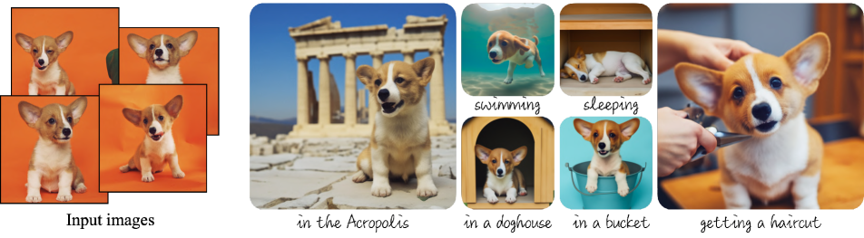

<figcaption>図1: 被写体のわずか数枚（通常 3〜5 枚）の画像（左）から、DreamBooth——我々の AI 駆動フォトブース——は、テキストプロンプトの誘導を用いて、被写体を異なる文脈に置いた無数の画像（右）を生成できる。結果は、環境との自然な相互作用、新しい姿勢、照明条件の変化を示しつつ、被写体の主要な視覚的特徴への高い忠実度を保つ。</figcaption>
</figure>

## 1 はじめに

あなた自身の犬が世界中を旅したり、お気に入りのバッグがパリの最も高級なショールームに展示されたりするのを想像できるだろうか。あなたのオウムが絵本の主人公になるのはどうだろう。そうした想像上のシーンを描くのは、特定の被写体（例: 物体、動物）のインスタンスを、新しい文脈に自然かつシームレスに溶け込むよう合成することを要する、挑戦的なタスクである。

最近開発された大規模テキスト画像モデルは、自然言語で書かれたテキストプロンプトに基づく高品質で多様な画像合成を可能にし、前例のない能力を示してきた。そうしたモデルの主な利点の 1 つは、大量の画像・キャプションのペアから学習された強い意味的事前分布である。例えばこの事前分布は、「dog（犬）」という語を、画像中の異なる姿勢・文脈で現れうる様々な犬のインスタンスと結びつけることを学習する。これらのモデルの合成能力は前例がないものの、与えられた参照集合の被写体の見た目を模倣し、*同じ被写体*を異なる文脈で新たに描き出す能力を欠いている。主な理由は、その出力ドメインの表現力が限られていることである。物体の最も詳細な文章記述でさえ、異なる見た目のインスタンスを生みうる。さらに、テキスト埋め込みが言語・視覚の共有空間にあるモデルでさえ、与えられた被写体の見た目を正確に再構成できず、画像内容のバリエーションを作るだけである（図2）。

本研究では、テキスト画像拡散モデルの「personalization（個人化、ユーザー固有の画像生成ニーズへの適応）」のための新しいアプローチを提示する。我々の目標は、ユーザーが生成したい特定の被写体に新しい語を結びつけるよう、モデルの言語・視覚辞書を拡張することである。新しい辞書がモデルに埋め込まれると、それらの語を使って、被写体を異なるシーンに文脈づけた新しいフォトリアリスティックな画像を、主要な識別特徴を保ったまま合成できる。その効果は「魔法のフォトブース」に似ている——被写体の数枚の画像を撮れば、ブースは単純で直感的なテキストプロンプトに誘導されて、被写体を異なる条件・シーンで写した写真を生成する（図1）。

より形式的には、被写体の数枚（〜3〜5 枚）の画像が与えられたとき、我々の目的は、被写体をモデルの出力ドメインに植え込み（implant）、*一意識別子*で合成できるようにすることである。そのために、与えられた被写体を rare token（希少トークン）識別子で表現し、拡散ベースの事前学習済みテキスト画像フレームワークをファインチューニングする技術を提案する。

我々は、一意識別子に続いて被写体が属するクラス名を含むテキストプロンプト（例: 「A [V] dog」）と入力画像のペアで、テキスト画像モデルをファインチューニングする。後者により、モデルは被写体クラスに関する事前知識を使えるようになり、クラス固有のインスタンスが一意識別子と結びつく。モデルがクラス名（例: 「dog」）を特定のインスタンスと関連づけてしまう language drift（言語ドリフト）を防ぐため、我々は autogenous な class-specific prior preservation loss を提案する。これはモデルに埋め込まれたクラスの意味的事前分布を活用し、被写体と同じクラスの多様なインスタンスを生成するよう促す。

我々はこのアプローチを、被写体の再文脈化、プロパティの変更、独自の芸術的描画など、無数のテキストベース画像生成応用に適用し、これまで攻略不可能だったタスクの新しい流れを切り開く。我々はアブレーション研究を通じて手法の各構成要素の寄与を強調し、代替ベースラインや関連研究と比較する。また、合成画像の被写体忠実度（subject fidelity）とプロンプト忠実度（prompt fidelity）を、代替アプローチと比較して評価するユーザー調査も行う。

我々の知る限り、本手法は被写体駆動生成というこの新しい挑戦的問題に取り組む最初の技術であり、ユーザーが被写体のわずか数枚の何気なく撮った画像から、被写体の独特な特徴を保ちつつ異なる文脈での新しい描画を合成できるようにする。

この新しいタスクを評価するため、我々はまた、異なる文脈で撮られた様々な被写体を含む新しいデータセットを構築し、生成結果の被写体忠実度とプロンプト忠実度を測る新しい評価プロトコルを提案する。データセットと評価プロトコルはプロジェクトのウェブページで公開する。

<figure>

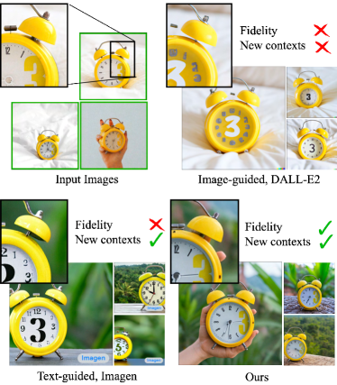

<figcaption>図2: 被写体駆動生成。特定の時計（左）が与えられたとき、その主要な視覚的特徴への高い忠実度を保ったまま生成するのは難しい（第 2・3 列は DALL-E2 の画像誘導生成と Imagen のテキスト誘導生成を示す。Imagen に使ったプロンプト: 「retro style yellow alarm clock with a white clock face and a yellow number three on the right part of the clock face in the jungle」）。我々のアプローチ（右）は時計を高忠実度で、かつ新しい文脈で合成できる（プロンプト: 「a [V] clock in the jungle」）。</figcaption>
</figure>

## 2 関連研究

**Image Composition（画像合成・コンポジション）**。画像コンポジション技術は、与えられた被写体を新しい背景にクローンし、被写体がシーンに溶け込むようにすることを目指す。新しい姿勢でのコンポジションを考えるには 3D 再構成技術を適用しうるが、これは通常剛体に対して機能し、より多くの視点を要する。欠点には、シーン統合（照明・影・接触）や新しいシーンを生成できないことが含まれる。対照的に、我々のアプローチは新しい姿勢・新しい文脈での被写体生成を可能にする。

**Text-to-Image Editing and Synthesis（テキスト画像編集・合成）**。テキスト駆動の画像操作は最近、CLIP のような画像・テキスト表現と組み合わせた GAN を用いて大きく進歩し、テキストによる現実的な操作を生んでいる。これらの手法は構造化されたシナリオ（例: 人の顔の編集）でうまく機能するが、被写体が多様なデータセットでは苦戦しうる。Crowson らは VQ-GAN を使い、より多様なデータで訓練してこの懸念を緩和する。他の研究は最近の拡散モデルを活用し、多様なデータセットで GAN を上回ることも多い最先端の生成品質を達成する。テキストのみを要するほとんどの研究が大域的編集に限られる一方、Bar-Tal らはマスクを使わないテキストベースの局所編集技術を提案し、印象的な結果を示した。これらの編集アプローチの多くは大域的プロパティの変更や与えられた画像の局所編集を許すが、いずれも与えられた被写体を新しい文脈で新たに描き出すことは可能にしない。

テキスト画像合成に関する研究も存在する。Imagen、DALL-E2、Parti、CogView2、Stable Diffusion といった最近の大規模テキスト画像モデルは、前例のない意味的生成を示した。これらのモデルは生成画像に対する細かい制御を提供せず、テキスト誘導のみを使う。具体的には、合成画像間で被写体の同一性（identity）を一貫して保つことは難しいか不可能である。

**Controllable Generative Models（制御可能な生成モデル）**。生成モデルを制御する様々なアプローチがあり、その一部は被写体駆動・プロンプト誘導の画像合成への有望な方向となりうる。Liu らは参照画像やテキストで誘導される画像バリエーションを可能にする拡散ベース技術を提案する。被写体の変更を克服するため、いくつかの研究はユーザー提供のマスクを仮定して変更領域を制限する。Inversion（反転）は被写体を保ちつつ文脈を変えるのに使える。Prompt-to-prompt は入力マスクなしの局所・大域編集を許す。これらの手法は、被写体の同一性を保った新規サンプル生成には及ばない。

GAN の文脈では、Pivotal Tuning が反転した潜在コードのアンカーでモデルをファインチューニングして実画像編集を可能にし、Nitzan らはこれを顔の GAN ファインチューニングに拡張して個人化された事前分布を訓練するが、約 100 枚の画像を要し顔ドメインに限られる。Casanova らはインスタンスのバリエーションを生成できる instance conditioned GAN を提案するが、独特な被写体では苦戦し、被写体の全細部を保たない。

最後に、同時期の Gal らの研究は、凍結したテキスト画像モデルの埋め込み空間における新しいトークンで物体やスタイルといった視覚概念を表現する手法（Textual Inversion）を提案し、小さな個人化トークン埋め込みを生む。この手法は凍結拡散モデルの表現力に制限されるが、我々のファインチューニングアプローチは被写体をモデルの出力ドメイン内に埋め込むことを可能にし、被写体の主要な視覚的特徴を保った新しい画像の生成につながる。

## 3 手法

特定の被写体の何気なく撮ったわずか数枚（通常 3〜5 枚）の画像が、文章記述なしに与えられたとき、我々の目的は、被写体の新しい画像を高い細部忠実度で、かつテキストプロンプトに誘導されたバリエーションとともに生成することである。バリエーションの例には、被写体の位置の変更、色や形などのプロパティの変更、姿勢・視点の変更、その他の意味的変更が含まれる。入力画像の撮影設定には制約を課さず、被写体画像は様々な文脈を持ちうる。次に、テキスト画像拡散モデルの背景（Sec. 3.1）を述べ、数枚の画像で記述された被写体に一意識別子を結びつけるファインチューニング技術（Sec. 3.2）を提示し、最後にファインチューニング済みモデルの language drift を克服する class-specific prior-preservation loss（Sec. 3.3）を提案する。

### 3.1 テキスト画像拡散モデル

拡散モデルは、ガウス分布からサンプリングされた変数を徐々にノイズ除去することでデータ分布を学習するよう訓練される確率的生成モデルである。具体的には、初期ノイズマップ ${\bm{\epsilon}}\sim\mathcal{N}(\mathbf{0},\mathbf{I})$ と、テキストエンコーダ $\Gamma$・テキストプロンプト $\mathbf{P}$ を用いて生成される条件ベクトル $\mathbf{c}=\Gamma(\mathbf{P})$ が与えられたとき、画像 $\mathbf{x}_{\text{gen}}=\hat{\mathbf{x}}_{\theta}({\bm{\epsilon}},\mathbf{c})$ を生成する事前学習済みテキスト画像拡散モデル $\hat{\mathbf{x}}_{\theta}$ に関心がある。これらは、可変にノイズを加えた画像または潜在コード $\mathbf{z}_{t}\coloneqq\alpha_{t}\mathbf{x}+\sigma_{t}{\bm{\epsilon}}$ をノイズ除去するため、二乗誤差損失を使って次のように訓練される：

$$
\mathbb{E}_{\mathbf{x},\mathbf{c},{\bm{\epsilon}},t}\!\left[w_{t}\|\hat{\mathbf{x}}_{\theta}(\alpha_{t}\mathbf{x}+\sigma_{t}{\bm{\epsilon}},\mathbf{c})-\mathbf{x}\|^{2}_{2}\right]
$$

ここで $\mathbf{x}$ は真の画像、$\mathbf{c}$ は条件ベクトル（例: テキストプロンプトから得られる）、$\alpha_{t},\sigma_{t},w_{t}$ はノイズスケジュールとサンプル品質を制御する項で、拡散過程の時刻 $t\sim\mathcal{U}([0,1])$ の関数である。より詳細な説明は補足資料で与える。

### 3.2 テキスト画像モデルの Personalization

<figure>

<figcaption>図3: ファインチューニング。被写体の 3〜5 枚程度の画像が与えられたとき、一意識別子と被写体が属するクラス名を含むテキストプロンプト（例: 「A [V] dog」）とペアにした入力画像で、テキスト画像拡散モデルをファインチューニングする。並行して、モデルがクラスに持つ意味的事前分布を活用し、クラス名をテキストプロンプトに使って（例: 「A dog」）被写体のクラスに属する多様なインスタンスを生成するよう促す class-specific prior preservation loss を適用する。</figcaption>
</figure>

我々の最初のタスクは、被写体インスタンスをモデルの出力ドメインに植え込み、被写体の多様な新しい画像をモデルに問い合わせられるようにすることである。自然な発想の 1 つは、被写体の少数ショットデータセットを使ってモデルをファインチューニングすることである。GAN のような生成モデルを少数ショットでファインチューニングする際は、過学習やモード崩壊を引き起こしうる、また目標分布を十分に捉えきれないため、慎重な配慮が必要だった。これらの落とし穴を避ける技術の研究はあるが、我々の研究と対照的に、その研究系統は主に目標分布に似た画像を生成することを目指し、被写体の保存を要件としない。これらの落とし穴に関して、我々は奇妙な発見を観察する。すなわち、式 1 の拡散損失を使った慎重なファインチューニング設定が与えられると、大規模テキスト画像拡散モデルは、事前分布を忘れたり少数の訓練画像に過学習したりせずに、新しい情報を自分のドメインに統合することに優れているように見える。

#### 少数ショット Personalization のためのプロンプト設計

我々の目標は、新しい（一意識別子, 被写体）ペアを拡散モデルの「辞書」に「植え込む」ことである。与えられた画像集合に詳細な画像記述を書くオーバーヘッドを回避するため、我々はより単純なアプローチを選び、被写体のすべての入力画像を「a [identifier] [class noun]」とラベル付けする。ここで [identifier] は被写体にリンクされた一意識別子、[class noun] は被写体の粗いクラス記述子（例: cat, dog, watch など）である。クラス記述子はユーザーが提供するか、分類器を使って得られる。我々は、クラスの事前分布を一意な被写体に繋ぐため、文中にクラス記述子を使う。誤ったクラス記述子を使うか、クラス記述子を使わないと、訓練時間と language drift が増え、性能が低下することが分かった。本質的に、我々は特定クラスに関するモデルの事前分布を活用し、それを被写体の一意識別子の埋め込みと絡み合わせることで、視覚的事前分布を使って被写体の新しい姿勢や関節表現を異なる文脈で生成しようとする。

#### Rare-token 識別子

既存の英単語（例: 「unique」「special」）は一般に最適でないと分かった。モデルがそれらを本来の意味から切り離し、被写体を参照するよう再び絡み合わせることを学ばねばならないからである。これは、言語モデルと拡散モデルの両方で弱い事前分布を持つ識別子の必要性を動機づける。これを行う危うい方法は、英語のランダムな文字を選んで連結し、希少な識別子（例: 「xxy5syt00」）を生成することである。実際には、トークナイザは各文字を別々にトークン化するかもしれず、これらの文字に対する拡散モデルの事前分布は強い。これらのトークンは一般的な英単語を使うのと同様の弱点を抱えることが多い。我々のアプローチは、語彙中の希少トークンを見つけ、それらをテキスト空間に反転して、識別子が強い事前分布を持つ確率を最小化することである。語彙中で rare-token の探索を行い、希少トークン識別子の列 $f(\hat{\mathbf{V}})$ を得る。ここで $f$ はトークナイザ（文字列をトークンに写す関数）、$\hat{\mathbf{V}}$ はトークン $f(\hat{\mathbf{V}})$ から復号されたテキストである。列は可変長 $k$ でよく、比較的短い列 $k=\{1,...,3\}$ がうまく機能する。次に、de-tokenizer を $f(\hat{\mathbf{V}})$ に適用して語彙を反転することで、一意識別子 $\hat{\mathbf{V}}$ を定義する文字列を得る。Imagen については、3 文字以下の Unicode 文字（空白なし）に対応するトークンを一様ランダムサンプリングし、T5-XXL トークナイザの範囲 $\{5000,...,10000\}$ のトークンを使うとうまく機能することが分かった。

### 3.3 Class-specific Prior Preservation Loss

我々の経験では、最大の被写体忠実度を得る最良の結果は、モデルの全層をファインチューニングすることで達成される。これにはテキスト埋め込みに条件づけられた層のファインチューニングが含まれ、language drift の問題を引き起こす。Language drift は言語モデルで観察されてきた問題で、大規模テキストコーパスで事前学習され後に特定タスクにファインチューニングされたモデルが、言語の統語的・意味的知識を徐々に失う現象である。我々の知る限り、拡散モデルに影響する同様の現象——モデルが目標被写体と同じクラスの被写体を生成する方法を徐々に忘れる——を見出したのは我々が初めてである。

もう 1 つの問題は、出力多様性の低下の可能性である。テキスト画像拡散モデルは本来、高い出力多様性を持つ。少数の画像集合でファインチューニングする際、被写体を新しい視点・姿勢・関節表現で生成できるようにしたい。しかし、出力される被写体の姿勢や視点の多様性が減る（例: 少数ショットの視点にスナップする）リスクがある。これは特にモデルを長く訓練しすぎたとき、しばしば起こると観察される。

前述の 2 つの問題を緩和するため、我々は多様性を促し language drift に対抗する autogenous な class-specific prior preservation loss を提案する。本質的に、我々の方法は、少数ショットのファインチューニングが始まった後も事前分布を保持するよう、モデル自身が生成したサンプルでモデルを教師することである。これにより、クラス事前分布の多様な画像を生成でき、また被写体インスタンスに関する知識と併せて使えるクラス事前分布の知識を保持できる。具体的には、凍結した事前学習済み拡散モデルに対し、ランダム初期ノイズ $\mathbf{z}_{t_{1}}\sim\mathcal{N}(\mathbf{0},\mathbf{I})$ と条件ベクトル $\mathbf{c}_{\text{pr}}\coloneqq\Gamma(f(\text{"a [class noun]"}))$ で ancestral sampler を使い、データ $\mathbf{x}_{\text{pr}}=\hat{\mathbf{x}}(\mathbf{z}_{t_{1}},\mathbf{c}_{\text{pr}})$ を生成する。損失は次のようになる：

$$
\begin{aligned}
\mathbb{E}_{\mathbf{x},\mathbf{c},{\bm{\epsilon}},{\bm{\epsilon}}^{\prime},t}[w_{t}\|\hat{\mathbf{x}}_{\theta}(\alpha_{t}\mathbf{x}+\sigma_{t}{\bm{\epsilon}},\mathbf{c})-\mathbf{x}\|^{2}_{2}+\\
\lambda w_{t^{\prime}}\|\hat{\mathbf{x}}_{\theta}(\alpha_{t^{\prime}}\mathbf{x}_{\text{pr}}+\sigma_{t^{\prime}}{\bm{\epsilon}}^{\prime},\mathbf{c}_{\text{pr}})-\mathbf{x}_{\text{pr}}\|^{2}_{2}],
\end{aligned}
$$

ここで第 2 項が prior-preservation 項で、モデル自身が生成した画像でモデルを教師し、$\lambda$ がこの項の相対的な重みを制御する。図3 はクラス生成サンプルと prior-preservation loss でのモデルファインチューニングを図示する。単純であるにもかかわらず、この prior-preservation loss は出力多様性を促し language drift を克服するのに効果的だと分かった。また、過学習のリスクなしにモデルをより多くの反復で訓練できることも分かった。被写体データセットサイズ 3〜5 枚で、Imagen は $\lambda=1$・学習率 $10^{-5}$、Stable Diffusion は $5\times 10^{-6}$ で、約 1000 反復が良い結果を得るのに十分だと分かった。この過程で「a [class noun]」サンプルが約 1000 枚生成されるが、より少なくてもよい。訓練過程は Imagen で 1 台の TPUv4、Stable Diffusion で 1 台の NVIDIA A100 で約 5 分かかる。

## 4 実験

本節では実験と応用を示す。我々の手法は、再文脈化、素材や種といった被写体プロパティの変更、芸術的描画、視点変更を含む、被写体インスタンスの広範なテキスト誘導の意味的変更を可能にする。重要なのは、これらすべての変更にわたって、被写体に同一性と本質を与える独特な視覚的特徴を保てることである。タスクが再文脈化なら被写体の特徴は変更されないが、見た目（例: 姿勢）は変わりうる。タスクが被写体と別の種・物体を掛け合わせるようなより強い意味的変更なら、変更後も被写体の主要特徴は保たれる。本節では被写体の一意識別子を [V] で参照する。Imagen と Stable Diffusion の具体的な実装詳細は補足資料に含める。

<figure>

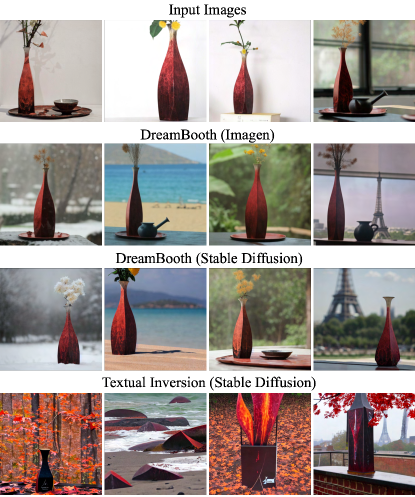

<figcaption>図4: Textual Inversion との比較。4 枚の入力画像（最上行）が与えられたとき、DreamBooth Imagen（2 行目）、DreamBooth Stable Diffusion（3 行目）、Textual Inversion（最下行）を比較する。出力画像は次のプロンプト（左から右）で作成: 「a [V] vase in the snow」「a [V] vase on the beach」「a [V] vase in the jungle」「a [V] vase with the Eiffel Tower in the background」。DreamBooth は被写体・プロンプト忠実度の両方でより強い。</figcaption>
</figure>

<figure>

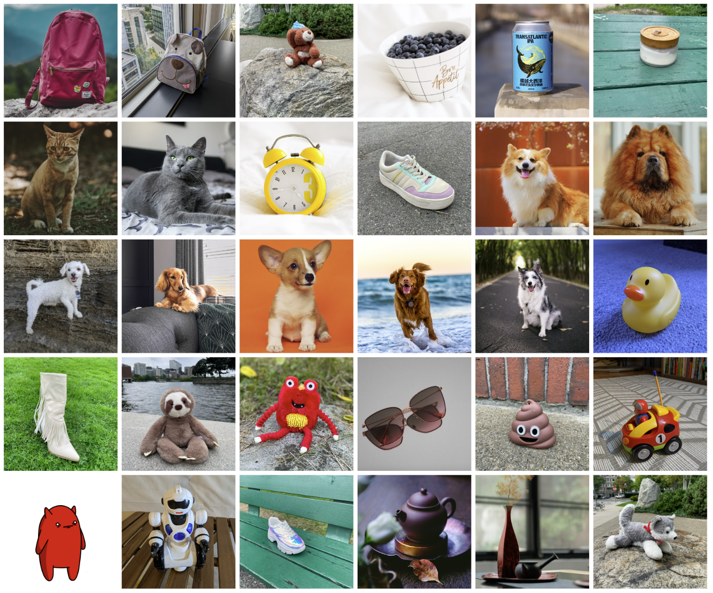

<figcaption>図5: データセット。提案データセットの各被写体の例画像。</figcaption>
</figure>

**表1**: 被写体忠実度（DINO, CLIP-I）とプロンプト忠実度（CLIP-T, CLIP-T-L）の定量指標比較。

| Method | DINO ↑ | CLIP-I ↑ | CLIP-T ↑ |
| --- | --- | --- | --- |
| Real Images | 0.774 | 0.885 | N/A |
| DreamBooth (Imagen) | 0.696 | 0.812 | 0.306 |
| DreamBooth (Stable Diffusion) | 0.668 | 0.803 | 0.305 |
| Textual Inversion (Stable Diffusion) | 0.569 | 0.780 | 0.255 |

**表2**: 被写体忠実度とプロンプト忠実度のユーザー選好。

| Method | Subject Fidelity ↑ | Prompt Fidelity ↑ |
| --- | --- | --- |
| DreamBooth (Stable Diffusion) | 68% | 81% |
| Textual Inversion (Stable Diffusion) | 22% | 12% |
| Undecided | 10% | 7% |

### 4.1 データセットと評価

#### データセット

我々はバックパック、ぬいぐるみ、犬、猫、サングラス、漫画キャラクターなどの独特な物体やペットを含む 30 の被写体のデータセットを集めた。各被写体を 2 カテゴリ（物体と生きた被写体/ペット）に分ける。30 のうち 21 が物体、9 が生きた被写体/ペットである。各被写体の 1 サンプル画像を図5 に示す。このデータセットの画像は著者が集めるか Unsplash から取得した。我々はまた 25 のプロンプトを集めた：物体には 20 の再文脈化プロンプトと 5 のプロパティ変更プロンプト、生きた被写体/ペットには 10 の再文脈化、10 のアクセサリ化、5 のプロパティ変更プロンプト。プロンプトの全リストは補足資料にある。

評価スイートでは、被写体ごと・プロンプトごとに 4 枚の画像を生成し、計 3,000 枚とする。これにより手法の性能と汎化能力を頑健に測れる。我々はデータセットと評価プロトコルを、被写体駆動生成の将来の評価のためプロジェクトウェブページで公開する。

#### 評価指標

評価すべき重要な側面の 1 つは被写体忠実度、すなわち生成画像における被写体の細部の保存である。このため、我々は 2 つの指標 CLIP-I と DINO を計算する。CLIP-I は、生成画像と実画像の CLIP 埋め込み間の平均ペアワイズコサイン類似度である。この指標は他の研究で使われてきたが、非常に似たテキスト記述を持ちうる異なる被写体（例: 2 つの異なる黄色い時計）を区別するようには構築されていない。我々が提案する DINO 指標は、生成画像と実画像の ViT-S/16 DINO 埋め込み間の平均ペアワイズコサイン類似度である。これが我々の好む指標である。構築上、教師ありネットワークと対照的に、DINO は同じクラスの被写体間の違いを無視するよう訓練されていないからである。代わりに、自己教師あり訓練目的が、被写体や画像の独特な特徴の区別を促す。評価すべき 2 つ目の重要な側面はプロンプト忠実度で、プロンプトと画像の CLIP 埋め込み間の平均コサイン類似度として測る。これを CLIP-T と表記する。

<figure>

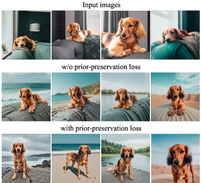

<figcaption>図6: prior-preservation loss による多様性の促進。素朴なファインチューニングは入力画像の文脈や被写体の見た目（例: 姿勢）への過学習を招きうる。PPL は過学習を緩和し多様性を促す正則化として働き、より多くの姿勢の変動と見た目の多様性を可能にする。</figcaption>
</figure>

### 4.2 比較

我々は結果を、同時期の Gal らの研究である Textual Inversion と、彼らの研究で提供されたハイパーパラメータを使って比較する。我々はこの研究が、文献中で被写体駆動・テキスト誘導かつ新しい画像を生成する唯一の比較可能な研究だと考える。DreamBooth は Imagen と Stable Diffusion で、Textual Inversion は Stable Diffusion で画像を生成する。DINO と CLIP-I の被写体忠実度指標、CLIP-T のプロンプト忠実度指標を計算する。表1 では、DreamBooth が Textual Inversion に対し被写体・プロンプト忠実度指標の両方で大きな差をつけることを示す。DreamBooth (Imagen) は DreamBooth (Stable Diffusion) よりも被写体・プロンプト忠実度の両方で高いスコアを達成し、実画像の被写体忠実度の上限に近づくことが分かった。これは Imagen のより大きな表現力と高い出力品質によると考える。

さらに、我々はユーザー調査を行って Textual Inversion (Stable Diffusion) と DreamBooth (Stable Diffusion) を比較する。被写体忠実度については、72 人のユーザーに 25 の比較質問の質問票に答えてもらい（質問票あたり 3 ユーザー）、計 1800 の回答を得た。サンプルは大きなプールからランダムに選ばれる。各質問は被写体の実画像集合と、各手法が生成したその被写体の 1 枚の画像（ランダムなプロンプトで）を示す。ユーザーは「2 枚の画像のうちどちらが参照アイテムの同一性（例: アイテムの種類と細部）を最もよく再現しているか？」に答えるよう求められ、「判別不能 / どちらも同等」の選択肢を含める。同様にプロンプト忠実度については「2 枚の画像のうちどちらが参照テキストで最もよく記述されるか？」を問う。多数決で結果を平均し表2 に示す。被写体忠実度・プロンプト忠実度の両方で DreamBooth への圧倒的な選好が分かった。これは表1 の結果に光を当てる。そこでは DINO の約 0.1 の差と CLIP-T の 0.05 の差がユーザー選好の点で有意である。最後に、図4 で定性比較を示す。DreamBooth は被写体の同一性をよりよく保ち、プロンプトにより忠実だと観察される。ユーザー調査のサンプルは補足資料に示す。

<figure>

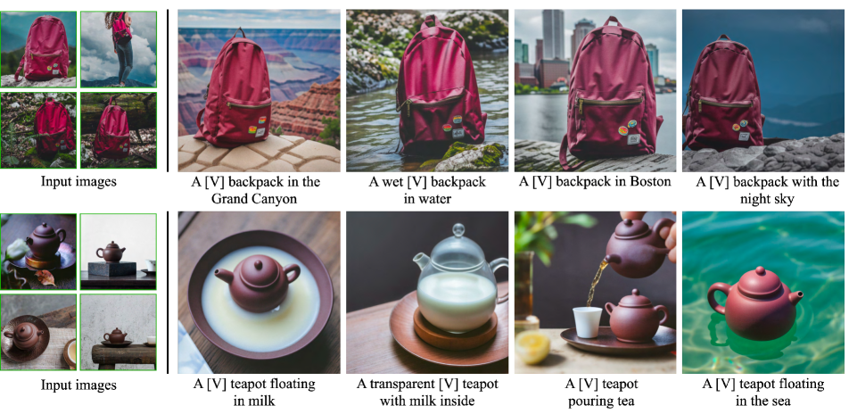

<figcaption>図7: 再文脈化。被写体を異なる環境で生成し、被写体の細部を高く保存し、現実的なシーン・被写体の相互作用を伴う。各画像の下にプロンプトを示す。</figcaption>
</figure>

### 4.3 アブレーション研究

#### Prior Preservation Loss アブレーション

我々はデータセットの 15 被写体で、提案する prior preservation loss（PPL）の有無で Imagen をファインチューニングする。PPL は language drift に対抗し事前分布を保つことを目指す。事前分布クラスのランダムな被写体の生成画像と、我々の特定被写体の実画像との間の平均ペアワイズ DINO 埋め込みを計算して prior preservation 指標（PRES）を計算する。この指標が高いほど、クラスのランダムな被写体が我々の特定被写体に似ており、事前分布の崩壊を示す。結果を表3 に報告し、PPL が language drift を大きく打ち消し、事前分布クラスの多様な画像を生成する能力の保持を助けることを観察する。さらに、同じ被写体・同じプロンプトの生成画像間の平均 LPIPS コサイン類似度を使って多様性指標（DIV）を計算する。PPL で訓練したモデルがより高い多様性（わずかに減少した被写体忠実度とともに）を達成することを観察する。これは図6 でも定性的に観察でき、PPL で訓練したモデルは参照画像の環境への過学習が少なく、犬をより多様な姿勢・関節表現で生成できる。

**表3**: prior preservation loss（PPL）アブレーション。prior preservation（PRES）指標、多様性指標（DIV）、被写体・プロンプト忠実度指標を表示。

| Method | PRES ↓ | DIV ↑ | DINO ↑ | CLIP-I ↑ | CLIP-T ↑ |
| --- | --- | --- | --- | --- | --- |
| DreamBooth (Imagen) w/ PPL | 0.493 | 0.391 | 0.684 | 0.815 | 0.308 |
| DreamBooth (Imagen) | 0.664 | 0.371 | 0.712 | 0.828 | 0.306 |

**表4**: クラス名アブレーション。被写体忠実度指標。

| Method | DINO ↑ | CLIP-I ↑ |
| --- | --- | --- |
| Correct Class | 0.744 | 0.853 |
| No Class | 0.303 | 0.607 |
| Wrong Class | 0.454 | 0.728 |

#### Class-Prior アブレーション

我々はデータセット被写体のサブセット（5 被写体）で、クラス名なし、ランダムにサンプリングした誤ったクラス名、正しいクラス名で Imagen をファインチューニングする。被写体の正しいクラス名を使うと、被写体に忠実にフィットでき、クラス事前分布を活用して被写体を様々な文脈で生成できる。誤ったクラス名（例: バックパックに「can（缶）」）を使うと、被写体とクラス事前分布の間に対立が生じ、円筒形のバックパックや歪んだ被写体を得ることがある。クラス名なしで訓練すると、モデルはクラス事前分布を活用せず、被写体の学習と収束に苦労し、誤ったサンプルを生成しうる。被写体忠実度の結果を表4 に示し、提案アプローチで大幅に高い被写体忠実度を示す。

### 4.4 応用

#### 再文脈化（Recontextualization）

我々は記述的プロンプト（「a [V] [class noun] [context description]」）で、特定被写体の新しい画像を異なる文脈で生成できる（図7）。重要なのは、被写体を新しい姿勢・関節表現で、これまで見たことのないシーン構造とともに、被写体のシーンへの現実的な統合（例: 接触・影・反射）を伴って生成できることである。

#### 芸術的描画（Art Renditions）

プロンプト「a painting of a [V] [class noun] in the style of [famous painter]」や「a statue of a [V] [class noun] in the style of [famous sculptor]」が与えられると、被写体の芸術的描画を生成できる。元の構造を保ちスタイルだけを転送するスタイル転送と異なり、我々は芸術スタイルに応じて意味のある新しいバリエーションを、被写体の同一性を保ちつつ生成できる。例えば図8 の「Michelangelo」に示すように、入力画像には見られない新しい姿勢を生成した。

<figure>

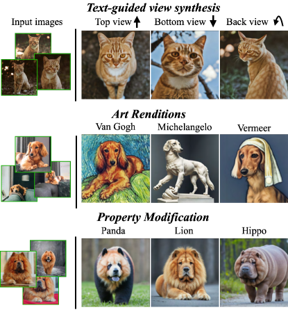

<figcaption>図8: 新しい視点合成、芸術的描画、プロパティ変更。被写体の同一性と本質を忠実に保ちつつ、新しく意味のある画像を生成できる。より多くの応用と例は補足資料に。</figcaption>
</figure>

<figure>

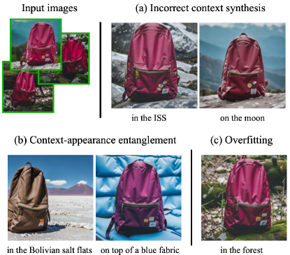

<figcaption>図9: 失敗モード。稀なプロンプト文脈が与えられると、モデルは正しい環境の生成に失敗しうる (a)。文脈と被写体の見た目が絡み合うことがある (b)。最後に、特にプロンプトが訓練集合の元の環境を反映する場合、モデルが過学習して訓練集合に似た画像を生成しうる (c)。</figcaption>
</figure>

#### 新しい視点合成（Novel View Synthesis）

我々は被写体を新しい視点でレンダリングできる。図8 では、入力の猫（一貫した複雑な毛皮模様を伴う）を新しい視点で生成する。モデルはこの特定の猫を背後・下・上から見たことがないにもかかわらず、4 枚の正面画像だけからクラス事前分布の知識を外挿してこれらの新しい視点を生成できる点を強調する。

#### プロパティ変更（Property Modification）

我々は被写体のプロパティを変更できる。例えば図8 の最下行に、特定の Chow Chow 犬と異なる動物種の掛け合わせを示す。「a cross of a [V] dog and a [target species]」という構造の文でモデルにプロンプトを与える。特に、種が変わっても犬の同一性がよく保たれることがこの例で見える——犬の顔は、よく保たれて対象種と融合する特定の独特な特徴を持つ。素材変更（例: 図7 の「a transparent [V] teapot」）など他のプロパティ変更も可能である。難しさは様々で、ベース生成モデルの事前分布に依存する。

### 4.5 限界

図9 に手法のいくつかの失敗モードを示す。第 1 は、プロンプトで指定された文脈を正確に生成できないことに関連する。可能な理由は、これらの文脈に対する弱い事前分布、または訓練集合での共起確率が低いため被写体と指定概念を一緒に生成する難しさである。第 2 は context-appearance entanglement（文脈・見た目の絡み合い）で、プロンプトの文脈により被写体の見た目が変わる。図9 でバックパックの色変化として例示される。第 3 に、プロンプトが被写体が見られた元の設定に似ているときに起こる、実画像への過学習も観察される。

他の限界として、ある被写体は他より学習しやすい（例: 犬や猫）。たまに、より稀な被写体では、モデルが多くの被写体バリエーションをサポートできない。最後に、被写体の忠実度にも変動があり、モデルの事前分布の強さと意味的変更の複雑さに応じて、生成画像が hallucinate された（幻覚的な）被写体特徴を含むことがある。

## 5 結論

我々は被写体の数枚の画像とテキストプロンプトの誘導を使って、被写体の新しい描画を合成するアプローチを提示した。鍵となる発想は、被写体を一意識別子に結びつけることで、与えられた被写体インスタンスをテキスト画像拡散モデルの出力ドメインに埋め込むことである。驚くべきことに、このファインチューニング過程は被写体のわずか 3〜5 枚の画像で機能し、技術を特にアクセスしやすくする。我々は動物や物体を生成したフォトリアリスティックなシーンで、多くの場合実画像と区別がつかない様々な応用を示した。

## Supplementary Material（補足資料）

## Background（背景）

#### テキスト画像拡散モデル

拡散モデルは、ガウス分布からサンプリングされた変数を徐々にノイズ除去することでデータ分布を学習するよう訓練される確率的生成モデルである。具体的には、これは固定長のマルコフ的な順過程の逆過程を学習することに対応する。簡単に言えば、条件付き拡散モデル $\hat{\mathbf{x}}_{\theta}$ は、可変にノイズを加えた画像 $\mathbf{z}_{t}\coloneqq\alpha_{t}\mathbf{x}+\sigma_{t}{\bm{\epsilon}}$ をノイズ除去するため、二乗誤差損失を使って次のように訓練される：

$$
\mathbb{E}_{\mathbf{x},\mathbf{c},{\bm{\epsilon}},t}\!\left[w_{t}\|\hat{\mathbf{x}}_{\theta}(\alpha_{t}\mathbf{x}+\sigma_{t}{\bm{\epsilon}},\mathbf{c})-\mathbf{x}\|^{2}_{2}\right]
$$

ここで $\mathbf{x}$ は真の画像、$\mathbf{c}$ は条件ベクトル（例: テキストプロンプトから得られる）、${\bm{\epsilon}}\sim\mathcal{N}(\mathbf{0},\mathbf{I})$ はノイズ項、$\alpha_{t},\sigma_{t},w_{t}$ はノイズスケジュールとサンプル品質を制御する項で、拡散過程の時刻 $t\sim\mathcal{U}([0,1])$ の関数である。推論時には、決定論的な DDIM または確率的な ancestral sampler を使って $\mathbf{z}_{t_{1}}\sim\mathcal{N}(\mathbf{0},\mathbf{I})$ を反復的にノイズ除去して拡散モデルをサンプリングする。中間点 $\mathbf{z}_{t_{1}},\dotsc,\mathbf{z}_{t_{T}}$（$1=t_{1}>\cdots>t_{T}=0$）が、減少するノイズレベルで生成される。これらの点 $\hat{\mathbf{x}}^{t}_{0}\coloneqq\hat{\mathbf{x}}_{\theta}(\mathbf{z}_{t},\mathbf{c})$ は $\mathbf{x}$ 予測の関数である。

最近の最先端テキスト画像拡散モデルは、テキストから高解像度画像を生成するため cascaded diffusion model（カスケード拡散モデル）を使う。具体的には、[61]（Imagen）は 64×64 出力解像度のベーステキスト画像モデルと、2 つのテキスト条件付き超解像（SR）モデル $64\times 64\rightarrow 256\times 256$ と $256\times 256\rightarrow 1024\times 1024$ を使う。Ramesh ら（DALL-E2）は無条件 SR モデルで同様の構成を使う。[61] の高品質サンプル生成の鍵となる要素は、2 つの SR モジュールへの noise conditioning augmentation（ノイズ条件付け増強）の使用である。これは中間画像を特定の強度のノイズで破損させ、その破損レベルに SR モデルを条件づけることからなる。Saharia らは増強の形としてガウスノイズを選ぶ。

Stable Diffusion のような他の最近の最先端テキスト画像拡散モデルは、高解像度画像を生成するのに単一の拡散モデルを使う。具体的には、順・逆の拡散過程は低次元の潜在空間で起こり、画像を潜在コードに変換するためにエンコーダ・デコーダ・アーキテクチャが大規模画像データセットで訓練される。推論時には、ランダムノイズの潜在コードが逆拡散過程を経て、事前学習済みデコーダが最終画像を生成するのに使われる。我々の手法はこのシナリオに自然に適用でき、そこでは U-Net（場合によってはテキストエンコーダ）が訓練され、デコーダは固定される。

#### 語彙エンコーディング（Vocabulary Encoding）

テキスト画像拡散モデルのテキスト条件付けの詳細は、視覚品質と意味的忠実度にとって非常に重要である。Ramesh ら（DALL-E2）は学習された prior を使って画像埋め込みに変換される CLIP テキスト埋め込みを使い、Saharia ら（Imagen）は事前学習済みの T5-XXL 言語モデルを使う。本研究では後者を使う。T5-XXL のような言語モデルはトークン化されたテキストプロンプトの埋め込みを生成し、語彙エンコーディングはプロンプト埋め込みの重要な前処理ステップである。テキストプロンプト $\mathbf{P}$ を条件埋め込み $\mathbf{c}$ に変換するため、まず学習された語彙を使いトークナイザ $f$ でテキストをトークン化する。[61] に従い SentencePiece トークナイザを使う。プロンプト $\mathbf{P}$ をトークナイザ $f$ でトークン化した後、固定長ベクトル $f(\mathbf{P})$ を得る。言語モデル $\Gamma$ はこのトークン識別子ベクトルに条件づけられて埋め込み $\mathbf{c}\coloneqq\Gamma(f(\mathbf{P}))$ を生成する。最後に、テキスト画像拡散モデルは $\mathbf{c}$ に直接条件づけられる。

## Dataset（データセット）

我々のデータセットは 30 被写体を含む。各被写体を 2 カテゴリ（物体と生きた被写体/ペット）に分ける。30 のうち 21 が物体、9 が生きた被写体/ペットである。各被写体の 1 サンプル画像を図5 に示す。このデータセットの画像は著者が集めるか Unsplash から取得した。

我々はまた 25 のプロンプトを集めた：物体には 20 の再文脈化プロンプトと 5 のプロパティ変更プロンプト。生きた被写体/ペットには 10 の再文脈化、10 のアクセサリ化、5 のプロパティ変更プロンプト。プロンプトは図10 に示す。

評価スイートでは、被写体ごと・プロンプトごとに 4 枚の画像を生成し、計 3,000 枚とする。これにより手法の性能と汎化能力を頑健に測れる。我々はデータセットと評価プロトコルを、被写体駆動生成の将来の評価のためプロジェクトウェブページで公開する。

<figure>

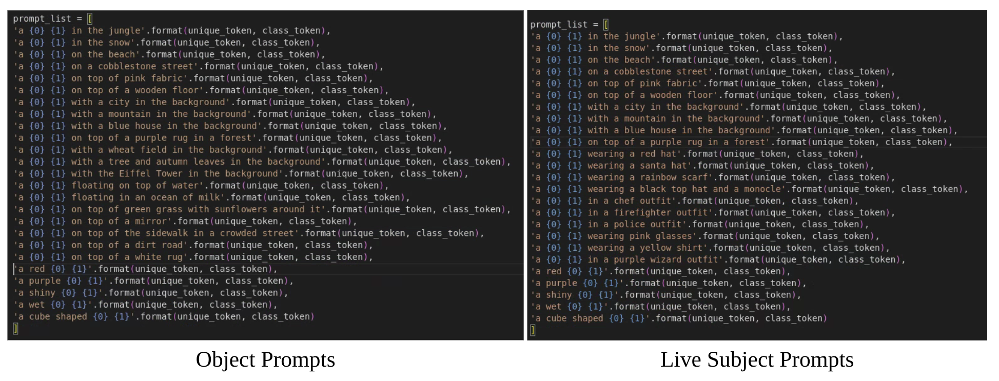

<figcaption>図10: プロンプト。物体と生きた被写体の両方の評価プロンプト。</figcaption>
</figure>

## Subject Fidelity Metrics（被写体忠実度指標）

本論文では、被写体忠実度の点で提案する DINO 指標の優位性についてコメントした。これは DINO が本質的に、データ増強を除いて異なる画像を互いに区別するよう自己教師ありで訓練されるためだと仮説を立てる。これは、CLIP がテキスト・画像ペアで訓練され、画像についてより記述的な情報をエンコードする——しかしテキスト注釈に存在しない細部は必ずしもエンコードしない——CLIP-I 指標と対照的である。図11 に例を示す。第 1 列は参照実画像、第 2 列は別の実画像、第 3 列は DreamBooth 生成画像、最後の列は Textual Inversion を使った生成画像である。第 2・3・4 の画像を CLIP-I と DINO 指標を使って実参照画像と比較する。第 2 の実画像が CLIP-I と DINO の両スコアで最高を得ることを観察する。DreamBooth サンプルは Textual Inversion サンプルより参照サンプルにずっと似ているが、Textual Inversion サンプルの CLIP-I スコアは DreamBooth サンプルよりずっと高い。しかし、DINO 類似度は DreamBooth サンプルで高く、これは被写体忠実度の人手評価をより密に追う。これを定量的に検証するため、DINO/CLIP-I スコアと正規化された人手選好スコアの相関を計算する。DINO は人手選好と 0.32 の Pearson 相関係数を持ち（[20] で使われた CLIP-I 指標の 0.27 に対し）、非常に低い p 値 $9.44\times 10^{-30}$ を持つ。

<figure>

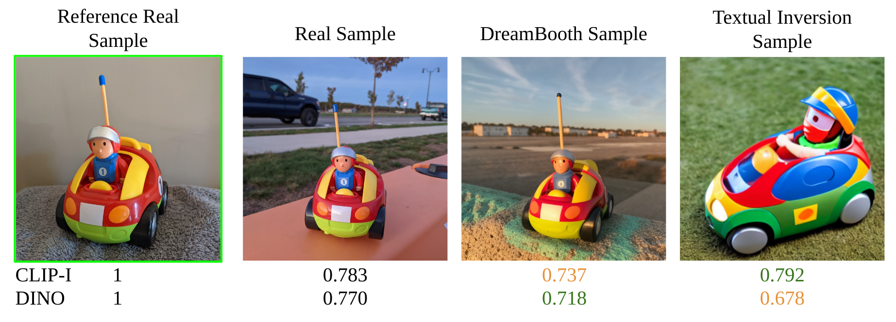

<figcaption>図11: CLIP-I vs. DINO 指標。DreamBooth の被写体が参照被写体により似ているにもかかわらず、DreamBooth の参照画像への CLIP-I 類似度は Textual Inversion サンプルのそれより低い。ここでは DINO 指標が被写体忠実度の人手評価をより密に追う。</figcaption>
</figure>

## User Study（ユーザー調査）

以下に、ユーザー調査に使った完全な指示を含める。被写体忠実度について：

- タスクを注意深く読み、参照アイテムを検査してから生成アイテムを検査する。
- 2 つの生成アイテム（A または B）のうち、参照アイテムの同一性（例: アイテムの種類と細部）を再現するものを選ぶ。
- 被写体はアクセサリ（例: 帽子、衣装）を身につけているかもしれない。これらは回答に影響すべきでない。考慮しない。
- 確信がなければ「判別不能 / どちらも同等」を選ぶ。

テキスト忠実度について：

- タスクを注意深く読み、参照テキストを検査してから生成アイテムを検査する。
- 2 つの生成アイテム（A または B）のうち、参照テキストで最もよく記述されるものを選ぶ。
- 確信がなければ「判別不能 / どちらも同等」を選ぶ。

各調査について、72 人のユーザーに 25 の比較質問の質問票に答えてもらい（質問票あたり 3 ユーザー）、計 1800 の回答を得た——600 の画像ペアが評価された。

## Additional Applications and Examples（追加の応用と例）

#### 追加サンプル

我々は付属の HTML ファイルで大量の追加ランダムサンプルを提供する。実画像、Imagen と Stable Diffusion を使った DreamBooth 生成画像、Stable Diffusion で Textual Inversion を使った生成画像を比較する。

#### 再文脈化

図12 に再文脈化の追加の高品質な例を示す。

<figure>

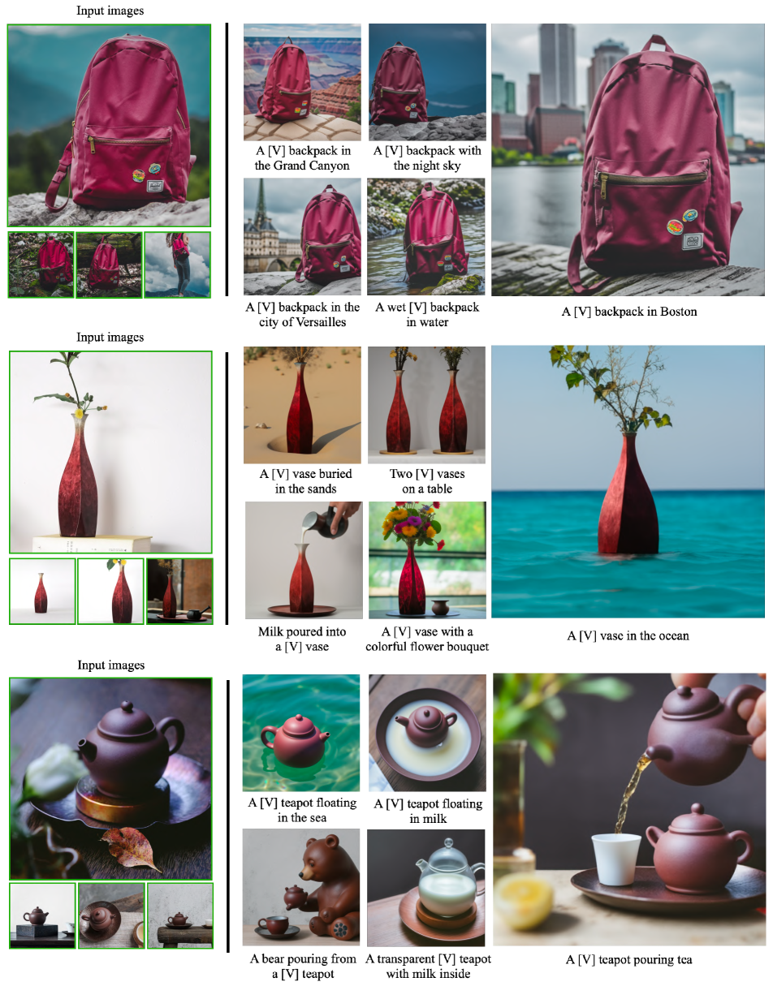

<figcaption>図12: バックパック、花瓶、ティーポットの被写体インスタンスの追加の再文脈化サンプル。被写体インスタンスを異なる環境で、被写体の細部を高く保存し、シーンと被写体の現実的な相互作用を伴って生成できる。各画像の下に条件プロンプトを表示。</figcaption>
</figure>

#### 芸術的描画

図13 に個人化モデルの独自の芸術的描画の追加例を示す。

<figure>

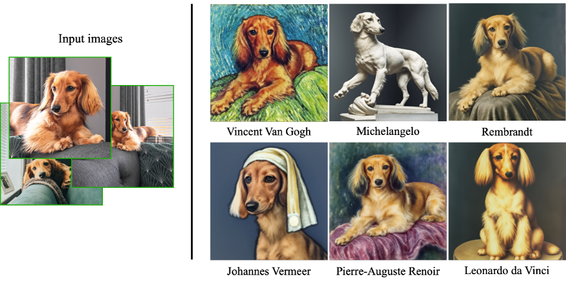

<figcaption>図13: 有名画家のスタイルでの犬インスタンスの追加の芸術的描画。生成された姿勢の多く（例: Michelangelo の描画）は訓練集合に見られなかったことを述べる。また、いくつかの描画は新しい構図を持ち、画家のスタイルを忠実に模倣しているように見える。</figcaption>
</figure>

#### 表情操作（Expression Manipulation）

我々の手法は、元の被写体画像集合に見られない、変更された表情を持つ被写体の新しい画像生成を可能にする。図14 に例を示す。表現力の範囲は高く、負から正の感情価、異なるレベルの覚醒度まで及ぶ。すべての例で、被写体の犬の独自性が保たれる——具体的には、顔の非対称な白い筋がすべての生成画像に残る。

<figure>

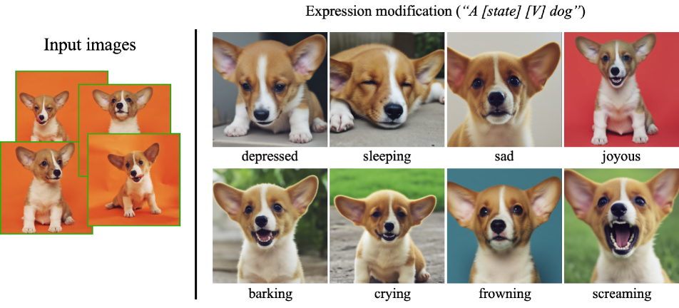

<figcaption>図14: 犬インスタンスの表情操作。本技術は入力画像に現れない様々な表情を合成でき、モデルの外挿能力を示す。被写体の犬の顔の独特な非対称な白い筋に注目。</figcaption>
</figure>

#### 新しい視点合成

図15 に、サンプル生成に使ったプロンプトとともに、新しい視点合成のより多くの視点を示す。

<figure>

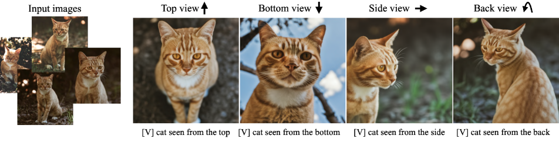

<figcaption>図15: テキスト誘導の視点合成。本技術は被写体の猫について指定された視点（左から右: 上、下、横、後ろの視点）で画像を合成できる。生成された姿勢は入力姿勢と異なり、姿勢変化に応じて背景が現実的に変わる点に注目。被写体の猫の額の複雑な毛皮模様の保存も強調する。</figcaption>
</figure>

#### アクセサリ化（Accessorization）

生成モデルの強い構成的事前分布から生じる興味深い能力は、被写体をアクセサリで飾る能力である。図16 に Chow Chow 犬のアクセサリ化の例を示す。「a [V] [class noun] wearing [accessory]」の形の文でモデルにプロンプトを与える。このように、この犬に異なるアクセサリを——美的に好ましい結果で——フィットできる。犬の同一性がすべてのフレームで保たれ、被写体・アクセサリの接触と関節表現が現実的である点に注目。

<figure>

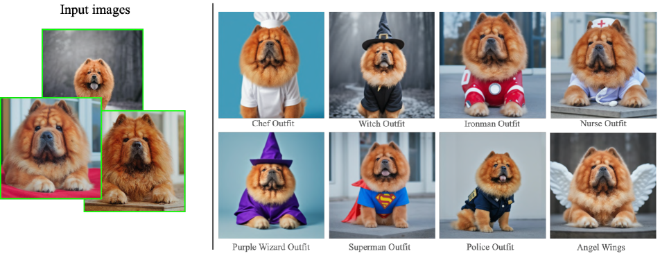

<figcaption>図16: 犬にアクセサリを着せる。被写体の同一性が保たれ、「a [V] dog wearing a police/chef/witch outfit」型のプロンプトで多くの異なる衣装やアクセサリを犬に適用できる。被写体の犬と衣装やアクセサリの現実的な相互作用、および多種多様な選択肢を観察する。</figcaption>
</figure>

#### プロパティ変更

我々は被写体インスタンスのプロパティを変更できる。例えばプロンプト文「a [color adjective] [V] [class noun]」に色形容詞を含められる。このように、異なる色で被写体の新しいインスタンスを生成できる。生成シーンは元のシーンに非常に似たものにも、記述的プロンプトに応じて変えたものにもできる。図17 の最初の行に車の色変化を示す。効果のため似た視点を選ぶが、異なる色の車を異なるシナリオで異なる視点で生成できる。これはプロパティ変更の単純な例だが、本手法を使ってより意味的に複雑なプロパティ変更も達成できる。例えば図17 の最下行に、特定の Chow Chow 犬と異なる動物種の掛け合わせを示す。「a cross of a [V] dog and a [target species]」の構造の文でプロンプトを与える。特に、種が変わっても犬の同一性がよく保たれることがこの例で見える。素材変更（例: 石でできた犬）など他のプロパティ変更も可能である。

<figure>

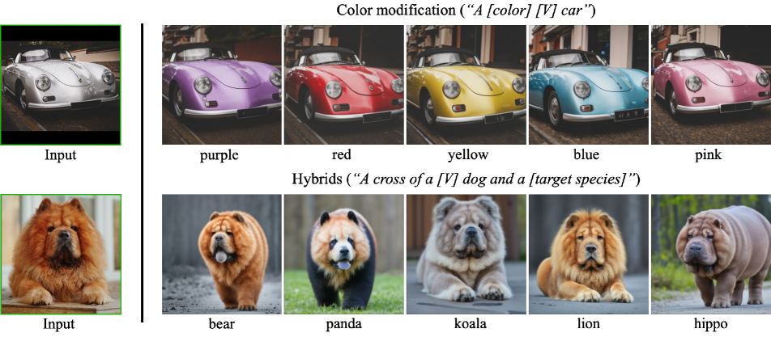

<figcaption>図17: 主要特徴を保ちつつ被写体プロパティを変更。最初の行に色変更（プロンプト「a [color] [V] car」）、2 行目に特定の犬と異なる動物の掛け合わせ（プロンプト「a cross of a [V] dog and a [target species]」）を示す。本手法が、必要なプロパティ変更を行いつつ、被写体に同一性や本質を与える独特な視覚的特徴を保つ点を強調する。</figcaption>
</figure>

#### 漫画生成（Comic Book Generation）

フォトリアリスティックな画像に加え、本手法は描画メディアなどの見た目も捉えられる。図18 に、我々の知る限り、生成モデルが生成した持続的キャラクターを持つ完全な漫画の最初の例を示す。各漫画フレームは記述的プロンプト（例: 「a [V] cartoon grabbing a fork and a knife saying "time to eat"」）で生成された。

<figure>

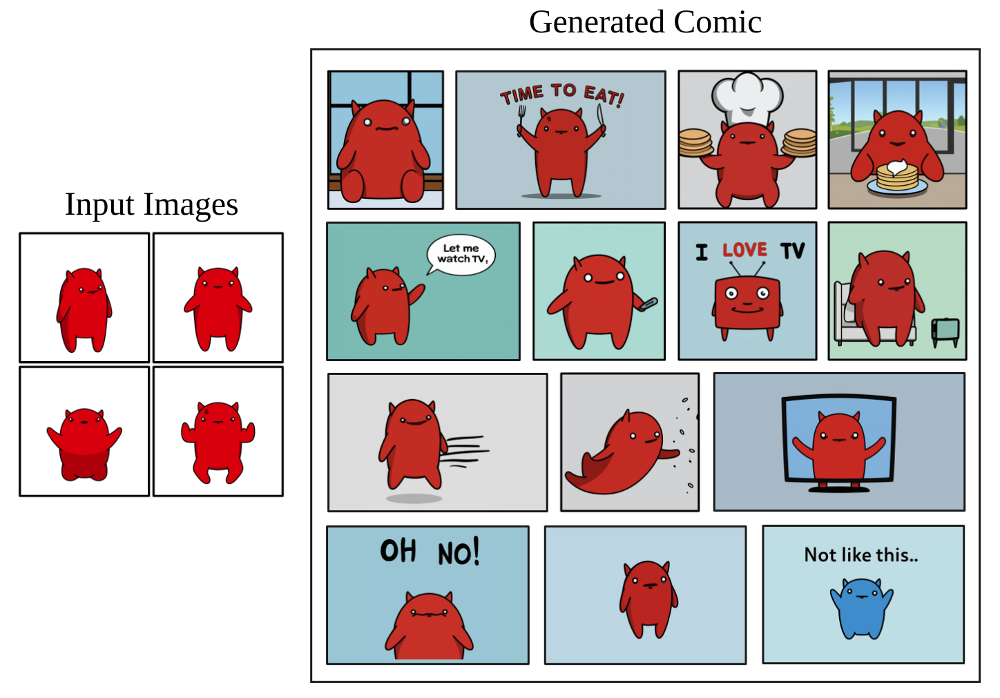

<figcaption>図18: 生成された漫画。我々の知る限り、生成モデルにプロンプトを与えて生成した、持続的キャラクターを持つ最初の漫画を示す。</figcaption>
</figure>

## Additional Experiments（追加実験）

### Prior Preservation Loss

ここでは prior preservation loss（PPL）が事前分布の多様性をどう保つかの定性例を示し、図19 にサンプル結果を示す。バニラモデルが多種多様な犬を生成できる一方、被写体の犬で素朴にファインチューニングしたモデルは language drift を示し、プロンプト「a dog」で我々の被写体の犬を生成することを検証する。提案する損失は事前分布の多様性を保ち、モデルは「a [V] dog」型のプロンプトで我々の犬の新しいインスタンスを、また「a dog」プロンプトで多様な犬のインスタンスを生成できる。

<figure>

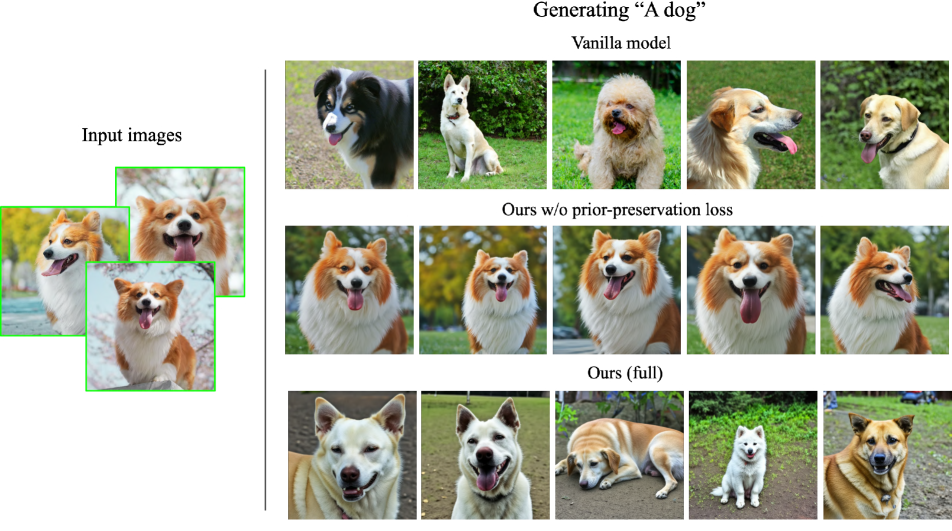

<figcaption>図19: prior-preservation loss によるクラス意味的事前分布の保存。prior-preservation loss なしで被写体の画像を使ってファインチューニングすると language drift が起き、モデルは被写体のクラスの他のメンバーを生成する能力を失う。prior-preservation loss 項を使うとこれを避け、被写体クラスの事前分布を保てる。</figcaption>
</figure>

### 訓練画像の効果

ここではモデル個人化のための入力画像枚数の効果に関する実験を行う。具体的には、2 被写体についてモデルを訓練し、入力画像 1〜5 枚で被写体ごとに 5 モデルを訓練する。被写体ごとに 10 の異なる再文脈化プロンプトで 4 枚の画像を生成する。図20 に定性結果を示す。選んだ Corgi 犬のような、より一般的で拡散モデルの分布により強く位置する被写体については、わずか 2 枚——慎重なハイパーパラメータ選択により時に 1 枚——で見た目を正確に捉えられることを観察できる。選んだバックパックのようなより稀な物体については、被写体を正確に保ち多様な設定に再文脈化するのにより多くのサンプルを要する。定量結果はこれらの結論を支持する——表5 に DINO 被写体忠実度指標、表6 に CLIP-T プロンプト忠実度指標を示す。両被写体とも、被写体・プロンプトの最適な入力画像枚数は 4 である。この数は被写体により変わりうるので、モデル個人化には 3〜5 枚に落ち着く。

<figure>

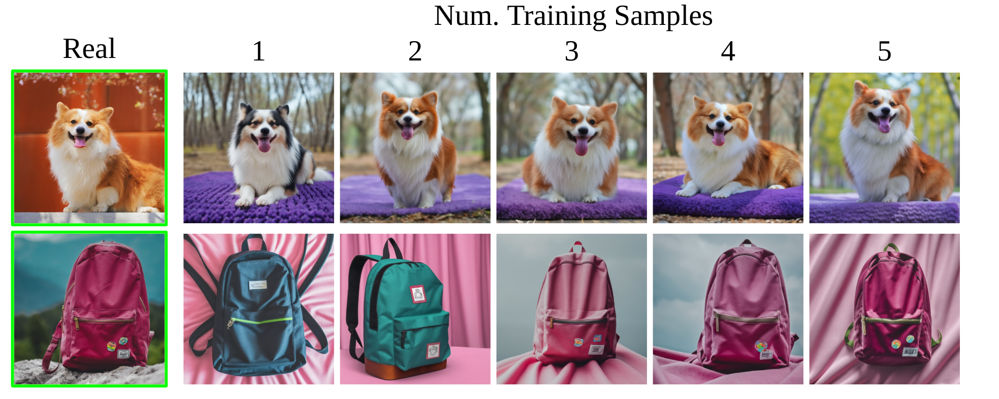

<figcaption>図20: 入力画像枚数の影響。わずか 1 枚の入力画像でも、ある被写体（例: Corgi 犬）の同一性を捉えるのに近いことを観察する。通常はより多くの画像が必要——この例では Corgi 犬の再構成には 2 枚で十分だが、バックパックのようなより稀なアイテムには少なくとも 3 枚必要。</figcaption>
</figure>

**表5**: 入力画像枚数の被写体忠実度（DINO）への効果。

| Method | 1 | 2 | 3 | 4 | 5 |
| --- | --- | --- | --- | --- | --- |
| Backpack | 0.494 | 0.515 | 0.596 | 0.604 | 0.597 |
| Dog | 0.798 | 0.851 | 0.871 | 0.876 | 0.864 |

**表6**: 入力画像枚数のプロンプト忠実度（CLIP-T）への効果。

| Method | 1 | 2 | 3 | 4 | 5 |
| --- | --- | --- | --- | --- | --- |
| Backpack | 0.798 | 0.851 | 0.871 | 0.876 | 0.864 |
| Dog | 0.646 | 0.683 | 0.734 | 0.740 | 0.730 |

### Imagen のための個人化インスタンス固有超解像と低レベルノイズ増強

テキスト画像拡散モデルがほとんどの視覚的意味を制御する一方、超解像（SR）モデルはフォトリアリスティックな内容を達成し被写体インスタンスの細部を保つのに不可欠である。SR ネットワークをファインチューニングなしで使うと、SR モデルが被写体インスタンスの特定の細部やテクスチャに不慣れか、被写体インスタンスが誤った特徴を hallucinate したか細部を欠いたために、生成出力にアーティファクトが含まれうることが分かった。図21（最下行）は、SR モデルをファインチューニングしないいくつかのサンプル出力画像を示し、モデルがいくつかの高周波の細部を hallucinate する。ほとんどの被写体に $64\times 64\rightarrow 256\times 256$ SR モデルのファインチューニングが不可欠で、$256\times 256\rightarrow 1024\times 1024$ モデルのファインチューニングは高レベルの細粒度の細部を持つ一部の被写体インスタンスに利益をもたらすことが分かった。

Saharia らの訓練レシピとテストパラメータを使って被写体インスタンスの少数ショットで SR モデルをファインチューニングすると、結果が最適でないことが分かった。具体的には、SR ネットワークの訓練に使われた元のノイズ増強レベルを維持すると、被写体と環境の高周波パターンがぼやけることが分かった。サンプル生成は図21（中央行）を参照。被写体インスタンスを忠実に再現するため、$256\times 256$ SR モデルのファインチューニング中に、ノイズ増強レベルを $10^{-3}$ から $10^{-5}$ に下げる。この小さな変更で、被写体インスタンスの細粒度の細部を回復できる。低いノイズを使って超解像モデルを訓練すると忠実度が向上することを示す。具体的には図21 に、超解像モデルをファインチューニングしないと被写体に高周波パターンの hallucination が観察され同一性保存を損なうこと、また Imagen $256\times 256$ モデルの訓練に使われた真のノイズ増強レベル（$10^{-3}$）を使うとぼやけて鮮明でない細部が得られること、SR モデルの訓練に使うノイズを $10^{-5}$ に下げるとパターンの hallucination やぼやけなしに大量の細部を保てることを示す。

<figure>

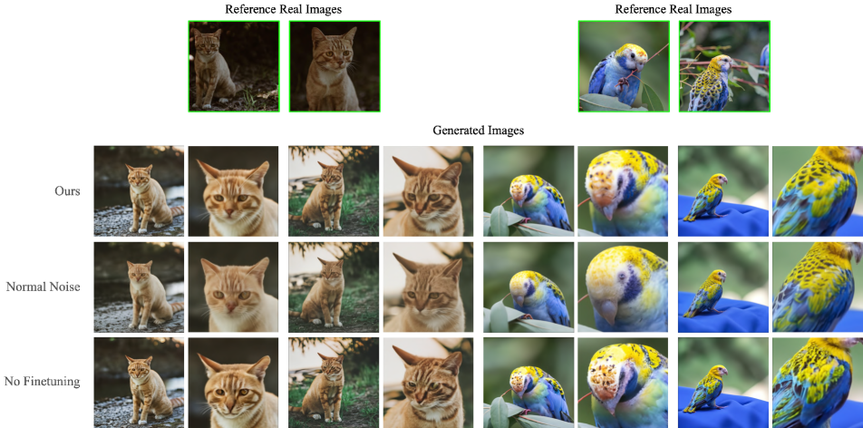

<figcaption>図21: 超解像（SR）モデルのファインチューニングのアブレーション。[61] の通常のノイズ増強レベルで SR モデルを訓練すると高周波パターンがぼやけ、ファインチューニングしないと高周波パターンが hallucinate される。SR モデルに低レベルノイズ増強を使うとサンプル品質と被写体忠実度が向上する。画像クレジット（入力画像）: Unsplash。</figcaption>
</figure>

### 比較

図22 に Gal らとの追加の定性比較を含める。この比較では、Gal らから親切に提供された彼らの研究のティーザーに現れる 2 物体（頭部のない彫刻と猫のおもちゃ）の訓練画像でモデルを訓練し、彼らの論文で提案されたプロンプトを適用する。彼らが複数の生成画像を提示するプロンプトについては、彼らの最良サンプル（最高の画質と被写体への形態的類似度）を手で選んだ。本研究がこれらの独特な物体の同じ意味的バリエーションを、被写体の同一性保存に高い重点を置いて生成できることが分かる。例えば、保たれた猫の彫刻の詳細な模様で見られる。

次に、本手法と、バニラ Imagen・DALL-E 2 の公開 API を使ったプロンプトエンジニアリングによる、独特な特徴を持つ被写体の時計の再文脈化の比較を示す。両モデルを使った複数回の反復の後、被写体の時計の例の重要な特徴をすべて記述するため、基本プロンプト「retro style yellow alarm clock with a white clock face and a yellow number three on the lower right part of the clock face」に落ち着く。DALL-E 2 とバニラ Imagen はレトロスタイルの黄色い目覚まし時計を生成できるが、時計の文字盤に（文字盤の数字とは別の）数字の 3 を表現するのに苦労することが分かる。一般に、徹底的なプロンプトエンジニアリングを行っても、被写体の見た目の細粒度の細部を制御するのは非常に難しい。また、文脈が被写体インスタンスの見た目ににじみ出ることも分かる。図23 に結果を示し、本手法が形、文字盤のフォント、文字盤上の大きな黄色い数字 3 など、被写体インスタンスの細粒度の細部を保つことが観察できる。

<figure>

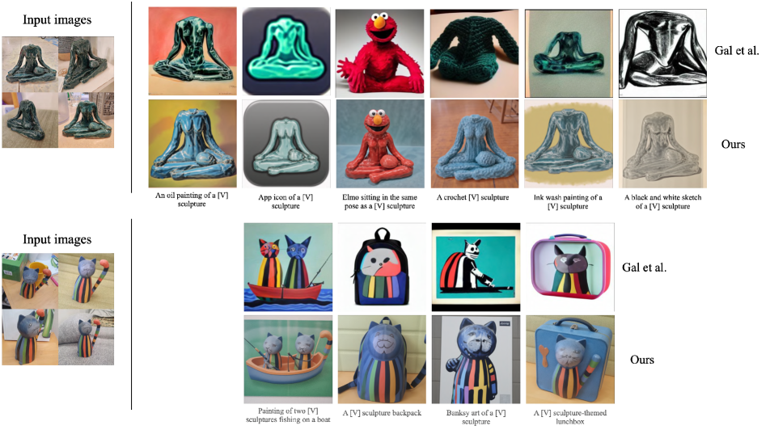

<figcaption>図22: Gal らの被写体・画像・プロンプトを使った彼らとの比較。我々のアプローチは独特な物体の意味的に正しいバリエーションを生成でき、より高い度合いの被写体特徴の保存を示す。入力画像は Gal らが提供。</figcaption>
</figure>

<figure>

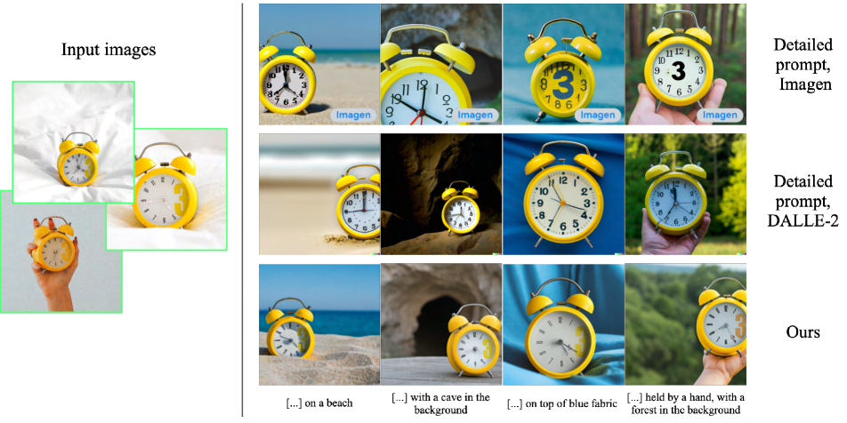

<figcaption>図23: 詳細なプロンプトエンジニアリングを用いた DALL-E 2・Imagen との比較。数回の試行錯誤の反復の後、DALL-E 2 と Imagen の結果生成に使った基本プロンプトは「retro style yellow alarm clock with a white clock face and a yellow number three on the right part of the clock face」で、被写体の時計を高度に記述する。一般に、大量のプロンプトエンジニアリングを行っても、プロンプトを使って被写体の見た目の細粒度の細部を制御するのは難しい。また、プロンプトの文脈の手がかりが被写体の見た目ににじみ出ること（例: 文脈が「on top of blue fabric」のとき文字盤に青い数字 3）も観察できる。画像クレジット（入力画像）: Unsplash。</figcaption>
</figure>

## Societal Impact（社会的影響）

本プロジェクトは、個人的な被写体（動物、物体）を異なる文脈で合成する効果的なツールをユーザーに提供することを目指す。一般的なテキスト画像モデルはテキストから画像を合成する際に特定の属性に偏りうるが、我々のアプローチはユーザーが望む被写体のより良い再構成を得ることを可能にする。逆に、悪意ある者がそうした画像を使って閲覧者を欺こうとするかもしれない。これは、他の生成モデルアプローチや内容操作技術にも存在する一般的な問題である。生成モデリング、特に個人化された生成事前分布に関する将来の研究は、これらの懸念を調査し再検証し続けねばならない。
