# 生成モデリングのためのフローマッチング（Flow Matching for Generative Modeling）

> 原題: Flow Matching for Generative Modeling
> 著者: Yaron Lipman¹², Ricky T. Q. Chen¹, Heli Ben-Hamu², Maximilian Nickel¹, Matt Le¹（¹ Meta AI (FAIR)、² Weizmann Institute of Science）
> 出典: ICLR 2023 / arXiv:2210.02747 ・ https://ar5iv.labs.arxiv.org/html/2210.02747

## Abstract（要旨）

我々は、連続正規化フロー（Continuous Normalizing Flows, CNFs）の上に構築された生成モデリングの新しいパラダイムを導入し、前例のない規模で CNF を学習できるようにする。具体的には、固定された条件付き確率パスのベクトル場を回帰することに基づく、CNF を学習するためのシミュレーション不要（simulation-free）なアプローチである**フローマッチング（Flow Matching, FM）** の概念を提示する。フローマッチングは、ノイズとデータサンプルの間を変換するガウス確率パスの一般族と互換性があり——これは既存の拡散パスを特定のインスタンスとして内包する。興味深いことに、FM を拡散パスとともに用いると、拡散モデルを学習するためのより頑健で安定した代替手段になることがわかった。さらに、フローマッチングは非拡散の確率パスで CNF を学習する道を開く。特に興味深いインスタンスは、最適輸送（Optimal Transport, OT）の変位補間（displacement interpolation）を用いて条件付き確率パスを定義することである。これらのパスは拡散パスより効率的で、より速い学習とサンプリングを提供し、より良い汎化をもたらす。ImageNet 上でフローマッチングを用いて CNF を学習すると、尤度とサンプル品質の両方で代替の拡散ベース手法より一貫して良い性能が得られ、既製の数値 ODE ソルバーを用いた高速で信頼性の高いサンプル生成が可能になる。

## 1 Introduction（はじめに）

深層生成モデルは、未知のデータ分布を推定しそこからサンプリングすることを目指す深層学習アルゴリズムのクラスである。例えば画像生成における生成モデリングの最近の驚くべき進歩の流入は、主に拡散ベースモデルのスケーラブルで比較的安定な学習によって促進されている。しかし、単純な拡散過程への制限は、サンプリング確率パスのかなり限られた空間につながり、非常に長い学習時間と、効率的なサンプリングのための専門的手法を採用する必要性をもたらす。

本研究では、連続正規化フロー（CNFs）の一般的で決定論的な枠組みを考える。CNF は任意の確率パスをモデリングでき、

<figure>

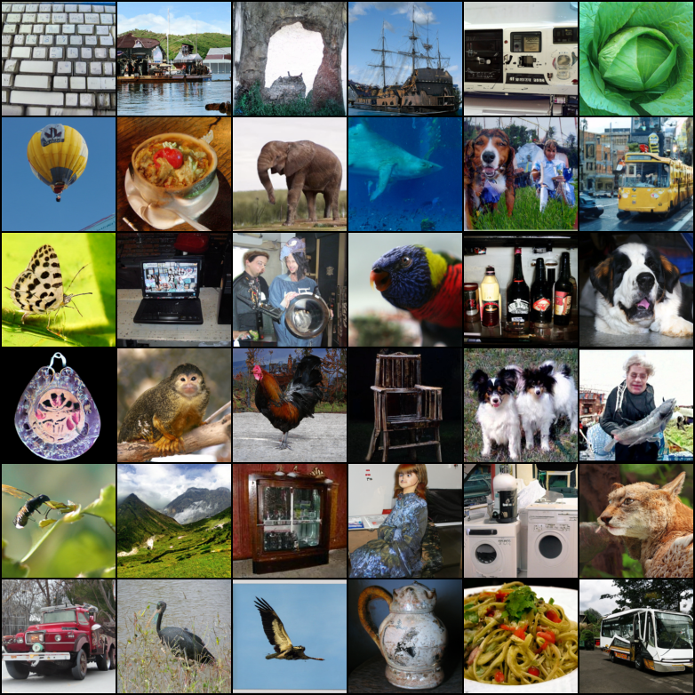

<figcaption>図1: Optimal Transport 確率パスを用いたフローマッチングで学習した CNF の無条件 ImageNet-128 サンプル。</figcaption>
</figure>

特に拡散過程がモデリングする確率パスを内包することが知られている。しかし、例えばノイズ除去スコアマッチングを介して効率的に学習できる拡散を除けば、スケーラブルな CNF 学習アルゴリズムは知られていない。実際、最尤学習は高価な数値 ODE シミュレーションを要し、既存のシミュレーション不要な手法は扱いにくい積分か、偏った勾配のいずれかを含む。

本研究の目標は、CNF モデルを学習する効率的なシミュレーション不要アプローチである**フローマッチング（FM）** を提案し、CNF 学習を監督するための一般的な確率パスの採用を可能にすることである。重要なことに、FM は拡散を超えたスケーラブルな CNF 学習の障壁を打ち破り、確率パスを直接扱うために拡散過程について推論する必要性を回避する。

特に、所望の確率パスを生成する目標ベクトル場へ回帰する単純で直感的な学習目的関数である**フローマッチング目的関数**（第 3 節）を提案する。まず、サンプルごとの（すなわち条件付き）定式化を通じてそのような目標ベクトル場を構築できることを示す。次に、ノイズ除去スコアマッチングに着想を得て、**条件付きフローマッチング（Conditional Flow Matching, CFM）** と名付けたサンプルごとの学習目的関数が等価な勾配を提供し、扱いにくい目標ベクトル場の明示的な知識を必要としないことを示す。さらに、フローマッチングに使えるサンプルごとの確率パスの一般族（第 4 節）を議論し、これは既存の拡散パスを特定のインスタンスとして内包する。拡散パス上でさえ、FM を用いるとより頑健で安定な学習が得られ、スコアマッチングと比べて優れた性能を達成することがわかった。さらに、この確率パスの族は特に興味深いケースも含む：**最適輸送（OT）の変位補間**に対応するベクトル場である。条件付き OT パスは拡散パスより単純で、拡散パスが曲がった軌道になるのに対し直線軌道を形成する。これらの性質は経験的に、より速い学習・より速い生成・より良い性能に翻訳されるようである。

我々はフローマッチングと OT パスによる構築を、大規模で非常に多様な画像データセットである ImageNet で経験的に検証する。尤度推定とサンプル品質の両方で、競合する拡散ベース手法の中で好ましい性能を達成するモデルを容易に学習できることがわかった。さらに、我々のモデルは先行手法と比べて計算コストとサンプル品質のより良いトレードオフを生む。図 1 はモデルから選んだ無条件 ImageNet 128×128 サンプルを示す。

## 2 Preliminaries: Continuous Normalizing Flows（予備知識: 連続正規化フロー）

$\mathbb{R}^{d}$ をデータ点 $x=(x^{1},\ldots,x^{d})\in\mathbb{R}^{d}$ を持つデータ空間とする。本論文で用いる 2 つの重要な対象は、**確率密度パス（probability density path）** $p:[0,1]\times\mathbb{R}^{d}\rightarrow\mathbb{R}_{>0}$（時間依存の確率密度関数、すなわち $\int p_{t}(x)dx=1$）と、**時間依存ベクトル場（time-dependent vector field）** $v:[0,1]\times\mathbb{R}^{d}\rightarrow\mathbb{R}^{d}$ である。ベクトル場 $v_{t}$ は、**フロー（flow）** と呼ばれる時間依存の微分同相写像 $\phi:[0,1]\times\mathbb{R}^{d}\rightarrow\mathbb{R}^{d}$ を、次の常微分方程式（ODE）を介して構築するのに使える。

$$
\frac{d}{dt}\phi_{t}(x)=v_{t}(\phi_{t}(x)),\qquad \phi_{0}(x)=x \tag{1}
$$

Chen ら（2018）は、ベクトル場 $v_{t}$ をニューラルネットワーク $v_{t}(x;\theta)$（$\theta\in\mathbb{R}^{p}$ は学習可能パラメータ）でモデリングすることを提案し、これがフロー $\phi_{t}$ の深層パラメトリックモデルである **連続正規化フロー（Continuous Normalizing Flow, CNF）** につながる。CNF は、単純な事前密度 $p_{0}$（例: 純粋なノイズ）を、より複雑な密度 $p_{1}$ へ、push-forward 方程式

$$
p_{t}=[\phi_{t}]_{*}p_{0} \tag{3}
$$

を介して変形するのに使われる。push-forward（または変数変換）演算子 $*$ は次で定義される。

$$
[\phi_{t}]_{*}p_{0}(x)=p_{0}(\phi_{t}^{-1}(x))\det\left[\frac{\partial\phi_{t}^{-1}}{\partial x}(x)\right]. \tag{4}
$$

ベクトル場 $v_{t}$ は、そのフロー $\phi_{t}$ が式 3 を満たすとき、確率密度パス $p_{t}$ を*生成する（generate）* という。ベクトル場が確率パスを生成するか検証する実用的な方法の 1 つは、我々の証明の鍵となる連続方程式（continuity equation）を用いることである（付録 B 参照）。CNF についての追加情報、特に任意の点 $x\in\mathbb{R}^{d}$ での確率 $p_{1}(x)$ の計算方法は付録 C で再掲する。

## 3 Flow Matching（フローマッチング）

$x_{1}$ を、未知のデータ分布 $q(x_{1})$ に従う確率変数とする。$q(x_{1})$ からのデータサンプルにのみアクセスでき、密度関数そのものにはアクセスできないと仮定する。さらに、$p_{0}=p$ が単純な分布（例: 標準正規分布 $p(x)={\mathcal{N}}(x|0,I)$）で、$p_{1}$ が分布として $q$ にほぼ等しいような確率パス $p_{t}$ とする。そのようなパスをどう構築するかは後で議論する。フローマッチング目的関数は、この目標確率パスに一致するよう設計され、$p_{0}$ から $p_{1}$ へ流れることを可能にする。

目標確率密度パス $p_{t}(x)$ と、それを生成する対応するベクトル場 $u_{t}(x)$ が与えられたとき、**フローマッチング（FM）目的関数**を次で定義する。

$$
\mathcal{L}_{\text{FM}}(\theta)=\mathbb{E}_{t,p_{t}(x)}\|v_{t}(x)-u_{t}(x)\|^{2}, \tag{5}
$$

ここで $\theta$ は CNF ベクトル場 $v_{t}$ の学習可能パラメータ、$t\sim{\mathcal{U}}[0,1]$（一様分布）、$x\sim p_{t}(x)$。簡単に言えば、FM 損失はベクトル場 $u_{t}$ をニューラルネットワーク $v_{t}$ で回帰する。損失ゼロに達すると、学習された CNF モデルは $p_{t}(x)$ を生成する。

フローマッチングは単純で魅力的な目的関数だが、素朴にそのまま使うのは実用上扱いにくい。なぜなら適切な $p_{t}$ と $u_{t}$ が何かの事前知識がないからである。$p_{1}(x)\approx q(x)$ を満たす確率パスの選択は多数あり、さらに重要なことに、所望の $p_{t}$ を生成する閉形式の $u_{t}$ に一般にアクセスできない。本節では、*サンプルごと*にのみ定義される確率パスとベクトル場を用いて $p_{t}$ と $u_{t}$ の両方を構築でき、適切な集約方法が所望の $p_{t}$ と $u_{t}$ を提供することを示す。さらに、この構築はフローマッチングのためのはるかに扱いやすい目的関数を作ることを可能にする。

### 3.1 条件付き確率パスとベクトル場から $p_t,u_t$ を構築する

目標確率パスを構築する単純な方法は、より単純な確率パスの混合を介することである。特定のデータサンプル $x_{1}$ が与えられたとき、$t=0$ で $p_{0}(x|x_{1})=p(x)$ を満たし、$t=1$ で $p_{1}(x|x_{1})$ が $x=x_{1}$ の周りに集中する分布（例: $p_{1}(x|x_{1})={\mathcal{N}}(x|x_{1},\sigma^{2}I)$、平均 $x_{1}$ で十分小さい標準偏差 $\sigma>0$ の正規分布）になるよう設計する**条件付き確率パス（conditional probability path）** $p_{t}(x|x_{1})$ を表記する。条件付き確率パスを $q(x_{1})$ で周辺化すると、**周辺確率パス（marginal probability path）** が得られる。

$$
p_{t}(x)=\int p_{t}(x|x_{1})q(x_{1})dx_{1}, \tag{6}
$$

特に $t=1$ で周辺確率 $p_{1}$ はデータ分布 $q$ に近く近似する混合分布になる。

$$
p_{1}(x)=\int p_{1}(x|x_{1})q(x_{1})dx_{1}\approx q(x). \tag{7}
$$

興味深いことに、次の意味で条件付きベクトル場を「周辺化」することで、**周辺ベクトル場（marginal vector field）** も定義できる（すべての $t$ と $x$ で $p_{t}(x)>0$ と仮定する）。

$$
u_{t}(x)=\int u_{t}(x|x_{1})\frac{p_{t}(x|x_{1})q(x_{1})}{p_{t}(x)}dx_{1}, \tag{8}
$$

ここで $u_{t}(\cdot|x_{1}):\mathbb{R}^{d}\rightarrow\mathbb{R}^{d}$ は $p_{t}(\cdot|x_{1})$ を生成する条件付きベクトル場である。一見明らかでないが、条件付きベクトル場をこのように集約することは、実際に周辺確率パスをモデリングする正しいベクトル場をもたらす。

我々の第 1 の鍵となる観察はこれである：

*周辺ベクトル場（式 8）は周辺確率パス（式 6）を生成する。*

これは条件付き VF（条件付き確率パスを生成するもの）と周辺 VF（周辺確率パスを生成するもの）の間の驚くべき関係を提供する。この関係により、未知で扱いにくい周辺 VF を、単一のデータサンプルにのみ依存するため定義がはるかに単純な、より単純な条件付き VF へ分解できる。これを次の定理に定式化する。

###### 定理 1.

条件付き確率パス $p_{t}(x|x_{1})$ を生成するベクトル場 $u_{t}(x|x_{1})$ が与えられたとき、任意の分布 $q(x_{1})$ について、式 8 の周辺ベクトル場 $u_{t}$ は式 6 の周辺確率パス $p_{t}$ を生成する。すなわち $u_{t}$ と $p_{t}$ は連続方程式（式 26）を満たす。

我々の定理の完全な証明はすべて付録 A に提供する。定理 1 は、拡散 SDE の周辺ドリフト・拡散係数の公式を提供する Diffusion Mixture Representation Theorem からも導ける。

### 3.2 Conditional Flow Matching（条件付きフローマッチング）

残念ながら、周辺確率パスと VF（式 6 と 8）の定義における扱いにくい積分のため、$u_{t}$ を計算することは依然扱いにくく、結果として元のフローマッチング目的関数の不偏推定量を素朴に計算することも扱いにくい。代わりに、驚くべきことに元の目的関数と同じ最適解をもたらす、より単純な目的関数を提案する。具体的には、**条件付きフローマッチング（CFM）目的関数**を考える。

$$
\mathcal{L}_{\text{CFM}}(\theta)=\mathbb{E}_{t,q(x_{1}),p_{t}(x|x_{1})}\big{\|}v_{t}(x)-u_{t}(x|x_{1})\big{\|}^{2}, \tag{9}
$$

ここで $t\sim{\mathcal{U}}[0,1]$、$x_{1}\sim q(x_{1})$、そして今度は $x\sim p_{t}(x|x_{1})$。FM 目的関数と異なり、CFM 目的関数は、$p_{t}(x|x_{1})$ から効率的にサンプリングし $u_{t}(x|x_{1})$ を計算できる限り、不偏推定値を容易にサンプリングできる。両者ともサンプルごとに定義されるので容易に行える。したがって我々の第 2 の鍵となる観察は：

*FM（式 5）と CFM（式 9）の目的関数は $\theta$ に関して同一の勾配を持つ。*

すなわち、CFM 目的関数を最適化することは（期待値として）FM 目的関数を最適化することと等価である。結果として、周辺確率パスや周辺ベクトル場のいずれにもアクセスすることなく、周辺確率パス $p_{t}$——特に $t=1$ で未知のデータ分布 $q$ を近似する——を生成する CNF を学習できる。適切な*条件付き*確率パスとベクトル場を設計するだけでよい。この性質を次の定理に定式化する。

###### 定理 2.

すべての $x\in\mathbb{R}^{d}$ と $t\in[0,1]$ で $p_{t}(x)>0$ と仮定すると、$\theta$ に依存しない定数を除いて ${\mathcal{L}}_{\text{CFM}}$ と ${\mathcal{L}}_{\text{FM}}$ は等しい。したがって $\nabla_{\theta}\mathcal{L}_{\text{FM}}(\theta)=\nabla_{\theta}\mathcal{L}_{\text{CFM}}(\theta)$。

## 4 Conditional Probability Paths and Vector Fields（条件付き確率パスとベクトル場）

条件付きフローマッチング目的関数は、条件付き確率パスと条件付きベクトル場の任意の選択で機能する。本節では、ガウス条件付き確率パスの一般族について $p_{t}(x|x_{1})$ と $u_{t}(x|x_{1})$ の構築を議論する。すなわち、次の形の条件付き確率パスを考える。

$$
p_{t}(x|x_{1})={\mathcal{N}}(x\,|\,\mu_{t}(x_{1}),\sigma_{t}(x_{1})^{2}I), \tag{10}
$$

ここで $\mu:[0,1]\times\mathbb{R}^{d}\rightarrow\mathbb{R}^{d}$ はガウス分布の時間依存平均、$\sigma:[0,1]\times\mathbb{R}\rightarrow\mathbb{R}_{>0}$ は時間依存のスカラー標準偏差（std）を表す。$\mu_{0}(x_{1})=0$ かつ $\sigma_{0}(x_{1})=1$ と設定し、すべての条件付き確率パスが $t=0$ で同じ標準ガウスノイズ分布 $p(x)={\mathcal{N}}(x|0,I)$ に収束するようにする。次に $\mu_{1}(x_{1})=x_{1}$ かつ $\sigma_{1}(x_{1})=\sigma_{\text{min}}$ と設定し、$\sigma_{\text{min}}$ を十分小さくして $p_{1}(x|x_{1})$ が $x_{1}$ を中心とする集中したガウス分布になるようにする。

任意の特定の確率パスを生成するベクトル場は無限に存在するが（例: 連続方程式に発散ゼロ成分を加えることで、式 26 参照）、その大多数は基礎となる分布を不変に保つ成分（例: 分布が回転不変なときの回転成分）の存在によるもので、不要な余分な計算につながる。我々はガウス分布の正準変換に対応する最も単純なベクトル場を用いることにする。具体的には、（$x_{1}$ で条件付けた）フローを考える。

$$
\psi_{t}(x)=\sigma_{t}(x_{1})x+\mu_{t}(x_{1}). \tag{11}
$$

$x$ が標準ガウスに従うとき、$\psi_{t}(x)$ は平均 $\mu_{t}(x_{1})$・std $\sigma_{t}(x_{1})$ の正規分布する確率変数へ写すアフィン変換である。すなわち式 4 によれば、$\psi_{t}$ はノイズ分布 $p_{0}(x|x_{1})=p(x)$ を $p_{t}(x|x_{1})$ へ push する。

$$
\left[\psi_{t}\right]_{*}p(x)=p_{t}(x|x_{1}). \tag{12}
$$

このフローは条件付き確率パスを生成するベクトル場を提供する。

$$
\frac{d}{dt}\psi_{t}(x)=u_{t}(\psi_{t}(x)|x_{1}). \tag{13}
$$

$p_{t}(x|x_{1})$ を $x_{0}$ だけで再パラメータ化し、式 13 を CFM 損失に代入すると次を得る。

$$
{\mathcal{L}}_{\text{CFM}}(\theta)=\mathbb{E}_{t,q(x_{1}),p(x_{0})}\Big{\|}v_{t}(\psi_{t}(x_{0}))-\frac{d}{dt}\psi_{t}(x_{0})\Big{\|}^{2}. \tag{14}
$$

$\psi_{t}$ は単純な（可逆な）アフィン写像なので、式 13 を使って $u_{t}$ を閉形式で解ける。時間依存関数 $f$ について $f^{\prime}=\frac{d}{dt}f$ と表記する。

###### 定理 3.

$p_{t}(x|x_{1})$ を式 10 のガウス確率パス、$\psi_{t}$ をその対応するフロー写像（式 11）とする。すると $\psi_{t}$ を定義する一意なベクトル場は次の形を持つ。

$$
u_{t}(x|x_{1})=\frac{\sigma^{\prime}_{t}(x_{1})}{\sigma_{t}(x_{1})}\left(x-\mu_{t}(x_{1})\right)+\mu^{\prime}_{t}(x_{1}). \tag{15}
$$

したがって $u_{t}(x|x_{1})$ はガウスパス $p_{t}(x|x_{1})$ を生成する。

### 4.1 ガウス条件付き確率パスの特別なインスタンス

我々の定式化は任意の関数 $\mu_{t}(x_{1})$ と $\sigma_{t}(x_{1})$ について完全に一般的であり、所望の境界条件を満たす任意の微分可能関数に設定できる。まず、従来用いられた拡散過程に対応する確率パスを回復する特別なケースを議論する。我々は確率パスを直接扱うので、拡散過程について推論することを完全にやめられる。したがって、以下の 2 番目の例では、興味深いインスタンスとして Wasserstein-2 最適輸送解に基づく確率パスを直接定式化する。

#### Example I: Diffusion conditional VFs（拡散の条件付き VF）

拡散モデルはデータ点から始め、純粋なノイズに近似するまで徐々にノイズを加える。これらは確率過程として定式化でき、任意の時刻 $t$ で閉形式表現を得るための厳しい要件を持ち、特定の平均 $\mu_{t}(x_{1})$ と std $\sigma_{t}(x_{1})$ を持つガウス条件付き確率パス $p_{t}(x|x_{1})$ をもたらす。例えば、逆向き（ノイズ→データ）の分散爆発（VE）パスは次の形を持つ。

$$
p_{t}(x)={\mathcal{N}}(x|x_{1},\sigma_{1-t}^{2}I), \tag{16}
$$

ここで $\sigma_{t}$ は増加関数で、$\sigma_{0}=0$、$\sigma_{1}\gg 1$。式 16 は $\mu_{t}(x_{1})=x_{1}$ と $\sigma_{t}(x_{1})=\sigma_{1-t}$ の選択を提供する。これらを定理 3 の式 15 に代入すると次を得る。

$$
u_{t}(x|x_{1})=-\frac{\sigma^{\prime}_{1-t}}{\sigma_{1-t}}(x-x_{1}). \tag{17}
$$

逆向き（ノイズ→データ）の分散保存（VP）拡散パスは次の形を持つ。

$$
p_{t}(x|x_{1})={\mathcal{N}}(x\,|\,\alpha_{1-t}x_{1},\left(1-\alpha_{1-t}^{2}\right)I),\quad\text{where }\alpha_{t}=e^{-\frac{1}{2}T(t)},\ T(t)=\int_{0}^{t}\beta(s)ds, \tag{18}
$$

$\beta$ はノイズスケール関数である。式 18 は $\mu_{t}(x_{1})=\alpha_{1-t}x_{1}$ と $\sigma_{t}(x_{1})=\sqrt{1-\alpha_{1-t}^{2}}$ の選択を提供する。これらを定理 3 の式 15 に代入すると次を得る。

$$
u_{t}(x|x_{1})=\frac{\alpha^{\prime}_{1-t}}{1-\alpha^{2}_{1-t}}\left(\alpha_{1-t}x-x_{1}\right)=-\frac{T^{\prime}(1-t)}{2}\left[\frac{e^{-T(1-t)}x-e^{-\frac{1}{2}T(1-t)}x_{1}}{1-e^{-T(1-t)}}\right]. \tag{19}
$$

我々の条件付き VF $u_{t}(x|x_{1})$ の構築は、これらの条件付き拡散過程に制限したとき、実際に従来の決定論的確率フロー（Song ら, 式 13）で用いられたベクトル場と一致する（詳細は付録 D）。とはいえ、拡散条件付き VF をフローマッチング目的関数と組み合わせることは、既存のスコアマッチングアプローチに対する魅力的な学習の代替——我々の実験ではより安定で頑健——を提供する。

もう 1 つの重要な観察は、これらの確率パスが従来拡散過程の解として導かれたため、有限時間で真のノイズ分布に達しないことである。実際には $p_{0}(x)$ はサンプリングと尤度評価のため適切なガウス分布で単に近似される。対照的に、我々の構築は確率パスを完全に制御でき、次に行うように $\mu_{t}$ と $\sigma_{t}$ を直接設定できる。

<figure>

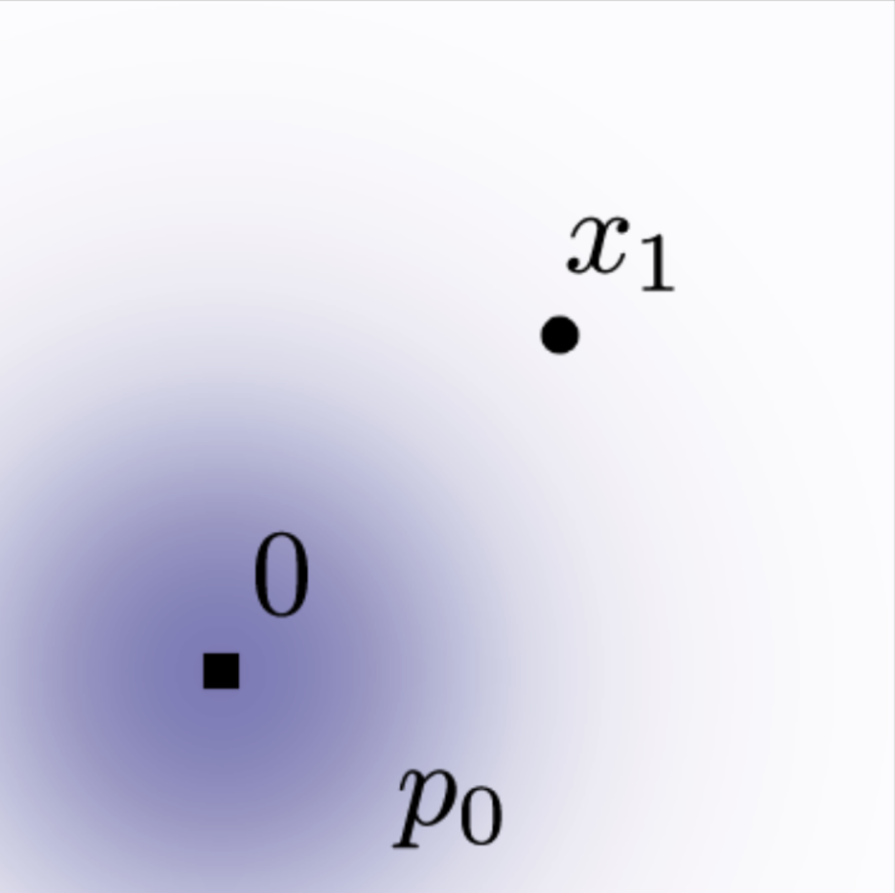

<figcaption>図2: 拡散の条件付きスコア関数（典型的な拡散手法の回帰目標）∇log pₜ(x|x₁) と、OT 条件付き VF の比較。開始（p₀）と終了（p₁）のガウスは両例で同一。OT VF は時間方向に一定の向きを持ち、より単純な回帰タスクになる。（t=0.0 の状態）</figcaption>
</figure>

#### Example II: Optimal Transport conditional VFs（最適輸送の条件付き VF）

条件付き確率パスのおそらくより自然な選択は、平均と std を単に時間に線形に変化させることである。すなわち、

$$
\mu_{t}(x)=tx_{1},\quad \sigma_{t}(x)=1-(1-\sigma_{\text{min}})t. \tag{20}
$$

定理 3 によれば、このパスは次の VF で生成される。

$$
u_{t}(x|x_{1})=\frac{x_{1}-(1-\sigma_{\text{min}})x}{1-(1-\sigma_{\text{min}})t}, \tag{21}
$$

これは拡散の条件付き VF（式 19）と対照的に、すべての $t\in[0,1]$ で定義される。$u_{t}(x|x_{1})$ に対応する条件付きフローは

$$
\psi_{t}(x)=(1-(1-\sigma_{\text{min}})t)x+tx_{1}, \tag{22}
$$

であり、この場合 CFM 損失（式 9, 14 参照）は次の形を取る。

$$
{\mathcal{L}}_{\text{CFM}}(\theta)=\mathbb{E}_{t,q(x_{1}),p(x_{0})}\Big{\|}v_{t}(\psi_{t}(x_{0}))-\Big{(}x_{1}-(1-\sigma_{\min})x_{0}\Big{)}\Big{\|}^{2}. \tag{23}
$$

平均と std を線形に変化させることは、単純で直感的なパスにつながるだけでなく、実際に次の意味で最適でもある。条件付きフロー $\psi_{t}(x)$ は実は 2 つのガウス $p_{0}(x|x_{1})$ と $p_{1}(x|x_{1})$ の間の最適輸送（OT）*変位写像（displacement map）* である。OT *補間（interpolant）*（確率パス）は次で定義される。

$$
p_{t}=[(1-t)\mathrm{id}+t\psi]_{\star}p_{0}, \tag{24}
$$

ここで $\psi:\mathbb{R}^{d}\rightarrow\mathbb{R}^{d}$ は $p_{0}$ を $p_{1}$ へ push する OT 写像、$\mathrm{id}$ は恒等写像、$(1-t)\mathrm{id}+t\psi$ は OT 変位写像と呼ばれる。我々の場合（最初が標準である 2 つのガウス）では、OT 変位写像は式 22 の形を取る。

<figure>

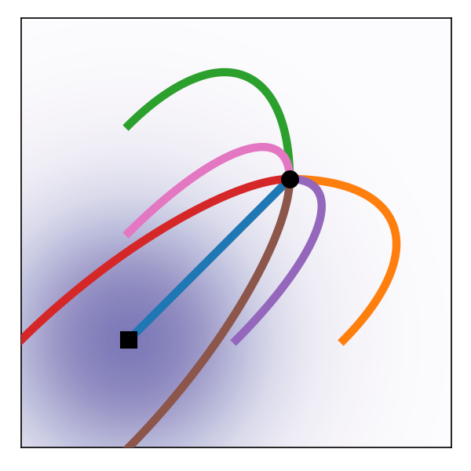

<figcaption>図3: 拡散と OT の軌道。</figcaption>
</figure>

直感的には、OT 変位写像の下で粒子は常に直線軌道を一定速度で動く。図 3 は拡散と OT 条件付き VF のサンプリングパスを描く。興味深いことに、拡散パスからのサンプリング軌道は最終サンプルを「オーバーシュート」し、不要な後戻りをもたらすのに対し、OT パスは直線を保つことが保証される。図 2 は、拡散の条件付きスコア関数（典型的な拡散手法の回帰目標）すなわち $\nabla\log p_{t}(x|x_{1})$（$p_{t}$ は式 18）と、OT 条件付き VF（式 21）を比較する。両例で開始（$p_{0}$）と終了（$p_{1}$）のガウスは同一である。興味深い観察は、OT VF が時間方向に一定の向きを持ち、これがおそらくより単純な回帰タスクにつながることである。この性質は式 21 から直接検証でき、VF が $u_{t}(x|x_{1})=g(t)h(x|x_{1})$ の形で書ける。付録の図 8 は拡散 VF の可視化を示す。最後に、条件付きフローが最適でも、これは決して周辺 VF が最適輸送解であることを意味しないことに注意する。とはいえ、周辺ベクトル場は比較的単純なままだと期待する。

## 5 Related Work（関連研究）

連続正規化フローは、正規化フローの連続時間版として Chen ら（2018）で導入された。元来 CNF は最尤目的関数で学習されるが、これは順方向・逆方向伝播に高価な ODE シミュレーションを要し、ODE シミュレーションの逐次的性質のため高い時間計算量になる。一部の研究は CNF 生成モデルの画像合成能力を実証したが、非常に高次元の画像へのスケールアップは本質的に難しい。多くの研究が ODE を解きやすく正則化しようと試みた（拡張、正則化項の追加、積分区間の確率的サンプリングなど）が、これらは ODE を正則化することを目指すだけで基本的な学習アルゴリズムは変えない。

CNF 学習を高速化するため、一部の研究は目標確率パスと力学を明示的に設計してシミュレーション不要な CNF 学習枠組みを開発した。例えば、ある研究は事前分布と目標密度の間の線形補間を考えたが高次元で推定が難しい積分を含み、別の研究は本研究と同様の一般確率パスを考えたが確率的ミニバッチ域で偏った勾配に苦しむ。対照的に、フローマッチング枠組みは不偏勾配でシミュレーション不要な学習を可能にし、非常に高次元へ容易にスケールする。

シミュレーション不要な学習へのもう 1 つのアプローチは、目標確率パスを間接的に定義するための拡散過程の構築に頼る。Song ら（Score-SDE）は拡散モデルがノイズ除去スコアマッチング（スコアマッチング目的関数に関して不偏勾配を提供する条件付き目的関数）で学習されることを示した。条件付きフローマッチングはこの結果に着想を得ているが、ベクトル場を直接マッチングすることに一般化する。スケーラビリティの容易さのため拡散モデルは注目を集め、損失再スケーリング・分類器ガイダンスとアーキテクチャ改良・ノイズスケジュールの学習など多様な改善を生んだ。しかし一部の研究は単一パラメータの単純な拡散過程で定義されるガウス条件付きパスの限定的設定のみを考え、特に我々の条件付き OT パスを含まない。別系統では、拡散ブリッジ理論を介した有限時間拡散構築により、無限時間ノイズ除去構築が招く近似誤差を解決する研究がある。既存研究は拡散過程と同じ確率パスを持つ連続正規化フローの間の関係を活用するが、我々の研究は単純な拡散がモデリングする確率パスのクラスを超えて一般化できる。我々の研究では、拡散過程の構築を完全に回避し、確率パスを直接扱って推論しつつ、効率的な学習と対数尤度評価を保持できる。最後に、我々の研究と同時期に、いくつかの研究がシミュレーション不要 CNF 学習のための類似の条件付き目的関数に到達した。

<figure>

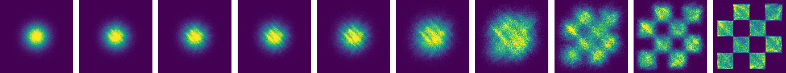

<figcaption>図4: （左）2D checkerboard データで異なる目的関数で学習した CNF の軌道。OT パスは checkerboard パターンをずっと早く導入し、FM はより安定な学習をもたらす。（右）FM と OT はより効率的なサンプリングをもたらし、midpoint 法で解いている。</figcaption>
</figure>

## 6 Experiments（実験）

CIFAR-10 と解像度 32・64・128 の ImageNet という画像データセットでフローマッチングを用いる経験的利点を探る。フローマッチングにおける拡散パスの選択、特に標準的な分散保存拡散パスと最適輸送パスの間もアブレーションする。生成ベクトル場を直接パラメータ化しフローマッチング目的関数を用いることでサンプル生成がどう改善されるかを議論する。最後に、フローマッチングが条件付き生成設定でも使えることを示す。特記なき限り、絶対・相対許容度 1e-5 の dopri5 を用いてモデルの尤度とサンプルを評価する。生成サンプルは付録に、実装詳細はすべて付録 E にある。

**表1**: 同じモデルを異なる手法で学習したときの尤度（BPD）・生成サンプル品質（FID）・評価時間（NFE）。

| Model | CIFAR-10 NLL↓ | FID↓ | NFE↓ | ImageNet32 NLL↓ | FID↓ | NFE↓ | ImageNet64 NLL↓ | FID↓ | NFE↓ |
| --- | --- | --- | --- | --- | --- | --- | --- | --- | --- |
| **Ablations** | | | | | | | | | |
| DDPM | 3.12 | 7.48 | 274 | 3.54 | 6.99 | 262 | 3.32 | 17.36 | 264 |
| Score Matching | 3.16 | 19.94 | 242 | 3.56 | 5.68 | 178 | 3.40 | 19.74 | 441 |
| ScoreFlow | 3.09 | 20.78 | 428 | 3.55 | 14.14 | 195 | 3.36 | 24.95 | 601 |
| **Ours** | | | | | | | | | |
| FM w/ Diffusion | 3.10 | 8.06 | 183 | 3.54 | 6.37 | 193 | 3.33 | 16.88 | 187 |
| FM w/ OT | **2.99** | **6.35** | **142** | 3.53 | **5.02** | **122** | **3.31** | **14.45** | **138** |

**表1（右, ImageNet 128×128）**:

| Model | NLL↓ | FID↓ |
| --- | --- | --- |
| MGAN | – | 58.9 |
| PacGAN2 | – | 57.5 |
| Logo-GAN-AE | – | 50.9 |
| Self-cond. GAN | – | 41.7 |
| Uncond. BigGAN | – | 25.3 |
| PGMGAN | – | 21.7 |
| FM w/ OT | **2.90** | 20.9 |

### 6.1 Density Modeling and Sample Quality on ImageNet（ImageNet での密度モデリングとサンプル品質）

まず同じモデルアーキテクチャ（Dhariwal & Nichol の U-Net を最小限の変更で）を、CIFAR-10 と ImageNet 32/64 で異なる人気の拡散ベース損失（DDPM、Score Matching (SM)、Score Flow (SF)）で学習して比較する（正確な詳細は付録 E.1）。表 1（左）は、負の対数尤度（NLL、bits per dimension, BPD 単位）、Frechet Inception Distance（FID）で測ったサンプル品質、適応ソルバーが所定の数値許容度に達するのに要する平均関数評価回数（NFE、5 万サンプルで平均）をベースラインとともにまとめる。全モデルは同じアーキテクチャ・ハイパーパラメータ値・学習イテレーション数で学習し、ベースラインはより良い収束のためより多くのイテレーションを許す。これらは*無条件*モデルである。CIFAR-10 と ImageNet の両方で、FM-OT はすべての定量指標で競合手法と比べ一貫して最良の結果を得る。CIFAR-10 で通常より高い FID 性能に気づくが、これは用いたアーキテクチャが CIFAR-10 に最適化されていないことで説明できる可能性がある。

第二に、表 1（右）は ImageNet 解像度 128×128 で OT パスのフローマッチングで学習したモデルを比較する。我々の FID は、自己教師あり ResNet50 モデルで条件付けする IC-GAN（このため表から除外）を除いて最先端である。付録の図 11、12、13 はこれらのモデルからの非キュレートサンプルを示す。

<figure>

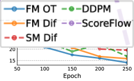

<figcaption>図5: 学習中の画像品質、ImageNet 64×64。</figcaption>
</figure>

**より速い学習。** 既存研究は拡散モデルを非常に多くのイテレーション（例: ScoreFlow と VDM はそれぞれ 130 万・1000 万イテレーションを報告）で学習するが、フローマッチングは一般にずっと速く収束することがわかった。図 5 は ImageNet 64×64 のフローマッチングと全ベースラインの学習中の FID 曲線を示す。FM-OT は代替より速く・より大きく FID を下げられる。ImageNet-128 では Dhariwal & Nichol がバッチサイズ 256 で 436 万イテレーション学習するのに対し、FM は（25% 大きいモデルで）バッチサイズ 1.5k で 50 万イテレーション、すなわち 33% 少ない画像スループットで済む。さらに、スコアマッチングではモデルからのサンプリングコストが学習中に劇的に変化しうるのに対し、フローマッチングで学習するとサンプリングコストは一定のままである（付録の図 10）。

### 6.2 Sampling Efficiency（サンプリング効率）

<figure>

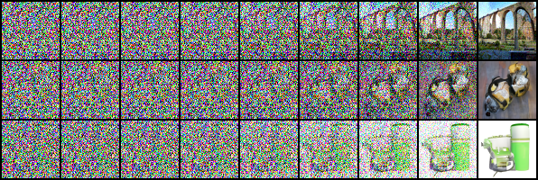

<figcaption>図6（Score Matching w/ Diffusion）: ImageNet-64 モデルから同一の乱数シードでのサンプル。OT パスモデルは拡散パスモデルより早く画像を生成し始める（拡散パスでは最後の時点までノイズが画像を支配する）。</figcaption>
</figure>

サンプリングでは、まずランダムなノイズサンプル $x_{0}\sim{\mathcal{N}}(0,I)$ を引き、学習した VF $v_{t}$ で区間 $t\in[0,1]$ にわたり式 1 を ODE ソルバーで解いて $\phi_{1}(x_{0})$ を計算する。拡散モデルは SDE 定式化でもサンプリングできるが、これは非常に非効率になりうるため、高速サンプラーを提案する多くの手法は ODE の視点を直接利用する（付録 D 参照）。これは一部、ODE ソルバーがより効率的（同程度の計算コストでより低い誤差）で、利用可能な ODE ソルバー方式が多数あるためである。我々のアブレーションモデルと比較すると、OT パスのフローマッチングで学習したモデルは、ODE ソルバーによらず常に最も効率的なサンプラーをもたらすことがわかった。

**サンプルパス。** まず拡散と OT のサンプリングパスの違いを定性的に可視化する。図 6 は同一の乱数シードを用いた ImageNet-64 モデルからのサンプルを示し、OT パスモデルが拡散パスモデルより早く画像を生成し始めることがわかる。2D の checkerboard パターン生成（図 4 左）でも確率密度パスを描き、同様の傾向に気づく。

**低コストサンプル。** 次に固定ステップソルバーに切り替え、表 1 の ImageNet-32 モデルで低（≤100）NFE サンプルを比較する。図 7（左）では、低 NFE 解と 1000 NFE 解のピクセルごとの MSE を比較し（256 のランダムノイズシードを用いる）、FM with OT モデルが計算コストの点で最良の数値誤差を生み、拡散モデルと同じ誤差閾値に達するのに約 60% の NFE しか要さないことに気づく。第二に、図 7（右）は計算コストの結果として FID がどう変化するかを示し、FM with OT が非常に低い NFE 値でもまともな FID を達成し、アブレーションモデルと比べてサンプル品質とコストのより良いトレードオフを生むことがわかる。

<figure>

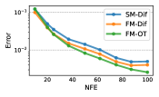

<figcaption>図7: フローマッチング、特に OT パスを用いると、同程度の数値誤差（左）とサンプル品質（右）を保ちつつ、より少ない評価回数でサンプリングできる。ImageNet 32×32 で学習したモデルの結果で、数値誤差は midpoint 法のもの。</figcaption>
</figure>

### 6.3 Conditional sampling from low-resolution images（低解像度画像からの条件付きサンプリング）

**表2**: ImageNet 検証セットでの画像超解像。

| Model | FID↓ | IS↑ | PSNR↑ | SSIM↑ |
| --- | --- | --- | --- | --- |
| Reference | 1.9 | 240.8 | – | – |
| Regression | 15.2 | 121.1 | 27.9 | 0.801 |
| SR3 | 5.2 | 180.1 | 26.4 | 0.762 |
| FM w/ OT | 3.4 | 200.8 | 24.7 | 0.747 |

最後に、条件付き画像生成、特に画像を 64×64 から 256×256 へアップサンプリングすることでフローマッチングを実験した。SR3 の評価手続きに従い、アップサンプリングした検証画像の FID を計算する。ベースラインは reference（元の検証セットの FID）と regression を含む。結果は表 2 にある。アップサンプリングした画像サンプルは付録の図 14、15 に示す。FM-OT は SR3 と同程度の PSNR・SSIM 値を達成しつつ、FID と IS を大幅に改善する。SR3 が論じるように、FID・IS は生成品質のより良い指標である。

## 7 Conclusion（結論）

我々は、条件付き構築に頼って非常に高次元へ容易にスケールする、連続正規化フローモデルを学習する新しいシミュレーション不要な枠組みであるフローマッチングを導入した。さらに、FM 枠組みは拡散モデルの別の見方を提供し、確率的/拡散構築を捨て、より直接的に確率パスを指定することを提案する。これにより、例えば高速サンプリングを可能にし／または生成を改善するパスを構築できる。我々はフローマッチング枠組みを用いるときの学習とサンプリングの容易さを実験的に示した。将来、FM が多種多様な確率パス（例: 非等方ガウスやより一般的なカーネル）を可能にする道を開くと期待する。

## Appendix A Theorem Proofs（定理の証明）

###### 定理 1 の証明.

これを検証するため、$p_{t}$ と $u_{t}$ が連続方程式（式 26）を満たすことを確認する。

$$
\frac{d}{dt}p_{t}(x)=\int\Big{(}\frac{d}{dt}p_{t}(x|x_{1})\Big{)}q(x_{1})dx_{1}=-\int\mathrm{div}\Big{(}u_{t}(x|x_{1})p_{t}(x|x_{1})\Big{)}q(x_{1})dx_{1}
$$

$$
=-\mathrm{div}\Big{(}\int u_{t}(x|x_{1})p_{t}(x|x_{1})q(x_{1})dx_{1}\Big{)}=-\mathrm{div}\Big{(}u_{t}(x)p_{t}(x)\Big{)},
$$

ここで第 2 の等号で $u_{t}(\cdot|x_{1})$ が $p_{t}(\cdot|x_{1})$ を生成する事実を、最後の等号で式 8 を用いた。第 1・第 3 の等号は被積分関数が Leibniz 則（積分と微分の交換）の正則性条件を満たすと仮定して正当化される。∎

###### 定理 2 の証明.

以下では、全積分の存在を保証し（Fubini の定理で）積分順序の変更を許すため、$q(x)$ と $p_{t}(x|x_{1})$ が $\left\|x\right\|\rightarrow\infty$ で十分速く 0 に減少し、$u_{t},v_{t},\nabla_{\theta}v_{t}$ が有界と仮定する。まず 2-ノルムの双線形性により $\|v_{t}(x)-u_{t}(x)\|^{2}=\left\|v_{t}(x)\right\|^{2}-2\langle v_{t}(x),u_{t}(x)\rangle+\left\|u_{t}(x)\right\|^{2}$、同様に条件付きについても成り立つ。$u_{t}$ は $\theta$ に依存しないことに注意し、

$$
\mathbb{E}_{p_{t}(x)}\|v_{t}(x)\|^{2}=\int\|v_{t}(x)\|^{2}p_{t}(x|x_{1})q(x_{1})dx_{1}dx=\mathbb{E}_{q(x_{1}),p_{t}(x|x_{1})}\|v_{t}(x)\|^{2},
$$

ここで式 6 と積分順序の変更を用いた。さらに、

$$
\mathbb{E}_{p_{t}(x)}\langle v_{t}(x),u_{t}(x)\rangle=\int\langle v_{t}(x),u_{t}(x|x_{1})\rangle p_{t}(x|x_{1})q(x_{1})dx_{1}dx=\mathbb{E}_{q(x_{1}),p_{t}(x|x_{1})}\langle v_{t}(x),u_{t}(x|x_{1})\rangle,
$$

ここで式 8 を代入し再び積分順序を変更した。したがって 2 つの目的関数は $\theta$ に依存しない定数を除いて等しく、勾配が一致する。∎

###### 定理 3 の証明.

記法簡略化のため $w_{t}(x)=u_{t}(x|x_{1})$ とする。式 1 より $\frac{d}{dt}\psi_{t}(x)=w_{t}(\psi_{t}(x))$。$\psi_{t}$ は可逆（$\sigma_{t}(x_{1})>0$）なので $x=\psi^{-1}(y)$ とおくと $\psi^{\prime}_{t}(\psi^{-1}(y))=w_{t}(y)$。$\psi_{t}$ を反転すると $\psi_{t}^{-1}(y)=\frac{y-\mu_{t}(x_{1})}{\sigma_{t}(x_{1})}$、$t$ で微分すると $\psi_{t}^{\prime}(x)=\sigma_{t}^{\prime}(x_{1})x+\mu_{t}^{\prime}(x_{1})$。これらを代入すると

$$
w_{t}(y)=\frac{\sigma^{\prime}_{t}(x_{1})}{\sigma_{t}(x_{1})}\left(y-\mu_{t}(x_{1})\right)+\mu_{t}^{\prime}(x_{1})
$$

が得られ、所望どおりである。∎

## Appendix B The continuity equation（連続方程式）

ベクトル場 $v_{t}$ が確率パス $p_{t}$ を生成するか検証する 1 つの方法は連続方程式である。これは、ベクトル場 $v_{t}$ が $p_{t}$ を生成することを保証する必要十分条件を提供する偏微分方程式（PDE）である。

$$
\frac{d}{dt}p_{t}(x)+\mathrm{div}(p_{t}(x)v_{t}(x))=0, \tag{26}
$$

ここで発散演算子 $\mathrm{div}$ は空間変数 $x=(x^{1},\ldots,x^{d})$ に関して定義される、すなわち $\mathrm{div}=\sum_{i=1}^{d}\frac{\partial}{\partial x^{i}}$。

## Appendix C Computing probabilities of the CNF model（CNF モデルの確率計算）

任意のデータ点 $x_{1}\in\mathbb{R}^{d}$ が与えられ、その点でのモデル確率 $p_{1}(x_{1})$ を計算する必要がある。以下、これがどう行えるかを、基本的な関連 ODE・発散計算のスケーリング・データ変換（例: データの中心化）・Bits-Per-Dimension 計算をカバーして再掲する。

#### $p_1(x_1)$ を計算する ODE

連続方程式と式 1 から瞬間変数変換（instantaneous change of variable）が導かれる。

$$
\frac{d}{dt}\log p_{t}(\phi_{t}(x))+\mathrm{div}(v_{t}(\phi_{t}(x)))=0. \tag{27}
$$

$t\in[0,1]$ で積分すると $\log p_{1}(\phi_{1}(x))-\log p_{0}(\phi_{0}(x))=-\int_{0}^{1}\mathrm{div}(v_{t}(\phi_{t}(x)))dt$。したがって対数確率はフロー軌道とともに次の ODE を解いて計算できる。

$$
\frac{d}{dt}\begin{bmatrix}\phi_{t}(x)\\ f(t)\end{bmatrix}=\begin{bmatrix}v_{t}(\phi_{t}(x))\\ -\mathrm{div}(v_{t}(\phi_{t}(x)))\end{bmatrix},\qquad \begin{bmatrix}\phi_{0}(x)\\ f(0)\end{bmatrix}=\begin{bmatrix}x_{0}\\ c\end{bmatrix}. \tag{28,29}
$$

$x_{1}=\phi_{1}(x)$ とおくと $f(1)=c+\log p_{1}(x_{1})-\log p_{0}(x_{0})$。任意の $x_{1}$ が与えられ $p_{1}(x_{1})$ を計算したいときは、この ODE を逆向きに解く。

$$
\frac{d}{ds}\begin{bmatrix}\phi_{1-s}(x)\\ f(1-s)\end{bmatrix}=\begin{bmatrix}-v_{1-s}(\phi_{1-s}(x))\\ \mathrm{div}(v_{1-s}(\phi_{1-s}(x)))\end{bmatrix} \tag{31}
$$

を、$s=0$ での初期条件 $[\phi_{1}(x),f(1)]^{T}=[x_{1},0]^{T}$（式 32）で $s\in[0,1]$ について解く。ODE の一意性から、結果は $c=\log p_{0}(x_{0})-\log p_{1}(x_{1})$ の場合の式 28 の解と同一になり、$f(0)=\log p_{0}(x_{0})-\log p_{1}(x_{1})$、したがって

$$
\log p_{1}(x_{1})=\log p_{0}(x_{0})-f(0). \tag{33}
$$

要約すると、$p_{1}(x_{1})$ を計算するにはまず式 31 を初期条件 式 32 で解き、式 33 を計算する。

#### $p_1(x_1)$ の不偏推定量

式 31 を解くには $\mathbb{R}^{d}$ の VF の $\mathrm{div}$ 計算が要り高価である。これを（不偏な）Hutchinson トレース推定量で置き換える。

$$
\frac{d}{ds}\begin{bmatrix}\phi_{1-s}(x)\\ \tilde{f}(1-s)\end{bmatrix}=\begin{bmatrix}-v_{1-s}(\phi_{1-s}(x))\\ z^{T}Dv_{1-s}(\phi_{1-s}(x))z\end{bmatrix}, \tag{34}
$$

ここで $z\in\mathbb{R}^{d}$ は $\mathbb{E}zz^{T}=I$ を満たす確率変数からのサンプル。式 34 を初期条件 式 32 で（実際には小さい制御された誤差で）厳密に解くと、$\mathbb{E}_z[\log p_0(x_0)-\tilde f(0)]=\log p_1(x_1)$ となる（Fubini の定理で積分順序を交換）。したがって確率変数 $\log p_{0}(x_{0})-\tilde{f}(0)$ は $\log p_{1}(x_{1})$ の不偏推定量である（式 35）。

#### 変換されたデータ

しばしば生成モデルの学習前にデータを変換する（例: スケール・並進）。この変換を $\varphi^{-1}:\mathbb{R}^{d}\rightarrow\mathbb{R}^{d}$ と表記し、生成モデルは合成 $\psi(x)=\varphi\circ\phi(x)$ になる（$\phi$ は学習するモデル）。事前確率 $p_{0}$ の push-forward は

$$
\log p_{1}(x)=\log\phi_{*}p_{0}(\varphi^{-1}(x))+\log\det\left[D\varphi^{-1}(x)\right]. \tag{36}
$$

画像では $d=H\times W\times 3$ で、各ピクセル値を $[-1,1]$ から $[0,256]$ へ写す変換 $\varphi(y)=2^{7}(y+1)$、$\varphi^{-1}(x)=2^{-7}x-1$ を考えると $\log p_{1}(x)=\log\phi_{*}p_{0}(\varphi^{-1}(x))-7d\log 2$。

#### Bits-Per-Dimension（BPD）計算

BPD は $\mathrm{BPD}=\mathbb{E}_{x_{1}}[-\frac{\log p_{1}(x_{1})}{d\log 2}]$ で定義される。式 36 より $\mathrm{BPD}=-\frac{\log\phi_{*}p_{0}(\varphi^{-1}(x))}{d\log 2}+7$ となり、$\log\phi_{*}p_{0}(\varphi^{-1}(x))$ は変換データ $\varphi^{-1}(x_{1})$ 上で式 35 の不偏推定量で近似する。大きなテストセットで不偏推定量を平均すればテストセット BPD の良い近似が得られる。

## Appendix D Diffusion conditional vector fields（拡散の条件付きベクトル場）

VE・VP 拡散パス（式 18）について確率フロー ODE（Song ら 式 13）を支配するベクトル場を導出し、それが定理 3 で導いた条件付きベクトル場（式 16・19）と一致することを示す。拡散文献では拡散過程が時刻 $t=0$ のデータから $t=1$ のノイズへ走るので、それを我々の慣習（$t=0$ がノイズ、$t=1$ がデータ）へ翻訳する次の補題が要る。

###### 補題 1.

ベクトル場 $u_{t}(x)$ が確率密度パス $p_{t}(x)$ を生成するフローを考える。すると、ベクトル場 $\tilde{u}_{t}(x)=-u_{1-t}(x)$ は、$\tilde{p}_{0}(x)=p_{1}(x)$ から始めたとき、パス $\tilde{p}_{t}(x)=p_{1-t}(x)$ を生成する。（証明: 連続方程式を用いて $\frac{d}{dt}\tilde p_t = -\mathrm{div}(\tilde p_t(-u_{1-t}))$ を示す。∎）

#### Fokker-Planck 確率パスの条件付き VF

標準形の SDE $dy=f_{t}dt+g_{t}dw$ を考える。解 $y_{t}$ の確率密度 $p_{t}(y_{t})$ は Fokker-Planck 方程式 $\frac{dp_{t}}{dt}=-\mathrm{div}(f_{t}p_{t})+\frac{g_{t}^{2}}{2}\Delta p_{t}$ で特徴づけられる。これを連続方程式の形に書き換えると、ベクトル場

$$
w_{t}=f_{t}-\frac{g_{t}^{2}}{2}\nabla\log p_{t} \tag{40}
$$

が確率パス $p_{t}$ と連続方程式を満たし、したがって $p_{t}$ を生成する。

#### Variance Exploding（VE）path

VE パスの SDE は $dy=\sqrt{\frac{d}{dt}\sigma_{t}^{2}}dw$（$\sigma_{0}=0$、$t\to1$ で無限大に増加）。データ $y_0$（$t=0$）からノイズ $y_1$（$t=1$）へ動き、確率パス $p_{t}(y|y_{0})={\mathcal{N}}(y|y_{0},\sigma^{2}_{t}I)$。式 40 による条件付き VF は $w_{t}(y|y_{0})=\frac{\sigma_{t}^{\prime}}{\sigma_{t}}(y-y_{0})$。補題 1 で時間反転すると、$\tilde{p}_{t}(y|y_{0})={\mathcal{N}}(y|y_{0},\sigma_{1-t}^{2}I)$ は $\tilde{w}_{t}(y|y_{0})=-\frac{\sigma_{1-t}^{\prime}}{\sigma_{1-t}}(y-y_{0})$ で生成され、式 17 と一致する。

#### Variance Preserving（VP）path

VP パスの SDE は $dy=-\frac{T^{\prime}(t)}{2}y+\sqrt{T^{\prime}(t)}dw$（$T(t)=\int_{0}^{t}\beta(s)ds$）。SDE 係数 $f_{s}(y)=-\frac{T^{\prime}(s)}{2}y$、$g_{s}=\sqrt{T^{\prime}(s)}$、確率パス $p_{t}(y|y_{0})={\mathcal{N}}(y|e^{-\frac{1}{2}T(t)}y_{0},(1-e^{-T(t)})I)$。これらを式 40 に代入すると条件付き VF $w_{t}(y|y_{0})=\frac{T^{\prime}(t)}{2}(\frac{y-e^{-\frac{1}{2}T(t)}y_{0}}{1-e^{-T(t)}}-y)$。補題 1 で時間反転すると

$$
\tilde{w}_{t}(y|y_{0})=-\frac{T^{\prime}(1-t)}{2}\left[\frac{e^{-T(1-t)}y-e^{-\frac{1}{2}T(1-t)}y_{0}}{1-e^{-T(1-t)}}\right],
$$

これは式 19 と一致する。

<figure>

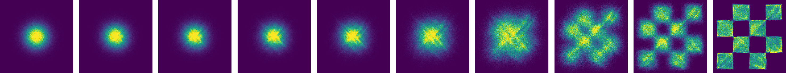

<figcaption>図9: 2D checkerboard データで ScoreFlow と DDPM 損失で学習した CNF の軌道。図 4 と同じ学習率・ハイパーパラメータを使用。</figcaption>
</figure>

## Appendix E Implementation details（実装の詳細）

2D 例では各 512 ニューロンの 5 層 MLP、画像では Dhariwal & Nichol の U-Net アーキテクチャを用いた。画像は center crop し適切な次元へリサイズする。32×32 と 64×64 解像度では先行研究と同じ前処理を用いる。3 手法（FM-OT、FM-Diffusion、SM-Diffusion）は常に同じアーキテクチャ・同じハイパーパラメータ・同じエポック数で学習する。

### E.1 Diffusion baselines（拡散ベースライン）

#### 損失

最も人気の拡散損失パラメータ化に対応する 3 つを拡散ベースラインとして考える。式 10 の一般ガウスパス形を仮定する。**Score Matching 損失**は $\mathcal{L}_{\text{SM}}(\theta)=\mathbb{E}\lambda(t)\|s_{t}(x)-\frac{x-\mu_{t}(x_{1})}{\sigma_{t}^{2}(x_{1})}\|^{2}$。$\lambda(t)=\sigma_{t}^{2}(x_{1})$ で元の SM 損失、$\lambda(t)=\beta(1-t)$ で NLL 上界に動機づけられた Score Flow (SF) 損失になる（$s_t$ は学習可能スコア関数）。**DDPM（Noise Matching）損失**は $\mathcal{L}_{\text{NM}}(\theta)=\mathbb{E}\|\epsilon_{t}(\sigma_{t}(x_{1})x_{0}+\mu_{t}(x_{1}))-x_{0}\|^{2}$（$\epsilon_t$ は学習可能ノイズ関数）。

#### 拡散パス

拡散パスには標準 VP 拡散（式 19）を用いる。$\mu_{t}(x_{1})=\alpha_{1-t}x_{1}$、$\sigma_{t}(x_{1})=\sqrt{1-\alpha_{1-t}^{2}}$、$\alpha_{t}=e^{-\frac{1}{2}T(t)}$、$T(t)=\int_{0}^{t}\beta(s)ds$、$\beta(s)=\beta_{\min}+s(\beta_{\max}-\beta_{\min})$（$\beta_{\min}=0.1$、$\beta_{\max}=20$）。時間は $[0,1-\epsilon]$（$\epsilon=10^{-5}$）でサンプリング。

#### サンプリング

スコアマッチングのサンプルはベクトル場 $u_{t}(x)=-\frac{T^{\prime}(1-t)}{2}[s_{t}(x)-x]$ で式 1 を解いて生成。DDPM のサンプルは $s_{t}(x)=\epsilon_{t}(x)/\sigma_{t}$（$\sigma_{t}=\sqrt{1-\alpha_{1-t}^{2}}$）と設定後、上式で計算。

### E.2 Training & evaluation details（学習・評価の詳細）

**表3**: 各モデルの学習に用いたハイパーパラメータ。

| | CIFAR10 | ImageNet-32 | ImageNet-64 | ImageNet-128 |
| --- | --- | --- | --- | --- |
| Channels | 256 | 256 | 192 | 256 |
| Depth | 2 | 3 | 3 | 3 |
| Channels multiple | 1,2,2,2 | 1,2,2,2 | 1,2,3,4 | 1,1,2,3,4 |
| Heads | 4 | 4 | 4 | 4 |
| Heads Channels | 64 | 64 | 64 | 64 |
| Attention resolution | 16 | 16,8 | 32,16,8 | 32,16,8 |
| Dropout | 0.0 | 0.0 | 0.0 | 0.0 |
| Effective Batch size | 256 | 1024 | 2048 | 1536 |
| GPUs | 2 | 4 | 16 | 32 |
| Epochs | 1000 | 200 | 250 | 571 |
| Iterations | 391k | 250k | 157k | 500k |
| Learning Rate | 5e-4 | 1e-4 | 1e-4 | 1e-4 |
| LR Scheduler | Polynomial Decay | Polynomial Decay | Constant | Polynomial Decay |
| Warmup Steps | 45k | 20k | - | 20k |

CIFAR10・ImageNet-32 は 32 ビット精度、ImageNet-64/128/256 は 16 ビット混合精度で学習。全モデルを Adam（$\beta_{1}=0.9$, $\beta_{2}=0.999$, weight decay 0.0, $\epsilon=$1e-8）で学習。FM-OT・FM-Diffusion・SM-Diffusion は同一アーキテクチャ・同一パラメータ・同一エポック数で学習。NLL 報告時は標準的な一様逆量子化を用い、重要度重み付き推定 $\log\frac{1}{K}\sum_{k=1}^{K}p_{t}(x+u_{k})$（$u_{k}\sim{\mathcal{U}}(0,1)$）を、torchdiffeq の dopri5（atol=rtol=1e-5）で $t=1$ で解いて報告する。FID/Inception スコアは CIFAR10・ImageNet-32/64 で TensorFlow GAN ライブラリ、ImageNet-128 は Dhariwal & Nichol の評価スクリプトを用いる。

## Appendix F Additional tables and figures（追加の表と図）

**表4**: 異なる $K$ 値での一様逆量子化を用いたテストセットの負の対数尤度（bits per dimension）。

| Model | CIFAR-10 K=1 | K=20 | K=50 | ImageNet32 K=1 | K=5 | K=15 | ImageNet64 K=1 | K=5 | K=10 |
| --- | --- | --- | --- | --- | --- | --- | --- | --- | --- |
| DDPM | 3.24 | 3.14 | 3.12 | 3.62 | 3.57 | 3.54 | 3.36 | 3.33 | 3.32 |
| Score Matching | 3.28 | 3.18 | 3.16 | 3.65 | 3.59 | 3.57 | 3.43 | 3.41 | 3.40 |
| ScoreFlow | 3.21 | 3.11 | 3.09 | 3.63 | 3.57 | 3.55 | 3.39 | 3.37 | 3.36 |
| FM w/ Diffusion | 3.23 | 3.13 | 3.10 | 3.64 | 3.58 | 3.56 | 3.37 | 3.34 | 3.33 |
| FM w/ OT | 3.11 | 3.01 | **2.99** | 3.62 | 3.56 | 3.53 | 3.35 | 3.33 | **3.31** |

<figure>

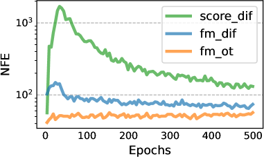

<figcaption>図10: CIFAR-10 で学習したモデルの学習中のサンプリングの関数評価回数。許容度 1e-5 の dopri5 ソルバーを使用。</figcaption>
</figure>

<figure>

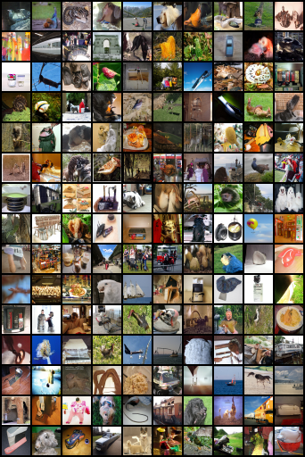

<figcaption>図11: FM-OT で学習した CNF の非キュレート無条件 ImageNet-32 生成画像。</figcaption>
</figure>

<figure>

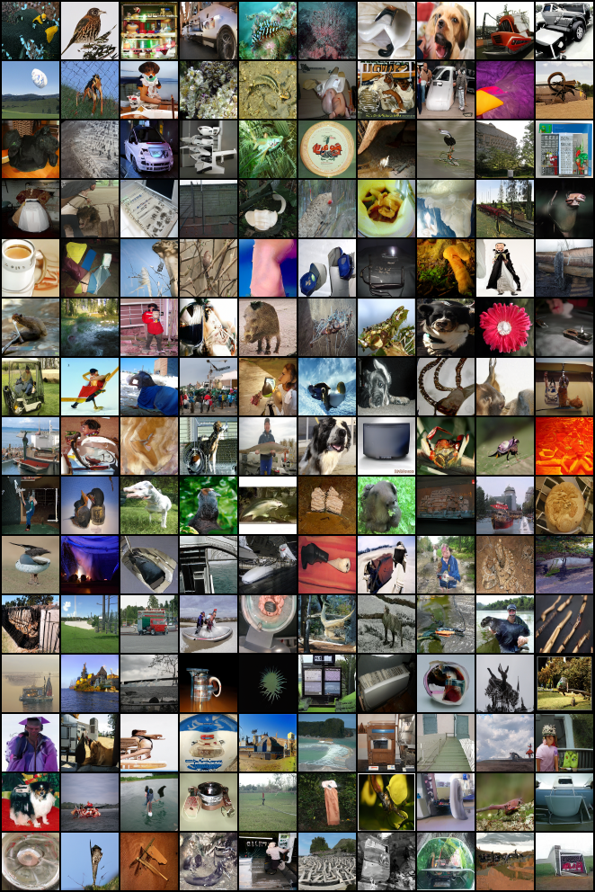

<figcaption>図12: FM-OT で学習した CNF の非キュレート無条件 ImageNet-64 生成画像。</figcaption>
</figure>

<figure>

<figcaption>図13: FM-OT で学習した CNF の非キュレート無条件 ImageNet-128 生成画像。</figcaption>
</figure>

<figure>

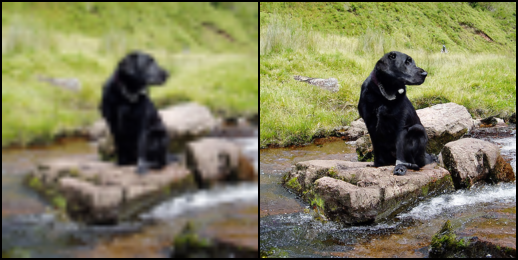

<figcaption>図14: 条件付き生成 64×64 → 256×256。検証セットからの Flow Matching OT アップサンプリング画像。</figcaption>
</figure>

<figure>

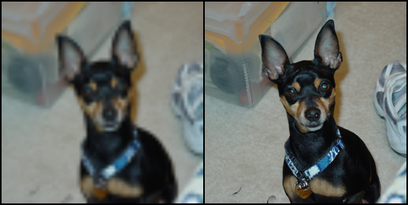

<figcaption>図15: 条件付き生成 64×64 → 256×256。検証セットからの Flow Matching OT アップサンプリング画像。</figcaption>
</figure>

<figure>

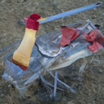

<figcaption>図（補足）: FM-OT による ImageNet-128 のソルバーサンプル。</figcaption>
</figure>

<figure>

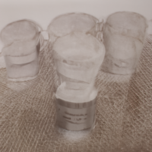

<figcaption>図（補足）: FM-OT による ImageNet-256 のソルバーサンプル。</figcaption>
</figure>

> 訳注: 本文中で言及される図8（拡散 VF の可視化）は、原典 ar5iv にこの位置の画像リンクが存在しなかったため、本翻訳には含めていない。
