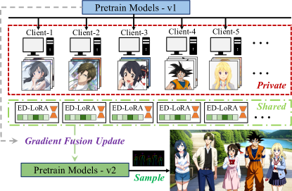
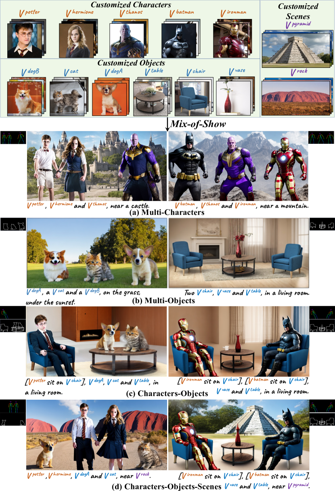
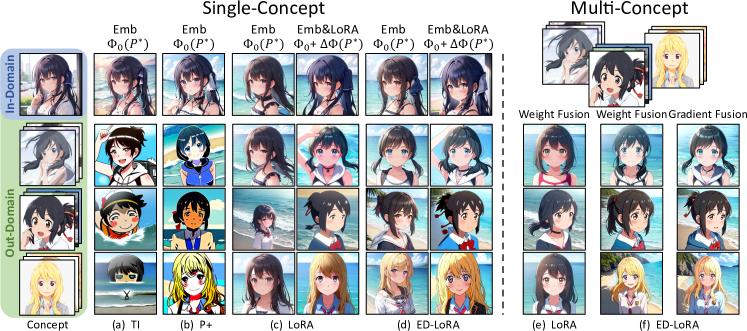
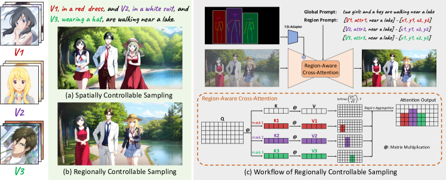
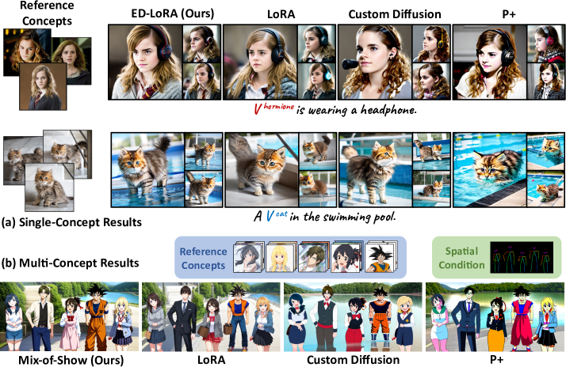
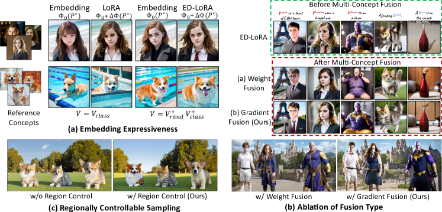
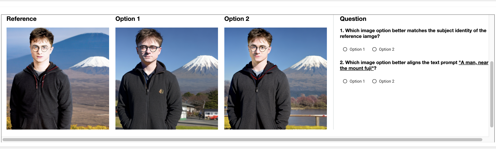
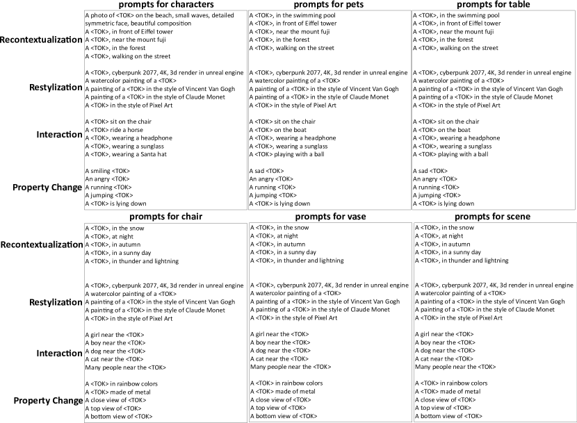
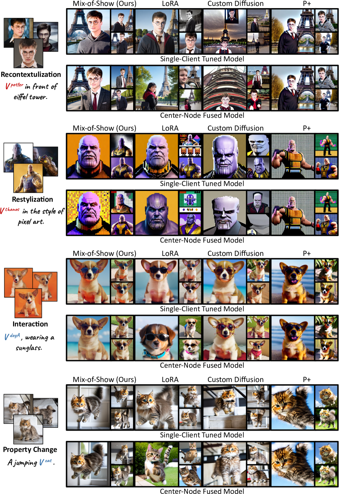
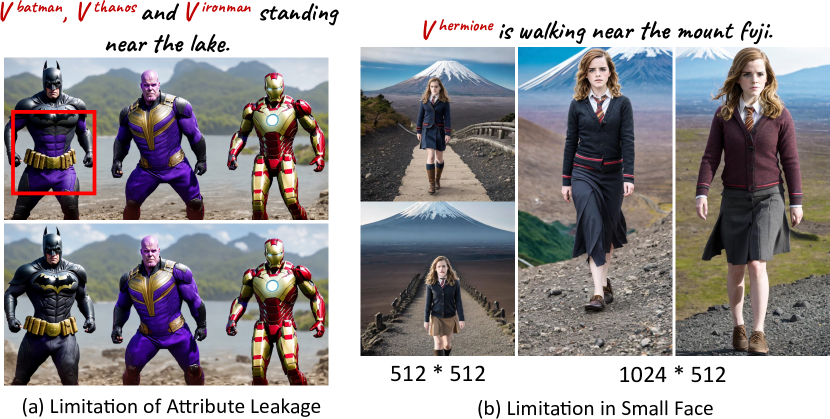

# Mix-of-Show: 拡散モデルの多概念カスタマイズのための分散型低ランク適応

> 原題: Mix-of-Show: Decentralized Low-Rank Adaptation for Multi-Concept Customization of Diffusion Models
> 著者: Yuchao Gu, Xintao Wang, Jay Zhangjie Wu, Yujun Shi, Yunpeng Chen, Zihan Fan, Wuyou Xiao, Rui Zhao, Shuning Chang, Weijia Wu, Yixiao Ge, Ying Shan, Mike Zheng Shou
> 出典: NeurIPS 2023 ・ arXiv:2305.18292

## Abstract（要旨）

Stable Diffusion のような公開された大規模 text-to-image 拡散モデルは、コミュニティから大きな注目を集めている。これらのモデルは低ランク適応（low-rank adaptation, LoRA）を用いて新しい概念に容易にカスタマイズできる。しかし、複数の概念 LoRA を活用して複数のカスタマイズ概念を同時にサポートすることには課題がある。我々はこのシナリオを **decentralized multi-concept customization（分散型多概念カスタマイズ）** と呼び、これは single-client concept tuning（単一クライアントでの概念チューニング）と center-node concept fusion（中央ノードでの概念融合）を含む。本論文では、分散型多概念カスタマイズの課題——既存の単一クライアント LoRA チューニングに起因する concept conflict（概念衝突）や、モデル融合中の identity loss（同一性損失）——に対処する Mix-of-Show という新しい枠組みを提案する。Mix-of-Show は、単一クライアントチューニングに **embedding-decomposed LoRA（ED-LoRA, 埋め込み分解 LoRA）** を、中央ノードに **gradient fusion（勾配融合）** を採用し、単一概念の in-domain essence（ドメイン内本質）を保ちつつ理論上無制限の概念融合を支える。さらに、空間的に制御可能なサンプリング（ControlNet や T2I-Adapter など）を拡張し、多概念サンプリングにおける attribute binding（属性結合）と missing object（物体欠落）の問題に対処する **regionally controllable sampling（領域制御可能サンプリング）** を導入する。広範な実験により、Mix-of-Show がキャラクター・物体・シーンを含む複数のカスタマイズ概念を高い忠実度で合成できることを示す。

<figure>

<figcaption>図1: Mix-of-Show による分散型多概念カスタマイズの図解。各クライアントが私的な概念データで単一概念 LoRA を学習・共有し、中央ノードがそれらを融合して合成サンプリングを可能にする。</figcaption>
</figure>

<figure>

<figcaption>図2: 異なる作品のキャラクター（Harry Potter と Thanos）を同じ画像でどう生成するか？ Mix-of-Show は個別に学習した概念 LoRA で、複数のカスタマイズ概念（キャラクター・物体・シーン）の複雑な合成を可能にする。</figcaption>
</figure>

## 1 はじめに

Stable Diffusion のようなオープンソースのテキスト画像拡散モデルは、コミュニティユーザーが個人化した概念画像を集めて低ランク適応（LoRA）でファインチューンし、カスタマイズモデルを作る力を与える。これらの調整された LoRA モデルは、入念なデータ選択・前処理・ハイパラ調整により特定概念で比類ない品質を達成する。既存の概念 LoRA は事前学習済みモデルへのプラグ&プレイ・プラグインとして機能するが、複数の概念 LoRA を活用して事前学習済みモデルを拡張し、それら概念の合同合成を可能にすることには課題がある。我々はこのシナリオを decentralized multi-concept customization と呼ぶ。図1 のように、これは 2 段階——single-client concept tuning と center-node concept fusion——を含む。各クライアントは私的な概念データを保持しつつ調整済み LoRA モデルを共有する。中央ノードはこれらの概念 LoRA を活用して事前学習済みモデルを更新し、これらカスタマイズ概念の合同サンプリングを可能にする。分散型多概念カスタマイズは、高品質な概念 LoRA 生成へのコミュニティの最大限の参加を促し、異なる概念 LoRA を再利用・組合せる柔軟性を提供する。

しかし、既存の LoRA チューニングと重み融合技術は分散型多概念カスタマイズの課題に対処できない。我々は 2 つの主要課題を特定した：concept conflict と identity loss。**concept conflict** は、現在の LoRA チューニング手法が embedding と LoRA 重みの役割を区別しないために生じる。我々の研究は、embedding が事前学習済みモデルのドメイン内の概念を効果的に捉える一方、LoRA 重みがドメイン外情報（事前学習済みモデルが直接モデル化できないスタイルや細部）を捉えるのを助けることを明らかにする。しかし既存の LoRA チューニング手法は embedding の重要性を見落として LoRA 重みを過度に重視する。結果として LoRA 重みが与えられた概念の identity の大部分を符号化し、意味的に類似した embedding が異なる外見の概念に射影され、モデル融合時の衝突につながる。さらに、既存の重み融合戦略は全概念 LoRA の重み付き平均を行うことで、各概念の identity を損ない他概念からの干渉を導入する。

分散型多概念カスタマイズの課題を克服するため、我々は Mix-of-Show を提案する。これは単一クライアントチューニングのための embedding-decomposed LoRA（ED-LoRA）と、中央ノード融合のための gradient fusion からなる。単一クライアントチューニングでは、ED-LoRA は embedding 内により多くの in-domain essence を保つことで concept conflict に対処するよう設計される。これを達成するため、概念 embedding を layer-wise embedding と multi-word representation に分解して表現力を高める。中央ノードでは、gradient fusion が複数の概念 LoRA を活用して事前学習済みモデルを更新する。拡散モデルは順・逆の拡散過程を含むので、データがなくてもサンプリングを通じて各層の入出力特徴を取得できる。複数の概念 LoRA からの特徴を組み合わせて融合勾配を生成し、層ごとの更新に用いる。重み融合と比べ、gradient fusion は各個別概念の推論挙動を整合させ、identity loss を大幅に低減する。

Mix-of-Show の能力を示すため、多概念生成のための regionally controllable sampling を導入する。直接の多概念生成はしばしば物体欠落や属性結合の問題に直面する。最近、空間的に制御可能なサンプリング（ControlNet, T2I-Adapter）が空間ヒント（keypose や sketch）でモデルを導くよう導入され、物体欠落を解決するが、多概念生成での属性結合には依然課題が残る。空間条件採用時には空間レイアウトが事前定義される点を考慮し、region prompt を region-aware cross-attention で注入することを提案する。Mix-of-Show と regionally controllable sampling により、図2 のようにキャラクター・物体・シーンを含む複数のカスタマイズ概念の複雑な合成を達成できる。要約すると貢献は：1) 分散型多概念カスタマイズの課題を分析する。2) concept conflict と identity loss に対処する ED-LoRA と gradient fusion からなる Mix-of-Show を提案する。3) regionally controllable sampling を導入し、複数概念合成における Mix-of-Show の可能性を示す。

## 2 関連研究

### 2.1 概念カスタマイズ

概念カスタマイズは、わずかな画像を使って事前学習済み拡散モデルを個人化概念に拡張することを目指す。主に 2 種の概念チューニング手法がある：embedding tuning（Textual Inversion, P+）と joint embedding-weight tuning（Dreambooth, Custom Diffusion）。さらにコミュニティは概念チューニングに低ランクアダプタ（LoRA）を採用し、軽量で全重みチューニングに匹敵する忠実度を達成する。

単一概念カスタマイズで大きな進歩があったが、多概念カスタマイズは依然課題である。Custom Diffusion は複数概念の共同学習や既存概念モデルの制約付き最適化を提案する。これに続き SVDiff はデータ増強で共同学習の概念混合を防ぎ、Cones は複数概念をサポートする概念ニューロンを発見する。しかしこれらは通常 2〜3 の意味的に異なる概念の融合に制限される。対照的に Mix-of-Show は、同じ意味カテゴリ内のものを含め、理論上無制限のカスタマイズ概念を組み合わせられる。

概念カスタマイズの別系統（Instantbooth, ELITE, Jia ら）は高速なテスト時カスタマイズに焦点を当てる。これらは目的カテゴリ固有の大規模データセットでエンコーダを事前学習する。しかしカテゴリごとに別エンコーダの学習を要し、通常は一般的カテゴリ（人や猫）に限られ、多様でオープンワールドな被写体のカスタマイズ・合成を妨げる。

### 2.2 分散学習

分散学習または連合学習（federated learning）は、データを共有せず異なるクライアント間で協調的にモデルを学習することを目指す。連合学習の事実上のアルゴリズム FedAvg は各クライアントモデルの重みを単純に平均して最終モデルを得る。しかし、この単純な重み平均を異なる概念の LoRA 融合に直接適用するのは理想的でないことを我々は見出す。FedAvg を改善するため、先行研究は局所クライアント学習か大域サーバ集約に焦点を当ててきた。これに動機づけられ、我々は分散型多概念カスタマイズのための single-client tuning と center-node fusion の最適設計を探る。

### 2.3 制御可能な多概念生成

テキストプロンプトのみによる直接の多概念生成は物体欠落や属性結合の課題に直面する。Attend-and-Excite や Structure Diffusion はこれに対処しようとしたが問題は残る。ControlNet や T2I-Adapter は空間制御（keypose, sketch）を導入し、より正確な合成を可能にして物体欠落を解決する。しかし属性結合は依然課題である。本研究では regionally controllable sampling を通じてこの課題に取り組む。

## 3 手法

本節では、Sec. 3.1 でテキスト画像拡散モデルと概念カスタマイズの背景を、Sec. 3.2 で分散型多概念カスタマイズのタスク定式化を述べ、Sec. 3.3・3.4 で手法を詳述する。

### 3.1 準備

**テキスト画像拡散モデル。** 拡散モデルは、順拡散過程で画像に徐々にノイズを導入し、その逆過程を学習して画像を合成する生成モデルのクラスである。事前学習済みテキスト埋め込みと組み合わせると、テキストプロンプトに基づく高忠実な画像を生成できる。本論文では潜在空間で動作する Stable Diffusion を使う。条件 $c=\psi(P^{*})$（$P^{*}$ はテキストプロンプト、$\psi$ は事前学習済み CLIP テキストエンコーダ）が与えられたとき、訓練目的は次のノイズ除去目的の最小化：

$$
\mathcal{L}=\mathbb{E}_{z,c,\epsilon,t}[\|\epsilon-\epsilon_{\theta}(z_{t},t,c)\|^{2}_{2}],
$$

ここで $z_{t}$ は時刻 $t$ の潜在特徴、$\epsilon_{\theta}$ は学習可能パラメータ $\theta$ を持つノイズ除去 U-Net。

**概念カスタマイズのための embedding tuning。** Textual Inversion は入力概念を一意のトークン $V$ で表す。目的概念の数枚の画像が与えられると、$V$ の embedding が式1 で調整される。調整後、$V$ の embedding は目的概念の本質を符号化し、事前学習済みモデルの他のテキストと同様に機能する。より高い分離と制御のため、P+ は概念トークンに layer-wise embedding（本論文では $V^{+}$）を導入する。

**Low-Rank Adaptation。** LoRA は当初、大規模言語モデルを下流タスクに適応するため提案された。適応中の重み変化が低い「内在階数（intrinsic rank）」を持つと仮定し、重み変化の低ランク分解で更新重み $W=W_{0}+\Delta W=W_{0}+BA$ を得る（$W_{0}\in\mathbb{R}^{d\times k}$ は事前学習重み、$B\in\mathbb{R}^{d\times r}$, $A\in\mathbb{R}^{r\times k}$ は低ランク因子、$r\ll\min(d,k)$）。最近コミュニティは拡散モデルのファインチューニングに LoRA を採用し有望な結果を得ている。LoRA は通常プラグ&プレイ・プラグインとして使われるが、コミュニティは複数 LoRA を組み合わせる重み融合技術も用いる：

$$
W=W_{0}+\sum_{i=1}^{n}w_{i}\Delta W_{i},\quad\text{s.t.}\sum_{i=1}^{n}w_{i}=1,
$$

ここで $w_{i}$ は異なる LoRA の正規化された重要度。

<figure>

<figcaption>図3: embedding tuning（Textual Inversion (TI), P+）と joint embedding-weight tuning（LoRA, 我々の ED-LoRA）の単一・多概念カスタマイズ。P* = 「Photo of a V, near the beach」。Φ₀ と ΔΦ は事前学習済みモデルと LoRA 重み。</figcaption>
</figure>

### 3.2 タスク定式化: 分散型多概念カスタマイズ

Custom Diffusion は 2 つの調整済み概念モデルを事前学習済みモデルに併合しようとしたが、その知見は複数概念の共同学習の方が良い結果を生むことを示唆する。しかしスケーラビリティと再利用性を考慮し、我々は単一概念モデルの併合による多概念カスタマイズに焦点を当てる。これを分散型多概念カスタマイズと呼ぶ。

形式的に、分散型多概念カスタマイズは 2 段階——single-client concept tuning と center-node concept fusion——からなる。図1 のように、$n$ クライアントそれぞれが私的な概念データを持ち概念モデル $\Delta W_{i}$ を調整する（$\Delta W_{i}$ は本研究では LoRA 重みの変化）。調整後、中央ノードが全 LoRA を集めて更新重み $W$ を得る：

$$
W=f(W_{0},\Delta W_{1},\Delta W_{2},\ldots,\Delta W_{n}),
$$

ここで $f$ は事前学習重み $W_{0}$ と $n$ 個の概念 LoRA に作用する更新規則。単純な更新規則 $f$ は式2 の重み融合である。更新後、新しいモデル $W$ は $n$ 個の LoRA で導入された全概念を生成できるべきである。

### 3.3 Mix-of-Show

本節では、single-client concept tuning のための ED-LoRA（Sec. 3.3.1）と center-node concept fusion のための gradient fusion（Sec. 3.3.2）からなる Mix-of-Show を導入する。

#### 3.3.1 Single-Client Concept Tuning: ED-LoRA

vanilla LoRA は concept conflict の問題により分散型多概念カスタマイズに適さない。この限界を理解するため、概念チューニングにおける embedding と LoRA 重みの異なる役割を調べる。

**単一概念チューニング設定。** 単一概念カスタマイズで embedding tuning（Textual Inversion, P+）と joint embedding-weight tuning（LoRA）を調べる。in-domain 概念（事前学習済みモデルから直接サンプル）と out-domain 概念の両方で実験する。事前学習済みモデルの重み（unet $\theta$ とテキストエンコーダ $\psi$）を $\Phi_{0}=\{\theta_{0},\psi_{0}\}$ とする。概念 $V$ を含むプロンプト $P^{*}$ が与えられたとき、$V$ の調整済み embedding を $\Phi_{0}(P^{*})$ で、調整済み embedding と LoRA 重みを $(\Phi_{0}+\Delta\Phi)(P^{*})$ で可視化する。

**分析。** 図3 の実験結果から、既存手法について次の 2 観察を得る。

*観察1: embedding は事前学習済みモデルのドメイン内の概念を捉えられる一方、LoRA は out-domain 情報を捉えるのを助ける。*

図3(a,b) で、Textual Inversion や P+ のような embedding tuning は out-domain 概念を捉えるのに苦戦する。全 out-domain 詳細（アニメスタイルや $\Phi_{0}$ がモデル化しない詳細）を embedding に符号化しようとし semantic collapse を起こすからである。しかし in-domain 概念では embedding tuning が概念 identity を正確に符号化する。さらに embedding を LoRA と共同調整すると、out-domain 情報が LoRA 重みシフト（$\Phi_{0}+\Delta\Phi$）で捉えられるため、embedding は過飽和出力を生まなくなる。

<figure>

<figcaption>図4: Mix-of-Show のパイプライン。single-client concept tuning では ED-LoRA が layer-wise embedding と multi-word representation を採用。中央ノードでは gradient fusion が複数の概念 LoRA を融合し、それらカスタマイズ概念の合成を支える。</figcaption>
</figure>

*観察2: 既存の LoRA 重みは概念 identity の大部分を符号化し、意味的に類似した embedding を視覚的に異なる概念に射影するため、概念融合時に衝突を起こす。*

図3(c) の joint embedding-LoRA チューニング結果で、$\Phi_{0}(P^{*})$ で embedding を直接可視化すると意味的に類似した結果になる。しかし LoRA 重みを読み込む $(\Phi_{0}+\Delta\Phi)(P^{*})$ と目的概念が正確に捉えられる。これは概念 identity の大部分が embedding でなく LoRA 重みに符号化されることを示す。複数の意味的に類似した概念を 1 モデルでサポートしようとすると、類似 embedding に基づきどの概念をサンプルするか決めるのが問題になり、concept conflict が生じる。図3(e) のように、1 モデルに融合すると各個別概念の identity が失われる。

**我々の解: ED-LoRA。** 以上の観察に基づき、ED-LoRA は embedding 内により多くの in-domain essence を保ちつつ残りの詳細を LoRA 重みで捉えるよう設計される。embedding の表現力を decomposed embedding で高める。図4 のように、layer-wise embedding を採用し概念トークンに multi-world representation（$V=V_{rand}^{+}V_{class}^{+}$）を作る。$V_{rand}^{+}$ は異なる概念の分散を捉えるためランダム初期化、$V_{class}^{+}$ は意味を保つため意味クラスに基づき初期化する。両トークンは概念チューニング中に学習可能。図3(d) のように、ED-LoRA の学習済み embedding は事前学習済みモデルのドメイン内で与えられた概念の本質を効果的に保ち、LoRA が他の詳細を捉えるのを助ける。

<figure>

<figcaption>図5: 多概念生成のための regionally controllable sampling。</figcaption>
</figure>

#### 3.3.2 Center-Node Concept Fusion: Gradient Fusion

中央ノードでは全概念 LoRA にアクセスでき、これらで事前学習済みモデルを更新して多概念カスタマイズを可能にできる。しかし式2 の既存の重み融合戦略はこの目標達成に不十分である。

**多概念融合設定。** 式2 の重み融合で $n$ 個の概念 LoRA や ED-LoRA $\{\Delta\Phi_{i}\}$ を事前学習済みモデル $\Phi_{0}$ に重み付き平均し、新モデル $\Phi$ を得る。新モデル $\Phi(P_{i}^{*})$ で各概念をサンプルし、対応する単一概念サンプル $(\Phi_{0}+\Delta\Phi)(P_{i}^{*})$ と identity を比較する。

**分析。** 図3 の結果から融合戦略について次を観察する。

*観察3: 重み融合は概念融合時に個別概念の identity loss を引き起こす。*

図3（multi-concept）で、LoRA の重み融合は概念間の衝突により概念 identity の著しい損失を引き起こす。ED-LoRA と組み合わせても重み融合は各個別概念の identity を損なう。理論上、概念が LoRA 重みシフト $\Delta\Phi(P^{*})$ で完全な identity を得るなら、他 $n-1$ 概念 LoRA と融合するにはその重みを $\frac{1}{n}\Delta\Phi(P^{*})$ に減らし他概念の LoRA 重みを導入する必要があり、最終的に概念の identity を弱める。

**我々の解: Gradient Fusion。** 前述の分析に基づき、我々の目標は各概念の単一概念推論挙動を整合させることで融合モデルに各概念の identity を保つことである。連合学習（モデルが通常データなしに勾配にアクセスできない単方向分類モデル）と異なり、テキスト画像拡散モデルはテキストプロンプトから概念を復号する本来的能力を持つ。これを活用し、図4(b) のように各概念をそれぞれの LoRA 重みで復号し、各 LoRA 層に関連する入出力特徴を抽出する。異なる概念のこれらの入出力特徴を連結し、融合勾配を使って各層 $W$ を次の目的で更新する：

$$
W=\operatorname*{arg\,min}_{W}\sum_{i=1}^{n}\|(W_{0}+\Delta W_{i})X_{i}-WX_{i}\|^{2}_{F},
$$

ここで $X_{i}$ は $i$ 番目の概念の入力活性、$\|\cdot\|_{F}$ は Frobenius ノルム。このアプローチにより、データにアクセスせず、訓練時に概念間の差異を考慮せずに異なる概念 LoRA を融合できる。図3(f) の結果は、各概念の identity の保存改善と異なる概念にわたる一貫したスタイル化を示す。

### 3.4 Regionally Controllable Sampling

直接の多概念サンプリングはしばしば物体欠落と属性結合の課題に直面する。空間的に制御可能なサンプリング（ControlNet, T2I-Adapter）は物体欠落を解決できるが、概念を特定の keypose や sketch に正確に結びつけられない。テキストプロンプトだけで所望概念と属性を示すと属性結合問題を招きうる（図5(a) で 3 人の identity が混ざり「red dress」が他概念に誤って割り当てられる）。

これに対処するため regionally controllable sampling を提案する。global prompt と複数の regional prompt を使い、空間条件に基づき画像を記述する。global prompt は全体文脈を、regional prompt は特定領域の被写体（属性や global からの文脈情報を含む）を指定する。これを達成するため region-aware cross-attention を導入する。global prompt $P^{*}_{g}$ と $n$ 個の regional prompt $P^{*}_{r_{i}}$ が与えられたとき、まず global prompt を latent $z$ との cross-attention で取り込む：$h=\text{softmax}(Q(z)K(P^{*}_{g})/\sqrt{d})\cdot V(P^{*}_{g})$。次に領域 latent 特徴を $z_{i}=z\odot M_{i}$ で抽出する（$M_{i}$ は $P^{*}_{r_{i}}$ の領域の二値マスク）。領域特徴を $h_{i}=\text{softmax}(Q(z_{i})K(P^{*}_{r_{i}})/\sqrt{d})\cdot V(P^{*}_{r_{i}})$ で得る。最後に global 出力の特徴を領域特徴で置き換える：$h[M_{i}]=h_{i}$。図5(b) のように、regionally controllable sampling は被写体と属性の正確な割り当てを可能にしつつ調和的な大域文脈を保つ。

<figure>

<figcaption>図6: 単一・多概念カスタマイズの定性比較。</figcaption>
</figure>

## 4 実験

### 4.1 データセットと実装の詳細

Mix-of-Show の評価のため、キャラクター・物体・シーンを含むデータセットを集める。ED-LoRA チューニングでは、テキストエンコーダと U-Net の全注意モジュールの線形層に LoRA 層を $r=4$ で組み込む。text embedding・text encoder・Unet の調整にそれぞれ学習率 1e-3・1e-5・1e-4 の Adam を使う。gradient fusion では LBFGS optimizer を text encoder に 500 step、Unet に 50 step 使う。詳細は Sec. 6.1。

### 4.2 定性比較

**単一概念の結果。** 単一概念カスタマイズで ED-LoRA を LoRA・Custom Diffusion・P+ と比較する（図6(a)）。ED-LoRA は物体カスタマイズで従来手法に匹敵し、キャラクターカスタマイズではより良い identity を保つ。

<figure>

<figcaption>図7: Mix-of-Show の定性アブレーション研究。P* はテキストプロンプト、Φ₀ と ΔΦ は事前学習済みモデルと LoRA 重み。</figcaption>
</figure>

**表2(a)**: 主要構成要素の定量アブレーション。LoRA+weight fusion、ED-LoRA+weight fusion、我々の ED-LoRA+gradient fusion の比較（image-alignment、single→fused）。

| Methods | Real-Objects Single→Fused | Real-Characters Single→Fused | Real-Scenes Single→Fused | Mean Change |
| --- | --- | --- | --- | --- |
| Lower Bound | 0.721 | 0.471 | 0.595 | 0.596 |
| LoRA + Weight Fusion | 0.864 → 0.778 (-0.086) | 0.761 → 0.555 (-0.206) | 0.824 → 0.769 (-0.055) | 0.816 → 0.701 (-0.115) |
| ED-LoRA + Weight Fusion | 0.868 → 0.798 (-0.070) | 0.802 → 0.634 (-0.168) | 0.858 → 0.816 (-0.042) | 0.843 → 0.749 (-0.094) |
| ED-LoRA + Gradient Fusion | 0.868 → 0.846 (-0.022) | 0.802 → 0.770 (-0.032) | 0.858 → 0.838 (-0.020) | 0.843 → 0.818 (-0.025) |

<figure>

<figcaption>図（表2b）: weight fusion と gradient fusion を比較する人間選好調査（Amazon Mechanical Turk）のインターフェース。</figcaption>
</figure>

**表2(c)**: ED-LoRA の融合における weight fusion と gradient fusion の人間選好。

| Human Evaluation | Image Alignment | Text Alignment |
| --- | --- | --- |
| ED-LoRA + Weight Fusion | 33.5% | 47.5% |
| ED-LoRA + Gradient Fusion | 66.5% | 52.5% |

**多概念の結果。** 分散型多概念カスタマイズで Mix-of-Show を LoRA・Custom Diffusion・P+ と比較する。LoRA は重み融合で概念を組み合わせる。公平な評価のため全モデルで同じ regionally controllable sampling を使う（図6(b)）。P+ と Custom Diffusion はテキスト関連モジュールのみ調整するため、out-domain 低レベル詳細を embedding に過剰符号化し、不自然な結果になる。重み融合後に概念 identity を失う LoRA と比べ、Mix-of-Show は各個別概念の identity を効果的に保つ。

### 4.3 定量比較

Custom Diffusion に従い CLIP テキスト/画像エンコーダで text alignment と image alignment を評価する。表1 に基づき、Mix-of-Show と LoRA は単一クライアント調整モデルで他手法より優れた image alignment を、同等の text alignment を保ちつつ示す。しかし中央ノード融合モデルでは、LoRA は各概念の image alignment が大きく低下し下界に近づく。対照的に Mix-of-Show は多概念融合後の image alignment 劣化が遥かに少ない。

**表1**: 単一クライアント調整モデルと中央ノード融合モデルの間の text-alignment・image-alignment の変化。text-alignment の上界と image-alignment の下界は、概念トークンをそのクラストークンに置き換え事前学習済みモデルでサンプルして計算。

| | Methods | Real-Objects Single→Fused | Real-Characters Single→Fused | Real-Scenes Single→Fused | Mean Change |
| --- | --- | --- | --- | --- | --- |
| Text-alignment | Upper Bound | 0.811 | 0.767 | 0.834 | 0.804 |
| | P+ | 0.771 → 0.771 (-) | 0.686 → 0.686 (-) | 0.759 → 0.759 (-) | 0.739 → 0.739 (-) |
| | Custom Diffusion | 0.745 → 0.747 (+0.002) | 0.674 → 0.650 (-0.024) | 0.748 → 0.738 (-0.010) | 0.722 → 0.712 (-0.010) |
| | LoRA | 0.720 → 0.795 (+0.075) | 0.654 → 0.700 (+0.046) | 0.717 → 0.760 (+0.043) | 0.697 → 0.752 (+0.055) |
| | Mix-of-Show (Ours) | 0.724 → 0.745 (+0.021) | 0.632 → 0.662 (+0.030) | 0.716 → 0.736 (+0.020) | 0.691 → 0.714 (+0.024) |
| Image-alignment | Lower Bound | 0.721 | 0.471 | 0.595 | 0.596 |
| | P+ | 0.790 → 0.790 (-) | 0.670 → 0.670 (-) | 0.796 → 0.796 (-) | 0.752 → 0.752 (-) |
| | Custom Diffusion | 0.842 → 0.808 (-0.034) | 0.714 → 0.694 (-0.020) | 0.804 → 0.750 (-0.054) | 0.787 → 0.751 (-0.036) |
| | LoRA | 0.864 → 0.778 (-0.086) | 0.761 → 0.555 (-0.206) | 0.824 → 0.769 (-0.055) | 0.816 → 0.701 (-0.115) |
| | Mix-of-Show (Ours) | 0.868 → 0.846 (-0.022) | 0.802 → 0.770 (-0.032) | 0.858 → 0.838 (-0.020) | 0.843 → 0.818 (-0.025) |

### 4.4 アブレーション研究

**embedding 表現力。** 図7(a) で、分解 embedding は LoRA の標準テキスト embedding より概念 identity をよく保つ。表2(a) の定量結果で、LoRA を ED-LoRA に置き換えると重み融合の identity loss が 0.115 から 0.094 に減る。

**融合タイプ。** 同じ ED-LoRA で weight fusion と gradient fusion を比較する。図7(b) のように gradient fusion は概念融合後の概念 identity を効果的に保つ。表2(a) で gradient fusion は identity loss を 0.094 から 0.025 に大幅低減。人間評価でも gradient fusion への明確な選好を確認（表2(c)）。

**regionally controllable sampling。** 図7(c) で、直接サンプリングは概念 identity が混ざる属性結合問題を起こすが、regionally controllable sampling は多概念生成で正しい属性結合を達成する。

## 5 結論

本研究では分散型多概念カスタマイズを探り、concept conflict と identity loss に苦しむ既存の LoRA チューニング・重み融合の限界を強調した。これらを克服するため、single-client concept tuning の ED-LoRA と center-node concept fusion の gradient fusion からなる Mix-of-Show を提案する。ED-LoRA は個別概念の本質を embedding に保ち衝突を避け、gradient fusion は概念融合中の identity loss を最小化する。多概念生成の属性結合を扱う regionally controllable sampling も導入する。実験は Mix-of-Show がキャラクター・物体・シーンを含む複数のカスタマイズ概念の複雑な合成を成功させることを示す。

## 6 付録

### 6.1 データセットと実装の詳細

#### 6.1.1 データセットの詳細

Dreambooth や Custom Diffusion が主に物体カスタマイズに焦点を当てたのと対照的に、本研究はキャラクター・物体・シーンを含む包括的調査を行う。6 実世界キャラクター・5 アニメキャラクター・6 実世界物体・2 実世界シーンの 19 概念を編成する（物体部分は Dreambooth と Custom Diffusion から借用）。

#### 6.1.2 実装の詳細

**事前学習済みモデル。** Stable-Diffusion v1-5 の人の顔の品質問題のため、実世界概念には Chilloutmix、アニメ概念には Anything-v4 を事前学習済みモデルに採用する。公平な比較のため全比較手法で同じ事前学習済みモデルを使う。

**Single-Client Concept Tuning。** テキストエンコーダと Unet の全注意モジュールの線形層に LoRA 層を $r=4$ で組み込む。Adam（text embedding 1e-3、text encoder 1e-5、Unet 1e-4）で最適化。安定した identity 符号化に 0.01 の noise offset が重要。

**Center-Node Concept Fusion。** LoRA 層に接続された層に層ごと最適化を適用する。各層を事前学習重みで初期化し LBFGS で最適化（text encoder 500 step、Unet 50 step）。

**サンプル詳細。** 全実験で DPM-Solver を 20 step 使う。全手法で同じ negative prompt を使う。

**実行時間。** single-client concept tuning は各概念 2×A100 で約 10〜20 分。center-node concept fusion は 14 概念の融合に 1×A100 で 30 分。

<figure>

<figcaption>図8: 各概念の評価プロンプトの要約。</figcaption>
</figure>

### 6.2 定量・定性評価

#### 6.2.1 評価設定

単一概念調整モデルと中央ノード融合モデルでの各概念を調査する。Custom Diffusion に従い image-alignment と text-alignment を評価する。text-alignment は CLIP 特徴空間でサンプル画像と対応プロンプトのテキスト・画像類似度を、image-alignment はサンプル画像と目的概念データのペアワイズ画像類似度を測る。各概念に 20 評価プロンプト（Recontextualization・Restylization・Interaction・Property Modification の 4 型 × 5）を使い、各プロンプトで 50 画像（seed 1〜50 固定）、計 1000 画像をサンプルする。

#### 6.2.2 定量結果

評価設定に従い各概念の完全な評価結果を表3 にまとめる。カテゴリ別の要約結果は本文表1。

#### 6.2.3 定性結果

図9 に単一クライアント調整モデルと中央ノード融合モデルでの Mix-of-Show と他手法の定性比較を示す。LoRA は概念融合後の概念 identity 損失が最も大きい。P+ と Custom Diffusion は調整位置の制限から過飽和や semantic collapse を示す。Mix-of-Show は様々な例で最良の概念 identity と品質を一貫して達成し、中央ノード融合後の identity 損失も最小化する。

**表3(a)**: 実世界物体の単一概念モデルと中央ノード融合モデルの定量結果。括弧内 (N) は各概念のチューニング画像数。

*Single-Concept Model:*

| Methods | Cat(5) | DogA(5) | Chair(5) | Table(4) | DogB(5) | Vase(6) | Mean |
| --- | --- | --- | --- | --- | --- | --- | --- |
| **Text-alignment** Upper Bound | 0.832 | 0.821 | 0.795 | 0.792 | 0.821 | 0.807 | 0.811 |
| P+ | 0.828 | 0.801 | 0.726 | 0.696 | 0.799 | 0.776 | 0.771 |
| Custom Diffusion | 0.784 | 0.744 | 0.698 | 0.689 | 0.786 | 0.768 | 0.745 |
| LoRA | 0.761 | 0.673 | 0.655 | 0.670 | 0.779 | 0.779 | 0.720 |
| Mix-of-Show (Ours) | 0.771 | 0.703 | 0.666 | 0.671 | 0.772 | 0.759 | 0.724 |
| **Image-alignment** Lower Bound | 0.753 | 0.755 | 0.674 | 0.682 | 0.769 | 0.692 | 0.721 |
| P+ | 0.783 | 0.753 | 0.809 | 0.810 | 0.825 | 0.761 | 0.790 |
| Custom Diffusion | 0.869 | 0.830 | 0.825 | 0.888 | 0.848 | 0.794 | 0.842 |
| LoRA | 0.859 | 0.871 | 0.872 | 0.917 | 0.887 | 0.778 | 0.864 |
| Mix-of-Show (Ours) | 0.874 | 0.864 | 0.890 | 0.879 | 0.889 | 0.811 | 0.868 |

*Fused Model:*

| Methods | Cat(5) | DogA(5) | Chair(5) | Table(4) | DogB(5) | Vase(6) | Mean |
| --- | --- | --- | --- | --- | --- | --- | --- |
| **Text-alignment** Upper Bound | 0.832 | 0.821 | 0.795 | 0.792 | 0.821 | 0.807 | 0.811 |
| P+ | 0.828 | 0.801 | 0.726 | 0.696 | 0.799 | 0.776 | 0.771 |
| Custom Diffusion | 0.756 | 0.735 | 0.726 | 0.724 | 0.782 | 0.758 | 0.747 |
| LoRA | 0.827 | 0.803 | 0.757 | 0.766 | 0.814 | 0.801 | 0.795 |
| Mix-of-Show (Ours) | 0.801 | 0.738 | 0.673 | 0.709 | 0.786 | 0.761 | 0.745 |
| **Image-alignment** Lower Bound | 0.753 | 0.755 | 0.674 | 0.682 | 0.769 | 0.692 | 0.721 |
| P+ | 0.783 | 0.753 | 0.809 | 0.810 | 0.825 | 0.761 | 0.790 |
| Custom Diffusion | 0.871 | 0.813 | 0.774 | 0.794 | 0.823 | 0.773 | 0.808 |
| LoRA | 0.805 | 0.800 | 0.761 | 0.778 | 0.808 | 0.715 | 0.778 |
| Mix-of-Show (Ours) | 0.852 | 0.863 | 0.864 | 0.816 | 0.880 | 0.800 | 0.846 |

**表3(b)**: 実世界キャラクターの結果。

*Single-Concept Model:*

| Methods | Potter(14) | Hermione(15) | Thanos(15) | Hinton(14) | Lecun(17) | Bengio(15) | Mean |
| --- | --- | --- | --- | --- | --- | --- | --- |
| **Text-alignment** Upper Bound | 0.765 | 0.776 | 0.765 | 0.765 | 0.765 | 0.765 | 0.767 |
| P+ | 0.640 | 0.744 | 0.622 | 0.708 | 0.693 | 0.711 | 0.686 |
| Custom Diffusion | 0.654 | 0.720 | 0.594 | 0.717 | 0.683 | 0.674 | 0.674 |
| LoRA | 0.580 | 0.696 | 0.568 | 0.716 | 0.681 | 0.684 | 0.654 |
| Mix-of-Show (Ours) | 0.575 | 0.650 | 0.562 | 0.665 | 0.680 | 0.662 | 0.632 |
| **Image-alignment** Lower Bound | 0.485 | 0.458 | 0.510 | 0.422 | 0.510 | 0.441 | 0.471 |
| P+ | 0.778 | 0.608 | 0.809 | 0.582 | 0.614 | 0.629 | 0.670 |
| Custom Diffusion | 0.737 | 0.663 | 0.852 | 0.627 | 0.694 | 0.710 | 0.714 |
| LoRA | 0.866 | 0.679 | 0.917 | 0.683 | 0.716 | 0.705 | 0.761 |
| Mix-of-Show (Ours) | 0.869 | 0.785 | 0.921 | 0.731 | 0.723 | 0.782 | 0.802 |

*Fused Model:*

| Methods | Potter(14) | Hermione(15) | Thanos(15) | Hinton(14) | Lecun(17) | Bengio(15) | Mean |
| --- | --- | --- | --- | --- | --- | --- | --- |
| **Text-alignment** Upper Bound | 0.765 | 0.776 | 0.765 | 0.765 | 0.765 | 0.765 | 0.767 |
| P+ | 0.640 | 0.744 | 0.622 | 0.708 | 0.693 | 0.711 | 0.686 |
| Custom Diffusion | 0.604 | 0.678 | 0.624 | 0.699 | 0.651 | 0.641 | 0.650 |
| LoRA | 0.693 | 0.717 | 0.656 | 0.694 | 0.714 | 0.725 | 0.700 |
| Mix-of-Show (Ours) | 0.632 | 0.677 | 0.611 | 0.673 | 0.678 | 0.701 | 0.662 |
| **Image-alignment** Lower Bound | 0.485 | 0.458 | 0.510 | 0.422 | 0.510 | 0.441 | 0.471 |
| P+ | 0.778 | 0.608 | 0.809 | 0.582 | 0.614 | 0.629 | 0.670 |
| Custom Diffusion | 0.765 | 0.680 | 0.749 | 0.603 | 0.693 | 0.671 | 0.694 |
| LoRA | 0.558 | 0.600 | 0.792 | 0.412 | 0.523 | 0.447 | 0.555 |
| Mix-of-Show (Ours) | 0.827 | 0.756 | 0.867 | 0.710 | 0.729 | 0.733 | 0.770 |

**表3(c)**: 実世界シーンの結果。

*Single-Concept Model:*

| Methods | Rock(20) | Pyramid(20) | Mean |
| --- | --- | --- | --- |
| **Text-alignment** Upper Bound | 0.869 | 0.798 | 0.834 |
| P+ | 0.801 | 0.716 | 0.759 |
| Custom Diffusion | 0.809 | 0.686 | 0.748 |
| LoRA | 0.737 | 0.697 | 0.717 |
| Mix-of-Show (Ours) | 0.754 | 0.677 | 0.716 |
| **Image-alignment** Lower Bound | 0.672 | 0.517 | 0.595 |
| P+ | 0.821 | 0.770 | 0.796 |
| Custom Diffusion | 0.808 | 0.800 | 0.804 |
| LoRA | 0.863 | 0.784 | 0.824 |
| Mix-of-Show (Ours) | 0.859 | 0.857 | 0.858 |

*Fused Model:*

| Methods | Rock(20) | Pyramid(20) | Mean |
| --- | --- | --- | --- |
| **Text-alignment** Upper Bound | 0.869 | 0.798 | 0.834 |
| P+ | 0.801 | 0.716 | 0.759 |
| Custom Diffusion | 0.793 | 0.682 | 0.738 |
| LoRA | 0.786 | 0.734 | 0.760 |
| Mix-of-Show (Ours) | 0.770 | 0.702 | 0.736 |
| **Image-alignment** Lower Bound | 0.672 | 0.517 | 0.595 |
| P+ | 0.821 | 0.770 | 0.796 |
| Custom Diffusion | 0.742 | 0.757 | 0.750 |
| LoRA | 0.810 | 0.728 | 0.769 |
| Mix-of-Show (Ours) | 0.832 | 0.844 | 0.838 |

**表3**: 単一クライアント調整モデルと中央ノード融合モデルの text-alignment・image-alignment。上界（text）・下界（image）は概念トークンをクラストークンに置換し事前学習済みモデルでサンプルして計算。

<figure>

<figcaption>図9: Mix-of-Show と P+・Custom Diffusion・LoRA の定性比較。Mix-of-Show は単一概念調整モデルで優れた概念 identity と品質を示し、概念融合後の identity 損失が最小。</figcaption>
</figure>

<figure>

<figcaption>図10: Mix-of-Show の限界。(a) regionally controllable sampling での属性漏れ。(b) 小さい顔の生成の限界。</figcaption>
</figure>

### 6.3 限界と今後の課題

#### 6.3.1 限界

第 1 の限界は regionally controllable sampling に関する（図10(a)）。一部の属性が global embedding に符号化されるため、ある領域の属性が別領域に影響しうる。各領域に negative prompt で望まない属性を指定すれば部分的に緩和できる。

第 2 の限界は center-node concept fusion で、概念の融合に比較的長い時間を要する。主なボトルネックは層ごと最適化中の Unet 層の大きな空間特徴。

最後の限界は小さい顔の生成。Stable Diffusion の VAE の情報損失が高品質な全身キャラクター（特に小さい顔領域）の生成に影響し、顔の細部が失われうる（図10(b)）。サンプルサイズを増やすことで緩和できる可能性がある。

#### 6.3.2 今後の課題

Mix-of-Show は調整済み概念の再利用性とスケーラビリティを可能にし、複雑な多概念合成の作成を促す。今後、ストーリーブック生成（様々なプロットでのキャラクター・物体の相互作用生成）の強化や、video・3D シナリオの概念カスタマイズへの応用が興味深い。

#### 6.3.3 潜在的な負の社会的影響

Mix-of-Show のような強力なカスタマイズ・合成ツールは、実在人物の欺瞞的な描写など悪用のリスクがある。今後の研究で対策を検討し続ける必要がある。
