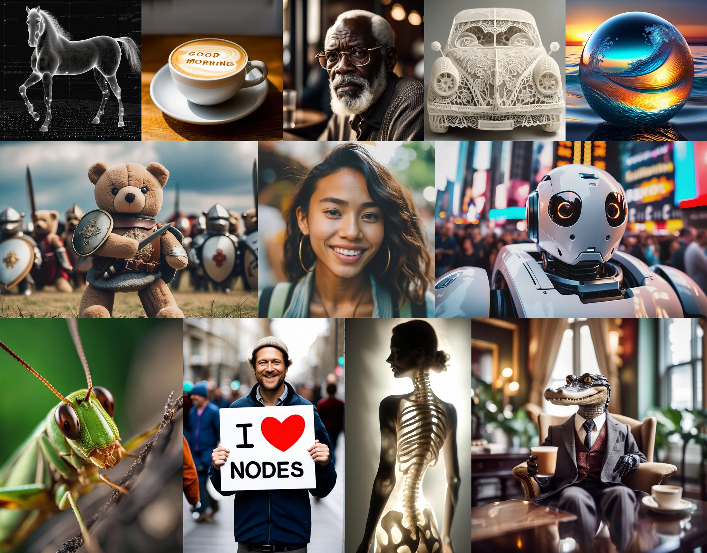
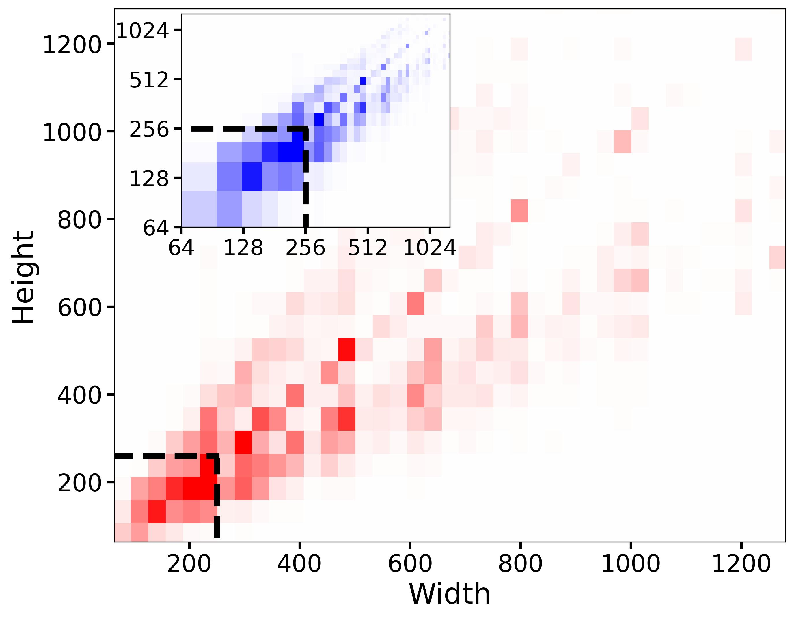
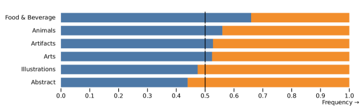
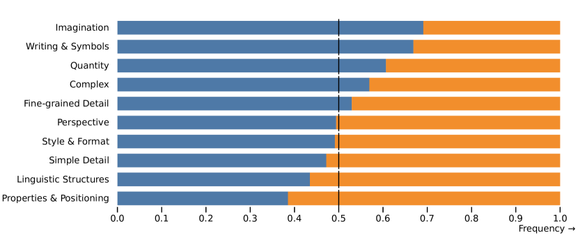
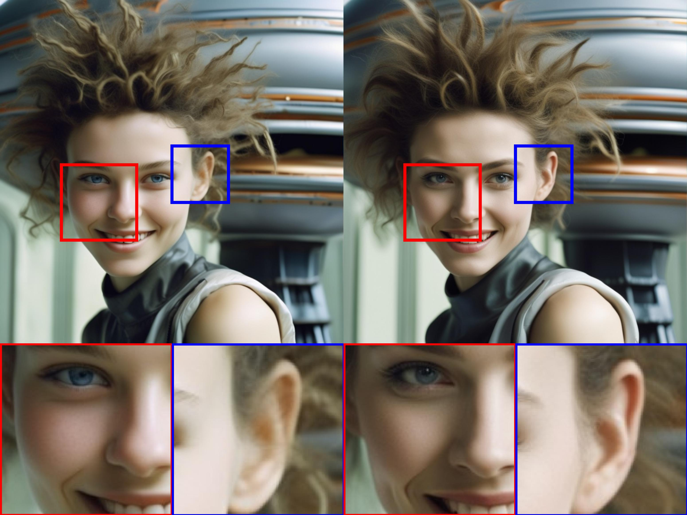
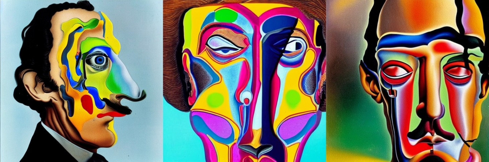

# SDXL: 高解像度画像合成のための潜在拡散モデルの改良

> 原題: SDXL: Improving Latent Diffusion Models for High-Resolution Image Synthesis
> 著者: Dustin Podell, Zion English, Kyle Lacey, Andreas Blattmann, Tim Dockhorn, Jonas Müller, Joe Penna, Robin Rombach（Stability AI, Applied Research）
> 出典: arXiv:2307.01952 ・ Code: https://github.com/Stability-AI/generative-models ・ Model weights: https://huggingface.co/stabilityai/

## Abstract（要旨）

我々は text-to-image 合成のための潜在拡散モデル *SDXL* を提示する。以前のバージョンの *Stable Diffusion* と比べ、*SDXL* は 3 倍大きい UNet バックボーンを活用する：モデルパラメータの増加は、主としてより多くの attention block と、*SDXL* が 2 つ目のテキストエンコーダを使うことによるより大きな cross-attention コンテキストに由来する。我々は複数の新しい条件付けスキームを設計し、*SDXL* を複数のアスペクト比で学習する。さらに、*SDXL* が生成したサンプルの視覚的忠実度を、事後的な *image-to-image* 技術で改善するために用いる *refinement model（精緻化モデル）* を導入する。*SDXL* が以前のバージョンの *Stable Diffusion* と比べて劇的に改善された性能を示し、ブラックボックスの最先端画像生成器に匹敵する結果を達成することを実証する。オープンな研究を促進し、大規模モデルの学習と評価における透明性を育む精神に基づき、我々はコードとモデル重みへのアクセスを提供する。

<figure>



<figcaption>teaser 画像: SDXL が生成した高解像度サンプルのギャラリー。</figcaption>
</figure>

## 1 はじめに

昨年は、自然言語・音声・視覚メディアなど様々なデータ領域にわたって深層生成モデリングに巨大な飛躍がもたらされた。本報告では後者に焦点を当て、*Stable Diffusion* を劇的に改良したバージョンである *SDXL* を公開する。*Stable Diffusion* は潜在 text-to-image 拡散モデル（DM）であり、例えば 3D 分類・制御可能な画像編集・画像個人化・合成データ拡張・GUI プロトタイピングなど、近年の数々の進歩の基盤として機能する。注目すべきことに、その応用範囲は音楽生成や fMRI 脳スキャンからの画像再構成に至るまで、極めて広範な分野に及んでいる。

ユーザー調査は、*SDXL* がすべての以前のバージョンの *Stable Diffusion* を有意な差で一貫して上回ることを示す（図1 参照）。本報告では、この性能向上をもたらした設計上の選択を提示する：すなわち *i)* 以前の *Stable Diffusion* モデルと比べ 3 $\times$ 大きい UNet バックボーン（§2.1）、*ii)* いかなる追加の教師信号も必要としない 2 つの単純だが効果的な追加条件付け技術（§2.2）、*iii)* *SDXL* が生成した潜在に対し noising-denoising プロセスを適用してサンプルの視覚品質を改善する、独立した拡散ベースの refinement model（§2.5）である。

視覚メディア制作の分野における主要な懸念は、ブラックボックスモデルがしばしば最先端と認識される一方、そのアーキテクチャの不透明さがその性能の忠実な評価・検証を妨げる点である。この透明性の欠如は再現性を阻害し、革新を抑制し、コミュニティがこれらのモデルを土台に科学と芸術の進歩を推し進めることを妨げる。さらに、こうしたクローズドソース戦略は、これらのモデルのバイアスや限界を公平かつ客観的に評価することを困難にする。これは責任ある倫理的な展開にとって極めて重要である。*SDXL* により、我々はブラックボックス画像生成モデルと競争力ある性能を達成するオープンなモデルを公開する（図10・図11 参照）。

## 2 Stable Diffusion の改良

本節では *Stable Diffusion* アーキテクチャに対する我々の改良を提示する。これらはモジュラーであり、任意のモデルを拡張するために個別に、あるいは組み合わせて使える。以下の戦略は潜在拡散モデル（LDM）への拡張として実装されているが、その大半はピクセル空間版にも適用可能である。

<figure>


<figcaption>図1（左）: SDXL と Stable Diffusion 1.5 & 2.1 のユーザー選好の比較。SDXL はすでに 1.5 & 2.1 を明確に上回るが、追加の精緻化段階を加えると性能がさらに向上する。（原図の右側＝2 段パイプラインの可視化：128×128 の初期潜在を生成し、専用の高解像度 refinement model で第 1 段の潜在に SDEdit を適用する。base と refinement model は同じオートエンコーダを使う。）</figcaption>
</figure>

### 2.1 アーキテクチャとスケール

**表1**: *SDXL* と旧 *Stable Diffusion* モデルの比較。

| Model | *SDXL* | SD 1.4/1.5 | SD 2.0/2.1 |
| --- | --- | --- | --- |
| UNet パラメータ数 | 2.6B | 860M | 865M |
| Transformer blocks | [0, 2, 10] | [1, 1, 1, 1] | [1, 1, 1, 1] |
| Channel mult. | [1, 2, 4] | [1, 2, 4, 4] | [1, 2, 4, 4] |
| Text encoder | CLIP ViT-L & OpenCLIP ViT-bigG | CLIP ViT-L | OpenCLIP ViT-H |
| Context dim. | 2048 | 768 | 1024 |
| Pooled text emb. | OpenCLIP ViT-bigG | N/A | N/A |

DM が画像合成のための強力な生成モデルであることを実証した先駆的研究以来、畳み込み UNet アーキテクチャが拡散ベースの画像合成の支配的なアーキテクチャであり続けてきた。しかし基盤的 DM の発展とともに、その基礎となるアーキテクチャは絶えず進化してきた：self-attention と改良されたアップスケーリング層の追加から、text-to-image 合成のための cross-attention を経て、純粋な transformer ベースのアーキテクチャへと。

我々はこの趨勢に従い、[16]（simple diffusion）に倣って、transformer の計算の大半を UNet 内のより低レベルの特徴に移す。特に、元の *Stable Diffusion* アーキテクチャとは対照的に、我々は UNet 内で transformer block の不均一な分布を用いる：効率上の理由から、最高の特徴レベルでは transformer block を省略し、より低いレベルでは 2 個と 10 個の block を用い、UNet の最低レベル（$8\times$ ダウンサンプリング）は完全に取り除く——*Stable Diffusion* 1.x & 2.x と *SDXL* のアーキテクチャの比較は表1 を参照。我々はテキスト条件付けに用いる、より強力な事前学習済みテキストエンコーダを選ぶ。具体的には、OpenCLIP ViT-bigG を CLIP ViT-L と組み合わせて用い、両者の最後から 2 番目のテキストエンコーダ出力を channel 軸に沿って連結する。テキスト入力でモデルを条件付けるための cross-attention 層に加え、我々は [30]（GLIDE）に倣い、OpenCLIP モデルからの pooled text embedding でモデルをさらに条件付ける。これらの変更により UNet のモデルサイズは 2.6B パラメータになる（表1）。テキストエンコーダは合計 817M パラメータのサイズを持つ。

### 2.2 Micro-Conditioning（マイクロ条件付け）

<figure>



<figcaption>図2: 我々の事前学習データセットの 高さ対幅 の分布。提案する size-conditioning がなければ、点線の黒線で可視化されるように、辺の長さが 256 ピクセル未満であることを理由に 39% のデータが破棄されることになる。各セルの色の濃さはサンプル数に比例する。</figcaption>
</figure>

#### 画像サイズによるモデルの条件付け

LDM パラダイムの悪名高い欠点は、その 2 段アーキテクチャゆえに、モデルの学習が*最小画像サイズ*を要する点である。この問題に対処する 2 つの主要なアプローチは、ある最小解像度未満の全学習画像を破棄するか（例えば *Stable Diffusion* 1.4/1.5 はいずれかの辺が 512 ピクセル未満の全画像を破棄した）、あるいは小さすぎる画像をアップスケールするかである。しかし、所望の画像解像度によっては、前者の手法は学習データの大部分を破棄することにつながりうる。これは性能の損失と汎化の悪化を招く可能性が高い。一方、後者の手法は通常アップスケーリングのアーティファクトを導入し、それが最終的なモデル出力に漏れ込んで、例えばぼやけたサンプルを引き起こしうる。

代わりに我々は、UNet モデルを元の画像解像度で条件付けることを提案する。これは学習中に自明に利用可能である。特に、画像の（すなわち、いかなるリスケール前の）元の高さと幅を追加の条件付けとしてモデルに与える：$\mathbf{c}_{\text{size}}=(h_{\text{original}},w_{\text{original}})$。各成分は Fourier 特徴エンコーディングを用いて独立に埋め込まれ、これらのエンコーディングは単一のベクトルに連結され、timestep embedding に加算する形でモデルに与えられる。

<figure>


<figcaption>図3: size-conditioning を変化させた効果：SDXL から同じ乱数シードで 4 枚のサンプルを描き、各列の上に示すように size-conditioning を変化させる。より大きな画像サイズで条件付けると画像品質が明らかに向上する。512² モデルからのサンプル（§2.5 参照、size conditioning の効果は 1024×1024 のファインチューン前の方が明確に見えるため）。</figcaption>
</figure>

推論時、ユーザーはこの *size-conditioning* を介して画像の所望の*見かけの解像度*を設定できる。明らかに（図3 参照）、モデルは条件付け $c_{\text{size}}$ を解像度依存の画像特徴と関連づけることを学習しており、これは与えられたプロンプトに対応する出力の見た目を変えるために活用できる。なお図3 の可視化では、512×512 モデルが生成したサンプルを示している（詳細は §2.5）。最終 *SDXL* モデルに用いる後続のマルチアスペクト（比）ファインチューンの後では、size conditioning の効果がより明確には見えなくなるためである。

**表2**: 学習サンプルの元の空間サイズで条件付けると、$512^{2}$ 解像度のクラス条件付き ImageNet での性能が向上する。

| model | FID-5k $\downarrow$ | IS-5k $\uparrow$ |
| --- | --- | --- |
| *CIN-512-only* | 43.84 | 110.64 |
| *CIN-nocond* | 39.76 | 211.50 |
| *CIN-size-cond* | 36.53 | 215.34 |

我々は、この単純だが効果的な条件付け技術の効果を、クラス条件付き ImageNet において空間サイズ $512^{2}$ で 3 つの LDM を学習・評価することで定量的に評価する：1 つ目のモデル（*CIN-512-only*）では少なくとも 1 辺が $512$ ピクセル未満の全学習サンプルを破棄し、その結果わずか 70k 画像の学習データセットになる。*CIN-nocond* では全学習サンプルを使うが size conditioning なし。この追加条件付けは *CIN-size-cond* でのみ使う。学習後、各モデルについて 50 DDIM ステップと（classifier-free）guidance scale 5 で 5k サンプルを生成し、IS と FID を（全検証セットに対して）計算する。*CIN-size-cond* では常に $\mathbf{c}_{\text{size}}=(512,512)$ で条件付けてサンプルを生成する。表2 は結果をまとめ、*CIN-size-cond* が両指標でベースラインモデルを上回ることを確認する。*CIN-512-only* の性能劣化は小さな学習データセットへの過学習による汎化の悪さに、*CIN-nocond* の FID スコア低下はサンプル分布中のぼやけたサンプルのモードの影響に帰せられる。なお、これらの古典的な定量スコアは基盤的（text-to-image）DM の性能評価には適さないと我々は考えるが（App. F 参照）、FID と IS のニューラルバックボーンが ImageNet 自体で学習されているため、ImageNet 上では合理的な指標であり続ける。

#### Cropping パラメータによるモデルの条件付け

<figure>


<figcaption>図4: SDXL の出力と以前のバージョンの Stable Diffusion の比較。各プロンプトについて、各モデルの 3 枚のランダムサンプルを DDIM サンプラー 50 ステップ・cfg-scale 8.0 で示す。追加サンプルは図14。</figcaption>
</figure>

図4 の最初の 2 行は、以前の *SD* モデルの典型的な失敗モードを示す：合成された物体が切り取られうる（crop されうる）。例えば *SD* 1-5 と *SD* 2-1 の左の例では猫の頭が切れている。この挙動の直感的な説明は、モデルの学習中の *random cropping（ランダムクロップ）* の使用である：PyTorch のような DL フレームワークでバッチを構成するには同じサイズのテンソルが必要なので、典型的な処理パイプラインは (i) 最短辺が所望のターゲットサイズに一致するよう画像をリサイズし、(ii) より長い軸に沿って画像をランダムにクロップする。random cropping は自然なデータ拡張の一形態だが、生成サンプルに漏れ込み、上記のような悪影響を引き起こしうる。

この問題を解決するため、我々はもう 1 つの単純だが効果的な条件付け手法を提案する：データロード中に、クロップ座標 $c_{\text{top}}$ と $c_{\text{left}}$（それぞれ高さ・幅軸に沿って左上隅からクロップされるピクセル量を指定する整数）を一様にサンプルし、上記の size conditioning と同様に Fourier 特徴埋め込みを介して条件付けパラメータとしてモデルに与える。連結された埋め込み $\mathbf{c}_{\text{crop}}$ が追加の条件付けパラメータとして用いられる。この技術は LDM に限られず、任意の DM に使えることを強調する。なお crop conditioning と size conditioning は容易に組み合わせられる。その場合、UNet で timestep embedding に加算する前に、特徴埋め込みを channel 次元に沿って連結する。アルゴリズム1 は、こうした組合せを適用する場合に学習中に $\mathbf{c}_{\text{crop}}$ と $\mathbf{c}_{\text{size}}$ をどうサンプルするかを示す。

```
アルゴリズム1 size 条件付けと crop 条件付けのための条件付けパイプライン

入力: 画像の学習データセット D、学習のターゲット画像サイズ s=(h_tgt, w_tgt)
     リサイズ関数 R、クロップ関数 C、モデル学習ステップ T

converged ← False
while not converged do
    x ∼ D
    w_original ← width(x)
    h_original ← height(x)
    c_size ← (h_original, w_original)
    x ← R(x, s)                              ▷ 小さい方の画像サイズをターゲットサイズ s にリサイズ
    if h_original ≤ w_original then
        c_left ∼ U(0, width(x) − s_w)        ▷ c_left を離散一様分布からサンプル
        c_top = 0
    else if h_original > w_original then
        c_top ∼ U(0, height(x) − s_h)        ▷ c_top を離散一様分布からサンプル
        c_left = 0
    end if
    c_crop ← (c_top, c_left)
    x ← C(x, s, c_crop)                      ▷ 左上座標 (c_top, c_left) でサイズ s に画像をクロップ
    converged ← T(x, c_size, c_crop)         ▷ c_size と c_crop で条件付けてモデルを学習
end while
```

我々の経験では大規模データセットは平均して物体中心的であることを踏まえ、推論時には $\left(c_{\text{top}},c_{\text{left}}\right)=\left(0,0\right)$ に設定し、それにより学習済みモデルから物体中心のサンプルを得る。

<figure>


<figcaption>図5: §2.2 で論じた crop conditioning を変化させた様子。この パラメータを明示的に制御できず crop アーティファクトを導入してしまう SD 1.5・2.1 のサンプルは図4・14 を参照。512² モデルからのサンプル（§2.5 参照）。</figcaption>
</figure>

図5 を参照：$\left(c_{\text{top}},c_{\text{left}}\right)$ を調整することで、推論時にクロップ量を *シミュレート* できる。これは *conditioning-augmentation（条件付け拡張）* の一形態であり、自己回帰モデルで様々な形で、より最近では拡散モデルで使われてきた。

data bucketing のような他の手法も同じタスクにうまく取り組むが、我々は crop によって引き起こされるデータ拡張の恩恵を依然受けつつ、それが生成過程に漏れ込まないことを保証する——実際、我々はそれを画像合成過程をより制御するために有利に使う。さらに、これは実装が容易で、追加のデータ前処理なしに学習中にオンラインで適用できる。

### 2.3 Multi-Aspect Training（マルチアスペクト学習）

実世界のデータセットは幅広く変化するサイズとアスペクト比の画像を含む（図2 参照）。text-to-image モデルの一般的な出力解像度は $512\times 512$ または $1024\times 1024$ ピクセルの正方形画像だが、横長（例 16:9）や縦長フォーマットの画面の広範な普及と使用を踏まえると、これはむしろ不自然な選択だと我々は主張する。

これに動機づけられ、我々はモデルを複数のアスペクト比を同時に扱うようファインチューンする：一般的な慣行に倣い、データを異なるアスペクト比の bucket に分割する。その際、ピクセル数をできるだけ $1024^{2}$ ピクセルに近く保ち、高さと幅をそれに応じて 64 の倍数で変化させる。学習に用いた全アスペクト比の完全なリストは App. I に提供する。最適化中、学習バッチは同じ bucket の画像から構成し、各学習ステップで bucket サイズを交互に切り替える。さらに、モデルは bucket サイズ（すなわち *target size*）を条件付けとして受け取る。これは上記の size・crop conditioning と同様に Fourier 空間に埋め込まれる整数のタプル $\mathbf{c}_{\text{ar}}=(h_{\text{tgt}},w_{\text{tgt}})$ として表される。

実際には、固定アスペクト比・解像度でモデルを事前学習した後のファインチューン段階としてマルチアスペクト学習を適用し、§2.2 で導入した条件付け技術と channel 軸に沿った連結を介して組み合わせる。App. J の図16 がこの操作の `python` コードを提供する。なお crop conditioning とマルチアスペクト学習は補完的な操作であり、crop conditioning はその場合 bucket の境界内（通常 64 ピクセル）でのみ機能する。ただし実装の容易さのため、マルチアスペクトモデルでもこの制御パラメータを保持することにする。

### 2.4 改良されたオートエンコーダ

**表3**: COCO2017 検証分割（$256\times 256$ ピクセル画像）でのオートエンコーダの再構成性能。なお *Stable Diffusion* 2.x は *Stable Diffusion* 1.x のオートエンコーダの改良版を使い、そこではデコーダが perceptual loss の重みを下げて、より多くの計算を使ってファインチューンされている。我々の新しいオートエンコーダはゼロから学習されている点に注意。

| model | PSNR $\uparrow$ | SSIM $\uparrow$ | LPIPS $\downarrow$ | rFID $\downarrow$ |
| --- | --- | --- | --- | --- |
| *SDXL*-VAE | **24.7** | **0.73** | **0.88** | **4.4** |
| *SD*-VAE 1.x | 23.4 | 0.69 | 0.96 | 5.0 |
| *SD*-VAE 2.x | 24.5 | 0.71 | 0.92 | 4.7 |

*Stable Diffusion* は *LDM* であり、オートエンコーダの事前学習済みで学習された（そして固定された）潜在空間で動作する。意味的構成の大半は LDM が行うが、オートエンコーダを改良することで生成画像の*局所的*で高周波な細部を改善できる。この目的のため、我々は元の *Stable Diffusion* で使われたのと同じオートエンコーダアーキテクチャを、より大きなバッチサイズ（256 対 9）で学習し、さらに指数移動平均で重みを追跡する。結果として得られるオートエンコーダは、評価された全再構成指標で元のモデルを上回る（表3 参照）。我々は全実験でこのオートエンコーダを使う。

### 2.5 すべてを組み合わせる

我々は最終モデル *SDXL* を多段手順で学習する。*SDXL* は §2.4 のオートエンコーダと $1000$ ステップの離散時間拡散スケジュールを使う。まず、高さ・幅分布が図2 で可視化される内部データセットで、$256\times 256$ ピクセル解像度・バッチサイズ $2048$ で $600\,000$ 最適化ステップ、§2.2 の size・crop conditioning を用いて base モデル（表1 参照）を事前学習する。続いて $512\times 512$ ピクセル画像でさらに $200\,000$ 最適化ステップ学習を続け、最後に offset-noise レベル $0.05$ と組み合わせたマルチアスペクト学習（§2.3）を用いて、$\sim$ $1024\times 1024$ ピクセル面積の異なるアスペクト比でモデルを学習する。

#### 精緻化段階（Refinement Stage）

経験的に、結果として得られるモデルは時に局所品質の低いサンプルを生むことが分かる（図6 参照）。サンプル品質を改善するため、我々は同じ潜在空間で、高品質・高解像度データに特化した独立した LDM を学習し、base モデルからのサンプルに *SDEdit* が導入した noising-denoising プロセスを用いる。我々は [1]（eDiff-I）に倣い、この refinement model を先頭 200 個の（離散）ノイズスケールに特化させる。推論時、base *SDXL* から潜在をレンダリングし、同じテキスト入力を使って refinement model でそれらを潜在空間で直接 diffuse・denoise する（図1 参照）。この段階はオプションだが、図6・図13 で示すように、詳細な背景や人間の顔のサンプル品質を改善する。

我々のモデル（精緻化段階あり・なし）の性能を評価するため、ユーザー調査を実施し、次の 4 モデルから好みの生成物を選んでもらう：*SDXL*、*SDXL*（refiner あり）、*Stable Diffusion* 1.5、*Stable Diffusion* 2.1。結果は精緻化段階ありの *SDXL* が最も高評価の選択肢であり、*Stable Diffusion* 1.5 & 2.1 を有意な差で上回ることを示す（勝率：*SDXL* w/ refinement: $48.44\%$、*SDXL* base: $36.93\%$、*Stable Diffusion* 1.5: $7.91\%$、*Stable Diffusion* 2.1: $6.71\%$）。図1 を参照（パイプライン全体の概観も提供する）。しかし FID や CLIP スコアのような古典的な性能指標を使うと、*SDXL* の以前の手法に対する改善は図12 が示し App. F で論じるように反映されない。これは [23] の知見と一致し、さらにそれを裏付ける。

<figure>


<figcaption>図6: 論じた refinement model なし（左）・あり（右）の SDXL の 1024² サンプル（ズームイン付き）。プロンプト：「Epic long distance cityscape photo of New York City flooded by the ocean and overgrown buildings and jungle ruins in rainforest, at sunset, cinematic shot, highly detailed, 8k, golden light」。追加サンプルは図13。</figcaption>
</figure>

## 3 今後の課題

本報告は text-to-image 合成のための基盤モデル *Stable Diffusion* への改良の予備的分析を提示する。合成画像品質・プロンプト追従・構成において有意な改善を達成したが、以下ではモデルがさらに改善されうると我々が考えるいくつかの側面を論じる：

- **単段化**：現在、*SDXL* から最良のサンプルを得るには追加の refinement model を用いた 2 段アプローチを使う。これは 2 つの大きなモデルをメモリにロードする必要を生み、アクセシビリティとサンプリング速度を損なう。今後の研究は同等以上の品質を持つ単一段を提供する方法を調べるべきである。
- **テキスト合成**：スケールとより大きなテキストエンコーダ（OpenCLIP ViT-bigG）は以前のバージョンの *Stable Diffusion* よりテキスト描画能力の改善に役立つが、byte レベルのトークナイザを取り入れるか、単にモデルをより大きなサイズにスケールすることで、テキスト合成をさらに改善できるかもしれない。
- **アーキテクチャ**：本研究の探索段階で、UViT や DiT のような transformer ベースのアーキテクチャを簡単に試したが、即座の利点は見出せなかった。しかし我々は、入念なハイパーパラメータ研究が最終的に、はるかに大きな transformer 主導のアーキテクチャへのスケーリングを可能にすると楽観的である。
- **蒸留**：元の *Stable Diffusion* モデルに対する我々の改善は有意だが、推論コスト（VRAM とサンプリング速度の両方）の増加という代償を伴う。今後の研究は、例えば guidance 蒸留・知識蒸留・progressive distillation を通じて、推論に必要な計算の削減とサンプリング速度の向上に焦点を当てる。
- 我々のモデルは [14]（DDPM）の離散時間定式化で学習されており、美的に好ましい結果のために *offset-noise* を要する。[21] の EDM フレームワークは、連続時間での定式化がサンプリングの柔軟性の向上を可能にし、ノイズスケジュールの補正を必要としないため、今後のモデル学習の有望な候補である。

## 付録

## 付録A 謝辞

（訳注: 謝辞は翻訳対象外）

## 付録B 限界

<figure>


<figcaption>図7: SDXL の失敗例。以前のバージョンの Stable Diffusion と比べ大きな改善があるにもかかわらず、モデルは時に、詳細な空間配置や詳細な記述を含む非常に複雑なプロンプト（例：左上の例）に依然苦戦する。さらに、手は依然として常に正しく生成されるわけではなく（例：左上）、モデルは時に 2 つの概念が互いに混ざり合う問題に陥る（例：右下の例）。全例は DDIM サンプラー 50 ステップ・cfg-scale 8.0 で生成したランダムサンプル。</figcaption>
</figure>

我々のモデルは現実的な画像の生成と複雑なシーンの合成で印象的な能力を実証したが、その固有の限界を認めることが重要である。これらの限界を理解することは、さらなる改善と技術の責任ある使用の確保に不可欠である。

第 1 に、モデルは人間の手のような複雑な構造を合成する際に困難に遭遇しうる（図7、左上参照）。多様な範囲のデータで学習されているが、人体解剖学の複雑さが一貫して正確な表現を達成する難しさをもたらす。この限界は、細粒度の細部の合成を特に対象とするさらなるスケーリングと学習技術の必要性を示唆する。これが起きる理由は、手や類似の物体が写真中で非常に高い分散で現れ、その場合にモデルが実際の 3D 形状と物理的制約の知識を抽出するのが難しいためかもしれない。

第 2 に、モデルは生成画像で目覚ましいレベルの写実性を達成するが、完全な写実性には到達しないことに注意することが重要である。微妙な照明効果や微小なテクスチャの変化のような特定のニュアンスは、生成画像で依然欠落しているか、より忠実でなく表現されうる。この限界は、高度な視覚的忠実度を要する応用でモデル生成の視覚物だけに頼る際には注意を払うべきことを意味する。

さらに、モデルの学習過程は大規模データセットに大きく依存しており、それは不注意に社会的・人種的バイアスを導入しうる。結果として、モデルは画像生成や視覚属性の推論時にこれらのバイアスを不注意に悪化させうる。

サンプルが複数の物体や被写体を含む特定の場合、モデルは「concept bleeding（概念のにじみ）」として知られる現象を示しうる。この問題は、別個の視覚要素の意図しない融合や重複として現れる。例えば図14 では、オレンジ色のサングラスが観察され、これはオレンジ色のセーターからの concept bleeding の一例を示す。別の例は図8 で見られ、ペンギンは「青い帽子」と「赤い手袋」を持つはずだが、代わりに青い手袋と赤い帽子で生成されている。こうした発生を認識し対処することは、複雑なシーン内で個々の物体を正確に分離・表現するモデルの能力を洗練するために不可欠である。この根本原因は、使われる事前学習済みテキストエンコーダにあるかもしれない：第 1 に、それらは全情報を単一トークンに圧縮するよう学習されているため、正しい属性と物体だけを結びつけることに失敗しうる。[8] はこの問題を、単語の関係をエンコーディングに明示的に符号化することで緩和する。第 2 に、対照損失も寄与しうる。異なる結合を持つ負例が同じバッチ内で必要だからである。

加えて、我々のモデルは以前の *SD* の反復に対する有意な進歩を表すが、長く判読可能なテキストをレンダリングする際には依然困難に遭遇する。時折、生成テキストはランダムな文字を含むか、図8 に示すように不整合を示しうる。この限界の克服には、特に長いテキスト内容に対し、モデルのテキスト生成能力を高める技術のさらなる調査と開発が必要である——例えば文字レベルのテキストトークナイザを介してテキスト描画能力を高めることを提案する [27] の研究を参照。あるいは、モデルをスケールすることでもテキスト合成はさらに改善する。

結論として、我々のモデルは画像合成で注目すべき強みを示すが、特定の限界から免れてはいない。複雑な構造の合成・完全な写実性の達成・バイアスへのさらなる対処・concept bleeding の緩和・テキスト描画の改善に関連する課題は、今後の研究と最適化の道筋を浮き彫りにする。

## 付録C 拡散モデル

本節では DM の簡潔な要約を与える。我々は連続時間 DM フレームワーク [47]（Score-SDE）を考え、[21]（EDM）の提示に従う。$p_{\rm{data}}({\mathbf{x}}_{0})$ をデータ分布、$p({\mathbf{x}};\sigma)$ をデータに i.i.d. の $\sigma^{2}$ 分散ガウスノイズを加えて得られる分布とする。十分大きな $\sigma_{\mathrm{max}}$ に対し、$p({\mathbf{x}};\sigma_{\mathrm{max}}^{2})$ は $\sigma^{2}_{\mathrm{max}}$ 分散ガウスノイズとほとんど区別できない。この観察を活用し、DM は高分散ガウスノイズ ${\mathbf{x}}_{M}\sim{\mathcal{N}}\left(\bm{0},\sigma_{\mathrm{max}}^{2}\right)$ をサンプルし、${\mathbf{x}}_{M}$ を逐次的に ${\mathbf{x}}_{i}\sim p({\mathbf{x}}_{i};\sigma_{i})$（$i\in\{0,\dots,M\}$、$\sigma_{i}<\sigma_{i+1}$、$\sigma_{M}=\sigma_{\mathrm{max}}$）へとノイズ除去する。よく学習された DM と $\sigma_{0}=0$ に対し、結果の ${\mathbf{x}}_{0}$ はデータに従って分布する。

**サンプリング。** 実際には、上で説明した反復的ノイズ除去過程は、*Probability Flow* 常微分方程式（ODE）の数値シミュレーションを通じて実装できる：

$$
d{\mathbf{x}}=-\dot{\sigma}(t)\sigma(t)\nabla_{\mathbf{x}}\log p({\mathbf{x}};\sigma(t))\,dt,
$$

ここで $\nabla_{\mathbf{x}}\log p({\mathbf{x}};\sigma)$ は *score function（スコア関数）*。スケジュール $\sigma(t)\colon[0,1]\to\mathbb{R}_{+}$ はユーザー指定で、$\dot{\sigma}(t)$ は $\sigma(t)$ の時間微分を表す。あるいは、確率微分方程式（SDE）を数値シミュレートすることもできる：

$$
d{\mathbf{x}}=\underbrace{-\dot{\sigma}(t)\sigma(t)\nabla_{\mathbf{x}}\log p({\mathbf{x}};\sigma(t))\,dt}_{\text{Probability Flow ODE}}-\underbrace{\beta(t)\sigma^{2}(t)\nabla_{\mathbf{x}}\log p({\mathbf{x}};\sigma(t))\,dt+\sqrt{2\beta(t)}\sigma(t)\,d\omega_{t}}_{\text{Langevin 拡散成分}},
$$

ここで $d\omega_{t}$ は標準 Wiener 過程。原理的には、上の Probability Flow ODE または SDE のいずれをシミュレートしても、同じ分布からのサンプルが得られる。

**学習。** DM の学習は、スコア関数 $\nabla_{\mathbf{x}}\log p({\mathbf{x}};\sigma)$ のためのモデル ${\bm{s}}_{\bm{\theta}}({\mathbf{x}};\sigma)$ を学習することに帰着する。モデルは例えば $\nabla_{\mathbf{x}}\log p({\mathbf{x}};\sigma)\approx s_{\bm{\theta}}({\mathbf{x}};\sigma)=(D_{\bm{\theta}}({\mathbf{x}};\sigma)-{\mathbf{x}})/\sigma^{2}$ とパラメータ化できる。ここで $D_{\bm{\theta}}$ は、ノイズの乗ったデータ点 ${\mathbf{x}}_{0}+{\mathbf{n}}$（${\mathbf{x}}_{0}\sim p_{\rm{data}}({\mathbf{x}}_{0})$、${\mathbf{n}}\sim{\mathcal{N}}\left(\bm{0},\sigma^{2}{\bm{I}}_{d}\right)$）が与えられ、ノイズレベル $\sigma$ で条件付けられたとき、クリーンな ${\mathbf{x}}_{0}$ を予測しようとする学習可能な *denoiser（ノイズ除去器）* である。denoiser $D_{\bm{\theta}}$（または等価にスコアモデル）は *denoising score matching（DSM, ノイズ除去スコアマッチング）* を介して学習できる：

$$
\mathbb{E}_{({\mathbf{x}}_{0},{\mathbf{c}})\sim p_{\rm{data}}({\mathbf{x}}_{0},{\mathbf{c}}),(\sigma,{\mathbf{n}})\sim p(\sigma,{\mathbf{n}})}\left[\lambda_{\sigma}\|D_{\bm{\theta}}({\mathbf{x}}_{0}+{\mathbf{n}};\sigma,{\mathbf{c}})-{\mathbf{x}}_{0}\|_{2}^{2}\right],
$$

ここで $p(\sigma,{\mathbf{n}})=p(\sigma)\,{\mathcal{N}}\left({\mathbf{n}};\bm{0},\sigma^{2}\right)$、$p(\sigma)$ はノイズレベル $\sigma$ 上の分布、$\lambda_{\sigma}\colon\mathbb{R}_{+}\to\mathbb{R}_{+}$ は重み付け関数、${\mathbf{c}}$ は任意の条件付け信号（例：クラスラベル、テキストプロンプト、またはそれらの組合せ）。本研究では $p(\sigma)$ を 1000 個のノイズレベル上の離散分布とし、先行研究に倣って $\lambda_{\sigma}=\sigma^{-2}$ と設定する。

**Classifier-free guidance。** Classifier-free guidance は、条件付きモデルと無条件モデルの予測を混ぜることで、DM の反復的サンプリング過程を条件付け信号 ${\mathbf{c}}$ へと導く技術である：

$$
D^{w}({\mathbf{x}};\sigma,{\mathbf{c}})=(1+w)D({\mathbf{x}};\sigma,{\mathbf{c}})-wD({\mathbf{x}};\sigma),
$$

ここで $w\geq 0$ は *guidance 強度*。実際には、無条件モデルは条件付き信号 ${\mathbf{c}}$ を null 埋め込みでランダムに（例えば 10% の確率で）置き換えることで、単一ネットワーク内で条件付きモデルと同時に学習できる。Classifier-free guidance は、多様性とのトレードオフでサンプリング品質を改善するために、text-to-image DM で広く使われる。

## 付録D 最先端との比較

<figure>


<figcaption>図8: SDXL と DeepFloyd IF・DALLE-2・Bing Image Creator・Midjourney v5.2 の定性比較。cherry-picking から生じるバイアスを緩和するため、Parti（P2）プロンプトはランダムに選んだ。シード 3 を、そうしたパラメータを指定できる全モデルで一律に適用した。シード設定機能のないモデルでは最初に生成された画像を含めた。</figcaption>
</figure>

## 付録E Midjourney v5.1 との比較

### E.1 全体投票

*SDXL* の生成品質を評価するため、最先端の text-to-image 生成プラットフォーム Midjourney に対するユーザー調査を実施する。画像キャプションの源として、大規模 text-to-image モデルを様々な困難なプロンプトで比較するために導入された PartiPrompts（P2）ベンチマークを使う。

本調査では、各カテゴリから 5 つのランダムなプロンプトを選び、各プロンプトについて Midjourney（v5.1、シード 2 設定）と *SDXL* の両方で 4 枚の $1024\times 1024$ 画像を生成する。これらの画像は AWS GroundTruth タスクフォースに提示され、プロンプトへの追従に基づいて投票された。これらの投票の結果は図9 に示される。全体として、プロンプト追従の点で Midjourney よりも *SDXL* がわずかに好まれている。

<figure>


<figcaption>図9: SDXL v0.9 と（当時の最新版だった）Midjourney v5.1 の間の 17,153 件のユーザー選好比較の結果。比較は PartiPrompts（P2）ベンチマークの全「カテゴリ」と「チャレンジ」に及ぶ。注目すべきことに、SDXL は Midjourney V5.1 に対し 54.9% の割合で好まれた。</figcaption>
</figure>

### E.2 PartiPrompts（P2）でのカテゴリ・チャレンジ比較

P2 ベンチマークの各プロンプトはカテゴリとチャレンジに整理され、それぞれ生成過程の異なる難しい側面に焦点を当てる。以下に P2 の各カテゴリ（図10）とチャレンジ（図11）の比較を示す。6 カテゴリ中 4 つで *SDXL* が Midjourney を上回り、10 チャレンジ中 7 つで両モデル間に有意差がないか *SDXL* が Midjourney を上回る。

<figure>



<figcaption>図10: SDXL（refinement model なし）と Midjourney V5.1 の特定テキストカテゴリにわたるユーザー選好比較。SDXL は 2 つを除く全カテゴリで上回る。</figcaption>
</figure>

<figure>



<figcaption>図11: SDXL（refinement model あり）と Midjourney V5.1 の複雑なプロンプトでの選好比較。SDXL は 10 カテゴリ中 7 つで上回るか統計的に同等である。</figcaption>
</figure>

## 付録F 生成的テキスト画像基盤モデルの FID 評価について

<figure>


<figcaption>図12: 異なる cfg スケールでの FID 対 CLIP スコアのプロット。SDXL は CLIP-score で測ると以前のバージョンと比べテキスト整合がわずかに改善されるだけで、人間評価者の判断とは一致しない。さらに [23] と同様に、SDXL の FID は SD-1.5・SD-2.1 のいずれよりも悪いが、人間評価者は明確に SD-XL の生成物をこれら以前のモデルより好む。</figcaption>
</figure>

ここ数年、生成的 text-to-image モデルにとって、COCO のような自然画像の複雑で小規模なテキスト画像データセットで zero-shot 設定の FID・CLIP スコアを評価することが一般的慣行だった。しかし、視覚的構成性だけでなく、深いテキスト理解・独自の芸術スタイル間の細粒度の区別・特に際立った視覚的審美の感覚といった他の難しいタスクも対象とする基盤的 text-to-image モデルの登場により、この特定の形のモデル評価はますます疑わしくなってきた。[23] は COCO zero-shot FID が視覚的審美と*負の相関*を持つことを実証し、そうしたモデルの生成性能の測定はむしろ人間評価者によって行うべきだとする。我々は *SDXL* についてこれを調査し、COCO の 10k テキスト画像ペアについて FID 対 CLIP 曲線を図12 で可視化する。人間評価者に尋ねて定量的に測られた（図1 参照）、また定性的にも（図4・図14 参照）劇的に改善された性能にもかかわらず、*SDXL* は以前の *SD* バージョンより良い FID スコアを達成*しない*。逆に、*SDXL* の FID は比較した 3 モデル中最悪であり、CLIP スコア（OpenClip ViT g-14 で測定）はわずかに改善されるだけである。したがって我々の結果は [23] の知見を裏付け、特に text-to-image 基盤モデルのための追加の定量的性能スコアの必要性をさらに強調する。全スコアは 10k 生成例に基づいて評価された。

## 付録G 単段 vs 2 段 SDXL パイプラインの追加比較

<figure>



<figcaption>図13: 論じた refinement model なし（左）・あり（右）の SDXL サンプル（ズームイン付き）。プロンプト：（上）「close up headshot, futuristic young woman, wild hair sly smile in front of gigantic UFO, dslr, sharp focus, dynamic composition」（下）「Three people having dinner at a table at new years eve, cinematic shot, 8k」。細部はズームイン。</figcaption>
</figure>

## 付録H SD 1.5 vs. SD 2.1 vs. SDXL の比較

<figure>



<figcaption>図14: SDXL の出力と以前のバージョンの Stable Diffusion の比較の追加結果。各プロンプトについて、各モデルの 3 枚のランダムサンプルを DDIM サンプラー 50 ステップ・cfg-scale 8.0 で示す。</figcaption>
</figure>

<figure>


<figcaption>図15: SDXL の出力と以前のバージョンの Stable Diffusion の比較の追加結果。各プロンプトについて、各モデルの 3 枚のランダムサンプルを DDIM サンプラー 50 ステップ・cfg-scale 8.0 で示す。</figcaption>
</figure>

## 付録I マルチアスペクト学習のハイパーパラメータ

§2.3 で述べたマルチアスペクト比ファインチューンに、以下の画像解像度を使う。

| Height | Width | Aspect Ratio |
| --- | --- | --- |
| 512 | 2048 | 0.25 |
| 512 | 1984 | 0.26 |
| 512 | 1920 | 0.27 |
| 512 | 1856 | 0.28 |
| 576 | 1792 | 0.32 |
| 576 | 1728 | 0.33 |
| 576 | 1664 | 0.35 |
| 640 | 1600 | 0.4 |
| 640 | 1536 | 0.42 |
| 704 | 1472 | 0.48 |
| 704 | 1408 | 0.5 |
| 704 | 1344 | 0.52 |
| 768 | 1344 | 0.57 |
| 768 | 1280 | 0.6 |
| 832 | 1216 | 0.68 |
| 832 | 1152 | 0.72 |
| 896 | 1152 | 0.78 |
| 896 | 1088 | 0.82 |
| 960 | 1088 | 0.88 |
| 960 | 1024 | 0.94 |
| 1024 | 1024 | 1.0 |
| 1024 | 960 | 1.07 |
| 1088 | 960 | 1.13 |
| 1088 | 896 | 1.21 |
| 1152 | 896 | 1.29 |
| 1152 | 832 | 1.38 |
| 1216 | 832 | 1.46 |
| 1280 | 768 | 1.67 |
| 1344 | 768 | 1.75 |
| 1408 | 704 | 2.0 |
| 1472 | 704 | 2.09 |
| 1536 | 640 | 2.4 |
| 1600 | 640 | 2.5 |
| 1664 | 576 | 2.89 |
| 1728 | 576 | 3.0 |
| 1792 | 576 | 3.11 |
| 1856 | 512 | 3.62 |
| 1920 | 512 | 3.75 |
| 1984 | 512 | 3.88 |
| 2048 | 512 | 4.0 |

## 付録J channel 軸に沿った条件付け連結の擬似コード

```python
from einops import rearrange
import torch

batch_size = 16
# channel dimension of pooled output of text encoder(s)
pooled_dim = 512

def fourier_embedding(inputs, outdim=256, max_period=10000):
    """
    Classical sinusoidal timestep embedding
    as commonly used in diffusion models
    :param inputs: batch of integer scalars shape [b,]
    :param outdim: embedding dimension
    :param max_period: max freq added
    :return: batch of embeddings of shape [b, outdim]
    """
    ...

def cat_along_channel_dim(x: torch.Tensor,) -> torch.Tensor:
    if x.ndim == 1:
        x = x[..., None]
    assert x.ndim == 2
    b, d_in = x.shape
    x = rearrange(x, "b din -> (b din)")
    # fourier fn adds additional dimension
    emb = fourier_embedding(x)
    d_f = emb.shape[-1]
    emb = rearrange(emb, "(b din) df -> b (din df)",
                    b=b, din=d_in, df=d_f)
    return emb

def concat_embeddings(
        # batch of size and crop conditioning cf. Sec. 2.2
        c_size: torch.Tensor,
        c_crop: torch.Tensor,
        # batch of aspect ratio conditioning cf. Sec. 2.3
        c_ar: torch.Tensor,
        # final output of text encoders after pooling cf. Sec. 2.1
        c_pooled_txt: torch.Tensor,) -> torch.Tensor:
    # fourier feature for size conditioning
    c_size_emb = cat_along_channel_dim(c_size)
    # fourier feature for crop conditioning
    c_crop_emb = cat_along_channel_dim(c_crop)
    # fourier feature for aspect ratio conditioning
    c_ar_emb = cat_along_channel_dim(c_ar)
    # the concatenated output is mapped to the same
    # channel dimension than the noise level conditioning
    # and added to that conditioning before being fed to the unet
    return torch.cat([c_pooled_txt,
                      c_size_emb,
                      c_crop_emb,
                      c_ar_emb], dim=1)

# simulating c_size and c_crop as in Sec. 2.2
c_size = torch.zeros((batch_size, 2)).long()
c_crop = torch.zeros((batch_size, 2)).long()
# simulating c_ar and pooled text encoder output as in Sec. 2.3
c_ar = torch.zeros((batch_size, 2)).long()
c_pooled = torch.zeros((batch_size, pooled_dim)).long()

# get concatenated embedding
c_concat = concat_embeddings(c_size, c_crop, c_ar, c_pooled)
```

図16: §2.1〜2.3 で導入した追加条件付けを channel 次元に沿って連結する Python コード。
