# B-LoRA による暗黙的なスタイル-コンテンツ分離

> 原題: Implicit Style-Content Separation using B-LoRA
> 著者: Yarden Frenkel¹, Yael Vinker¹, Ariel Shamir², Daniel Cohen-Or¹（¹ テルアビブ大学、² ライヒマン大学）
> 出典: arXiv:2403.14572 ・ ECCV 2024 ・ プロジェクトページ: [B-LoRA.github.io/B-LoRA](https://b-lora.github.io/B-LoRA/)

## Abstract（要旨）

画像のスタイライゼーションは、画像の見た目とテクスチャ（**スタイル**）を操作しつつ、その根底にある物体・構造・概念（**コンテンツ**）を保存することを伴う。スタイルとコンテンツの分離は、画像のスタイルをそのコンテンツから独立に操作し、調和のとれた視覚的に心地よい結果を保証するために不可欠である。この分離を達成するには画像の視覚的特徴と意味的特徴の双方への深い理解が必要であり、しばしば専用モデルの学習や重い最適化を要する。本論文では **B-LoRA** を導入する。これは LoRA（Low-Rank Adaptation, 低ランク適応）を活用して**単一の画像**のスタイル成分とコンテンツ成分を暗黙的に分離し、様々な画像スタイライゼーションのタスクを促進する手法である。SDXL のアーキテクチャを LoRA と組み合わせて分析することにより、我々は **2 つの特定のブロック（B-LoRA と呼ぶ）の LoRA 重みを共同で学習すると、それぞれを独立に学習しても達成できないスタイル-コンテンツ分離が達成される**ことを見出した。学習を 2 つのブロックのみに集約し、スタイルとコンテンツを分離することで、スタイル操作を著しく改善し、モデルの微調整にしばしば伴う過学習の問題を克服できる。ひとたび学習されれば、2 つの B-LoRA は独立した成分として使用でき、画像スタイル転送・テキストベースの画像スタイライゼーション・一貫したスタイル生成・スタイル-コンテンツ混合を含む様々な画像スタイライゼーションのタスクを可能にする。

> **訳注**: 図 1 は原典では LaTeX の `nicematrix` パッケージ（`NiceTabular`）で組まれた図表であり、ar5iv・arXiv のいずれの HTML 変換でも画像が生成されていないため、本翻訳では画像を掲載できない。キャプションのみ以下に訳出する。
>
> **図1**: B-LoRA によって捉えられたスタイル表現とコンテンツ表現へ単一の画像を暗黙的に分解することにより、高品質なスタイル-コンテンツ混合、さらには 2 枚のスタイライズ済み画像の間でのスタイルとコンテンツの入れ替えを実行できる。© 左の絵画は Judith Kondor Mochary による。

<figure>

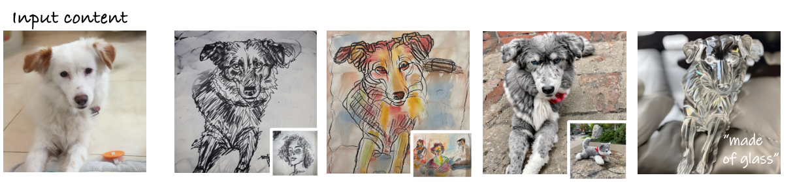

<figcaption>図2: 我々のアプローチで生成された画像スタイライゼーションの例。コンテンツ画像は左に示す。参照スタイルに基づく画像スタイル転送の結果を 3 つ、ガイドとなるテキストプロンプトに基づくものを 1 つ（右）示す。我々の手法は単一の画像しか必要とせず、所望のスタイルを適用しながら画像のコンテンツと構造をよく保存していることに注意されたい。</figcaption>
</figure>

## 1 Introduction（はじめに）

画像のスタイライゼーションはコンピュータビジョンにおいて確立されたタスクであり、長年活発に研究されてきた。このタスクは、テキストベースまたは画像ベースでありうる何らかのスタイル参照に従って画像のスタイルを変更しつつ、そのコンテンツを保存することを伴う。**コンテンツ**は画像の意味的情報と構造を指し、**スタイル**はしばしば色やテクスチャのような視覚的特徴やパターンを指す。画像のスタイル操作は非常に困難なタスクである。スタイルとコンテンツが強く結びついており、スタイルの変換とコンテンツの保存の間に本質的なトレードオフをもたらすからである。他方で、多くのスタイル操作のタスクは画像内のスタイルとコンテンツの明確な分離を必要とする。

本論文では、任意の与えられた画像のスタイル-コンテンツ分離のための手法である B-LoRA を提示する。我々の手法は単一の画像からスタイルとコンテンツを蒸留し、様々なスタイル操作の応用を支持する。

大規模な言語-視覚モデルの最近の進歩の領域において、既存のアプローチはこれらのモデルに埋め込まれた強力な視覚-意味的な事前分布を活用してスタイル操作のタスクを促進する。一般的な技法は、新しいスタイルやコンテンツを説明するために事前学習済みの text-to-image モデルを微調整することを伴う。しかしながら、微調整されたモデルは過学習しやすいため、スタイル変換とコンテンツ保存の間の本質的なトレードオフにしばしば苦しむ。これらの手法と異なり、我々は**画像ごとにスタイルとコンテンツを分離することで両者の学習を統一する**（図 1 を参照）。この分離は、過学習の問題を起こしにくい軽量なアダプタ（B-LoRA）を当てはめることで実行され、タスクの柔軟性を可能にし、テキストベースと参照スタイル画像ベースの双方の条件を許容する。

我々の手法は **LoRA（Low Rank Adaptation）** を活用する。LoRA は高品質な結果と時空間効率のために一般的なアプローチとして浮上した。LoRA は、事前学習済みモデルの重みを「凍結」したまま、ベースモデルの注意層のための外部の低ランク重み行列を最適化することを組み込む。学習後、これらの行列が所望のタスクに使用できる適応済みモデルを定義する。LoRA はしばしば、所望のスタイルまたは所望のコンテンツを表現しうる画像の集合に関してベースモデルを微調整することにより、画像スタイライゼーションに活用される。

具体的には、我々は強力なスタイル学習能力で名高い最近導入された text-to-image 拡散モデル **Stable Diffusion XL（SDXL）** とともに LoRA を用いる。SDXL 内の様々な層とそれらが適応の手続きに与える影響の詳細な分析を通じて、我々は驚くべき発見をした——**2 つの特定の transformer ブロックを、入力画像のスタイルとコンテンツを分離し、生成画像においてそれらを別々に容易に制御するために使用できる**。明確化のため、本論文では**ブロック**を 10 個の連続する注意層の列と定義する。

したがって、単一の入力画像が与えられたとき、我々はこれら 2 つの異なる transformer ブロックに対応する LoRA 重みを、与えられたテキストプロンプトに基づいてその画像を再構成する目的で共同で最適化する。これら 2 つの transformer ブロックの LoRA 重みのみを最適化するので、我々はそれらを「**B-LoRA**」と呼ぶ。決定的な点は、これらの B-LoRA が**単一の画像のみで学習される**にもかかわらず、そのスタイルとコンテンツの解きほぐしに成功し、それによって一般的な LoRA 技法に伴う悪名高い過学習の問題を回避することである。我々の技法はアーキテクチャの層に内在するスタイル-コンテンツの解きほぐしから恩恵を受けている。我々の手法のもう 1 つの利点は、B-LoRA を**別々の成分として容易に使用でき**、追加の学習や微調整を一切必要とせずに様々な困難なスタイル操作のタスクを可能にすることである。とりわけ、スタイル転送・テキストガイドによるスタイル操作・一貫したスタイル条件付き画像生成を実証する（図 2 を参照）。

我々は、スタイルとコンテンツの学習済み LoRA を統一されたモデルへ結合する最近の試み（ZipLoRA）があることに注意する。**このアプローチはスタイル-コンテンツの組合せごとに新しい最適化のプロセスを必要とする。** これは時間がかかるうえ、スタイル変換とコンテンツ保存の間の効果的なトレードオフを達成することに課題を生じさせる。対照的に、我々の学習済み B-LoRA は、**さらなる学習なしに**事前学習済みモデルへ容易に差し戻すことができ、他の参照画像から学習された他のブロックと組み合わせられる。

我々は、これらのタスクの 1 つを達成するようしばしば設計されている代替アプローチと比較して、我々の手法の利点を示す広範な評価を提供する。我々の手法は、既存のモデルとともに広く使用できる、実用的で単純な画像スタイライゼーションの方法を提供する。

## 2 Related Work（関連研究）

##### スタイル転送

画像のスタイル転送はコンピュータビジョンにおける長年の課題であり、与えられた参照に基づいて画像のスタイルを変更することを目指す。深層学習研究の進展とともに、Neural Style Transfer（NST）のアプローチは、コンテンツとスタイルを統合するために事前学習済みネットワークから抽出された深層特徴に依拠する。続いて GAN ベースの技法が、対になった／対になっていない画像集合を用いてドメイン間で画像を転送するために提案されたが、これらはドメイン固有のデータセットと学習を必要とする。

言語-視覚モデルと拡散モデルの最近の進歩はこの分野に革命をもたらした。事前学習済みの言語-視覚モデルに符号化された膨大な知識を活用して、現代のアプローチはゼロショットの画像スタイライゼーションと編集を探求する。そこでは生成プロセスに介入することで、追加の微調整やデータ適応なしに画像が操作される。Prompt-to-Prompt は cross-attention マップを操作することで生成画像を編集するアプローチを提案する。Plug-and-Play では、self-attention 機構を介してガイド画像から空間特徴を調整することにより、与えられたテキストプロンプトに関してコンテンツ画像の見た目が操作される。Cross Image Attention（CIA）は cross-attention 機構の変更を通じて参照画像に基づいて画像の見た目を修正する手法を提示する。これらのアプローチはコンテンツ画像の見た目を効果的に変換するものの、**意味の異なる被写体間で見た目を転送する際に課題に直面しうる。**

StyleAligned は注意特徴の共有と AdaIN 機構を組み合わせて、生成画像の列の間でスタイルの整合を達成する。しかしながらこの手法は生成画像のコンテンツを制御するよう明示的に設計されていないため、**スタイル画像の構造の漏出**を生じさせる可能性がある。同様にスタイル-コンテンツ分離の欠如は、IP-Adapter のようなエンコーダベースの手法でも明らかである。InstantStyle は我々と同時期の研究であり、スタイル画像の CLIP 埋め込みを SDXL 内の特定のブロックへ注入することで画像スタイライゼーションのタスクのために IP-Adapter を改善することを目指す。我々の研究では、スタイルとコンテンツを分解し、それぞれについて別々の表現を学習する。

##### text-to-image のパーソナライゼーション

別の系統の研究では、同じ概念を持つ少数の入力画像に基づいて、スタイルとコンテンツの双方を含む新規の視覚概念の生成を支持するよう事前学習済み text-to-image モデルを拡張する最適化技法が提案されている。これにより、所望のスタイルの画像を生成するといったカスタマイズされたタスクのために、事前学習済みモデルの豊かな意味-視覚的事前分布を活用できる。既存の手法は、トークン最適化の技法、モデルの重みの微調整、あるいはその組合せのいずれかを採用する。トークン最適化はより長い学習時間を要し、しばしば最適でない再構成につながる。モデルの微調整はより良い再構成を提供するが、相当なメモリを消費し過学習しがちである。メモリの非効率に対処し、より効率的なモデル微調整を促進するために、Parameter Efficient Fine-Tuning（PEFT）のアプローチが提案されてきた。StyleDrop はベースモデルとして Muse を活用し、そのスタイルを参照画像に合うよう調整する。StyleDrop は transformer モデル内の各注意ブロックの末尾で軽量なアダプタ層を学習する。しかしながら、StyleAligned と同様、そのアプローチはスタイル適応のために設計されており、**コンテンツの保存には別の最適化が必要になる**。既存の PEFT 手法のうち、LoRA はその多用途性と高品質な結果のために研究者・実務者に広く使われる一般的な微調整技法である。

##### 画像スタイライゼーションのための LoRA

LoRA はしばしば、所望のスタイルの画像を生成するようモデルを微調整することで画像スタイライゼーションに用いられる。一般に LoRA は画像の集合で学習され、その後 stylistic Concept-Sliders や ControlNet のような制御手法とテキストプロンプトと組み合わされて、生成画像のコンテンツが条件づけられる。LoRA ベースのアプローチはスタイルとコンテンツを捉える有意な能力を実証してきたが、**このタスクには 2 つの別々の LoRA モデルが必要であり、それらを組み合わせる自明な方法は存在しない**。一般的な素朴なアプローチは、所望の係数を手動で探索することに依拠して、2 つの LoRA の重みを直接補間することで組み合わせることである。代替のアプローチは、そのような組合せのための最適な係数を見つける最適化ベースの戦略を提案する。しかしながら、それらは 2 つの**物体**の結合に焦点を当てており、画像スタイライゼーションのタスクではない。

最近、Shah らは **ZipLoRA** を導入し、スタイルとコンテンツのために学習された 2 つの個別の LoRA を、それらの列の混合係数を学習することで新しい「zip された」LoRA へマージすることを提案した。この研究は我々のものと密接に関連している。我々も画像スタイライゼーションを促進するために異なる画像で学習された LoRA 重みを混ぜるからである。しかしながら、**ZipLoRA はコンテンツとスタイルの新しい組合せごとに追加の最適化段階を必要とし、それによって学習済み LoRA 重みを再利用する柔軟性——これは LoRA の第一の利点である——を制限してしまう**。対照的に、我々のアプローチは追加の学習なしに学習済みのスタイルとコンテンツを直接再利用でき、効率と汎用性を高める。さらに、我々の暗黙的なアプローチが困難なスタイルとコンテンツに対してより頑健であることを実証する。

## 3 Preliminaries（準備）

##### SDXL アーキテクチャ

<figure>

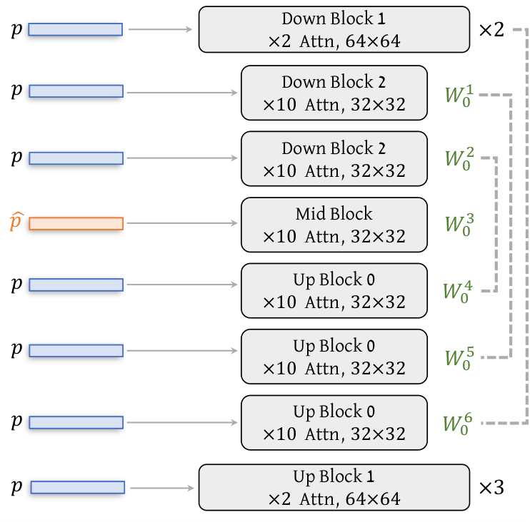

<figcaption>図3: SDXL アーキテクチャと我々のテキストベース分析の図解。i 番目の transformer ブロックが生成画像に与える効果を検討するため、そこには異なるテキストプロンプト p̂ を注入し、他のすべてのブロックには p を注入する。</figcaption>
</figure>

<figure>

<figcaption>図4: 生成画像へのプロンプト注入の効果。左では、ブロック 2 と 4 が生成画像のコンテンツにどう影響するか（トラに変わる）を実証し、最右の画像は i ≠ 2, 4 のブロック i に p̂ を注入しても生成画像に効果がないことを示す。右では、5 番目のブロックが生成画像の色をどう制御するかを示す。</figcaption>
</figure>

<figure>

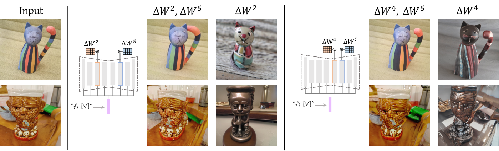

<figcaption>図5: 左に示す入力画像について、W₀² と W₀⁵ で（中央）、および W₀⁴ と W₀⁵ で（右）B-LoRA を学習した場合の比較。学習された各 LoRA 重みの対について、両方を一緒に適用した結果（入力画像の再構成）と、コンテンツ層のみを適用した結果（すなわち ΔW² と ΔW⁴ のみを使用）を示す。結果は ΔW⁴ の方が入力物体の細かい詳細をよりよく捉えることを実証する。</figcaption>
</figure>

本研究では、最近導入された公開利用可能な text-to-image モデル **Stable Diffusion XL（SDXL）** を用いる。これは既知の Stable Diffusion をアップグレードした版である。どちらのモデルも**潜在拡散モデル（LDM）** の一種であり、拡散のプロセスは事前学習済み画像オートエンコーダの潜在空間で適用される。SDXL アーキテクチャは Stable Diffusion と比較して 3 倍大きい UNet バックボーンを活用する。UNet は合計 $70$ 個の注意層からなる。各層は cross-attention と self-attention からなる。これらの注意層はしばしば注意ブロックと呼ばれる。本論文では明確化のため、我々が最適化するより大きな transformer ブロックと混同されないよう、これらを**層**と呼ぶ。これらの注意層は $11$ 個の transformer ブロックに分割され、最初の 2 つと最後の 3 つのブロックはそれぞれ合計 4 個と 6 個の注意層からなる。**内側の 6 つのブロックはそれぞれ 10 個の注意層からなる**（図 3 に図解）。

SDXL ではテキスト条件付き生成も次のように拡張されている：テキストプロンプト $y$ が与えられると、それは **OpenCLIP ViT-bigG** と **CLIP ViT-L** の双方で 2 回符号化される。結果として得られる埋め込みは連結されて条件付け符号化 $c$ を定義する。次にこのテキスト埋め込みがネットワークの cross-attention 層へ供給される。

具体的には、各層において深層の空間特徴 $x$ がクエリ行列 $Q=l_{Q}(x)$ へ射影され、テキスト埋め込みが学習された線形射影 $l_{Q},l_{K},l_{V}$ を介してキー行列 $K=l_{K}(c)$ と値行列 $V=l_{V}(c)$ へ射影される。注意マップは次で定義される。

$$
A_{t}=Softmax(\frac{QK^{T}}{\sqrt{d}})V,
$$

ここで $d$ はキーとクエリの射影次元である。

##### LoRA

**Low-Rank Adaptation** は、特定のタスクやドメインのために大規模な事前学習済みモデルを効率的に微調整する手法である。LoRA はその高品質な結果と効率のために、事前学習済み text-to-image 拡散モデルを微調整する非常に一般的なアプローチとして浮上した。

事前学習済み text-to-image 拡散モデルの重みを $W_{0}$、特定のタスクのためにモデルを微調整した後の学習済み残差を $\Delta W$ と表記しよう。LoRA の鍵となる着想は、$\Delta W\in\mathbb{R}^{m\times n}$ が 2 つの低い内在階数の行列 $B\in\mathbb{R}^{m\times r}$ と $A\in\mathbb{R}^{r\times n}$ へ分解でき、$\Delta W=BA$ かつ階数 $r\ll\min(m,n)$ となることである。学習中、元のモデルの重み $W_{0}$ は凍結されたままで、$A$ と $B$ のみが更新される。したがって学習の終わりに $W=W_{0}+\Delta W$ を用いて調整済みモデルの重みを得られる。

LoRA は text-to-image 拡散モデルにおいて一般に cross-attention と self-attention の層でのみ用いられる。既に論じたとおり、各層の注意機構は 4 つの射影行列 $l_{Q}$, $l_{K}$, $l_{V}$, $l_{\text{out}}$ に依拠する。LoRA 重み $\Delta W_{Q}$, $\Delta W_{K}$, $\Delta W_{V}$, $\Delta W_{\text{out}}$ がこれら事前学習済み行列のそれぞれについて最適化される。我々は $\Delta W$ でこれら 4 つの行列すべての LoRA 重みを表す。

## 4 Method（手法）

我々の目的は、入力画像 $I$ のスタイル面とコンテンツ面を別々の成分へ分離し、テキストベースと画像ベースの双方のスタイライゼーションの応用を可能にすることである。我々のアプローチは、スタイル的特徴を捉える頑健さで知られる事前学習済みの SDXL text-to-image 生成モデルの能力を活用する。我々は SDXL アーキテクチャの分析を行い、個々の層が生成画像のスタイルまたはコンテンツへ与える寄与への洞察を得る。この観察に導かれて、SDXL モデル内の**わずか 2 つの特定の transformer ブロック**の更新行列を LoRA を用いて学習する。これらの行列は入力画像のコンテンツとスタイルの表現を捉え、いくつかの画像スタイライゼーションのタスクを促進するのに十分である。

### 4.1 SDXL Architecture Analysis（SDXL アーキテクチャの分析）

先行研究と同様、我々はベースとなる text-to-image モデル内の異なる層が生成画像へ与える効果を検討する。我々は Voynov らが提案したものと類似したアプローチを採用する。鍵となる着想は、**SDXL 内の transformer ブロックの 1 つの cross-attention 層へ異なるテキストプロンプトを注入する**ことである。次に、異なるプロンプトと結果として得られる画像の間の類似度を検討する。i 番目のブロックに対応する入力プロンプトのみを変更し、i 番目のブロックが生成画像のある性質を支配しているなら、それは結果として得られる画像に現れるはずである。具体的には、SDXL の 6 つの中間 transformer ブロック $\{W_{0}^{1},..W_{0}^{6}\}$ を検討する。各ブロックは $10$ 個の注意層を含む（図 3 を参照）。これらの層は、生成画像の重要な視覚的性質に影響を与える可能性が最も高いことを実証した先行研究に基づいて選ばれた。

我々は、異なる色を持つ異なる物体を記述する 2 つのランダムなテキストプロンプト集合 $P_{content}$ と $P_{style}$ を定義する。$P_{content}$ のプロンプトはテンプレート文「A photo of a \<object>」にランダムな物体を置くことで定義される。$P_{style}$ にはテンプレート「A photo of a \<color> \<object>」を用いる。ランダムな物体と色は ChatGPT で生成される。**色をスタイルの代理として用いている**ことに注意されたい。我々は結果の評価に CLIP を用いるが、CLIP はスタイルの変化よりも色の変化に対する指標として優れていることを見出したからである。我々は $p\neq\hat{p}$ となるようプロンプトの対 $(p,\hat{p})\in P_{content}$ および $(p,\hat{p})\in P_{style}$ をサンプリングする。各対 $(\hat{p},p)$ について、$\hat{p}$ の埋め込みを $W_{0}^{i}$ へ注入し、$p$ の埋め込みを他のすべての層 $W_{0}^{j},j\neq i$ へ注入することで画像 $I_{\hat{p}\rightarrow i,p\rightarrow j\neq i}$ を生成する（図 3 に描画）。これは我々が対象とする 6 つの transformer ブロックのそれぞれについて実行され、対ごとに 6 枚の画像が得られる。

次に、i 番目のブロックへ $\hat{p}$ を注入することが生成画像へ与える効果を測るため、次の類似度スコアを推定する。

$$
\mathcal{C}(I_{\hat{p}\rightarrow i,p\rightarrow j},\hat{p})=sim(C_{I}(I_{\hat{p}\rightarrow i,p\rightarrow j}),C_{T}(\hat{p})),
$$

ここで $C_{I}(\cdot)$ と $C_{T}(\hat{p})$ はそれぞれ生成画像の CLIP 画像埋め込みとプロンプトの CLIP テキスト埋め込みであり、$sim(x,y)=\frac{x\cdot y}{||x||\cdot||y||}$ は CLIP 埋め込み間のコサイン類似度を示す。

**合計で 400 対**のコンテンツとスタイルのプロンプトを検討し、各層のスコアを平均した。一方の種類のプロンプトへの類似度を示す上位 3 つの層は、生成画像の**コンテンツを支配する $W_{0}^{2}$ と $W_{0}^{4}$**、および**色を支配する $W_{0}^{5}$** である。我々はこれらの結論を図 4 で視覚的に実証する。左では、生成されるコンテンツに対するブロック 2 と 4 の効果を示す。$I_{\hat{p}\rightarrow 2,p\rightarrow j}$ と $I_{\hat{p}\rightarrow 4,p\rightarrow j}$ は、「A photo of a tiger」が 1 つのブロック（2 または 4）にのみ注入され、「A photo of a bunny」が残りのブロックに注入されたとき、生成画像がトラを描くことを実証する。一方、他のすべての選択肢では生成画像はウサギを描く。同様に、右では生成画像の色に対するブロック 5 の効果を示す。

### 4.2 LoRA-Based Separation with B-LoRA（B-LoRA による LoRA ベースの分離）

上記の観察は生成された画像に当てはまるものだが、我々の目標は、特定した層が**与えられた入力画像 $I$** のコンテンツとスタイルを捉えるのに有用かどうかを検討することである。与えられた画像のバリエーションを生成するようモデルを微調整するために、我々は LoRA のアプローチを活用する。

ベースとなる事前学習済み SDXL モデルの凍結された重みを $W_{0}$、各ブロックについて学習される残差行列を $\Delta W^{i}$ と表記しよう。我々は DreamBooth LoRA の既定設定に従って、与えられた入力画像 $I$ を再構成するようモデルを微調整する。

<figure>

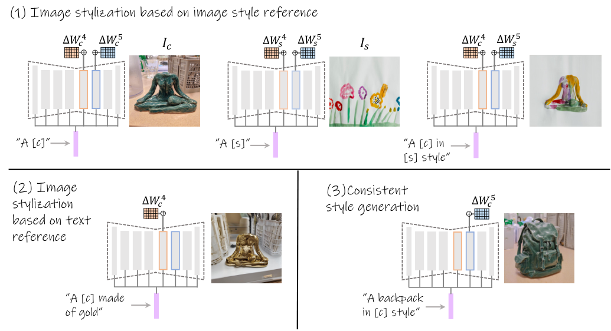

<figcaption>図6: 画像スタイライゼーションのための B-LoRA。(1) 与えられたコンテンツ画像 I_c を、与えられたスタイル参照画像 I_s に関してスタイライズするため、両方の画像について B-LoRA を学習し、その後 ΔW_c⁴ と ΔW_s⁵ を単一の適応済みモデルへ結合する。(2) テキストベースのスタイライゼーションでは、学習済みの ΔW_c⁴ のみを差し込んでモデルを適応させ、推論時に所望のテキストプロンプトを用いる。(3) 学習済みスタイル重み ΔW_s⁵ はそのまま用いて、I_s のスタイルを持つ画像を生成するようバックボーンモデルを調整することもできる。</figcaption>
</figure>

しかしながら、（通常行われるように）11 個すべてのブロックの LoRA 重みを最適化する代わりに、我々は 2 つの実験を行う。第 1 の実験では対 $\{\Delta W^{2},\Delta W^{5}\}$ を、第 2 の実験では $\{\Delta W^{4},\Delta W^{5}\}$ を最適化する（$W_{0}^{2}$ と $W_{0}^{4}$ がコンテンツを支配し、$W_{0}^{5}$ が色を支配することを見出したため）。加えて、モデルが画像のスタイルまたはコンテンツのいずれかを捉えるよう明示的に誘導されるのを防ぐため、学習中は**一般的なプロンプト「A [v]」を用いる**。このプロセスと結果の例を図 5 に描画する。見て取れるとおり、1. 入力概念の完全な再構成の達成、2. 入力画像のコンテンツの捕捉、という観点で最適化する最良の組合せは $\Delta W^{4},\Delta W^{5}$ であることを我々は見出した。LoRA 学習のプロセスにおいて $\Delta W^{2}$ ではなく **UNet のより深い層 $\Delta W^{4}$ を用いることは、出力画像のより細かい詳細を保存するという目標と整合する**ことに注意されたい。他の層およびその内部の特定の部分の効果、ならびに異なるテキストプロンプトを用いた場合の効果についてのアブレーションと分析は補足資料で提供する。我々はこの学習の枠組みを、フルの重みではなく 2 つの transformer **B**lock のみを学習することから ***B-LoRA*** と呼ぶ。したがって、スタイル-コンテンツ分離の能力に加えて、この手法は**保存要件を 70% 削減**する。

### 4.3 B-LoRA for Image Stylization（画像スタイライゼーションのための B-LoRA）

上記の分析からの洞察を組み合わせ、ここで B-LoRA の学習アプローチを記述する。入力画像 $I$ が与えられたとき、我々は一般的なテキストプロンプト「A [v]」に関して画像を再構成する目的で、LoRA 重み $\Delta W^{4},\Delta W^{5}$ のみを微調整する。効率の向上に加えて、**これら 2 つの層のみを学習することにより、$\Delta W^{4}$ がコンテンツを捉え $\Delta W^{5}$ がスタイルを捉えるという暗黙的なスタイル-コンテンツ分解が達成できる**ことを我々は見出した。

これらの更新行列がひとたび見つかれば、次に述べるスタイル操作の応用のために、事前学習済み SDXL モデルの対応するブロックの重みを更新することで容易に使用できる（図 6 に実証）。

##### 画像スタイル参照に基づく画像スタイライゼーション

所望のコンテンツとスタイルをそれぞれ描く 2 枚の入力画像 $I_{c},I_{s}$ が与えられたとき、上述のプロセスを用いて対応する B-LoRA 重みを学習する：$I_{c}$ について $\Delta W_{c}^{4},\Delta W_{c}^{5}$、$I_{s}$ について $\Delta W_{s}^{4},\Delta W_{s}^{5}$。次に $\Delta W_{c}^{4}$ と $\Delta W_{s}^{5}$ を直接用いて、事前学習済みネットワークの transformer ブロック $W_{0}^{4}$ と $W_{0}^{5}$ を更新する。推論のプロセスでは、図 6 の上部に図解するとおりプロンプト「A [c] in [s] style」を用いる。

##### テキストベースの画像スタイライゼーション

（$I_{c}$ のスタイルを捉える）$\Delta W_{c}^{5}$ を省略し、$\Delta W_{c}^{4}$ のみを用いて事前学習済みモデルの重みを更新すると、$I_{c}$ の**コンテンツにのみ**適応したパーソナライズ済みモデルが得られる。$I_{c}$ のスタイルをテキストベースのガイダンスで操作するには、推論時に所望のテキストを適応済み層へ単に注入すればよい（図 6 の左下を参照）。スタイルとコンテンツが分離され異なるブロックに符号化されているため、我々のアプローチは困難なスタイル操作を可能にすることに注意されたい。

> **訳注**: 図 7 は原典では `nicematrix` パッケージで組まれた図表であり、HTML 変換で画像が生成されていない。キャプションのみ訳出する。
>
> **図7**: 3 つの画像スタイライゼーションのタスクについて我々の手法が生成した結果。第 1〜3 行: 画像スタイル転送。我々の手法はシーン画像に対して動作し、スタイライズ済み画像からコンテンツを抽出できる。第 4 行: 左のコンテンツ画像参照に適用したテキストベースの画像スタイライゼーション。姿勢と同一性がよく保存されていることに注意されたい。最終行: 一貫したスタイル生成。左の画像からスタイルが抽出され、新しい物体の生成に用いられる。この行ではスタイル効果を強めるため $\alpha=1.1$ を用いる。

##### 一貫したスタイル生成

最後に、同様の方法で、$\Delta W_{s}^{4}$ を除外して $\Delta W_{s}^{5}$ のみを用いることで、$I_{s}$ で提供された特定のスタイルへモデルを適応させられる。これは所望のスタイルへ適応したモデルをもたらし、テキストベースの条件を用いて所望のスタイルで任意のコンテンツを生成できる（図 6 の右下を参照）。

### 4.4 Implementation details（実装の詳細）

我々は SDXL v1.0 上で B-LoRA 重みを学習し、微調整のプロセスの間、モデルの重みとテキストエンコーダの双方を凍結したままにする。すべての LoRA 学習は**単一の画像**で行われた。学習率 $5e{-}5$ の Adam オプティマイザを用いる。データ拡張には学習中の center cropping のみを用いる。LoRA 重みの階数を $r=64$ に設定し、プロンプト「A [v]」を用いて 1000 回の最適化ステップを行う。これは単一の A100 GPU で画像あたり約 10 分を要する。他の手法が過学習の懸念を緩和するために典型的に LoRA を 400 ステップ学習するのに対し、**我々の場合これは問題にならなかった**ことに注意されたい。

## 5 Results（結果）

我々のアプローチの様々な結果を生成するため、画像ごとに一度 B-LoRA（$\Delta W^{4},\Delta W^{5}$）を最適化し、その後（応用に応じて）そのいずれかまたは両方を推論時に差し込んで、さらなる最適化や微調整なしに画像スタイライゼーションを得た。

4.3 節で論じた 3 つの応用の定性的な結果の一部を図 7 に示す。図 7 の最初の 2 行では、我々の手法は左の入力画像のコンテンツを保存しながら、画像参照（最上行）のスタイルの転送に成功している。特筆すべきことに、これはスタイライズ済み画像（第 1 行）やシーン全体の画像（第 2 行）のような困難なコンテンツ入力に対しても行える。我々の手法は多くの種類の異なるスタイルに対して頑健であり、第 3 のスタイル列に描かれるような非常に抽象的なスタイルにおいてさえコンテンツ参照の本質を保存できている。第 3 行では、テキストベースの画像スタイライゼーションの例を示す。我々の暗黙的なスタイル-コンテンツ分離により、入力物体のコンテンツがよく保存される一方、スタイルは所望のテキストプロンプトによって支配されていることが見て取れる。最終行では、スタイルの B-LoRA 重みのみを用いる一貫したスタイル生成に我々の手法をどう使えるかを実証する。物体のスタイルがテキストベースで生成されたすべての画像にわたってよく保存されていることを観察されたい。さらに多くの例は補足資料を参照されたい。

**表1**: 定量的比較。出力画像と参照スタイル・参照コンテンツの DINO 特徴の間の平均コサイン類似度を測定する。我々の手法はコンテンツ画像に過学習することなくスタイルへ適応する点で最良の性能を示す。

| 指標 | 入力 | StyleDrop | StyleAligned | ZipLoRA | DB-LoRA | Ours（本手法） |
| --- | --- | --- | --- | --- | --- | --- |
| StyleTransfer | Multiple | $0.826\pm{0.07}$ | $0.855\pm{0.05}$ | $0.796\pm{0.07}$ | $0.863\pm{0.06}$ | $\boldsymbol{0.881}\pm{0.05}$ |
| StyleTransfer | Single | $0.790\pm{0.06}$ | $0.829\pm{0.05}$ | $0.782\pm{0.05}$ | — | — |
| Content | Multiple | $0.817\pm{0.06}$ | $0.779\pm{0.05}$ | $\boldsymbol{0.841}\pm{0.05}$ | $0.769\pm{0.05}$ | $0.790\pm{0.05}$ |
| Content | Single | $0.874\pm{0.08}$ | $0.792\pm{0.06}$ | $\boldsymbol{0.933}\pm{0.05}$ | — | — |

> **訳注**: 原典の表 1 では DB-LoRA と Ours の各値が Multiple / Single の 2 行にまたがるセル（rowspan）として記載されている。本手法は常に単一画像で動作するため Multiple / Single の区別がなく、DB-LoRA も同様に 1 つの値のみが与えられている。本翻訳では Multiple 行に値を置き、Single 行を「—」とした。

### 5.1 Comparisons（比較）

次に、我々の手法を代替アプローチと定性的・定量的の双方で比較する。我々は SDXL をバックボーンモデルとして依拠しているので、公平な比較のため代替アプローチも SDXL 上で適用したことに注意されたい。素朴なベースラインとして、コンテンツ条件付けのための ControlNet を伴う DB-LoRA（スタイルのために微調整）を採用する。加えて、大規模な事前学習済み text-to-image モデルの事前分布に依拠する画像スタイライゼーションの最近の 3 つのアプローチ、すなわち **ZipLoRA・StyleDrop・StyleAligned** と比較する。StyleAligned は著者の公式実装を用いて適用する。StyleDrop と ZipLoRA の公式実装がないため、StyleDrop を SDXL 上で実装し、ZipLoRA は非公式の実装を利用した。

コンテンツの保存について、3 つの代替手法すべてが**複数**のコンテンツ画像の例を必要とするのに対し、**我々の手法は単一の画像に適用できる**ことに注意されたい。したがって、公平な比較のため、既存のパーソナライゼーション研究から合計 23 の物体を集めた。各物体について小さな画像集合が提供されている。20 のスタイル画像参照を先行研究から集め、独自の 5 枚のスタイル画像を加えた。これらの集合から、スタイルとコンテンツの画像 50 対をランダムにサンプリングして最終的な評価集合を構成した。

実行時間について、StyleAligned は一貫したスタイル生成についてのみゼロショットであり、コンテンツの保存については所望の概念へモデルを適応させるために LoRA に依拠する。同様に StyleDrop と ZipLoRA もコンテンツとスタイルのための LoRA 学習を必要とする。したがって我々の実行時間はそれらと同等である。対照的に、**ZipLoRA は 2 つの LoRA をマージするための追加の学習フェーズを伴うため、我々のアプローチより時間がかかる**。

**図8**（訳注: 原典では 5 行 × 7 列の比較グリッド。HTML 変換では構成画像に分解されているため、原典の配置に従って表として再構成した）: 代替アプローチとの比較。入力のスタイルとコンテンツの参照を左に示す。代替手法には複数のコンテンツ画像が用いられている。最終行では、単一のコンテンツ画像に他のアプローチを適用した。ZipLoRA はコンテンツに過学習する傾向があり、そのため所望のスタイルを描くことに苦戦する。StyleDrop も複数画像で学習されるとコンテンツの保存に苦戦する。単一のコンテンツ画像の場合（最終行）、両手法ともコンテンツは保存するがスタイルを失う。StyleAligned はスタイルをよく保存するが、第 1 行でカップルを作り出すように、スタイル画像に由来する意味的コンテンツを含めてしまう傾向がある。

| コンテンツ参照 | スタイル参照 | ControlNet + DB-LoRA | ZipLoRA | StyleDrop | StyleAligned | **Ours** |
| --- | --- | --- | --- | --- | --- | --- |
| 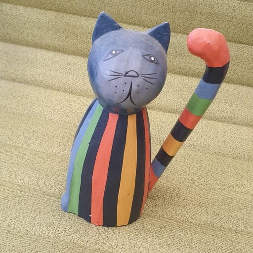 | 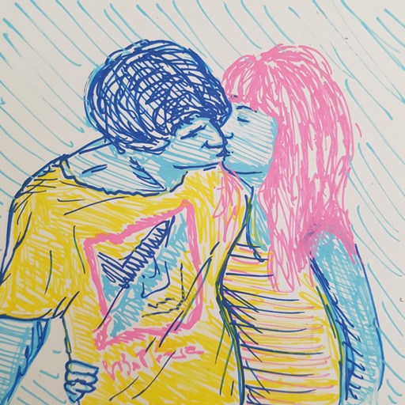 | 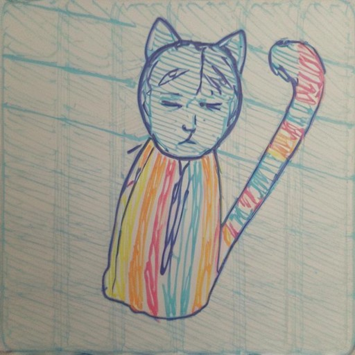 | 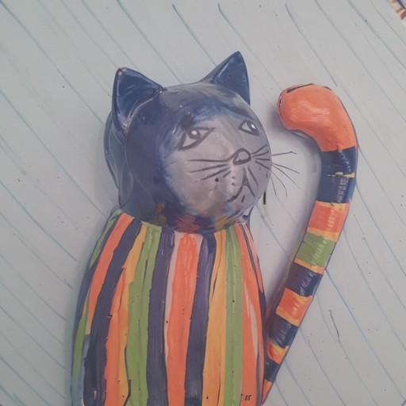 | 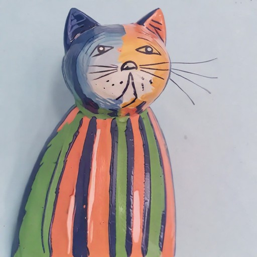 | 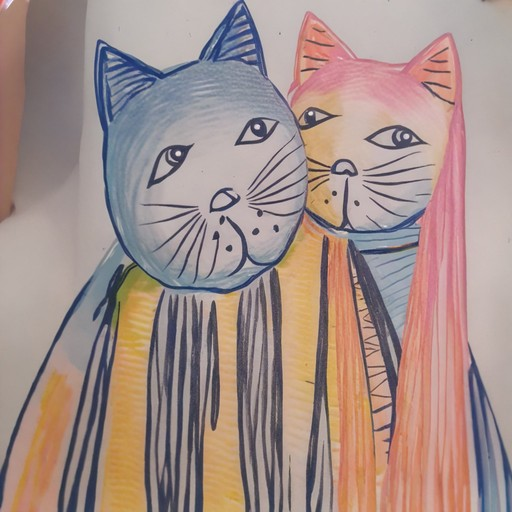 | 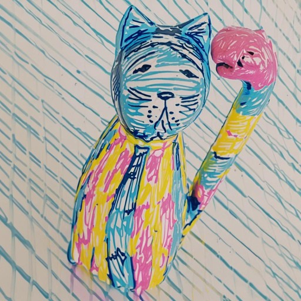 |
| 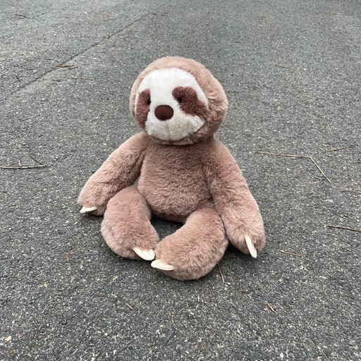 | 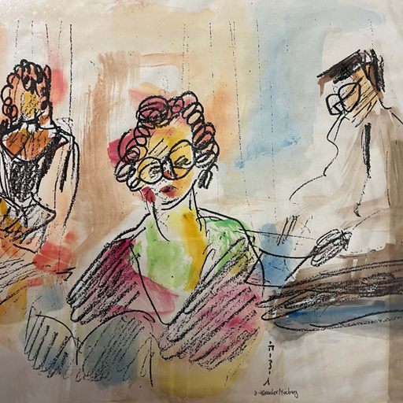 | 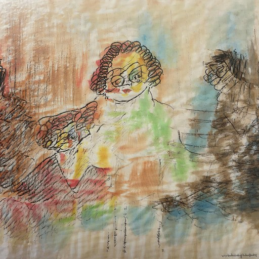 | 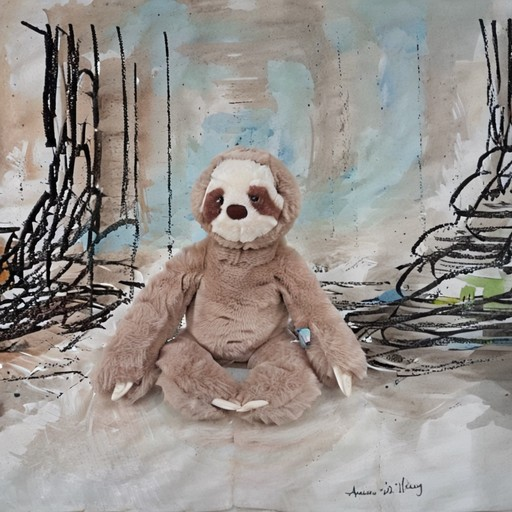 | 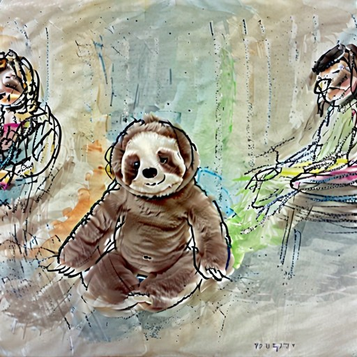 | 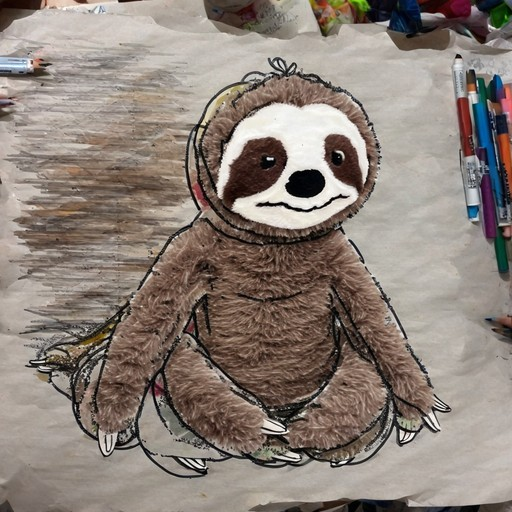 | 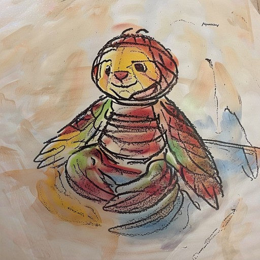 |
| 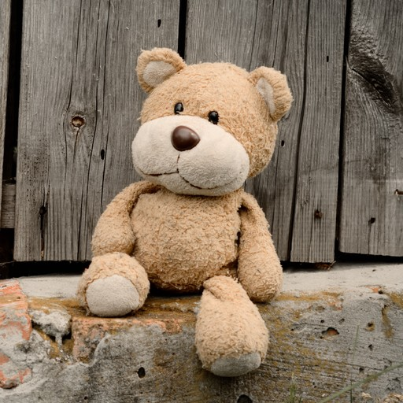 | 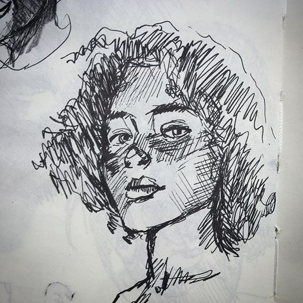 | 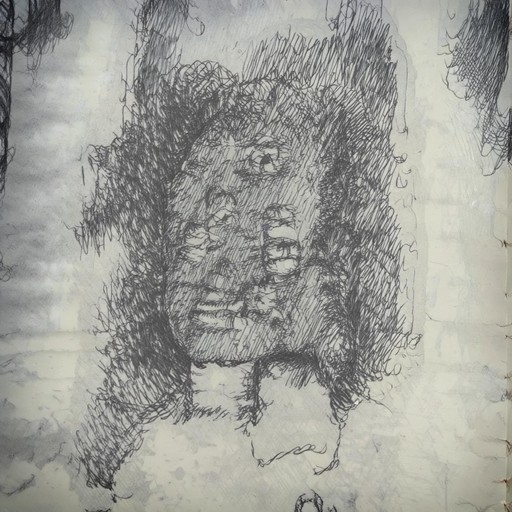 | 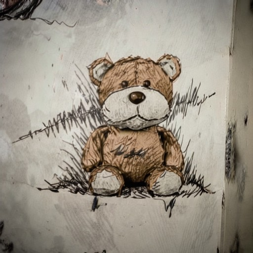 | 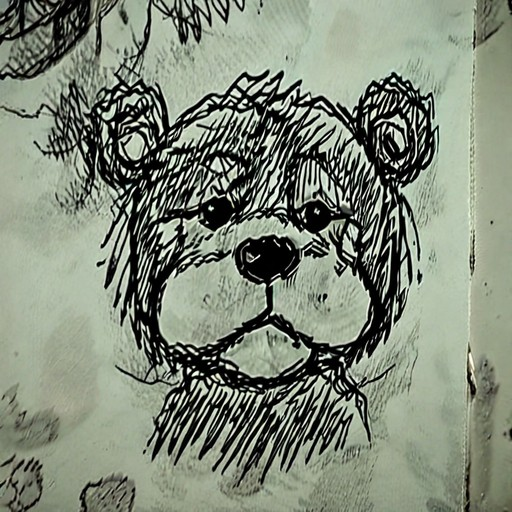 | 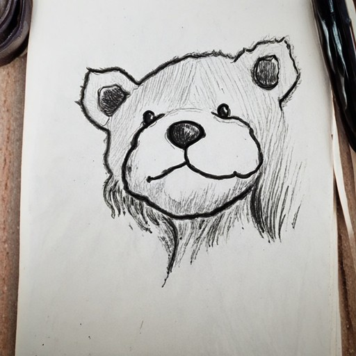 | 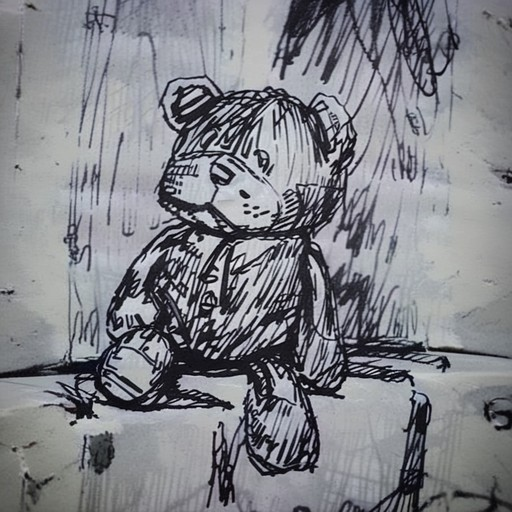 |
|  |  | 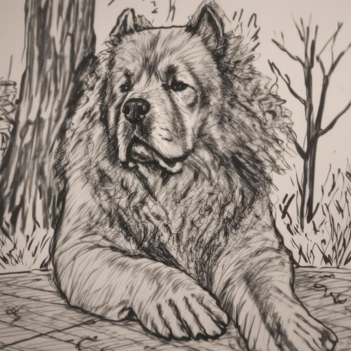 | 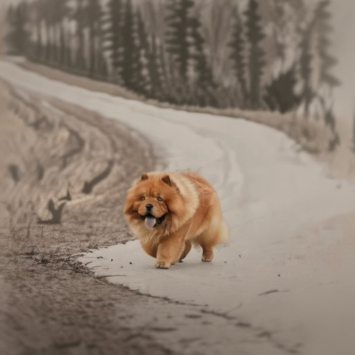 | 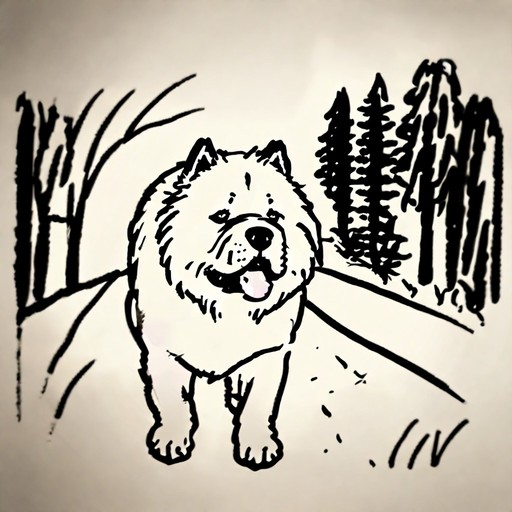 | 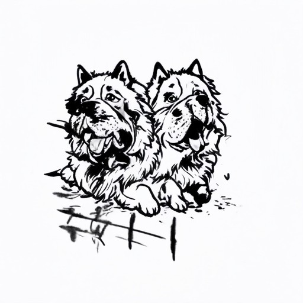 | 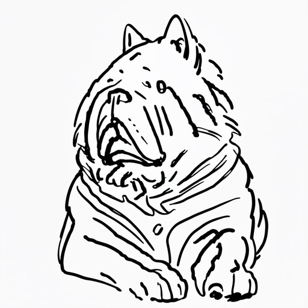 |
| 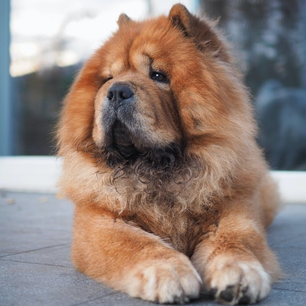（単一画像） | 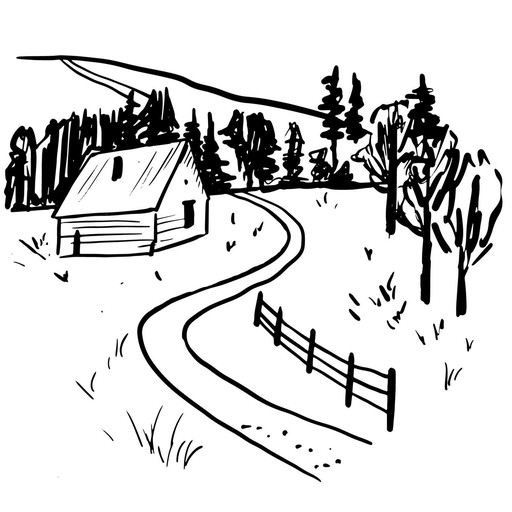 |  | 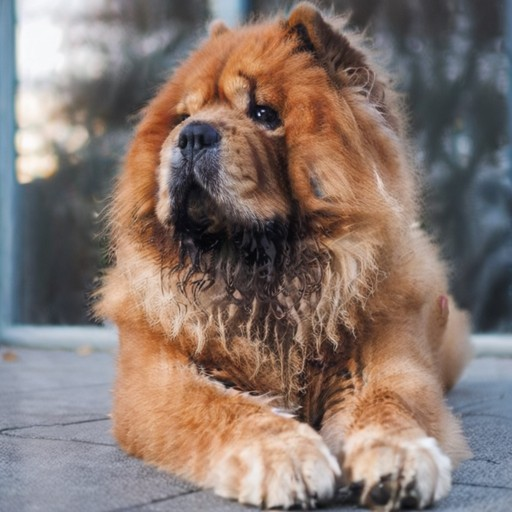 | 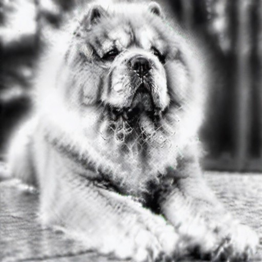 | 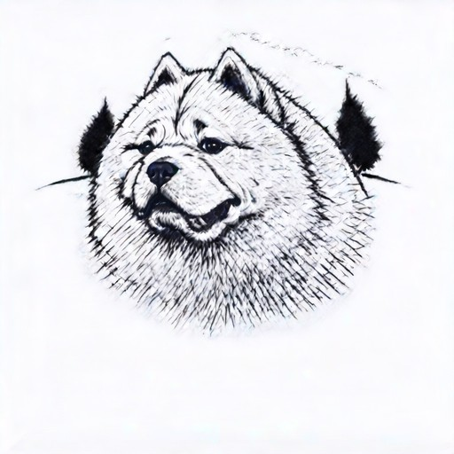 |  |

##### 定性的評価

代表的な比較結果を図 8 に示す。左にスタイルとコンテンツの参照画像を示す。最初の 4 行では、代替アプローチを複数のコンテンツ画像とともに適用した結果を示す。一方、我々の手法は単一の画像を用いる。見て取れるとおり、我々の手法はコンテンツ画像から被写体を効果的に保存しつつ所望のスタイルを転送する。対照的に、他の手法はコンテンツの被写体に過学習してそのスタイルの変更に失敗するか（例えば ZipLoRA と StyleDrop における猫とナマケモノ）、あるいはスタイル画像の「漏出」に苦しむ。例えば StyleAligned の猫の例（第 1 行）では、モデルはスタイル参照画像の人物の数に合わせて 2 匹の猫を生成している。単一のコンテンツ画像に代替手法を適用した例も含めており、そこでは StyleDrop と ZipLoRA が過学習の増大を示す。

##### 定量的評価

我々は、DINO ViT-B/8 の埋め込みを利用して、入力のコンテンツ参照・スタイル参照と出力画像の埋め込みの間のコサイン類似度を計算することで、コンテンツとスタイルの保存を測定する。平均スコアを表 1 に示す。我々の手法は最も高いスタイル整合スコアを達成しており、スタイルを効果的に適応させる優れた能力を示している。しかしながら、我々はより低い物体類似度スコアも観察しており、これはおそらく代替アプローチで観察されたコンテンツへの過学習の問題によるものである。

この観察をさらに裏づけるため、単一のコンテンツ画像を参照として用いて同じ実験を行った（スコアは「Single」の行に示す）。結果は**すべての手法でスタイル一貫性スコアの低下と、それに伴うコンテンツ保存スコアの上昇**を示しており、過学習を示唆している。

##### ユーザースタディ

上記の知見をさらに検証するためユーザースタディを実施した。評価集合から $30$ 枚のランダムな画像を用いて、我々の結果を 3 つの代替アプローチと比較した。参加者には参照のスタイル画像とコンテンツ画像、および 2 つの合成結果（1 つは我々の手法、もう 1 つは代替手法によるもの。結果はランダムな順で提示）が提示された。参加者は「**スタイル画像からスタイルをより良く転送しつつ、コンテンツ画像のコンテンツを保存している**」結果を選ぶよう求められた。$34$ 名の参加者から回答を集め、調査には合計 $1020$ 件の回答が含まれた。結果は我々の手法への強い選好を実証しており、**StyleAligned に対して 94%、ZipLoRA に対して 91%、StyleDrop に対して 88%** の参加者が我々の手法を支持した。

## 6 Conclusions, Limitations and Future work（結論・限界・今後の課題）

我々は単一の入力画像のスタイルとコンテンツを解きほぐす単純かつ効果的な手法を提示した。スタイル成分とコンテンツ成分は 2 つの B-LoRA で別々に符号化され、様々な画像スタイライゼーションのタスクにおける独立した使用に高い柔軟性を提供する。スタイル抽出に焦点を当てる既存の手法とは対照的に、我々は**複合的なスタイル-コンテンツ学習のアプローチ**を採用し、それがスタイルとコンテンツのより良い分離を可能にしてスタイライゼーションの忠実度を高める。我々の研究は様々な複雑な入力画像にわたる頑健な画像スタイライゼーションを可能にするが、限界もある。第一に、スタイル-コンテンツ分離の手続きにおいて、**物体の色がしばしばスタイル成分に含まれてしまう**。しかしながら、場合によっては色が同一性の保存に決定的な役割を果たす。したがって、コンテンツ成分をスタイライズするとき、図 9(a) に図解するように結果が物体の同一性を適切に保存しないことがある。第二に、単一の参照画像を用いるため、**学習されるスタイル成分が中心の物体だけでなく背景の要素を含んでしまう**ことがある（図 9(b) に実証）。最後に、我々の手法はシーン画像を効果的にスタイライズするものの、多数の要素を含む複雑なシーンでは課題に直面しうる。その結果、シーンの構造を正確に捉えることに苦戦し、コンテンツの保存を損なう可能性がある（図 9(c) に描画）。

今後の研究としては、LoRA 微調整の内部での分離技法をさらに探求し、構造・形状・色・テクスチャといった下位成分へのより具体的な分離を達成することが 1 つの道筋として考えられる。これはユーザーに所望の出力へのより多くの制御を提供しうる。今後の課題のもう 1 つの方向は、我々のアプローチの頑健さを活用して、**複数の異なる物体の LoRA 重みを結合したり、いくつかのスタイルを結合したり**することへ拡張することである。

<figure>

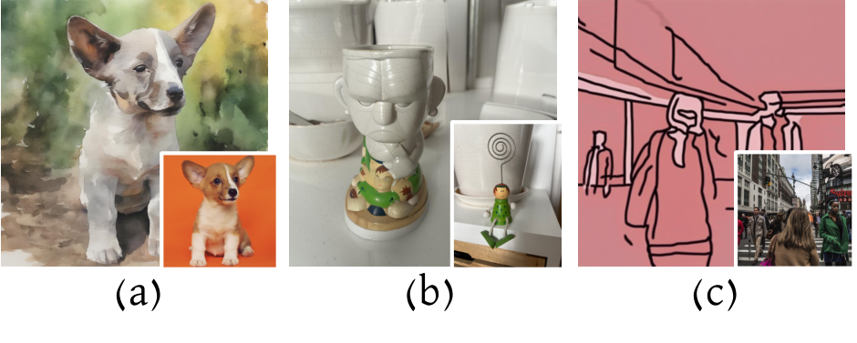

<figcaption>図9: 手法の限界。(a) 色の分離による最適でない同一性の保存。(b) 背景の物体からのスタイルの漏出。(c) 複雑なシーンにおけるコンテンツの不十分な捕捉。</figcaption>
</figure>

## Appendix A Comparisons（比較）

##### ユーザースタディ

本文で述べたとおり、我々は知見をさらに検証するためユーザースタディを実施した。23 の物体と 25 のスタイル参照からなる多様なプールからランダムにサンプリングした、50 対の一意なスタイル-コンテンツ画像からなる評価集合を構成した。この評価集合から、競合する各手法（ZipLoRA・StyleDrop・StyleAligned）について 10 の代表的な対を選んだ。各対について、当該手法と我々のアプローチの双方を用いて画像を生成し、図 10 に図解するように元のスタイル参照とコンテンツ参照とともに提示した。生成画像はバイアスを避けるためランダムな順で表示された。参加者は「スタイル画像からスタイルをより良く転送しつつ、コンテンツ画像のコンテンツを保存している」結果を選ぶよう求められた。合計で 34 名の参加者から 1020 件の回答を集め、代替アプローチに対する我々の手法の包括的な評価を保証した。

<figure>

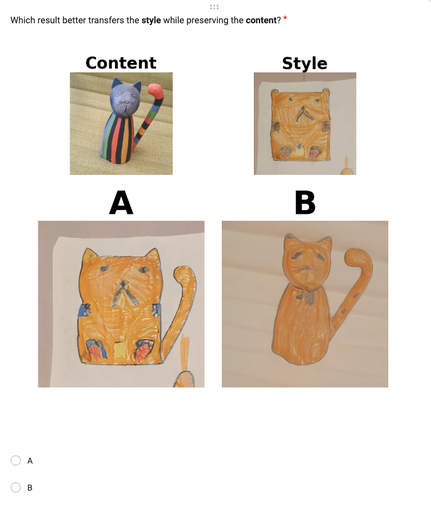

<figcaption>図10: ユーザースタディのスクリーンショット。A と B とラベル付けされた 2 枚の画像はそれぞれ異なる手法から得られた結果を表す。参加者はスタイルの適応とコンテンツの保存の双方の観点でより優れていると考える画像を選ぶ課題を与えられた。</figcaption>
</figure>

##### 定性的比較

本文の 5 節では、パーソナライゼーションを組み込んだ画像スタイライゼーションの 4 つの最先端ベースラインに対して我々の B-LoRA 手法を比較した。本節では実装の詳細をさらに深く掘り下げ、追加の定性的結果を提示する。まず、ZipLoRA と同じパラメータ構成を用いて、DreamBooth-LoRA の微調整によりスタイルとコンテンツの双方の LoRA を得た。コンテンツ画像については、単一画像を伴う実験を除き、同じ物体の画像集合にわたって微調整を行った。しかしながらスタイル LoRA については、単一のスタイル画像を用いて微調整を行った。DreamBooth と StyleDrop で提供されたプロンプト、具体的にはコンテンツとスタイルについてそれぞれ「A [v] \<object>」または「A \<object> in [s] style」を利用した。続いて、ControlNet と DreamBooth-LoRA の組合せについては、huggingface から SDXL 上の ControlNet の公開実装を活用した。このアプローチは、我々が学習したスタイル LoRA をスタイル転送に利用しつつ、ControlNet でのコンテンツのガイダンスに閾値 100 と 200 の CannyEdge を用いることを伴った。StyleDrop については、StyleAligned で概説された方法論に従ってスタイル画像に対してモデルを微調整し、続いてコンテンツ LoRA を SDXL の重みと融合した。同様に StyleAligned については、我々のコンテンツ LoRA とともに著者らの被写体駆動生成の実装を利用した。最後に ZipLoRA については、既定のパラメータで非公式実装を用いた。本文 5 節で提示したのと同じ評価集合を用いて、前述のアプローチに対する我々の B-LoRA 手法の追加比較を提供する。これらの追加比較を図 11 に図解する。さらに、スタイライズ済み画像のような困難なコンテンツ入力との比較を図 12 に提示する。物体画像のような困難なスタイル入力との比較も図 13 に示す。これらの例は、多様で複雑なコンテンツ参照とスタイル参照を扱う我々の手法の頑健さを実証する。

> **訳注**: 図 11・12・13 はいずれも多数の構成画像からなる大きな比較グリッド（それぞれ 49・35・30 枚）であり、HTML 変換では個別の小画像へ分解されて元のグリッド配置が失われている。本翻訳では画像を掲載せず、キャプションのみ訳出する。
>
> **図11**: 参照画像に基づく画像スタイライゼーションの追加比較。
>
> **図12**: 困難なスタイライズ済み画像をコンテンツ入力として用いた追加比較。見て取れるとおり、他の手法はこれらの画像からスタイルとコンテンツを解きほぐすことに困難を抱え、結果としてあるスタイライズ済み画像から別の画像へスタイルを効果的に転送することに苦戦する。© 最初の 3 行の絵画は Judith Kondor Mochary による。
>
> **図13**: 困難な被写体画像をスタイル参照として用いた追加比較。見て取れるとおり、他の手法はこれらの画像からスタイルとコンテンツを解きほぐすことに困難を抱え、結果としてある物体から別の物体へスタイルを効果的に転送することに苦戦する。

##### SDXL ベースを超えるベースラインとの比較

我々は、SDXL に依拠しない 3 つの他の画像スタイライゼーション技法、すなわち **StyTr2・AdaAttn・SWAG** との追加比較を提供する。本文で述べたのと同じ定量的指標を用いて結果を評価した。図 14 は本文で示したのと同じ集合の定性的比較を提示し、表 2 が定量的結果を含む。

**表2**: 定量的比較。出力画像と参照スタイル・参照コンテンツの DINO 特徴の間の平均コサイン類似度を測定する。この実験では評価に単一の入力画像を用いる。

| 指標 | StyTr2 | AdaAttn | SWAG | Ours（本手法） |
| --- | --- | --- | --- | --- |
| StyleTransfer | $0.83$ | $0.818$ | $\boldsymbol{0.883}$ | $0.881$ |
| Content | $\boldsymbol{0.854}$ | $0.828$ | $0.788$ | $0.790$ |

> **訳注**: 図 14 は 24 枚の構成画像からなる比較グリッドで、HTML 変換により配置が失われている。キャプションのみ訳出する。
>
> **図14**: SDXL に依拠しない代替アプローチとの比較。入力のスタイルとコンテンツの参照を左に示す。

##### InstantStyle との比較

**InstantStyle** は我々と同時期の研究である。スタイル画像参照に基づく画像スタイライゼーションのタスクの遂行を目指している。InstantStyle は、スタイル画像の CLIP 埋め込みを SDXL 内のスタイル固有のブロックへ注入することでこれを達成する。これは**スタイルの条件付けに 5 番目のブロックが選ばれるという点で我々の手法と類似している**。特筆すべきことに、InstantStyle は学習済みの IP-Adapter モデルを用い、微調整を必要としない。これが我々の手法に対する主要な利点である。図 15 に提示するとおり、両アプローチとも一貫したスタイル生成において説得力のある結果を提供する。コンテンツの条件付けについて、InstantStyle は ControlNet を利用するのに対し、我々の手法はコンテンツをスタイルから分離して双方を抽出する。これにより、ControlNet がコンテンツを十分に捉えられない、あるいはスタイルを上書きしてしまう場面において、図 16 に示すようにより良いコンテンツの保存が可能になる。加えて、**InstantStyle はスタイル埋め込みからコンテンツ埋め込みを差し引くためにコンテンツ成分を明示的に定義することを要求するのに対し、我々のアプローチはコンテンツとスタイルを暗黙的に学習する**。公平な比較のため、InstantStyle のスタイル画像を用いて我々の手法を学習した。

> **訳注**: 図 15・16 はいずれも大きな比較グリッド（27・28 枚）で、HTML 変換により配置が失われている。キャプションのみ訳出する。
>
> **図15**: 我々の手法と InstantStyle の間のスタイライゼーション結果の比較。入力スタイル画像を第 1 列に示し、続いて「A dog」「A moose」「A giraffe」「A girl」という異なるプロンプトについて我々の手法と InstantStyle が生成した結果を示す。InstantStyle の画像は原論文から取られている。両アプローチとも一貫したスタイル生成を達成しており、スタイル転送の有効性を実証している。
>
> **図16**: 我々の手法と InstantStyle の間のスタイルとコンテンツの混合の比較。結果は、InstantStyle が用いる ControlNet がコンテンツを適切に捉えられない、あるいはスタイルを上書きしてしまう場合を図解する。例えば第 4 行では、ControlNet が犬の形状の抽出に失敗して満足のいかない結果につながっているのに対し、我々の手法はより良いコンテンツの保存を実証している。これらの画像は様々なコンテンツ画像に適用したスタイライゼーションを示し、各アプローチがコンテンツとスタイルの統合をどう扱うかの違いを浮き彫りにする。

## Appendix B Limitations（限界）

本文の 6 節では我々の手法の限界を論じた。ここではこの節を拡張し、これらの限界を緩和する潜在的なアプローチを提案する。我々が対処しようとする最初の限界は、**色の分離による最適でない同一性の保存**である。この問題を克服するため、スタイルアダプタ $\Delta W^{5}$ に **0.4〜0.5 の間のスケーリング係数 alpha** を適用することを提案する。この調整により、図 17 に図解するように、他のスタイル B-LoRA の注入との干渉を最小化しつつ被写体の元の色を保存できる。

**図17**（訳注: 原典では 1 行 5 枚の構成。配置に従って再構成した）: 色の分離による最適でない同一性の保存という限界を緩和するため、$\Delta W^{5}$ に $[0.4, 0.5]$ の範囲の係数 $\alpha$ を割り当てて $\{\Delta W^{4}, \Delta W^{5}\}$ のアダプタを結合することを提案する。この手法はテキストプロンプトによるスタイライゼーションを可能にしつつ、被写体の元の色を保存する。図中の生成コンテンツはプロンプト「Watercolor painting of [c]」に基づく。

| 入力 | 結果 1 | 結果 2 | 結果 3 | 結果 4 |
| --- | --- | --- | --- | --- |
| 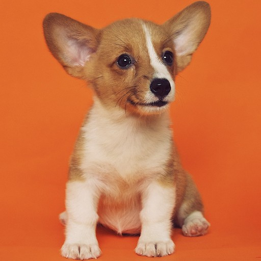 | 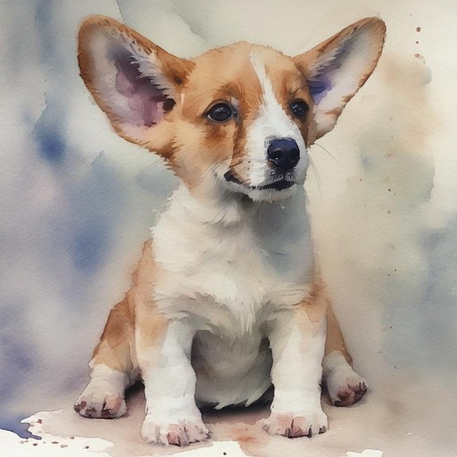 | 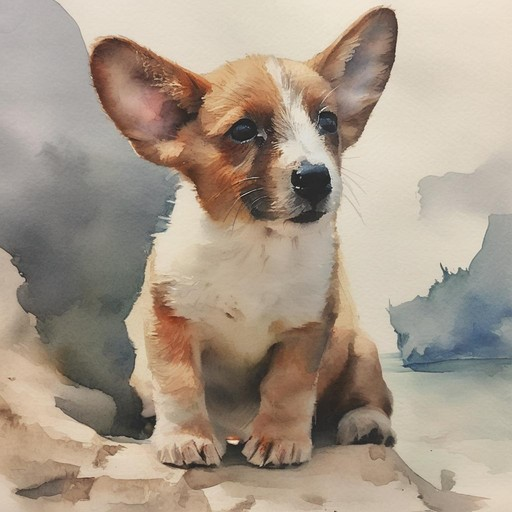 | 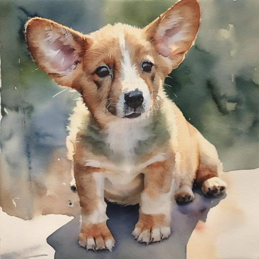 | 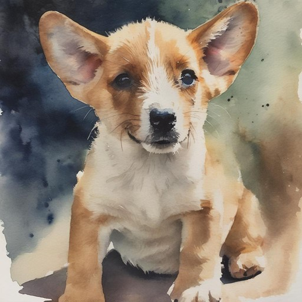 |

スタイル参照画像における背景の物体からのスタイルの漏出を緩和するため、所望のスタイル参照画像を center crop することで学習データを前処理することを提案する。このアプローチは B-LoRA の学習プロセスの間、中心の物体に焦点を当てることで精度を高める。

複雑なシーンにおけるコンテンツの十分な捕捉という最後の限界に対処するため、ネットワークの異なるブロックへ異なるプロンプトを注入する効果を探るアブレーション研究を実施した。具体的には 5 つの実験を行った。

(1) 我々の手法のプロンプト「A [c] in [s] style」を UNet のすべての transformer ブロックへ注入する。(2) コンテンツブロック $W^{4}$ へ「A [c]」を注入し、他のすべてのブロックへ「A [s]」を注入する。(3) (2) の補集合、すなわちスタイルブロック $W^{5}$ へ「A [s]」を、他のすべてのブロックへ「A [c]」を注入する。(4) (2) と同様だが、$W^{4}$ へ「A [c]」を注入しつつ他のブロックは「A [c] in [s] style」を受け取る。(5) (3) と同様だが、$W^{5}$ へ「A [s]」を注入しつつ他のブロックは我々の手法のプロンプト「A [c] in [s] style」を受け取る。

これらの実験の結果を図 18 に提示する。我々の知見は、**$W^{4}$ へプロンプト「A [c]」を注入しつつ他のブロックがプロンプト「A [c] in [s] style」を受け取ることが、とりわけ多数の要素を含む複雑なシーンについて、改善された生成結果にしばしばつながる**ことを示す。

> **訳注**: 図 18 は 21 枚の構成画像からなるグリッドで、HTML 変換により配置が失われている。キャプションの要点は上記本文に含まれる（5 つの実験のうち列 (4) が最良の結果を含む）。

## Appendix C Analysis and Ablation（分析とアブレーション）

##### 層の最適化

本文の 4 節で詳述したとおり、SDXL の UNet は 11 個の transformer ブロックからなり、高解像度のブロックはそれぞれ 2 個の注意層を、中間の 6 ブロックはそれぞれ 10 個の注意層を含む（本文の図 3 を参照）。異なるブロックの組合せが結果として得られる画像に与える影響を探るため、我々は UNet を **8 つのブロック $\{W^{0}_{0}\ldots W^{7}_{0}\}$** に分割した。ここで $\{W^{1}_{0}\ldots W^{6}_{0}\}$ は 4 節で論じたボトルネックのブロックを表し、$W^{0}_{0}$ と $W^{7}_{0}$ を両端の高解像度ブロックに割り当てた。対応するブロックの LoRA 重みを共同で学習することにより、様々なブロックの組合せ $\{\Delta W^{i},\Delta W^{j}\}$ を最適化した場合の効果を評価することを目指した。定性的結果を図 19 と図 20 に描画する。そこでは各セル $(i, j)$ が、SDXL UNet の $i$ 番目と $j$ 番目のブロックのみについて LoRA を学習した後のプロンプト「A [v]」に対する再構成画像を表す。対角の要素は単一のブロックを学習して生成された出力を表す。検討の結果、**$\{\Delta W^{4},\Delta W^{5}\}$ を最適化することが、それぞれコンテンツとスタイルについて一貫して最も満足のいく結果を生み、他の組合せを上回る**ことを観察した。特筆すべきことに、セル $(4, 5)$ の再構成は全組合せ中で達成可能な最良の結果を生み、本文の知見を裏づけた。さらに、**ブロック 2 と 5 の組合せも満足のいく再構成を達成した**ことに気づいた。しかしながら、この組合せを採用すると、$\Delta W^{5}$ が意図されたようにスタイルを主に扱う代わりにコンテンツの詳細を学習して $\Delta W^{2}$ を「覆う」必要が生じるため、**スタイルとコンテンツの解きほぐしが弱まる**可能性がある。この観察は、効果的なスタイル-コンテンツ分離のために $\{\Delta W^{4},\Delta W^{5}\}$ を最適化するという我々の選択をさらに強固にする。

**図19**（訳注: 原典では上三角の 8×8 グリッド（$i \le j$ の 36 セル）。HTML 変換では構成画像に分解されているため、原典の配置に従って表として再構成した）: SDXL UNet の異なるブロックの組合せについて LoRA を学習した後の、プロンプト「A [v]」に対する再構成画像を示すアブレーション研究の定性的結果。各セル $(i, j)$ が特定のブロックの組合せを表し、対角は単一ブロックを学習して生成された出力を表す。特筆すべきことに、セル $(4, 5)$ がコンテンツとスタイルについてそれぞれ最も一貫した最適な再構成を実証している。

| $i \backslash j$ | 0 | 1 | 2 | 3 | 4 | 5 | 6 | 7 |
| --- | --- | --- | --- | --- | --- | --- | --- | --- |
| **0** | 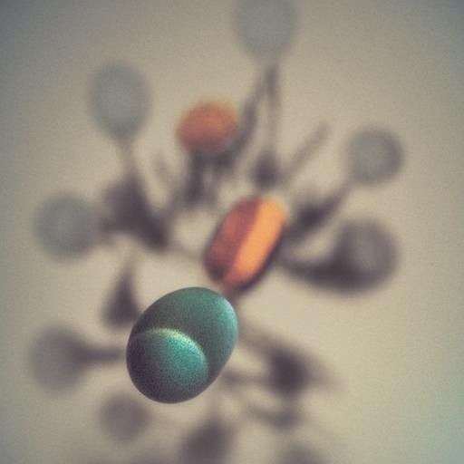 | 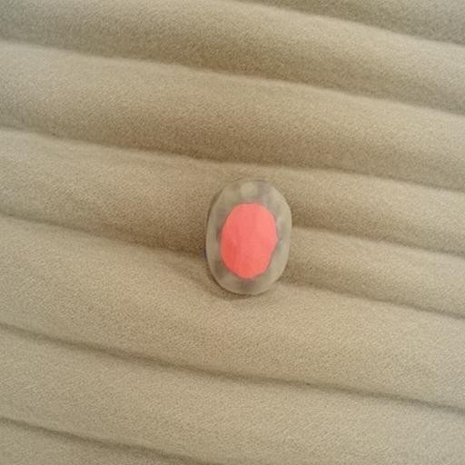 |  |  | 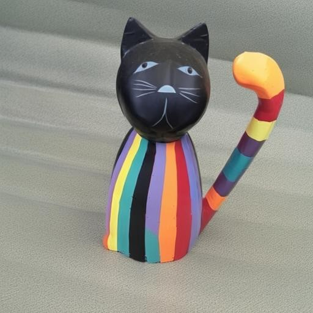 | 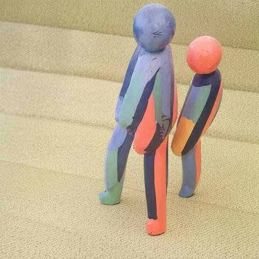 | 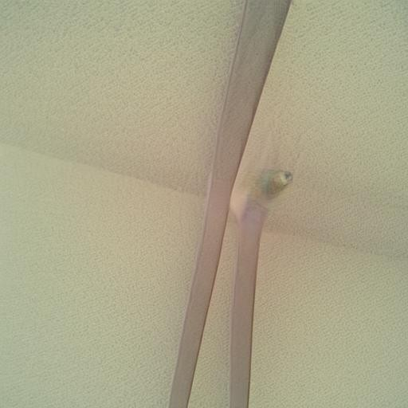 | 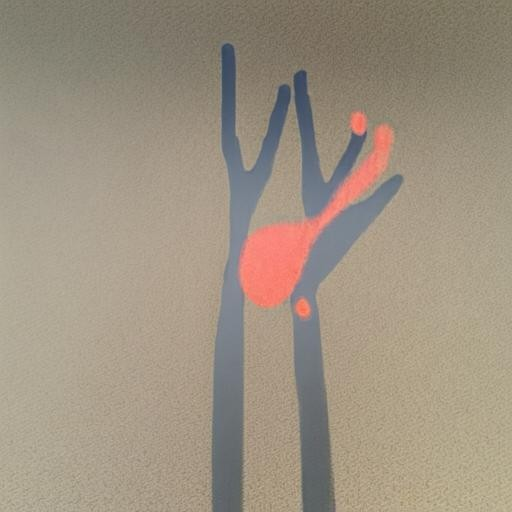 |
| **1** | | 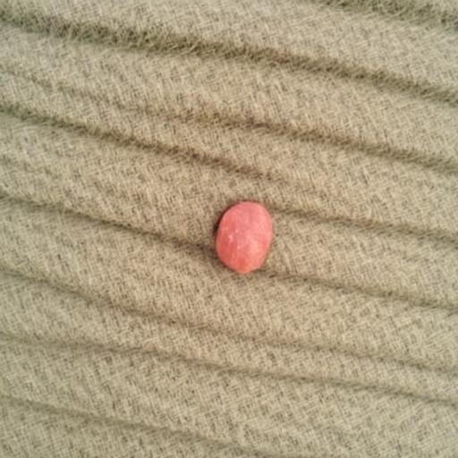 | 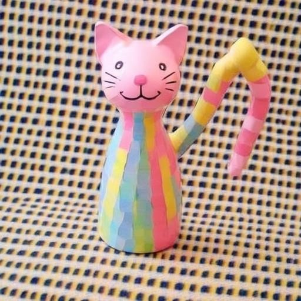 | 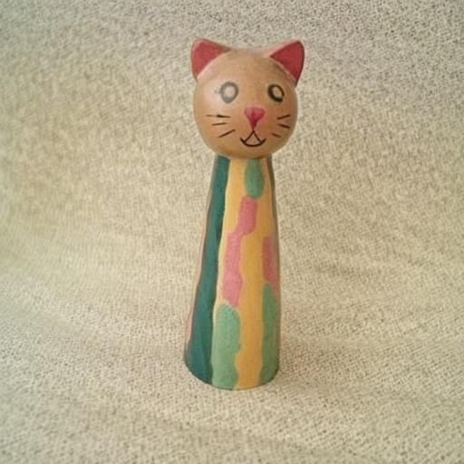 | 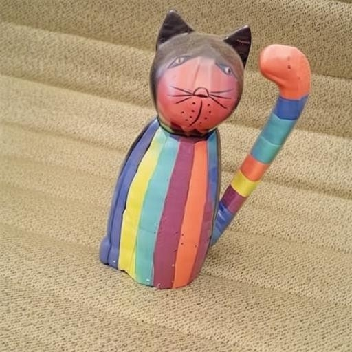 | 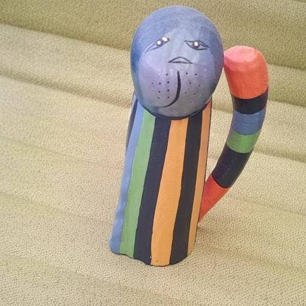 | 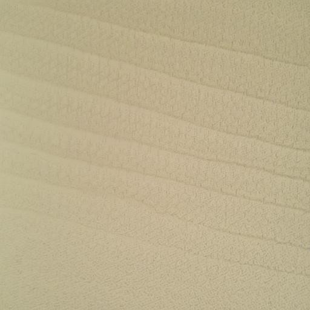 | 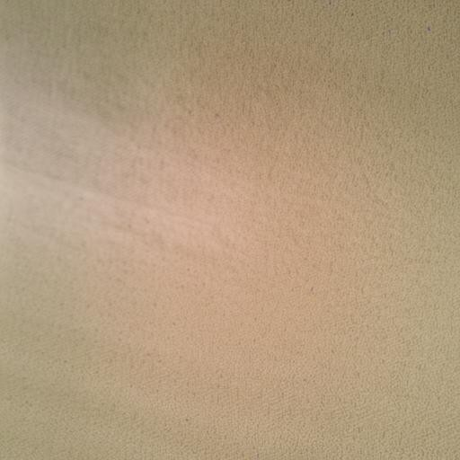 |
| **2** | | | 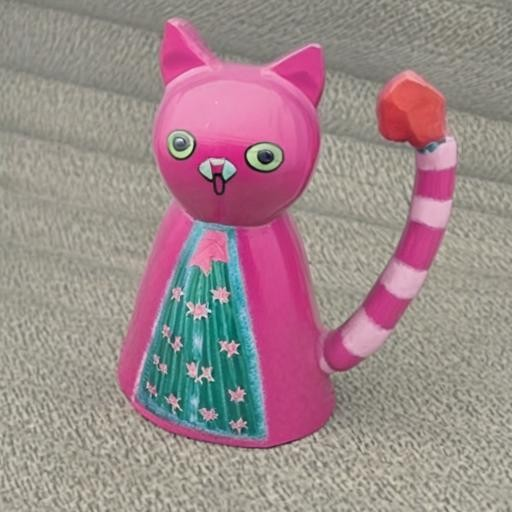 | 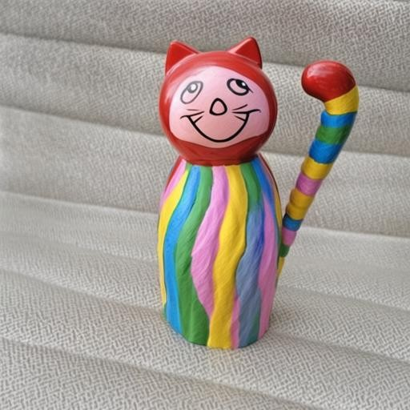 | 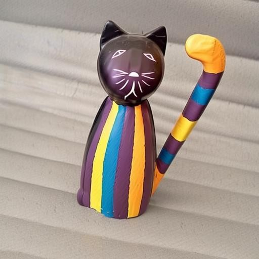 | 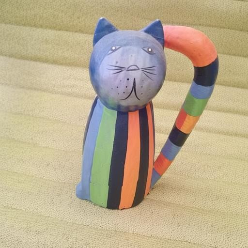 | 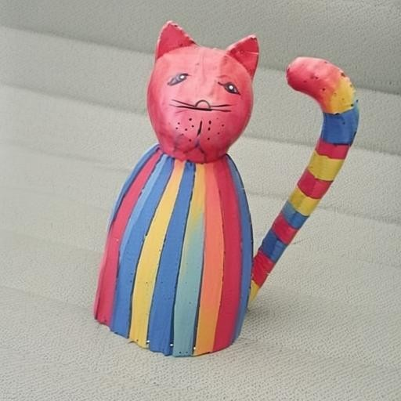 | 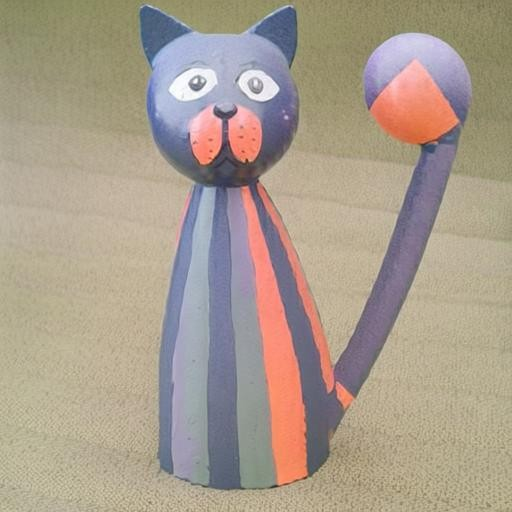 |
| **3** | | | | 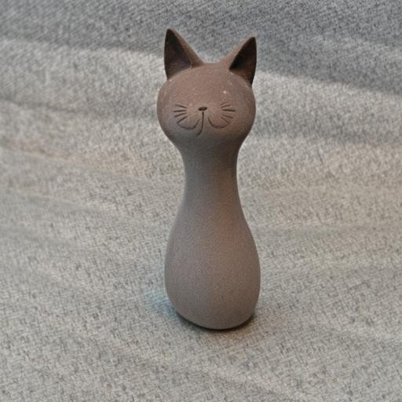 | 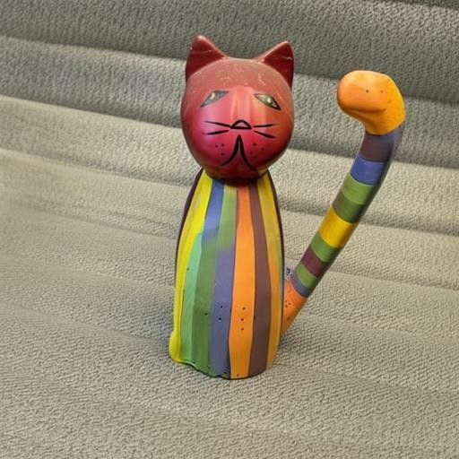 | 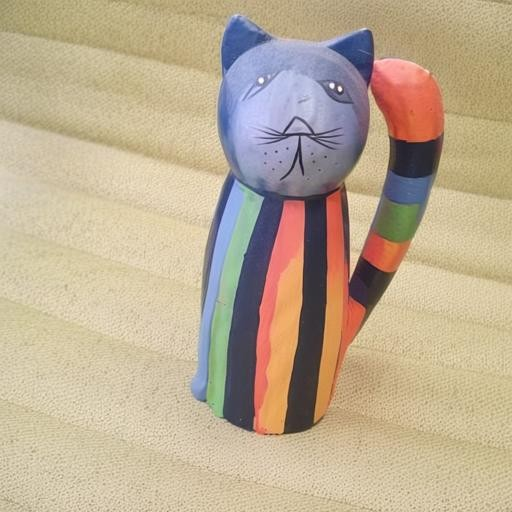 | 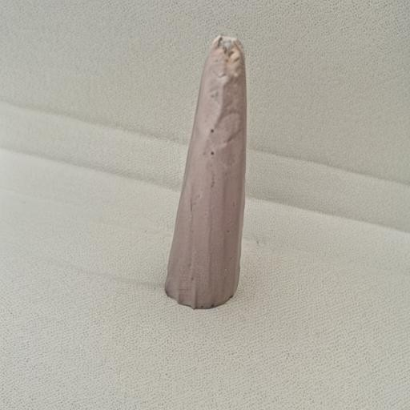 | 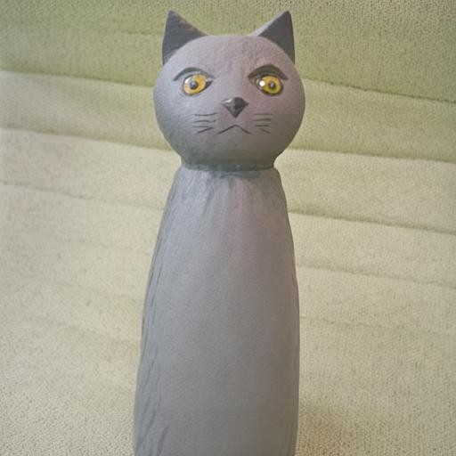 |
| **4** | | | | | 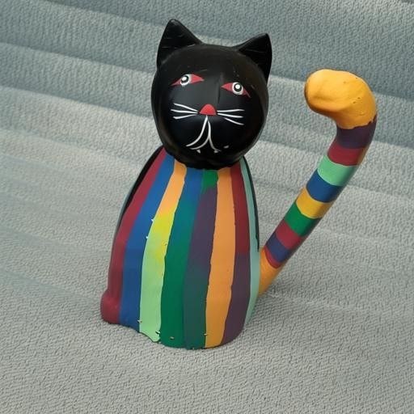 | **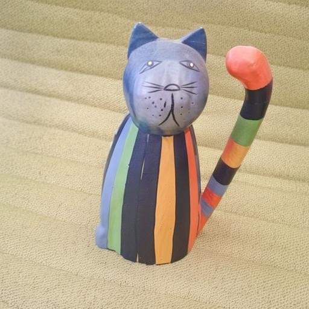** | 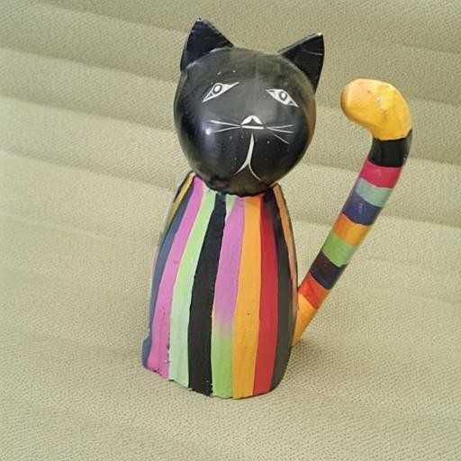 | 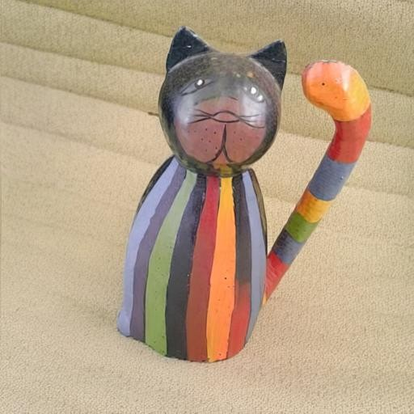 |
| **5** | | | | | | 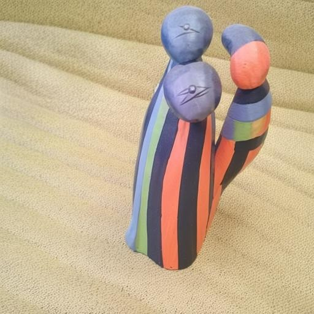 | 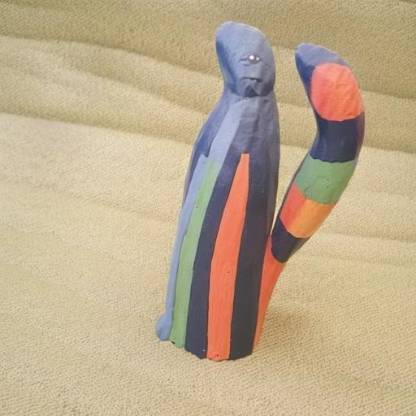 | 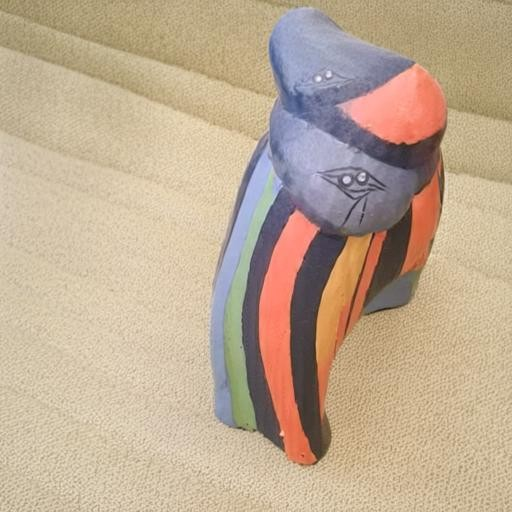 |
| **6** | | | | | | | 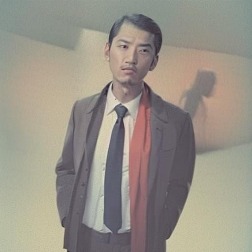 | 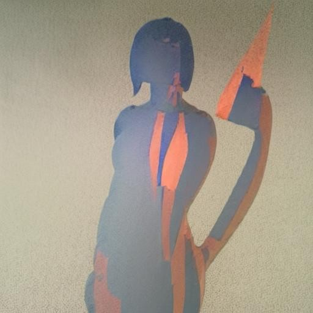 |
| **7** | | | | | | | | 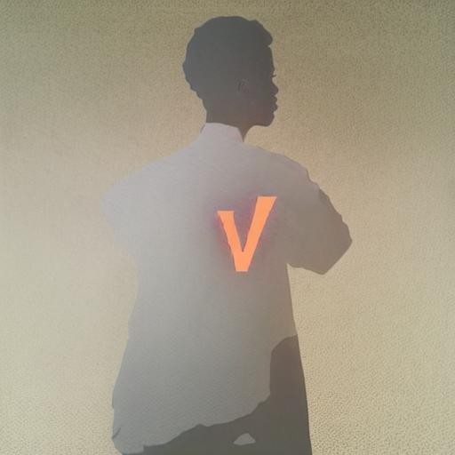 |

> **訳注**: 図 20 は図 19 と同じアブレーションを別の物体（マグカップ）について行ったもので、やはり上三角 8×8 の 36 セルからなる。本翻訳では図 19 を代表として掲載し、図 20 の構成画像は取得していない。キャプションの内容は図 19 と同一である（セル (4, 5) が最も一貫した最適な再構成を実証する）。

##### プロンプトの選択

最適化中のプロンプト「A [v]」という我々の選択を検証するため、学習時に用いるプロンプトに関するアブレーション研究を実施した。DreamBooth の論文で述べられているとおり、著者らは微調整のプロセスを行う最も効率的な方法がプロンプト「A [v] \<class-name>」を用いることだと示唆している。ここで [v] はパーソナライゼーションに割り当てられたトークンで、\<class-name> は入力画像に描かれた物体のクラスである。我々は、プロンプト「A [v]」で $\Delta W^{4}$ と $\Delta W^{5}$ を最適化する我々の手法を、示唆された「A [v] \<class-name>」プロンプトを用いる場合と比較する。

図 21 では、$\Delta W^{4}_{c1}$ と $\Delta W^{5}_{c2}$ を融合して物体 1 のスタイルを物体 2 へ転送することにより、物体間のスタイル転送に対する異なるプロンプトの影響を実証する。4 つの異なるプロンプトを用いる：(1)「A [c1] in [c2] style」（我々の手法）、(2)「A [c1] \<obj1> in [c2] style」、(3)「A [c1] \<obj1> in [c2] \<obj2> style」、(4) クラス名なしで最適化された我々の手法。

見て取れるとおり、「A [c1] in [c2] style」を用いる第 1 列は物体の構造を正しく再構成することに失敗する。「A [c1] \<obj1> in [c2] style」を用いる第 2 列はコンテンツの再構成に成功するがスタイルの転送に苦戦する。「A [c1] \<obj1> in [c2] \<obj2> style」を用いる第 3 列では、結果として得られる画像の構造が obj2 のクラス名に影響される。

対照的に、クラス名なしで最適化された第 4 列の我々の手法は、コンテンツ画像の構造を保存しつつ他の物体からスタイルを効果的に転送できている。これは最適化中にプロンプト「A [v]」を用いる我々のアプローチの有効性を実証する。

> **訳注**: 図 21 は 30 枚の構成画像からなるグリッドで、HTML 変換により配置が失われている。キャプションの要点は上記本文に含まれる。

##### Alpha の効果

本文で述べたとおり、学習の終わりに $W=W_{0}+\Delta W$ を用いて調整済みモデルの重みを得られる。ここで $\Delta W$ は我々の学習済み B-LoRA の更新である。微調整のマージの式の強度は、alpha スカラーによって調整・制御できる：$W=W_{0}+\alpha\Delta W$（我々の実験では $\alpha=1$）。スタイル成分とコンテンツ成分に対する alpha の効果を図 22 で実証する。見て取れるとおり、**alpha の値が小さいとスタイルとコンテンツの双方が失われうる**。

<figure>

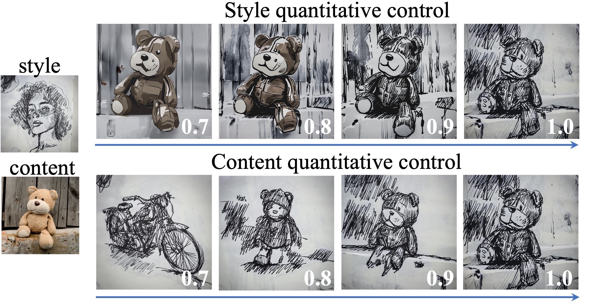

<figcaption>図22: 左はスタイル-コンテンツの入力対。右は α パラメータ（白字で表示）を変えることによるスタイルとコンテンツの定量的な制御。</figcaption>
</figure>

## Appendix D B-LoRA for Personalization（パーソナライゼーションのための B-LoRA）

本論文を通じて、我々の手法はスタイルとコンテンツを分離するために単一の画像を用いて実装されてきた。しかしながら、**コンテンツについて複数の画像を用いて我々の手法を学習することにより、スタイライゼーションの品質を保存しつつ参照物体を再文脈化できる**。図 23 と図 24 では、スタイルとコンテンツの様々な B-LoRA をテキストプロンプトと組み合わせることで、我々の手法の多用途性を示す。スタイルは参照スタイルからも、他の物体からも導出できることに注意されたい。

> **訳注**: 図 23・24 はいずれも 36 枚の構成画像からなるグリッドで、HTML 変換により配置が失われている。キャプションのみ訳出する（両図とも同一のキャプション）。
>
> **図23・図24**: スタイルの様式的特徴を維持しつつ、我々の手法はコンテンツ物体を効果的に再文脈化する。我々のアプローチがスタイル参照画像からも物体参照画像からもスタイルを転送できることに注意されたい。

## Appendix E Additional Results（追加の結果）

我々の B-LoRA 手法は 3 つの主要な応用に焦点を当てている：画像スタイル参照に基づく画像スタイライゼーション、テキストベースの画像スタイライゼーション、一貫したスタイル生成である。図 25 と図 26 では、画像スタイル参照に基づく画像スタイライゼーションについて我々のアプローチが生成した追加の結果を提示する。列はスタイル参照画像を表し、行はコンテンツ参照画像に対応する。既に論じたとおり、我々の手法はスタイル画像からのコンテンツの抽出（図 27）と、物体混合のタスクのための物体からのスタイルの抽出（図 28）に習熟していることを実証する。図 29 と図 30 では、評価集合からランダムに選ばれた物体とスタイルに対する我々の手法の性能を示す定性的結果を提供する。これらの例は、多様なコンテンツ参照とスタイル参照を扱う我々のアプローチの頑健さをさらに浮き彫りにする。図 31 では、テキストベースの画像スタイライゼーションについて追加の定性的結果を提示する。論文で論じたとおり、コンテンツを捉える学習済み B-LoRA 重みのみを利用することにより、我々の手法は入力物体のコンテンツと構造を効果的に保存しつつテキストガイドによるスタイル操作を可能にする。これらの結果は、テキストによるガイダンスを通じた困難なスタイル操作を許容する我々のアプローチの柔軟性を実証する。

> **訳注**: 図 25〜30 は原典では `nicematrix` パッケージで組まれた図表であり、ar5iv・arXiv のいずれの HTML 変換でも画像が生成されていない。図 31 は 36 枚の構成画像からなるグリッドで配置が失われている。以下にキャプションのみ訳出する。
>
> **図25**: B-LoRA を用いた画像スタイル参照に基づく画像スタイライゼーション。困難なコンテンツ画像参照に対する性能を図解する。© 最初の 3 列の絵画は Judith Kondor Mochary による。
>
> **図26**: B-LoRA を用いた画像スタイル参照に基づく画像スタイライゼーション。困難なコンテンツ画像参照に対する性能を図解する。
>
> **図27**: B-LoRA を用いて生成された追加の結果。我々の手法は異なるスタイル画像にわたってコンテンツとスタイルを混合できる。セル $(i, j)$ の各物体は、$i$ 行目の $\Delta W^{4}$ と $j$ 列目の $\Delta W^{5}$ を組み合わせて作られ、対角は再構成画像を表す。© 第 2 列と第 3 列（および行）の絵画は Judith Kondor Mochary による。
>
> **図28**: B-LoRA を用いて生成された追加の結果。我々の手法は異なる物体にわたってコンテンツとスタイルを混合できる。セル $(i, j)$ の各物体は、$i$ 行目の $\Delta W^{4}$ と $j$ 列目の $\Delta W^{5}$ を組み合わせて作られ、対角は再構成画像を表す。
>
> **図29**: ランダムに選ばれた物体とスタイルについて、B-LoRA を用いた画像スタイル参照に基づく画像スタイライゼーション。© 最後の 2 列の絵画は Judith Kondor Mochary による。
>
> **図30**: ランダムに選ばれた物体とスタイルについて、B-LoRA を用いた画像スタイル参照に基づく画像スタイライゼーション。
>
> **図31**: B-LoRA を用いたテキストベースの画像スタイライゼーション。プロンプト「A [v] made of …」を用いて生成。
