# LoRA-Composer: 訓練不要の拡散モデルにおける多概念カスタマイズのための低ランク適応の活用

> 原題: LoRA-Composer: Leveraging Low-Rank Adaptation for Multi-Concept Customization in Training-Free Diffusion Models
> 著者: Yang Yang ほか
> 出典: 2024 ・ arXiv:2403.11627
> コード: https://github.com/Young98CN/LoRA_Composer

## Abstract（要旨）

カスタマイズ生成技術は、多様な文脈にわたる特定概念の合成を大きく前進させてきた。多概念カスタマイズ（Multi-concept customization）はこの領域における挑戦的なタスクとして現れる。既存のアプローチはしばしば、複数の LoRA の Low-Rank Adaptation（LoRA, 低ランク適応）融合行列を訓練して、様々な概念を 1 枚の画像に統合することに依拠する。しかし、我々はこの素朴な手法が 2 つの主要な課題に直面することを特定する：1) **concept confusion（概念混同）**——モデルが各個体の特徴を保てないときに起こる、2) **concept vanishing（概念消失）**——モデルが意図した被写体の生成に失敗するとき。これらに対処するため、我々は LoRA-Composer を導入する。これは複数の LoRA をシームレスに統合するよう設計された訓練不要（training-free）の枠組みで、生成画像内の異なる概念間の調和を高める。LoRA-Composer は **Concept Injection Constraints（概念注入制約）** を通じて concept vanishing に対処し、拡張された cross-attention 機構で概念の可視性を高める。concept confusion に対抗するため **Concept Isolation Constraints（概念分離制約）** を導入し、self-attention 計算を洗練する。さらに、指定領域内の概念固有の潜在を効果的に喚起する **Latent Re-initialization（潜在再初期化）** を提案する。広範なテストにより、特に canny edge やポーズ推定のような画像ベースの条件を排除した場合の、標準ベースラインに対する LoRA-Composer の顕著な性能向上を示す。コードは https://github.com/Young98CN/LoRA_Composer で公開。

###### キーワード:

Multi-Concept Customization, LoRA Integration, Training-Free, Controllable Generation

<figure>

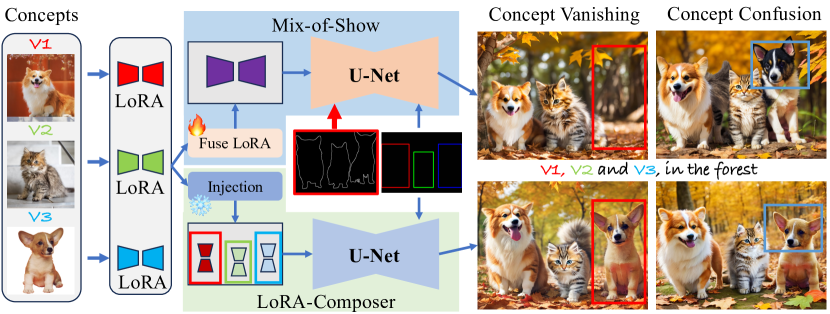

<figcaption>図1: 我々の手法は、画像ベースの条件（上に示したスケッチ）と LoRA 融合行列の訓練の必要を排除する点で Mix-of-Show と異なる。さらに、失敗ケースの提示を通じて Mix-of-Show の限界を強調する。上段では 2 つの主要問題を示す：concept vanishing（意図した概念が画像に欠ける）と concept confusion（モデルが異なる概念を誤って併合・混同する）。</figcaption>
</figure>

## 1 はじめに

拡散モデルは画像生成、特にユーザー固有の概念に従う画像の作成を大きく前進させた。カスタマイズモデルの進歩は、画像合成の地平を豊かにする重要な役割を果たす。単一概念カスタマイズの技術が進化するにつれ、ユーザーは U-Net のファインチューニング、テキスト埋め込みの修正、Low-Rank Adaptation（LoRA）の活用まで、内容を個人化する様々な手法を手にしている。特に LoRA は、多様で生き生きとした個人的画像を生成するためにモデルをカスタマイズできる、汎用的なプラグ&プレイのモジュールとして機能する。その適応性と画像生成における正確さは、LoRA をカスタマイズタスクの好ましい手法として確立し、コミュニティのカスタム視覚コンテンツ作成へのアプローチに大きな影響を与えた。

LoRA は単一概念カスタマイズで優れるが、新興の多概念カスタマイズタスクへの適用には課題がある。最近の進展は、融合チューニング（fusion tuning）を通じて多様な概念を画像に注入するため、複数概念 LoRA の統合を探ってきた。しかし図1 に示すように、これらの統合戦略はしばしば、テキストと画像ベースの入力（人のポーズ推定や canny edge 検出など）を含む様々な条件を必要とする。このアプローチは変化と柔軟性に制約を導入する。さらに、複数 LoRA を組み合わせる過程で、先行研究は融合比率行列（fusion ratio matrix）の訓練に焦点を当てた。しかしこの方法で LoRA 重みを調整すると 2 つの問題が悪化しうる：1) concept vanishing（概念が図に注入されない）、2) concept confusion（モデルが属性を被写体と関連づけられない、または異なる概念の特徴を捉えられない）。これらの問題は図1 上段に、代表的手法 Mix-of-Show の出力で示される。左列は concept vanishing の明確なケースで、モデルがアニメ少女の 1 人と犬の 1 匹の生成に失敗する（赤枠内）。右列は誤った属性結合の問題を強調し、犬の色が誤認されたり、アニメ像の特徴が明確に表現されなかったりする（青枠内）。

既存の課題を克服するため、我々は LoRA-Composer を導入する。これはテキストとレイアウトの手がかりを用い、複数の統合された概念を持つ画像の合成を可能にする訓練不要の枠組みである。LoRA-Composer は 3 つの主要構成要素を含む：Concept Injection Constraints、Concept Isolation Constraints、Latent Re-initialization。Concept Injection Constraints は新しい cross-attention 機構を導入し、次からなる：1) **Region-Aware LoRA Injection**——概念固有の LoRA 特徴を cross-attention を通じて指定領域に注入し、融合ファインチューンなしに拡散モデル枠組み内で複数 LoRA のシームレスな統合を促す。2) **Concept Enhancement Constraints**——ユーザー指定領域で概念を強調するよう潜在の洗練を導く。これらの戦略は、概念挿入用に指定された領域にモデルを集中させ、concept vanishing の問題を効果的に緩和する。Concept Isolation Constraints は、self-attention に集中することで concept fusion の問題に特に対処する。各概念がその独自の特徴を維持するよう制限を実装する。これは、ノイズ除去された潜在空間内の更新過程を導き、各概念の独自特徴と対応するテキスト記述との整合を保つ重要な役割を果たす。伝統的な単一概念 LoRA 訓練は通常、画像生成全体をカバーし、局所領域生成には制約的になりうる。我々は、より正確な prior を確立しモデルの焦点を画像の特定領域に向けるため、潜在ベクトルの再初期化を提案する。

我々は、ペットからキャラクター・背景まで、幅広い多概念カスタマイズシナリオで LoRA-Composer を厳密にテストした。我々のアプローチは、包括的な定性・定量評価を通じて既存ベンチマークと比べ強い性能を示した。

まとめると、貢献は次の通り：

- 複数 LoRA を統合する訓練不要モデル LoRA-Composer を提案する。容易に入手できる条件（レイアウトとテキストプロンプト）だけを必要とする。様々な概念を 1 枚の画像にまとめる過程を簡素化し、ユーザーへの説得力を高める。
- concept vanishing と concept confusion に取り組むため、Concept Injection Constraints と Concept Isolation Constraints を実装する。これらは U-Net の注意機構を強化し、モデルが個々の概念の特徴に集中し、背景や他概念からの干渉を防ぐようにする。
- より良い prior を得てモデルが特定の画像部分に集中する能力を高めるため、Latent Re-initialization を提案する。
- 広範な評価により、特に画像ベース条件を排除したシナリオで、本手法がベースライン性能を上回ることを示す。

## 2 関連研究

### 2.1 制御可能な画像生成

大規模 text-to-image データセットで訓練された拡散モデル（DALLE-2, Imagen, Stable Diffusion, SDXL）は、テキストに整合した多様な画像を前例のない高品質で生成できる。スケッチ・人のキーポイント・意味マップなど細粒度の空間条件からの画像生成をさらに支えるため、ControlNet は事前学習済み U-Net の学習可能コピーをファインチューンし、新しい層と元の U-Net 重みを zero convolution で接続する。類似の T2I-Adaptor は空間条件からの条件付き生成のため軽量アダプタをファインチューンする。GLIGEN は疎なボックスレイアウト条件での制御可能生成を考え、ファインチューニング用に gated self-attention を注入する。これらが条件・画像対の自己収集データセットでファインチューンするのに対し、最近の研究は zero-shot 制御可能生成のためのテスト時最適化を探る。例えば BoxDiff と Attention Refocusing は、ボックス内の特徴とその対応テキスト記述の間の注意重みを最大化し、ボックス外の潜在特徴がテキストに注意するのを抑えることで、zero-shot レイアウト条件付き生成を達成する。

### 2.2 単一概念カスタマイズ

概念カスタマイズは、数枚の入力画像で指定された概念の生成を目指す。いくつかの代表的手法は単一概念のカスタマイズに焦点を当てる。例えば DreamBooth は事前学習済み拡散モデルをカスタム概念の数サンプルでファインチューンし、過学習を緩和するため prior-preservation loss を導入する。一方 Textual Inversion は事前学習済み重みを固定し、新規概念を結合する学習可能なテキスト埋め込みだけを調整する。概念表現の能力をさらに高めるため、P+ と NeTI はそれぞれ層ごとのテキスト埋め込みや暗黙の MLP を学習する。別の系統は高速カスタマイズのため大規模画像データセットで専用モデルを訓練する。例えば BLIP-Diffusion はテキストプロンプトと被写体画像の両方を入力に取り、大量のデータ対で学習してカスタマイズ画像を生成する。一方 HyperDreamBooth は、まず大量のカスタム概念の LoRA 重みを集め、入力概念画像から LoRA 重みを予測するようモデルを訓練する。

### 2.3 多概念カスタマイズ

単一概念カスタマイズに焦点を当てる上記と異なり、いくつかの最近の研究は複数概念のより難しい一般設定に取り組む。先駆的研究 Custom Diffusion は複数の概念画像を共同でファインチューンしてカスタマイズする。Cones は事前学習済み拡散モデル内の概念関連ニューロンを見つける。Cone 2 はさらに残差トークン埋め込みとレイアウト条件付けを取り入れ生成品質を高める。カスタマイズ生成を加速するため FastComposer は大量データで拡散モデルをファインチューンし、被写体埋め込みを入力に取って複数概念の合成画像を生成する。同様に Paint-by-Example と AnyDoor は大量の画像で訓練され、画像 inpainting を通じて多概念生成を達成する。カスタマイズへの LoRA の広範な利用を考え、最近のいくつかの研究は個々の概念の複数 LoRA 重みを組み合わせて多概念カスタマイズを達成しようとする。例えば Mix-of-show は gradient fusion を提案し、個々の LoRA の予測を模倣する合成 LoRA 重みを訓練する。さらに最終生成に T2I-Adaptor とスケッチやキーポイントを活用する。同時期の研究 [^44]（Multi-LoRA Composition）は、復号中に LoRA マージを実現する 2 変種 **LoRA Switch** と **LoRA Composite** を提案する。前者は複数 LoRA 重みを逐次的に使い、後者は異なる LoRA 重みから得た潜在を平均する。しかしそれらは単一の前景と単一の背景 LoRA 重みの組合せに焦点を当てる。対照的に、我々は複数の前景キャラクターをカスタマイズするより難しいタスクに取り組み、concept confusion と vanishing の深刻な問題に直面する。

おそらく我々に最も近い研究は Mix-of-Show だが、次の違いを強調する。第一に、Mix-of-Show は複数概念の各組合せで繰り返しの gradient fusion 訓練を要するが、我々は LoRA 重みを再訓練せずその場でこれを達成する。第二に、Mix-of-Show は高品質生成のためスケッチやキーポイントなど追加の画像ベース条件を入力に要するが、これは入手が難しいことがある。

## 3 手法

<figure>

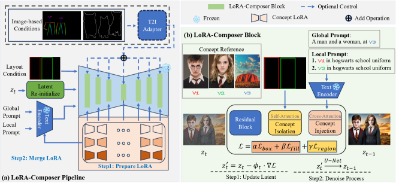

<figcaption>図2: (a) LoRA-Composer はテキスト・レイアウト・画像ベース条件（任意）を用い、正確なレイアウト生成のための Latent Re-initialization を通じて複数概念を統合・カスタマイズする。(b) LoRA-Composer Block での Stable Diffusion U-Net への修正は、self-attention での concept isolation と cross-attention での Concept Injection を含み、概念間の特徴漏れを防ぎつつ正確な概念配置を最適化する。</figcaption>
</figure>

LoRA-Composer のパイプラインは図2 に示される。対象物体・シーン・位置が与えられると、高い忠実度と多様性で概念を統合する。中心的発想は、概念を identity・detail 関連特徴で表現し、それらを事前学習済み拡散モデルに注入して与えられたシーンに再合成すること。Sec. 3.1 で拡散モデルと ED-LoRA を概観し、Sec. 3.2 で LoRA-Composer アプローチ（パイプラインは図2(a)）を導入する。鍵は LoRA-Composer Block（図2(b)）による LoRA のスケーラビリティ拡張である。Sec. 3.3・3.4 で 2 つの主要構成要素を詳述し、Sec. 3.5 で Latent Re-initialization を論じる。複数概念を 1 枚に統合し、より柔軟・スケーラブルな解を目指す。

### 3.1 準備

**拡散モデル**は高品質画像を生成する能力で名高い。順方向（ガウスノイズを段階的に加える）と逆方向（ノイズ化条件から元画像を再構成）の 2 相で動作する。逆相は通常テキスト条件付けで強化された U-Net を用いる。本研究では、画素を直接操作せず潜在空間で動作する Stable Diffusion を用いる。オートエンコーダ（エンコーダ $\mathcal{E}$・デコーダ $D$）が画素空間 $x$ と潜在空間 $z$ の橋渡しをする（$D(z)=D(\mathcal{E}(x))$）。各時刻 $t$ で、テキスト条件 $\tau(P)$ と画像 $x$ が与えられたとき（$P$ はテキストプロンプト、$\tau$ は事前学習済み CLIP テキストエンコーダ）、Stable Diffusion の訓練目的は次のノイズ除去目的の最小化：

$$
\mathcal{L}=\mathbb{E}_{z\sim\mathcal{E}(x),y,\epsilon\sim\mathcal{N}(0,1),t}\left[\|\epsilon-\epsilon_{\theta}(z_{t},t,\tau(y))\|_{2}^{2}\right],
$$

ここで $\epsilon_{\theta}$ は学習可能パラメータ $\theta$ を持つノイズ除去 U-Net。

**ED-LoRA** は分解構造を用いて埋め込みの表現力を高める。ED-LoRA は P+ の手法に従い層ごとの埋め込み戦略を実装し、概念トークン（$V=V_{rand}V_{class}$）の多面的表現を作る。これは基底埋め込みにランダム変動 $V_{rand}$ とクラス固有成分 $V_{class}$ を加える。さらにテキストエンコーダと U-Net の全注意モジュールの線形層に LoRA 層を統合する。これにより線形層を低ランクに修正することでモデルを特定概念に柔軟に適応させ、テキスト記述に基づく画像の符号化・合成能力を高い忠実度で高める。以降はこれを既定で使う。

### 3.2 LoRA-Composer パイプライン概観

LoRA-Composer は被写体登録に標準的な LoRA アプローチを用い、LoRA 融合のための再訓練なしに多様な被写体のシームレスな統合を促す。多被写体カスタマイズの複雑なタスクは 2 段階で展開する：まず各被写体の正確な表現を作り、次にそれらを 1 枚に整合的に組み合わせる。過程は、訓練するかコミュニティ共有のものをダウンロードして LoRA モデルを取得することから始まる。続いて LoRA-Composer がこれらの LoRA を統一された整合的な画像に効率的に組み合わせる。さらに複数条件の同時管理を洗練するため、T2I-Adapter や ControlNet を使って画像ベース条件を組み込むオプションも提供する。

我々の主要貢献は LoRA-Composer Block（図2(b)）の導入である。U-Net アーキテクチャ内の注意ブロックを再設計した。残差ブロック構造を保ちつつ self-attention と cross-attention を適応させた。self-attention 層では Concept Isolation Constraints を導入して異なる概念を効果的に分離し、その区別性を保証する。同時に cross-attention 機構では concept vanishing に対抗する Concept Injection Constraints を実装する。これらの戦略は、self-attention と cross-attention マップを使って過程を導き、ユーザーの好みに合わせた画像へと潜在空間を洗練する。

### 3.3 Concept Injection Constraints

単にテキストプロンプトで所望概念を指定すると、基本の Stable Diffusion では概念が欠ける結果になりうる。BoxDiff・Attend-and-Excite・Local control のような空間注意誘導法は多概念生成での物体欠落を緩和できるが、ユーザー定義概念の精密な表現には及ばない。ユーザー定義概念を正確に取り込む課題に取り組むため、概念注入制約アプローチを導入する。これは 2 つの主要構成要素からなる：Region-Aware LoRA Injection と Concept Enhancement Constraints。

<figure>

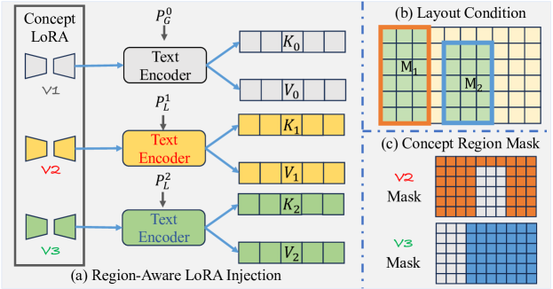

<figcaption>図3: LoRA-Composer Block のモジュール：(a) region-aware LoRA injection、(b) レイアウト条件、(c) concept region mask。</figcaption>
</figure>

**Region-Aware LoRA Injection:** Regionally Controllable Sampling に着想を得て、本手法は Region-Aware LoRA Injection から始まる。図3(a) のように、レイアウト条件（図3(b)）を受け取ると、query・key・value を抽出する。

$$
Q_{n}=M_{n}\odot W_{0}^{Q}(z),\quad K_{n}=W_{n}^{K}(\tau_{n}(P^{n})),\quad V_{n}=W_{n}^{V}(\tau_{n}(P^{n})),
$$

ここで $n\in[1,2,...]$ と $P^{n}$ はそれぞれ前景概念 LoRA のインデックスとある領域の局所プロンプトを表す。$n=0$ のとき $P^{n}$ は大域プロンプトを示す。$\odot$ は Hadamard 積で、レイアウトマスク $M_{n}$ に対応する潜在領域を識別する。$W^{Q},W^{K},W^{V}$ は概念 LoRA を組み込んだ U-Net ブロックの cross-attention モジュール内の射影行列。各概念にこの処理を繰り返した後、cross-attention 機構で隠れ状態を更新する：

$$
h_{n}=\text{softmax}\left(\frac{Q_{n}K_{n}}{\sqrt{d}}\right)V_{n},
$$

ここで $d$ は query と key の次元。この注入アプローチは背景・前景概念の包括的な統合を保証し、生成画像内でユーザー指定概念を正確に反映する能力を高める。

**Concept Enhancement Constraints:** BoxDiff の方法論を基に、合成物体がユーザー定義位置に正確に整合するよう、cross-attention 機構内の高応答を指定マスク領域に閉じ込める直接的方法を用いる。さらに、物体生成がレイアウトボックスの隅に偏る問題に対処するため、cross-attention マップサンプリングにガウス重みを取り入れる。

$$
\mathcal{L}_{ce}=\sum_{n=1}^{n}\left(1-\frac{1}{S}\sum^{S}_{S=0}\textbf{topk}(A^{c}_{n}\odot M_{n}\odot G,S)\right),
$$

ここで $\textbf{topk}(\cdot,S)$ は入力中の最高応答 $S$ 要素の選択を示す。$A^{c}_{n}$ は特定概念の cross-attention マップ $A$ における概念トークンの位置 $c$ を表す。$G$ は標準ガウス分布。さらに概念がボックス全体を満たすよう、x 軸・y 軸の射影での損失も提案する。まず cross-attention マップを max 操作で w 軸・h 軸に圧縮する：

$$
a^{c}_{n}(j)=\mathbf{Max}_{i=1,2,\dots,h}A^{c}_{n}(i,j),\quad a^{c}_{n}(i)=\mathbf{Max}_{j=1,2,\dots,w}A^{c}_{n}(i,j).
$$

次に各軸で L1 損失を計算する：

$$
\mathcal{L}_{fill}=\sum_{n=1}^{n}\frac{1}{K}\left(\sum(\mathbf{1}-\{M_{n}\odot a^{c}_{n}(j),M_{n}\odot a^{c}_{n}(i)\})\right),
$$

ここで $\{\cdot,\cdot\}$ は連結操作、$\mathbf{1}$ は 1 のベクトル、$K$ は $\mathbf{1}$ の長さ。

### 3.4 Concept Isolation Constraints

Concept Injection Constraints は物体がユーザー指定領域に置かれることを保証するが、これらの領域内でカスタマイズ概念が重なったり「感染」したりするのを防げない（図6(d)）。各概念の指定領域内での完全性と区別性を保つため、Concept Isolation Constraints を導入する。これは 2 つの主要構成要素に分かれる：Concept Region Mask と Region Perceptual Restriction。両者は U-Net ブロックの self-attention 機構内に統合され、各概念が分離され他から影響されないことを保証し、目標領域での概念の純度を保つ。

**Concept Region Mask:** self-attention 機構は全 query 要素間の接続を作り、各概念の独自特徴の維持に不可欠である。各概念の区別性を保つため、レイアウト条件（図3(b)）に導かれる concept region mask 戦略を採る。これは特定概念領域内の query と他概念領域の query の相互作用を制限する（図3(c)）。結果として、各概念の独自特徴が近隣概念の影響から自由に保たれる。

**Region Perceptual Restriction:** Stable Diffusion の down-sampling と残差畳み込み操作により、概念特徴が背景領域用の要素に拡散しうる（図3(b) の黄色四角）。意図しない領域への概念特徴漏れを緩和するため、Region Perceptual Restriction を用い、前景と背景領域の query 間の相互作用を最小化する。これは次で定式化される：

$$
\mathcal{L}_{region}=\sum_{n=1}^{n}\left(\frac{1}{P}\sum^{P}_{P=0}\textbf{topk}(\bar{A}_{[M_{n},\mathbf{1}-{M}_{n}]},P)\right),
$$

ここで $\bar{A}_{[M_{n},\mathbf{1}-{M}_{n}]}$ はチャネル次元の行列スライス操作で得た self-attention マップ。

各時刻での全体制約損失は：

$$
\mathcal{L}=\mathcal{L}_{ce}+\alpha\mathcal{L}_{fill}+\beta\mathcal{L}_{region},
$$

ここで $\alpha,\beta$ は重み係数。制約損失 $\mathcal{L}$ を用い、現在の潜在 $z_{t}$ をステップサイズ $\phi_{t}$ で更新する：

$$
z^{\prime}_{t}\leftarrow z_{t}-\phi_{t}\cdot\nabla\mathcal{L}.
$$

BoxDiff に従い、ステップサイズ $\phi_{t}$ は各時刻で線形に減衰する。これらの制約を取り入れることで、$z^{\prime}_{t}$ は各時刻でユーザー指定レイアウト領域内のカスタマイズ概念の生成を促しつつ、他概念領域への概念特徴漏れを防ぐ。続いて $z^{\prime}_{t}$ が次の推論ステップの U-Net 入力になる（$z^{\prime}_{t}\xrightarrow{U-Net}z_{t-1}$）。

### 3.5 Latent Re-initialization

伝統的な LoRA は画像全体の生成で訓練されるため、特定の局所領域の生成には理想的でないことを発見した。この訓練と推論の不一致は誤整合を生みうる。これに対処するため、概念固有 LoRA の統合により適した潜在空間の再初期化を提案する。

ノイズ除去相の前に潜在空間を再初期化する。ガウス分布からランダム潜在ベクトルをサンプルし、LoRA-Composer 過程（式10 の 1 ステップ更新）を適用する。その後、各局所プロンプトの潜在 query 写像とテキスト埋め込み写像に基づき cross-attention マップ $A_{n}^{t}$ を生成する。次に最高スコア領域を特定し、事前定義の概念マスク領域 $M_{n}$ を置き換える。具体的には、ある概念の領域インデックス $\hat{i}_{n},\hat{j}_{n}$ を次で決める：

$$
\hat{i}_{n},\hat{j}_{n}=\underset{i\in 0,1\dots w,\,j\in 0,1\dots h}{\mathrm{arg\,max}}\ \sum_{i}^{i+\mathbb{W}}\sum_{j}^{j+\mathbb{H}}\textbf{crop}(A^{c}_{n},[i,j],\mathbb{W},\mathbb{H}).
$$

ここで $\mathbb{W},\mathbb{H}$ は概念マスク $M_{n}$ の幅と高さ、$w,h$ は cross-attention マップ $A^{c}_{n}$ の幅と高さ。$\textbf{crop}$ は左上座標 $[i,j]$ で形 $\mathbb{W},\mathbb{H}$ に注意マップを切り抜く。最後に潜在を標準ガウス分布に正規化し、後続処理に備える。

<figure>

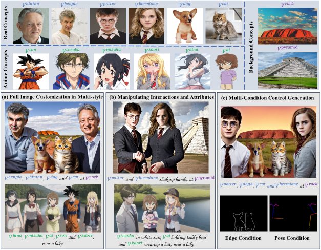

<figcaption>図4: LoRA-Composer の 3 つのハイライト：a) 多スタイルでのフル画像カスタマイズ、b) 相互作用と属性の操作、c) 多条件制御生成。</figcaption>
</figure>

## 4 実験

### 4.1 実験設定

**データセット。** LoRA-Composer の徹底評価のため、Mix-of-Show に従い、写実・アニメ両スタイルのキャラクター・動物・背景からなる、計 16 のカスタマイズ被写体のデータセットを編成する。多様な被写体組合せでの包括的実験により、本手法の優位を示す。

**評価指標。** 先行研究で提案された 2 指標を用いる。(1) **画像類似度（Image similarity）**：生成画像と対象被写体の CLIP 画像埋め込みでの視覚的類似度を測る。多概念生成では各対象概念ごとに個別に計算し平均する。(2) **テキスト類似度（Textual similarity）**：生成画像と関連テキストプロンプトの CLIP モデルでの平均類似度を測る。前景概念では各概念を分離し、局所プロンプト $P^{n}_{L}$ の各概念トークン $V$ を概念のクラス名に置換してから計算する。背景概念では画像全体を入力する。最終スコアはこれらの平均。

**ベースライン。** 4 つの主要競合と比較する。Cones2 はテキスト埋め込みを活用しモデル洗練なしに任意の概念組合せを支える。Mix-of-Show は gradient fusion で複数概念をベースモデルにシームレスに統合する。AnyDoor と Paint by Example はどちらも inpainting 用に訓練されたネットワークで多概念生成を促す。

### 4.2 可視化結果

本手法は前景・背景の両成分に対応し、アニメから写実まで幅広いスタイルに対応する、画像全体の広範なカスタマイズを可能にする（図4(a)）。さらに、握手・帽子着用・テディベアを持つなど、相互作用と属性の精密な操作をテキストプロンプトで直接可能にする（図4(b)）。また我々の枠組みは柔軟性のため設計され、複数条件下で画像を生成できる。edge 検出やポーズ推定などの特定制約を巧みに統合して画像合成を導く（図4(c)）。

**表1**: アニメ・写実スタイル概念生成での LoRA-Composer の性能をベースラインと比較。T はテキスト類似度、I は画像類似度、\* は画像ベース条件の使用を示す。各列の最高スコアを太字。

| Method | Anime-I | Anime-T | Real-I | Real-T | Mean-I | Mean-T |
| --- | --- | --- | --- | --- | --- | --- |
| Cones2 | 0.5940 | 0.5691 | 0.5924 | 0.5912 | 0.5932 | 0.5801 |
| Mix-of-Show | 0.6296 | 0.5741 | 0.6743 | 0.5970 | 0.6519 | 0.5856 |
| Anydoor | - | - | 0.6801 | 0.6410 | 0.6801 | 0.6410 |
| Paint by Example | - | - | 0.6888 | 0.6356 | 0.6888 | 0.6356 |
| LoRA-Composer | 0.8219 | 0.5945 | 0.7363 | 0.6293 | 0.7791 | 0.6119 |
| Mix-of-Show* | 0.8238 | 0.6067 | 0.7097 | 0.6203 | 0.7668 | 0.6135 |
| LoRA-Composer* | 0.8320 | 0.5981 | 0.7367 | 0.6314 | 0.7843 | 0.6147 |

### 4.3 定量結果

表1 に詳述するように、LoRA-Composer は画像類似度で先行技術を上回り、アニメ・写実両スタイルでの有効性を示す。逆に AnyDoor や Paint by Example のような inpainting ベース手法はテキスト類似度が高い。これらは参照画像でユーザー定義位置に被写体を挿入することに特化し、テキスト記述との整合により集中するためである。本手法は LoRA-Composer block の有効性により Cones2 を大幅に上回る。

公平のため 2 設定（画像ベース条件なし、あり \*）を設けた。本手法は両方で一貫して上回る。画像ベース条件は Mix-of-Show で重要な役割を果たし、それなしでは画像・テキスト類似度の両方が大きく落ちる。対照的に LoRA-Composer は高い頑健性を示し、画像ベース条件からさらに利益を得る。

### 4.4 定性比較

画像ベース条件を使わずに 4 ベンチマークで LoRA-Composer を評価する（図5）。Cones2 は concept confusion に直面し概念特徴を明確に捉えられない。AnyDoor や Paint by Example のような inpainting ベースモデルは眼鏡や灰色の巻き毛など一部の概念特徴を保つが、特に顔の細部で苦戦する。Mix-of-Show も concept confusion に苦しむ（1 行目で眼鏡が男性に誤って置かれる、2・3 行目で 2 人が完全に消失）。対照的に本手法は全被写体を正しい特徴で正確に取り込んだ画像を合成し、多概念合成と属性精度で性能向上を示す。

<figure>

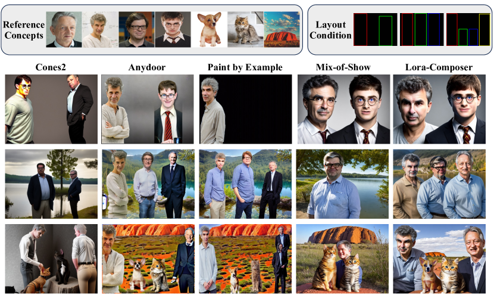

<figcaption>図5: ベースラインとの定性比較。各ケースで全手法に同じシードを使う。</figcaption>
</figure>

**表2**: 各種構成要素のアブレーション研究。「LR」は Latent Re-initialization、「CI」は Concept Isolation Constraints、「CE」は Concept Injection Constraints 内の Concept Enhancement Constraints。

| CE | CI | LR | Anime-I | Anime-T | Real-I | Real-T | Mean-I | Mean-T |
| --- | --- | --- | --- | --- | --- | --- | --- | --- |
| ✓ | ✓ | ✓ | 0.8031 | 0.5948 | 0.7299 | 0.6341 | 0.7715 | 0.6144 |
| ✓ | ✓ |  | 0.8024 | 0.5923 | 0.7350 | 0.6314 | 0.7687 | 0.6119 |
| ✓ |  |  | 0.7957 | 0.5899 | 0.7271 | 0.6250 | 0.7614 | 0.6075 |
|  |  |  | 0.6597 | 0.5725 | 0.6683 | 0.6105 | 0.6640 | 0.5915 |

### 4.5 アブレーション研究

各構成要素の有効性を示すため、5 概念と 4 概念の難しいシナリオを選ぶ。図6(c) のように、赤枠内のアニメ少女と女性の位置が図6(a) のレイアウト条件から逸れる。これは Latent Re-Initialization（LR）の省略が、空間 prior の欠如により概念の正確な配置を妨げる証拠である。次に図6(d) のように、Concept Isolation Constraints（CI）を除くと概念特徴が混ざる（アニメ少女の髪型の混乱、男性の髪色の歪み）。CI なしでは概念が重なり互いに影響し、全体構図の調和が崩れる。最後に図6(e) のように、Concept Enhancement Constraints（CE）を除くと概念が消失する。ただし Region-Aware LoRA Injection があるため、配置と表現の精度は落ちるが概念挿入能力は保たれる。これは各要素の重要な役割を強調する。

偶然でないことを示すため包括的な定量評価を行った（表2）。CE は全指標で大きな改善をもたらし（平均画像類似度が約 0.1 増）、概念活性化での有効性を示す。LR は領域固有 prior を洗練しさらに寄与する。CI は概念特徴の区別性保持とモデル頑健性向上に重要な役割を果たす。

<figure>

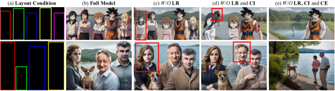

<figcaption>図6: 個別構成要素のアブレーション研究の可視化結果。「L」は Latent Re-initialization、「CI」は Concept Isolation Constraints、「CE」は Concept Injection Constraints 内の Concept Enhancement Constraints。</figcaption>
</figure>

## 5 結論

本論文では、複数概念を 1 枚の画像にシームレスに統合する新規手法 LoRA-Composer を導入した。多概念カスタマイズの 2 つの一般問題——concept vanishing と concept confusion——を探った。concept vanishing に対抗するため Concept Injection Constraints を、concept confusion を緩和するため Concept Isolation Constraints と Latent Re-initialization を用いる。実験は、背景・前景を含む画像全体のカスタマイズと、テキストプロンプトを通じた様々な概念の相互作用・属性の操作の能力を強調する。従来手法と比べ、LoRA-Composer は柔軟性と使いやすさを高め、より少ない条件と容易に入手できる LoRA 技術で画像生成を可能にする。さらに、複数概念の高忠実な組合せを達成する能力を示し、複雑な画像生成タスクでの実用性を裏付ける。

## Appendix 0.A 実装の詳細

**事前学習済みモデル。** Mix-of-Show に従い、写実概念画像の作成には Chilloutmix を、アニメ概念には Anything-v4 を事前学習済みモデルに選ぶ。公平な比較のため、Cones2 や Mix-of-Show のような訓練ベース手法もこれらを使う。inpainting ベースモデル（AnyDoor は Stable Diffusion v2.1 を洗練、Paint by Example は SD 1.4 を洗練）は公式モデルに従う。

**ED-LoRA 設定。** 概念忠実度の維持能力の強さから ED-LoRA を選ぶ。[^7] の単一概念 ED-LoRA チューニング指針に沿い、テキストエンコーダと U-Net の全注意モジュールの線形層に LoRA 層を統合し、全実験で階数 $r=4$ とする。最適化は Adam（テキストエンコーダ 1e-5、U-Net 1e-4）。

**サンプル詳細。** 全実験で DPM-Solver を用い、適応的サンプリングステップで計算効率を高める。式9 の損失が減らなくなれば停止して高速化する。式9 の相対係数は $\alpha=0.25,\beta=0.8$。

### 0.A.1 評価設定

<figure>

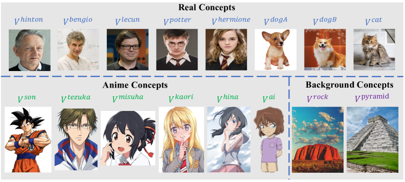

<figcaption>図7: 我々のモデルに用いるデータセットは、実世界の物体・アニメキャラクター・背景シーンを含む計 16 の多様な概念を網羅する。</figcaption>
</figure>

**ベースライン実装詳細。** Cones2 は公式実装を用いる（バッチサイズ 4、学習率 5e-6、4000 ステップ）。一貫性のため同じシードを使う。Paint by Example と AnyDoor は実物体 inpainting に特化するため、公平のため比較を実世界概念に限定する。具体的には、まず前景プロンプトを省いて同じプロンプト・シードで背景画像を本モデルで生成し、続いて彼らのモデルで前景概念を導入する。Mix-of-Show は実世界・アニメ概念で同じ LoRA を使い、gradient fusion を概念タイプごとに別々に適用する。

## Appendix 0.B 追加実験

写実・アニメ両スタイルのキャラクター・動物・背景からなる、16 の被写体の多様なデータセット（図7）を集める。モデル評価のため 2 スタイルで 3 つの異なる設定をランダムに選び、2〜5 被写体の組合せをテストする。各設定で 50 画像を生成し、計 $2\times3\times4\times50=1200$ 画像で広範な性能評価を行う。

アブレーション研究では、アニメ・写実両スタイルで 4・5 概念を含む 3 つの難しい設定を選び、600 画像を得る。

### 0.B.1 さらなるアブレーション研究

<figure>

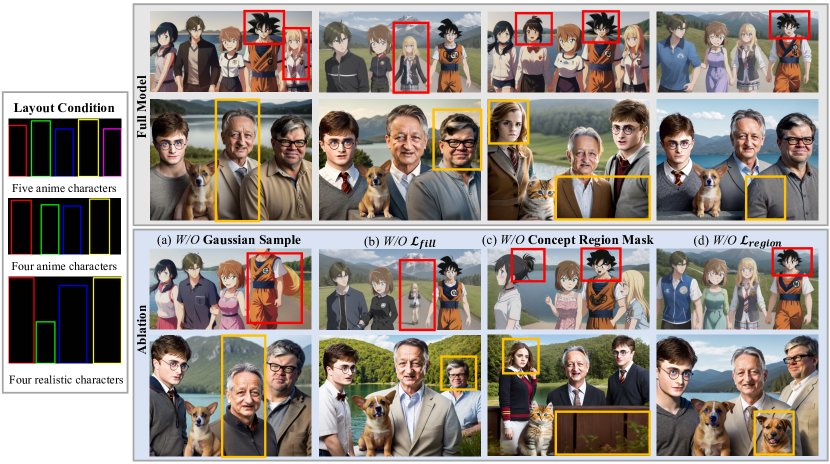

<figcaption>図8: Concept Enhancement Constraints（式7）と Concept Isolation Constraints（式8）のさらなるアブレーション研究。上部は完全な手法、下部は特定モジュールを省いた結果で、各構成要素の重要性を強調する。赤枠・黄枠はアニメ／実世界スタイルの差を強調する。</figcaption>
</figure>

本節では Concept Enhancement Constraints（ガウスサンプル戦略と $\mathcal{L}_{fill}$）と Concept Isolation Constraints（concept region mask と $\mathcal{L}_{region}$）の詳細なアブレーションを行う（図8）。第 1 列：ガウスサンプリングなしでは概念がボックス中央に正確に収まらず、アニメ概念が境界外に現れ独自性を失いうる。第 2 列：$\mathcal{L}_{fill}$ なしでは図がボックスを完全に占めず、割当空間の活用不足を示す。第 3 列：concept confusion（アニメ髪型と写実的特徴の併合）が見られ、concept region mask が各概念の独自属性を守る役割を示す。最終列：概念特徴の漏れ（アニメ少年の髪型が他キャラの影響を受ける、意図しない犬の出現）が U-Net の down-sampling により生じ、$\mathcal{L}_{region}$ がこれに対処する。

### 0.B.2 さらなる比較

<figure>

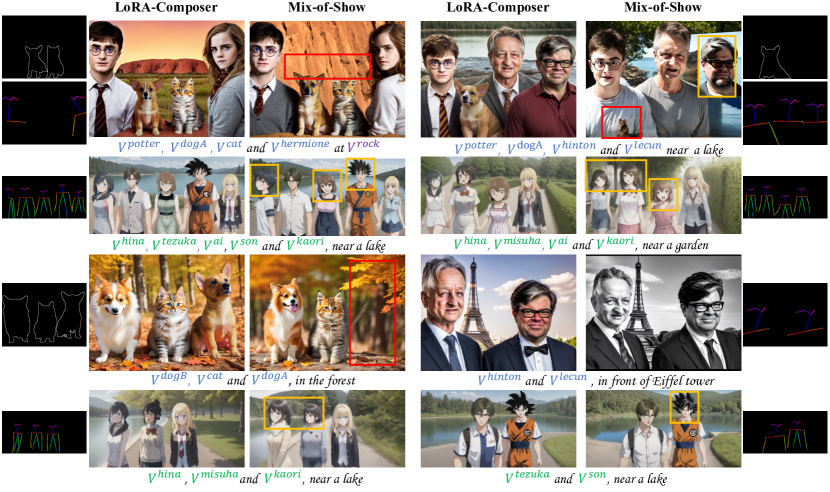

<figcaption>図9: 画像ベース条件を適用した Mix-of-Show との比較。黄枠は concept confusion、赤枠は concept vanishing を強調する。</figcaption>
</figure>

Mix-of-Show との公平な比較のため、彼らの既定設定に従い、同じ画像ベース条件と乱数シードで多概念画像をカスタマイズする（図9）。Mix-of-Show は同一性特徴の維持（黄枠）と概念の完全性（赤枠）に課題があるが、本手法はこれらに効果的に対処し高忠実で整合的な画像を提供する。

### 0.B.3 ユーザー調査

多物体カスタマイズ結果をより正確に評価するため、人間の好みを捉えるユーザー調査を実施した。Mix-of-Show に従い、2 指標で生成画像を評価：1) Text-to-Image Alignment（テキスト記述と生成画像の一致度）、2) Image-to-Image Alignment（生成画像中のキャラクターと提供された参照画像の類似度）。

参加者は各観点を 1〜5 で評価（高いほど良い）。2・3・4・5 概念のカスタマイズ設定を含め、画像・質問対の順序を無作為化して 25 人のユーザーに提示した。各ユーザーは計 60 問を評価。結果は表3。全シナリオで LoRA-Composer が最高得票で好まれ、特に画像ベース条件を排除するシナリオで強みを示した。

**表3**: ユーザー調査。高いほど良い。本手法が多概念カスタマイズで好まれ、画像・テキスト整合の両方で優れる。\* は画像ベース条件の使用。各列の最高を太字。

| Method | Text-to-Image | Image-to-Image |
| --- | --- | --- |
| Cones2 | 1.99 | 1.25 |
| Mix-of-Show | 3.13 | 2.58 |
| Anydoor | 2.73 | 2.07 |
| Paint by Example | 2.19 | 1.53 |
| LoRA-Composer | 4.25 | 4.02 |
| Mix-of-Show* | 3.84 | 3.28 |
| LoRA-Composer* | 4.23 | 3.78 |

### 0.B.4 さらなる視覚結果

図10 に本手法で生成した画像の拡張コレクションを示す。LoRA-Composer の優れた柔軟性と使いやすさを示し、少ない条件と容易に入手できる LoRA 技術で画像を作成できる。

<figure>

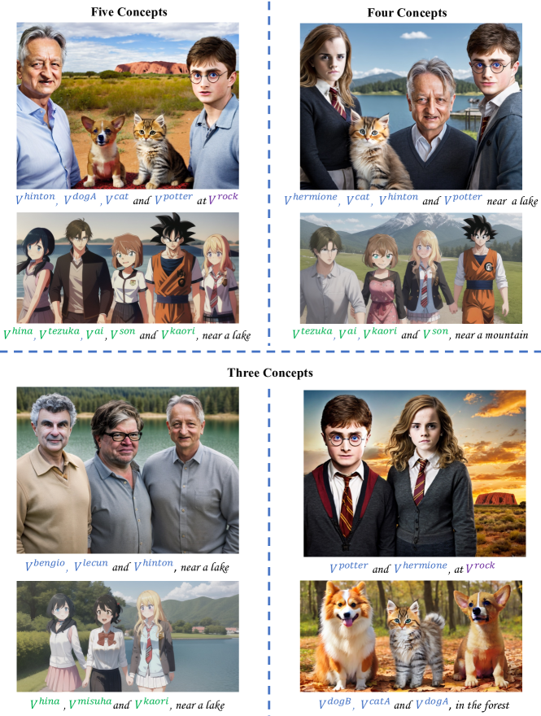

<figcaption>図10: 3 つの構成での本手法のさらなる結果。</figcaption>
</figure>

## Appendix 0.C 潜在的な負の社会的影響

本プロジェクトは多概念画像カスタマイズの高度なツールをコミュニティに提供し、様々な概念をシームレスに併合して複雑な視覚を作る力を与える。しかし、こうした強力な枠組みが悪意ある者に悪用され、実在人物との欺瞞的な相互作用を作り公衆に害を与えるリスクがある。これに対抗する 1 つの解は、DUAW で提案されたような保護策——variational autoencoder の機能を妨げる universal adversarial watermark——の実装で、悪意あるカスタマイズへの悪用を阻む。

## Appendix 0.D 限界

<figure>

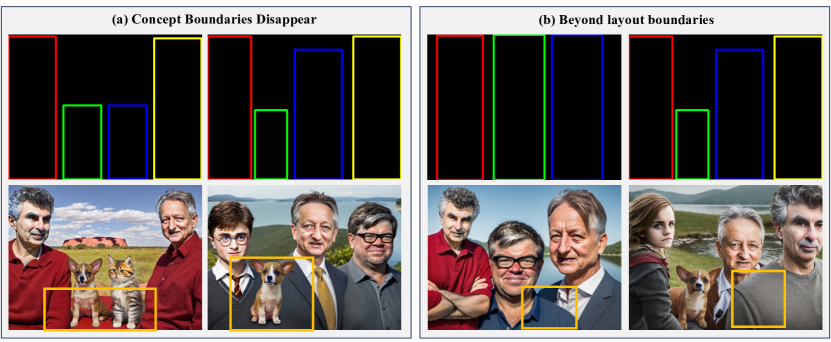

<figcaption>図11: LoRA-Composer の限界。(a) 概念境界の消失。(b) レイアウト境界の超過。</figcaption>
</figure>

第 1 の限界は概念境界の消失（図11(a)）：概念間の空間が狭すぎると down-sampling により重なりが生じうる。概念間の間隔を広げると緩和できる。

第 2 の限界はレイアウト境界を超える概念（図11(b)）：前景画素が意図したレイアウト境界を超えることがある（Stable Diffusion が常識に基づき結果を出す設計のため）。より妥当なレイアウト戦略で改善できる。

最後の限界は推論効率で、様々な LoRA チェックポイントの読み込みと潜在表現更新の逆計算により顕著な遅延が生じる。

今後の課題として、注意機構の強化で既存の限界を克服し、IO 過程を最適化して推論効率を高めることを目指す。
