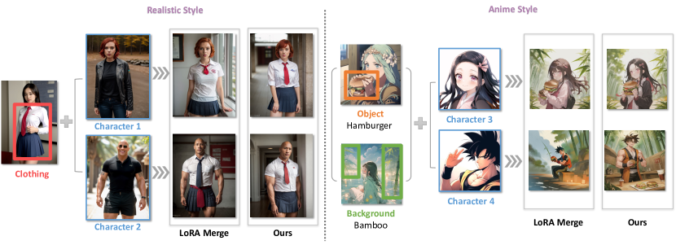
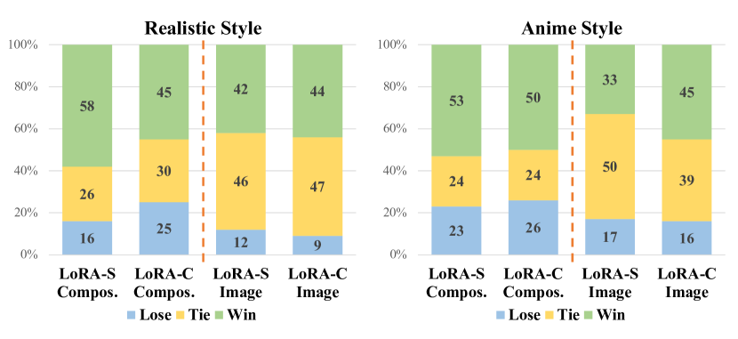
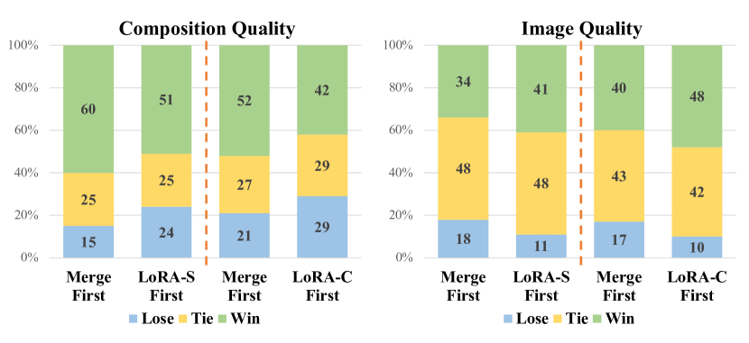
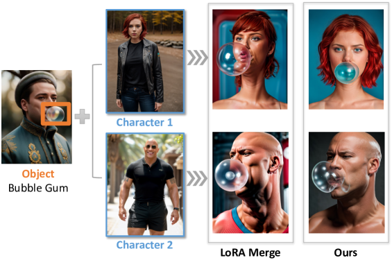
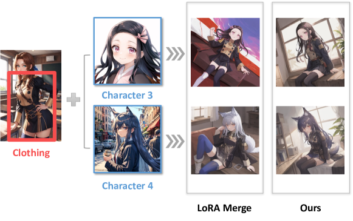
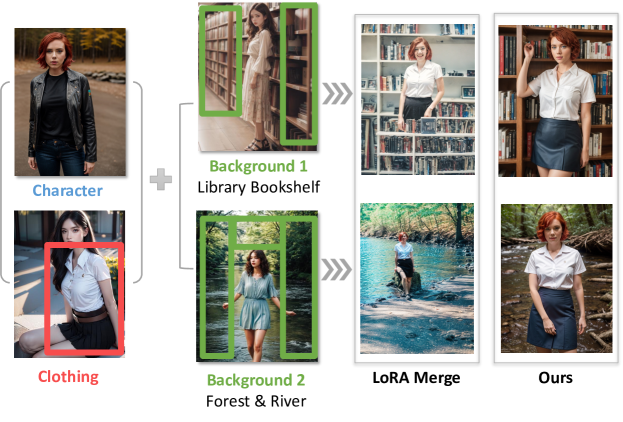
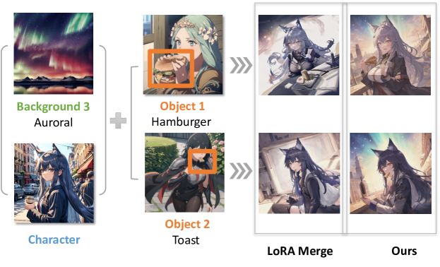

# 画像生成のための Multi-LoRA Composition

> 原題: Multi-LoRA Composition for Image Generation
> 著者: Ming Zhong, Yelong Shen, Shuohang Wang, Yadong Lu, Yizhu Jiao, Siru Ouyang, Donghan Yu, Jiawei Han, Weizhu Chen（Microsoft ほか）
> 出典: ICML 2024 ・ arXiv:2402.16843
> プロジェクト: https://maszhongming.github.io/Multi-LoRA-Composition

## Abstract（要旨）

Low-Rank Adaptation（LoRA, 低ランク適応）は、特定のキャラクターや独自のスタイルといった具体的要素を生成画像で正確に描くため、text-to-image モデルで広く利用される。しかし既存手法は、特に統合すべき LoRA の数が増えると、複数の LoRA を効果的に合成（compose）するのに苦戦し、複雑な画像の作成を妨げる。本論文では、multi-LoRA composition を**復号中心（decoding-centric）の視点**から研究する。2 つの訓練不要（training-free）の手法を提示する：各ノイズ除去ステップで異なる LoRA を交互に使う **LoRA Switch** と、すべての LoRA を同時に取り込んでより整合的な画像合成を導く **LoRA Composite** である。提案手法を評価するため、本研究の一部として新しい包括的テストベッド **ComposLoRA** を確立する。これは多様な LoRA カテゴリと 480 の合成セットを特徴とする。GPT-4V に基づく評価枠組みを用い、特に合成中の LoRA 数が増えるとき、我々の手法が一般的なベースラインより明確に性能向上することを示す。

## 1 はじめに

生成 text-to-image モデルの動的な領域で、Low-Rank Adaptation（LoRA）の統合は、画像合成を顕著な精度と最小の計算負荷でファインチューンする能力で際立つ。LoRA は 1 つの要素——特定のキャラクター・特定の服・独自のスタイル・その他の視覚的側面——に特化し、その要素を生成画像で多様かつ正確に描くよう訓練されることで優れる。例えばユーザーは自分自身の画像を生成するよう LoRA をカスタマイズし、個人化された現実的な表現の数々を達成できる。LoRA の応用は画像生成での適応性と精度を示すだけでなく、カスタマイズされたデジタルコンテンツ作成の新しい道を開く。

しかし、画像は通常さまざまな要素のモザイクを体現し、合成性（compositionality）が制御可能な画像生成の鍵になる。これを追求して、それぞれ異なる要素に特化した複数の LoRA を合成する戦略が、高度なカスタマイズの実現可能なアプローチとして現れる。この技術は、ユーザーと衣服を現実的に併合する仮想試着や、ユーザーが精緻に設計された都市要素と相互作用する都市景観のような、複雑なシーンのデジタル化を可能にする。multi-LoRA 合成の先行研究は、事前学習済み言語モデルや stable diffusion モデルの文脈を探ってきた。これらは複数の LoRA モデルを併合して新しい LoRA モデルを合成することを目指し、係数行列を訓練するか、LoRA 重みの直接的な加算・減算によって行う。しかし、重み操作中心のこれらのアプローチは、LoRA の数が増えると併合過程を不安定化しうるし、LoRA モデルとベースモデルの相互作用も見落とす。この見落としは、画像生成に逐次的なノイズ除去ステップに依存する拡散モデルで特に重大になる。LoRA とこれらのステップの相互作用を無視すると、生成過程に誤整合が生じうる（図1）。そこでは併合された LoRA モデルが、すべての所望要素の完全な複雑さを保てず、歪んだ・非現実的な画像になる。

<figure>

<figcaption>図1: Multi-LoRA 合成技術は、キャラクター・衣服・物体といった異なる要素を整合的な画像に効果的に混ぜる。従来の LoRA Merge アプローチが LoRA を増やすと細部の損失と画像の歪みを招くのと異なり、我々の手法は各要素の正確さと全体の画像品質を保つ。</figcaption>
</figure>

本論文では、すべての LoRA 重みをそのまま保ったまま、multi-LoRA composition を復号中心の視点から掘り下げる。各復号ステップで 1 つまたはすべての LoRA を用いて合成的画像合成を促す、2 つの学習不要アプローチを提示する。第 1 のアプローチ **LoRA Switch** は、各ノイズ除去ステップで単一の LoRA を選択的に有効化し、生成過程を通じて複数 LoRA を回転させる。例えば仮想試着では、LoRA Switch はキャラクター LoRA と衣服 LoRA を連続するノイズ除去ステップで交互に使い、各要素が精度と明瞭さをもって描かれるようにする。並行して、classifier-free guidance に着想を得た **LoRA Composite** を提案する。各ノイズ除去ステップで各 LoRA の無条件・条件付きスコア推定を計算し、それらを平均して画像生成にバランスのとれたガイダンスを与え、すべての要素の包括的な取り込みを保証する。さらに、重み行列の操作を回避し拡散過程に直接影響することで、両手法は任意個の LoRA の統合を可能にし、通常 2 つの LoRA しか併合しない最近の研究の限界を克服する。

実験的に、我々は **ComposLoRA** を導入する。これは LoRA ベースの合成的画像生成のために特に設計された最初のテストベッドである。reality と anime の 2 つの視覚スタイルにまたがる 6 つの LoRA カテゴリの広範な配列を特徴とする。評価には 480 の多様な合成セットが含まれ、それぞれ異なる数の LoRA を取り入れて各手法の有効性を包括的に評価する。この新タスクに標準化された自動指標がないため、画像の品質と合成の有効性の両方を評価する評価者として **GPT-4V** を採用することを提案する。我々の実験的知見は、LoRA Switch と LoRA Composite の両方が、特に合成中の LoRA 数が増えるにつれ、一般的な LoRA 併合アプローチを大幅に上回ることを一貫して示す。結果を検証するため人手評価も行い、結論を補強し自動評価枠組みの有効性を確認する。さらに各手法の適用シナリオの詳細な分析と、GPT-4V を評価者として使う潜在的バイアスの議論を提供する。

要約すると、主要な貢献は 3 つ：

(1) 復号中心の視点から multi-LoRA composition を初めて調査し、LoRA Switch と LoRA Composite を提案する。統合できる LoRA 数の既存制約を克服し、合成的画像生成での柔軟性と品質を高める。

(2) 6 カテゴリ・480 合成セットを特徴とする包括的テストベッド ComposLoRA を確立する。標準指標の欠如に対処し、GPT-4V 上に構築した評価者を提示し、画像品質と合成有効性の評価の新基準を設ける。

(3) 広範な自動・人手評価により、提案する LoRA Switch・LoRA Composite が一般的な LoRA 併合より優れることを明らかにする。さらに、異なる多合成手法と評価枠組みの詳細な分析を提供する。

## 2 手法

本節では、multi-LoRA composition を理解するのに不可欠な概念を概観し、続いて提案手法を詳述する。

<figure>

<figcaption>図2: 3 つの multi-LoRA 合成技術の概観。色付きの各 LoRA は異なる要素を表す。一般的アプローチ LoRA Merge は複数 LoRA を 1 つに線形併合する。対照的に我々の手法はノイズ除去過程に集中する：LoRA Switch はノイズ除去中に異なる LoRA を巡回し、LoRA Composite は生成全体を通じて全 LoRA が協働してガイダンスになる。</figcaption>
</figure>

### 2.1 準備

##### 拡散モデル.

拡散モデルは、逐次的なノイズ除去過程を通じてガウスノイズからデータサンプルを作る生成モデルのクラスである。データ分布のスコアを推定する一連のノイズ除去オートエンコーダに基づく。画像 $x$ が与えられると、エンコーダ $\mathcal{E}$ が $x$ を潜在空間に写し、符号化潜在 $z=\mathcal{E}(x)$ を得る。拡散過程は $z$ にノイズを導入し、時刻 $t\in\mathcal{T}$ で異なるノイズレベルの潜在表現 $z_{t}$ を生む。学習可能パラメータ $\theta$ を持つ拡散モデル $\epsilon_{\theta}$ は、テキスト指示条件 $c_{T}$ が与えられたとき、ノイズ化潜在 $z_{t}$ に加えられたノイズを予測するよう訓練される。通常、平均二乗誤差損失をノイズ除去目的とする：

$$
L=\mathbb{E}_{\mathcal{E}(x),\epsilon\sim\mathcal{N}(0,1),t}\left[||\epsilon-\epsilon_{\theta}(z_{t},t,c_{T})||^{2}_{2}\right],
$$

ここで $\epsilon$ は加法的ガウスノイズ。本論文では LoRA 併合の先行研究と整合する設定で multi-LoRA composition を調べる。

##### Classifier-Free Guidance.

拡散ベース生成モデリングで、classifier-free guidance は、特にモデルがクラスやテキスト記述で条件づけられるシナリオで、生成画像の多様性と品質のトレードオフをバランスする。text-to-image タスクでは、暗黙の分類器 $p_{\theta}(c|\mathbf{z}_{t})$ がテキスト条件 $c$ に高い尤度を予測する結果へ確率質量を向ける。これは拡散モデルが条件付き・無条件ノイズ除去の両方の共同学習パラダイムを経ることを要する。推論時、ガイダンススケール $s\geq 1$ を使ってスコア関数 $\tilde{e}_{\theta}(\mathbf{z}_{t},c)$ を条件付き推定 $e_{\theta}(\mathbf{z}_{t},c)$ に近づけ無条件推定 $e_{\theta}(\mathbf{z}_{t})$ から遠ざけ、条件付け効果を高める：

$$
\tilde{e}_{\theta}(\mathbf{z}_{t},c)=e_{\theta}(\mathbf{z}_{t})+s\cdot(e_{\theta}(\mathbf{z}_{t},c)-e_{\theta}(\mathbf{z}_{t})).
$$

##### LoRA Merge.

Low-Rank Adaptation（LoRA）は、事前学習済み重み行列を凍結し、追加の学習可能な低ランク行列をニューラルネットに統合してパラメータ効率を高める。事前学習モデルが低い「内在次元（intrinsic dimension）」を示す観察に基づく。具体的には、拡散モデル $\epsilon_{\theta}$ の重み行列 $W\in\mathbb{R}^{n\times m}$ について、LoRA モジュールの導入は $W$ を $W^{\prime}=W+BA$ に更新する（$B\in\mathbb{R}^{n\times r}$, $A\in\mathbb{R}^{r\times m}$ は低ランク因子 $r$ の行列、$r\ll\min(n,m)$）。**LoRA Merge** の概念は、複数 LoRA を線形結合して統一 LoRA を合成し、拡散モデルに差し込むことで実現する。$k$ 個の異なる LoRA を導入するとき、更新行列 $W^{\prime}$ は：

$$
W^{\prime}=W+\sum_{i=1}^{k}w_{i}\times B_{i}A_{i},
$$

ここで $i$ は $i$ 番目の LoRA のインデックス、$w_{i}$ はスカラー重み（通常は経験的に決めるハイパーパラメータ）。LoRA Merge は複数要素を整合的に提示する主要アプローチとなり、様々な応用に直接的なベースラインを提供する。しかし、一度に多くの LoRA を併合すると併合過程が不安定化しうるし、生成中の拡散モデルとの相互作用を完全に見落とす。結果として図2 のハンバーガーや指の変形が生じる。

### 2.2 復号中心の視点による Multi-LoRA Composition

上記の問題に対処するため、拡散モデルのノイズ除去過程に基づき、LoRA 重みを変えずに合成する方法を調べる。これは具体的に 2 つの視点に分かれる：各ノイズ除去ステップで、1 つの LoRA だけを有効化するか、すべての LoRA を協働させて生成を導くか。

##### LoRA Switch (LoRA-s).

各ノイズ除去ステップで単一の LoRA を有効化することを探るため、LoRA Switch を提示する。これは個々の LoRA を生成過程を通じて指定間隔で逐次的に有効化する動的適応機構を拡散モデルに導入する。図2 のように、各 LoRA は特定要素に対応する固有の色で表され、ノイズ除去ステップごとに 1 つの LoRA だけが有効になる。

$k$ 個の LoRA の集合で、あらかじめ決めた順列の列から始める（図の例では黄→緑→青）。最初の LoRA から始め、モデルは $\tau$ ステップごとに次の LoRA に移る。この回転が続き、各 LoRA が $k\tau$ ステップ後に順に適用され、各要素が画像生成に繰り返し寄与する。各ノイズ除去時刻 $t$（1 から総ステップ数まで）で有効な LoRA は次で決まる：

$$
i=\left\lfloor((t-1)\bmod(k\tau))/\tau\right\rfloor+1,\qquad W^{\prime}_{t}=W+w_{i}\times B_{i}A_{i}.
$$

ここで $i$ は現在有効な LoRA のインデックス（1 から $k$）、$\lfloor\cdot\rfloor$ は床関数。重み行列 $W^{\prime}_{t}$ は有効な LoRA の寄与を反映するよう更新される。一度に 1 つの LoRA を選択的に有効化することで、LoRA Switch は現在の要素に関連する細部に集中した注意を保証し、生成過程を通じて画像の完全性と品質を保つ。

##### LoRA Composite (LoRA-c).

重み行列を併合せず各時刻で全 LoRA を取り込むことを探るため、classifier-free guidance のパラダイムに基づく LoRA Composite（LoRA-c）を提案する。これは各ノイズ除去ステップで各 LoRA の無条件・条件付きスコア推定を個別に計算する。これらのスコアを集約することで、画像生成過程を通じてバランスのとれたガイダンスを保証し、異なる LoRA が表すすべての要素の整合的な統合を促す。

形式的には、$k$ 個の LoRA があるとき、$i$ 番目の LoRA を取り込んだ後の拡散モデル ${e}_{\theta}$ のパラメータを $\theta^{\prime}_{i}$ とする。テキスト条件 $c$ に基づく集合的ガイダンス $\tilde{e}(\mathbf{z}_{t},c)$ は各 LoRA のスコアを集約して導かれる：

$$
\tilde{e}(\mathbf{z}_{t},c)=\frac{1}{k}\sum_{i=1}^{k}w_{i}\times\left[e_{\theta^{\prime}_{i}}(\mathbf{z}_{t})+s\cdot(e_{\theta^{\prime}_{i}}(\mathbf{z}_{t},c)-e_{\theta^{\prime}_{i}}(\mathbf{z}_{t}))\right].
$$

ここで $w_{i}$ は各 LoRA に割り当てるスカラー重み（実験では $w_{i}=1$、全 LoRA を等しく扱う）。LoRA-c は各 LoRA がノイズ除去の各段階で効果的に寄与することを保証し、LoRA 併合に伴う頑健性・細部保持の問題に対処する。

総じて、我々は multi-LoRA composition で初めて復号中心の視点を採り、LoRA への重み操作に内在する不安定さを避ける。各ノイズ除去ステップで 1 つまたは全ての LoRA を有効化する 2 つの訓練不要手法を導入する。

## 3 実験

### 3.1 実験設定

##### ComposLoRA テストベッド.

標準ベンチマークと自動評価指標の欠如のため、合成的画像生成の既存評価は定量分析と人手に大きく依存し、multi-LoRA composition の進歩を制限してきた。この溝を埋めるため、様々な合成アプローチの比較分析を促す包括的テストベッド ComposLoRA を導入する。これは公開 LoRA のコレクションに基づく。LoRA の選定は次の基準に従う：(1) 各 LoRA は頑健に訓練され、独立に統合したとき特定要素を正確に再現できること、(2) LoRA が表す要素は多様なカテゴリをカバーし様々な画像スタイルに適応できること、(3) 合成時、異なるカテゴリの LoRA は互換性があり結果画像で衝突しないこと。

結果として、写実・アニメスタイルを表す 2 つの LoRA サブセットを編成する。各サブセットは様々な要素（3 キャラクター・2 種の衣服・2 スタイル・2 背景・2 物体）からなり、ComposLoRA は計 22 LoRA。合成セット構築では、各セットは 1 つのキャラクター LoRA を含み、衝突を防ぐため要素カテゴリの重複を避ける、という重要原則に厳密に従う。こうして ComposLoRA 評価は計 480 の異なる合成セット（2 LoRA が 48、3 LoRA が 144、4 LoRA が 192、5 LoRA が 96）を取り込む。各 LoRA の主要特徴は手作業で注釈され、text-to-image モデルの入力プロンプトと、GPT-4V による後続評価の参照点の二重の役割を果たす。各 LoRA の詳細は Appendix の Table 3。

<figure>

<figcaption>表1: GPT-4V との比較評価（簡略版）。評価プロンプトと結果は簡略化されている。GPT-4V は Image 1 のハンバーガーと手の変形や髪色の誤りを指摘し、適切な減点を行う。</figcaption>
</figure>

##### GPT-4V との比較評価.

既存指標はテキストと画像の整合を計算できるが、画像内の特定要素の機微やその合成の品質の評価には及ばない。最近、GPT-4V のようなマルチモーダル大規模言語モデルが様々なマルチモーダルタスクで大きく進歩し、画像生成タスクの評価での潜在能力を示している。本研究では GPT-4V の能力を合成的画像生成の評価者として活用する。

具体的には比較評価法を採り、GPT-4V を使って生成画像を 2 次元（合成品質と画像品質）で採点する。0〜10 の尺度（高いほど良い）。表1 のように、合成すべき要素の本質的特徴・採点基準・期待出力形式を含むプロンプトを GPT-4V に与える。これにより 2 つの提案手法それぞれを LoRA Merge と比較できる。GPT-4V の採点が人手判断とどう整合するか（§3.2）、評価者として使う潜在バイアス（§3.3.3）も調べる。

##### 実装の詳細.

バックボーンモデルに stable-diffusion-v1.5 を用いる。写実画像には「Realistic_Vision_V5.1」、アニメ画像には「Counterfeit-V2.5」の各チェックポイントを使う。写実サブセットでは 100 ノイズ除去ステップ・ガイダンススケール $s=7$・画像サイズ 1024x768、アニメサブセットでは 200 ステップ・$s=10$・512x512。スケジューラは DPM-Solver++。LoRA 合成の重みスケール $w$ は一貫して 0.8。LoRA Switch は $\tau=5$ で、5 ステップごとに次の LoRA（character→clothing→style→background→object）を有効化する。信頼性のため 3 つの乱数シードで生成し、結果はその平均。

### 3.2 ComposLoRA での結果

##### GPT-4V による評価.

まず GPT-4V による比較評価結果を示す。LoRA-s 対 LoRA Merge、LoRA-c 対 LoRA Merge を 2 次元で採点し、勝者を決める。具体的スコアと勝率は図（結果, 訳注: 元論文の結果図。本 markdown では取得できず）に示され、いくつかの主要観察に至る：

(1) 提案手法はすべての構成・両次元で一貫して LoRA Merge を上回り、優位の幅は LoRA 数が増えるほど拡大する。例えば LoRA Switch のスコア優位は 2 LoRA で 0.04 から 5 LoRA で 1.32 に拡大する。これは勝率の傾向と一致し、5 LoRA 合成時に勝率は 70% に近づく。

(2) LoRA-S は合成品質、LoRA-C は画像品質で優れる。5 LoRA・LoRA Merge をベースラインとするとき、合成品質での LoRA-s の勝率は LoRA-c より 14% 高い（69% 対 55%）。逆に画像品質では LoRA-c の勝率が LoRA-s より 10% 高い（56% 対 46%）。

(3) 合成的画像生成は、特に合成する要素が増えると、依然として極めて難しい。GPT-4V の採点では 2 LoRA 合成の平均は 8.5 超だが、5 LoRA 合成では約 6 に急落する。したがって我々の手法が相当の改善を提供しても、合成的画像生成にはなお大きな研究の余地がある。

##### 人手評価.

結果を補完するため人手評価を行い、各手法の有効性と GPT-4V の評価者としての有効性を検証する。2 人の大学院生が 120 画像を合成・画像品質について 1〜5 の Likert 尺度で採点する（1=完全な失敗、5=完璧）。一貫性のため、注釈者はまず 20 画像をパイロット採点して基準理解を標準化する。結果（表2 上部）は GPT-4V の知見と整合し、本手法が LoRA Merge を上回ること——LoRA Switch は合成、LoRA Composite は画像品質で優れること——を確認する。

さらに、人手評価と GPT-4V・CLIPScore のスコアの Pearson 相関を分析する（表2 下部）。CLIPScore は各要素の機微な特徴を見分けられないため特定の合成・品質側面の評価に及ばないのに対し、我々が採用する GPT-4V ベース評価者は人手判断と実質的に高い相関を示し、評価枠組みの妥当性を裏付ける。

**表2**: 人手評価結果と、各指標と人手判断の Pearson 相関。

| Human Evaluation | Composition | Image Quality |
| --- | --- | --- |
| LoRA Merge | 3.14 | 2.94 |
| LoRA Switch | 3.91 | 4.15 |
| LoRA Composite | 3.78 | 4.35 |

| Correlations with Human Judgments | Composition | Image Quality |
| --- | --- | --- |
| CLIPScore | -0.006 | 0.083 |
| Ours (GPT-4V) | 0.454 | 0.457 |

<figure>

<figcaption>図6: 画像スタイルの分析。概して LoRA-s は写実スタイルに、LoRA-c はアニメスタイルに優れる。</figcaption>
</figure>

### 3.3 分析

提案手法の理解を深めるため、次の重要な問いをさらに調査する。

#### 3.3.1 特定の画像スタイルは異なる手法を好むか？

ComposLoRA 内の写実・アニメスタイルのサブセットで手法の性能を別々に評価する。勝率結果（図6）は各手法に明確な傾向を示す。LoRA-s は画像品質で LoRA-c に及ばないかもしれないが、写実サブセットでは同次元で同等の性能を示しつつ合成品質で大きな優位を保つ。対照的にアニメサブセットでは LoRA-c が合成品質で LoRA-s と同等、画像品質で顕著に上回る。これは LoRA-S が写実スタイル画像の要素合成に、LoRA-C がアニメスタイル画像に強いことを示唆する。

#### 3.3.2 ステップサイズと LoRA 有効化の順序は LoRA Switch にどう影響するか？

LoRA Switch の最適構成を特定するため、2 つの重要ハイパーパラメータ——LoRA を有効化する順序と各有効化の間隔——の影響を調べる。知見（図, 訳注: 元論文 fig:switch_step。本 markdown では取得できず）は、毎ステップ切り替えるような過度に頻繁な切替が生成画像の歪みと準最適性能を招くことを示す。LoRA Switch の効率はステップサイズの増加とともに漸進的に改善し、$\tau=5$ でピークに達する。よって実験ではこのステップサイズを採る。

さらに、有効化列での LoRA の初期選択が全体性能に明確に影響する一方、後続順序の変更はほとんど影響しない。character LoRA を最初に有効化すると最良の性能になる（図, 訳注: fig:switch_order）。対照的に clothing・background・object LoRA から始めると完全にランダムな列と同等。注目すべきは style LoRA から始めると性能が顕著に落ち、ランダム順をわずかに下回ること。これは LoRA Switch で画像・合成品質を高めるには、生成過程の初期段階で核となる画像要素を優先することが重要だと示す。

<figure>

<figcaption>図8: GPT-4V を使う比較評価の位置バイアス分析。各サブ図で橙線の左は LoRA-s 対 Merge、右は LoRA-c との対比。「Merge First」は LoRA Merge の画像が GPT-4V に最初に入力されたことを示す。</figcaption>
</figure>

#### 3.3.3 GPT-4V は評価者としてバイアスを示すか？

GPT-4V は様々な画像生成タスクの評価で有用性を示してきたが、比較評価で顕著な**位置バイアス**を発見する。異なる手法の画像の位置を入れ替えて GPT-4V に入力する形でこのバイアスを調査する（図8）。LoRA-s 対 LoRA Merge で、Merge の画像が最初（「Merge First」）だと合成品質での LoRA-s の勝率は 60%、しかし LoRA-s の画像が最初（「LoRA-S First」）だと 51% に下がる。同様に LoRA-c の勝率は 52% から 42% に下がり、GPT-4V が合成品質で最初の入力画像を好む傾向を示唆する。興味深いことに画像品質では逆の傾向（2 番目の画像が高スコア）。これは GPT-4V の評価に、次元と画像位置で変わる顕著な位置バイアスがあることを示す。本研究ではこのバイアスを緩和するため、報告する比較評価結果を両入力順で平均する。

## 4 関連研究

### 4.1 合成可能な Text-to-Image 生成

合成可能な画像生成は、あらかじめ定義された仕様の集合に従う画像を作ることを含む、デジタルコンテンツカスタマイズの鍵となる側面である。この領域の既存研究は主に次のアプローチに焦点を当てる：scene graph やレイアウトで合成性を高める、拡散モデルの生成過程を仕様に合わせて修正する、または所望の制約を課す独立モデルの系列を合成する。

しかしこれらは通常**概念レベル**で動作し、生成モデルは広いカテゴリや一般概念に基づく画像作成に優れる。例えば「ドレスを着た女性」を生成するよう促され、ドレスの色変更のようなテキスト記述の変化に巧みに対応できる。しかし、あまり知られていないキャラクターや独自のドレススタイルのような特定のユーザー定義要素の正確な描画には苦戦する。ユーザー定義物体を合成できる別系統もあるが、広範なファインチューニングを要し複数物体でうまく機能しない。そこで本論文では LoRA を活用した**学習不要のインスタンスレベル合成**アプローチを導入し、ユーザー指定要素の精密な組み立てを可能にする。

### 4.2 LoRA ベースの操作

LLM や拡散モデルをベースに、最近の研究は様々な目的のため LoRA 重みの操作を目指す：画像生成での要素合成、LLM の特定能力の強化・抑制、世界知識の取り込み、大きな教師モデルから小さな生徒モデルへのパラメトリック知識の転移。LoRA 合成技術については、LoRAHub と ZipLoRA はどちらも few-shot デモで係数行列を学習し、複数 LoRA を 1 つの新しい LoRA に融合する。一方 LoRA Merge は加算・否定演算子で算術的に LoRA 重みを併合する。

しかしこれらの重みベース手法は、LoRA 数が増えると併合過程が不安定化することが多く、LoRA モデルをベースモデルと併用するときの相互作用力学も考慮しない。これらに対処するため、本研究は新しい視点を探る：LoRA の重みを変える代わりに、すべての LoRA 重みをそのまま保ち、LoRA と基底の生成過程の相互作用に焦点を当てる。

## 5 結論

本論文では、現在の重み操作技術の限界を超える LoRA-s と LoRA-c を導入し、復号中心の視点から multi-LoRA composition を初めて探究した。専用テストベッド ComposLoRA を確立し、GPT-4V を活用したスケーラブルな自動評価指標を導入した。本研究は、我々の手法が達成する優れた品質を強調するだけでなく、LoRA ベースの合成可能な画像生成を評価する新基準を提供する。

## Impact Statements

本論文は機械学習分野を前進させることを目的とした研究を提示する。本研究には多くの潜在的な社会的帰結があるが、ここで特に強調すべきものはないと考える。

## Appendix A 付録

<figure>

<figcaption>図9: 写実スタイルで 2 LoRA を合成するケーススタディ。</figcaption>
</figure>

<figure>

<figcaption>図10: アニメスタイルで 2 LoRA を合成するケーススタディ。</figcaption>
</figure>

<figure>

<figcaption>図11: 写実スタイルで 3 LoRA を合成するケーススタディ。</figcaption>
</figure>

<figure>

<figcaption>図12: アニメスタイルで 3 LoRA を合成するケーススタディ。</figcaption>
</figure>

**表3**: ComposLoRA の各 LoRA の詳細記述。

| LoRA | Category | Trigger Words |
| --- | --- | --- |
| **Anime Style Subset** | | |
| Kamado Nezuko | Character | kamado nezuko, black hair, pink eyes, forehead |
| Texas the Omertosa in Arknights | Character | omertosa, 1girl, wolf ears, long hair |
| Son Goku | Character | son goku, spiked hair, muscular male, wristband |
| Garreg Mach Monastery Uniform | Clothing | gmuniform, blue thighhighs, long sleeves |
| Zero Suit (Metroid) | Clothing | zero suit, blue gloves, high heels |
| Hand-drawn Style | Style | lineart, hand-drawn style |
| Chinese Ink Wash Style | Style | shuimobysim, traditional chinese ink painting |
| Bamboolight Background | Background | bamboolight, outdoors, bamboo |
| Auroral Background | Background | auroral, starry sky, outdoors |
| Huge Two-Handed Burger | Object | two-handed burger, holding a huge burger with both hands |
| Toast | Object | toast, toast in mouth |
| **Realistic Style Subset** | | |
| IU (Lee Ji Eun, Korean singer) | Character | iu1, long straight black hair, hazel eyes, diamond stud earrings |
| Scarlett Johansson | Character | scarlett, short red hair, blue eyes |
| The Rock (Dwayne Johnson) | Character | th3r0ck with no hair, muscular male, serious look on his face |
| Thai University Uniform | Clothing | mahalaiuniform, white shirt short sleeves, black pencil skirt |
| School Dress | Clothing | school uniform, white shirt, red tie, blue pleated microskirt |
| Japanese Film Color Style | Style | film overlay, film grain |
| Bright Style | Style | bright lighting |
| Library Bookshelf Background | Background | lib_bg, library bookshelf |
| Forest Background | Background | slg, river, forest |
| Umbrella | Object | transparent umbrella |
| Bubble Gum | Object | blow bubble gum |

（訳注: 表4「GPT-4V 比較評価の完全な評価プロンプト」と表5「GPT-4V の完全な評価結果」は、原典では画像として掲載されており、本 markdown ではいずれも図1 と同じ画像ファイルが参照されている。内容は §3.1 の評価プロンプト・結果の詳細版。）
