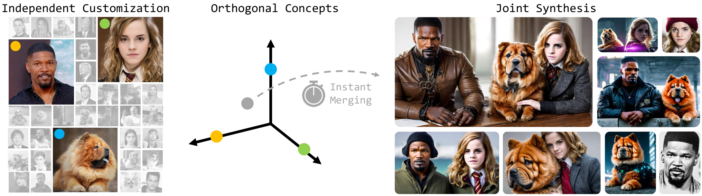
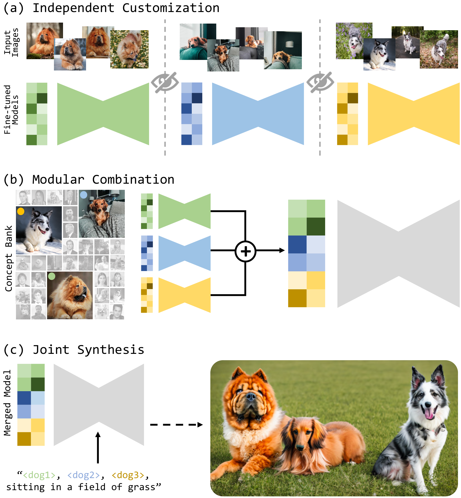
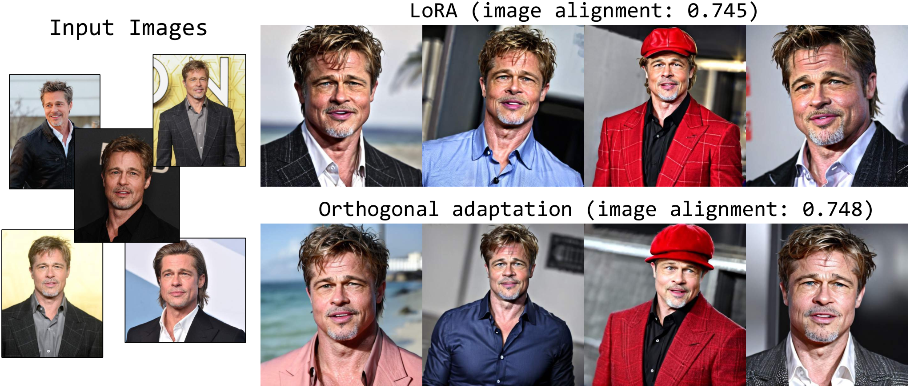
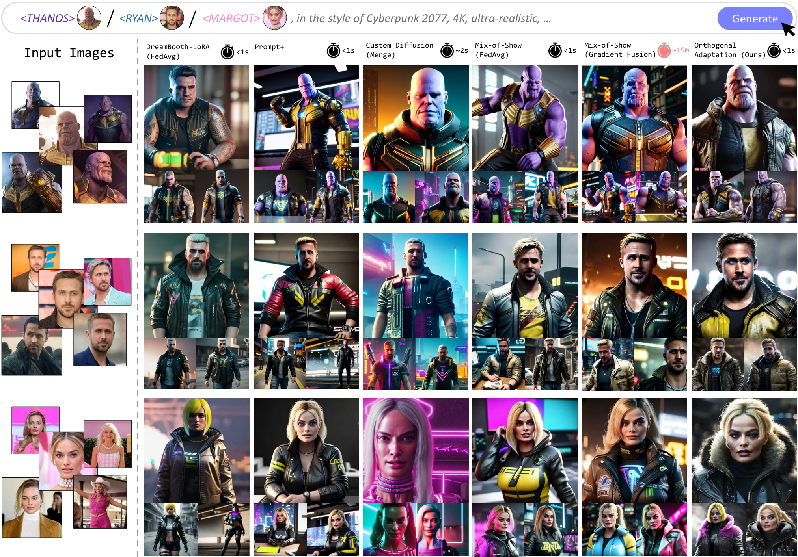
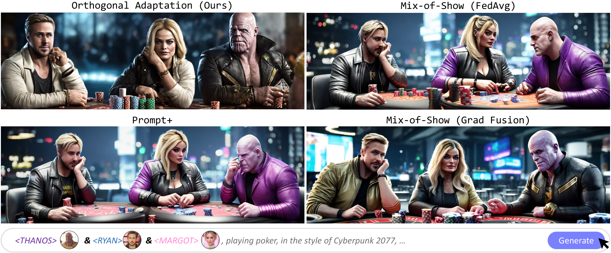
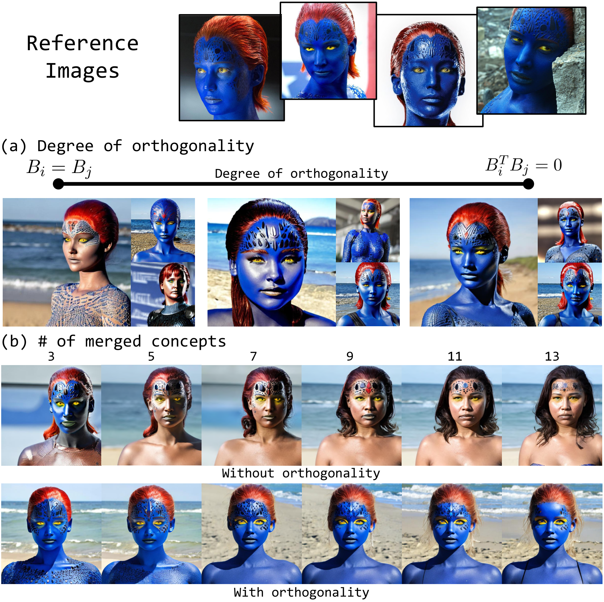
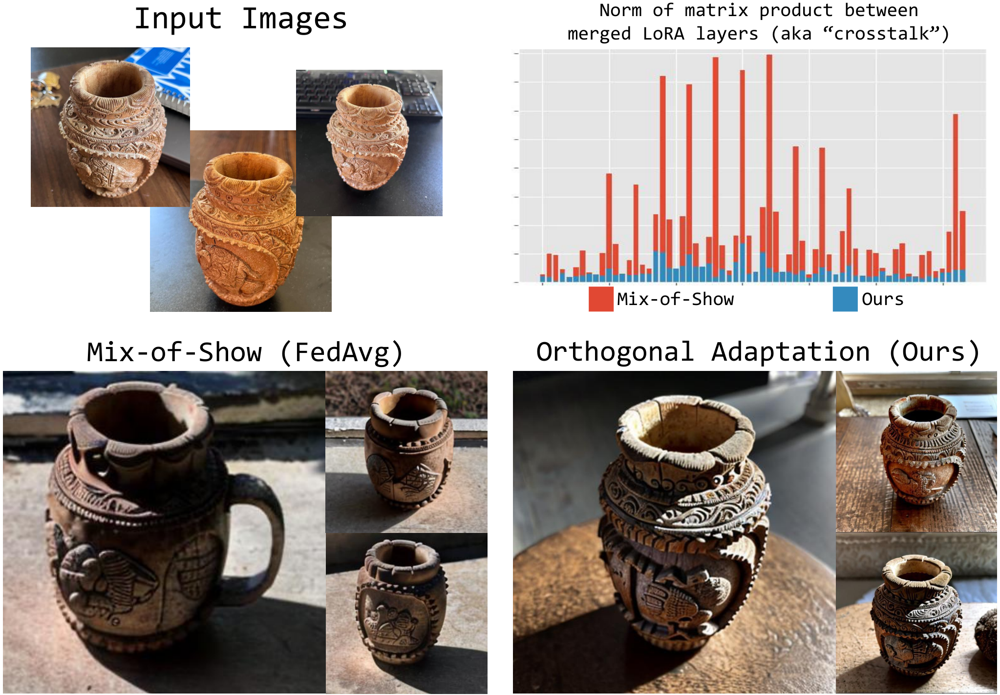
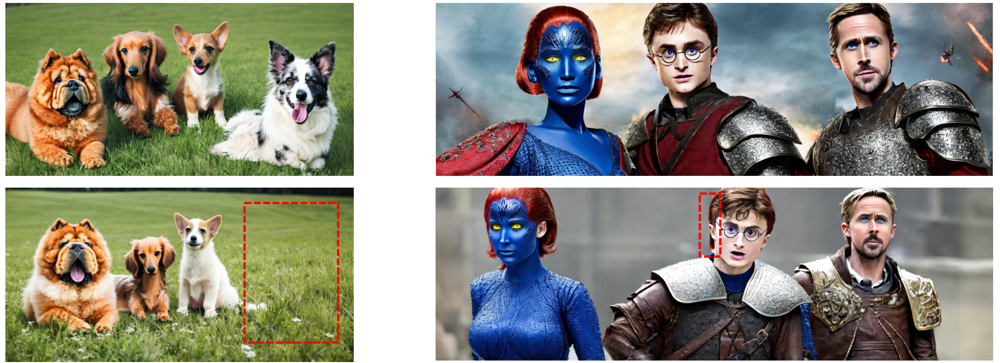
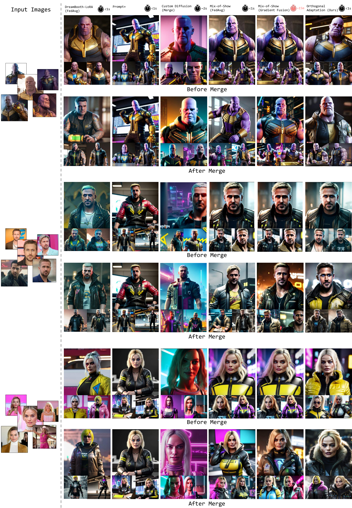
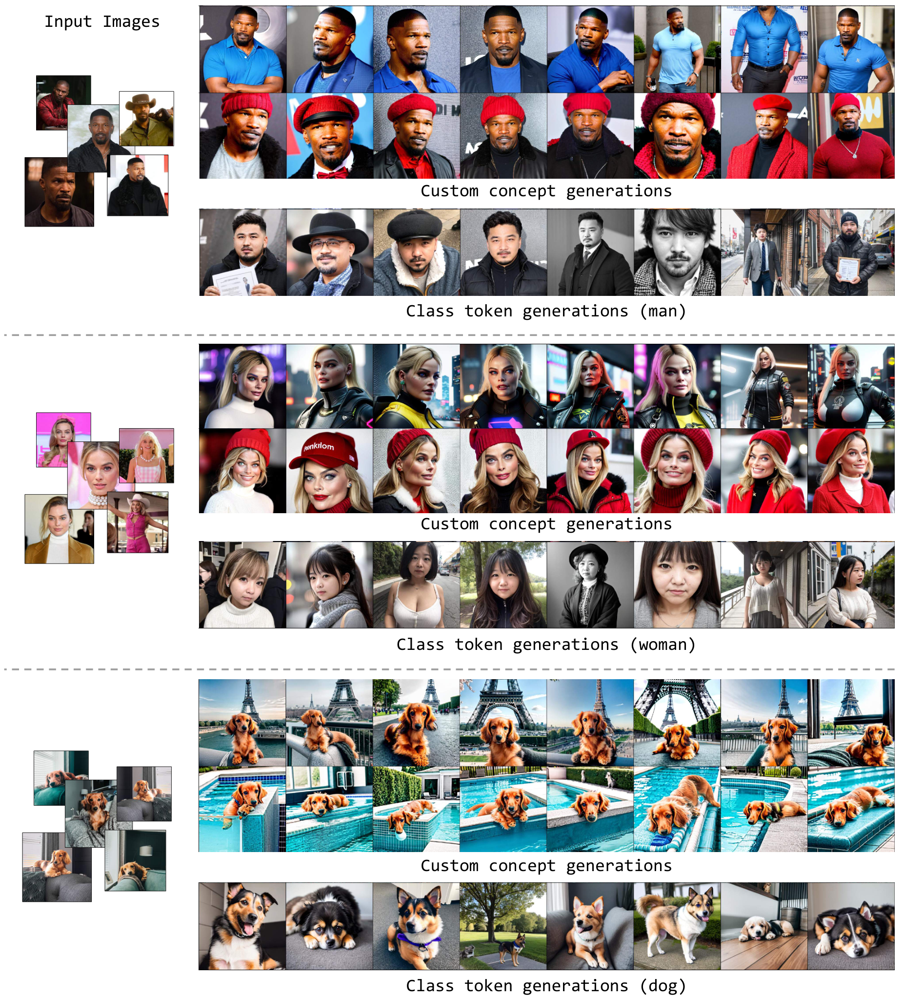

# 拡散モデルのモジュラー・カスタマイゼーションのための直交適応

> 原題: Orthogonal Adaptation for Modular Customization of Diffusion Models
> 著者: Ryan Po¹, Guandao Yang¹, Kfir Aberman², Gordon Wetzstein¹（¹ スタンフォード大学、² Snap Research）
> 出典: arXiv:2312.02432 ・ CVPR 2024

## Abstract（要旨）

text-to-image モデルのカスタマイゼーション技術は、これまで到達不可能だった幅広い応用への道を開き、多様な文脈とスタイルにまたがる特定の概念の生成を可能にしてきた。既存の手法は個々の概念、あるいは限られた事前定義された概念集合について高忠実度のカスタマイゼーションを促進する一方で、**単一のモデルが無数の概念をシームレスに描画するというスケーラビリティ**には及ばない。本論文では、**モジュラー・カスタマイゼーション（Modular Customization）** と呼ぶ新しい問題に取り組む。その目標は、個々の概念について独立に微調整されたカスタマイズ済みモデルを効率的にマージすることである。これにより、マージされたモデルは忠実度を損なうことなく、また追加の計算コストを一切生じることなく、複数の概念を 1 枚の画像に共同で合成できる。この問題に対処するため、我々は **直交適応（Orthogonal Adaptation）** を導入する。これは、微調整の間に互いにアクセスできないカスタマイズ済みモデルが、**直交する残差重み**を持つよう促すために設計された手法である。これにより推論時に、カスタマイズ済みモデルを最小限の干渉で足し合わせられることが保証される。我々の提案手法は単純かつ多用途であり、モデルアーキテクチャのほぼすべての最適化可能な重みに適用できる。広範な定量的・定性的評価を通じて、我々の手法は効率と同一性の保存の点で関連するベースラインを一貫して上回り、拡散モデルのスケーラブルなカスタマイゼーションへの大きな飛躍を実証する。

<figure>

<figcaption>図1: 拡散モデルのモジュラー・カスタマイゼーション。個々の概念の大きな集合（左）が与えられたとき、モジュラー・カスタマイゼーションの目標は、概念ごとの独立したカスタマイゼーション（微調整）を可能にしつつ、推論時にその部分集合を効率的にマージし、対応する概念を忠実度を損なわずに共同で合成できるようにすることである。これに取り組むため、我々は直交適応を提案する。これはある概念のカスタマイズ済み重みが、他の概念のカスタマイズ済み重みと直交するよう促す。</figcaption>
</figure>

## 1 Introduction（はじめに）

拡散モデル（DM）はコンピュータビジョンとそれを超えた領域におけるパラダイムシフトを画する。text-to-image・動画・3D 生成のための DM ベースの基盤モデルは、直感的なテキストプロンプトを用いて、かつてない品質と多様性でコンテンツを制作・編集することをユーザーに可能にする。これらの基盤モデルは膨大な量のデータで学習されているものの、ユーザー固有の概念（ペット・持ち物・人物など）を高い忠実度で合成するためには、しばしば微調整が必要になる。

DM を個々の概念にカスタマイズする最近のいくつかのアプローチは高品質な結果を実証してきた。しかしながら、事前学習された複数の概念を 1 枚の画像に混ぜる**マルチ概念 DM** の戦略は依然として困難である。既存のマルチ概念手法は、マージされたときに個々の概念の品質が劣化するか、あるいは**学習中に複数の概念へのアクセスを必要とする**かのいずれかである。後者はプロセスをスケール不能にし、異なる概念が異なるユーザーに属する場合にプライバシーの懸念を生じさせる。さらに、いずれの場合も混合のプロセスは計算的に非効率である。

<figure>

<figcaption>図2: マルチ概念生成のギャラリー。我々の手法は、個別に微調整された概念の効率的なマージを可能にし、text-to-image 拡散モデルのモジュラーで効率的なマルチ概念カスタマイゼーションを実現する。上に示した各概念は直交適応を用いて個別に微調整された。微調整された重み残差はその後、和によってマージされ、マルチ概念生成を可能にする。</figcaption>
</figure>

我々は DM の即時的なマルチ概念カスタマイゼーションを可能にする新しいアプローチとして**直交適応**を導入する。本研究の主要な洞察は、**新規概念に対する DM の微調整の仕方を変えることが、これらの概念の非常に効率的な混合につながりうる**という点である。具体的には、我々は各新規概念を、他の概念の基底とおよそ直交する基底を用いて表現する。これらの基底は事前に知られている必要はなく、異なる概念は互いに独立に学習できる。我々のアプローチの主要な利点は、複数の直交する概念を混ぜるとき——例えば、いかなる学習事例においても一緒に見たことのない異なる概念を共同で合成するときにも——**モデルを再学習する必要がない**ことである。重要な点として、我々のアプローチは**モジュラー**である。すなわち、個々の概念を互いの知識なしに独立かつ並列に学習できる。さらに、混ぜるために概念の学習画像へのアクセスを一切必要としないという意味で**プライバシーに配慮している**。

数百万のユーザーが個人的な概念を使って DM を微調整し、それを自分のスマートフォン上で友人の概念と混ぜたいと考えるソーシャルメディアのプラットフォームを想像してほしい。カスタマイゼーションと混合のプロセスの効率、およびデータのプライバシーが、このシナリオにおける主要な課題である。我々の手法はまさにこれらの問題に対処する。本研究の中核的な技術的貢献は、モジュラーなカスタマイゼーションとスケーラブルなマルチ概念マージのアプローチであり、同程度の速度のベースラインより同一性の保存の点で優れた品質を、あるいは最先端のベースラインと同等の品質を著しく低い処理時間で提供する。

## 2 Related Work（関連研究）

#### テキスト条件付き画像合成。

テキスト条件付き画像合成の分野は、GAN と拡散モデルの発展に駆動されて有意な進歩を遂げてきた。初期の取り組みは、クラス条件付き画像生成やテキスト駆動編集を含む多様な条件付き合成のタスクへの GAN の適用に焦点を当てていた。より最近では、焦点は大規模データセットで学習された大規模な text-to-image モデルへ移った。本論文では、オープンソースの StableDiffusion アーキテクチャを用い、その事前学習済みチェックポイントの上に微調整を行って構築する。

**表1**: モジュラー・カスタマイゼーションへの解の比較。我々のカスタマイゼーションのアプローチは 3 つの主要な領域で優れている：(1) 個々の概念の同一性を高い忠実度で保つこと、(2) 独立にカスタマイズされたモデルを効率的にマージすること、(3) マージされたモデルを用いたマルチ概念の画像合成において高い概念忠実度を維持すること。

| 手法 | 忠実度（単一概念） | 効率的なマージ | 忠実度（マルチ概念） |
| --- | --- | --- | --- |
| TI | ✗ | ✓ | ✗ |
| DB-LoRA | ✓ | ✓ | ✗ |
| Custom Diffusion | ✗ | ✓ | ✗ |
| Mix-of-Show | ✓ | ✗ | ✓ |
| Ours（本手法） | ✓ | ✓ | ✓ |

#### カスタマイゼーション。

カスタマイゼーションのタスクは、多様な文脈のもとで生成に用いるために、ユーザーが定義した概念を捉えることを目指す。Textual Inversion（TI）や DreamBooth といった先駆的な研究は、同じ概念の少数の画像を取り、制御された生成に用いる被写体の表現を作り出すことによってカスタマイゼーションの問題に取り組む。TI は、従来の拡散損失を用いて目標画像を再構成するようテキスト埋め込みを最適化することで新規概念を捉える。後続の研究、例えば $\mathcal{P}+$ は、より表現力の高いトークン表現によって Textual Inversion を拡張し、生成の被写体整合／忠実度を改善する。他方 DreamBooth は、珍しい単語トークンを選び、拡散損失を用いて目標概念を再構成するようネットワークの重みを微調整する。Custom Diffusion は同様の方法で動作するが、拡散モデルの層の部分集合、すなわち cross-attention 層のみを微調整する。LoRA は微調整手法のためのより優れたパラメータ効率を可能にする低ランク行列分解の手法であり、最近 text-to-image 拡散モデルのカスタマイゼーションに適応された（DB-LoRA）。最近のいくつかの研究は、データから適応パラメータを予測するフィードフォワードネットワークを学習することで速度の改善を試み、カスタマイズされた概念を作る時間の償却に成功している。

#### マルチ概念カスタマイゼーション。

既存のいくつかの研究は、カスタマイゼーションのタスクをさらに一歩進め、複数の新規概念を同時にモデルへ注入することを目指している。Custom Diffusion はすべての概念に対する共同最適化損失を通じてこれを達成し、Break-a-scene と SVDiff は複数の概念を含む画像の中で個々の概念を学習するためにマスク付き cross-attention 損失を導入する。しかしながら、そのような手法は学習時にすべての概念の正解データへのアクセスを必要とする。本研究で我々が関心を持つのは**モジュラー・カスタマイゼーション**のタスクであり、そこでは概念は独立に学習され、ユーザーはその後、マルチ概念の画像合成のために推論時に個々の概念を自由に組み合わせられる（3.1 節）。

先行研究はモジュラー・カスタマイゼーションの問題に対する暗黙的な解を提供してきたが、既存の各手法にはそれぞれのトレードオフがある。TI は各概念を一意のトークン埋め込みを通じて表現することでこのタスクに暗黙的に対処し、各トークンを単に呼び出すだけでマルチ概念カスタマイゼーションを可能にする。しかしながら TI は、トークン埋め込みだけでは表現力が限られるため、被写体忠実度が低くなりがちである。**Federated Averaging（FedAvg）** は各モデルの重みの間の加重平均を単に取ることで微調整済みモデルをマージするが、高速で表現力がある一方、素朴な組合せは概念の同一性の喪失につながる傾向がある。Custom Diffusion は制約付きカスタマイゼーション問題を解くことで個別に微調整されたネットワークのマージを支持する。この手法もまた表現力に苦戦する。拡散モデルの重みのごく一部の部分集合しか更新されないからである。同時期の研究である **Mix-of-Show（MoS）** はこの手法を拡張して **gradient fusion（勾配融合）** を導入し、パラメータの表現力に制限を課すことなく、別々に微調整された複数のモデルのマージを可能にする。表現力はあるものの、gradient fusion は計算的に要求が高く、**3 つのカスタム概念を単一のモデルへ結合するだけで約 15〜20 分**を要し、大規模に展開されると手に負えないほど高価になる。表 1 は我々のアプローチが先行研究および同時期の研究と異なる主要な領域をまとめている。

## 3 Method（手法）

<figure>

<figcaption>図3: モジュラー・カスタマイゼーションの 3 つの段階：(a) 独立したカスタマイゼーション、(b) モジュラーな組合せ、(c) 共同合成。個別の微調整の間、すべてのプロセスはプライベートである。すなわち各ユーザーは他の概念の正解データにアクセスできない。</figcaption>
</figure>

本節ではまずモジュラー・カスタマイゼーションの問題設定を導入する（3.1 節）。次に FedAvg という単純な解を見て、この素朴な手法が同一性の保存にどこで・なぜ失敗するのかを探る（3.2 節）。FedAvg の限界に動機づけられて、概念の同一性の保存を保証する条件を論じ（3.3 節）、最後にモジュラー・カスタマイゼーションへの我々の解——直交適応——を導入する（3.4 節と 3.5 節）。

### 3.1 Modular Customization（モジュラー・カスタマイゼーション）

本論文で我々は、text-to-image 拡散モデルを、効率的・スケーラブル・分散的な方法で複数の個人的な概念を生成するようカスタマイズすることに関心を持つ。

<figure>

<figcaption>図4: 直交適応の概観。(a) LoRA は低ランク分解された 2 つの行列の双方の学習を可能にする。(b) 直交適応は学習を A のみに制約し、B は固定したままにする。(c) 2 つの別々の概念 i と j について、B_i と B_j の間に直交性の制約が課される。(d) 概念が独立に学習されるとき、共有された直交行列からランダムな列をサンプリングすることで近似的な直交性が達成できる。(e) 直交性の制約がないと、相関した概念はマージ時に「クロストーク」に苦しむ。直交性の制約があれば、直交する概念はマージ後も同一性を保つ。</figcaption>
</figure>

単一概念の text-to-image カスタマイゼーションに加えて、ユーザーは通常、複数の概念が一緒に相互作用するのを見たいと考える。これは、ある概念の集合にカスタマイズされた text-to-image モデルを要求する。しかしながら、単一のモデルで複数のパーソナライズされた概念を生成できるようにすることは困難である。第一に、概念のあらゆる可能な組合せを含む集合の数は概念の数に対して**指数関数的に増大する**——比較的少数の概念に対してさえ手に負えない数である。その結果、パーソナライズされた概念が**対話的な速度でマージされる**ことが重要になる。さらに、ユーザーは通常自分の手元に限られた計算資源しか持たないので、ユーザー側で行われるいかなる計算も理想的には些細なものであるべきである。

これらの要件が、我々が**モジュラー・カスタマイゼーション**と呼ぶ効率的でスケーラブルな微調整の設定を動機づける。そこでは個別に微調整されたモデルが独立したモジュールのように振る舞い、**追加の学習なしにプラグ&プレイの方法で**他のものと組み合わせられるべきである。モジュラー・カスタマイゼーションの設定は 3 つの段階を含む：**独立したカスタマイゼーション**、**モジュラーな組合せ**、**共同合成**。図 3 はこの 3 段階のプロセスを図解する。

モジュラー・カスタマイゼーションを念頭に、我々の目標は、個別に微調整されたモデルが他のいかなる微調整済みモデルとも自明に（例えば和によって）結合でき、マルチ概念生成を可能にするような微調整の枠組みを設計することである。

### 3.2 Federated Averaging（連合平均）

モジュラー・カスタマイゼーションを達成するためのおそらく最も直截的な技法は、個別に微調整された各モデルの加重平均を取ることである。この技法はしばしば **FedAvg** と呼ばれる。概念 $i$ に対して最適化された学習済み重み残差 $\Delta\theta_{i}$ の集合が与えられたとき、結果として得られるマージ済みモデルは単に次で与えられる。

$$
\theta_{\text{merged}}=\theta+\sum_{i}\lambda_{i}\Delta\theta_{i},
$$

ここで $\theta$ は微調整に用いられたモデルの事前学習済みパラメータを表し、$\lambda_{i}$ は各概念の相対的な強度を表すスカラーである。FedAvg は高速で、個別に微調整された各モデルの表現力に何ら制約を課さない一方、これらの重みを素朴に平均すると、**学習済み重み残差の間の干渉**により被写体忠実度の喪失につながりうる。この効果は意味的に類似した複数の概念（例えば人間の同一性）を学習するときに特に深刻である。学習済み重み残差が非常に似通う傾向があるからである。我々はこの望ましくない現象を「**クロストーク（crosstalk）**」と名付ける。図 7 と図 8(a) はクロストークの効果の可視化を提供しており、FedAvg がマルチ概念生成に同一性の喪失を示させることが分かる。我々のアプローチは FedAvg に着想を得ている。その計算効率を採用しつつ、異なる概念間の学習済み重み残差の間の干渉が最小になるよう微調整のプロセスを修正する。我々は、被写体忠実度を犠牲にすることなく、個別に学習されたモデルからの即時的なマルチ概念カスタマイゼーションを可能にしたい。

### 3.3 Preserving Concept Identity（概念の同一性の保存）

FedAvg の限界に対処するという目標のもと、我々はまずこの手法がどこで失敗するのかを調べる。単純のため、2 つの概念 $i$ と $j$ をマージする場合を考える。個々のタスクで微調整した後、我々は学習済み重み残差の集合 $\Delta\theta_{i}$ と $\Delta\theta_{j}$ を受け取る。微調整されたネットワーク内の特定の線形層の出力は次である。

$$
O_{i}(X_{i})=(\theta+\Delta\theta_{i})X_{i},
$$

ここで $X_{i}$ は概念 $i$ の学習データに対応する、その層への特定の入力を表す。2 つの概念を $\lambda=1$ の FedAvg を用いてマージするとき、結果として得られるマージ済みモデルは次を生成する。

$$
\hat{O}_{i}(X_{i})=(\theta+\Delta\theta_{i}+\Delta\theta_{j})X_{i}.
$$

概念の保存の目標は $\hat{O}_{i}(X_{i})=O_{i}(X_{i})$ とすることである。特定の制約を課さなければ、$\Delta\theta_{j}X_{i}\neq 0$ となり、したがって $\hat{O}_{i}\neq O_{i}$ となる可能性が高いことに注意されたい。

したがって、概念 $i$ のデータの写像が保存されるのは、$j\neq i$ について $\Delta\theta_{j}X_{i}=0$ のときである。対称性により、概念 $j$ のデータの写像が保存されるのは $i\neq j$ について $\Delta\theta_{i}X_{j}=0$ のときである。直観的には、$||\Delta\theta_{j}X_{i}||$ は概念 $i$ と $j$ のカスタマイズ済み重みの間の**クロストークの量を測る**。マージ後も被写体の同一性が保存されることを保証するため、我々はこの値を低く保ちたい。しかしながら、ある概念 $i$ を学習するのに十分なデータがあれば、$X_{i}$ は**フルの列階数を持つ**可能性が高いことに注意されたい。これは直交性の条件を満たすことを不可能にする。代わりに我々はこの条件への緩和を提案し、$X_{i}$ の部分空間 $S_{i}$ への何らかの射影についてクロストーク項を最小化することを選ぶ。この射影は $S_{i}S^{T}_{i}X_{i}$ を与え、緩和された目的は $\hat{O}_{i}(S_{i}S^{T}_{i}X_{i})=O_{i}(S_{i}S^{T}_{i}X_{i})$ の達成を期待する。

### 3.4 Orthogonal Adaptation（直交適応）

上記の緩和された目的に動機づけられ、我々は直交適応を提案する。低ランク適応（LoRA）と同様に、我々は学習済み重み残差を次の形の低ランク分解を通じて表現する。

$$
\Delta\theta_{i}=A_{i}B_{i}^{T},\quad \theta_{i}\in\mathbb{R}^{n\times m},\ A_{i}\in\mathbb{R}^{n\times r},\ B_{i}\in\mathbb{R}^{m\times r},
$$

ここで階数 $r\ll\min(n,m)$ である。しかしながら、LoRA を用いた従来の微調整とは対照的に、我々は **$B_{i}$ を定数に保ち、$A_{i}$ のみを最適化する**。

行が $B_{j}$ の列空間の直交補空間を張るような行列 $\bar{B}_{j}$ を考える。$S_{i}=\bar{B}_{j}$ と選ぶことで、射影された保存の目的を達成する条件が得られることを示す。これは次の事実から分かる。

$$
\hat{O}_{i}(S_{i}S^{T}_{i}X_{i})=O_{i}(S_{i}S^{T}_{i}X_{i})+\Delta\theta_{j}S_{i}S^{T}_{i}X_{i}=O_{i}(S_{i}S^{T}_{i}X_{i})+A_{j}\underbrace{B^{T}_{j}S_{i}}_{=0}S^{T}_{i}X_{i}=O_{i}(S_{i}S^{T}_{i}X_{i}).
$$

$r\ll m$ であるため、$B_{j}$ の直交補空間は $\mathbb{R}^{m}$ のほとんどを覆う。したがって $\bar{B}_{j}\bar{B}^{T}_{j}X_{i}\approx X_{i}$ となり、$\bar{B}_{j}$ は $S_{i}$ の妥当な候補になる。

同時に、ある概念に対する学習済み残差はその概念のデータと意味のある相互作用を持つことが期待されるので、$||\Delta\theta_{i}X_{i}||$ が自明でないことも保証したい。$X_{i}$ をその $\bar{B}_{j}$ への射影で近似することにより、目的は $||A_{i}B^{T}_{i}\bar{B}_{j}\bar{B}^{T}_{j}X_{i}||$ が自明でないことを保証することへ変わる。この項を検討すると、$B^{T}_{i}\bar{B}_{j}\neq 0$ という追加の制約が得られる。これは $B_{i}$ の列が $B_{j}$ の列空間の直交補空間に存在すべきであることを意味する。したがって、意味のある微調整結果を保証するためには、**学習済み残差の間の直交性、すなわち $B_{i}^{T}B_{j}=0$ も強制すべきである**。

図 4 は我々の直交適応の手法の概観を提供する。図 4(e) に図解されるとおり、直観的には我々の手法はカスタム概念を**直交する方向へ解きほぐし**、概念間のクロストークがないことを保証する。その結果、マージされたモデルは各概念の同一性をより良く保存できる。

<figure>

<figcaption>図5: text-to-image モデルの過剰パラメータ化。学習される重み残差に制約が加わっているにもかかわらず、大規模な text-to-image 拡散モデルの過剰パラメータ化された性質のおかげで、我々の手法は制約のない設定と同等の忠実度で単一概念のカスタマイゼーション結果を達成できる。</figcaption>
</figure>

#### 直交適応の表現力。

$B_{i}$ を凍結することで著しく少ないパラメータしか最適化していないため、我々の手法の表現力が自然な懸念として浮上する。幸いにも、text-to-image 拡散モデルはしばしば**過剰パラメータ化されて**おり、数百万／数十億のパラメータを持つ。先行研究は、そのようなパラメータの部分空間を微調整するだけでも新規概念を捉えるのに十分な表現力があることを示してきた。我々もこの結果を図 5 で経験的に示す。そこでは、学習中に $B_{i}$ を最適化する必要なしに、我々の手法が同等の忠実度の結果につながっている。

### 3.5 Designing Orthogonal Matrices $B_i$'s（直交行列 $B_i$ の設計）

前節までに述べた手法の主要な課題は、互いに直交する基底行列 $B_{i}$ の集合を生成することである。これが非常に難しいのは、とりわけ $B_{i}$ を選ぶとき、**ユーザーは将来組み合わされることになる概念のために他のユーザーがどの基底を選んで最適化したかを知らない**からである。そのような直交性を厳密に強制することは、他のタスクの事前知識なしには実行不可能かもしれない。代わりに我々は制約への緩和を提案し、近似的な直交性を達成する単純で効果的な手法を導入する。

#### ランダム化された直交基底。

近似的な直交性を強制する 1 つの手法は、**共有された直交基底**を決めることである。ある線形の重み $\theta\in\mathbb{R}^{m\times n}$ について、我々はまず大きな直交基底 $O\in\mathbb{R}^{n\times n}$ を生成する。この直交基底は全ユーザー間で共有される。概念 $i$ の学習の間、$B_{i}$ は $O$ から $k$ 個の列をランダムに取ることで形成される。$k\ll n$ であれば、2 つのランダムに選ばれた $B_{i}$ が同じ列を共有する確率は低く保たれる。

#### ランダム化されたガウシアン。

もう 1 つのアプローチは、ランダムな行列要素を選ぶことである。具体的には、$B_{i}$ の各要素を平均ゼロ・標準偏差 $\sigma$ のガウス分布からサンプリングする：$B_{i}[k]\sim\mathcal{N}(0,\sigma^{2}I)$。$B_{i}$ の次元が高いとき、この単純な戦略は**期待値において直交する**行列を作る：$\mathbb{E}\left[B_{i}^{T}B_{j}\right]=0$（補足資料の議論を参照）。当然ながら、この手法はサンプリング元となる共有基底の知識を必要としない。しかしながら実践上、我々の設定ではランダム化されたガウシアンの方がより高い水準のクロストークにつながることを見出した。すなわち $||B_{i}^{T}B_{j}||$ がランダム化された直交基底の場合より大きくなる傾向がある。

<figure>

<figcaption>図6: マージ済みモデルからの単一概念生成における同一性の保存。我々の手法が異なる単一概念生成にわたって同一性の一貫性を維持する能力を実証する。各列は同じマージ済みモデルからの画像を示し、3 つの異なる概念の同一性を表す。我々のアプローチは対応する入力画像とのより良い同一性整合を示し、比較可能なマージ手法に対する有意な改善を提供する。加えて、我々の手法の性能は Mix-of-Show（Gradient Fusion）に匹敵するが、およそ 15 分を要するマージ時間とは対照的に、ほぼ即時のマージという利点を持つ。</figcaption>
</figure>

## 4 Experiments（実験）

本節では、モジュラー・カスタマイゼーションのタスクに適用した我々の手法の結果を示す。定性的・定量的な結果は、我々の手法が同程度の速度で関連するベースラインを上回り、著しく高い処理時間を要する最先端のベースラインと同等の品質であることを示す。

#### データセット。

我々は 12 の概念の同一性からなる独自のデータセットで評価を行う。各同一性は異なる文脈における対象概念の 16 枚の一意な画像を含む。

#### 実装の詳細。

我々は Stable Diffusion モデル、具体的には高忠実度の人間の顔生成を扱える能力のために **ChilloutMix** チェックポイントで微調整を行う。単一概念の微調整については、Stable Diffusion アーキテクチャ内の**すべての線形層**に直交適応を適用する。先行研究に従い、層ごとのテキスト埋め込みも適用し、微調整された各概念を 2 つの別々のテキストトークンとして表現する。テキスト埋め込みは学習率 $1e{-}3$、拡散モデルのパラメータは学習率 $1e{-}5$ で微調整し、すべての実験で $r=20$ とする。単一概念の微調整は 2 枚の A6000 GPU で約 10〜15 分を要する。我々の手法では、すべての実験でランダム化された直交基底の手法を用いて直交性の制約を強制する。FedAvg を用いる手法（直交適応を含む）は $\lambda=0.6$ でマージされた。

<figure>

<figcaption>図7: マルチ概念の結果。同時期の研究のサンプリング技法を用いて合成されたマルチ概念生成の例。Mix-of-Show（FedAvg）は高水準の特徴を維持するものの、クロストークに苦しみ、過度に滑らかな顔の特徴として現れる。Mix-of-Show（Gradient Fusion）は良い同一性整合を示すが、計算的に集約的なマージのプロセスを伴う。P+ はマージ後に同一性を保存することに成功するが、パラメータの表現力が限られているため高い忠実度で同一性を捉えることに苦戦する。我々の手法は、著しく高速なマージ手続きによって高い同一性整合を達成する点で際立っている。</figcaption>
</figure>

**表2**: 定量的結果。各手法についてマージのプロセスの前後で評価した詳細な比較を提供する。マージの前、我々の手法はすべての同一性関連の指標で同等の性能を示し、直交性の制約があってもその表現力が高いことを浮き彫りにする。マージの後、我々の手法は画像整合と同一性整合で最高のスコアを達成する。我々の手法はまた、P+ や MoS のような他の高忠実度の手法と同等のテキスト整合スコアを維持できている。

| 手法 | マージ時間 | テキスト整合 ↑（単一 → マージ後） | Δ | 画像整合 ↑（単一 → マージ後） | Δ | 同一性整合 ↑（単一 → マージ後） | Δ |
| --- | --- | --- | --- | --- | --- | --- | --- |
| $\mathcal{P}+$ | < 1 秒 | .643 → .643 | — | .683 → .683 | — | .515 → .515 | — |
| Custom Diffusion | 〜 2 秒 | .668 → .673 | +.005 | .648 → .623 | -.025 | .504 → .408 | -.096 |
| DB-LoRA (FedAvg) | < 1 秒 | .613 → .682 | +.069 | .744 → .531 | **-.213** | .683 → .098 | **-.585** |
| MoS (FedAvg) | < 1 秒 | .625 → .621 | -.004 | .745 → .735 | -.010 | .728 → .706 | -.022 |
| MoS (Grad Fusion) | 〜 15 分 | .625 → .631 | +.006 | .745 → .729 | -.016 | .728 → .717 | -.011 |
| **Ours（本手法）** | **< 1 秒** | .624 → .644 | -.010 | **.748 → .741** | **-.007** | **.740 → .745** | **+.005** |

#### ベースライン。

我々はモジュラー・カスタマイゼーションのタスクにおける最先端のベースライン、すなわち DreamBooth-LoRA、$\mathcal{P}+$、Custom Diffusion、Mix-of-Show と比較する。微調整済みモデルは手法に応じて異なる方法でマージされる。DreamBooth-LoRA は FedAvg を用いてマージされ、Custom Diffusion は提案された最適化ベースのマージ手法を用いてマージされ、Mix-of-Show は同研究で概説された gradient fusion を用いてマージされる。$\mathcal{P}+$ はネットワークの重みの微調整を行わないので、マージは各概念のトークン埋め込みを単に呼び出すことで行われる。完全を期すため、計算的に要求の高い gradient fusion への効率的な代替として、FedAvg でマージされた Mix-of-Show とも比較する。

#### 実験設定と指標。

まず、他のいかなる概念のデータにもアクセスすることなく、各概念を個別に微調整する。各微調整済みモデルはその後、対応するマージ手法を用いて他の 2 つの概念とランダムに結合される。先行研究に従い、我々は**画像整合（image alignment）** で評価する。これは生成画像と入力参照画像の間の画像特徴の類似度を、CLIP の画像特徴空間における類似度で測るものである。同様に**テキスト整合（text alignment）** を用いて、出力生成が入力テキストプロンプトに依然として従っていることを、やはり CLIP を用いてテキスト-画像類似度を測ることで評価する。しかしながら、我々の手法の同一性を保存する能力をさらに図解するため、**ArcFace** モデルを用いた評価も行う。ArcFace モデルを用いて、生成画像の集合の中で目標の人間の同一性が検出される割合を測る。この指標を**同一性整合（identity alignment）** と呼ぶ。

### 4.1 Qualitative Comparisons（定性的比較）

#### マージ済みの単一概念の結果。

同じマージ済みモデルからの異なる同一性の単一概念生成を比較することで、我々の手法の同一性保存の効果を図解する。上述のとおり、各概念は個別に微調整され、推論時にマージされる。図 6 は 3 つの別々の概念の同一性についての生成を示し、各列は同じモデルからサンプリングされた画像を含む。我々の手法は、同等のマージ時間を持つ手法と比較して、マージ済みモデルにおいて入力画像とのより良い同一性整合を達成する。我々はまた、3 概念のマージに約 15 分を要する Mix-of-Show（Gradient Fusion）と同様の結果を達成しつつ、ほぼ即時のマージを可能にしている。

#### マージ済みのマルチ概念の結果。

マージ済みモデルにおいて 3 つの同一性すべてを含む生成画像も示す。同時期の研究のマルチ概念サンプリング技法を活用し、図 7 にマルチ概念生成の例を示す。ここでも、我々の手法で学習されたマルチ概念モデルは、競合するベースラインより優れた同一性整合を持つ画像を生成する。DB-LoRA と Custom Diffusion は単一概念生成での性能が低いため、紙幅の制約からマルチ概念生成の結果は省略する。

$\mathcal{P}+$ は学習の枠組みにおける表現力の限界により、低い概念忠実度に苦しむ。Mix-of-Show（FedAvg）は層ごとのテキスト埋め込みを通じて特定の高水準の特徴を保存するものの、重み残差の制約のない学習により依然としてクロストークに苦しむ。Mix-of-Show（Gradient Fusion）は印象的な同一性整合を示すが、これは計算的に要求の高いマージ手続きによってのみ可能になっている。我々の手法は、マージのプロセスをほぼ即時の速度に保ちながら高い同一性整合を達成する。

### 4.2 Quantitative Results（定量的結果）

表 2 に定量的比較を示す。具体的には、3 つの評価指標すべてを各手法についてマージの前後で適用した結果を示す。我々の手法はマージ前にすべての概念整合の指標で同等の結果を達成しており、直交性の制約があるにもかかわらず表現力があることを図解している。マージ後、我々の手法はすべての手法の中で最も高い画像整合と同一性整合のスコアを達成しつつ、Mix-of-Show や $\mathcal{P}+$ のような他の高忠実度の手法と同等のテキスト整合スコアを維持している。これは、我々の手法が異なる文脈へ汎化する能力を犠牲にすることなく高い同一性の保存を達成できることを図解する。

Custom Diffusion と DB-LoRA がより高いテキスト整合を達成していることに注意されたいが、これは競合する手法より著しく低い概念整合スコアを代償としている。

## 5 Ablations（アブレーション）

#### 直交性の効果。

図 8(a) では、2 つの別々の微調整済みモデル（概念 $i$ と $j$）をマージして作られたモデルからの生成画像を示す。同一性の保存に対する直交性の効果を図解するため、$B_{i}$ と $B_{j}$ の間の直交性の度合いを操作する。左には最悪の場合、すなわち $B_{i}=B_{j}$ を示す。右には完全な直交性、すなわち $B_{i}^{T}B_{j}=0$ が達成された結果を示す。その中間では、$B_{i}$ と $B_{j}$ を共有された直交行列から構成するが、それらの列の半分が重複するように選ぶ。図 8(a) の結果は、**2 概念をマージするという極端な場合においてさえ、直交性が同一性の保存に有意に寄与する**ことを示す。

#### マージされる概念の数。

図 8(b) は、様々な数の概念をマージしたモデルからの生成結果を示す。直交性があれば、我々のモデルは最小限の同一性の喪失で多数の概念をマージできる。対照的に、直交性がないと、比較的少数の概念を結合しただけでも概念忠実度は急速に劣化する。**直交性なしで我々のモデルを走らせることは、FedAvg でマージされた Mix-of-Show と等価である。**

## 6 Discussion（議論）

#### 限界。

同じ text-to-image モデルに複数のカスタム概念を符号化する能力を示したにもかかわらず、複数のカスタム概念の間の複雑な構図／相互作用を持つ画像の生成は依然として困難である。人間の同一性のような概念は、絡み合うか、あるいは完全に無視される傾向を持つ。既存の研究はこの効果を改善する特定の戦略を開発してきたが、そのような手法も依然として前述の失敗事例に陥りやすい。直交適応のもう 1 つの限界は、**微調整のプロセスそのものを直接修正する**ことである。したがって、**既存の微調整済みネットワーク（例えば LoRA）を事後に適応させて直交性を保証することはできない。**

<figure>

<figcaption>図8: アブレーション研究。(a) 2 つの別々に微調整されたモデル（概念 i と j）をマージして形成されたモデルから生成された画像。同一性の保存における直交性の役割に焦点を当てる。(b) 様々な数の概念をマージしたモデルからの画像生成。直交性がないと、少数の概念をマージしただけでも概念の同一性が失われる。</figcaption>
</figure>

#### 倫理的考察。

生成 AI は、誤情報を広める意図で実在の人物の編集された画像を生成するために悪用されうる。そのような画像合成技術の悪用は社会的な脅威を及ぼすものであり、我々は本研究をそのような目的に用いることを容認しない。我々はまた、基盤としたモデルにおける潜在的なバイアスを認識している。

#### 結論。

カスタマイゼーションの概念を直交する方向へ解きほぐすことにより、直交適応は、独立に微調整された複数の概念を単一のモデルへ即座かつ些細な計算で統合するプロセスを合理化しつつ、各概念の保存も保証する。本研究はモジュラー・カスタマイゼーションに向けた有意な一歩を成す。そこではマルチ概念カスタマイゼーションが、個別に、プライベートに微調整されたモデルによって達成できる。

## 8 Gaussian random orthogonal matrices（ガウシアンのランダム直交行列）

###### 定理 8.1.

$\mathbf{v}\in\mathbb{R}^{d}$ と $\mathbf{u}\in\mathbb{R}^{d}$ を 2 つのランダムベクトルとする。すべての $i\in[1,d]$ について独立に $\mathbf{v}_{i}\sim\mathcal{N}(0,\sigma^{2}I)$ かつ $\mathbf{u}_{i}\sim\mathcal{N}(0,\sigma^{2}I)$ とすると、$\mathbb{E}\left[\mathbf{v}^{T}\mathbf{u}\right]=0$ である。

###### 証明.

$$
\mathbb{E}\left[\mathbf{v}^{T}\mathbf{u}\right]=\mathbb{E}\left[\sum_{i=1}^{d}\mathbf{v}_{i}\mathbf{u}_{i}\right]=\sum_{i=1}^{d}\mathbb{E}\left[\mathbf{v}_{i}\mathbf{u}_{i}\right]=\sum_{i=1}^{d}\mathbb{E}[\mathbf{v}_{i}]\mathbb{E}[\mathbf{u}_{i}]=\sum_{i=1}^{d}0\cdot 0=0.
$$

∎

###### 系 8.1.1.

$\mathbf{A}\in\mathbb{R}^{n\times m}$ と $\mathbf{B}\in\mathbb{R}^{n\times m}$ とする。これらの行列のすべての要素は $\mathcal{N}(0,\sigma^{2}I)$ から独立にサンプリングされる。このとき $\mathbb{E}[\mathbf{A}^{T}\mathbf{B}]=\mathbf{0}\in\mathbb{R}^{m\times m}$ である。

###### 証明.

$$
\mathbb{E}[\mathbf{A}^{T}\mathbf{B}]_{ij}=\mathbb{E}[\mathbf{A}_{i}^{T}\mathbf{B}_{j}]=0.
$$

∎

## 9 Implementation details（実装の詳細）

#### データセット。

我々は評価目的での顔認識アルゴリズムの頑健性のため、人間のデータセットで手法を評価することを選んだ。先行研究は同一性整合を評価する手法として CLIP ベースの指標を用いてきたが、我々は **CLIP 特徴がカスタム概念の細かい詳細を識別するのにしばしば劣る**ことを見出した。図 9 では、我々の手法が人間以外の物体に対しても機能することを図解する。

<figure>

<figcaption>図9: クロストークによる同一性の喪失。独立に学習された LoRA 間の干渉信号の効果を検討することで、クロストークの効果を図解する。2 つの LoRA 重みの積のノルムを通じてクロストークを測定すると、我々の手法は独立に学習された LoRA の間でより低いクロストークをもたらす。同じ手法で結合した場合、我々の学習の枠組みはより少ないクロストークにつながり、したがってマージ後の同一性の保存がより良くなる。</figcaption>
</figure>

#### 評価の詳細。

我々は、結果として得られる生成において目標の人間の同一性を捉える能力を測るために、同一性整合の指標を導入する。**ArcFace** 顔認識アルゴリズムを用い、検出された 2 つの顔の間の ArcFace 距離が **0.680** を下回ったときに検出が記録されたと見なす。生の距離指標ではなく検出確率を指標として選んだのは、距離指標が**過学習したモデルを優遇する**ことを見出したからである。検出の閾値を超えると、距離指標は 2 つの顔の間の類似度を直接測るが、これは再スタイル化や装飾品の付加のような用途には理想的でない。

#### 直交適応の詳細。

我々の手法では、**LoRA の下方射影行列 $B$** を通じて直交性の制約を強制する。この定式化は、結果として得られる LoRA 行列の**行空間**における直交性を保証する。理論上は学習済み重み残差の間の直交性を**列空間**でも達成でき、その場合は直交性の制約を上方射影行列 $A$ に強制する必要がある。我々が行空間の直交性を強制することを選んだのは、重み残差がその行を通じて層の入力と相互作用するからである。3 節で示した概念の保存の定式化もまた行空間の直交性に依拠している。

<figure>

<figcaption>図10: マルチ概念の失敗事例。マルチ概念生成は未解決の課題として残る。先行研究の領域制御可能サンプリングのような技法を用いてもなお、この手法は次のような失敗事例に苦しみうる：(左) 概念の無視、(右) 隣接する同一性への概念属性の漏出。</figcaption>
</figure>

我々の結果では、すべての結果で直交性を強制するのにランダム直交基底の手法を用いることを選んだ。ガウシアンのランダム手法は期待値において直交性をもたらすものの、直交基底の手法の方が経験的により低いクロストークにつながった。直交基底の手法はサンプリング元となる共有された直交行列を必要とする。実践上、Stable Diffusion v1.5 では拡散モデルの全層に対して**一意な入力次元が 4 つしかない（320, 640, 768, 1280）**。したがって、すべての $B_{i}$ をサンプリングできる 4 つの一意な正方行列を保存するだけでよい。これら 4 つの直交行列はベースモデルとともにダウンロードできるが、全ユーザー間で共有されることを保証するために固定シードでその場で生成することもできる。

#### FedAvg のマージ係数。

既存の研究はアフィン係数による FedAvg のマージを考える。しかしながら、概念の数が多くなると、各 LoRA をアフィンに結合することは個々の LoRA からの信号の希釈につながる。個々の LoRA の重みを事後にスケールして微調整プロセスからの信号強度を直接制御することも一般的な慣行である。我々はこのスケーリング係数を FedAvg のマージ係数と結合して、式 1 に示す単一のスケール係数 $\lambda_{i}$ を得る。我々はマージ係数を、ユーザーの好みに基づいて調整できるハイパーパラメータと見なす。

## 10 Additional results（追加の結果）

#### クロストークの図解。

図 9 は、LoRA 重みを単一のモデルへマージする際の同一性の保存にとってクロストークの最小化が重要であることを図解する。我々はクロストークを、個別に学習された LoRA 重み残差の間の行列積のノルムを用いて形式的に測定する。図 9 の右上は、直交性の制約ありとなしで学習された 2 つの LoRA の間の層ごとの正規化された行列積のノルムの直接比較を示す。我々の手法ははるかに低い水準のクロストークにつながり、それが結果として得られる生成から観察されるようにより良い同一性の保存へ翻訳される。

#### 拡張されたベースライン比較。

図 11 では、各手法についてマージ前の各同一性の生成画像を含む図 6 の拡張版を示す。これらの結果は、我々の手法が対象概念との同一性整合をマージの前後で保持できること、そしてさらなる微調整や最適化の段階なしに個々の LoRA のマージを即座に達成できることを示すことを目的とする。

#### 過学習。

我々は小さなカスタムデータセット上でネットワークを微調整し、カスタムトークンをユーザー定義のクラスラベルで初期化するので、過学習しやすい可能性がある。DreamBooth や Custom Diffusion のような先行研究は、クラストークンからの画像生成が依然として多様な結果を生むことを保証するクラス保存損失を加えることでこの効果を緩和する。我々の手法では過学習を防ぐ明示的な損失を用いていないが、微調整済みモデルが図 12 に示すように学習されたクラスラベルについて多様な画像を生成する能力を依然として保存していることを見出した。

<figure>

<figcaption>図11: 拡張されたマルチ概念の結果。個別に学習されたモデルを単一のマージ済みモデルへマージする前後の、各手法の結果を示す。我々の手法は、マージのプロセスを即時に保ちながら、マージのプロセスの前後で対象の同一性を高い忠実度で捉えられている。</figcaption>
</figure>

<figure>

<figcaption>図12: クラスラベルの保存。我々の手法は先行研究のような明示的なクラス保存損失を強制しないが、カスタム概念トークンの初期化に用いたクラスラベルの画像を生成する際の多様性を保存できている。3 つの異なるクラス、すなわち man・woman・dog にわたってこれを示す。</figcaption>
</figure>

## 11 Limitations and future work（限界と今後の課題）

我々の手法はモジュラー・カスタマイゼーションの達成に向けた重要な一歩を踏み出す。しかしながら、いくつかの重要な限界も今後の課題で対処されるべきである。

**同じ画像内に複数のカスタム概念を生成することは依然として困難である。** マージ済みモデルに複数のカスタムトークンを単に入力すると、通常は両方の物体の不整合なハイブリッドにつながる。先行研究は単一の生成において概念をより良く解きほぐすための空間的ガイダンスを探求しており、我々も結果の生成に同様の技法を用いた。しかしながら、これらの手法もなお図 10 に図解するような失敗事例につながる。概念はしばしば無視されるか、属性が隣接する概念へ漏出しうる。今後の課題はマルチ概念生成をさらに可能にするため、これらの苦戦に対処することを目指すべきである。

**個々の LoRA を保存することも高価になりうる。** 我々の手法で学習されたものであっても、LoRA はその低ランクな性質により既に圧縮的ではあるが、モジュラー・カスタマイゼーションのために概念の大きなバンクを保存することは依然として高価になりうる。SVDiff のような研究は、生成画像の忠実度を維持しつつ LoRA をさらに圧縮する方向へ歩みを進めている。しかしながら、我々の手法は SVDiff の手法と自然には適合せず、専用の圧縮の方法論の必要性を示唆している。
