# Sana: 線形 Diffusion Transformer による効率的な高解像度画像合成

> 原題: Sana: Efficient High-Resolution Image Synthesis with Linear Diffusion Transformers
> 著者: Enze Xie¹*, Junsong Chen¹*, Junyu Chen²'³, Han Cai¹, Haotian Tang², Yujun Lin², Zhekai Zhang², Muyang Li², Ligeng Zhu¹, Yao Lu¹, Song Han¹'²（¹ NVIDIA、² MIT、³ 清華大学）
> 出典: arXiv:2410.10629 ・ プロジェクトページ: [nvlabs.github.io/Sana](https://nvlabs.github.io/Sana)

## Abstract（要旨）

我々は Sana を導入する。これは最大 4096 $\times$ 4096 の解像度まで画像を効率的に生成できる text-to-image の枠組みである。Sana は高解像度で高品質な画像を、強いテキスト-画像の整合とともに、著しく速い速度で合成でき、ラップトップの GPU 上に展開可能である。中核となる設計は以下を含む。(1) **深圧縮オートエンコーダ**：画像を 8 $\times$ しか圧縮しない従来の AE と異なり、我々は画像を 32 $\times$ 圧縮できる AE を学習し、潜在トークンの数を実効的に削減した。(2) **線形 DiT**：DiT 内のすべての通常の注意を線形注意に置き換えた。これは品質を犠牲にすることなく高解像度でより効率的である。(3) **デコーダのみのテキストエンコーダ**：T5 を現代的なデコーダのみの小型 LLM へ置き換え、画像-テキストの整合を高めるために文脈内学習を伴う複雑な人間の指示（complex human instruction）を設計した。(4) **効率的な学習とサンプリング**：サンプリングのステップ数を削減する Flow-DPM-Solver を提案し、効率的なキャプションのラベル付けと選択によって収束を加速した。その結果、Sana-0.6B は現代の巨大な拡散モデル（例：Flux-12B）と非常に競争力があり、**20 倍小さく、実測スループットで 100 倍以上速い**。さらに Sana-0.6B は 16GB のラップトップ GPU 上に展開でき、1024 $\times$ 1024 解像度の画像を 1 秒未満で生成する。Sana は低コストでのコンテンツ制作を可能にする。コードとモデルは公開される。

<figure>

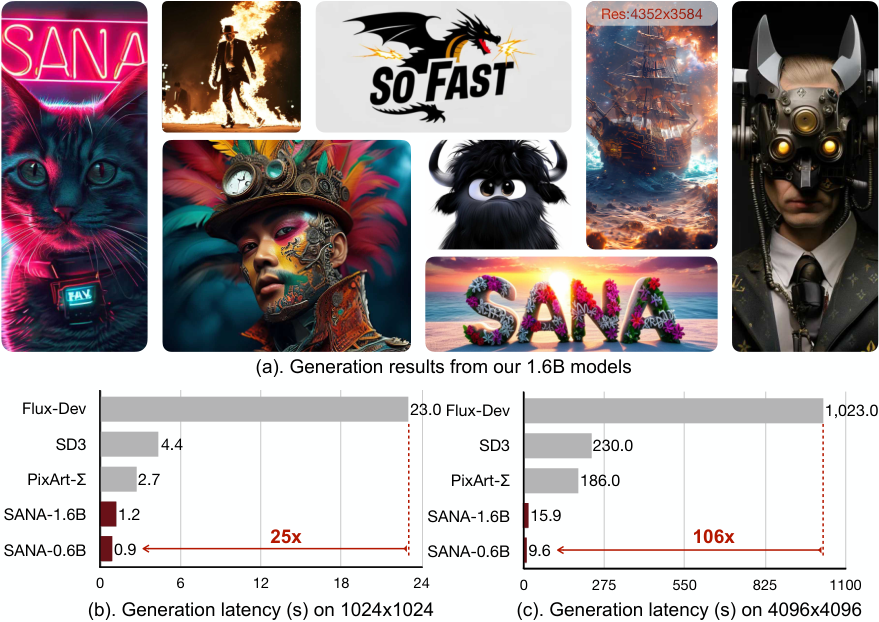

<figcaption>図1: Sana が生成した画像と推論レイテンシの概観。</figcaption>
</figure>

## 1 Introduction（はじめに）

この 1 年で、潜在拡散モデルは text-to-image の研究において有意な進展を遂げ、相当な商業的価値を生み出してきた。一方で、いくつかの主要な点について研究者の間で合意が形成されつつある：(1) U-Net を Transformer アーキテクチャで置き換えること、(2) 画像の自動ラベル付けに Vision Language Model（VLM）を用いること、(3) 変分オートエンコーダ（VAE）とテキストエンコーダを改善すること、(4) 超高解像度の画像生成を達成すること、などである。他方で、産業界のモデルはますます大きくなっており、パラメータ数は PixArt の 0.6B から、SD3 の 8B、LiDiT の 10B、Flux の 12B、Playground v3 の 24B へと増大している。この傾向は極めて高い学習と推論のコストをもたらし、これらのモデルを使うことが難しく高価だと感じる大半の消費者にとって課題を生んでいる。これらの課題を踏まえると、決定的な問いが浮かび上がる：**計算効率が高く、クラウドとエッジデバイスの双方で非常に高速に動作する、高品質かつ高解像度の画像生成器を開発できるだろうか？**

<figure>

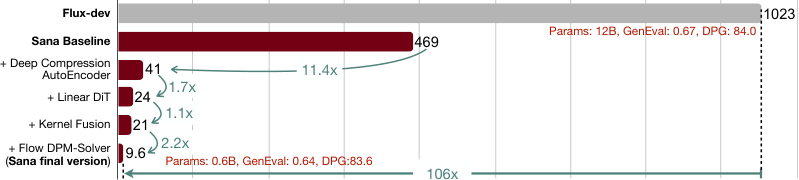

<figcaption>図2: アルゴリズムとシステムの協調最適化により、4096 × 4096 の画像生成の推論レイテンシを 469 秒から 9.6 秒へ削減し、現行の SOTA モデルである FLUX より 106 倍速いことを達成した。数値は A100 GPU 上でバッチサイズ 1 で測定。</figcaption>
</figure>

本稿は Sana を提案する。これは 1024 $\times$ 1024 から 4096 $\times$ 4096 までの解像度で、高品質な画像を効率的かつ費用対効果高く学習・合成するよう設計されたパイプラインである。我々の知る限り、PixArt-$\Sigma$ を除いて、4K 解像度の画像生成を直接探求した公刊研究はない。しかしながら PixArt-$\Sigma$ は 4K に近い解像度（3840 $\times$ 2160）の生成に限られ、そのような高解像度の画像を生成する際には比較的遅い。この野心的な目標を達成するため、我々はいくつかの中核設計を提案する。

**深圧縮オートエンコーダ（Deep Compression Autoencoder）**：2.1 節で新しいオートエンコーダ（AE）を導入する。これはスケーリング係数を積極的に 32 まで増大させる。従来、主流の AE は画像の縦横を係数 8 でしか圧縮していなかった（AE-F8）。AE-F8 と比べて、我々の AE-F32 は**潜在トークンを 16 分の 1 に**出力する。これは効率的な学習と、4K 解像度のような超高解像度画像の生成にとって決定的である。

**効率的な線形 DiT（Efficient Linear DiT）**：2.2 節で、通常の二次的な注意モジュールを置き換える新しい線形 DiT を導入する。元の DiT の自己注意の計算複雑度は O(N²) であり、高解像度の画像を処理する際に二次的に増大する。我々はすべての通常の注意を線形注意で置き換え、計算複雑度を O(N²) から **O(N)** へ削減する。同時に、トークンの局所情報を集約するために 3 $\times$ 3 の depth-wise 畳み込みを MLP へ統合した **Mix-FFN** を提案する。我々は、適切な設計があれば線形注意は通常の注意に匹敵する結果を達成でき、高解像度の画像生成においてより効率的であると主張する（例：4K で 1.7 $\times$ の加速）。加えて、Mix-FFN の間接的な利点は、**位置符号化が不要になる（NoPE）** ことである。**我々は初めて DiT における位置埋め込みを除去し、品質の損失がないことを見出した**。

**テキストエンコーダとしてのデコーダのみの小型 LLM**：2.3 節では、ユーザーのプロンプトに関する理解と推論の能力を高めるため、最新の大規模言語モデル（LLM）である Gemma をテキストエンコーダとして利用する。text-to-image 生成モデルは長年にわたり大きく進歩してきたが、既存モデルの大半は依然としてテキスト符号化に CLIP または T5 に依拠しており、これらはしばしば頑健なテキスト理解と指示追従の能力を欠く。Gemma のようなデコーダのみの LLM は強いテキスト理解と推論の能力を示し、人間の指示を効果的に追従する能力を実証している。本研究ではまず、LLM をテキストエンコーダとして直接採用することから生じる学習の不安定性の問題に対処する。次に、LLM の強力な指示追従・文脈内学習・推論の能力を活用して画像-テキストの整合を改善するため、**複雑な人間の指示（CHI）** を設計する。

**効率的な学習と推論の戦略**：3.1 節では、テキストと画像の間の一貫性を改善するための一連の自動ラベル付けと学習の戦略を提案する。まず各画像について、複数の VLM を利用して再キャプションを生成する。これらの VLM の能力は様々だが、その相補的な強みがキャプションの多様性を改善する。加えて 3.2 節では、clipscore に基づく学習戦略を提案する。そこでは、1 枚の画像に対応する複数のキャプションについて、確率に基づいて高い clip スコアを持つキャプションを動的に選択する。実験は、このアプローチが学習の収束とテキスト-画像の整合を改善することを示す。さらに我々は Flow-DPM-Solver を提案する。これは広く用いられる Flow-Euler-Solver と比べて推論のサンプリングステップを 28-50 から **14-20** へ削減しつつ、より良い結果を達成する。

結論として、我々の Sana-0.6B は 4K 画像生成において現行の最先端手法（FLUX）より **100 倍以上速い**スループットを達成し（図 2）、1K 解像度では **40 倍**速い（図 4）一方、多くのベンチマークで競争力のある結果を届ける。加えて 4 節で詳述するように、我々は Sana-0.6B を量子化してエッジデバイスへ展開した。消費者向けの 4090 GPU 上で 1024 $\times$ 1024 解像度の画像を生成するのに**わずか 0.37 秒**しかかからず、リアルタイム画像生成のための強力な基盤モデルを提供する。我々のモデルがすべての業界の専門家と日常のユーザーによって効率的に活用され、彼らに有意な事業価値を提供することを願っている。

## 2 Methods（手法）

### 2.1 Deep Compression Autoencoder（深圧縮オートエンコーダ）

#### 2.1.1 Preliminary（予備知識）

ピクセル空間で拡散モデルを直接実行することに伴う過大な学習・推論コストを緩和するため、Rombach ら は事前学習済みのオートエンコーダが生成する圧縮された潜在空間で動作する潜在拡散モデルを提案した。従来の潜在拡散研究で最も一般的に用いられるオートエンコーダは、**ダウンサンプリング係数 $F=8$** を特徴とし、画像をピクセル空間 $\mathbb{R}^{H\times W\times 3}$ から潜在空間 $\mathbb{R}^{\frac{H}{8}\times\frac{W}{8}\times C}$ へ写像する。ここで $C$ は潜在チャネル数を表す。DiT ベースの手法では、拡散モデルが処理するトークン数は**パッチサイズ $P$** という別のハイパーパラメータにも影響される。潜在特徴はサイズ $P\times P$ のパッチにまとめられ、結果として $\frac{H}{PF}\times\frac{W}{PF}$ 個のトークンとなる。従来研究における典型的なパッチサイズは $2$ である。

要するに、従来の潜在拡散モデル（LDM）——例えば PixArt、SD3、Flux——は通常 **AE-F8C4P2 または AE-F8C16P2** を用いており、AE が画像を 8 $\times$、DiT が 2 $\times$ 圧縮する。我々の Sana では、圧縮係数を積極的に **32 $\times$** までスケールさせ、品質を維持するためのいくつかの技術を提案する。

#### 2.1.2 Autoencoder Design Philosophy（オートエンコーダの設計思想）

従来の AE-F8 と異なり、我々は圧縮率をより積極的に高めることを目指す。動機は、**高解像度の画像は本質的により多くの冗長な情報を含む**ことである。さらに、高解像度画像（例：4K）の効率的な学習と推論は、オートエンコーダに高い圧縮率を必要とする。表 1 は、MJHQ-30K において、従来手法（例：SDv1.5）が AE-F32C64 の使用を試みたものの、品質が AE-F8C4 に対して著しく劣ることを示している。我々の AE-F32C32 はこの品質の隔たりを実効的に埋め、SDXL の AE-F8C4 に匹敵する再構成能力を達成する。我々は、AE における軽微な差は DiT の能力のボトルネックにはならないと考える。

さらに、パッチサイズ $P$ を増やすのではなく、我々は**オートエンコーダが圧縮の責任を全面的に負うべきであり、潜在拡散モデルはノイズ除去のみに集中できるようにすべきである**と主張する。したがって我々は、ダウンサンプリング係数 $F=32$、チャネル $C=32$ の AE を開発し、パッチサイズ $1$ でその潜在空間において拡散モデルを実行する（**AE-F32C32P1**）。この設計はトークン数を $4\times$ 削減し、GPU メモリ要件を下げつつ学習と推論の速度を大きく改善する。

#### 2.1.3 Ablation of AutoEncoder Designs（オートエンコーダ設計のアブレーション）

モデル構造の観点からは、収束を加速するためにいくつかの調整を実装する。具体的には、高解像度生成の効率を改善するために通常の自己注意機構を線形注意ブロックで置き換える。加えて学習の観点からは、学習の安定性を改善するために多段階の学習戦略を提案する。これは高解像度データでより良い再構成結果を達成するため、AE-F32C32 を $1024\times 1024$ の画像で微調整することを含む。

**表1**: 異なるオートエンコーダの再構成能力。

| Autoencoder | rFID $\downarrow$ | PSNR $\uparrow$ | SSIM $\uparrow$ | LPIPS $\downarrow$ |
| --- | --- | --- | --- | --- |
| F8C4 (SDXL) | 0.31 | 31.41 | 0.88 | 0.04 |
| F32C64 (SD) | 0.82 | 27.17 | 0.79 | 0.09 |
| F32C32 (Ours) | 0.34 | 29.29 | 0.84 | 0.05 |

**より大きなパッチサイズを使って DiT 内でトークンを圧縮できるか？** 我々は AE-F8C16P4、AE-F16C32P2、AE-F32C32P1 を比較する。これら 3 つの設定は 1024×1024 の画像を同じトークン数 $32\times 32$ に圧縮する。図 3(a) に示すように、AE-F8C16 が最良の再構成能力を示す（rFID: F8C16 $<$ F16C32 $<$ F32C32）にもかかわらず、**F32C32 の生成結果の方が優れている**ことを経験的に見出した（FID: F32C32P1 $<$ F16C32P2 $<$ F8C16P4）。これは、**オートエンコーダを高圧縮率のみに集中させ、拡散モデルをノイズ除去に専念させることが最適な選択である**ことを示している。

<figure>

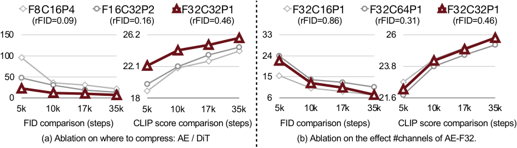

<figcaption>図3: 我々の深圧縮オートエンコーダ（AE）のアブレーション研究。</figcaption>
</figure>

**AE-F32 における異なるチャネル数**：我々は様々なチャネル構成を探索し、最終的に最適な設定として C=32 を選んだ。図 3(b) に示すように、**チャネル数が少ないほど収束は速いが、再構成の品質は悪い**。35K 学習ステップの後、C=16 と C=32 の収束速度は同程度であるが、C=32 の方が良い再構成指標をもたらし、結果としてより良い FID と CLIP スコアとなることを観測した。**C=64 は優れた再構成を提供するが、その後段の DiT の学習収束速度は C=32 のそれより著しく遅い**。

<figure>

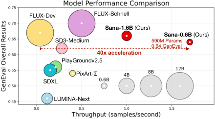

<figcaption>図4: 1024 × 1024 解像度における Sana と最先端の拡散モデルの比較。すべてのモデルは A100 GPU 上で試験されている。Sana はわずか 590M のモデルパラメータで 0.64 の GenEval 総合性能を提供する。</figcaption>
</figure>

### 2.2 Efficient Linear DiT Design（効率的な線形 DiT の設計）

DiT が用いる自己注意は O(N²) の計算複雑度を持ち、高解像度の画像を処理する際に低い計算効率をもたらし、有意なオーバーヘッドを招く。この問題に対処するため、我々はまず線形 DiT を提案した。これは元の自己注意を完全に置き換え、性能を損なうことなく高解像度生成においてより高い計算効率を達成する。加えて、トークン情報をよりよく集約するために 3 $\times$ 3 の depth-wise 畳み込みを組み込んだ **Mix-FFN** で元の MLP-FFN を置き換える。これらのミクロな設計は先行研究に着想を得ているが、単純さとスケーラビリティを保つために **DiT のマクロなアーキテクチャ設計は維持する**。

<figure>

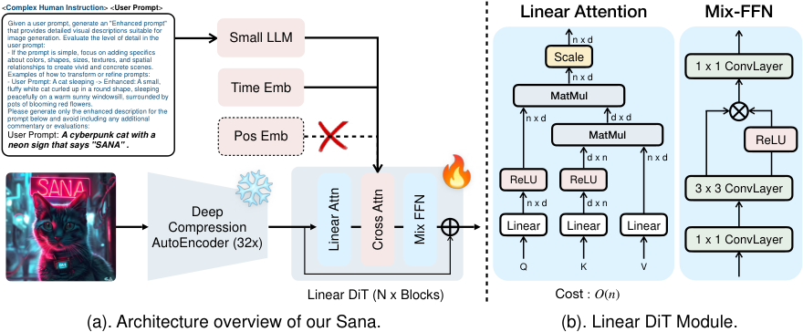

<figcaption>図5: Sana の概観。図 (a) は高水準の学習パイプラインを記述し、32 × の深圧縮オートエンコーダ、線形 DiT、複雑な人間の指示を含む。**位置埋め込みは我々の枠組みでは不要である**ことに注意されたい。図 (b) は線形 DiT における線形注意と Mix-FFN の詳細な設計を記述する。</figcaption>
</figure>

**線形注意ブロック。** 我々が用いる線形注意モジュールの図解を図 5 に示す。計算複雑度を削減するため、我々は伝統的な softmax 注意を **ReLU 線形注意**で置き換える。ReLU 線形注意とその他の変種は主に高解像度の密な予測タスクで探求されてきたが、**我々の研究は画像生成における線形注意の有効性を実証する初期の探求を表す**。

我々のアプローチの計算上の利点は実装において明白である。式 1 に示すように、各クエリについて注意を計算する代わりに、共有される項 $\left(\sum_{j=1}^{N}\text{ReLU}(K_{j})^{T}V_{j}\right)\in\mathbb{R}^{d\times d}$ と $\left(\sum_{j=1}^{N}\text{ReLU}(K_{j})^{T}\right)\in\mathbb{R}^{d\times 1}$ を**一度だけ**計算する。これらの共有項はその後、各クエリについて再利用でき、メモリと計算の双方において **O(N)** の線形計算複雑度をもたらす。

$$
O_{i}=\sum_{j=1}^{N}\frac{\text{ReLU}(Q_{i})\text{ReLU}(K_{j})^{T}V_{j}}{\sum_{j=1}^{N}\text{ReLU}(Q_{i})\text{ReLU}(K_{j})^{T}}=\frac{\text{ReLU}(Q_{i})\left(\sum_{j=1}^{N}\text{ReLU}(K_{j})^{T}V_{j}\right)}{\text{ReLU}(Q_{i})\left(\sum_{j=1}^{N}\text{ReLU}(K_{j})^{T}\right)}
$$

**Mix-FFN ブロック。** EfficientViT で論じられているように、線形注意モデルは softmax 注意と比べて計算複雑度の削減とレイテンシの低下から恩恵を受ける。しかしながら、**非線形な類似度関数の欠如が最適でない性能を招きうる**。我々は画像生成においても同様の結論を観測しており、線形注意モデルは最終的には同等の性能を達成するものの、収束が著しく遅いことに苦しむ。学習効率をさらに改善するため、我々は元の MLP-FFN を Mix-FFN で置き換える。Mix-FFN は逆残差ブロック、3 $\times$ 3 の depth-wise 畳み込み、そして Gated Linear Unit（GLU）から成る。**depth-wise 畳み込みは局所情報を捉えるモデルの能力を高め、ReLU 線形注意の弱い局所情報の捕捉能力を補償する**。モデル設計空間の性能アブレーションは表 8 に示す。

**位置符号化のない DiT（NoPE）。** 我々は、**性能の損失なく位置埋め込みを除去できることに驚いた**。いくつかの初期の理論的・実践的な研究は、**ゼロパディングを伴う 3 $\times$ 3 の畳み込みを導入することが位置情報を暗黙的に取り込みうる**ことに言及している。絶対 PE・学習可能な PE・RoPE を主に用いる従来の DiT ベースの手法と対照的に、我々は **NoPE** を提案する。これは DiT において位置埋め込みを完全に省く初の設計である。LLM 分野における最近の最先端研究も、NoPE がより良い長さの汎化能力を提供しうることを示している。

**Triton による学習／推論の加速。** 線形注意をさらに加速するため、我々は Triton を用いて線形注意ブロックの順伝播と逆伝播の双方についてカーネルを融合し、学習と推論を高速化する。活性化関数・精度変換・パディング操作・除算を含むすべての要素ごとの演算を行列積へ融合することにより、データ転送に伴うオーバーヘッドを削減する。Triton から得られる詳細と利点は付録に付す。

### 2.3 Text Encoder Design（テキストエンコーダの設計）

**なぜ T5 をデコーダのみの LLM へ置き換えるのか？** 現在の最も先進的な LLM は、より大規模なデータで学習されたデコーダのみの GPT アーキテクチャである。T5（2019 年に提案された手法）と比べて、デコーダのみの LLM は強力な推論能力を持つ。Chain-of-Thought（CoT）と文脈内学習（ICL）を用いることで、複雑な人間の指示に従える。加えて Gemma-2 のようないくつかの小型 LLM は、非常に効率的でありながら大型 LLM の性能に匹敵しうる。したがって我々は Gemma-2 をテキストエンコーダとして採用することを選んだ。

表 9 に示すように、T5-XXL と比べて Gemma-2-2B は推論速度が **6 $\times$ 速い**一方、Gemma-2B の性能は Clip Score と FID の点で T5-XXL に匹敵する。

**LLM をテキストエンコーダとして使う際の学習の安定化。** 我々は Gemma-2 デコーダの最終層の特徴をテキスト埋め込みとして抽出する。T5 のテキスト埋め込みを key・value とし、画像トークンを query として cross-attention の学習を行うアプローチをそのまま踏襲すると、**極端な不安定性が生じ、学習損失が頻繁に NaN になる**ことを経験的に見出した。

我々は、**T5 のテキスト埋め込みの分散が、デコーダのみの LLM（Gemma-1-2B、Gemma-2-2B、Qwen-2-0.5B）のそれより数桁小さい**ことを見出した。これはテキスト埋め込みの出力に多くの大きな絶対値が存在することを示している。この問題に対処するため、我々はデコーダのみのテキストエンコーダの後に正規化層（すなわち **RMSNorm**）を加え、テキスト埋め込みの分散を 1.0 に正規化する。加えて、**小さい学習可能なスケール係数（例：0.01）を初期化してテキスト埋め込みに掛ける**ことでモデルの収束をさらに加速する有用な工夫を発見した。結果は図 6 に示す。

<figure>

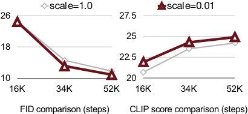

<figcaption>図6: テキスト埋め込みの正規化と小さいスケール係数を用いるか否かのアブレーション研究。</figcaption>
</figure>

**表2**: 複雑な人間の指示（CHI）を用いるか否かのアブレーション研究。

| Prompt | Train Step | GenEval |
| --- | --- | --- |
| User | 52K | 45.5 |
| CHI + User | 52K | 47.7 (+2.2) |
| User | 140K | 52.8 |
| CHI + User | + 5K（微調整） | 54.8 (+2.0) |

**複雑な人間の指示が画像-テキストの整合を改善する。** 上述の通り、Gemma は T5 より優れた指示追従の能力を持つ。この能力をさらに活用してテキスト埋め込みを強化できる。Gemma はチャットモデルであり、強力な能力を持つものの、いくぶん予測不能でありうる。したがって、プロンプトそのものを抽出し強化することに集中させるための指示を加える必要がある。LiDiT は単純な人間の指示をユーザープロンプトと組み合わせた最初の研究である。ここで我々はそれをさらに拡張し、**LLM の文脈内学習を用いて複雑な人間の指示（CHI）を設計する**。表 2 に示すように、学習の際に CHI を組み込むことは——ゼロからであれ微調整を通じてであれ——画像-テキストの整合の能力をさらに改善しうる。

加えて図 7 に示すように、「猫」のような短いプロンプトが与えられたとき、**CHI はモデルがより安定した内容を生成するのを助ける**ことを見出した。これは、CHI のないモデルがしばしばプロンプトと無関係な内容を出力するという事実に表れている。

<figure>

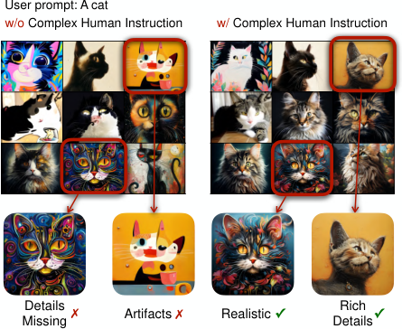

<figcaption>図7: 複雑な人間の指示（CHI）ありとなしの生成。CHI がないと、単純なプロンプトはアーティファクトや細部の乏しい結果を含む劣った生成につながりうる。</figcaption>
</figure>

## 3 Efficient Training/Inference（効率的な学習／推論）

### 3.1 Data Curation and Blending（データのキュレーションとブレンド）

**マルチキャプション自動ラベル付けのパイプライン。** 各画像について、元のプロンプトを含むか否かにかかわらず、我々は 4 つの VLM——VILA-3B/13B、InternVL2-8B/26B——を用いてラベル付けする。複数の VLM はキャプションをより正確かつ多様にできる。

**CLIP スコアに基づくキャプション・サンプラ。** マルチキャプションが提示する 1 つの問題は、学習中に画像に対応するキャプションをどう選ぶかである。素朴なアプローチはランダムにキャプションを選ぶが、これは低品質なテキストを選んでモデルの性能に影響しうる。

我々は clip スコアに基づくサンプラを提案する。動機は**高品質なテキストをより大きな確率でサンプリングする**ことである。まず 1 枚の画像に対応するすべてのキャプションについて clip スコア $c_{i}$ を計算し、サンプリングの際には clip スコアに基づく確率に従ってサンプリングする。ここで我々は確率の定式化に追加のハイパーパラメータである温度 $\tau$ を導入する：$P(c_{i})=\frac{\exp\left(c_{i}/\tau\right)}{\sum_{j=1}^{N}\exp\left(c_{j}/\tau\right)}$。温度はサンプリングの強度を調整するのに使える。温度が 0 に近ければ、最も高い clip スコアを持つテキストのみがサンプリングされる。表 4 の結果は、**キャプションの変化が画像品質（FID）にはほとんど影響しない一方、学習中の意味的整合を改善する**ことを示している。

**表4**: 学習中の画像-テキストペアのサンプリング戦略の比較。

| Prompt Strategy | FID $\downarrow$ | CLIP $\uparrow$ | Iterations |
| --- | --- | --- | --- |
| Single | 6.13 | 27.10 | 65K |
| Multi-random | 6.15 | 27.13 | 65K |
| Multi-clipscore | 6.12 | 27.26 | 65K |

**カスケード解像度学習。** AE-F32C32P1 を用いる恩恵により、我々は **256px の事前学習を飛ばし**、512px の解像度で直接事前学習を開始して、モデルを 1024px、2K、4K の解像度へ段階的に微調整する。我々は、**256px での事前学習という伝統的な慣行は費用対効果が高すぎる（＝割に合わない）**と考える。256 解像度の画像は詳細な情報を失いすぎるため、画像-テキストの整合の点でモデルの学習が遅くなるからである。

<figure>

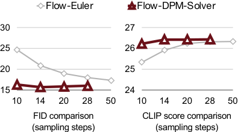

<figcaption>図8: サンプリングステップ数が FID と CLIP-Score に与える影響：Flow-DPM-Solver と Flow-Euler の比較。</figcaption>
</figure>

### 3.2 Flow-based Training / Inference（flow ベースの学習／推論）

**Flow ベースの学習。** 我々は SD3 の Rectified Flow の優れた性能を分析し、ノイズ予測に依拠する DDPM と異なり、**1-Rectified Flow（RF）と EDM のどちらもデータまたは速度の予測を用いており、それが速い収束と改善された性能をもたらしている**ことを見出した。具体的には、これらの手法はすべて共通の拡散の定式化に従う：$\mathbf{x}_{t}=\alpha_{t}\cdot\mathbf{x}_{0}+\sigma_{t}\cdot\epsilon$。ここで $\mathbf{x}_{0}$ は画像データ、$\epsilon$ はランダムノイズ、$\alpha_{t}$ と $\sigma_{t}$ は拡散過程のハイパーパラメータを表す。DDPM の学習では、目的はノイズ予測であり $\epsilon_{\theta}(\mathbf{x}_{t},t)=\epsilon_{t}$ と定義される。しかしながら EDM と RF はどちらも異なるアプローチに従う：EDM は目的 $x_{\theta}(\mathbf{x}_{t},t)=\mathbf{x}_{0}$ によるデータ予測を目指し、RF は目的 $v_{\theta}(\mathbf{x}_{t},t)=\epsilon-\mathbf{x}_{0}$ による速度予測を用いる。**ノイズ予測からデータまたは速度の予測へのこの移行は $t=T$ の近傍で決定的である**。そこではノイズ予測が不安定性を招きうる一方、データまたは速度の予測はより精密で安定した推定を提供する。eDiff-I が指摘するように、$t=T$ 近傍では注意の活性化がより強く、この決定的な時点における正確な予測の重要性がさらに強調される。この転換はサンプリング中の累積誤差を実効的に削減し、結果としてより速い収束と改善された性能をもたらす。さらなる詳細は付録 B にある。

**表3**: $256 \times 256$ 解像度における異なる学習スケジュールの比較。

| Schedule | FID $\downarrow$ | CLIP $\uparrow$ | Iterations |
| --- | --- | --- | --- |
| DDPM | 19.5 | 24.6 | 120K |
| Flow Matching | 16.9 | 25.7 | 120K |

**Flow ベースの推論。** 本研究では、元の DPM-Solver++ を Rectified Flow の定式化に適応するよう修正し、**Flow-DPM-Solver** と名づけた。主要な調整は、スケーリング係数 $\alpha_{t}$ を $1-\sigma_{t}$ で置き換えることを含む。ここで $\sigma_{t}$ は変わらないが、タイムステップは $[1,1000]$ ではなく $[0,1]$ の範囲で再定義され、SD3 に従ってより低い信号対雑音比を達成するためのタイムステップのシフトが適用される。加えて、我々のモデルは速度場を予測しており、これは元の DPM-Solver++ のデータ予測とは異なる。具体的には、データは関係式 $\text{data}\leftarrow x_{0}=x_{T}-{\sigma}_{T}\cdot v_{\theta}(x_{T},t_{T})$ から導かれる。ここで $v_{\theta}(\cdot)$ はモデルが予測する速度である。

結果として図 8 に示すように、我々の Flow-DPM-Solver は **14 $\sim$ 20 ステップ**でより良い性能とともに収束する一方、Flow-Euler サンプラは収束に **28 $\sim$ 50 ステップ**を要し、しかも結果は劣る。

## 4 On-device Deployment（オンデバイス展開）

エッジ展開を強化するため、我々はモデルを 8 ビット整数で量子化する。具体的には、活性化にはトークンごとの対称 INT8 量子化を、重みにはチャネルごとの対称 INT8 量子化を採用する。さらに、16 ビット版に対する高い意味的類似性を保ちつつ実行時のオーバーヘッドを最小限に抑えるため、**正規化層・線形注意・cross-attention ブロック内の key-value 射影層は完全精度のまま保持する**。

**表5**: オンデバイス展開：我々の推論エンジンは W8A8 量子化により、ラップトップ GPU で 1024px の画像を生成する際に 2.4 $\times$ の高速化を実現した。Sana の性能は MJHQ-30K における CLIP-Score と、その最初の 1K 画像における Image-Reward で評価される。

| Methods | Latency (s) | CLIP-Score $\uparrow$ | Image-Reward $\uparrow$ |
| --- | --- | --- | --- |
| Sana (FP16) | 0.88 | 28.5 | 1.03 |
| ＋ W8A8 量子化 | 0.37 | 28.3 | 0.96 |

我々は W8A8 GEMM カーネルを CUDA C++ で実装し、不要な活性化のロードとストアに伴うオーバーヘッドを緩和するためにカーネル融合の技法を用いて、全体の性能を高める。具体的には、線形注意の $\text{ReLU}(K)^{T}V$ の積（式 1）を $QKV$ 射影層と統合し、Mix-FFN では Gated Linear Unit（GLU）を量子化カーネルと融合し、その他の要素ごとの演算も統合する。加えて、GEMM と Conv のカーネルにおける転置操作を避けるため、活性化のレイアウトを調整する。

表 5 は、ラップトップ GPU 上での展開最適化の前後の速度比較を示す。1024px の画像を生成する場合、我々の最適化された実装は 2.4 $\times$ の高速化を達成し、わずか **0.37 秒**しかかからない一方、ほぼ無損失の画像品質を維持する。

## 5 Experiments（実験）

**モデルの詳細。** 表 6 はネットワークアーキテクチャの詳細を記述する。我々の Sana-0.6B はわずか 590M のパラメータしか含まず、層数とチャネル数は元の DiT-XL および PixArt-$\Sigma$ のそれとほぼ同一である。Sana-1.6B はパラメータを 1.6B へ増やし、20 層・層あたり 2240 チャネルとし、FFN のチャネルを 5600 へ増やす。我々は、**モデルの層数を 20 から 30 の間に保つことが効率と品質の良い均衡点になる**と考える。

**評価の詳細。** 我々は Sana の性能を評価するために 5 つの主流の評価指標——FID、Clip Score、GenEval、DPG-Bench、ImageReward——を用い、SOTA 手法と比較する。FID と Clip Score は MJHQ-30K データセット上で評価される。これは Midjourney からの 30K 枚の画像を含む。GenEval と DPG-Bench はどちらもテキスト-画像の整合の測定に焦点を当て、それぞれ 533 と 1,065 のテストプロンプトを持つ。ImageReward は人間の選好の性能を評価し、100 のプロンプトを含む。

**表6**: 提案する Sana のアーキテクチャの詳細。

| Model | Width | Depth | FFN | #Heads | #Param (M) |
| --- | --- | --- | --- | --- | --- |
| Sana-0.6B | 1152 | 28 | 2880 | 36 | 590 |
| Sana-1.6B | 2240 | 20 | 5600 | 70 | 1604 |

### 5.1 Performance Comparison and Analysis（性能比較と分析）

我々は表 7 で Sana を最先端の text-to-image 拡散モデルと比較する。$512\times 512$ 解像度について、Sana-0.6 は同程度のモデルサイズを持つ PixArt-$\Sigma$ より **5 $\times$ 速い**スループットを実証し、FID・Clip Score・GenEval・DPG-Bench においてそれを大きく上回る。$1024\times 1024$ 解像度について、Sana は $<$ 3B パラメータの大半のモデルよりかなり強く、推論レイテンシで際立つ。我々のモデルは、最も先進的な大型モデルである FLUX-dev と比べても競争力のある性能を達成する。例えば、DPG-Bench における精度は同等で GenEval ではわずかに低いものの、**Sana-0.6B のスループットは 39 $\times$ 速く、Sana-1.6B は 23 $\times$ 速い**。

表 8 では、$1024\times 1024$ 解像度の設定で、元の DiT のモジュールを対応する線形 DiT のモジュールで置き換えた際の効率を分析する。AE-F8C4P2 を用いる場合、元の完全注意を線形注意で置き換えるとレイテンシを 2250ms から 1931ms へ削減できるが、生成結果は悪くなることを観測した。元の FFN を我々の Mix-FFN で置き換えることは性能の損失を補償するが、効率をいくらか犠牲にする。Triton のカーネル融合により、我々の線形 DiT は最終的に 1024px のスケールで元の DiT よりわずかに速くなり、より高い解像度ではより速くなる。さらに AE-F8C4P2 から AE-F32C32P1 へ格上げすると、MACs はさらに 4 $\times$ 削減でき、スループットも 4 $\times$ 改善できる。Triton のカーネル融合は約 10% の速度加速をもたらす。

図 9 の左側は Sana、Flux-dev、SD3、PixArt-$\Sigma$ の生成結果を比較する。テキストレンダリングの 1 行目では、PixArt-$\Sigma$ はテキストレンダリングの能力を欠く一方、Sana は正確にテキストをレンダリングできる。2 行目では、我々の Sana と FLUX が生成する画像の品質は同等である一方、SD3 のテキスト理解は不正確である。図 9 の右側は、Sana がラップトップ上でローカルに首尾よく展開できることを示す。デモ動画は付録に提供する。

**表7**: 効率と性能における我々の手法と SOTA アプローチの包括的な比較。速度は FP16 精度の A100 GPU 1 台で試験。Throughput: バッチ 16 で測定。Latency: バッチ 1・サンプリングステップ 20 で測定。

| Methods | Throughput (samples/s) | Latency (s) | Params (B) | Speedup | FID $\downarrow$ | CLIP $\uparrow$ | GenEval $\uparrow$ | DPG $\uparrow$ |
| --- | --- | --- | --- | --- | --- | --- | --- | --- |
| **512 × 512 解像度** | | | | | | | | |
| PixArt-$\alpha$ | 1.5 | 1.2 | 0.6 | 1.0 $\times$ | 6.14 | 27.55 | 0.48 | 71.6 |
| PixArt-$\Sigma$ | 1.5 | 1.2 | 0.6 | 1.0 $\times$ | 6.34 | 27.62 | 0.52 | 79.5 |
| Sana-0.6B | 6.7 | 0.8 | 0.6 | 5.0 $\times$ | 5.67 | 27.92 | 0.64 | 84.3 |
| Sana-1.6B | 3.8 | 0.6 | 1.6 | 2.5 $\times$ | 5.16 | 28.19 | 0.66 | 85.5 |
| **1024 × 1024 解像度** | | | | | | | | |
| LUMINA-Next | 0.12 | 9.1 | 2.0 | 2.8 $\times$ | 7.58 | 26.84 | 0.46 | 74.6 |
| SDXL | 0.15 | 6.5 | 2.6 | 3.5 $\times$ | 6.63 | 29.03 | 0.55 | 74.7 |
| PlayGroundv2.5 | 0.21 | 5.3 | 2.6 | 4.9 $\times$ | 6.09 | 29.13 | 0.56 | 75.5 |
| Hunyuan-DiT | 0.05 | 18.2 | 1.5 | 1.2 $\times$ | 6.54 | 28.19 | 0.63 | 78.9 |
| PixArt-$\Sigma$ | 0.4 | 2.7 | 0.6 | 9.3 $\times$ | 6.15 | 28.26 | 0.54 | 80.5 |
| DALLE3 | - | - | - | - | - | - | 0.67 | 83.5 |
| SD3-medium | 0.28 | 4.4 | 2.0 | 6.5 $\times$ | 11.92 | 27.83 | 0.62 | 84.1 |
| FLUX-dev | 0.04 | 23.0 | 12.0 | 1.0 $\times$ | 10.15 | 27.47 | 0.67 | 84.0 |
| FLUX-schnell | 0.5 | 2.1 | 12.0 | 11.6 $\times$ | 7.94 | 28.14 | 0.71 | 84.8 |
| Sana-0.6B | 1.7 | 0.9 | 0.6 | **39.5 $\times$** | 5.81 | 28.36 | 0.64 | 83.6 |
| Sana-1.6B | 1.0 | 1.2 | 1.6 | 23.3 $\times$ | 5.76 | 28.67 | 0.66 | 84.8 |

**表8**: Sana のブロック設計空間の性能。速度は FP16 精度の A100 GPU 1 台・画像サイズ 1024 で試験。MACs: 単一の順伝播あたりの積和演算。TP（Throughput）: バッチ 16 で測定。Latency: バッチ 1 で測定。

| Blocks | AE | MACs (T) | TP (/s) | Latency (ms) |
| --- | --- | --- | --- | --- |
| FullAttn & FFN | F8C4P2 | 6.48 | 0.49 | 2250 |
| ＋ LinearAttn | F8C4P2 | 4.30 | 0.52 | 1931 |
| ＋ MixFFN | F8C4P2 | 4.19 | 0.46 | 2425 |
| ＋ Kernel Fusion | F8C4P2 | 4.19 | 0.53 | 2139 |
| LinearAttn & MixFFN | F32C32P1 | 1.08 | 1.75 | 826 |
| ＋ Kernel Fusion | F32C32P1 | 1.08 | 2.06 | 748 |

**表9**: 異なるテキストエンコーダの比較。すべてのモデルは FP16 精度の A100 GPU で試験。Gemma-2B モデルは同程度の速度で T5-large より良い性能を達成し、より大きく遥かに遅い T5-XXL に匹敵する性能を持つ。

| Text-Encoder | #Params (M) | Latency (s) | FID $\downarrow$ | CLIP $\uparrow$ |
| --- | --- | --- | --- | --- |
| T5-XXL | 4762 | 1.61 | 6.1 | 27.1 |
| T5-Large | 341 | 0.17 | 6.1 | 26.2 |
| Gemma2-2B | 2614 | 0.28 | 6.0 | 26.9 |
| Gemma-2B-IT | 2506 | 0.21 | 5.9 | 26.8 |
| Gemma2-2B-IT | 2614 | 0.28 | 6.1 | 26.9 |

<figure>

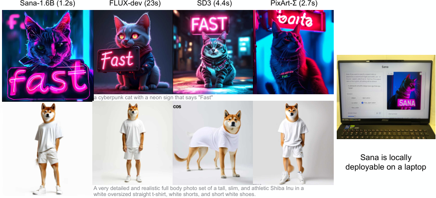

<figcaption>図9: 左: Sana-1.6B 対 FLUX-dev、SD3、PixArt-Σ の生成結果の可視化比較。速度は FP16 精度の A100 GPU で試験。右: 量子化した Sana-1.6B はラップトップの GPU 上に展開可能で、1K × 1K の画像を 1 秒以内に生成する。</figcaption>
</figure>

## 6 Related Work（関連研究）

我々は本文には比較的簡潔な関連研究の概観を置き、より包括的な版を補足資料に用意する。生成モデルのアーキテクチャの点では、Diffusion Transformer（Peebles & Xie 2022）と DiT ベースの text-to-image への拡張（Chen ら 2024b、Esser ら 2024、Labs 2024）がこの 1 年で有意な進展を遂げた。テキストエンコーダに関しては、最初期の研究（Rombach ら 2022）が CLIP を用いる一方、後続の研究（Saharia ら 2022、Chen ら 2024b、Chen ら 2024a）は T5-XXL を採用している。T5 と CLIP を組み合わせる取り組み（Balaji ら 2022、Esser ら 2024）もある。高解像度生成については、PixArt-$\Sigma$（Chen ら 2024a）が 4K 解像度の画像を直接生成できる最初のモデルである。加えて GigaGAN（Kang ら 2023）は超解像モデルを用いて 4K 画像を生成できる。オンデバイス展開の文脈では、Zhao ら 2023 および Li ら 2024b がモバイルデバイスへの拡散モデルの展開を探求している。

## 7 Conclusion（結論）

本稿は Sana という新しい効率的な text-to-image のパイプラインを構築する。我々は以下の次元で改善を行った：深圧縮オートエンコーダを提案し、DiT における自己注意を置き換えるために線形注意を広く用い、複雑な人間の指示を伴うデコーダのみの LLM をテキストエンコーダとして利用し、自動画像キャプションのパイプラインを確立し、サンプリングを加速する flow ベースの DPM-Solver を提案した。Sana は最大 4096 $\times$ 4096 の解像度で画像を生成でき、SOTA 手法より 100 $\times$ 以上高いスループットを届けつつ、競争力のある生成結果を維持する。

今後、我々は Sana に基づく効率的な動画生成のパイプラインの構築を検討する。本研究の潜在的な限界は、**生成される画像内容の安全性と制御可能性を完全には保証できない**ことである。加えて、**テキストレンダリングや、顔と手の生成といった特定の複雑なケースでは課題が残る**。

## Appendix A Full Related Work（完全版の関連研究）

**効率的な Diffusion Transformer。** Diffusion Transformer（DiT）の導入は画像生成モデルにおける有意な転換を画し、伝統的な U-Net アーキテクチャを transformer ベースのアプローチで置き換えた。この革新はより効率的でスケーラブルな拡散モデルへの道を開いた。DiT の上に構築して、PixArt-$\alpha$ はその概念を text-to-image 生成へ拡張し、transformer ベースの拡散モデルの多用途性を実証した。Stable Diffusion 3（SD3）は、テキストと画像のモダリティを効果的に統合する Multi-modal Diffusion Transformer（MM-DiT）を提案することにより、この分野をさらに前進させた。より最近では、Flux が 12B パラメータまでスケールさせることで高解像度画像生成における DiT アーキテクチャの潜在能力を示した。加えて、CAN や DiG のような初期の研究はクラス条件付き画像生成における線形注意の機構を探求した。モデルの構成を修正することに関連する研究もいくつかある。例えば注意を用いない拡散や、カスケード型のモデル構造である。

**画像生成におけるテキストエンコーダ。** 画像生成モデルにおけるテキストエンコーダの進化は、この分野の進歩に有意な影響を与えてきた。当初、Latent Diffusion Models（LDM）は OpenAI の CLIP をテキストエンコーダとして採用し、その事前学習された視覚-言語の表現を活用した。パラダイムの転換は Imagen の導入とともに起こった。これは T5-XXL 言語モデルをテキストエンコーダとして用い、優れたテキスト理解と生成の能力を実証した。続いて eDiff-I はハイブリッドなアプローチを提案し、T5-XXL と CLIP のエンコーダをアンサンブルして、言語理解と視覚-テキストの整合におけるそれぞれの強みを組み合わせた。Playground v3 のような最近の進展は、デコーダのみの大規模言語モデル（LLM）をテキストエンコーダとして用いることを探求しており、より繊細なテキストの理解と生成を提供しうる。より洗練されたテキストエンコーダへのこの傾向は、この分野におけるテキスト-画像の整合と生成品質の改善の継続的な追求を反映している。

**オンデバイス展開。** いくつかの研究が、エッジデバイス向けに拡散モデルの推論を最適化する事後学習量子化（PTQ）の技法を探求してきた。この領域の研究は較正の目的関数とデータ取得の手法に焦点を当ててきた。BRECQ は Fisher 情報量を目的関数に取り込む。ZeroQ は PTQ のための代理入力画像を生成するために蒸留を用いる。SQuant は Hessian スペクトルの感度に基づく目的関数とともにランダムなサンプルを用いる。Q-Diffusion のような最近の研究は、わずか 4 ビットの重みで高品質な生成を達成している。我々の研究では、ピーク時のメモリ使用量を削減するために W8A8 を選ぶ。

## Appendix B More Implementation Details（実装の詳細）

**Rectified-Flow 対 DDPM。** 我々の理論的な分析では、flow-matching の手法の速い収束の背後にある理由を調査し、1 次の flow-matching と EDM のモデルがどちらも類似の定式化に依拠していることを実証する。ノイズ予測を用いる DDPM と異なり、flow-matching と EDM はデータまたは速度の予測に焦点を当てており、それが改善された性能とより速い収束をもたらす。**ノイズ予測からデータ予測へのこの転換は、とりわけ $t=T$ において決定的である。そこではノイズ予測が不安定になりがちで、累積誤差を招く**。eDiff-I が指摘するように、$t\approx T$ 近傍では拡散モデルの注意の活性化がより強くなり、サンプリング過程のこの重要な時点における正確な予測の必要性が浮き彫りになる。

Lu らで論じられているように、$t=T$ 近傍における拡散モデルの振る舞いは次のことを明らかにする：$t \approx T$ のとき、データ分布はノイズに似ており、ノイズ予測はランダム性に近づく。課題が生じるのは、$t=T$ で犯した誤差が後続のすべてのサンプリングステップに伝播するためであり、サンプラがこの時点の近傍で特に精密であることが極めて重要になる。**Tweedie の公式**に基づくと、時刻 $t$ における対数密度の勾配 $\nabla_{\mathbf{x}_{t}}\log q_{t}(\mathbf{x}_{t})$ は次で近似される。

$$
\nabla_{\mathbf{x}_{t}}\log q_{t}(\mathbf{x}_{t})=-\frac{\mathbf{x}_{t}-\alpha_{t}\mathbb{E}{q_{0t(\mathbf{x}_{0}\mid\mathbf{x}_{t})}}[\mathbf{x}_{0}]}{\sigma_{t}^{2}}.
$$

$t\approx T$ のとき、$\mathbf{x}_{0}$ と $\mathbf{x}_{t}$ は条件付き独立になり、$q_{0t}(\mathbf{x}_{0}\mid\mathbf{x}_{t})\approx q_{0}(\mathbf{x}_{0})$ となる。その結果、**ノイズ予測モデルの最適解は次のようになる**。

$$
\epsilon_{\theta}(\mathbf{x}_{t},t)\approx-\sigma_{t}\nabla_{\mathbf{x}_{t}}\log q_{t}(\mathbf{x}_{t})\approx\frac{\mathbf{x}_{t}-\alpha_{t}\mathbb{E}_{q_{0}(\mathbf{x}_{0})}[\mathbf{x}_{0}]}{\sigma_{t}}.
$$

$\mathbb{E}_{q_{0}(\mathbf{x}_{0})}[\mathbf{x}_{0}]$ は $\mathbf{x}_{t}$ に依存しないので、**ノイズ予測モデルは $\mathbf{x}_{t}$ の線形関数へ単純化される**。しかしながら 5.2.1 節で論じたように、この余分な線形性はサンプリング中により多くの誤差の累積をもたらしうる。これは元の DPM-Solver がそのような場合にガイド付きサンプリングで苦戦する理由を説明する。

この問題に対処し安定性を改善するため、DPM-Solver はノイズ予測モデルをより安定なパラメータ化へ修正することを提案する。式 3 に着想を得てすべての線形項を差し引くと、残る項は $\mathbb{E}_{q_{0}(\mathbf{x}_{0})}[\mathbf{x}_{0}]$ に比例し、これはデータ予測モデルに対応する。具体的には、$t\approx T$ のとき**データ予測モデルは定数に近似される**。

$$
\mathbf{x}_{\theta}(\mathbf{x}_{t},t)\approx\frac{\mathbf{x}_{t}+\sigma_{t}^{2}\nabla_{\mathbf{x}_{t}}\log q_{t}(\mathbf{x}_{t})}{\alpha_{t}}\approx\mathbb{E}_{q_{0}(\mathbf{x}_{0})}[\mathbf{x}_{0}].
$$

したがって $t\approx T$ について、データ予測モデルはおよそ定数になり、**この定数を積分する際の離散化誤差は、線形なノイズ予測モデルのそれより著しく小さい**。この洞察が、速度予測モデルである Sana をデータ予測のものへ適応させ、ガイド付きサンプリングの性能を高める、DPM-Solver++ に基づく改良された Flow-DPM-Solver の開発を導いている。

**Flow ベースの DPM-Solver のアルゴリズム。** アルゴリズム 1 に rectified flow ベースの DPM-Solver のサンプリング過程を提示する。この修正されたアルゴリズムはいくつかの主要な変更を組み込んでいる：ハイパーパラメータとタイムステップの変換、およびモデル出力の変換である。これらの調整は、元のソルバーと区別するために青で強調されている。

主論文の図 8 に示した FID と CLIP-Score の改善に加え、我々の Flow-DPM-Solver は Flow-Euler サンプラと比べて優れた収束速度と安定性も実証する。図 10 に示すように、Flow-DPM-Solver は元の DPM-Solver の強みを保ち、**わずか 10-20 ステップ**で収束して安定した高品質の画像を生成する。比較すると、Flow-Euler サンプラは安定した結果に到達するのに典型的に **30-50 ステップ**を要する。

**アルゴリズム 1: Flow-DPM-Solver（DPM-Solver++ から修正）**

初期値 $x_{T}$、タイムステップ $\{t_{i}\}_{i=0}^{M}$、データ予測モデル $x_{\theta}$、速度予測モデル $v_{\theta}$、タイムステップのシフト係数 $s$

$i=1,\dots,M$ について $h_{i}:=\lambda_{t_{i}}-\lambda_{t_{i-1}}$ と表記する

$\tilde{\sigma}_{t_{i}}=\frac{s\cdot\sigma_{t_{i}}}{1+(s-1)\cdot\sigma_{t_{i}}}$、$\alpha_{t_{i}}=1-\tilde{\sigma}_{t_{i}}$ ▷ ハイパーパラメータとタイムステップの変換

$x_{\theta}(\tilde{x}_{t_{i}},t_{i})=\tilde{x}_{t_{i}}-\tilde{\sigma}_{t_{i}}v_{\theta}(\tilde{x}_{t_{i}},t_{i})$ ▷ モデル出力の変換

$\tilde{x}_{t_{0}}\leftarrow x_{T}$。空のバッファ $Q$ を初期化する。

$Q_{\text{buffer}}\leftarrow x_{\theta}(\tilde{x}_{t_{0}},t_{0})$、 $\tilde{x}_{t_{1}}\leftarrow\frac{\tilde{\sigma}_{t_{1}}}{\tilde{\sigma}_{t_{0}}}\tilde{x}_{t_{0}}-\alpha_{t_{1}}\left(e^{-h_{1}}-1\right)x_{\theta}(\tilde{x}_{t_{0}},t_{0})$、 $Q_{\text{buffer}}\leftarrow x_{\theta}(\tilde{x}_{t_{1}},t_{1})$

$i=2$ から $M$ まで：

　$r_{i}\leftarrow\frac{h_{i-1}}{h_{i}}$、 $D_{i}\leftarrow\left(1+\frac{1}{2r_{i}}\right)x_{\theta}(\tilde{x}_{t_{i-1}},t_{i-1})-\frac{1}{2r_{i}}x_{\theta}(\tilde{x}_{t_{i-2}},t_{i-2})$、 $\tilde{x}_{t_{i}}\leftarrow\frac{\tilde{\sigma}_{t_{i}}}{\tilde{\sigma}_{t_{i-1}}}\tilde{x}_{t_{i-1}}-\alpha_{t_{i}}\left(e^{-h_{i}}-1\right)D_{i}$

　もし $i<M$ ならば： $Q_{\text{buffer}}\leftarrow x_{\theta}(\tilde{x}_{t_{i}},t_{i})$

　（終了）

$\tilde{x}_{t_{M}}$ を返す

<figure>

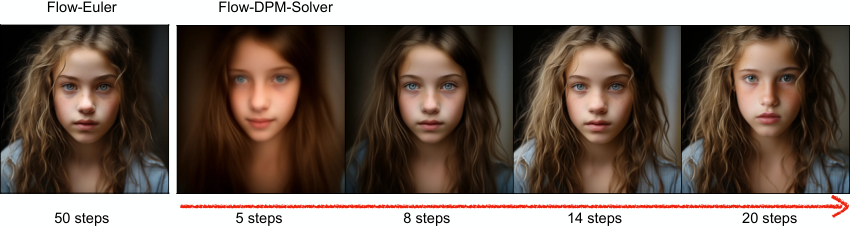

<figcaption>図10: 50 ステップの Flow-Euler サンプラと、5/8/14/20 ステップの Flow-DPM-Solver の視覚的比較。</figcaption>
</figure>

<figure>

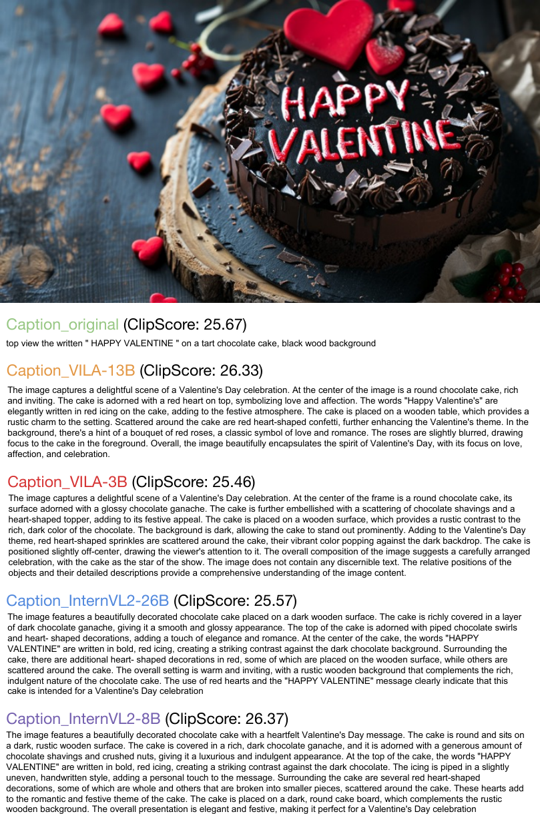

<figcaption>図11: 複数の VLM による画像の再キャプションの図解。</figcaption>
</figure>

<figure>

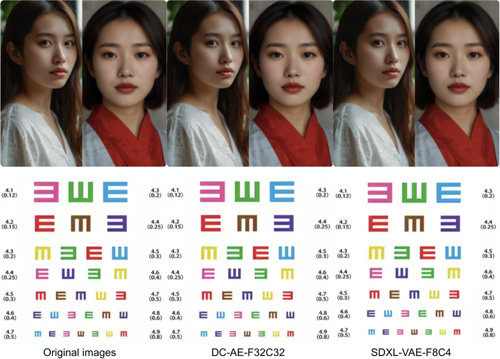

<figcaption>図12: 元の画像、我々の DC-AE-F32C32、SDXL の VAE-F8C4 の比較。</figcaption>
</figure>

**マルチキャプション自動ラベル付けのパイプライン。** 図 11 に、我々の CLIP-Score に基づくマルチキャプション自動ラベル付けのパイプラインの結果を提示する。そこでは各画像が元のプロンプトと、異なる強力な VLM によって生成された 4 つのキャプションと対応づけられている。これらのキャプションは互いを補完し、その変化を通じて意味的整合を高める。

**Triton による学習／推論の加速の詳細。** 本節では Triton を用いたカーネル融合によって学習と推論をどう加速するかを記述する。具体的には、順伝播については ReLU の活性化を QKV 射影の末尾に融合し、精度変換とパディング操作を KV および QKV の乗算の先頭に融合し、除算を QKV 乗算の末尾に融合する。逆伝播については、除算を出力射影の末尾に融合し、精度変換と ReLU の活性化を KV および QKV の乗算の末尾に融合する。

**2K/4K の微調整。** 1K モデルの上に 2K モデルを微調整する際、性能を改善するために**位置符号化（PE）を再導入する**。2K モデルに基づいて 4K モデルを微調整する際は、PixArt-$\Sigma$ で用いられたのと同じ PE の補間戦略を適用する。位置符号化（PE）を加えた学習過程は著しく速く収束し、典型的にはわずか 10K イテレーションの内に収まる。

## Appendix C More Results（さらなる結果）

**オートエンコーダ間の比較。** 図 12 は、元の画像と、2 つの異なるモデル——我々の DC-AE-F32C32 と SDXL の VAE-F8C4——が生成した再構成の視覚的な差異を図解する。どちらのモデルも元の画像とほぼ見分けのつかない再構成を届け、その強力な符号化と復号の能力を示している。

**Sana ブロックのアブレーション。** 表 12 は、異なるブロック設計が性能にどう影響するかを記述する。DiT の自己注意から線形注意へ直接切り替えると FID と Clip Score の性能損失が生じるが、Mix-FFN を加えることが性能の損失を補償できる。Triton のカーネル融合を加えることは、性能に悪影響を与えることなく学習／推論を高速化できる。

**複雑な人間の指示の分析。** CHI の有効性を観察するため、CHI ありとなしのユーザープロンプトを Gemma-2 に入力する。我々は LLM の出力とテキスト埋め込みの品質の間に強い正の相関が存在すると考える。図 13 に示すように、**CHI がないと、Gemma-2 は入力の意味を理解できるものの、出力は会話的になり、ユーザープロンプトそのものの理解に焦点が当たらない**。CHI を加えた後、Gemma-2 の出力はユーザープロンプトの詳細を理解し強化することにより良く焦点を合わせる。

**DPG-Bench・GenEval・ImageReward の詳細な結果。** 主論文の表 7 の拡張として、参考のために GenEval・DPG-Bench・ImageReward のすべての指標の詳細をそれぞれ表 10 と表 11 に示す。

**発見：ゼロショットの言語転移能力。** 図 14 に示すように、Gemma-2 をテキストエンコーダとして用い、中国語／絵文字の表現をテキストプロンプトとして用いると、**我々の Sana も理解して対応する画像を生成できる**ことを発見して驚いた。**学習中は英語以外のプロンプトをすべて除外している**ことに注意されたい。したがって、中国語／絵文字のゼロショット生成能力は Gemma-2 がもたらしたものである。

<figure>

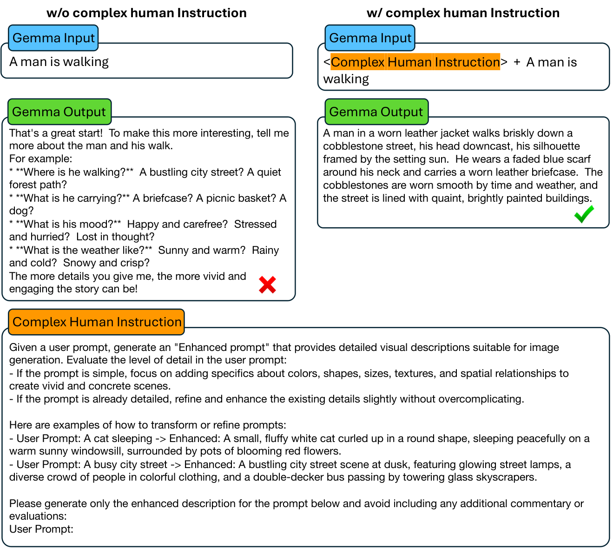

<figcaption>図13: 複雑な人間の指示ありとなしの Gemma-2 の出力の図解、および我々の複雑な人間の指示の全文プロンプト。</figcaption>
</figure>

**表10**: GenEval における SOTA 手法の詳細な比較。総合性能・単一物体・二物体・計数・色・位置・色属性といった異なる指標を含む。

| Model | Params (B) | Overall $\uparrow$ | Single Obj. | Two Obj. | Counting | Colors | Position | Color Attr. |
| --- | --- | --- | --- | --- | --- | --- | --- | --- |
| **512 × 512 解像度** | | | | | | | | |
| PixArt-$\alpha$ | 0.6 | 0.48 | 0.98 | 0.50 | 0.44 | 0.80 | 0.08 | 0.07 |
| PixArt-$\Sigma$ | 0.6 | 0.52 | 0.98 | 0.59 | 0.50 | 0.80 | 0.10 | 0.15 |
| Sana-0.6B (Ours) | 0.6 | 0.64 | 0.99 | 0.71 | 0.63 | 0.91 | 0.16 | 0.42 |
| Sana-1.6B (Ours) | 0.6 | 0.66 | 0.99 | 0.79 | 0.63 | 0.88 | 0.18 | 0.47 |
| **1024 × 1024 解像度** | | | | | | | | |
| LUMINA-Next | 2.0 | 0.46 | 0.92 | 0.46 | 0.48 | 0.70 | 0.09 | 0.13 |
| SDXL | 2.6 | 0.55 | 0.98 | 0.74 | 0.39 | 0.85 | 0.15 | 0.23 |
| PlayGroundv2.5 | 2.6 | 0.56 | 0.98 | 0.77 | 0.52 | 0.84 | 0.11 | 0.17 |
| Hunyuan-DiT | 1.5 | 0.63 | 0.97 | 0.77 | 0.71 | 0.88 | 0.13 | 0.30 |
| DALLE3 | - | 0.67 | 0.96 | 0.87 | 0.47 | 0.83 | 0.43 | 0.45 |
| SD3-medium | 2.0 | 0.62 | 0.98 | 0.74 | 0.63 | 0.67 | 0.34 | 0.36 |
| FLUX-dev | 12.0 | 0.67 | 0.99 | 0.81 | 0.79 | 0.74 | 0.20 | 0.47 |
| FLUX-schnell | 12.0 | 0.71 | 0.99 | 0.92 | 0.73 | 0.78 | 0.28 | 0.54 |
| Sana-0.6B (Ours) | 0.6 | 0.64 | 0.99 | 0.76 | 0.64 | 0.88 | 0.18 | 0.39 |
| Sana-1.6B (Ours) | 1.6 | 0.66 | 0.99 | 0.77 | 0.62 | 0.88 | 0.21 | 0.47 |

**表11**: DPG-Bench と ImageReward における SOTA 手法の詳細な比較。

| Model | Params (B) | Overall $\uparrow$ | Global | Entity | Attribute | Relation | Other | ImageReward $\uparrow$ |
| --- | --- | --- | --- | --- | --- | --- | --- | --- |
| **512 × 512 解像度** | | | | | | | | |
| PixArt-$\alpha$ | 0.6 | 71.6 | 81.7 | 80.1 | 80.4 | 81.7 | 76.5 | 0.92 |
| PixArt-$\Sigma$ | 0.6 | 79.5 | 87.5 | 87.1 | 86.5 | 84.0 | 86.1 | 0.97 |
| Sana-0.6B (Ours) | 0.6 | 84.3 | 82.6 | 90.0 | 88.6 | 90.1 | 91.9 | 0.93 |
| Sana-1.6B (Ours) | 0.6 | 85.5 | 90.3 | 91.2 | 89.0 | 88.9 | 92.0 | 1.04 |
| **1024 × 1024 解像度** | | | | | | | | |
| LUMINA-Next | 2.0 | 74.6 | 82.8 | 88.7 | 86.4 | 80.5 | 81.8 | - |
| SDXL | 2.6 | 74.7 | 83.3 | 82.4 | 80.9 | 86.8 | 80.4 | 0.69 |
| PlayGroundv2.5 | 2.6 | 75.5 | 83.1 | 82.6 | 81.2 | 84.1 | 83.5 | 1.09 |
| Hunyuan-DiT | 1.5 | 78.9 | 84.6 | 80.6 | 88.0 | 74.4 | 86.4 | 0.92 |
| PixArt-$\Sigma$ | 0.6 | 80.5 | 86.9 | 82.9 | 88.9 | 86.6 | 87.7 | 0.87 |
| DALLE3 | - | 83.5 | 91.0 | 89.6 | 88.4 | 90.6 | 89.8 | - |
| SD3-medium | 2.0 | 84.1 | 87.9 | 91.0 | 88.8 | 80.7 | 88.7 | 0.86 |
| FLUX-dev | 12.0 | 84.0 | 82.1 | 89.5 | 88.7 | 91.1 | 89.4 | - |
| FLUX-schnell | 12.0 | 84.8 | 91.2 | 91.3 | 89.7 | 86.5 | 87.0 | 0.91 |
| Sana-0.6B (Ours) | 0.6 | 83.6 | 83.0 | 89.5 | 89.3 | 90.1 | 90.2 | 0.97 |
| Sana-1.6B (Ours) | 1.6 | 84.8 | 86.0 | 91.5 | 88.9 | 91.9 | 90.7 | 0.99 |

<figure>

<figcaption>図14: ゼロショットの言語転移能力の可視化。我々の Sana は学習中に英語のプロンプトしか持たないが、推論時に中国語／絵文字を理解できる。これは Gemma-2 の強力な事前学習がもたらす汎化の恩恵である。</figcaption>
</figure>

**表12**: Sana のブロック設計空間の性能。すべてのモデルを 52K イテレーションの同一の学習設定で学習した。

| Blocks | AE | Res. | FID $\downarrow$ | CLIP $\uparrow$ |
| --- | --- | --- | --- | --- |
| FullAttn & FFN | F8C4P2 | 256 | 18.7 | 24.9 |
| ＋ Linear | F8C4P2 | 256 | 21.5 | 23.3 |
| ＋ MixFFN | F8C4P2 | 256 | 18.9 | 24.8 |
| ＋ Kernel Fusion | F8C4P2 | 256 | 18.8 | 24.8 |
| Linear+GLUMBConv2.5 | F32C32P1 | 512 | 6.4 | 27.4 |
| ＋ Kernel Fusion | F32C32P1 | 512 | 6.4 | 27.4 |

**表13**: 様々な T5 モデルと Gemma モデルの速度とパラメータに基づく比較。系列長（Seq Len）はテキストトークンの数。

| Text Encoder | Batch Size | Seq Len | Latency (s) | Params (M) |
| --- | --- | --- | --- | --- |
| T5-XXL | 32 | 300 | 1.6 | 4762 |
| T5-XL | 32 | 300 | 0.5 | 1224 |
| T5-large | 32 | 300 | 0.2 | 341 |
| T5-base | 32 | 300 | 0.1 | 110 |
| T5-small | 32 | 300 | 0.0 | 35 |
| Gemma-2b | 32 | 300 | 0.2 | 2506 |
| Gemma-2-2b | 32 | 300 | 0.3 | 2614 |

**表14**: 異なる解像度におけるスループットとレイテンシの比較。すべてのモデルは FP16 精度の A100 GPU で試験。

| Methods | Speedup | Throughput (/s) | Latency (ms) | | Methods | Speedup | Throughput (/s) | Latency (ms) |
| --- | --- | --- | --- | --- | --- | --- | --- | --- |
| **512 × 512 解像度** | | | | | **1024 × 1024 解像度** | | | |
| SD3 | 7.6x | 1.14 | 1.4 | | SD3 | 7.0x | 0.28 | 4.4 |
| FLUX-schnell | 10.5x | 1.58 | 0.7 | | FLUX-schnell | 12.5x | 0.50 | 2.1 |
| FLUX-dev | 1.0x | 0.15 | 7.9 | | FLUX-dev | 1.0x | 0.04 | 23 |
| PixArt-$\Sigma$ | 10.3x | 1.54 | 1.2 | | PixArt-$\Sigma$ | 10.0x | 0.40 | 2.7 |
| HunyuanDiT | 1.3x | 0.20 | 5.1 | | HunyuanDiT | 1.2x | 0.05 | 18 |
| Sana-0.6B | 44.5x | 6.67 | 0.8 | | Sana-0.6B | 43.0x | 1.72 | 0.9 |
| Sana-1.6B | 25.6x | 3.84 | 0.6 | | Sana-1.6B | 25.2x | 1.01 | 1.2 |
| **2048 × 2048 解像度** | | | | | **4096 × 4096 解像度** | | | |
| SD3 | 5.0x | 0.04 | 22 | | SD3 | 4.0x | 0.004 | 230 |
| FLUX-schnell | 11.2x | 0.09 | 10.5 | | FLUX-schnell | 13.0x | 0.013 | 76 |
| FLUX-dev | 1.0x | 0.008 | 117 | | FLUX-dev | 1.0x | 0.001 | 1023 |
| PixArt-$\Sigma$ | 7.5x | 0.06 | 18.1 | | PixArt-$\Sigma$ | 5.0x | 0.005 | 186 |
| HunyuanDiT | 1.2x | 0.01 | 96 | | HunyuanDiT | 1.0x | 0.001 | 861 |
| Sana-0.6B | 53.8x | 0.43 | 2.5 | | Sana-0.6B | **104.0x** | 0.104 | 9.6 |
| Sana-1.6B | 31.2x | 0.25 | 4.1 | | Sana-1.6B | 66.0x | 0.066 | 5.9 |

<figure>

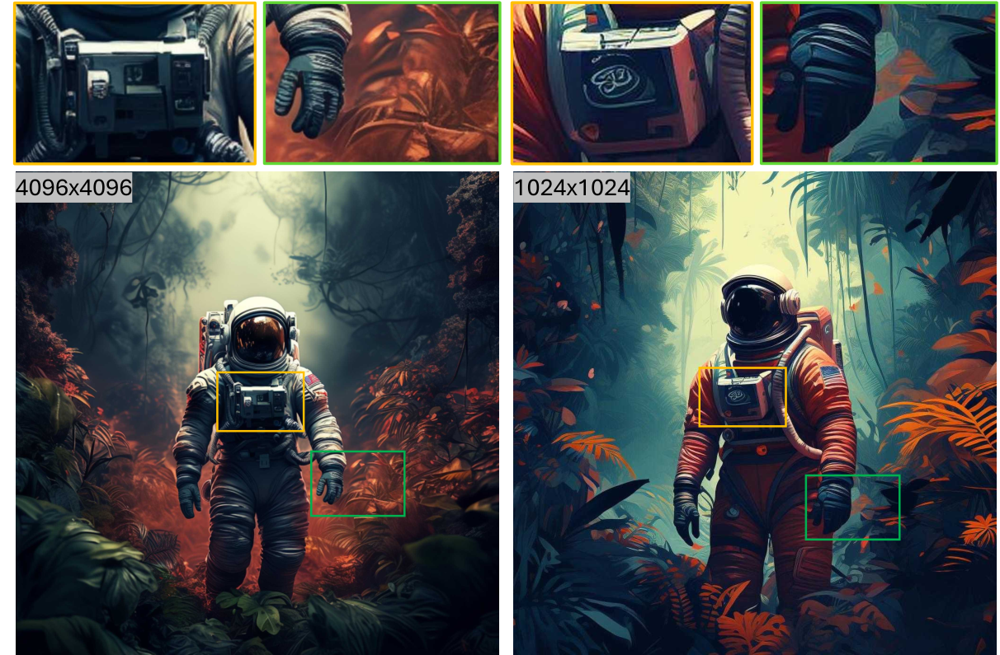

<figcaption>図15: 4K と 1K 解像度の画像の比較。4K 画像がより多くの細部を含むことが分かる。</figcaption>
</figure>

<figure>

<figcaption>図16: Sana から生成されたさらなるサンプル。</figcaption>
</figure>
