# 高解像度画像合成のための Rectified Flow Transformer のスケーリング

> 原題: Scaling Rectified Flow Transformers for High-Resolution Image Synthesis
> 著者: Patrick Esser, Sumith Kulal, Andreas Blattmann, Rahim Entezari, Jonas Müller, Harry Saini, Yam Levi, Dominik Lorenz, Axel Sauer, Frederic Boesel, Dustin Podell, Tim Dockhorn, Zion English, Kyle Lacey, Alex Goodwin, Yannik Marek, Robin Rombach（Stability AI）
> 出典: ICML 2024 ・ arXiv:2403.03206（Stable Diffusion 3）

## Abstract（要旨）

拡散モデルは、データからノイズへの順方向の経路を反転することでノイズからデータを生成し、画像や動画のような高次元の知覚データのための強力な生成モデリング技術として台頭してきた。Rectified flow（整流フロー）は、データとノイズを直線で結ぶ最近の生成モデルの定式化である。より良い理論的性質と概念的な単純さを持つにもかかわらず、まだ標準的な手法として決定的に確立されてはいない。本研究では、rectified flow モデルの学習のための既存のノイズサンプリング技術を、知覚的に関連するスケールに偏らせることで改善する。大規模な研究を通じて、高解像度 text-to-image 合成において、このアプローチが確立された拡散の定式化と比べて優れた性能を持つことを実証する。さらに、text-to-image 生成のための新しい transformer ベースのアーキテクチャを提示する。これは 2 つのモダリティに別々の重みを使い、画像トークンとテキストトークンの間の双方向の情報の流れを可能にし、テキスト理解・タイポグラフィ・人間の選好評価を改善する。我々はこのアーキテクチャが予測可能なスケーリング傾向に従い、低い検証損失が様々な指標と人間評価で測られる改善された text-to-image 合成と相関することを示す。我々の最大のモデルは最先端モデルを上回り、我々は実験データ・コード・モデル重みを公開する。

<figure>


<figcaption>図1: 我々の 8B rectified flow モデルからの高解像度サンプル。タイポグラフィ・正確なプロンプト追従・空間推論・細部への注意・多様なスタイルにわたる高い画質を示す。</figcaption>
</figure>

## 1 はじめに

拡散モデルはノイズからデータを生成する。データからランダムノイズへの順方向の経路を反転するよう学習され、ニューラルネットワークの近似・汎化特性と組み合わせることで、学習データには存在しないが学習データの分布に従う新しいデータ点を生成できる。この生成モデリング技術は、画像のような高次元の知覚データのモデリングに非常に効果的であることが証明されている。近年、拡散モデルは自然言語入力から高解像度の画像・動画を、印象的な汎化能力とともに生成するための事実上の標準アプローチになった。その反復的性質と関連する計算コスト、推論時の長いサンプリング時間のため、これらのモデルのより効率的な学習および／または高速なサンプリングのための定式化の研究が増えている。

データからノイズへの順方向の経路を指定することは効率的な学習につながるが、どの経路を選ぶかという問題も生じる。この選択はサンプリングに重要な含意を持ちうる。例えば、データから全てのノイズを除去しそこなう順過程は、学習分布とテスト分布の不一致を招き、灰色の画像サンプルのようなアーティファクトを生じうる。重要なことに、順過程の選択は学習される逆過程、ひいてはサンプリング効率にも影響する。曲がった経路は過程をシミュレートするのに多くの積分ステップを要するが、直線経路は単一ステップでシミュレートでき、誤差の蓄積も起きにくい。各ステップがニューラルネットの 1 回の評価に対応するので、これはサンプリング速度に直接影響する。

順方向経路の特定の選択肢が、いわゆる **Rectified Flow（整流フロー）** であり、データとノイズを直線で結ぶ。このモデルクラスはより良い理論的性質を持つが、実際にはまだ決定的に確立されてはいない。これまで、小〜中規模の実験でいくつかの利点が経験的に示されてきたが、その多くはクラス条件付きモデルに限られている。本研究では、ノイズ予測型拡散モデルと同様に、rectified flow モデルにおけるノイズスケールの再重み付けを導入することでこれを変える。大規模研究を通じて、我々の新しい定式化を既存の拡散の定式化と比較し、その利点を実証する。

我々は、固定されたテキスト表現をモデルに直接（例えば cross-attention を介して）供給する、text-to-image 合成で広く使われるアプローチが理想的でないことを示し、画像とテキストの両トークンに学習可能なストリームを組み込み、両者の間の双方向の情報の流れを可能にする新しいアーキテクチャを提示する。これを改善した rectified flow 定式化と組み合わせ、そのスケーラビリティを調査する。検証損失に予測可能なスケーリング傾向があり、低い検証損失が自動・人間評価の改善と強く相関することを実証する。

我々の最大のモデルは、*SDXL*・*SDXL-Turbo*・*Pixart-α* のような最先端のオープンモデルや、DALL-E 3 のようなクローズドソースモデルを、プロンプト理解の定量評価と人間の選好評価の両方で上回る。

本研究の中核的貢献は：(i) 最良の設定を特定するため、異なる拡散モデルと rectified flow の定式化について大規模で体系的な研究を行う。この目的のため、rectified flow モデルのための新しいノイズサンプラーを導入し、以前知られていたサンプラーを上回る性能を達成する。(ii) ネットワーク内でテキストと画像のトークンストリームの双方向の混合を可能にする、text-to-image 合成のための新しくスケーラブルなアーキテクチャを考案する。UViT や DiT のような確立されたバックボーンと比べた利点を示す。(iii) 我々のモデルのスケーリング研究を行い、予測可能なスケーリング傾向に従うことを実証する。低い検証損失が T2I-CompBench・GenEval・人間評価で測られる改善された text-to-image 性能と強く相関することを示す。結果・コード・モデル重みを公開する。

## 2 フローのシミュレーション不要学習

我々は、ノイズ分布 $p_{1}$ からのサンプル $x_{1}$ とデータ分布 $p_{0}$ からのサンプル $x_{0}$ の間の写像を、常微分方程式（ODE）の形で定義する生成モデルを考える：

$$
dy_{t}=v_{\Theta}(y_{t},t)\,dt\;,
$$

ここで速度 $v$ はニューラルネットワークの重み $\Theta$ でパラメータ化される。Chen ら [16] の先行研究は、式1 を微分可能な ODE ソルバーで直接解くことを提案した。しかしこの過程は、$v_{\Theta}(y_{t},t)$ をパラメータ化する大きなネットワークアーキテクチャでは特に計算コストが高い。より効率的な代替は、$p_{0}$ と $p_{1}$ の間の確率経路を生成するベクトル場 $u_{t}$ を直接回帰することである。そのような $u_{t}$ を構成するため、$p_{0}$ と $p_{1}=\mathcal{N}(0,1)$ の間の確率経路 $p_{t}$ に対応する順過程を次のように定義する：

$$
z_{t}=a_{t}x_{0}+b_{t}\epsilon\quad\text{where}\;\epsilon\sim\mathcal{N}(0,I)\;.
$$

$a_{0}=1,b_{0}=0,a_{1}=0,b_{1}=1$ のとき、周辺分布

$$
p_{t}(z_{t})=\mathbb{E}_{\epsilon\sim\mathcal{N}(0,I)}p_{t}(z_{t}|\epsilon)\;,
$$

はデータ分布・ノイズ分布と整合する。

$z_{t},x_{0},\epsilon$ の関係を表すため、$\psi_{t}$ と $u_{t}$ を次のように導入する：

$$
\psi_{t}(\cdot|\epsilon):x_{0}\mapsto a_{t}x_{0}+b_{t}\epsilon
$$
$$
u_{t}(z|\epsilon):=\psi^{\prime}_{t}(\psi_{t}^{-1}(z|\epsilon)|\epsilon)
$$

$z_{t}$ は初期値 $z_{0}=x_{0}$ を持つ ODE $z_{t}^{\prime}=u_{t}(z_{t}|\epsilon)$ の解として書けるので、$u_{t}(\cdot|\epsilon)$ は $p_{t}(\cdot|\epsilon)$ を生成する。注目すべきことに、条件付きベクトル場 $u_{t}(\cdot|\epsilon)$ を用いて、周辺確率経路 $p_{t}$ を生成する周辺ベクトル場 $u_{t}$ を構成できる（B.1 参照）：

$$
u_{t}(z)=\mathbb{E}_{\epsilon\sim\mathcal{N}(0,I)}u_{t}(z|\epsilon)\frac{p_{t}(z|\epsilon)}{p_{t}(z)}
$$

$u_{t}$ を **Flow Matching（フローマッチング）** の目的

$$
\mathcal{L}_{FM}=\mathbb{E}_{t,p_{t}(z)}||v_{\Theta}(z,t)-u_{t}(z)||_{2}^{2}.
$$

で直接回帰することは、式6 の周辺化のため扱いにくいが、**Conditional Flow Matching（条件付きフローマッチング）**（B.1 参照）

$$
\mathcal{L}_{CFM}=\mathbb{E}_{t,p_{t}(z|\epsilon),p(\epsilon)}||v_{\Theta}(z,t)-u_{t}(z|\epsilon)||_{2}^{2}\;,
$$

は、条件付きベクトル場 $u_{t}(z|\epsilon)$ を用いることで、等価でありながら扱いやすい目的を提供する。

損失を明示的な形に変換するため、$\psi_{t}^{\prime}(x_{0}|\epsilon)=a_{t}^{\prime}x_{0}+b_{t}^{\prime}\epsilon$ と $\psi_{t}^{-1}(z|\epsilon)=\frac{z-b_{t}\epsilon}{a_{t}}$ を式(5) に代入する：

$$
z_{t}^{\prime}=u_{t}(z_{t}|\epsilon)=\frac{a_{t}^{\prime}}{a_{t}}z_{t}-\epsilon b_{t}(\frac{a_{t}^{\prime}}{a_{t}}-\frac{b_{t}^{\prime}}{b_{t}})\;.
$$

ここで、**信号対雑音比（signal-to-noise ratio, SNR）** $\lambda_{t}:=\log\frac{a_{t}^{2}}{b_{t}^{2}}$ を考える。$\lambda_{t}^{\prime}=2(\frac{a_{t}^{\prime}}{a_{t}}-\frac{b_{t}^{\prime}}{b_{t}})$ より、式9 を次のように書き直せる：

$$
u_{t}(z_{t}|\epsilon)=\frac{a_{t}^{\prime}}{a_{t}}z_{t}-\frac{b_{t}}{2}\lambda_{t}^{\prime}\epsilon
$$

次に、式10 を使って式8 をノイズ予測の目的として再パラメータ化する：

$$
\mathcal{L}_{CFM}=\mathbb{E}_{t,p_{t}(z|\epsilon),p(\epsilon)}||v_{\Theta}(z,t)-\frac{a_{t}^{\prime}}{a_{t}}z+\frac{b_{t}}{2}\lambda_{t}^{\prime}\epsilon||_{2}^{2}
$$
$$
=\mathbb{E}_{t,p_{t}(z|\epsilon),p(\epsilon)}\left(-\frac{b_{t}}{2}\lambda_{t}^{\prime}\right)^{2}||\epsilon_{\Theta}(z,t)-\epsilon||_{2}^{2}
$$

ここで $\epsilon_{\Theta}:=\frac{-2}{\lambda_{t}^{\prime}b_{t}}(v_{\Theta}-\frac{a_{t}^{\prime}}{a_{t}}z)$ と定義した。

なお、時間依存の重み付けを導入しても上の目的の最適解は変わらない。したがって、所望の解への信号を与えつつ最適化軌道に影響しうる様々な重み付き損失関数を導出できる。古典的な拡散の定式化を含む異なるアプローチの統一的分析のため、目的を次の形で書ける（Kingma & Gao [41] に従う）：

$$
\mathcal{L}_{w}(x_{0})=-\frac{1}{2}\mathbb{E}_{t\sim\mathcal{U}(t),\epsilon\sim\mathcal{N}(0,I)}\left[w_{t}\lambda_{t}^{\prime}\|\epsilon_{\Theta}(z_{t},t)-\epsilon\|^{2}\right]\;,
$$

ここで $w_{t}=-\frac{1}{2}\lambda_{t}^{\prime}b_{t}^{2}$ が $\mathcal{L}_{CFM}$ に対応する。

## 3 フロー軌道

本研究では、上の形式の異なる変種を考える。以下に簡潔に説明する。

##### Rectified Flow

Rectified Flow（RF）は、順過程をデータ分布と標準正規分布の間の直線経路として定義する。すなわち

$$
z_{t}=(1-t)x_{0}+t\epsilon\;,
$$

であり、$\mathcal{L}_{CFM}$ を用いる。これは $w_{t}^{\text{RF}}=\frac{t}{1-t}$ に対応する。ネットワーク出力は速度 $v_{\Theta}$ を直接パラメータ化する。

##### EDM

EDM は次の形の順過程を用いる

$$
z_{t}=x_{0}+b_{t}\epsilon
$$

ここで $b_{t}=\exp{F_{\mathcal{N}}^{-1}(t|P_{m},P_{s}^{2})}$、$F_{\mathcal{N}}^{-1}$ は平均 $P_{m}$・分散 $P_{s}^{2}$ の正規分布の分位関数。この選択は次を生む

$$
\lambda_{t}\sim\mathcal{N}(-2P_{m},(2P_{s})^{2})\quad\text{for}\;t\sim\mathcal{U}(0,1)
$$

ネットワークは F-prediction でパラメータ化され、損失は $\mathcal{L}_{w_{t}^{\text{EDM}}}$ と書け、

$$
w_{t}^{\text{EDM}}=\mathcal{N}(\lambda_{t}|-2P_{m},(2P_{s})^{2})(e^{-\lambda_{t}}+0.5^{2})
$$

##### Cosine

Nichol & Dhariwal [53] は次の形の順過程を提案した

$$
z_{t}=\cos\bigl{(}\frac{\pi}{2}t\bigr{)}x_{0}+\sin\bigl{(}\frac{\pi}{2}t\bigr{)}\epsilon\;.
$$

$\epsilon$ パラメータ化と損失と組み合わせると、これは重み付け $w_{t}=\operatorname{sech}(\lambda_{t}/2)$ に対応する。v-prediction 損失と組み合わせると、重み付けは $w_{t}=e^{-\lambda_{t}/2}$ で与えられる。

##### (LDM-)Linear

LDM は DDPM スケジュールの修正版を用いる。両者とも分散保存（variance preserving）スケジュールで、$b_{t}=\sqrt{1-a_{t}^{2}}$ であり、離散時刻 $t=0,\dots,T-1$ の $a_{t}$ を拡散係数 $\beta_{t}$ で $a_{t}=(\prod_{s=0}^{t}(1-\beta_{s}))^{\frac{1}{2}}$ と定義する。境界値 $\beta_{0}$ と $\beta_{T-1}$ に対し、DDPM は $\beta_{t}=\beta_{0}+\frac{t}{T-1}(\beta_{T-1}-\beta_{0})$、LDM は $\beta_{t}=\left(\sqrt{\beta_{0}}+\frac{t}{T-1}(\sqrt{\beta_{T-1}}-\sqrt{\beta_{0}})\right)^{2}$ を用いる。

### 3.1 RF モデルのための調整された SNR サンプラー

RF 損失は速度 $v_{\Theta}$ を $[0,1]$ の全時刻で一様に学習する。しかし直感的には、結果の速度予測目標 $\epsilon-x_{0}$ は $[0,1]$ の中間の $t$ でより難しい。なぜなら $t=0$ では最適予測は $p_{1}$ の平均、$t=1$ では最適予測は $p_{0}$ の平均だからである。一般に、$t$ 上の分布を一般的に用いられる一様分布 $\mathcal{U}(t)$ から密度 $\pi(t)$ を持つ分布に変えることは、次の重み付き損失 $\mathcal{L}_{w_{t}^{\pi}}$ と等価である：

$$
w_{t}^{\pi}=\frac{t}{1-t}\pi(t)
$$

したがって、中間の時刻をより頻繁にサンプリングすることでそれらにより多くの重みを与えることを目指す。次に、モデルの学習に用いる時刻密度 $\pi(t)$ を説明する。

##### Logit-Normal サンプリング

中間ステップにより多くの重みを置く分布の 1 つの選択肢は logit-normal 分布である。その密度は

$$
\pi_{\text{ln}}(t;m,s)=\frac{1}{s\sqrt{2\pi}}\frac{1}{t(1-t)}\exp\Bigl{(}-\frac{(\text{logit}(t)-m)^{2}}{2s^{2}}\Bigr{)},
$$

ここで $\text{logit}(t)=\log\frac{t}{1-t}$、位置パラメータ $m$ とスケールパラメータ $s$ を持つ。位置パラメータは学習時刻をデータ $p_{0}$ 側（負の $m$）かノイズ $p_{1}$ 側（正の $m$）に偏らせることを可能にする。図11 のように、スケールパラメータは分布の幅を制御する。

実際には、正規分布 $u\sim\mathcal{N}(u;m,s)$ から確率変数 $u$ をサンプルし、標準ロジスティック関数を通して写像する。

##### 重い裾を持つ Mode サンプリング

logit-normal 密度は端点 $0$ と $1$ で常に消失する。これが性能に悪影響を及ぼすか調べるため、$[0,1]$ 上で厳密に正の密度を持つ時刻サンプリング分布も用いる。スケールパラメータ $s$ に対し、次を定義する

$$
f_{\text{mode}}(u;s)=1-u-s\cdot\Bigl{(}\cos^{2}\bigl{(}\frac{\pi}{2}u\bigr{)}-1+u\Bigr{)}.
$$

$-1\leq s\leq\frac{2}{\pi-2}$ のとき、この関数は単調であり、含意される密度 $\pi_{\text{mode}}(t;s)=\left|\frac{d}{dt}f_{\text{mode}}^{-1}(t)\right|$ からサンプルするのに使える。図11 のように、スケールパラメータは中点（正の $s$）と端点（負の $s$）のどちらをサンプリング時に優遇するかの度合いを制御する。この定式化は $s=0$ で一様重み付け $\pi_{\text{mode}}(t;s=0)=\mathcal{U}(t)$ も含み、これは Rectified Flow の先行研究で広く使われてきた。

##### CosMap

最後に、§3 の *cosine* スケジュールを RF 設定でも考える。特に、log-SNR が cosine スケジュールのものと一致するような写像 $f:u\mapsto f(u)=t,\;u\in[0,1]$ を探す：$2\log\frac{\cos(\frac{\pi}{2}u)}{\sin(\frac{\pi}{2}u)}=2\log\frac{1-f(u)}{f(u)}$。$f$ について解くと、$u\sim\mathcal{U}(u)$ に対し

$$
t=f(u)=1-\frac{1}{\tan(\frac{\pi}{2}u)+1},
$$

を得て、そこから密度

$$
\pi_{\text{CosMap}}(t)=\left|\frac{d}{dt}f^{-1}(t)\right|=\frac{2}{\pi-2\pi t+2\pi t^{2}}.
$$

を得る。

## 4 Text-to-Image アーキテクチャ

<figure>


<figcaption>図2(a): モデルアーキテクチャ全体の概観。事前学習済みオートエンコーダの潜在に作用する拡散バックボーン。キャプションは CLIP と T5 で符号化され、pooled ベクトル c_vec が時刻 t とともに変調機構（modulation）へ、系列表現 c_ctxt がトークン列として供給される。</figcaption>
</figure>

<figure>


<figcaption>図2(b): 1 つの MM-DiT ブロック。テキストと画像の 2 モダリティに別々の重みを使い（実質的に各モダリティに独立な transformer）、attention 演算でのみ両モダリティの系列を結合する。各ストリームは adaLN 風の変調を受け、Q・K に RMS-Norm を加えると学習が安定する。連結を ⊙、要素ごとの積を * で示す。</figcaption>
</figure>

テキスト条件付きの画像サンプリングのため、我々のモデルはテキストと画像の両モダリティを考慮しなければならない。我々は事前学習済みモデルを使って適切な表現を導出し、それから拡散バックボーンのアーキテクチャを説明する。概観は図2 に示す。

我々の全体的な設定は、事前学習済みオートエンコーダの潜在空間で text-to-image モデルを学習する LDM に従う。画像を潜在表現に符号化するのと同様に、テキスト条件 $c$ も事前学習済みの凍結テキストモデルで符号化する。詳細は §B.2。

**マルチモーダル拡散バックボーン。** 我々のアーキテクチャは DiT アーキテクチャの上に築かれる。DiT はクラス条件付き画像生成のみを考え、拡散過程の時刻とクラスラベルの両方でネットワークを条件付けるために変調（modulation）機構を使う。同様に、我々は時刻 $t$ と $c_{\text{vec}}$ の埋め込みを変調機構の入力として使う。しかし、pooled テキスト表現はテキスト入力の粗い情報しか保持しないので、ネットワークは系列表現 $c_{\text{ctxt}}$ からの情報も必要とする。

我々はテキストと画像の入力の埋め込みからなる系列を構成する。具体的には、位置エンコーディングを加え、潜在ピクセル表現 $x\in\mathbb{R}^{h\times w\times c}$ の $2\times 2$ パッチを長さ $\frac{1}{2}h\cdot\frac{1}{2}w$ のパッチ符号化系列に平坦化する。このパッチ符号化とテキスト符号化 $c_{\text{ctxt}}$ を共通の次元に埋め込んだ後、2 つの系列を連結する。それから DiT に従い、変調された attention と MLP の系列を適用する。

テキストと画像の埋め込みは概念的にかなり異なるので、2 つのモダリティに別々の重みの組を使う。図2(b) のように、これは各モダリティに独立な 2 つの transformer を持つことと等価だが、attention 演算では 2 モダリティの系列を結合する。これにより両表現は自分の空間で動作しつつ、もう一方を考慮できる。

スケーリング実験では、モデルのサイズを深さ $d$（attention ブロック数）でパラメータ化し、隠れ次元を $64\cdot d$（MLP ブロックでは $4\cdot 64\cdot d$ チャネルに拡張）、attention ヘッド数を $d$ に等しく設定する。

## 5 実験

**表1**: 変種の大域ランキング。EMA・非 EMA 重み、2 データセット、異なるサンプリング設定にわたって平均した非優越ソート（non-dominated sorting）を適用。

| variant | all | 5 steps | 50 steps |
| --- | --- | --- | --- |
| rf/lognorm(0.00, 1.00) | 1.54 | 1.25 | 1.50 |
| rf/lognorm(1.00, 0.60) | 2.08 | 3.50 | 2.00 |
| rf/lognorm(0.50, 0.60) | 2.71 | 8.50 | 1.00 |
| rf/mode(1.29) | 2.75 | 3.25 | 3.00 |
| rf/lognorm(0.50, 1.00) | 2.83 | 1.50 | 2.50 |
| eps/linear | 2.88 | 4.25 | 2.75 |
| rf/mode(1.75) | 3.33 | 2.75 | 2.75 |
| rf/cosmap | 4.13 | 3.75 | 4.00 |
| edm(0.00, 0.60) | 5.63 | 13.25 | 3.25 |
| rf | 5.67 | 6.50 | 5.75 |
| v/linear | 6.83 | 5.75 | 7.75 |
| edm(0.60, 1.20) | 9.00 | 13.00 | 9.00 |
| v/cos | 9.17 | 12.25 | 8.75 |
| edm/cos | 11.04 | 14.25 | 11.25 |
| edm/rf | 13.04 | 15.25 | 13.25 |
| edm(-1.20, 1.20) | 15.58 | 20.25 | 15.00 |

**表2**: 異なる変種の指標。25 サンプリングステップでの異なる変種の FID と CLIP スコア。

| variant | ImageNet CLIP | ImageNet FID | CC12M CLIP | CC12M FID |
| --- | --- | --- | --- | --- |
| rf | 0.247 | 49.70 | 0.217 | 94.90 |
| edm(-1.20, 1.20) | 0.236 | 63.12 | 0.200 | 116.60 |
| eps/linear | 0.245 | 48.42 | 0.222 | 90.34 |
| v/cos | 0.244 | 50.74 | 0.209 | 97.87 |
| v/linear | 0.246 | 51.68 | 0.217 | 100.76 |
| rf/lognorm(0.50, 0.60) | 0.256 | 80.41 | 0.233 | 120.84 |
| rf/mode(1.75) | 0.253 | 44.39 | 0.218 | 94.06 |
| rf/lognorm(1.00, 0.60) | 0.254 | 114.26 | 0.234 | 147.69 |
| rf/lognorm(-0.50, 1.00) | 0.248 | 45.64 | 0.219 | 89.70 |
| rf/lognorm(0.00, 1.00) | 0.250 | 45.78 | 0.224 | 89.91 |

### 5.1 Rectified Flow の改善

我々は、式1 のような正規化フローのシミュレーション不要学習のアプローチのうち、どれが最も効率的かを理解することを目指す。異なるアプローチ間の比較を可能にするため、最適化アルゴリズム・モデルアーキテクチャ・データセット・サンプラーを統制する。加えて、異なるアプローチの損失は比較不能であり、出力サンプルの品質と必ずしも相関しない。したがってアプローチ間の比較を可能にする評価指標が必要である。ImageNet と CC12M でモデルを学習し、学習重みと EMA 重みの両方を、検証損失・CLIP スコア・FID で異なるサンプラー設定（異なるガイダンススケールとサンプリングステップ）で評価する。FID は Sauer ら [71] が提案した CLIP 特徴上で計算する。全指標は COCO-2014 検証分割で評価する。学習・サンプリングのハイパーパラメータの詳細は §B.3。

#### 5.1.1 結果

我々は 61 の異なる定式化を 2 つのデータセットで学習する。§3 から次の変種を含める：

- linear（eps/linear, v/linear）と cosine（eps/cos, v/cos）スケジュールでの $\epsilon$- と v-prediction 損失。
- $\pi_{\text{mode}}(t;s)$（rf/mode(s)）の RF 損失。$s$ を $-1$ と $1.75$ の間に一様に 7 値、加えて $s=1.0$ と $s=0$（一様時刻サンプリング rf/mode に対応）。
- $\pi_{\text{ln}}(t;m,s)$（rf/lognorm(m, s)）の RF 損失。$m$ を $-1$〜$1$、$s$ を $0.2$〜$2.2$ のグリッドで 30 値。
- $\pi_{\text{CosMap}}(t)$（rf/cosmap）の RF 損失。
- EDM（edm($P_{m},P_{s}$)）。$P_{m}$ を $-1.2$〜$1.2$、$P_{s}$ を $0.6$〜$1.8$ で 15 値。$(P_{m},P_{s})=(-1.2,1.2)$ が Karras ら [39] のパラメータに対応。
- log-SNR 重み付けが rf と一致する EDM（edm/rf）、v/cos と一致する EDM（edm/cos）。

各実行で、EMA 重みで評価したとき検証損失が最小のステップを選び、それから 6 つの異なるサンプラー設定で得た CLIP スコアと FID を EMA 重みあり・なしの両方で収集する。

サンプラー設定・EMA 重み・データセット選択の全 24 組合せで、非優越ソートアルゴリズムを使って異なる定式化をランク付けする。CLIP と FID に従って Pareto 最適な変種を繰り返し計算し、それらに現在の反復インデックスを割り当て、それらを除去して残りを続け、全変種がランク付けされるまで行う。最後にこれらのランクを 24 の統制設定で平均する。

結果を表1 に示す。異なるハイパーパラメータで評価した変種については上位 2 つのみ示す。5 ステップと 50 ステップのサンプラー設定に制限して平均したランクも示す。

rf/lognorm(0.00, 1.00) が一貫して良いランクを達成することを観察する。一様時刻サンプリングの rectified flow 定式化（rf）を上回り、中間時刻がより重要という我々の仮説を確認する。全変種の中で、*修正された時刻サンプリングを持つ rectified flow 定式化のみ*が、以前用いられた LDM-Linear 定式化（eps/linear）を上回る。

一部の変種はある設定では良いが他では悪いことも観察する。例えば rf/lognorm(0.50, 0.60) は 50 サンプリングステップで最良の変種だが、5 ステップでは遥かに悪い（平均ランク 8.5）。表2 で 2 指標に関して同様の挙動を観察する。最初のグループは代表的変種とその両データセットでの 25 ステップでの指標を示す。次のグループは最良の CLIP・FID スコアを達成する変種を示す。rf/mode(1.75) を除き、これらの変種は通常 1 つの指標では非常に良いが他では比較的悪い。対照的に、rf/lognorm(0.00, 1.00) は指標とデータセットを通じて良い性能を達成し、4 回中 2 回で 3 番目、1 回で 2 番目の性能を得る。

最後に、図3 で異なる定式化の定性的挙動を、定式化のグループ（edm, rf, eps, v）ごとに異なる色で示す。Rectified flow の定式化は一般に良く機能し、他の定式化と比べてサンプリングステップ数を減らしたときの性能低下が小さい。

<figure>

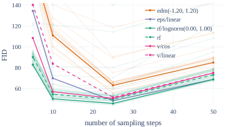

<figcaption>図3: Rectified flow はサンプル効率が良い。少ステップでサンプリングするとき Rectified Flow は他の定式化より良い。25 ステップ以上では rf/lognorm(0.00, 1.00) のみが eps/linear に対抗できる。</figcaption>
</figure>

### 5.2 モダリティ固有表現の改善

前節で、rectified flow モデルが LDM-Linear や EDM のような確立された拡散の定式化と競うだけでなくそれらを上回ることを可能にする定式化を見つけたので、次にこの定式化を高解像度 text-to-image 合成へ応用する。したがって、我々のアルゴリズムの最終性能は学習の定式化だけでなく、ニューラルネットを介したパラメータ化と、用いる画像・テキスト表現の質にも依存する。以下の節で、§5.3 で最終手法をスケールする前に、これら全構成要素をどう改善するか説明する。

#### 5.2.1 改善されたオートエンコーダ

潜在拡散モデルは、入力 RGB $X\in\mathbb{R}^{H\times W\times 3}$ をより低次元の空間 $x=E(X)\in\mathbb{R}^{h\times w\times d}$ に写す事前学習済みオートエンコーダの潜在空間で動作することで高効率を達成する。このオートエンコーダの再構成品質は、潜在拡散学習後に達成可能な画質の上界を与える。Dai ら [18] と同様に、潜在チャネル数 $d$ を増やすと再構成性能が大きく向上することを見出す（表3）。直感的に、より高い $d$ の潜在を予測するのはより難しいタスクなので、容量を増やしたモデルはより大きな $d$ でより良く機能でき、最終的により高い画質を達成する。図10 でこの仮説を確認し、$d=16$ のオートエンコーダがサンプル FID の点でより良いスケーリング性能を示す。したがって本論文の残りでは $d=16$ を選ぶ。

**表3**: 改善されたオートエンコーダ。異なるチャネル構成の再構成性能指標。全モデルのダウンサンプリング係数は $f=8$。

| Metric | 4 chn | 8 chn | 16 chn |
| --- | --- | --- | --- |
| FID ($\downarrow$) | 2.41 | 1.56 | 1.06 |
| Perceptual Similarity ($\downarrow$) | 0.85 | 0.68 | 0.45 |
| SSIM ($\uparrow$) | 0.75 | 0.79 | 0.86 |
| PSNR ($\uparrow$) | 25.12 | 26.40 | 28.62 |

<figure>


<figcaption>サンプル: 「a space elevator, cinematic scifi art」（宇宙エレベーター、映画的 SF アート）。</figcaption>
</figure>

#### 5.2.2 改善されたキャプション

Betker ら [7]（DALL-E 3）は、合成的に生成されたキャプションが大規模学習の text-to-image モデルを大きく改善できることを実証した。これは、大規模画像データセットに付属する人手キャプションがしばしば単純で、画像の被写体に過度に焦点を当て、背景やシーンの構成、表示テキストの記述を通常省くためである。我々は彼らのアプローチに従い、既製の最先端の視覚言語モデル *CogVLM* を使って大規模画像データセットの合成注釈を作る。合成キャプションは VLM の知識コーパスにない概念を text-to-image モデルが忘れさせうるので、元のキャプションと合成キャプションの 50:50 の比率を使う。

このキャプション混合での学習の効果を評価するため、2 つの $d=15$ *MM-DiT* モデルを 250k ステップ学習する。1 つは元キャプションのみ、もう 1 つは 50/50 混合。学習済みモデルを GenEval ベンチマークで評価する（表4）。結果は、合成キャプションを加えて学習したモデルが元キャプションのみのモデルを明確に上回ることを示す。したがって本研究の残りで 50/50 合成/元キャプション混合を使う。

**表4**: 改善されたキャプション。合成（CogVLM 経由）と元のキャプションの 50/50 混合比を使うと text-to-image 性能が改善する。GenEval ベンチマークで評価。

|  | Original Captions success rate [%] | 50/50 Mix success rate [%] |
| --- | --- | --- |
| Color Attribution | 11.75 | 24.75 |
| Colors | 71.54 | 68.09 |
| Position | 6.50 | 18.00 |
| Counting | 33.44 | 41.56 |
| Single Object | 95.00 | 93.75 |
| Two Objects | 41.41 | 52.53 |
| Overall score | 43.27 | 49.78 |

#### 5.2.3 改善された Text-to-Image バックボーン

本節では、既存の transformer ベース拡散バックボーンと、§4 で導入した我々の新しいマルチモーダル transformer ベース拡散バックボーン *MM-DiT* の性能を比較する。*MM-DiT* は異なるドメイン（ここではテキストと画像トークン）を、(2 つの) 異なる学習可能モデル重みの組で扱うよう特に設計されている。具体的には、§5.1 の実験設定に従い、CC12M で DiT・CrossDiT（DiT だが系列連結の代わりにテキストトークンへ cross-attend）・我々の *MM-DiT* の text-to-image 性能を比較する。*MM-DiT* については、2 組の重みと 3 組の重みのモデルを比較する。後者は CLIP と T5 トークンを別々に扱う。なお DiT（§4 のようにテキスト・画像トークンを連結）は、全モダリティに 1 つの共有重みを持つ *MM-DiT* の特殊ケースと解釈できる。最後に、広く使われる UNet と transformer 変種のハイブリッドとして UViT アーキテクチャを考える。

図4 でこれらのアーキテクチャの収束挙動を分析する：vanilla DiT は UViT を下回る。cross-attention DiT 変種 CrossDiT は UViT より良い性能を達成するが、UViT は初期にはるかに速く学習するように見える。我々の *MM-DiT* 変種は cross-attention と vanilla 変種を有意に上回る。3 つのパラメータ組を 2 つの代わりに使うとわずかな利得しか得られない（パラメータ数と VRAM 使用の増加を代償に）ので、本研究の残りでは前者を選ぶ。

<figure>

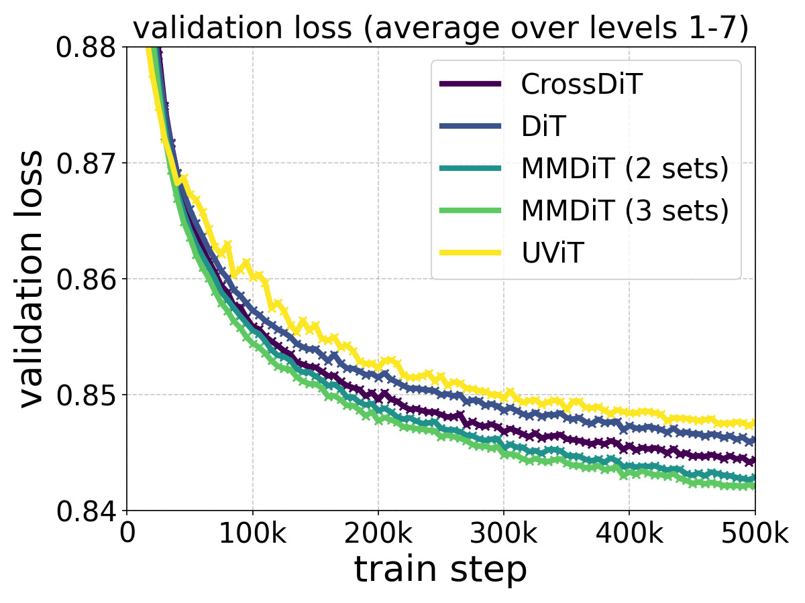

<figcaption>図4: モデルアーキテクチャの学習ダイナミクス。CC12M での DiT・CrossDiT・UViT・MM-DiT の比較分析（検証損失・CLIP スコア・FID）。提案手法は全指標で好成績。</figcaption>
</figure>

### 5.3 スケールでの学習

スケールアップ前に、安全で効率的な事前学習のためデータをフィルタ・事前符号化する。それから、拡散の定式化・アーキテクチャ・データの全考察が最終節に結実し、モデルを 8B パラメータまでスケールする。

#### 5.3.1 データ前処理

##### 事前学習時の緩和策

学習データは生成モデルの能力に大きく影響する。したがってデータフィルタリングは望ましくない能力を制約するのに効果的である。スケールでの学習前に、次のカテゴリでデータをフィルタする：(i) 性的内容：NSFW 検出モデルで露骨な内容をフィルタ。(ii) 美的：評価システムが低スコアを予測する画像を除去。(iii) Regurgitation（再生）：クラスタベースの重複除去法で知覚的・意味的重複を除去（§E.2）。

##### 画像・テキスト埋め込みの事前計算

我々のモデルは複数の事前学習済み凍結ネットワークの出力（オートエンコーダ潜在とテキストエンコーダ表現）を入力に使う。これらの出力は学習中一定なので、データセット全体で一度事前計算する。詳細は §E.1。

#### 5.3.2 高解像度でのファインチューニング

<figure>

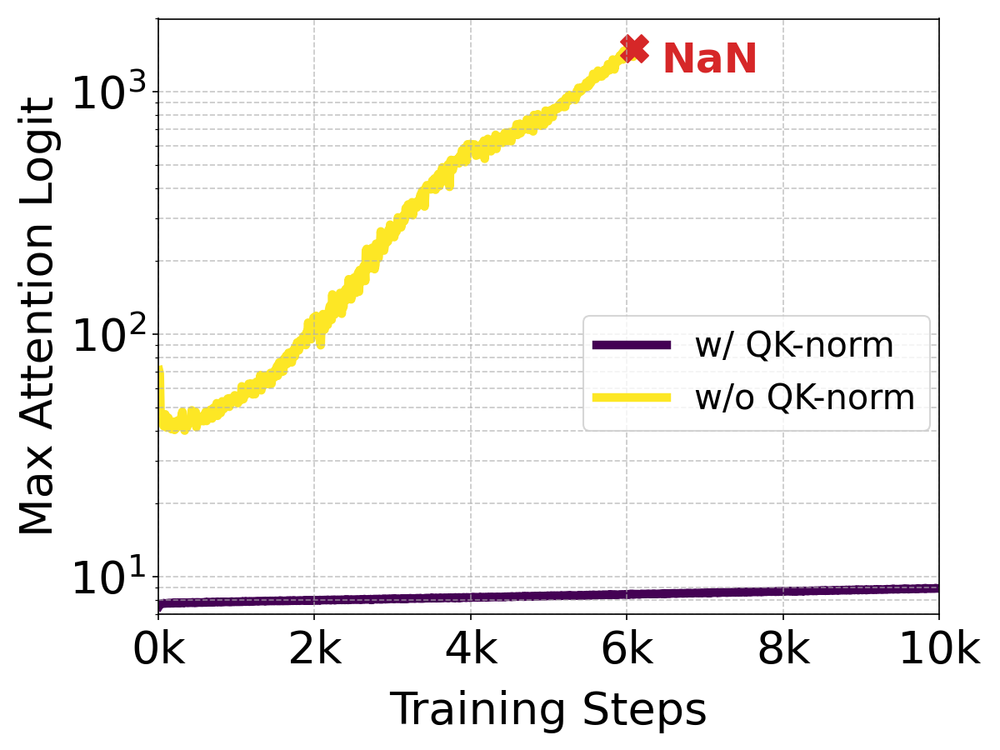

<figcaption>図5: QK-normalization の効果。attention 行列計算前に Q・K 埋め込みを正規化すると、attention-logit 増大不安定性（左）を防ぐ。これは attention エントロピーの崩壊（右）を引き起こし、識別的 ViT の文献で報告されていた。これら先行研究と異なり、我々はこの不安定性をネットワークの最後の transformer ブロックで観察する。最大 attention logit と attention エントロピーは 2B（d=24）モデルの最後の 5 ブロックで平均。</figcaption>
</figure>

##### QK-Normalization

一般に、全モデルを $256^{2}$ ピクセルの低解像度画像で事前学習する。次に、混合アスペクト比のより高い解像度でファインチューンする。高解像度に移ると mixed precision 学習が不安定になり損失が発散しうることを見出す。これは full precision 学習に切り替えることで改善できるが、mixed-precision 学習比 $\sim 2\times$ の性能低下を伴う。より効率的な代替が（識別的）ViT 文献で報告されている：Dehghani ら [20] は、大きな vision transformer モデルの学習が attention エントロピーの制御不能な増大により発散することを観察した。これを避けるため、[20] は attention 演算前に Q と K を正規化することを提案する。我々はこのアプローチに従い、MMDiT アーキテクチャの両ストリームで学習可能スケール付きの RMSNorm を使う（図2）。図5 のように、追加の正規化は attention logit 増大不安定性を防ぎ、AdamW optimizer で $\epsilon=10^{-15}$ と組み合わせると bf16-mixed 精度での効率的な学習を可能にする。この技術は、事前学習中に qk-normalization を使わなかった事前学習済みモデルにも適用できる。モデルは追加の正規化層に素早く適応し、より安定に学習する。最後に、この方法は一般に大きなモデルの学習を安定化するのに役立つが、万能のレシピではなく、正確な学習設定に応じて適応が必要かもしれない点を指摘する。

##### 可変アスペクト比のための位置エンコーディング

固定 $256\times 256$ 解像度で学習した後、(i) 解像度を上げ、(ii) 柔軟なアスペクト比での推論を可能にすることを目指す。2D 位置周波数埋め込みを使うので、解像度に基づいてそれらを適応させる必要がある。マルチアスペクト比設定では、埋め込みの直接補間は辺の長さを正しく反映しない。代わりに、拡張・補間された位置グリッドの組合せを使い、続いて周波数埋め込みする。

目標解像度 $S^{2}$ ピクセルに対し、各バッチが均一サイズ $H\times W$（$H\cdot W\approx S^{2}$）の画像からなるよう bucketed サンプリングを使う。最大・最小学習アスペクト比に対し、これは遭遇する幅 $W_{\text{max}}$・高さ $H_{\text{max}}$ の最大値を生む。$h_{\text{max}}=H_{\text{max}}/16,w_{\text{max}}=W_{\text{max}}/16,s=S/16$ をパッチ化（係数 2）後の潜在空間（係数 8）の対応サイズとする。これらの値に基づき、値 $((p-\frac{h_{\text{max}}-s}{2})\cdot\frac{256}{S})_{p=0}^{h_{\text{max}}-1}$ を持つ垂直位置グリッドを構成し、水平位置も同様にする。それから埋め込み前に、結果の 2D 位置グリッドから中央クロップする。

<figure>

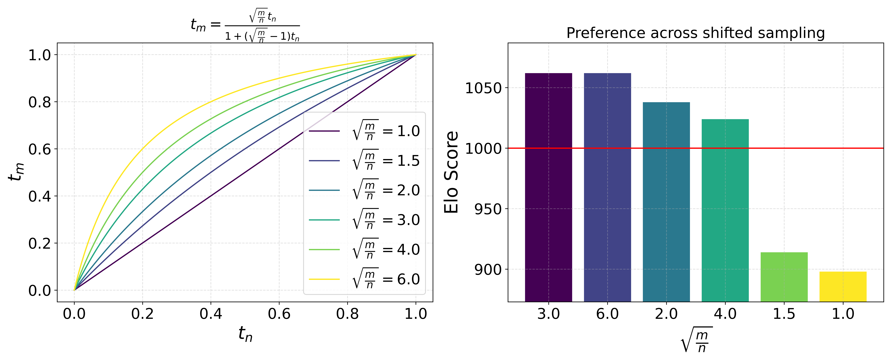

<figcaption>図6: 高解像度での時刻シフト。右上：式23 に基づくシフト適用時の人間の品質選好評価。下段：√(m/n)=1.0（上）と √(m/n)=3.0（下）で学習・サンプリングした 512² モデル。§5.3.2 参照。</figcaption>
</figure>

##### 時刻スケジュールの解像度依存シフト

直感的に、高解像度はより多くのピクセルを持つので、その信号を破壊するにはより多くのノイズが必要である。$n=H\cdot W$ ピクセルの解像度で作業しているとする。「定数」画像、すなわち全ピクセルが値 $c$ を持つ画像を考える。順過程は $z_{t}=(1-t)c\mathbbm{1}+t\epsilon$ を生み、$\mathbbm{1}$ と $\epsilon\in\mathbb{R}^{n}$。したがって $z_{t}$ は確率変数 $Y=(1-t)c+t\eta$（$c,\eta\in\mathbb{R}$、$\eta$ は標準正規）の $n$ 個の観測を与える。よって $\mathbb{E}(Y)=(1-t)c$、$\sigma(Y)=t$。したがって $c=\frac{1}{1-t}\mathbb{E}(Y)$ で $c$ を復元でき、$c$ とその標本推定 $\hat{c}=\frac{1}{1-t}\sum_{i=1}^{n}z_{t,i}$ の誤差は標準偏差 $\sigma(t,n)=\frac{t}{1-t}\sqrt{\frac{1}{n}}$ を持つ（$Y$ の標本平均の標準誤差が偏差 $\frac{t}{\sqrt{n}}$ を持つため）。したがって、画像 $z_{0}$ がピクセル全体で定数だと既に分かっていれば、$\sigma(t,n)$ は $z_{0}$ についての不確実性の度合いを表す。例えば、幅と高さを倍にすると、任意の時刻 $0<t<1$ で不確実性が半分になることがすぐ分かる。今、解像度 $n$ での時刻 $t_{n}$ を、同じ不確実性の度合いを生む解像度 $m$ での時刻 $t_{m}$ に、$\sigma(t_{n},n)=\sigma(t_{m},m)$ という仮定で写像できる。$t_{m}$ について解くと

$$
t_{m}=\frac{\sqrt{\frac{m}{n}}t_{n}}{1+(\sqrt{\frac{m}{n}}-1)t_{n}}
$$

<figure>

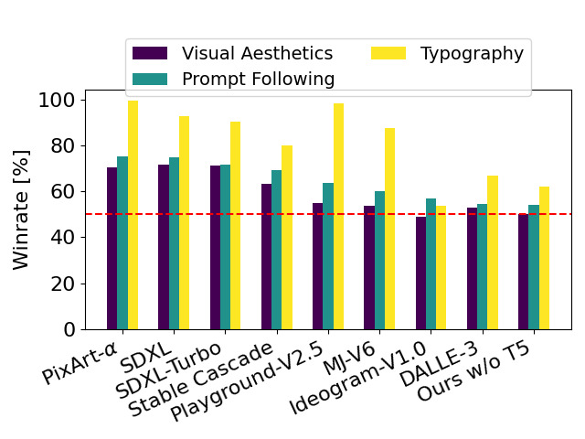

<figcaption>図7: 現行のクローズド・オープン SOTA 生成画像モデルに対する人間の選好評価。我々の 8B モデルは、視覚品質・プロンプト追従・タイポグラフィ生成のカテゴリで parti-prompts で評価したとき、現行の最先端 text-to-image モデルに対して好成績。</figcaption>
</figure>

このシフト関数を図6 で可視化する。なお定数画像の仮定は現実的でない。推論中のシフト値 $\alpha:=\sqrt{\frac{m}{n}}$ の良い値を見つけるため、解像度 $1024\times 1024$ で学習したモデルのサンプリングステップに適用し人間選好調査を行う。図6 の結果は $1.5$ より大きいシフトのサンプルへの強い選好を示すが、より高いシフト値の間では差は小さい。したがって続く実験では、$1024\times 1024$ 解像度での学習・サンプリングの両方でシフト値 $\alpha=3.0$ を使う。なお式23 は次の log-SNR シフト $\log\frac{n}{m}$ を含意する：

$$
\lambda_{t_{m}}=2\log\frac{1-t_{n}}{\sqrt{\frac{m}{n}}t_{n}}=\lambda_{t_{n}}-2\log\alpha=\lambda_{t_{n}}-\log\frac{m}{n}\;.
$$

解像度 $1024\times 1024$ でのシフト学習後、Appendix C で述べる Direct Preference Optimization（DPO）でモデルを整合させる。

#### 5.3.3 結果

<figure>

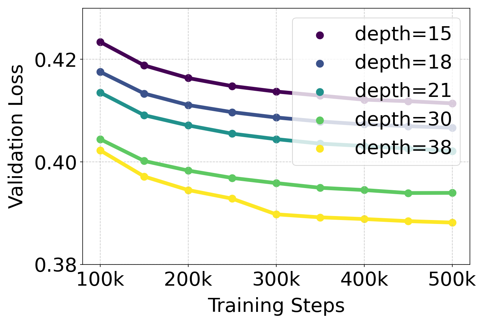

<figcaption>図8: スケーリングの定量的効果。一貫した学習ハイパーパラメータを保ちつつモデルサイズが性能に与える影響を分析。例外は depth=38 で、発散防止のため 3×10⁵ ステップで学習率調整が必要だった。（上）検証損失はモデルサイズと学習ステップの両方の関数として滑らかに減少（画像：列1・2、動画：列3・4）。（下）検証損失は全体性能の強い予測子。検証損失と GenEval（列1）・人間選好（列2）・T2I-CompBench（列3）の間に顕著な相関。動画モデルでも検証損失と人間選好（列4）に同様の相関。</figcaption>
</figure>

図8 で *MM-DiT* をスケールで学習した効果を調べる。画像については、大規模スケーリング研究を行い、異なるパラメータ数のモデルを $256^{2}$ ピクセル解像度で事前符号化データを使い 500k ステップ、バッチサイズ 4096 で学習する。$2\times 2$ パッチで学習し、CoCo データセットの検証損失を 50k ステップごとに報告する。特に、検証損失信号のノイズを減らすため、$t\in(0,1)$ で等間隔の損失レベルをサンプルし各レベルで別々に検証損失を計算する。それから最後（$t=1$）を除く全レベルで損失を平均する。

同様に、*MM-DiT* の動画での予備的スケーリング研究を行う。事前学習済み画像重みから始め、2x の時間パッチ化を追加で使う。Blattmann ら [9] に従い、時間軸をバッチ軸に折りたたんで事前学習済みモデルにデータを供給する。各 attention 層で視覚ストリームの表現を再配置し、空間 attention 演算後・最終フィードフォワード層前に全時空間トークンへの full attention を加える。動画モデルは 16 フレーム・$256^{2}$ ピクセルの動画でバッチサイズ 512・140k ステップ学習する。Kinetics データセットの検証損失を 5k ステップごとに報告する。なお図8 の動画学習の FLOPs は動画学習のみで、画像事前学習の FLOPs は含まない。

画像・動画ドメインの両方で、モデルサイズと学習ステップを増やすと検証損失が滑らかに減少することを観察する。検証損失が包括的評価指標（CompBench, GenEval）と人間選好に高く相関することを見出す。これらの結果は検証損失をモデル性能の単純で一般的な尺度として支持する。我々の結果は画像・動画モデルとも飽和を示さない。

図12 はより大きなモデルをより長く学習することがサンプル品質にどう影響するかを示す。表5 は GenEval の完全な結果を示す。§5.3.2 の手法を適用し学習画像解像度を上げると、我々の最大モデルは大半のカテゴリで秀でて、プロンプト理解の現行 SOTA である DALLE 3 を総合スコアで上回る。

<figure>


<figcaption>図9: T5 の影響。T5 は複雑なプロンプト（高い詳細度や長い綴りテキストを含むもの、2・3 行目）で重要と観察する。しかし大半のプロンプトでは、推論時に T5 を除いても競争力ある性能を達成する。</figcaption>
</figure>

我々の $d=38$ モデルは、Parti-prompts ベンチマークでの人間選好評価で、*視覚的美しさ*・*プロンプト追従*・*タイポグラフィ生成*のカテゴリで現行のプロプライエタリ・オープン SOTA 生成画像モデルを上回る（図7）。これらのカテゴリの人間選好評価のため、評価者には 2 モデルからのペア出力をランダム順で見せ、次の質問に答えてもらった：
プロンプト追従：上のテキストにより*代表的*で*忠実に*従うのはどちらの画像か？
視覚的美しさ：プロンプトを踏まえ、どちらの画像が*高品質*で*美的により好ましい*か？
タイポグラフィ：上の記述で指定されたテキストをより正確に表示するのはどちらの画像か？より正確な綴りが好まれる。他の側面は無視。

最後に、表6 は興味深い結果を強調する：より大きなモデルはより良く機能するだけでなく、ピーク性能に達するのに必要なステップも少ない。

**表5**: GenEval 比較。我々の最大モデル（depth=38）は全現行オープンモデルと DALLE-3 を GenEval で上回る。DPO は Appendix C 参照。

| Model | Overall | Single Object | Two Objects | Counting | Colors | Position | Color Attribution |
| --- | --- | --- | --- | --- | --- | --- | --- |
| minDALL-E | 0.23 | 0.73 | 0.11 | 0.12 | 0.37 | 0.02 | 0.01 |
| SD v1.5 | 0.43 | 0.97 | 0.38 | 0.35 | 0.76 | 0.04 | 0.06 |
| PixArt-alpha | 0.48 | 0.98 | 0.50 | 0.44 | 0.80 | 0.08 | 0.07 |
| SD v2.1 | 0.50 | 0.98 | 0.51 | 0.44 | 0.85 | 0.07 | 0.17 |
| DALL-E 2 | 0.52 | 0.94 | 0.66 | 0.49 | 0.77 | 0.10 | 0.19 |
| SDXL | 0.55 | 0.98 | 0.74 | 0.39 | 0.85 | 0.15 | 0.23 |
| SDXL Turbo | 0.55 | 1.00 | 0.72 | 0.49 | 0.80 | 0.10 | 0.18 |
| IF-XL | 0.61 | 0.97 | 0.74 | 0.66 | 0.81 | 0.13 | 0.35 |
| DALL-E 3 | 0.67 | 0.96 | 0.87 | 0.47 | 0.83 | 0.43 | 0.45 |
| Ours (depth=18), 512² | 0.58 | 0.97 | 0.72 | 0.52 | 0.78 | 0.16 | 0.34 |
| Ours (depth=24), 512² | 0.62 | 0.98 | 0.74 | 0.63 | 0.67 | 0.34 | 0.36 |
| Ours (depth=30), 512² | 0.64 | 0.96 | 0.80 | 0.65 | 0.73 | 0.33 | 0.37 |
| Ours (depth=38), 512² | 0.68 | 0.98 | 0.84 | 0.66 | 0.74 | 0.40 | 0.43 |
| Ours (depth=38), 512² w/DPO | 0.71 | 0.98 | 0.89 | 0.73 | 0.83 | 0.34 | 0.47 |
| Ours (depth=38), 1024² w/DPO | 0.74 | 0.99 | 0.94 | 0.72 | 0.89 | 0.33 | 0.60 |

**表6**: サンプリング効率へのモデルサイズの影響。固定シードで 50 サンプリングステップで評価した CLIP スコアに対する相対性能低下を示す。より大きなモデルはより少ないステップでサンプリングでき、これは増大した頑健性と rectified flow モデルの直線経路目的へのより良い適合（より短い経路長）に帰せられる。経路長は 50 ステップで $\|v_{\theta}\cdot dt\|$ を合計して計算。

| | 5/50 steps | 10/50 steps | 20/50 steps | path length |
| --- | --- | --- | --- | --- |
| depth=15 | 4.30 | 0.86 | 0.21 | 191.13 |
| depth=30 | 3.59 | 0.70 | 0.24 | 187.96 |
| depth=38 | 2.71 | 0.14 | 0.08 | 185.96 |

##### 柔軟なテキストエンコーダ

複数テキストエンコーダを使う主な動機は全体モデル性能の向上だが、この選択が *MM-DiT* ベース rectified flow の推論時の柔軟性も高めることを示す。§B.3 で述べるように、3 つのテキストエンコーダを各々 46.3% のドロップアウト率で学習する。よって推論時に 3 つのテキストエンコーダの任意の部分集合を使える。これはモデル性能をメモリ効率と引き換える手段を提供し、特に大量の VRAM を要する T5-XXL の 4.7B パラメータで関連する。興味深いことに、2 つの CLIP ベーステキストエンコーダのみを使い T5 埋め込みをゼロで置き換えても性能低下は限定的と観察する。図9 に定性的可視化を示す。シーンの高度に詳細な記述や大量の書かれたテキストを含む複雑なプロンプトのみ、3 つのテキストエンコーダ全てを使うと有意な性能利得がある。これらの観察は図7（*Ours w/o T5*）の人間選好評価結果でも検証される。T5 除去は美的品質評価に影響せず（50% 勝率）、プロンプト追従に小さな影響（46% 勝率）だが、書かれたテキスト生成能力への寄与はより有意（38% 勝率）。

## 6 結論

本研究では text-to-image 合成のための rectified flow モデルのスケーリング分析を提示した。潜在拡散モデルの以前の拡散学習定式化を改善し、少ステップサンプリング領域での rectified flow の好ましい性質を保つ、rectified flow 学習のための新しい時刻サンプリングを提案した。また、text-to-image タスクのマルチモーダルな性質を考慮した transformer ベース *MM-DiT* アーキテクチャの利点を実証した。最後に、この組合せを 8B パラメータ・$5\times 10^{22}$ 学習 FLOPs までスケールした研究を行った。検証損失の改善が既存の text-to-image ベンチマークと人間選好評価の両方と相関することを示した。これは、生成モデリングとスケーラブルなマルチモーダルアーキテクチャの改善と組み合わさって、最先端のプロプライエタリモデルと競争力ある性能を達成する。スケーリング傾向は飽和の兆候を見せず、今後もモデル性能を改善し続けられると楽観している。

## より広い影響

本論文は、機械学習一般、特に画像合成の分野を進めることを目標とする研究を提示する。我々の研究には多くの潜在的な社会的帰結があるが、ここで特に強調すべきものはないと感じる。拡散モデルの一般的な影響の広範な議論については、Po ら [58] を参照されたい。

## 付録A 背景

##### 拡散モデル

拡散モデルは、データをノイズに変換する確率的順過程への逆 ODE を近似することでデータを生成する。画像・動画の生成モデリングの標準アプローチになった。これらのモデルは負の尤度の変分下界とスコアマッチングの両方で導出できるので、順・逆過程の様々な定式化、モデルパラメータ化、損失重み付け、ODE ソルバーが、多数の異なる学習目的とサンプリング手続きを生んだ。最近、Kingma & Gao [41] と Karras ら [39] の独創的研究が統一的定式化を提案し、学習と推論の新しい理論的・実践的洞察を導入した。しかしこれらの改善にもかかわらず、一般的な ODE の軌道は部分的にかなりの曲率を含み、増大したソルバーステップを要するため高速推論を難しくする。これを克服するため、我々は直線 ODE 軌道の学習を可能にする定式化を持つ rectified flow モデルを採用する。

##### Rectified Flow モデル

Rectified Flow は、ODE を通じて 2 つの分布間の輸送写像を構成することで生成モデリングに取り組む。このアプローチは連続正規化フロー（CNF）と拡散モデルに密接に関連する。CNF と比べ、Rectified Flow と Stochastic Interpolants は学習中に ODE のシミュレーションを必要としない利点がある。拡散モデルと比べ、拡散モデルに付随する確率フロー ODE よりシミュレートが速い ODE を生みうる。とはいえ最適輸送解は生まず、複数の研究が軌道曲率をさらに最小化することを目指す。Liu ら [19, 51] はクラス条件付き画像合成での rectified flow 定式化の実現可能性を、Fischer ら [27] は潜在空間アップサンプリングを実証し、Liu ら [48] は事前学習済み text-to-image モデルを蒸留するため [47] の reflow 手続きを適用した。ここでは、より少ないサンプリングステップでの text-to-image 合成の基礎としての rectified flow に関心がある。

##### 拡散モデルのスケーリング

transformer アーキテクチャは NLP とコンピュータビジョンタスクでのスケーリング特性でよく知られる。拡散モデルでは U-Net アーキテクチャが支配的選択だった。最近のいくつかの研究は拡散 transformer バックボーンを探るが、text-to-image 拡散モデルのスケーリング則は未探索のままである。

## 付録B フローマッチングについて

### B.1 フローのシミュレーション不要学習の詳細

Lipman ら [46] に従い、$u_{t}(z)$ が $p_{t}$ を生成することを見るため、連続の方程式が必要十分条件を提供することに注意する：

$$
\frac{d}{dt}p_{t}(x)+\nabla\cdot[p_{t}(x)v_{t}(x)]=0\leftrightarrow\text{$v_{t}$ が確率密度経路 $p_{t}$ を生成する}.
$$

したがって次を示せば十分である：

$$
-\nabla\cdot[u_{t}(z)p_{t}(z)]=-\nabla\cdot[\mathbb{E}_{\epsilon\sim\mathcal{N}(0,I)}u_{t}(z|\epsilon)\frac{p_{t}(z|\epsilon)}{p_{t}(z)}p_{t}(z)]
$$
$$
=\mathbb{E}_{\epsilon\sim\mathcal{N}(0,I)}-\nabla\cdot[u_{t}(z|\epsilon)p_{t}(z|\epsilon)]=\mathbb{E}_{\epsilon\sim\mathcal{N}(0,I)}\frac{d}{dt}p_{t}(z|\epsilon)=\frac{d}{dt}p_{t}(z),
$$

ここで $u_{t}(z|\epsilon)$ が $p_{t}(z|\epsilon)$ を生成するので連続の方程式26 を用い、式6 の定義を用いた。

目的の等価性 $\mathcal{L}_{FM}\leftrightharpoons\mathcal{L}_{CFM}$ は次から従う：

$$
\mathcal{L}_{FM}(\Theta)=\mathbb{E}_{t,p_{t}(z)}||v_{\Theta}(z,t)-u_{t}(z)||_{2}^{2}
$$
$$
=\mathbb{E}_{t,p_{t}(z)}||v_{\Theta}(z,t)||_{2}^{2}-2\mathbb{E}_{t,p_{t}(z)}\langle v_{\Theta}(z,t)\,|\,u_{t}(z)\rangle+c
$$
$$
=\mathbb{E}_{t,p_{t}(z|\epsilon),p(\epsilon)}||v_{\Theta}(z,t)-u_{t}(z|\epsilon)||_{2}^{2}+c^{\prime}=\mathcal{L}_{CFM}(\Theta)+c^{\prime}
$$

ここで $c,c^{\prime}$ は $\Theta$ に依存しない。

### B.2 画像・テキスト表現の詳細

**潜在画像表現。** LDM に従い、事前学習済みオートエンコーダで RGB 画像 $X\in\mathbb{R}^{H\times W\times 3}$ をより小さな潜在空間 $x=E(X)\in\mathbb{R}^{h\times w\times d}$ に表現する。空間ダウンサンプリング係数 8 を使い（$h=H/8,w=W/8$）、$d$ の異なる値を §5.2.1 で実験する。順過程は常に潜在空間で適用し、式1 で表現 $x$ をサンプルするときデコーダ $D$ でピクセル空間 $X=D(x)$ に復号する。LDM に従い潜在をその平均・標準偏差で正規化する。

**テキスト表現。** 画像の潜在表現への符号化と同様に、テキスト条件 $c$ を事前学習済み凍結テキストモデルで符号化する。特に全実験で、CLIP モデルとエンコーダ・デコーダテキストモデルの組合せを使う。具体的には CLIP L/14 と OpenCLIP bigG/14 のテキストエンコーダで $c$ を符号化する。pooled 出力（サイズ 768 と 1280）を連結してベクトル条件 $c_{\text{vec}}\in\mathbb{R}^{2048}$ を得る。最後から 2 番目の隠れ表現もチャネル方向に連結して CLIP context 条件 $c_{\text{ctxt}}^{\text{CLIP}}\in\mathbb{R}^{77\times 2048}$ を得る。次に $c$ を T5-v1.1-XXL のエンコーダの最終隠れ表現 $c_{\text{ctxt}}^{\text{T5}}\in\mathbb{R}^{77\times 4096}$ にも符号化する。最後に $c^{\text{CLIP}}_{\text{ctxt}}$ をチャネル軸に沿って 4096 次元にゼロパディングして T5 表現に合わせ、系列軸に沿って $c_{\text{ctxt}}^{\text{T5}}$ と連結して最終 context 表現 $c_{\text{ctxt}}\in\mathbb{R}^{154\times 4096}$ を得る。これら 2 つのキャプション表現 $c_{\text{vec}}$ と $c_{\text{ctxt}}$ を §4 で述べた 2 つの異なる方法で使う。

<figure>

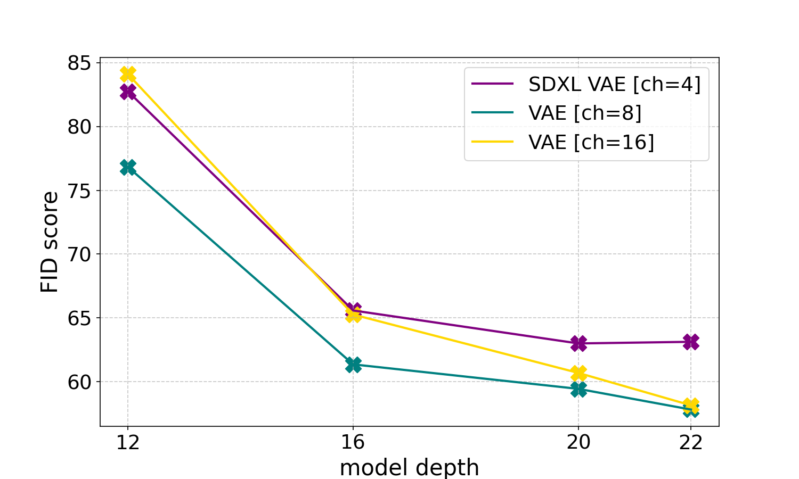

<figcaption>図10: 異なるオートエンコーダ（4・8・16 潜在チャネル）の潜在空間で異なるサイズ（深さでパラメータ化）のフローモデルを学習後の FID スコア。期待どおり、16 チャネルオートエンコーダ空間で学習したフローモデルは同様の性能達成により多くのモデル容量を要する。d=22 で 8-chn と 16-chn の差は無視できるほどになる。最終的に遥かに大きなモデルサイズへスケールすることを目指すので 16-chn モデルを選ぶ。</figcaption>
</figure>

### B.3 実験の準備

**データセット。** 標準的な text-to-image ベンチマークがないので 2 つのデータセットを使う。広く使われるデータセットとして、ImageNet を「a photo of a ⟨class name⟩」形式のキャプションを画像に加えることで text-to-image モデルに適したデータセットに変換する。より現実的な text-to-image データセットとして CC12M を学習に使う。

**最適化。** この実験では、全モデルを大域バッチサイズ 1024、AdamW（学習率 $10^{-4}$、1000 線形ウォームアップステップ）で学習する。mixed-precision 学習を使い、100 学習バッチごとに減衰係数 0.99 の EMA で更新するモデル重みのコピーを保つ。無条件拡散ガイダンスのため、3 つのテキストエンコーダ各々の出力を確率 46.4% で独立にゼロにし、全ステップの約 10% で無条件モデルを学習する。

**評価。** §5.1 で述べたように、CLIP スコア・FID・検証損失を学習中に COCO-2014 検証分割で定期評価する。損失値は異なる時刻で大きさと分散が広く異なるので、時間区間 $[0,1]$ の 8 等間隔値で層化して評価する。異なるサンプラー設定での挙動分析のため、各サンプラーで 1000 サンプルを生成する。サンプリングには常に式1 の Euler 離散化と 6 設定を使う：classifier-free-guidance スケール 1.0・2.5・5.0 での 50 ステップ、CFG スケール 5.0 での 5・10・25 ステップ。

### B.4 Rectified Flow モデルのための SNR サンプラーの改善

§2 で述べたように、rectified flow モデルの学習に使う時刻の新しい密度 $\pi(t)$ を導入する。図11 は §3.1 で導入した logit-normal サンプラーと mode サンプラーの分布を可視化する。注目すべきことに、§5.1 で実証するように、logit-normal サンプラーは古典的な一様 rectified flow 定式化と、EDM や LDM-Linear のような確立された拡散ベースラインを上回る。

<figure>

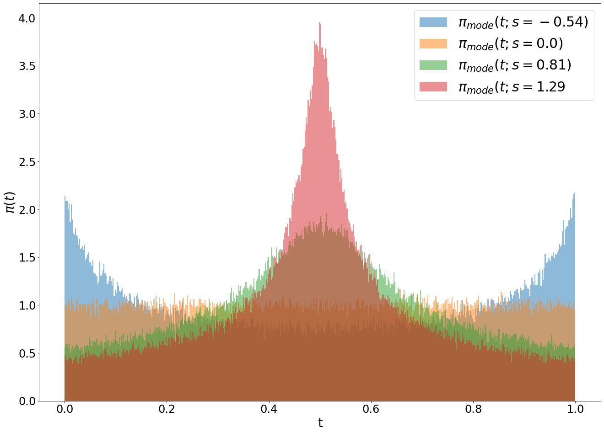

<figcaption>図11: 学習時刻のサンプリングを偏らせるために探る mode（左）と logit-normal（右）分布。</figcaption>
</figure>

<figure>


<figcaption>図12: スケーリングの定性的効果。学習ステップ（左から右：50k・200k・350k・500k）とモデルサイズ（上から下：depth=15・30・38）の PartiPrompts への影響を示す例。</figcaption>
</figure>

## 付録C Direct Preference Optimization

<figure>


<figcaption>図13: ベースモデルと DPO ファインチューンモデルの比較。DPO ファインチューンは一般により美的で綴りの良いサンプルを生む。</figcaption>
</figure>

<figure>

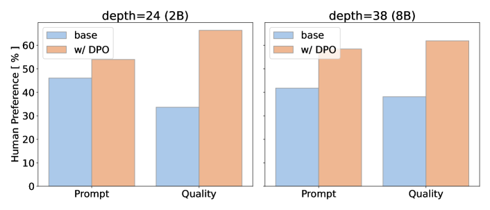

<figcaption>図14: ベースモデルと DPO ファインチューンモデルの人間選好評価。人間評価者はプロンプト追従と一般品質の両方で DPO ファインチューンモデルを好む。</figcaption>
</figure>

Direct Preference Optimization（DPO）は選好データで LLM をファインチューンする技術である。最近、この方法は text-to-image 拡散モデルの選好ファインチューンに適応された。本節で、我々のモデルも選好最適化に適することを検証する。特に、Wallace ら [85] の方法を 2B・8B パラメータベースモデルに適用する。モデル全体をファインチューンする代わりに、全線形層に学習可能な Low-Rank Adaptation（LoRA）行列（ランク 128）を導入する。これら新パラメータを 2B・8B ベースモデルでそれぞれ 4k・2k 反復ファインチューンする。それから Partiprompts から 128 キャプションの部分集合（プロンプト・比較あたり約 3 投票者）を使う人間選好調査で結果モデルを評価する。図14 は我々のベースモデルが人間選好に効果的にチューンできることを示す。図13 は各ベースモデルと DPO ファインチューンモデルのサンプルを示す。

## 付録D 指示ベース画像編集のためのファインチューニング

指示ベース画像編集と一般的な image-to-image 拡散モデルの学習の一般的アプローチは、入力画像の潜在を拡散目標のノイズ化潜在にチャネル次元で連結してから U-Net に供給することである。我々は同じアプローチに従い、入力と目標をパッチ化前にチャネルで連結し、同じ方法が我々の提案アーキテクチャに適用可能なことを実証する。2B パラメータベースモデルを、InstructPix2Pix データセットの分布に似た image-to-image 編集タスクと、Emu Edit や Palette に似た inpainting・セグメンテーション・着色・ぼかし除去・controlnet タスクからなるデータセットでファインチューンする。図15 のように、結果の 2B Edit モデルは、テキスト操作タスクが学習データに含まれていなくても、与えられた画像のテキストを操作する能力を持つことを観察する。同じデータで SDXL ベースの編集モデルを学習したときは同様の結果を再現できなかった。

<figure>


<figcaption>図15: 指示ベース画像編集のためにファインチューンした 2B Edit モデルの例。</figcaption>
</figure>

## 付録E 大規模 Text-to-Image 学習のためのデータ前処理

### E.1 画像・テキスト埋め込みの事前計算

我々のモデルは複数の事前学習済み凍結ネットワークの出力（オートエンコーダ潜在とテキストエンコーダ表現）を入力に使う。これらの出力は学習中一定なので、データセット全体で一度事前計算する。これには 2 つの主な利点がある：(i) 学習中エンコーダを GPU に置く必要がなく、必要メモリを下げる。(ii) 学習中に順方向符号化パスをスキップし、最初のエポック後は時間と総計算を節約する（表7）。

**表7**: 凍結入力ネットワークの事前符号化の主要数値。Mem は GPU にモデルをロードするのに必要なメモリ。FP [ms] はデバイスあたりバッチサイズ 32 での 1 サンプルあたりの順方向パス時間。Storage は 1 サンプルを保存するサイズ。Delta [%] は 2B MMDiT モデル（568ms/it）でこれをループに加えたとき学習ステップがどれだけ長くなるか。

| Model | Mem [GB] | FP [ms] | Storage [kB] | Delta [%] |
| --- | --- | --- | --- | --- |
| VAE (Enc) | 0.14 | 2.45 | 65.5 | 13.8 |
| CLIP-L | 0.49 | 0.45 | 121.3 | 2.6 |
| CLIP-G | 2.78 | 2.77 | 202.2 | 15.6 |
| T5 | 19.05 | 17.46 | 630.7 | 98.3 |

このアプローチには 2 つの欠点がある：第 1 に、各サンプルのエポックごとのランダム拡張ができず、画像潜在の事前計算中に正方形中央クロップを使う。高解像度でのファインチューンのため、アスペクト比 bucket をいくつか指定し、最も近い bucket にリサイズ・クロップしてからそのアスペクト比で事前計算する。第 2 に、テキストエンコーダの密な出力は特に大きく、追加のストレージコストと学習中の長いロード時間を生む（表7）。実際に性能劣化を観察しないので、言語モデルの埋め込みを半精度で保存する。

### E.2 画像記憶の防止

生成画像モデルの文脈で、学習サンプルの記憶（memorization）は多くの問題を招きうる。学習済みモデルによる画像の逐語的コピーを避けるため、学習データセットを重複例について注意深くスキャンして除去する。

##### 重複除去の詳細

Carlini ら [11] と Somepalli ら [76] の方法に従い、重複除去過程のバックボーンに SSCD を選ぶ。SSCD アルゴリズムはスケールでの近重複画像検出の最先端技術で、クラスタリング等の下流タスクに使える高品質な画像埋め込みを生成する。クラスタ数 $N$ の決定は Nichol [52] に従う。実験では $N=16,000$ を使う。クラスタリングには autofaiss を使い、FAISS index factory 機能で事前定義の重心数を持つカスタム index を学習する。アルゴリズム1 が重複除去アプローチを詳述する。異なる SSCD 閾値でどれだけデータが除去されるか実験し（図16(b)）、最終実行に 4 閾値を選んだ（図16(a)）。

### E.3 重複除去の有効性の評価

Carlini ら [11] は、標準的アプローチで画像を生成し、特定のメンバーシップ推論スコアリング基準を超えるものをフラグする 2 段階データ抽出攻撃を考案した。彼らは重複学習例に検索を偏らせる。これらは非重複例より桁違いに記憶されやすいためである。

SSCD ベース重複除去がどれだけ良く機能するか評価するため、[11] に従いこの目的で特に学習した小モデルから記憶サンプルを抽出し、重複除去前後で比較する。手続きの 2 主要ステップ：1) 既知のプロンプトで標準サンプリング方式で多数の例を生成。2) メンバーシップ推論でモデルの新規生成と記憶された学習例を分離。アルゴリズム2 が [11] に基づく記憶サンプル発見ステップを示す。この技術を 2 回実行する：ベースラインとして完全重複除去のみの SD-2.1 モデルと、SD2.1 アーキテクチャだが完全・近重複を SSCD で除去して学習したモデル。

SSCD（閾値 0.5）に基づき学習データセットから最も重複した 350,000 例を選び、記憶発見可能性を高めるため各テキストプロンプトに 500 候補画像を生成する。直感は、拡散モデルでは高確率で 2 つの異なるランダム初期シード $r_{1},r_{2}$ について $Gen(p;r_{1})\approx_{d}Gen(p;r_{2})$。一方、ある距離尺度 d で $Gen(p;r_{1})\approx_{d}Gen(p;r_{2})$ なら、これらの生成サンプルは記憶例である可能性が高い。距離尺度 $d$ の計算には修正ユークリッド $l_{2}$ 距離を使う。多くの生成が $l_{2}$ 距離で偽似的に類似していた（例：全て灰色背景）ので、代わりに各画像を 16 個の重ならない 128×128 タイルに分け、2 画像間の任意のタイル対の $l_{2}$ 距離の最大を測る。図17 は SSCD（閾値 0.5）で近重複を除去する前後の記憶サンプル数の比較を示す。[11] はクリークサイズ 10 内の画像を記憶サンプルとマークする。全クリーク閾値で SSCD は記憶サンプル数を大幅に減らせる。クリークサイズ 10 のとき、SSCD=0.5 でカットした重複除去学習サンプルで学習した SD モデルは潜在的記憶例の 5× 削減を示す。

```
アルゴリズム1 クラスタ内の重複アイテムの発見

入力: vecs（単一クラスタ内のベクトルのリスト）, items（vecs に対応するアイテム ID のリスト）,
     index（クラスタ内類似検索の FAISS index）, thresh（重複判定の閾値）
出力: dups（重複アイテム ID の集合）

dups ← new set()
for i ← 0 to length(vecs)-1 do
    qs ← vecs[i]                              {現在のベクトル}
    qid ← items[i]                            {現在のアイテム ID}
    lims, D, I ← index.range_search(qs, thresh)
    if qid ∈ dups then continue end if
    start ← lims[0]; end ← lims[1]
    duplicate_indices ← I[start:end]
    duplicate_ids ← new list()
    for j in duplicate_indices do
        if items[j] ≠ qid then duplicate_ids.append(items[j]) end if
    end for
    dups.update(duplicate_ids)
end for
Return dups                                   {重複 ID の最終集合}
```

<figure>

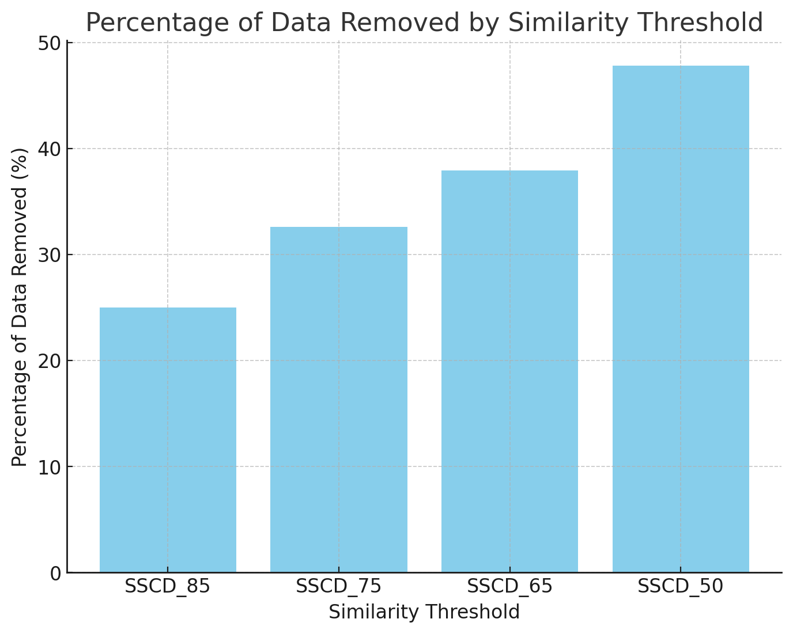

<figcaption>図16(a): データセット全体での SSCD 重複除去の最終結果。</figcaption>
</figure>

```
アルゴリズム2 生成画像での記憶の検出

入力: プロンプト集合 P, プロンプトあたり生成数 N, 類似閾値 ε=0.15, 記憶閾値 T

D を最も重複した例の集合に初期化
for each prompt p ∈ P do
    for i = 1 to N do
        ランダムシード rᵢ で画像 Gen(p; rᵢ) を生成
    end for
end for
for each pair of generated images xᵢ, xⱼ do
    if distance d(xᵢ, xⱼ) < ε then グラフ G で xᵢ と xⱼ を接続 end if
end for
for each node in G do
    そのノードを含む最大クリークを発見
    if size of clique ≥ T then クリーク内の画像を記憶とマーク end if
end for
```

<figure>

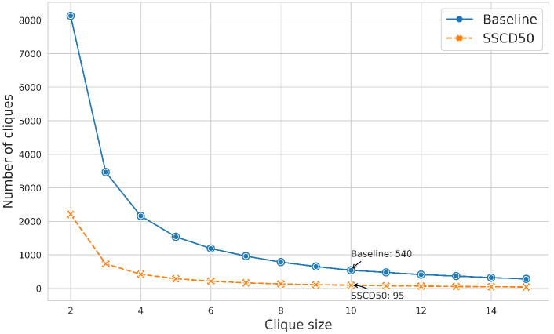

<figcaption>図17: SSCD ベース重複除去は記憶を防ぐ。SSCD（閾値 0.5）で近重複を除去する前後の記憶サンプル数を比較。クリークサイズ 10 のとき、SSCD=0.5 でカットした重複除去学習サンプルのモデルは潜在的記憶例の 5× 削減を示す。</figcaption>
</figure>
