# 確率的補間：フローと拡散のための統一的枠組み

> 原題: Stochastic Interpolants: A Unifying Framework for Flows and Diffusions
> 著者: Michael S. Albergo（NYU 宇宙論・素粒子物理センター）, Nicholas M. Boffi（NYU クーラント数理科学研究所）, Eric Vanden-Eijnden（NYU クーラント数理科学研究所）。著者順はアルファベット順、寄与は同等。
> 出典: arXiv:2303.08797

## Abstract（要旨）

フローベースの手法と拡散ベースの手法を統一する生成モデルのクラスを導入する。これらのモデルは Albergo & Vanden-Eijnden [2] が提案した枠組みを拡張し、任意の 2 つの確率密度関数を有限時間で厳密に橋渡しするために、「確率的補間（stochastic interpolants）」と呼ばれる広いクラスの連続時間確率過程の利用を可能にする。これらの補間は、指定された 2 つの密度からのデータを、橋を柔軟に形作る追加の潜在変数と組み合わせることで構築される。確率的補間の時間依存確率密度関数は、1 階の輸送方程式（transport equation）と、調整可能な拡散係数を持つ前向き・後ろ向き Fokker-Planck 方程式の族の両方を満たすことが示される。個々のサンプルの時間発展を考えると、この観点は、確率フロー方程式（probability flow equation）に基づく決定論的生成モデルと、調整可能なノイズレベルを持つ確率微分方程式に基づく確率的生成モデルの両方を直ちに導く。これらのモデルに入るドリフト係数は時間依存の速度場であり、単純な二乗目的関数の唯一の最小化子として特徴づけられる。そのうちの 1 つは補間密度のスコアのための新しい目的関数である。これらの二乗目的の最小化が、確率的ダイナミクスに基づく生成モデルの尤度の制御につながる一方、決定論的ダイナミクスの尤度制御はより厳格であることを示す。また、補間ベースの生成モデルの尤度と交差エントロピーの推定量を構成し、スコアベース拡散モデル・確率的局在化（stochastic localization）過程・確率的ノイズ除去技術・整流フロー（rectifying flows）といった他の手法との関連を論じる。さらに、補間を明示的に最適化するとき、確率的補間が 2 つの目標密度間の Schrödinger bridge（シュレディンガー橋）を復元することを実証する。最後に、アルゴリズム的側面を論じ、数値例でアプローチを例示する。

## 1 はじめに

### 1.1 背景と動機

決定論的・確率的輸送のための力学的アプローチは、現代の生成モデリング研究の中心的テーマになった。進歩の核心にあるのは、常微分方程式・確率微分方程式（ODE/SDE）を使って、基底確率密度関数（PDF）$\rho_{0}$ からのサンプルを目標密度 $\rho_{1}$ からのサンプルへ（あるいはその逆へ）連続的に変換するという発想と、これらの方程式の速度場の推論が、パラメトリックな関数クラス上の経験的リスク最小化問題として定式化できるという認識である。

大きな画期は、スコアベース拡散法（SBDM）の導入だった。これは、Ornstein-Uhlenbeck（OU）過程にサンプルを通すことで任意の密度を標準ガウスに写す。SBDM の鍵となる洞察は、この過程が、ドリフト係数が過程の時間依存密度のスコアに依存する後ろ向き SDE を導入することで反転できる、という点である。このスコアを学習することで——これはノイズ除去損失（denoising loss）として知られる二乗目的関数の最小化で行える——後ろ向き SDE をガウスノイズを目標からのデータに写す生成モデルとして使える。理論的には厳密だが、写像は双方向とも無限時間を要し、したがって実際には切り詰めなければならない。

拡散ベースの手法は画像生成のようなタスクで最先端になったが、（一方をガウスとすることを要求せず）任意の 2 密度を橋渡しし、輸送を厳密に達成し、しかも有限時間区間でそれを行う手法の開発には依然大きな関心がある。さらに、スコアベース拡散の最高品質の結果は当初 SDE を使って得られたが、スコアが十分よく学習されれば ODE ベースの手法で同等以上の性能が得られるという最近の研究がこれに異議を唱えている。確率的対応物の性能に匹敵させられれば、ODE ベースの手法は、尤度の厳密で計算上扱いやすい公式や、サンプリングのためのよく開発された適応的積分スキームの容易な適用といった、多くの望ましい特性を示す。決定論的ダイナミクスに基づく生成モデルと確率的ダイナミクスに基づくものの間にサンプル品質の差があるかを理解することは、重要な実用的意義を持つ未解決問題である。

前段で概説した望ましい特性を満たすため、我々は Albergo & Vanden-Eijnden [2] が提案した方法に基づく生成モデリングの枠組みを開発する。これは、任意の 2 密度 $\rho_{0}$ と $\rho_{1}$ を橋渡しするために使われる確率的補間 $x_{t}$ の概念の上に築かれる。以下ではより一般的な設計を考えるが、一例として読者に念頭に置いてほしいのは：

$$
x_{t}=(1-t)x_{0}+tx_{1}+\sqrt{2t(1-t)}z,\quad t\in[0,1],
$$

ここで $x_{0}$, $x_{1}$, $z$ はそれぞれ $\rho_{0}$, $\rho_{1}$, 標準ガウス密度 $\mathsf{N}(0,\text{\it Id})$ から独立にサンプルされる確率変数である。(1.1) で定義される確率的補間 $x_{t}$ は連続時間確率過程で、構成上 $x_{t=0}=x_{0}\sim\rho_{0}$ かつ $x_{t=1}=x_{1}\sim\rho_{1}$ を満たす。したがってその経路は $t=0$ での $\rho_{0}$ からのサンプルと $t=1$ での $\rho_{1}$ からのサンプルの間を厳密に橋渡しする。鍵となる観察は：

> 任意の時刻 $t\in[0,1]$ における補間 $x_{t}$ の法則（law）は、ODE や、ドリフトをデータから学習できる前向き・後ろ向き SDE を含む、多くの異なる過程で実現できる。

これがなぜ成り立つかを見るには、補間 $x_{t}$ の確率分布を考えねばならない。以下に示すように、${\mathbb{R}}^{d}$ 上に台を持つ広いクラスの密度 $\rho_{0}$, $\rho_{1}$ に対し、この分布は Lebesgue 測度に関して絶対連続である。さらに、その時間依存密度 $\rho(t)$ は 1 階の輸送方程式と、拡散係数を自在に変えられる前向き・後ろ向き Fokker-Planck 方程式の族を満たす。これらの方程式から、それぞれ ODE と SDE を満たし、時刻 $t$ での密度が $\rho(t)$ で与えられる生成モデルを直ちに導出できる。

<figure>

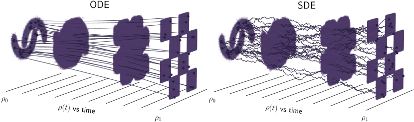

<figcaption>図1: 確率的補間のパラダイム。提案する枠組みに基づく生成モデルの例。両者からのサンプルを使って 2 密度 ρ₀ と ρ₁ を結ぶ。その間を橋渡しする時間依存確率密度 ρ(t) の設計は、それをどうサンプルするか（決定論的または確率的生成モデルで達成できる）の選択から分離される。左パネル：確率フロー方程式として知られる決定論的（ODE）生成モデルでのサンプリング。右パネル：調整可能な拡散係数を持つ SDE で与えられる確率的生成モデルでのサンプリング。確率フロー方程式と SDE は異なる経路を持つが、その時間依存密度は同じである。さらに、2 つの方程式は速度とスコアの同じ推定値に依拠する。</figcaption>
</figure>

興味深いことに、これらの ODE/SDE に入るドリフト係数は、$\rho_{0}$, $\rho_{1}$, $\mathsf{N}(0,\text{\it Id})$ からのデータを使って経験的に推定できる二乗目的関数の唯一の最小化子である。結果として得られる最小二乗回帰問題により、ODE/SDE のドリフト係数を推定でき、それを使って $\rho_{0}$ からのサンプルを $\rho_{1}$ からの新しいサンプルへ、またその逆へと押し出せる。

### 1.2 主な貢献と構成

ここで導入するアプローチは、多くの既存アルゴリズムを統一・拡張する、生成モデル構築の汎用的な方法である。§2 では枠組みを完全な一般性で展開し、次の主要な貢献を強調する：

- §2.1 で定義する確率的補間が、${\mathbb{R}}^{d}$ 上の Lebesgue 測度に関して絶対連続な分布を持ち、その密度 $\rho(t)$ が 1 階の輸送方程式（TE）と、調整可能な拡散係数を持つ前向き・後ろ向き Fokker-Planck 方程式（FPE）の族を満たすことを証明する。
- 確率的補間を使って TE と FPE に入るドリフト係数をどう学習するかを示す。これらの係数を §2.2 で与える単純な二乗目的関数の最小化子として特徴づける。補間密度のスコア $\nabla\log\rho(t)$ のための新しい目的関数と、スコアに関連づけるノイズ除去器 $\eta_{z}$ を学習するための目的関数を導入する。
- §2.3 で、TE と FPE に付随する常微分方程式・確率微分方程式を導出し、決定論的・確率的生成モデルを導く。§2.4 で、SDE ベースモデルのドリフト回帰が尤度を制御する一方、ODE ベースモデルではドリフトのみの回帰では不十分で、Fisher ダイバージェンスも最小化せねばならないことを示す。SDE の尤度を最大化するため拡散係数を最適に調整する方法を示す。
- §2.5 で、SDE ベース生成モデルの尤度を評価する一般公式を展開する。これは ODE ベースモデルの尤度計算に一般に使われる連続変数変換公式の自然な対応物として機能する。加えて、交差エントロピーを推定する公式を与える。

§3 では、確率的補間法のインスタンス化を論じる。§3.4 でまず、補間がある確率的橋（stochastic bridges）のクラスと等価だが、一般に未知である Doob の $h$ 変換の必要を回避することを示す。これが広いクラスの生成モデルの構成を単純化することを示す。§3.2 で、基底 $\rho_{0}$ をガウスとする従来設定に対応する片側補間（one-sided interpolant）を定義する。ガウス基底では補間のいくつかの側面が単純化し、対応する目的関数を詳述する。§3.3 で、基底 $\rho_{0}$ と目標 $\rho_{1}$ が同一であるミラー補間（mirror interpolant）を導入する。最後に §3.4 で、補間の枠組みが 2 密度間の Schrödinger bridge 問題の自然な定式化を導くことを示す。

§4 では、補間が $x_{0}$ と $x_{1}$ について空間的に線形である特殊ケースを論じる。この場合、速度場は因数分解でき、§4.1 でこれがより単純な学習問題を導くことを示す。§4.2 で線形補間の具体的な選択を詳述し、§4.3 でこれらの選択が結果の生成モデルの性能にどう影響するかを、潜在変数と拡散係数の役割に特に焦点を当てて例示する。解説のため、ドリフト係数を解析的に計算できるガウス混合密度に焦点を当てる。結果の公式を付録A に与える。最後に §4.4 で、空間的に線形な片側補間の場合を論じる。

§5 では、確率的補間と関連する生成モデルのクラスとの関連を形式化する。§5.1 で、スコアベース拡散モデルが時間の再パラメータ化の後に片側補間として書き直せることを示す。このアプローチが、スコアベース拡散を有限時間区間に素朴に圧縮するときに現れる特異性をどう除去するかを強調する。§5.2 で、補間がノイズ除去器のベイズ最適推定量を導出するのにどう使えるかを示し、このアプローチを反復して生成モデルを作る方法を示す。§5.3 で、学習した生成モデルのフロー写像を整流（rectifying）する可能性を考える。整流手続きは基礎となる生成モデルを変えないが、補間の時間依存密度を変えうることを示す。

§6 では、上で提示した数学的結果に付随する実践的アルゴリズムの詳細を提供する。§6.1 で、基底と目標からの経験的データセットが与えられたとき目的をどう数値的に推定するかを述べる。§6.2 で、この学習の議論を、ODE または SDE でサンプリングするアルゴリズムで補完する。

これらの推奨に沿った数値的実証を §7 で提供し、§8 でいくつかの所見を述べて締めくくる。

### 1.3 関連研究

#### 決定論的輸送と正規化フロー

輸送ベースのサンプリングと密度推定は、最大エントロピー法によるデータのガウス化に現代的な起源を持つ。そうした変換の下での測度の変化が、正規化フローモデルの背骨である。これらの手法の最初のニューラルネット実現は、測度の変化を離散的・逐次的なステップで扱いやすくするために変換に巧妙な構造を課すことを通じて生まれた。この手続きの連続時間版は、写像 $T=X_{t}(x)$ を ODE の解と見ることで可能になった。その輸送を定義するパラメトリックなドリフトは最尤推定で学習される。この方法での学習は ODE のシミュレーションを要するためスケールで扱いにくい。様々な手法が ODE 解を効率化するため 2 密度間の経路に正則化を導入したが、根本的な困難は残る。我々も連続時間で作業するが、我々のアプローチはダイナミクスのシミュレーションなしにドリフトを学習でき、サンプル生成時に決定論的または確率的輸送のいずれかで定式化できる。

#### 確率的輸送とスコアベース拡散（SBDM）

決定論的写像に基づくアプローチを補完するものとして、最近の研究は、データ分布をガウス密度に結ぶことを、関心ある分布からのサンプルを徐々にガウスノイズに劣化させる Ornstein-Uhlenbeck（OU）過程の発展と見なせることを認識した。OU 過程は確率密度の空間における経路を指定する。この経路は順方向にはノイズの付加で簡単にたどれ、時間依存密度のスコア $\nabla\log\rho(t)$ へのアクセスがあれば反転できる。このスコアは最小二乗回帰問題の解で近似でき、スコアが学習されれば経路を反転して目標をサンプルできる。興味深いことに、結果の前向き・後ろ向き確率過程は、（分布レベルで）決定論的な確率フロー方程式の観点で等価な定式化を持つ。これは最初に [4][49][33] で指摘され、その後 [44][57][34][7] で応用された。確率フロー定式化は密度推定と交差エントロピー計算に有用だが、近似スコアを使うとき確率フローと逆時間 SDE は異なる密度を持つことに注意すべきである。SBDM の枠組みは、当初提示された形では、正規密度への写像への依存、時間パラメータ化とノイズスケジューリングの複雑な調整、基礎となる確率ダイナミクスの選択など、先験的によく動機づけられていない多くの特徴を持つ。確率的橋を使って OU 過程への依存を除く努力もあったが、結果の手続きはアルゴリズム的に複雑で、表現力が限られ確率フロー定式化にアクセスできない拡散の不正確な混合に依拠しうる。これらの困難の一部は後続研究で解消された。この方向のさらなる一歩として、我々は SBDM の背後にある鍵となる発想——発展方程式が利用可能な時間依存密度を介した密度の橋渡し——が、単純で計算上アクセス可能な方法で、はるかに広いクラスの過程に一般化できることを観察する。

#### 確率的補間、整流フロー、フローマッチング

[2] で提示された確率的補間法の変種は [41][39] でも提示された。[41] では、直線経路に焦点を当てた線形補間が提案された。これは [40] で輸送経路を整流（rectifying）する手続きへの一歩として用いられ、サンプリング効率を改善するがバイアスを導入する。§5.3 で、バイアスのない別形式の整流を提示する。[39] では、ガウスに接続する条件付き確率経路の観点から補間の描像が組み立てられ、ノイズ畳み込みが手法にバイアスをかける代償で学習を改善するために使われた。[39] の拡張が [66] で提示され、ガウス基底密度を超えて手法を一般化する。ここで提案する手法では、確率的補間への潜在変数の導入と、付随する確率的生成モデルへの調整可能な拡散係数の包含の両方を通じて、ノイズを過程に組み込むバイアスのない手段を導入する。これらのノイズ項の存在の理論的・実践的な動機を提供する。

#### 最適輸送と Schrödinger 橋

$\rho_{0}$ と $\rho_{1}$ を結ぶ輸送コストを最小化することには理論的・実践的な関心がある。決定論的写像の場合これは最適輸送（optimal transport）問題で、拡散的写像の場合は Schrödinger Bridge 問題で特徴づけられる。形式的には、これら 2 問題は Schrödinger Bridge をエントロピー正則化最適輸送と見ることで関連づけられる。最適輸送は主に、経路長ペナルティかパラメータ化自体への構造を課すことでフローベース手法を正則化する手段として用いられてきた。最近の様々な研究が学習可能な拡散の文脈で Schrödinger 問題を定式化した。補間の枠組みでは、[2][41][39][66] はすべて学習手続きへの最適輸送拡張を提案する。[41][40] で提案された手法は整流を通じて輸送コストを逐次的に下げられるが、速度場が完全に学習されない限りバイアスを導入する代償を伴う。[2] で提案された手法は、補間関数上の追加の最適化問題を解く代償でバイアスのない枠組みである。[39] の最適輸送の主張はガウスにのみ適用されるが、実験的実証では実用的に有用だと示される。

以下で提案する手法では、確率的ダイナミクスの下で輸送を最適化する 2 つのアプローチを提供する。[2] で導入されたスキームに基づく主要なアプローチは §3.4 で提示する。これは補間上で最大化することで、輸送の Benamou-Brenier 流体力学的定式化の下で Schrödinger bridge 問題を解く別ルートを提供する。しかし、この追加の最適化ステップは実際には必要ないことを強調する。我々のアプローチは任意の固定された補間に対してバイアスのない生成モデルを導くからである。加えて、§5.3 で [41] で提案された整流スキームのバイアスのない変種を論じる。

#### 収束限界

スコアベース拡散の成功に触発され、生成モデルの分布と目標データ分布の間の適切な距離（$\mathsf{KL}$, $W_{2}$, $\mathsf{TV}$ など）に対して得られる制御を理解するため、近年大きな研究努力が費やされてきた。おそらくこの方向の最初の研究の流れは [57] で、標準的なスコアベース拡散の学習技術が結果の SDE モデルの尤度を限界づけることを示した。重要なことに、ここで示すように、対応する確率フローの尤度はこの技術では一般に限界づけられない。これは SBDM の文脈で [43] が最初に強調した。SBDM ベース技術の制御は、後に離散化設定での関数不等式の仮定の下で [36] によってより厳密に定量化され、これは [37] と [13] によって Girsanov ベースの技術で除去された。ここで考える PDE ベース手法に最も関連するのは [10] で、我々自身と似た技術を SBDM 文脈に適用し、最小の仮定で鋭い保証を得る。

### 1.4 記法

本稿を通じて、確率密度関数を $\rho_{0}(x)$, $\rho_{1}(x)$, $\rho(t,x)$ と表す（$t\in[0,1]$, $x\in{\mathbb{R}}^{d}$）。文脈から明らかなときは関数の引数を省く。$b(t,x)$ や $I(t,x_{0},x_{1})$ のような他の時間・空間の関数も同様に扱う。確率過程の時間依存性を表すのに添字 $t$ を使う（確率的補間 $x_{t}$ や Wiener 過程 $W_{t}$ など）。確率変数 $x_{0}$ が密度 $\rho_{0}$ を持つ確率分布からサンプルされることを指定するのに、記法の若干の濫用で $x_{0}\sim\rho_{0}$ と書く。同様に、${\sf N}(0,\text{\it Id})$ で平均ゼロ・共分散単位のガウス確率変数の密度と分布の両方を表す。期待値を ${\mathbb{E}}$ で表し、通常この期待値がどの確率変数について取られるかを指定する。用語の若干の濫用で、$\rho(t)$ が時刻 $t$ における $x_{t}$ の確率分布の密度であるとき、過程 $x_{t}$ の法則は $\rho(t)$ であると言う。

標準的な関数空間の記法を使う。例えば $C^{1}([0,1])$ は $[0,1]$ から ${\mathbb{R}}$ への連続微分可能関数の空間、$(C^{2}({\mathbb{R}}^{d}))^{d}$ は ${\mathbb{R}}^{d}$ から ${\mathbb{R}}^{d}$ への 2 回連続微分可能関数の空間、$C^{p}_{0}({\mathbb{R}}^{d})$ は ${\mathbb{R}}^{d}$ から ${\mathbb{R}}$ への $p$ 回連続微分可能なコンパクト台を持つ関数の空間である。値 $b(t,x)$ を持つ関数 $b:[0,1]\times{\mathbb{R}}^{d}\to{\mathbb{R}}^{d}$ に対し、$b\in C^{1}([0,1];(C^{2}({\mathbb{R}}^{d}))^{d})$ は、$b$ が全 $(t,x)\in[0,1]\times{\mathbb{R}}^{d}$ で $t$ について連続微分可能であり、全 $t\in[0,1]$ で $b(t,\cdot)$ が $(C^{2}({\mathbb{R}}^{d}))^{d}$ の要素であることを示す。

## 2 確率的補間の枠組み

### 2.1 定義と仮定

我々のアプローチの中心となる確率過程を定義することから始める：

###### 定義 2.1（確率的補間）

2 つの確率密度関数 $\rho_{0},\rho_{1}:{{\mathbb{R}}^{d}}\rightarrow{\mathbb{R}}_{\geq 0}$ が与えられたとき、$\rho_{0}$ と $\rho_{1}$ の間の確率的補間とは、次で定義される確率過程 $x_{t}$ である

$$
x_{t}=I(t,x_{0},x_{1})+\gamma(t)z,\qquad t\in[0,1],
$$

ここで：

1. $I\in C^{2}([0,1],(C^{2}({\mathbb{R}}^{d}\times{\mathbb{R}}^{d})^{d})$ は境界条件 $I(0,x_{0},x_{1})=x_{0}$ と $I(1,x_{0},x_{1})=x_{1}$、ならびに
$$
\exists C_{1}<\infty\ :\ |\partial_{t}I(t,x_{0},x_{1})|\leq C_{1}|x_{0}-x_{1}|\quad\forall(t,x_{0},x_{1})\in[0,1]\times{\mathbb{R}}^{d}\times{\mathbb{R}}^{d}.
$$
を満たす。
2. $\gamma:[0,1]\to{\mathbb{R}}$ は $\gamma(0)=\gamma(1)=0$、全 $t\in(0,1)$ で $\gamma(t)>0$、$\gamma^{2}\in C^{2}([0,1])$ を満たす。
3. 対 $(x_{0},x_{1})$ は、$\rho_{0}$ と $\rho_{1}$ に周辺化する確率測度 $\nu$ からサンプルされる。すなわち
$$
\nu(dx_{0},{\mathbb{R}}^{d})=\rho_{0}(x_{0})dx_{0},\qquad\nu({\mathbb{R}}^{d},dx_{1})=\rho_{1}(x_{1})dx_{1}.
$$
4. $z$ は $(x_{0},x_{1})$ と独立なガウス確率変数である。すなわち $z\sim{\sf N}(0,\text{\it Id})$ かつ $z\perp(x_{0},x_{1})$。

式 (2.2) は、$I(t,x_{0},x_{1})$ が $t=0$ の $x_{0}$ から $t=1$ の $x_{1}$ への道中で速く動きすぎず、結果としてどちらの端点からもあまり遠くへさまよわないことを述べる——この仮定は便宜上のもので、以下のほとんどの議論には必須でない。後で、空間的に非線形な $I$ の選択を考えることが有用だと分かる。これは Schrödinger bridge 問題の解を復元できることを示す。とはいえ、定義 2.1 の意味で妥当な $I$ の単純な例は (1.1) で与えられる。測度 $\nu$ は 2 密度 $\rho_{0}$ と $\rho_{1}$ の間のカップリングを可能にし、確率的補間の性質に影響するが、単純な選択は積測度 $\nu(dx_{0},dx_{1})=\rho_{0}(x_{0})\rho_{1}(x_{1})dx_{0}dx_{1}$ を取ることで、この場合 $x_{0}$ と $x_{1}$ は独立である。§6 で (2.1) の確率的補間をどう設計するかを論じ、対応する過程 $x_{t}$ のいくつかの性質を述べる。確率的補間の例は、$I$ と $\gamma$ の様々な選択について図2 にも示す。

###### 注意 2.2（[2] との比較）

(2.1) で定義した確率的補間と [2] で当初導入されたものの主な違いは、潜在変数 $\gamma(t)z$ の包含である。以下の結果の多くは $\gamma(t)z=0$ と置いても成り立つが、本論文の目的は、どちらの端点もガウスでないときにこの追加項が提供する利点を解明することである。$\gamma(t)$ をテンソルにすることで構成を一般化できるが、ここでは単純さのためスカラーの場合に焦点を当てる。もう 1 つの違いは、$\nu$ を介して $\rho_{0}$ と $\rho_{1}$ をカップリングできる可能性である。

<figure>

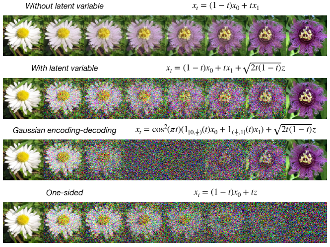

<figcaption>図2: 設計の柔軟性。確率的補間が特定の目的に合わせて調整できる様子の図示。全例が、1 つの x₀∼ρ₀、1 つの x₁∼ρ₁（図の左右の花）、1 つの z∼N(0,Id) による x_t の 1 つの実現を示す。上・上中・下中：様々な補間。潜在変数なしの直接補間（[2] のような）から、中点でデータが純ノイズへ遷移するガウス符号化・復号まで。下：片側補間。スコアベース拡散法と接続する。</figcaption>
</figure>

(2.1) の確率的補間 $x_{t}$ は、その実現が構成上、時刻 $t=0$ で $\rho_{0}$ から、$t=1$ で $\rho_{1}$ からのサンプルである連続時間確率過程である。結果として $\rho_{0}$ と $\rho_{1}$ を橋渡しする方法を提供する——我々は区間 $[0,1]$ 全体での $x_{t}$ の法則を特徴づけることに関心がある。それが生成モデルの設計を可能にするからである。数学的には、次を満たす時間依存確率分布 $\mu(t,dx)$ の性質を特徴づけたい

$$
\forall t\in[0,1]\quad:\quad\int_{{\mathbb{R}}^{d}}\phi(x)\mu(t,dx)={\mathbb{E}}\phi(x_{t})\quad\text{任意のテスト関数}\quad\phi\in C^{\infty}_{0}({\mathbb{R}}^{d}),
$$

ここで $x_{t}$ は (2.1) で定義され、期待値は $(x_{0},x_{1})\sim\nu$ と $z\sim{\sf N}(0,\text{\it Id})$ について独立に取られる。この目的のため、次の定義のように $x_{t}$ 上の条件付き期待値を使う必要がある。

###### 定義 2.3

任意の $f\in C^{\infty}_{0}([0,1]\times{\mathbb{R}}^{d}\times{\mathbb{R}}^{d}\times{\mathbb{R}}^{d})$ が与えられたとき、その条件付き期待値 ${\mathbb{E}}\left(f(t,x_{0},x_{1},z)|x_{t}=x\right)$ は次を満たす $x$ の関数である

$$
\int_{{\mathbb{R}}^{d}}{\mathbb{E}}\left(f(t,x_{0},x_{1},z)|x_{t}=x\right)\mu(t,dx)={\mathbb{E}}f(t,x_{0},x_{1},z),
$$

ここで $\mu(t,dx)$ は (2.3) で定義される $x_{t}$ の時間依存分布で、右辺の期待値は $(x_{0},x_{1})\sim\nu$ と $z\sim{\sf N}(0,\text{\it Id})$ について独立に取られる。

ベクトル値関数も同様に条件付き期待値が定義される。なお我々の定義では、${\mathbb{E}}\left(f(t,x_{0},x_{1},z)|x_{t}=x\right)$ は $(t,x)\in[0,1]\times{\mathbb{R}}^{d}$ の決定論的関数であり、同様に定義できる確率変数 ${\mathbb{E}}\left(f(t,x_{0},x_{1},z)|x_{t}\right)$ と混同してはならない。

###### 注意 2.4

確率的補間を定義する一見より一般的な別の方法は、次による

$$
x^{\mathsf{d}}_{t}=I(t,x_{0},x_{1})+N_{t}
$$

ここで $N:[0,1]\to{\mathbb{R}}^{d}$ は $N_{t=0}=N_{t=1}=0$ を満たすよう制約された平均ゼロのガウス確率過程である。以下に示すように、我々の構成は $N_{t}$ の単一時刻の性質のみに依存し、それは ${\mathbb{E}}[Z_{t}Z^{\mathsf{T}}_{t}]$ で完全に指定される。すなわち、(2.1) の $\gamma(t)$ を ${\mathbb{E}}[N_{t}N^{\mathsf{T}}_{t}]=\gamma^{2}(t)\text{\it Id}$ となるように取れば、$x_{t}$ の確率分布は (2.6) で定義される $x^{\prime}_{t}$ のものと一致する、$x_{t}\stackrel{{\scriptstyle\text{d}}}{{=}}x^{\mathsf{d}}_{t}$。例えば、(2.1) で $\gamma(t)=\sqrt{t(1-t)}$ と取ること——§3.4 で考える選択——は、(2.6) で $N_{t}$ を Brownian bridge（ブラウン橋）、すなわち Wiener 過程 $W_{t}$ で $N_{t}=W_{t}-tW_{1}$ として実現できる確率過程に選ぶことと等価である。この観察は、我々のアプローチとスコアベース拡散モデルで使われる構成のアナロジーを描くのにも役立つ。以下に示すように、解析と実践的実装の両方で $x_{t}$ の定義 (2.1) で作業する方が単純である。

先に進むため、密度 $\rho_{0}$, $\rho_{1}$、および測度 $\nu$ と関数 $I$ の相互作用について次の仮定を置く：

###### 仮定 2.5

密度 $\rho_{0}$ と $\rho_{1}$ は $C^{2}({\mathbb{R}}^{d})$ の厳密に正の要素であり、次を満たす

$$
\int_{{\mathbb{R}}^{d}}|\nabla\log\rho_{0}(x)|^{2}\rho_{0}(x)dx<\infty\quad\text{および}\quad\int_{{\mathbb{R}}^{d}}|\nabla\log\rho_{1}(x)|^{2}\rho_{1}(x)dx<\infty.
$$

測度 $\nu$ と関数 $I$ は次を満たす

$$
\exists M_{1},M_{2}<\infty\ \ :\ \ {\mathbb{E}}\big{[}|\partial_{t}I(t,x_{0},x_{1})|^{4}\big{]}\leq M_{1};\quad{\mathbb{E}}\big{[}|\partial^{2}_{t}I(t,x_{0},x_{1})|^{2}\big{]}\leq M_{2},\quad\forall t\in[0,1],
$$

ここで期待値は $(x_{0},x_{1})\sim\nu$ について取られる。

なお補間 (1.1) について、$\rho_{0}$ と $\rho_{1}$ がともに有限の 4 次モーメントを持てば仮定 2.5 が成り立つ。

<figure>

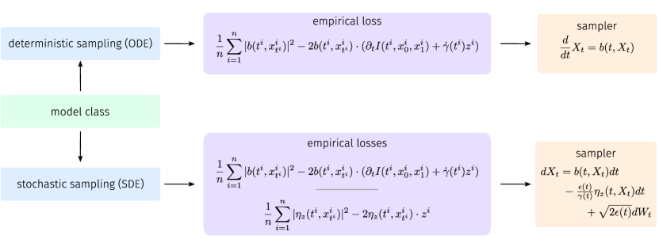

<figcaption>図3: アルゴリズム的実装。推奨される実装戦略の簡単な概観。決定論的サンプリングでは、上段の経験損失を最小化することで単一の速度場 b を学習できる。確率的サンプリングでは、速度場とノイズ除去器 η_z を、下段で指定する 2 つの経験損失を最小化することで学習できる。決定論的にサンプルするには、既製の ODE 積分器で確率フロー方程式を積分できる。確率的にサンプルするには、Euler-Maruyama 法や [32] で導入された Heun サンプラーのような標準技術で記載の SDE を積分できる。時間依存拡散係数 ε(t) は、サンプル品質を最大化するよう学習後に指定できる。</figcaption>
</figure>

### 2.2 輸送方程式、スコア、二乗目的

ここで、確率的補間 $x_{t}$ の確率分布のいくつかの重要な性質を指定する結果を述べる：

**定理（確率的補間の性質）。** (2.1) で定義される確率的補間 $x_{t}$ の確率分布は、すべての時刻 $t\in[0,1]$ で Lebesgue 測度に関して絶対連続であり、その時間依存密度 $\rho(t)$ は $\rho(0)=\rho_{0}$, $\rho(1)=\rho_{1}$ を満たし、任意の $p\in{\mathbb{N}}$ で $\rho\in C^{1}([0,1];C^{p}({\mathbb{R}}^{d}))$、かつ全 $(t,x)\in[0,1]\times{\mathbb{R}}^{d}$ で $\rho(t,x)>0$ である。加えて、$\rho$ は輸送方程式

$$
\partial_{t}\rho+\nabla\cdot\left(b\rho\right)=0,
$$

を解く。ここで速度を次で定義した

$$
b(t,x)={\mathbb{E}}[\dot{x}_{t}|x_{t}=x]={\mathbb{E}}[\partial_{t}I(t,x_{0},x_{1})+\dot{\gamma}(t)z|x_{t}=x].
$$

この速度は任意の $p\in{\mathbb{N}}$ で $C^{0}([0,1];(C^{p}({\mathbb{R}}^{d}))^{d})$ にあり、次を満たす

$$
\forall t\in[0,1]\quad:\quad\int_{{\mathbb{R}}^{d}}|b(t,x)|^{2}\rho(t,x)dx<\infty.
$$

なおこの定理は、(2.4) を次のように書けることを意味する

$$
\forall t\in[0,1]\quad:\quad\int_{{\mathbb{R}}^{d}}\phi(x)\rho(t,x)dx={\mathbb{E}}\phi(x_{t})\quad\text{任意のテスト関数}\quad\phi\in C^{\infty}_{0}({\mathbb{R}}^{d}),
$$

輸送方程式 (2.9) は、初期条件 $\rho(0)=\rho_{0}$ から時間前向きに解く（この場合 $\rho(1)=\rho_{1}$）か、終端条件 $\rho(1)=\rho_{1}$ から時間後ろ向きに解く（この場合 $\rho(0)=\rho_{0}$）かのいずれかで解ける。

この定理の証明は付録B.1 で与える。これは主に確率的補間 $x_{t}$ の特性関数を含む操作に依拠する。$\rho$ の輸送方程式 (2.9) は、速度 $b$ を推定できれば、§2.3 と §2.5 で説明するように生成モデリングと密度推定の方法を導く。この速度は特殊なケース（例えば $\rho_{0}$ と $\rho_{1}$ がともにガウス混合密度のとき）にのみ明示的に利用可能である：この場合は付録A で扱う。一般に $b$ は数値的に計算せねばならず、これは次の結果で特徴づけられるように二乗目的関数の経験的リスク最小化で行える：

**定理（目的関数）。** (2.10) で定義される速度 $b$ は、二乗目的

$$
\mathcal{L}_{b}[\hat{b}]=\int_{0}^{1}{\mathbb{E}}\left(\tfrac{1}{2}|\hat{b}(t,x_{t})|^{2}-\left(\partial_{t}I(t,x_{0},x_{1})+\dot{\gamma}(t)z\right)\cdot\hat{b}(t,x_{t})\right)dt
$$

の $C^{0}([0,1];(C^{1}({\mathbb{R}}^{d}))^{d})$ における唯一の最小化子である。ここで $x_{t}$ は (2.1) で定義され、期待値は $(x_{0},x_{1})\sim\nu$ と $z\sim{\sf N}(0,\text{\it Id})$ について独立に取られる。

この定理の証明は付録B.1 で与える：これは (2.10) の $b$ の定義、(2.12) の $\rho$ の定義、条件付き期待値のいくつかの初等的性質に依拠する。目的関数 (2.13) を実際にどう推定するかは §6 で論じる。興味深いことに、次の結果が示すように、確率密度のスコアにもアクセスできる：

**定理（スコア）。** 定理（確率的補間の性質）で指定される確率密度 $\rho$ のスコアは、任意の $p\in{\mathbb{N}}$ で $C^{1}([0,1];(C^{p}({\mathbb{R}}^{d}))^{d})$ にあり、次で与えられる

$$
s(t,x)=\nabla\log\rho(t,x)=-\gamma^{-1}(t){\mathbb{E}}(z|x_{t}=x)\quad\forall(t,x)\in(0,1)\times{\mathbb{R}}^{d}
$$

加えて次を満たし

$$
\forall t\in[0,1]\quad:\quad\int_{{\mathbb{R}}^{d}}|s(t,x)|^{2}\rho(t,x)dx<\infty,
$$

二乗目的

$$
\mathcal{L}_{s}[\hat{s}]=\int_{0}^{1}{\mathbb{E}}\left(\tfrac{1}{2}|\hat{s}(t,x_{t})|^{2}+\gamma^{-1}(t)z\cdot\hat{s}(t,x_{t})\right)dt
$$

の $C^{1}([0,1];(C^{1}({\mathbb{R}}^{d}))^{d})$ における唯一の最小化子である。ここで $x_{t}$ は (2.1) で定義され、期待値は $(x_{0},x_{1})\sim\nu$ と $z\sim{\sf N}(0,\text{\it Id})$ について独立に取られる。

この定理の証明は付録B.1 で与える。$\gamma(0)=\gamma(1)=0$ であるにもかかわらず目的関数が well-defined であることを強調する：この目的を実際にどう評価するかの詳細は §6 を参照。

###### 注意 2.6（ノイズ除去器）

量

$$
\eta_{z}(t,x)={\mathbb{E}}(z|x_{t}=x),
$$

を、§5.2 で明らかになる理由から、ノイズ除去器（denoiser）と呼ぶ。(2.14) により、この量は $\gamma(t)>0$ である $t\in(0,1)$ でスコアへのアクセスを与える。(2.14) から

$$
s(t,x)=-\gamma^{-1}(t)\eta_{z}(t,x).
$$

このノイズ除去器は (2.16) と等価な式

$$
\mathcal{L}_{\eta_{z}}[\hat{\eta}_{z}]=\int_{0}^{1}{\mathbb{E}}\left(\tfrac{1}{2}|\hat{\eta}_{z}(t,x_{t})|^{2}-z\cdot\hat{\eta}_{z}(t,x_{t})\right)dt.
$$

の最小化子である。ノイズ除去器 $\eta_{z}$ は数値的実現に有用である。特に、(2.19) の目的は (2.16) のものより使いやすい。$t$ が 0 と 1 に近づくとき注意深い扱いを要する因子 $\gamma^{-1}(t)$ を含まないからである。

スコアにアクセスできると、TE (2.9) を直ちに前向き・後ろ向き Fokker-Planck 方程式として書き直せる。これを次のように述べる：

**系（Fokker-Planck 方程式）。** 全 $t\in[0,1]$ で $\epsilon(t)\geq 0$ を満たす任意の $\epsilon\in C^{0}([0,1])$ に対し、定理（確率的補間の性質）で指定される確率密度 $\rho$ は次を満たす：

1. 前向き Fokker-Planck 方程式
$$
\partial_{t}\rho+\nabla\cdot\left(b_{\mathsf{F}}\rho\right)=\epsilon(t)\Delta\rho,\qquad\rho(0)=\rho_{0},
$$
ここで前向きドリフトを次で定義した
$$
b_{\mathsf{F}}(t,x)=b(t,x)+\epsilon(t)s(t,x).
$$
方程式 (2.20) は $t=0$ から $t=1$ へ時間前向きに解くとき well-posed であり、初期条件 $\rho(t=0)=\rho_{0}$ に対する解は $\rho(t=1)=\rho_{1}$ を満たす。
2. 後ろ向き Fokker-Planck 方程式
$$
\partial_{t}\rho+\nabla\cdot\left(b_{\mathsf{B}}\rho\right)=-\epsilon(t)\Delta\rho,\qquad\rho(1)=\rho_{1},
$$
ここで後ろ向きドリフトを次で定義した
$$
b_{\mathsf{B}}(t,x)=b(t,x)-\epsilon(t)s(t,x).
$$
方程式 (2.22) は $t=1$ から $t=0$ へ時間後ろ向きに解くとき well-posed であり、終端条件 $\rho(1)=\rho_{1}$ に対する解は $\rho(0)=\rho_{0}$ を満たす。

§2.3 でこの定理の結果を使って、前向き・後ろ向き確率微分方程式に基づく生成モデルを設計する。なお拡散係数 $\epsilon(t)$ を正の半定値テンソルで置き換えてもよい。また $\rho_{\mathsf{B}}(t_{\mathsf{B}},x)=\rho(1-t_{\mathsf{B}},x)$ と定義すれば、反転した FPE (2.22) は次のように書ける

$$
\partial_{t_{\mathsf{B}}}\rho_{\mathsf{B}}({t_{\mathsf{B}}},x)-\nabla\cdot\left(b_{\mathsf{B}}(1-{t_{\mathsf{B}}},x)\rho_{\mathsf{B}}({t_{\mathsf{B}}},x)\right)=\epsilon(1-t_{\mathsf{B}})\Delta\rho_{\mathsf{B}}({t_{\mathsf{B}}},x),\qquad\rho_{\mathsf{B}}({t_{\mathsf{B}}}=0)=\rho_{1},
$$

これは（反転した）時間 $t_{\mathsf{B}}$ で前向きに well-posed である。時間 $t$ の定義を 1 つだけにするため、(2.22) で作業する方が便利である。

これまでの主張についていくつか注意を述べる：

###### 注意 2.7

$x_{t}$ で $\gamma(t)=0$ と置く（すなわち潜在変数を除く）と、確率的補間 (2.1) は [2] で当初考えられたものに帰着する。この設定では、上の結果は形式的には成り立つが、$b(t,x)$ と $s(t,x)$ の空間的正則性を保証できない。それは（定理の証明に示すように）潜在変数の存在に依拠するからである。したがって、潜在変数 $\gamma(t)z$ の導入は、対応する ODE/SDE の解がより良く振る舞う生成モデリングと、目標 $b$ と $s$ がより正則になる統計的近似の両方で役立つと期待される。§6 で、それが $\rho_{0}$ と $\rho_{1}$ を橋渡しする方法に遥かに大きな柔軟性を与え、魅力的な性質を持つ生成モデルの設計を可能にすることも見る。

###### 注意 2.8

§2.4 で、(2.20) と (2.22) の前向き・後ろ向き FPE が、速度 $b$ とスコア $s$ の近似誤差に対して TE (2.9) より頑健であることを見る。これはこれらの方程式に基づく生成モデルに実践的含意を持つ。

###### 注意 2.9

任意の $t\in[0,1]$ での $b(t,\cdot)$ を次の最小化で得ることもできる

$$
{\mathbb{E}}\left(\tfrac{1}{2}|\hat{b}(t,x_{t})|^{2}-\left(\partial_{t}I(t,x_{0},x_{1})+\dot{\gamma}(t)z\right)\cdot\hat{b}(t,x_{t})\right)\qquad t\in[0,1]
$$

また任意の $t\in(0,1)$ での $s(t,\cdot)$ を次の最小化で得る

$$
{\mathbb{E}}\left(\tfrac{1}{2}|\hat{s}(t,x_{t})|^{2}+\gamma^{-1}(t)z\cdot\hat{s}(t,x_{t})\right)\qquad t\in(0,1)
$$

(2.13) と (2.16) で与えた時間積分版の目的を使う方が数値的に便利である。$\hat{b}$ と $\hat{s}$ を $(t,x)\in[0,1]\times{\mathbb{R}}^{d}$ で大域的にパラメータ化できるからである。

###### 注意 2.10

(2.10) から次のように書ける

$$
b(t,x)=v(t,x)-\dot{\gamma}(t)\gamma(t)s(t,x),
$$

ここで $s$ は (2.14) のスコアで、速度場を次で定義した

$$
v(t,x)={\mathbb{E}}(\partial_{t}I(t,x_{0},x_{1})|x_{t}=x).
$$

速度場 $v$ は任意の $p\in{\mathbb{N}}$ で $v\in C^{0}([0,1];(C^{p}({\mathbb{R}}^{d}))^{d})$ であり、次の唯一の最小化子として特徴づけられる

$$
\mathcal{L}_{v}[\hat{v}]=\int_{0}^{1}{\mathbb{E}}\left(\tfrac{1}{2}|\hat{v}(t,x_{t})|^{2}-\partial_{t}I(t,x_{0},x_{1})\cdot\hat{v}(t,x_{t})\right)dt
$$

この速度とスコアを別々に学習することは実際に有用かもしれない。

###### 注意 2.11

(2.13) と (2.16) の目的（および (2.19) と (2.29) のもの）は、サンプル $(x_{0},x_{1})\sim\nu$ があれば経験的推定が可能である。その場合、任意の時刻 $t\in[0,1]$ で $x_{t}=I(t,x_{0},x_{1})+\gamma(t)z$ のサンプルを生成できるからである。この特徴を以下の数値実験で使う。

###### 注意 2.12

$s$ は $\rho$ のスコアなので、それを推定する別の目的は [29]

$$
\int_{0}^{1}{\mathbb{E}}\left(|\hat{s}(t,x_{t})|^{2}+2\nabla\cdot\hat{s}(t,x_{t})\right)dt.
$$

(2.30) の導出は標準的である：読者の便宜のため付録B.1 の末尾で再掲する。(2.30) より (2.16) を使う利点は、$\hat{s}$ の発散を取る必要がないことである。

###### 注意 2.13（エネルギーベースモデル）

定義により、スコア $s(t,x)=\nabla\log\rho(t,x)$ は勾配場である。結果として、$\hat{s}(t,x)=-\nabla\hat{E}(t,x)$ とモデル化すれば、(2.16) を $\hat{E}(t,x)$ の目的関数に変えられる

$$
\mathcal{L}_{E}[\hat{E}]=\int_{0}^{1}{\mathbb{E}}\left(\tfrac{1}{2}|\nabla\hat{E}(t,x_{t})|^{2}+\gamma^{-1}(t)z\cdot\nabla\hat{E}(t,x_{t})\right)dt
$$

この目的は $\hat{E}$ の定数シフトに不変なので、$\min_{x}\hat{E}(t,x)=0$（全 $t\in[0,1]$）のような制約の下で最小化すべきである。(2.31) の最小化子は、原理的には任意の固定 $t\in[0,1]$ で例えば Langevin 動力学を使って確率的補間の PDF $\rho(t,x)$ をサンプルするのに使えるエネルギーベースモデル（EBM）を提供する。ここではこの可能性を活用せず、代わりに次の §2.3 で論じる生成モデルに依拠して $\rho(t,x)$ をサンプルする。

### 2.3 生成モデル

次の結果は定理 2.2 の直接の帰結で、TE (2.9)・前向き FPE (2.20)・後ろ向き FPE (2.22) に付随する確率過程を使って生成モデルを設計する方法を示す：

**系（生成モデル）。** 任意の時刻 $t\in[0,1]$ で、確率的補間 $x_{t}$ の法則は、それぞれ次で定義される 3 つの過程 $X_{t}$, $X^{\mathsf{F}}_{t}$, $X^{\mathsf{B}}_{t}$ の法則と一致する：

1. 輸送方程式 (2.9) に付随する確率フローの解
$$
\frac{d}{dt}X_{t}=b(t,X_{t}),
$$
初期データ $X_{t=0}\sim\rho_{0}$ から時間前向きに、または終端データ $X_{t=1}=x_{1}\sim\rho_{1}$ から時間後ろ向きに解く。
2. FPE (2.20) に付随する前向き SDE の解
$$
dX^{\mathsf{F}}_{t}=b_{\mathsf{F}}(t,X^{\mathsf{F}}_{t})dt+\sqrt{2\epsilon(t)}\,dW_{t},
$$
$W$ と独立な初期データ $X^{\mathsf{F}}_{t=0}\sim\rho_{0}$ から時間前向きに解く。
3. 後ろ向き FPE (2.22) に付随する後ろ向き SDE の解
$$
dX^{\mathsf{B}}_{t}=b_{\mathsf{B}}(t,X^{\mathsf{B}}_{t})dt+\sqrt{2\epsilon(t)}\,dW^{\mathsf{B}}_{t},\quad W_{t}^{\mathsf{B}}=-W_{1-t},
$$
$W^{\mathsf{B}}$ と独立な終端データ $X^{\mathsf{B}}_{t=1}\sim\rho_{1}$ から時間後ろ向きに解く。(2.34) の解は定義により $X^{\mathsf{B}}_{t}=Z^{\mathsf{F}}_{1-t}$ であり、$Z^{\mathsf{F}}_{t}$ は次を満たす
$$
dZ^{\mathsf{F}}_{t}=-b_{\mathsf{B}}(1-t,Z^{\mathsf{F}}_{t})dt+\sqrt{2\epsilon(t)}\,dW_{t},
$$
$W$ と独立な初期データ $Z^{\mathsf{F}}_{t=0}\sim\rho_{1}$ から時間前向きに解く。

変換 $t\mapsto 1-t$ の繰り返し適用を避けるため、次の補題で述べる反転 Itô 計算の規則を使って (2.34) を直接扱うのが便利である。この補題は [3] の結果から従い、付録B.2 で証明される：

**補題（反転 Itô 計算）。** $X^{\mathsf{B}}_{t}$ が後ろ向き SDE (2.34) を解くとき：

1. 任意の $f\in C^{1}([0,1];C_{0}^{2}({\mathbb{R}}_{d}))$ と $t\in[0,1]$ に対し、後ろ向き Itô の公式が成り立つ
$$
df(t,X^{\mathsf{B}}_{t})=\partial_{t}f(t,X^{\mathsf{B}}_{t})dt+\nabla f(X^{\mathsf{B}}_{t})\cdot dX^{\mathsf{B}}_{t}-\epsilon(t)\Delta f(t,X^{\mathsf{B}}_{t})dt.
$$
2. 任意の $g\in C^{0}([0,1];(C_{0}({\mathbb{R}}_{d}))^{d})$ と $t\in[0,1]$ に対し、後ろ向き Itô 等長性が成り立つ：
$$
{\mathbb{E}}^{x}_{\mathsf{B}}\int_{t}^{1}g(t,X^{\mathsf{B}}_{t})\cdot dW^{\mathsf{B}}_{t}=0;\qquad{\mathbb{E}}^{x}_{\mathsf{B}}\left|\int_{t}^{1}g(t,X^{\mathsf{B}}_{t})\cdot dW^{\mathsf{B}}_{t}\right|^{2}=\int_{t}^{1}{\mathbb{E}}^{x}_{\mathsf{B}}\left|g(t,X^{\mathsf{B}}_{t})\right|^{2}dt,
$$
ここで ${\mathbb{E}}^{x}_{\mathsf{B}}$ は事象 $X_{t=1}^{\mathsf{B}}=x$ で条件付けた期待値を表す。

生成モデリングにとってのこの系の意義は明らかである。例えば $\rho_{0}$ が容易にサンプルできる単純な密度（ガウスやガウス混合密度など）だと仮定すれば、ODE (2.32) または SDE (2.33) を使ってこれらのサンプルを時間前向きに押し出し、複雑な目標密度 $\rho_{1}$ からのサンプルを生成できる。§2.5 で、任意の $x\in{\mathbb{R}}^{d}$ で $\rho_{0}$ を評価できると仮定して、ODE (2.32) または逆 SDE (2.34) を使って任意の $x\in{\mathbb{R}}^{d}$ で $\rho_{1}$ を推定する方法を示す。同様の発想で $\rho_{0}$ と $\rho_{1}$ の間の交差エントロピーを推定する方法も示す。

###### 注意 2.14

確率的補間 $x_{t}$、ODE (2.32) の解 $X_{t}$、前向き・後ろ向き SDE (2.33) と (2.34) の解 $X^{\mathsf{F}}_{t}$, $X^{\mathsf{B}}_{t}$ は異なる確率過程だが、その法則はすべて任意の時刻 $t\in[0,1]$ で $\rho(t)$ と一致することを強調する。これらの過程を生成モデルとして適用するとき重要なのはこれだけである。しかし、これらの過程が異なるという事実は、任意の $t$ でそれらからサンプルするのに使う数値積分の精度と、統計的誤差の伝播に含意を持つ（次の注意も参照）。

ODE (2.32) の解 $X_{t}$、前向き SDE (2.33) の解 $X^{\mathsf{F}}_{t}$、後ろ向き SDE (2.34) の解 $X^{\mathsf{B}}_{t}$ に基づく生成モデルは、実際には有限データセット上での (2.13) と (2.16) の最小化で不完全に推定されるドリフト $b$, $b_{\mathsf{F}}$, $b_{\mathsf{B}}$ を典型的に含む。この統計的推定誤差がサンプル品質の誤差にどう伝播するか、また誤差の伝播が用いる生成モデルにどう依存するかを推定することが重要であり、それが次節の主題である。

### 2.4 尤度の制御

本節では、目的関数 (2.29) と (2.16)（または損失 (2.13) と (2.16)）を同時に最小化することが、目標密度 $\rho_{1}$ からモデル密度 $\hat{\rho}_{1}$ への $\mathsf{KL}$ ダイバージェンスを制御することを実証する。スコアを含む限界に焦点を当てるが、関係 $\eta_{z}(t,x)=-s(t,x)/\gamma(t)$ により (2.17) で定義したノイズ除去器 $\eta_{z}(t,x)$ の学習に対して類似の結果が成り立つことに注意する。導出は、異なるドリフトを持つ 2 つの輸送方程式または 2 つの Fokker-Planck 方程式の間の $\mathsf{KL}$ ダイバージェンスの単純で厳密な特徴づけに基づく。注目すべきことに、拡散項の存在が、$\mathsf{KL}$ を制御するためにドリフトを学習すれば十分かどうかを決めることが分かる。これは [57] で述べられたスコアベース拡散モデルの結果を、ODE または SDE で記述される任意の生成モデルに一般化したものと見なせる。本節の主張の証明は付録B.3 で与える。

まず、同じ初期条件から初期化されたが 2 つの異なる連続の方程式で輸送される 2 密度の間の $\mathsf{KL}$ ダイバージェンスを特徴づける：

**補題（輸送方程式間の KL）。** $\rho_{0}:{\mathbb{R}}^{d}\rightarrow{\mathbb{R}}_{\geq 0}$ を固定された基底確率密度関数とする。2 つの速度場 $b,\hat{b}\in C^{0}([0,1],(C^{1}({\mathbb{R}}^{d}))^{d})$ が与えられたとき、時間依存密度 $\rho$ と $\hat{\rho}$ を輸送方程式

$$
\partial_{t}\rho+\nabla\cdot(b\rho)=0,\quad\rho(0)=\rho_{0},\qquad\partial_{t}\hat{\rho}+\nabla\cdot(\hat{b}\hat{\rho})=0,\quad\hat{\rho}(0)=\rho_{0}.
$$

の解とする。このとき、$\hat{\rho}(1)$ からの $\rho(1)$ の Kullback-Leibler ダイバージェンスは次で与えられる

$$
\mathsf{KL}(\rho(1)\>\|\>\hat{\rho}(1))=\int_{0}^{1}\int_{{\mathbb{R}}^{d}}\left(\nabla\log\hat{\rho}(t,x)-\nabla\log\rho(t,x)\right)\cdot\big{(}\hat{b}(t,x)-b(t,x)\big{)}\rho(t,x)dxdt.
$$

この補題は、$\mathsf{KL}$ ダイバージェンスの制御を得るには一般に $\hat{b}$ を $b$ に一致させるだけでは不十分であることを示す。問題の本質は、$\hat{b}-b$ の小さな誤差が Fisher ダイバージェンス $\mathsf{FI}(\rho(t)\>\|\>\hat{\rho}(t))=\int_{{\mathbb{R}}^{d}}\left|\nabla\log\rho(t,x)-\nabla\log\hat{\rho}(t,x)\right|^{2}\rho(t,x)dx$ の制御を保証しないことにある。これは (2.39) に $\left(\nabla\log\hat{\rho}-\nabla\log\rho\right)$ が存在するため必要である。

次の補題では 2 つの Fokker-Planck 方程式の場合を研究し、状況がかなり異なることを強調する。

**補題（Fokker-Planck 方程式間の KL）。** $\rho_{0}$ を固定された基底確率密度関数とする。2 つの速度場 $b_{\mathsf{F}},\hat{b}_{\mathsf{F}}\in C^{0}([0,1],(C^{1}({\mathbb{R}}^{d}))^{d})$ が与えられたとき、時間依存密度 $\rho$ と $\hat{\rho}$ を Fokker-Planck 方程式

$$
\partial_{t}\rho+\nabla\cdot(b_{\mathsf{F}}\rho)=\epsilon\Delta\rho,\quad\rho(0)=\rho_{0},\qquad\partial_{t}\hat{\rho}+\nabla\cdot(\hat{b}_{\mathsf{F}}\hat{\rho})=\epsilon\Delta\hat{\rho},\quad\hat{\rho}(0)=\rho_{0}.
$$

の解とする（$\epsilon>0$）。このとき、$\rho(1)$ から $\hat{\rho}(1)$ への Kullback-Leibler ダイバージェンスは次で与えられる

$$
\mathsf{KL}(\rho(1)\>\|\>\hat{\rho}(1))=\int_{0}^{1}\int_{{\mathbb{R}}^{d}}\left(\nabla\log\hat{\rho}-\nabla\log\rho\right)\cdot\left(\hat{b}_{\mathsf{F}}-b_{\mathsf{F}}\right)\rho\,dxdt-\epsilon\int_{0}^{1}\int_{{\mathbb{R}}^{d}}\left|\nabla\log\rho-\nabla\log\hat{\rho}\right|^{2}\rho\,dxdt,
$$

その結果

$$
\mathsf{KL}(\rho(1)\>\|\>\hat{\rho}(1))\leq\frac{1}{4\epsilon}\int_{0}^{1}\int_{{\mathbb{R}}^{d}}\left|\hat{b}_{\mathsf{F}}(t,x)-b_{\mathsf{F}}(t,x)\right|^{2}\rho(t,x)dxdt.
$$

この補題は、輸送方程式と異なり、2 つの Fokker-Planck 方程式の解の間の $\mathsf{KL}$ ダイバージェンスがそのドリフトの誤差で制御されることを示す。各 Fokker-Planck 方程式の拡散項が $\mathsf{KL}$ ダイバージェンスに追加の負の項を提供し、Fisher ダイバージェンスへの明示的な制御の必要を除く。

以上の結果を合わせると、損失 (2.13) と (2.16) が FPE (2.20) への学習近似の尤度を制御することを実証する次の結果を述べられる。

**定理（尤度限界）。** $\rho$ を $\epsilon(t)=\epsilon>0$ の Fokker-Planck 方程式 (2.20) の解とする。2 つの速度場 $\hat{b},\hat{s}\in C^{0}([0,1],(C^{1}({\mathbb{R}}^{d}))^{d})$ が与えられたとき、

$$
\hat{b}_{\mathsf{F}}(t,x)=\hat{b}(t,x)+\epsilon\hat{s}(t,x),\qquad\hat{v}(t,x)=\hat{b}(t,x)+\gamma(t)\dot{\gamma}(t)\hat{s}(t,x)
$$

を定義する（関数 $\gamma$ は定義 2.1 の性質を満たす）。$\hat{\rho}$ を Fokker-Planck 方程式 $\partial_{t}\hat{\rho}+\nabla\cdot(\hat{b}_{\mathsf{F}}\hat{\rho})=\epsilon\Delta\hat{\rho},\ \hat{\rho}(0)=\rho_{0}$ の解とする。このとき、

$$
\mathsf{KL}(\rho_{1}\>\|\>\hat{\rho}(1))\leq\frac{1}{2\epsilon}\left(\mathcal{L}_{b}[\hat{b}]-\min_{\hat{b}}\mathcal{L}_{b}[\hat{b}]\right)+\frac{\epsilon}{2}\left(\mathcal{L}_{s}[\hat{s}]-\min_{\hat{s}}\mathcal{L}_{s}[\hat{s}]\right),
$$

ここで $\mathcal{L}_{b}[\hat{b}]$ と $\mathcal{L}_{s}[\hat{s}]$ は (2.13) と (2.16) で定義した目的関数。また

$$
\mathsf{KL}(\rho_{1}\>\|\>\hat{\rho}(1))\leq\frac{1}{2\epsilon}\left(\mathcal{L}_{v}[\hat{v}]-\min_{\hat{v}}\mathcal{L}_{v}[\hat{v}]\right)+\frac{\sup_{t\in[0,1]}(\gamma(t)\dot{\gamma}(t)-\epsilon)^{2}}{2\epsilon}\left(\mathcal{L}_{s}[\hat{s}]-\min_{\hat{v}}\mathcal{L}_{s}[\hat{s}]\right).
$$

ここで $\mathcal{L}_{v}[\hat{v}]$ は (2.29) で定義した目的関数。

###### 注意 2.15（生成モデリング）

上の結果は生成モデリングに実践的な含意を持つ。特に、損失 (2.13) と (2.16)、または (2.29) と (2.16) のいずれかを最小化することが、確率的生成モデル

$$
d\hat{X}_{t}^{\mathsf{F}}=\left(\hat{b}(t,\hat{X}_{t}^{\mathsf{F}})+\epsilon\hat{s}(t,\hat{X}_{t}^{\mathsf{F}})\right)dt+\sqrt{2\epsilon}dW_{t},
$$

の尤度を最大化する一方、目的 (2.13) の最小化は決定論的生成モデル

$$
\dot{\hat{X}}_{t}=\hat{b}(t,\hat{X}_{t}).
$$

の尤度を最大化するには一般に不十分であることを示す。さらに、$\hat{b}$ と $\hat{s}$ を学習するとき、上限を最小化する $\epsilon$ の選択は

$$
\epsilon^{*}=\left(\frac{\mathcal{L}_{b}[\hat{b}]-\min_{\hat{b}}\mathcal{L}_{b}[\hat{b}]}{\mathcal{L}_{s}[\hat{s}]-\min_{\hat{s}}\mathcal{L}_{s}[\hat{s}]}\right)^{1/2},
$$

で与えられることを示す。よってスコアが $\hat{b}$ より高精度に学習されれば $\epsilon^{*}>1$、逆の状況では $\epsilon^{*}<1$ である。なお (2.49) は、$\hat{b}$ が完全に学習され $\hat{s}$ がそうでなければ $\epsilon=0$ を取り、逆の状況では $\epsilon\to\infty$ とすることを示唆する。$\epsilon=0$ を取ることは実際に達成可能で ODE (2.32) を導くが、$\epsilon\to\infty$ はそうでない。$\epsilon$ を増やすと (2.33) と (2.34) の数値積分のコストが増えるからである。

### 2.5 密度推定と交差エントロピー計算

TE (2.9) の解が確率フロー ODE (2.32) の解で表せることはよく知られている。完全性のため、この事実を再掲する：

**補題（TE の解）。** 速度場 $\hat{b}\in C^{0}([0,1],(C^{1}({\mathbb{R}}^{d}))^{d})$ が与えられ、$\hat{\rho}$ が輸送方程式 $\partial_{t}\hat{\rho}+\nabla\cdot(\hat{b}\hat{\rho})=0$ を満たし、$X_{s,t}(x)$ が ODE $\frac{d}{dt}X_{s,t}(x)=b(t,X_{s,t}(x)),\ X_{s,s}(x)=x,\ t,s\in[0,1]$ を解くとする。このとき、PDF $\rho_{0}$ と $\rho_{1}$ が与えられたとき：

1. 初期条件 $\hat{\rho}(0)=\rho_{0}$ に対する (2.50) の解は、任意の時刻 $t\in[0,1]$ で次で与えられる
$$
\hat{\rho}(t,x)=\exp\left(-\int_{0}^{t}\nabla\cdot b(\tau,X_{t,\tau}(x))d\tau\right)\rho_{0}(X_{t,0}(x))
$$
2. 終端条件 $\hat{\rho}(1)=\rho_{1}$ に対する (2.50) の解は、任意の時刻 $t\in[0,1]$ で次で与えられる
$$
\hat{\rho}(t,x)=\exp\left(\int_{t}^{1}\nabla\cdot b(\tau,X_{t,\tau}(x))d\tau\right)\rho_{1}(X_{t,1}(x))
$$

この補題の証明は付録B.4 にある。興味深いことに、(2.20) と (2.22) の前向き・後ろ向き FPE の解についても同様の結果が得られる。これらの結果は、前向き・後ろ向きドリフトの役割が入れ替わった補助的な前向き・後ろ向き SDE を使う：

**定理（Feynman-Kac）。** $\epsilon>0$ と 2 つの速度場 $\hat{b},\hat{s}\in C^{0}([0,1],(C^{1}({\mathbb{R}}^{d}))^{d})$ が与えられたとき、

$$
\hat{b}_{\mathsf{F}}(t,x)=\hat{b}(t,x)+\epsilon\hat{s}(t,x),\qquad\hat{b}_{\mathsf{B}}(t,x)=\hat{b}(t,x)-\epsilon\hat{s}(t,x),
$$

を定義し、$Y^{\mathsf{F}}_{t}$ と $Y^{\mathsf{B}}_{t}$ を次の前向き・後ろ向き SDE の解とする：

$$
dY^{\mathsf{F}}_{t}=b_{\mathsf{B}}(t,Y^{\mathsf{F}}_{t})dt+\sqrt{2\epsilon}dW_{t},
$$

を $W$ と独立な初期条件 $Y^{\mathsf{F}}_{t=0}=x$ から時間前向きに解く；および

$$
dY^{\mathsf{B}}_{t}=b_{\mathsf{F}}(t,Y^{\mathsf{B}}_{t})dt+\sqrt{2\epsilon}dW^{\mathsf{B}}_{t},\quad W_{t}^{\mathsf{B}}=-W_{1-t},
$$

を $W^{\mathsf{B}}$ と独立な終端条件 $Y^{\mathsf{B}}_{t=1}=x$ から時間後ろ向きに解く。このとき、密度 $\rho_{0}$ と $\rho_{1}$ が与えられたとき：

1. 前向き FPE $\partial_{t}\hat{\rho}_{\mathsf{F}}+\nabla\cdot(\hat{b}_{\mathsf{F}}\hat{\rho}_{\mathsf{F}})=\epsilon\Delta\hat{\rho}_{\mathsf{F}},\ \hat{\rho}_{\mathsf{F}}(0)=\rho_{0}$ の解は $t=1$ で次のように表せる
$$
\hat{\rho}_{\mathsf{F}}(1,x)={\mathbb{E}}_{\mathsf{B}}^{x}\left(\exp\left(-\int_{0}^{1}\nabla\cdot\hat{b}_{\mathsf{F}}(t,Y^{\mathsf{B}}_{t})dt\right)\rho_{0}(Y_{t=0}^{\mathsf{B}})\right),
$$
ここで ${\mathbb{E}}_{\mathsf{B}}^{x}$ は事象 $Y_{t=1}^{\mathsf{B}}=x$ で条件付けた $Y_{t}^{\mathsf{B}}$ の経路上の期待値を表す。
2. 後ろ向き FPE $\partial_{t}\hat{\rho}_{\mathsf{B}}+\nabla\cdot(\hat{b}_{\mathsf{B}}\hat{\rho}_{\mathsf{B}})=-\epsilon\Delta\hat{\rho}_{\mathsf{B}},\ \hat{\rho}_{\mathsf{B}}(1)=\rho_{1}$ の解は $t=0$ で次のように表せる
$$
\hat{\rho}_{\mathsf{B}}(0,x)={\mathbb{E}}_{\mathsf{F}}^{x}\left(\exp\left(\int_{0}^{1}\nabla\cdot\hat{b}_{\mathsf{B}}(t,Y^{\mathsf{F}}_{t})dt\right)\rho_{1}(Y^{\mathsf{F}}_{t=1})\right),
$$
ここで ${\mathbb{E}}_{\mathsf{F}}^{x}$ は $Y^{\mathsf{F}}_{t=0}=x$ で条件付けた $Y^{\mathsf{F}}_{t}$ の経路上の期待値を表す。

この定理の証明は付録B.4 にある。なお、一方の端で PDF（それぞれ $\rho_{0}$ と $\rho_{1}$）を厳密にサンプルできると仮定して $\hat{\rho}_{\mathsf{F}}(1)$ または $\hat{\rho}_{\mathsf{B}}(0)$ からデータを生成するには、(2.54) の近似ドリフトで使う (2.33) と (2.34) の前向き・後ろ向き SDE の等価物に依然依拠する：

$$
d\hat{X}^{\mathsf{F}}_{t}=\hat{b}_{\mathsf{F}}(t,\hat{X}^{\mathsf{F}}_{t})dt+\sqrt{2\epsilon}dW_{t},\qquad d\hat{X}^{\mathsf{B}}_{t}=\hat{b}_{\mathsf{B}}(t,\hat{X}^{\mathsf{B}}_{t})dt+\sqrt{2\epsilon}dW^{\mathsf{B}}_{t},\quad W_{t}^{\mathsf{B}}=-W_{1-t},
$$

(2.61) を初期データ $\hat{X}^{\mathsf{F}}_{t=0}\sim\rho_{0}$ から時間前向きに解けば、$\hat{X}^{\mathsf{F}}_{t=1}\sim\hat{\rho}_{\mathsf{F}}(1)$ となる（$\hat{\rho}_{\mathsf{F}}$ は前向き FPE (2.57) の解）。同様に (2.62) を終端データ $\hat{X}^{\mathsf{B}}_{t=1}\sim\rho_{1}$ から時間後ろ向きに解けば、$\hat{X}^{\mathsf{B}}_{t=0}\sim\hat{\rho}_{\mathsf{B}}(0)$ となる（$\hat{\rho}_{\mathsf{B}}$ は後ろ向き FPE (2.59) の解）。

補題 2.5 と定理 2.5 の結果は、ODE (2.32) または前向き・後ろ向き SDE (2.33) と (2.34) で生成されたサンプルの品質を検証するのに使える。特に、次の 2 つの結果はそれぞれ補題 2.5 と定理 2.5 の直接の帰結である：

**系（ODE の交差エントロピー）。** 補題 2.5 と同じ条件下で、$\hat{\rho}(0)=\rho_{0}$ なら、$\rho_{1}$ に対する $\hat{\rho}(1)$ の交差エントロピーは次で与えられる

$$
\mathsf{H}(\rho_{1}\>\|\>\hat{\rho}(1))=-\int_{{\mathbb{R}}^{d}}\log\hat{\rho}(1,x)\rho_{1}(x)dx={\mathbb{E}}_{1}\int_{0}^{1}\nabla\cdot b(\tau,X_{1,\tau}(x_{1}))d\tau-{\mathbb{E}}_{1}\log\rho_{0}(X_{1,0}(x_{1}))
$$

ここで ${\mathbb{E}}_{1}$ は $x_{1}\sim\rho_{1}$ についての期待値。同様に、$\hat{\rho}(1)=\rho_{1}$ なら、$\rho_{0}$ に対する $\hat{\rho}(0)$ の交差エントロピーは次で与えられる

$$
\mathsf{H}(\rho_{0}\>\|\>\hat{\rho}(0))=-\int_{{\mathbb{R}}^{d}}\log\hat{\rho}(0,x)\rho_{0}(x)dx=-{\mathbb{E}}_{0}\int_{0}^{1}\nabla\cdot b(\tau,X_{0,\tau}(x_{0}))d\tau-{\mathbb{E}}_{0}\log\rho_{1}(X_{0,1}(x_{0}))
$$

ここで ${\mathbb{E}}_{0}$ は $x_{0}\sim\rho_{0}$ についての期待値。

**系（SDE の交差エントロピー）。** 定理 2.5 と同じ条件下で、$\rho_{1}$ に対する $\hat{\rho}_{\mathsf{F}}(1)$ の交差エントロピーは次で与えられる

$$
\mathsf{H}(\rho_{1}\>\|\>\hat{\rho}_{\mathsf{F}}(1))=-{\mathbb{E}}_{1}\log{\mathbb{E}}_{\mathsf{B}}^{x_{1}}\left(\exp\left(-\int_{0}^{1}\nabla\cdot b_{\mathsf{F}}(t,Y^{\mathsf{B}}_{t})dt\right)\rho_{0}(Y_{t=0}^{\mathsf{B}})\right),
$$

ここで ${\mathbb{E}}_{\mathsf{B}}^{x_{1}}$ は事象 $Y^{\mathsf{B}}_{t=1}=x_{1}$ で条件付けた $Y^{\mathsf{B}}_{t}$ についての期待値、${\mathbb{E}}_{1}$ は $x_{1}\sim\rho_{1}$ についての期待値。同様に、$\rho_{0}$ に対する $\hat{\rho}_{\mathsf{B}}(0)$ の交差エントロピーは次で与えられる

$$
\mathsf{H}(\rho_{0}\>\|\>\hat{\rho}_{\mathsf{B}}(0))=-{\mathbb{E}}_{0}\log{\mathbb{E}}_{\mathsf{F}}^{x_{0}}\left(\exp\left(\int_{0}^{1}\nabla\cdot b_{\mathsf{B}}(t,Y^{\mathsf{F}}_{t})dt\right)\rho_{1}(Y^{\mathsf{F}}_{t=1})\right),
$$

ここで ${\mathbb{E}}_{\mathsf{F}}^{x_{0}}$ は事象 $Y^{\mathsf{F}}_{t=0}=x_{0}$ で条件付けた $Y^{\mathsf{F}}_{t}$ についての期待値、${\mathbb{E}}_{0}$ は $x_{0}\sim\rho_{0}$ についての期待値。

(2.63)・(2.64)・(2.65)・(2.66) で $\rho_{0}$ と $\rho_{1}$ についての期待値 ${\mathbb{E}}_{0}$, ${\mathbb{E}}_{1}$ を利用可能なデータ上の経験的期待値で近似すれば、これらの方程式により $\hat{b}$ と $\hat{s}$ の異なる近似を交差検証でき、TE (2.50) で発展した密度の交差エントロピーを前向き・後ろ向き FPE (2.57) と (2.59) のものと比較できる。

###### 注意 2.16

(2.65) と (2.66) を実際に使うとき、期待値 ${\mathbb{E}}_{\mathsf{B}}^{x_{1}}$ と ${\mathbb{E}}_{\mathsf{F}}^{x_{0}}$ の $\log$ を取ることは困難を生みうる。例えば $b_{\mathsf{F}}$ や $b_{\mathsf{B}}$ の発散を計算するため Hutchinson のトレース推定量を使うとバイアスが入る。このバイアスを除く 1 つの方法は Jensen の不等式を使うことで、次の上限を導く

$$
\mathsf{H}(\rho_{1}\>\|\>\hat{\rho}_{\mathsf{F}}(1))\leq\int_{0}^{1}{\mathbb{E}}_{1}{\mathbb{E}}_{\mathsf{B}}^{x_{1}}\nabla\cdot b_{\mathsf{F}}(t,Y^{\mathsf{B}}_{t})dt-{\mathbb{E}}_{1}{\mathbb{E}}_{\mathsf{B}}^{x_{1}}\log\rho_{0}(Y_{t=0}^{\mathsf{B}}),
$$

および

$$
\mathsf{H}(\rho_{0}\>\|\>\hat{\rho}_{\mathsf{B}}(0))\leq-{\mathbb{E}}_{0}{\mathbb{E}}_{\mathsf{F}}^{x_{0}}\int_{0}^{1}\nabla\cdot b_{\mathsf{B}}(t,Y^{\mathsf{F}}_{t})dt-{\mathbb{E}}_{0}{\mathbb{E}}_{\mathsf{F}}^{x_{0}}\log\rho_{1}(Y^{\mathsf{F}}_{t=1}).
$$

しかしこれらの限界は一般に鋭くない——実際、定理 2.5 の証明と似た計算で、Jensen の不等式を適用したとき何が失われるかを正確に捉える厳密な表現を導ける：

$$
\mathsf{H}(\rho_{1}\>\|\>\hat{\rho}_{\mathsf{F}}(1))=\int_{0}^{1}{\mathbb{E}}_{1}{\mathbb{E}}_{\mathsf{B}}^{x_{1}}\left(\nabla\cdot b_{\mathsf{F}}(t,Y^{\mathsf{B}}_{t})-\epsilon|\nabla\log\hat{\rho}_{\mathsf{F}}(t,Y_{t}^{\mathsf{B}})|^{2}\right)dt-{\mathbb{E}}_{1}{\mathbb{E}}_{\mathsf{B}}^{x_{1}}\log\rho_{0}(Y_{t=0}^{\mathsf{B}}),
$$

および

$$
\mathsf{H}(\rho_{0}\>\|\>\hat{\rho}_{\mathsf{B}}(0))=-{\mathbb{E}}_{0}{\mathbb{E}}_{\mathsf{F}}^{x_{0}}\int_{0}^{1}\left(\nabla\cdot b_{\mathsf{B}}(t,Y^{\mathsf{F}}_{t})+\epsilon|\nabla\log\hat{\rho}_{\mathsf{B}}(t,Y_{t}^{\mathsf{F}})|^{2}\right)dt-{\mathbb{E}}_{0}{\mathbb{E}}_{\mathsf{F}}^{x_{0}}\log\rho_{1}(Y^{\mathsf{F}}_{t=1}).
$$

残念ながら、近似誤差により一般に $\nabla\log\hat{\rho}_{\mathsf{F}}\not=\hat{s}$ かつ $\nabla\log\hat{\rho}_{\mathsf{B}}\not=\hat{s}$ なので、(2.69) と (2.70) の右辺の追加項をどう推定するかは分からない。1 つの可能性は $\hat{s}$ を $\nabla\log\hat{\rho}_{\mathsf{F}}$ と $\nabla\log\hat{\rho}_{\mathsf{B}}$ の代理として使うことで、実際に有用かもしれないが、この近似は一般に制御されていない。

## 3 インスタンス化と拡張

本節では §2 で論じた確率的補間の枠組みをインスタンス化する。

### 3.1 拡散的補間（Diffusive interpolants）

最近、拡散的な橋過程を通じた生成モデルの構成への関心が急増している。本節では、これらのアプローチを我々のものと結びつけ、確率的補間がある種の橋過程をより単純で直接的な方法で操作できることを強調する。また、この観点が、任意の $x_{0}\in{\mathbb{R}}^{d}$ における点質量（point mass）を SDE で押し出すことで任意の目標密度 $\rho_{1}$ をサンプルする生成過程を導くことを示す。新しい種類の補間を導入することから始める：

###### 定義 3.1（拡散的補間）

2 つの確率密度関数 $\rho_{0},\rho_{1}:{{\mathbb{R}}^{d}}\rightarrow{\mathbb{R}}_{\geq 0}$ が与えられたとき、$\rho_{0}$ と $\rho_{1}$ の間の拡散的補間とは、次で定義される確率過程 $x^{\mathsf{d}}_{t}$ である

$$
x^{\mathsf{d}}_{t}=I(t,x_{0},x_{1})+\sqrt{2a(t)}B_{t},\qquad t\in[0,1],
$$

ここで：(1) $I(t,x_{0},x_{1})$ は定義 2.1 のとおり；(2) $(x_{0},x_{1})\sim\nu$ で $\nu$ は定義 2.1 の (2.3) を満たす；(3) $a(t)\in C^{2}([0,1])$ で $a(0)>0$、全 $t\in(0,1]$ で $a(t)\geq 0$；(4) $B_{t}$ は $x_{0}$, $x_{1}$ と独立な標準 Brownian bridge 過程。

経路的に、(3.1) は定義 2.1 の確率的補間とは異なる：特に $x^{\mathsf{d}}_{t}$ は時間について連続だが微分可能でない。同時に、$B_{t}$ は平均ゼロ・分散 ${\mathbb{E}}B^{2}_{t}=t(1-t)$ のガウス過程なので、$\gamma(t)=\sqrt{2a(t)t(1-t)}$ と置けば、(3.1) は確率的補間 (2.1) と同じ単一時刻統計と時間依存密度 $\rho(t,x)$ を持つ。すなわち

$$
x_{t}=I(t,x_{0},x_{1})+\sqrt{2a(t)t(1-t)}z\quad\text{with}\quad(x_{0},x_{1})\sim\nu,\ z\sim{\sf N}(0,\text{\it Id}),\ (x_{0},x_{1})\perp z.
$$

結果として、(3.1) と (3.2) は同じ生成モデルを導く。技術的には (3.1) より (3.2) で作業する方が易しい。Itô 計算の使用を避け、$\rho_{0}$, $\rho_{1}$, $\mathsf{N}(0,\text{\it Id})$ からのサンプルで $x_{t}$ を直接サンプルできるからである。しかし (3.1) は (3.2) に基づく生成モデル、すなわち $\gamma(t)=\sqrt{2a(t)t(1-t)}$ の確率的補間のいくつかの興味深い性質を明らかにする。なぜかを見るため、関係 (3.1) を使って (3.1) と (3.2) が共有する密度 $\rho(t,x)$ の輸送方程式を再導出する。単純さのため、$a(t)$ が時間について定数の場合、すなわち (3.1) で $a(t)=a>0$ と置く場合に焦点を当てる。

まず、Brownian Bridge $B_{t}$ が Wiener 過程 $W_{t}$ で $B_{t}=W_{t}-tW_{t=1}$ と表せることを思い出す。さらに、（例えば Doob の $h$ 変換で $B_{t=1}=0$ に条件付けて得られる）SDE を満たす：

$$
dB_{t}=-\frac{B_{t}}{1-t}dt+dW_{t},\qquad B_{t=0}=0.
$$

Itô の公式の直接適用により

$$
de^{ik\cdot x_{t}^{\mathsf{d}}}=ik\cdot\Big{(}\partial_{t}I(t,x_{0},x_{1})-\frac{\sqrt{2a}B_{t}}{1-t}\Big{)}e^{ik\cdot x_{t}^{\mathsf{d}}}dt-a|k|^{2}e^{ik\cdot x_{t}^{\mathsf{d}}}dt+\sqrt{2a}ik\cdot dW_{t}e^{ik\cdot x_{t}^{\mathsf{d}}}.
$$

この表現の期待値を取り、$(x_{0},x_{1})$ と $B_{t}$ の独立性を使うと

$$
\partial_{t}{\mathbb{E}}e^{ik\cdot x_{t}^{\mathsf{d}}}=ik\cdot{\mathbb{E}}\Big{(}\Big{(}\partial_{t}I(t,x_{0},x_{1})-\frac{\sqrt{2a}B_{t}}{1-t}\Big{)}e^{ik\cdot x_{t}^{\mathsf{d}}}\Big{)}-a|k|^{2}{\mathbb{E}}e^{ik\cdot x_{t}^{\mathsf{d}}}.
$$

全固定 $t\in[0,1]$ で $B_{t}\stackrel{{\scriptstyle d}}{{=}}\sqrt{t(1-t)}z$ かつ $x^{\mathsf{d}}_{t}\stackrel{{\scriptstyle d}}{{=}}x_{t}$（$x_{t}$ は (3.2)）なので、時間微分 (3.5) は次のようにも書ける

$$
\partial_{t}{\mathbb{E}}e^{ik\cdot x_{t}}=ik\cdot{\mathbb{E}}\Big{(}\Big{(}\partial_{t}I(t,x_{0},x_{1})-\frac{\sqrt{2at}\,z}{\sqrt{1-t}}\Big{)}e^{ik\cdot x_{t}}\Big{)}-a|k|^{2}{\mathbb{E}}e^{ik\cdot x_{t}}.
$$

さらに、確率密度の定義により ${\mathbb{E}}e^{ik\cdot x_{t}^{\mathsf{d}}}={\mathbb{E}}e^{ik\cdot x_{t}}=\int_{{\mathbb{R}}^{d}}e^{ik\cdot x}\rho(t,x)dx$ なので、(3.6) から $\rho(t)$ が次を満たすと推論できる

$$
\partial_{t}\rho+\nabla\cdot(u\rho)=a\Delta\rho,
$$

ここで次を定義した

$$
u(t,x)={\mathbb{E}}\Big{(}\partial_{t}I(t,x_{0},x_{1})-\frac{\sqrt{2at}\,z}{\sqrt{1-t}}\Big{|}x_{t}=x\Big{)}.
$$

(3.2) の補間 $x_{t}$ について、(2.10) と (2.14) の $b$ と $s$ の定義から

$$
b(t,x)={\mathbb{E}}\Big{(}\partial_{t}I(t,x_{0},x_{1})+\frac{a(1-2t)z}{\sqrt{2t(1-t)}}\Big{|}x_{t}=x\Big{)},\qquad s(t,x)=\nabla\log\rho(t,x)=-\frac{1}{\sqrt{2at(1-t)}}{\mathbb{E}}(z|x_{t}=x),
$$

結果として $u-s=b$ であり、(3.7) は $\Delta\rho=\nabla\cdot(s\rho)$ を使って TE (2.9) としても書ける。

注目すべきことに、(3.8) で定義したドリフト $u$ は、$\rho_{0}$ が $x_{0}$ における点質量で置き換えられても、全 $t\in[0,1]$（$t=0$ を含む）で非特異のままである；対照的に、この場合 $b$ と $s$ はともに $t=0$ で特異になる。したがって、FPE (3.7) に付随する SDE は、単一の $x_{0}$ に集中した基底測度（すなわち密度 $\rho_{0}$ が $x=x_{0}$ の点質量測度で置き換えられたもの）から $\rho_{1}$ をサンプルする生成モデルを提供する。この結果を次の定理で形式化する：

**定理（拡散的生成）。** ある $\delta\in(0,1]$ について $t\in[0,\delta]$ で $I(t,x_{0},x_{1})=x_{0}$ と仮定する。任意の $a>0$ に対し、

$$
u^{\mathsf{d}}(t,x,x_{0})={\mathbb{E}}_{x_{1},z}\Big{(}\partial_{t}I(t,x_{0},x_{1})-\frac{\sqrt{2at}\,z}{\sqrt{1-t}}\Big{|}x_{t}=x\Big{)},
$$

とする（$x_{t}$ は (3.2)、${\mathbb{E}}_{x_{1},z}(\cdot|x_{t}=x)$ は $x_{0}\in{\mathbb{R}}^{d}$ を固定して $x_{t}=x$ に条件付けた $x_{1}\sim\rho_{1}\perp z\sim\mathsf{N}(0,\text{\it Id})$ についての期待値）。このとき任意の $p\in{\mathbb{N}}$ と $x_{0}\in{\mathbb{R}}^{d}$ で $u^{\mathsf{d}}(\cdot,\cdot,x_{0})\in C^{0}([0,1];(C^{p}({\mathbb{R}}^{d}))^{d})$。さらに、前向き SDE

$$
dX_{t}^{\mathsf{d}}=u^{\mathsf{d}}(t,X_{t}^{\mathsf{d}},x_{0})dt+\sqrt{2a}\,dW_{t},\qquad X_{t=0}^{\mathsf{d}}=x_{0},
$$

の解は $X^{\mathsf{d}}_{t=1}\sim\rho_{1}$ を満たす。

なお $I(t,x_{0},x_{1})$ に置いた追加の仮定は定義 2.1 と仮定 2.5 の要件と整合する：この追加仮定は単純さのためで、おそらく $\partial_{t}I(t=0,x_{0},x_{1})=0$ に緩められる。

この定理の証明は付録B.5 で与える。これは (3.8) を導いた計算と、$t=0,\ x=x_{0}$ で $u^{\mathsf{d}}(t=0,x_{0},x_{0})={\mathbb{E}}_{x_{1}}\left(\partial_{t}I(t=0,x_{0},x_{1})\right)$、一方 $t=1$ と任意の $x\in{\mathbb{R}}^{d}$ で $u^{\mathsf{d}}(t=1,x,x_{0})=\partial_{t}I(t=1,x_{0},x)+2a\nabla\log\rho_{1}(x)$ という観察に依拠し、両者とも well-defined である。この定理の結果を位置づけるため、$b\in C^{0}([0,1];(C^{p}({\mathbb{R}}^{d}))^{d})$ を持つ確率フロー ODE は (3.11) の拡散と同じ芸当を達成できないことに注目する。そのような ODE の解は一意なので、$x_{0}$ を時刻 $t=1$ で単一の点にしか写せないからである。我々の知る限り、(3.11) は $x_{0}$ の点質量を有限時間で密度 $\rho_{1}$ に写し、そのドリフトが二乗回帰で推定できる SDE の最初の例である。実際、$u^{\mathsf{d}}(t,x,x_{0})$ は目的関数

$$
\mathcal{L}_{u^{\mathsf{d}}}[\hat{u}^{\mathsf{d}}]=\int_{0}^{1}{\mathbb{E}}_{x_{1},z}\left(|\hat{u}^{d}(t,x_{t},x_{0})|^{2}-2\Big{(}\partial_{t}I(t,x_{0},x_{1})-\frac{\sqrt{2at}z}{\sqrt{(1-t)}}\Big{)}\cdot\hat{u}^{d}(t,x_{t},x_{0})\right)dt.
$$

の唯一の最小化子である。

###### 注意 3.2（Doob の h 変換）

原理的には、上のアプローチは任意の確率的橋 $B_{t}^{x_{0},x_{1}}$ に一般化できる。これは任意の SDE の解を Doob の $h$ 変換の助けで $B_{t=0}^{x_{0},x_{1}}=x_{0}$ と $B_{t=1}^{x_{0},x_{1}}=x_{1}$ を満たすよう条件付けて得られる。しかし一般に、この構成は明示的にできない。$h$ 変換は通常解析的に利用できないからである。1 つのアプローチはそれを学習することだが、これは上のアプローチが回避する追加の困難の層を加える。

### 3.2 ガウス $\rho_{0}$ のための片側補間

事前情報がないときの生成モデリングの基底密度の一般的な選択は $\rho_{0}=\mathsf{N}(0,\text{\it Id})$ である。この設定では、潜在変数 $z$ の効果を $x_{0}$ と一緒にまとめられる。これは特に、我々の一般枠組みの中でスコアベース拡散をインスタンス化することを可能にする、より単純な種類の確率的補間を導く（§3.4 参照）。

###### 定義 3.3（片側確率的補間）

確率密度関数 $\rho_{1}:{{\mathbb{R}}^{d}}\rightarrow{\mathbb{R}}_{\geq 0}$ が与えられたとき、${\sf N}(0,\text{\it Id})$ と $\rho_{1}$ の間の片側確率的補間とは、次の確率過程 $x^{\mathsf{os}}_{t}$ である

$$
x^{\mathsf{os}}_{t}=\alpha(t)z+J(t,x_{1}),\qquad t\in[0,1]
$$

ただし：(1) $J\in C^{2}([0,1],C^{2}({\mathbb{R}}^{d})^{d})$ は境界条件 $J(0,x_{1})=0$ と $J(1,x_{1})=x_{1}$ を満たす；(2) $x_{1}$ と $z$ はそれぞれ $\rho_{1}$ と ${\sf N}(0,\text{\it Id})$ からサンプルされる独立な確率変数；(3) $\alpha:[0,1]\to{\mathbb{R}}$ は $\alpha(0)=1$, $\alpha(1)=0$, 全 $t\in[0,1)$ で $\alpha(t)>0$, $\alpha^{2}\in C^{2}([0,1])$ を満たす。

構成上 $x^{\mathsf{os}}_{t=0}=z\sim{\sf N}(0,\text{\it Id})$ かつ $x^{\mathsf{os}}_{t=1}=x_{1}\sim\rho_{1}$ なので、過程 $x^{\mathsf{os}}_{t}$ の分布は ${\sf N}(0,\text{\it Id})$ と $\rho_{1}$ を橋渡しする。$I(t,x_{0},x_{1})=J_{t}(x_{1})+\delta(t)x_{0}$ と置き $\delta^{2}(t)+\gamma^{2}(t)=\alpha^{2}(t)$ とすれば、(3.15) の片側補間が (2.1) の確率的補間と同じ密度を持つことは容易に分かる。この場合に制限すると、先の理論的結果が適用され、(2.10) の速度場 $b$ は

$$
b(t,x)={\mathbb{E}}(\dot{\alpha}(t)z+\partial_{t}J(t,x_{1})|x^{\mathsf{os}}_{t}=x),
$$

となり、(2.13) の二乗目的は

$$
\mathcal{L}_{b}[\hat{b}]=\int_{0}^{1}{\mathbb{E}}\left(\tfrac{1}{2}|\hat{b}(t,x^{\mathsf{os}}_{t})|^{2}-\left(\dot{\alpha}(t)z+\partial_{t}J(t,x_{1})\right)\cdot\hat{b}(t,x^{\mathsf{os}}_{t})\right)dt.
$$

となる。上式で $x^{\mathsf{os}}_{t}$ は (3.15) で与えられ、期待値 ${\mathbb{E}}$ は $x_{1}\sim\rho_{1}$ と $z\sim{\sf N}(0,\text{\it Id})$ について独立に取られる。同様に、スコアは

$$
s(t,x)=-\alpha^{-1}(t)\eta_{z}(t,x),\qquad\eta_{z}(t,x)={\mathbb{E}}(z|x^{\mathsf{os}}_{t}=x),
$$

で与えられる（$\eta_{z}(t,x)$ は (2.17) で定義したノイズ除去器の等価物）。これらの関数は目的

$$
\mathcal{L}_{s}[\hat{s}]=\int_{0}^{1}{\mathbb{E}}\left(\tfrac{1}{2}|\hat{s}(t,x^{\mathsf{os}}_{t})|^{2}+\gamma^{-1}(t)z\cdot\hat{s}(t,x^{\mathsf{os}}_{t})\right)dt,\qquad\mathcal{L}_{\eta_{z}}[\hat{\eta}_{z}]=\int_{0}^{1}{\mathbb{E}}\left(\tfrac{1}{2}|\hat{\eta}_{z}(t,x^{\mathsf{os}}_{t})|^{2}-z\cdot\hat{\eta}_{z}(t,x^{\mathsf{os}}_{t})\right)dt.
$$

の唯一の最小化子である。さらに、仮定 2.5 を次の要件に弱められる：

###### 仮定 3.4

密度 $\rho_{1}\in C^{2}({\mathbb{R}}^{d})$ は全 $x\in{\mathbb{R}}^{d}$ で $\rho_{1}(x)>0$ を満たし、$\int_{{\mathbb{R}}^{d}}|\nabla\log\rho_{1}(x)|^{2}\rho_{1}(x)dx<\infty$。関数 $J$ は、ある $C_{1}<\infty$ で全 $(t,x_{1})$ について $|\partial_{t}J(t,x_{1})|\leq C_{1}|x_{1}|$、かつある $M_{1},M_{2}<\infty$ で全 $t\in[0,1]$ について ${\mathbb{E}}[|\partial_{t}J(t,x_{1})|^{4}]\leq M_{1};\ {\mathbb{E}}[|\partial^{2}_{t}J(t,x_{1})|^{2}]\leq M_{2}$ を満たす（期待値は $x_{1}\sim\rho_{1}$）。

###### 注意 3.5

上の構成は $\rho_{0}=\mathsf{N}(0,C_{0})$（$C_{0}$ は正定値行列）の場合に容易に一般化できる。一般性を失わず $C_{0}=\sigma_{0}\sigma_{0}^{\mathsf{T}}$（$\sigma_{0}$ は下三角行列）と表せると仮定し、(3.15) を $x^{\mathsf{os}}_{t}=\alpha(t)\sigma_{0}z+J(t,x_{1})$（$z\sim{\sf N}(0,\text{\it Id})$、$J$ と $\alpha$ は定義 3.3 の条件を満たす）で置き換える。

### 3.3 ミラー補間

もう 1 つ実践的に重要な設定は、基底と目標が同じ密度 $\rho_{1}$ である場合である。この設定では確率的補間を次のように定義できる：

###### 定義 3.6（ミラー確率的補間）

確率密度関数 $\rho_{1}:{{\mathbb{R}}^{d}}\rightarrow{\mathbb{R}}_{\geq 0}$ が与えられたとき、$\rho_{1}$ とそれ自身の間のミラー確率的補間とは、次の確率過程 $x^{\mathsf{mir}}_{t}$ である

$$
x^{\mathsf{mir}}_{t}=K(t,x_{1})+\gamma(t)z,\qquad t\in[0,1]
$$

ただし：(1) $K\in C^{2}([0,1],C^{2}({\mathbb{R}}^{d})^{d})$ は境界条件 $K(0,x_{1})=x_{1}$ と $K(1,x_{1})=x_{1}$ を満たす；(2) $x_{1}$ と $z$ はそれぞれ $\rho_{1}$ と ${\sf N}(0,\text{\it Id})$ から独立にサンプルされる確率変数；(3) $\gamma:[0,1]\to{\mathbb{R}}$ は $\gamma(0)=\gamma(1)=0$, 全 $t\in(0,1)$ で $\gamma(t)>0$, $\gamma^{2}\in C^{1}([0,1])$ を満たす。

構成上 $x^{\mathsf{mir}}_{t=0}=x^{\mathsf{mir}}_{t=1}=x_{1}\sim\rho_{1}$ なので、過程 $x^{\mathsf{mir}}_{t}$ の分布は $\rho_{1}$ をそれ自身に橋渡しする。なお妥当な選択は $K(t,x_{1})=\alpha(t)x_{1}$（$\alpha(0)=\alpha(1)=1$、例えば $\alpha(t)=1$）である：この場合、ミラー補間はノイズ除去器に関連する（§5.2 で論じる）。

先の理論的結果が適用され、(2.10) の速度場 $b$ は $b(t,x)={\mathbb{E}}(\partial_{t}K(t,x_{1})+\dot{\gamma}(t)z|x^{\mathsf{mir}}_{t}=x)$ となり、(2.13) の二乗目的は

$$
\mathcal{L}_{b}[\hat{b}]=\int_{0}^{1}{\mathbb{E}}\left(\tfrac{1}{2}|\hat{b}(t,x^{\mathsf{mir}}_{t})|^{2}-\left(\partial_{t}K(t,x_{1})+\dot{\gamma}(t)z\right)\cdot\hat{b}(t,x^{\mathsf{mir}}_{t})\right)dt.
$$

となる。スコアは $s(t,x)=-\gamma^{-1}(t)\eta_{z}(t,x),\ \eta_{z}(t,x)={\mathbb{E}}(z|x^{\mathsf{mir}}_{t}=x)$ で与えられ、これらは目的

$$
\mathcal{L}_{s}[\hat{s}]=\int_{0}^{1}{\mathbb{E}}\left(\tfrac{1}{2}|\hat{s}(t,x^{\mathsf{mir}}_{t})|^{2}+\gamma^{-1}(t)z\cdot\hat{s}(t,x^{\mathsf{mir}}_{t})\right)dt,\qquad\mathcal{L}_{\eta_{z}}[\hat{\eta}_{z}]=\int_{0}^{1}{\mathbb{E}}\left(\tfrac{1}{2}|\hat{\eta}_{z}(t,x^{\mathsf{mir}}_{t})|^{2}-z\cdot\hat{\eta}_{z}(t,x^{\mathsf{mir}}_{t})\right)dt.
$$

の唯一の最小化子である。さらに、仮定 2.5 を次の要件に弱められる：

###### 仮定 3.7

密度 $\rho_{1}\in C^{2}({\mathbb{R}}^{d})$ は全 $x$ で $\rho_{1}(x)>0$ かつ $\int_{{\mathbb{R}}^{d}}|\nabla\log\rho_{1}(x)|^{2}\rho_{1}(x)dx<\infty$ を満たす。関数 $K$ は、ある $C_{1}<\infty$ で全 $(t,x_{1})$ について $|\partial_{t}K(t,x_{1})|\leq C_{1}|x_{1}|$、かつある $M_{1},M_{2}<\infty$ で全 $t\in[0,1]$ について ${\mathbb{E}}[|\partial_{t}K(t,x_{1})|^{4}]\leq M_{1};\ {\mathbb{E}}[|\partial^{2}_{t}K(t,x_{1})|^{2}]\leq M_{2}$ を満たす（期待値は $x_{1}\sim\rho_{1}$）。

###### 注意 3.8

興味深いことに、$K(t,x_{1})=x_{1}$ と取れば $\partial_{t}K(t,x_{1})=0$ となり、(3.26) の速度場はノイズ除去器 $\eta_{z}$ だけで完全に定まる：$b(t,x)=\dot{\gamma}(t)\eta_{z}(t,x)$。スコア $s$ も $\eta_{z}$ に依存するので、このノイズ除去器が学習すべき唯一の量になる。

###### 注意 3.9

$\rho_{1}$ が経験的サンプルでしかアクセスできない場合、ミラー補間は $\rho_{1}$ の関数形の計算を可能にしない。注目すべき例外は $0<t_{1}\leq t_{2}<1$ で $t\in[t_{1},t_{2}]$ について $K(t,x_{1})=0$ と置く場合である：その場合 $t\in[t_{1},t_{2}]$ で $x^{\mathsf{mir}}_{t}=\gamma(t)z\sim\gamma(t){\sf N}(0,\text{\it Id})$ となり、比較のための参照密度を与える。この設定では、ミラー補間は本質的に 2 つの片側補間を貼り合わせたもの（2 つ目は時間反転）、あるいは実際 $\rho_{0}=\rho_{1}$ で $t\in[t_{1},t_{2}]$ について $I(t,x_{0},x_{1})=0$ と置いた通常の確率的補間に帰着する。

### 3.4 確率的補間と Schrödinger 橋

確率的補間の枠組みは Schrödinger bridge 問題を解くのにも使える。この問題の背景については [38] とその参考文献を参照されたい。本論文の全体的な視点と整合して、Schrödinger bridge 問題の流体力学的定式化を考える。目標は、固定された $\epsilon>0$ に対し次の最適化問題を解く対 $(\rho,u)$ を得ることである

$$
\min_{\hat{u},\hat{\rho}}\int_{0}^{1}\int_{{\mathbb{R}}^{d}}|\hat{u}(t,x)|^{2}\hat{\rho}(t,x)dxdt,\quad\partial_{t}\hat{\rho}+\nabla\cdot\left(\hat{u}\hat{\rho}\right)=\epsilon\Delta\hat{\rho},\quad\hat{\rho}(0)=\rho_{0},\quad\hat{\rho}(1)=\rho_{1}
$$

仮定 2.5 の $\rho_{0}$, $\rho_{1}$ に関する仮定の下で、(3.35) が唯一の最小化子 $(\rho,u=\nabla\lambda)$ を持つことが知られている（[38] の命題 4.1 等参照）。ここで $(\rho,\lambda)$ は Euler-Lagrange 方程式の古典解：

$$
\partial_{t}\rho+\nabla\cdot\left(\nabla\lambda\rho\right)=\epsilon\Delta\rho,\quad\rho(0)=\rho_{0},\quad\rho(1)=\rho_{1},\qquad\partial_{t}\lambda+\tfrac{1}{2}|\nabla\lambda|^{2}=-\epsilon\Delta\lambda.
$$

先に進むため、(3.36) の解 $\rho$ が標準ガウスへ可逆に写せるという追加の仮定を置く：

###### 仮定 3.10

可逆写像 $T:[0,1]\times{\mathbb{R}}^{d}\to{\mathbb{R}}^{d}$（$T,T^{-1}\in C^{1}([0,1],(C^{d}({\mathbb{R}}^{d}))^{d})$）が存在して、全 $t\in[0,1]$ で $z\sim{\sf N}(0,\text{\it Id})\Rightarrow T(t,z)\sim\rho(t)$、$x_{t}\sim\rho(t)\Rightarrow T^{-1}(t,x_{t})\sim{\sf N}(0,\text{\it Id})$（$\rho$ は (3.36) の解）。

以下の議論で写像 $T$ の実際の形は重要でないことを強調する。仮定 3.10 を使って、密度が (3.36) を解く確率的補間の存在を示せる：

**補題（補間の PDF）。** 仮定 3.10 が成り立てば、(3.36) の解 $\rho(t)$ は、$\alpha^{2}(t)+\beta^{2}(t)+\gamma^{2}(t)=1$ である限り、確率的補間

$$
x_{t}=T(t,\alpha(t)T^{-1}(0,x_{0})+\beta(t)T^{-1}(1,x_{1}))+\gamma(t)z,
$$

の密度である。

証明は付録B.6 で与える：(3.38) は (2.1) で $I(t,x_{0},x_{1})=T(t,\alpha(t)T^{-1}(t,x_{0})+\beta(t)T^{-1}(t,x_{1}))$ を選ぶことに対応する。この補題の助けで、問題 (3.35) を解くため関数 $I$ をどう最適化するかを示す次の結果を確立できる。

**定理（Schrödinger 橋）。** $\gamma(0)=\gamma(1)=0$, $t\in(0,1)$ で $\gamma(t)>0$, $\gamma\in C^{2}((0,1))$, $\gamma^{2}\in C^{1}([0,1])$ なる $\gamma:[0,1]\to[0,1)$ を取り、$\hat{x}_{t}=\hat{I}(t,x_{0},x_{1})+\gamma(t)z$ とする（$x_{0}\sim\rho_{0}$, $x_{1}\sim\rho_{1}$, $z\sim{\sf N}(0,\text{\it Id})$ はすべて独立）。$\hat{I}\in C^{1}([0,1],(C^{1}({\mathbb{R}}^{d}\times{\mathbb{R}}^{d}))^{d})$ と $\hat{u}\in C^{0}([0,1],(C^{1}({\mathbb{R}}^{d}))^{d})$ 上の max-min 問題を考える：

$$
\max_{\hat{I}}\min_{\hat{u}}\int_{0}^{1}{\mathbb{E}}\left(\tfrac{1}{2}|\hat{u}(t,\hat{x}_{t})|^{2}-\left(\partial_{t}\hat{I}(t,x_{0},x_{1})+(\dot{\gamma}(t)-\epsilon\gamma^{-1}(t))z\right)\cdot\hat{u}(t,\hat{x}_{t})\right)dt.
$$

仮定 3.10 が成り立てば、(3.39) の全最適化子 $(I,u)$ は、付随する $x_{t}=I(t,x_{0},x_{1})+\gamma(t)z$ の密度が (3.36) の解 $\rho$ であるようなものである。さらに $u=\nabla\lambda$（$\lambda$ は (3.36) の解）。

証明も付録B.6 で与える。なお $\hat{I}$ を固定すれば、この目的を最小化する速度 $u$ は (2.21) で定義した前向きドリフト $b_{\mathsf{F}}$ である。また $\epsilon\to 0$ とすれば、最小化する速度場は (2.10) の $b$ で、max-min 問題は形式的に最適輸送問題を解くことに帰着する。この場合、仮定 3.10 はより厳格になる。$\epsilon=0$ の系 (3.36)（拡散項なし）が古典解を持つと仮定する必要があるからである。この定理は確率的補間で Schrödinger bridge 問題を解く実践的ルートを与え、この定式化の数値的調査は今後の課題とする。

## 4 空間的に線形な補間

本節では、(2.1) で使う関数 $I$ を $x_{0}$ と $x_{1}$ の両方について線形に特殊化したときに得られる確率的補間を研究する。すなわち

$$
x^{\mathsf{lin}}_{t}=\alpha(t)x_{0}+\beta(t)x_{1}+\gamma(t)z,
$$

を考える（$(x_{0},x_{1})\sim\nu$, $z\sim{\sf N}(0,\text{\it Id})$, $(x_{0},x_{1})\perp z$、$\alpha,\beta,\gamma^{2}\in C^{2}([0,1])$ は次を満たす）

$$
\alpha(0)=\beta(1)=1;\quad\alpha(1)=\beta(0)=\gamma(0)=\gamma(1)=0;\quad\forall t\in(0,1)\ :\ \gamma(t)>0.
$$

単純さにもかかわらず、この設定は大きな設計の柔軟性を提供する。議論は、潜在変数 $\gamma(t)z$ の存在が中間密度 $\rho(t)$ の構造をどう単純化できるかを強調する。我々の最終目標は ODE/SDE に基づく実践的生成モデルの性質の調査なので、生成 SDE のノイズ振幅を制御する時間依存拡散係数 $\epsilon(t)$ の効果も研究する。直感を養うため、ドリフト係数を解析的に計算できるガウス混合密度を $\rho_{0}$, $\rho_{1}$ に選ぶ（付録A）。これにより各選択が結果の生成モデルに与える効果を可視化できる。

### 4.1 速度場の因数分解

確率的補間が (4.1) の形のとき、(2.10) と (2.14) で定義した速度 $b$ とスコア $s$ はともに次の 3 つの条件付き期待値で表せる（3 つ目は (2.17) で定義済みのノイズ除去器）：

$$
\eta_{0}(t,x)={\mathbb{E}}(x_{0}|x^{\mathsf{lin}}_{t}=x),\quad\eta_{1}(t,x)={\mathbb{E}}(x_{1}|x^{\mathsf{lin}}_{t}=x),\quad\eta_{z}(t,x)={\mathbb{E}}(z|x^{\mathsf{lin}}_{t}=x).
$$

具体的に

$$
b(t,x)=\dot{\alpha}(t)\eta_{0}(t,x)+\dot{\beta}(t)\eta_{1}(t,x)+\dot{\gamma}(t)\eta_{z}(t,x),\qquad s(t,x)=-\gamma^{-1}(t)\eta_{z}(t,x).
$$

2 つ目の関係は $t\in(0,1)$（$\gamma(t)\not=0$）で成り立つ。さらに、定義により ${\mathbb{E}}(x_{t}|x_{t}=x)=x$ なので、$\eta_{0}$, $\eta_{1}$, $\eta_{z}$ は

$$
\forall(t,x)\in[0,1]\times{\mathbb{R}}^{d}\quad:\quad\alpha(t)\eta_{0}(t,x)+\beta(t)\eta_{1}(t,x)+\gamma(t)\eta_{z}(t,x)=x.
$$

を満たす。これにより計算コストを削減できる：3 つのうち 2 つが分かれば、3 つ目は常に (4.5) で計算できる。最後に、$\eta_{0}$, $\eta_{1}$, $\eta_{z}$ が目的

$$
\mathcal{L}_{\eta_{0}}(\hat{\eta}_{0})=\int_{0}^{1}{\mathbb{E}}\left[\tfrac{1}{2}|\hat{\eta}_{0}|^{2}-x_{0}\cdot\hat{\eta}_{0}\right]dt,\quad \mathcal{L}_{\eta_{1}}(\hat{\eta}_{1})=\int_{0}^{1}{\mathbb{E}}\left[\tfrac{1}{2}|\hat{\eta}_{1}|^{2}-x_{1}\cdot\hat{\eta}_{1}\right]dt,\quad \mathcal{L}_{\eta_{z}}(\hat{\eta}_{z})=\int_{0}^{1}{\mathbb{E}}\left[\tfrac{1}{2}|\hat{\eta}_{z}|^{2}-z\cdot\hat{\eta}_{z}\right]dt,
$$

（引数 $(t,x^{\mathsf{lin}}_{t})$ を省略）の唯一の最小化子であることは容易に分かる。期待値は $(x_{0},x_{1})\sim\nu$ と $z\sim{\sf N}(0,\text{\it Id})$ について独立に取られる。

**表4**: 線形補間。様々な線形補間を示す表。一般に本論文は任意の $\rho_{0}$, $\rho_{1}$ の手法を述べる。§4.4 で片側生成（$\rho_{0}$ がガウスで潜在変数 $z$ を $x_{0}$ に吸収できる）の線形補間を詳述する。§5.1 でスコアベース拡散モデル（SBDM）を線形片側補間として再構成する方法を論じ、分散保存パラメータ化を使うと表の式になる。線形ミラー補間（$\rho_{0}=\rho_{1}$）は $K(t,x_{1})=\alpha(t)x_{1}$ の選択で (3.25) により定義される。

| 確率的補間 | | α(t) | β(t) | γ(t) |
| --- | --- | --- | --- | --- |
| 任意 ρ₀（両側） | linear | 1−t | t | √(at(1−t)) |
| | trig | cos(πt/2) | sin(πt/2) | √(at(1−t)) |
| | enc-dec | cos²(πt)·1_{[0,1/2)}(t) | cos²(πt)·1_{(1/2,1]}(t) | sin²(πt) |
| ガウス ρ₀（片側） | linear | 1−t | t | 0 |
| | trig | cos(πt/2) | sin(πt/2) | 0 |
| | SBDM (VP) | √(1−t²) | t | 0 |
| Mirror | | 0 | 1 | √(at(1−t)) |

### 4.2 いくつかの具体的な設計選択

$\rho_{0}$ と $\rho_{1}$ が平均ゼロ・単位共分散にスケールされていると仮定すると便利である（実際にはデータのアフィン変換で達成できる）。この場合、(4.1) の時間依存平均・共分散は

$$
{\mathbb{E}}[x^{\mathsf{lin}}_{t}]=0,\qquad{\mathbb{E}}[x^{\mathsf{lin}}_{t}(x^{\mathsf{lin}}_{t})^{\mathsf{T}}]=(\alpha^{2}(t)+\beta^{2}(t)+\gamma^{2}(t))\text{\it Id}.
$$

したがって全時刻で単位共分散を保つには制約 $\forall t\in[0,1]:\alpha^{2}(t)+\beta^{2}(t)+\gamma^{2}(t)=1$ を導く。

<figure>

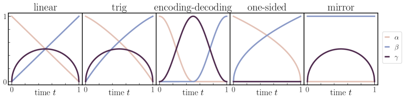

<figcaption>図5: linear (4.9)、γ(t)=√(2t(1−t)) の trigonometric (4.10)、ガウス符号化・復号 (4.11)、片側 (3.15)、ミラー (3.25) 補間に対する関数 α(t)・β(t)・γ(t)。</figcaption>
</figure>

この選択は、$\rho_{0}$ と $\rho_{1}$ の共分散が単位でなくても同程度のスケールなら妥当である。この場合 (4.8) を厳密に課す必要はなく、例えば二乗和が 1 程度の 3 関数を取ればよい。明確のため以下では (4.8) を厳密に満たす選択を論じるが、対応する $\alpha$, $\beta$, $\gamma$ は結論に大きく影響せずわずかに修正できると理解されたい。

#### 線形・三角の α と β

端点を除く $[0,1]$ 全体で $\rho_{0}$ と $\rho_{1}$ の影響を保ちつつ (4.8) を成り立たせる 1 つの方法は

$$
\alpha(t)=t,\qquad\beta(t)=1-t,\qquad\gamma(t)=\sqrt{2t(1-t)}.
$$

を選ぶことである。この選択は（潜在変数なし $\gamma=0$ で）[41] で提唱された。より余地を与える別の可能性は、任意の $\gamma:[0,1]\to[0,1]$ を取り

$$
\alpha(t)=\sqrt{1-\gamma^{2}(t)}\cos(\tfrac{1}{2}\pi t),\qquad\beta(t)=\sqrt{1-\gamma^{2}(t)}\sin(\tfrac{1}{2}\pi t).
$$

と置くことである。$\gamma=0$ では、これは [2] で好まれた選択だった。$\rho_{0}$ と $\rho_{1}$ がともにガウス混合密度のとき (4.9) と (4.10) で得られる PDF $\rho(t)$ を図6 に示す。この例が示すように、$\rho_{0}$ と $\rho_{1}$ が別個の複雑な特徴を持つとき、潜在変数の平滑化効果がなければ中間時刻の $\rho(t)$ にそれらが複製される；この挙動は図6、特に $\gamma(t)=0$ の 1 行目で最も顕著である。統計的学習の観点から、偽の特徴の形成を除くと速度場 $b$ の推定が単純になる。そうした特徴の形成が抑えられると $b$ がより滑らかになるからである。

<figure>

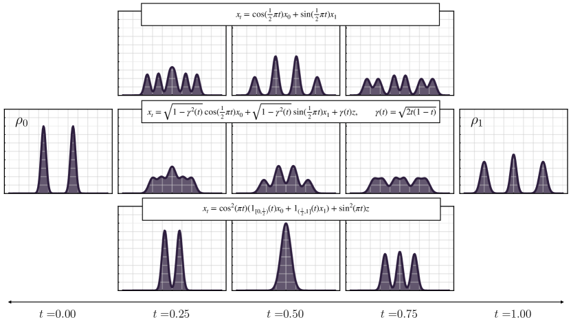

<figcaption>図6: ρ(t) への γ(t)z の効果。ρ₀ と ρ₁ がそれぞれ 2 モード・3 モードのガウス混合密度のとき、γ(t) の選択が x_lin=α(t)x₀+β(t)x₁+γ(t)z の密度をどう変えるかの可視化。1 行目は γ(t)=0（[2] の確率的補間に帰着）で、妥当な輸送を作るが中間に偽のモードを生む。2 行目は γ(t)=√(2t(1−t))。偽モードが潜在変数の付加で部分的に減衰し、より単純になる。最終行はガウス符号化・復号で、[0,1/2) で標準正規へ滑らかに符号化し (1/2,1] で復号する。この場合中間モードは形成されない。</figcaption>
</figure>

<figure>

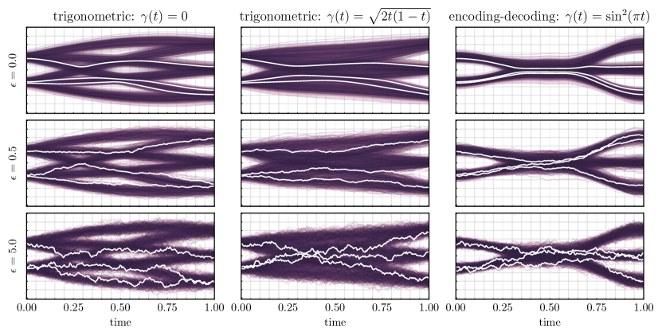

<figcaption>図7: サンプル軌道への ε の効果。ε の選択が ODE (2.32) または前向き SDE (2.33) を解いて得るサンプル軌道にどう影響するかの可視化。設定は図6 と同じ（ρ₀=ρ₁ を同じガウス混合密度に取り、b・s の解析式を使う）。各列の 3 パネルで γ は同じ、各パネルは異なる ε の軌道を示す。ε が増えても γ が同じなら密度 ρ(t) は不変だが、個々の軌道は次第に確率的になる。厳密な b・s では全選択が等価だが、定理 2.4 は、近似のとき ε の非ゼロ値が尤度の制御を与えることを示す。</figcaption>
</figure>

#### ガウス符号化・復号

有用な極限の場合は、中間点 $t=\tfrac{1}{2}$ までに $\rho_{0}$ のデータを完全にノイズへ devolve し、$t=\frac{1}{2}$ からノイズより $\rho_{1}$ を完全に再構成することである。(4.8) を満たしつつこれを可能にする 1 つの選択は

$$
\alpha(t)=\cos^{2}(\pi t)1_{[0,\frac{1}{2})}(t),\qquad\beta(t)=\cos^{2}(\pi t)1_{(\frac{1}{2},1]}(t),\qquad\gamma(t)=\sin^{2}(\pi t),
$$

ここで $1_{A}(t)$ は $A$ の指示関数。この選択では $x_{t=\frac{1}{2}}=\gamma(\tfrac{1}{2})z\sim{\sf N}(0,\gamma^{2}(\tfrac{1}{2}))$ となり、2 つの補間——$\rho_{0}$ と標準ガウスの間、標準ガウスと $\rho_{1}$ の間——を継ぎ目なく貼り合わせる。

(4.11) は $[0,\tfrac{1}{2}]$ で $\rho_{0}$ を純ノイズに符号化し、それを $[\tfrac{1}{2},1]$ で $\rho_{1}$ に復号する（時間後ろ向きでは逆）が、結果の速度 $b$ は依然 $[0,1]$ で $\rho_{0}$ を $\rho_{1}$ に写す単一の連続の方程式を定義する。これは確率フロー (2.32) のレベルで最も明確に見える。その解 $X_{t}$ は初期・終端条件の間の全単射だからである。これにより、最近のアプローチ [62] と比べ拡散による image-to-image 変換のより直接的な手段が可能になる。(4.11) は図6 の最終行に描かれ、偽のモードは全く形成されない。なお偽の中間モードの除去は、[1] で考えられたデータ適応カップリング $\nu(dx_{0},dx_{1})$ の使用でも実装できる。

当然ながら、(4.11) には $\gamma(t)>0$ が必要である：$\gamma(t)=0$ では密度 $\rho(t)$ が $t=\frac{1}{2}$ で Dirac 測度に潰れる。この考察は、潜在変数 $\gamma(t)z$ の包含が決定論的ダイナミクス (2.32) でさえ重要であり、その存在が SDE (2.33)・(2.34) に固有の確率性とは別物であることを強調する。

### 4.3 潜在変数 γ(t)z と拡散係数 ε(t) の影響

確率的補間の枠組みにより、生成モデルで使う潜在変数 $\gamma(t)z$ と拡散係数 $\epsilon(t)$ の独立な役割を見分けられる。定理 2.2 で示したように、$\gamma\neq 0$ での潜在変数 $\gamma(t)z$ の存在は、密度 $\rho(t)$ と速度 $b$ の両方を空間的に平滑化する。これはサンプル生成時に (2.32)・(2.33)・(2.34) の必要な数値積分を単純化するので計算上の利点を提供する。直感的には、$x_{t}$ の密度 $\rho(t)$ が、$\gamma(t)=0$ で得られる密度を各 $t\in(0,1)$ で $\mathsf{N}(0,\gamma^{2}(t)Id)$ と畳み込んだものとして厳密に表せるからである。

対照的に、拡散係数 $\epsilon(t)$ は密度 $\rho(t)$ を変えず、それをサンプルする仕方だけに影響する。特に、確率フロー ODE (2.32) は各 $X_{t=0}=x_{0}$ を単一の $X_{t=1}=x_{1}$ に写す写像を生む（逆も）。前向き SDE (2.33) は各 $X^{\mathsf{F}}_{t=0}=x_{0}$ を、広がりが $\epsilon(t)$ の振幅で制御されるアンサンブル $X^{\mathsf{F}}_{t=1}$ に写す。このアンサンブルは有限の $\epsilon(t)$ では $\rho_{1}$ に従って分布しない——ODE と同様、$t=1$ で $\rho_{1}$ をサンプルする解を得るには初期条件を $\rho_{0}$ からサンプルする必要がある——が、その密度は $\epsilon(t)\to\infty$ で $\rho_{1}$ に収束する。これらの特徴は図7 で例示される。

###### 注意 4.1

潜在変数 $\gamma(t)z$ を含めるもう 1 つの潜在的利点は、端点での速度 $b$ への影響である。$x_{t=0}=x_{0}$ かつ $x_{t=1}=x_{1}$ なので、(4.1) の線形補間 $x_{t}$ の速度 $b$ が次を満たすことは容易に分かる

$$
b(0,x)=\dot{\alpha}(0)x+\dot{\beta}(0){\mathbb{E}}[x_{1}]-\lim_{t\to 0}\gamma(t)\dot{\gamma}(t)s_{0}(x),\qquad b(1,x)=\dot{\alpha}(1){\mathbb{E}}[x_{0}]+\dot{\beta}(1)x-\lim_{t\to 1}\gamma(t)\dot{\gamma}(t)s_{1}(x),
$$

ここで $s_{0}=\nabla\log\rho_{0}$, $s_{1}=\nabla\log\rho_{1}$。$\gamma\in C^{2}([0,1])$ なら $\gamma(0)=\gamma(1)=0$ なのでスコア $s_{0}$, $s_{1}$ を含む項は消える。$\gamma^{2}\in C^{1}([0,1])$ だが $\gamma$ が $t=0$ や $t=1$ で微分不可能を選べば、極限が非ゼロのまま残る可能性がある。例えば §3.1 で論じた選択の 1 つ $\gamma(t)=\sqrt{at(1-t)},\ a>0$ を取ると $\lim_{t\to 0}\gamma(t)\dot{\gamma}(t)=-\lim_{t\to 1}\gamma(t)\dot{\gamma}(t)=\frac{a}{2}$ を得る。結果として (4.13) の選択は、速度 $b$ が端点で密度 $\rho_{0}$, $\rho_{1}$ のスコアの情報を符号化することを保証する。ただし (4.13) の $\gamma(t)$ の選択は端点での $b$ への非自明な影響ゆえ魅力的だが、利用者は様々な代替を自由に探れる。表8 にいくつか例を示し、$t=0,1$ での $\gamma$ の微分可能性を指定する。ODE を生成モデルに使うときスコアは $b$ を通じてのみ感じられるが、SDE を使うときは明示的である。

**表8**: γ(t)z の微分可能性。$\hat{\sigma}(t)$ 列はシグモイド関数の和（$\sigma(t)=e^{t}/(1+e^{t})$、$f$ はスケール因子）。

| γ(t): | √(at(1−t)) | t(1−t) | σ̂(t) | sin²(πt) |
| --- | --- | --- | --- | --- |
| t=0,1 で C¹ | ✗ | ✓ | ✓ | ✓ |

### 4.4 空間的に線形な片側補間

上の議論の多くは、(3.15) の関数 $J(t,x_{1})$ を $x_{1}$ について線形に取り

$$
x^{\mathsf{os,lin}}_{t}=\alpha(t)z+\beta(t)x_{1},\qquad t\in[0,1]
$$

と定義すれば片側補間に一般化する（$\alpha^{2},\beta\in C^{2}([0,1])$, $\alpha(0)=\beta(1)=1$, $\alpha(1)=\beta(0)=0$, 全 $t\in[0,1)$ で $\alpha(t)>0$）。(2.10) と (2.14) の速度 $b$ とスコア $s$ は

$$
b(t,x)=\dot{\alpha}(t)\eta^{\mathsf{os}}_{z}(t,x)+\dot{\beta}(t)\eta^{\mathsf{os}}_{1}(t,x),\qquad s(t,x)=-\alpha^{-1}(t)\eta^{\mathsf{os}}_{z}(t,x),
$$

と表せる（2 つ目は全 $t\in[0,1)$ で成り立ち、$\eta^{\mathsf{os}}_{z}(t,x)={\mathbb{E}}(z|x^{\mathsf{os,lin}}_{t}=x)$, $\eta^{\mathsf{os}}_{1}(t,x)={\mathbb{E}}(x_{1}|x^{\mathsf{os,lin}}_{t}=x)$）。条件付き期待値の定義により $\alpha(t)\eta^{\mathsf{os}}_{z}+\beta(t)\eta^{\mathsf{os}}_{1}=x$ を満たすので、片方だけ推定すればよい。例えば $\beta(t)\not=0$ なる全 $t$ で $\eta^{\mathsf{os}}_{1}$ を $\eta^{\mathsf{os}}_{z}$ の関数で表し、速度 (4.16) を

$$
b(t,x)=\dot{\beta}(t)\beta^{-1}(t)x+\big{(}\dot{\alpha}(t)-\alpha(t)\dot{\beta}(t)\beta^{-1}(t)\big{)}\eta^{\mathsf{os}}_{z}(t,x)\qquad\forall t\ :\ \beta(t)\not=0.
$$

と表せる。全 $t\in(0,1]$ で $\beta(t)\not=0$ と仮定すると、この式は $t=0$ で $b(0,x)=\dot{\alpha}(0)x+\dot{\beta}(0){\mathbb{E}}[x_{1}]$（$x^{\mathsf{os,lin}}_{t=0}=z$ より）を補えばよい。§5.2 で、(4.19) の速度 $b$ で確率フロー ODE (2.32) を解くことが、ノイズ除去器を使って生成モデルを構成することと見なせると示す。最後に、$\eta_{z}$ と/または $\eta_{1}$ は次の 2 目的でそれぞれ推定できる：

$$
\mathcal{L}_{\eta_{z}}(\hat{\eta}^{\mathsf{os}}_{z})=\int_{0}^{1}{\mathbb{E}}\left[\tfrac{1}{2}|\hat{\eta}^{\mathsf{os}}_{z}|^{2}-z\cdot\hat{\eta}^{\mathsf{os}}_{z}\right]dt,\qquad \mathcal{L}_{\eta_{1}}(\hat{\eta}^{\mathsf{os}}_{1})=\int_{0}^{1}{\mathbb{E}}\left[\tfrac{1}{2}|\hat{\eta}^{\mathsf{os}}_{1}|^{2}-x_{1}\cdot\hat{\eta}^{\mathsf{os}}_{1}\right]dt.
$$

## 5 他の手法との関連

本節では、確率的補間の枠組みと、スコアベース拡散法・確率的局在化（stochastic localization）枠組み・ノイズ除去法・[41] で導入された整流フロー法との関連を論じる。

### 5.1 スコアベース拡散モデルと確率的局在化

スコアベース拡散モデル（SBDM）は Ornstein-Uhlenbeck 過程

$$
dZ_{\tau}=-Z_{\tau}dt+\sqrt{2}dW_{\tau},\qquad Z_{\tau=0}\sim\rho_{1},
$$

の変種に基づく。これは時刻 $\tau$ での解の周辺密度が $\tau\to\infty$ で標準正規に収束する性質を持つ。$Z_{\tau}$ の密度のスコアを学習することで、(5.1) の付随する後ろ向き SDE を書け、それを生成モデルに使える——この後ろ向き SDE は確率的局在化過程で使われるものでもある（[45] 参照）。

確率的補間との関連を見るため、初期条件 $Z_{\tau=0}=x_{1}\sim\rho_{1}$ からの (5.1) の解が厳密に $Z_{\tau}=x_{1}e^{-\tau}+\sqrt{2}\int_{0}^{\tau}e^{-\tau+s}dW_{s}$ と書けることに注意する。結果として、$Z_{\tau=0}=x_{1}$ で条件付けた $Z_{\tau}$ の法則は任意の $\tau\in[0,\infty)$ で $Z_{\tau}\sim{\sf N}(x_{1}e^{-\tau},(1-e^{-2\tau}))$ で与えられる。これは過程

$$
y_{\tau}=x_{1}e^{-\tau}+\sqrt{1-e^{-2\tau}}\,z,\qquad z\sim{\sf N}(0,\text{\it Id}),\qquad\tau\in[0,\infty).
$$

の法則でもある。$x_{1}\sim\rho_{1}$（$x_{1}\perp z$）とすると、過程 $y_{\tau}$ は片側確率的補間に似るが、$y_{\tau}$ の密度は $\tau\to\infty$ でのみ ${\sf N}(0,\text{\it Id})$ に収束する；対照的に §3.2 の片側補間は有限区間 $[0,1]$ で収束する。SBDM ではこれを、$Z_{\tau}$ の発展を有限区間 $[0,T]$（$T<\infty$）に打ち切り、$[0,T]$ に制限した (5.1) の後ろ向き SDE を使うことで扱う。しかしこれは片側確率的補間にはないバイアスを導入する。SBDM の後ろ向き SDE に使う終端条件が、過程 (5.1) の密度が時刻 $T$ でガウスでないにもかかわらず ${\sf N}(0,\text{\it Id})$ からサンプルされるからである。

しかし、$t=e^{-\tau}$ と定義し (4.15) の $\alpha(t)$, $\beta(t)$ を特定の形に選ぶことで、(5.4) を片側線形確率的補間に変えられる。より正確には、(5.4) を $\tau=-\log t$ で評価すると

$$
y_{\tau=-\log t}=\sqrt{1-t^{2}}z+tx_{1}\equiv x^{\mathsf{os,lin}}_{t}\quad\text{for}\quad\alpha(t)=\sqrt{1-t^{2}},\quad\beta(t)=t.
$$

この $\alpha(t)$, $\beta(t)$ の選択で、(4.16) から速度場

$$
b(t,x)=-\frac{t}{\sqrt{1-t^{2}}}\eta^{\mathsf{os}}_{z}(t,x)+\eta^{\mathsf{os}}_{1}(t,x)\equiv ts(t,x)+\eta^{\mathsf{os}}_{1}(t,x)
$$

を得る（$\eta_{z}^{\mathsf{os}}$, $\eta_{1}^{\mathsf{os}}$ は (4.17)）。この式は、確率フロー ODE (2.32) に使う速度 $b$ が、$\dot{\alpha}(t)$ が特異になる $t=1$ を含む全時刻で良く振る舞うことを示す。前向き SDE (2.33) に使うドリフト $b_{\mathsf{F}}(t,x)=b(t,x)+\epsilon(t)s(t,x)$ も、$\epsilon\geq0$ の任意の $\epsilon\in C^{0}([0,1])$ の選択によらず同様である。これは SBDM を片側線形確率的補間 (4.15) に書き直すと、$t\in[0,1]$ で動作するバイアスのない生成モデルを構成できることを示す。これは追加の計算コストなしで実現される。(4.17) の 2 関数のうち 1 つだけ推定すればよく、これは SBDM のスコア推定に似ているからである。

上の手続きを、拡散過程 (5.1) のレベルでの等価な時間変更と比べる価値がある。これは数値的・解析的困難をもたらす特異項を導く。実際、$Z^{\mathsf{B}}_{t}=Z_{\tau=-\log t}$ と定義すると、(5.1) から $dZ^{\mathsf{B}}_{t}=t^{-1}Z^{\mathsf{B}}_{t}dt+\sqrt{2t^{-1}}dW^{\mathsf{B}}_{t},\ Z^{\mathsf{B}}_{t=1}\sim\rho_{1}$ を時間後ろ向きに解くものを得る。因子 $t^{-1}$ のため、この SDE は元の (5.1) の $\tau=\infty$ に対応する $t=0$ まで容易に解けない。同じ理由で、(5.7) に付随する前向き SDE $dZ^{\mathsf{F}}_{t}=t^{-1}Z^{\mathsf{F}}_{t}dt+2t^{-1}s(t,Z^{\mathsf{F}}_{t})dt+\sqrt{2t^{-1}}dW_{t}$ は、形式的に $Z^{\mathsf{F}}_{t=0}\stackrel{{\scriptstyle d}}{{=}}Z_{\tau=\infty}\sim\mathsf{N}(0,\text{\it Id})$ である $t=0$ から解けない。これは、$t>0$ から始めない限り生成モデルに使えないことを意味し、バイアスを導入する。重要なことに、この問題は確率的補間の枠組みでは生じない。$\rho_{0}$ と $\rho_{1}$ を結ぶ密度 $\rho(t)$ の構成が、$\rho(t)$ からサンプルを生成する過程の構成とは別に扱われるからである。対照的に SBDM はこの 2 操作を 1 つにまとめ、(5.7) と (5.8) の係数の $t=0$ での特異性を導く。

###### 注意 5.1

上の最後の点を強調すると、(5.8) で特異なドリフト・拡散係数を持つことと、確率的補間で非特異な SDE を書けることの間に矛盾はないことを強調する。理由を見るには、確率的補間が (5.8) の拡散係数を $\epsilon\geq0$ の任意の非特異 $\epsilon\in C^{0}([0,1])$ に変えてこの SDE を

$$
dX^{\mathsf{F}}_{t}=t^{-1}Z^{\mathsf{F}}_{t}dt+(t^{-1}+\epsilon(t))s(t,X^{\mathsf{F}}_{t})dt+\sqrt{2\epsilon(t)}dW_{t},
$$

で置き換えられると教えることに注意する。この SDE は $X^{\mathsf{F}}_{t=0}\sim\rho_{0}$ なら $X^{\mathsf{F}}_{t=1}\sim\rho_{1}$ という性質を持ち、そのドリフトも $t=0$ で非特異で正確に (5.6) で与えられる。実際、制約 (4.18)（ここでは $x=\sqrt{1-t^{2}}\eta^{\mathsf{os}}_{z}(t,x)+t\eta^{\mathsf{os}}_{1}(t,x)\equiv-(1-t^{2})s(t,x)+t\eta^{\mathsf{os}}_{1}(t,x)$）を使うと、$t^{-1}x+t^{-1}s(t,x)=ts(t,x)+\eta_{1}^{\mathsf{os}}(t,x)$ が $t=0$ で非特異だと容易に分かる。

### 5.2 ノイズ除去法

(4.15) の空間的線形片側確率的補間を考える。$x_{1}$ について解くと $x_{1}=\beta^{-1}(t)\left(x^{\mathsf{os,lin}}_{t}-\alpha(t)z\right),\ t\in(0,1]$ を得る。固定 $x^{\mathsf{os,lin}}_{t}$ で条件付き期待値を取り (4.17) を使うと

$$
{\mathbb{E}}(x_{1}|x^{\mathsf{os,lin}}_{t})=\eta^{\mathsf{os}}_{1}(t,x^{\mathsf{os,lin}}_{t})=\beta^{-1}(t)\left(x^{\mathsf{os,lin}}_{t}-\alpha(t)\eta^{\mathsf{os}}_{z}(t,x^{\mathsf{os,lin}}_{t})\right)\qquad t\in(0,1]
$$

一方 $x^{\mathsf{os,lin}}_{t=0}=z$ なので自明に ${\mathbb{E}}(x_{1}|x^{\mathsf{os,lin}}_{t=0})={\mathbb{E}}[x_{1}]$。この式はノイズ除去法で広く使われ、$x^{\mathsf{os,lin}}_{t}$ のノイズ情報が与えられたときの $x_{1}$ に対する Stein の不偏リスク推定量（SURE）である。$x_{1}$ の条件付き期待値の代わりに、任意の $s\in[0,1]$ で $x_{s}^{\mathsf{os,lin}}$ の類似量を考えられ、次の結果を導く。

###### 補題 5.2（SURE）

$s\in[0,1]$ について

$$
{\mathbb{E}}(x^{\mathsf{os,lin}}_{s}|x^{\mathsf{os,lin}}_{t})=\frac{\beta(s)}{\beta(t)}x^{\mathsf{os,lin}}_{t}+\left(\alpha(s)-\frac{\alpha(t)\beta(s)}{\beta(t)}\right)\eta^{\mathsf{os}}_{z}(t,x^{\mathsf{os,lin}}_{t})\qquad t\in(0,1]
$$

かつ ${\mathbb{E}}(x^{\mathsf{os,lin}}_{s}|x^{\mathsf{os,lin}}_{t=0})=\alpha(s)x^{\mathsf{os,lin}}_{t=0}+\beta(s){\mathbb{E}}[x_{1}]$。

###### 証明

(5.13) は (5.11) を $x^{\mathsf{os,lin}}_{s}$ の式に代入し、(4.17) の $\eta_{1}^{\mathsf{os}}$ と $\eta_{z}^{\mathsf{os}}$ の定義を使って条件付き期待値を取れば従う。${\mathbb{E}}(x^{\mathsf{os,lin}}_{s}|x^{\mathsf{os,lin}}_{t=0})=\alpha(s)x^{\mathsf{os,lin}}_{t=0}+\beta(s){\mathbb{E}}[x_{1}]$ は $x^{\mathsf{os,lin}}_{t=0}=z$ と (5.11) から従う。∎

この段階では、(5.11) と (5.13) は生成モデルに使えない：確率変数 ${\mathbb{E}}(x_{1}|x^{\mathsf{os,lin}}_{t})$ は $\rho_{1}$ のサンプルでなく、${\mathbb{E}}(x^{\mathsf{os,lin}}_{s}|x^{\mathsf{os,lin}}_{t})$ は $x^{\mathsf{os,lin}}_{s}$ の密度 $\rho(s)$ のサンプルでない。しかし次の結果は、公式 (5.13) を無限小ステップで反復すれば、$x^{\mathsf{os,lin}}_{t}$ に付随する確率フロー方程式 (2.32) と整合する生成モデルを得ることを示す。

**定理（ノイズ除去）。** $t_{j}=j/N$（$j\in\{1,\ldots,N\}$）とし、$X^{\mathsf{den}}_{1}=z$ と置き、$j=1,\ldots,N-1$ について

$$
X^{\mathsf{den}}_{{j+1}}=\frac{\beta(t_{j+1})}{\beta(t_{j})}X^{\mathsf{den}}_{j}+\left(\alpha(t_{j+1})-\frac{\alpha(t_{j})\beta(t_{j+1})}{\beta(t_{j})}\right)\eta^{\mathsf{os}}_{z}(t_{j},X^{\mathsf{den}}_{j}).
$$

と定義する。このとき (5.14) は、(4.19) のように表した速度場 (4.16) に付随する確率フロー方程式 (2.32) の整合的な積分スキームである。すなわち $N,j\to\infty$ で $j/N\to t\in[0,1]$ なら $X^{\mathsf{den}}_{j}\to X_{t}$、ここで

$$
\dot{X}_{t}=b(t,X_{t})=\frac{\dot{\beta}(t)}{\beta(t)}X_{t}+\left(\dot{\alpha}(t)-\frac{\alpha(t)\dot{\beta}(t)}{\beta(t)}\right)\eta^{\mathsf{os}}_{z}(t,X_{t}),\quad X_{t=0}=z.
$$

特に $z\sim{\sf N}(0,\text{\it Id})$ なら、この極限で $X^{\mathsf{den}}_{N}\to x_{1}\sim\rho_{1}$。

この定理の証明は付録B.7 で与え、(5.14) の右辺の Taylor 展開で進める。

### 5.3 整流フロー（Rectified flows）

ここで、確率的補間を [41] で提案された手続きに従って整流（rectify）する方法を論じる。与えられた確率的補間について確率フロー方程式 (2.32) の速度場 $b$ を完全に学習したとする。この ODE の初期条件 $X_{t=0}(x)=x$ の解を $X_{t}(x)$ とする：$\frac{d}{dt}X_{t}(x)=b(t,X_{t}(x))$。写像 $X_{t=1}:{\mathbb{R}}^{d}\to{\mathbb{R}}^{d}$ を使って、$z\sim{\sf N}(0,\text{\it Id})$ で新しい確率的補間

$$
x^{\mathsf{rec}}_{t}=\alpha(t)z+\beta(t)X_{t=1}(z),
$$

を定義できる（$\alpha^{2},\beta\in C^{2}([0,1])$, $\alpha(0)=\beta(1)=1$, $\alpha(1)=\beta(0)=0$, 全 $t\in[0,1)$ で $\alpha(t)>0$）。明らかに $X_{t=0}(z)=z$ より $x^{\mathsf{rec}}_{t=0}=z\sim\rho_{0}$、確率フロー方程式の定義より $x^{\mathsf{rec}}_{t=1}=X_{t=1}(z)\sim\rho_{1}$。速度場

$$
b^{\mathsf{rec}}(t,x)={\mathbb{E}}[\dot{x}^{\mathsf{rec}}_{t}|x^{\mathsf{rec}}_{t}=x]=\dot{\alpha}(t){\mathbb{E}}[z|x^{\mathsf{rec}}_{t}=x]+\dot{\beta}(t){\mathbb{E}}[X_{t=1}(z)|x^{\mathsf{rec}}_{t}=x].
$$

に付随する新しい確率フロー方程式を定義できる。この速度場は推定可能で、目的

$$
\mathcal{L}_{b^{\mathsf{rec}}}[\hat{b}^{\mathsf{rec}}]=\int_{0}^{1}{\mathbb{E}}\big{[}\tfrac{1}{2}|\hat{b}^{\mathsf{rec}}(t,x^{\mathsf{rec}}_{t})|^{2}-(\dot{\alpha}(t)z+\dot{\beta}(t)X_{t=1}(z))\cdot\hat{b}^{\mathsf{rec}}(t,x^{\mathsf{rec}}_{t})\big{]}dt,
$$

の唯一の最小化子である（期待値は $z\sim{\sf N}(0,\text{\it Id})$ のみ）。次の結果は、(5.18) の速度場に付随する確率フロー方程式が直線解を持つが、最終的に (5.16) に基づくものと同一の生成モデルを導くことを示す。これを述べるため、まず $x_{t}^{\mathsf{rec}}$ の可逆性を仮定する。

###### 仮定 5.3

写像 $x\to M(t,x)$（$M(t,x)=\alpha(t)x+\beta(t)X_{t=1}(x)$、$X_{t}(x)$ は (5.16) の解）は全 $(t,x)\in[0,1]\times{\mathbb{R}}^{d}$ で可逆である。すなわち $N(t,M(t,x))=M(t,N(t,x))=x$ なる $N(t,\cdot):{\mathbb{R}}^{d}\to{\mathbb{R}}^{d}$ が存在する。

これは $M(t,x)$ のヤコビ行列式が全 $(t,x)$ で非ゼロであることと等価；言い換えると、仮定 5.3 は $X_{t=1}(x)$ のヤコビアンが固有値 $-\alpha(t)/\beta(t)$ を厳密には持たないことを要求し、これは一般的である。この仮定の下で次の定理を述べる。

**定理（整流）。** (5.18) に付随する確率フロー方程式 $\frac{d}{dt}X^{\mathsf{rec}}_{t}(x)=b^{\mathsf{rec}}(t,X^{\mathsf{rec}}_{t}(x)),\ X^{\mathsf{rec}}_{t=0}(x)=x$ を考える。このとき全解は $z\sim{\sf N}(0,\text{\it Id})$ なら $X^{\mathsf{rec}}_{t=1}(z)\sim\rho_{1}$ を満たす。加えて、仮定 5.3 が成り立てば、(5.18) の速度場は $b^{\mathsf{rec}}(t,x)=\dot{\alpha}(t)N(t,x)+\dot{\beta}(t)X_{t=1}(N(t,x))$ に簡約され、確率フロー ODE (5.21) の解は単に $X^{\mathsf{rec}}_{t}(x)=\alpha(t)x+\beta(t)X_{t=1}(x)$ である。

証明は付録B.8 で与える。

定理 5.3 は $X^{\mathsf{rec}}_{t}(x)$ が $X_{t}(x)$ より単純なフローであることを含意するが、両者は同じ写像 $X^{\mathsf{rec}}_{t=1}=X_{t=1}$ を与えることを強調する。特に $\alpha(t)=1-t$, $\beta(t)=t$ では $X^{\mathsf{rec}}_{t}(x)$ は $x$ と $X_{t=1}(x)$ の間の直線に簡約される。このアプローチは単一ステップ写像の学習にも使える。(5.22) と $N(t=0,x)=x$ から $b^{\mathsf{rec}}(t=0,x)=\dot{\alpha}(0)x+\dot{\beta}(0)X_{t=1}(x)$ となり、$\dot{\beta}(0)\not=0$ である限り $X_{t=1}(x)$ を既知量で表す。例えば $\dot{\alpha}(0)=0$, $\dot{\beta}(0)=1$ なら $b^{\mathsf{rec}}(t=0,x)=X_{t=1}(x)$ を得る。

###### 注意 5.4（最適輸送）

上の議論は、確率フロー方程式が直線解を持ち $\rho_{0}$ を $\rho_{1}$ に厳密に押し出す写像を導きうるが、それが最適輸送写像ではないことを強調する。すなわち直線解は最適輸送の必要条件だが十分条件ではない。

###### 注意 5.5（勾配場）

整流手続きで写像が変わらないのは、速度 $b^{\mathsf{rec}}(t,x)$ が勾配場であることを課さないからである。$b^{\mathsf{rec}}(t,x)=\nabla\phi(t,x)$ としてこの構造を課せば $X_{t=1}^{\mathsf{rec}}\not=X_{t=1}$。[40] に示すように、この手続きを反復すると最終的に最適輸送写像を得る。すなわち勾配場上で実装し無限に反復すると、整流は写像の Brenier 極分解を計算する。

###### 注意 5.6（Consistency models）

最近の研究は consistency models の概念を導入した。これはスコアベース拡散で学習した速度場を単一ステップ写像に蒸留する。§5.1 と前述の議論は consistency models の別の視点を提供し、確率的補間の枠組みで整流を介してそれらをどう計算できるかを示す。

## 6 アルゴリズム的側面

前節で述べた手法は効率的な数値的実現を持つ。ここではアルゴリズムと実装の実践的推奨を詳述する。これらの提案は 2 つの補完的タスク——ドリフト係数の学習と、ODE/SDE でのサンプリング——に分けられる。

### 6.1 学習

§2.2 で述べたように、(2.9)・(2.20)・(2.22) のドリフト係数の学習にはさまざまなアルゴリズム的選択がある。数値・統計誤差がなければ全選択が厳密な生成モデルを導くが、実際にはこれらの誤差の存在により異なる選択が異なる生成モデルを導き、一部は特定の応用でより良く機能しうる。

#### 決定論的生成モデリング：$b$ を学習するか $v$ と $s$ を学習するか

§2.2 から、輸送方程式 (2.9) のドリフト $b$ は $b(t,x)=v(t,x)-\gamma(t)\dot{\gamma}(t)s(t,x)$ と書ける。これは、経験的リスク $\hat{\mathcal{L}}_{b}(\hat{b})=\frac{1}{N}\sum_{i=1}^{N}(\frac{1}{2}|\hat{b}(t_{i},x_{t_{i}}^{i})|^{2}-\hat{b}(t_{i},x_{t_{i}}^{i})\cdot(\partial_{t}I(t_{i},x_{0}^{i},x_{1}^{i})+\dot{\gamma}(t_{i})z^{i}))$ を最小化して $b$ の推定 $\hat{b}$ を学習する方が良いか、それとも経験的リスク $\hat{\mathcal{L}}_{v}(\hat{v})$ と $\hat{\mathcal{L}}_{s}(\hat{s})$ を最小化して $\hat{v}$ と $\hat{s}$ を学習し $\hat{b}(t,x)=\hat{v}(t,x)-\gamma(t)\dot{\gamma}(t)\hat{s}(t,x)$ を構成する方が良いか、という実践的問いを生む。決定論的生成モデル（例えば適応積分や厳密尤度計算を活用するため）に関心があれば、推定 $\hat{b}$ を直接学習するのは単一モデルの学習で済み、通常より効率的である（アルゴリズム1）。確率的・決定論的の両方に関心があれば、大半の補間の選択で 2 モデルを学習する必要がある。

```
アルゴリズム1 任意の ρ₀, ρ₁ での b の学習
入力: バッチサイズ N、補間関数 I(t,x₀,x₁)、x₀,x₁ をサンプルするカップリング ν(dx₀,dx₁)、
     ノイズ関数 γ(t)、初期パラメータ θ_b、L_b (2.13) を最小化する勾配ベース最適化、勾配ステップ数 N_g
返り値: b の推定 b̂
for j=1,…,N_g do
    N サンプル (tᵢ,x₀ⁱ,x₁ⁱ,zⁱ) ∼ Unif([0,1])×ν×N(0,1) を引く
    サンプル x_tⁱ = I(tᵢ,x₀ⁱ,x₁ⁱ)+γ(tᵢ)zⁱ を構成
    L_b(θ_b,{x_tⁱ}) について勾配ステップを取る
Return: b̂
```

#### Antithetic サンプリングと capping

実際には、$b$ (2.13) と $s$ (2.16) の損失は、特異項 $1/\gamma(t)$ と（潜在的に）特異な項 $\dot{\gamma}(t)$ の存在により端点 $t=0,1$ 付近で高分散になりうる。これは antithetic サンプリング（対の符号反転サンプリング）で除ける。$\gamma^{-1}(t)$ を含む目的の安定な学習に必要だった。理由を示すため $s$ の損失 (2.16) を考える（$b$ や $\eta_{z}$ も同様）。$x_{t}$ の定義と Taylor 展開により、$t\to0$ または $t\to1$ で $\frac{1}{\gamma(t)}z\cdot s(t,x_{t})=\frac{1}{\gamma(t)}z\cdot s(t,I)+z\cdot\nabla s(t,I)z+o(1)$。右辺第 1 項は条件付き平均が有限だが分散が発散する。対照的に $x_{t}^{\pm}=I(t,x_{0},x_{1})\pm\gamma(t)z$ とすると、$\frac{1}{2\gamma(t)}(z\cdot s(t,x_{t}^{+})-z\cdot s(t,x_{t}^{-}))=z\cdot\nabla s(t,I)z+o(1)$ となり、$1/\gamma(t)$ の特異性にもかかわらず条件付き平均・分散ともに有限。実際には、母集団損失の経験的離散化で $x_{0},x_{1},z$ の各引きに $x_{t}^{+}$ と $x_{t}^{-}$ の両方を使えばよい。

```
アルゴリズム2 任意の ρ₀, ρ₁ での η_z の学習
入力: バッチサイズ N、補間関数 I、カップリング ν、ノイズ関数 γ(t)、初期パラメータ θ_{η_z}、
     L_{η_z} (2.19) を最小化する最適化、勾配ステップ数 N_g
返り値: η_z の推定 η̂_z
for j=1,…,N_g do
    N サンプル (tᵢ,x₀ⁱ,x₁ⁱ,zⁱ) ∼ Unif([0,1])×ν×N(0,1) を引く
    サンプル x_tⁱ = I(tᵢ,x₀ⁱ,x₁ⁱ)+γ(tᵢ)zⁱ を構成
    L_{η_z}(θ_{η_z},{x_tⁱ}) について勾配ステップを取る
Return: η̂_z
```

#### スコア $s$ を学習するかノイズ除去器 $\eta_{z}$ を学習するか

$s$ を学習するとき、antithetic サンプリングの代替は、スコアと $\gamma$ 倍で関係するノイズ除去器 $\eta_{z}$ (2.17) を学習することである。(2.19) のノイズ除去器の目的は全 $t\in[0,1]$ で良く振る舞い、DDPM 損失の一般化と見なせる。経験的リスクは $\hat{\mathcal{L}}_{\eta_{z}}(\hat{\eta}_{z})=\frac{1}{N}\sum_{i=1}^{N}(\frac{1}{2}|\hat{\eta}_{z}(t_{i},x_{t_{i}}^{i})|^{2}-\hat{\eta}_{z}(t_{i},x_{t_{i}}^{i})\cdot z^{i})$。$\eta_{z}$ の学習手順はアルゴリズム2。片側空間線形補間ではアルゴリズム3 のように特に単純になる。

```
アルゴリズム3 ガウス ρ₀ での η_z^os の学習
入力: バッチサイズ N、補間関数 x_t^{os,lin}、z,x₁ をサンプルするカップリング ν、初期パラメータ θ、
     L_{η_z^os} (2.19) を最小化する最適化、勾配ステップ数 N_g
返り値: η_z^os の推定
for j=1,…,N_g do
    N サンプル (tᵢ,zⁱ,x₁ⁱ) ∼ Unif([0,1])×ν を引く
    サンプル x_tⁱ = α(tᵢ)z+β(tᵢ)x₁ⁱ を構成
    L_{η_z^os}(θ,{x_tⁱ}) について勾配ステップを取る
Return: η̂_z^os
```

### 6.2 サンプリング

確率的補間に基づく生成モデルのサンプリングの実践的側面を論じる。これらは学習する対象の選択と、$\rho_{0}$・$\rho_{1}$ を結ぶ補間に密接に関連する。ODE/SDE のいずれに基づくモデルもサンプルする一般アルゴリズムをアルゴリズム4 に示す。

```
アルゴリズム4 一般の確率的補間のサンプリング
入力: サンプル数 n、時間刻み Δt、ドリフト推定 b̂ と η̂_z、初期時刻 t₀、終端時刻 t_f、
     ノイズ関数 γ(t)、拡散係数 ε(t)、SDE/ODE タイムステッパ TakeStep
返り値: モデルサンプルのバッチ {x̂₁⁽ⁱ⁾}
初期化: t=t₀ とする；初期条件 x̂_{t₀}⁽ⁱ⁾∼ρ₀ を引く
        ŝ(t,x)=-η̂_z(t,x)/γ(t) を構成
        b̂_F(t,x)=b̂(t,x)+ε(t)ŝ(t,x) を構成  // ε(t)=0（ODE）では b̂ に簡約
while t<t_f do
    x̂_{t+Δt}⁽ⁱ⁾ = TakeStep(t,x̂_t⁽ⁱ⁾,b_F,ε,Δt)  // ODE または SDE 積分器
    t=t+Δt
Return: {x̂⁽ⁱ⁾}
```

#### スコア $s$ の代わりにノイズ除去器 $\eta_{z}$ を使う

§6.1 で、ノイズ除去器 $\eta_{z}$ の学習はスコア $s$ を直接学習するより数値的に安定だと述べた。$\eta_{z}$ の目的は全 $t\in[0,1]$ で良く振る舞うが、$s(t,x)=-\eta_{z}(t,x)/\gamma(t)$ を使うと結果のドリフトが $t=0,1$ で特異になりうる。実際にこの特異性を避ける方法はいくつかある。1 つは端点 $t=0,1$ の小区間で消える時間変化 $\epsilon(t)$ を選ぶこと。別の選択肢は $t_{f}<1$ まで SDE を積分し、(5.13) でノイズ除去ステップを 1 回行うこと。§7 で SDE をサンプルするときこのアプローチを使う。

#### 空間線形片側補間にはノイズ除去器だけで十分

```
アルゴリズム5 ガウス ρ₀ での空間線形片側補間のサンプリング
入力: サンプル数 n、時間刻み Δt、ノイズ除去器推定 η̂_z、初期時刻 t₀、終端時刻 t_f、
     ノイズ関数 γ(t)、拡散係数 ε(t)、補間関数 α(t),β(t)、SDE/ODE タイムステッパ TakeStep
返り値: {x̂₁⁽ⁱ⁾}
初期化: t=t₀；x̂_{t₀}⁽ⁱ⁾∼ρ₀ を引く
        ŝ(t,x)=-η̂_z(t,x)/α(t) を構成
        b̂(t,x)=α̇(t)η̂_z^os(t,x)+(β̇(t)/β(t))(x-α(t)η̂_z^os(t,x)) を構成
        b̂_F(t,x)=b̂(t,x)+ε(t)ŝ(t,x) を構成  // ε(t)=0（ODE）では b̂ に簡約
while t<t_f do
    x̂_{t+Δt}⁽ⁱ⁾ = TakeStep(t,x̂_t⁽ⁱ⁾,b_F,ε,Δt)
    t=t+Δt
Return: {x̂⁽ⁱ⁾}
```

(4.19) で示し §5.2 で考えたように、ノイズ除去器 $\eta_{z}^{\mathsf{os}}$ は確率フロー方程式 (2.32) の速度場 $b$ を表現するのに十分である。この $b$ の定義と関係 $s(t,x)=-\eta_{z}(t,x)/\gamma(t)$ を使い、サンプリングの ODE と SDE は

$$
\text{ODE}:\quad\dot{X}_{t}=\dot{\alpha}(t)\eta^{\mathsf{os}}_{z}(t,X_{t})+\frac{\dot{\beta}(t)}{\beta(t)}\big{(}X_{t}-\alpha(t)\eta^{\mathsf{os}}_{z}(t,X_{t})\big{)}
$$
$$
\text{SDE}:\quad dX^{\mathsf{F}}_{t}=\big{(}\dot{\alpha}(t)\eta^{\mathsf{os}}_{z}+\frac{\dot{\beta}(t)}{\beta(t)}(X^{\mathsf{F}}_{t}-\alpha(t)\eta^{\mathsf{os}}_{z})-\frac{\epsilon(t)}{\alpha(t)}\eta^{\mathsf{os}}_{z}\big{)}dt+\sqrt{2\epsilon(t)}dW_{t}.
$$

$\beta(0)=0$ なので両式でドリフトは数値的に特異だが、$b(t=0,x)=\dot{\alpha}(0)x+\dot{\beta}(0)\mathbb{E}[x_{1}]$（(4.20)）という有限の極限を持つ。(6.8) は利用可能なデータで推定でき、片側補間を学習するとき、スコアまたはノイズ除去器だけで特異性なく ODE/SDE 生成モデルを区間 $t\in[0,1]$ で厳密に定義できることを意味する。SDE 最終項の因子 $\alpha(t)^{-1}$ は $\alpha(1)=0$ なので $t=1$ で数値問題を起こしうるが、$t\to1$ で $\epsilon(t)/\alpha(t)\to C$ となる $\epsilon(t)$ の選択で回避できる。ノイズ除去器 $\eta_{z}^{\mathsf{os}}$ だけでサンプルするアルゴリズムはアルゴリズム5。

## 7 数値結果

<figure>

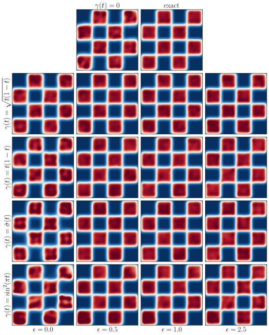

<figcaption>図9: サンプル品質への γ(t) と ε の効果：定性比較。異なる γ の選択のモデルの ρ̂(1) のカーネル密度推定。ε=0 のサンプリングは学習ドリフト b̂=v̂−γγ̇ŝ の確率フロー、ε>0 は学習ドリフト b̂ とスコア ŝ の SDE に対応。この目標密度では SDE サンプリングが一般に ODE より良いが、γ(t)=√(t(1−t)) の確率フローで差が最小（注意 4.1 と整合）。SDE は任意のノイズ準位で良いが、ε が高いほど数値積分には小さな刻みが要る。</figcaption>
</figure>

これまで (4.1) の $\alpha,\beta,\gamma$ が密度 $\rho(t)$ に与える影響を解析的に示してきた。本節ではドリフト係数をパラメトリック関数クラスで学習せねばならない例を研究する。特に ODE と SDE に基づく生成モデルのトレードオフと、§3・4・6 で導入した各種設計選択を数値的に探る。§7.1 で可視化しやすい 2 次元分布、§7.2 で高次元ガウス混合（学習モデルを解析解と比較できる）、§7.3 で画像生成の実験を行う。

### 7.1 決定論的 vs 確率的モデル：2D

<figure>

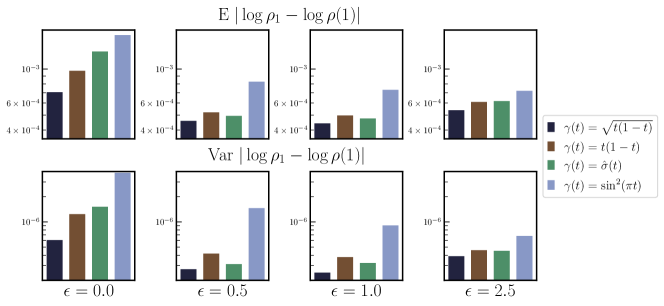

<figcaption>図10: サンプル品質への γ(t) と ε の効果：定量比較。図9 の各 γ と各 ε について、log ρ₁（厳密）と log ρ̂(1)（モデル）の差の絶対値の平均と分散を計算。γ(t)=√(t(1−t)) のモデルが最良の確率フロー（ε=0）。大きな ε では同じ学習 b̂・ŝ の SDE サンプリングがより良く、前図の観察を補完する。</figcaption>
</figure>

§2.2 で示したように、$\rho(t)$ の発展は輸送方程式 (2.9) または前向き・後ろ向き FPE (2.20)・(2.22) で厳密に捉えられる。これらの視点は決定論的ダイナミクス (2.32) か前向き・後ろ向き確率ダイナミクス (2.33)・(2.34) に基づく生成モデルを導き、確率性の準位は拡散係数 $\epsilon(t)$ で調整できる。§2.4 で、定数 $\epsilon(t)=\epsilon>0$ が不完全な速度 $b$・スコア $s$ を使うとき尤度のより良い制御を提供しうることを示した。最適な $\epsilon$ は推定 $\hat{b}$・$\hat{s}$ の相対精度で決まる。サンプリング過程に固有の確率性は $\epsilon$ とともに増すが、固定 $\alpha,\beta,\gamma$ の周辺密度 $\rho(t)$ は $\epsilon$ に依存しない。

#### 2D 密度推定での γ(t) と ε の役割

$\gamma$ と $\epsilon$ の役割を探るため、質量が 2 次元チェッカーボードに集中する目標密度 $\rho_{1}$ と基底 $\rho_{0}=\mathsf{N}(0,\text{\it Id})$ を考える。同じモデルアーキテクチャ・学習手順で、表8 のいくつかの $\gamma$ について $v$ と $s$ を学習する（4 層・各 512・ReLU の前向きネット）。学習後、ODE（$\epsilon=0$）または $\epsilon=0.5,1.0,2.5$ の SDE で 300,000 サンプルを引き、各密度のカーネル密度推定を厳密密度と [2] の元の確率的補間（$\gamma=0$）と比較する（図9・10）。$\epsilon>0$ のサンプリングが経験的により良いが、(4.13) の $\gamma$ で差が最小。$\epsilon=0$ でも (4.13) の $\gamma$ の確率フローは [2] の元の補間より良い。

### 7.2 決定論的 vs 確率的モデル：128 次元ガウス混合

目標が高次元ガウス混合の場合の性能を研究する。ガウス混合（GM）はモード数・分離・全体次元を増やすことで任意に複雑にでき、低次元射影で目標とモデルの間の $\mathsf{KL}$ ダイバージェンスを（定数）拡散係数 $\epsilon$ の関数として計算できるので、ODE/SDE サンプラーのトレードオフを定量化できる。

#### 実験の詳細

$\rho_{0}=\mathsf{N}(0,\text{\it Id})$ を次元 $d=128$ の 5 モードガウス混合に写す問題を考える。各モードの平均 $m_{i}$ は i.i.d. $m_{i}\sim\mathsf{N}(0,\sigma^{2}\text{\it Id})$（$\sigma=7.5$）、各共分散 $C_{i}=\tfrac{1}{d}W_{i}^{\mathsf{T}}W_{i}+\text{\it Id}$（$(W_{i})_{kl}\sim\mathsf{N}(0,1)$）。$b$ か $v$、$s$ か $\eta_{z}$ を学習する 4 組合せを研究する。各ケースで線形補間 $\alpha(t)=1-t$, $\beta(t)=t$, $\gamma(t)=\sqrt{t(1-t)}$ を考える。

<figure>

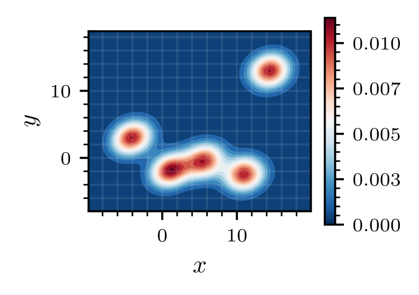

<figcaption>図11: ガウス混合：目標射影。ガウス混合実験の目標密度 ρ₁ の低次元周辺（KDE で可視化）。</figcaption>
</figure>

目標密度 $\rho_{1}$ の最初の 2 座標への射影を図11 に示す——強い多峰性、区別が難しい複数モード、他から well-separated な 1 モード（非自明な輸送が要る）を含む。以下の実験では、$\epsilon=0$ で 4 次 Dormand-Prince 適応 ODE ソルバー（dopri5）、$\epsilon\neq0$ で [32] の Heun SDE 積分器の 1000 ステップで生成。$\eta_{z}$ 学習時、$s(t,x)=-\eta(t,x)/\gamma(t)$ で $\gamma(t)$ で割る $t=0,1$ の特異性を避けるため $t_{0}=10^{-4}$, $t_{f}=1-t_{0}$ とする。

<figure>

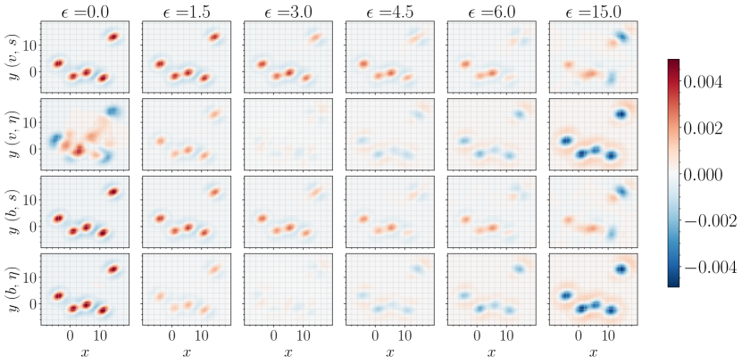

<figcaption>図12: ガウス混合：密度誤差。b か v、s か η を学習する 4 変種すべての、最初の 2 座標の周辺における誤差 ρ̂₁(x,y)−ρ₁(x,y)（KDE）。小さい ε ではモデル密度が過度に集中し、モード内を過大・裾を過小評価。ε が増えると集中が緩み目標をより正確に表す。ε が大きすぎると過度に広がりモード内を過小評価。注：128 次元密度の 2 次元スライス。</figcaption>
</figure>

#### 定量指標

性能定量化に、$\rho_{1}$ とモデル密度 $\hat{\rho}_{1}$ の低次元周辺の KDE 間の $\mathsf{KL}$ ダイバージェンスを使う。$\rho_{1}$ と各 $\hat{\rho}_{1}$ から 50,000 サンプルを引き、最初の 2 座標の周辺を射影で得て Gaussian KDE（Scott の規則のバンド幅）を計算。新たに $N_{e}=50,000$ サンプルで制御変量付き Monte-Carlo 推定 $\mathsf{KL}(\rho_{1}\>\|\>\hat{\rho}_{1})\approx\frac{1}{N_{e}}\sum_{i=1}^{N_{e}}(\log\rho_{1}(x_{i})-\log\hat{\rho}_{1}(x_{i})-(\frac{\hat{\rho}_{1}(x_{i})}{\rho_{1}(x_{i})}-1))$ を作る。制御変量 $\hat{\rho}_{1}/\rho_{1}-1$ は分散を減らし、対数の凹性により推定が負にならないことを保証する。

#### 結果

<figure>

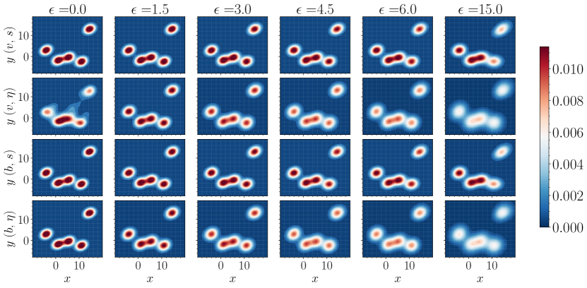

<figcaption>図13: ガウス混合：密度。b か v、s か η を学習する 4 変種のモデル密度 ρ̂₁ の最初の 2 変数の周辺密度（KDE）。注：128 次元密度の 2 次元スライス。</figcaption>
</figure>

<figure>

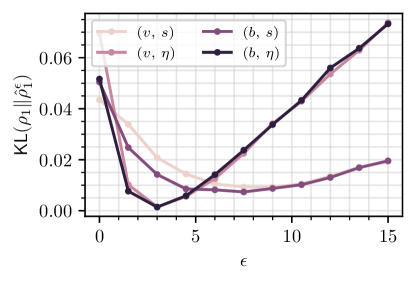

<figcaption>図14: ガウス混合：定量比較。4 組のドリフト係数 (b,s)・(b,η)・(v,s)・(v,η) を学習したときの ε の関数としての KL(ρ₁‖ρ̂₁^ε)。b と η を学習し適切な ε>0 を選ぶと最良。</figcaption>
</figure>

図12・13 はモデル密度誤差 $\hat{\rho}_{1}-\rho_{1}$ とモデル密度 $\hat{\rho}_{1}$ の 2 次元射影を示す。小さい $\epsilon$ はモード内を過大・裾を過小評価、大きすぎる $\epsilon$ は逆。その中間で各モデルが最適性能を得る。図14 はこれを定量化し、$\epsilon$ の関数としての $\mathsf{KL}(\rho_{1}\>\|\>\hat{\rho}_{1}^{\epsilon})$ を示す。各ケースで最適な $\epsilon\neq0$ がある。さらに、$b$ の学習が $v$ より、$\eta$ の学習が $s$ より一般に良い（$\epsilon$ が大きすぎて性能劣化が始まる場合を除く）。ノイズ除去器を使う $s(t,x)=-\eta(t,x)/\gamma(t)$ の特異性を適切に扱えば（$t_{0}\neq0,t_{f}\neq1$ の capping か $\epsilon(t)$ の適切な調整で）、ノイズ除去器の学習がベストプラクティスだと結果は示唆する。

### 7.3 画像生成

提案手法が画像生成のような高次元問題に素直にスケールすることを示す。$128\times128$ Oxford flowers データセットで、片側補間（$\rho_{0}=\mathsf{N}(0,\text{\it Id})$）とミラー補間（$\rho_{0}=\rho_{1}$）の 2 変種をテストする。本節の目的は理論が well-motivated でスケーラブル・柔軟な枠組みを提供することの実証で、画像生成は本研究の主眼でない（ImageNet・FID 等での詳細研究は今後）。

#### ガウス $\rho_{0}$ からの生成

空間線形片側補間 $x_{t}=(1-t)z+tx_{1}$ と $x_{t}=\cos(\tfrac{\pi}{2}t)z+\sin(\tfrac{\pi}{2}t)x_{1}$ を Oxford flowers で学習する。ガウス混合の結果に基づき、ドリフト $b$・スコア $s$・ノイズ除去器 $\eta_{z}$ を学習し ODE/SDE 生成モデルをベンチマークする。$\hat{\eta}$・$\hat{s}$・$\hat{b}$ を表すネットワークは Ho ら [25]（DDPM）の U-Net でパラメータ化、Adam で最適化（詳細は付録C.1）。

<figure>

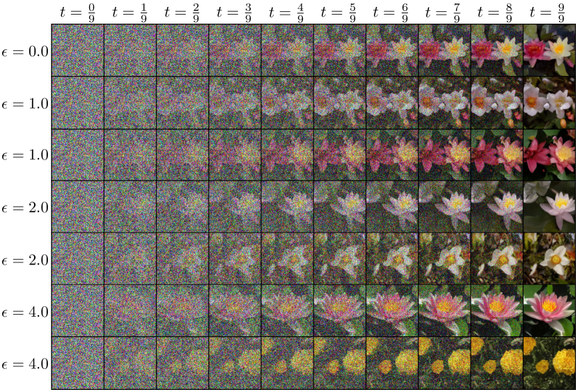

<figcaption>図15: 画像生成：Oxford flowers。同じ初期条件 x₀ から、ε=0・学習 b の ODE、または学習 b・s の様々な増加する ε の SDE で生成した花の例。ε=0 では dopri5 でステップ数は適応的。それ以外は ε=1.0・2.0・4.0 でそれぞれ Heun 法 2000・2500・4000 ステップ。</figcaption>
</figure>

ガウス混合の場合と同様、ODE で dopri5、SDE で Heun 法を使う（アルゴリズム4）。ノイズ除去器 $\eta_{z}$ 学習時、$\epsilon=0$ として (5.14) の積分器に切り替える最終ノイズ除去ステップで画像生成を完了すると有益だった。図15 は同じ $\rho_{0}$ サンプルから ODE と様々な $\epsilon$ の SDE で生成した画像を示す。SDE では同じサンプルから異なる画像を生成でき、$\epsilon$ を増やすと多様性が増す。学習集合を記憶していないことを示すため、図16 で生成画像をその学習集合中の 5 最近傍（$\ell_{1}$ ノルム）と比較する（視覚的にかなり異なる）。

<figure>


<figcaption>図16: 記憶なし。上：学習した線形片側補間からの生成画像例。下：データセット中の生成画像への 5 最近傍（ℓ₁ ノルム）。最近傍は視覚的に異なり、補間がデータセットに過適合しないことを示す。</figcaption>
</figure>

#### ミラー補間

ミラー補間 $x_{t}=x_{1}+\gamma(t)z$ を考える。(3.34) よりドリフト $b$ はノイズ除去器 $\eta_{z}$ で $b(t,x)=\dot{\gamma}(t)\eta_{z}(t)$ と与えられ、生成モデル構成には $\hat{\eta}_{z}$ の推定だけで十分。Oxford flowers で U-Net パラメータ化で実証する（詳細は付録C.1）。ODE (2.32) では $t=1$ の出力画像は入力と同じだが、SDE では同じ入力から新しい画像を生成できる。図17 で、データセット $\rho_{1}$ のサンプル画像を $\epsilon(t)=\epsilon=10$ の SDE (2.33) で押し出す様子を示す。元画像はデータセットにない近接の花に再サンプルされる。

<figure>


<figcaption>図17: ミラー補間。$128\times128$ Oxford flowers での γ(t)=√(t(1−t)) のミラー補間 x_t=x₁+γ(t)z の学習ノイズ除去器モデル b̂=γ̇(t)η̂_z からの例軌道。η̂_z の形は Ho ら [25] の U-Net。生成 SDE (2.33) の ε の選択が生成画像と元画像の差の程度に影響。ここでは ε(t)=10.0。</figcaption>
</figure>

## 8 結論

上の解説は確率的補間法の完全な扱いと、既存文献との関係の慎重な考察を提供する。我々の目標は、測度の力学的輸送に基づく生成モデルを考案するのに使える一般枠組みを提供することである。この目的のため、2 密度を有限時間で厳密に写す決定論的・確率的生成モデルを構成する数学理論と効率的アルゴリズムを詳述した。その過程で、この過程を形作るのに使える各種設計パラメータを、例えば最適輸送や Schrödinger 橋との関連とともに例示した。ミラー補間や片側補間のような具体的なインスタンス化を詳述したが、将来の応用に関連しうる遥かに広い設計空間があることを強調する。候補となる応用領域には、画像 inpainting・超解像のような逆問題、力学系の時空間予測、分子配置のサンプリングや機械学習支援 Markov chain Monte-Carlo のような科学的問題が含まれる。

## 付録A 2 つのガウス混合密度の橋渡し

本付録では $\rho_{0}$ と $\rho_{1}$ がともにガウス混合密度の場合を考える。平均ベクトル $m\in{\mathbb{R}}^{d}$・正定値対称共分散行列 $C$ のガウス確率密度を ${\sf N}(x|m,C)=(2\pi)^{-d/2}[\det C]^{-1/2}\exp(-\tfrac{1}{2}(x-m)^{\mathsf{T}}C^{-1}(x-m))$ と表す。

$$
\rho_{0}(x)=\sum_{i=1}^{N_{0}}p^{0}_{i}{\sf N}(x|m^{0}_{i},C^{0}_{i}),\qquad\rho_{1}(x)=\sum_{i=1}^{N_{1}}p^{1}_{i}{\sf N}(x|m^{1}_{i},C^{1}_{i})
$$

と仮定する（$p^{0}_{i}>0$, $\sum p_{i}^{0}=1$ 等）。

**命題（ガウス混合）。** (2.1) で (A.2) の密度と (4.1) の補間 $x^{\mathsf{lin}}_{t}=\alpha(t)x_{0}+\beta(t)x_{1}+\gamma(t)z$ を使った過程 $x_{t}$ を考える（$x_{0}\perp x_{1}\perp z$、$\alpha,\beta,\gamma^{2}\in C^{2}([0,1])$ は (4.2) を満たす）。

$$
m_{ij}(t)=\alpha(t)m^{0}_{i}+\beta(t)m^{1}_{j},\quad C_{ij}(t)=\alpha^{2}(t)C^{0}_{i}+\beta^{2}(t)C^{1}_{j}+\gamma^{2}(t)\text{\it Id},
$$

と表す。このとき $x_{t}$ の確率密度 $\rho$ はガウス混合密度

$$
\rho(t,x)=\sum_{i=1}^{N_{0}}\sum_{j=1}^{N_{1}}p^{0}_{i}p^{1}_{j}{\sf N}(x|m_{ij}(t),C_{ij}(t))
$$

であり、(2.10) と (2.14) の速度 $b$ とスコア $s$ は

$$
b(t,x)=\frac{\sum_{i,j}p^{0}_{i}p^{1}_{j}\left(\dot{m}_{ij}(t)+\tfrac{1}{2}\dot{C}_{ij}(t)C^{-1}_{ij}(t)(x-m_{ij}(t))\right){\sf N}(x|m_{ij}(t),C_{ij}(t))}{\sum_{i,j}p^{0}_{i}p^{1}_{j}{\sf N}(x|m_{ij}(t),C_{ij}(t))},
$$
$$
s(t,x)=-\frac{\sum_{i,j}p^{0}_{i}p^{1}_{j}C^{-1}_{ij}(t)(x-m_{ij}(t)){\sf N}(x|m_{ij}(t),C_{ij}(t))}{\sum_{i,j}p^{0}_{i}p^{1}_{j}{\sf N}(x|m_{ij}(t),C_{ij}(t))}.
$$

この命題は、$b$ と $s$ が $x$ について高々線形に増大し、$\rho(t,x)$ のモードが well-separated に保たれる領域で近似的に線形であることを含意する。特に $\rho_{0}=\mathsf{N}(m_{0},C_{0})$, $\rho_{1}=\mathsf{N}(m_{1},C_{1})$ なら、$b(t,x)=\dot{m}(t)+\tfrac{1}{2}\dot{C}(t)C^{-1}(t)(x-m(t))$, $s(t,x)=-C^{-1}(t)(x-m(t))$（$m(t)=\alpha(t)m_{0}+\beta(t)m_{1}$, $C(t)=\alpha^{2}(t)C_{0}+\beta^{2}(t)C_{1}+\gamma^{2}(t)\text{\it Id}$）。

速度 (A.7) に付随する確率フロー ODE (2.32) は線形 ODE $\frac{d}{dt}X_{t}=\dot{m}(t)+\tfrac{1}{2}\dot{C}(t)C^{-1}(t)(X_{t}-m(t))$ である。これは $\dot{C}(t)$ と $C(t)$ が可換なら（例えば $C_{0}=\text{\it Id}$）解析的に解けるが、いずれにせよ ${\mathbb{E}}_{0}X_{t}(x_{0})=m(t)$, ${\mathbb{E}}_{0}[(X_{t}-m(t))(X_{t}-m(t))^{\mathsf{T}}]=C(t)$ を保証する。同様に速度 (A.7)・スコア (A.8) に付随する前向き SDE (2.33) は線形 SDE $dX^{\mathsf{F}}_{t}=\dot{m}(t)dt+(\tfrac{1}{2}\dot{C}(t)-\epsilon)C^{-1}(t)(X^{\mathsf{F}}_{t}-m(t))dt+\sqrt{2\epsilon}dW_{t}$ で、その解は ${\mathbb{E}}_{0}{\mathbb{E}}^{x_{0}}_{\mathsf{F}}X_{t}^{\mathsf{F}}=m(t)$, 共分散 $=C(t)$ を満たす。後ろ向き SDE (2.34) でも同様。

###### 証明

$\rho(t,x)$ の特性関数は $g(t,k)={\mathbb{E}}e^{ik\cdot x_{t}}=\sum_{i,j}p^{0}_{i}p^{1}_{j}e^{ik\cdot m_{ij}(t)-\tfrac{1}{2}k^{\mathsf{T}}C_{ij}(t)k}$ で与えられ、その逆 Fourier 変換が (A.4)。$s=\nabla\log\rho$（2.14）より (A.6) が直ちに従う。(A.7) の導出には (B.12) の関数 $m(t,k)=\sum_{i,j}p^{0}_{i}p^{1}_{j}(\dot{m}_{ij}(t)+\tfrac{1}{2}i\dot{C}_{ij}(t)k)e^{ik\cdot m_{ij}(t)-\tfrac{1}{2}k^{\mathsf{T}}C_{ij}(t)k}$ を使う。(B.13) よりこの逆 Fourier 変換が $b\rho$ なので、$b(t,x)\rho(t,x)=\sum_{i,j}p^{0}_{i}p^{1}_{j}(\dot{m}_{ij}(t)+\tfrac{1}{2}\dot{C}_{ij}(t)C_{ij}^{-1}(t)(x-m_{ij}(t))){\sf N}(x|m_{ij}(t),C_{ij}(t))$ を得て、(A.5) が出る。∎

## 付録B 証明

本付録では本文で省略した証明の詳細を提供する。読みやすさのため、元の定理の主張を証明とともに再掲する。

### B.1 定理（確率的補間の性質・目的・スコア）と系（FPE）の証明

###### 証明（確率的補間の性質）

$g(t,k)={\mathbb{E}}e^{ik\cdot x_{t}}$ を $\rho(t,x)$ の特性関数とする。(2.1) の $x_{t}$ の定義から $g(t,k)={\mathbb{E}}e^{ik\cdot(I(t,x_{0},x_{1})+\gamma(t)z)}$。$(x_{0},x_{1})$ と $z$ の独立性を使い、

$$
g(t,k)={\mathbb{E}}\left(e^{ik\cdot I(t,x_{0},x_{1})}\right){\mathbb{E}}\left(e^{i\gamma(t)k\cdot z}\right)\equiv g_{0}(t,k)e^{-\tfrac{1}{2}\gamma^{2}(t)|k|^{2}}
$$

ここで $g_{0}(t,k)={\mathbb{E}}(e^{ik\cdot I(t,x_{0},x_{1})})$ は $I(t,x_{0},x_{1})$ の特性関数。(B.2) から $|g(t,k)|=|g_{0}(t,k)|e^{-\tfrac{1}{2}\gamma^{2}(t)|k|^{2}}\leq e^{-\tfrac{1}{2}\gamma^{2}(t)|k|^{2}}$。仮定より全 $t\in(0,1)$ で $\gamma(t)>0$ なので、これは $\forall p\in{\mathbb{N}},\ t\in(0,1):\int_{{\mathbb{R}}^{d}}|k|^{p}|g(t,k)|dk<\infty$ を示し、$\rho(t,\cdot)$ が任意の $p$ と全 $t\in(0,1)$ で $C^{p}({\mathbb{R}}^{d})$ にあることを含意する。(B.2) からまた、$|\partial_{t}g(t,k)|^{2}$ と $|\partial^{2}_{t}g(t,k)|^{2}$ がそれぞれ $|k|$ の多項式 × $e^{-\gamma^{2}(t)|k|^{2}}$ で上から抑えられる（最後の不等式は仮定 2.5 の (2.8) による）。これらは

$$
\forall p\in{\mathbb{N}},\ t\in(0,1):\int_{{\mathbb{R}}^{d}}|k|^{p}|\partial_{t}g(t,k)|dk<\infty;\quad\int_{{\mathbb{R}}^{d}}|k|^{p}|\partial^{2}_{t}g(t,k)|dk<\infty
$$

を含意し、$\partial_{t}\rho(t,\cdot)$ と $\partial^{2}_{t}\rho(t,\cdot)$ が $C^{p}({\mathbb{R}}^{d})$ にある、すなわち $\rho\in C^{1}((0,1);C^{p}({\mathbb{R}}^{d}))$ を示す。$\rho$ が正であることを示すため、$g_{0}(t,k)$ に付随する（Fourier 反転定理により一意な）確率測度 $\mu_{0}(t,dx)$ を取ると、畳み込み定理より

$$
\rho(t,x)=\int_{{\mathbb{R}}^{d}}\frac{e^{-|x-y|^{2}/(2\gamma^{2}(t))}}{(2\pi\gamma^{2}(t))^{d/2}}\mu_{0}(t,dy),
$$

と表せ、$\rho>0$ が全 $(t,x)\in(0,1)\times{\mathbb{R}}^{d}$ で成り立つ。$x_{t=0}=x_{0}$, $x_{t=1}=x_{1}$ より $\rho(0)=\rho_{0}$, $\rho(1)=\rho_{1}$ で、仮定 2.5 により $t=0,1$ でも正かつ $C^{p}$。$\rho\in C^{1}((0,1);C^{p})$ かつ正なので $s=\nabla\log\rho=\nabla\rho/\rho\in C^{1}((0,1);(C^{p})^{d})$ も直ちに従う。

$\rho$ が TE (2.9) を満たすことを示すため、(B.1) の時間微分を取り $\partial_{t}g(t,k)=ik\cdot m(t,k)$ を得る。ここで $m(t,k)={\mathbb{E}}((\partial_{t}I(t,x_{0},x_{1})+\dot{\gamma}(t)z)e^{ik\cdot x_{t}})$。条件付き期待値の定義により

$$
m(t,k)=\int_{{\mathbb{R}}^{d}}e^{ik\cdot x}{\mathbb{E}}\left(\partial_{t}I(t,x_{0},x_{1})+\dot{\gamma}(t)z|x_{t}=x\right)\rho(t,x)dx=\int_{{\mathbb{R}}^{d}}e^{ik\cdot x}b(t,x)\rho(t,x)dx
$$

（最後の等式は (2.10) の $b$ の定義による）。これを $\partial_{t}g=ik\cdot m$ に代入すると、実空間で TE (2.9) として書ける。

$b$ の正則性を調べるため、$m$ に戻り独立性とガウス部分積分を使い $m(t,k)={\mathbb{E}}((\partial_{t}I(t,x_{0},x_{1})-i\gamma(t)\dot{\gamma}(t)k)e^{ik\cdot I})e^{-\tfrac{1}{2}\gamma^{2}(t)|k|^{2}}$ を得る。結果として $|m(t,k)|^{2}\leq 2M_{1}e^{-\gamma^{2}(t)|k|^{2}}$、$|\partial_{t}m(t,k)|^{2}$ も同様に有界（最後の不等式は (2.8) による）。したがって $\forall p,t\in(0,1):\int|k|^{p}|m(t,k)|dk<\infty,\ \int|k|^{p}|\partial_{t}m(t,k)|dk<\infty$。これは $m$ の逆 Fourier 変換が、任意の $p$・$t\in(0,1)$ で $(C^{p})^{d}$ にある関数 $j$ で

$$
j(t,x)=(2\pi)^{-d}\int_{{\mathbb{R}}^{d}}e^{-ik\cdot x}m(t,k)dk={\mathbb{E}}\left(\partial_{t}I+\dot{\gamma}(t)z|x_{t}=x\right)\rho(t,x)\equiv b(t,x)\rho_{t}(x)
$$

と表せることを含意する。$j\in C^{0}([0,1];(C^{p})^{d})$ かつ $\rho\in C^{1}([0,1];C^{p})$, $\rho>0$ より $b\in C^{0}([0,1];(C^{p})^{d})$。

最後に (2.11) を示す。(2.8) により $\int_{{\mathbb{R}}^{d}}|b(t,x)|^{2}\rho(t,x)dx\leq 2{\mathbb{E}}[|\partial_{t}I|^{2}+|\dot{\gamma}(t)|^{2}|z|^{2}]<2M_{1}^{1/2}+2d|\dot{\gamma}(t)|^{2}$ で、全 $t\in(0,1)$ で有界。端点では、$b_{0}(x)=\lim_{t\to0}b(t,x)={\mathbb{E}}_{1}[\partial_{t}I(0,x,x_{1})]-\lim_{t\to0}\dot{\gamma}(t)\gamma(t)s_{0}(x)$、$b_{1}(x)$ も同様。$\gamma^{2}\in C^{1}([0,1])$ より $\lim_{t\to0,1}\dot{\gamma}(t)\gamma(t)$ が存在し $b_{0}$, $b_{1}$ は well-defined、仮定 2.5 により $\int|b_{0}|^{2}\rho_{0}<\infty,\ \int|b_{1}|^{2}\rho_{1}<\infty$。よって積分は $t=0,1$ で連続、$b$ は $[0,1]$ で可積分、(2.11) が成り立つ。∎

###### 証明（目的）

$\rho$ の定義により目的 $\mathcal{L}_{b}$ (2.13) は $\mathcal{L}_{b}[\hat{b}]=\int_{{\mathbb{R}}^{d}}(\tfrac{1}{2}|\hat{b}(t,x)|^{2}-b(t,x)\cdot\hat{b}(t,x))\rho(t,x)dx$ と書ける。この二乗目的は

$$
\mathcal{L}_{b}[\hat{b}]=\tfrac{1}{2}\int_{{\mathbb{R}}^{d}}|\hat{b}-b|^{2}\rho\,dx-\tfrac{1}{2}\int_{{\mathbb{R}}^{d}}|b|^{2}\rho\,dx\geq-\tfrac{1}{2}\int_{{\mathbb{R}}^{d}}|b|^{2}\rho\,dx>-\infty
$$

（最後の不等式は (2.11)）と下に有界。$\rho_{t}$ が正なので最小化子は一意で $\hat{b}=b$。∎

###### 証明（スコア）

$\rho\in C^{1}((0,1);C^{p})$ かつ正なので $s=\nabla\log\rho\in C^{1}((0,1);(C^{p})^{d})$ は既知。(2.14) を示すため、$\gamma(t)>0$ なる $t\in(0,1)$ で ${\mathbb{E}}(ze^{i\gamma(t)k\cdot z})=i\gamma(t)ke^{-\tfrac{1}{2}\gamma^{2}(t)|k|^{2}}$。独立性により ${\mathbb{E}}(ze^{ik\cdot x_{t}})=i\gamma(t)kg(t,k)$。条件付き期待値の性質で左辺は $\int_{{\mathbb{R}}^{d}}{\mathbb{E}}(z|x_{t}=x)e^{ik\cdot x}\rho(t,x)dx$。左辺は $-\gamma(t)\nabla\rho(t,x)$ の Fourier 変換なので ${\mathbb{E}}(z|x_{t}=x)\rho(t,x)=-\gamma(t)\nabla\rho(t,x)=-\gamma(t)s(t,x)\rho(t,x)$。$\rho>0$ より $\gamma(t)>0$ の $t\in(0,1)$ で (2.14) が成り立つ。

(2.15) を示すため $\int_{{\mathbb{R}}^{d}}|s(t,x)|^{2}\rho(t,x)dx=\int|{\mathbb{E}}(\gamma^{-1}(t)z|x_{t}=x)|^{2}\rho\,dx\leq d\gamma^{-2}(t)$、全 $t\in(0,1)$ で有界。$t=0,1$ で連続（値は (2.7)）なので $[0,1]$ で可積分、(2.15) が成り立つ。目的 $\mathcal{L}_{s}$ (2.16) は $\mathcal{L}_{s}[\hat{s}]=\int(\tfrac{1}{2}|\hat{s}|^{2}-s\cdot\hat{s})\rho\,dx=\tfrac{1}{2}\int|\hat{s}-s|^{2}\rho\,dx-\tfrac{1}{2}\int|s|^{2}\rho\,dx\geq-\tfrac{1}{2}\int|s|^{2}\rho\,dx>-\infty$ と下に有界。$\rho$ が正なので最小化子は一意で $\hat{s}=s$。∎

###### 証明（FPE 系）

前向き FPE (2.20) と後ろ向き FPE (2.22) は TE (2.9) と (2.14) の直接の帰結である。等式 $\epsilon(t)\Delta\rho=\epsilon(t)\nabla\cdot(\rho\nabla\log\rho)=\epsilon(t)\nabla\cdot(s\rho)$ を使ってこれらの方程式を相互変換できるからである。∎

### B.2 補題（反転 Itô 計算）の証明

###### 証明

SDE (2.33) と ODE (2.32) は密度が (2.20) と (2.9) を解く過程の発展方程式である。説明を要するのは後ろ向き SDE (2.34) で、$t=1$ から $t=0$ へ時間後ろ向きに解ける。定義によりその解は $X^{\mathsf{B}}_{t}=Z^{\mathsf{F}}_{1-t}$、$Z^{\mathsf{F}}_{t}$ は前向き SDE $dZ^{\mathsf{F}}_{t}=-b_{\mathsf{B}}(1-t,Z^{\mathsf{F}}_{t})dt+\sqrt{2\epsilon}dW_{t}$ を解く。後ろ向き Itô の公式 (2.36) を書くため、任意の $f\in C^{1}([0,1];C_{0}^{2}({\mathbb{R}}^{d}))$ に対し $f(1-t,Z^{\mathsf{F}}_{t})$ の微分を取る：

$$
df(1-t,Z^{\mathsf{F}}_{t})=-\partial_{t}f\,dt+(-b_{\mathsf{B}}(1-t,Z^{\mathsf{F}}_{t})\cdot\nabla f+\epsilon\Delta f)dt+\sqrt{2\epsilon}\nabla f\cdot dW_{t}
$$

これを積分形にし、$X^{\mathsf{B}}_{t}=Z^{\mathsf{F}}_{1-t}$, $W^{\mathsf{B}}_{t}=-W_{1-t}$ を使い積分変数を $s\to1-s$ に変えると、微分形で

$$
df(t,X^{\mathsf{B}}_{t})=\partial_{t}f\,dt+\nabla f\cdot dX^{\mathsf{B}}_{t}-\epsilon\Delta f\,dt=(\partial_{t}f+b_{\mathsf{B}}\cdot\nabla f-\epsilon\Delta f)dt+\sqrt{2\epsilon}\nabla f\cdot dW_{t}
$$

となり、これが後ろ向き Itô の公式 (2.36)。同様に Itô 等長性により、任意の $g$ と $t\in[0,1]$ で ${\mathbb{E}}^{x}\int_{1-t}^{1}g(s,Z^{\mathsf{F}}_{s})\cdot dW_{s}=0$、第 2 モーメントは $\int_{1-t}^{1}{\mathbb{E}}^{x}|g|^{2}ds$。$X^{\mathsf{B}}_{t}$ で書けば (2.37)。∎

#### (2.30) の導出

任意の $t\in[0,1]$ でスコアは $\int_{{\mathbb{R}}^{d}}|\hat{s}(t,x)-\nabla\log\rho(t,x)|^{2}\rho(t,x)dx$ の最小化子である。これを展開し、恒等式 $\hat{s}\cdot\nabla\log\rho\,\rho=\hat{s}\cdot\nabla\rho$ と部分積分を使うと $\int(|\hat{s}|^{2}+2\nabla\cdot\hat{s}+|\nabla\log\rho|^{2})\rho\,dx$ となる。$|\nabla\log\rho|^{2}$ の項は $\hat{s}$ について定数で最適化では無視でき、残りを $x_{t}$ 上の期待値で表し時間積分すると (2.30) を得る。

### B.3 補題（輸送 KL・FPE KL）と定理（尤度限界）の証明

###### 証明（輸送方程式間 KL）

(2.38) を使い $\frac{d}{dt}\mathsf{KL}(\rho(t)\>\|\>\hat{\rho}(t))$ を解析的に計算する。$\mathsf{KL}=\int\log(\rho/\hat{\rho})\rho\,dx$ を時間微分し、$\partial_{t}\hat{\rho}=-\nabla\cdot(\hat{b}\hat{\rho})$, $\partial_{t}\rho=-\nabla\cdot(b\rho)$ を代入、部分積分を繰り返すと

$$
\frac{d}{dt}\mathsf{KL}(\rho(t)\>\|\>\hat{\rho}(t))=\int_{{\mathbb{R}}^{d}}\left(\nabla\log\hat{\rho}-\nabla\log\rho\right)\cdot(\hat{b}-b)\rho\,dx.
$$

両辺を $0$ から $1$ で積分すると証明が完了する。∎

###### 証明（FPE 間 KL）

補題 2.4 を活用する。(2.40) の Fokker-Planck 方程式を（スコア依存の）輸送方程式 $\partial_{t}\rho=-\nabla\cdot((b_{\mathsf{F}}-\epsilon\nabla\log\rho)\rho)$, $\partial_{t}\hat{\rho}=-\nabla\cdot((\hat{b}_{\mathsf{F}}-\epsilon\nabla\log\hat{\rho})\hat{\rho})$ として書き直す。補題 2.4 を直接適用し展開すると

$$
\mathsf{KL}(\rho(1)\>\|\>\hat{\rho}(1))=\int_{0}^{1}\int_{{\mathbb{R}}^{d}}(\nabla\log\hat{\rho}-\nabla\log\rho)\cdot(\hat{b}_{\mathsf{F}}-b_{\mathsf{F}})\rho\,dxdt-\epsilon\int_{0}^{1}\int_{{\mathbb{R}}^{d}}|\nabla\log\rho-\nabla\log\hat{\rho}|^{2}\rho\,dxdt,
$$

で第 1 部が出る。Young の不等式で任意の $\eta>0$ について上から抑え、$\eta=2\epsilon$ と取ると $\mathsf{KL}(\rho_{1}\>\|\>\hat{\rho}(1))\leq\frac{1}{4\epsilon}\int_{0}^{1}\int_{{\mathbb{R}}^{d}}|\hat{b}_{\mathsf{F}}-b_{\mathsf{F}}|^{2}\rho\,dxdt$ で第 2 部が出る。∎

###### 証明（尤度限界）

命題 2.3 により目標密度 $\rho_{1}=\rho(1,\cdot)$ は SDE (2.33) に従って発展する過程 $X_{t}$ の密度である。補題 2.4 と Young の不等式の追加適用により $\mathsf{KL}(\rho_{1}\>\|\>\hat{\rho}(1))\leq\frac{1}{2\epsilon}\int_{0}^{1}\int_{{\mathbb{R}}^{d}}(|\hat{b}-b|^{2}+\epsilon^{2}|s-\hat{s}|^{2})\rho\,dxdt$。$\mathcal{L}_{b}$ (2.13) と $\mathcal{L}_{s}$ (2.16) の定義を使うと (2.45) を得る。$b=v-\gamma\dot{\gamma}s$, $\hat{b}=\hat{v}-\gamma\dot{\gamma}\hat{s}$ を使うと、この場合 $\mathsf{KL}\leq\frac{1}{2\epsilon}(\mathcal{L}_{v}[\hat{v}]-\min\mathcal{L}_{v})+\frac{\max_{t}(\gamma(t)\dot{\gamma}(t)-\epsilon)^{2}}{2\epsilon}(\mathcal{L}_{s}[\hat{s}]-\min\mathcal{L}_{s})$ となり、定理の最終部が出る。∎

### B.4 補題（TE の解）と定理（Feynman-Kac）の証明

###### 証明（TE の解）

$\hat{\rho}$ が TE (2.50) を、$X_{s,t}$ が ODE (2.51) を解くなら、$\frac{d}{dt}\hat{\rho}(t,X_{s,t}(x))=\partial_{t}\hat{\rho}+b\cdot\nabla\hat{\rho}=-\nabla\cdot b(t,X_{s,t}(x))\hat{\rho}(t,X_{s,t}(x))$。これは $\frac{d}{dt}(\exp(\int_{s}^{t}\nabla\cdot b(\tau,X_{s,\tau}(x))d\tau)\hat{\rho}(t,X_{s,t}(x)))=0$ を含意する。$[0,t]$ で積分し $s=t$ と置くと $\hat{\rho}(t,x)=\exp(-\int_{0}^{t}\nabla\cdot b(\tau,X_{t,\tau}(x))d\tau)\hat{\rho}(0,X_{t,0}(x))$ で、初期条件 $\hat{\rho}(0)=\rho_{0}$ により (2.52)。同様に $[t,1]$ で積分すると終端条件 $\hat{\rho}(1)=\rho_{1}$ により (2.53)。∎

###### 証明（Feynman-Kac）

後ろ向き Itô の公式 (2.36) で $d\hat{\rho}_{\mathsf{F}}(t,Y^{\mathsf{B}}_{t})$ を評価し、(2.56) と (2.57) を使うと $d\hat{\rho}_{\mathsf{F}}=-\nabla\cdot\hat{b}_{\mathsf{F}}\hat{\rho}_{\mathsf{F}}dt+\sqrt{2\epsilon}\nabla\hat{\rho}_{\mathsf{F}}\cdot dW^{\mathsf{B}}_{t}$。これは全微分 $d(\exp(-\int_{t}^{1}\nabla\cdot\hat{b}_{\mathsf{F}}d\tau)\hat{\rho}_{\mathsf{F}})=\sqrt{2\epsilon}\exp(\cdots)\nabla\hat{\rho}_{\mathsf{F}}\cdot dW^{\mathsf{B}}_{t}$ と書ける。$t\in[0,1]$ で積分し $\hat{\rho}(0)=\rho_{0}$ を使い、事象 $Y_{t=1}^{\mathsf{B}}=x$ で条件付け期待値を取る（右辺は平均ゼロ）と $\hat{\rho}_{\mathsf{F}}(1,x)={\mathbb{E}}^{x}_{\mathsf{B}}\exp(-\int_{0}^{1}\nabla\cdot\hat{b}_{\mathsf{F}}(t,Y^{\mathsf{B}}_{t})dt)\rho_{0}(Y^{\mathsf{B}}_{t=0})$ で (2.58)。同様に Itô の公式で $d\hat{\rho}_{\mathsf{B}}(t,Y^{\mathsf{F}}_{t})$ を評価し (2.55)・(2.59) を使うと $d\hat{\rho}_{\mathsf{B}}=-\nabla\cdot\hat{b}_{\mathsf{B}}\hat{\rho}_{\mathsf{B}}dt+\sqrt{2\epsilon}\nabla\hat{\rho}_{\mathsf{B}}\cdot dW_{t}$。全微分にして $[0,1]$ で積分し $\hat{\rho}(1)=\rho_{1}$ を使い事象 $Y^{\mathsf{F}}_{t=0}=x$ で条件付け Itô 等長性を適用すると (2.60)。∎

### B.5 定理（拡散的生成）の証明

###### 証明

まず $I(t,x_{0},x_{1})=x_{0}$（仮定）かつ $a(t)=a>0$ の区間 $t\in[0,\delta]$ を考える。$x_{0}$ を固定した (3.2) の確率的補間は $x_{t}=x_{0}+\sqrt{2at(1-t)}z$ に簡約される。この過程の法則は $x_{t}\sim{\sf N}(x_{0},2at(1-t)\text{\it Id})$ で、その密度は全 $t>0$ で FPE $\partial_{t}\rho+2at\nabla\cdot(s(t,x)\rho)=a\Delta\rho$ を満たす。スコアは $s(t,x)=-\frac{x-x_{0}}{2at(1-t)}$（$t\in(0,\delta]$）で明示的に与えられ、FPE のドリフト項は $2ats(t,x)=-\frac{x-x_{0}}{1-t}$（$t\to0$ の極限でも成立）。また $-\frac{x-x_{0}}{2at(1-t)}=-\frac{\sqrt{2at}}{\sqrt{1-t}}{\mathbb{E}}(z|x_{t}=x)$ で、$t\in[0,\delta]$ で $\partial_{t}I=0$ なので (3.10) のドリフトと整合する。(B.65) の右辺は $t=0$ で非特異なので SDE (3.11) は $t\in[0,\delta]$ で well-defined、その解の法則は $X_{t}^{\mathsf{d}}\sim{\sf N}(x_{0},2at(1-t)\text{\it Id})$ と一致する。次に $t\in(\delta,1]$ では、$\gamma(t)=\sqrt{2at(1-t)}$ が端点 $t=1$（仮定 2.5 を満たす）でのみゼロなので、定理 2.2 と系 2.6・2.3 の証明の全議論を模倣して証明を終える。∎

なお、この証明は $\partial_{t}I(t=0,x_{0},x_{1})=0$（$I(t,x_{0},x_{1})=x_{0}+O(t^{2})$ を含意）で十分なことを示す。また $t\in[0,\delta]$ で SDE を使うことが質量を $x_{0}$ から広げるのに鍵だが、拡散ノイズはもはや必須でなく $t\in(\delta,1]$ で確率フロー ODE に戻せる（$t\in(\delta,1]$ で $a(t)=0$ とすればよい）。

### B.6 補題（補間の PDF）と定理（Schrödinger 橋）の証明

###### 証明（補間の PDF）

(3.37) の写像 $T$ の定義により、$x_{0}\sim\rho_{0}$, $x_{1}\sim\rho_{1}$ なら $T^{-1}(0,x_{0})\sim{\sf N}(0,\text{\it Id})$, $T^{-1}(1,x_{1})\sim{\sf N}(0,\text{\it Id})$。$x_{0},x_{1},z$ が独立で $z\sim{\sf N}(0,\text{\it Id})$ なので、$\alpha(t)T^{-1}(0,x_{0})+\beta(t)T^{-1}(1,x_{1})+\gamma(t)z\sim{\sf N}(0,(\alpha^{2}+\beta^{2}+\gamma^{2})\text{\it Id})={\sf N}(0,\text{\it Id})$（$\alpha^{2}(t)+\beta^{2}(t)+\gamma^{2}(t)=1$ より）。再び $T$ の定義により $T(t,\cdots)\sim\rho(t)$。∎

###### 証明（Schrödinger 橋）

$\hat{x}_{t}$ の密度を $\hat{\rho}(t,x)$ とし、流れ（current）$\hat{\jmath}(t,x)={\mathbb{E}}(\partial_{t}\hat{I}_{t}+\gamma(t)z|x=\hat{x}_{t})\hat{\rho}(t,x)$ を定義する。max-min 問題 (3.39) は、制約 $\partial_{t}\hat{\rho}+\nabla\cdot\hat{\jmath}=\epsilon\Delta\hat{\rho},\ \hat{\rho}(0)=\rho_{0},\ \hat{\rho}(1)=\rho_{1}$ の下で $\max_{\hat{\rho},\hat{\jmath}}\min_{\hat{u}}\int_{0}^{1}\int_{{\mathbb{R}}^{d}}(\tfrac{1}{2}|\hat{u}|^{2}\hat{\rho}-\hat{u}\cdot\hat{\jmath})dxdt$ という制約付き最適化問題として定式化できる。Lagrange 乗数 $\lambda,\eta_{0},\eta_{1}$ で制約を課した拡張目的を使うと、唯一の最小化子 $(\rho,j,\lambda)$ は Euler-Lagrange 方程式 $\partial_{t}\rho+\nabla\cdot j=\epsilon\Delta\rho$（境界条件付き）、$\partial_{t}\lambda+\tfrac{1}{2}|u|^{2}=-\epsilon\Delta\lambda$、$j=u\rho$、$u=\nabla\lambda$ を解く。最後の 2 式で最初の 2 式を (3.36)（$u=\nabla\lambda$）として書ける。仮定 3.10 の下で (3.36) を解く密度 $\rho(t)$ を実現する補間があるので、(3.39) の最適化子 $(I,u)$ が存在する。任意の最適化子で $I$ は $\rho(t)$ が $x_{t}=I(t,x_{0},x_{1})+\gamma(t)z$ の密度であるようなもの、$u=\nabla\lambda$ を満たす。∎

### B.7 定理（ノイズ除去）の証明

###### 証明

$\beta(t_{j+1})\beta^{-1}(t_{j})=1+\dot{\beta}(t_{j})\beta^{-1}(t_{j})(t_{j+1}-t_{j})+O((t_{j+1}-t_{j})^{2})$ と $\alpha(t_{j+1})-\alpha(t_{j})\beta(t_{j+1})\beta^{-1}(t_{j})=(\dot{\alpha}(t_{j})-\alpha(t_{j})\dot{\beta}(t_{j})\beta^{-1}(t_{j}))(t_{j+1}-t_{j})+O((\cdots)^{2})$ を使い、(5.14) から

$$
\frac{X^{\mathsf{den}}_{{j+1}}-X^{\mathsf{den}}_{j}}{t_{j+1}-t_{j}}=\dot{\beta}(t_{j})\beta^{-1}(t_{j})X^{\mathsf{den}}_{j}+(\dot{\alpha}(t_{j})-\alpha(t_{j})\dot{\beta}(t_{j})\beta^{-1}(t_{j}))\eta^{\mathsf{os}}_{z}(t_{j},X^{\mathsf{den}}_{j})+O(t_{j+1}-t_{j})
$$

を導く。$N,j\to\infty$ で $j/N\to t\in[0,1]$ の極限を取ると (5.15) を回復し $X^{\mathsf{den}}_{j}\to X_{t}$。∎ なおこの証明は、非一様な時刻グリッド $t_{j}$ でも定理 5.2 の結果が成り立つことを示す。

### B.8 定理（整流）の証明

###### 証明

第 1 部は定理 2.2 と系 2.6 の証明と同じ手順で確立できる。第 2 部は、まず (5.17) を $x^{\mathsf{rec}}_{t}=M(t,z)$ と書いて (5.22) に使い

$$
b^{\mathsf{rec}}(t,x^{\mathsf{rec}}_{t})=\dot{\alpha}(t)N(t,M(t,z))+\dot{\beta}(t)X_{t=1}(N(t,M(t,z)))=\dot{\alpha}(t)z+\dot{\beta}(t)X_{t=1}(z)=\dot{x}^{\mathsf{rec}}_{t}
$$

を導く。これは (5.22) が (5.19) の唯一の最小化子であることを示す。次に (5.23) を $X^{\mathsf{rec}}_{t}(x)=M(t,x)$ と書いて (5.22) に使うと $b^{\mathsf{rec}}(t,X^{\mathsf{rec}}_{t}(x))=\dot{\alpha}(t)x+\dot{\beta}(t)X_{t=1}(x)$。これは (5.23) が (5.21) を解くことを含意し、この ODE の解は一意なので証明が終わる。∎

## 付録C 実験仕様

§7.1 の実験の詳細：速度 $b$, $v$, $s$ の各モデルに深さ 4・幅 512 の前向きニューラルネットを使う。学習は 7000 反復、各バッチは基底から 25・目標から 400・時刻スライス 100。各反復で antithetic サンプリング（各損失評価に $\pm z$ の 2 サンプルを使う分散減少）を用いる。(2.13) と (2.16) の目的を Adam で最適化、学習率 0.002 で 1500 反復ごとに 1/2 に減衰。ODE/SDE 積分には [32] の Heun ベース積分器を使う。

### C.1 画像実験

#### ネットワークアーキテクチャ

全画像生成実験で Ho ら [25]（DDPM）の U-Net アーキテクチャを使う。$b,v,s,\eta$ のいずれを学習するかによらず同じアーキテクチャを使う。

**表18**: 画像データセットのハイパーパラメータとアーキテクチャ。

| | ImageNet 32×32 | Flowers | Flowers (Mirror) |
| --- | --- | --- | --- |
| 次元 | 32×32 | 128×128 | 128×128 |
| 学習点数 | 1,281,167 | 315,123 | 315,123 |
| バッチサイズ | 512 | 64 | 64 |
| 学習ステップ | 8×10⁵ | 3.5×10⁵ | 8×10⁵ |
| 隠れ次元 | 256 | 128 | 128 |
| Attention 解像度 | 64 | 64 | 64 |
| 学習率 (LR) | 0.0002 | 0.0002 | 0.0002 |
| LR 減衰 (1k epochs) | 0.995 | 0.995 | 0.985 |
| U-Net 次元倍率 | [1,2,2,2] | [1,1,2,3,4] | [1,1,2,3,4] |
| 学習 t 正弦波埋め込み | あり | あり | あり |
| t₀,t_f（η 学習, t∼Unif） | [0.0, 1.0] | n/a | n/a |
| t₀,t_f（s 学習, t∼Unif） | n/a | [.0002,.9998] | [.0002,.9998] |
| t₀,t_f（ODE サンプリング） | [0.0, 1.0] | [0.0001, 0.9999] | [.0001,.9999] |
| t₀,t_f（SDE サンプリング, η） | [0.0, 0.97] ＋ノイズ除去 | n/a | n/a |
| t₀,t_f（SDE サンプリング, s） | n/a | [.0001,.9999] | [.0001,.9999] |
| x_t の γ(t) | √(t(1−t)) | √(t(1−t)) | √(10t(1−t)) |
| EMA 減衰率 | 0.9999 | 0.9999 | 0.9999 |
| EMA 開始反復 | 10000 | 10000 | 10000 |
| GPU 数 | 2 | 4 | 2 |

SDE を使い $\eta_{z}$ を学習するとき、$t_{f}=1.0$ の少し手前まで積分し、それ以降はノイズ除去公式 (5.14) を使うと最良の結果が得られた（本文で述べたとおり）。
