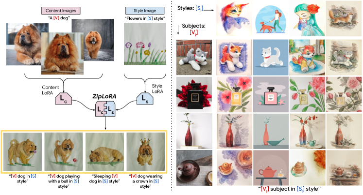
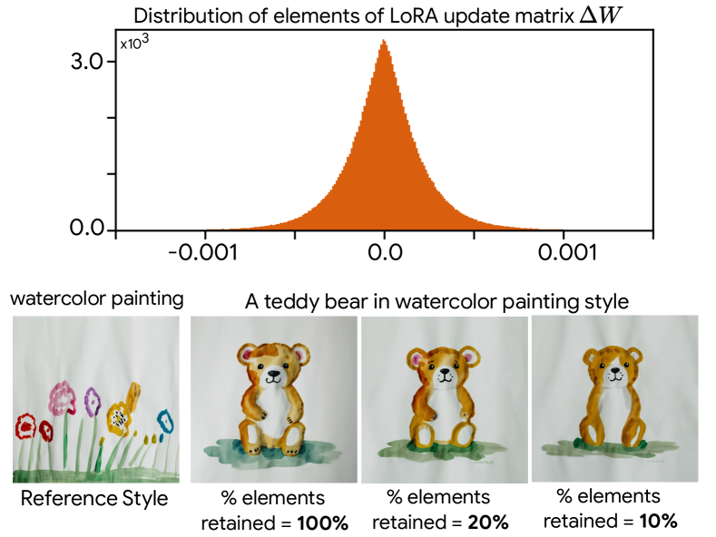
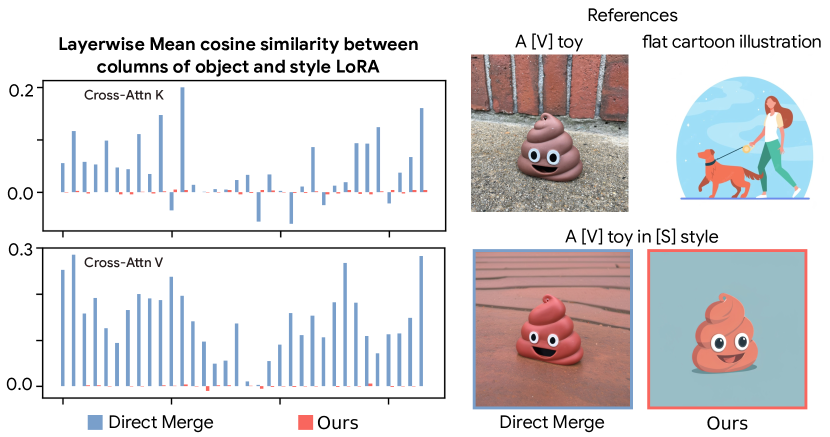
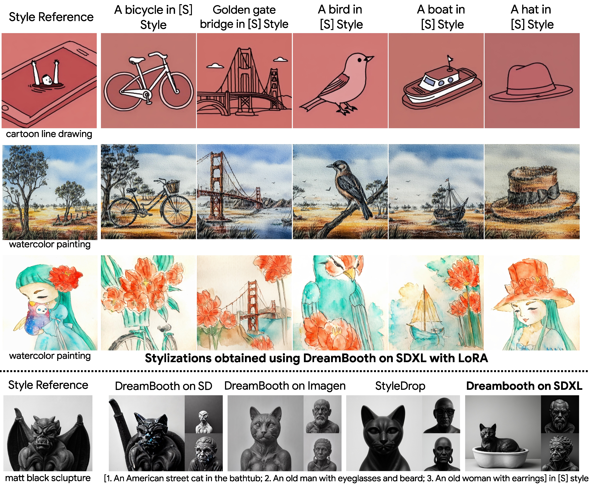
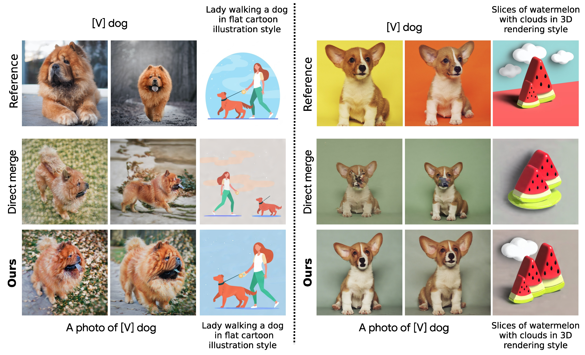
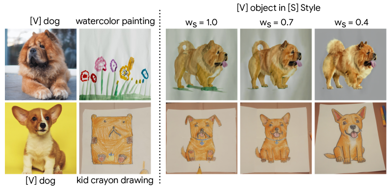

# ZipLoRA: LoRA を効果的に併合して任意の被写体を任意のスタイルで

> 原題: ZipLoRA: Any Subject in Any Style by Effectively Merging LoRAs
> 著者: Viraj Shah, Nataniel Ruiz, Forrester Cole, Erika Lu, Svetlana Lazebnik, Yuanzhen Li, Varun Jampani（Google Research・UIUC）
> 出典: arXiv:2311.13600（ECCV 2024）

## Abstract（要旨）

概念駆動の個人化（concept-driven personalization）のために生成モデルをファインチューンする手法は、一般に被写体駆動（subject-driven）またはスタイル駆動（style-driven）の生成で強い結果を得る。最近、低ランク適応（low-rank adaptation, LoRA）が概念駆動の個人化を達成するパラメータ効率的な方法として提案された。最近の研究は、学習したスタイルと被写体の合同生成を達成するために別々の LoRA を組み合わせることを探っているが、既存技術はこの問題を確実には解決しておらず、被写体忠実度（subject fidelity）かスタイル忠実度（style fidelity）のいずれかをしばしば犠牲にする。我々は ZipLoRA を提案する。これは独立に学習されたスタイル LoRA と被写体 LoRA を安価かつ効果的に併合し、ユーザーが提供する任意の被写体を、ユーザーが提供する任意のスタイルで生成する手法である。多様な被写体とスタイルの組合せに対する実験は、ZipLoRA が再文脈化（recontextualize）の能力を保ちつつ、被写体・スタイル忠実度でベースラインに対し意味のある改善を伴う説得力のある結果を生成できることを示す。

<figure>

<figcaption>図1: 独立に学習されたスタイル LoRA とコンテンツ LoRA を効果的に併合することで、提案手法 ZipLoRA は、ユーザーが提供する任意の被写体を任意のスタイルで生成でき、拡散モデルによる個人化された創作に前例のない制御を提供する。</figcaption>
</figure>

## 1 はじめに

最近、拡散モデルは、多様な芸術的概念への優れた理解と、マルチモーダル条件付け（テキストが最も一般的な様式）による高い制御性により、目覚ましい画像生成品質を可能にした。生成モデルの有用性と柔軟性は、DreamBooth や StyleDrop のような多様な個人化アプローチによってさらに進歩した。これらのアプローチは、特定の概念の画像でベース拡散モデルをファインチューンし、様々な文脈で新しい描写を生成する。そうした概念は、特定の物体・人物、あるいは芸術的スタイルでありうる。

個人化手法は被写体とスタイルに対して独立に使われてきたが、未解決の重要な問題は、**特定のユーザー提供被写体を、特定のユーザー提供スタイルで生成すること**である。例えば、ある芸術家は自分の作品例から学習した個人的スタイルで特定の人物を描きたいかもしれない。あるユーザーは、自分の子の水彩画のスタイルで、子のお気に入りのぬいぐるみの画像を生成したいかもしれない。さらに、これが達成されれば 2 つの問題が同時に解ける：(1) 任意の被写体を任意のスタイルで表現するタスク、(2) 不正確で特定の生成タスクに不向きなテキストではなく、画像で拡散モデルを制御する問題。最後に、独立に学習されたスタイルと被写体の蓄えがオンラインで共有・保存される、こうしたツールの大規模応用も想像できる。任意の被写体を任意のスタイルで自在に描くタスクは、我々が取り組もうとする未解決の研究課題である。

最近の個人化手法の落とし穴は、多くが大きなベースモデルの全パラメータをファインチューンし、コストが高くなりうる点である。Parameter Efficient Fine-Tuning（PEFT, パラメータ効率的ファインチューニング）アプローチは、概念駆動の個人化のためのモデルを、はるかに低いメモリ・ストレージ予算でファインチューンできる。様々な PEFT アプローチのうち、Low Rank Adaptation（LoRA）はその汎用性のため研究者・実務家に好まれる手法として台頭した。LoRA は注意層のために低ランク分解された重み行列を学習する（学習されたこの重み自体がしばしば「LoRA」と呼ばれる）。LoRA と DreamBooth のようなアルゴリズムを組み合わせることで、学習された被写体固有の LoRA 重みは、モデルが意味的バリエーションを伴ってその被写体を生成することを可能にする。

LoRA 個人化の人気の高まりとともに、LoRA 重みを併合する試み——特に被写体 LoRA とスタイル LoRA を可変係数で線形結合する試み——が行われてきた。これは各 LoRA の「強さ」の制御を可能にし、ユーザーは時に、入念なグリッドサーチと主観的な人間評価を通じて、特定のスタイルの下で被写体を正確に描写できる組合せを見つけられる。この手法はスタイルと被写体の組合せにわたる頑健性を欠き、また非常に時間がかかる。

我々の研究では ZipLoRA を提案する。これは、被写体とスタイルのために独立に学習された LoRA を安価に併合することで、任意の被写体を任意のスタイルで生成する、単純だが効果的な手法である。我々のアプローチは、これらがどう学習されたかに何ら制約を課すことなく、多様な被写体・スタイル LoRA に対して一貫して機能する。これにより、ユーザーや芸術家は公開されている好きな被写体・スタイル LoRA を容易に組み合わせられる。ZipLoRA は **hyperparameter-free**、すなわちハイパーパラメータや併合重みの手動調整を必要としない。

我々のアプローチは、最近公開された Stable Diffusion XL（SDXL）モデルを活用し、3 つの重要な観察に基づく。(1) SDXL は、Muse 上の StyleDrop が示した結果に匹敵する強いスタイル学習特性を示す。具体的には、以前の Stable Diffusion と異なり、SDXL は DreamBooth プロトコルに従って**単一の例示画像だけで**、人間のフィードバックなしにスタイルを学習できる。(2) 異なる層の LoRA 重み $\Delta W_{i}$（$i$ は層を表す）は**疎（sparse）**である。すなわち $\Delta W_{i}$ の要素の大半は非常に小さい大きさを持ち、生成品質・忠実度にほとんど影響しない。(3) 独立に学習された 2 つの LoRA の重み行列の列は、例えば cosine 類似度で測られる「整列（alignment）」の度合いが様々でありうる。高度に整列した列を直接足すと、併合モデルの性能が劣化することを我々は見出す。

これらの観察に基づき、我々は「**ファスナー（zipper）のように動作し、コンテンツとスタイルの元の生成特性を保ちながら同方向の和の量を減らす**」手法が、より頑健で高品質な併合を生むと仮説立てる。ファスナーが布の両側を継ぎ目なく結合するように、提案する最適化ベースのアプローチは、2 つの LoRA を混合するための**互いに素な（disjoint）併合係数の集合**を見つける。これにより併合 LoRA は被写体とスタイルの両方を巧みに捉える。我々の最適化は軽量で、2 つの LoRA が高度に整列している困難なコンテンツ・スタイル組合せで併合性能を著しく改善する。

貢献を以下にまとめる：

- 現在の text-to-image 拡散モデルと個人化手法について、特にスタイル個人化に関するいくつかの重要な観察を示す。さらに概念個人化された LoRA 重み行列の係数の疎性と、LoRA 行列の高度に整列した列の蔓延と有害な効果を調べる。
- これらの知見を用いて ZipLoRA を提案する。これは独立に学習されたスタイル LoRA と被写体 LoRA を効果的に併合し、任意の被写体を任意のスタイルで生成できるようにする単純な最適化手法である。ZipLoRA は、新しい生成能力を達成するために LoRA を併合する技術の世界への最初の探求である。
- コンテンツ・スタイル転送と再文脈化を含む様々な画像スタイル化タスクで本アプローチの有効性を示す。ZipLoRA が既存の LoRA 併合手法や他のベースラインアプローチを上回ることも示す。

## 2 関連研究

**カスタム生成のための拡散モデルのファインチューニング。** 進展する text-to-image（T2I）モデル個人化の分野では、最近の研究が、テキスト記述に基づいて特定の被写体を描くために大規模 T2I 拡散モデルをファインチューンする様々な手法を導入した。Textual Inversion のような技術はテキスト埋め込みの学習に焦点を当て、DreamBooth はより良い被写体表現のために T2I モデル全体をファインチューンする。後の手法はネットワークの特定部分の最適化を目指す。加えて LoRA や StyleDrop のような技術は、それぞれ低ランク近似と重みの小さな部分集合の最適化に、スタイル個人化のために集中する。DreamArtist は正負プロンプトチューニング戦略を用いる新しい one-shot 個人化手法を導入する。これらのファインチューニングアプローチは高品質な結果を生むが、典型的には 1 つの概念（被写体かスタイルのいずれか）の学習に限られる。例外は Custom Diffusion で、複数概念を同時に学習しようとする。しかし Custom Diffusion はゼロからの高価な合同学習を要し、スタイルを被写体から分離できないためスタイル化に使うと劣る結果になる。

**LoRA の組合せ。** 異なる LoRA の組合せは、特にスタイルと被写体の概念を融合する観点では、文献で十分に探られていない。Ryu は独立に学習された LoRA を加重算術和で組み合わせる手法を示す。Gu ら（Mix-of-Show）は複数の概念 LoRA を融合することを論じるが、それは LoRA を併合するのでなくモデル全体を再学習するため、再学習を要する高価な手法である。同時期の研究はゲート関数を用いて複数 LoRA を組み合わせ Mixture of Experts を得る戦略を論じる。

**画像スタイル化。** 画像ベースのスタイル転送は少なくとも 20 年前にさかのぼる研究分野である。任意スタイル転送の大きな進歩は畳み込みニューラルネットベースのアプローチで達成された。GAN のような生成モデルも画像スタイル化タスクの prior として使える。最近の多くの GAN ベースアプローチは、与えられた参照スタイルに対し事前学習済み GAN をファインチューンすることで成功裏に one-shot スタイル化を達成する。しかしこれらは単一ドメイン（顔など）の画像に限られる。さらに既存の GAN の大半は出力の意味に対する直接的なテキストベース制御を提供せず、参照被写体を新しい文脈で生成できない。古い生成モデルと比べ、拡散モデルは優れた生成品質とテキストベース制御を提供するが、これまで画像例で駆動される one-shot スタイル化に使うのは困難だった。我々の研究は、多様なシナリオへの再文脈化能力と組み合わせた、高品質な例ベーススタイル化への拡散モデルの利用を示す最初の研究の 1 つである。

## 3 手法

### 3.1 背景

拡散モデルは高品質で写実的な画像合成で知られる最先端の生成モデルである。その学習は 2 段階からなる：画像が漸進的なガウスノイズ付加でガウスノイズへ遷移する順過程（forward process）と、ノイズから元データを再構成する逆過程（reverse process）。逆過程は典型的にはテキスト条件付けをサポートする U-net で学習され、推論時に text-to-image 生成を可能にする。我々の研究では、画像空間でなく潜在空間で拡散過程を学習する、広く使われる潜在拡散モデル（latent diffusion model）に焦点を当てる。特に、全実験で Stable Diffusion XL v1 を使う。

**LoRA ファインチューニング。** LoRA（Low-Rank Adaptation）は大規模言語・視覚モデルを新しい下流タスクに効率的に適応する手法である。LoRA の鍵となる概念は、ファインチューニング中のベースモデル重み $W_{0}\in\mathbb{R}^{m\times n}$ への重み更新 $\Delta W$ が「低い内在階数（low intrinsic rank）」を持つことである。したがって更新 $\Delta W$ は 2 つの低ランク行列 $B\in\mathbb{R}^{m\times r}$ と $A\in\mathbb{R}^{r\times n}$ に分解でき、$\Delta W=BA$ として効率的にパラメータ化できる（$r$ は $\Delta W$ の内在階数で $r\ll\min(m,n)$）。学習中は $A$ と $B$ のみを更新して適切な $\Delta W=BA$ を見つけ、$W_{0}$ は一定に保つ。推論では更新された重み行列を $W=W_{0}+BA$ として得られる。その効率性のため、LoRA はオープンソース拡散モデルのファインチューニングに広く使われる。

**問題設定。** 本研究では、与えられた text-to-image 拡散モデルを物体／スタイルの数枚の参照画像で別々にファインチューンして得た LoRA 重みを併合することで、与えられた参照スタイルでカスタム物体の正確な描写を生成することを目指す。

ベース拡散モデルを $D$、事前学習済み重みを $W^{(i)}_{0}$（$i$ は層インデックス）とする。ベースモデル $D$ は、対応する LoRA 重みの集合 $L_{x}\{\Delta W_{x}^{(i)}\}$ をモデル重みに足すだけで任意の概念に適応できる。これを $D_{L_{x}}=D\oplus L_{x}=W_{0}+\Delta W_{x}$ と表す。操作はベースモデル $D$ の全 LoRA 対応重み行列に適用されるので、簡単のため上付き $(i)$ は省略する。

ベースモデル $D$ に対し独立に学習された 2 つの LoRA 集合 $L_{c}=\{\Delta W_{c}^{(i)}\}$ と $L_{s}=\{\Delta W_{s}^{(i)}\}$ が与えられ、両個別 LoRA の効果を組み合わせて与えられた物体を所望の参照スタイルでスタイル化できる、併合 LoRA $L_{m}=\{\Delta W^{(i)}_{m}\}=\mathrm{Merge}(L_{c},L_{s})$ を見つけることを目指す。

**直接併合（Direct Merge）。** LoRA はベースモデル上のプラグ&プレイモジュールとして広く使われるので、複数 LoRA を組み合わせる最も一般的な方法は単純な線形結合である：

$$
L_{m}=L_{c}+L_{s}\implies\Delta W_{m}=w_{c}\cdot\Delta W_{c}+w_{s}\cdot\Delta W_{s},
$$

ここで $w_{c}$ と $w_{s}$ はそれぞれコンテンツ・スタイル LoRA の係数で、各 LoRA の「強さ」を制御する。与えられた被写体・スタイル LoRA に対し、入念なグリッドサーチと主観的人間評価により正確なスタイル化を可能にする $w_{c}$ と $w_{s}$ の特定の組合せを見つけられるかもしれないが、この手法は頑健でなく非常に時間がかかる。これに対し我々は、この煩雑な過程を必要としない hyperparameter-free なアプローチを提案する。

### 3.2 ZipLoRA

我々のアプローチは 2 つの興味深い洞察の上に築かれる：

<figure>

<figcaption>図2: LoRA 重み行列は疎である。ΔW の要素の大半は大きさがゼロに非常に近く、ファインチューン済みモデルの生成品質に影響を与えずに都合よく捨てられる。（下段：水彩画スタイルのテディベア。要素を 100%／20%／10% 保持しても生成が保たれる）</figcaption>
</figure>

**(1) LoRA 更新行列は疎である。** 異なる LoRA 層の更新行列 $\Delta W$ は疎である、すなわち $\Delta W$ の要素の大半は大きさがゼロに非常に近く、ファインチューン済みモデルの出力にほとんど影響しないことを我々は観察する。各層について、全要素を大きさでソートし、ある百分位までの最小のものをゼロにできる。図2 に $\Delta W_{i}^{m\times n}$ の要素分布と、全層の重み更新行列 $\Delta W$ の最小の大きさの要素の 80%・90% をゼロにした後に生成したサンプルを描く。見て取れるように、要素の 90% を捨ててもモデル性能は影響を受けない。この観察は、$\Delta W$ の階数が設計上非常に小さく、したがって $\Delta W$ の大半の列に含まれる情報が冗長であるという事実から従う。

<figure>

<figcaption>図3: 高度に整列した LoRA 重みは併合がうまくいかない。LoRA 重みの列が高度に整列していると、直接併合は劣った結果を得る。代わりに我々のアプローチは、層にわたる LoRA 更新の列間の平均 cosine 類似度を最小化する。</figcaption>
</figure>

**(2) 高度に整列した LoRA 重みは併合がうまくいかない。** 独立に学習された 2 つの LoRA の重み行列の列は、分離されていない（disentangle されていない）情報を含みうる、すなわち列間の cosine 類似度が非ゼロでありうる。列間の整列の度合いが、結果として得られる併合の品質を決める重要な役割を果たすことを我々は観察する：非ゼロの cosine 類似度を持つ列を互いに直接足すと、個別概念に関する情報の重ね合わせが起き、併合モデルが入力概念を正確に合成する能力が失われる。さらに、列が互いに直交し cosine 類似度がゼロのとき、こうした情報損失が避けられることを観察する。

<figure>

<figcaption>図4: ZipLoRA の概観。本手法はスタイル・被写体 LoRA の両方について ΔWᵢ の各列の混合係数を学習する。(1) 混合 LoRA が生成する被写体／スタイル画像と元の被写体／スタイル LoRA モデルが生成する画像の差を最小化し、(2) コンテンツとスタイル LoRA の列間の cosine 類似度を最小化する。本質的に、zip された LoRA は各個別 LoRA の被写体・スタイル特性を保ちつつ、両 LoRA の信号干渉を最小化しようとする。</figcaption>
</figure>

各重み行列はその列で定義される線形変換を表すので、足される列が互いに直交しているときにのみ、併合がこれらの列に含まれる情報を保持するのは直感的である。大半のコンテンツ・スタイル LoRA 対では cosine 類似度が非ゼロで、直接足すと信号干渉（signal interference）が生じる。図3 では、特定のコンテンツ・スタイル対について、ZipLoRA 適用前後の最後の U-net ブロックの各層の平均 cosine 類似度値を示す。直接併合では高い非ゼロの cosine 類似度値が見られ、それが劣ったスタイル化品質をもたらす。一方 ZipLoRA は類似度値を著しく減らし優れた結果を達成する。

併合中の信号干渉を防ぐため、列間の直交性を達成できるように各列に学習可能な係数を掛ける。LoRA 更新が疎であるという事実は、各 LoRA から特定の列を無視できることを可能にし、干渉最小化のタスクを容易にする。図4 のように、コンテンツ・スタイル LoRA の各 LoRA 層に対し、それぞれ併合係数ベクトル $m_{c}$ と $m_{s}$ の集合を導入する：

$$
L_{m}=\mathrm{Merge}(L_{c},L_{s},m_{c},m_{s})
$$

$$
\implies\Delta W_{m}=m_{c}\otimes\Delta W_{c}+m_{s}\otimes\Delta W_{s},
$$

ここで $\otimes$ は $\Delta W$ とブロードキャストされた併合係数ベクトル $m$ の要素ごとの積を表し、$\Delta W$ の $j$ 番目の列が $m$ の $j$ 番目の要素と掛けられる。$m_{c}$ と $m_{s}$ の次元は対応する $\Delta W$ の列数に等しく、したがって併合係数ベクトルの各要素は、最終併合への LoRA 行列 $\Delta W$ の対応列の寄与を表す。

ZipLoRA アプローチには 2 つの目標がある：(1) コンテンツとスタイル LoRA の列間の cosine 類似度で定義される干渉を最小化すること、(2) 混合 LoRA が生成する被写体／スタイル画像と元の被写体／スタイル LoRA が生成する画像の差を最小化することで、併合 LoRA が参照被写体とスタイルを独立に生成する能力を保つこと。併合される列が信号干渉を最小化するよう、提案する損失は各層の併合ベクトル $m_{c}$ と $m_{s}$ の間の cosine 類似度を最小化しようとする。一方、スタイルとコンテンツ LoRA の元の挙動が併合モデルに保たれることを保証したい。したがって図4 のように、次の損失関数で最適化問題を定式化する：

$$
\mathcal{L}_{merge}=\|(D\oplus L_{m})(x_{c},p_{c})-(D\oplus L_{c})(x_{c},p_{c})\|_{2}
$$
$$
+\|(D\oplus L_{m})(x_{s},p_{s})-(D\oplus L_{s})(x_{s},p_{s})\|_{2}
$$
$$
+\lambda\sum_{i}|m^{(i)}_{c}\cdot m^{(i)}_{s}|,
$$

ここで併合モデル $L_{m}$ は式2 に従い $m_{c}$ と $m_{s}$ を使って計算される。$p_{c},p_{s}$ はそれぞれコンテンツ・スタイル参照のためのテキスト条件付けプロンプト、$\lambda$ は cosine 類似度損失項の適切な乗数である。最初の 2 項は併合モデルが個別のスタイル・コンテンツを生成する能力を保持することを保証し、第 3 項は個別 LoRA 重みの列間に直交性制約を課す。重要なことに、ベースモデルと個別 LoRA の重みは凍結したまま、併合係数ベクトルのみを更新する。次節で見るように、こうした単純な最適化手法はカスタム被写体の強いスタイル化を生むのに効果的である。さらに ZipLoRA は $100$ 回の勾配更新しか必要とせず、合同学習アプローチと比べ $10\times$ 速い。

## 4 実験

**データセット。** DreamBooth データセットから多様なコンテンツ画像群を選ぶ。これは各被写体の 4〜5 枚の画像を含む 30 の画像セットを提供する。同様に、StyleDrop の著者が提供するデータから多様なスタイル参照画像群を選ぶ。各スタイルに単一画像のみを使う。使用した全コンテンツ・スタイル画像の帰属・ライセンス情報は DreamBooth と StyleDrop の原稿／ウェブサイトで入手できる。

**実験設定。** 全実験を SDXL v1.0 ベースモデルで行う。全スタイル・コンテンツ LoRA の取得に、rank $64$ の LoRA を用いた DreamBooth ファインチューニングを使う。LoRA 重みを Adam optimizer で $1000$ step、バッチサイズ $1$、学習率 $0.00005$ で更新する。LoRA ファインチューニング中は SDXL のテキストエンコーダを凍結する。ZipLoRA では全実験で式3 に $\lambda=0.01$ を使い、cosine 類似度がゼロに落ちるまで、最大勾配更新回数を $100$ として最適化を回す。

<figure>

<figcaption>図5: SDXL での DreamBooth によるスタイル学習。上：SDXL モデルは、DreamBooth 目的の LoRA で参照スタイルの単一例にファインチューンされると、スタイル化された出力を生成することを学ぶ。下：ファインチューン済み SDXL モデルが生成するスタイル化は、他のモデルのものと比べ非常に有能である。StyleDrop と異なり、SDXL DreamBooth ファインチューニングは人間のフィードバックを必要としない点に注意。</figcaption>
</figure>

<figure>

<figcaption>図6: 定性比較。本手法（Ours）を、直接算術併合・合同学習・StyleDrop と比較する。本手法は競合手法を上回る強いスタイル・被写体忠実度を達成することが観察される。</figcaption>
</figure>

### 4.1 SDXL モデルのスタイルチューニング挙動

§3 で論じたように、我々は驚くべきことに、事前学習済み SDXL モデルが**たった 1 枚の参照スタイル画像**にファインチューンされたときに強いスタイル学習を示すことを観察する。図5 に SDXL モデルのスタイルチューニング結果を示す。各参照画像について、DreamBooth 目的で LoRA rank $=64$ の SDXL モデル LoRA ファインチューニングを適用する。ファインチューニングでは、StyleDrop で提供されるのと似たプロンプト形成「an $<$ object $>$ in the $<$ style description $>$ style」に従う。一度ファインチューンされると、SDXL は絵画スタイル・照明・色・幾何の機微を正確に捉えることで、多様な概念集合を参照スタイルで表現できる。なぜこのモデルが、以前の SD バージョン（や Imagen）のより劣る性能と対照的に、この強いスタイル学習性能を示すのかという問いは未解決のまま残され、学習データ・モデルアーキテクチャ・学習手法など多くの答えがありうる。

図5 では Muse 上の StyleDrop、Imagen での DreamBooth、Stable Diffusion での DreamBooth との比較も提供する。SDXL スタイルチューニングが競合手法より著しく良く機能することを観察する。StyleDrop が人間のフィードバックを伴う反復学習を要するのに対し、SDXL スタイルチューニングは要さない点に注意。この SDXL の挙動は、被写体 LoRA とスタイル LoRA の併合を調べる完璧な候補にする。したがって全実験のベースモデルとしてこれを使うことにする。

<figure>

<figcaption>図7: 本手法は、与えられたスタイルでスタイル化を保ちつつ、参照被写体の再文脈化に成功する。</figcaption>
</figure>

**表1**: ユーザー選好調査。正確なスタイル化と被写体忠実度について、本アプローチと競合手法のユーザー選好を比較する。ユーザーは一般に本アプローチを好む。

| ZipLoRA を以下より好む % | Direct Merge | Joint Training | StyleDrop |
| --- | --- | --- | --- |
| 選好率 | 82.7% | 71.1% | 68.0% |

**表2**: 画像整列・テキスト整列スコア。出力と参照スタイル・被写体・プロンプトの間で、CLIP（スタイルとテキスト用）と DINO 特徴（被写体用）の cosine 類似度を比較する。ZipLoRA はスタイル整列を維持しつつ、優れた被写体・テキスト忠実度を提供する。

| | ZipLoRA | Joint Training | Direct Merge |
| --- | --- | --- | --- |
| Style-alignment ↑ | 0.699 | 0.680 | 0.702 |
| Subject-alignment ↑ | 0.420 | 0.378 | 0.357 |
| Text-alignment ↑ | 0.303 | 0.296 | 0.275 |

### 4.2 個人化されたスタイル化

まず、§4.1 で述べた SDXL のスタイルチューニングに従ってスタイル LoRA を取得し、被写体参照に DreamBooth ファインチューニングを適用して物体 LoRA を取得する。図1 と図6 は、様々なスタイル・コンテンツ LoRA を組み合わせた本アプローチの結果を示す。本手法は、参照被写体の identity の保持と参照スタイルの独自の特徴の捕捉の両方に成功する。

図6 で他アプローチとの定性比較も示す。ベースラインとして、$w_{c}$ と $w_{s}$ を 1 に設定した式1 による直接算術併合と比較する。こうした直接加算は各 LoRA に捉えられた情報の損失をもたらし、歪んだ物体／スタイルを伴う劣った結果を生む。

さらに、複数の rare unique identifier を用いた DreamBooth の multi-subject 変種による被写体・スタイルの合同学習と本手法を比較する。示されるように、合同学習は物体とスタイルの分離を学べず劣った結果を生む。また事前学習済み LoRA の使用を許さず、スタイル専用・コンテンツ専用 LoRA としても使えないため、最も柔軟性に欠ける手法である。さらに ZipLoRA の $10\times$ の学習 step を要する。

<figure>

<figcaption>図8: 本手法は、直接併合アプローチと異なり、個別概念を生成する能力を失わない。</figcaption>
</figure>

StyleDrop は、参照物体でファインチューンした DreamBooth モデルに StyleDrop 手法を適用する DreamBooth+StyleDrop アプローチを、個人化されたスタイル化の達成のために提案する。我々の比較は、高い計算コストと人間フィードバック要件を考えると、その性能が理想的でないことを示す。また合理的な出力を生むには直接併合と同様に物体・スタイルモデル重み $w_{c}$ と $w_{s}$ の調整を要するが、本手法はそうしたハイパーパラメータ調整から自由である。

**定量結果。** 既存アプローチとの定量比較のためユーザー調査を行う。本調査では各参加者に参照被写体と参照スタイル、比較する 2 手法の出力をランダム順で見せ、参照被写体忠実度を保ちつつ参照スタイルを最もよく描くのはどの出力かを問う。ZipLoRA 対 3 つの競合アプローチそれぞれについて別々のユーザー調査を行い、各ケースで 45 ユーザーにわたり $360$ 件の回答を得た。結果を表1 に示す。見て取れるように、ZipLoRA は被写体の完全性を保ちつつ高品質なスタイル化を行うため、全 3 ケースで高いユーザー選好を受ける。

DreamBooth に従い、表2 で画像整列・テキスト整列スコアを用いた比較も提供する。3 つの指標を用いる：スタイル整列には出力とスタイル参照の画像埋め込みの CLIP-I スコア、被写体整列には出力と参照被写体の DINO 特徴、テキスト整列には出力とテキストプロンプトの CLIP-T 埋め込みを用いる。3 ケースとも指標に cosine 類似度を用い、各 8 スタイルの 4 被写体にわたり平均を計算する。ZipLoRA は合同学習・直接併合と比べ競争力あるスタイル整列スコアを得つつ、被写体整列で著しく良いスコアを達成する。これは ZipLoRA の被写体忠実度維持における優位性を浮き彫りにする。ZipLoRA はテキスト整列でも他の 2 つを上回り、text-to-image 生成能力を保つこと、また指定スタイル・被写体をよりよく表現すること（これらもテキストプロンプトの一部なので）を示唆する。これらの指標は、特にスタイル整列の測定では、微妙なスタイル的細部を捉える能力を欠き、画像の全体的内容など意味的特性と絡み合うため、完璧ではない点に注意すべきである。

**再文脈化の能力。** 併合された ZipLoRA モデルは、スタイル化品質を保ちつつ、参照物体を多様な文脈で意味的修正を伴って再文脈化できる。図7 のように、本手法はベースモデルの text-to-image 生成能力を保ちつつ、画像全体を参照スタイルで正確にスタイル化する。こうした能力は、文脈・被写体 identity・スタイルの制御を要する様々な芸術的ユースケースで非常に価値がある。

**スタイル化の度合いの制御。** 我々の最適化ベース手法は LoRA 更新の各列にスカラ重み値を直接提供し、合理的な結果を得るための調整の必要を除く。しかし、追加の制御性のため物体・スタイルコンテンツの強さを変えることも許せる。スタイル層の重みに追加のスカラ乗数 $w_{s}$ を掛けることで、最終出力へのスタイルの寄与を制限できる。図9 のように、これは $w_{s}$ が $0$ から $1$ へ変わるにつれてスタイル化の度合いを滑らかに制御できるようにする。

**参照物体とスタイルを生成する能力。** 正確なスタイル化を生むことに加え、理想的な LoRA 併合は個別の物体とスタイルを正しく生成する能力も保つべきである。こうして併合 LoRA モデルは両個別 LoRA の代替、あるいは Mixture-of-Expert モデルとしても使える。図8 のように、本アプローチは両モデルの元の挙動を保ち、各構成 LoRA の特定の構造的・スタイル的要素を正確に生成できるのに対し、直接併合は失敗する。

<figure>

<figcaption>図9: スタイル制御性。本手法は被写体・スタイル個人化の達成においてそのまま機能する。とはいえ、併合重み wₛ を変えることでスタイル化の度合いを制御できる。</figcaption>
</figure>

## 5 結論

本論文では、独立に学習されたスタイル LoRA と被写体 LoRA を継ぎ目なく併合する新しい手法 ZipLoRA を導入した。本アプローチは、SDXL のような十分強力な拡散モデルを用いて、任意の被写体を任意のスタイルで生成する能力を解き放つ。事前学習済み LoRA 重みに関する重要な洞察を活用することで、このタスクの既存手法を凌駕する。ZipLoRA は、同時的な被写体・スタイル個人化のための合理化された、安価で hyperparameter-free な解を提供し、拡散モデルの創造的制御性の新たな水準を解き放つ。
