# Flow Matching と拡散モデル入門

> 原題: An Introduction to Flow Matching and Diffusion Models
> 著者: Peter Holderrieth, Ezra Erives（MIT Class 6.S184: Generative AI With Stochastic Differential Equations, 2025）
> 出典: arXiv:2506.02070 ・ コース: https://diffusion.csail.mit.edu/
> 訳注: 本翻訳は本文 §1–5 と Appendix A・B を対象とする（§6 謝辞・References は除外）。数式は原典の意味を保ちつつ、ar5iv が分割した数式ブロックを 1 つにまとめて表記した。

> データからノイズを作るのは簡単だ。ノイズからデータを作ることが生成モデリングである。
> — Song ら [30]

## 1 はじめに

### 1.1 概観

近年、私たちは皆、人工知能（AI）における途方もない革命を目撃してきた。Stable Diffusion 3 のような画像生成器は多様なスタイルにわたって写実的・芸術的な画像を生成でき、Meta の Movie Gen Video のような動画モデルは非常にリアルな映画クリップを生成でき、ChatGPT のような大規模言語モデルはテキストプロンプトに対して人間レベルにも見える応答を生成できる。この革命の中心にあるのが、AI システムの新しい能力——**対象を生成する**能力である。以前の世代の AI システムが主に予測に使われていたのに対し、これらの新しい AI システムは創造的である。ユーザーが指定した入力に基づいて、新しい対象を「夢見る」か思いつく。そうした生成 AI システムが、この最近の AI 革命の核心にある。

この講義の目標は、最も広く使われている 2 つの生成 AI アルゴリズム——**denoising diffusion models（ノイズ除去拡散モデル）** と **flow matching（フローマッチング）**——を教えることである。これらのモデルは最良の画像・音声・動画生成モデル（例: Stable Diffusion 3, Movie Gen Video）の基盤であり、最近ではタンパク質構造（例: AlphaFold3 は拡散モデルである）のような科学的応用でも最先端になった。疑いなく、これらのモデルを理解することは実に極めて有用なスキルである。

これらの生成モデルはすべて、ノイズを反復的にデータへ変換することで対象を生成する。このノイズからデータへの発展は、常微分方程式または確率微分方程式（ODE/SDE）のシミュレーションによって実現される。flow matching と denoising diffusion models は、そうした ODE/SDE を深層ニューラルネットワークで大規模に構成・学習・シミュレーションすることを可能にする技法の一群である。これらのモデルは実装こそ比較的単純だが、SDE の技術的な性質はモデルの理解を難しくしうる。本コースの目標は、これらのモデルを体系的に理解できるよう、微分方程式に関する必要な数学的道具立てへの自己完結的な入門を提供することである。広く応用できることに加え、私たちは flow・拡散モデルの背後にある理論はそれ自体として優美だと信じている。したがって最も大切なこととして、本コースが皆さんにとって大いに楽しいものになることを願う。

###### 注意 1（追加リソース）

この講義ノートは自己完結的だが、利用を勧める 2 つの追加リソースがある：

1. 講義録画：各節を講義形式で案内する。
2. ラボ：自分自身の拡散モデルをゼロから実装するのを案内する。「手を動かして」コードを書くことを強く勧める。

これらはコースのウェブサイト https://diffusion.csail.mit.edu/ にある。

### 1.2 コース構成

この文書の概観を簡単に述べる。

##### 必要な前提知識

本主題の技術的性質ゆえ、ある程度の数学的成熟、特に確率論への馴染みを推奨する。このため、Appendix A に確率論の簡単なリマインダ節を含めた。そこの概念のいくつかが馴染みなくても心配無用である。

### 1.3 サンプリングとしての生成モデリング

まず、遭遇しうる様々なデータ型（モダリティ）と、それらを数値的にどう表現するかを考えよう：

1. **画像**：高さ $H$・幅 $W$ の $H\times W$ ピクセルからなり、各ピクセルが 3 色チャネル（RGB）を持つ画像を考える。各ピクセル・各色チャネルについて $\mathbb{R}$ の強度値が与えられる。したがって画像は要素 $z\in\mathbb{R}^{H\times W\times 3}$ で表せる。
2. **動画**：動画は単に時間方向に並んだ画像の系列である。$T$ 個の時点（フレーム）があれば、動画は要素 $z\in\mathbb{R}^{T\times H\times W\times 3}$ で表せる。
3. **分子構造**：素朴には、分子の構造を行列 $z=(z^{1},\dots,z^{N})\in\mathbb{R}^{3\times N}$ で表せる。$N$ は分子中の原子数、各 $z^{i}\in\mathbb{R}^{3}$ はその原子の位置を表す。もちろん、分子を表すより洗練された方法も他にある。

上記すべての例で、生成したい対象は（必要なら平坦化した後）数学的にベクトルとして表せる。したがって本文書を通じて次を採用する：

###### 鍵となる考え 1（対象＝ベクトル）

生成される対象をベクトル $z\in\mathbb{R}^{d}$ と同一視する。

上記の注目すべき例外はテキストデータで、これは通常（ChatGPT のような）自己回帰言語モデルにより離散的な対象としてモデル化される。離散データ向けの flow・拡散モデルも開発されているが、本コースは連続データへの応用に専念する。

##### サンプリングとしての生成

何かを「生成する」とは何を意味するかを定義しよう。例えば犬の画像を生成したいとする。当然、満足できる犬の画像は**多数**ありうる。特に、唯一の「最良の」犬の画像は存在しない。むしろ、よりよく／より悪く当てはまる画像のスペクトルがある。機械学習では、この可能な画像の多様性を**確率分布**と考えるのが一般的である。それを**データ分布**と呼び $p_{\rm{data}}$ と表記する。犬の画像の例では、この分布はより犬らしく見える画像により高い尤度を与える。したがって、画像／動画／分子がどれだけ「良い」か——むしろ主観的な言明——は、データ分布 $p_{\rm{data}}$ の下でどれだけ「尤もらしい」かに置き換えられる。これにより、生成のタスクを（未知の）分布 $p_{\rm{data}}$ からのサンプリングとして数学的に表現できる：

###### 鍵となる考え 2（サンプリングとしての生成）

対象 $z$ を生成することは、データ分布からのサンプリング $z\sim p_{\rm{data}}$ としてモデル化される。

生成モデルとは、$p_{\rm{data}}$ からのサンプル生成を可能にする機械学習モデルである。機械学習ではモデルの学習にデータが必要である。生成モデリングでは通常、$p_{\rm{data}}$ から独立にサンプルされた有限個の例にアクセスできると仮定し、それらが真の分布の代理となる。

###### 鍵となる考え 3（データセット）

データセットは有限個のサンプル $z_{1},\dots,z_{N}\sim p_{\rm{data}}$ からなる。

画像なら、インターネット上の公開画像を集めてデータセットを作れる。動画なら、同様に YouTube をデータベースとして使える。タンパク質構造なら、Protein Data Bank（PDB）のように数十年にわたって科学的測定を集めた実験データベースを使える。データセットのサイズが非常に大きくなるにつれ、基礎となる分布 $p_{\rm{data}}$ のますます良い表現になる。

##### 条件付き生成

多くの場合、あるデータ $y$ を条件として対象を生成したい。例えば $y=$「雪に覆われた丘を駆け下りる犬、背景に山」を条件に画像を生成したい。これを条件付き分布からのサンプリングと言い換えられる：

###### 鍵となる考え 4（条件付き生成）

条件付き生成は $z\sim p_{\rm{data}}(\cdot|y)$ からのサンプリングを含む。$y$ は条件付け変数である。

$p_{\rm{data}}(\cdot|y)$ を**条件付きデータ分布**と呼ぶ。条件付き生成モデリングのタスクは通常、固定ではなく任意の $y$ で条件付けることを学ぶことを含む。先の例で言えば、別のテキストプロンプト（例: $y=$「誕生日のロウソクを吹き消す猫の写実的な画像」）で条件付けたいかもしれない。よって、そうした任意の $y$ で条件付けられる単一のモデルを求める。無条件生成の技法は条件付きの場合に容易に一般化できることが分かる。したがって最初の 3 節では、ほぼ無条件の場合に専念する（条件付き生成が目指す先であることは念頭に置く）。

##### ノイズからデータへ

ここまで、生成モデリングの**何を**——$p_{\rm{data}}$ からのサンプル生成——を論じた。ここでは**どのように**を簡単に論じる。このため、容易にサンプルできる初期分布 $p_{\rm{init}}$（例: ガウス $p_{\rm{init}}=\mathcal{N}(0,I_{d})$）にアクセスできると仮定する。生成モデリングの目標は、$x\sim p_{\rm{init}}$ からのサンプルを $p_{\rm{data}}$ からのサンプルへ変換することである。$p_{\rm{init}}$ はガウスほど単純である必要はない。後で見るように、この柔軟性を活用する興味深い用例がある。とはいえ、大半の応用では単純なガウスとし、その点を念頭に置くことが重要である。

##### まとめ

ここまでの議論を次のようにまとめる。

###### まとめ 2（サンプリングとしての生成）

本節の知見をまとめる：

1. 本講義では、画像・動画・分子構造のようにベクトル $z\in\mathbb{R}^{d}$ で表される対象を生成するタスクを考える。
2. 生成は、学習時にサンプルのデータセット $z_{1},\dots,z_{N}\sim p_{\rm{data}}$ にアクセスしつつ、確率分布 $p_{\rm{data}}$ からサンプルを生成するタスクである。
3. 条件付き生成は、分布をラベル $y$ で条件付け、学習時にペアのデータセット $(z_{1},y),\dots,(z_{N},y)$ にアクセスしつつ $p_{\rm{data}}(\cdot|y)$ からサンプルしたいと仮定する。
4. 目標は、単純な分布 $p_{\rm{init}}$（例: ガウス）からのサンプルを $p_{\rm{data}}$ からのサンプルへ変換する生成モデルを学習することである。

## 2 Flow モデルと拡散モデル

前節では、生成モデリングをデータ分布 $p_{\rm{data}}$ からのサンプリングとして定式化した。さらに、サンプリングが単純な分布 $p_{\rm{init}}$（例: ガウス $\mathcal{N}(0,I_{d})$）からのサンプルを目標分布 $p_{\rm{data}}$ のサンプルへ変換することで達成できることを見た。本節では、望ましい変換が適切に構成された微分方程式のシミュレーションとして得られることを述べる。例えば flow matching と拡散モデルは、それぞれ常微分方程式（ODE）と確率微分方程式（SDE）のシミュレーションを含む。よって本節の目標は、以降で使うこれらの生成モデルを定義・構成することである。具体的には、まず ODE と SDE を定義しそのシミュレーションを論じる。次に、深層ニューラルネットワークで ODE/SDE をパラメータ化する方法を述べる。これが flow モデルと拡散モデルの定義、およびそうしたモデルからサンプルする基本アルゴリズムへ導く。後の節では、これらのモデルの学習方法を探る。

### 2.1 Flow モデル

まず常微分方程式（ODE）を定義する。ODE の解は**軌道（trajectory）**、すなわち次の形の関数で定義される：

$$
X:[0,1]\to\mathbb{R}^{d},\quad t\mapsto X_{t},
$$

これは時刻 $t$ を空間 $\mathbb{R}^{d}$ 内のある位置へ写す。すべての ODE は**ベクトル場（vector field）** $u$、すなわち次の形の関数で定義される：

$$
u:\mathbb{R}^{d}\times[0,1]\to\mathbb{R}^{d},\quad(x,t)\mapsto u_{t}(x),
$$

つまり、すべての時刻 $t$ と位置 $x$ について、空間内の速度を指定するベクトル $u_{t}(x)\in\mathbb{R}^{d}$ が得られる（図1 参照）。ODE は軌道に条件を課す。点 $x_{0}$ から出発して、ベクトル場 $u_{t}$ の「線に沿って進む」軌道 $X$ がほしい。そうした軌道を次の方程式の解として形式化できる：

$$
\frac{\mathrm{d}}{\mathrm{d}t}X_{t}=u_{t}(X_{t})\quad\blacktriangleright\ \text{ODE},\qquad X_{0}=x_{0}\quad\blacktriangleright\ \text{初期条件}
$$

式(1a) は $X_{t}$ の微分が $u_{t}$ の与える方向で指定されることを要求する。式(1b) は時刻 $t=0$ で $x_{0}$ から出発することを要求する。ここで問える：$t=0$ で $X_{0}=x_{0}$ から出発したら、時刻 $t$ ではどこにいるか（$X_{t}$ は何か）？ この問いに答えるのが**フロー（flow）**と呼ばれる関数で、ODE の解である：

$$
\psi:\mathbb{R}^{d}\times[0,1]\to\mathbb{R}^{d},\quad(x_{0},t)\mapsto\psi_{t}(x_{0})
$$

$$
\frac{\mathrm{d}}{\mathrm{d}t}\psi_{t}(x_{0})=u_{t}(\psi_{t}(x_{0}))\quad\blacktriangleright\ \text{flow ODE},\qquad\psi_{0}(x_{0})=x_{0}\quad\blacktriangleright\ \text{flow 初期条件}
$$

与えられた初期条件 $X_{0}=x_{0}$ に対し、ODE の軌道は $X_{t}=\psi_{t}(X_{0})$ で復元される。したがってベクトル場・ODE・フローは直感的に同じ対象の 3 つの記述である：ベクトル場が ODE を定義し、その解がフローである。あらゆる方程式と同様、ODE についても問うべきである：解は存在するか、存在するなら一意か？ 数学の基本的な結果は、$u_{t}$ に弱い仮定を課す限り、両方に「イエス！」である：

###### 定理 3（フローの存在と一意性）

$u:\mathbb{R}^{d}\times[0,1]\to\mathbb{R}^{d}$ が有界な導関数を持ち連続微分可能なら、式(2) の ODE はフロー $\psi_{t}$ で与えられる一意の解を持つ。この場合 $\psi_{t}$ はすべての $t$ で微分同相写像である。すなわち $\psi_{t}$ は連続微分可能で、連続微分可能な逆 $\psi_{t}^{-1}$ を持つ。

フローの存在と一意性に必要な仮定は、機械学習ではほぼ常に満たされる点に注意する。なぜなら $u_{t}(x)$ のパラメータ化にニューラルネットワークを使い、それらは常に有界な導関数を持つからである。したがって定理 3 は心配事ではなく、むしろ朗報である：私たちの関心のある場合、フローは存在し ODE の一意な解である。証明は [20, 4] にある。

<figure>

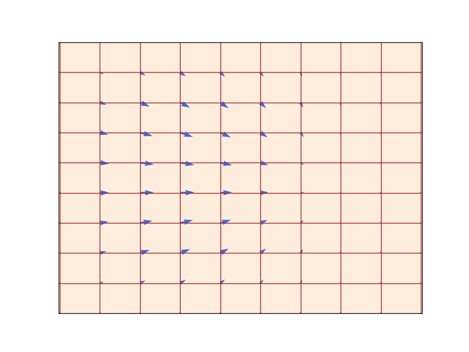

<figcaption>図1: フロー ψ_t（赤い格子）は速度場 u_t（青い矢印で可視化）によって定義され、すべての位置での瞬間的な動きを規定する（ここでは d=2）。3 つの異なる時刻を示す。見ての通り、フローは空間を「歪める」微分同相写像である。図は [15] より。</figcaption>
</figure>

###### 例 4（線形ベクトル場）

$x$ について単純な線形関数であるベクトル場 $u_{t}(x)$、すなわち $\theta>0$ に対し $u_{t}(x)=-\theta x$ の単純な例を考える。すると関数

$$
\psi_{t}(x_{0})=\exp(-\theta t)\,x_{0}
$$

は式(2) の ODE を解くフロー $\psi$ を定義する。$\psi_{0}(x_{0})=x_{0}$ を確かめ、

$$
\frac{\mathrm{d}}{\mathrm{d}t}\psi_{t}(x_{0})=\frac{\mathrm{d}}{\mathrm{d}t}\left(\exp(-\theta t)x_{0}\right)\overset{(i)}{=}-\theta\exp(-\theta t)x_{0}=-\theta\psi_{t}(x_{0})=u_{t}(\psi_{t}(x_{0}))
$$

を計算することで自分で確認できる。$(i)$ では連鎖律を使った。図3 では、この形のフローが指数的に $0$ へ収束する様子を可視化する。

##### ODE のシミュレーション

一般に、$u_{t}$ が線形関数ほど単純でなければフロー $\psi_{t}$ を陽に計算することはできない。そうした場合、数値的手法で ODE をシミュレーションする。幸い、これは数値解析の古典的でよく研究された主題であり、無数の強力な手法が存在する [11]。最も単純で直感的な手法の 1 つが**Euler 法**である。Euler 法では $X_{0}=x_{0}$ で初期化し、次で更新する：

$$
X_{t+h}=X_{t}+h\,u_{t}(X_{t})\quad(t=0,h,2h,3h,\dots,1-h)
$$

ここで $h=n^{-1}>0$ は $n\in\mathbb{N}$ のステップサイズのハイパーパラメータである。本講義では Euler 法で十分である。より複雑な手法の味見として、次の更新則で定義される **Heun 法**を考える：

$$
X_{t+h}^{\prime}=X_{t}+h\,u_{t}(X_{t})\quad\blacktriangleright\ \text{新状態の初期推定}
$$

$$
X_{t+h}=X_{t}+\frac{h}{2}\left(u_{t}(X_{t})+u_{t+h}(X_{t+h}^{\prime})\right)\quad\blacktriangleright\ \text{現在と推定状態での $u$ の平均で更新}
$$

直感的に、Heun 法は次のようである：次のステップがどうなりうるかの最初の推定 $X_{t+h}^{\prime}$ を取り、更新した推定により最初に取った方向を補正する。

##### Flow モデル

ここで ODE を介した生成モデルを構成できる。目標は単純な分布 $p_{\rm{init}}$ を複雑な分布 $p_{\rm{data}}$ へ変換することだったことを思い出そう。ODE のシミュレーションはこの変換の自然な選択である。**flow モデル**は次の ODE で記述される：

$$
X_{0}\sim p_{\rm{init}}\quad\blacktriangleright\ \text{ランダム初期化},\qquad\frac{\mathrm{d}}{\mathrm{d}t}X_{t}=u_{t}^{\theta}(X_{t})\quad\blacktriangleright\ \text{ODE}
$$

ここでベクトル場 $u_{t}^{\theta}$ はパラメータ $\theta$ を持つニューラルネットワークである。当面 $u_{t}^{\theta}$ を一般的なニューラルネットワーク、すなわちパラメータ $\theta$ を持つ連続関数 $u_{t}^{\theta}:\mathbb{R}^{d}\times[0,1]\to\mathbb{R}^{d}$ と呼ぶ。後で特定のネットワークアーキテクチャの選択を論じる。目標は軌道の終点 $X_{1}$ が分布 $p_{\rm{data}}$ を持つようにすること、すなわち

$$
X_{1}\sim p_{\rm{data}}\quad\Leftrightarrow\quad\psi_{1}^{\theta}(X_{0})\sim p_{\rm{data}}
$$

である。$\psi_{t}^{\theta}$ は $u_{t}^{\theta}$ が誘導するフローを表す。ただし注意：flow モデルと呼ぶが、ニューラルネットワークはフローではなく**ベクトル場**をパラメータ化する。フローを計算するには ODE をシミュレーションする必要がある。アルゴリズム 1 に flow モデルからサンプルする手順をまとめる。

**アルゴリズム 1**：Euler 法による Flow モデルからのサンプリング

```
入力: ニューラルネットワークのベクトル場 u_t^θ、ステップ数 n
t = 0 とする
ステップサイズ h = 1/n とする
サンプル X_0 ∼ p_init を引く
for i = 1, …, n-1 do
    X_{t+h} = X_t + h · u_t^θ(X_t)
    t ← t + h
end for
return X_1
```

### 2.2 拡散モデル

確率微分方程式（SDE）は、ODE の決定論的な軌道を確率的な軌道へ拡張する。確率的な軌道は一般に**確率過程（stochastic process）** $(X_{t})_{0\leq t\leq 1}$ と呼ばれ、次で与えられる：

$$
X_{t}\text{ はすべての }0\leq t\leq 1\text{ で確率変数}
$$

$$
X:[0,1]\to\mathbb{R}^{d},\quad t\mapsto X_{t}\text{ は $X$ を引くごとにランダムな軌道}
$$

特に、同じ確率過程を 2 回シミュレーションすると、ダイナミクスがランダムに設計されているため異なる結果になりうる。

##### Brownian motion（ブラウン運動）

SDE は **Brownian motion（ブラウン運動）**——物理的な拡散過程の研究から生まれた基本的な確率過程——を介して構成される。ブラウン運動は連続的なランダムウォークと考えてよい。

<figure>

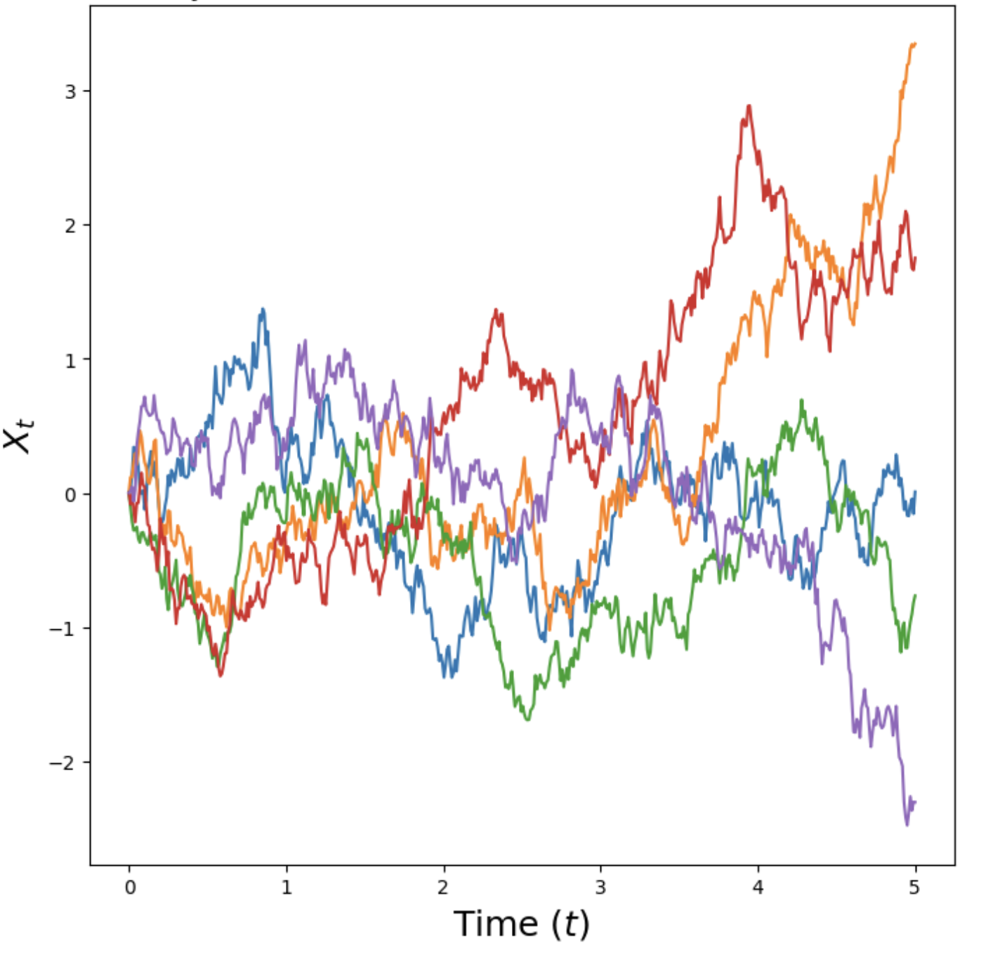

<figcaption>図2: 式(5) を使ってシミュレーションした次元 d=1 のブラウン運動 W_t のサンプル軌道。</figcaption>
</figure>

定義しよう：ブラウン運動 $W=(W_{t})_{0\leq t\leq 1}$ は、$W_{0}=0$ で、軌道 $t\mapsto W_{t}$ が連続で、次の 2 条件を満たす確率過程である：

1. **正規増分**：すべての $0\leq s<t$ について $W_{t}-W_{s}\sim\mathcal{N}(0,(t-s)I_{d})$。すなわち増分は時間に線形に増える分散を持つガウス分布に従う（$I_{d}$ は単位行列）。
2. **独立増分**：任意の $0\leq t_{0}<t_{1}<\dots<t_{n}=1$ について、増分 $W_{t_{1}}-W_{t_{0}},\dots,W_{t_{n}}-W_{t_{n-1}}$ は独立な確率変数である。

ブラウン運動は **Wiener 過程**とも呼ばれ、それゆえ「$W$」で表記する。ステップサイズ $h>0$ で、$W_{0}=0$ とし次で更新すれば、ブラウン運動を近似的に簡単にシミュレーションできる：

$$
W_{t+h}=W_{t}+\sqrt{h}\,\epsilon_{t},\quad\epsilon_{t}\sim\mathcal{N}(0,I_{d})\quad(t=0,h,2h,\dots,1-h)
$$

図2 にブラウン運動のいくつかの例軌道を描く。ブラウン運動は、ガウス分布が確率分布の研究にとってそうであるのと同じくらい、確率過程の研究にとって中心的である。金融から統計物理、疫学まで、ブラウン運動の研究は機械学習を超えて広範な応用を持つ。例えば金融では、ブラウン運動は複雑な金融商品の価格のモデル化に使われる。また数学的構成としても、ブラウン運動は魅力的である：例えば、ブラウン運動の経路は連続だが（ペンを一度も離さずに描ける）、無限に長い（描き終えることがない）。

<figure>

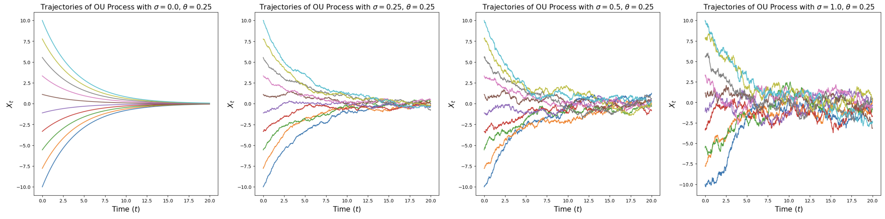

<figcaption>図3: 次元 d=1、θ=0.25、様々な σ（左から右へ増加）での Ornstein-Uhlenbeck 過程（式(8)）の図示。σ=0 では、t→∞ で原点に収束するフロー（滑らかで決定論的な軌道）を回復する。σ>0 では、t→∞ でガウス N(0, σ²/2θ) に収束するランダムな経路を持つ。</figcaption>
</figure>

##### ODE から SDE へ

SDE の考えは、ブラウン運動が駆動する確率的なダイナミクスを加えて、ODE の決定論的なダイナミクスを拡張することである。すべてが確率的なので、式(1a) のように微分を取ることはもはやできない。よって微分を使わない ODE の等価な定式化を見つける必要がある。このため ODE の軌道 $(X_{t})_{0\leq t\leq 1}$ を次のように書き直す：

$$
\frac{\mathrm{d}}{\mathrm{d}t}X_{t}=u_{t}(X_{t})\quad\blacktriangleright\ \text{微分による表現}
$$

$$
\overset{(i)}{\Leftrightarrow}\quad\frac{1}{h}\left(X_{t+h}-X_{t}\right)=u_{t}(X_{t})+R_{t}(h)\quad\Leftrightarrow\quad X_{t+h}=X_{t}+h\,u_{t}(X_{t})+h\,R_{t}(h)\quad\blacktriangleright\ \text{微小更新による表現}
$$

ここで $R_{t}(h)$ は小さな $h$ で無視できる関数（$\lim_{h\to 0}R_{t}(h)=0$）を表し、$(i)$ では単に微分の定義を使った。上の導出は既知のことを言い換えただけである：ODE の軌道 $(X_{t})_{0\leq t\leq 1}$ は、各時間ステップで方向 $u_{t}(X_{t})$ に小さな一歩を進む。ここで最後の式を確率的にするよう修正できる：SDE の軌道 $(X_{t})_{0\leq t\leq 1}$ は、各時間ステップで方向 $u_{t}(X_{t})$ への小さな一歩に加え、ブラウン運動からの寄与を進む：

$$
X_{t+h}=X_{t}+\underbrace{h\,u_{t}(X_{t})}_{\text{決定論的}}+\sigma_{t}\underbrace{(W_{t+h}-W_{t})}_{\text{確率的}}+\underbrace{h\,R_{t}(h)}_{\text{誤差項}}
$$

ここで $\sigma_{t}\geq 0$ は**拡散係数（diffusion coefficient）**を表し、$R_{t}(h)$ は標準偏差 $\mathbb{E}[\|R_{t}(h)\|^{2}]^{1/2}$ が $h\to 0$ で 0 へ向かう確率的な誤差項を表す。上記が確率微分方程式（SDE）を記述する。これを次の記号的記法で表すのが一般的である：

$$
\mathrm{d}X_{t}=u_{t}(X_{t})\mathrm{d}t+\sigma_{t}\mathrm{d}W_{t}\quad\blacktriangleright\ \text{SDE},\qquad X_{0}=x_{0}\quad\blacktriangleright\ \text{初期条件}
$$

ただし、上の「$\mathrm{d}X_{t}$」記法は式(6) の純粋に非形式的な記法である点を常に念頭に置く。残念ながら、SDE はもはやフロー写像 $\phi_{t}$ を持たない。これは進化自体が確率的なため、値 $X_{t}$ が $X_{0}\sim p_{\rm{init}}$ によってもはや完全には決まらないからである。それでも ODE と同様に、次が成り立つ：

###### 定理 5（SDE 解の存在と一意性）

$u:\mathbb{R}^{d}\times[0,1]\to\mathbb{R}^{d}$ が有界な導関数を持ち連続微分可能で、$\sigma_{t}$ が連続なら、式(7) の SDE は式(6) を満たす一意の確率過程 $(X_{t})_{0\leq t\leq 1}$ で与えられる解を持つ。

これが確率解析の講義なら、この定理の証明と SDE の完全な数学的厳密さでの構成（ブラウン運動を第一原理から構成し、確率積分で過程 $X_{t}$ を構成する）に数回の講義を費やすだろう。本講義は機械学習に焦点を当てるので、より技術的な扱いは [18] を参照されたい。最後に、すべての ODE は SDE でもある点に注意する——単に拡散係数 $\sigma_{t}=0$ の場合である。したがって本講義の残りで SDE を語るとき、ODE をその特別な場合とみなす。

###### 例 6（Ornstein-Uhlenbeck 過程）

定数の拡散係数 $\sigma_{t}=\sigma\geq 0$ と定数の線形ドリフト $u_{t}(x)=-\theta x$（$\theta>0$）を考え、次の SDE を得る：

$$
\mathrm{d}X_{t}=-\theta X_{t}\mathrm{d}t+\sigma\,dW_{t}.
$$

上記 SDE の解 $(X_{t})_{0\leq t\leq 1}$ は **Ornstein-Uhlenbeck（OU）過程**として知られる。図3 に可視化する。ベクトル場 $-\theta x$ は過程を中心 $0$ へ押し戻し（常に自分のいる方向の逆へ行く）、拡散係数 $\sigma$ は常にノイズを加える。この過程は $t\to\infty$ でシミュレーションするとガウス分布 $\mathcal{N}(0,\sigma^{2})$ へ収束する。$\sigma=0$ では、式(3) で調べた線形ベクトル場のフローになる点に注意する。

##### SDE のシミュレーション

ここまでの SDE の抽象的な定義に苦労していても心配無用である。SDE のより直感的な考え方は、「SDE をどうシミュレーションするか？」という問いへの答えで与えられる。最も単純なそうしたスキームが **Euler-Maruyama 法**として知られ、本質的に ODE に対する Euler 法に当たる。Euler-Maruyama 法では $X_{0}=x_{0}$ で初期化し、次で反復的に更新する：

$$
X_{t+h}=X_{t}+h\,u_{t}(X_{t})+\sqrt{h}\,\sigma_{t}\,\epsilon_{t},\quad\epsilon_{t}\sim\mathcal{N}(0,I_{d})
$$

ここで $h=n^{-1}>0$ は $n\in\mathbb{N}$ のステップサイズのハイパーパラメータである。言い換えれば、Euler-Maruyama 法でシミュレーションするには、$u_{t}(X_{t})$ の方向に小さな一歩を進めつつ、$\sqrt{h}\sigma_{t}$ でスケールしたガウスノイズを少し加える。本講義（付随のラボなど）で SDE をシミュレーションするときは、通常 Euler-Maruyama 法を使う。

**アルゴリズム 2**：拡散モデルからのサンプリング（Euler-Maruyama 法）

```
入力: ニューラルネットワーク u_t^θ、ステップ数 n、拡散係数 σ_t
t = 0 とする
ステップサイズ h = 1/n とする
サンプル X_0 ∼ p_init を引く
for i = 1, …, n-1 do
    サンプル ε ∼ N(0, I_d) を引く
    X_{t+h} = X_t + h · u_t^θ(X_t) + σ_t · √h · ε
    t ← t + h
end for
return X_1
```

##### 拡散モデル

ODE で行ったのと同じように、SDE を介して生成モデルを構成できる。目標は単純な分布 $p_{\rm{init}}$ を複雑な分布 $p_{\rm{data}}$ へ変換することだったことを思い出そう。ODE と同様、$X_{0}\sim p_{\rm{init}}$ でランダム初期化した SDE のシミュレーションはこの変換の自然な選択である。この SDE をパラメータ化するには、その中心的要素であるベクトル場 $u_{t}$ をニューラルネットワーク $u_{t}^{\theta}$ でパラメータ化すればよい。よって**拡散モデル**は次で与えられる：

$$
\mathrm{d}X_{t}=u_{t}^{\theta}(X_{t})\mathrm{d}t+\sigma_{t}\mathrm{d}W_{t}\quad\blacktriangleright\ \text{SDE},\qquad X_{0}\sim p_{\rm{init}}\quad\blacktriangleright\ \text{ランダム初期化}
$$

アルゴリズム 2 に、Euler-Maruyama 法で拡散モデルからサンプルする手順を述べる。本節の結果を次のようにまとめる。

###### まとめ 7（SDE 生成モデル）

本文書を通じて、拡散モデルはベクトル場をパラメータ化するパラメータ $\theta$ を持つニューラルネットワーク $u_{t}^{\theta}$ と、固定された拡散係数 $\sigma_{t}$ からなる：

$$
u^{\theta}:\mathbb{R}^{d}\times[0,1]\to\mathbb{R}^{d},\ (x,t)\mapsto u_{t}^{\theta}(x)\ \text{（パラメータ $\theta$）},\qquad \sigma_{t}:[0,1]\to[0,\infty),\ t\mapsto\sigma_{t}
$$

SDE モデルからサンプルを得る（対象を生成する）手順は次の通り：

$$
\textbf{初期化:}\ X_{0}\sim p_{\rm{init}}\quad\blacktriangleright\ \text{単純な分布（例: ガウス）で初期化}
$$

$$
\textbf{シミュレーション:}\ \mathrm{d}X_{t}=u_{t}^{\theta}(X_{t})\mathrm{d}t+\sigma_{t}\mathrm{d}W_{t}\quad\blacktriangleright\ \text{SDE を 0 から 1 までシミュレーション}
$$

$$
\textbf{目標:}\ X_{1}\sim p_{\rm{data}}\quad\blacktriangleright\ \text{$X_{1}$ が分布 $p_{\rm{data}}$ を持つようにする}
$$

$\sigma_{t}=0$ の拡散モデルは flow モデルである。

## 3 学習ターゲットの構成

前節では、ODE/SDE をシミュレーションして軌道 $(X_{t})_{0\leq t\leq 1}$ を得る flow モデル・拡散モデルを構成した：

$$
X_{0}\sim p_{\rm{init}},\quad\mathrm{d}X_{t}=u_{t}^{\theta}(X_{t})\mathrm{d}t\qquad(\text{flow}),\qquad X_{0}\sim p_{\rm{init}},\quad\mathrm{d}X_{t}=u_{t}^{\theta}(X_{t})\mathrm{d}t+\sigma_{t}\mathrm{d}W_{t}\qquad(\text{diffusion})
$$

ここで $u_{t}^{\theta}$ はニューラルネットワーク、$\sigma_{t}$ は固定された拡散係数である。当然、ニューラルネットワーク $u_{t}^{\theta}$ のパラメータ $\theta$ をランダム初期化しただけでは、ODE/SDE のシミュレーションは無意味なものを生む。機械学習では常にそうであるように、ニューラルネットワークを学習する必要がある。これは損失関数 $\mathcal{L}(\theta)$、例えば平均二乗誤差を最小化することで達成する：

$$
\mathcal{L}(\theta)=\lVert u_{t}^{\theta}(x)-\underbrace{u^{\text{target}}_{t}(x)}_{\text{学習ターゲット}}\rVert^{2},
$$

ここで $u^{\text{target}}_{t}(x)$ は近似したい**学習ターゲット**である。学習アルゴリズムを導くため 2 段階で進める：本章の目標は学習ターゲット $u^{\text{target}}_{t}$ の式を見つけること。次章では学習ターゲット $u^{\text{target}}_{t}$ を近似する学習アルゴリズムを述べる。当然、ニューラルネットワーク $u_{t}^{\theta}$ と同様、学習ターゲット自体もベクトル場 $u^{\text{target}}_{t}:\mathbb{R}^{d}\times[0,1]\to\mathbb{R}^{d}$ であるべきである。さらに $u^{\text{target}}_{t}$ は、$u_{t}^{\theta}$ にしてほしいこと——ノイズをデータへ変換する——を行うべきである。よって本章の目標は、対応する ODE/SDE が $p_{\rm{init}}$ を $p_{\rm{data}}$ へ変換するような学習ターゲット $u^{\text{target}}_{t}$ の公式を導くことである。その過程で、物理と確率解析の 2 つの基本的な結果——**連続の方程式（continuity equation）**と **Fokker-Planck 方程式**——に出会う。前と同様、まず ODE について鍵となる考えを述べ、それから SDE へ一般化する。

###### 注意 8

flow・拡散モデルの学習ターゲットを導くアプローチは複数ある。ここで提示するアプローチは最も一般的かつおそらく最も単純で、最近の最先端モデルに沿う。ただし、これまで見たかもしれない他の、より古い拡散モデルの提示とはかなり異なるかもしれない。後で別の定式化を論じる。

<figure>

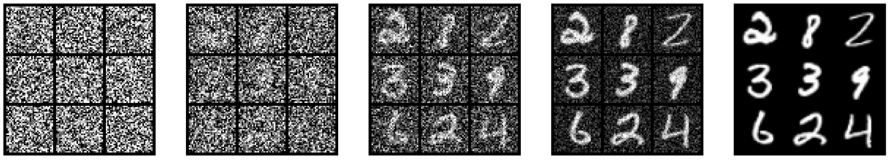

<figcaption>図4: 画像の集合について、ガウス条件付き確率パスを介したノイズからデータへの段階的補間。</figcaption>
</figure>

### 3.1 条件付き確率パスと周辺確率パス

学習ターゲット $u^{\text{target}}_{t}$ を構成する第一歩は**確率パス（probability path）**を指定することである。直感的に、確率パスはノイズ $p_{\rm{init}}$ とデータ $p_{\rm{data}}$ の間の段階的な補間を指定する（図4 参照）。本節でその構成を説明する。以下、データ点 $z\in\mathbb{R}^{d}$ について、$\delta_{z}$ で Dirac のデルタ「分布」を表す。これは考えうる最も単純な分布で、$\delta_{z}$ からのサンプリングは常に $z$ を返す（すなわち決定論的）。**条件付き（補間）確率パス**は、$\mathbb{R}^{d}$ 上の分布の集合 $p_{t}(x|z)$ であって次を満たすものである：

$$
p_{0}(\cdot|z)=p_{\rm{init}},\quad p_{1}(\cdot|z)=\delta_{z}\quad\text{すべての }z\in\mathbb{R}^{d}\text{ について}.
$$

言い換えれば、条件付き確率パスは単一のデータ点を分布 $p_{\rm{init}}$ へ段階的に変換する（図4 参照）。確率パスは分布の空間における軌道と考えてよい。すべての条件付き確率パス $p_{t}(x|z)$ は、データ分布からデータ点 $z\sim p_{\rm{data}}$ をサンプルしてから $p_{t}(\cdot|z)$ からサンプルすることで得られる分布として定義される**周辺確率パス（marginal probability path）** $p_{t}(x)$ を誘導する：

$$
z\sim p_{\rm{data}},\quad x\sim p_{t}(\cdot|z)\ \Rightarrow\ x\sim p_{t}\quad\blacktriangleright\ \text{周辺パスからのサンプリング}
$$

$$
p_{t}(x)=\int p_{t}(x|z)p_{\rm{data}}(z)\mathrm{d}z\quad\blacktriangleright\ \text{周辺パスの密度}
$$

$p_{t}$ からのサンプル方法は分かるが、積分が扱えないため密度値 $p_{t}(x)$ は分からない点に注意する。式(12) の $p_{t}(\cdot|z)$ への条件ゆえ、周辺確率パス $p_{t}$ が $p_{\rm{init}}$ と $p_{\rm{data}}$ の間を補間することを自分で確かめよ：

$$
p_{0}=p_{\rm{init}}\quad\text{かつ}\quad p_{1}=p_{\rm{data}}.\quad\blacktriangleright\ \text{ノイズ-データ補間}
$$

<figure>

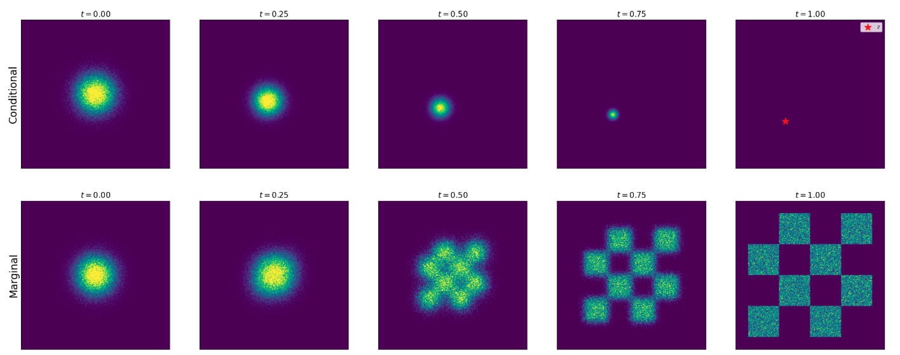

<figcaption>図5: 条件付き（上）と周辺（下）確率パスの図示。ここでは α_t=t, β_t=1-t のガウス確率パスを描く。条件付き確率パスは、ガウス p_init=N(0,I_d) と単一データ点のデータ δ_z を補間する。周辺確率パスは、ガウスとデータ分布 p_data を補間する（ここで p_data は次元 d=2 のチェス盤模様で表されるトイ分布）。</figcaption>
</figure>

###### 例 9（ガウス条件付き確率パス）

特に人気のある確率パスの 1 つが**ガウス確率パス**である。これは denoising diffusion models で使われる確率パスである。$\alpha_{t},\beta_{t}$ を**ノイズスケジューラ**——$\alpha_{0}=\beta_{1}=0$ かつ $\alpha_{1}=\beta_{0}=1$ を満たす 2 つの連続微分可能な単調関数——とする。すると条件付き確率パスを次で定義する：

$$
p_{t}(\cdot|z)=\mathcal{N}(\alpha_{t}z,\beta_{t}^{2}I_{d})\quad\blacktriangleright\ \text{ガウス条件付きパス}
$$

これは $\alpha_{t},\beta_{t}$ に課した条件により次を満たす：

$$
p_{0}(\cdot|z)=\mathcal{N}(\alpha_{0}z,\beta_{0}^{2}I_{d})=\mathcal{N}(0,I_{d}),\quad\text{かつ}\quad p_{1}(\cdot|z)=\mathcal{N}(\alpha_{1}z,\beta_{1}^{2}I_{d})=\delta_{z},
$$

ここで分散ゼロ・平均 $z$ の正規分布が $\delta_{z}$ である事実を使った。よってこの $p_{t}(x|z)$ の選択は $p_{\rm{init}}=\mathcal{N}(0,I_{d})$ について式(12) を満たし、有効な条件付き補間パスである。ガウス条件付き確率パスは目標に特に適した有用な性質をいくつも持つので、本節の残りでは条件付き確率パスの典型例として使う。図4 にその画像への適用を図示する。周辺パス $p_{t}$ からのサンプリングは次のように表せる：

$$
z\sim p_{\rm{data}},\ \epsilon\sim p_{\rm{init}}=\mathcal{N}(0,I_{d})\ \Rightarrow\ x=\alpha_{t}z+\beta_{t}\epsilon\sim p_{t}\quad\blacktriangleright\ \text{周辺ガウスパスからのサンプリング}
$$

直感的に、上記の手続きは $t$ が小さいほど多くのノイズを加え、時刻 $t=0$ ではノイズのみになる。図5 に、ガウスノイズと単純なデータ分布の間のそうした補間パスの例を描く。

### 3.2 条件付きベクトル場と周辺ベクトル場

ここで、定義したばかりの確率パス $p_{t}$ の概念を使って、flow モデルの学習ターゲット $u^{\text{target}}_{t}$ を構成する。考えは、手で解析的に導ける単純な構成要素から $u^{\text{target}}_{t}$ を構成することである。

###### 定理 10（周辺化トリック）

すべてのデータ点 $z\in\mathbb{R}^{d}$ について、対応する ODE が条件付き確率パス $p_{t}(\cdot|z)$ を生むように定義された**条件付きベクトル場** $u^{\text{target}}_{t}(\cdot|z)$ を考える。すなわち、

$$
X_{0}\sim p_{\rm{init}},\quad\frac{\mathrm{d}}{\mathrm{d}t}X_{t}=u^{\text{target}}_{t}(X_{t}|z)\ \Rightarrow\ X_{t}\sim p_{t}(\cdot|z)\quad(0\leq t\leq 1).
$$

すると、次で定義される**周辺ベクトル場** $u^{\text{target}}_{t}(x)$

$$
u^{\text{target}}_{t}(x)=\int u^{\text{target}}_{t}(x|z)\frac{p_{t}(x|z)p_{\rm{data}}(z)}{p_{t}(x)}\mathrm{d}z,
$$

は周辺確率パスに従う。すなわち

$$
X_{0}\sim p_{\rm{init}},\quad\frac{\mathrm{d}}{\mathrm{d}t}X_{t}=u^{\text{target}}_{t}(X_{t})\ \Rightarrow\ X_{t}\sim p_{t}\quad(0\leq t\leq 1).
$$

特に、この ODE では $X_{1}\sim p_{\rm{data}}$ となるので、「$u^{\text{target}}_{t}$ はノイズ $p_{\rm{init}}$ をデータ $p_{\rm{data}}$ へ変換する」と言える。

図6 に図示する。周辺化トリックを証明する前に、なぜ有用かを説明しよう：定理 10 の周辺化トリックは、条件付きベクトル場から周辺ベクトル場を構成することを可能にする。これは学習ターゲットの公式を見つける問題を大きく単純化する。なぜなら、式(18) を満たす条件付きベクトル場 $u^{\text{target}}_{t}(\cdot|z)$ はしばしば手で解析的に（つまり自分で代数計算するだけで）見つけられるからである。ガウス確率パスの実行例について条件付きベクトル場 $u_{t}(x|z)$ を導くことで、これを例示しよう。

<figure>

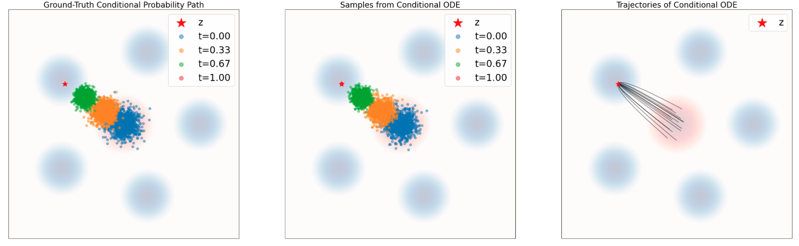

<figcaption>図6: 定理 10 の図示。ODE で確率パスをシミュレーションする。データ分布 p_data は青背景、ガウス初期 p_init は赤背景。上段: 条件付き確率パス。左: 条件付きパス p_t(·|z) からの真のサンプル。中: 時間にわたる ODE サンプル。右: 式(21) の u_target(x|z) で ODE をシミュレーションした軌道。下段: 周辺確率パスのシミュレーション。左: p_t からの真のサンプル。中: 時間にわたる ODE サンプル。右: 周辺ベクトル場 u_flow(x) で ODE をシミュレーションした軌道。見ての通り、条件付きベクトル場は条件付き確率パスに、周辺ベクトル場は周辺確率パスに従う。</figcaption>
</figure>

###### 例 11（ガウス確率パスのターゲット ODE）

前と同様、ノイズスケジューラ $\alpha_{t},\beta_{t}$（式(16)）について $p_{t}(\cdot|z)=\mathcal{N}(\alpha_{t}z,\beta_{t}^{2}I_{d})$ とする。$\dot{\alpha}_{t}=\partial_{t}\alpha_{t}$、$\dot{\beta}_{t}=\partial_{t}\beta_{t}$ をそれぞれ $\alpha_{t},\beta_{t}$ の時間微分とする。ここで、次で与えられる条件付きガウスベクトル場

$$
u^{\text{target}}_{t}(x|z)=\left(\dot{\alpha}_{t}-\frac{\dot{\beta}_{t}}{\beta_{t}}\alpha_{t}\right)z+\frac{\dot{\beta}_{t}}{\beta_{t}}x
$$

が定理 10 の意味で有効な条件付きベクトル場モデルであることを示したい：その ODE 軌道 $X_{t}$ は、$X_{0}\sim\mathcal{N}(0,I_{d})$ なら $X_{t}\sim p_{t}(\cdot|z)=\mathcal{N}(\alpha_{t}z,\beta_{t}^{2}I_{d})$ を満たす。図6 で、条件付き確率パスからのサンプル（真）とこのフローのシミュレーション ODE 軌道からのサンプルを比較し、視覚的に確認する。見ての通り分布は一致する。これを証明しよう。

###### 証明

まず条件付きフローモデル $\psi^{\text{target}}_{t}(x|z)$ を次で定義して構成する：

$$
\psi^{\text{target}}_{t}(x|z)=\alpha_{t}z+\beta_{t}x.
$$

$X_{t}$ が $X_{0}\sim p_{\rm{init}}=\mathcal{N}(0,I_{d})$ を持つ $\psi^{\text{target}}_{t}(\cdot|z)$ の ODE 軌道なら、定義により

$$
X_{t}=\psi^{\text{target}}_{t}(X_{0}|z)=\alpha_{t}z+\beta_{t}X_{0}\sim\mathcal{N}(\alpha_{t}z,\beta^{2}I_{d})=p_{t}(\cdot|z).
$$

軌道が条件付き確率パスのように分布する（式(18) が満たされる）と結論できる。残りは $\psi^{\text{target}}_{t}(x|z)$ からベクトル場 $u^{\text{target}}_{t}(x|z)$ を取り出すことである。フローの定義（式(2b)）により次が成り立つ：

$$
\frac{\mathrm{d}}{\mathrm{d}t}\psi^{\text{target}}_{t}(x|z)=u^{\text{target}}_{t}(\psi^{\text{target}}_{t}(x|z)|z)\ \overset{(i)}{\Leftrightarrow}\ \dot{\alpha}_{t}z+\dot{\beta}_{t}x=u^{\text{target}}_{t}(\alpha_{t}z+\beta_{t}x|z)
$$

$$
\overset{(ii)}{\Leftrightarrow}\ \dot{\alpha}_{t}z+\dot{\beta}_{t}\left(\frac{x-\alpha_{t}z}{\beta_{t}}\right)=u^{\text{target}}_{t}(x|z)\ \overset{(iii)}{\Leftrightarrow}\ \left(\dot{\alpha}_{t}-\frac{\dot{\beta}_{t}}{\beta_{t}}\alpha_{t}\right)z+\frac{\dot{\beta}_{t}}{\beta_{t}}x=u^{\text{target}}_{t}(x|z)
$$

すべての $x,z\in\mathbb{R}^{d}$ について成り立つ。$(i)$ では $\psi^{\text{target}}_{t}(x|z)$ の定義（式(22)）、$(ii)$ では $x\rightarrow(x-\alpha_{t}z)/\beta_{t}$ の再パラメータ化、$(iii)$ では代数計算を使った。最後の式は式(21) で定義した条件付きガウスベクトル場である。これで主張が証明された。∎

本節の残りでは、数学と物理の基本的な結果である**連続の方程式**を介して定理 10 を証明する。これを説明するため、発散作用素 $\mathrm{div}$ を次で定義する：

$$
\mathrm{div}(v_{t})(x)=\sum_{i=1}^{d}\frac{\partial}{\partial x_{i}}v_{t}(x)
$$

###### 定理 12（連続の方程式）

ベクトル場 $u^{\text{target}}_{t}$ を持ち $X_{0}\sim p_{\rm{init}}$ である flow モデルを考える。すると、すべての $0\leq t\leq 1$ で $X_{t}\sim p_{t}$ となるのは、次が成り立つとき、かつそのときに限る：

$$
\partial_{t}p_{t}(x)=-\mathrm{div}(p_{t}u^{\text{target}}_{t})(x)\quad\text{すべての }x\in\mathbb{R}^{d},0\leq t\leq 1\text{ について},
$$

ここで $\partial_{t}p_{t}(x)=\frac{\mathrm{d}}{\mathrm{d}t}p_{t}(x)$ は $p_{t}(x)$ の時間微分を表す。式(24) は**連続の方程式**として知られる。

数学的傾向のある読者のため、Appendix B に連続の方程式の自己完結的な証明を示す。先へ進む前に、連続の方程式を直感的に理解しよう。左辺 $\partial_{t}p_{t}(x)$ は $x$ における確率 $p_{t}(x)$ が時間とともにどれだけ変わるかを表す。直感的に、その変化は確率質量の正味の流入に対応すべきである。flow モデルでは、粒子 $X_{t}$ はベクトル場 $u^{\text{target}}_{t}$ に沿って進む。物理で思い出すように、発散はベクトル場からの一種の正味の流出を測る。したがって負の発散は正味の流入を測る。これを現在 $x$ にある全確率質量でスケールすると、$-\mathrm{div}(p_{t}u_{t})$ が確率質量の全流入を測ることになる。確率質量は保存されるので、方程式の左辺と右辺は同じはずである！ ここで定理 10 の周辺化トリックの証明へ進む。

###### 証明

定理 12 により、式(19) で定義された周辺ベクトル場 $u^{\text{target}}_{t}$ が連続の方程式を満たすことを示せばよい。直接計算でこれを行える：

$$
\partial_{t}p_{t}(x)\overset{(i)}{=}\partial_{t}\int p_{t}(x|z)p_{\rm{data}}(z)\mathrm{d}z=\int\partial_{t}p_{t}(x|z)p_{\rm{data}}(z)\mathrm{d}z
$$

$$
\overset{(ii)}{=}\int-\mathrm{div}(p_{t}(\cdot|z)u^{\text{target}}_{t}(\cdot|z))(x)p_{\rm{data}}(z)\mathrm{d}z\overset{(iii)}{=}-\mathrm{div}\left(\int p_{t}(x|z)u^{\text{target}}_{t}(x|z)p_{\rm{data}}(z)\mathrm{d}z\right)
$$

$$
\overset{(iv)}{=}-\mathrm{div}\left(p_{t}(x)\int u^{\text{target}}_{t}(x|z)\frac{p_{t}(x|z)p_{\rm{data}}(z)}{p_{t}(x)}\mathrm{d}z\right)(x)\overset{(v)}{=}-\mathrm{div}\left(p_{t}u^{\text{target}}_{t}\right)(x),
$$

$(i)$ では式(13) の $p_{t}(x)$ の定義、$(ii)$ では条件付き確率パス $p_{t}(\cdot|z)$ の連続の方程式、$(iii)$ では式(23) で積分と発散作用素を交換、$(iv)$ では $p_{t}(x)$ で掛けて割る、$(v)$ では式(19) を使った。上記の等式の連鎖の最初と最後は、$u^{\text{target}}_{t}$ について連続の方程式が満たされることを示す。定理 12 により、これは式(20) を含意するのに十分で、証明完了。∎

<figure>

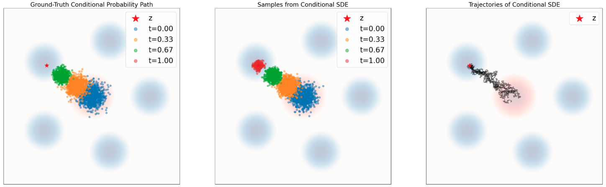

<figcaption>図7: 定理 13 の図示。SDE で確率パスをシミュレーションする。式(25) を使った SDE サンプリングで図6 のプロットを繰り返す。データ分布 p_data は青背景、ガウス初期 p_init は赤背景。上段: 条件付きパス。下段: 周辺確率パス。見ての通り、SDE は p_init からのサンプルを（条件付きパスでは）δ_z へ、（周辺パスでは）p_data へ輸送する。</figcaption>
</figure>

### 3.3 条件付きスコア関数と周辺スコア関数

flow モデルの学習ターゲットの構成に成功した。この推論を SDE へ拡張する。そのため、$p_{t}$ の**周辺スコア関数（marginal score function）**を $\nabla\log p_{t}(x)$ と定義する。次の結果が示すように、これを使って前節の ODE を SDE へ拡張できる。

###### 定理 13（SDE 拡張トリック）

条件付き・周辺ベクトル場 $u^{\text{target}}_{t}(x|z)$、$u^{\text{target}}_{t}(x)$ を前と同様に定義する。すると拡散係数 $\sigma_{t}\geq 0$ について、同じ確率パスに従う SDE を構成できる：

$$
X_{0}\sim p_{\rm{init}},\quad\mathrm{d}X_{t}=\left[u^{\text{target}}_{t}(X_{t})+\frac{\sigma_{t}^{2}}{2}\nabla\log p_{t}(X_{t})\right]\mathrm{d}t+\sigma_{t}\mathrm{d}W_{t}\ \Rightarrow\ X_{t}\sim p_{t}\quad(0\leq t\leq 1)
$$

特に、この SDE では $X_{1}\sim p_{\rm{data}}$ となる。周辺確率 $p_{t}(x)$ とベクトル場 $u^{\text{target}}_{t}(x)$ を条件付き確率パス $p_{t}(x|z)$ とベクトル場 $u^{\text{target}}_{t}(x|z)$ に置き換えても、同じ恒等式が成り立つ。

定理を図7 に図示する。定理 13 の公式が有用なのは、前と同様、周辺スコア関数を条件付きスコア関数 $\nabla\log p_{t}(x|z)$ で表せるからである：

$$
\nabla\log p_{t}(x)=\frac{\nabla p_{t}(x)}{p_{t}(x)}=\frac{\nabla\int p_{t}(x|z)p_{\rm{data}}(z)\mathrm{d}z}{p_{t}(x)}=\frac{\int\nabla p_{t}(x|z)p_{\rm{data}}(z)\mathrm{d}z}{p_{t}(x)}=\int\nabla\log p_{t}(x|z)\frac{p_{t}(x|z)p_{\rm{data}}(z)}{p_{t}(x)}\mathrm{d}z
$$

そして条件付きスコア関数 $\nabla\log p_{t}(x|z)$ は、次の例が示すように通常解析的に分かる。

###### 例 14（ガウス確率パスのスコア関数）

ガウスパス $p_{t}(x|z)=\mathcal{N}(x;\alpha_{t}z,\beta_{t}^{2}I_{d})$ について、ガウス確率密度の形（式(81)）を使って次を得る：

$$
\nabla\log p_{t}(x|z)=\nabla\log\mathcal{N}(x;\alpha_{t}z,\beta_{t}^{2}I_{d})=-\frac{x-\alpha_{t}z}{\beta_{t}^{2}}.
$$

スコアが $x$ の線形関数である点に注意する。これはガウス分布固有の特徴である。

本節の残りでは、ODE の連続の方程式を SDE へ拡張する **Fokker-Planck 方程式**を介して定理 13 を証明する。そのため、まずラプラシアン作用素 $\Delta$ を次で定義する：

$$
\Delta w_{t}(x)=\sum_{i=1}^{d}\frac{\partial^{2}}{\partial x_{i}^{2}}w_{t}(x)=\mathrm{div}(\nabla w_{t})(x).
$$

###### 定理 15（Fokker-Planck 方程式）

$p_{t}$ を確率パスとし、SDE

$$
X_{0}\sim p_{\rm{init}},\quad\mathrm{d}X_{t}=u_{t}(X_{t})\mathrm{d}t+\sigma_{t}\mathrm{d}W_{t}
$$

を考える。すると、すべての $0\leq t\leq 1$ で $X_{t}$ が分布 $p_{t}$ を持つのは、Fokker-Planck 方程式が成り立つとき、かつそのときに限る：

$$
\partial_{t}p_{t}(x)=-\mathrm{div}(p_{t}u_{t})(x)+\frac{\sigma_{t}^{2}}{2}\Delta p_{t}(x)\quad\text{すべての }x\in\mathbb{R}^{d},0\leq t\leq 1\text{ について}.
$$

Fokker-Planck 方程式の自己完結的な証明は Appendix B にある。$\sigma_{t}=0$ のとき Fokker-Planck 方程式から連続の方程式が回復される点に注意する。追加のラプラシアン項 $\Delta p_{t}$ は最初は理屈づけにくいかもしれない。物理に詳しい読者は、同じ項が熱方程式（実は Fokker-Planck 方程式の特別な場合）にも現れることに気づくだろう。熱は媒質を通じて拡散する。私たちも（物理的でなく数学的な）拡散過程を加えるので、この追加のラプラシアン項を加える。ここで Fokker-Planck 方程式を使って定理 13 を証明しよう。

###### 証明

定理 15 により、式(25) で定義された SDE が $p_{t}$ について Fokker-Planck 方程式を満たすことを示せばよい。直接計算でこれを行える：

$$
\partial_{t}p_{t}(x)\overset{(i)}{=}-\mathrm{div}(p_{t}u^{\text{target}}_{t})(x)\overset{(ii)}{=}-\mathrm{div}(p_{t}u^{\text{target}}_{t})(x)-\frac{\sigma_{t}^{2}}{2}\Delta p_{t}(x)+\frac{\sigma_{t}^{2}}{2}\Delta p_{t}(x)
$$

$$
\overset{(iii)}{=}-\mathrm{div}(p_{t}u^{\text{target}}_{t})(x)-\mathrm{div}\left(\frac{\sigma_{t}^{2}}{2}\nabla p_{t}\right)(x)+\frac{\sigma_{t}^{2}}{2}\Delta p_{t}(x)
$$

$$
\overset{(iv)}{=}-\mathrm{div}(p_{t}u^{\text{target}}_{t})(x)-\mathrm{div}\left(p_{t}\left[\frac{\sigma_{t}^{2}}{2}\nabla\log p_{t}\right]\right)(x)+\frac{\sigma_{t}^{2}}{2}\Delta p_{t}(x)
$$

$$
\overset{(v)}{=}-\mathrm{div}\left(p_{t}\left[u^{\text{target}}_{t}+\frac{\sigma_{t}^{2}}{2}\nabla\log p_{t}\right]\right)(x)+\frac{\sigma_{t}^{2}}{2}\Delta p_{t}(x),
$$

$(i)$ では連続の方程式、$(ii)$ では同じ項を足し引き、$(iii)$ ではラプラシアンの定義（式(29)）、$(iv)$ では $\nabla\log p_{t}=\frac{\nabla p_{t}}{p_{t}}$、$(v)$ では発散作用素の線形性を使った。上記の導出は、式(25) で定義された SDE が $p_{t}$ について Fokker-Planck 方程式を満たすことを示す。定理 15 により、これは望み通り $0\leq t\leq 1$ で $X_{t}\sim p_{t}$ を含意する。∎

<figure>

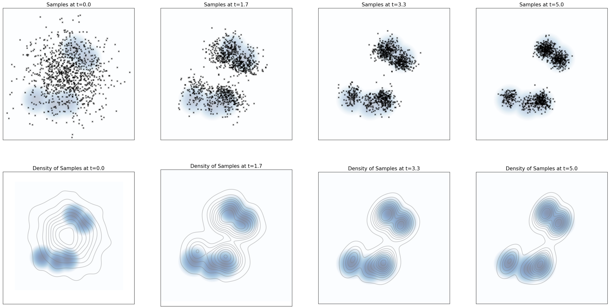

<figcaption>図8: 上段: p(x) を 5 つのモードを持つガウス混合とした、式(31) の Langevin 動力学の下で発展する粒子。下段: 上段と同じサンプルのカーネル密度推定。見ての通り、サンプルの分布は平衡分布（青背景色）へ収束する。</figcaption>
</figure>

###### 注意 16（Langevin 動力学）

上記の構成には、確率パスが静的、すなわち固定された分布 $p$ について $p_{t}=p$ の場合という有名な特別な場合がある。この場合 $u^{\text{target}}_{t}=0$ とし、SDE

$$
\mathrm{d}X_{t}=\frac{\sigma_{t}^{2}}{2}\nabla\log p(X_{t})\mathrm{d}t+\sigma_{t}dW_{t},
$$

を得る。これは一般に **Langevin 動力学**として知られる。$p_{t}$ が静的という事実は $\partial_{t}p_{t}(x)=0$ を含意する。定理 13 から直ちに、これらの動力学が定理 13 の静的パス $p_{t}=p$ について Fokker-Planck 方程式を満たすことが従う。したがって $p$ は Langevin 動力学の定常分布であると結論でき、

$$
X_{0}\sim p\quad\Rightarrow\quad X_{t}\sim p\quad(t\geq 0)
$$

多くのマルコフ連鎖と同様、これらの動力学はかなり一般的な条件下で定常分布 $p$ へ収束する（図8 参照）。すなわち、代わりに $X_{0}\sim p^{\prime}\neq p$（よって $X_{t}\sim p_{t}^{\prime}$）とすると、緩い条件下で $p_{t}\to p$ となる。この事実は Langevin 動力学を極めて有用にし、それに応じて例えば分子動力学シミュレーションや、ベイズ統計・自然科学にわたる他の多くのマルコフ連鎖モンテカルロ（MCMC）法の基礎となる。

本節の結果をまとめよう。

###### まとめ 17（学習ターゲットの導出）

flow の学習ターゲットは周辺ベクトル場 $u^{\text{target}}_{t}$ である。これを構成するには、$p_{0}(\cdot|z)=p_{\rm{init}}$、$p_{1}(\cdot|z)=\delta_{z}$ を満たす条件付き確率パス $p_{t}(x|z)$ を選ぶ。次に、対応するフロー $\psi^{\text{target}}_{t}(x|z)$ が

$$
X_{0}\sim p_{\rm{init}}\quad\Rightarrow\quad X_{t}=\psi^{\text{target}}_{t}(X_{0}|z)\sim p_{t}(\cdot|z),
$$

を満たす条件付きベクトル場 $u^{\text{flow}}_{t}(x|z)$ を見つける（または同値に、$u^{\text{target}}_{t}$ が連続の方程式を満たす）。すると次で定義される周辺ベクトル場

$$
u^{\text{target}}_{t}(x)=\int u^{\text{target}}_{t}(x|z)\frac{p_{t}(x|z)p_{\rm{data}}(z)}{p_{t}(x)}\mathrm{d}z,
$$

は周辺確率パスに従う。すなわち

$$
X_{0}\sim p_{\rm{init}},\quad\mathrm{d}X_{t}=u^{\text{target}}_{t}(X_{t})\mathrm{d}t\ \Rightarrow\ X_{t}\sim p_{t}\quad(0\leq t\leq 1).
$$

特に、この ODE では $X_{1}\sim p_{\rm{data}}$ となり、$u^{\text{target}}_{t}$ は望み通り「ノイズをデータへ変換する」。

**SDE への拡張**　時間依存の拡散係数 $\sigma_{t}\geq 0$ について、上記 ODE を同じ周辺確率パスを持つ SDE へ拡張できる：

$$
X_{0}\sim p_{\rm{init}},\quad\mathrm{d}X_{t}=\left[u^{\text{target}}_{t}(X_{t})+\frac{\sigma_{t}^{2}}{2}\nabla\log p_{t}(X_{t})\right]\mathrm{d}t+\sigma_{t}\mathrm{d}W_{t}\ \Rightarrow\ X_{t}\sim p_{t}\quad(0\leq t\leq 1),
$$

ここで $\nabla\log p_{t}(x)$ は周辺スコア関数

$$
\nabla\log p_{t}(x)=\int\nabla\log p_{t}(x|z)\frac{p_{t}(x|z)p_{\rm{data}}(z)}{p_{t}(x)}\mathrm{d}z.
$$

である。特に、上記 SDE の軌道 $X_{t}$ について $X_{1}\sim p_{\rm{data}}$ が成り立ち、SDE は望み通り「ノイズをデータへ変換する」。重要な例はガウス確率パスで、次の公式を生む：

$$
p_{t}(x|z)=\mathcal{N}(x;\alpha_{t}z,\beta_{t}^{2}I_{d}),\quad u^{\text{flow}}_{t}(x|z)=\left(\dot{\alpha}_{t}-\frac{\dot{\beta}_{t}}{\beta_{t}}\alpha_{t}\right)z+\frac{\dot{\beta}_{t}}{\beta_{t}}x,\quad\nabla\log p_{t}(x|z)=-\frac{x-\alpha_{t}z}{\beta_{t}^{2}},
$$

ノイズスケジューラ $\alpha_{t},\beta_{t}\in\mathbb{R}$ は $\alpha_{0}=\beta_{1}=0$、$\alpha_{1}=\beta_{0}=1$ を満たす連続微分可能な単調関数である。

## 4 生成モデルの学習

前の 2 節では、ニューラルネットワークで与えられるベクトル場 $u_{t}^{\theta}$ を持つ生成モデルの構成方法を示し、学習ターゲット $u^{\text{target}}_{t}$ の公式を導いた。本節では、学習ターゲット $u^{\text{target}}_{t}$ を近似するようニューラルネットワーク $u_{t}^{\theta}$ を学習する方法を述べる。まず再び ODE に限定し、**flow matching** を回復する。次に、**score matching** を介して SDE へアプローチを拡張する方法を説明する。最後にガウス確率パスの特別な場合を考え、**denoising diffusion models** を回復する。これらの道具により、ついに ODE/SDE を持つ生成モデルを学習・サンプルするエンドツーエンドの手順を得る。

### 4.1 Flow Matching

前と同様、次で与えられる flow モデルを考える：

$$
X_{0}\sim p_{\rm{init}},\quad\mathrm{d}X_{t}=u_{t}^{\theta}(X_{t})\,\mathrm{d}t.\quad\blacktriangleright\ \text{flow モデル}
$$

学んだように、ニューラルネットワーク $u_{t}^{\theta}$ が周辺ベクトル場 $u^{\text{target}}_{t}$ に等しくなってほしい。言い換えれば $u_{t}^{\theta}\approx u^{\text{target}}_{t}$ となるパラメータ $\theta$ を見つけたい。以下、$\text{Unif}=\text{Unif}_{[0,1]}$ で区間 $[0,1]$ 上の一様分布、$\mathbb{E}$ で確率変数の期待値を表す。$u_{t}^{\theta}\approx u^{\text{target}}_{t}$ を得る直感的な方法は平均二乗誤差を使うこと、すなわち次で定義される **flow matching 損失**を使うことである：

$$
\mathcal{L}_{\text{FM}}(\theta)=\mathbb{E}_{t\sim\text{Unif},x\sim p_{t}}[\|u_{t}^{\theta}(x)-u^{\text{target}}_{t}(x)\|^{2}]\overset{(i)}{=}\mathbb{E}_{t\sim\text{Unif},z\sim p_{\rm{data}},x\sim p_{t}(\cdot|z)}[\|u_{t}^{\theta}(x)-u^{\text{target}}_{t}(x)\|^{2}],
$$

ここで $p_{t}(x)=\int p_{t}(x|z)p_{\rm{data}}(z)\mathrm{d}z$ は周辺確率パスで、$(i)$ では式(13) のサンプリング手続きを使った。直感的に、この損失は次を言う：まずランダムな時刻 $t\in[0,1]$ を引く。次にデータセットからランダムな点 $z$ を引き、$p_{t}(\cdot|z)$ からサンプルし（例: ノイズを加える）、$u_{t}^{\theta}(x)$ を計算する。最後にニューラルネットワークの出力と周辺ベクトル場 $u^{\text{target}}_{t}(x)$ の間の平均二乗誤差を計算する。残念ながらこれで終わりではない。定理 10 により $u^{\text{target}}_{t}$ の公式

$$
u^{\text{target}}_{t}(x)=\int u^{\text{target}}_{t}(x|z)\frac{p_{t}(x|z)p_{\rm{data}}(z)}{p_{t}(x)}\mathrm{d}z,
$$

は分かるが、上の積分が扱えないため効率的に計算できない。代わりに、条件付き速度場 $u^{\text{target}}_{t}(x|z)$ が扱えるという事実を活用する。そのため、**conditional flow matching 損失（条件付き flow matching 損失）**を定義する：

$$
\mathcal{L}_{\text{CFM}}(\theta)=\mathbb{E}_{t\sim\text{Unif},z\sim p_{\rm{data}},x\sim p_{t}(\cdot|z)}[\|u_{t}^{\theta}(x)-u^{\text{target}}_{t}(x|z)\|^{2}].
$$

式(41) との違いに注意：周辺ベクトル $u^{\text{target}}_{t}(x)$ の代わりに条件付きベクトル場 $u^{\text{target}}_{t}(x|z)$ を使う。$u^{\text{target}}_{t}(x|z)$ の解析的公式があるので、上記の損失は容易に最小化できる。だが待って、関心があるのは周辺ベクトル場なのに、条件付きベクトル場に回帰して何の意味があるのか？ 実は、扱える条件付きベクトル場に明示的に回帰することで、暗黙的に扱えない周辺ベクトル場に回帰している。次の結果がこの直感を厳密にする。

###### 定理 18

周辺 flow matching 損失は定数を除いて条件付き flow matching 損失に等しい。すなわち、

$$
\mathcal{L}_{\text{FM}}(\theta)=\mathcal{L}_{\text{CFM}}(\theta)+C,
$$

$C$ は $\theta$ に依存しない。したがって、それらの勾配は一致する：

$$
\nabla_{\theta}\mathcal{L}_{\text{FM}}(\theta)=\nabla_{\theta}\mathcal{L}_{\text{CFM}}(\theta).
$$

ゆえに、例えば確率的勾配降下法（SGD）で $\mathcal{L}_{\text{CFM}}(\theta)$ を最小化することは、同じやり方で $\mathcal{L}_{\text{FM}}(\theta)$ を最小化することと等価である。特に $\mathcal{L}_{\text{CFM}}(\theta)$ の最小化点 $\theta^{*}$ について、$u_{t}^{\theta^{*}}=u^{\text{target}}_{t}$ が成り立つ（無限に表現力のあるパラメータ化を仮定）。

###### 証明

証明は平均二乗誤差を 3 成分に展開して定数を除くことで進む：

$$
\mathcal{L}_{\text{FM}}(\theta)=\mathbb{E}_{t\sim\text{Unif},x\sim p_{t}}[\|u_{t}^{\theta}(x)-u^{\text{target}}_{t}(x)\|^{2}]=\mathbb{E}_{t,x\sim p_{t}}[\|u_{t}^{\theta}(x)\|^{2}-2u_{t}^{\theta}(x)^{T}u^{\text{target}}_{t}(x)+\|u^{\text{target}}_{t}(x)\|^{2}]
$$

第 2 項を $\|a-b\|^{2}=\|a\|^{2}-2a^{T}b+\|b\|^{2}$ で展開し、第 3 項を定数 $C_{1}:=\mathbb{E}[\|u^{\text{target}}_{t}(x)\|^{2}]$ とおく。ここで重要なステップは、周辺ベクトル場で表した第 2 項を条件付きベクトル場に書き換えることである：

$$
\mathbb{E}_{t,x\sim p_{t}}[u_{t}^{\theta}(x)^{T}u^{\text{target}}_{t}(x)]=\int_{0}^{1}\!\!\int p_{t}(x)u_{t}^{\theta}(x)^{T}\!\left[\int u^{\text{target}}_{t}(x|z)\frac{p_{t}(x|z)p_{\rm{data}}(z)}{p_{t}(x)}\mathrm{d}z\right]\!\mathrm{d}x\,\mathrm{d}t=\mathbb{E}_{t,z\sim p_{\rm{data}},x\sim p_{t}(\cdot|z)}[u_{t}^{\theta}(x)^{T}u^{\text{target}}_{t}(x|z)]
$$

これを $\mathcal{L}_{\text{FM}}$ に代入し、$\|u^{\text{target}}_{t}(x|z)\|^{2}$ を足し引きして平方完成すると

$$
\mathcal{L}_{\text{FM}}(\theta)=\mathbb{E}_{t,z\sim p_{\rm{data}},x\sim p_{t}(\cdot|z)}[\|u_{t}^{\theta}(x)-u^{\text{target}}_{t}(x|z)\|^{2}]+\underbrace{C_{2}+C_{1}}_{=:C}=\mathcal{L}_{\text{CFM}}(\theta)+C
$$

となり、$C_{2}=\mathbb{E}[-\|u^{\text{target}}_{t}(x|z)\|^{2}]$ は $\theta$ に依存しない定数である。証明完了。∎

$u_{t}^{\theta}$ を学習したら、（例えばアルゴリズム 1 で）flow モデル $\mathrm{d}X_{t}=u_{t}^{\theta}(X_{t})\,\mathrm{d}t,\ X_{0}\sim p_{\rm{init}}$ をシミュレーションしてサンプル $X_{1}\sim p_{\rm{data}}$ を得られる。このパイプライン全体が文献で **flow matching** と呼ばれる。学習手続きはアルゴリズム 3 にまとめ、図9 に可視化する。ここでガウス確率パスの選択について conditional flow matching 損失を具体化しよう：

###### 例 19（ガウス条件付き確率パスの Flow Matching）

ガウス確率パス $p_{t}(\cdot|z)=\mathcal{N}(\alpha_{t}z,\beta_{t}^{2}I_{d})$ の例に戻る。条件付きパスからは $\epsilon\sim\mathcal{N}(0,I_{d})\Rightarrow x_{t}=\alpha_{t}z+\beta_{t}\epsilon\sim p_{t}(\cdot|z)$ でサンプルできる。式(21) で導いたように、条件付きベクトル場は $u^{\text{target}}_{t}(x|z)=\left(\dot{\alpha}_{t}-\frac{\dot{\beta}_{t}}{\beta_{t}}\alpha_{t}\right)z+\frac{\dot{\beta}_{t}}{\beta_{t}}x$ である。これを代入すると、conditional flow matching 損失は

$$
\mathcal{L}_{\text{CFM}}(\theta)=\mathbb{E}_{t\sim\text{Unif},z\sim p_{\rm{data}},\epsilon\sim\mathcal{N}(0,I_{d})}[\|u_{t}^{\theta}(\alpha_{t}z+\beta_{t}\epsilon)-(\dot{\alpha}_{t}z+\dot{\beta}_{t}\epsilon)\|^{2}]
$$

となる（$x$ を $\alpha_{t}z+\beta_{t}\epsilon$ に置き換えた）。$\mathcal{L}_{\text{CFM}}$ の単純さに注意：データ点 $z$ を引き、ノイズ $\epsilon$ を引き、平均二乗誤差を取るだけである。$\alpha_{t}=t$、$\beta_{t}=1-t$ の特別な場合でさらに具体化しよう。対応する確率 $p_{t}(x|z)=\mathcal{N}(tz,(1-t)^{2})$ は（ガウス）**CondOT 確率パス**と呼ばれることがある。$\dot{\alpha}_{t}=1,\dot{\beta}_{t}=-1$ なので

$$
\mathcal{L}_{\text{CFM}}(\theta)=\mathbb{E}_{t\sim\text{Unif},z\sim p_{\rm{data}},\epsilon\sim\mathcal{N}(0,I_{d})}[\|u_{t}^{\theta}(tz+(1-t)\epsilon)-(z-\epsilon)\|^{2}]
$$

多くの有名な最先端モデルがこの単純だが効果的な手続きで学習されてきた（例: Stable Diffusion 3, Meta の Movie Gen Video、おそらく他の多くの非公開モデルも）。図9 に単純な例で可視化し、アルゴリズム 3 に学習手続きをまとめる。

**アルゴリズム 3**：Flow Matching 学習手続き（ここではガウス CondOT パス $p_{t}(x|z)=\mathcal{N}(tz,(1-t)^{2})$）

```
入力: サンプル z ∼ p_data のデータセット、ニューラルネットワーク u_t^θ
各ミニバッチについて:
    データ例 z をデータセットからサンプル
    ランダムな時刻 t ∼ Unif[0,1] をサンプル
    ノイズ ε ∼ N(0, I_d) をサンプル
    x = tz + (1-t)ε とする（一般の場合: x ∼ p_t(·|z)）
    損失 L(θ) = ‖u_t^θ(x) - (z - ε)‖²
        （一般の場合: = ‖u_t^θ(x) - u_target(x|z)‖²）
    L(θ) の勾配降下でモデルパラメータ θ を更新
```

<figure>

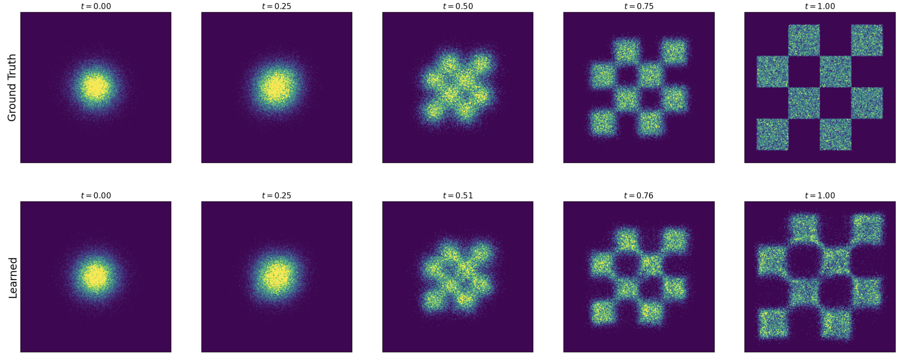

<figcaption>図9: ガウス CondOT 確率パスでの定理 18 の図示：学習済み flow matching モデルから ODE をシミュレーションする。データ分布はチェス盤模様（右上）。上段: 真の周辺確率パス p_t(x) のヒストグラム。下段: flow matching モデルからのサンプルのヒストグラム。見ての通り、学習後（学習誤差を除いて）上段と下段が一致する。モデルはアルゴリズム 3 で学習した。</figcaption>
</figure>

### 4.2 Score Matching

見つけたばかりのアルゴリズムを ODE から SDE へ拡張しよう。ターゲット ODE を、同じ周辺分布を持つ SDE

$$
X_{0}\sim p_{\rm{init}},\quad\mathrm{d}X_{t}=\left[u^{\text{target}}_{t}(X_{t})+\frac{\sigma_{t}^{2}}{2}\nabla\log p_{t}(X_{t})\right]\mathrm{d}t+\sigma_{t}\mathrm{d}W_{t}\ \Rightarrow\ X_{t}\sim p_{t}
$$

へ拡張できることを思い出そう。ここで $u^{\text{target}}_{t}$ は周辺ベクトル場、$\nabla\log p_{t}(x)=\int\nabla\log p_{t}(x|z)\frac{p_{t}(x|z)p_{\rm{data}}(z)}{p_{t}(x)}\mathrm{d}z$ は周辺スコア関数である。周辺スコア $\nabla\log p_{t}$ を近似するため、**スコアネットワーク** $s_{t}^{\theta}:\mathbb{R}^{d}\times[0,1]\to\mathbb{R}^{d}$ と呼ぶニューラルネットワークを使える。前と同じように、**score matching 損失**と **conditional score matching 損失**を設計できる：

$$
\mathcal{L}_{\text{SM}}(\theta)=\mathbb{E}_{t,z\sim p_{\rm{data}},x\sim p_{t}(\cdot|z)}[\|s_{t}^{\theta}(x)-\nabla\log p_{t}(x)\|^{2}]\quad\blacktriangleright\ \text{score matching 損失}
$$

$$
\mathcal{L}_{\text{CSM}}(\theta)=\mathbb{E}_{t,z\sim p_{\rm{data}},x\sim p_{t}(\cdot|z)}[\|s_{t}^{\theta}(x)-\nabla\log p_{t}(x|z)\|^{2}]\quad\blacktriangleright\ \text{conditional score matching 損失}
$$

ここでも違いは、周辺スコア $\nabla\log p_{t}(x)$ を使うか条件付きスコア $\nabla\log p_{t}(x|z)$ を使うかである。前と同様、理想的には score matching 損失を最小化したいが、$\nabla\log p_{t}(x)$ が分からないのでできない。だが前と同様、conditional score matching 損失が扱える代替になる。

###### 定理 20

score matching 損失は定数を除いて conditional score matching 損失に等しい：

$$
\mathcal{L}_{\text{SM}}(\theta)=\mathcal{L}_{\text{CSM}}(\theta)+C,
$$

$C$ はパラメータ $\theta$ に依存しない。したがって勾配は一致し、$\nabla_{\theta}\mathcal{L}_{\text{SM}}(\theta)=\nabla_{\theta}\mathcal{L}_{\text{CSM}}(\theta)$。特に最小化点 $\theta^{*}$ で $s_{t}^{\theta^{*}}=\nabla\log p_{t}$ が成り立つ。

###### 証明

$\nabla\log p_{t}$ の公式（式(51)）は $u^{\text{target}}_{t}$ の公式（式(43)）と同じ形に見える。よって証明は、$u^{\text{target}}_{t}$ を $\nabla\log p_{t}$ に置き換えた定理 18 の証明と同一である。∎

上記の手続きは拡散モデルを学習する素朴な手続きを記述する。学習後、任意の拡散係数 $\sigma_{t}\geq 0$ を選んで SDE

$$
X_{0}\sim p_{\rm{init}},\quad\mathrm{d}X_{t}=\left[u_{t}^{\theta}(X_{t})+\frac{\sigma_{t}^{2}}{2}s_{t}^{\theta}(X_{t})\right]\mathrm{d}t+\sigma_{t}\mathrm{d}W_{t}
$$

をシミュレーションしてサンプル $X_{1}\sim p_{\rm{data}}$ を生成できる。理論上、完全な学習ではどの $\sigma_{t}$ でもサンプル $X_{1}\sim p_{\rm{data}}$ を与えるはずである。実際には 2 種類の誤差に出会う：(1) SDE を不完全にシミュレーションする数値誤差、(2) 学習誤差（$u_{t}^{\theta}$ が $u^{\text{target}}_{t}$ に正確には等しくない）。したがって最適な未知のノイズレベル $\sigma_{t}$ があり、これは様々な値を経験的に試して決められる。一見、flow モデルでなく拡散モデルを使うなら $s_{t}^{\theta}$ と $u_{t}^{\theta}$ の両方を学習せねばならず不利に見えるかもしれない。しかし、しばしば 2 出力の単一ネットワークで $s_{t}^{\theta}$ と $u_{t}^{\theta}$ を直接表せるので、追加の計算労力は通常わずかである。さらに、次にガウス確率パスの特別な場合で見るように、$s_{t}^{\theta}$ と $u_{t}^{\theta}$ は互いに変換でき、別々に学習する必要はない。

###### 注意 21（Denoising Diffusion Models）

拡散モデルに馴染みがあれば、おそらく **denoising diffusion model（ノイズ除去拡散モデル）**という用語に出会ったことがあるだろう。このモデルは非常に人気になり、今や大半の人が「denoising」を落として単に「diffusion model」と呼ぶ。本文書の言葉では、これらは単にガウス確率パス $p_{t}(\cdot|z)=\mathcal{N}(\alpha_{t}z,\beta_{t}^{2}I_{d})$ を持つ拡散モデルである。ただし、最初期の拡散モデル論文を読むとこれが直ちに自明でないかもしれない点に注意する：それらは異なる時間規約（時間が反転）を使う——よって適切な時間の再スケーリングが必要——し、いわゆる順過程（forward process）で確率パスを構成する（§4.3 で論じる）。

###### 例 22（Denoising Diffusion Models: ガウス確率パスの Score Matching）

$p_{t}(x|z)=\mathcal{N}(\alpha_{t}z,\beta_{t}^{2}I_{d})$ の場合に denoising score matching 損失を具体化しよう。式(28) で導いたように条件付きスコアは $\nabla\log p_{t}(x|z)=-\frac{x-\alpha_{t}z}{\beta_{t}^{2}}$ である。これを代入すると conditional score matching 損失は

$$
\mathcal{L}_{\text{CSM}}(\theta)=\mathbb{E}_{t,z\sim p_{\rm{data}},\epsilon\sim\mathcal{N}(0,I_{d})}\left[\frac{1}{\beta_{t}^{2}}\|\beta_{t}s_{t}^{\theta}(\alpha_{t}z+\beta_{t}\epsilon)+\epsilon\|^{2}\right]
$$

となる（$x$ を $\alpha_{t}z+\beta_{t}\epsilon$ に置換）。ネットワーク $s_{t}^{\theta}$ は本質的に、データサンプル $z$ を劣化させるのに使ったノイズを予測することを学ぶ。したがって上記の学習損失は **denoising score matching** とも呼ばれ、拡散モデルを学習する最初の手続きの 1 つだった。上記の損失は $\beta_{t}\approx 0$ で数値的に不安定（denoising score matching は十分なノイズを加えるときのみ機能する）とすぐに認識された。最初期の denoising diffusion models（Denoising Diffusion Probabilistic Models [9]）では、損失中の定数 $\frac{1}{\beta_{t}^{2}}$ を落とし、$s_{t}^{\theta}$ を**ノイズ予測ネットワーク** $\epsilon_{t}^{\theta}$ へ再パラメータ化することが提案された：

$$
-\beta_{t}s_{t}^{\theta}(x)=\epsilon_{t}^{\theta}(x)\ \Rightarrow\ \mathcal{L}_{\text{DDPM}}(\theta)=\mathbb{E}_{t,z\sim p_{\rm{data}},\epsilon\sim\mathcal{N}(0,I_{d})}\left[\|\epsilon_{t}^{\theta}(\alpha_{t}z+\beta_{t}\epsilon)-\epsilon\|^{2}\right]
$$

前と同様、ネットワーク $\epsilon_{t}^{\theta}$ は本質的にデータサンプル $z$ を劣化させたノイズを予測することを学ぶ。アルゴリズム 4 に学習手続きをまとめる。

**アルゴリズム 4**：ガウス確率パスの Score Matching 学習手続き

```
入力: サンプル z ∼ p_data のデータセット、スコアネット s_t^θ またはノイズ予測器 ε_t^θ
各ミニバッチについて:
    データ例 z をサンプル
    ランダムな時刻 t ∼ Unif[0,1] をサンプル
    ノイズ ε ∼ N(0, I_d) をサンプル
    x_t = α_t z + β_t ε とする（一般の場合: x_t ∼ p_t(·|z)）
    損失 L(θ) = ‖s_t^θ(x_t) + ε/β_t‖²
        （一般の場合: = ‖s_t^θ(x_t) - ∇log p_t(x_t|z)‖²）
    あるいは: L(θ) = ‖ε_t^θ(x_t) - ε‖²
    L(θ) の勾配降下で θ を更新
```

単純さに加え、ガウス確率パスにはもう 1 つ有用な性質がある：$s_{t}^{\theta}$ または $\epsilon_{t}^{\theta}$ を学べば、自動的に $u_{t}^{\theta}$ も学べ、その逆も成り立つ。

###### 命題 1（ガウス確率パスの変換公式）

ガウス確率パス $p_{t}(x|z)=\mathcal{N}(\alpha_{t}z,\beta_{t}^{2}I_{d})$ について、条件付き（resp. 周辺）ベクトル場は条件付き（resp. 周辺）スコアに変換できる：

$$
u^{\text{target}}_{t}(x|z)=\left(\beta_{t}^{2}\frac{\dot{\alpha}_{t}}{\alpha_{t}}-\dot{\beta}_{t}\beta_{t}\right)\nabla\log p_{t}(x|z)+\frac{\dot{\alpha}_{t}}{\alpha_{t}}x,\qquad u^{\text{target}}_{t}(x)=\left(\beta_{t}^{2}\frac{\dot{\alpha}_{t}}{\alpha_{t}}-\dot{\beta}_{t}\beta_{t}\right)\nabla\log p_{t}(x)+\frac{\dot{\alpha}_{t}}{\alpha_{t}}x
$$

上記の周辺ベクトル場 $u^{\text{target}}_{t}$ の公式（より正確には対応する ODE）は文献で**確率フロー ODE（probability flow ODE）**と呼ばれる。

###### 証明

条件付きベクトル場と条件付きスコアについて、次のように導ける：

$$
u^{\text{target}}_{t}(x|z)=\left(\dot{\alpha}_{t}-\frac{\dot{\beta}_{t}}{\beta_{t}}\alpha_{t}\right)z+\frac{\dot{\beta}_{t}}{\beta_{t}}x\overset{(i)}{=}\left(\beta_{t}^{2}\frac{\dot{\alpha}_{t}}{\alpha_{t}}-\dot{\beta}_{t}\beta_{t}\right)\left(\frac{\alpha_{t}z-x}{\beta_{t}^{2}}\right)+\frac{\dot{\alpha}_{t}}{\alpha_{t}}x=\left(\beta_{t}^{2}\frac{\dot{\alpha}_{t}}{\alpha_{t}}-\dot{\beta}_{t}\beta_{t}\right)\nabla\log p_{t}(x|z)+\frac{\dot{\alpha}_{t}}{\alpha_{t}}x
$$

$(i)$ では代数計算をし、最後に条件付きスコア $\nabla\log p_{t}(x|z)=\frac{\alpha_{t}z-x}{\beta_{t}^{2}}$ を使った。両辺を周辺化（式(51) を使用）すれば、周辺ベクトル場と周辺スコアについても同じ恒等式が成り立つ。∎

<figure>

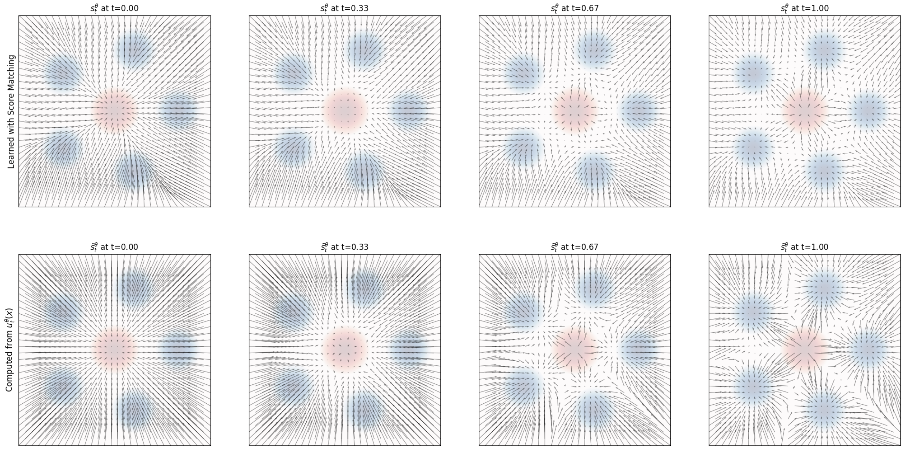

<figcaption>図10: 2 つの異なる方法で得たスコアの比較。上: score matching で独立に学習したスコア場 s_t^θ(x)（アルゴリズム 4）の可視化。下: 式(55) のように u_t^θ(x) を使ってパラメータ化したスコア場 s̃_t^θ(x) の可視化。</figcaption>
</figure>

変換公式を使って、スコアネットワーク $s_{t}^{\theta}$ とベクトル場ネットワーク $u_{t}^{\theta}$ を互いにパラメータ化できる：

$$
u_{t}^{\theta}=\left(\beta_{t}^{2}\frac{\dot{\alpha}_{t}}{\alpha_{t}}-\dot{\beta}_{t}\beta_{t}\right)s_{t}^{\theta}(x)+\frac{\dot{\alpha}_{t}}{\alpha_{t}}x,\qquad s_{t}^{\theta}(x)=\frac{\alpha_{t}u_{t}^{\theta}(x)-\dot{\alpha}_{t}x}{\beta_{t}^{2}\dot{\alpha}_{t}-\alpha_{t}\dot{\beta}_{t}\beta_{t}}
$$

（後者は $\beta_{t}^{2}\dot{\alpha}_{t}-\alpha_{t}\dot{\beta}_{t}\beta_{t}\neq 0$、これは $t\in[0,1)$ で常に真、のとき）。このパラメータ化を使うと、denoising score matching と conditional flow matching 損失は定数を除いて同じであることが示せる。ガウス確率パスでは周辺スコアと周辺ベクトル場の両方を別々に学習する必要はなく、一方の知識で他方を計算できると結論する。特に、学習に flow matching を使うか score matching を使うかを選べる。図10 に、score matching で近似したスコアと式(55) でパラメータ化したスコアを視覚的に比較する。スコアネットワーク $s_{t}^{\theta}$ を学習したなら、式(52) により任意の $\sigma_{t}\geq 0$ を使って SDE

$$
X_{0}\sim p_{\rm{init}},\quad\mathrm{d}X_{t}=\left[\left(\beta_{t}^{2}\frac{\dot{\alpha}_{t}}{\alpha_{t}}-\dot{\beta}_{t}\beta_{t}+\frac{\sigma_{t}^{2}}{2}\right)s_{t}^{\theta}(x)+\frac{\dot{\alpha}_{t}}{\alpha_{t}}x\right]\mathrm{d}t+\sigma_{t}\mathrm{d}W_{t}
$$

をサンプルしてサンプル $X_{1}\sim p_{\rm{data}}$（学習・シミュレーション誤差を除く）を得られる。これは denoising diffusion model からの確率的サンプリングに対応する。

### 4.3 拡散モデル文献ガイド

文献には拡散モデルと flow matching を巡るモデルの一群がある。これらの論文を読むと、本講義の素材を異なる（だが等価な）方法で提示しているのに気づくだろう。これは論文を読むのを少し混乱させる。このため、様々な枠組みとその違いの簡単な概観を与え、歴史的文脈にも置く。これは本文書の残りを理解するのに必要ではなく、文献を読む際の支援を意図する。

##### 離散時間 vs 連続時間

最初の denoising diffusion model 論文 [28, 29, 9] は SDE を使わず、離散時間（時間ステップ $t=0,1,2,3,\dots$）でマルコフ連鎖を構成した。今日まで、この離散時間定式化で動く多くの研究が文献にある。この構成は単純さゆえ魅力的だが、離散時間アプローチの欠点は学習前に時間離散化を選ばねばならないことである。さらに損失関数は **evidence lower bound（ELBO, 証拠下界）**で近似する必要があり、名の通り実際に最小化したい損失の下界にすぎない。後に [32] は、これらの構成が本質的に連続時間 SDE の近似であることを示した。さらに ELBO 損失は連続時間の場合にタイト（もはや下界でない）になる（定理 18・定理 20 が下界でなく等式である点に注意——離散時間では異なる）。これが SDE 構成を人気にした。数学的に「よりクリーン」とされ、学習後に ODE/SDE サンプラーでシミュレーション誤差を制御できるからである。ただし、両モデルは同じ損失を使い、本質的には違わない点が重要である。

##### 「順過程」vs 確率パス

denoising diffusion models の第一波 [28, 29, 9, 32] は確率パスという用語を使わず、いわゆる**順過程（forward process）**でデータ点 $z\in\mathbb{R}^{d}$ のノイズ化手続きを構成した。これは次の形の SDE である：

$$
\bar{X}_{0}=z,\quad\mathrm{d}\bar{X}_{t}=u^{\text{forw}}_{t}(\bar{X}_{t})\mathrm{d}t+\sigma^{\text{forw}}_{t}\mathrm{d}\bar{W}_{t}
$$

考えは、データ点 $z\sim p_{\rm{data}}$ を引いた後に順過程をシミュレーションしてデータを劣化（「ノイズ化」）することである。順過程は $t\to\infty$ でその分布がガウス $\mathcal{N}(0,I_{d})$ へ収束するよう設計される。これは本質的に確率パスに対応する：$\bar{X}_{0}=z$ が与えられたときの $\bar{X}_{t}$ の条件付き分布が条件付き確率パス $\bar{p}_{t}(\cdot|z)$、$z\sim p_{\rm{data}}$ で周辺化した $\bar{X}_{t}$ の分布が周辺確率パス $\bar{p}_{t}$ に対応する。ただしこの構成では、SDE のシミュレーションを避けてモデルを学習するため、$X_{t}|X_{0}=z$ の分布を閉形式で知る必要がある。これは本質的に $u^{\text{forw}}_{t}$ を、$\bar{X}_{t}|\bar{X}_{0}=z$ の分布を閉形式で知れるものに制限する。したがって拡散モデル文献を通じて、順過程のベクトル場は常にアフィン形 $u^{\text{forw}}_{t}(x)=a_{t}x$ である。この選択では条件付き分布の既知公式が使える：

$$
\bar{X}_{t}|\bar{X}_{0}=z\sim\mathcal{N}\left(\alpha_{t}z,\beta_{t}^{2}I\right),\quad\alpha_{t}=\exp\left(\int_{0}^{t}a_{r}\mathrm{d}r\right),\quad\beta_{t}^{2}=\alpha_{t}^{2}\int_{0}^{t}\frac{(\sigma^{\text{forw}}_{r})^{2}}{\alpha^{2}_{r}}dr
$$

これらは単にガウス確率パスである。よって、順過程は（ガウス）確率パスを構成する特定の方法と言える。確率パスという用語は flow matching [14] により、構成を単純化しつつ同時により一般的にするために導入された：第 1 に、拡散モデルの「順過程」は実際にはシミュレーションされない（学習中は $\bar{p}_{t}(\cdot|z)$ からのサンプルが引かれるだけ）。第 2 に、順過程は $t\to\infty$ でしか収束しない（有限時間で $p_{\rm{init}}$ に到達しない）。よって本文書では確率パスを使う。

##### 時間反転 vs Fokker-Planck 方程式の求解

拡散モデルの元々の記述は、学習ターゲット $u^{\text{target}}_{t}$ や $\nabla\log p_{t}$ を Fokker-Planck（または連続の）方程式でなく、順過程の**時間反転（time-reversal）**で構成した。時間反転 $(X_{t})_{0\leq t\leq T}$ は、軌道の分布が同じで時間が反転された SDE である。[2] で示されたように、次の SDE で上記条件を満たす時間反転を得られる：

$$
\mathrm{d}X_{t}=\left[-u_{t}(X_{t})+\sigma_{t}^{2}\nabla\log p_{t}(X_{t})\right]\mathrm{d}t+\sigma_{t}\mathrm{d}W_{t},\quad u_{t}(x)=u^{\text{forw}}_{T-t}(x),\ \sigma_{t}=\bar{\sigma}_{T-t}
$$

$u_{t}(X_{t})=a_{t}X_{t}$ なので、上記は命題 1 で導いた学習ターゲットの特定の例に対応する（異なる時間規約のため直ちには自明でない）。ただし生成モデリングの目的では、しばしばマルコフ過程の終点 $X_{1}$ のみ（生成画像など）を使い、それ以前の時点を捨てる。よってマルコフ過程が「真の」時間反転か確率パスに従うかは、多くの応用で重要でない。したがって時間反転を使う必要はなく、しばしば最適でない結果になる（例: 確率フロー ODE の方がよいことが多い [12, 17]）。時間反転と異なる拡散モデルのサンプリング法はすべて、再び Fokker-Planck 方程式に依拠する。これが、今日多くの人が学習ターゲットを Fokker-Planck 方程式で直接構成する（[14, 16, 1] が先駆け、本講義もそう）理由を示すことを願う。

##### Flow Matching と Stochastic Interpolants

提示する枠組みは flow matching と stochastic interpolants（SI）の枠組みに最も近い。学んだように、flow matching は flow に限定する。実際、flow matching の鍵となる革新の 1 つは、順過程と SDE を介した構成は不要で、flow モデル単独でスケーラブルに学習できることを示したことだった。この制限ゆえ、flow matching モデルからのサンプリングは決定論的（初期 $X_{0}\sim p_{\rm{init}}$ のみがランダム）である点に留意する。stochastic interpolants は純粋な flow と、ここで使う「Langevin 動力学」を介した SDE 拡張（定理 13 参照）の両方を含む。stochastic interpolants は 2 分布を補間する補間関数 $I(t,x,z)$ から名を取る。ここで使う用語では、これは条件付き・周辺確率パスを構成する異なるが（主に）等価な方法に対応する。flow matching と stochastic interpolants の拡散モデルに対する利点は、単純さと一般性の両方である：学習枠組みは非常に単純だが、同時に任意の分布 $p_{\rm{init}}$ から任意の分布 $p_{\rm{data}}$ へ行ける——一方 denoising diffusion models はガウス初期分布とガウス確率パスでしか機能しない。これが生成モデリングの新しい可能性を開く。

本節の結果をまとめよう。

###### まとめ 23（生成モデルの学習）

flow matching は、conditional flow matching 損失 $\mathcal{L}_{\text{CFM}}(\theta)=\mathbb{E}_{z\sim p_{\rm{data}},t\sim\text{Unif},x\sim p_{t}(\cdot|z)}[\|u_{t}^{\theta}(x)-u^{\text{target}}_{t}(x|z)\|^{2}]$ を最小化してニューラルネットワーク $u_{t}^{\theta}$ を学習することからなる。$u^{\text{target}}_{t}(x|z)$ は条件付きベクトル場である（アルゴリズム 3）。学習後、対応する ODE をシミュレーション（アルゴリズム 1）してサンプルを生成する。これを拡散モデルへ拡張するには、スコアネットワーク $s_{t}^{\theta}$ を conditional score matching $\mathcal{L}_{\text{CSM}}(\theta)=\mathbb{E}[\|s_{t}^{\theta}(x)-\nabla\log p_{t}(x|z)\|^{2}]$（denoising score matching 損失）で学習する。すべての拡散係数 $\sigma_{t}\geq 0$ について、SDE $\mathrm{d}X_{t}=[u_{t}^{\theta}(X_{t})+\frac{\sigma_{t}^{2}}{2}s_{t}^{\theta}(X_{t})]\mathrm{d}t+\sigma_{t}\mathrm{d}W_{t}$ をシミュレーション（アルゴリズム 2）すると $p_{\rm{data}}$ の近似サンプルを生成する。最適な $\sigma_{t}\geq 0$ は経験的に見つけられる。

**ガウス確率パス**　ガウス確率パス $p_{t}(x|z)=\mathcal{N}(x;\alpha_{t}z,\beta_{t}^{2}I_{d})$ の特別な場合、conditional score matching は denoising score matching とも呼ばれる。この損失と conditional flow matching 損失は次で与えられる：

$$
\mathcal{L}_{\text{CFM}}(\theta)=\mathbb{E}_{t,z,\epsilon}[\|u_{t}^{\theta}(\alpha_{t}z+\beta_{t}\epsilon)-(\dot{\alpha}_{t}z+\dot{\beta}_{t}\epsilon)\|^{2}],\quad\mathcal{L}_{\text{CSM}}(\theta)=\mathbb{E}_{t,z,\epsilon}[\|s_{t}^{\theta}(\alpha_{t}z+\beta_{t}\epsilon)+\tfrac{\epsilon}{\beta_{t}}\|^{2}]
$$

この場合、$s_{t}^{\theta}$ と $u_{t}^{\theta}$ を別々に学習する必要はなく、学習後に $u_{t}^{\theta}(x)=\left(\beta_{t}^{2}\frac{\dot{\alpha}_{t}}{\alpha_{t}}-\dot{\beta}_{t}\beta_{t}\right)s_{t}^{\theta}(x)+\frac{\dot{\alpha}_{t}}{\alpha_{t}}x$ で変換できる。学習後、式(62) の SDE をアルゴリズム 2 でシミュレーションしてサンプル $X_{1}$ を得る。

**Denoising diffusion models**　denoising diffusion models はガウス確率パスを持つ拡散モデルである。このため $u_{t}^{\theta}$ か $s_{t}^{\theta}$ のいずれかを学べば十分（互いに変換可能）。flow matching は ODE による決定論的シミュレーションのみを許すが、これらは決定論的（確率フロー ODE）または確率的（SDE サンプリング）なシミュレーションを許す。ただし、任意の $p_{\rm{init}}$ を任意の確率パス $p_{t}$ で任意の $p_{\rm{data}}$ へ変換できる flow matching・stochastic interpolants と違い、denoising diffusion models はガウス初期分布 $p_{\rm{init}}=\mathcal{N}(0,I_{d})$ とガウス確率パスでしか機能しない。

##### 文献

文献で人気の拡散モデルの代替定式化：

1. **離散時間**：離散時間マルコフ連鎖による SDE の近似がしばしば使われる。
2. **反転時間規約**：$t=0$ が $p_{\rm{data}}$ に対応する反転時間規約（ここでは $t=0$ が $p_{\rm{init}}$）が人気。
3. **順過程**：順過程（ノイズ化過程）は（ガウス）確率パスを構成する方法。
4. **時間反転による学習ターゲット**：学習ターゲットを SDE の時間反転で構成することもできる。これはここで提示した構成の特定の例（反転時間規約）である。

## 5 画像生成器の構築

前の節では、分布 $p_{\rm{data}}(x)$ からサンプルするよう flow matching・拡散モデルを学習する方法を学んだ。このレシピは一般的で、様々なデータ型・応用に適用できる。本節では、この枠組みを Stable Diffusion 3 や Meta Movie Gen Video のような画像・動画生成器の構築に適用する方法を学ぶ。そうしたモデルの構築に欠けている主要素は 2 つある：第 1 に**条件付き生成（guidance）**——特定のテキストプロンプトに合う画像をどう生成するか、既存の目的をどう適応させるか。**classifier-free guidance**（条件付き生成の品質を高める人気の技法）も学ぶ。第 2 に、画像・動画向けに設計された一般的なニューラルネットワークアーキテクチャを論じる。最後に、最先端の画像・動画モデル（Stable Diffusion 3, Meta MovieGen）を詳しく見る。

### 5.1 Guidance（ガイダンス）

これまで考えた生成モデルは無条件だった。しかしタスクは任意の対象の生成でなく、追加情報を条件にした対象の生成である。例えばテキストプロンプト $y$ を取り込み、$y$ を条件に画像 $x$ を生成する画像モデルを想像できる。固定プロンプト $y$ について、$y$ を条件としたデータ分布 $p_{\rm{data}}(x|y)$ からサンプルしたい。形式的に、$y$ は空間 $\mathcal{Y}$ に住むと考える。$y$ がテキストプロンプトなら $\mathcal{Y}$ は $\mathbb{R}^{d_{y}}$ のような連続空間、離散クラスラベルなら離散空間である。

$z\sim p_{\rm{data}}$ を条件とすること（条件付き確率パス/ベクトル場）を指す「conditional（条件付き）」との用語衝突を避けるため、$y$ を条件とすることを特に **guided（ガイドされた）**と呼ぶ。

###### 注意 24（Guided vs. Conditional 用語）

本ノートでは、$y$ を条件とする行為に conditional の代わりに guided を使う。例えば**ガイドされたベクトル場** $u^{\text{target}}_{t}(x|y)$ と**条件付きベクトル場** $u^{\text{target}}_{t}(x|z)$ を区別する。

###### 鍵となる考え 5（ガイドされた生成モデル）

ガイドされた拡散モデルは、ニューラルネットワークでパラメータ化されたガイドされたベクトル場 $u_{t}^{\theta}(\cdot|y)$ と時間依存の拡散係数 $\sigma_{t}$ からなる。任意の $y\in\mathcal{Y}$ について、初期化 $X_{0}\sim p_{\rm{init}}$、シミュレーション $\mathrm{d}X_{t}=u_{t}^{\theta}(X_{t}|y)\mathrm{d}t+\sigma_{t}\mathrm{d}W_{t}$、目標 $X_{1}\sim p_{\rm{data}}(\cdot|y)$ でサンプルを生成する。$\sigma_{t}=0$ のとき、ガイドされた flow モデルと呼ぶ。

#### 5.1.1 Flow モデルの Guidance

$y$ を固定し、データ分布を $p_{\text{data}}(x|y)$ とすると、ガイドなしの生成問題を回復し、conditional flow matching 目的で生成モデルを構成できる。$y$ のすべての選択と時刻 $t\in\text{Unif}[0,1)$ にわたって期待値を取ると、**guided conditional flow matching 目的**

$$
\mathcal{L}_{\text{CFM}}^{\text{guided}}(\theta)=\mathbb{E}_{(z,y)\sim p_{\text{data}}(z,y),\,t\sim\text{Unif}[0,1),\,x\sim p_{t}(\cdot|z)}\lVert u_{t}^{\theta}(x|y)-u^{\text{target}}_{t}(x|z)\rVert^{2}
$$

を得る。ガイドなし目的（式(44)）との主な違いは、$z\sim p_{\rm{data}}$ だけでなく $(z,y)\sim p_{\rm{data}}$ をサンプルすること。データ分布は今や画像 $z$ とプロンプト $y$ の同時分布だからである。ラベル $y$ は条件付き確率パス $p_{t}(\cdot|z)$ や条件付きベクトル場 $u^{\text{target}}_{t}(x|z)$ に影響しない点に注意する。

##### Classifier-Free Guidance（分類器なしガイダンス）

上記の条件付き学習手続きは理論上は妥当だが、この手続きの画像サンプルが望むラベル $y$ に十分合わないとすぐに経験的に認識された。ガイダンス変数 $y$ の効果を人為的に強めると知覚品質が上がることが発見された。この洞察は **classifier-free guidance（CFG）**として知られる技法に蒸留され、最先端の拡散モデルで広く使われる。単純化のためガウス確率パスに焦点を当てる。命題 1 を使ってガイドされたベクトル場を、ガイドされたスコア関数 $\nabla\log p_{t}(x|y)$ で書き換えられる：$u^{\text{target}}_{t}(x|y)=a_{t}x+b_{t}\nabla\log p_{t}(x|y)$、ただし $(a_{t},b_{t})=\left(\frac{\dot{\alpha}_{t}}{\alpha_{t}},\frac{\dot{\alpha}_{t}\beta_{t}^{2}-\dot{\beta}_{t}\beta_{t}\alpha_{t}}{\alpha_{t}}\right)$。Bayes の規則により、ガイドされたスコアを書き換えられる：

$$
\nabla\log p_{t}(x|y)=\nabla\log\left(\frac{p_{t}(x)p_{t}(y|x)}{p_{t}(y)}\right)=\nabla\log p_{t}(x)+\nabla\log p_{t}(y|x),
$$

ここで勾配 $\nabla$ は $x$ について取るので $\nabla\log p_{t}(y)=0$ である。よって $u^{\text{target}}_{t}(x|y)=u^{\text{target}}_{t}(x)+b_{t}\nabla\log p_{t}(x|y)$ と書ける。ガイドされたベクトル場は、ガイドなしベクトル場**プラス**ガイドされたスコアの和の形をしている。画像 $x$ がプロンプト $y$ に十分合わないと観察されたので、$\nabla\log p_{t}(y|x)$ 項の寄与をスケールアップするのが自然な発想で、

$$
\tilde{u}_{t}(x|y)=u^{\text{target}}_{t}(x)+wb_{t}\nabla\log p_{t}(y|x),
$$

を得る。$w>1$ は**ガイダンススケール**として知られる。これはヒューリスティックである点に注意：$w\neq 1$ では $\tilde{u}_{t}(x|y)\neq u^{\text{target}}_{t}(x|y)$、つまり真のガイドされたベクトル場でない。しかし経験的に（$w>1$ で）好ましい結果を生む。

###### 注意 25（分類器はどこ？）

項 $\log p_{t}(y|x)$ はノイズ化データの一種の分類器（$x$ が与えられたときの $y$ の尤度を与える）と考えられる。実際、拡散の初期の研究は実際の分類器を学習して上記手続きでガイドに使った。これが **classifier guidance** につながる。classifier-free guidance に大きく取って代わられたので、ここでは扱わない。

恒等式 $\nabla\log p_{t}(x|y)=\nabla\log p_{t}(x)+\nabla\log p_{t}(y|x)$ を再び適用すると、

$$
\tilde{u}_{t}(x|y)=(1-w)u^{\text{target}}_{t}(x)+wu^{\text{target}}_{t}(x|y).
$$

すなわち、スケールされたガイドベクトル場 $\tilde{u}_{t}(x|y)$ を、ガイドなしベクトル場 $u^{\text{target}}_{t}(x)$ とガイドされたベクトル場 $u^{\text{target}}_{t}(x|y)$ の線形結合として表せる。発想は、ガイドなし $u^{\text{target}}_{t}(x)$ とガイドあり $u^{\text{target}}_{t}(x|y)$ の両方を学習し、推論時に結合して $\tilde{u}_{t}(x|y)$ を得ることである。「でも待って、2 つのモデルを学習する必要が？」——実は 1 つのモデルで両方を学習できる：ラベル集合に条件付けの不在を表す新しい $\varnothing$ ラベルを追加し、$u^{\text{target}}_{t}(x)=u^{\text{target}}_{t}(x|\varnothing)$ と扱える。条件付きと無条件モデルを 1 つで学習（後で条件付けを強化）するこのアプローチが **classifier-free guidance（CFG）**である。

###### 注意 26（一般の確率パスの導出）

構成 $\tilde{u}_{t}(x|y)=(1-w)u^{\text{target}}_{t}(x)+wu^{\text{target}}_{t}(x|y)$ は、ガウスだけでなく任意の確率パスで等しく妥当である。$w=1$ のとき $\tilde{u}_{t}(x|y)=u^{\text{target}}_{t}(x|y)$ を直ちに確認できる。ガウスパスを使った導出は、構成の直感（「分類器」$\nabla\log p_{t}(y|x)$ の寄与の増幅）を示すためだった。

##### 学習

式(64) のガイド付き conditional flow matching 目的を $y=\varnothing$ の可能性を考慮して修正する必要がある。課題は $(z,y)\sim p_{\rm{data}}$ をサンプルしても $y=\varnothing$ は得られないこと。よって人為的に $y=\varnothing$ の可能性を導入する。元のラベル $y$ を捨てて $\varnothing$ で置き換える確率をハイパーパラメータ $\eta$ とする。

###### まとめ 27（Flow モデルの Classifier-Free Guidance）

ガイドなし周辺ベクトル場 $u^{\text{target}}_{t}(x|\varnothing)$、ガイド付き周辺ベクトル場 $u^{\text{target}}_{t}(x|y)$、ガイダンススケール $w>1$ が与えられると、classifier-free guided ベクトル場を

$$
\tilde{u}_{t}(x|y)=(1-w)u^{\text{target}}_{t}(x|\varnothing)+wu^{\text{target}}_{t}(x|y)
$$

で定義する。同じニューラルネットワークで両者を近似することで、**CFG-CFM 目的** $\mathcal{L}_{\text{CFM}}^{\text{CFG}}(\theta)=\mathbb{E}_{\square}\lVert u_{t}^{\theta}(x|y)-u^{\text{target}}_{t}(x|z)\rVert^{2}$ を使える。ここで $\square=\{(z,y)\sim p_{\text{data}}(z,y),\,t\sim\text{Unif}[0,1),\,x\sim p_{t}(\cdot|z),\,\text{確率 }\eta\text{ で }y=\varnothing\text{ に置換}\}$。推論時、固定した $y$ について初期化 $X_{0}\sim p_{\rm{init}}$、シミュレーション $\mathrm{d}X_{t}=\tilde{u}_{t}^{\theta}(X_{t}|y)\mathrm{d}t$ でサンプルする。重み $w>1$ では $X_{1}$ の分布はもはや必ずしも $p_{\rm{data}}(\cdot|y)$ に一致しないが、経験的に条件付けとの整合がよい。

<figure>

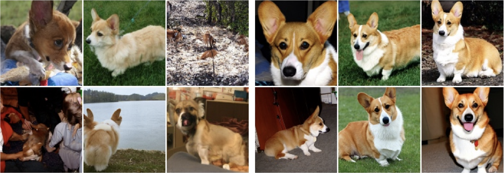

<figcaption>図11: classifier guidance の効果。プロンプトはクラス「Corgi」（犬種）。左: ガイダンスなし（w=1）で生成したサンプル。右: ガイダンス w=4 で生成したサンプル。classifier-free guidance はプロンプトへの類似を改善する。図は [10] より。</figcaption>
</figure>

<figure>

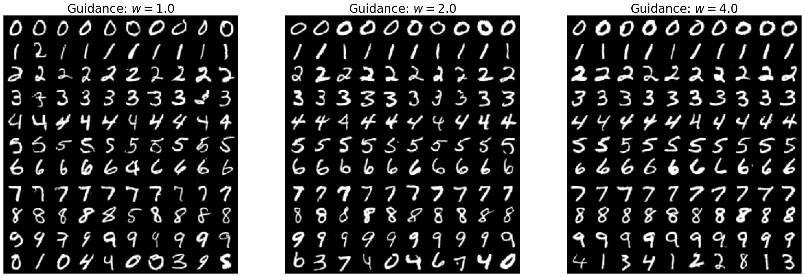

<figcaption>図12: 手書き数字 MNIST データセットに様々なガイダンススケールで classifier-free guidance を適用した効果。左: w=1.0。中: w=2.0。右: w=4.0。</figcaption>
</figure>

**アルゴリズム 5**：ガウス確率パス $p_{t}(x|z)=\mathcal{N}(x;\alpha_{t}z,\beta_{t}^{2}I_{d})$ の classifier-free guidance 学習

```
入力: ペアデータセット (z,y) ∼ p_data、ニューラルネットワーク u_t^θ
各ミニバッチについて:
    データ例 (z,y) をサンプル
    ランダムな時刻 t ∼ Unif[0,1] をサンプル
    ノイズ ε ∼ N(0, I_d) をサンプル
    x = α_t z + β_t ε とする
    確率 p でラベルを落とす: y ← ∅
    損失 L(θ) = ‖u_t^θ(x|y) - (α̇_t ε + β̇_t z)‖²
    L(θ) の勾配降下で θ を更新
```

#### 5.1.2 拡散モデルの Guidance

前節の推論を拡散モデルへ拡張する。まず式(64) と同様に conditional score matching 損失（式(61)）を一般化して **guided conditional score matching 目的** $\mathcal{L}_{\text{CSM}}^{\text{guided}}(\theta)=\mathbb{E}[\|s_{t}^{\theta}(x|y)-\nabla\log p_{t}(x|z)\|^{2}]$ を得る。これで学習したガイド付きスコアネット $s_{t}^{\theta}(x|y)$ をガイド付きベクトル場 $u_{t}^{\theta}(x|y)$ と組み合わせて SDE $\mathrm{d}X_{t}=[u_{t}^{\theta}(X_{t}|y)+\frac{\sigma_{t}^{2}}{2}s_{t}^{\theta}(X_{t}|y)]\mathrm{d}t+\sigma_{t}\mathrm{d}W_{t}$ をシミュレーションできる。

CFG を拡散の設定に拡張する。Bayes の規則により、ガイダンススケール $w>1$ について

$$
\tilde{s}_{t}(x|y)=(1-w)\nabla\log p_{t}(x|\varnothing)+w\nabla\log p_{t}(x|y)
$$

を定義できる。

###### まとめ 28（拡散の Classifier-Free Guidance）

ガイドなし周辺スコア $\nabla\log p_{t}(x|\varnothing)$、ガイド付き周辺スコア場 $\nabla\log p_{t}(x|y)$、ガイダンススケール $w>1$ が与えられると、classifier-free guided スコアを上式で定義する。同じニューラルネットワーク $s_{t}^{\theta}(x|y)$ で両者を近似し、CFG-CSM 目的（$\varnothing$ の可能性を考慮）で学習する。推論時、固定した $w>1$ について $\tilde{s}^{\theta}_{t}(x|y)=(1-w)s_{t}^{\theta}(x|\varnothing)+ws_{t}^{\theta}(x|y)$、$\tilde{u}^{\theta}_{t}(x|y)=(1-w)u_{t}^{\theta}(x|\varnothing)+wu_{t}^{\theta}(x|y)$ を組み合わせ、SDE $\mathrm{d}X_{t}=[\tilde{u}_{t}^{\theta}(X_{t}|y)+\frac{\sigma_{t}^{2}}{2}\tilde{s}_{t}^{\theta}(X_{t}|y)]\mathrm{d}t+\sigma_{t}\mathrm{d}W_{t}$ をシミュレーションする。

### 5.2 ニューラルネットワークアーキテクチャ

次に flow・拡散モデルのニューラルネットワーク設計を論じる。具体的には、パラメータ $\theta$ を持つ（ガイド付き）ベクトル場 $u_{t}^{\theta}(x|y)$ を表すアーキテクチャをどう構成するか。ネットワークは 3 入力（ベクトル $x\in\mathbb{R}^{d}$、条件付け変数 $y\in\mathcal{Y}$、時刻 $t\in[0,1]$）と 1 出力（ベクトル $u_{t}^{\theta}(x|y)\in\mathbb{R}^{d}$）を持つ。低次元分布では $u_{t}^{\theta}(x|y)$ を多層パーセプトロン（MLP）でパラメータ化すれば十分だが、画像・動画・タンパク質のような複雑な高次元分布では MLP では稀にしか十分でなく、応用特化のアーキテクチャを使うのが一般的。本節の残りでは画像（および動画）の場合を考え、**U-Net** と **diffusion transformer（DiT）**を論じる。

#### 5.2.1 U-Net と Diffusion Transformer

画像は単にベクトル $x\in\mathbb{R}^{C_{\text{image}}\times H\times W}$ である（$C_{\text{image}}$ はチャネル数、RGB なら 3）。

##### U-Net

**U-Net** アーキテクチャは特定の畳み込みニューラルネットワークである。元は画像セグメンテーション用に設計され、その重要な特徴は入力も出力も画像の形（チャネル数は異なりうる）を持つこと。これは固定 $y,t$ について入出力が画像の形なので、ベクトル場 $x\mapsto u_{t}^{\theta}(x|y)$ のパラメータ化に理想的で、拡散モデルの開発で広く使われた。U-Net は一連のエンコーダ $\mathcal{E}_{i}$、対応するデコーダ列 $\mathcal{D}_{i}$、その間の潜在処理ブロック（本書で midcoder と呼ぶ）からなる。例えば画像 $x_{t}\in\mathbb{R}^{3\times 256\times 256}$ が処理される経路：入力 $\to$ エンコーダで潜在 $\mathbb{R}^{512\times 32\times 32}$ へ $\to$ midcoder $\to$ デコーダで出力 $\mathbb{R}^{3\times 256\times 256}$ へ。入力がエンコーダを通るにつれチャネル数が増え、高さ・幅が減る。エンコーダとデコーダは残差接続でつながれることが多い。U-Net の名はエンコーダ・デコーダが作る「U」字形に由来する（図13）。

<figure>

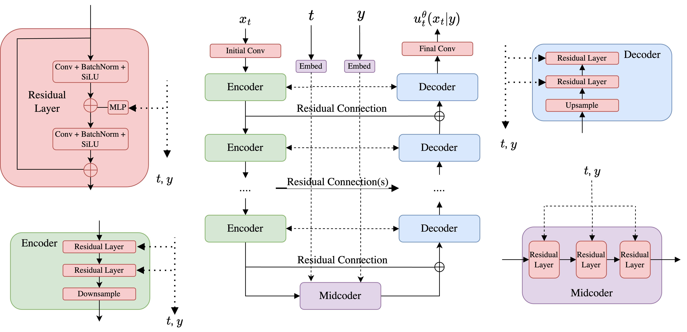

<figcaption>図13: lab three で使う簡略化した U-Net アーキテクチャ。</figcaption>
</figure>

##### Diffusion Transformer

U-Net の代替が **diffusion transformer（DiT）**で、畳み込みを廃して純粋に attention を使う。DiT は vision transformer（ViT）に基づき、画像をパッチに分割し、各パッチを埋め込み、パッチ間で attention する。Stable Diffusion 3 は conditional flow matching で学習され、速度場 $u_{t}^{\theta}(x)$ を改良 DiT でパラメータ化する。

###### 注意 29（潜在空間で動く）

大規模応用では、データが高次元すぎてメモリを消費しすぎることがしばしば問題になる。メモリ使用を減らす一般的な設計パターンは、データの低解像度な圧縮版とみなせる**潜在空間（latent space）**で動くこと。通常は flow・拡散モデルを（変分）オートエンコーダと組み合わせる：まず学習データをオートエンコーダで潜在空間に符号化し、潜在空間で flow・拡散モデルを学習する。サンプリングは潜在空間でサンプルしてからデコーダで復号する。よく学習されたオートエンコーダは意味的に無意味な詳細を濾し取り、生成モデルが重要な知覚的特徴に「集中」できるようにすると直感できる。今やほぼ全ての最先端の画像・動画生成は、オートエンコーダの潜在空間で flow・拡散モデルを学習する——いわゆる **latent diffusion models**。ただし拡散モデルの学習前にオートエンコーダも学習する必要があり、性能はオートエンコーダの圧縮・復元の良さにも依存する点が重要。

#### 5.2.2 ガイド変数の符号化

ガイド（条件付け）変数 $y$ をどうネットワーク $u_{t}^{\theta}(x|y)$ に入れるか。大きく 2 段階：生の入力 $y_{\text{raw}}$（例: テキストプロンプト）をベクトル値入力 $y$ に**埋め込む**こと、得た $y$ をモデルに**入れる**こと。

##### 生入力の埋め込み

2 つの場合を考える：(1) $y_{\text{raw}}$ が離散クラスラベルの場合、各値に別々の埋め込みベクトルを学習し $y$ をそれに設定するのが簡単。(2) $y_{\text{raw}}$ がテキストプロンプトの場合、状況はより複雑で、凍結された事前学習済みモデルに依拠する。そうしたモデルの 1 つが **CLIP（Contrastive Language-Image Pre-training）**で、画像とテキストプロンプトの共有埋め込み空間を学ぶ（画像埋め込みを対応プロンプトに近づけ、他から遠ざける学習損失を使う）。よって $y=\text{CLIP}(y_{\text{raw}})\in\mathbb{R}^{d_{\text{CLIP}}}$ を凍結 CLIP の埋め込みとできる。場合によっては全系列を 1 表現に圧縮するのが望ましくなく、事前学習済み transformer で埋め込み系列を得ることも考える。複数の事前学習済み埋め込みを組み合わせるのも一般的。

<figure>

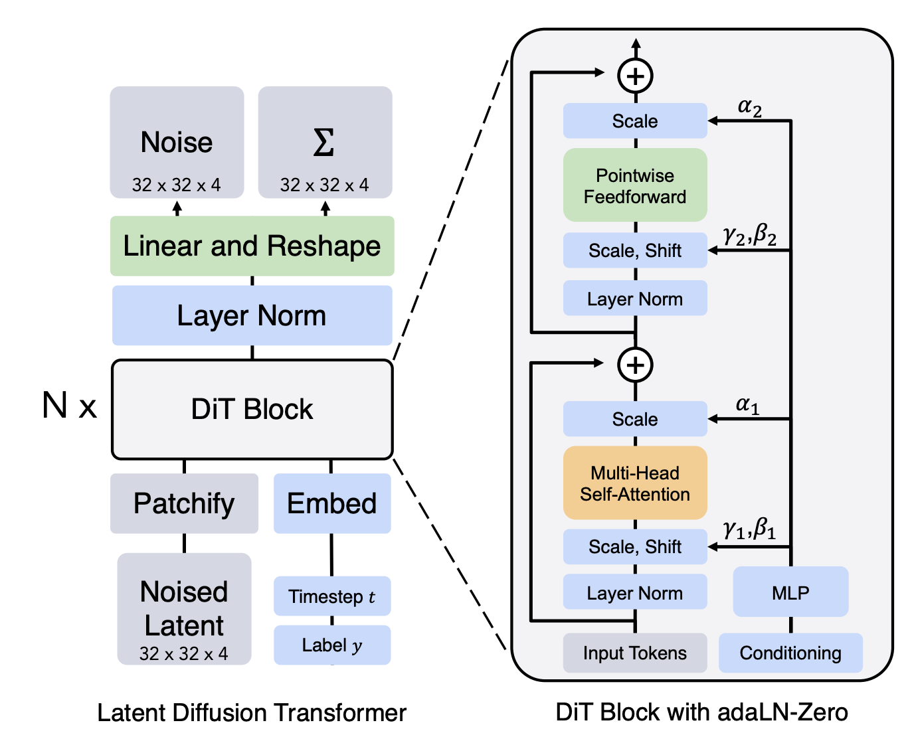

<figcaption>図14: 左: diffusion transformer アーキテクチャの概観（[19] より）。右: 共有画像-テキスト埋め込み空間を学ぶ対照的 CLIP 損失の模式図（[22] より）。</figcaption>
</figure>

##### 埋め込みの入力

埋め込みベクトル $y\in\mathbb{R}^{d_{y}}$ を得たら、通常はアーキテクチャの各サブコンポーネントへ個別に入れる。lab three の U-Net 実装では、中間活性 $x^{\text{intermediate}}_{t}\in\mathbb{R}^{C\times H\times W}$ に $y$ の情報を注入するため、$y$ を MLP で $\mathbb{R}^{C}$ へ写し、$\mathbb{R}^{C\times 1\times 1}$ に reshape して画像のように見せ、点ごとに broadcast 加算する。事前学習済み言語モデルが生む埋め込み系列がある場合は、（パッチ化した）画像と埋め込み系列のトークンの間で cross-attention を使うことを考える。

### 5.3 大規模画像・動画モデルの概観

本節を、2 つの大規模生成モデル——画像生成の Stable Diffusion 3 と動画生成の Meta Movie Gen Video——を簡単に見て締めくくる。これらは本書で述べた技法を、スケールと豊かな条件付けモダリティに対応するための追加のアーキテクチャ強化とともに使う。

#### 5.3.1 Stable Diffusion 3

Stable Diffusion は最先端の画像生成モデル群で、画像生成に大規模 latent diffusion models を使った最初期の 1 つ。Stable Diffusion 3 は本書で学ぶ conditional flow matching 目的（アルゴリズム 5）を使う。論文で述べられるように、様々な flow・拡散の代替を広範にテストし、flow matching が最良と分かった。学習には上記の classifier-free guidance 学習（クラスラベルを落とす）を使い、§5.2 のように事前学習済みオートエンコーダの潜在空間で学習する。良いオートエンコーダの学習は最初の stable diffusion 論文の大きな貢献だった。テキスト条件付け強化のため、Stable Diffusion 3 は 3 種類のテキスト埋め込み（CLIP 埋め込みと、Google の T5-XXL エンコーダの系列出力）を使う。CLIP 埋め込みが粗い全体的埋め込みを与えるのに対し、T5 埋め込みはより細かい文脈を与え、モデルが条件テキストの特定要素に attend できる。これら系列文脈埋め込みに対応するため、著者らは DiT を画像パッチだけでなくテキスト埋め込みにも attend するよう拡張した。この改良 DiT が **multi-modal DiT（MM-DiT）**である（図15）。最終的な最大モデルは 80 億パラメータ。サンプリングは Euler スキームで 50 ステップ、classifier-free guidance 重み 2.0〜5.0 を使う。

<figure>

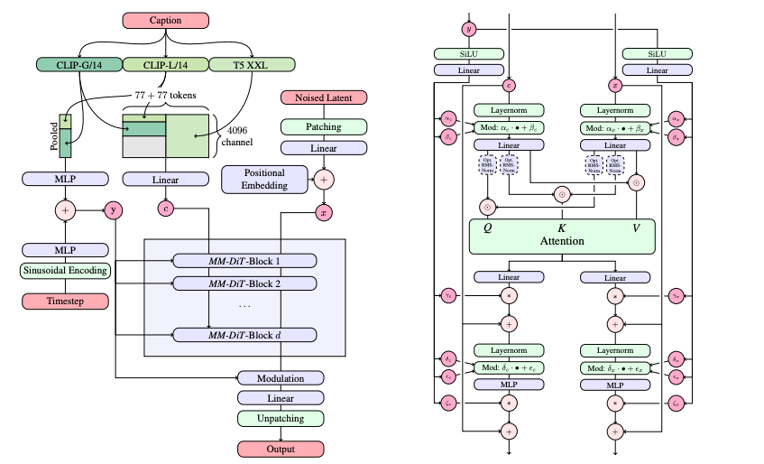

<figcaption>図15: [7] で提案された multi-modal diffusion transformer（MM-DiT）のアーキテクチャ。</figcaption>
</figure>

#### 5.3.2 Meta Movie Gen Video

次に Meta の動画生成器 Movie Gen Video を論じる。データは画像でなく動画なので、$x$ は空間 $\mathbb{R}^{T\times C\times H\times W}$ にある（$T$ は時間次元＝フレーム数）。この動画設定の設計選択の多くは、既存技法（オートエンコーダ・DiT 等）を画像から追加の時間次元へ適応させたものと見なせる。Movie Gen Video は同じ CondOT パスの conditional flow matching 目的（アルゴリズム 5）を使う。Stable Diffusion 3 と同様、凍結された事前学習済みオートエンコーダの潜在空間で動く。動画ではメモリ削減のためのオートエンコーダが画像以上に重要で、生の動画 $x_{t}^{\prime}\in\mathbb{R}^{T^{\prime}\times 3\times H\times W}$ を潜在 $x_{t}\in\mathbb{R}^{T\times C\times H\times W}$（$\frac{T^{\prime}}{T}=\frac{H^{\prime}}{H}=\frac{W^{\prime}}{W}=8$）へ写す **temporal autoencoder（TAE）**を導入する。長い動画には時間タイリング（動画を断片に切り、各々を別々に符号化し、潜在をつなぐ）を提案。モデル $u_{t}^{\theta}(x_{t})$ は、$x_{t}$ を時間・空間方向にパッチ化する DiT 様バックボーンで、画像パッチ間の self-attention と言語モデル埋め込みとの cross-attention を使う（MM-DiT に類似）。テキスト条件付けには 3 種類の埋め込み（細かいテキスト推論の UL2、文字レベル詳細の ByT5、共有テキスト-画像空間の MetaCLIP）を使う。最終的な最大モデルは 300 億パラメータ。

## 付録A 確率論の復習

確率論の基本概念の簡単な概観を示す。

### A.1 ランダムベクトル

$d$ 次元ユークリッド空間のデータ $x=(x^{1},\ldots,x^{d})\in\mathbb{R}^{d}$ を、標準内積 $\langle x,y\rangle=\sum_{i=1}^{d}x^{i}y^{i}$・ノルム $\|x\|=\sqrt{\langle x,x\rangle}$ とともに考える。連続な確率密度関数（PDF）——事象 $A$ に確率 $\mathbb{P}(X\in A)=\int_{A}p_{X}(x)\mathrm{d}x$ を与える連続関数 $p_{X}:\mathbb{R}^{d}\to\mathbb{R}_{\geq 0}$、$\int p_{X}(x)\mathrm{d}x=1$——を持つ確率変数（RV）$X\in\mathbb{R}^{d}$ を考える。全空間にわたる積分では積分区間を省く（$\int\equiv\int_{\mathbb{R}^{d}}$）。簡潔のため RV $X_{t}$ の PDF $p_{X_{t}}$ を単に $p_{t}$ と呼ぶ。$X\sim p$ で $X$ が $p$ に従うことを示す。生成モデリングで一般的な PDF の 1 つが $d$ 次元等方ガウス：

$$
\mathcal{N}(x;\mu,\sigma^{2}I)=(2\pi\sigma^{2})^{-\frac{d}{2}}\exp\left(-\frac{\|x-\mu\|_{2}^{2}}{2\sigma^{2}}\right),
$$

$\mu\in\mathbb{R}^{d}$ は平均、$\sigma\in\mathbb{R}_{>0}$ は標準偏差。RV の期待値は最小二乗の意味で $X$ に最も近い定数ベクトルである：

$$
\mathbb{E}[X]=\operatorname*{arg\,min}_{z\in\mathbb{R}^{d}}\int\|x-z\|^{2}p_{X}(x)\mathrm{d}x=\int xp_{X}(x)\mathrm{d}x.
$$

RV の関数の期待値を計算する有用な道具が**無意識な統計家の法則（law of the unconscious statistician）**：$\mathbb{E}[f(X)]=\int f(x)p_{X}(x)\mathrm{d}x$。必要なら期待値の下の RV を $\mathbb{E}_{X}f(X)$ と示す。

### A.2 条件付き密度と条件付き期待値

<figure>

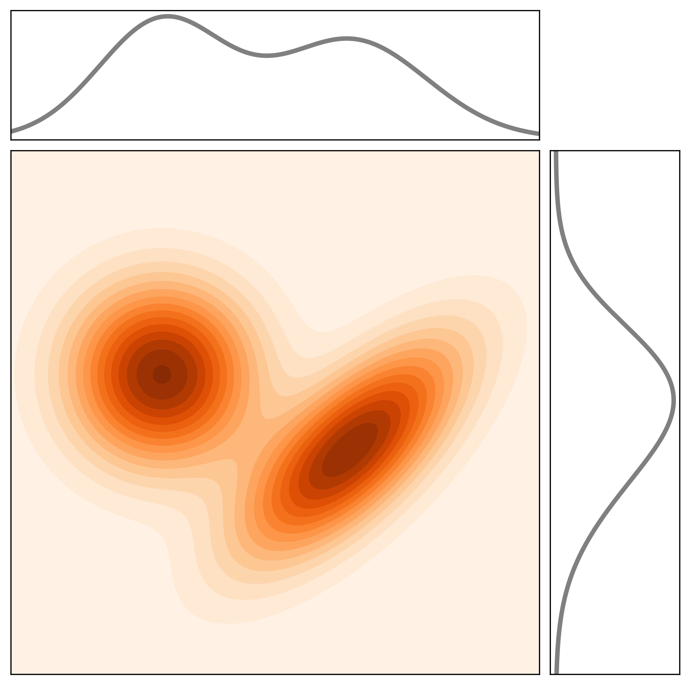

<figcaption>図16: 同時 PDF p_{X,Y}（濃淡）とその周辺 p_X・p_Y（黒線）。</figcaption>
</figure>

2 つの RV $X,Y\in\mathbb{R}^{d}$ について、同時 PDF $p_{X,Y}(x,y)$ は周辺 $\int p_{X,Y}(x,y)\mathrm{d}y=p_{X}(x)$、$\int p_{X,Y}(x,y)\mathrm{d}x=p_{Y}(y)$ を持つ。**条件付き PDF** $p_{X|Y}$ は、密度 $p_{Y}(y)>0$ の事象 $Y=y$ で条件付けたときの $X$ の PDF を表す：

$$
p_{X|Y}(x|y)\coloneqq\frac{p_{X,Y}(x,y)}{p_{Y}(y)},
$$

$p_{Y|X}$ も同様。**Bayes の規則**は $p_{Y|X}(y|x)=\frac{p_{X|Y}(x|y)p_{Y}(y)}{p_{X}(x)}$（$p_{X}(x)>0$）。**条件付き期待値** $\mathbb{E}[X|Y]$ は最小二乗の意味で $X$ を最もよく近似する関数 $g_{\star}(Y)$ で、$p_{Y}(y)>0$ なる $y$ について $\mathbb{E}[X|Y=y]\coloneqq g_{\star}(y)=\int xp_{X|Y}(x|y)\mathrm{d}x$。$g_{\star}$ を RV $Y$ と合成すると $\mathbb{E}[X|Y]\coloneqq g_{\star}(Y)$ という $\mathbb{R}^{d}$ の RV になる。紛らわしいが $\mathbb{E}[X|Y=y]$（関数 $\mathbb{R}^{d}\to\mathbb{R}^{d}$）と $\mathbb{E}[X|Y]$（$\mathbb{R}^{d}$ の値を取る RV）は異なる対象である。

**タワー性質（tower property）**は条件付き期待値の導出を簡単にする有用な性質である：

$$
\mathbb{E}[\mathbb{E}[X|Y]]=\mathbb{E}[X].
$$

$\mathbb{E}[X|Y]$ は RV（RV $Y$ の関数）なので、外側の期待値が $\mathbb{E}[X|Y]$ の期待値を計算する。上の定義を使って検証できる：$\mathbb{E}[\mathbb{E}[X|Y]]=\int\left(\int xp_{X|Y}(x|y)\mathrm{d}x\right)p_{Y}(y)\mathrm{d}y=\int\int xp_{X,Y}(x,y)\mathrm{d}x\mathrm{d}y=\int xp_{X}(x)\mathrm{d}x=\mathbb{E}[X]$。最後に、任意の RV $X,Y$ の関数 $f(X,Y)$ と $Y$ について、無意識な統計家の法則を使って $\mathbb{E}[f(X,Y)|Y=y]=\int f(x,y)p_{X|Y}(x|y)\mathrm{d}x$ を得る。

## 付録B Fokker-Planck 方程式の証明

ここでは Fokker-Planck 方程式（定理 15）の自己完結的な証明を与える。これは連続の方程式（定理 12）を特別な場合として含む。本節は本文書の残りの理解に必要ではなく、数学的により高度である。

まず Fokker-Planck が**必要条件**であること、すなわち $X_{t}\sim p_{t}$ なら Fokker-Planck 方程式が満たされることを示す。証明のトリックは**テスト関数** $f$——無限回微分可能（「滑らか」）で有界領域内でのみ非零（コンパクト台）な関数 $f:\mathbb{R}^{d}\to\mathbb{R}$——を使うこと。任意の可積分関数 $g_{1},g_{2}:\mathbb{R}^{d}\to\mathbb{R}$ について

$$
g_{1}(x)=g_{2}(x)\ \forall x\ \Leftrightarrow\ \int f(x)g_{1}(x)\mathrm{d}x=\int f(x)g_{2}(x)\mathrm{d}x\ \text{（すべてのテスト関数 $f$ について）}
$$

が成り立つという事実を使う。すなわち点ごとの等式を積分の等式として表せる。テスト関数は滑らかなので勾配や高階微分を取れ、任意のテスト関数 $f_{1},f_{2}$ について部分積分 $\int f_{1}(x)\frac{\partial}{\partial x_{i}}f_{2}(x)\mathrm{d}x=-\int f_{2}(x)\frac{\partial}{\partial x_{i}}f_{1}(x)\mathrm{d}x$ が使える。発散とラプラシアンの定義と合わせて、次の恒等式を得る：

$$
\int\nabla f_{1}^{T}(x)f_{2}(x)\mathrm{d}x=-\int f_{1}(x)\mathrm{div}(f_{2})(x)\mathrm{d}x,\qquad \int f_{1}(x)\Delta f_{2}(x)\mathrm{d}x=\int f_{2}(x)\Delta f_{1}(x)\mathrm{d}x.
$$

証明に進む。式(6) の SDE 軌道の確率的更新 $X_{t+h}\approx X_{t}+hu_{t}(X_{t})+\sigma_{t}(W_{t+h}-W_{t})$ を使う（$h\to 0$ を取るので誤差項 $R_{t}(h)$ は無視）。$f$ を $X_{t}$ の周りで 2 次 Taylor 近似し、ヘッセ行列 $\nabla^{2}f$ の対称性を使うと $f(X_{t+h})-f(X_{t})$ を展開できる。$\mathbb{E}[W_{t+h}-W_{t}|X_{t}]=0$ かつ $W_{t+h}-W_{t}|X_{t}\sim\mathcal{N}(0,hI_{d})$ なので、$\mathbb{E}_{\epsilon\sim\mathcal{N}(0,I_{d})}[\epsilon^{T}A\epsilon]=\text{trace}(A)$ を用いて

$$
\mathbb{E}[f(X_{t+h})-f(X_{t})|X_{t}]=h\nabla f(X_{t})^{T}u_{t}(X_{t})+\frac{1}{2}h^{2}u_{t}^{T}\nabla^{2}f\,u_{t}+\frac{h}{2}\sigma_{t}^{2}\Delta f(X_{t})
$$

を得る。これを使うと

$$
\partial_{t}\mathbb{E}[f(X_{t})]=\lim_{h\to 0}\frac{1}{h}\mathbb{E}[\mathbb{E}[f(X_{t+h})-f(X_{t})|X_{t}]]=\mathbb{E}\left[\nabla f(X_{t})^{T}u_{t}(X_{t})+\frac{1}{2}\sigma_{t}^{2}\Delta f(X_{t})\right]
$$

$$
\overset{(i)}{=}\int\nabla f(x)^{T}u_{t}(x)p_{t}(x)\mathrm{d}x+\int\frac{1}{2}\sigma_{t}^{2}\Delta f(x)p_{t}(x)\mathrm{d}x\overset{(ii)}{=}\int f(x)\left(-\mathrm{div}(u_{t}p_{t})(x)+\frac{1}{2}\sigma_{t}^{2}\Delta p_{t}(x)\right)\mathrm{d}x
$$

$(i)$ では $X_{t}\sim p_{t}$ の仮定、$(ii)$ では上記の部分積分恒等式を使った。したがって、すべてのテスト関数 $f$ について

$$
\partial_{t}\int f(x)p_{t}(x)\mathrm{d}x=\int f(x)\partial_{t}p_{t}(x)\mathrm{d}x=\int f(x)\left(-\mathrm{div}(p_{t}u_{t})(x)+\frac{\sigma_{t}^{2}}{2}\Delta p_{t}(x)\right)\mathrm{d}x
$$

が成り立ち、テスト関数の性質（式(92)）から点ごとに

$$
\partial_{t}p_{t}(x)=-\mathrm{div}(p_{t}u_{t})(x)+\frac{\sigma_{t}^{2}}{2}\Delta p_{t}(x)\quad(\forall x,\ 0\leq t\leq 1)
$$

を得る。これで Fokker-Planck 方程式が必要条件であることの証明が完了する。

最後に、これが**十分条件**でもある理由を説明する。Fokker-Planck 方程式は偏微分方程式（PDE）、より具体的にはいわゆる**放物型偏微分方程式**である。定理 3 と同様、そうした微分方程式は固定された初期条件の下で一意の解を持つ。式(30) が $p_{t}$ について成り立つなら、$X_{t}$ の真の分布 $q_{t}$（$X_{t}\sim q_{t}$）についても成り立つことを上で示した——つまり $p_{t}$ と $q_{t}$ は両方ともこの放物型 PDE の解である。さらに補間確率パスの構成により初期条件は同じ $p_{0}=q_{0}=p_{\rm{init}}$ である。よって微分方程式の解の一意性により、すべての $0\leq t\leq 1$ で $p_{t}=q_{t}$、つまり $X_{t}\sim q_{t}=p_{t}$ となり、示したいことが言えた。
