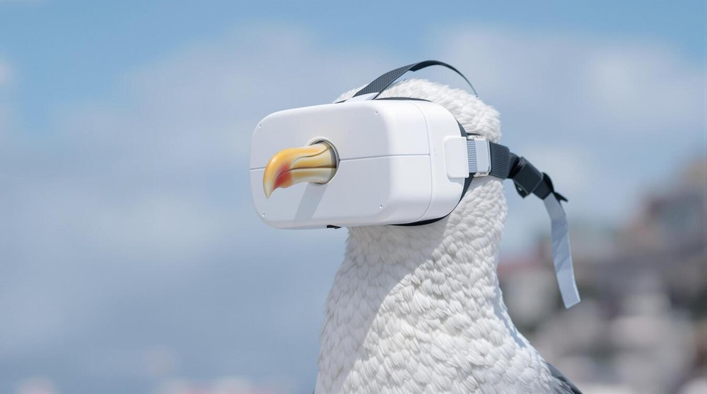
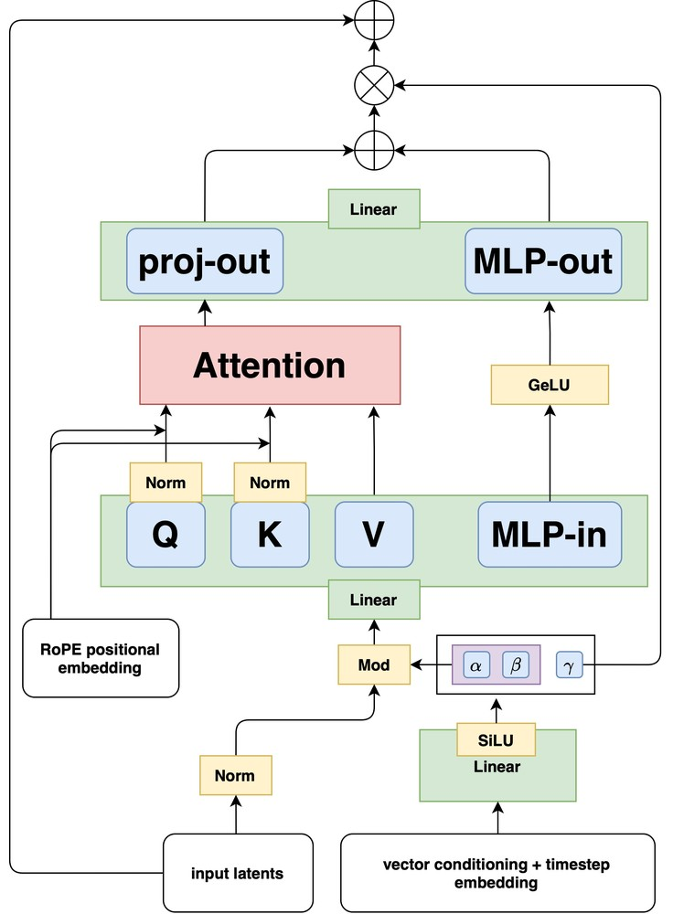
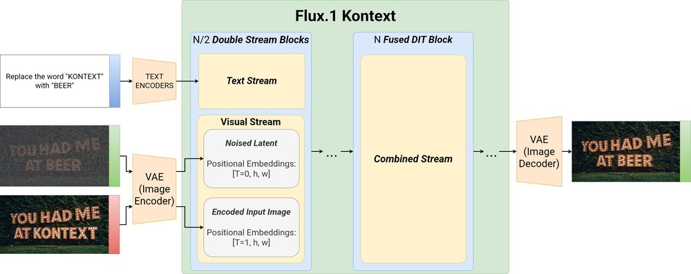
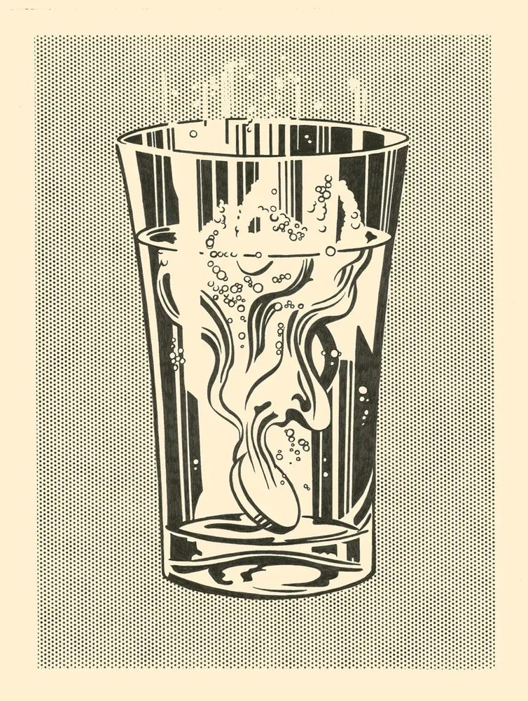
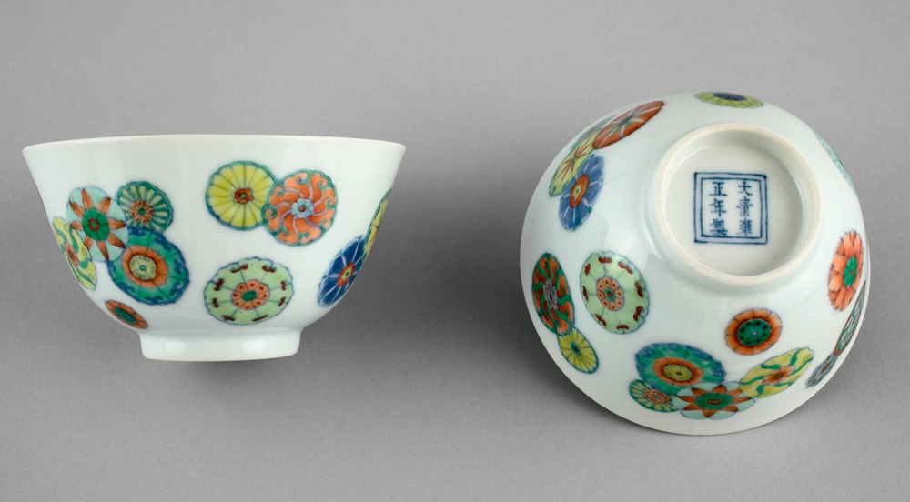
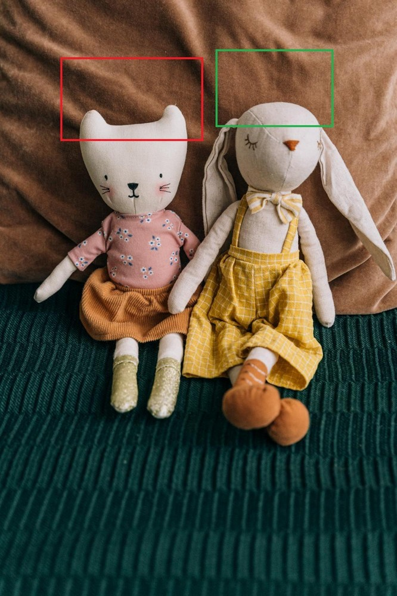
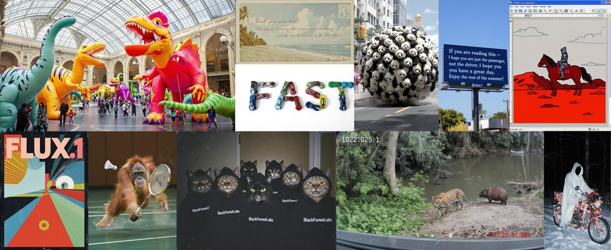
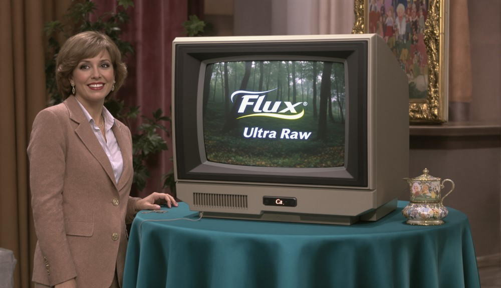

# FLUX.1 Kontext: 潜在空間における文脈内画像生成・編集のための Flow Matching

> 原題: FLUX.1 Kontext: Flow Matching for In-Context Image Generation and Editing in Latent Space
> 著者: Black Forest Labs（Stephen Batifol, Andreas Blattmann, Frederic Boesel, Saksham Consul, Cyril Diagne, Tim Dockhorn, Jack English, Zion English, Patrick Esser, Sumith Kulal, Kyle Lacey, Yam Levi, Cheng Li, Dominik Lorenz, Jonas Müller, Dustin Podell, Robin Rombach, Harry Saini, Axel Sauer, Luke Smith）
> 出典: arXiv:2506.15742（引用は "Black Forest Labs (2025)" とするよう指定されている）
> 訳注: 本翻訳は本文 §1–5 ＋ Appendix A・B を対象とする（References は除外）。図 7(a)・8(a)・9(a)（評価プロット）は ar5iv 側の変換失敗により画像が取得できなかったため、キャプションのみを引用ブロックで示す。

## Abstract（要旨）

我々は *FLUX.1 Kontext* の評価結果を提示する。これは画像生成と編集を統一する生成的 flow matching モデルである。本モデルは、テキスト入力と画像入力から意味的文脈を取り込むことで、新規の出力ビューを生成する。単純な**系列連結（sequence concatenation）**のアプローチを用いることで、*FLUX.1 Kontext* は局所編集と生成的な文脈内タスクの双方を、単一の統一アーキテクチャ内で扱う。複数ターンにわたってキャラクタの一貫性と安定性の劣化を示す現行の編集モデルと比較して、*FLUX.1 Kontext* は物体とキャラクタの保存が改善されており、反復的なワークフローにおけるより高い頑健性につながることを我々は観察する。本モデルは現行の最先端システムと競合する性能を達成しつつ、生成時間が著しく速く、対話的なアプリケーションと迅速なプロトタイピングのワークフローを可能にする。これらの改善を検証するため、我々は *KontextBench* を導入する。これは局所編集・大域編集・キャラクタ参照・スタイル参照・テキスト編集という 5 つのタスクカテゴリをカバーする 1026 組の画像-プロンプトペアからなる包括的なベンチマークである。詳細な評価は、単一ターンの品質と複数ターンの一貫性の両面で *FLUX.1 Kontext* が優れた性能を持つことを示し、統一画像処理モデルの新たな基準を打ち立てる。

<figure>

<figcaption>図1(a): FLUX.1 で生成したコンテキスト画像。</figcaption>
</figure>

## 1 はじめに

画像は現代のコミュニケーションの基盤であり、ソーシャルメディア、電子商取引、科学的可視化、エンターテインメント、ミームといった多様な領域の基礎をなす。視覚コンテンツの量と速度が増すにつれ、直感的でありながら忠実で正確な画像編集への需要も増している。プロフェッショナルもカジュアルなユーザーも、細部を保持し、意味的一貫性を維持し、ますます自然な言語コマンドに応答するツールを期待する。大規模生成モデルの登場はこの状況を変え、これまで非実用的あるいは不可能だった純粋にテキスト駆動の画像合成と修正を可能にした。

伝統的な画像処理パイプラインは、ピクセル値を直接操作するか、明示的なユーザー制御の下で幾何学的・測光的な変換を適用することで機能する。対照的に、生成的処理は深層学習モデルとその学習済み表現を用いて、新しいシーンにシームレスに適合するコンテンツを合成する。このパラダイムには 2 つの相補的な能力が中心的である。

<figure>

<figcaption>図2(a): 入力画像。</figcaption>
</figure>

**近年の進展**　InstructPix2Pix とその後続研究は、画像編集のために拡散モデルを微調整する合成的な指示-応答ペアの有望性を実証した。一方、個人化されたテキスト画像合成のための学習不要な手法は、既製の高性能な画像生成モデルによる画像修正を可能にする。Emu Edit・OmniGen・HiDream-E1・ICEdit といった後続の指示駆動型エディタは、これらの発想を洗練されたデータセットとモデルアーキテクチャへ拡張する。ある研究は拡散 Transformer 向けの文脈内 LoRA を特定のタスクに導入したが、各タスクに専用の LoRA 重みを学習する必要がある。マルチモーダル LLM に組み込まれた新規の商用システム（例: GPT-Image、Gemini Native Image Gen）は、対話と編集の境界をさらに曖昧にしている。Midjourney や RunwayML といった生成プラットフォームは、これらの進展をエンドツーエンドの創作ワークフローへ統合している。

**近年のアプローチの欠点**　結果の面で、現行のアプローチは 3 つの大きな欠点に苦しむ。(i) 合成ペアで学習された指示ベース手法は、その生成パイプラインの欠点を継承し、達成できる編集の多様性と写実性を制限する。(ii) 複数の編集をまたいでキャラクタと物体の正確な外見を維持することは未解決の問題であり、ストーリーテリングやブランドに敏感な応用を妨げる。(iii) ノイズ除去ベースのアプローチと比べて品質が低いことに加え、大規模マルチモーダルシステムに統合された自己回帰的な編集モデルは、しばしば対話的な利用と相容れない長い実行時間を伴う。

**我々の解**　我々は *FLUX.1 Kontext* を導入する。これはフローベースの生成的画像処理モデルであり、上記の制約を克服しつつ最先端のブラックボックスシステムの品質に匹敵または凌駕する。*FLUX.1 Kontext* は、**コンテキストトークンと指示トークンを連結した系列に対して速度予測ターゲットのみを用いて学習された、単純な flow matching モデル**である。

具体的に、*FLUX.1 Kontext* は次を提供する：

- **キャラクタの一貫性**：*FLUX.1 Kontext* は、複数回の反復的な編集ターンを含めてキャラクタの保存に秀でる。
- **対話的な速度**：*FLUX.1 Kontext* は**速い**。text-to-image と image-to-image の双方の応用で、$1024\times 1024$ の画像を合成する速度は 3〜5 秒に達する。
- **反復的な適用**：高速な推論と頑健な一貫性により、ユーザーは視覚的なドリフトを最小限に抑えつつ、複数回の連続した編集を通じて画像を洗練できる。

## 2 FLUX.1

<figure>

<figcaption>図3: 回転位置埋め込み（rotary positional embeddings）を備えた fused DiT ブロック。</figcaption>
</figure>

FLUX.1 は、画像オートエンコーダの潜在空間で学習された rectified flow transformer である。我々は先行研究に従い、敵対的目的を持つ畳み込みオートエンコーダをゼロから学習する。学習計算量をスケールアップし 16 個の潜在チャネルを用いることで、関連モデルと比較して再構成能力を改善する（表1 参照）。さらに FLUX.1 は **double stream ブロックと single stream ブロックの混合**から構成される。double stream ブロックは画像トークンとテキストトークンに別々の重みを用い、混合はトークンの連結に対して注意演算を適用することで行われる。系列を double stream ブロックに通した後、それらを連結し、画像トークンとテキストトークンに **38 個の single stream ブロック**を適用する。最後に、テキストトークンを破棄して画像トークンを復号する。

single stream ブロックの GPU 利用率を改善するため、我々は先行研究に着想を得た **fused feed-forward ブロック**を活用する。これは (i) フィードフォワードブロックの変調パラメータ数を 2 分の 1 に削減し、(ii) 注意の入力・出力線形層を MLP のそれと融合させることで、より大きな行列-ベクトル積を生み、それにより学習と推論をより効率的にする。我々は**因子分解された 3 次元回転位置埋め込み（3D RoPE）** を利用する。すべての潜在トークンはその時空座標 $(t,h,w)$ で添字付けされる（単一画像入力では $t\equiv 0$）。可視化は図3 を参照。

**表1**: 異なる VAE アーキテクチャ間の再構成品質の比較。すべての指標は 4096 枚の ImageNet 画像で計算。値は平均 ± 標準誤差（丸め）。Appendix B も参照。

| モデル | PDist ↓ | SSIM ↑ | PSNR ↑ |
| --- | --- | --- | --- |
| Flux-VAE | **0.332 ± 0.003** | **0.896 ± 0.004** | **31.1 ± 0.08** |
| SD3-VAE | 0.452 ± 0.004 | 0.858 ± 0.005 | 29.6 ± 0.07 |
| SD3-TAE | 0.746 ± 0.004 | 0.774 ± 0.014 | 27.9 ± 0.06 |
| SDXL-VAE | 0.890 ± 0.005 | 0.748 ± 0.006 | 25.9 ± 0.07 |
| SD-VAE | 0.949 ± 0.005 | 0.720 ± 0.004 | 25.0 ± 0.07 |

<figure>

<figcaption>図4: FLUX.1 Kontext の高レベルな概観。左に入力画像とコンテキスト画像。詳細は §3。（図中: テキストプロンプトは TEXT ENCODERS を経て Text Stream へ、入力画像は VAE Image Encoder を経て Visual Stream へ入る。Visual Stream は位置埋め込み [T=0, h, w] のノイズ化潜在と、[T=1, h, w] の符号化済み入力画像からなる。N/2 個の Double Stream Blocks の後、N 個の Fused DiT Block が Combined Stream を処理し、VAE Image Decoder が出力する。）</figcaption>
</figure>

## 3 FLUX.1 Kontext

我々の目標は、テキストプロンプトと参照画像に同時に条件付けて画像を生成できるモデルを学習することである。より形式的には、次の条件付き分布を近似することを目指す：

$$
p(x\mid y,c)
$$

ここで $x$ は目標画像、$y$ はコンテキスト画像（または $\varnothing$）、$c$ は自然言語の指示である。古典的な text-to-image 生成と異なり、この目的は $c$ を媒介とした**画像同士の関係**の学習を伴い、それにより同一のネットワークが (i) $y\neq\varnothing$ のとき画像駆動の編集を行い、(ii) $y=\varnothing$ のときゼロから新しいコンテンツを作れるようになる。

そのために、$x\in\mathcal{X}$ を出力（目標）画像、$y\in\mathcal{X}\cup\{\varnothing\}$ を任意の**コンテキスト**画像、$c\in\mathcal{C}$ をテキストプロンプトとする。我々は条件付き分布 $p_{\theta}(x\mid y,c)$ を、同一のネットワークが $y\neq\varnothing$ のとき**文脈内編集と局所編集**を、$y=\varnothing$ のとき自由な text-to-image 生成を扱うようにモデル化する。学習は FLUX.1 の text-to-image チェックポイントから始め、最適化のために数百万の関係ペア $(x\,|\,y,c)$ を収集・精選する。実際には、画像をピクセル空間ではなく、次の段落で論じるトークン系列へ符号化してモデル化する。

#### トークン系列の構成

画像は凍結された FLUX オートエンコーダによって潜在トークンへ符号化される。これらのコンテキスト画像トークン $y$ は画像トークン $x$ に**追加（append）** され、モデルの視覚ストリームへ供給される。この単純な**系列連結**は、(i) 異なる入出力の解像度とアスペクト比を支援し、(ii) 複数画像 $y_{1},y_{2},\dots,y_{N}$ へ容易に拡張できる。$x$ と $y$ の**チャネル方向の連結も試したが、初期実験ではこの設計選択の方が性能が劣ることを見出した**。

位置情報は 3D RoPE 埋め込みで符号化し、コンテキスト $y$ の埋め込みはすべてのコンテキストトークンに対して定数のオフセットを受け取る。我々はこのオフセットを、コンテキストブロックと目標ブロックを内部の空間構造を保ったまま明確に分離する**仮想タイムステップ（virtual time step）** として扱う。具体的には、トークン位置を三つ組 $\mathbf{u}=(t,h,w)$ で表すとき、目標トークンには $\mathbf{u}_{x}=(0,h,w)$ を設定し、コンテキストトークンには次を設定する：

$$
\mathbf{u}_{y_{i}}\;=\;(\,i,\,h,\,w\,),\qquad i=1,\dots,N,
$$

#### Rectified-flow の目的関数

我々は rectified flow-matching 損失で学習する：

$$
\mathcal{L}_{\theta}=\mathbb{E}_{\,t\sim p(t),\,x,y,c}\bigl{[}\,\lVert v_{\theta}(z_{t},t,y,c)-(\varepsilon-x)\rVert_{2}^{2}\bigr{]},
$$

ここで $z_{t}$ は $x$ とノイズ $\varepsilon\sim\mathcal{N}(0,1)$ の間を線形補間した潜在で、$z_{t}=(1-t)x+t\varepsilon$ である。$p(t;\mu,\sigma=1.0)$ には **logit-normal のシフトスケジュール**（§A.2 参照）を用い、学習中のデータの解像度に応じてモード $\mu$ を変える。純粋なテキスト-画像ペア（$y=\varnothing$）をサンプルするときはトークン $y$ をすべて省き、モデルの text-to-image 生成能力を保持する。

#### 敵対的拡散蒸留（Adversarial Diffusion Distillation）

式(3) の最適化で得られる flow matching モデルのサンプリングは、典型的に 50〜250 回のガイダンス付きネットワーク評価を用いて常微分方程式または確率微分方程式を解くことを伴う。よく学習されたモデル $v_{\Theta}$ ではそうした手続きで得られるサンプルは良質だが、いくつかの潜在的な欠点を伴う。第一に、そうした多ステップのサンプリングは遅く、大規模なモデル提供を高価にし、低レイテンシで対話的な応用を妨げる。さらに、ガイダンスは過飽和のサンプルといった視覚的アーティファクトを時折導入しうる。我々はこの両方の課題に、**潜在敵対的拡散蒸留（latent adversarial diffusion distillation, LADD）** を用いて取り組み、敵対的学習を通じてサンプル品質を高めつつサンプリングステップ数を削減する。

<figure>

<figcaption>図5(a): 入力画像（スタイル参照の例）。</figcaption>
</figure>

#### 実装の詳細

純粋な text-to-image のチェックポイントから出発し、式(3) に従って image-to-image と text-to-image のタスクでモデルを同時に微調整する。我々の定式化は複数の入力画像を自然にカバーするが、現時点では条件付けに単一のコンテキスト画像を用いることに注力する。*FLUX.1 Kontext* [pro] はフロー目的の後に LADD で学習される。*FLUX.1 Kontext* [dev] は、先行研究で概説された技法に従って 12B の拡散 Transformer へ**ガイダンス蒸留（guidance-distillation）** することで得る。編集タスクでの *FLUX.1 Kontext* [dev] の性能を最適化するため、image-to-image の学習のみに専念する（すなわち [dev] では純粋な text-to-image タスクでは学習しない）。我々は、非合意の性的画像（NCII）および児童性的虐待コンテンツ（CSAM）の生成を防ぐため、分類器ベースのフィルタリングと敵対的学習を含む安全対策を組み込んでいる。

我々は混合精度で FSDP2 を用いる：all-gather 操作は bfloat16 で実行し、勾配の reduce-scatter は数値的安定性の向上のため float32 を用いる。最大 VRAM 使用量を削減するため、選択的な活性化チェックポイント（selective activation checkpointing）を用いる。スループットを改善するため、*Flash Attention 3* と個々の Transformer ブロックの局所的なコンパイル（regional compilation）を用いる。

<figure>

<figcaption>図6(a): 入力画像。</figcaption>
</figure>

## 4 評価と応用

本節では *FLUX.1 Kontext* の性能を評価し、その能力を実証する。まず KontextBench を導入する。これはユーザーからクラウドソースした実世界の画像編集の課題を特徴とする新しいベンチマークである。次に主要な評価を提示する：*FLUX.1 Kontext* を最先端の text-to-image および image-to-image 合成手法と体系的に比較し、多様な編集タスクにわたって競争力のある性能を示す。最後に、反復的な編集ワークフロー、スタイル転送、視覚的手がかりによる編集、テキスト編集を含む *FLUX.1 Kontext* の実用的な応用を探る。

### 4.1 KontextBench — 文脈内タスクのためのクラウドソース実世界ベンチマーク

編集モデルの既存ベンチマークは、実世界の利用を捉えるという点でしばしば限定的である。InstructPix2Pix は合成的な Stable Diffusion サンプルと GPT が生成した指示に依拠しており、内在的なバイアスを生む。MagicBrush は本物の MS-COCO 画像を用いるものの、データ収集時の DALLE-2 の能力に制約される。Emu-Edit のような他のベンチマークは、非現実的な分布を持つより低解像度の画像を用い、編集タスクのみに焦点を当てる。一方 DreamBench は広範なカバレッジを欠き、GEdit-bench は現代のマルチモーダルモデルの全範囲を代表しない。IntelligentBench は入手できないままで、タスクカバレッジが不確かな 300 例しかない。

これらのギャップに対処するため、我々はクラウドソースした実世界のユースケースから *KontextBench* を編纂する。本ベンチマークは、個人写真・CC ライセンスのアート・パブリックドメイン画像・AI 生成コンテンツを含む 108 枚の基底画像から導かれた **1026 組の一意な画像-プロンプトペア**からなる。これは 5 つの中核タスクにまたがる：**局所指示編集（416 例）、大域指示編集（262）、テキスト編集（92）、スタイル参照（63）、キャラクタ参照（193）**。我々は、本ベンチマークの規模が信頼できる人間評価と実世界の応用の包括的なカバレッジの間で良好なバランスを提供することを見出した。我々は *FLUX.1 Kontext* とすべての報告されたベースラインのサンプルを含め、このベンチマークを公開する。

### 4.2 最先端との比較

> 図7(a): text-to-image の推論レイテンシ。（訳注: ar5iv 側の変換失敗により画像が取得できなかった）

*FLUX.1 Kontext* は text-to-image（T2I）と image-to-image（I2I）の双方の合成を行うよう設計されている。我々は両領域で最強の商用モデルおよびオープン重みモデルに対して我々のアプローチを評価する。FLUX.1 Kontext [pro] と [dev] を評価する。上述のとおり、[dev] については image-to-image タスクに専念する。加えて、生成性能を改善するためより多くの計算を用いる FLUX.1 Kontext [max] を導入する。

**Image-to-Image の結果**　画像編集の評価では、画像品質、局所編集、**キャラクタ参照（CREF）**、**スタイル参照（SREF）**、テキスト編集、計算効率という複数の編集タスクにわたって性能を評価する。CREF は特定のキャラクタや物体を新規の設定にわたって一貫して生成することを可能にし、SREF は意味的な制御を維持しつつ参照画像からのスタイル転送を可能にする。異なる API を比較し、我々のモデルが最速のレイテンシを提供し（図7(b) 参照）、関連モデルを速度差で最大 1 桁上回ることを見出す。人間評価（図8）では、FLUX.1 Kontext [max] と [pro] が局所編集とテキスト編集のカテゴリ、および一般的な CREF で最良の解であることを見出す。また CREF について定量的スコアも算出する。編集の前後で顔の特徴の変化を評価するため、**AuraFace** を用いて編集前後の顔埋め込みを抽出し両者を比較する（図8(f) 参照）。人間評価と整合して、FLUX.1 Kontext は他のすべてのモデルを上回る。大域編集と SREF については、FLUX.1 Kontext はそれぞれ gpt-image-1、Gen-4 References に次ぐ 2 位である。

全体として、*FLUX.1 Kontext* は最先端のキャラクタ一貫性と編集能力を提供しつつ、GPT-Image-1 のような競合モデルを速度で最大 1 桁上回る。

**Text-to-Image の結果**　現行の T2I ベンチマークは主に一般的な選好に焦点を当て、典型的には「*どちらの画像を好むか*」といった問いを立てる。我々は、この広範な評価基準がしばしば特徴的な「AI 的美学」——過飽和の色、中心被写体への過度な焦点、顕著なボケ効果、均質なスタイルへの収束——に報いてしまうことを観察する。我々はこの現象を **bakeyness** と呼ぶ。この制約に対処するため、T2I 評価を 5 つの異なる次元に分解する：**プロンプト追従、美的品質**（「*どちらの画像がより美的に好ましいか*」）、**写実性**（「*どちらの画像がより本物らしく見えるか*」）、**タイポグラフィの正確さ、推論速度**。学術ベンチマーク（DrawBench、PartiPrompts）と実際のユーザークエリから編纂した 1,000 個の多様なテストプロンプトで評価する。以下これを Internal-T2I-Bench と呼ぶ。加えて、GenAI bench での追加評価でこのベンチマークを補完する。

T2I において、FLUX.1 Kontext は評価カテゴリ全体でバランスの取れた性能を実証する（図9 参照）。競合モデルは特定の領域で秀でるものの、それはしばしば他のカテゴリを犠牲にしてのことである。例えば Recraft は強い美的品質を提供するがプロンプト遵守は限定的で、GPT-Image-1 は全体としてその逆のパターンを示す。*FLUX.1 Kontext* はその前身である FLUX1.1 [pro] に対してカテゴリ全体で一貫して性能を改善する。また FLUX.1 Kontext [pro] から [max] への漸進的な向上も観察される。図14 にサンプルを示す。

> 図8(a): テキスト編集。（訳注: ar5iv 側の変換失敗により画像が取得できなかった）

> 図9(a): 美的品質（Internal-T2I-Bench）。（訳注: ar5iv 側の変換失敗により画像が取得できなかった）

### 4.3 反復的なワークフロー

複数の編集にわたってキャラクタと物体の一貫性を維持することは、ブランドに敏感な応用やストーリーテリングの応用にとって決定的に重要である。現行の最先端アプローチは顕著な**視覚的ドリフト（visual drift）** に苦しむ：編集のたびにキャラクタは同一性を失い、物体は決定的な特徴を失う。図12 では、*FLUX.1 Kontext*・Gen-4・GPT-Image-high が生成した編集系列にわたるキャラクタの同一性のドリフトを実証する。さらに、入力画像と連続した編集を通じて生成された画像の間で **AuraFace 埋め込みのコサイン類似度**を計算し、競合手法に対する *FLUX.1 Kontext* のドリフトの遅さを浮き彫りにする。一貫性は不可欠である：マーケティングは安定したブランドキャラクタを必要とし、メディア制作は資産の連続性を要求し、電子商取引は製品の細部を保持しなければならない。*FLUX.1 Kontext* の信頼できる一貫性が可能にする応用を図10・図11 に示す。

<figure>

<figcaption>図10(a): 入力画像。</figcaption>
</figure>

<figure>

<figcaption>図11(a): 入力画像。</figcaption>
</figure>

<figure>

<figcaption>図12: 同一の開始画像・同一のプロンプトで異なるモデルによる反復編集（上: FLUX.1 Kontext、中: gpt-image-1、下: Runway Gen4）。下部は、異なるステップにおける編集画像と編集画像の間の顔類似度スコア。最後の編集（"Add sunglasses"）では、顔が部分的に隠れるため相対的な低下が予期される。</figcaption>
</figure>

<figure>

<figcaption>図13(a): 入力画像。</figcaption>
</figure>

<figure>

<figcaption>図14: FLUX.1 Kontext による text-to-image サンプル。bakeyness が低く、多様なスタイルと正確なタイポグラフィを持つ。</figcaption>
</figure>

### 4.4 特化した応用

*FLUX.1 Kontext* は標準的な生成を超えたいくつかの応用を支援する。**スタイル参照（SREF）** は Midjourney によって最初に普及し、一般に IP-Adapter を介して実装されるもので、意味的な制御を維持しつつ参照画像からのスタイル転送を可能にする（§4.2 参照）。加えて、本モデルは**視覚的手がかりによる直感的な編集**を支援し、赤い楕円のような幾何学的マーカーに応答して対象を絞った修正を導く。また、周囲の文脈を保持しつつ、ロゴの洗練・スペル修正・スタイルの適応を含む洗練されたテキスト編集能力も提供する。スタイル参照を図5 に、視覚的手がかりに基づく編集を図13 に示す。

## 5 議論

我々は *FLUX.1 Kontext* を導入した。これは文脈内画像生成と編集を単一の枠組みに組み合わせる flow matching モデルである。単純な系列連結と学習レシピを通じて、*FLUX.1 Kontext* は複数ターン編集におけるキャラクタのドリフト、遅い推論、低い出力品質といった主要な制約に対処しつつ最先端の性能を達成する。我々の貢献には、複数の処理タスクを扱う統一アーキテクチャ、反復にわたる優れたキャラクタ一貫性、対話的な速度、そして KontextBench（1,026 組の画像-プロンプトペアからなる実世界ベンチマーク）が含まれる。我々の広範な評価は、*FLUX.1 Kontext* が商用システムに匹敵しつつ、高速で複数ターンの創作ワークフローを可能にすることを明らかにする。

**限界**　*FLUX.1 Kontext* は現行の実装においていくつかの限界を示す。**過度な複数ターン編集は画質を劣化させる視覚的アーティファクトを導入しうる**（図15 参照）。本モデルは時折、指示に正確に従えず、特定のプロンプトの要求を無視する。加えて、**蒸留の過程が出力の忠実度に影響する視覚的アーティファクトを導入しうる**。

今後の研究は、複数画像入力への拡張、さらなるスケーリング、リアルタイム応用を解き放つための推論レイテンシの削減に焦点を当てるべきである。我々のアプローチの自然な拡張は、動画領域における編集を含めることである。最も重要なのは、複数ターン編集における劣化を減らすことで、無限に流麗なコンテンツ制作が可能になることである。*FLUX.1 Kontext* と KontextBench の公開は、統一された画像生成・編集を推進するための堅固な基盤と包括的な評価枠組みを提供する。

<figure>

<figcaption>図15(a): 入力画像（失敗例）。</figcaption>
</figure>

## 付録A Flow Matching による画像生成

### A.1 Rectified Flow Matching の入門

我々のモデルの学習では、画像オートエンコーダの潜在空間における順方向のノイズ付加過程を次のように構成する：

$$
z_{t}=a_{t}x_{0}+b_{t}\varepsilon,
$$

ここで $x_{0}\sim p_{data}$、$\varepsilon\sim\mathcal{N}(0,1)$ であり、係数 $a_{t}$ と $b_{t}$ が対数信号対雑音比（log-SNR）を定義する：

$$
\lambda_{t}=\log\frac{a_{t}^{2}}{b_{t}^{2}}
$$

さらに、我々は条件付き flow matching 損失を用いる：

$$
\mathcal{L}_{\text{CFM}}=\mathbb{E}_{t\sim p(t),\varepsilon\sim\mathcal{N}(0,1)}||v_{\Theta}(z_{t},t)-\frac{a_{t}^{\prime}}{a_{t}}z_{t}+\frac{b_{t}}{2}\lambda_{t}^{\prime}\varepsilon||_{2}^{2}
$$

rectified flow モデルでは $a_{t}=1-t$、$b_{t}=t$ であり、したがって

$$
\mathcal{L}_{\text{CFM}}=\mathbb{E}_{t\sim p(t),\varepsilon\sim\mathcal{N}(0,1),x_{0}\sim p_{data}}||v_{\Theta}(z_{t},t)+x_{0}-\varepsilon||_{2}^{2}
$$

となり、$t$ は **Logit-Normal 分布**からサンプルする：$p(t)=\frac{\exp{(-0.5\cdot(\mathrm{logit}(t)-\mu)^{2}/\sigma^{2})}}{\sigma\sqrt{2\pi}\cdot(1-t)\cdot t}$、ここで $\mathrm{logit}(t)=\log\frac{t}{1-t}$ である。Logit-Normal 分布の定義から、確率変数 $Y=\mathrm{logit}(t)\sim\mathcal{N}(\mu,\sigma)$ であることが従う。

### A.2 タイムステップスケジュールのシフトを Logit-Normal 分布で表現する

高解像度画像合成に関する先行研究は、パラメータ $\alpha$ を介してタイムステップサンプリング（および等価的に log-SNR スケジュール）の追加的なシフトを導入した。ある先行研究は、画像解像度を $256^{2}$ から $1024^{2}$ へ上げる際に $\alpha=3.0$ が最良に機能することを経験的に実証した。以下では、**このシフトが Logit-Normal 分布を介して表現できることを示す**。

$\mu=0$、$\sigma=1$ の rectified flow 順過程の log-SNR を考える：

$$
\lambda_{t}^{0,1}=2\log\frac{1-t}{t}=-2\mathrm{logit}(t),
$$

ここで $\mathrm{logit}(t)\sim\mathcal{N}(0,1)$ である。任意の $\mu$ と $\sigma$ について log-SNR を表現すると

$$
\lambda_{t}^{\mu,\sigma}=-2(\sigma\cdot\text{logit}(t)+\mu)=\sigma\cdot\lambda_{t}^{0,1}-2\mu\,.
$$

$\alpha$ でシフトした log-SNR は次のように得られる：

$$
\lambda_{t}^{\alpha}=\lambda_{t}^{0,1}-2\log\alpha\,.
$$

式(9) と式(10) を比較すると、$\sigma=1.0$ について $\mu=\log\alpha$ と同定できる。すなわち $\alpha=3.0$ のシフトは $\mu=\log 3.0=1.0986$、$\sigma=1.0$ の logit-normal 分布に対応する。

さらに、シフトした log-SNR をシフトしたタイムステップ $t^{\prime}$ の関数として表現できる：

$$
\lambda_{t^{\prime}}=2\log\frac{1-t^{\prime}}{t^{\prime}}=\sigma\lambda_{t}^{0,1}-2\mu=2\sigma\log\frac{1-t}{t}-2\mu
$$

これを $t^{\prime}$ について解くと：

$$
t^{\prime}=\frac{e^{\mu}}{e^{\mu}+(1/t-1)^{\sigma}}
$$

$\sigma=1.0$ かつ $\mu=\log\alpha$ の場合、これは先行研究で提案されたタイムステップの再配分関数 $t^{\prime}=\frac{\alpha t}{1+(\alpha-1)t}$ を、期待どおり復元する。この一般化されたシフト公式(9) は学習に、また式(12) を介して推論に有用でありうる。

## 付録B VAE の評価の詳細

我々は 3 つの再構成指標を用いて我々の VAE を関連モデルと比較する。すなわち SSIM、PSNR、そして VGG 特徴空間における **Perceptual Distance（PDist）** である。すべての指標は解像度 $256\times 256$ の 4,096 枚のランダムな ImageNet 評価画像で計算される。表1 は 4,096 個の入力についての平均と標準偏差を示す。
