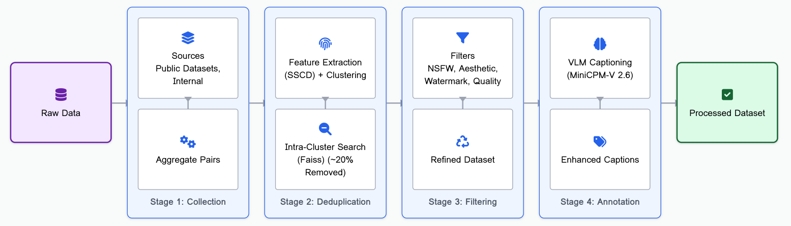
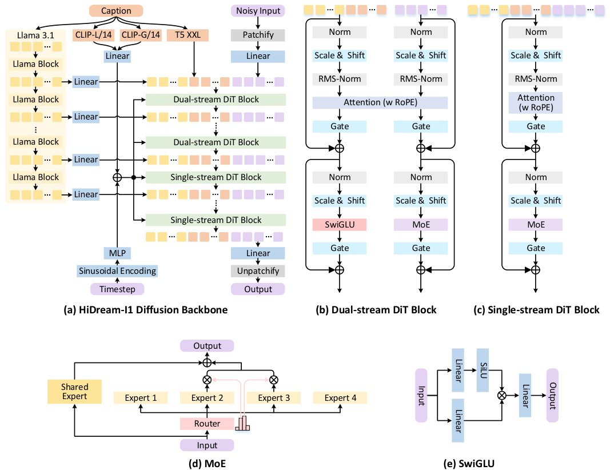
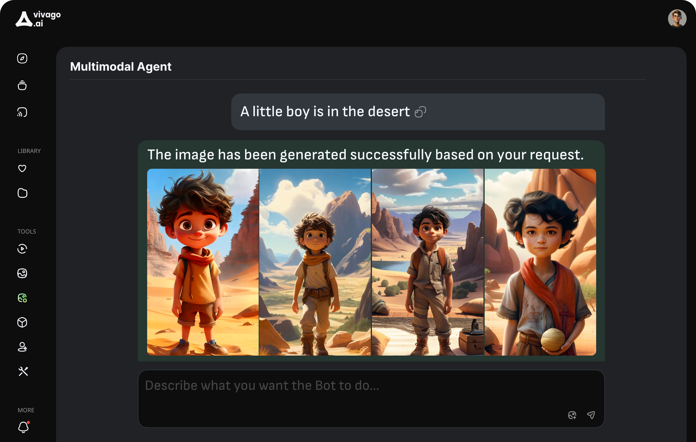
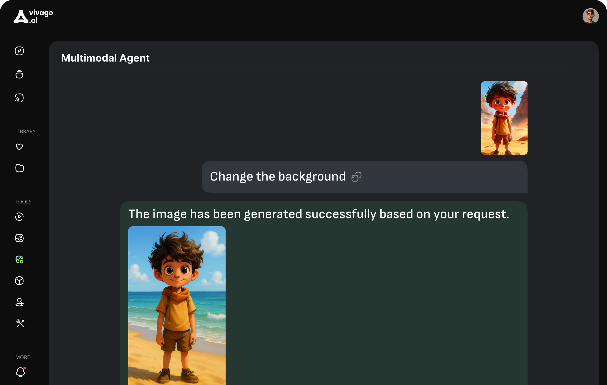

# HiDream-I1: 疎な Diffusion Transformer を備えた高効率な画像生成基盤モデル

> 原題: HiDream-I1: A High-Efficient Image Generative Foundation Model with Sparse Diffusion Transformer
> 著者: HiDream.ai（貢献者一覧は Appendix A。責任著者: Ting Yao, Tao Mei）
> 出典: arXiv:2505.22705

<figure>

<figcaption>図1: HiDream-I1 によって生成された画像。</figcaption>
</figure>

## Abstract（要旨）

画像生成基盤モデルにおける近年の進展は品質の向上を優先してきたが、しばしば計算複雑度と推論レイテンシの増大を代償としてきた。この決定的なトレードオフに対処するため、我々は HiDream-I1 を導入する。これは 170 億パラメータを持つ新しいオープンソースの画像生成基盤モデルであり、数秒以内に最先端の画像生成品質を達成する。HiDream-I1 は新しい疎な Diffusion Transformer（DiT）構造で構築されている。具体的には、動的な Mixture-of-Experts（MoE）アーキテクチャを備えた疎な DiT の二重ストリーム分離設計から始まり、そこでは 2 つの別々のエンコーダがまず画像トークンとテキストトークンを独立に処理する。その後、動的 MoE アーキテクチャを備えた単一ストリームの疎な DiT 構造が採用され、コスト効率のよい方法で画像生成のためのマルチモーダル相互作用を引き起こす。多様なモデル能力による柔軟なアクセシビリティを支えるため、我々は HiDream-I1 を 3 つの派生版で提供する：HiDream-I1-Full（50 ステップ以上のフル版）、HiDream-I1-Dev（ガイダンス蒸留版、28 ステップ）、HiDream-I1-Fast（最速版、わずか 14 ステップ）。さらに我々は、典型的な text-to-image 生成を超えて、追加の画像条件を用いて HiDream-I1 を作り替え、与えられた画像に対する精密な指示ベース編集を実行できるようにし、新しい指示ベース画像編集モデル HiDream-E1 を得た。最終的に、text-to-image 生成と指示ベース画像編集を統合することで、HiDream-I1 は完全に対話的な画像の作成と洗練が可能な包括的な画像エージェント（HiDream-A1）へと発展する。マルチモーダル AIGC 研究を加速するため、我々は HiDream-I1-Full、HiDream-I1-Dev、HiDream-I1-Fast、HiDream-E1 のすべてのコードとモデル重みを、プロジェクトサイト [https://github.com/HiDream-ai/HiDream-I1](https://github.com/HiDream-ai/HiDream-I1) および [https://github.com/HiDream-ai/HiDream-E1](https://github.com/HiDream-ai/HiDream-E1) を通じてオープンソース化した。すべての機能は [https://vivago.ai/studio](https://vivago.ai/studio) から直接体験できる。

## 1 Introduction（はじめに）

画像生成モデルにおける近年の進展は創造の風景を劇的に変容させ、Stable Diffusion、Midjourney、DALLE-3、Imagen といった先駆者が text-to-image 生成の限界を押し広げてきた。これらのモデルは視覚的忠実度と創造性の新しい基準を打ち立て、デジタルアート、エンターテインメント、デザイン、その他の分野にまたがる応用を活気づけている。その印象的な出力にもかかわらず、多くの最先端モデルは計算複雑度の増大と推論時間の長期化に苦しんでおり、リアルタイムかつコスト効率のよい展開を持続的な課題としている。

このギャップを埋めるため、我々は HiDream-I1 を提示する。これは 170 億パラメータを持つ新しいオープンソースの画像生成基盤モデルであり、数秒以内に最先端の画像品質を達成する。HiDream-I1 は新しい疎な Diffusion Transformer（DiT）構造の上に構築されており、まず二重ストリーム DiT アーキテクチャを用いて画像トークンとテキストトークンを別々に処理し、次に単一ストリーム DiT アーキテクチャを用いてマルチモーダル相互作用を可能にする。二重ストリームと単一ストリームのどちらの DiT アーキテクチャも、入力の特性に基づいてデータを専門化されたエキスパートモジュールへ動的にルーティングすることを狙いとする動的 Mixture-of-Experts（MoE）設計で作り替えられている。このようにして、疎な DiT 構造全体は計算効率と出力画像の生成品質の間で顕著なバランスを達成する。

ユーザーの要件が応用ごとに大きく異なることを踏まえ、我々は HiDream-I1 を 3 つの異なる派生版で提供する：1) HiDream-I1-Full：50 拡散ステップ以上のフルスケールモデルで、画像品質が最重要となるシナリオ向けに設計されている。2) HiDream-I1-Dev：28 拡散ステップで動作するよう最適化されたガイダンス蒸留版で、品質と計算需要のバランスがよく取れたトレードオフを提供する。3) HiDream-I1-Fast：わずか 14 拡散ステップを用いて数秒で高品質な画像生成を届ける最速版であり、リアルタイム応用に理想的である。

その堅牢な text-to-image 合成能力を超えて、HiDream-I1 は対話的な画像操作（すなわち指示ベース画像編集）の基礎を築く。我々はその機能を HiDream-E1 によって拡張する。これは追加の画像条件を統合し、ユーザーが自然言語コマンドを通じて精密な修正を行えるようにする指示ベース画像編集モデルである。この進歩は HiDream-I1 を、画像を生成するだけでなく反復的に編集もできる多用途な AIGC ツールへと変容させ、包括的な画像エージェント（HiDream-A1）の発展に結実する。この画像エージェントは完全に対話的な画像の作成と編集を促進し、生成 AI における次世代のユーザー体験の舞台を整える。

要約すると、HiDream-I1 の貢献は多面的である：

- 優れた費用対効果：疎な Diffusion Transformer アーキテクチャ。全体としての疎な DiT アーキテクチャは、疎な Mixture-of-Experts（MoE）技術を DiT フレームワーク内に洗練された形で統合している。異なるエキスパートモデルが様々な種類のテキスト入力を扱うことを学習でき、モデルがテキスト内容をより正確に理解し、多様なスタイルと被写体を持つ画像を生成できるようにする。より重要なことに、疎な DiT は計算オーバーヘッドを抑えつつモデル性能を高め、卓越した費用対効果を達成する。
- 強力な蒸留技術：GAN を用いた拡散モデル蒸留。生成的敵対学習を拡散モデル蒸留に組み込むことで、この手法は画像生成における細部の捕捉とエッジの鮮鋭化における GAN の能力を活用する——これは典型的な拡散モデル蒸留では犠牲にされがちなものである。したがってこのやり方は、拡散モデルを蒸留するだけでなく、生成画像の写実性と鮮明さをさらに高め、速度と品質の二重の最適化を達成する。
- 性能上の優位：人間の選好と意味的整合の両方における先導的なベンチマーク結果。現在、我々の HiDream-I1 は 3 つのベンチマークで最先端の性能を達成している。第一に、Human Preference Score v2.1（HPSv2.1）を計算することで意味的関連性・画像品質・美的品質を包括的に評価する HPS ベンチマークにおいて、HiDream-I1 は様々なスタイル（アニメーション、コンセプトアート、絵画、写真など）にわたって最良の性能を達成する。加えて、生成画像と入力テキストプロンプトの間の意味的関連性を評価する GenEval および DPG-Bench ベンチマークにおいても、HiDream-I1 は最上位の意味的関連性を達成し、強いプロンプト追従能力を実証している。
- 卓越した拡張性：画像生成からマルチモーダルエージェントへの発展。HiDream-I1 を土台として、我々は指示ベース画像編集モデル HiDream-E1 へと素早く拡張した。その後、text-to-image 生成と対話的な画像編集を組み合わせることで、HiDream-I1 と HiDream-E1 は GPT-4o の画像生成・編集に似た「言えばその通りになる」効果を達成する。さらに我々は新しい画像エージェント製品 HiDream-A1 を公開する。これは画像生成・理解・対話的編集を会話型の大規模モデルに統合したものである。HiDream-A1 の導入は、ユーザーがプラットフォームを切り替えたり複雑なパラメータを調整したりする必要をなくすというユーザー相互作用のアップグレードを表し、AIGC ツールを創作に使う際の障壁をさらに下げる。

<figure>

<figcaption>図2: データ前処理のパイプライン。</figcaption>
</figure>

## 2 Data Pre-processing（データ前処理）

大規模 text-to-image モデルの能力は、一般に学習データの品質・多様性・純粋な規模によって駆動される。そこで我々は、系統的なデータ収集、入念な重複除去、包括的で多面的なフィルタリング、詳細なアノテーションを含む厳密なデータキュレーション・パイプラインを実装した。全体のパイプラインを図 2 に示す。

### 2.1 Data Collection（データ収集）

我々のデータ収集戦略は幅広さと多様性の両方を目指した。我々はまず、Web 由来のデータセットと社内の著作権付き画像から引き出して、膨大な候補データのプールを集約した。Web 由来のデータについては、画像だけでなく付随するテキスト情報（タグ、説明文など）も収集した。この初期収集段階における重要な焦点は、多様な芸術スタイル・被写体・解像度・アスペクト比にまたがる幅広い視覚内容のスペクトルを意図的に捉えることであった。

### 2.2 Data Deduplication（データ重複除去）

学習効率を高め、モデルによる記憶（memorization）のリスクを緩和するため、我々は完全な重複と視覚的に類似した画像の両方を除去するよう設計された包括的な重複除去プロセスを実装した。データセットの規模を考えると、直接の全ペア比較は計算上不可能であった。そこで我々は効率的な 2 段階のアプローチを採用した：

1. 特徴抽出と近似クラスタリング。まず、最先端の SSCD モデルを用いて各画像に対して頑健な視覚特徴を抽出した。次に代表的な特徴部分集合（N = 200 万）に k-means クラスタリングを適用し、特徴空間全体を 16,000 個の異なるクラスタに分割して、潜在的に類似した画像をまとめてグループ化した。
2. クラスタ内重複除去。次に、各クラスタ内で GPU 加速された Faiss ライブラリを用いて厳密な類似度検索を実行した。特徴ベクトルが事前定義された類似度閾値を超える画像は準重複（near-duplicate）と同定され、その後データセットから除去された。

この 2 段階の重複除去戦略により、当初収集された画像の約 20% が除去され、データの冗長性が大幅に削減された。

### 2.3 Data Filtering（データフィルタリング）

生の画像収集物には、低品質・無関係、あるいはモデル学習と安全性にとって有害な内容がしばしば含まれる。これに対処するため、我々はデータセットを洗練するために一連のフィルタリング手順を適用した：

### 2.4 Data Annotation（データアノテーション）

次に、大規模に記述的なキャプションを生成するため、我々は MiniCPM-V 2.6 Vision-Language Model（VLM）を用いて各画像を自動的にアノテートした。生成されるキャプションの具体性と事実正確性を高めるため、VLM には画像内容と既存のメタデータ（ユーザータグや元の短い説明文など）の両方を入力コンテキストとして与えた。

特定の指示のもと、VLM は詳細で客観的な記述を引き出すことを目指す。これらの指示は、物体・属性・空間関係・芸術スタイルを含む主要な視覚的側面を捉えることを強調しつつ、幻覚（hallucination）を厳密に最小化し、時制と長さの制約に従うことを求める。なお、典型的なユーザープロンプトの多様性をよりよく反映するため、様々な長さのキャプションの生成を促す新しいプロンプティング戦略が活用されている。

<figure>

<figcaption>図3: HiDream-I1 モデルの全体フレームワーク。(a) HiDream-I1 の拡散バックボーン、(b) Dual-stream DiT ブロック、(c) Single-stream DiT ブロック、(d) MoE、(e) SwiGLU。</figcaption>
</figure>

## 3 Model Architecture: HiDream-I1（モデルアーキテクチャ）

HiDream-I1 は flow matching の原理の上に構築され、新しい疎な Diffusion Transformer（DiT）アーキテクチャを活用した大規模な画像生成基盤モデルである。Flow matching は、速度場（velocity field）をモデル化することによって、単純な事前分布（例：ガウスノイズ）から複雑なデータ分布（目標画像）への連続時間の変換を学習することを目指す。具体的には、我々はノイズサンプル $X_{0}\sim\mathcal{N}(0,\mathbf{I})$ と目標画像 $X_{1}$ の間のパスを定義する。ここで用いられる一般的な選択は、時刻 $t\in[0,1]$ に対する線形補間パス $X_{t}=(1-t)\cdot X_{0}+t\cdot X_{1}$ である。対応する定数の速度場は $V_{t}=X_{1}-X_{0}$ である。$\theta$ でパラメータ化された我々のモデルは、ノイズ付き画像 $X_{t}$、テキスト埋め込み $y$、タイムステップ $t$ を条件として、この速度場 $u(X_{t},y,t;\theta)$ を予測する。学習目的は、予測された速度と目標の速度の間の平均二乗誤差を最小化することである：

$$
\mathcal{L}_{\text{FM}}=\mathbb{E}_{t,X_{0},X_{1},y}\left[\|u(X_{t},y,t;\theta)-(X_{1}-X_{0})\|^{2}\right]
$$

図 3 に示された中核アーキテクチャは、2 つの主要モジュールから構成される：ハイブリッドなテキスト符号化モジュールと、疎な Mixture-of-Experts（MoE）を組み込んだ独自の DiT バックボーンである。SD3 や FLUX といった先行研究と同様に、HiDream-I1 は潜在空間上で動作する。

### 3.1 Hybrid Text Encoding（ハイブリッドなテキスト符号化）

テキストプロンプトを効果的な条件付け信号へ正確に翻訳する能力は、高忠実な text-to-image 合成にとって最重要である。異なるテキストエンコーダのアーキテクチャが相補的な強みを持つことを認識し、HiDream-I1 は 4 つの異なる情報源からの表現を統合するハイブリッド戦略を採用する：

1. Long-Context CLIP。我々は CLIP-L/14 と CLIP-G/14 の拡張コンテキスト版を利用する。これらは標準の CLIP モデルよりも長いトークン系列を処理できる。これらは頑健で大域的に意識された視覚的接地の埋め込みを提供し、おそらく単一のベクトル $h_{\text{clip}}\in\mathbb{R}^{d}$ にプールされ、adaptive layer normalization（adaLN）を介した大域的な条件付けに用いられる。
2. T5 エンコーダ。複雑なテキスト構造を解析することに長けているため T5-XXL エンコーダが組み込まれ、文脈的なトークン埋め込みの系列 $h_{\text{t5}}\in\mathbb{R}^{M\times d}$ を生成する。
3. デコーダのみの LLM。深い意味理解を捉えるため、我々は強力なデコーダのみの大規模言語モデル（Llama 3.1 8B Instruct）を活用する。決定的に重要な点として、特徴は LLM の複数の中間層から抽出され $h_{\text{llm}}\in\mathbb{R}^{L\times M\times d}$ となる（ここで $L$ は取り出す層の数、$M$ は系列長、$d$ は特徴次元数）。これにより、最終層の出力ではしばしば薄められてしまう細粒度の意味的詳細が保存される。

図 3 (a) に示されるように、T5 からの系列埋め込み（$h_{\text{t5}}$）と選択された LLM 中間層からの埋め込み（$h_{\text{llm}}$）は（例えば線形射影を介して）処理され、連結されて、DiT バックボーンに入力される主要なテキスト条件付け系列 $T\in\mathbb{R}^{N_{T}\times d}$ を形成する。この多元統合は、生成プロセスを導く豊かで包括的なテキスト表現を提供する。

### 3.2 Sparse Diffusion Transformer (DiT) Backbone（疎な Diffusion Transformer バックボーン）

HiDream-I1 は、パッチ化された潜在表現の上に新規の DiT アーキテクチャを採用する。それはモダリティごとの独立処理のための二重ストリーム構造から始まり、その後単一ストリームのアーキテクチャへ移行する。特筆すべきは、疎な Mixture-of-Experts（MoE）処理が最初の二重ストリーム段階と後の単一ストリーム段階の両方に統合されていることである。

#### Dual-stream DiT Blocks（二重ストリーム DiT ブロック）

DiT の最初のブロック群は、図 3 (b) に示すように、MMDiT に着想を得た二重ストリーム構造を採用する。潜在パッチトークン $I_{l}\in\mathbb{R}^{N_{I}\times d}$（パッチ化されたノイズ付き入力 $X_{t}$ から導出される）と、（ハイブリッドエンコーダからの）結合されたテキストトークン $T\in\mathbb{R}^{N_{T}\times d}$ は、これらのブロック内の並列な経路で処理される。これにより、注意機構での相互作用に先立って、各モダリティに特化した初期の特徴抽出が可能になる。

#### Single-stream DiT Blocks（単一ストリーム DiT ブロック）

一連の二重ストリーム DiT ブロック（$L_{dual}$）に続いて、アーキテクチャは単一ストリーム構成へ移行する。この時点で、最後の二重ストリーム層が出力した画像トークンとテキストトークン（$I_{L_{dual}},T_{L_{dual}}$）は系列次元に沿って連結される。以降のすべての Transformer ブロック（$l\geq L_{dual}$）は、この結合された系列の上で直接動作する。これらの単一ストリームブロックは、先行する二重ストリームブロックと同様に、そのフィードフォワード計算のために疎な Mixture-of-Experts 構造を組み込んでいる。

#### Sparse Mixture-of-Experts (MoE)（疎な Mixture-of-Experts）

HiDream-I1 における二重ストリームおよび単一ストリームの DiT ブロックは、図 3 (c, d) に詳述されるように、標準的な密なフィードフォワードネットワーク（FFN）の代わりに疎な Mixture-of-Experts（MoE）構造を用いる。各 MoE ブロック内では、ルーター（router）と呼ばれる軽量なゲーティングネットワークが、各入力トークンを選択された少数の専門化された FFN「エキスパート」の部分集合へ動的に導く。図 3 (d) に示されるように、これには指定された共有エキスパート（shared expert）へのルーティングも含まれる。個々のエキスパート FFN は SwiGLU を用いる（図 3 (e) に示す）。MoE による疎な活性化というこの戦略は、同等サイズの密なモデルと比べて計算効率を維持しながら、モデル容量の大幅な拡張を可能にする。

#### Conditioning and Stability（条件付けと安定性）

プールされた Long-CLIP 特徴（$h_{\text{clip}}$）からの大域的条件付けと正弦波タイムステップ埋め込みが、各 Transformer ブロックに注入される。これは adaptive layer normalization（adaLN）を介して達成され、トークンに適用されるスケールとシフトのパラメータを変調する（図 3 (b, c) の「Scale & Shift」層）。加えて、学習の安定性を高めるために自己注意機構内で QK 正規化（QK-normalization）が適用される。

## 4 Model Training Strategy（モデル学習戦略）

一般に、HiDream-I1 は多段階戦略で学習される。これはまず圧縮された潜在空間内で基礎的な生成能力を構築し、その後、品質・整合・ユーザー選好を高めてモデルを洗練する。このプロセスは Latent Flow Matching を活用し、2 つの主要フェーズから成る：多解像度事前学習と、それに続く事後的な整合チューニングである。

### 4.1 Pre-training Stage（事前学習段階）

事前学習フェーズの主目的は、潜在空間内でノイズから複雑な画像表現へのフローをモデル化するよう、疎な DiT バックボーン（3.2 節）を学習することである。

- 潜在空間での動作。我々はエンコーダ $\mathcal{E}$ とデコーダ $\mathcal{D}$ を持つ事前学習済み VAE を利用する。データ準備の際、すべての学習画像 $X_{1}$ はまず潜在表現 $Z_{1}=\mathcal{E}(X_{1})$ に符号化される。学習を加速するため、これらの潜在表現 $Z_{1}$ は事前計算して保存される。
- 段階的な解像度学習。学習は $256\times 256$ 解像度に収まる最大サイズにリサイズされた画像から導出される潜在コード $Z_{1}$ で始まる。学習は 600,000 ステップ実行される。バッチサイズは GPU あたり 24 である。元画像はリサイズ時にアスペクト比を維持する。続いて、モデル重みは $512\times 512$ 以内にリサイズされた画像からの潜在を用いて 200,000 ステップ（GPU あたりバッチサイズ 8）で学習を初期化し、最後の段階では $1{,}024\times 1{,}024$ 以内にリサイズされた画像からの潜在を用いて 200,000 ステップ（バッチサイズ：GPU あたり 2）学習する。
- 最適化。モデルは AdamW オプティマイザを用いて学習される。学習率を $0.0001$、線形ウォームアップを 1,000 ステップに設定し、必要に応じて減衰させる。学習を可能にするため、Fully Sharded Data Parallel（FSDP）、混合精度学習、勾配チェックポインティングが用いられる。

### 4.2 Post-Training Stage（事後学習段階）

我々はさらに、プロンプト忠実度・美的品質・選好整合を改善するために洗練段階を活用する。モデルは高品質な人手アノテーション付き画像-テキストペアの集合を用いて微調整される。このデータセットの画像はより高い美的品質と豊かな構造を含む。テキスト-画像の整合もまた人間のアノテータによって検証されている。モデルは学習率 0.00001、グローバルバッチサイズ 64 で 20,000 ステップ微調整される。

## 5 Inference Acceleration via GAN-powered Diffusion Model Distillation（GAN を用いた拡散モデル蒸留による推論加速）

完全に学習された HiDream-I1 モデル（HiDream-I1-Full と表記）の反復的な生成プロセスは、典型的にはおよそ 50 サンプリングステップを要し、リアルタイム応用を制限しうる。この問題を緩和するため、我々は知識蒸留技術を用いて、サンプリングステップ数を削減した大幅に高速な派生版を作る。具体的には、フルモデルを 2 つの加速版に蒸留する：28 ステップを狙う HiDream-I1-Dev と、16 ステップを狙う HiDream-I1-Fast である。

拡散モデル蒸留プロセスは、より少ないサンプリングステップで教師モデル（HiDream-I1-Full）の生成関数を近似するよう、生徒モデル（HiDream-I1-Dev と HiDream-I1-Fast）を学習する。我々は主要な蒸留目的関数（$\mathcal{L}_{\text{DMD}}$）として DMD を用いる。DMD は生徒モデルの予測する軌道分布を教師のそれと整合させることを狙い、より少ないステップ幅での安定した生成を可能にする。

加速されたモデルにおいて高い知覚品質と鮮鋭さを維持するため、我々は DMD 損失を敵対的学習目的（$\mathcal{L}_{\text{adv}}$）で補う。生徒モデル（生成器）は識別器ネットワークと並行して敵対的に学習される。この識別器は、生徒の生成した潜在から復号（$\mathcal{D}$）された画像の写実性を実画像と比較して評価する。識別器はその分類を引き起こすために、凍結された教師バックボーンによって抽出された多段階の特徴を利用する。この GAN を用いた蒸留の最終的な学習目的は、2 つの損失の重み付き和である：$\mathcal{L}_{\text{total}}=\mathcal{L}_{\text{DMD}}+\lambda_{\text{adv}}\mathcal{L}_{\text{adv}}$。

## 6 Extension for Image Editing: HiDream-E1（画像編集への拡張）

次に、我々の HiDream-I1 フレームワークを指示ベース画像編集に対応するよう拡張し、テキストの編集指示（$y$）に基づいてソース画像（$X_{S}$）への修正を可能にする方法を説明する。

元画像に視覚的に接地された編集を促進するため、我々は強い「文脈内（in-context）」の視覚的条件付けを提供するアプローチを活用する。微調整の際、ソース画像 $X_{S}$ と正解の目標画像 $X_{T}$（指示 $y$ を $X_{S}$ に適用して得られる結果）の両方が VAE 潜在空間へ符号化される（$Z_{S},Z_{T}$）。これらの潜在マップは空間的に横並び（side-by-side）に連結される。モデルはその後、ソース潜在 $Z_{S}$（視覚的文脈）と編集指示 $y$ に同時に条件付けられて目標潜在 $Z_{T}$ を生成するよう、latent flow matching を用いて学習される。

指示によって規定される関連する修正に学習を集中させるよう促すため、我々は空間的に重み付けされた損失関数（$\mathcal{L}_{\text{Edit-Weighted}}$）を用いる。この損失の定式化は、目標 $Z_{T}$ がソース $Z_{S}$ と大きく異なる潜在空間領域で計算される誤差に、より大きな重要度（高い重み）を割り当てる。これにより、ソース画像が提供する変化のない視覚的文脈の保存を助けつつ、編集された領域の正確な生成が優先される。

指示ベース画像編集モデル（HiDream-E1 と呼ぶ）は、事前学習済みの HiDream-I1 モデルを 500 万件の（ソース画像、編集指示、目標画像）三つ組から成る大規模データセット上で微調整することにより学習された。推論時には、ユーザーがソース画像と編集指示を与えると、学習された文脈内編集のスキルを活用してモデルが適切に修正された画像を生成できる。

<figure>

<figcaption>図4 (a): 画像エージェントを介した text-to-image 生成。</figcaption>
</figure>

<figure>

<figcaption>図4 (b): 画像エージェントを介した指示ベース画像編集。</figcaption>
</figure>

## 7 Extension for Image Agent: HiDream-A1（画像エージェントへの拡張）

ここでは、vivago.ai 上の我々の新しい画像エージェント（HiDream-A1 と呼ぶ）をさらに紹介する。これは text-to-image 生成・画像編集・対話的理解を会話型 AI インターフェース内でシームレスに統合するよう設計された、統一的なマルチモーダル・エージェントシステムである。これによりユーザーは自然言語対話を用いて複雑な視覚コンテンツの作成と操作を行える。図 4 は我々の画像エージェントのインターフェースと、このエージェントによって実行される text-to-image 生成と指示ベース画像編集のタスクの 2 例を示している。具体的には、画像エージェントのプロセスはユーザー入力から始まり、自然言語と視覚的入力の両方をサポートする。この入力はその後、ワークフロー全体を管理する中心的なハブである Coordinator モジュールによって受け取られる。Coordinator は、タスクが Generation（画像の生成／編集）に関わるか Chat（会話的な相互作用）に関わるかを判定する。タスクが Generation であれば、Planner モジュールが働き、ユーザーの要求を満たすために必要な手順を戦略立てる。例えば、具体的なタスクに応じて、Planner は text-to-image 生成と指示ベース画像編集をそれぞれ行うために画像生成器（HiDream-I1）または画像編集器（HiDream-E1）を利用しうる。タスクが Chat であれば、エージェントはユーザーとの会話的なやりとりに従事する。

**表1**: DPG-Bench における評価結果。スコアはプロンプト整合の正解率（%）を表す。高いほど良い。

| Model | Overall | Global | Entity | Attribute | Relation | Other |
| --- | --- | --- | --- | --- | --- | --- |
| PixArt-alpha | 71.11 | 74.97 | 79.32 | 78.60 | 82.57 | 76.96 |
| SDXL | 74.65 | 83.27 | 82.43 | 80.91 | 86.76 | 80.41 |
| DALL-E 3 | 83.50 | 90.97 | 89.61 | 88.39 | 90.58 | 89.83 |
| FLUX.1-dev | 83.79 | 85.80 | 86.79 | 89.98 | 90.04 | 89.90 |
| SD3-Medium | 84.08 | 87.90 | 91.01 | 88.83 | 80.70 | 88.68 |
| Janus-Pro-7B | 84.19 | 86.90 | 88.90 | 89.40 | 89.32 | 89.48 |
| CogView4-6B | 85.13 | 83.85 | 90.35 | 91.17 | 91.14 | 87.29 |
| HiDream-I1 | 85.89 | 76.44 | 90.22 | 89.48 | 93.74 | 91.83 |

## 8 Evaluation（評価）

我々の HiDream-I1 と HiDream-E1 の生成能力を包括的に評価するため、我々は最先端の text-to-image 生成モデルおよび指示ベース画像編集モデルとの広範な比較評価を実施した。HiDream-I1 の text-to-image 生成性能を測定するために、我々はいくつかの典型的なベンチマークを 2 つの側面で用いた：1) 複雑な指示を正確に理解し実行するモデルの能力を反映するプロンプト追従性（prompt adherence）、2) 予測された人間の選好に基づく生成画像の視覚的魅力を反映する人間選好（human preference）。指示ベース画像編集モデル HiDream-E1 については、指示に従った編集の正確さと、編集対象でない画像領域の保存の両方を評価する。

### 8.1 Prompt Adherence Evaluation of HiDream-I1（HiDream-I1 のプロンプト追従性評価）

ここでは、複雑なプロンプトを正確に解釈し、正しい物体数・属性・関係・位置を伴う画像を合成する text-to-image モデルの能力を評価する。2 つのベンチマークを採用する：様々な言語的側面にわたるプロンプト追従の細粒度な評価を提供する DPG-Bench と、困難な構成的生成タスクを特に対象とする GenEval である。

表 1 は DPG-Bench における性能比較を示す。全般に、HiDream-I1 は最高の総合スコア（85.89）を達成し、既存の最先端モデルに対して優れた一般的プロンプト追従能力を示している。具体的には、HiDream-I1 は複雑な関係の解釈（Relation: 93.74）とその他の詳細な指示（Other: 91.83）において特に強みを示し、それと並んで競争力のあるエンティティおよび属性の生成能力を示している。

GenEval ベンチマーク（表 2）においても、HiDream-I1 は再び総合指標で 1 位（0.83）となった。ほとんどの構成的タスクで優れており、最良の単一物体正解率（1.00）、2 物体正解率（0.98）を達成し、計数（0.79）・色生成（0.91）・色属性（0.72）で最先端の結果を得ている。GenEval における強い性能は、複数の相互作用する要素と精密な属性を伴うシーンを正確に描き出すという、このモデルの高度な構成的合成能力を際立たせている。

**表2**: GenEval における評価結果。スコアは正解率（%）を表す。高いほど良い。

| Model | Overall | Single Obj. | Two Obj. | Counting | Colors | Position | Color Attr. |
| --- | --- | --- | --- | --- | --- | --- | --- |
| PixArt-alpha | 0.48 | 0.98 | 0.50 | 0.44 | 0.80 | 0.08 | 0.07 |
| SDXL | 0.55 | 0.98 | 0.74 | 0.39 | 0.85 | 0.15 | 0.23 |
| FLUX.1-dev | 0.66 | 0.98 | 0.79 | 0.73 | 0.77 | 0.22 | 0.45 |
| DALL-E 3 | 0.67 | 0.96 | 0.87 | 0.47 | 0.83 | 0.43 | 0.45 |
| CogView4-6B | 0.73 | 0.99 | 0.86 | 0.66 | 0.79 | 0.48 | 0.58 |
| SD3-Medium | 0.74 | 0.99 | 0.94 | 0.72 | 0.89 | 0.33 | 0.60 |
| Janus-Pro-7B | 0.80 | 0.99 | 0.89 | 0.59 | 0.90 | 0.79 | 0.66 |
| HiDream-I1 | 0.83 | 1.00 | 0.98 | 0.79 | 0.91 | 0.60 | 0.72 |

**表3**: HPSv2.1 ベンチマークにおける評価結果。スコアは予測された人間の選好を表す。高いほど良い。

| Model | Averaged | Animation | Concept Art | Painting | Photo |
| --- | --- | --- | --- | --- | --- |
| Stable Diffusion v2.0 | 26.38 | 27.09 | 26.02 | 25.68 | 26.73 |
| Midjourney V6 | 30.29 | 32.02 | 30.29 | 29.74 | 29.10 |
| SDXL | 30.64 | 32.84 | 31.36 | 30.86 | 27.48 |
| DALL-E 3 | 31.44 | 32.39 | 31.09 | 31.18 | 31.09 |
| SD3 | 31.53 | 32.60 | 31.82 | 32.06 | 29.62 |
| Midjourney V5 | 32.33 | 34.05 | 32.47 | 32.24 | 30.56 |
| CogView4-6B | 32.31 | 33.23 | 32.60 | 32.89 | 30.52 |
| FLUX.1-dev | 32.47 | 33.87 | 32.27 | 32.62 | 31.11 |
| Stable Cascade | 32.95 | 34.58 | 33.13 | 33.29 | 30.78 |
| HiDream-I1 | 33.82 | 35.05 | 33.74 | 33.88 | 32.61 |

### 8.2 Human Preference Evaluation of HiDream-I1（HiDream-I1 の人間選好評価）

さらに我々は、Human Preference Score v2.1（HPSv2.1）ベンチマークを用いて視覚的魅力を評価する。このベンチマークは、様々な画像スタイルにわたる画像品質についての人間の判断を予測するよう学習されたモデルを用いる。スコアが高いほど人間の選好とよく整合していることを示す。

表 3 に示すように、HiDream-I1 は最先端の人間選好を示し、評価されたすべてのモデルの中で最高の平均 HPSv2.1 スコア（33.82）を達成している。多様なスタイルにわたって強力な競合を一貫して上回り、すべての個別カテゴリで 1 位となった：アニメーション（35.05）、コンセプトアート（33.74）、絵画（33.88）、写真（32.61）。これは、様々な視覚領域にわたって人間の選好とよく整合する画像を生成する頑健な能力を示している。

### 8.3 Evaluation of HiDream-E1（HiDream-E1 の評価）

本節では、EmuEdit および ReasonEdit ベンチマーク上で HiDream-E1 の指示ベース編集能力を評価した。EmuEdit は 10 種類の多様な編集タスク型にわたる 3,589 サンプルで広範な評価を提供し、ReasonEdit は 197 個の困難なサンプルで複雑な指示を特に対象とする。定量的評価のため、我々は GPT-4o を用いた自動評価プロトコルを採用した。具体的には、ソース画像・テキスト指示・編集結果画像が与えられたとき、GPT-4o は 2 つの側面を 0〜10 のスケールで採点した（高いほど良い）：(1) 編集指示の実行の成功、(2) 過剰編集（意図しない修正）の不在。サンプルごとの最終スコアはこれら 2 つの評点の最小値であり、それによって編集の正確さと変化させるべきでない領域の保存の両方を強調する。我々は HiDream-E1 を、最近のオープンソースの競合手法である MagicBrush・UltraEdit・OmniGen、およびクローズドソースのモデル Gemini-2.0-Flash と比較した。

表 4 に示すように、HiDream-E1 は EmuEdit ベンチマークで最高の総合平均スコア（6.40）を達成し、困難な ReasonEdit ベンチマークでも首位のスコア（7.54）を確保している。これらの結果は基本的に、推論能力を要する複雑な指示を扱う上での熟達を実証している。EmuEdit のサブタスクをさらに分析すると具体的な強みが明らかになり、HiDream-E1 は大半のカテゴリで最高スコアを達成している：大域編集（5.32）、テキスト操作（6.45）、色調整（7.57）、スタイル転送（6.49）、物体除去（5.99）、局所編集（6.35）。物体追加（6.98）と背景操作（5.01）でも非常に競争力のある性能を示している。これらの結果は、幅広いタスクにわたる精密で信頼できる指示ベース画像編集における HiDream-E1 の有効性を改めて裏付けている。

**表4**: EmuEdit および ReasonEdit ベンチマークにおける評価結果。高いほど良い。

| Model | Global | Add | Text | BG | Color | Style | Remove | Local | Average (EmuEdit) | ReasonEdit |
| --- | --- | --- | --- | --- | --- | --- | --- | --- | --- | --- |
| MagicBrush | 4.06 | 3.54 | 0.55 | 3.26 | 3.83 | 2.07 | 2.70 | 3.28 | 2.81 | 1.75 |
| UltraEdit | 5.31 | 5.19 | 1.50 | 4.33 | 4.50 | 5.71 | 2.63 | 4.58 | 4.07 | 2.89 |
| OmniGen | 1.37 | 2.09 | 2.31 | 0.66 | 4.26 | 2.36 | 4.73 | 2.10 | 2.67 | 7.36 |
| Gemini-2.0-Flash | 4.87 | 7.71 | 6.30 | 5.10 | 7.30 | 3.33 | 5.94 | 6.29 | 5.99 | 6.95 |
| HiDream-E1 | 5.32 | 6.98 | 6.45 | 5.01 | 7.57 | 6.49 | 5.99 | 6.35 | 6.40 | 7.54 |

## 9 Conclusion（結論）

本レポートでは、最先端の品質と卓越した効率性を両立させる強力なオープンソース画像生成基盤モデル HiDream-I1 を紹介した。HiDream-I1 は新しい疎な Diffusion Transformer 構造を活用し、数秒以内に高忠実な画像合成を届ける。我々は HiDream-I1 の 3 つの派生版（すなわち HiDream-I1-Full、HiDream-I1-Dev、HiDream-I1-Fast）を公開しており、これらはハイエンドの創作ワークフローからリアルタイム応用まで、様々な利用ケースにわたるスケーラブルな展開を支える。3 つのベンチマーク（GenEval、DPG-Bench、HPSv2.1）上で実施した実験は、最先端の手法に対する我々の HiDream-I1 の優位性を検証している。

その中核となる text-to-image 能力を超えて、HiDream-I1 はその拡張を通じてより広い視覚知能システムへと発展する：精密な指示ベース画像編集を可能にする HiDream-E1 と、生成・編集・視覚的理解を自然言語インターフェース内で統一する対話的な画像エージェント HiDream-Agent である。これらの構成要素は共に、対話的な視覚コンテンツ創作のための包括的でマルチモーダルなフレームワークを形成する。
