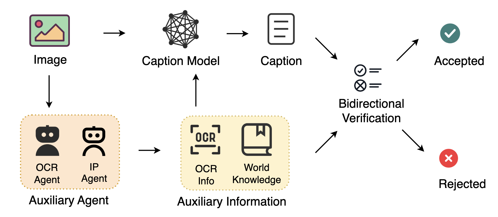
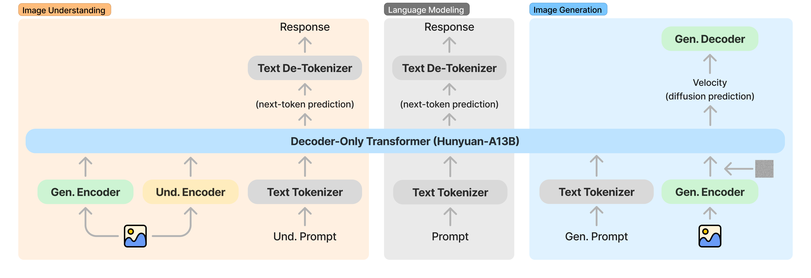
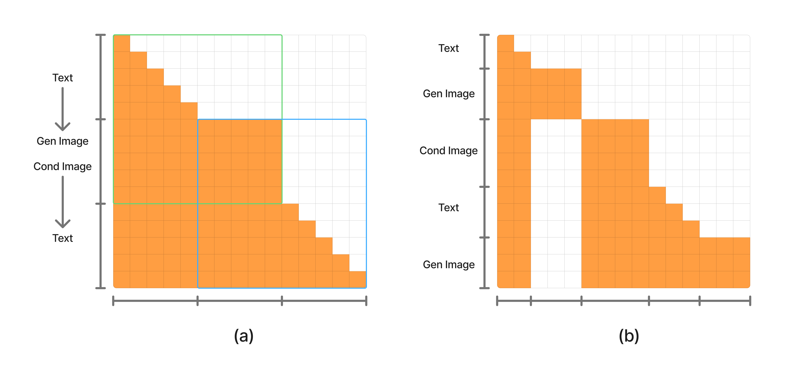
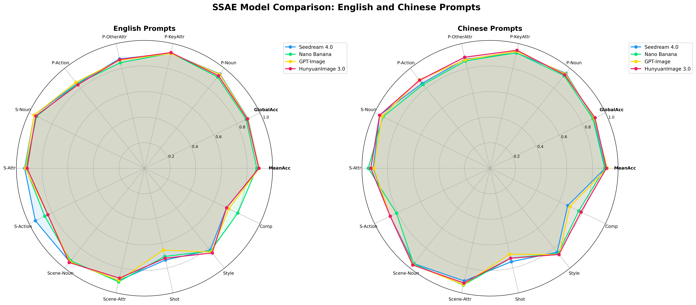
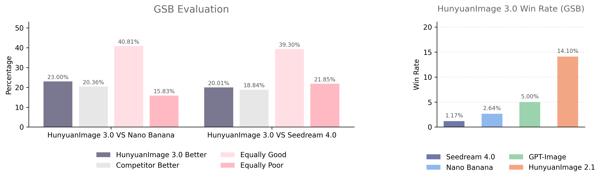

# HunyuanImage 3.0 テクニカルレポート

> 原題: HunyuanImage 3.0 Technical Report
> 著者: Tencent Hunyuan Foundation Model Team（貢献者一覧は §7）
> 出典: arXiv:2509.23951

## Abstract（要旨）

我々は HunyuanImage 3.0 を提示する。これは自己回帰の枠組みの内部でマルチモーダルな理解と生成を統一するネイティブなマルチモーダルモデルであり、その画像生成モジュールが公開されている。HunyuanImage 3.0 の達成は、綿密なデータキュレーション、先進的なアーキテクチャ設計、ネイティブな Chain-of-Thoughts スキーマ、段階的なモデルの事前学習、積極的なモデルの事後学習、そして大規模な学習と推論を可能にする効率的なインフラといった、いくつかの主要な構成要素に依拠している。これらの進展により、我々は総計 800 億を超えるパラメータを持ち、推論時にはトークンあたり 130 億パラメータが活性化される Mixture-of-Experts（MoE）モデルの学習に成功した。これは現時点で最大かつ最も強力なオープンソースの画像生成モデルである。我々は広範な実験を実施し、テキスト-画像の整合と視覚品質についての自動評価と人間評価の結果は、HunyuanImage 3.0 が従来の最先端モデルに匹敵することを実証している。HunyuanImage 3.0 のコードと重みを公開することにより、我々はコミュニティが最先端の基盤モデルを用いて新しいアイデアを探求できるようにし、動的で活気あるマルチモーダルのエコシステムを育むことを目指す。すべてのオープンソースの資産は [こちら](https://github.com/Tencent-Hunyuan/HunyuanImage-3.0) で公開されている。

<figure>

<figcaption>図1: HunyuanImage 3.0 による多アスペクト比の text-to-image サンプル。強力なプロンプト追従・推論・概念の汎化・テキストレンダリングの能力を実証している。</figcaption>
</figure>

## 1 Introduction（はじめに）

近年、画像生成モデルは目覚ましい進展を達成し、自然言語の記述と参照画像から写実的で多様な画像を生成できるようになった。深層学習のアーキテクチャ、とりわけ拡散モデルと transformer ベースの枠組みにおける進歩は、画像の忠実度と入力テキストとの意味的整合を大きく改善した。Seedream 4.0、Nano Banana、GPT-Image、Qwen-Image、HunyuanImage 2.1 といった主要なモデルは、複雑な場面や芸術的様式を合成し、あるいは画像を正確に編集する能力を実証しており、研究と産業の双方で幅広い注目を集めている。しかしながら、これら最先端のシステムは大半がクローズドソースであり、より広い研究コミュニティにとっての透明性と再現性を制限している。

このため我々は HunyuanImage 3.0 を提示する。これは主要なクローズドソースモデルに匹敵する、あるいはそれを上回る画像生成性能を達成するオープンソースのモデルである。HunyuanImage 3.0 は我々が社内で開発したネイティブなマルチモーダルモデルに由来し、現時点では微調整と事後学習を画像生成のみに絞って行っている。我々は基盤モデルとして、総計 800 億を超えるパラメータを持ち推論時にトークンあたり 130 億が活性化される、事前学習済みの Mixture-of-Experts（MoE）大規模言語モデル（LLM）**Hunyuan-A13B** を用いる。この選択は、高いモデル容量と計算効率の双方への要求を調停する。画像の理解と生成のために LLM を視覚入力を扱えるよう拡張するにあたり、我々はそれを事前学習済みの視覚エンコーダと VAE で増強する。それぞれには、抽出された画像特徴を LLM の単語埋め込みと互換な結合埋め込み空間へ変換する射影層が備えられている。画像理解については、LLM は視覚エンコーダと VAE から抽出された結合画像特徴を条件として自己回帰的な次トークン予測を行い、適切な応答を生成する。画像生成については、VAE の画像特徴に対する拡散ベースの画像モデリングが、Transfusion や JanusFlow と同じ方式で LLM に組み込まれる。さらに、LLM ベースの枠組みにより Chain-of-Thought の学習と推論を組み込むことが可能になり、それによって画像理解と生成の両タスクの性能が改善される。事前学習済みモデルを画像生成タスクのみで微調整・事後学習した後、我々は HunyuanImage 3.0 の画像生成モジュールを確立する。これは現時点で最大かつ最も強力なオープンソースの画像生成モデルである。我々は自動評価と人間評価の双方で広範な実験を実施し、テキスト-画像の整合と視覚品質の結果は、HunyuanImage 3.0 が Seedream 4.0、Nano Banana、GPT-Image、HunyuanImage 2.1 を含む従来の最先端モデルに匹敵することを実証している。HunyuanImage 3.0 のコードと重みを公開することにより、我々はコミュニティが最先端の基盤モデルを用いて新しいアイデアを探求できるようにし、動的で活気ある画像生成のエコシステムを育むことを目指す。

本レポートの構成は以下の通りである。2 節ではフィルタリングとキャプションモデルを含むデータ準備の技術を紹介する。3 節では HunyuanImage 3.0 のアーキテクチャとアルゴリズムについての詳細な情報を提示する。4 節では我々の学習戦略とアルゴリズムを論じる。5 節では HunyuanImage 3.0 の性能を評価し、最先端の text-to-image 生成モデルと比較する。

## 2 Data Preparation（データ準備）

### 2.1 Data Filtering（データフィルタリング）

多様で高品質な画像データセットを構築するため、我々は 100 億枚を超える生の画像の初期プールに対して包括的な 3 段階のフィルタリングのプロセスを実装した。最終的に初期データの **45% 未満**を保持したこの厳密なプロセスは、頑健な生成モデルを学習するために不可欠な要件である意味的多様性と画像品質の双方を優先するよう設計された。

第 1 段階では、技術的な欠陥に対処し、低解像度（512 ピクセル未満）・壊れたファイル・露出過多／露出不足・彩度過多の画像を除去した。また MD5 値に従って画像の重複除去も行った。

第 2 段階は我々の主要なデータキュレーションのプロセスとして機能し、2 種類の作用素を用いた：**客観フィルタ**と**主観スコアリング作用素**である。客観フィルタは、透かし・ロゴ・大量のテキスト（hy-OCR モデルを通じて）・コラージュ・目立つ枠線・AI 生成コンテンツ（AIGC）に対する学習ベースの検出器であった。膨大なデータを扱う際に精度を保つため、これらの検出器は層化サンプリングによって作られた均衡の取れた学習データセットを用いて学習された。**AIGC 画像の増殖は、自然なデータ分布を歪めモデルの収束を妨げるという重大な課題を突きつける**。我々の緩和戦略は、自動的な AIGC 検出モデルと、**AI 生成コンテンツの比率が高いと判明したデータソースからの画像をすべて除去する**ことを組み合わせたものであった。

我々の主観スコアリング作用素には、画像の鮮明さと美しさのモデルが含まれた。鮮明さのモデルは、画像のシャープさ・ノイズ水準・ダイナミックレンジに基づく全体的なスコアを提供した。一貫性があり解釈可能な美的スコアを確保するため、**我々のアーティストは、色・光と影・構図という 3 つの基本要素を考慮した基準を体系的に設計した**。この基準に基づいて我々は自前の美的モデルを構築した。我々はすべての種別にわたって不適格な画像を除外するために統一された閾値を適用しつつ、後の学習段階のためのデータを選ぶ際には特定のジャンルごとに異なる閾値を用いた。

最終段階では、埋め込みのクラスタリング結果に基づいてデータをさらに重複除去し、これによりデータの約 0.5% が除去されて、我々のデータセットはより凝縮されたものとなった。意味的な広がりを高めるため、我々はフィルタリング済みの集合を、知識で増強されたもの・テキスト関連・様式化・グラフィックデザインのコレクションを含む専門的なデータセットで戦略的に補った。この綿密なパイプラインの結果、先進的な生成モデルを学習するための、およそ **50 億枚**の画像から成るクリーンで高品質かつ多様なデータセットが形成された。単一画像のコーパスを超えて、我々は**インターリーブの関係を学習するために特別に設計された 1 億件を超える画像ペアとマルチ画像サンプル**の専門的なデータセットも構築した。画像ペアの部分集合は 2 つの主要なアプローチによって導出された：画像クラスタリングと動画セグメントの採掘である。

画像クラスタリングのアプローチについては、20 億を超える画像クラスタの分析に従い、潜在的な類似性を示す代表的なクラスタからペアを選択的に抽出した。これらのペアは次に画像関係の判別作用素を通され、**有意な編集関係を持つものだけ**が保持された。モデルの学習効果を最適化するため、構成要素が過度に複雑と判断された画像を除外する画像複雑度モデルが適用された。

動画データの採掘のパイプラインは、統一された場面に対応する動画セグメントを切り出すためのショット境界検出から始まった。続いてカメラ動作の分類作用素を用いて、過度なカメラ変換を示すクリップを除外した。さらに物体検出と意味的セグメンテーションの結果を統合して選択を精錬し、標準的な変換関係を示すキーフレームを切り出した。最後に、モーションブラーがモデル学習に及ぼす有害な影響を緩和するため、選択されたフレームはモーションブラー検出作用素に基づく追加のフィルタリングを受けた。結果として得られるマルチ画像データは、インターネットから収集されたインターリーブデータ（画像-テキスト系列）と、動画から抽出されたフレームで構成される。

### 2.2 Image Captioning（画像キャプション）

豊かで制御可能かつ事実に接地された画像記述を生成するため、我々は 3 つの中核構成要素の上に構築された新しいパイプラインを提案する：(1) 構造化された画像記述のための**階層的スキーマ**、(2) 多様なデータ増強のための**構成的合成戦略**、(3) 事実への接地のための**専門エージェント**である。図 2 に示す。

**二言語かつ階層的なキャプションスキーマ。** 我々のアプローチの基礎は、画像の内容を複数の明確に定義された意味的フィールドへ分解する、二言語（英語／中国語）かつ階層的なキャプションスキーマである。この構造化された表現は以下を含む。

- **記述的水準（短〜超長）**：簡潔な要約から、前景と背景のすべての要素の網羅的な描写まで、4 段階の叙述の詳細さ。
- **様式的属性**：画像の芸術的様式・撮影のショット種別・照明・支配的な雰囲気・構図を捉えるフィールド。
- **事実的エンティティ**：固有名（IP）のための専用フィールドで、特定のキャラクター・ランドマーク・ブランド・芸術作品を識別する。

この階層的スキーマは生成プロセスの細粒度の制御を可能にするだけでなく、我々のデータ合成エンジンの構造的な基盤としても機能する。

**データの多様性のための構成的キャプション合成。** モデルの汎化を高め過学習を緩和するため、我々は階層的スキーマを活用した動的なデータ増強の戦略である**構成的キャプション合成**を導入する。学習の際、我々は異なるフィールドを戦略的にサンプリングし組み合わせて、長さとパターンの双方が異なるキャプションを生成する。二言語（英語／中国語）の出力を約 30 語から最大 1,000 語まで支える。

<figure>

<figcaption>図2: 画像キャプションのパイプライン。</figcaption>
</figure>

**専門エージェントと双方向検証による事実への接地。** 画像内の密なテキストや世界知識を要するエンティティの認識における標準的な Visual Language Model（VLM）の限界を克服するため、我々は記述を検証可能な現実に接地させる 2 つの専門エージェントを統合する。**OCR エージェント**が画像内のテキストを抽出し、**固有名（IP）エージェント**が実世界のエンティティを識別する。この外部知識はキャプションモデルへの補助的な入力として与えられる。決定的に重要な点として、我々はエージェントが検出したエンティティと生成されたキャプションを相互参照する**双方向検証ループ**を確立する。これに従い、双方向検証を通過したサンプルだけが最終的な学習データセットに含められる。

**画像差分キャプション。** 加えて、ペアの画像データについては、我々は画像差分キャプションモデルを開発した。このモデルは画像の対・それらのキャプション・対応する 2 フレームの動画を入力として受け取り、前景と背景における変化を詳述するキャプションを生成し、ユーザーが入力する編集指示を模擬する役割を果たす。文脈情報は、モデルがより正確で詳細な差分の記述を生成できるようにするために重要である。

### 2.3 Reasoning Dataset Construction（推論データセットの構築）

我々のモデルは強力でネイティブにマルチモーダルなアーキテクチャであり、頑健な推論と意味理解の能力を備えている。我々の研究の主要な貢献は、**画像生成のための自動化された Chain-of-Thought（CoT）推論プロセスの引き出し**であり、これは小規模で専門的なデータセットでの微調整によって活性化される。このプロセスにより、モデルは完全なパイプラインを自律的に実行できるようになる：最初の入力プロンプトの解釈から、概念の精錬と書き換えという中間的な「思考」の局面を経て、最終的に目標画像を合成するまでである。この潜在的な能力を効果的に解き放つため、我々は 2 種類の学習データを構築した：(1) 論理的推論を強化する **Text-to-Text（T2T）** の推論データ、(2) 抽象的な概念からその視覚的な顕現までのワークフロー全体を明示的にモデル化する **Text-to-Text-to-Image（T2TI）** の推論データである。この学習戦略は、高水準のユーザーの意図から高忠実な視覚的出力への、シームレスで自動化された一貫性のある翻訳をモデルが達成できるようにする。

**Text to Text。** モデルの指示追従と論理的推論の能力を高めるため、我々は実世界の画像生成プロンプトから成る多様なテキストコーパスをキュレートした。このコーパスは写実的なレンダリング、芸術的・様式的なレンダリング、UI とポスターのデザインタスク、知識駆動のクエリ、そして科学的・技術的な可視化にまたがる。幅広いユーザーの意図・領域・複雑さの水準をカバーすることにより、T2T データで学習したモデルは、微妙な要件を解析し、曖昧さを解消し、指示を精密な画像キャプションへ忠実に写像する一貫した段階的なテキストの推論を生成できる。

**Text to Text&Image。** エンドツーエンドのテキスト推論と視覚的忠実度を改善するため、我々は高品質でクラス均衡の取れた画像データセットである T2TI コーパスを開発した。画像は美的指標を用いて事前学習データセットから絞り込まれ、元の短いキャプションと長いキャプションと対応づけられた。我々はまた Wikipedia からのインフォグラフィックのコレクションも編纂した。各画像について、目標を精錬しユーザーの意図を詳細な視覚的仕様へ翻訳する、対応する推論の痕跡をアノテートする。これらの画像とそのキャプション・推論の痕跡が、モデルの CoT による画像生成の能力を改善するために用いられる。

## 3 Model Design（モデル設計）

### 3.1 Native Multimodal Model（ネイティブなマルチモーダルモデル）

我々は、テキストと画像のモダリティにわたる統一された理解と生成のために設計されたネイティブなマルチモーダルモデルを提示する。図 3 に示すように、提案するアーキテクチャは**ハイブリッドな離散-連続のモデリング戦略**を採用する：**テキストトークンは自己回帰的な次トークン予測によってモデル化され、画像トークンは拡散ベースの予測の枠組みを通じてモデル化される**。HunyuanImage 3.0 と名づけられたこのシステムは、統一的なマルチモーダルモデリングを達成するため、言語モデリング・画像理解・画像生成を一貫した枠組みの中にまとめ上げる。

<figure>

<figcaption>図3: HunyuanImage 3.0 の図解。</figcaption>
</figure>

#### 3.1.1 Architecture（アーキテクチャ）

##### バックボーン。

モデルのバックボーンは、総計 800 億を超えるパラメータを持つ decoder-only の LLM である **Hunyuan-A13B** の上に構築されている。それは **64 個のエキスパートから成り、トークンあたり 8 個のエキスパートが活性化される** MoE 構成を採用し、加えて 1 個の共有多層パーセプトロン（MLP）を伴う。この設計により、トークンあたりの活性化パラメータは約 130 億となり、表現能力と計算効率が均衡する。

##### テキストトークナイザ。

テキスト入力については、我々は Hunyuan Tokenizer を用い、画像の生成と理解のタスクを支えるために調整された一連のカスタム特殊トークンで語彙を拡張する。

##### 画像エンコーダ。

画像生成の経路では、我々は生のピクセル値を**ダウンサンプリング係数 16 で 32 次元の潜在空間**へ射影する内製の VAE を用いる。DiT 系のアーキテクチャにおける従来のアプローチは、典型的に **8 倍ダウンサンプリングの VAE と、空間解像度をさらに 2 倍縮小する追加のパッチ化層**を組み合わせていた。対照的に我々は、**16 倍ダウンサンプリングの単一の VAE の方が、より単純かつ効果的な代替となり、優れた画像生成品質をもたらす**ことを実証する。

条件となる画像入力については、我々は VAE からの潜在特徴と視覚エンコーダからの潜在特徴を連結する**二重エンコーダ戦略**を導入する。このアプローチは、単一の系列の内部で生成と理解の双方を支える統一的なマルチモーダル表現を可能にする——これは、しばしば視覚特徴をタスクごとに分離していた（例：理解には視覚エンコーダの特徴を、生成には VAE の特徴を用いる）従来の統一モデルとの主要な相違点である。我々の手法は、インターリーブされたテキスト対話・画像生成・画像理解・画像編集といった複雑なマルチモーダルの相互作用を連続的な文脈の内部で促進し、それによって理解と生成の別々のパイプラインを切り替える必要をなくす。

##### プロジェクタ。

我々は、二重の画像エンコーダからの特徴を transformer の潜在空間へ整合させるために、2 つの異なるプロジェクタのモジュールを設計する。VAE からの特徴は**タイムステップ変調された残差ブロック**を用いて射影され、視覚エンコーダからの特徴は 2 層の MLP を通じて変換される。加えて、拡散プロセスの条件付けを強化するため、我々はタイムステップ埋め込みを系列に組み込む。

<figure>

<figcaption>図4: 2 種類の注意の実装。</figcaption>
</figure>

#### 3.1.2 Generalized Causal Attention（一般化因果注意）

因果注意は、自己回帰的なテキスト生成のための LLM における基礎的な構成要素であり、各トークンが先行するトークンのみに注意を向けることを保証して自己回帰性を保つ。対照的に、完全注意は画像生成のための DiT で一般的に用いられ、各画像トークンが同じ画像内の他のすべてのトークンに注意を向けることを可能にし、これは大域的な空間依存関係を捉えるのに有益である。提案するネイティブなマルチモーダルモデルにおいて、我々は異種のデータモダリティを効果的に扱うために両方の注意の型を統合する。具体的には、我々は **Generalized Causal Attention（一般化因果注意）** の機構を導入する。この方式の内部では、**テキストトークンは系列内の先行するマルチモーダルトークンのみに注意を向けるよう制限される。しかしながら画像トークンは、先行するすべてのマルチモーダルトークンに加え、同じ画像セグメント内の後続するすべての画像トークンにも注意を向けることが許される**。この設計は、テキストの自己回帰的な生成の性質を尊重しつつ、画像パッチについては完全注意の大域的な文脈把握の能力を活用する。

図 4 に示すように、我々は学習時の注意マスクを、処理されるノイズ付き画像に対応する生成画像セグメント（Gen Image）の数に基づいて 2 つの異なる型に分類する。Gen Image が存在しない系列（画像理解タスクのように、図 4 (a) の青枠で示される）や、ちょうど 1 つの Gen Image がある系列（text-to-image タスクのように、図 4 (a) の緑枠）では、注意マスクは上で定義した Generalized Causal Attention のパターンに厳密に従う。しかしながら、単一の学習系列の内部に複数の Gen Image が存在する場合（図 4 (b)）には修正が必要となる：**文脈中に現れる Gen Image は、系列内の後続するトークンから注意を向けられてはならない**。この制約は注意マスクの下三角の部分に「**穴**」（すなわち注意がマスクされた領域）を持ち込む。

推論の際には、入力系列が同時に複数の Gen Image を含むことは決してない。これは、画像がいったん生成されると、系列内の後続するトークンにとってはそれが条件画像（Cond Image）として扱われるからである。したがって推論時の注意マスクは、複数 Gen Image の学習で必要だった追加のマスキングを要さず、一貫して標準的な Generalized Causal Attention の構造に従う。このアプローチは、効果的なマルチモーダル学習を可能にしつつ、生成における因果的な一貫性を確保する。

<figure>

<figcaption>図5: 1D RoPE と、後方互換性を持つ Generalized 2D RoPE の比較の図解。1D RoPE におけるテキストトークンは 2D RoPE とまったく同じ位置を持つ。直感的には、この一般化は 1D の画像位置を 2D の位置へ変形し、それを 2 つのテキスト区間の中間に配置することによって実装される。</figcaption>
</figure>

#### 3.1.3 Position Embedding（位置埋め込み）

Rotary Position Embedding（RoPE）は、その柔軟性とスケーラビリティのために LLM と DiT の双方で広く採用されている。本研究において我々は、Su によって提案された **Generalized 2D RoPE** を実装する。このアプローチは**事前学習済み LLM との後方互換性を保つ**。形式的には、1 次元のテキスト位置の添字 $n$ と周波数の集合 $\{\theta_{0},\theta_{1},\dots\}$ に対して、位置埋め込みは $[\cos(n\theta_{0}),\cos(n\theta_{1}),\dots,\sin(n\theta_{0}),\sin(n\theta_{1}),\dots]$ と定義される。我々はこの定式化を、同じ埋め込み構造を**異方的に**解釈することによって 2 次元座標へ一般化する。位置 $(x,y)$ に対して、埋め込みは $[\cos(x\theta_{0}),\cos(y\theta_{1}),\dots,\sin(x\theta_{0}),\sin(y\theta_{1}),\dots]$ となる。図 5 に描かれるように、1D から 2D へ変形された画像トークンにはそのような一般化された 2D の位置符号化が割り当てられ、一方でテキストトークンは標準的な 1D RoPE を保持する（これは対角位置の 2D RoPE と見なすこともできる）。**この設計により、画像トークンが存在しない場合には符号化が厳密に 1D RoPE へ退化し、それによって従来のテキスト生成との完全な互換性が保たれ、事前学習された言語能力への破壊的な影響が最小化される**。

複数の Gen Image を組み込む学習系列（図 4 (b)）では、各 Gen Image に続くトークンが学習系列と推論系列で異なる位置を割り当てられる。学習と推論の間の位置の一貫性を確保するため、これらのトークンの位置埋め込みはトークン位置をそれに応じてずらすことで調整される。この整合は、生成された画像の可変な配置によって持ち込まれうる齟齬を緩和するので、モデルの学習と推論の際に系列の構造的な完全性を保つ上で決定的に重要である。両方の局面にわたって位置符号化の方式を明示的に揃えることにより、モデルはより効果的に汎化し、系列内の一貫した文脈的関係を保てる。

#### 3.1.4 Automatic Resolution（自動解像度）

DiT 系のモデルは典型的に、望ましい画像のサイズとアスペクト比を指定するための決定的なユーザー入力を要求する。提案するネイティブなマルチモーダルモデルにおいて、我々は**モデルが文脈——プロンプトあるいは条件画像トークンでありうる——に基づいて適切な画像の形状を決定できる自動モード**を導入する。具体的には、言語モデルの語彙を 2 群の特殊トークンで拡張する：一方は {&lt;img_size_256&gt;, &lt;img_size_512&gt;, &lt;img_size_768&gt;, …} として表される集合、もう一方は {&lt;img_ratio_0&gt;, &lt;img_ratio_1&gt;, &lt;img_ratio_2&gt;, …, &lt;img_ratio_32&gt;} である。各 &lt;img_size_*&gt; トークンは画像解像度のアンカーに対応し、各 &lt;img_ratio_*&gt; トークンは 1:4 から 4:1 までのアスペクト比を表す。学習の際、モデルはこれらの形状トークンを、ユーザー入力および文脈中の以前の会話と関連づけることを学び、入力の文脈に応じて適切なサイズと比率のトークンを予測できるようになる。加えて、ユーザーは「3:4」や「縦向き」といった明示的な手がかりを与えて、モデルを特定のアスペクト比のトークンへ導くこともできる。予測されたサイズと比率のトークンに基づいて、我々は画像トークンに 2D RoPE を組み込むことができ、これによりモデルは望ましい構造的性質を持つ画像を生成できる。

## 4 Model Training（モデルの学習）

### 4.1 Pre-training（事前学習）

マルチモーダルモデリングにおける異種のトークン系列を伴うタスクの多様性を踏まえ、我々は text-to-image 生成（T2I）、言語モデリング（LM）、マルチモーダル理解（MMU）、インターリーブされたテキスト-画像モデリング（INTL）、推論（CoT）を含む数多くのタスクとデータセットにわたる大規模な学習を支えられる、柔軟なマルチタスクの学習の枠組みを設計する。我々の事前学習のプロセスは 4 つの段階的なステージに組織され、そこでは学習データが粗いものから細かいものへとフィルタリングされ、画像解像度は VAE エンコーダについては漸進的に上げられ、ViT エンコーダについては固定される。学習の際、多解像度の画像生成を可能にするため、画像のアスペクト比は保持される。各ステージの詳細な構成は表 1 に示す。

**表1**: 提案するネイティブなマルチモーダルモデルの学習ステージ。解像度アンカーは、アスペクト比を保ったまま画像が望ましいサイズへリサイズされることを表す。我々は VAE については漸進的な画像解像度アンカーを、視覚エンコーダ（ViT）については固定の解像度アンカーを採用する。

| Training Stage | VAE Reso. Anchor | ViT Reso. Anchor | Training Part | Task |
| --- | --- | --- | --- | --- |
| I | 256px | 512px | Transformer | T2I, LM, MMU |
| II | 256px | 512px | ViT | MMU |
| III | 512px | 512px | ViT, Transformer | T2I, LM, MMU, INTL |
| IV | 1024px | 512px | ViT, Transformer | T2I, LM, MMU, INTL, CoT |

##### 段階的学習。

第 1 ステージでは、ViT を凍結したまま Transformer のバックボーンを学習する。3 つのタスクが同時に最適化される：text-to-image（T2I）、言語モデリング（LM）、マルチモーダル理解（MMU）であり、テキスト-画像のペアとテキストのみのデータの双方を利用する。このステージは VAE エンコーダについて低い画像解像度（256px）と大きなバッチサイズの学習を用い、モデルが数十億の画像から学習し、テキストと画像のモダリティの潜在表現を整合させることを可能にする。第 2 ステージでは、Transformer のバックボーンは凍結されたままで、ViT とそれに関連するアライナのモジュールが MMU データのみを用いて微調整され、視覚理解の能力が高められる。ステージ III では、ViT と Transformer の双方が、より高い解像度（512px より大きい）の画像で共同で学習される。データセットのサイズは減らされ、高品質な画像の比率が高められる。マルチモーダルモデリングの能力を高めるため、画像編集や image-to-image のデータといったインターリーブされたテキスト-画像データがこのステージで組み込まれる。最終ステージでは、学習画像がさらに高解像度の部分集合——それぞれ短辺が少なくとも 1024 ピクセル——に制限される。同様に、MMU タスクに用いる画像も理解の能力を高めるために高解像度の部分集合に限定される。ViT エンコーダへの入力画像サイズは 512 ピクセルに固定されたままだが、我々は**高解像度の VAE 特徴もまたモデルの理解の改善に寄与する**ことを観測している。加えて、2.3 節で導入した推論データがこのステージで組み込まれ、マルチモーダルモデリングにおける推論、とりわけ Chain-of-Thoughts に基づく text-to-image 生成が可能になる。特筆すべきことに、**推論部分のトークンもまた自己回帰的な次トークン予測によってモデル化される**。

##### 指示チューニング。

ネイティブなマルチモーダル大規模言語モデルの事前学習の後、我々は text-to-image 生成に特化して調整された指示チューニングを行う。このステージでは、T2I・LM・CoT のデータが指示テンプレートを用いて整形され、モデルを最適化するために共同で用いられる。

### 4.2 Post-training（事後学習）

我々のモデルの事後学習の最適化は、その生成能力を体系的に精錬するよう設計された多段階のプロセスである。我々はまず、人手でアノテートされた例を綿密にキュレートしたデータセットで SFT を実施する。これに続き、**物理的な歪みを効果的に扱い減らすために DPO** が実装される。次に我々は、**テキスト-画像の整合・写実性・美的魅力という決定的な側面を高めるために MixGRPO** を用いる。最終的な精錬は、**SRPO** と、新規の内製手法である **Reward Distribution Alignment（ReDA）** の適用によって達成され、これらは共に生成画像の写実性と明瞭さをさらに引き上げる上で不可欠である。

##### SFT。

SFT のステージについては、我々は風景・人物・動物・OCR その他を含む多様なカテゴリを包含する、入念にキュレートされた高品質な画像を収集する。我々は、後続のステージほど段階的により高品質な学習サンプルを取り込む多段階の学習戦略を実装する。

##### DPO。

我々は画像生成における構造的な欠陥という一般的な問題に対処するために DPO を用いる。学習データは、まず SFT モデルから画像のコーパスを生成することによって準備される。これらの画像は続いてアノテートされ、高品質なサンプルと低品質なサンプルの対をなすデータセットが作られる。このデータセットは選好の信号として機能し、歪みを効果的に抑制し視覚的な魅力を改善するために適用される。

##### MixGRPO。

MixGRPO は、**ハイブリッドな ODE–SDE のサンプリング戦略**を通じて GRPO を flow ベースのモデルへ拡張する効率的なオンライン強化学習の枠組みである。我々はオープンソースとプロプライエタリの双方の報酬モデルとともに MixGRPO を適用し、美しさ（様式・構図・照明）を最適化し、歪みを緩和し、アーティファクトを減らす。加えて、収束を加速するためにアドバンテージの推定を精錬し、MixGRPO の大規模な学習体制へのスケーラビリティを実証して、人間の選好とのより強い整合を達成する。

##### SRPO。

SRPO は、生成画像の写実性と美的品質を高めるよう設計された、新規の**勾配誘導型のオンライン強化学習の戦略**である。それは潜在空間の特徴へノイズの事前分布を直接注入し、次にそれを**単一のステップでクリーンな画像へノイズ除去する**。それはノイズ除去の軌道の**初期区間**を最適化の対象として選ぶ。そこはモデルが改善するための柔軟性をより多く持つ領域である。**肯定的なテキストガイダンスと否定的なテキストガイダンスの双方から微分可能な報酬の信号を取り込む**ことにより、モデルは効率的に人間の選好と整合でき、彩度過多・一貫性のない照明と色・貧弱な肌の質感といった AI 生成画像における一般的な問題を緩和できる。

##### ReDA。

我々は生成モデルの事後学習の局面のために、新規の報酬分布整合アルゴリズム **ReDA** を開発した。ReDA は、様々なジャンルの多様な高品質画像の集合によって定義される**高報酬分布**と、モデルの生成した出力との間の乖離を最小化することによって、視覚品質を効果的に改善する。

## 5 Model Performance（モデルの性能）

### 5.1 SSAE

現代の Text-to-Image（T2I）生成モデルは、進歩を測るために T2I-CompBench や GenEval といった標準化されたベンチマークに依拠している。しかしながらこれらのベンチマークは、包括性と信頼性において限界を示す。

(1) **プロンプト設計と意味的多様性の不足**：それらはしばしば短く定型的な構造（例：「a photo of a [object] with [attribute]」）を用い、実世界のユーザー指示の複雑さを捉え損なう。この多様性の欠如は、多属性の構成・複雑な関係推論・文脈的な論理を含む、より長く入り組んだ自然言語の記述を解析するモデルの能力を十分に負荷試験できない。

(2) **人間の判断と乖離した自動指標への過度の依存**：どちらのベンチマークも、テキスト-画像の整合の評価に CLIP Score のような自動指標へ大きく依存している。しかしながらこれらの指標は人間の評価の代理としては貧弱である。というのも、**空間関係（例：「少年の下の蜂」と「蜂の下の少年」の取り違え）や精密な属性の結合において決定的な失敗を犯している画像を高く評価しうる**からである。これはベンチマークのスコアと人間が知覚する有用性の間に断絶を生む。

これらの問題に対処するため、我々は構造化された意味的整合の評価指標、略して **SSAE** を提案する。この知的な指標は、画像-テキストの整合のために先進的な LLM と MLLM を活用する。

(1) を解決するため、我々は 500 の多様なプロンプトを収集し、LLM ベースの構造化された意味ポイントのパーサを用いて 3,500 のキーポイントを抽出する。文脈内学習を通じて、ポイントは 12 の細粒度のフィールドに分類される：名詞、主要な被写体と副次的な被写体の主要属性と動作、主要被写体のその他の属性、場面の名詞と属性、そしてカメラのショット・様式・構図である。別の LLM が抽出されたポイントと元のプロンプトの間の一貫性を検査し、幻覚されたポイント（例：プロンプトと整合しない物体や関係）を除去し、欠けているポイントを補完し、その後に人間による修正が続く。これらのポイントは後続の MLLM による評価の間は固定され、T2I モデル間の安定した公平な比較が確保される。

(2) を解決するため、Chain-of-Thought 推論を備えた先進的な MLLM が、プロンプトと事前に抽出されたキーポイントに基づいてモデル生成画像を採点し、0-1 の照合を行う。ここから我々は、フィールド固有の正解率と 2 つの全体指標——**Mean Image Accuracy**（画像ごとに平均したスコアの平均正解率）と **Global Accuracy**（データセット中の全キーポイントにわたる平均スコア）——の双方を計算する。

<figure>

<figcaption>図6: SSAE の評価結果。</figcaption>
</figure>

同じく人間らしい評価のために MLLM を用いる DreamBench++ のような最近のベンチマークと比べ、我々のベンチマークはより頑健で包括的な階層的意味ポイントの解析のパラダイム・分類体系・より豊かな拡張（例：採点を超えたランキングモード）を特徴とする。我々の手法と競合の SSAE の評価結果は図 6 に示す。図示されるように、HunyuanImage 3.0 はすべての細粒度のフィールドにおいて主要なモデルと同等の性能を達成する。

### 5.2 GSB

我々は、全体的な画像の知覚の観点から 2 つのモデルの相対的な性能を評価するために一般的に用いられる **GSB（Good/Same/Bad）** の評価手法を採用する。実践において、我々は均衡の取れたシナリオを覆うよう 1,000 のテキストプロンプトを入念に構成し、各モデルについて 1 回の実行で同数の画像サンプルを生成する。公平性のため、推論は各プロンプトについて 1 回だけ行われ、結果のチェリーピッキングは一切行わない。他のすべてのモデルは既定の設定で評価される。評価は 100 名を超える専門の評価者によって実施される。

図 7 は GSB の評価結果を示す。示されるように、HunyuanImage 3.0 は、それまで最良のオープンソースモデルであった HunyuanImage 2.1 に対して **14.10%** の相対勝率を達成し、それによって HunyuanImage 3.0 が現時点で最も強力なオープンソースの text-to-image モデルであることを確立している。さらに HunyuanImage 3.0 は、Seedream 4.0・Nano Banana・GPT-Image に対してそれぞれ **1.17%・2.64%・5.00%** の相対勝率を達成している。これらの結果は、オープンソースのモデルである HunyuanImage 3.0 が、主要なクローズドソースの商用モデルに匹敵する画像生成品質の水準に到達したことを実証している。

<figure>

<figcaption>図7: GSB の評価結果。</figcaption>
</figure>

<figure>

<figcaption>図8: 左: $\frac{v_{ij}/\sum_{j}v_{ij}}{v_{ij}/\sum_{j}v_{ij}+t_{ij}/\sum_{j}t_{ij}}$ のヒートマップ。ここで v_ij と t_ij はそれぞれ、第 i 層の第 j エキスパートについての画像トークンとテキストトークンの活性化回数を表す。エキスパートが濃く見えるほど、それは画像トークンに特化している。右: 各層のすべてのエキスパートについての、画像で活性化される分布とテキストで活性化される分布の間の KL ダイバージェンス。層が深くなるにつれて KL ダイバージェンスは増大し、エキスパートの活性化の分布はモダリティ間でより分散していく。</figcaption>
</figure>

### 5.3 Discovery（発見）

#### 5.3.1 Expert Activation Analysis（エキスパート活性化の分析）

我々は、マルチモーダルな MoE モデルにおいて、異なるモダリティのトークンによってエキスパートがどのように活性化されるかを分析する。我々は 1,000 のプロンプトを無作為に選んで text-to-image 生成を実行し、事前学習済みモデルを用いて各層のエキスパートについての統計的分析を行う。図 8 は、エキスパートのモダリティ選好のヒートマップと、各層のエキスパートについての画像活性化エキスパート分布とテキスト活性化エキスパート分布の間の KL ダイバージェンスの傾向を示す。**どちらの図も、エキスパートが個々のモダリティにますます特化していくことを含意している。これは、MoE が異なるモダリティに対する責任を専門化されたエキスパートに分散させることによって、マルチモーダルモデリングを強化しうることを示唆している。**

## 6 Conclusion（結論）

本レポートで我々は、自己回帰の枠組みの内部でマルチモーダルな理解と生成を統一するネイティブなマルチモーダルモデル HunyuanImage 3.0 を提示した。我々は事前学習済みの MoE LLM から出発し、それを画像の理解と生成の双方を支えるよう拡張する。多様で入念にキュレートされたマルチモーダルデータでの大規模な事前学習により、我々のモデルは画像の理解と生成の双方において頑健な能力を実証する。LLM ベースの枠組みのおかげで、我々はネイティブな Chain-of-Thought の学習と推論を組み込むことができ、これがマルチモーダルの性能を有意に改善する。事前学習済みモデルの上に構築し、我々は画像生成に特化した微調整と事後学習を行い、結果として得られたモデルを公開する。HunyuanImage 3.0 は text-to-image 生成について、プロンプト追従・推論・概念の汎化・テキストレンダリングにおいて強い能力を示す。テキスト-画像の整合と視覚品質についての自動評価と人間評価の双方の結果は、HunyuanImage 3.0 が既存の最先端モデルに匹敵することを示している。今回の公開は text-to-image の能力のみを含むが、image-to-image のタスクの学習は進行中であり、この能力は近い将来に公開される予定である。
