# K-LoRA: 任意の被写体 LoRA とスタイル LoRA の学習不要な融合を解き放つ

> 原題: K-LoRA: Unlocking Training-Free Fusion of Any Subject and Style LoRAs
> 著者: Ziheng Ouyang, Zhen Li, Qibin Hou（南開大学 コンピュータ科学学院 VCIP）
> 出典: arXiv:2502.18461 ・ CVPR 2025 ・ プロジェクトページ: [k-lora.github.io](https://k-lora.github.io/K-LoRA.io/)

## Abstract（要旨）

最近の研究は、学習されたスタイルとコンテンツを共同で生成するために異なる LoRA を組み合わせることを探求してきた。しかしながら既存の手法は、元の被写体とスタイルの双方を同時に効果的に保つことに失敗するか、あるいは追加の学習を必要とするかのいずれかである。本論文で我々は、**LoRA の内在的な性質が、学習された被写体とスタイルをマージする際に拡散モデルを効果的に導きうる**と論じる。この洞察に基づき、我々は単純かつ効果的な学習不要の LoRA 融合アプローチである **K-LoRA** を提案する。K-LoRA は各注意層において、融合対象の各 LoRA の **Top-K 要素**を比較し、最適な融合のためにどちらの LoRA を選択するかを決定する。この選択機構は、融合の過程で被写体とスタイルの双方の最も代表的な特徴が保持されることを保証し、両者の寄与を効果的に均衡させる。実験は、K-LoRA が元の LoRA が学習した被写体情報とスタイル情報を効果的に統合し、定性的・定量的な結果の双方で最先端の学習ベースのアプローチを上回ることを実証する。

<figure>

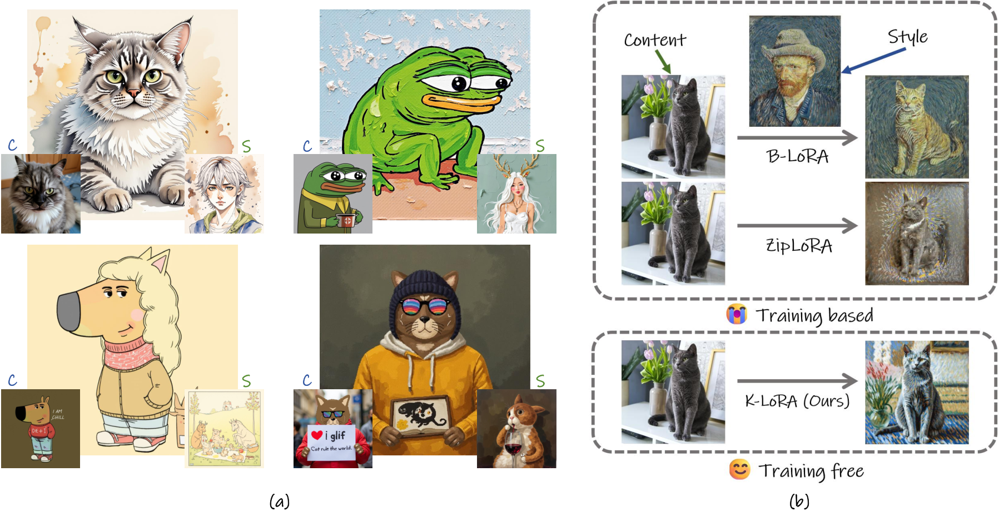

<figcaption>視覚的な図解。(a) は FLUX を用いた我々の提案手法 K-LoRA の優れた生成性能を実証する。物体の参照は左に、スタイルの参照は右に、生成画像は中央に示される。対照的に (b) は、我々の手法を既存の最先端手法である B-LoRA と ZipLoRA と比較する。これらは元の重み行列の変更やネットワーク構造の活用不足のため、スタイルまたはコンテンツの情報を失いがちである。我々のアプローチは各 LoRA 行列が捉える情報を強化し、それにより追加の学習を必要とせずに優れた融合効果を達成する。</figcaption>
</figure>

<figure>

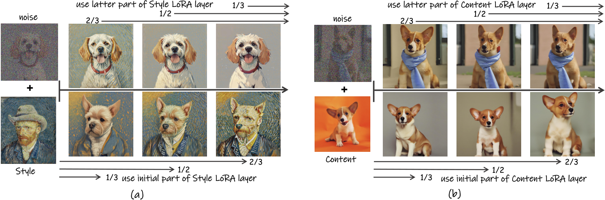

<figcaption>図1: 知見の視覚的結果。(a) コンテンツ LoRA のみを用いて微調整した結果。(b) スタイル LoRA のみを用いた結果。これらの実験では、初期のタイムステップと後期のタイムステップに LoRA 層を加えた場合の差異を検証する。</figcaption>
</figure>

## 1 Introduction（はじめに）

パーソナライゼーションとスタイライゼーションはコンピュータビジョンにおける 2 つの確立されたタスクであり、長年にわたって活発な研究分野であり続けてきた。これらのタスクにおける第一の課題は、通常はテキストまたは視覚的な入力によって導かれながら、画像の明確なコンテンツを保存すること、あるいはスタイルを修正することである。この文脈において「コンテンツ」は画像内の物体と構造を指し、「スタイル」は色・テクスチャ・パターンといった視覚的属性を包含する。画像のスタイルを操作することが特に困難であるのは、**スタイルの定義が主観的である**ことと、**スタイルとコンテンツの間に強い相互依存がある**ことによる。これが両要素の効果的な分離を複雑にしている。

LoRA のような最近の技法は、画像合成における効率的な微調整を達成する能力によりますます注目を集めてきた。スタイルと物体は別々に学習されるものの、LoRA は画像生成タスクにおけるスタイルとコンテンツの分離という問題に効果的な解を提供する。これはコンテンツ特徴から独立にスタイル特徴を学習することにより、スタイル転送の制御に優れる。LoRA を活用したパーソナライズド応用の人気の高まりとともに、LoRA の重みをマージすることで物体とスタイルを融合する数多くの取り組みがなされてきた。これらのアプローチは、可変の係数を通じて各 LoRA の寄与比率をユーザーが調整できるようにすることを目指す。また ZipLoRA のように、異なる LoRA を均衡させる融合比率ベクトルを学習しようとする手法もある。より最近では、LoRA をモデルへ周期的に統合することを提案するアプローチもある。加えて B-LoRA の技法は、スタイル転送を促進するために 2 つの注意モジュールのみを微調整する。

これらの手法を用いた我々の実験において、我々は 2 つの主要な問題を特定した。第一に、**生成画像においてスタイルの詳細がしばしば失われ、物体の特性が一貫して維持されない**。第二に、**特定のハイパーパラメータとシードの手動調整が必要になるか、あるいは追加の学習が必要になる**。第一の問題について、我々は広範な実験を行い、**2 つの LoRA の注意層を要素レベルでマージすると、スタイルの詳細とテクスチャが平滑化されたり、物体の特性が失われたりしうる**ことを観察した。要素レベルのマージが最適でない結果を招きうることを踏まえ、我々は良好な性能を保つために特定の要素を選択的に除去する実験を行った。第二の問題について、最近の研究の中核的な着想に触発され、我々は**拡散のタイムステップに応じて LoRA の注意層をモデルへ組み込み**、性能への影響を評価した。このアプローチを通じて、我々は次の主要な結論を導いた。(i) **限られた数の拡散予測ステップだけで元の効果を保持するのに十分である**（図 1 に図解）。(ii) **LoRA を適用するとき、初期の拡散ステップは物体の再構成とより大きなテクスチャの詳細の捕捉を担い、後続のステップは物体の細部とスタイルにおけるテクスチャの微細な詳細の強化と精緻化に焦点を当てる。**

これらの知見に基づき、我々は実験で特定した 2 つの問題を同時に解決する K-LoRA を提案する。第一の洞察を活用して、注意層の各順伝播内に **Top-K 選択のプロセス**を組み込み、各位置で最も適切な注意成分を特定する。加えて、第二の洞察を活用して、選択のプロセス中に**スケーリング係数**を適用し、拡散過程を通じてスタイルとコンテンツが果たす異なる役割を強調する。

我々の手法は前述の問題を効果的に解決でき、困難なコンテンツとスタイルの組合せに直面したときにも、マージされた LoRA が被写体とスタイルの特徴の双方を捉えることを保証する。これは安定した生成出力をもたらし、マージされた LoRA の性能を有意に高める。さらに、我々のアプローチは追加の学習を必要としないためユーザーに優しい。我々の貢献を以下にまとめる。

- 我々は K-LoRA を提案する。これはコンテンツ LoRA とスタイル LoRA をシームレスにマージする単純かつ効果的な最適化技法であり、複雑な詳細を保存しながら任意の主題について任意の所望のスタイルの生成を可能にする。
- 我々の手法はユーザーに優しく、再学習の必要を排し、既存の LoRA 重みに直接適用できる。多様な画像スタイライゼーションのタスクにわたって優れた性能を実証し、既存の手法を凌駕する。

## 2 Related Work（関連研究）

**カスタマイゼーションのための拡散モデル。** カスタマイズされたタスクのための拡散モデルの領域において、カスタマイゼーションとは、ユーザーが提供する新しい定義をモデルが解釈することを学ぶプロセスを指す。Textual Inversion・DreamBooth・Custom Diffusion のような技法は、トークンベースの最適化を通じて、限られた枚数の画像だけで対象概念をモデルが捉えることを可能にする。具体的には、Textual Inversion は対象を再構成するよう埋め込みを微調整し、DreamBooth はあまり一般的でないクラス固有の語を用いて物体のカテゴリを拡張し、Custom Diffusion は新しい概念を学ぶために拡散モデル内の cross-attention 層の微調整に焦点を当てる。加えて、推論時に学習を必要としない手法もあるが、事前学習済みモジュールを活用するそれらのアプローチは、特定の専門的なタスクでは最適でない性能を示しうる。LoRA とその変種は、大規模モデルを微調整して高品質な結果をもたらす能力でよく知られており、実務者にとって良い選択肢となっている。

**画像生成における LoRA の組合せ。** 画像生成の分野において、LoRA の組合せに関する研究は主に 2 つの方向で前進してきた。すなわち**複数物体の統合**と**コンテンツとスタイルの融合**である。物体の統合については、複数の LoRA に封入された多様な物体概念をモデルが統合できるようにすることに主に焦点が当てられてきた。被写体 LoRA を微調整することにより、これらのモデルは様々な新しい概念を同化し、マスク技法を通じて物体のレイアウトを管理できる。コンテンツとスタイルの融合については、MergingLoRA・Mixture-of-Subspaces・ZipLoRA のようないくつかの研究が、事前学習済みの LoRA 重み層をマージするためにハイパーパラメータの調整や融合行列の学習を伴うアプローチを提案してきた。しかしながらこれらの手法は、**概念の希釈・細部のぼけ・特定の学習要件**といった課題に直面しうる。最近では B-LoRA が生成過程における注意モジュールの異なる役割を特定し、2 つの中核的な注意モジュールのみを学習することで LoRA 内での物体とスタイルの分離を達成した。加えて LoRA Composition は、モデルの LoRA モジュールを周期的に更新することで複数の LoRA が協調的にモデルを導けるようにし、多様な概念横断の融合を可能にする。これらの進展にもかかわらず、既存の手法は依然として制御精度の不足・物体やスタイルの喪失・高い学習要件といった課題に直面している。

## 3 Method（手法）

### 3.1 Preliminaries（準備）

LoRA は当初、大規模な言語モデルを適応させるために設計された効果的な手法である。LoRA の中核的な前提は、大規模モデルを微調整してベースラインモデルと比較したとき、パラメータ更新行列 $\Delta W\in\mathbb{R}^{m\times n}$ が典型的に小さいかゼロに近い要素を含み、**低ランク構造**を示すことである。この性質により $\Delta W$ を 2 つの低ランク行列 $B\in\mathbb{R}^{m\times r}$ と $A\in\mathbb{R}^{r\times n}$ に分解できる。ここで $r$ は $\Delta W$ の内在階数を表し、$r\ll\min(m,n)$ が仮定される。この特性により、ベースの重み $W_{0}$ を凍結して行列 $B$ と $A$ のみを学習し、$\Delta W$ を $\Delta W=BA$ の形で効率的にパラメータ化することが可能になる。最終的に $\Delta W$ は元のモデルのベースの重みに加算されて微調整を行う。更新された重みは $W_{0}+\Delta W$ と表せる。

我々の研究では ZipLoRA と同じ記法を採用する。$D$ をベースの拡散モデル、$W_{0}$ を LoRA 層で更新されるべき事前学習済み重みとする。ベースモデル $D$ は、学習済みの LoRA 重みの組 $\Delta W_{x}$ をモデルの重みに加えるだけで特定の概念に適応でき、$D^{\prime}=W_{0}+\Delta W_{x}$ となる。ベースモデル $D$ に紐づく独立に学習された 2 つの LoRA 重みの組 $\Delta W_{c}$ と $\Delta W_{s}$ が与えられたとき、我々の目的は双方の LoRA の組の重みを十分に活用し、その効果的な融合を可能にすることである。これを達成するため、我々は 2 つの LoRA 重みの組をシームレスに結合する **K-LoRA** と呼ぶ手法を提案する。

$$
\Delta W_{x}=K(\Delta W_{c},\Delta W_{s}),
$$

ここで $K$ は我々の手法を表し、コンテンツ LoRA とスタイル LoRA の寄与を効率的に統合できる。

以下、提案アプローチを詳細に説明する。我々のアプローチは 2 つの知見に基づく。(i) 拡散のステップにおいて、**各ステップで層の部分集合にのみ LoRA を適用しても、全層に適用した場合と同等の効果が達成できる**。(ii) **初期の拡散ステップで被写体 LoRA を用いるとより良い被写体情報が生成されがちであり、後期のステップでスタイル LoRA を用いるとコンテンツの構築に影響を与えずにスタイルと詳細を生成するのにより効果的である。**

### 3.2 K-LoRA

<figure>

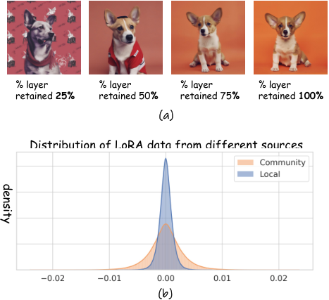

<figcaption>図2: 実験の可視化結果。(a) 一定の比率に従って LoRA の注意層の一部をランダムに読み込んで生成した画像。(b) 異なる出所の LoRA のデータ分布の可視化。一方はローカルで学習されたもの、もう一方はコミュニティのリポジトリからダウンロードされたもの。</figcaption>
</figure>

<figure>


<figcaption>図3: 提案する K-LoRA の概観。我々は K-LoRA を提案する。これは行列要素の和に基づいて各順伝播層における重要な LoRA 重みを選択するために Top-K 関数を活用する。これによりスタイルの詳細と物体の特徴の双方を保存できる。</figcaption>
</figure>

ZipLoRA では、LoRA で微調整する際により小さな主要要素の集合を用いても元のアプローチと同じ生成結果を達成できると指摘されている。しかしながら著者らは、画像生成の分野でこれを説明する関連実験を提供していない。我々はまず Magmax と同様のアプローチに従って、値の小さい要素にゼロを割り当てることでこの手法の活用を試みた。**このように行列の要素を修正して得られた結果は、既存手法が生み出すものと同様であった**。モデルが以前に学習した概念を正しく解釈できず、その結果、画像生成の品質が最適でなくなるためである。

注意の要素を直接修正することに伴う複雑さと限界を踏まえ、ある問いが浮かび上がる：**ノイズ除去の過程で LoRA 行列の疎な特性を活用できないか？** 目的は、元の LoRA の重みを修正することなく、各ステップまたは各層について良い重み選択の手法と正確な LoRA の配置を特定できる代替手法を見つけることである。Multi-LoRA Composition に基づき、我々は拡散のステップにコンテンツ LoRA の注意層をランダムに適用し、注意層の $x\%$ を用いて物体に影響を与えて生成結果を観察した。図 2(a) に示すように、**$x>50$ のとき結果は元のモデルのものと事実上見分けがつかない**ことを見出した。しかしながら **$x<25$ のとき、元のパーソナライズされた概念を維持するモデルの能力は有意に減少した**。

最近の研究に触発され、我々は図 1 の前述の実験をさらに拡張し、**初期のタイムステップでスタイル LoRA を適用すると元の物体の再構成に有意な影響を与える一方、後期のタイムステップで適用すると元の物体に影響を与えずにスタイル情報を保存する**ことを見出した。加えて、コンテンツ LoRA については、**初期のタイムステップで適用する方が後期で適用するより著しく良い結果をもたらす**ことを観察した。

以上の分析は、各注意層について LoRA モジュールを適応的に選択することで、生成される物体とスタイルのマージを達成することへ我々を動機づける。知見 (i) によれば、選択の戦略は物体とスタイルの全体的な情報を保存すべきである。さらに知見 (ii) によれば、生成過程は物体とスタイルの成分を適切に配置することで達成されるべきである。すなわち、初期の拡散ステップではモデルはスタイルのテクスチャを導入しつつ物体の再構成により焦点を当てるべきであり、後期のステップでは物体の微細な詳細とともにスタイルを精緻化する方がよい。したがって我々は、学習された被写体とスタイルをマージするために適切な LoRA 層を適応的に選択できる K-LoRA を図 3 のように提示する。

まず、特定の値が生成過程で重要な役割を果たすかどうかを判定するため、LoRA 層の各要素の絶対値を取る。

$$
\Delta W_{c}^{\prime}=|\Delta W_{c}|,\qquad \Delta W_{s}^{\prime}=|\Delta W_{s}|,
$$

ここで $W_{c}$ と $W_{s}$ はそれぞれコンテンツとスタイルの LoRA 重みを表す。支配的な要素の小さな部分集合が元の生成効果を達成できる一方で、データ分布（図 2(b) 参照）が示すように**より小さい要素が位置の大きな割合を占め**、それが重要な要素の選択に影響を与えるため、我々は各層の重要度を表現するのに**より少数の最大要素**を用いる。

具体的には、$\Delta W_{c}^{\prime}$ と $\Delta W_{s}^{\prime}$ からそれぞれ値の最も大きい上位 $K$ 個の要素を選ぶ。Top-K の要素を累積することにより、与えられた注意層における 2 つの行列の重要度を評価する。

$$
S_{c}=\sum_{i\in\text{Top-K}(\Delta W_{c}^{\prime})}\Delta W_{c,i}^{\prime},\qquad
S_{s}=\sum_{j\in\text{Top-K}(\Delta W_{s}^{\prime})}\Delta W_{s,j}^{\prime},
$$

ここで Top-K は最大の $K$ 個の値のインデックスを返す。$K$ の選択について、**LoRA の学習過程における rank の数は、ある程度まで行列に含まれる情報量を反映する**ことに我々は着目する。したがって $K$ の選択を各 LoRA の rank に合わせる。

$$
K={r_{c}\cdot r_{s}},
$$

ここで $r_{c}$ と $r_{s}$ はそれぞれコンテンツとスタイルの LoRA 層の rank を表す。この定式化により、2 つの和を比較することで注意層内の適切な重みを決定できる。

$$
C(S_{c},S_{s})=\begin{cases}\Delta W_{c},&\text{if }S_{c}\geq S_{s}\\
\Delta W_{s}.&\text{otherwise}\end{cases}
$$

<figure>

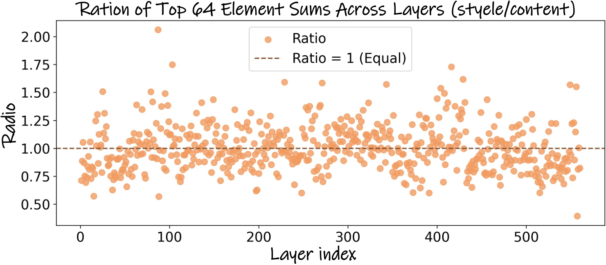

<figcaption>図4: 比率の可視化。この画像は Top-K 要素を合計した後の比率の結果を反映しており、各対応する位置での比率の差は非常に有意である。</figcaption>
</figure>

知見 (ii) をより効果的に活用し、物体とスタイルが異なる段階でそれぞれの役割を果たせるようにしつつ、物体中心からスタイル中心の表現への滑らかな遷移を保証するため、我々は**スケーリング係数 $S$** を導入する。この係数 $S$ は Top-K 選択のプロセスに直接適用され、生成の初期段階では物体のコンテンツを強化し、後期段階では徐々にスタイルを強調する。

$$
S=\alpha\cdot\frac{{t}_{{now}}}{{t}_{{all}}}+\beta,
$$

ここで ${t}_{{now}}$ は逆向きのノイズ除去過程における現在のステップ、${t}_{{all}}$ は総ステップ数、$\alpha,\beta$ はハイパーパラメータである。

異なる出所のコミュニティ LoRA モデルを用いる際に過度な重みの格差が生じ、Top-K 選択が注意の割り当てに対して無効になることを避けるため、我々は 2 つの重みを均衡させる新しい係数 $\gamma$ を導入する。

$$
S^{\prime}=\gamma\cdot S.
$$

まず各層 $l$ 内の要素の絶対値の和を計算し、次にこれらの和を層ごとに累積して $\gamma$ を計算する。

$$
\gamma=\frac{\sum_{l}\sum_{i}\Delta W_{c_{l,i}}^{\prime}}{\sum_{l}\sum_{j}\Delta W_{s_{l,j}}^{\prime}}.
$$

$\gamma$ の導入は、図 2(b) に示すように 2 つの LoRA 成分の要素間の有意な数値的差異に対処する。この調整は LoRA 層内の有用な成分を浮き彫りにする。$\gamma$ を用いると、各層におけるコンテンツとスタイルの LoRA 重みの比例関係は図 4 に示すとおりになる。LoRA が適用される各順伝播層において、支配的成分の和の比率に有意な差があることが観察できる。これは各層内での異なる LoRA 重みの重要性を浮き彫りにし、選択の確固たる根拠を提供する。

次に $S^{\prime}$ をスタイル LoRA に適用して $S_{s}$ を更新する。

$$
S_{s}^{\prime}=S_{s}\cdot S^{\prime}.
$$

$S^{\prime}$ を導入することにより、初期のタイムステップではコンテンツの影響を強め、後期のステップではスタイルの優位を増幅できる。この調整は知見 (ii) を効果的に活用し、画像生成の過程で物体とスタイルの双方の寄与を最大化するようそれらの選択を最適化する。最終的な LoRA の重みは $C(S_{c},S_{s}^{\prime})$ を計算することで得られる。明確化のため、アルゴリズム 1 に疑似コードを示す。

<figure>

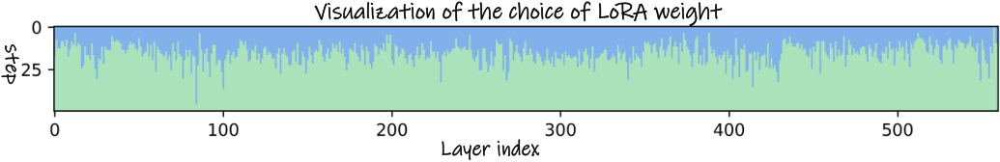

<figcaption>図5: 生成過程における LoRA の選択。この図は各順伝播層内での選択を図解する。縦軸は全 50 の拡散ステップを表し、横軸は LoRA 層の数を示す。各位置の色は選択された層を示す。青のバーは物体に、緑のバーはスタイルに対応する。</figcaption>
</figure>

<figure>

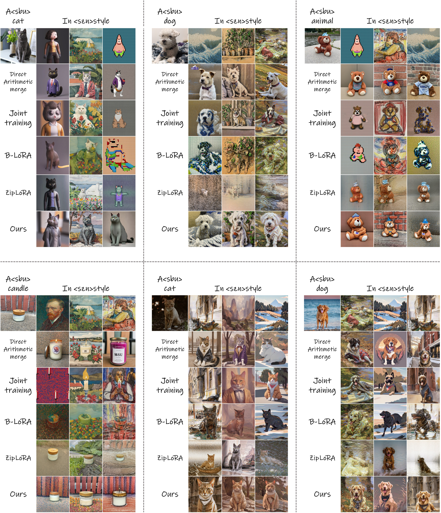

<figcaption>図6: 定性的比較。K-LoRA と比較手法が生成した画像を提示する。K-LoRA は概して物体とスタイルのシームレスな統合を達成し、忠実度を効果的に保存して歪みを防いでいる。</figcaption>
</figure>

**アルゴリズム 1: PyTorch 風の疑似コード**

```python
# timestep: 現在のタイムステップ
# content_lora_weight, style_lora_weight: 入力の重み
# alpha, beta, gamma: スケーリング係数
# all_timesteps: 総タイムステップ数

# rank に基づいて k を設定
k = rank * rank

# TopK のコンテンツ値の和
abs_content_matrix = abs(content_lora_weight)
topk_content_values = topk(abs_content_matrix.fl(), k)
sum_topk_content = sum(topk_content_values)

# TopK のスタイル値の和
abs_style_matrix = abs(style_lora_weight)
topk_style_values = topk(abs_style_matrix.fl(), k)
sum_topk_style = sum(topk_style_values)

# スケーリング係数の計算と適用
scale = alpha + beta * timestep / all_timesteps
scale = scale * gamma
sum_topk_style *= scale

# 比較して結果を返す
if sum_topk_content >= sum_topk_style:
    return content_lora_weight
else:
    return style_lora_weight
```

fl: flatten（平坦化）

重み選択の過程をより良く説明するため、図 5 に選択の割合を示す。そこでは物体とスタイルがシームレスに相互浸透して互いに混ざり合っている。前半部分は主に物体に焦点を当てつつ少量のスタイルを取り込み、後半部分は主にスタイルを強調しつつ物体の微かな存在を保持している。これは我々の主要な知見をさらに裏づける。

## 4 Experiments（実験）

### 4.1 Experiment Setup（実験設定）

**データセット。** ZipLoRA の慣例に従い、ローカルでの学習によって得る LoRA については、DreamBooth データセットから多様なコンテンツ画像の集合を選ぶ。各集合は与えられた被写体の 4〜5 枚の画像を含む。スタイルについては StyleDrop の著者らが提供した従来のデータセットを選び、いくつかの古典的な名作といくつかの現代的で革新的なスタイルを含める。**各スタイルについては学習に単一の画像のみを用いる。**

**実験の詳細。** 我々は SDXL v1.0 ベースモデルと FLUX モデルを用いて実験を行い、ローカルで学習した LoRA とコミュニティで学習された LoRA を用いて K-LoRA の性能を検証する。コミュニティで学習された LoRA については、Hugging Face で広く利用可能な LoRA モデルを検証に用いる。ローカルで学習した LoRA については、ZipLoRA で概説された手法に基づいてスタイルとコンテンツの LoRA の組を得る。式 (7) で述べたハイパーパラメータについては $\alpha=1.5$、$\beta=0.5$ に設定する。この構成はほぼすべての場合に効果的に機能し、一貫して良好な生成結果をもたらすことが分かった。

### 4.2 Results（結果）

**定量的比較。** 我々は物体とスタイルの組合せを 18 個ランダムに選び、それぞれ 10 枚の画像からなる集合で定量的比較を行う。スタイルの類似度の測定には CLIP を用いる。被写体の類似度は CLIP スコアと DINO スコアを通じて計算する。我々の手法を、コミュニティで人気のあるアプローチおよび最先端の手法（直接的な算術マージ・共同学習・ZipLoRA・B-LoRA）と比較する。結果を表 1 に示す。**我々の手法が従来のアプローチと比べて被写体類似度の指標を有意に改善し、同時に満足のいくスタイル類似度も達成している**ことが観察できる。

**表1**: 定量的比較。異なる手法にわたる整合結果の比較。

| 手法 | Style Sim $\uparrow$ | CLIP Score $\uparrow$ | DINO Score $\uparrow$ |
| --- | --- | --- | --- |
| Direct（直接マージ） | 48.9% | 66.6% | 43.0% |
| Joint（共同学習） | **68.2%** | 57.5% | 17.4% |
| B-LoRA | 58.0% | 63.8% | 30.6% |
| ZipLoRA | 60.4% | 64.4% | 35.7% |
| K-LoRA (ours) | 58.7% | **69.4%** | **46.9%** |

<figure>

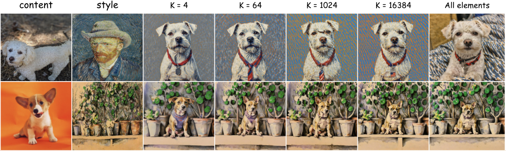

<figcaption>図7: K の選択。K-LoRA における異なる K の影響の評価。</figcaption>
</figure>

**定性的比較。** 公平な評価を保証するため、この段階のすべての実験は SD を用いて行う。結果を図 6 に示す。LoRA をマージする手法は、広範なパラメータ調整やシードの選択なしに融合比率を直接 1:2 に設定すると、物体の元の形状・色・様式的特徴の保存に苦戦する。B-LoRA は主に元画像の物体の色と外観を捉え、しばしば色への過学習を招くため、生成画像の中で元の物体を識別することが困難になる。ZipLoRA と共同学習の手法では、一定の様式的テクスチャは取り込まれるものの、モデルはスタイルそのものを捉えるのではなくスタイルの背景要素に焦点を当てる傾向があり、成功率が低くなる。対照的に我々の手法は、広範なシードの変動にわたって安定した性能でより高品質な出力画像を生成することにより、これらの限界に対処する。加えて我々のアプローチは追加の学習やパラメータの微調整の必要を排する。

我々はランダムに選んだ 22 の結果の集合を比較評価のためにユーザーへ提示した。各集合は ZipLoRA・B-LoRA・我々の手法の出力と、学習被写体とスタイルの双方の参照画像を含む。ユーザーはスタイルと被写体の双方を最もよく保存している手法を特定するよう求められた。表 2 に示す結果は、我々の手法が最も選好されることを示す。加えて我々は同様の評価について GPT-4o に諮った。我々の手法は GPT-4o の評価において有意な優位を示し、我々の手法の優越性をさらに反映している。

**表2**: ユーザースタディの結果と GPT-4o のフィードバック。

| 手法 | ユーザー選好 | GPT-4o のフィードバック |
| --- | --- | --- |
| ZipLoRA | 29.2% | 5.6% |
| B-LoRA | 18.1% | 11.1% |
| Ours（本手法） | **52.7%** | **83.3%** |

<figure>

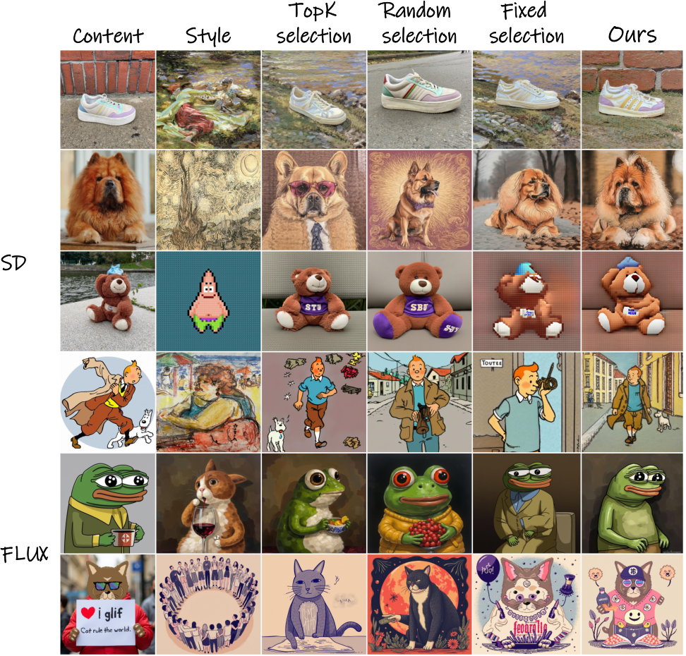

<figcaption>図8: Top-K 選択とスケーリング係数のアブレーション。5 組の画像を用いて異なる手法を比較する。上の 4 行は SD の結果を表し、下の行は FLUX の結果を示す。後者にはローカルで学習した LoRA とコミュニティで学習された LoRA の双方が含まれる。</figcaption>
</figure>

### 4.3 Ablation Analysis（アブレーション分析）

**Top-K 選択。** Top-K 選択手法の有効性を検証するため、我々は 2 つの実験——固定選択とランダム選択——を行う。知見 (ii) は直截なアプローチを示唆する：スケール係数が 1 より大きければコンテンツ LoRA を選び、そうでなければスタイル LoRA を選ぶ。我々が「**固定選択（Fixed Selection）**」と呼ぶこのアプローチは、Top-K 選択手法のアブレーションを検証する有用なベースラインとして機能する。これは特定のシナリオで有望な結果を示してきた Multi-LoRA Composition の拡張・洗練とも見なせる。しかしながら、特定のスタイル LoRA の条件下では、この手法は図 8 に示すように物体のぼけやコンテンツの外観の変化を招きうる。

我々のモジュールが恣意的な構成に依存するのではなく、指定された順伝播層の配置内で一貫して機能することを保証するため、ランダムシードを用いた「**ランダム選択（Random Selection）**」と呼ぶ統制実験を行う。この設定では、モデルは 1/3 の確率でコンテンツの注意を、2/3 の確率でスタイルの注意を選ぶ乱数を用いる。図 8 に示すように、このランダム選択の条件下では、生成画像はしばしば単一の物体特徴かスタイル特徴のみを保持するか、あるいはそのいずれも維持できない。この結果は我々の知見 (ii)——初期と後期の拡散タイムステップで物体成分とスタイル成分がそれぞれ異なる役割を果たすこと——をさらに検証する。

さらに我々は、生成画像に対する $K$ の異なる選択の影響を図 7 のように評価する。Top-K のアプローチ内で $K$ の値を系統的に変える。我々の観察は、**$K$ が比較的小さいとき、スタイルも物体の特性も十分に際立たない**ことを示す。この問題は $K$ が増えるにつれて徐々に改善される。しかしながら **$K$ が過度に大きくなると、スタイルが保存されず、物体の形状が有意に歪みうる**。

**スケーリング係数。** スケーリング係数の有効性を評価するため、それを除去して元の Top-K のアプローチのみに焦点を当てる。第一の実験では、図 8 に示すように、Top-K のみの使用でも特定の条件下では満足のいく結果を生みうるが、実験の範囲を広げると物体の歪みとスタイルの喪失の事例が明らかになることを我々の分析は示す。スケーリング係数内での gamma の重要性をさらに評価するため、要素の和に実質的な差がある異なる出所の 2 つの LoRA モデルの性能を検証する。図 8 の最下行に図解するように、Top-K 選択はスタイルを正確に捉えることに失敗し、固定選択における物体とスタイルの融合は我々のアプローチと比べて明らかに弱いことが明白である。我々は代替のスケールも実験している。詳細な手順は補足資料（D 節）で提供する。

結論として、これら 2 つのモジュールの除去は生成性能の低下につながり、モデル全体の有効性に対するそれらの決定的な寄与を裏づけている。

## 5 Conclusions（結論）

本論文で我々は K-LoRA を導入した。これは独立に学習されたスタイル LoRA と被写体 LoRA をシームレスにマージできる。K-LoRA は元のスタイルの複雑な詳細を保存しながら精密な物体の微調整を可能にする。我々のアプローチは Top-K 選択とスケーリング係数を通じて各拡散ステップで物体 LoRA とスタイル LoRA の双方の寄与を効果的に活用し、元の重みの利用を最大化して、再学習や手動でのハイパーパラメータ調整を必要とせずに正確なスタイル融合を可能にする。

## Appendix A Visual Results（視覚的結果）

我々は StyleDrop と DreamBooth のデータセットを Stable Diffusion（SD）とともに用いる（図 12 と図 13 に描画）。また Hugging Face の LoRA を用いて FLUX 上でも我々の手法を評価した（図 10 と図 11 に示す）。これらの物体 LoRA とスタイル LoRA を系統的に組み合わせることにより、物体とスタイルの双方をシームレスに統合する我々のアプローチの有効性を実証する一連の画像を得て、一貫した高品質の視覚的出力をもたらした。

## Appendix B Additional Comparisons（追加の比較）

我々は StyleID との比較を追加した（図 14 に示す）。StyleID はテクスチャの品質を保存しつつスタイル転送を効果的に達成することが観察できる。しかしながら、生成される物体がわずかにぼける、あるいは生成されるスタイルが明瞭でないことがある。加えて、我々の手法と比べて彼らのアプローチは**元画像の固定されたレイアウトに基づく**ため、背景や動作にうまく汎化しない可能性がある。

## Appendix C Prompt Control（プロンプト制御）

我々は、プロンプトの調整を通じて物体の動作・周囲の環境の修正や新しい要素の導入が我々の手法で可能かどうかを評価する実験を行う。図 17 と図 18 に図解するように、プロンプトを修正した後、我々の手法は元の物体の特徴と様式的属性を効果的に保持しつつ、新しい要素やシーンの詳細もシームレスに統合する。

## Appendix D New Scale（新しいスケール）

本論文の本文では、式 (7) で与えられる次のスケールを用いる。

$$
S=\alpha\cdot\frac{{t}_{{now}}}{{t}_{{all}}}+\beta.
$$

先行研究に触発され、我々は代替のスケール係数も導入する。

$$
S^{*}=\left(\alpha^{\prime}\cdot\frac{{t}_{{now}}}{{t}_{{all}}}+\beta^{\prime}\right)\%\ \alpha.
$$

この式では $\alpha^{\prime}=1.5$、$\beta^{\prime}=1.3$ に設定する。これは**生成過程の開始時にスタイル情報がある程度強化される**ことを意味し、モデルがスタイル LoRA から特定のブロック情報を捉えられるようにする。下記の図 9 は 2 つのスケールの主要な差異を図解する。

$S^{*}$ の結果については、初期の拡散ステップでスタイル情報が強化されるため、生成画像はスタイル LoRA から背景と色のブロック情報を捉える。しかしながらこのアプローチは、スタイル LoRA におけるテクスチャと筆致の情報の学習効果を弱める結果になる。**これはトレードオフを表しており、ユーザーは好みに基づいて異なるスケール係数を選択できる。**

<figure>

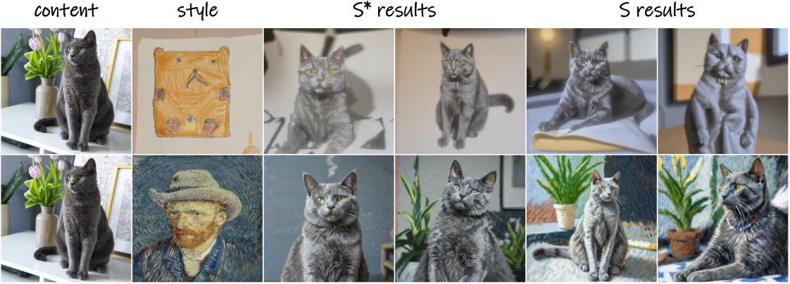

<figcaption>図9: 異なるスケーリング係数の結果。異なるスケーリング係数を持つ K-LoRA の対応する生成結果。各物体-スタイル対について 2 つのシードがランダムに選ばれている。</figcaption>
</figure>

## Appendix E Robustness Analysis（頑健性の分析）

我々は様々な出所の LoRA モデルを評価する。そこでは物体 LoRA はコミュニティから取得され、スタイル LoRA はローカルで学習される。DirectMerge・Multi-LoRA composition・我々が提案する固定選択のアプローチも比較する。図 15 に示すように、我々の手法は物体とスタイルの特性の双方を学習する点で他のアプローチを凌駕する優れた性能を実証する。さらに、安定性を評価するためにランダムシードを選んで我々のアプローチの頑健性を検証する。図 16 に提示する結果は、我々の手法が広範なシード選択にわたって一貫して安定した融合を達成し、信頼できる統合を保証することを示す。

## Appendix F Additional Ablations（追加のアブレーション）

本文では 2 つのハイパーパラメータ $\alpha$ と $\beta$ を持つスケールを採用する。具体的には $\alpha$ を 1.5、$\beta$ を 0.5 に設定し、物体とスタイルが異なる位置で異なる水準の影響を及ぼせるようにする。選択したパラメータの妥当性を検証するため、ランダムに選んだ 18 組の生成画像と、対応する元の物体／スタイルの参照との間の CLIP 類似度スコアを計算する。下表の結果は CLIP 類似度スコアの総和を表す。

| $\beta\backslash\alpha$ | 1.0 | 1.5 | 2.0 |
| --- | --- | --- | --- |
| 0.25 | 125.3% | 126.7% | 127.0% |
| 0.50 | 126.5% | **128.1%** | 126.2% |
| 0.75 | 124.5% | 125.8% | 125.3% |

$\alpha$ と $\beta$ の最適な設定はそれぞれ 1.5 と 0.5 であることが分かる。この重みの構成は我々の実験によればほぼすべてのコンテンツ-スタイル対を満たしており、ユーザーはさらなる調整を行う必要がない。

<figure>

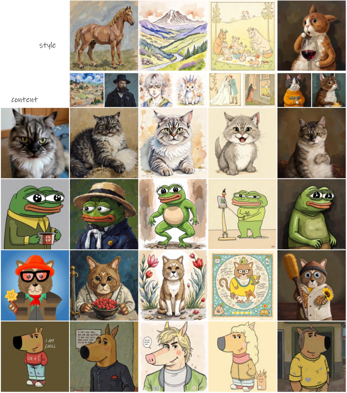

<figcaption>図10: FLUX を用いた追加の生成結果。各位置の画像は上の物体と左のスタイルに対応し、我々の手法で異なる LoRA を適用して生成された結果を示す。</figcaption>
</figure>

<figure>

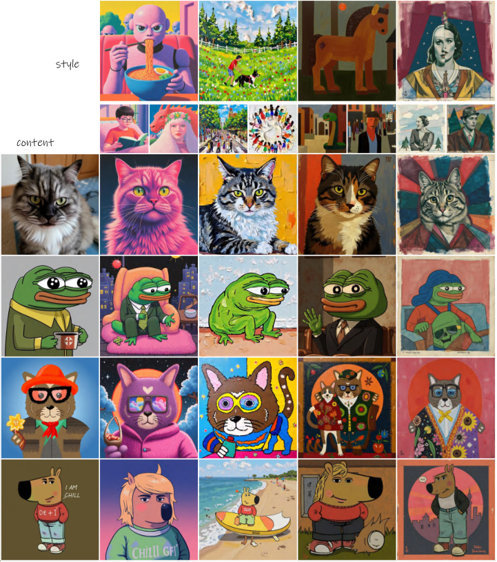

<figcaption>図11: FLUX を用いた追加の生成結果。各位置の画像は上の物体と左のスタイルに対応し、我々の手法で異なる LoRA を適用して生成された結果を示す。</figcaption>
</figure>

<figure>

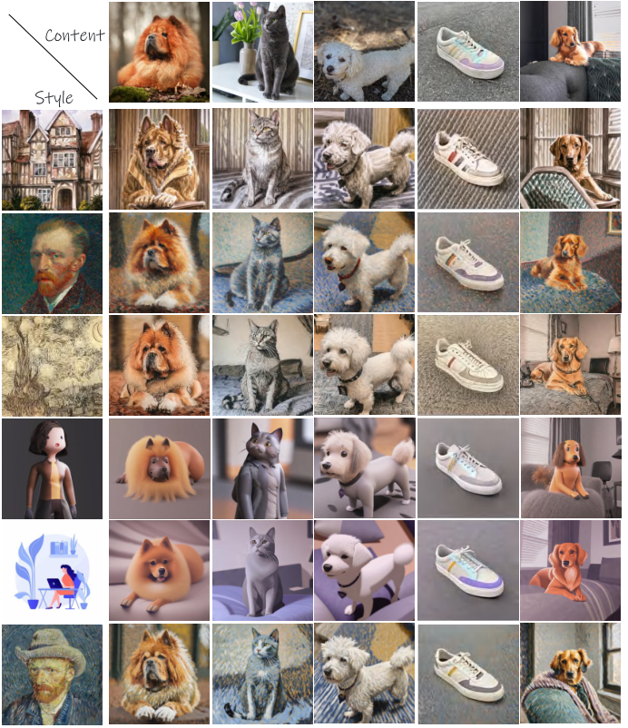

<figcaption>図12: SD を用いた追加の生成結果。各位置の画像は上の物体と左のスタイルに対応し、我々の手法で異なる LoRA を適用して生成された結果を示す。</figcaption>
</figure>

<figure>

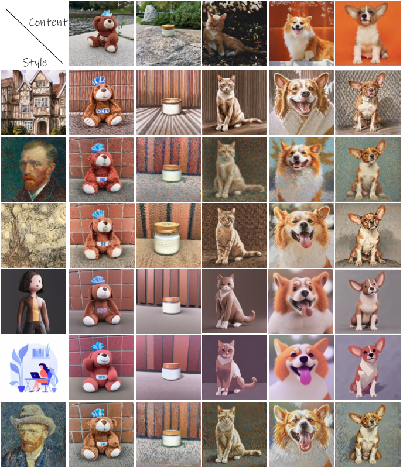

<figcaption>図13: SD を用いた追加の生成結果。各位置の画像は上の物体と左のスタイルに対応し、我々の手法で異なる LoRA を適用して生成された結果を示す。</figcaption>
</figure>

<figure>

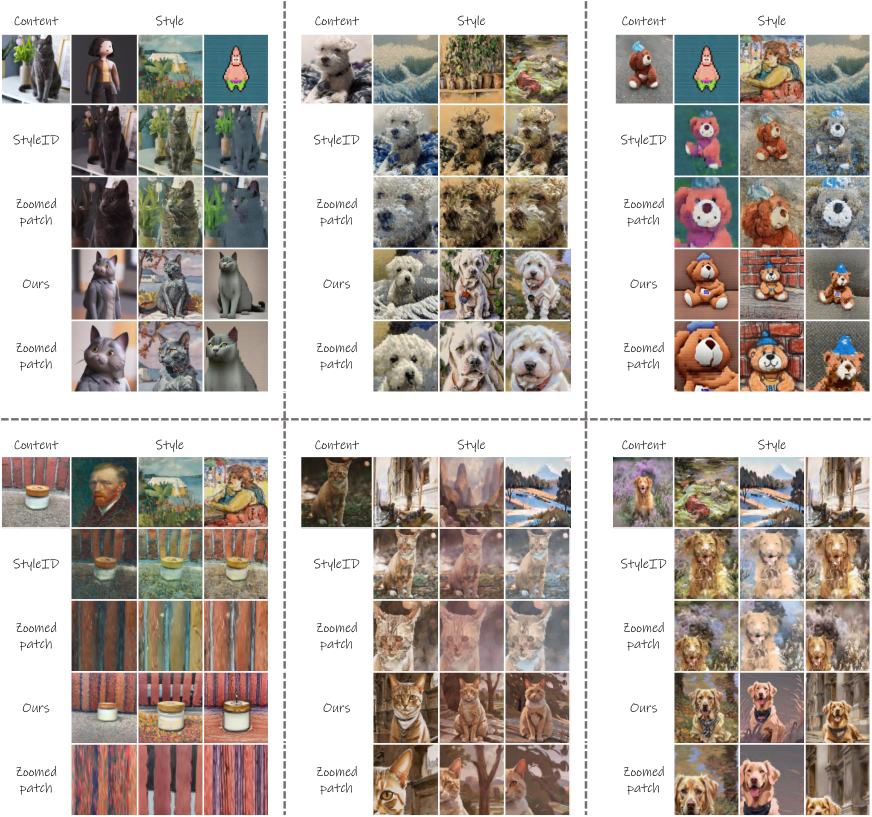

<figcaption>図14: 追加の比較。StyleID の手法と比較し、出力画像内の拡大パッチを取得して詳細なテクスチャ情報と様式的特徴を観察する。各ブロック内で、第 2 行と第 3 行は StyleID の結果と対応する拡大パッチを表し、続く 2 行は我々の手法の結果と関連する拡大パッチを図解する。</figcaption>
</figure>

<figure>

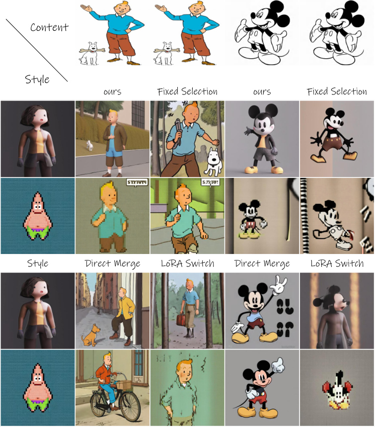

<figcaption>図15: 頑健性の検証。コミュニティ LoRA とローカルで学習した LoRA を用いて、本文で提案した固定選択・ベースライン比較としての直接的な算術マージ・Multi-LoRA Composition の手法を比較し、汎化性と頑健性を検証する。</figcaption>
</figure>

<figure>

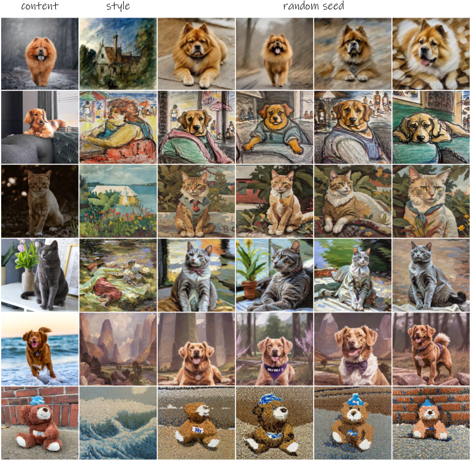

<figcaption>図16: 頑健性の検証。安定性をさらに検証するためランダムにシードを選ぶ。</figcaption>
</figure>

<figure>

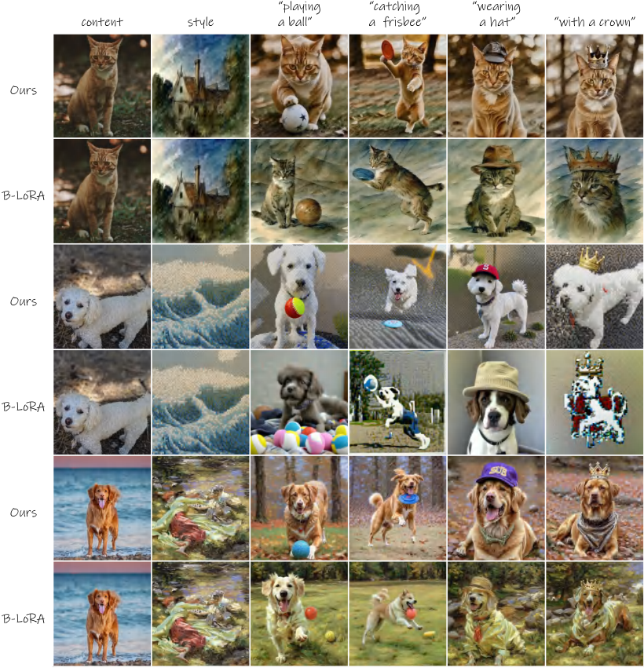

<figcaption>図17: プロンプト制御。新しいシーン・新しい動作・新しい物体のプロンプトを導入し、コンテンツを再文脈化しつつ様式的一貫性を維持する我々の手法の能力を検証する。</figcaption>
</figure>

<figure>

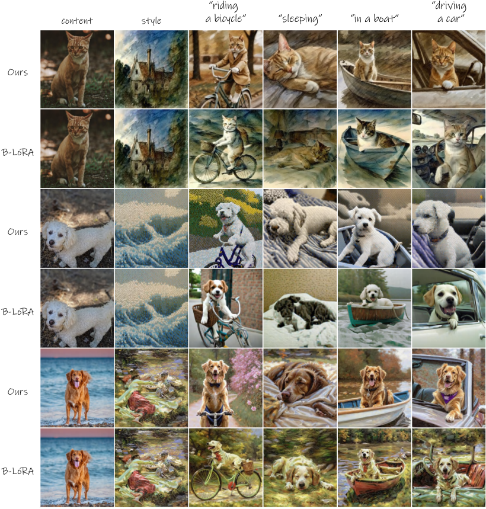

<figcaption>図18: プロンプト制御。新しいシーン・新しい動作・新しい物体のプロンプトを導入し、コンテンツを再文脈化しつつ様式的一貫性を維持する我々の手法の能力を検証する。</figcaption>
</figure>
